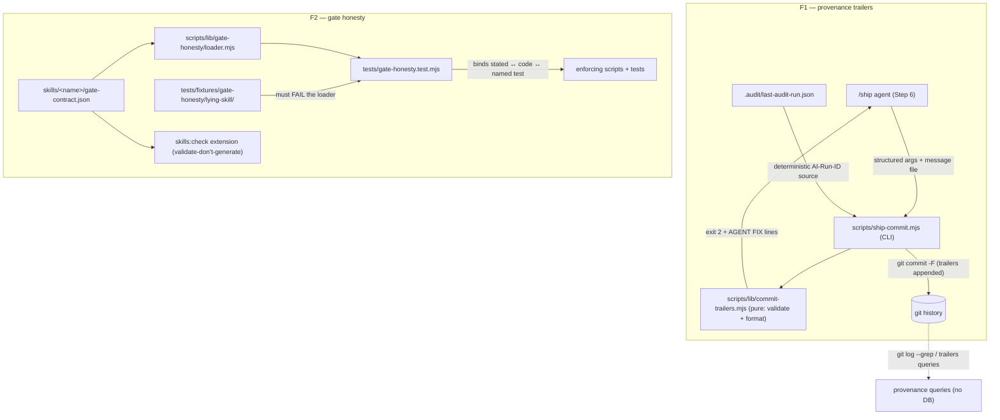

# Plan: Git-Native Provenance Trailers (F1) + Executable Gate-Honesty Suite (F2)

- **Date**: 2026-07-14
- **Status**: Complete — implemented via `/cycle --autonomous` (Cluster A: 5×GPT + 1 rebuttal, converged; Cluster B: 3×GPT + 3 rebuttals, converged; consolidated Gemini final gate: APPROVE round 1). Shipped 2026-07-14.
- **Author**: Claude + Louis
- **Scope**: backend
- **Target domain(s)**: `install`, `shared-lib`, `skills-content`, `tests`
- ⚠ **Cross-domain work** — touches >1 domain; boundary crossings are intentional
  (a commit-helper CLI, the skill-packaging seam, skill content, and tests are
  the four surfaces these features inherently span).
- **Origin**: breadth-evidence scan Opportunities 1+2
  ([docs/personal/ibm-fs-breadth-evidence-claude-engineering-skills.md](../personal/ibm-fs-breadth-evidence-claude-engineering-skills.md) §2),
  refined by multi-LLM debate (brainstorm sessions `1784021969233`, `1784022362869`)
  and user decisions of 2026-07-14.

> **Settled decisions (do not relitigate during implementation):**
> 1. Trailer prefix is `AI-*`. Four keys: `AI-Skill`, `AI-Models`, `AI-Gate`,
>    conditional `AI-Run-ID`. No `AI-Roles`, no `AI-Audit-Rounds`.
> 2. A deterministic helper script writes trailers and performs the commit;
>    the /ship agent supplies structured arguments and never formats trailers.
> 3. Unmigrated skills are reported as **uncontracted** in F2 output — no
>    decorative `legacy-manual` contract files.
> 4. F1 emission point is `/ship` only in v1; `/cycle` is an explicit v2 target
>    (sequencing, not omission — the autonomous path must not gate on an
>    unproven exit-2 retry loop).
> 5. The exit-2 stderr rejection format is pinned in this plan (§F1.5), not
>    improvised during implementation.
> 6. Lying fixture + targeted negative fixtures replace mutation testing in v1.
> 7. Gemini's auto-inject-rendered-table idea is **parked as v2**, contingent on
>    observed contract↔prose drift (it touches `skills:regenerate`, the repo's
>    highest-blast-radius seam).
> 8. Any further "what about…" during implementation goes to §V2, not the build.

---

## 1. Context Summary

- **Scope/stack**: backend · js-ts (Node ESM, `node --test`) · postgres store present but untouched by this plan.
- **Purpose split**: each improvement must stand alone as library value (priority 1)
  and produce dated, course-applied artefacts with a legible before/after commit
  shape (priority 2). Commit messages describe engineering intent only.

### Code Trace (reconnaissance evidence — what exists today)

F1 seam (commit composition):
- `/ship` Step 6.2 commit-message convention → [skills/ship/SKILL.md:417-429](../../skills/ship/SKILL.md#L417-L429);
  Step 6.3 runs a plain `git commit -m "<message>"` → [skills/ship/SKILL.md:431-439](../../skills/ship/SKILL.md#L431-L439).
  The message is composed by the LLM agent following markdown instructions — no
  deterministic step exists between "agent writes prose" and "git history".
- The only provenance join today is one-way and DB-resident:
  `audit_runs.commit_sha` (+ `branch`, `plan_id`), written by
  `runMultiPassCodeAudit` (AGENTS.md "Added columns"; store writers in
  [scripts/cross-skill.mjs](../../scripts/cross-skill.mjs)). Answering "which
  review gated this commit?" requires a live Supabase connection.
- A local, deterministic record of the latest audit run already exists:
  `.audit/last-audit-run.json` → `{runId, sid, round, ts}` (gitignored,
  written by the audit pipeline). This is the honest source for the
  conditional `AI-Run-ID` (§F1.3) — no agent-fabricated values.
- `/ship` is synced to consumer repos; any script the SKILL.md calls must be
  in the sync entry-point closure ([scripts/lib/sync-path-map.mjs](../../scripts/lib/sync-path-map.mjs)
  is the single source of truth; CLI smoke contract `--selfcheck-relocation`
  per AGENTS.md).

F2 seams (stated gates vs enforcement):
- **audit-code convergence threshold** — stated in prose at
  [skills/audit-code/SKILL.md:286-288](../../skills/audit-code/SKILL.md#L286-L288)
  (`HIGH == 0 && MEDIUM <= 2 && quickFix == 0`); enforced at
  [scripts/lib/audit/legacy-production-audit.mjs:2799-2801](../../scripts/lib/audit/legacy-production-audit.mjs#L2799-L2801)
  (`const converged = highCount === 0 && mediumCount <= 2 && quickFix === 0;`).
  **Two independent statements of the same rule in two files with no check
  binding them.** This is the live drift risk in the class F2 targets.
- **visual-audit --gate honesty** — the six past holes are FIXED and enforced
  in code: static `--gate` refusal ([scripts/visual-audit.mjs:93-99](../../scripts/visual-audit.mjs#L93-L99)),
  zero-states-captured → exit 2 ([:129-131](../../scripts/visual-audit.mjs#L129-L131)),
  `gateUnverifiedReason` → exit 2 ([:240-243](../../scripts/visual-audit.mjs#L240-L243)),
  partial capture matrix under a blocking gate → exit 2 ([:245-250](../../scripts/visual-audit.mjs#L245-L250)).
  Unit-tested via the pure helper in [tests/visual-drift.test.mjs](../../tests/visual-drift.test.mjs);
  CLI-spawn pattern exists in [tests/visual-theme-safety-cli.test.mjs](../../tests/visual-theme-safety-cli.test.mjs)
  (temp fixture, no browser).
- **tiered-shadow window honesty** — FIXED 2026-07-14 (`d0522e9`):
  `comparedRuns` now requires `tieredRunStatus === 'complete'`
  ([scripts/lib/audit/tiered-shadow-summary.mjs:59-130](../../scripts/lib/audit/tiered-shadow-summary.mjs#L59-L130));
  tested in [tests/tiered-shadow-summary.test.mjs](../../tests/tiered-shadow-summary.test.mjs).
- **skills:check pipeline** (the extension seam for contract validation):
  `npm run skills:check` = `check-skill-refs.mjs` + `sync-shared-audit-refs.mjs --check`
  + `regenerate-skill-copies.mjs --check` ([package.json:60](../../package.json#L60));
  the reference-table validator is [scripts/lib/skill-refs-parser.mjs::lintSkill](../../scripts/lib/skill-refs-parser.mjs).
- **Packaging constraint (discovered in recon; shapes §F2.3)**:
  [scripts/lib/skill-packaging.mjs:35-77](../../scripts/lib/skill-packaging.mjs#L35-L77)
  strict-rejects any non-markdown file inside `skills/<name>/`
  ("Skills are pure-markdown surfaces… Code belongs in scripts/"). A colocated
  `gate-contract.json` therefore requires a deliberate, documented amendment to
  this seam — it cannot be dropped in silently.

### Honest before-state (per the parallel-round lessons)

| Item | True before-state | Improvement claim |
|---|---|---|
| F1 | Provenance join exists but is **one-way and DB-only** (`audit_runs.commit_sha`); commit messages carry zero provenance; the learning store is documented as low-signal/fragmented and is a single point of failure for provenance | one-way DB join → **git-native, offline, human-readable provenance**, from adoption forward |
| F2 (bug class) | The class is **documented doctrine** (AGENTS.md "Pre-ship empirical verify", [docs/runbooks/pre-ship-empirical-verify.md](../runbooks/pre-ship-empirical-verify.md)); the three known instances are individually FIXED and individually tested | doctrine + per-incident fixes → **one executable suite that binds stated gate ↔ enforcing code ↔ named test**, fails on divergence, and reports its own non-coverage |
| F2 (convergence) | Threshold stated twice (SKILL.md prose + code) with **no binding check** | documented twice → **single contracted value, mechanically verified against both statements** |

### Neighbourhood considered

Architectural-memory consultation (2026-07-14, k=50): all candidates scored
`review` (<0.75) — greenfield is justified. Relevant-but-not-duplicative
symbols noted: `skill-refs-parser.mjs::lintSkill` (shared-lib — the skills:check
validator we extend, not replace), `sync-isolation-verify.mjs::runGates`
(shared-lib — gate-sequence *runner* for sync isolation, different domain),
`build-dashboard.mjs::gitProvenance` (dashboard — reads git state, doesn't
write). No `reuse`/`extend` obligations.

Security-incident consultation returned INC-001 (symlink path-classification
bypass). Applicability: the F2 loader reads `gate-contract.json` paths and
checks referenced files exist — all path handling must resolve within repoRoot
before reads (§F2.9 Security Considerations).

---

## 2. Proposed Architecture



Key design decisions and the principles driving them:

- **Deterministic helper between agent and history** (#12 validation at
  boundaries, #15 error handling): the LLM never formats trailers; it supplies
  values, the helper validates against a closed grammar and refuses (exit 2)
  on semantic ambiguity. Mirrors the repo's existing "LLM proposes,
  deterministic code disposes" pattern (`brainstorm-round.mjs` stdin-file, the
  jsonb write seam).
- **Pure logic / CLI split** (#3 modularity, #11 testability):
  `lib/commit-trailers.mjs` is pure (validate/format/parse — unit-testable
  without git); `ship-commit.mjs` owns process concerns (staged-check, message
  file, `git commit`, exit codes). Same split as `vcs.mjs`/consumers.
- **Contract as data, prose as explanation** (#5 single source of truth):
  `gate-contract.json` holds machine-checkable claims; SKILL.md prose must
  *reference* them (validate-don't-generate) rather than restate them
  independently. The convergence threshold moves to exactly one canonical
  value (§F2.5).
- **The suite must be able to fail** (#11, repo doctrine "audit your success
  paths"): the lying fixture is a checked-in skill whose contract declares an
  executable gate its script does not enforce; the suite asserts its own
  loader REJECTS it. A green run that can't fail is the bug class itself.
- **Graceful degradation everywhere** (#16): manual commits carry no trailers
  (absence = "not mechanically produced"); consumers on a stale sync fall back
  to plain `git commit` (SKILL.md instructs the fallback explicitly); a
  missing `gate-contract.json` never fails a skill — it's reported
  `uncontracted`.

### Right-sizing gate (new structure is introduced)

- **Band-aid extreme**: tell the /ship agent (markdown-only) to append
  trailers itself, and add three ad-hoc regression tests with no contract
  format. Root cause (unverifiable prose, unformatted history) resurfaces:
  malformed trailers pollute history; the next lens ships the same green-path
  hole with no place to declare its gates.
- **Over-engineered extreme**: a full gates DSL parsed from SKILL.md prose
  (NLP project), mutation-testing harness, trailers on every skill's commits,
  auto-generated SKILL.md sections from contracts, CI service integration.
  Multiple new artefacts no current requirement needs.
- **Chosen**: one 4-key trailer written by one small helper at one emission
  point; one JSON contract per *migrated* skill validated by the existing
  check pipeline; one test suite with one self-honesty fixture. Every piece
  serves a current, named requirement (the queries in §F1.2; the three
  documented divergence sites in §F2.2).

---

# Improvement F1 — Git-native provenance trailers

## F1.1 Trailer schema (exact)

Appended as a standard git trailer block (parseable by
`git interpret-trailers --parse` and `%(trailers:key=…)` format specifiers):

```text
AI-Skill: ship
AI-Models: claude,gemini,gpt
AI-Gate: passed
AI-Run-ID: ecae388d-c176-4182-9d27-0210b919b844
```

| Key | Grammar | Required | Query it earns its place by |
|---|---|---|---|
| `AI-Skill` | `^[a-z][a-z0-9-]*$`, must name a directory under `skills/` (deterministic enum) | yes | "show every commit produced through `/ship`" — `git log --grep='^AI-Skill: ship'` |
| `AI-Models` | comma-separated tokens `^[a-z][a-z0-9.-]*$`, deduplicated, **sorted alphabetically** (canonical order → grep-stable). **Semantics: a *declared* lineup** — the workflow's statement of which models participated, grammar-validated but not evidence-bound in v1 (no single invocation receipt exists across a ship session's model calls; receipt-derived binding is a §V2 item). Same honesty tier as a `Co-authored-by` line, and documented as such in `docs/reference/commit-provenance.md`. | yes | "which commits involved model X?" / "when did the lineup change?" — this repo demonstrably rotates models (GLM Stage-1, Azure profiles, the 2026-07-13 eval verdict); a declared lineup answers these queries even without cryptographic provenance |
| `AI-Gate` | enum `passed \| waived \| not-run` — **evidence-bound**: `passed`/`waived` are only writable when fresh audit evidence exists; `not-run` only when it doesn't (§F1.3b) | yes | "which commits were explicitly gated / shipped on a waiver / never gated?" — `not-run` distinguishes a docs-only ship from a gate bypass, and an unevidenced `passed` cannot exist |
| `AI-Run-ID` | `^[A-Za-z0-9-]{8,64}$` | **conditional** (§F1.3) | best-effort forensic join to `audit_runs` — labelled correlation hint, never proof; git stays self-contained if the DB dies |

Value grammar is deliberately *token-shaped, not closed-enum* for `AI-Models`
(models rotate; an enum would go stale — same failure mode the model-resolver
sentinels exist to prevent). `AI-Skill` IS a closed enum, derived at runtime
from the `skills/` directory listing (never hardcoded — #4 no hardcoding).

Excluded keys and why: `AI-Roles` (near-constant in this repo — redundancy
that drifts, zero query value beyond `AI-Models`); `AI-Audit-Rounds`
(telemetry masquerading as provenance; underspecified across pipelines);
DB/table IDs beyond the single opaque run id (leaks the store into git).

Compatibility note: this repo's commits deliberately carry **no**
`Co-Authored-By` trailer (standing user preference). `AI-*` trailers record
*process provenance*, not authorship — the two conventions coexist; the helper
never emits authorship trailers.

## F1.2 Query examples (the acceptance demo)

```bash
# 1. Every commit shipped through the skills workflow (vs manual)
git log --oneline --grep='^AI-Skill: ' --extended-regexp

# 2. All commits where a second model audited (GPT present in the lineup)
git log --oneline --grep='^AI-Models: .*gpt'

# 3. Gate verdict per commit, table form (empty = pre-convention or manual)
git log --format='%h %(trailers:key=AI-Gate,valueonly,separator=%x2C) %s' -20

# 4. "Which review gated this line?" — blame a line, then read its provenance
git blame -L 42,42 scripts/openai-audit.mjs --porcelain | head -1  # → <sha>
git show -s --format='%(trailers)' <sha>
```

## F1.3 Injection point + conditional Run-ID rule

`/ship` Step 6.2/6.3 is replaced by:

1. Agent writes the commit message (subject + body, unchanged convention) to
   `.claude/tmp/ship-commit-msg-<epoch>.txt` via the Write tool (the repo's
   existing stdin-file pattern — no shell interpolation, PowerShell-safe).
   **Message-file containment (Gemini G1)**: the helper `path.resolve`s +
   realpath-resolves `--message-file` and refuses (exit 2) any path that
   escapes repoRoot OR classifies as sensitive under the canonical
   [sensitive-paths.mjs](../../scripts/lib/sensitive-paths.mjs)
   `resolveAndClassify` (fail-closed on resolution errors) — a
   traversal/absolute path or an in-repo sensitive file (`.env`) can never be
   read into a commit message that `/ship` then pushes. This reuses the
   existing canonical classifier rather than a new check (INC-001 family).
   **Input immutability (Gemini G2)**: the agent's message file is NEVER
   mutated — the helper composes message + trailer block into its own
   temporary file (same directory, helper-owned name) and passes THAT to
   `git commit -F`; a hook rejection or any downstream failure leaves the
   original file clean, so a retry never trips the reserved-trailer
   rejection on the helper's own appended trailers.
2. Agent invokes:
   ```bash
   node scripts/ship-commit.mjs \
     --message-file .claude/tmp/ship-commit-msg-<epoch>.txt \
     --skill ship \
     --models claude,gpt,gemini \
     --gate passed
   ```
3. The helper: normalizes + validates the message (§F1.3a) → validates all
   values → appends the trailer block → runs `git commit -F <final-message>`
   → exit 0. It **refuses** (exit 2, no commit attempted) on any semantic
   violation per the failure taxonomy in §F1.4.

### F1.3a Message normalization + reserved-trailer policy

The agent's message file is parsed with git-trailer semantics before anything
is appended (pure parsing in `commit-trailers.mjs`, proven equivalent by a
parse-back test through `git interpret-trailers --parse`):

- **Reserved namespace**: any agent-supplied `AI-*` trailer in the message is
  REJECTED (exit 2, `AGENT FIX`) — never merged, never deduplicated. The
  helper is the only writer of `AI-*` keys.
- **Unrelated trailers** (e.g. `Fixes:`) are preserved verbatim; the canonical
  `AI-*` block is appended after them within the same trailer block.
- **Rendering invariants**: exactly one blank line separates body from the
  trailer block; exactly one canonical `AI-*` block; final newline ensured;
  CRLF normalized to LF.
- **Tests pinned for**: pre-existing `AI-*` trailer (reject), duplicate
  unrelated trailers, unrelated trailers preserved, message without final
  newline, multiline body containing `key: value`-shaped prose lines (must
  NOT be misparsed as trailers — git's own "trailer block only at end" rule),
  and a parse-back through `git interpret-trailers --parse` asserting every
  emitted key/value round-trips.

### F1.3b Evidence-bound `AI-Gate` + conditional `AI-Run-ID` (deterministic, no agent fabrication)

The helper itself reads `.audit/last-audit-run.json`; **freshness** = the
file's `ts` postdates the current `HEAD` commit's committer timestamp (an
audit ran since the last commit). One rule binds both trailers:

> **SUPERSEDED IN PART (2026-09-04)** — the grammar gained a fourth value,
> `converged`, for the audited-then-remediated ship. The table below is
> otherwise unchanged; `converged` sits beside `passed` as the `!==` half of the
> same tree comparison, clears the same store bar, and requires `fresh` exactly
> as `passed`/`waived` do. Current contract:
> [`gate-taxonomy-remediated-ships.md`](gate-taxonomy-remediated-ships.md).

| Evidence state | `AI-Run-ID` | Legal `--gate` values |
|---|---|---|
| fresh | injected automatically (`runId` from the file) | `passed` \| `converged` \| `waived` (`not-run` rejected) |
| absent / stale | omitted | `not-run` only (`passed`/`waived` rejected — the helper refuses an unevidenced "passed") |
| fresh + `--no-run-id` override | omitted (override echoed to stderr) | `not-run` only (the override declares the audit unrelated, so no gate claim may ride on it) |
| file exists but malformed JSON | — | exit 1 (operational) unless `--no-run-id` explicitly opts out of reading it |

Edge cases (Gemini final-review round 2, captured): **unborn HEAD** (fresh
repo / first commit) — HEAD timestamp resolution failure is caught and
`T_head` defaults to `0`, so existing evidence reads as fresh rather than
crashing `/ship` on a repo's first commit; the git invocation is
**`git commit -F <helper-temp-file> --cleanup=whitespace`** — the default
`strip` cleanup silently deletes `#`-prefixed lines, and LLM-authored bodies
legitimately use markdown headers (a silently-truncated commit message is
exactly the class of quiet data loss this plan exists to prevent). Both are
pinned by rows in the CLI test matrix.

The agent never types a run id, and can never mint a `passed` out of thin
air. **Verdict verification (added at Cluster A code-audit — R1 H3/H5
sustained)**: freshness alone proves an audit *ran*, not that it *passed*
(the pointer file carries no verdict and is agent-writable), so `passed`
additionally requires the run's convergence verified against the cloud
store's `audit_runs` row (`getAuditRunConvergence` — the existing dashboard
seam). Fail-closed: cloud off, run not found, query failure, or
non-convergence all refuse `passed` and route the agent to `waived` (the
declared, unverified disposition; `AI-Run-ID` keeps it forensically
resolvable). **Remaining v1 limit**: `waived` is a declaration (no waiver
record exists to verify); the durable content-bound ship-evidence receipt
(repo identity + tree/diff digest + waiver record) stays the V2 hardening.

### F1.3c Installation-layout resolution (source vs consumer)

The helper never assumes a relative layout. Resolution rules:

- **repoRoot** = `git rev-parse --show-toplevel` of the CWD (the repo being
  shipped), never the helper's own location.
- **Own layout**: derived from `import.meta.url` — source repo
  (`scripts/ship-commit.mjs`) vs consumer (`scripts/.claude-skills/ship-commit.mjs`),
  per the [sync-path-map.mjs](../../scripts/lib/sync-path-map.mjs) contract
  (the single source of truth; no hand-computed consumer paths).
- **Skill-name enum source**: source repo → `skills/` directory listing;
  consumer → `.claude/skills/` directory listing (the synced surface that
  exists in every consumer).
- **Evidence file**: `<repoRoot>/.audit/last-audit-run.json` (CWD-repo-rooted
  — correct in consumers, where the audit also runs at their root).
- SKILL.md states both invocation paths explicitly; the synced copy's path
  rewriting follows the existing sync-rewriter contract
  ([tests/sync-rewriter.test.mjs](../../tests/sync-rewriter.test.mjs) idiom).
- `--selfcheck-relocation` validates all of the above resolutions (layout,
  enum source present, git reachable) **without any git side effects**, per
  the CLI smoke contract; the hermetic-env variant follows the existing
  [tests/relocation-selfcheck-smoke.test.mjs](../../tests/relocation-selfcheck-smoke.test.mjs)
  idiom (deliberately NOT a full assembled-consumer worktree integration test
  — priced out of v1; the smoke idiom is the repo's established guard for
  exactly this seam).

**Degradation contract:**
- Manual commit / other agents / pre-adoption history → no trailers. Queries
  distinguish eras by the adoption boundary, recorded two ways: the docs
  commit that lands this convention (referenced in `docs/reference/commit-provenance.md`)
  and an annotated tag `provenance-v1` on that commit. Post-adoption absence
  reads as "not mechanically produced" — deliberately NOT distinguishable
  further (per debate consensus: don't pretend absence encodes more than it does).
- Consumer repo with a stale sync (helper not yet hydrated): SKILL.md Step 6.3
  instructs — if `scripts/.claude-skills/ship-commit.mjs` (consumer path) is
  missing, fall back to plain `git commit -m` and print one line noting
  trailers were skipped (re-sync to enable). No workflow breaks.

## F1.4 Exit-code contract — exhaustive failure taxonomy

**This table is the single source of truth** for the CLI tests
(`tests/ship-commit-cli.test.mjs` asserts every row) and for the SKILL.md
invocation guidance (which embeds the retry rule, not a paraphrase).
Principle: exit 2 = *agent-correctable input* (retry after fixing flags/message);
exit 1 = *environment/repository operational* (agent reports, does not retry
blindly). A commit is attempted **only** on the all-valid path.

| # | Failure class | Exit | stderr family | Commit attempted? | Agent may retry? |
|---|---|---|---|---|---|
| 0 | all valid | 0 | (summary line) | yes | — |
| 1 | unknown/malformed flag | 2 | `AGENT FIX: <flag>: …` | no | yes, after fix |
| 2 | `--skill` not in enum | 2 | `AGENT FIX: --skill: …` | no | yes |
| 3 | `--models` grammar violation | 2 | `AGENT FIX: --models: …` | no | yes |
| 4 | `--gate` not in enum | 2 | `AGENT FIX: --gate: …` | no | yes |
| 5 | `--gate` inconsistent with evidence state (§F1.3b) | 2 | `AGENT FIX: gate-evidence: …` | no | yes |
| 6 | message file missing | 2 | `AGENT FIX: --message-file: … (ENOENT)` | no | yes |
| 6b | message file escapes repoRoot OR classifies sensitive (`resolveAndClassify`, fail-closed) | 2 | `AGENT FIX: --message-file: must resolve inside the repo and not be a sensitive path; …` | no | yes — write to `.claude/tmp/` |
| 7 | message empty / whitespace-only | 2 | `AGENT FIX: --message-file: …` | no | yes |
| 8 | message contains reserved `AI-*` trailer (§F1.3a) | 2 | `AGENT FIX: reserved-trailer: …` | no | yes |
| 9 | message file unreadable (EACCES/EISDIR) | 1 | `ship-commit: message file unreadable: <errno>` | no | no — report |
| 10 | `.audit/last-audit-run.json` malformed JSON (without `--no-run-id`) | 1 | `ship-commit: audit evidence unparseable: <path>` | no | no — report or pass `--no-run-id` |
| 11 | nothing staged | 1 | `ship-commit: nothing staged` | no | no — stage first |
| 12 | not a git repo / git identity unset | 1 | `ship-commit: git: <underlying stderr>` | no | no — report |
| 13 | commit hook rejection | 1 | `ship-commit: git commit failed:` + git's own stderr passthrough | attempted, failed | no — report |
| 14 | git spawn failure (ENOENT git binary) | 1 | `ship-commit: git spawn failed` | no | no — report |

## F1.5 Pinned rejection format (stderr, exit 2)

One line per violation, all violations reported in one run (agents fix in one
retry, not N):

```text
AGENT FIX: <field>: expected <grammar>; got "<value>". Example: <valid-example>
```

One example per rejection class (frozen — this is an API for our own agents):

```text
AGENT FIX: --skill: expected one of [audit-code|audit-loop|...|ship] (skills/ directory names); got "shipping". Example: --skill ship
AGENT FIX: --models: expected comma-separated tokens matching ^[a-z][a-z0-9.-]*$; got "claude gpt". Example: --models claude,gpt
AGENT FIX: --gate: expected one of passed|waived|not-run; got "green". Example: --gate passed
AGENT FIX: --message-file: expected a readable non-empty file; got ".claude/tmp/missing.txt" (ENOENT). Example: --message-file .claude/tmp/ship-commit-msg-1784022000000.txt
AGENT FIX: reserved-trailer: expected no AI-* trailers in the message (the helper is the only writer); got "AI-Skill: ship" at message line 7. Example: remove the line and pass --skill ship
AGENT FIX: gate-evidence: an audit ran after HEAD (.audit/last-audit-run.json ts 2026-07-14T09:41:00Z) but --gate is "not-run"; pass --gate passed|waived, or --no-run-id --gate not-run if that audit was unrelated. Example: --gate passed
AGENT FIX: gate-evidence: no fresh audit evidence exists but --gate is "passed"; only not-run is legal without evidence. Example: --gate not-run
```

Every `AGENT FIX` line maps 1:1 to a row of the §F1.4 taxonomy; the byte
format of each is pinned by `tests/commit-trailers.test.mjs`.

Normalization (silent, logged at debug only): whitespace trimming, model-list
dedup + sort, lowercase of enum inputs. Never silently invented values, never
silently dropped fields (per debate: canonicalize formatting, refuse semantic
ambiguity).

## F1.6 File-by-file change list

| File | Action | Content |
|---|---|---|
| `scripts/lib/commit-trailers.mjs` | new | pure: `validateTrailerInput(input, {skillNames})` → `{ok, errors:[{field,expected,got,example}]}`; `parseMessageTrailers(text)` + reserved-`AI-*` rejection (§F1.3a); `formatTrailerBlock(values)`; `renderAgentFixLines(errors)`; `resolveEvidence({auditRunPath, headCommitTs})` (§F1.3b table); message-file containment check delegating to `sensitive-paths.mjs::resolveAndClassify` (G1) |
| `scripts/ship-commit.mjs` | new | CLI: arg parse, `--selfcheck-relocation` handler validating layout resolution without git side effects (§F1.3c), layout resolver (source vs consumer via own-location + repoRoot), skill-enum per layout, staged-set check, `git commit -F`, the full §F1.4 taxonomy |
| `tests/commit-trailers.test.mjs` | new | unit: every grammar rule; every rejection-class string (byte-asserts the pinned `AGENT FIX` formats); evidence table rows (fresh/stale/absent/override/malformed); message normalization cases (§F1.3a list); model canonicalisation |
| `tests/ship-commit-cli.test.mjs` | new | spawn against a temp git repo (existing `gitInit` test idiom): asserts **every row of the §F1.4 taxonomy** (exit code + stderr family + commit-attempted), plus a parse-back through `git interpret-trailers --parse` on the happy path |
| `skills/ship/SKILL.md` | modify | Step 6.2/6.3 rewritten to the helper invocation (BOTH layout paths stated) + consumer fallback; §"Reminders" line |
| `.claude/skills/ship/SKILL.md` | regenerated | `npm run skills:regenerate` (never hand-edited) |
| `scripts/sync-to-repos.mjs` + `scripts/lib/sync-inventory.mjs` | modify | add `scripts/ship-commit.mjs` to BOTH lock-step `CORE_ENTRY` lists (the actual entry-point seam — `sync-path-map.mjs`'s generic `scripts/*` rule needs no change; transitive `lib/commit-trailers.mjs` closure auto-resolved) |
| `scripts/lib/sync-isolation-verify.mjs` | modify | add `ship-commit.mjs` to `CLI_SMOKE_SET` — the single source both relocation tests iterate, so they inherit the new entry with no test-file edit (R2-H3 mechanism, discovered at implementation) |
| `tests/sync-path-map.test.mjs` | modify | assert the new entry point + its transitive closure (`commit-trailers.mjs`) map to the consumer destination + round-trip (R2-H3) |
| `tests/sync-rewriter.test.mjs` | modify | assert the SKILL.md invocation line rewrites to `scripts/.claude-skills/ship-commit.mjs` in the consumer copy (R2-H3) |
| `AGENTS.md` | modify | short "Commit provenance trailers" stub (what/when/pointer — ≤15 lines, respecting the 1200-line gate) |
| `docs/reference/commit-provenance.md` | new | full convention: schema, grammar, adoption boundary, query cookbook (§F1.2), degradation semantics |
| `package.json` | modify | (only if a convenience alias is wanted — default: none; the skill calls `node scripts/ship-commit.mjs` directly) |

Nothing else touched.

## F1.7 Commit sequence (draft messages)

1. `docs(plan): reconnaissance — provenance + gate-honesty before-state inventory`
   — this plan document (the recon inventory with exact refs IS §1). No
   behaviour changes.
2. `feat(ship): deterministic commit helper appends AI-* provenance trailers`
   — helper lib + CLI + both test files + sync-path-map entry **+ the three
   sync-contract test updates (path-map, rewriter, relocation smoke — R2-H3)
   in the same commit** (Tier-3 seam rule: sync/relocation changes land with
   their tests). Standalone: nothing calls it yet; tests prove the contract.
3. `feat(ship): route /ship commits through ship-commit.mjs; document the convention`
   — SKILL.md Step 6 edit + regenerated copy + AGENTS.md stub +
   `docs/reference/commit-provenance.md` + `provenance-v1` tag on this commit.
   **From the next `/ship` onward, history carries trailers — commit 3 is the
   adoption boundary; the F2 commits below become the first trailer-carrying
   evidence.**

## F1.8 Risk & rollback

- **Risk: /ship breaks at the commit step** (worst case for a workflow tool).
  Mitigations: helper is additive until commit 3; SKILL.md keeps an explicit
  fallback branch ("helper missing/errored twice → plain `git commit -m`,
  note in transcript"); exit-2 messages are agent-actionable by design.
- **Risk: consumer repos with stale syncs.** The fallback branch covers them;
  `npm run sync` hydrates the helper (auto-resolved transitive deps).
- **Risk: trailer block malforms some tool's log parsing.** Trailers are the
  native git mechanism; the block is generated by `git interpret-trailers`-
  compatible formatting and covered by a parse-back test.
- **Rollback**: revert commit 3 (SKILL.md/docs) — history keeps any trailers
  already written (harmless inert lines); helper + tests can stay or be
  reverted independently (commit 2). No schema, no DB, no runtime path outside
  /ship's commit step.

## F1.9 Verification (exact commands)

```bash
node --test tests/commit-trailers.test.mjs tests/ship-commit-cli.test.mjs   # all pass
node --test tests/sync-path-map.test.mjs tests/sync-rewriter.test.mjs \
  tests/relocation-guard.test.mjs tests/relocation-selfcheck-smoke.test.mjs  # sync contract green (R2-H3)
node scripts/ship-commit.mjs --selfcheck-relocation                          # prints OK
node scripts/ship-commit.mjs --message-file /nonexistent --skill ship \
  --models claude --gate passed; echo "exit=$?"                              # AGENT FIX line + exit=2
npm run skills:check                                                         # regenerated ship copy is fresh
# after the first real /ship post-adoption:
git log -1 --format='%(trailers)'                                            # shows the 3-4 AI-* trailers
git log --oneline --grep='^AI-Skill: ship'                                   # returns that commit
```

## F1.10 Effort check

Estimate 2–3 h. Recon + round-1 audit priced items the estimate didn't
contain: consumer-sync wiring incl. the layout resolver (§F1.3c) ≈ 0.75–1 h;
message normalization + reserved-trailer policy with its test matrix (§F1.3a)
≈ 0.5 h; the CLI-spawn taxonomy test ≈ 0.5–0.75 h. Honest revision:
**3–4 h — exceeds the original band by ~1 h**, driven by exactly the
discovery-and-integration line the parallel-round lessons predicted. The cut
if the sitting breaks: the CLI-spawn taxonomy test lands with the F2 sitting
(the pure-lib tests carry the grammar + normalization contract meanwhile) —
adoption (commit 3) does NOT ship before the taxonomy test exists.

---

# Improvement F2 — Executable gate-honesty suite

## F2.1 Bug-class inventory (the precise before-state)

The class: *a skill DESCRIBES a gate/check/convergence rule that its scripts
don't enforce, or enforce differently.* Documented instances in this repo:

| # | Instance | Where stated | Where (now) enforced | History |
|---|---|---|---|---|
| 1 | `visual-audit --gate` could return green without checking anything — **six** distinct holes (static-mode gate pass, empty capture reading clean, unverifiable surfaces skipped silently, partial device×theme matrix passing, no-merge-base diff gating nothing, empty-baseline adoption) | visual-audit SKILL.md gate semantics; doctrine at AGENTS.md "Pre-ship empirical verify" | [scripts/visual-audit.mjs:93-99, 129-131, 240-250](../../scripts/visual-audit.mjs#L93-L99) + pure `gateUnverifiedReason` ([scripts/lib/visual/drift.mjs](../../scripts/lib/visual/drift.mjs), tested in [tests/visual-drift.test.mjs](../../tests/visual-drift.test.mjs)) | found in the 2026-06 shakedown; "none caught by static review" (AGENTS.md; breadth dossier C1-A) |
| 2 | Tiered-shadow validation window read **"met"** while 100 % of runs were silent `fallback_legacy` | AGENTS.md "Tiered-Recall Audit Pipeline"; plan doc | [scripts/lib/audit/tiered-shadow-summary.mjs:59-130](../../scripts/lib/audit/tiered-shadow-summary.mjs#L59-L130) (`comparedRuns` requires `complete`), tested in [tests/tiered-shadow-summary.test.mjs](../../tests/tiered-shadow-summary.test.mjs) | incident 2026-07-14, fixed `d0522e9`; second time this class hid (memory note) |
| 3 | audit-code convergence threshold `HIGH == 0 && MEDIUM <= 2 && quickFix == 0` stated in prose AND coded — **no binding between the two statements** | [skills/audit-code/SKILL.md:286-288](../../skills/audit-code/SKILL.md#L286-L288) | [scripts/lib/audit/legacy-production-audit.mjs:2799-2801](../../scripts/lib/audit/legacy-production-audit.mjs#L2799-L2801) | never diverged *yet* — this is the standing exposure, not a past incident |

Honesty about the before-state: instances 1–2 are already fixed and
individually regression-tested. What does **not** exist is (a) any executable
binding between a SKILL.md's *stated* gate and the code/tests that enforce it
(instance 3 is live exposure), (b) a single suite that fails when the next
lens ships a green path that checked nothing, and (c) any output that says
what is NOT covered. The improvement claim is "documented + per-incident
fixes → one enforced, self-reporting invariant", not "tribal knowledge →
documented".

## F2.2 Gate taxonomy (every stated gate, classified)

**Mechanically checkable — contracted in v1** (the three documented divergence sites):

| Gate | Mechanical check |
|---|---|
| audit-code convergence threshold | contract declares `{high:0, medium:2, quickFix:0}`; a pure `evaluateConvergence(counts)` (extracted, §F2.5) is unit-asserted against the contract values; the SKILL.md line is asserted to contain the contract's canonical expression string (byte containment, not NLP) |
| tiered-shadow window honesty | suite feeds `summarize()`/`windowProgress()` a fixture mixing `complete` + `fallback_legacy` rows; asserts `comparedRuns` excludes fallbacks and `met` stays false — the executable form of the `d0522e9` fix |
| visual-audit `--gate` honesty family | (i) `gateUnverifiedReason` truth-table asserted against the contract's enumerated unverified-reasons; (ii) CLI spawn (temp fixture, no browser — existing idiom): static `--gate` → exit 2; (iii) contract binds each stated exit-2 path to its named test |

**Mechanically checkable — deliberately NOT contracted in v1** (reported
`uncontracted`; candidates for v2): ux-lock `--strict-selectors` exit 6;
nav-audit `--gate` drift-only + capture-honesty degradation; audit-code
max-6-rounds / 2-stable-rounds loop bounds; `/ship`'s P0-block and
unlocked-fix warnings (agent-followed, no script seam today).

**Document-only (judgement — listed visibly, never fake-checked)**:
audit-plan's rigor-pressure stop ("findings decay from design flaws to
polish"); persona-test severity assignment; the mechanical-vs-architectural
finding classification (the *reset rule given the label* is mechanical, but
the label itself is LLM judgement); Gemini CONCERNS deliberation quality.

**Not-worth-automating (brittle; named so they aren't silently missing)**:
`/ship` staging discipline (`git add -A` ban — enforcement would mean
intercepting the agent's shell; review + AGENTS.md carry it); SKILL.md
step-ordering claims (would require instrumenting agent transcripts).

## F2.3 Discovery mechanism + contract location

**No prose parsing.** Discovery = enumerate `skills/*/gate-contract.json`.
A skill without the file is `uncontracted` (reported, never failed).

**Location decision** (the recon-critical seam): colocated
`skills/<name>/gate-contract.json`, with a deliberate amendment to
[skill-packaging.mjs](../../scripts/lib/skill-packaging.mjs):

- New exported const `SKILL_LOCAL_FILES = ['gate-contract.json']` —
  **recognized, tolerated, and excluded from packaging**: not copied to
  `.claude/skills/**`, not synced to consumers, not counted `unexpected`.
  (The contract is repo-internal test metadata, not part of the skill surface
  agents consume; keeping it out of the generated copies protects the Copilot
  discovery surface and the SKILL.md ≤3K budget by construction.)
- **The classification lives INSIDE `enumerateSkillFiles` itself** (M2
  resolution) — recon confirms all four packaging consumers
  (`build-manifest.mjs`, `regenerate-skill-copies.mjs`, `sync-to-repos.mjs`,
  `check-sync.mjs`) call this one function
  ([skill-packaging.mjs:1-9](../../scripts/lib/skill-packaging.mjs#L1-L9)
  docblock), so a single seam change is inherited everywhere; no consumer
  gets its own allowlist. Artifact-contract tests pin the lifecycle:
  (a) packaged output byte-identical for contract-less skills; (b) with a
  contract present, the file appears in NEITHER the regenerated copy NOR the
  build manifest NOR the sync inventory; (c) any *other* non-md file is still
  rejected; (d) close-out runs `npm run sync:dry` and asserts no drift line
  mentions `gate-contract.json`.
- The module docblock's "skills are pure-markdown surfaces" is amended to
  "…packaged surfaces are pure-markdown; a colocated `gate-contract.json` is
  repo-local gate metadata, never packaged."
- Alternative considered and rejected: central `tests/gate-contracts/<name>.json`
  keeps the packaging seam untouched but loses colocation — the debate's drift
  argument (a contract nobody sees when editing the skill) decided this; the
  packaging amendment is ~10 lines + one test update and is the smaller total
  cost. **DECIDED 2026-07-14 (Decision record #1): amend the invariant,
  tolerated-not-packaged.**

**Contract schema** (validated with zod 4, already a dependency; schema lives
in code as the single source of truth):

```json
{
  "version": 1,
  "skill": "audit-code",
  "gates": [
    {
      "id": "convergence-threshold",
      "kind": "executable",
      "stated": "Quality threshold: HIGH == 0 && MEDIUM <= 2 && quickFix == 0",
      "statedIn": "skills/audit-code/SKILL.md",
      "oracle": "convergence-threshold",
      "implementation": "scripts/lib/audit/convergence.mjs",
      "tests": ["tests/gate-honesty.test.mjs", "tests/visual-drift.test.mjs"],
      "params": { "high": 0, "medium": 2, "quickFix": 0 }
    },
    {
      "id": "rigor-pressure-stop",
      "kind": "document-only",
      "reason": "'findings decay from design flaws to polish' is a judgement call; no mechanical oracle exists"
    }
  ]
}
```

**Oracle registry (the H5 design — the binding lives in the contract, not in
test code).** `scripts/lib/gate-honesty/oracles.mjs` exports a registry
mapping oracle IDs to deterministic adapter functions. **Size bound (Gemini
over-engineering flag, recorded)**: the registry is a plain `Map` + four
adapter functions in one file — no plugin loading, no config indirection, no
framework. Gemini's final review flagged that with ~6 gates each adapter is
custom anyway; the registry survives right-sizing on one specific ground: the
loader must be able to *reject an unknown `oracle` id as a divergence* (the
fake-check guard), which free-form `node:test` blocks cannot express. If the
registry ever grows helper layers beyond "Map + functions", that's the
over-engineering cliff — stop. Each adapter imports
or spawns the **real production seam**, feeds it the contract's
`params`/`fixtures`, and returns a normalized `{ok, stated, found}` result.
v1 registry (closed set — an unknown `oracle` id in a contract is itself a
divergence):

| Oracle ID | Adapter behaviour |
|---|---|
| `convergence-threshold` | imports `evaluateConvergence` + `CONVERGENCE_THRESHOLDS`; asserts the exported constants equal `params` and the function's truth table matches them on boundary inputs (0/2/0, 1/2/0, 0/3/0, 0/2/1) |
| `tiered-shadow-window` | imports `summarize`/`windowProgress`; feeds the declared fixture (mixed `complete` + `fallback_legacy` rows); asserts `comparedRuns` excludes fallbacks and `met` stays false — the executable form of `d0522e9` |
| `visual-gate-unverified` | imports `gateUnverifiedReason`; asserts its truth table against the contract's enumerated unverified-reasons |
| `cli-exit` | runs a **closed scenario ID** (`visual-static-gate-refusal` \| `visual-dead-url-empty-capture` in v1) — each scenario is a registry-owned recipe (CLI, args, fixture dir, expected exit + stderr pattern). Contracts name a scenario, never an arbitrary command — execution stays bounded and reproducible (R3-M1) |

**Schema shape (R3-M1)**: the executable-gate schema is a **strict
discriminated union keyed by `oracle`** — each variant declares its required
fields (`params` shape for threshold oracles, `fixture` shape for
tiered-shadow, `scenario` enum for cli-exit), closed enums where applicable,
and rejects extraneous fields. Schema fixtures prove a missing/mismatched
oracle config is rejected **before** any adapter runs.

**Proof-level honesty (R3-M2)**: each executable gate carries
`proof: "process" | "unit-seam"`, printed in the report. `process` = the
oracle reaches the real CLI exit decision (static refusal, dead-URL empty
capture). `unit-seam` = the oracle asserts the production-owned decision
function the CLI calls, but the branch's process-level wiring is not
deterministically forceable without a browser + a contrived partial capture
(v1 case: `partial-matrix-refusal`). The suite never presents a unit-seam
proof as process enforcement — the report says which is which, per gate.

The suite (`tests/gate-honesty.test.mjs`) is a thin dispatcher: load contracts
→ run each gate's oracle → report. Adding a gate never adds suite code unless
it needs a genuinely new oracle type or cli-exit scenario.

Per-gate checks for `kind: "executable"`:
1. `implementation` and every `tests[]` entry exist (paths repoRoot-contained
   + realpath-resolved before read — INC-001 rule); each `tests[]` file's
   text references the gate `id` (the verification record is greppable both
   ways — a contract cannot claim a test that doesn't know about it).
2. `oracle` names a registered adapter (unknown id = divergence, listed with
   the `[skill][gate]` format).
3. `stated` string appears verbatim in the file named by `statedIn` —
   **`statedIn` is a validated, repoRoot-contained source path**, normally
   the skill's own `skills/<name>/SKILL.md` but permitted to reference an
   approved cross-cutting authority (`AGENTS.md`) when that is genuinely
   where the rule is stated (the tiered-shadow window is the v1 case: its
   authoritative statement lives in AGENTS.md's "Tiered-Recall Audit
   Pipeline" section, and the contract must not pretend otherwise). The
   approved-source list is closed in the schema: **exactly**
   `skills/<contract.skill>/SKILL.md` or exactly `AGENTS.md` — a *different*
   skill's SKILL.md, arbitrary docs paths, traversal, and symlink escapes
   all fail. **One shared `validateGateContract` + source-resolution policy**
   (in `schema.mjs`/`loader.mjs`) is consumed by the loader, the test suite,
   and `check-gate-contracts.mjs` — three callers, one policy, no drift
   (R3-H2). Negative fixtures cover: the permitted AGENTS.md case, the
   rejected other-skill SKILL.md, a traversal path, and a symlink escape
   (INC-001 family).
4. The oracle runs and returns a **tri-state**: `ok`, `divergent`
   (reported in the §F2.6 `[skill][gate] stated…; found…` format), or
   **`env-skipped`** (the oracle's environment prerequisite is missing —
   e.g. no Chromium for a `cli-exit` browser path). `env-skipped` is printed
   in the NOT-CHECKED section with the missing prerequisite named — the
   suite practices the same capture honesty it enforces: an unrunnable check
   never reads as green.

**Proving the production decision seam (R2-H2).** An oracle must exercise the
seam production actually uses, not a lookalike:
- `convergence-threshold` / `tiered-shadow-window` import the exact functions
  the production call sites import (`evaluateConvergence` wired into
  `legacy-production-audit.mjs`; `summarize`/`windowProgress` wired into the
  report CLI + dashboard) — same-module identity, not copies.
- `visual-gate-unverified` asserts the truth table of `gateUnverifiedReason`,
  which IS the production-owned gate-outcome function (the CLI calls it at
  [scripts/visual-audit.mjs:240](../../scripts/visual-audit.mjs#L240)); the
  **wiring** from its verdict to `exit 2` is proven by `cli-exit` cases: the
  no-browser static `--gate` refusal (deterministic everywhere) and a
  dead-URL `--verify` empty-capture run (exit 2, `env-skipped` where
  Chromium is absent).

For `kind: "document-only"`: NO check runs; the gate is printed in the
not-checked section with its `reason`. A `document-only` gate carrying
`oracle`/`implementation`/`params` fails schema validation (fake-check guard).

## F2.4 Self-honesty: the lying fixture (+ negative fixtures)

`tests/fixtures/gate-honesty/lying-skill/` — a fake skill directory containing
a `SKILL.md` (states a gate), a `gate-contract.json` (declares it
`executable`, pointing at a fixture script), and the fixture script that
**always exits 0** (enforces nothing) with a `tests` entry that doesn't
reference the gate id. The suite runs its own loader against the fixture root
and asserts the loader reports ≥3 specific divergences. If the loader ever
passes the liar, `tests/gate-honesty.test.mjs` fails — the suite proves it can
fail before it is allowed to pass.

Targeted negative fixtures (cheap, per failure mode — **scope-closed**, per
the feedback this is the LAST addition): contract referencing a nonexistent
implementation; `stated` string absent from SKILL.md; `document-only` gate
carrying `params`; tiered-shadow fixture rows all-`fallback_legacy` reading
not-met.

## F2.5 The one enabling refactor (scoped tightly) + authority direction

`evaluateConvergence({high, medium, quickFix})` is extracted from the inline
expression at `legacy-production-audit.mjs:2799-2801` into
`scripts/lib/audit/convergence.mjs` (pure, ~15 lines, exported
`CONVERGENCE_THRESHOLDS`); the call site imports it. No other audit-pipeline
code moves (scope fence: NOT a refactor of legacy-production-audit.mjs).

**One canonical value, one direction of authority (M1 resolution).** The
runtime canonical definition is `CONVERGENCE_THRESHOLDS` in `convergence.mjs`
(production imports it). The contract's `params` are a **deliberate pinned
golden copy** — the oracle asserts code == contract so a silent code change
fails the suite, exactly like a golden test; the SKILL.md `stated` string is
asserted by containment. Authority chain when they disagree: a *deliberate*
threshold change edits code first, then the failing suite forces the contract
pin and the prose to follow consciously. Three copies exist by design; two of
them are tripwires, not sources.

## F2.6 Output format (failure + passing runs)

Failure (test assertion message, one per divergence):

```text
[audit-code][convergence-threshold] stated "HIGH == 0 && MEDIUM <= 2 && quickFix == 0" (SKILL.md:288); found evaluateConvergence medium<=3 (scripts/lib/audit/convergence.mjs) — params mismatch
[lying-skill][always-green] stated "refuses empty capture"; found implementation exits 0 on empty fixture — no enforcement
```

Passing run (printed via `node:test` diagnostics so it shows in `npm test`
output; also standalone). **All counts and lists are derived at runtime from
the loaded contracts and the `skills/` listing — no literal counts anywhere
in suite code** (M3):

```text
gate-honesty: CHECKED <derived-N> executable gate(s) across <derived-M> contracted skill(s):
  audit-code: convergence-threshold, tiered-shadow-window-honesty
  visual-audit: static-gate-refusal, empty-capture-unverified, gate-unverified-reasons, partial-matrix-refusal
gate-honesty: NOT CHECKED — <derived-K> document-only gate(s) (judgement, listed not verified):
  audit-code/rigor-pressure-stop (no mechanical oracle), ...
gate-honesty: UNCONTRACTED skills (no gate-contract.json): <derived from skills/ minus contracted>
gate-honesty: self-check — lying fixture correctly REJECTED (<derived> divergences).
```

**Pinned v1 inventory (the definitive contract census — tests assert exactly
this set, so any coverage change requires an explicit fixture update):**

| Skill | Executable gates (oracle) | Document-only gates |
|---|---|---|
| audit-code | `convergence-threshold` (convergence-threshold), `tiered-shadow-window-honesty` (tiered-shadow-window) | `rigor-pressure-stop`, `mechanical-vs-architectural-label` |
| visual-audit | `static-gate-refusal` (cli-exit), `empty-capture-unverified` (visual-gate-unverified), `gate-unverified-reasons` (visual-gate-unverified), `partial-matrix-refusal` (visual-gate-unverified) | `vlm-advisory-only` |

= **6 executable + 3 document-only across 2 contracted skills**; every other
skill directory is expected `uncontracted` (the test pins that list too, so a
new skill dir consciously joins one bucket or the other).

A green run therefore never implies judgement-level verification or full skill
coverage — non-coverage is in the output, every run.

**Where it runs**: `npm test` picks it up automatically (`tests/*.test.mjs`
glob → already inside `npm run check`/pre-push). Standalone:
`node --test tests/gate-honesty.test.mjs`. CI beyond the existing local-first
pre-push hook: explicitly a follow-on, not v1.

## F2.7 skills:check coupling (validate-don't-generate) — costed

A new `scripts/check-gate-contracts.mjs` appended to the `skills:check` npm
chain (NOT woven into `check-skill-refs.mjs` — smaller blast radius, same
pipeline): for every `skills/*/gate-contract.json` → zod-validate; unique gate
ids; `implementation`/`tests` paths exist; `stated` appears in that skill's
SKILL.md. This makes contract rot a pre-push failure, not a test-time
surprise. It deliberately does NOT generate anything into SKILL.md (v2, only
if drift is actually observed). **Cost: ~0.75–1 h, counted in §F2.11.**

## F2.8 File-by-file change list

| File | Action | Content |
|---|---|---|
| `scripts/lib/gate-honesty/schema.mjs` | new | zod contract schema (incl. the document-only-with-oracle/params refusal + closed oracle-id enum) |
| `scripts/lib/gate-honesty/loader.mjs` | new | enumerate contracts under a given root; resolve+classify paths (INC-001 rule); produce `{contracted, uncontracted, divergences}` |
| `scripts/lib/gate-honesty/oracles.mjs` | new | the oracle registry (§F2.3 table): 4 adapters importing/spawning the real production seams, each returning normalized `{ok, stated, found}` |
| `scripts/check-gate-contracts.mjs` | new | skills:check member CLI (exit 1 on any divergence; lists uncontracted without failing) |
| `tests/gate-honesty.test.mjs` | new | the suite: loader over real `skills/`; per-gate behavioural assertions (§F2.2); lying-fixture self-check; coverage/not-checked/uncontracted reporting |
| `tests/fixtures/gate-honesty/lying-skill/**` | new | SKILL.md + gate-contract.json + always-green script (§F2.4) |
| `tests/fixtures/gate-honesty/negative/**` | new | the four targeted negative fixtures (§F2.4) |
| `skills/audit-code/gate-contract.json` | new | gates: convergence-threshold (params 0/2/0), tiered-shadow-window-honesty; document-only: rigor-pressure-stop, mechanical-vs-architectural-label |
| `skills/visual-audit/gate-contract.json` | new | gates: static-gate-refusal, empty-capture-unverified, gate-unverified-reasons, partial-matrix-refusal; document-only: vlm-advisory-only |
| `scripts/lib/audit/convergence.mjs` | new | `evaluateConvergence` + exported `CONVERGENCE_THRESHOLDS` (§F2.5) |
| `scripts/lib/audit/legacy-production-audit.mjs` | modify | 3-line change: import + call `evaluateConvergence` at :2799-2801 |
| `scripts/lib/skill-packaging.mjs` | modify | `SKILL_LOCAL_FILES` tolerated-not-packaged seam (~10 lines) + docblock amendment |
| `tests/skill-packaging.test.mjs` (or the existing packaging test home) | modify | gate-contract.json tolerated; still absent from packaged output; any OTHER json still rejected |
| `package.json` | modify | `skills:check` chain += `node scripts/check-gate-contracts.mjs` |
| `AGENTS.md` | modify | ≤10-line stub under the skill-file-structure section: what gate contracts are, uncontracted semantics, pointer to docs |
| `docs/reference/gate-honesty.md` | new | contract format, taxonomy incl. the document-only and not-worth-automating lists (so "visibly not checked" also has a durable doc home), how to contract a new skill |

Nothing else touched. Explicitly out of scope: contracts for the other 6+
skills; nav-audit/ux-lock/persona gates; mutation testing; SKILL.md
generation; CI service integration; any change to `skills:regenerate`
outputs.

## F2.9 Security considerations (INC-001)

The loader reads user-editable JSON naming filesystem paths. Every
`implementation`/`tests` path is joined to repoRoot, `realpath`-resolved, and
required to stay inside repoRoot before any existence check or read;
resolution failure → treated as a divergence (fail-closed), never skipped.
Contract files themselves are read with the same rule. No contract content is
ever sent to an external API by this suite (it is fully offline).

## F2.10 Commit sequence (draft messages)

4. `feat(gates): gate-contract schema, loader, honesty suite + lying fixture`
   — schema/loader/suite/fixtures + the packaging tolerated-not-packaged seam
   + its test. Suite passes with **zero contracted skills** (prints all-uncontracted
   + lying-fixture self-check) — the framework commit, reviewable alone.
5. `feat(gates): contract the three documented divergence sites`
   — both gate-contract.json files + `convergence.mjs` extraction + the
   behavioural assertions. The before/after is legible: commit 4 output shows
   every skill `UNCONTRACTED`, commit 5 shows `CHECKED 6 gates / 2 skills`
   (counts derived, inventory pinned — §F2.6).
6. `feat(skills-check): validate gate contracts on the pre-push path`
   — `check-gate-contracts.mjs` + package.json chain + AGENTS.md stub +
   `docs/reference/gate-honesty.md`.

(Numbering continues from F1's 1–3; commits 4–6 are shipped via `/ship` and
therefore carry the new trailers — F1's evidence and F2's delivery interlock.)

## F2.11 Risk, rollback, effort

- **Risk: the suite fails on first run against real skills** — priced in and
  in the useful direction (that's the point). Budget includes fixing what it
  catches; if instance-3 (convergence) surfaces a real mismatch it's a bug
  fix, not scope creep.
- **Risk: packaging seam regression** (the highest-blast-radius edit here —
  `skill-packaging.mjs` feeds regenerate/sync/manifest/check). Mitigation:
  the change is additive (a tolerate-list), covered by a dedicated test
  asserting packaged output is byte-identical for contract-less skills, and
  `npm run skills:check` + `npm run sync:dry` run before ship.
- **Risk: `stated`-string byte-containment is brittle to prose edits.**
  Deliberate: a failed containment forces a *conscious* re-sync of prose and
  contract — that is the feature (validate-don't-generate). If churn proves
  annoying in practice, v2's generation option exists.
- **Rollback**: revert commits 6→5→4 independently (each leaves the repo
  green); removing a `gate-contract.json` alone degrades that skill to
  `uncontracted` (reported, non-fatal) — the system is designed to lose
  coverage loudly-but-gracefully, never to break.
- **Effort check**: estimate 4–6 h. Priced: schema+loader+reporting ≈ 1.75 h;
  oracle registry (4 adapters) + dispatcher suite ≈ 1.25 h; lying + negative
  fixtures ≈ 1 h; packaging seam + artifact-contract tests ≈ 1 h; two
  contracts + convergence extraction ≈ 1 h; skills:check member ≈ 0.75 h.
  **Total ≈ 6.5–6.75 h — exceeds the band by ~0.75 h**, driven by the oracle
  registry (round-1 audit H5 — accepted as genuinely better design: binding
  in the contract, not in test code) and the artifact-contract tests (M2).
  Pre-agreed cut line if it breaks worse: the `stated`-containment check in
  `check-gate-contracts.mjs` moves to v2 (the suite still enforces it at test
  time), saving ~0.5 h with no invariant loss.

## F2.12 Verification (exact commands)

```bash
node --test tests/gate-honesty.test.mjs        # green; output shows CHECKED/NOT CHECKED/UNCONTRACTED + lying-fixture REJECTED
node scripts/check-gate-contracts.mjs          # exit 0; lists 2 contracted, 8+ uncontracted
npm run skills:check                           # green incl. the new member; packaged copies unchanged
npm test                                       # whole suite green (proves no degradation)
# prove the suite can fail (manual spot-check, not committed):
#   edit skills/audit-code/gate-contract.json params.medium to 3 → node --test tests/gate-honesty.test.mjs → RED with the [skill][gate] stated/found line → revert
```

---

## 6. Sustainability Notes

- **Assumptions that could change**: `/ship` remains the single commit path
  for skill-produced work (if `/cycle` gains its own commit step, v2 wires the
  same helper — one helper, N callers); `.audit/last-audit-run.json` remains
  the local run record (the helper treats it as optional input, so a rename
  degrades to "no Run-ID trailer", never a crash).
- **Extension points built in**: new trailer keys = one grammar entry + one
  test (schema is a table, not scattered ifs); contracting skill #3+ = drop a
  `gate-contract.json` + assertions (framework unchanged — this is the
  data-driven checklist item); the `uncontracted` report is the standing
  to-do list that keeps v2 honest.
- **Shared idea worth one line** (also the essay-grade observation): both
  features are the same principle — *controls must tell the truth about their
  own coverage*. F1's conditional Run-ID refuses to invent provenance; F2's
  not-checked section refuses to imply verification that didn't happen.

## 7b. Implementation Phases

**Phase 1 — Reconnaissance**: land this plan as the inventory-of-record. Files:
docs/plans/provenance-trailers-and-gate-honesty.md (create).
**Phase 2 — F1 helper**: pure lib + CLI + tests + sync entry. Files:
scripts/lib/commit-trailers.mjs (create), scripts/ship-commit.mjs (create),
tests/commit-trailers.test.mjs (create), tests/ship-commit-cli.test.mjs (create),
scripts/sync-to-repos.mjs (modify), scripts/lib/sync-inventory.mjs (modify),
scripts/lib/sync-isolation-verify.mjs (modify), tests/sync-path-map.test.mjs (modify),
tests/sync-rewriter.test.mjs (modify).
**Phase 3 — F1 adoption**: route /ship through the helper + document. Files:
skills/ship/SKILL.md (modify), AGENTS.md (modify), docs/reference/commit-provenance.md (create),
.claude/skills/ship/SKILL.md (modify).
**Phase 4 — F2 framework**: schema/loader/suite/fixtures + packaging seam. Files:
scripts/lib/gate-honesty/schema.mjs (create), scripts/lib/gate-honesty/loader.mjs (create),
tests/gate-honesty.test.mjs (create), tests/fixtures/gate-honesty/lying-skill/** (create),
tests/fixtures/gate-honesty/negative/** (create), scripts/lib/skill-packaging.mjs (modify),
tests/skill-packaging.test.mjs (modify).
**Phase 5 — F2 contracts**: the three divergence sites + enabling extraction. Files:
skills/audit-code/gate-contract.json (create), skills/visual-audit/gate-contract.json (create),
scripts/lib/audit/convergence.mjs (create), scripts/lib/audit/legacy-production-audit.mjs (modify).
**Phase 6 — F2 pre-push coupling**: skills:check member + docs. Files:
scripts/check-gate-contracts.mjs (create), package.json (modify), docs/reference/gate-honesty.md (create).

**Close-out (not a phase)**: `npm run skills:regenerate` (ship copy), `npm run check`, `npm run sync:dry`.

## 8. Risk & Trade-off Register (cross-cutting)

- Trailers are append-only convention, not enforcement — a manual `git commit`
  bypasses them by design (graceful-degradation trade-off; enforcement via
  hooks was rejected as over-engineering).
- The suite binds *description↔code↔test existence + targeted behaviours*, not
  full semantic equivalence of prose and implementation — that stronger claim
  is impossible without NLP and is explicitly not made (the not-checked
  section says so on every run).
- Deferred (and why that's OK): /cycle emission, other-skill contracts, table
  generation — all listed in §V2 with their trigger conditions; none is a
  correctness dependency of v1.

## 9. Testing Strategy

- **Tier 1 (test-first, deterministic seams)**: `commit-trailers.mjs` grammar +
  rejection strings; `gate-honesty` schema/loader; `evaluateConvergence`;
  packaging tolerate-list. New behaviour lands with its test in the same commit.
- **Integration**: `ship-commit-cli.test.mjs` against a temp git repo
  (existing `gitInit` idiom from [tests/refresh-cli-contract.test.mjs](../../tests/refresh-cli-contract.test.mjs));
  visual-audit static `--gate` CLI spawn (existing no-browser idiom).
- **Self-honesty**: the lying fixture is the suite's own success-path audit
  (doctrine rule 3) — asserted every run, not a one-off.
- **Edge cases named**: run-id fresh/stale/absent/overridden; empty staged
  set; message file with only whitespace; contract with duplicate gate ids;
  document-only gate with params; skill dir with an unexpected `.yaml`
  (still rejected).
- **No degradation proof**: full `npm test` + `npm run skills:check` +
  `npm run sync:dry` before each ship.

## 11. Execution Clustering

- **Cluster A** — Phases 1-3 — fix-gate: yes
  - Coupling: Phases 2-3 share the helper's CLI contract (SKILL.md instructions
    must byte-match the flags/exit codes the scripts implement — the wiring
    seam the audit must see whole); Phase 1 is the inventory both build on.
- **Cluster B** — Phases 4-6 — fix-gate: final
  - Coupling: the contract schema (P4), the contract instances (P5), and the
    pre-push validator (P6) form one consistency loop — auditing them apart
    would miss schema↔instance↔checker drift, which is this feature's own
    subject matter.
- **Final gate**: mandatory consolidated Gemini review over the union diff of
  both clusters.

---

## V2 (explicitly deferred — v1 must ship and be exercised first)

| Item | Trigger to promote |
|---|---|
| `/cycle` autonomous-path trailer emission (same helper) | F1 exit-2 retry behaviour proven under supervised /ship use |
| Contracts for ux-lock / nav-audit / click-test / persona-test / ship gates | v1 suite stable for ≥2 weeks; pick next by the `uncontracted` report |
| Auto-inject rendered gate table into SKILL.md via `skills:regenerate` | observed contract↔prose drift that byte-containment churn makes painful (evidence, not taste) |
| Run-ID ↔ `audit_runs` cross-verification tooling (`cross-skill.mjs` query) | first real forensic need for the two-way join |
| `AI-Gate: waived` reason capture (`--gate-reason`, persisted in trailer) | first real waiver shipped without context. **STILL OPEN, and deliberately not promoted 2026-09-04** although the trigger was met (`8fdcbb0`): `gate-taxonomy-remediated-ships.md` §5.1 adjudicated reason-field-vs-new-enum and chose the enum, because a free-text reason is a declaration this binary's closed-grammar design excludes, and a *closed* reason vocabulary would need a cross-field rule binding legal reasons to legal gates — a two-field contract with illegal pairs. `converged` removes the largest mislabelled population from `waived`; revisit this row for what remains |
| Durable ship-evidence record binding `AI-Gate` to the actual verdict (run id + repo identity + branch + gemini verdict + waiver record), consumed by the helper | v1's freshness-binding proves insufficient in practice (an evidenced-but-false `passed`/`waived` declaration is observed) |
| Receipt-derived `AI-Models` (producer-written invocation receipts at the model-call boundary → helper derives the lineup instead of accepting a declaration) | a declared lineup is observed to be wrong in practice, or the ship-evidence record above lands (same producer seam) |
| CI-service integration of the honesty suite beyond the pre-push hook | repo moves off local-first CI (standing preference says it won't) |
| Mutation-style checks beyond the lying fixture | a divergence class the fixture family provably can't represent |

## Audit trail (2026-07-14, SID audit-plan-1784025192, run cdc289a7)

- **GPT rounds (3, capped)**: R1 SIGNIFICANT_GAPS H5/M3 — all 8 accepted+fixed
  (failure taxonomy; layout resolver; reserved-trailer policy; evidence-bound
  AI-Gate; oracle registry; threshold authority direction; packaging seam;
  derived counts). R2 H3/M2 — all 5 accepted+fixed (`statedIn` closed source
  list; tests[] record + tri-state oracle results; sync-contract tests
  same-commit; AI-Models relabelled declared; decision-record rule). R3 H3/M2 —
  HIGH plateaued (3→3) → **stop per convergence rule**; H2/M1/M2
  accepted+fixed (shared validation policy + negative fixtures;
  discriminated-union schema + closed cli-exit scenarios; per-gate
  proof-level `process|unit-seam`); H1 dismissed (re-raise of the adjudicated
  R1-H4 V2 deferral), H3 dismissed (decisions pend the user by design).
- **Gemini gate (2 rounds, capped)**: R1 CONCERNS — G1 HIGH message-file
  traversal/sensitive-read → fixed (containment + canonical classifier,
  taxonomy row 6b); G2 MEDIUM in-place mutation poisoning retries → fixed
  (immutable input, helper-owned temp file); oracle-registry
  over-engineering flag → recorded + bounded ("Map + 4 functions" cliff
  named). R2 CONCERNS — both findings MEDIUM implementation-detail edge
  cases (unborn-HEAD freshness crash; `--cleanup=whitespace`), folded in as
  captured items; **gate closed at the 2-round cap** per the
  finding-character rule (no design defect outstanding; residual items are
  code-audit territory). Registry flag re-raised at reduced strength
  ("skirts the edge, deliberately bounded") — standing right-sizing note,
  not a defect.

### Cluster A code-audit addendum (2026-07-14, run 839c7842)

R1: H:6 M:11 L:3 → full rebuttal deliberation: 16/18 overruled in Claude's
favor (cluster sequencing, already-implemented sync closure + vertical slice,
adjudicated stale-sync fallback, pre-existing domain-map debt → captured as
architecture backlog). **H3+H5 sustained as one HIGH**: verdict-free
freshness must not authorize `passed`/`waived` as durable claims. Fix
applied per user decision (cloud verdict check): `evaluateGateVerification`
+ lazy store query in `ship-commit.mjs`; `passed` = store-verified
convergence, `waived` = declared/unverified; docs + SKILL.md + AGENTS.md
updated; 6 new unit branches + hermetic CLI rows.

**Consolidated Gemini gate (2026-07-14, run bc3796f2 transcript): APPROVE**
on round 1 — 0 new findings, 0 wrongly-dismissed, 0 over-engineering flags,
over the full union diff of Clusters A+B (43 files, both clusterStartRefs).
Per plan §11's Final gate, this closes the whole plan's audit obligation.

**Cluster A CONVERGED (R5, 2026-07-14)** — threshold met on the post-triage
open set (H:0 M:0 quickFix:0, stable rounds 3-5). Commits: 9e92ce0 (recon),
30cfec9 (helper), e753bea (adoption + `provenance-v1`), 343de18 (verdict
verification), b48d2be (honest failure states), a6e7526 (parse-back
semantics + skill-enum errors), 2b3fb0c + 3518d1a (unborn-HEAD
discrimination). Residual audit stream decayed to two precedent-dismissed
families: F2-not-implemented (= Cluster B, raised 6×) and the pre-existing
repo-wide domain-map backlog (recorded as standing architecture debt —
candidates for a separate arch:refresh/domain-map maintenance task, NOT this
plan). Consolidated Gemini gate pending after Cluster B (§11 `fix-gate:
final`). 51 helper tests; full suite 5230/0.

## Decision record (2026-07-14 — all four resolved; implementation unblocked)

Recorded per the decision-record rule (R2-M2). Each decision is an acceptance
criterion of its owning phase; losing alternatives are struck from the body.

1. **Packaging seam → amend the invariant, tolerated-not-packaged**
   (owning phase: **Phase 4**). The colocated contract was the debate's
   central architectural convergence; a central `tests/gate-contracts/`
   directory would quietly undo it and reintroduce the two-file drift the
   colocation was chosen to kill. "Tolerated in source, excluded from
   packaged output" keeps both properties: contracts live next to their
   skill, packaged skills stay pure markdown. *Acceptance criterion: the
   artifact-contract tests of §F2.3 pass; packaged output byte-identical for
   contract-less skills.*
2. **Helper commits itself** (owning phase: **Phase 2**). The exit-code
   contract is the API agents rely on, and "exit 2 = no commit attempted"
   must be literally true, not approximately true. An emit-only helper
   leaves a gap where a rejected message still gets committed by a confused
   agent — exactly the failure mode the structured stderr exists to prevent.
   The Gemini R1/R2 fixes (immutable input file, `--cleanup=whitespace`)
   already hardened the commit path on the assumption the helper owns it.
   *Acceptance criterion: every §F1.4 taxonomy row's "commit attempted?"
   column is proven by `tests/ship-commit-cli.test.mjs`.*
3. **Annotated tag `provenance-v1` at the adoption commit** (owning phase:
   **Phase 3**). One-command answer to pre/post-convention history
   (`git log provenance-v1..` vs everything before); annotated — not
   lightweight — so the tag itself carries the adoption note. The boundary
   becomes a fact in the repo rather than a date to remember.
   *Acceptance criterion: `git tag -n provenance-v1` prints the adoption
   note; `docs/reference/commit-provenance.md` references the tag.*
4. **F2 commits as the first trailer-carrying evidence — confirmed, it's a
   feature** (owning phase: **Phase 1** registration, done —
   planId `0bc10a6c-5467-435e-8c89-e9d6613266dc`). The gate-honesty work
   ships under the provenance regime it coexists with; the two improvements
   evidence each other. **Sequencing check (confirmed as an acceptance
   criterion of Phase 3): the `provenance-v1` tag lands on commit 3 (F1
   adoption), strictly before commit 4 (first F2 commit), so every F2 commit
   falls cleanly inside `git log provenance-v1..`.** The plan's commit
   ordering (§F1.7 → §F2.10) already guarantees this; the Phase 3 close-out
   verifies it with `git log --oneline provenance-v1.. --grep='^AI-Skill:'`
   before Phase 4 begins.

## Implementation Log

### 2026-07-14

- **Completed**: both clusters, in full, per the plan's §11 execution order.
  Cluster A (F1): `scripts/ship-commit.mjs` + `scripts/lib/commit-trailers.mjs`,
  `/ship` rewired through it, `docs/reference/commit-provenance.md`, annotated tag
  `provenance-v1`, sync wiring, 51 helper tests. Cluster B (F2):
  `scripts/lib/gate-honesty/{schema,oracles,loader}.mjs`, the lying-skill +
  3 negative fixtures, `tests/gate-honesty.test.mjs` (11 tests, pinned v1
  census), `scripts/check-gate-contracts.mjs` wired into `skills:check`,
  `docs/reference/gate-honesty.md`, two real skill contracts (5 executable + 4
  document-only gates), the `convergence.mjs` extraction. 12 commits total
  since the recon commit, all now behind the `provenance-v1` boundary.
- **Remaining**: nothing against this plan's declared scope. §V2 lists
  seven explicitly-deferred items with promotion triggers (receipt-derived
  `AI-Models`, verdict-bound ship-evidence receipt, `/cycle` trailer
  emission, contracts for the other 6+ skills, etc.) — none block this
  plan's completion.
- **Deviations** (both recorded in-line where they occur, repeated here for
  the log): (1) `AI-Gate: passed` requires **store-verified convergence**
  against `audit_runs`, not just evidence freshness — sustained as a HIGH
  during Cluster A's audit loop and fixed per an explicit user decision
  among three presented options (§F1.3b). (2) `partial-matrix-refusal`
  reclassified executable→document-only during Cluster B — no
  independently-testable pure predicate exists for that inline check, and
  building one was out of this plan's declared file scope (§F2.6, §F2.8).
- **Process note, not a plan deviation**: a ledger-identity mistake in the
  session's own ad-hoc audit-triage scripting (using a shrunken finding
  stand-in instead of the real finding object) zeroed R2+ suppression
  signal and outcome-telemetry labeling for a time in both clusters —
  caught via the `0/N labelled` symptom, root-caused, and repaired (ledger
  rebuilt from real finding objects, outcomes re-finalized: 79/79 then
  20/20 labelled). The canonical `docs/audit/shared-references/ledger-format.md`
  example was rewritten with the identity invariant stated explicitly so
  future sessions don't reconstruct the same mistake from the doc.
