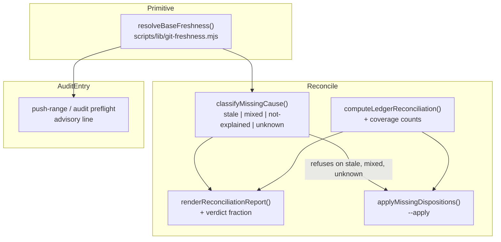

# Plan: Reconcile attribution, coverage honesty, and base freshness

- **Date**: 2026-09-05
- **Status**: Approved — `/audit-plan` 3 GPT rounds (H:3 M:2 → H:1 M:1 → M:1),
  **8/8 findings accepted, 100% acceptance every round**. Gemini gate 3 rounds
  (`CONCERNS` ×3, 0 false positives, no bias, coherence "Strong"), stopped at
  R3 per the cap: severity decayed to one narrow edge case and one test-infra
  nit, both folded in rather than deferred. Two findings were confirmed
  **empirically** rather than accepted on assertion — `HEAD~1@{u}` is a git
  error, and this very branch has no configured upstream, which would have made
  `--apply` unusable here on day one.
- **Author**: Claude + Louis Strydom
- **Scope**: backend
- **Target domain(s)**: `shared-lib`, `scripts`, `audit-orchestration`
- ⚠ **Cross-domain work** — touches 3 domains; the seams are named in §11's
  `Coupling:` lines and each is an existing allowed edge.
- ⚠ **Untagged path**: `AGENTS.md` — matches no rule in
  `.audit-loop/domain-map.json`, correctly (it is not code).

---

## 0. The one theme

**A verdict must say what it measured, and a remedy must name the cause it
actually observed.** Every gap below is one of those two sentences violated in
the upstream-reconcile path, plus the operational case where nothing said the
base was stale at all.

Direct successor to [`drift-signal-attribution-2026-09-04.md`](drift-signal-attribution-2026-09-04.md),
which put the corpus and the store next to the drift verdict. These five were
found *while running that plan's own audit* — the instrument catching its own
blind spots one layer out.

---

## 1. What was measured

All figures `measured` on 2026-09-05 against this worktree, HEAD `e2b2dfe9`.

### 1.1 Reconcile blamed a crash window for a stale checkout (gap 1)

`npm run upstream:reconcile:gate` failed with three terminal DB rows missing
from the committed ledger, reported as:

> `Terminal db row(s) with NO ledger entry (3) — the accepted crash-window gap, now surfaced:`

The cause was not a crash window. This worktree was **16 commits behind
`origin/main`**, where all three entries already exist (46 ledger entries there,
43 here). Proof rather than inference: substituting `origin/main`'s ledger makes
the gate exit **0**.

**The two causes take opposite remedies.** A real crash-window gap is repaired by
writing the ledger; staleness is repaired by `git pull`. Acting on the printed
attribution would have hand-written **duplicates of entries already pushed** — I
came one step from doing exactly that.

### 1.2 A `clean` verdict that checked 23 of 43 entries (gap 2)

On a passing run, `renderReconciliationReport`
([commands.mjs:1084](../../scripts/lib/upstream/commands.mjs)) prints:

> `Reconciliation: clean — every terminal db row matches a ledger entry, and no row needs manual review.`

while **20 of 43** ledger entries belong to store `c7177057dcafa55d` and were not
checked at all. To its considerable credit the renderer already prints every one
and says how to check them — its `clean` computation deliberately excludes
`otherStore` because *"it is not divergence, it is scope"*. This is a refinement,
not a correction: the **fraction is not in the verdict line**, so a reader
skimming for the answer sees `clean` above a 20-line list they must count.

That is the same defect the predecessor plan fixed for the drift score, which
now reads `Corpus measured: 5324 symbols` beside its verdict.

### 1.3 No repair path when the gap is real (gap 3)

`upstream reconcile` reports `missingFromLedger` and stops. Repair today means
hand-editing a **committed ratchet artifact** whose entire purpose is that
closing an upstream report cannot be a no-op.

### 1.4 Nothing warned the base was stale (gap 4)

A 7-round `/audit-code` run — real provider spend, ~50 minutes — executed against
a base 14 commits behind origin. Nothing surfaced that. The other session's
commits included a fix to `scripts/lib/shared-cloud-config.mjs`, a module this
work imports.

### 1.5 `AGENTS.md` is 98 characters from its enforced cap (gap 5)

`npm run context:check`: **91,902 / 92,000 characters, 385 left** before my
addition, 98 after. Two concurrent sessions appended to it today. Its own
preamble prescribes the remedy — *"condense a dossier section to a stub +
`docs/<topic>.md` rather than raising the cap"* — and its advisory says in terms:
*"shaving words to squeeze under the cap is how a file stays permanently full."*
I already had to cut a 7-line addition to 5 to fit, which is that anti-pattern.

---

## 2. Neighbourhood considered

`get-neighbourhood` returned `precedent` (`above-floor-cluster`) on
`computeLedgerReconciliation`, and the surrounding cluster **materially reduced
this plan's scope**. Four existing symbols are reused rather than written:

| Existing symbol | Reused for |
|---|---|
| `resolveGitFacts` ([commands.mjs:241](../../scripts/lib/upstream/commands.mjs)) | The three-outcome git-ancestry idiom for gaps 1 & 4 — exit 0 / exit 1 / **anything else ⇒ `null`, "could not tell", never a false negative**. Its docstring already argues why `merge-base --is-ancestor` and not `rev-parse --verify`. |
| `classifyReportFreshness` ([commands.mjs:138](../../scripts/lib/upstream/commands.mjs)) | The `current` / `stale` / `unknown` vocabulary for gap 1 — a freshness classifier already exists in this file; gap 1 is a second instance of it, not a new concept. |
| `upsertDispositionLedgerEntry` ([commands.mjs:537](../../scripts/lib/upstream/commands.mjs)) | **Gap 3's write path already exists** — keyed by `issueId`, so idempotent by construction, and it already preserves `storeFingerprint` on re-write under the "read-modify-write is a constructor" rule. `--apply` calls it; it does not build a writer. |
| `parseDisposition` + `isLegalTestDisposition` ([dispositions.mjs:61, :100](../../scripts/lib/upstream/dispositions.mjs)) | Gap 3's anti-laundering validation. |

**Decision: extend, do not write siblings.** The one genuinely new symbol is the
shared base-freshness primitive (§4.1), because gaps 1 and 4 need the same fact
in two subsystems and a second copy is what the single-oracle rule forbids.

---

## 3. Past incidents to verify against

| Incident | Status | Lesson applied here |
|---|---|---|
| **INC-002** — test suite wiped the production store | `manual-verification-required` | *"An env-gate that checks 'is this variable set' is not a safety gate — it only proves intent to run, never that the target is safe."* The analogue for gap 3: checking that a DB row **has** a disposition string is not validation. `--apply` must verify the disposition **resolves** — a `probe:` id present in the registry, a `test:` path tracked and matching the glob — or it launders an unvalidated closure into the ratchet. |
| **INC-001** — lexical path classification bypassed by symlink | `manual-verification-required` | *"Fail-closed on resolution errors. Never 'I couldn't classify it so I'll allow it.'"* Gap 1 returns `unknown` only when git could not ANSWER (a failed read, git unavailable, not a work tree) — and `--apply` refuses on it. Deliberately NOT when there is simply no upstream: that is a determinate answer, and refusing on it would make repair impossible in every local-only repo (§4.2). |

---

## 4. Proposed Architecture



### 4.1 `resolveBaseFreshness` — the one new symbol (#1, #5)

New: `scripts/lib/git-freshness.mjs`. Answers *"is **this ref** behind **that
ref**, and by how much"* as a closed three-state result, mirroring
`resolveGitFacts`'s exit-code discipline exactly:

```
resolveBaseFreshness({ subject = 'HEAD', upstream = null, repoRoot })
  → { state: 'current'|'behind'|'unknown', behindBy: number|null,
      subject, subjectOid, upstream, upstreamOid, reason }
```

**The subject is a parameter, not `HEAD` (plan-audit R1 H1).** The first draft
measured `HEAD` and let gap 4 label the result *"the audit base is behind
origin/main"* — two conflations in one sentence. `/audit-code`'s base is the
**dirty-aware** base (`HEAD` or `HEAD~1`, or an explicit `--base`), not `HEAD`.
Each caller passes the ref it actually means, and the rendered message names the
**resolved upstream ref**, never a hardcoded one.

**The upstream is resolved from the BRANCH, never as `<subject>@{u}` (final gate
R2, HIGH).** `@{u}` is a suffix on a *branch name*, not on an arbitrary rev.
Measured here:

```
HEAD~1@{u}  → fatal: no such branch: 'HEAD~1'
HEAD@{u}    → fatal: no upstream configured for branch '<this branch>'
```

Since the subject is routinely `HEAD~1`, `<subject>@{u}` is a git error, not a
lookup. Resolution is therefore its own step, in order: an explicit `upstream`
argument → `git rev-parse --abbrev-ref --symbolic-full-name @{u}` (the **current
branch's** upstream, independent of the subject) → `origin/HEAD` if it resolves →
**no upstream**. The two refs are resolved independently and both reported, so a
subject and an upstream can never be conflated into one lookup.

**The default upstream is only meaningful for a subject on this branch (final
gate R3).** Falling back to the current branch's upstream is right for the
callers here — the audit base is `HEAD` or `HEAD~1` — but it is the wrong
comparison for an arbitrary subject on unrelated history, where the two refs may
have no useful relationship. So when `upstream` is **not** explicitly supplied,
the subject must be an ancestor of `HEAD` (`merge-base --is-ancestor`, the same
three-outcome idiom); if it is not, the result is `unknown` with
`reason: 'subject-not-on-current-branch'` rather than a confidently wrong
distance. An explicit `upstream` argument means the caller has decided what to
compare against, and the check is skipped.

`subjectOid` / `upstreamOid` are resolved at the same instant as the comparison
and returned, so a caller that later mutates state can prove it is acting on the
same commits it measured (see §4.4).

- `behind` only when `git rev-list --count <subject>..<upstream>` succeeds and is > 0.
- `unknown` for: no upstream configured, not a work tree, git unavailable, or a
  non-zero exit that is not a legitimate answer. **Never** collapsed to
  `current` — that is the false-negative direction, and it is the one that
  matters (a wrong `current` re-opens gaps 1 and 4 silently).
- **Never fetches.** It reads the already-fetched remote-tracking ref. A gate
  that reaches the network is a gate that fails on a plane, and `check` must stay
  offline-clean (AGENTS.md sandbox-honesty). The staleness it reports is
  therefore "since your last fetch", and the message says so.

### 4.2 Gap 1 — `classifyMissingCause` (#15, #16)

Pure decision in `scripts/lib/upstream/dispositions.mjs`, taking the
`missingFromLedger` ids, the freshness result, and **upstream ledger evidence as
a tri-state, not a set** (plan-audit R1 H2):

```
upstreamEvidence: { status: 'read'|'absent'|'no-upstream'|'unreadable', issueIds: Set|null }
```

`absent` (the upstream ledger legitimately has no such file) and `unreadable`
(`git show` failed, git is unavailable) are **different facts**, and collapsing
them into "an empty set" is the INC-001 mistake one level down: an empty set from
a failed read would look exactly like a clean upstream and route straight to a
repair the operator must not run.

**`no-upstream` is a fourth state, and it is DETERMINATE (final gate R2,
MEDIUM).** A repo with no configured upstream and no `origin/HEAD` has *settled*
the question — there is no upstream that could have contained the entries, so
`git pull` cannot be the remedy. Folding it into `unreadable` would make
`--apply` permanently refuse in any local-only repository, and it is not
hypothetical: **the branch this plan was written on has no upstream configured**,
so the first draft's `--apply` would have been unusable here on day one. It maps
to `not-explained-by-staleness`, and repair is allowed.

The rule that separates them is the one §4.2's `unknown`-freshness rows already
state: **fail closed when the evidence cannot settle the question, not whenever
an input is unknown.** "There is no remote" is an answer; "I could not read the
remote" is not.

**The table is TOTAL over `freshness × evidence` — all twelve combinations, no
fall-through (final gate, Incomplete State Machine).** An earlier draft covered
`behind`/`current` against `read` and both `any` rows, leaving `unknown`
freshness with successfully-`read` evidence undefined — reachable via a detached
HEAD or a missing tracking branch, and it would have fallen off the end of a
decision that must always return one.

| Freshness | Upstream evidence | Missing ids present upstream | Verdict |
|---|---|---|---|
| `behind` | `read` | **all** | `stale` — *"N commits behind `<upstream>`; these entries exist there. Run `git pull`."* |
| `behind` | `read` | **some** | `mixed` — name both sets; pull first, then re-run |
| `behind` | `read` | **none** | `not-explained-by-staleness` — being behind did not cause this; pulling will not add them |
| `current` | `read` | any | `not-explained-by-staleness` |
| `unknown` | `read` | **all** or **some** | `unknown` — the ids exist upstream, but whether this checkout is behind could not be determined, so whether `git pull` is the remedy is **unknown**. Refuse to repair. |
| `unknown` | `read` | **none** | `not-explained-by-staleness` — upstream does not have them, so the freshness answer cannot change the outcome |
| any | `absent` | — | `not-explained-by-staleness` (upstream has no ledger to have contained them) |
| any | `no-upstream` | — | `not-explained-by-staleness` — there is no upstream to pull from; the question is settled, not unanswerable |
| any | `unreadable` | — | `unknown` — the cause could not be determined; name both remedies and **refuse to repair** |

The two `unknown`-freshness rows differ deliberately: a missing-everywhere entry
is decidable *without* knowing the freshness, so demanding that answer would
refuse a repair on evidence that is already sufficient. Fail-closed means
refusing when the evidence cannot settle it — not refusing whenever any input is
unknown.

**`not-explained-by-staleness` is deliberately not called `genuine`
(plan-audit R1 M1).** A `current` result proves only that the local
remote-tracking ref holds nothing this checkout lacks. It does **not** establish
that a crash window caused the gap — a never-fetched remote-tracking ref, a local
deletion, or an entry that was simply never written all produce the same
observation. Naming the branch `genuine` and printing the crash-window sentence
would assert a cause from evidence that only *rules one out* — which is the exact
defect this plan exists to fix, reproduced one level down.

So the message states what was **ruled out** and lists what remains:

> `3 terminal db row(s) have no ledger entry, and staleness does not explain it
> (checkout is current with origin/main). Remaining causes: the ledger write was
> lost between the local write and the DB write; the entry was deleted locally;
> your remote-tracking ref is itself stale (last fetch <when>). Inspect before
> repairing.`

### 4.3 Gap 2 — coverage in the verdict (#19)

`computeLedgerReconciliation` returns `coverage: {checked, total, foreign}`;
`renderReconciliationReport` puts it in the verdict line and the `--json`
envelope carries it:

```
Reconciliation: clean — 23 of 43 ledger entries checked; every terminal db row matches.
  20 entries belong to store c7177057dcafa55d and were NOT checked — re-run with that AUDIT_DB_URL.
```

The `clean` predicate is **unchanged** — `otherStore` remains scope, not
divergence. Only the disclosure moves into the verdict.

### 4.4 Gap 3 — `--apply`, which must not launder (#12, #14, #15)

`applyMissingDispositions` writes only rows that clear **every** gate:

1. `classifyMissingCause` returned `not-explained-by-staleness`. **Refuses on
   `stale`, `mixed` *and* `unknown`** — this is gap 1 acting as gap 3's
   precondition, and the direct answer to §1.1's near-miss.
2. The DB row carries a disposition that `parseDisposition` accepts.
3. It is **not** `LEGACY_UNTRACKED_TRANSITION` — that sentinel means "needs human
   review" and applying it would convert a review flag into a clean record.
4. It **resolves**: `probe:` ⇒ id in `probeIds()`; `test:` ⇒
   `isLegalTestDisposition` against the tracked-file set (INC-002's lesson).
5. `exempt:` requires `--allow-exempt`, because an exemption is prose no
   referential check can validate — a human authored it, so a human confirms it.

**One batch, one write — not N upserts (plan-audit R2 H1).** The first draft kept
"one `upsertDispositionLedgerEntry` call per row" *and* a ledger-hash
precondition re-checked before each write. Those two are self-invalidating: the
first row's write changes the file, so the second row's precheck fails against a
hash **its own predecessor** invalidated, and the apply aborts halfway for a
reason that is not a conflict.

The merge rule stays in one place. `upsertDispositionLedgerEntry`'s body is split
into a pure `mergeLedgerEntry(entries, entry) → entries` — which keeps the
existing `issueId` keying and the `storeFingerprint`-preservation rule verbatim —
and the existing single-entry function becomes read → merge → write over it, with
identical behaviour. `--apply` then does **read → verify token → fold every
accepted row through `mergeLedgerEntry` in memory → write once**, inside one
`withFileLock`. The precondition is a property of the batch, checked once, which
is what it was always meant to be.

**The mutation is bound to the state it was classified against (plan-audit R1
H3).** Classification reads mutable refs — `HEAD`, `@{u}`, and the upstream
ledger through `git show` — and then writes. A concurrent session moving `HEAD`
between those two moments is not hypothetical: it happened **16 times in this
worktree during one sitting**, and it is the mechanism behind §1.1. So `--apply`
carries a **precondition token** captured at classification and re-verified
immediately before the write, inside the same file lock:

| Pinned at classify | Re-checked before write | On mismatch |
|---|---|---|
| `subjectOid` / `upstreamOid` from §4.1 | re-resolve both refs | **abort, write nothing**, tell the operator the repo moved and to re-run |
| sha256 of the ledger file as read | re-hash the file on disk | abort — another writer touched it |
| the `missingFromLedger` id set | recompute is **not** attempted | out of scope: the token covers the inputs the decision was made from |

This is the same rule `/cycle` applies to `clusterStartRef` — *validate on use,
not merely on capture* — and the same reason a stale base yields "a silently
WRONG envelope rather than an error".

**Result lifecycle (plan-audit R1 M2).** The emitted reconciliation describes the
**post-write** ledger: after applying, reconciliation is recomputed and that is
what is rendered and returned in `--json`, so the operator reads the state they
now have rather than the one they had. The exit code is non-zero if any **divergence** remains — a refused row, or a
category `--apply` does not touch (`ledgerOnly`, `stateMismatch`,
`dispositionMismatch`, `needsReview`). A partial apply that exits 0 is the
"9 of 15 captured" shape; so is one that exits 0 while `stateMismatch` is
non-empty just because it was not this flag's job.

**Foreign-store entries do NOT affect the exit code (plan-audit R2 M1).** An
earlier draft included them, contradicting §4.3 — which keeps them out of `clean`
precisely because *they are scope, not divergence*. With 20 permanently foreign
entries in this repo's ledger, including them would make `--apply` incapable of
ever exiting 0, which is a gate that cannot be satisfied by doing the work
correctly: the cried-wolf shape. They are **disclosed** by the coverage fraction
(§4.3) and gate nothing. Disclosure and gating are separate decisions, and this
plan's whole thesis is that the first must not be skipped — not that it must
become the second.

### 4.5 Gap 4 — placement (#19)

**Decision: the audit entry point, not pre-push.** Pre-push already runs against
the commit being pushed in a clean sandbox, so a stale *working* base is not a
correctness problem there. The money and the wasted hour are spent at audit time.
`scripts/openai-audit.mjs` emits one advisory line beside its resolved base. It
passes **the resolved audit base as the subject**, not `HEAD`, and prints the
**resolved upstream ref name** rather than assuming `origin/main` (§4.1, H1):

```
  [scope] base HEAD~1 is 16 commit(s) behind origin/main (as of your last fetch) — findings may cite superseded code
```

**Advisory, never blocking.** Auditing a deliberately older base is legitimate
(re-running a historical audit, a pinned fixture), and a gate here would fire
constantly in a multi-session repo. It prints only on `behind`; `current` and
`unknown` stay silent, so the common path gains no noise.

### 4.6 Gap 5 — condense a dossier (#2)

Move one large already-pointer-bearing section from `AGENTS.md` to
`docs/reference/`. Candidate by size, from `context:check`'s own advisory:
**`## Consumer-repo layout (isolation)` (9,089 chars)**, which already points at
`docs/runbooks/consumer-adoption.md`. Leave the load-bearing invariants inline as
a stub; move the dossier depth. Target: restore ≥2,000 characters of headroom.

**This is the file's own prescribed remedy, applied rather than deferred** — and
the deferral is what produced a 98-character margin.

---

## 5. Right-sizing gate

New structure on the table: one new module, one new CLI flag, one new doc.

- **Band-aid**: reword the crash-window sentence to hedge ("this may also mean
  your checkout is stale"). Cheap, and leaves the operator to guess between two
  opposite remedies — the root cause (nothing measures freshness) survives.
- **Over-engineered**: a general "repository state provenance" service with
  cached fetch, background refresh, and a policy engine deciding per-gate
  staleness tolerance. No current requirement asks for any of it.
- **Chosen**: one primitive that answers one question, consumed by the two places
  that need it, plus a flag on the command that already reports the problem.
  The requirement is current and measured: a near-miss duplicate write (§1.1) and
  ~50 minutes of spend on a stale base (§1.4).

**Manual vs scripted** — gap 5's condensation is a *judgement-heavy* single-file
edit, not a regular transformation. Done by hand; no codemod.

---

## 6. Sustainability

- **Assumption that could change**: `resolveBaseFreshness` reads the
  remote-tracking ref rather than fetching. If a future caller genuinely needs
  post-fetch truth, it takes an explicit `{ fetch: true }` — the default stays
  offline.
- **Extension point**: `classifyMissingCause` is a pure function over
  `(missingIds, freshness, upstreamLedgerIds)`. A third cause (e.g. "entry was
  deliberately deleted") is a new branch and a new row in its table, not a
  rewrite.
- **Deliberately not built**: no auto-`git pull`. Naming the remedy is the job;
  moving someone's HEAD is not.

---

## 7. File-Level Plan

| File | Change |
|---|---|
| `scripts/lib/git-freshness.mjs` | **new** — `resolveBaseFreshness`, three-state, offline, never fetches |
| `scripts/lib/upstream/dispositions.mjs` | `classifyMissingCause` (pure); `coverage` counts on `computeLedgerReconciliation` |
| `scripts/lib/upstream/commands.mjs` | wire freshness into `upstreamReconcile`; verdict fraction in `renderReconciliationReport`; `applyMissingDispositions` |
| `scripts/cross-skill.mjs` | register `--apply` / `--allow-exempt` in the reconcile command's `assertKnownFlags` set |
| `scripts/openai-audit.mjs` | the one advisory line beside the resolved base |
| `AGENTS.md` · `docs/reference/consumer-repo-layout.md` | condense the 9,089-char section to a stub + new reference doc |
| `tests/upstream-reconcile-staleness.test.mjs` | **new** — the four `classifyMissingCause` branches, incl. `unknown` |
| `tests/upstream-reconcile-apply.test.mjs` | **new** — each refusal gate fires; a valid row applies; idempotent on re-run |
| `tests/git-freshness.test.mjs` | **new** — `behind` / `current` / `unknown`, and the direction that must NOT fire |

### 7b. Implementation Phases

**Phase 1 — the freshness primitive.** `resolveBaseFreshness` + its test.
Files: `scripts/lib/git-freshness.mjs` (create), `tests/git-freshness.test.mjs` (create).

**Phase 2 — gap 1, cause attribution.** `classifyMissingCause`, wired into the
reconcile report.
Files: `scripts/lib/upstream/dispositions.mjs` (modify), `scripts/lib/upstream/commands.mjs` (modify), `tests/upstream-reconcile-staleness.test.mjs` (create).

**Phase 3 — gap 2, coverage in the verdict.** `coverage` counts through the
result shape, the verdict line, and the `--json` envelope.
Files: `scripts/lib/upstream/dispositions.mjs` (modify), `scripts/lib/upstream/commands.mjs` (modify).

**Phase 4 — gap 3, `--apply`.** The five refusal gates, reusing the existing
upsert.
Files: `scripts/lib/upstream/commands.mjs` (modify), `scripts/cross-skill.mjs` (modify), `tests/upstream-reconcile-apply.test.mjs` (create).

**Phase 5 — gap 4, the audit advisory.**
Files: `scripts/openai-audit.mjs` (modify).

**Phase 6 — gap 5, the AGENTS.md condensation.**
Files: `AGENTS.md` (modify), `docs/reference/consumer-repo-layout.md` (create).

**Close-out (not a phase)**: `npm run skills:regenerate && npm run check`.

## 8. Risk & Trade-off Register

- **`--apply` is the highest-risk surface here.** It writes a committed integrity
  artifact. Mitigated by five gates, a per-row refusal report, non-zero exit on
  any refusal, and the existing keyed upsert. Residual: an `exempt:` disposition
  is unverifiable by construction — hence `--allow-exempt` being explicit.
- **Freshness is "since your last fetch."** A never-fetching repo reads
  `current` while being far behind. Accepted deliberately: fetching from a gate
  is worse. The message states the qualifier so the reader is not misled.
- **Gap 5 moves prose two sessions are actively editing.** Conflict risk is real;
  Phase 6 is last and should be done in one sitting, immediately before ship.

## 9. Testing Strategy

Tier 1 (test-first) for the pure functions — `resolveBaseFreshness`,
`classifyMissingCause`, the coverage arithmetic. Each carries the direction it
must **not** fire (a `current` checkout must not report `stale`; a gap the
upstream does not have must not be excused as staleness) and a vacuous-pass guard
where a set is asserted empty.

`classifyMissingCause` gets **one case per row of §4.2's table**, nine in all —
including the three no earlier draft had a branch for: `behind` with **none** of
the ids upstream, `unreadable` evidence, and the two `unknown`-freshness rows
that must diverge from each other. Each `unknown` case asserts the verdict **and**
that `--apply` refuses on it, because those are two separate ways the fail-closed
rule can break. A **totality** assertion drives all twelve
`freshness × evidence` combinations and fails if any returns `undefined` — the
guard against the exact gap the final gate found.

The precondition token (§4.4) is proven by **moving the repo underneath it**: a
child process classifies, the test commits to the same worktree, then the write
is attempted and must abort having written nothing — asserted on the ledger's
bytes, not on the exit code alone.

**`--apply`'s test takes the DB rows as an injected argument, not from a live
store (final gate R3).** `upstreamReconcile` already receives its rows through a
`listTerminalFn` parameter precisely so it can be driven without a database, and
the test uses that seam — the assertions are about classification, refusal and
the write, none of which need Postgres. This is deliberate: a DB-gated suite in
this repo is **two edits, never one** (enrolment in `db-test-container.mjs`'s
`*_SUITE_FILES` *and* `postgres-parity.yml`, or `db:enrolment:gate` fails), and a
suite that silently skips without a DSN is a suite node reports as a clean pass
having run nothing. Keeping this one DB-free avoids buying that whole problem for
a test that does not need it.

`--apply` is driven end-to-end in a throwaway git repo with a fixture ledger:
one row per refusal gate, then a second run asserting idempotence. Every guard
proven red-then-green, reverting one defect at a time.

**Two cases exist specifically to distinguish the R2 fixes from their defective
predecessors (plan-audit R3 M1)** — a regression test that passes against the bug
it was written for is not a regression test:

- **≥2 valid rows in ONE batch.** The self-invalidating precondition (R2 H1) is
  *unreachable* with a single row: the first write is the thing that invalidates
  the hash, so a one-row fixture passes against both the broken per-row design
  and the fixed batch design. The test asserts **both** rows land and the run
  exits 0. Against the per-row predecessor it must fail on the second row.
- **A ledger containing foreign-store entries, with every real divergence
  resolved.** Asserts exit **0**. Against the predecessor that counted foreign
  entries as divergence this must fail — and it is the case that proves the gate
  is satisfiable at all, since this repo's ledger permanently carries 20.

## 10. Out of Scope (Future)

- Fanning `reconcile` out across stores the way `upstream:queues` does. Real, and
  larger: it needs multi-DSN orchestration. The coverage fraction (§4.3) makes
  the gap *visible*, which is this plan's claim; closing it is separate.
- Auto-`git pull` on `stale`.

## 11. Execution Clustering

- **Cluster A** — Phases 1–3 — fix-gate: yes
  - `Coupling:` all three consume or shape the reconciliation result. Phase 2
    needs Phase 1's primitive; Phase 3 edits the same renderer Phase 2 does, so
    splitting them would leave two half-edits of one function across a gate.
- **Cluster B** — Phases 4–5 — fix-gate: yes
  - `Coupling:` Phase 4's refusal logic is a *consumer* of Cluster A's
    `classifyMissingCause`, so A must be converged before it is built on. Phase 5
    is the primitive's second consumer and shares its offline/three-state
    contract — auditing both consumers together is what exposes a divergence in
    how they read `unknown`.
- **Cluster C** — Phase 6 — fix-gate: final
  - `Coupling:` documentation-only, deliberately last so the character budget is
    measured against the final code state rather than a moving one.
- **Final gate**: consolidated Gemini review over the union diff.
