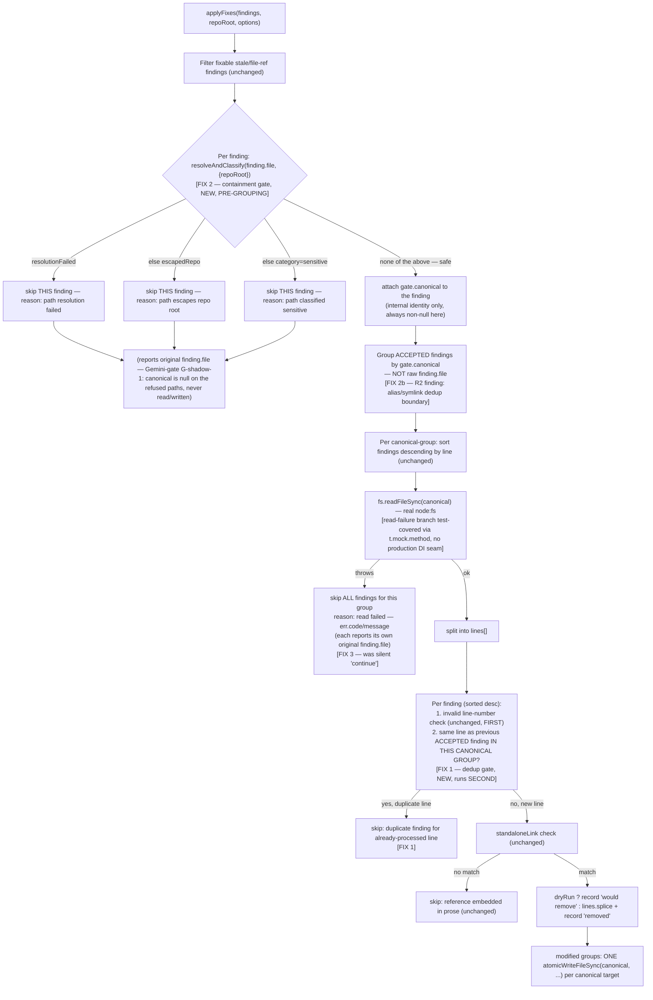

# Plan: Refactor autofix-security — containment, dedup, and silent-failure fixes in `scripts/lib/claudemd/autofix.mjs`

- **Date**: 2026-07-27
- **Status**: Complete — implemented + audited (3 GPT + 3 Gemini plan-audit
  rounds; 4 GPT + 1 Gemini code-audit rounds — see Implementation Log)
- **Author**: Claude + Test
- **Scope**: backend
- **Target domain(s)**: `claudemd-management`, `tests`
- ⚠ **Cross-domain work** — touches `claudemd-management` (the fix itself)
  and `tests` (its regression coverage). This is the ordinary source/test
  split, not a real architectural boundary crossing — noted per Phase
  0.5b, not a design concern.

> Origin: GPT-5.6 tech-debt clustering pass over 170 open debt-ledger
> entries (`.audit/tech-debt.json`, local/gitignored), cluster
> `autofix-security`, ranked #3 by leverage (4.5, MEDIUM effort). Six raw
> entries (`04599f13`, `2cb7c054`, `380340b7`, `9e84c80c`, `a4e4089d`,
> `d6673a9c`) collapse to **three** distinct design defects after
> verifying each against current source (2026-07-27) — see Code Trace.
> None of the six were stale or already fixed; all three defects are
> live in the code read for this plan.

## 1. Context Summary

**What exists today** (verified 2026-07-27 against current source, not
assumed from the debt-ledger summary text):

`applyFixes(findings, repoRoot, options)`
(`scripts/lib/claudemd/autofix.mjs:17-74`) is the sole auto-fix engine for
the CLAUDE.md/AGENTS.md hygiene linter. Its only production caller is
`scripts/claudemd-lint.mjs:118,132` (`--fix`/`--fix --yes`), which always
supplies `findings = runRules(scanInstructionFiles(repoRoot).files,
repoRoot, ruleConfig)` — i.e. findings whose `file` field
(`scripts/lib/claudemd/rules.mjs:134`, `file: file.path`) is always a path
`scanInstructionFiles` itself just discovered by walking the repo tree
from `repoRoot` (`scripts/lib/claudemd/file-scanner.mjs:30-68`,
`walkDir`). `applyFixes` groups fixable `stale/file-ref` findings by file,
sorts each file's findings descending by line "to avoid stale indices"
(line 33), then for each finding splices the matched line out of the
in-memory `lines` array (line 62) if it is a standalone markdown link
(the `standaloneLink` regex, line 53).

Three defects, verified live:

1. **No dedup by (file, line) before `lines.splice` — real double-splice
   bug, not hypothetical.** `checkStaleFileRefs`
   (`scripts/lib/claudemd/rules.mjs:124-142`) calls
   `extractFileRefs(file.content)` (`scripts/lib/claudemd/ref-checker.mjs:52-84`),
   which runs TWO independent regexes per line — a markdown-link pattern
   (line 66, `/\[([^\]]*)\]\(([^)]+)\)/g`) and a backtick-path pattern
   (line 73, `` /`([^`]+\.(?:mjs|js|ts|py|json|yml|yaml|md|sql|toml|sh))`/g ``)
   — and pushes a `{ref, line}` for every match of EITHER. A line whose
   link text is itself backtick-quoted — e.g.
   `` [`docs/<gone>.md`](docs/<gone>.md) `` — matches BOTH patterns on the
   SAME line, so `checkStaleFileRefs` emits TWO `stale/file-ref` findings
   sharing the identical `(file, line)`. **This exact style is pervasive
   in this repo's own AGENTS.md** (e.g. every
   `` [`scripts/lib/foo.mjs`](scripts/lib/foo.mjs) `` reference — dozens
   of instances), so the collision is not a contrived edge case, it is
   this repo's own house style. `autofix.mjs`'s `standaloneLink` regex
   (line 53, `` /^\s*(?:[-*]\s+)?\[([^\]]*)\]\(([^)]+)\)\s*$/ ``) matches
   such a line — `[^\]]*` inside the brackets allows the backticks — so
   BOTH duplicate findings pass the fixability check. With no dedup, the
   first finding's `lines.splice(lineIdx, 1)` (line 62) removes the line;
   the second finding — same `finding.line` value, now stale after the
   splice — is applied against content that has shifted up by one,
   deleting or "would-remove-reporting" the WRONG line. `04599f13` and
   `2cb7c054` are this one defect.
2. **No canonical-path containment check before read (line 37) or write
   (line 69).** `absPath = path.join(repoRoot, filePath)` (line 34) is
   never verified to stay within `repoRoot` — no `fs.realpathSync`, no
   escape check, matching exactly the class this repo's own
   `resolveAndClassify` (`scripts/lib/sensitive-paths.mjs:214-280`,
   WS-CANON) exists to close (AGENTS.md "Sensitive paths + VCS contract").
   Two compounding facts make this a real gap, not a theoretical one:
   - `scripts/lib/file-io.mjs`'s `atomicWriteFileSyncImpl` (lines 35-39)
     **already follows a symlink to its physical target before writing**
     (added for dotfile-manager compatibility — stow/chezmoi-style
     symlinked configs) — it has **no repoRoot-containment awareness at
     all**. So the write primitive `applyFixes` calls
     (`atomicWriteFileSync`, line 69) will transparently write through an
     in-repo symlink to wherever it resolves, with zero boundary check of
     its own. The containment check has to live in `applyFixes`, because
     nothing below it provides one.
   - **Verified NOT currently reachable via the one production caller**,
     which is why this is MEDIUM not HIGH severity in this plan: `runRules`
     always supplies `file: file.path` from `scanInstructionFiles`, and
     `walkDir` (`file-scanner.mjs:30-68`) builds every path purely by
     `fs.readdirSync(..., {withFileTypes:true})` recursion from `repoRoot`
     (never containing `..`), and — because it branches only on
     `entry.isDirectory()` (line 42) / `entry.isFile()` (line 51), which
     Node's `Dirent` returns `false` for on a symlink entry regardless of
     what the symlink points to — `walkDir` **silently does not traverse
     symlinked directories or files at all** today. So the one real
     caller cannot currently hand `applyFixes` an escaping or
     symlink-backed `file` value. This is a genuine, verified bound on
     exploitability today, not hand-waving — but `applyFixes` is an
     exported library function whose only stated assumption is a
     docstring comment ("Findings from `runRules()`", line 11) with no
     enforcement, and the security-incident-neighbourhood consultation
     below (INC-001) is exactly the precedent for treating an unenforced
     path-trust assumption as a real defect to close now, while it's
     cheap, rather than after a second caller (e.g. a future
     `--fix-from-report <externally-sourced-json>` flag — the SARIF/JSON
     `--out` machinery already in `claudemd-lint.mjs` makes that an easy
     future addition) makes it live. `9e84c80c` and `a4e4089d` are this
     one defect.
3. **Silent per-file I/O failure — one call site, not two.**
   `try { content = fs.readFileSync(absPath, 'utf-8'); } catch { continue; }`
   (line 38) is a `continue` on the OUTER per-file loop (line 31): ANY
   read failure (missing file, `EACCES`, a broken symlink, an encoding
   error) silently drops the entire file's group of findings — they
   appear in neither `applied[]` nor `skipped[]`. Verified: `380340b7` and
   `d6673a9c` describe this identical `catch` block, not two distinct
   sites — the debt-ledger's own hint ("verify … whether they're truly
   one call site or two") is confirmed: **one call site**.

**Code Trace**: `scripts/claudemd-lint.mjs:118,132` (`applyFixes` call
sites) → `scripts/lib/claudemd/autofix.mjs:17-74` (`applyFixes`) reads
findings produced by `scripts/lib/claudemd/rules.mjs:124-142`
(`checkStaleFileRefs`) → `scripts/lib/claudemd/ref-checker.mjs:52-84`
(`extractFileRefs`, the dual-regex source of defect #1's duplicate
findings) and consumes paths discovered by
`scripts/lib/claudemd/file-scanner.mjs:30-68` (`walkDir`, the reason
defect #2 is bounded today). The write path,
`scripts/lib/file-io.mjs:23-61` (`atomicWriteFileSyncImpl`/
`atomicWriteFileSync`), independently follows symlinks with no
containment check (lines 35-39), which is why the containment gate must
sit in `applyFixes` itself.

**Patterns reused**: `resolveAndClassify` (`scripts/lib/sensitive-paths.mjs`)
reused verbatim for containment — see "Proposed Architecture" below for
why. Defect #3's read-failure test uses this repo's existing
**`node:test` `t.mock.method(fs, 'readFileSync', ...)`** convention
(already established in `tests/symbol-index-extract-failure-counters.test.mjs`
and 4 other test files — mock the target function on the shared `node:fs`
object for the scope of one test, delegate to the real implementation for
every path except the one under test, auto-restored by the test-scoped
`t.mock` tracker) rather than a hand-rolled `options.fs` constructor
parameter on `applyFixes` itself (see the Gemini-gate correction below —
an earlier draft of this plan proposed exactly that hand-rolled DI seam
and it was correctly rejected as a leaky partial abstraction on a public
API).

**Neighbourhood considered** (`get-neighbourhood`,
`intentDescription: "canonical path containment check before autofix
read/write, dedup findings by file+line before splice mutation"`):
`applyFixes` itself is the top match (`above-floor-cluster`, `precedent`
band — expected, since the query targets the exact function being
fixed). The next candidates (`dedupeFindings` in
`scripts/solo-control-audit.mjs`, `finalizeDeterministicFindings` /
`mapBouncerDecisionsToFindings` in `scripts/lib/audit/duplication-report.mjs`,
`enrichFindings` in `scripts/security-triage.mjs`, `dedupe` in
`scripts/lib/nav/adapters/react-router.mjs`) all scored `review` band
(below this repo's noise floor) — none is a near-duplicate worth reusing
directly; each solves dedup/enrichment for a differently-shaped findings
object in a different domain. No sibling containment-check exists outside
`sensitive-paths.mjs` itself — confirming `resolveAndClassify` is the
one canonical seam to reuse, not build a parallel one.

## Security Considerations

**Security-incident-neighbourhood consultation** (`get-incident-neighbourhood`,
`intentDescription: "filesystem write path containment / symlink escape"`)
surfaced **INC-001**, status `manual-verification-required`, directly on
this plan's target paths:

> The lexical sensitive-path classifier (`classifyPath`) matched only the
> visible path string; a symlink whose target resolved into a sensitive
> location was not caught. Mitigated by `resolveAndClassify`
> (`fs.realpathSync` + re-classify the canonical target; fail-closed on
> resolution errors and on repo-escaping symlinks). Lesson: "Anywhere we
> make a security decision based on a path, the path MUST be canonicalised
> before classification" and "fail-closed on resolution errors — never
> 'I couldn't classify it so I'll allow it.'"

This is addressed directly, not just noted: defect #2's fix (§2 below) IS
a call to `resolveAndClassify` — the exact mitigation INC-001 names — not
a new containment mechanism. Because INC-001's status is
`manual-verification-required` (not yet closed by an automated gate for
every consumer), this plan's Testing Strategy (§6) adds a symlink-escape
regression test for `applyFixes` specifically, using this repo's existing
`tests/helpers/fs-symlink-test-utils.mjs::trySymlink` convention (already
used by `tests/gate-contract-ratchet.test.mjs`,
`tests/gate-honesty.test.mjs`,
`tests/security-triage-gate-honesty.test.mjs`) — the same manual
verification pattern INC-001's own mitigation was locked in by
(`tests/sensitive-paths-canonical.test.mjs`), applied here to the new
consumer. INC-002 (the 2026-07-14 Supabase test-DB wipe) also surfaced
but is unrelated to this plan's file-write-containment concern (a
disposable-test-DSN gate, not a path-resolution one) — noted, not
addressed here.

## 2. Proposed Architecture

**Key design decisions**:

- **Reuse `resolveAndClassify` verbatim rather than writing a new
  containment check** (#1 DRY, #3 reusable components — Phase 1
  exploration; also the explicit outcome of the mandatory
  architectural-memory + security-incident consultations above). Two
  independent reasons converge on the same seam: (a) it is the *only*
  canonical-path-containment primitive in this codebase, purpose-built
  for exactly "is this repo-relative path, once resolved through any
  symlink, still inside `repoRoot`?", and (b) its `category` output is a
  free bonus — if a finding's `file` ever lexically or canonically
  matches a `sensitive` pattern (`.env`, `secrets/`, …), autofix now also
  refuses to write there, which is a second, independent safety property
  `applyFixes` gets for free by reusing the seam rather than
  hand-rolling a narrower "just check repoRoot" helper. Writing a
  parallel containment check would (i) duplicate `resolveAndClassify`'s
  fail-closed realpath/escape logic, (ii) NOT get the sensitive-pattern
  bonus, and (iii) leave two containment implementations in the codebase
  to keep in sync — directly the class of drift the mandatory
  consultation step exists to prevent.
- **Canonicalize BEFORE grouping, and group by `gate.canonical` — not raw
  `finding.file`** (`/audit-plan` R2 finding M1, MEDIUM, accepted
  outright — a genuine correctness hole in Round 1's own fix, not rigor
  pressure). Round 1's design ran the containment gate per FILE-GROUP,
  after grouping by raw `finding.file`. That re-opens exactly the defect
  #1 double-mutation bug one layer up: two findings whose raw `file`
  values are different STRINGS but the same physical file (an in-repo
  symlink alias, or two accepted-but-distinct relative spellings of one
  path) would land in two separate groups, each independently
  read-splice-write the same underlying content — the first group's write
  persists, the second group's read sees already-shifted content and
  splices the wrong line, silently. Fixed by moving `resolveAndClassify`
  to run per FINDING before any grouping happens, then grouping the
  accepted findings by `gate.canonical` (the resolved, deduplicated
  physical identity) rather than by the finding's own possibly-aliased
  `file` string. The existing line-level dedup (below) then correctly
  spans BOTH within-one-raw-file duplicates and cross-alias duplicates
  (this fix's shape) for free, because both now funnel through one
  canonical-keyed group. Result-reporting (`applied`/`skipped` entries)
  still surfaces each finding's ORIGINAL `finding.file` value, not the
  canonical path — canonical identity is internal mutation-grouping state
  only, so the user-visible output format is unchanged.
- **Gate before open, use `gate.canonical` for both read and write** —
  per `resolveAndClassify`'s own documented contract ("the returned
  canonical is the path the caller should READ from, so a TOCTOU window
  between gate and open is minimised"). Resolving once and reusing the
  same value for read and write sidesteps the
  check-path-A-operate-on-path-B class of bug, but — **stated explicitly,
  not implied** (`/audit-plan` R1 finding M1) — it does **not** eliminate
  a live path-swap race: `resolveAndClassify` only proves `gate.canonical`
  was inside `repoRoot` at the moment `realpathSync` ran: nothing prevents
  the filesystem object at that exact path from being replaced (another
  symlink, a swapped path component) before the subsequent
  `readFileSync`/`atomicWriteFileSync` calls run a few lines later. See
  the Risk & Trade-off Register (§5) for why closing that residual window
  (e.g. a descriptor-relative/no-follow open-and-verify primitive) is a
  deliberately declined, not overlooked, piece of scope for THIS change.
- **Dedup by consecutive-same-line, not a `Set`/`Map`, and it runs AFTER
  the existing invalid-line-number check, never before** (#1 DRY, keep it
  simple; ordering fix per Gemini-gate R1 finding G2, LOW, accepted
  outright) — each canonical-group's findings are still sorted descending
  by line (unchanged sort logic, now applied per-canonical-group instead
  of per-raw-file — see the grouping-key fix above), so findings sharing
  one `line` value are necessarily contiguous after the sort (stable sort
  preserves relative order within a tie, and ties group together by
  definition of sorting on `line`). Tracking `lastProcessedLine`
  (initialized to `null`) across the single already-sorted pass is
  sufficient and needs no auxiliary collection — **but only once the
  existing `!finding.line || finding.line < 1 || finding.line >
  lines.length` bounds check has already run and rejected malformed
  findings first.** An earlier draft of this plan placed the new dedup
  check "at the top of the loop", ahead of that pre-existing check —
  since `stale/file-ref` findings always carry a valid `line` in practice
  but the schema doesn't forbid `line: null`/`undefined` on some other
  caller's finding, a malformed `finding.line: null` would then compare
  `null === null` against the freshly-initialized `lastProcessedLine` and
  be misreported as "duplicate" instead of "invalid line number" on the
  very first iteration. Fixed by ordering: bounds check first (unchanged),
  dedup check second — by the time the dedup check runs, `finding.line` is
  already proven to be a valid integer in `[1, lines.length]`, so it can
  never spuriously collide with the `null` sentinel. A `Set` of consumed
  line numbers was considered and rejected as unnecessary complexity for
  data that is already contiguous by construction.
- **No new `options.fs` (or any) filesystem-injection parameter on
  `applyFixes`'s public signature** (Gemini-gate R1 finding G1, MEDIUM,
  accepted outright — reversing an earlier draft of this plan). The
  earlier draft added `options.fs` specifically so the defect #3
  read-failure test could inject a fake `fs`, mirroring
  `resolveAndClassify`'s own `opts.fs` pattern. Gemini correctly flagged
  this as a **leaky, half-implemented DI boundary on a public API**: the
  injected `fs` would only ever reach `resolveAndClassify` and
  `readFileSync` — the mutation call, `atomicWriteFileSync` (imported
  from `file-io.mjs`, a module shared by ~15 other call sites with no
  injectable-fs parameter of its own), is hardcoded to the real
  `node:fs` regardless. A future caller passing a virtual/in-memory `fs`
  to `applyFixes` expecting full virtualization would get silent real-disk
  writes anyway — worse than no DI seam at all, per the Principle of Least
  Astonishment. **Fixed by removing the parameter entirely** and instead
  testing the read-failure branch with this repo's existing `node:test`
  `t.mock.method(fs, 'readFileSync', ...)` convention (already established
  in `tests/symbol-index-extract-failure-counters.test.mjs` and 4 other
  test files — see §6) — which needs ZERO production-code changes,
  eliminating the leaky-abstraction risk altogether rather than patching
  it (e.g. by also threading a fs override into `atomicWriteFileSync`,
  which would mean touching a shared module used far outside this plan's
  scope for one unit test's sake — correctly rejected as disproportionate).
- **Skip reasons stay in the existing `skipped: Array<{file, line,
  reason}>` shape** (#5 Single Source of Truth) — no new return field.
  Both new failure classes (containment refusal, read failure) push one
  entry per affected finding into the existing array, so
  `claudemd-lint.mjs`'s existing skip-reporting loop
  (`scripts/claudemd-lint.mjs:124-129`) needs no change to surface them.

### Right-sizing (Gate 1 — does NOT fire)

This plan touches 2 files (`autofix.mjs`, its test file), 1 subsystem
(`claudemd-management`), no dependency chain, well under 1 sitting of
work — the §7b/§11 phased-plan machinery is skipped per the Gate 1
threshold (AGENTS.md / plan skill Phase 6 §7b). Still worth stating the
extremes explicitly since new logic (the containment gate) is being
introduced:

- **Band-aid extreme**: fix only defect #1 (the dedup bug — the easiest,
  most mechanical of the three) and leave the containment gap and silent
  I/O swallow in place with a "documented as accepted debt" comment.
  Rejected — the containment gap is directly named by a
  `manual-verification-required` security incident (INC-001) touching
  this exact class of bug, and leaving it "documented" is exactly the
  silent-defer-by-authorship pattern AGENTS.md's "impact, not authorship"
  rule rejects: this plan's own re-verification shows the fix depends on
  correctly bounding `applyFixes`'s write surface.
- **Over-engineered extreme**: build a generic "safe file-mutation
  pipeline" abstraction (pluggable validators, a rule-based fixer
  registry, an undo/rollback log) that any future auto-fixer in this repo
  could plug into. Rejected — `applyFixes` is the ONLY auto-fix engine in
  the repo today; there is no second consumer to justify a shared
  abstraction, and YAGNI applies directly (no current requirement for a
  pluggable fixer framework).
- **Chosen**: three narrowly-scoped fixes to the one existing function,
  each addressing exactly the defect it corresponds to, reusing
  `resolveAndClassify` rather than writing a parallel containment
  primitive. **Current requirement it serves**: close the one real,
  incident-precedented containment gap and the one real double-splice
  data-corruption bug in the tool that already exists and already writes
  to the filesystem, without inventing infrastructure for auto-fixers
  that don't exist yet.

## 3. Sustainability Notes

- **What assumptions does this design encode?** That `scanInstructionFiles`
  continues to never traverse symlinks (today's actual containment
  bound). If a future change to `file-scanner.mjs` ever starts following
  symlinked directories/files (e.g. to support a monorepo's shared
  `CLAUDE.md` via symlink), this plan's containment gate is exactly the
  safety net that makes that future change safe by construction — no
  new autofix-side work would be needed then, because the gate is
  already there.
- **If requirements change in 6 months** (e.g. a `--fix-from-report
  <path.json>` flag is added, consuming externally-sourced findings): the
  containment gate already treats `findings[].file` as untrusted input,
  so that future caller inherits the protection automatically — this is
  the concrete reason defect #2 is being fixed now rather than deferred
  as "not currently reachable."
- **Does this tighten or loosen coupling?** Tightens `autofix.mjs`'s
  coupling to `sensitive-paths.mjs` by one new import — acceptable: it is
  this repo's single canonical containment seam, already imported by
  several other modules (`quickfix-patterns.mjs`, `audit-scope.mjs`,
  `sensitive-egress-gate.mjs`, `extract.mjs`), so this is consistent
  reuse, not a new dependency direction.
- **Patterns or exceptions?** Not the first of its kind —
  `resolveAndClassify` is already consumed by ~5 modules for
  read/classification-time containment; this plan is the first to also
  use it for a **write**-time containment gate ahead of
  `atomicWriteFileSync`. Worth a one-line doc note in `sensitive-paths.mjs`
  once shipped (not required for this plan — a future doc-refresh pass
  can note the write-gate usage pattern if a third consumer appears).

## 4. File-Level Plan

- **`scripts/lib/claudemd/autofix.mjs`** (modify)
  - Import `resolveAndClassify` from `../sensitive-paths.mjs`. **Drop the
    `node:path` import** (`/audit-plan` R2 finding L1, LOW, accepted
    outright) — the only current use, `path.join(repoRoot, filePath)`
    (line 34), is removed by this plan (replaced by
    `resolveAndClassify`'s internal path handling); no other line in the
    module uses `path`, so keeping the import would leave dead code. The
    focused test run (§6) plus a lint pass confirm the import surface is
    actually clean before this is marked implemented.
  - `applyFixes(findings, repoRoot, options = {})`: **no new parameter**
    (Gemini-gate R1 finding G1, MEDIUM, accepted outright — reverses an
    earlier draft's `options.fs`; see the key design decision in §2 for
    why a hand-rolled DI seam here was a leaky-abstraction risk on a
    public API). `applyFixes` calls `resolveAndClassify` and
    `fs.readFileSync` against the real `node:fs` unconditionally, exactly
    as it calls `atomicWriteFileSync` today — no filesystem is injectable.
  - **Restructured control flow — containment gate moved BEFORE grouping**
    (`/audit-plan` R2 finding M1, MEDIUM, accepted outright — see the
    "Canonicalize BEFORE grouping" key design decision in §2, which this
    replaces Round 1's per-file-group gate placement with):
    0. **Canonicalize `repoRoot` itself, ONCE, before anything else**:
       `const canonicalRepoRoot = fs.realpathSync(repoRoot);` (Gemini-gate
       R2 shadow finding, Claude Opus, LOW, accepted outright — a genuine
       usability/correctness gap in reusing `resolveAndClassify`, not a
       hypothetical: `resolveAndClassify` canonicalizes the FILE path via
       `fs.realpathSync` but only `path.resolve`s — never realpath's —
       `opts.repoRoot` itself, per `scripts/lib/sensitive-paths.mjs:221,257`.
       `claudemd-lint.mjs` passes `repoRoot = process.cwd()` uncanonicalized
       (`scripts/claudemd-lint.mjs:77`); on a machine where the repo is
       checked out under a symlinked path (e.g. macOS's `/tmp` →
       `/private/tmp`, or a symlinked workspace mount common in CI/Docker
       setups), comparing a REALPATH'd file target against a
       NON-canonicalized `repoRoot` inside `resolveAndClassify`'s
       `path.relative` check produces a `..`-prefixed relative path purely
       from the differing prefix — a FALSE `escapedRepo: true` for every
       single finding, silently disabling autofix entirely on such a
       machine. Fixing this inside `sensitive-paths.mjs` itself is out of
       scope for this plan — it's a shared module with ~5 other consumers,
       a change there is a separate, larger-scoped fix. The cheap,
       call-site-only mitigation: canonicalize `repoRoot` ONCE at the top
       of `applyFixes` and pass `canonicalRepoRoot` (not the raw
       `repoRoot` parameter) to every `resolveAndClassify` call below —
       this makes BOTH sides of `resolveAndClassify`'s internal
       `path.relative` comparison canonical, eliminating the false-positive
       for this call site without touching the shared module or its other
       consumers. **Wrap this call in a try/catch, fail-closed** (Gemini-
       gate R3 shadow finding, Claude Opus, LOW, accepted outright — a
       genuine internal-consistency catch: this plan explicitly rejects
       "the current caller can't trigger it" as a reason to skip a fix for
       defect #2's `finding.file` inputs, and `fs.realpathSync(repoRoot)`
       failing is exceedingly unlikely but not justified by the same
       reasoning that plan just rejected). If it throws, treat every
       finding as refused — one `skipped` entry each, reason `'repoRoot
       could not be resolved'` — rather than letting an uncaught exception
       propagate out of `applyFixes`; this mirrors `resolveAndClassify`'s
       own fail-closed philosophy for resolution errors elsewhere in this
       plan, applied consistently to the one path this plan resolves
       itself rather than delegating to `resolveAndClassify`.
    1. Filter to fixable `stale/file-ref` findings (unchanged from today).
    2. **Per finding** (not yet grouped): call `const gate =
       resolveAndClassify(finding.file, { repoRoot: canonicalRepoRoot });`.
       If
       `gate.category === 'sensitive' || gate.escapedRepo ||
       gate.resolutionFailed` (fail-closed OR — refusal fires if ANY
       holds), push one `skipped` entry for THIS finding reporting its
       original `finding.file`, with the reason text selected by an
       **explicit, deterministic precedence chain** (`/audit-plan` R3
       finding L1, LOW, accepted outright — the three conditions are not
       mutually exclusive by construction: `resolveAndClassify` always
       sets `category: 'sensitive'` whenever `resolutionFailed` or
       `escapedRepo` is true, so without a stated order the reason text
       is an unspecified contract, not a bug in the refusal decision
       itself): check `resolutionFailed` first → `'path resolution
       failed'`; else `escapedRepo` → `'path escapes repo root'`; else
       (only remaining possibility is `category === 'sensitive'` from
       either the lexical fast-path or a canonical-reclassify) →
       `'path classified sensitive'`. This precedence is a reason-text
       selection only — the refusal (fail-closed OR) is unchanged and
       fires identically regardless of which reason string is chosen.
       Exclude the finding from further processing. **Fixes defect #2.**
       (Gemini-gate R1 shadow finding, Claude Opus, LOW, verified
       non-issue, claim corrected on re-verification (Gemini-gate R2
       shadow finding, LOW, prompted a re-check that caught an imprecise
       statement in this plan's own R1 response): `gate.canonical` is
       `null` on the lexical fast-path and the `resolutionFailed` branch,
       but the `escapedRepo` branch DOES populate `canonical` (with the
       resolved, outside-repo target — verified directly against
       `scripts/lib/sensitive-paths.mjs:259-267`) — the earlier "null on
       every refused branch" wording was wrong for that one case. This has
       no safety consequence either way: step 2 above always excludes a
       refused finding (regardless of which branch refused it, or whether
       that branch happened to populate `canonical`) from every later
       step, so `gate.canonical` is only ever DEREFERENCED for accepted
       findings, where it is guaranteed both non-null and inside
       `repoRoot`. Corrected here for accuracy, no code change needed.)
    3. **Group the accepted findings by `gate.canonical`** (attached per
       finding in step 2) — not by raw `finding.file` — so two aliased
       paths (in-repo symlink, or two distinct relative spellings)
       resolving to the same physical file land in ONE group. **Fixes the
       R2 M1 alias/symlink dedup-boundary hole.**
    4. Per canonical-group: sort findings descending by line (unchanged
       sort logic).
    5. Read `gate.canonical` (the shared, group-level resolved path)
       inside a try/catch; on catch, push one `skipped` entry per finding
       in the group (each reporting its own original `finding.file`) with
       `reason: \`read failed: ${err.code || err.message}\`` instead of
       silently `continue`-ing past the group. **Fixes defect #3.**
    6. **Capture `const originalLength = lines.length;` immediately after
       splitting the read content into `lines[]` (step 5), BEFORE the
       per-finding loop begins** (Gemini-gate R2 finding G1, LOW, accepted
       outright — a genuine bug in this plan's OWN R1-Gemini fix, not
       rigor pressure: `lines.length` is a LIVE value that shrinks by one
       on every real splice, so once even one earlier, higher-line finding
       in the SAME canonical-group has been spliced in real-run mode, a
       LATER, lower-line finding's bounds check — if compared against the
       live, already-shrunk `lines.length` — can incorrectly read as
       "invalid line number" for a perfectly valid original line number.
       Concretely: a 4-line file with a valid finding at line 4 and a
       duplicate PAIR at line 3 — after line 4 and the first line-3 finding
       both splice, live length drops to 2, and the SECOND (duplicate)
       line-3 finding's bounds check then wrongly fires (`3 > 2`) before
       ever reaching the dedup check, misreporting "invalid line number"
       instead of "duplicate finding" — and, worse, this is DRY-RUN-MODE-
       DEPENDENT (dry-run never splices, so `lines.length` stays at 4
       throughout and the same input correctly reaches the dedup check),
       which directly contradicts this plan's own dry-run/real-run
       consistency invariant below). Then, inner per-finding loop within
       the canonical-group (sorted descending, as today), **in this exact
       order** (Gemini-gate R1 finding G2, LOW, accepted outright — order
       is load-bearing, not stylistic): (a) the EXISTING bounds check,
       now comparing against the CAPTURED `originalLength` instead of the
       live `lines.length` (`!finding.line || finding.line < 1 ||
       finding.line > originalLength` → `skipped` with `'invalid line
       number'`) runs FIRST; (b) only for findings that pass it, the NEW
       dedup check runs SECOND — track `let lastProcessedLine = null;`
       across the canonical-group's loop; if `finding.line ===
       lastProcessedLine`, push `{file: finding.file, line:
       finding.line, reason: 'duplicate finding for already-processed
       line'}` to `skipped` and `continue` (no second splice/report);
       otherwise set `lastProcessedLine = finding.line` and proceed as
       today (`standaloneLink` check — indexing `lines[finding.line - 1]`,
       which the descending-sort convention already guarantees is safe
       against prior splices regardless of `originalLength` vs live
       length — splice, `applied`/`skipped` recording — all unchanged).
       Comparing against `originalLength` (fixed once) rather than live
       `lines.length` makes the bounds check dry-run-invariant again
       (matching the actual invariant this plan's Testing Strategy
       asserts) and means `finding.line` is always validated the same way
       regardless of how many splices have already happened in THIS run.
       Running the bounds check before the dedup check still means
       `finding.line` is a valid integer in `[1, originalLength]` by the
       time it's compared against `lastProcessedLine`, so it can never
       spuriously equal the initial `null` sentinel (an earlier draft ran
       the dedup check first, which would have misreported a malformed
       `finding.line: null` as "duplicate" instead of "invalid line
       number" on the very first iteration). **Fixes defect #1**, now
       correctly spanning both within-one-raw-file duplicates and
       cross-alias duplicates because both funnel through the same
       canonical group, and does so consistently across dry-run and
       real-run.
    7. Write path: `atomicWriteFileSync(gate.canonical, lines.join('\n'))`
       — ONE write per modified canonical group, consistent with reading
       from the same gate-verified canonical path (TOCTOU-minimising per
       `resolveAndClassify`'s own doc contract, residual race accepted
       explicitly per §5). **Behaviourally equivalent to today's target for
       every case that matters** (Gemini-gate R3 shadow findings, Claude
       Opus, MEDIUM + LOW, both checked and folded into this one
       clarification rather than a code change — both concluded "harmless"
       on inspection): reading/writing `gate.canonical` (a realpath) instead
       of today's `path.join(repoRoot, filePath)` only differs from today's
       behaviour when a symlink is on the path — either an in-repo alias
       (already handled: TODAY's `atomicWriteFileSyncImpl` independently
       follows symlinks to their physical target before writing, per its
       own doc comment; canonicalizing earlier just makes the SAME
       physical destination visible sooner, not different) or a symlinked
       ancestor directory such as `repoRoot` itself under macOS's `/tmp` →
       `/private/tmp` (the write's temp-then-rename still happens within
       the one real, physical directory either spelling resolves to —
       `/tmp/x` and `/private/tmp/x` name the identical inode, so this is
       a cosmetic path-string difference, not a different write location).
       No behavioural difference exists for the ordinary non-symlinked
       case (the vast majority of real usage), where `gate.canonical`
       equals the same path `path.join(repoRoot, filePath)` would have
       resolved to.
  - Update the function's JSDoc to document the containment-gate
    behaviour and the canonical-grouping identity (currently only
    documents `dryRun`) — no new parameter to document, per the G1 fix
    above.
- **`tests/claudemd/autofix.test.mjs`** (modify) — add regression
  coverage for all three fixes (full detail in §6 Testing Strategy); no
  existing test's assertions change (the two current tests exercise a
  single non-duplicate, non-escaping, always-readable fixture and remain
  valid unchanged).

No new files, no schema/migration, no new dependency. `scripts/claudemd-lint.mjs`
needs no change — it already renders whatever `skipped[]` contains
(`scripts/claudemd-lint.mjs:124-129`) and passes `findings`/`repoRoot`
positionally today; `applyFixes`'s public signature (`findings, repoRoot,
options`) is unchanged by this plan (no new option is added, per the G1
fix above).

## 5. Risk & Trade-off Register

| Risk / Trade-off | Assessment |
|---|---|
| **Residual TOCTOU window between the containment gate and the actual read/write** (`/audit-plan` R1 finding M1, MEDIUM — accepted as `severity_adjusted`/compromise, not fixed by new machinery). `resolveAndClassify` proves `gate.canonical` was inside `repoRoot` at the moment `realpathSync` ran; it does not prove the filesystem object at that path is unchanged a few lines later when `readFileSync`/`atomicWriteFileSync` actually run. | **Accepted, explicitly, for this tool's threat model** — `applyFixes` is a synchronous, single-invocation, single-operator local CLI utility (`claudemd-lint.mjs --fix --yes`) reading/mutating files already in a developer's own working tree during one linter run, not a multi-tenant service facing a concurrent untrusted writer. The realistic threat this gate defends against is a **pre-existing** escaping path or planted symlink in the repo tree — not a live attacker racing the exact file being autofixed during the tool's own single synchronous JS turn (an attacker with that level of simultaneous write access to the developer's own tree already has far more direct means of harm). A descriptor-relative/no-follow open-and-verify primitive was considered (GPT's original R1 recommendation) and declined as disproportionate machinery for this threat model — **revisit if `applyFixes` is ever invoked from a privileged, shared-workspace, CI-agent, or externally-triggered context**, where the concurrency assumption no longer holds. |
| A legitimate CLAUDE.md/AGENTS.md living inside a directory that lexically matches a `sensitive` pattern (e.g. hypothetically `secrets/CLAUDE.md`) would now be refused for auto-fix. | Accepted, deliberately conservative: verified none of the real `SENSITIVE_PATTERNS` match `CLAUDE.md`/`AGENTS.md`/`SKILL.md` basenames themselves, so this only bites if the *directory* itself is sensitive-named — refusing to auto-write there is the correct behavior, not a regression. |
| Defect #2 (containment) is verified NOT reachable through the one current production caller — is fixing it "premature"? | Rejected as premature: `applyFixes` is an exported library function, the `manual-verification-required` INC-001 incident is directly on point, and the fix is cheap (reuses an existing seam). Sustainability Notes above name the concrete future caller shape this protects against. |
| `applyFixes`'s public signature gains no new parameter (Gemini-gate R1 finding G1 correction — an earlier draft's `options.fs` was removed, not kept). | Non-issue by design: the read-failure test instead uses this repo's existing `t.mock.method(fs, 'readFileSync', ...)` convention (§6), so there is no DI-surface trade-off to weigh at all — strictly simpler than the earlier draft. |
| Dedup-by-consecutive-line silently drops the SECOND of two genuinely-duplicate findings rather than merging their messages. | Acceptable: both findings describe the same fixable action (remove this one line); the resulting file edit is identical either way, and the dropped finding is still visible in `skipped[]` with a clear reason — not silently lost. |
| Deferred: fixing `checkStaleFileRefs`/`extractFileRefs` itself to not emit duplicate findings in the first place (root-causing defect #1 one layer up). | Deliberately out of scope — see below. |

## Out of Scope (Future)

- **De-duplicating `extractFileRefs`'s dual-regex output at the source**
  (`ref-checker.mjs`) instead of, or in addition to, `applyFixes`'s
  defensive dedup. Independent: `runRules`/`checkStaleFileRefs` legitimately
  reports both matches today (a linter surfacing the same stale reference
  via two detection paths is arguably informative, not wrong), and
  non-autofix consumers of `findings[]` (the terminal/JSON/SARIF
  reporters in `claudemd-lint.mjs`) are unaffected either way — only the
  mutation path needs defence against acting twice on one line. Fixing it
  at the source would be a `rules.mjs`/`ref-checker.mjs` change, a
  different file-level plan; `applyFixes`'s dedup is the correct, minimal
  fix for the actual bug (wrong mutation), independent of whether the
  reporting layer is later also tightened.
- **A generic "safe file-mutation pipeline" abstraction** for future
  auto-fixers — rejected in §2's right-sizing analysis (YAGNI, no second
  consumer exists).
- **Backfilling/auditing past auto-fix runs for corruption** caused by
  the pre-fix double-splice bug — no evidence any real repo's CLAUDE.md
  was corrupted by it (the bug requires `--fix --yes` to have been run
  against content matching the exact `` [`path`](path) ``-on-its-own-line
  shape), and there is no log of historical `--fix --yes` invocations to
  audit retroactively. If a corrupted file is ever found, it is a `git
  blame`/diff-revert problem, not something this plan's fix can detect
  after the fact.
- **Write-path error handling for `atomicWriteFileSync`** (Gemini-gate R2
  shadow finding, Claude Opus, MEDIUM — genuinely checked, deliberately
  deferred, not silently dropped). The shadow correctly observes that
  step 7's write is unguarded — an `EROFS`/`ENOSPC`/`EACCES` at write time
  propagates as an uncaught throw out of `applyFixes`. **Independence**
  (the test this plan's own doctrine requires before deferring a
  same-file finding): this plan does not touch write-error handling at
  all — the write call's failure behavior (uncaught throw →
  `claudemd-lint.mjs`'s top-level `try/catch` → `process.exit(3)`) is
  IDENTICAL before and after this plan; none of the three defects this
  plan fixes (dedup, containment, read-failure visibility) depend on the
  write path's error semantics being different. This is real,
  pre-existing debt, worth its own future tech-debt entry (the container
  question — "should a write failure produce a partial per-finding
  `skipped` accounting instead of an uncaught crash?" — is a reasonable
  ask), but is independent of what this plan is shipping and would
  expand scope well past a MEDIUM-effort fix to three verified defects.

## 6. Testing Strategy

All new tests live in `tests/claudemd/autofix.test.mjs` alongside the two
existing tests (both continue to pass unchanged).

**Defect #1 — dedup regression**:
- Two findings sharing the identical `(file, line)` (simulating the
  dual-regex duplicate: e.g.
  `` [`docs/<gone>.md`](docs/<gone>.md) `` on line 2 of a fixture), both
  `fixable: true` / `ruleId: 'stale/file-ref'`. **Unambiguous expected
  result** (`/audit-plan` R1 finding L2 — the prior "either/or" wording
  was ambiguous): given the implementation processes the already
  line-sorted (stable-sort) array in order, the FIRST of the two findings
  in original array order is applied (one `applied` entry, action
  `removed:`/`would remove:`), and the SECOND is recorded in `skipped`
  with the duplicate-line reason — not an alternative outcome, both
  happen on every run. Assert exactly that: one `applied` entry, one
  `skipped` entry with the duplicate reason, the file content after
  `dryRun:false` has EXACTLY the intended line removed (not a
  neighbouring line), and no second line is accidentally deleted.
- A negative control: two DIFFERENT lines, both genuinely fixable —
  asserts existing multi-finding-per-file behaviour is untouched.
- **Cross-alias dedup** (`/audit-plan` R2 finding M1 regression — the
  hole in Round 1's own fix): two findings whose `file` values are
  DIFFERENT strings that canonicalize to the SAME physical file (a real
  in-repo symlink alias, created via `trySymlink`, pointing at a real
  fixture file — skips gracefully on hosts that can't create symlinks,
  same convention as the Defect #2 symlink test below), each carrying a
  finding for the SAME line. Assert: exactly one line is actually
  removed from the underlying physical file (not two), one `applied` +
  one `skipped` (duplicate reason) entry are produced across the two
  differently-named findings, and the file is written exactly ONCE —
  proving the grouping key is `gate.canonical`, not raw `finding.file`.
- **Bounds check uses the ORIGINAL length, not the live one**
  (`/audit-plan`-analogue: Gemini-gate R2 finding G1, LOW, accepted
  outright — a genuine bug in this plan's own R1-Gemini fix): a fixture
  matching the minimal repro that surfaces the bug — a 4-line file, a
  valid unique fixable finding at line 4, and a duplicate PAIR at line 3
  — run with `dryRun:false`. Assert the SECOND (duplicate) line-3 finding
  is skipped with the **duplicate-line reason**, not "invalid line
  number" (which is what a live-`lines.length` bounds check would wrongly
  produce once line 4 and the first line-3 finding have both already
  spliced, shrinking the array below 3). Run the SAME fixture with
  `dryRun:true` too and assert the skip reason is IDENTICAL between the
  two modes — this is the direct regression lock for the
  dry-run/real-run consistency invariant below, using the exact input
  shape that would have exposed the bug.

**Defect #2 — containment (INC-001-pattern regression)**:
- A finding whose `file` is a `../`-escaping relative path. Assert:
  `applied.length === 0`, `skipped` contains an entry for it, and —
  critically — no file was created or modified anywhere outside the
  temp `repoRoot` (assert the escaped target path does not exist / is
  unchanged).
- A finding whose `file` lexically matches a `sensitive` pattern (e.g.
  `.env`) inside the temp repo. Assert it is refused.
- **Reason precedence** (`/audit-plan` R3 finding L1): a fixture whose
  refusal could plausibly be described by more than one condition (e.g. a
  path that both lexically matches `sensitive` AND would separately fail
  to resolve, constructed so both predicates are true) — assert the
  reported `skipped` reason follows the stated precedence
  (`resolutionFailed` → `escapedRepo` → `sensitive`), not an
  implementation-dependent pick.
- **Symlink escape** (INC-001's own regression shape, reused via
  `tests/helpers/fs-symlink-test-utils.mjs::trySymlink` — skips
  gracefully, not silently-passes, when the host can't create symlinks
  per that helper's documented `EPERM`/`EACCES` convention): create a
  file OUTSIDE the temp `repoRoot`, symlink it from an innocuous-looking
  in-repo path (e.g. `notes-that-looks-safe.md`... using an actual
  instruction-file basename is unnecessary since the test calls
  `applyFixes` directly with a hand-built finding, bypassing
  `scanInstructionFiles`), point a finding's `file` at the in-repo
  symlink path. Assert: refused, `escapedRepo`-style reason surfaced, the
  file outside `repoRoot` is never read or written. **Scope of this test,
  stated honestly** (`/audit-plan` R1 finding M1): this proves the
  **static** containment property — a symlink that already points outside
  `repoRoot` *before* `applyFixes` runs is correctly refused. It is not,
  and cannot be, a test of the residual live path-swap race documented in
  §5's Risk & Trade-off Register (that race is a timing property no
  single-threaded synchronous unit test can exercise deterministically).
- **Symlinked `repoRoot` does not false-positive as an escape**
  (Gemini-gate R2 shadow finding, Claude Opus, LOW, accepted outright —
  step 0's `canonicalRepoRoot` fix): create a real fixture directory,
  then a symlink DIRECTORY pointing at it (`trySymlink(..., 'dir')`, skips
  gracefully where unsupported), and invoke `applyFixes` with `repoRoot`
  set to the SYMLINK path (not its target) — mirroring a repo checked out
  under a symlinked mount. Assert a genuinely in-repo, non-escaping,
  non-sensitive finding is NOT refused (`escapedRepo` must be `false`),
  proving `canonicalRepoRoot` (not the raw, uncanonicalized `repoRoot`
  parameter) is what gets passed to `resolveAndClassify`.

**Defect #3 — silent I/O failure**:
- Using this repo's existing `node:test` `t.mock.method(fs, 'readFileSync',
  ...)` convention (Gemini-gate R1 finding G1 — replaces the earlier
  draft's `options.fs` injection-point design entirely; convention already
  established in `tests/symbol-index-extract-failure-counters.test.mjs`
  and 4 other test files, so this is reuse, not a new pattern): mock
  `readFileSync` on the shared `node:fs` object for the scope of one test,
  delegating to the real bound implementation for every path except the
  fixture's target path, where it throws a synthetic error (e.g.
  `Object.assign(new Error('boom'), {code: 'EACCES'})`). `resolveAndClassify`'s
  `realpathSync` call is NOT mocked — it runs against the real filesystem
  and succeeds (the fixture file genuinely exists), so the containment
  gate passes and the only injected failure is the subsequent read. No
  production-code changes are needed to make this test possible (`t.mock`
  is scoped to the test and auto-restored). Assert: `skipped` contains one
  entry per finding in that file's group, with a `reason` that includes
  the thrown error's `code`/message — never silently empty results for
  that file.
- A finding pointing at a genuinely nonexistent file (no mocking
  needed) — assert it is now surfaced via a clear `skipped` reason
  (containment gate's `resolutionFailed` path) rather than silently
  producing zero entries.

**Dry-run/real-run partition consistency** (Gemini-gate R1 shadow finding,
Claude Opus, LOW — `scripts/claudemd-lint.mjs:118,132` calls `applyFixes`
TWICE, once with `dryRun:true` for the printed preview and once with
`dryRun:false` to actually apply, then reports the FIRST call's
`applied.length` as the "Applied N fixes" count; the two calls must
produce identical `applied`/`skipped` partitions or the printed count
lies about what happened). Verified against the design above: the
containment gate, canonical-grouping, and line-dedup decisions all depend
only on `finding.file`/`finding.line` (static input data) and the
ORIGINAL file content read at the start of each independent `applyFixes`
call — never on whether a splice has already happened in THIS call — so
both calls are structurally deterministic and dryRun-invariant by
construction (dry-run's `lastProcessedLine` tracking works identically to
real-run's, since it only ever compares against `finding.line`, never
against post-splice line indices). Locked in with a direct test: call
`applyFixes` twice (dryRun:true then dryRun:false) over the SAME fixture
containing both a duplicate-line pair (defect #1 shape) and a
cross-alias pair (defect #2/M1 shape); assert the two calls' `applied.length`
and `skipped.length` are identical (differing only in each `applied[]`
entry's `action` text, `would remove:` vs `removed:`).

**Regression baseline**: `npm test -- tests/claudemd/autofix.test.mjs`
must pass in full before this plan is marked implemented; the two
pre-existing tests (dry-run report, actual removal+persist) are not
expected to need any changes.

## Audit Trail

- **2026-07-27** — `/audit-plan` Round 1 (GPT auditor, `openai-audit.mjs
  plan --mode plan`). **Verdict: NEEDS_REVISION, H:0 M:1 L:2.**
  - M1 (TOCTOU-window overclaim in the containment gate): sent to GPT
    rebuttal (MEDIUM, per the tiered-rebuttal rule). Claude agreed the
    underlying race is real but rejected GPT's primary recommendation (a
    descriptor-relative/no-follow mutation primitive) as disproportionate
    for this tool's single-operator, synchronous, local-CLI threat model.
    **GPT ruled compromise**: retain the gate, state the residual race
    explicitly, add a Risk Register row, scope the symlink test as static-
    containment-only — no new fd-based machinery. Fixed as compromised.
  - L1 (underspecified DI test-seam wording), L2 (ambiguous dedup
    assertion wording): both accepted outright, no rebuttal (LOW —
    Claude decides locally per the tiered-rebuttal table).
  - Plan edited to incorporate all 3 resolutions (§2, §5, §6 above).
- **2026-07-27** — `/audit-plan` Round 2 (GPT auditor, R2+ mode, ledger-
  driven suppression of the 3 R1 topics). **Verdict: NEEDS_REVISION, H:0
  M:1 L:1 — 2 NEW findings, 0 re-raises of R1's topics (suppression kept
  2, suppressed 0, reopened 0).**
  - M1 (a genuine correctness hole in Round 1's OWN fix, not rigor
    pressure — continued per the "concrete new design defect" exception):
    Round 1 placed the containment gate per raw-`file` GROUP, after
    grouping — so two aliased paths (an in-repo symlink, or two distinct
    relative spellings) resolving to one physical file would land in
    separate groups and independently read-splice-write the same
    content, reopening defect #1's exact bug across the alias boundary.
    Accepted outright, fixed: canonicalize per-finding BEFORE grouping;
    group by `gate.canonical`, not raw `finding.file`.
  - L1 (a `node:path` import becomes unused once `path.join` is replaced
    by `resolveAndClassify`): accepted outright, mechanical.
  - Plan edited to incorporate both resolutions (§2, §4, §6 above).
- **2026-07-27** — `/audit-plan` Round 3 (GPT auditor, R2+ mode; **this is
  the GPT round cap**). **Verdict: READY_TO_IMPLEMENT, H:0 M:0 L:1 — 1 NEW
  finding, 0 re-raises — converged.**
  - L1 (the three refusal conditions — `resolutionFailed`, `escapedRepo`,
    `category==='sensitive'` — are not mutually exclusive by construction,
    so the `skipped`-reason text had no stated precedence): accepted
    outright, mechanical. Fixed: explicit `resolutionFailed` →
    `escapedRepo` → `sensitive` precedence for the reason text only (the
    fail-closed refusal OR itself is unchanged).
  - Plan edited to incorporate the resolution (§4, §6 above). **GPT loop
    closed at Round 3** (the cap) with a clean READY_TO_IMPLEMENT verdict
    — proceeding to the mandatory Gemini gate.
- **2026-07-27** — `/audit-plan` Step 6, Gemini final gate, Round 1
  (`gemini-pro-latest`; Claude Opus ran in parallel as an observation-only
  shadow reviewer per this repo's `FINAL_REVIEW_SHADOW` config — its
  verdict never gates). **Verdict: CONCERNS_REMAINING** (2 new findings, 0
  wrongly-dismissed).
  - G1 (MEDIUM, leaky partial DI): the earlier draft's `options.fs`
    parameter would only ever reach `resolveAndClassify`/`readFileSync` —
    `atomicWriteFileSync` stayed hardcoded to the real `node:fs`
    regardless, so a future caller passing a virtual `fs` expecting full
    virtualization would get silent real-disk writes anyway. Accepted
    outright. Fixed: removed `options.fs` from the public signature
    entirely; the read-failure test instead uses this repo's existing
    `node:test` `t.mock.method(fs, 'readFileSync', ...)` convention
    (already established elsewhere in this repo) — zero production-code
    DI surface, strictly simpler than the rejected design.
  - G2 (LOW, null/duplicate collision): `lastProcessedLine` initialized to
    `null`, checked BEFORE the pre-existing invalid-line-number bounds
    check — a malformed `finding.line: null` would spuriously equal the
    `null` sentinel on the first iteration and be misreported as
    "duplicate" instead of "invalid line number". Accepted outright.
    Fixed: bounds check now runs FIRST, dedup check second.
  - Shadow-only (Claude Opus, both LOW, both verified against the code
    rather than accepted/rejected on faith): (1) `gate.canonical`
    nullability on refused branches — verified structurally non-issue
    (canonical is only ever dereferenced for accepted findings) and
    documented; (2) dry-run/real-run partition consistency for
    `claudemd-lint.mjs`'s two-call caller pattern — the SPECIFIC mechanism
    claimed (dedup depending on splice state) was verified to already be a
    non-issue by construction, but the broader invariant was cheap to lock
    in directly, so a dedicated regression test was added regardless.
  - Plan edited to incorporate G1, G2, and both shadow items (§2, §4, §5,
    §6 above).
- **2026-07-27** — `/audit-plan` Step 6, Gemini final gate, Round 2
  (`gemini-pro-latest`; Claude Opus shadow ran in parallel). **Verdict:
  CONCERNS** (1 new finding, 0 wrongly-dismissed). **This is the Gemini
  round cap (2) — continuing to Round 3 under the genuine-bug exception**
  (G1 below is a concrete correctness defect this plan's OWN Round-1-
  Gemini fix introduced, not rigor pressure or an implementation nit).
  - G1 (LOW, genuine bug in this plan's own R1-Gemini fix): the bounds
    check compared `finding.line` against the LIVE `lines.length`, which
    shrinks on every real splice — so once an earlier, higher-line finding
    in the same canonical-group had already spliced in real-run mode, a
    later duplicate finding's ORIGINAL, still-valid line number could
    exceed the now-shrunk length and be misreported as "invalid line
    number" instead of "duplicate finding" — and, critically, this was
    DRY-RUN-MODE-DEPENDENT (dry-run never splices, so the same input
    correctly reached the dedup check there), directly contradicting the
    dry-run/real-run consistency invariant this plan had just locked in
    with a test one round earlier. Accepted outright. Fixed: capture
    `originalLength` once, before the per-finding loop, and compare
    against that fixed value instead of the live `lines.length` — restores
    the dry-run-invariance and fixes the reason-text bug at once. A direct
    minimal-repro regression test (4-line file, line-4 unique + line-3
    duplicate pair, asserted identical in both `dryRun` modes) was added.
  - Shadow-only (Claude Opus, 1 MEDIUM + 2 LOW): (1) write-path
    (`atomicWriteFileSync`) error handling — checked and found genuinely
    **independent** (this plan never touches write-error semantics;
    behaviour is identical before/after) — deferred to "Out of Scope"
    with the independence stated explicitly, not silently dropped; (2) a
    request to cite line numbers for a canonical-nullability claim — this
    prompted a re-verification that caught a real inaccuracy in this
    plan's OWN Round-1-Gemini text (`canonical` is NOT null on the
    `escapedRepo` branch specifically, contrary to what was written) —
    corrected for accuracy (no safety consequence either way, since
    `gate.canonical` is only ever dereferenced for accepted findings
    regardless of which branch refused a finding); (3) a symlinked-
    `repoRoot` false-positive (`resolveAndClassify` realpaths the FILE but
    never the `repoRoot` parameter, so a repo checked out under a
    symlinked path would false-positive every finding as `escapedRepo`) —
    accepted outright and folded in: a call-site-only `canonicalRepoRoot =
    fs.realpathSync(repoRoot)` capture, avoiding any change to the shared
    `sensitive-paths.mjs` module or its other ~5 consumers.
  - Plan edited to incorporate G1 and all 3 shadow items (§2, §4, §6
    above).
- **2026-07-27** — `/audit-plan` Step 6, Gemini final gate, Round 3
  (`gemini-pro-latest`; Claude Opus shadow ran in parallel — **verdict:
  APPROVE**, 0 shadow-only findings on the primary's own set). **Verdict:
  APPROVE** (0 new findings, 0 wrongly-dismissed) — **the genuine-bug-
  exception round is closed clean.**
  - Shadow-only (Claude Opus, 1 MEDIUM + 2 LOW, all cheap and folded in
    directly — none warranted a further verification round, since none
    was an open design question, just under-stated documentation/
    consistency polish): (1)+(3) reading/writing `gate.canonical` (a
    realpath) instead of today's `path.join(repoRoot, filePath)` — both
    findings concluded "harmless" on their own inspection; folded into
    one explicit clarification that the only behavioural difference is
    cosmetic (a symlinked ancestor directory resolves to the identical
    physical location either way; an in-repo symlinked file target was
    already followed by today's `atomicWriteFileSyncImpl` regardless).
    (2) an internal-consistency catch: this plan explicitly rejects
    "the current caller can't trigger it" as a reason to skip fixing
    defect #2, yet used exactly that reasoning to justify skipping error
    handling on the NEW `canonicalRepoRoot` resolution. Accepted outright
    — wrapped in a try/catch, fail-closed (treat every finding as refused
    on a `repoRoot` resolution failure), consistent with this plan's own
    stated philosophy elsewhere.
  - Plan edited to incorporate all 3 shadow items (§4 above).
  - **Gemini final gate: closed at Round 3** (the one genuine-bug-
  exception round, justified by Round 2's G1). Both the primary reviewer
  and the observation-only shadow reviewer converged on APPROVE with zero
  further primary-gating findings — the practical signal that diminishing
  returns have set in. The plan is ready for implementation.

## Implementation Log

### 2026-07-27 — Implemented via `/cycle code <plan> --autonomous`

**Built, matching §4 exactly**: the three defects fixed as designed —
dedup by `(gate.canonical, line)` before splice; `resolveAndClassify`
(reused verbatim) gating every finding before grouping, `repoRoot`
canonicalized once up front; silent `readFileSync` failures now produce a
`skipped` entry per finding in the group. `node:path` import dropped as
planned (dead once `path.join` was replaced). All two files touched:
`scripts/lib/claudemd/autofix.mjs`, `tests/claudemd/autofix.test.mjs`
(20 tests, all passing, 0 skipped — symlink-dependent tests ran for
real on this host).

**Code-audit trail** (4 GPT rounds + 1 Gemini round — GPT capped at 4,
one round higher than the base-3 due to a genuine bug found in round 3):
- **R1** (H:5 M:5): fixed 817bc3d4 (`finding.line` type coercion —
  extends defect #2's "untrusted `file`" treatment to `line`) and
  67233241 (non-string `file` now reports `'invalid file path'` instead
  of crashing; null/non-object array entries silently filtered, per
  GPT's own compromise). Deferred to debt (GPT compromise, severity
  reduced) 317264be (scan-time-vs-fix-time content race — verified
  byte-identical to pre-plan behavior, independent of all 3 defects) and
  be9cd051 (list-marker regex gap — also byte-identical, independent).
  Dismissed via GPT overrule: 81bdbea9 (no repo function-length
  threshold; plan's own Right-sizing already rejected decomposition),
  de56e0cf/ed3415ec/bc43fcc8 (Adjacency-wave false positives — the
  dry-run/real-run branch statements ARE genuinely condition-dependent),
  f8ce9835/17a5972d (Architecture findings on files not in this diff).
- **R2** (H:0 M:1): fixed 5a482bc2 (`is_quick_fix:true` — malformed
  findings-array entries now get an explicit `skipped` entry keyed by
  array index, instead of the round-1 fix's silent filter).
  **Deviation from round-1's own design**: round-1 silently dropped
  these; round-2 correctly caught that this recreated the exact
  observability gap the plan itself is about — real GPT self-correction,
  not scope creep.
- **R3** (H:1): fixed 69995e0f — a genuine bug in round-1's OWN
  `Number(finding.line)` coercion (accepted `true`/single-element arrays
  as valid lines; a `Symbol()` would throw mid-run, aborting after
  earlier canonical groups had already been written). Replaced with a
  dedicated `normalizeLineNumber()` — strict safe-integer or canonical
  decimal-string grammar only — wired into the sort comparator (which
  must never throw) and the main validation loop.
- **R4** (H:0 M:2, verdict PASS): both findings dismissed via GPT
  overrule after rebuttal — e7782de2 (extending malformed-reporting to a
  full finding-schema validator: judged out of this plan's bounded scope,
  qualitatively different from the `file`/`line` hardening already
  accepted) and 0f6209ac (function-size re-raise of round-1's own
  already-settled 81bdbea9). GPT loop closed here: H:0, M:0
  (post-disposition), quickFix:0 — genuine convergence, not a numeric
  squeak-by.
- **Gemini gate**: 1 round, **APPROVE** (0 new findings, 0
  wrongly-dismissed) — the clean, best-case outcome, no further rounds
  needed. Shadow (Claude Opus, non-gating) raised 3 findings: write-path
  (`atomicWriteFileSync`) error handling (MEDIUM) — the exact concern the
  original plan's own audit already deferred with reasoning, re-verified
  here that the partial-write-then-crash property is unchanged from the
  pre-plan original (which also looped over multiple file groups with an
  unguarded write); string-line reporting (MEDIUM) — `applied`/`skipped`
  report the finding's original `line` value even when it was a
  normalized decimal string, judged a deliberate, consistent convention
  (matching the established `file`-vs-`canonical` reporting split, not a
  bug); a test-comment overclaim (LOW) — fixed, softened the cross-alias
  test's comment to not overstate what one fixture alone proves.

**Deviations from the original plan text**: none structural — every
fix matches §4's design precisely. The only additions are the 4 rounds'
worth of untrusted-input hardening on `finding.line`/`finding.file`/the
findings array shape itself, all either direct extensions of the plan's
existing defect #1/#2 philosophy or corrections of bugs introduced by
this implementation's own earlier rounds — never new scope beyond that.

**Remaining**: none open for this plan. Two independent, pre-existing
debt items captured (317264be, be9cd051) for future consideration
outside this plan's scope. Full test suite green (9013+ passing, 22
skipped — disposable-DB integration tests, no `AUDIT_DB_TEST_URL` in
this environment).
