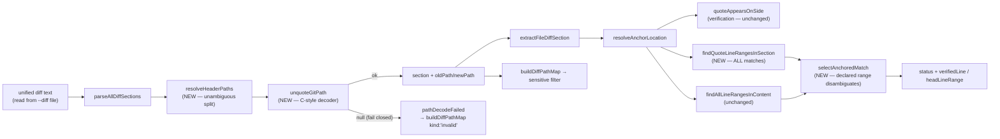

# Plan: Refactor evidence-integrity — bind anchor locations to their verified match, and parse Git diff headers unambiguously (`scripts/lib/audit/evidence-triage.mjs`)

- **Date**: 2026-07-27
- **Status**: **Complete** — implemented via `/cycle code --autonomous` (3 GPT
  plan-audit rounds; then Cluster A + Cluster B code-audited (3 rounds total)
  and gated by 1 consolidated Gemini review, `APPROVE`, 0 new findings, 0
  wrongly-dismissed — see Implementation Log)
- **Author**: Claude + Test
- **Scope**: backend
- **Target domain(s)**: `audit-orchestration`, `tests`
- ⚠ **Cross-domain work** — touches `audit-orchestration` (the fix) and
  `tests` (its regression coverage). The ordinary source/test split, not a
  real architectural boundary crossing — noted per Phase 0.5b, not a design
  concern.

> Origin: GPT-5.6 tech-debt clustering pass over the local, gitignored debt
> ledger (`.audit/tech-debt.json`, 148 open entries), cluster
> `evidence-integrity`, ranked by leverage (3.75, MEDIUM effort). Five raw
> entries (`19b2d764`, `866769e6`, `78e4d7aa`, `9cac9947`, `b587ef32`)
> collapse to **two** design defects — and verifying each against current
> source (2026-07-27) found that **one half of one entry is already fixed**
> and that the same three lines of code carry a **third, unreported defect
> whose failure direction is UNSAFE**. Net: **three** defects to fix, one of
> them net-new. See §1 Code Trace.

---

## 1. Context Summary

**Detected scope**: backend · **stack**: `js-ts` (ESM, Node built-in test
runner) · **Python framework**: n/a.

`scripts/lib/audit/evidence-triage.mjs` is Stage 0 of the tiered-recall audit
pipeline: the deterministic gate that decides whether a model-produced finding
is backed by real evidence before it can cost a Stage-1/Stage-2 LLM call or
reach a human. It is **pure by contract** (no I/O, no VCS access — its own
module docblock, `evidence-triage.mjs:26-30`), which is why it is Tier-1
test-first territory under AGENTS.md's Testing Doctrine.

Everything it decides rests on two primitives:

1. **Locating a file's section inside a unified diff** — one regex,
   `evidence-triage.mjs:117`.
2. **Locating a quote inside that section** — `quoteAppearsOnSide`
   (`:188-211`), `findQuoteLineInHunk` (`:252-273`),
   `findAllLineRangesInContent` (`:302-315`).

Both primitives are weaker than the contract that consumes them.

### Code Trace

Read in full on 2026-07-27; every claim below is cited to current source, not
to the debt ledger's summary text.

**The evidence path, end to end:**

`scripts/openai-audit.mjs` → `scripts/lib/audit/legacy-production-audit.mjs:3744-3746`
(`diffText = fs.readFileSync(diffFile, 'utf-8')` — the diff arrives as a
**file produced elsewhere**, see §2 "Why not `-z`") →
`scripts/lib/audit/tiered-pipeline.mjs:208`
(`resolveEligibleDiffPathMap(ctx.diffText)`) →
`scripts/lib/audit/discovery-diff-scope.mjs:120-164` (sensitive-path filter) →
`scripts/lib/audit/diff-path-map.mjs:98-135` (`buildDiffPathMap`, mints the
id enum + prompt table the generator sees) →
`scripts/lib/audit/tiered-pipeline.mjs:319`
(`runStage0EvidenceTriage(envelopes, { diffText: ctx.diffText }, …)`) →
`evidence-triage.mjs:685-820`.

Three consumers share the ONE header parser
(`evidence-triage.mjs::parseAllDiffSections`, `:113-128`):
`evidence-triage.mjs:69` (`extractFileDiffSection`),
`scripts/lib/audit/diff-path-map.mjs:105`, and
`scripts/lib/audit/adjacency-detector.mjs:100` (`parseHunkTargets`). Fixing
the parser therefore fixes all three; no new call sites are needed.

**Defect #1 — the anchor's declared location is never reconciled with the
verified match** (raw entries `19b2d764`, `866769e6`, both HIGH).

- `EvidenceAnchorSchema` **requires** `startLine`/`endLine`
  (`scripts/lib/schemas.mjs:203-204`); its `superRefine` checks only
  `startLine <= endLine` (`:209-211`). `ProducerEvidenceAnchorSchema`
  (`:298-305`) asks the model for them too.
- `resolveAnchorLocation` (`evidence-triage.mjs:416-476`) reads
  `anchor.side`, `anchor.oldFile`, `anchor.newFile`, `anchor.fileStatus`,
  `anchor.quote` — and **never reads `startLine`/`endLine` at all**. Same for
  `verifyAnchor` (`:499-510`).
- `quoteAppearsOnSide` (`:188-211`) proves only "this text occurs somewhere
  on the requested side of ONE hunk". The cross-hunk-stitching hole is
  already closed (fix H4, `:180-186`) — that part is real and stays.
- `resolveAnchorLocation:450-454` **does** derive a real line, via
  `findQuoteLineInHunk`, and `runStage0EvidenceTriage:744` writes it to
  `canonicalFinding._primaryLine`. But it takes the **first** window match in
  the **first** matching hunk and `break`s; the function's own docblock
  (`:246-250`) explicitly accepts that occurrence ambiguity. The derived line
  is **advisory only — it never gates, and it is never checked against the
  model's declared range.**
- Concrete proof this matters, from this repo's own fixture: `HEAD_ANCHOR`
  (`tests/evidence-triage.test.mjs:85-89`) self-reports `startLine: 12` for a
  quote whose verified line is **11**, and a test asserts that mismatch as a
  known property (`:568-575`).

**Already fixed — dropped from this plan.** `19b2d764`'s second clause ("the
working-tree fallback finds the first matching text window") is **no longer
true**. `findLineRangeInContent` was replaced by `findAllLineRangesInContent`
(`:302-315`, returns *every* match) and `resolveAnchorLocation:466-472` now
rejects a multi-match as `unsupported` rather than silently picking the first
(item 11, regression-locked at `tests/evidence-triage.test.mjs:529-539`).
The HEAD-fallback half of the entry is closed; only the **in-hunk** half
remains — and that asymmetry between the two paths is itself part of the
defect.

**Defect #2 — Git C-style quoted-path decoding is missing** (raw entries
`78e4d7aa`, `9cac9947`, `b587ef32`, all MEDIUM; same bug reported three
times).

- `evidence-triage.mjs:117`:
  `/^diff --git "?a\/(.+?)"? "?b\/(.+?)"?\r?\n/`. The `"?` groups **strip**
  surrounding quotes; nothing **decodes** what is inside them.
- Verified empirically (git 2.54.0, this host, 2026-07-27) against the
  current regex:

  | header | captured `oldPath` | real path | match? |
  |---|---|---|---|
  | `diff --git "a/src/caf\303\251.js" …` | `src/caf\303\251.js` | `src/café.js` | **no** |
  | `diff --git "a/src/a\tb.js" …` | `src/a\tb.js` | `src/a<TAB>b.js` | **no** |
  | `diff --git "a/src/q\"n.js" …` | `src/q\"n.js` | `src/q"n.js` | **no** |

- The octal case is the one a naive fix gets wrong: `\303\251` is **two
  UTF-8 bytes**, not two characters. A char-wise
  `String.fromCharCode(parseInt(o,8))` decode yields `src/café.js` —
  mojibake, still unequal to the real path (measured, same session). The
  decoder must accumulate **bytes** and UTF-8-decode once.
- The existing docblocks (`:48-58`, `:101-107`) record this as **accepted
  debt whose failure direction is SAFE** (`null` → `unverifiable`, never a
  false match). That claim is **correct for defect #2** and is why it was
  deferred; §2 explains why it stops being a sufficient reason now.
- One factual correction to those docblocks: `:93-96` states git quotes a
  header path "whenever it contains a space". **It does not.** Measured:
  `diff --git a/src/with space.js b/src/with space.js` — emitted **unquoted**
  (git's `cq_must_quote` fires on `"`, `\`, bytes `< 0x20`, `0x7f`, and
  non-ASCII only when `core.quotePath` is on; `0x20` is not `< 0x20`).
  The `QUOTED_PATH_DIFF` fixture (`tests/evidence-triage.test.mjs:76-83`)
  therefore pins a shape **git never emits**, and the real space case is
  untested. That mistaken premise is what hid defect #3.

**Defect #3 — NET-NEW, not in the debt ledger: an unquoted header containing
the literal substring `" b/"` mis-splits, and its failure direction is
UNSAFE.**

Because a space does *not* force quoting, `docs/plan b/notes.md` reaches the
regex unquoted. The lazy `(.+?)` then splits at the **first** ` b/`:

```
input   : diff --git a/x b/y.js b/x b/y.js
captured: oldPath = "x"          newPath = "y.js b/x b/y.js"     ← measured
```

This is not a `null` return. It is a **confidently wrong path pair**, and it
propagates:

1. `buildDiffPathMap` (`diff-path-map.mjs:129-134`) mints an entry with those
   paths — which is the **prompt table shown to the generator** and the
   **`enum` of legal `diffPathId`s** (`schemas.mjs:316-338`).
2. `resolveEligibleDiffPathMap` (`discovery-diff-scope.mjs:126-158`) runs
   `shouldSkipForIndexing(p)` and `resolveAndClassify(p, {repoRoot})` on the
   **wire-form** path. `existsOnDisk(abs)` is `false` for a path that does not
   exist, so line 149's guard skips the canonical/symlink check entirely —
   the sensitive gate silently degrades to lexical-only. This is INC-001's
   exact shape (see §Security Considerations).
3. Worst case in Gate A: an anchor hydrated from that entry cites
   `oldFile: 'x'`; `extractFileDiffSection(diffText, 'x')` **matches** (the
   section really does record `oldPath: 'x'`), the `oldPath`/`newPath`
   cross-checks at `evidence-triage.mjs:434-439` **pass** against the same
   corrupted values, and the quote verification then runs against the correct
   section content. Result: **`in_hunk` verified, with a wrong file path
   attached, and `headContentAdapter` unable to read it.** A false-verified
   anchor — strictly worse than the safe `unverifiable` the accepted-debt note
   promises.

**Patterns reused vs new**: no new module and no new dependency. Three pure
helpers are added inside the existing file, two existing helpers change shape,
and the fix rides the single parser seam that already exists.

### Neighbourhood considered

`node scripts/cross-skill.mjs get-neighbourhood` (k=8) — `cloud: true`,
8 records, all in `scripts/lib/audit/evidence-triage.mjs`, domain
`audit-orchestration`:

| Symbol | Lines | Band | Reason |
|---|---|---|---|
| `findQuoteLineInHunk` | 252-273 | **precedent** | `above-floor-cluster` (0.857) |
| `findAllLineRangesInContent` | 302-315 | review | 0.842 |
| `resolveAnchorLocation` | 416-476 | review | 0.841 |
| `quoteAppearsOnSide` | 188-211 | review | 0.831 |
| `parseHunkHeader` | 139-148 | review | 0.820 |
| `mapHeadRangeToBase` | 364-371 | review | 0.816 |
| `runStage0EvidenceTriage` | 685-820 | review | 0.803 |
| `extractFileDiffSection` | 64-74 | review | 0.803 |

**Decision on the `precedent` band**: **extend, do not add a sibling.** The
cluster is the *existing quote-locating family in the file this plan
modifies* — which is the expected and correct result for a refactor of that
family. `findQuoteLineInHunk` and `findAllLineRangesInContent` are two
copies of one idea (fixed-window normalize-and-join search) that already
diverged on the load-bearing question — one returns *the first* match, the
other returns *all* — and that divergence **is** defect #1's remaining half.
Writing a third locator would deepen the split. §4 extends both to a single
shape and adds one shared selector, so there is exactly one answer to "which
occurrence did we mean".

### Past incidents to verify against

`get-incident-neighbourhood` (k=3) returned 2 records; **INC-001 is directly
applicable** and is addressed in §Security Considerations. INC-002 (the
disposable-DSN wipe) is unrelated to this change — no test here touches a
database.

> | Incident | Affected paths | Status | Lesson applied here |
> |---|---|---|---|
> | **INC-001** — lexical path classification bypassed by a symlink | `scripts/lib/sensitive-paths.mjs`, `scripts/lib/sensitive-egress-gate.mjs` | `manual-verification-required` | "Anywhere we make a security decision based on a path, the path MUST be canonicalised before classification." Fail closed on resolution failure. |

---

## 2. Proposed Architecture



### Design decision 1 — the declared range **disambiguates**; it never gates

The naive reading of "the anchor's location is not verified" is "reject the
anchor when its declared line disagrees with the verified one". **That would
be wrong here, and this repo already has the evidence.**

`scripts/lib/schemas.mjs:36-64` records a deliberate, measured decision that
model-self-reported lines are untrustworthy — and this file's own fixture is
off by one (`startLine: 12`, real `11`). Gating on equality would reject
correct findings for arithmetic slips, on a pipeline whose measured failure
mode is already **over**-rejection (4/4 candidates rejected, 0/4 genuine
fabrications — `evidence-triage.mjs:386-393`).

So the declared range earns exactly the authority it can support (#11
Testability, #16 Graceful Degradation):

| quote window matches on the side | behaviour |
|---|---|
| exactly 1 | that match wins; **the declared range is ignored** — byte-identical to today |
| ≥2, and the declared range **intersects exactly one** | that one wins — the declaration did real work |
| ≥2, and it intersects zero or ≥2 | **ambiguous** — never guess (see decision 2) |
| 0, but `quoteAppearsOnSide` is true | verified-but-unlocatable — status preserved, no line asserted |

**Intersection, not nearest-match.** "Nearest" would let a model 40 lines off
still win a coin-flip; intersection is a verifiable predicate that either
holds or does not. This keeps the whole function in the file's existing
idiom: derive and check, never guess.

#### Decision 1a — the coordinate contract, and the one side where the declared range is INADMISSIBLE (R1/H1)

A comparison between a declared range and a derived range is meaningless
unless both are in the same coordinate space, and this file has **three**
spaces in play. Stated once, normatively:

| space | produced by | used for |
|---|---|---|
| **base-side diff coordinates** | `findQuoteLineRangesInHunk(…, 'base')`, counting from `hunk.header.baseStart` (`evidence-triage.mjs:255`) | in-hunk `base` anchors |
| **head-side diff coordinates** | same, from `headStart` | in-hunk `head` anchors |
| **HEAD working-tree file coordinates** | `findAllLineRangesInContent` (`:302-315`) | the HEAD fallback |

All three are **1-based and inclusive**, matching `parseHunkHeader`'s own
unified-diff semantics and `EvidenceAnchorSchema`'s `min(1)` + `startLine <=
endLine` (`schemas.mjs:203-211`). "Intersects" means the closed intervals
`[startLine, endLine]` overlap by ≥1 line. A multi-line quote's derived range
spans its first to its last matched line (`:269`), so intersection — not
equality — is the only predicate that can hold when a model cites a subset or
superset of the span.

**And the load-bearing consequence, which is why this is a HIGH and not a
documentation nit:** the discovery generator is prompted with the **full
current (HEAD) file content**, never base content — this file's own module
docblock says so (`:5-8`). So a model's `startLine` is *always* a HEAD-file
line number, whatever `side` it declares.

- `side: 'head'` → HEAD-file lines and head-side diff lines coincide for the
  matched content. Admissible.
- `side: 'base'` → the derived range is in **base** coordinates while the
  declared range is in **HEAD** coordinates. Comparing them is a category
  error, and an earlier hunk's line-count delta makes them differ by an
  arbitrary amount (the exact hazard `mapHeadLineToBase`'s docblock already
  documents, `:325-329`). **The declared range is therefore INADMISSIBLE as a
  disambiguator for `side: 'base'` anchors** — `selectAnchoredMatch` is
  called with `declaredRange: null`, and ≥2 matches degrade straight to
  `ambiguous`.
- HEAD fallback → only ever reached for `side: 'head'` (`:461`), so it is
  admissible by construction.

The rule generalises: **if the coordinate space cannot be established, the
declared range is not used.** Admissibility is decided in one place
(`resolveAnchorLocation`) and passed to the selector as `null`; the selector
never infers it.

### Design decision 2 — ambiguity degrades differently on the two paths, because the two locations are consumed differently

This looks like an inconsistency and is the opposite: **the precision a
location needs is set by what reads it.**

- **`in_hunk`** — the location feeds only `canonicalFinding._primaryLine`, a
  *report* field (`evidence-triage.mjs:744`). Verification ("is this quote in
  the changed side?") is a **separate question** that ambiguity does not
  defeat: the quote demonstrably exists, twice. Degrade to
  `verifiedLine: null`, keep `in_hunk`. Rejecting a verified finding over a
  reporting detail would be a recall loss for no integrity gain, and it would
  violate the invariant already written at `:445-449` — *this step only ADDS
  information; it must never revoke a verification that already succeeded.*
- **`outside_hunk_in_head`** — the location is **load-bearing**: it feeds
  `mapHeadRangeToBase` → `blameAdapter`/`impactAdapter` → `scopeBucket`
  (`:762-804`), which decides whether the finding is routed **out** of the
  Stage-1 pool into debt as `pre_existing_independent`. A wrong location can
  bury a real change-related finding. Refuse to assert.

### Design decision 3 — ambiguity on the HEAD path becomes `unverifiable`, not `unsupported` (attribution fix)

Today an ambiguous HEAD-fallback match returns `unsupported`
(`:466-472`) — a **terminal failure status** (`ANCHOR_FAILURE_STATUSES`,
`:485`) whose documented meaning is "the quote is not in the diff or HEAD …
the model's bug" (`:396-399`). But the quote **was** found — twice. Blaming
the model for *our* inability to localise is precisely the misattribution
§7a exists to eliminate; the file's own table says `unsupported` is the
model's bug and only `malformed` is ours.

`unverifiable` is the existing status that already means "can't confirm OR
refute — benefit of the doubt": it escalates to Stage 1, takes the safe
`change_related` bucket, skips Gate B, and never asserts a `_primaryLine`
(`:427`, `:723-747`). Reusing it costs **no new status**, no change to
`ANCHOR_FAILURE_STATUSES`, and no ripple into `_stageBreakdown` or the
shadow-comparison row — it only needs a distinct `reasonCode` so the
existing `_diff_section_unavailable` string does not become a lie (§4.3).

This is strictly *more* recall-preserving than today, and it is the honest
classification.

### Design decision 4 — why NOT the `-z` / NUL prior art from `scripts/lib/vcs.mjs`

`scripts/lib/vcs.mjs:324-361` (`parseNameStatusZ`) solved a
near-identical-looking problem by asking git for NUL-delimited output
instead of parsing quoted text. **That approach does not transfer here, and
the reason is mechanical, not stylistic.** Measured this session:

```
$ git diff -z | grep '^diff --git'
diff --git a/src/plain.js b/src/plain.js
diff --git "a/src/quote\357\200\242name.js" "b/src/quote\357\200\242name.js"   ← still quoted
```

`-z` affects only `--raw` / `--name-only` / `--name-status`. Unified **patch**
output has no NUL framing at all — the format is line-oriented by definition
— so there is no `-z` equivalent to reach for. Confirmed against
`git version 2.54.0.windows.1`.

Two weaker variants were also considered and rejected:

- **`git -c core.quotePath=false diff`** — measured: it *does* eliminate the
  non-ASCII octal case (the byte-escaped path is emitted literally and
  unquoted). But (a) it does **not** eliminate the must-quote set (`"`, `\`,
  bytes `< 0x20`) which is quoted regardless of `quotePath`, and (b) **we do
  not own the producer**: the diff arrives as a file path
  (`legacy-production-audit.mjs:3744-3746`), written by `scripts/audit-loop.mjs:269`,
  by a skill's own `git diff > file`, or by a consumer repo we cannot see.
  Setting a flag at one producer we happen to control leaves every other
  producer broken while making the bug *rarer and therefore harder to
  notice* — the band-aid cliff exactly.
- **Reconciling against `git diff --name-status -z`** — would couple the
  parser to a second git invocation and to positional agreement between two
  outputs, in a module whose stated contract is **purity** (`:26-30`). The
  coupling is more fragile than the thing it replaces.

**Conclusion: a real C-style unquoting decoder is genuinely required at the
parse site, because the parse site is the only place that sees every
producer.** The `-z` prior art's *lesson* still transfers — "parse the framing
git guarantees, don't guess at delimiters" — and decision 5 is that lesson
applied to a format that has no NUL.

### Design decision 5 — split the header on structure git guarantees, not on a lazy regex

Replacing `(.+?)` with a greedy or a longer regex just moves the ambiguity.
The header is parsed by rules, in order, each of which either succeeds
verifiably or falls through:

1. **Quoted → self-delimiting.** A token starting with `"` ends at the first
   **unescaped** `"`. No ambiguity is possible; decode with
   `unquoteGitPath`. Handles both-quoted and the one-quoted-one-not case
   (git quotes each side independently).
2. **Rename/copy → take the paths from the dedicated lines, read ONLY from
   the extended-header prelude.** A section carrying `rename from`/`rename to`
   (or `copy from`/`copy to`) has unambiguous, line-terminated,
   identically-quoted paths there. Use them and ignore the `diff --git`
   line's split entirely. Constrained (R3/H1):
   - **Prelude only.** Scan lines strictly *after* the `diff --git` line and
     strictly *before* the first `---`, `+++`, `@@`, or `Binary files ` line.
     Never the whole section. (Today's `fileStatus` detection at
     `evidence-triage.mjs:121-124` matches `/^rename from /m` over the entire
     section; that is pre-existing, but this plan makes the same scan
     **load-bearing for path identity**, so it inherits the exposure and must
     bound it — impact, not authorship.)
   - **One complete, same-kind pair.** Exactly one `rename from` + one
     `rename to`, or exactly one `copy from` + one `copy to`. Incomplete,
     duplicated, or mixed-kind metadata → the rule does not apply → rule 4.
   - **Same decoding, same guards.** Each endpoint goes through
     `unquoteGitPath` and the raw-U+FFFD check (§4.1a). Note these tokens
     carry **no `a/`/`b/` transport prefix** — unlike rules 1 and 3, where the
     prefix is validated and stripped — which is also why they are where a
     leading-BOM path is reachable (§4.1).
3. **Otherwise `oldPath === newPath`** — the only remaining shape a
   rename-detecting `git diff` emits. So the line must be exactly
   `a/P + " b/" + P`: take `P` by halving the remainder and then **verify by
   reconstruction** — if `"a/" + P + " b/" + P` is not byte-identical to the
   header, the rule did not apply.
4. **None applied → `pathDecodeFailed`.** Fail closed and loud (§4.2).

Rule 3's reconstruction check is what makes this a *derivation* rather than a
heuristic — the same "derive and check, never guess" discipline the rest of
the file already follows.

**Rule 4 as a `---`/`+++` fallback: considered and REJECTED (R1/M1).** The
draft carried a fourth rule that fell back to the patch markers when rule 3's
reconstruction failed. It is removed. The markers are line-terminated but
their *content* grammar is not free: it needs its own C-style decoding, its
own `a/`-vs-real-path prefix-stripping rule (a real path may legitimately
begin `a/`), `/dev/null` handling, CRLF, and the optional tab-delimited
timestamp field some unified-diff producers emit. That is a **second parser
with a second set of ambiguities** — built to serve a producer shape
(`git diff --no-index`, asymmetric unquoted names) that **no call site in
this repo feeds into this parser**: verified in §1 — the three consumers are
`extractFileDiffSection`, `buildDiffPathMap` and `parseHunkTargets`, and the
only `--no-index` users (`scripts/on-conflict-lint.mjs:60-68`, which has its
own `parseDiffText`, and `scripts/sync-to-repos.mjs:647-654`, which only
prints) do not. Rule 4 (fail closed, loud) already covers the shape **safely**.
**Trigger to revisit**: a real run reports `undecodable_diff_header` for a
header that is a legitimate asymmetric unquoted pair — then the marker
sub-grammar is specified and tested on its own, not bolted on here.

### Right-sizing gate

New structure on the table: three pure helpers, a changed section shape, and
one new `buildDiffPathMap` failure reason.

- **Band-aid extreme** — widen the regex to also accept escaped characters
  (e.g. `([^"]+|\\.)+?`) and strip the outer quotes. Cheap, and leaves the
  captured value **still encoded** (so it still never equals a real path) and
  defect #3 **completely untouched** — the root cause, an ambiguous split,
  resurfaces the first time someone commits a directory whose name ends in
  `" b"`.
- **Over-engineered extreme** — a general, bidirectional git-path
  quoting/unquoting library in its own module (or in `scripts/lib/vcs.mjs`),
  property-based fuzzed against a real `git` binary, plus config plumbing to
  force `core.quotePath=false` at every producer. No current requirement asks
  for *quoting*; there is exactly one consumer; and `vcs.mjs` spawns
  processes, which would drag `child_process` into a module that is pure by
  contract.
- **Chosen** — decoding only, as file-local helpers exported solely for
  tests, behind the parser seam that already exists. **Current requirement**:
  three live defects in one function that three modules already depend on.
  **Extraction trigger, stated so it is not a judgement call later**: move
  `unquoteGitPath` into its own pure module the moment a *second* consumer
  needs it outside the `parseAllDiffSections` seam. Today there is none.

**Manual vs scripted**: manual. Three functions in one file plus their tests —
well under the ~5-regular-sites threshold, and the edits are judgement-heavy,
not mechanical.

---

## 6. Sustainability Notes

- **Assumption that could change**: that `git diff` emits either a
  self-delimiting quoted pair, a rename/copy block, or a symmetric path pair.
  Rule 4 is the seam — a future shape lands in `pathDecodeFailed` (loud),
  never in a wrong answer.
- **Extension point deliberately built in**: `selectAnchoredMatch` takes
  `(matches, declaredRange)` and returns a discriminated result. A future
  disambiguator (symbol name, occurrence index) becomes a new predicate
  inside one function with one contract, not a fourth locator.
- **What this deliberately does not build**: any promotion of the declared
  line to a gate. Should telemetry (§4.4) later show declared lines are
  reliable, the change is a policy edit inside `selectAnchoredMatch`; today
  the evidence points the other way.
- **Coupling**: unchanged. No new imports, no new module, no new dependency;
  three existing consumers inherit the parser fix without edits (bar one
  null-guard, §7).

---

## 7. File-Level Plan

| File | Action | What changes |
|---|---|---|
| `scripts/lib/audit/evidence-triage.mjs` | modify | `unquoteGitPath`, `resolveHeaderPaths`, `findQuoteLineRangesInHunk`, `selectAnchoredMatch` (new, exported for tests); `parseAllDiffSections`, `findQuoteLineInHunk`, `findAllLineRangesInContent`, `resolveAnchorLocation`, `runStage0EvidenceTriage` (modified). |
| `tests/evidence-triage.test.mjs` | modify | New describe blocks per §9; fix the `QUOTED_PATH_DIFF` fixture's false premise; keep every existing assertion that is still true. |
| `scripts/lib/audit/diff-path-map.mjs` | modify | New `{kind:'invalid', reason:'undecodable_diff_header'}` branch; **`renderDiffPathTable` (`:143-148`) JSON-encodes the path column** (§4.2a); JSDoc for both. |
| `tests/diff-path-map.test.mjs` | modify | One case per new branch, plus the control-character prompt-table encoding test. |
| `scripts/lib/audit/adjacency-detector.mjs` | modify | One-line guard: `parseHunkTargets` (`:98-100`) must skip sections with `newPath === null` (today `:411` calls `SOURCE_EXT_RE.test(t.newPath)`, which a null would silently mis-answer). |
| `tests/adjacency-detector.test.mjs` | modify | §9 seam test 3 — a `pathDecodeFailed` section must not throw or leak a null path. |
| `tests/discovery-diff-scope.test.mjs` | modify | §9 seam test 4 — the sensitive gate receives the **decoded** path. |
| `scripts/lib/audit/tiered-shadow-contract-digest.mjs` | modify | Update `SEMANTICS_REGIONS[EVIDENCE_TRIAGE_FILE]` (`:94-96`) to name the functions that actually carry the localisation logic after the refactor. |
| `scripts/lib/audit/tiered-shadow-summary.mjs` | modify | Bump `TIERED_SHADOW_CONTRACT_EPOCH` (`:82`). See §4.5 — **not optional**. |
| `tests/tiered-shadow-summary.test.mjs` | modify | `:469-481` mutation-tests the digest by string-replacing **the literal return line of `findQuoteLineInHunk`** (`:476`). §4.3 turns that `return` into a `push`, so the target string ceases to exist and the test's own precondition assert fails. Retarget it to the equivalent line in `findQuoteLineRangesInHunk`. |

| `scripts/lib/audit/tiered-pipeline.mjs` | modify | One line: `:213`'s required-generator-failure condition also accepts `reason === 'undecodable_diff_header'`, so it falls back to legacy (which *can* audit the file) instead of `:224`'s "nothing to audit" shape. See §4.2. |

**Not modified, and that is the point**: `scripts/lib/schemas.mjs`,
`scripts/lib/audit/discovery-diff-scope.mjs`, `scripts/lib/vcs.mjs`. No
schema change, no producer-contract change, and no new status in
`ANCHOR_FAILURE_STATUSES`.

### 4. Detailed design

#### 4.1 `unquoteGitPath(token)` — pure, byte-correct, fail-closed

```
token does not start with '"'  → return token verbatim (unquoted paths are literal)
otherwise:
  strip the outer quotes (caller has already located the closing unescaped quote)
  scan left to right into a byte buffer:
    \a \b \f \n \r \t \v \\ \"   → the corresponding single byte
    \ + 1..3 octal digits        → that raw BYTE (greedy up to 3 digits, value ≤ 0o377)
    \ + anything else            → MALFORMED → return null
    any other char               → its UTF-8 bytes (TextEncoder)
  reject if any accumulated byte is 0x00                     → null   (R2/H1)
  decoded = new TextDecoder('utf-8',
              { fatal: true, ignoreBOM: true }).decode(bytes) → on throw, null
  IDENTITY CHECK: new TextEncoder().encode(decoded) must be
              byte-identical to the accumulated buffer        → else null
  return decoded
```

Three properties that are the whole point, and that a reviewer should check
first:

- **Bytes, then one UTF-8 decode.** `\303\251` is a two-byte sequence for
  `é`. Decoding per character produces `é` — measured, this session. This
  is the single most likely way a re-implementation gets it wrong.
- **`null` means fail closed, never "use the half-decoded string".** INC-001's
  lesson, applied: never *"I couldn't classify it so I'll allow it."*
- **The decoder's contract is a stated identity property, not a vibe (R2/H1).**
  "Byte-correct" is only meaningful if something checks it, so the last two
  lines above make it checkable: *decoding is lossless on the accumulated
  bytes.* Two concrete defects the draft's `TextDecoder('utf-8', {fatal:true})`
  alone would have shipped:
  - **BOM stripping.** WHATWG `TextDecoder` consumes a leading `EF BB BF`
    unless `ignoreBOM: true`. A pathname legitimately beginning with U+FEFF
    would decode to a *different* pathname. This is reachable in practice
    precisely via rule 2 (`rename from`/`rename to`, `copy from`/`copy to`),
    whose tokens carry **no `a/`/`b/` prefix**, so the BOM really is at byte
    0. `ignoreBOM: true` fixes it; the identity check proves it.
  - **NUL.** The octal grammar as written accepts `\000`, but NUL cannot
    occur in a POSIX pathname and must never reach a filesystem or
    classification consumer. Rejected explicitly.

  The identity check is deliberately kept even though `ignoreBOM` + fatal
  already cover the two known cases: it converts "we thought of the
  edge cases" into "any future lossy transform fails the test", which is the
  difference between a claim and a guard.

#### 4.1a The lossy-ingress hole this decoder does NOT close, and the guard that makes it safe (R1/H2)

The decoder is byte-correct only *after* the diff has become a JS string.
Ingress is `fs.readFileSync(diffFile, 'utf-8')`
(`legacy-production-audit.mjs:3746`), which replaces any invalid UTF-8 byte
with **U+FFFD** before this module sees it. So there is one shape the decoder
cannot faithfully recover: a POSIX filename containing invalid-UTF-8 bytes,
emitted **unquoted**, which requires the producer to have explicitly set
`core.quotePath=false` (at git's **default** `quotePath=true`, every byte
≥ 0x80 is octal-escaped and therefore quoted — measured this session — so the
decoder handles it correctly and already fails closed on an invalid sequence
via `TextDecoder(..., {fatal:true})`).

The finding is real; **the recommended remedy — carry a `Buffer` through
ingress and parse header framing from bytes — is not.** It would change the
diff's representation across `scripts/audit-loop.mjs`,
`legacy-production-audit.mjs`, `tiered-pipeline.mjs` and all three parser
consumers, and force `evidence-triage.mjs` (pure, string-in) into a
byte-oriented API — a large, cross-module rewrite in service of a
POSIX-only, non-default-configuration path. That is the over-engineering
cliff.

**Right-sized fix, entirely inside this plan**: `resolveHeaderPaths` rejects a
header token whose **raw, pre-decode text** contains a literal **U+FFFD** →
`pathDecodeFailed`. Applied to **both** the quoted and the unquoted branch —
the unquoted branch is exactly where the lossy string was observed passing
through verbatim.

> **Corrected at R2/M1 — the draft's justification for this guard was false,
> and the correction changes where the guard is applied.** The draft rejected
> U+FFFD in the **decoded** path, on the claim that "U+FFFD is not a character
> a real path contains". It is: U+FFFD is a perfectly legal POSIX filename
> character, and under git's **default** `core.quotePath=true` such a path
> arrives as `\357\277\275`, which this decoder reconstructs *correctly* and
> the draft would then have *wrongly rejected* — forcing an entire tiered run
> into legacy fallback over a valid filename.
>
> The discriminator is **provenance, not the character**: a U+FFFD that
> appears *literally in the raw header text* can only be (a) ingress
> replacing an invalid byte, or (b) a genuine unquoted U+FFFD — and those two
> are indistinguishable without the deferred byte-faithful ingress, so
> fail-closed is the honest call. A U+FFFD produced by decoding explicit
> octets is unambiguous provenance and is **accepted**, its fidelity proven by
> §4.1's byte-identity check. Checking the raw text rather than the decoded
> result is what separates them, and it is the same one-predicate cost.

This converts a silent wrong-path into the same loud
`undecodable_diff_header` every other unresolvable header takes.

The claim this plan then makes is precise, and is the one §Security
Considerations relies on: **no path that was not faithfully represented
reaches the sensitive-path classifier or the diff-path map.** Faithful
*recovery* of such a path is a separate capability and is deferred with a
named independence (§8).

#### 4.2 `resolveHeaderPaths(part)` and the loud-failure channel

Implements §2 decision 5's five rules. Returns
`{oldPath, newPath} | null`.

`parseAllDiffSections` keeps its array return (all three consumers keep
working). A part that **matches the `diff --git` shape but whose paths cannot
be resolved** is no longer silently `continue`d away — it is pushed as
`{section, fileStatus, oldPath: null, newPath: null, pathDecodeFailed: true}`.

- `extractFileDiffSection` (`:69-73`) skips it naturally (`null !== filePath`)
  → the anchor resolves `unverifiable`. Safe, unchanged.
- `buildDiffPathMap` returns
  `{kind:'invalid', reason:'undecodable_diff_header', detail:'<n> header(s) …'}`,
  so the whole tiered run falls back to legacy and **says why**. This reuses
  the precedent already set for `discovery_map_exceeds_budget`
  (`diff-path-map.mjs:117-127`): *fail loud rather than make changed files
  silently unauditable while reporting success.*

**Adding a `reason` value is a union change — every consumer enumerated
(shadow reviewer, Gemini round 1).** `reason` is a closed union in
`diff-path-map.mjs:96`'s JSDoc, so "add a value" is not free. All four
consumers, checked:

| consumer | reads | effect of a new value |
|---|---|---|
| `scripts/lib/audit/discovery-fallback.mjs:116,122,153` | interpolates `map.reason` into prose + `diffPathMapStatus: "${kind}:${reason}"` | **open by construction** — the new value flows through and is named. No change. |
| `scripts/lib/audit/discovery-diff-scope.mjs:123` | `map.kind !== 'ready'` only | no change. |
| `diff-path-map.mjs:96` JSDoc union | the declared contract | **must be extended** — otherwise the type lies. |
| `scripts/lib/audit/tiered-pipeline.mjs:213` | `reason === 'discovery_map_exceeds_budget'` → `failRequiredGenerator` | **must be extended — and this one is a behaviour decision, not bookkeeping.** |

That last row is why this was worth the check. Without extending it, the new
reason falls to `:224`'s generic `kind !== 'ready'` branch →
`skippedNoGeneratorResult`, i.e. the **"there was nothing to audit"** shape.
That would be a subtly wrong description and a real recall loss: there *is* a
changed file, we simply cannot cite it — which is exactly
`discovery_map_exceeds_budget`'s situation, and exactly why that one routes to
`failRequiredGenerator` and thence to the **legacy audit, which does audit the
file**. So `undecodable_diff_header` joins it at `:213`. Without this, §4.2's
own claim ("falls back to legacy") would be false.

`scripts/lib/audit/tiered-pipeline.mjs` therefore moves from the
"not modified" list into §7 — a one-line condition change.

#### 4.2a Decoding creates a NEW model-facing surface — encode it (R3/H2)

This is the one place where the plan **introduces** a risk rather than
removing one, so it is called out rather than buried.

Decoding is the point of the change: after it, `\012`/`\n`, `\011`/`\t`,
`\"` and `\\` become **literal characters in the path string**. Today they
stay textual, so they are inert. The decoded path then reaches
`renderDiffPathTable` (`diff-path-map.mjs:143-148`), which builds the
generator's prompt table by raw interpolation —
`` `${e.id}\t${e.fileStatus}\t${e.newPath}` `` joined with `\n`. A
repository-controlled filename containing a decoded newline therefore becomes
**a new line in the prompt**, and a decoded tab becomes a **new column** —
splitting a path from its id, or injecting filename-controlled text into the
model's input. That is a trust-boundary regression newly reachable *because*
of this plan.

**Fix, and why it is one line rather than an audit of every renderer**: the
plan's own D7 already did the hard part — **the id is the machine-readable
key, the path is context.** The `enum` the provider enforces carries opaque
ordinals (`f0001`), never paths (`diff-path-map.mjs:61-66`), and
`renderDiffPathTable` is the **sole** model-facing renderer of these paths
(verified: its only production consumer is
`scripts/lib/audit/discovery-prompts.mjs:117`; the only other callers are
`scripts/model-eval-discovery.mjs:185` and tests). So:

- **Semantic value** — the decoded path — stays exactly as-is for filesystem,
  map-identity and sensitive-path decisions.
- **Displayed value** — `renderDiffPathTable` serialises the path column with
  a single structured encoding (`JSON.stringify`), so every control character
  is re-escaped and no path can ever produce a row or column boundary.

Two representations, one conversion point, no renderer audit needed because
there is one renderer. Diagnostic paths (`skipped[].path`,
`discovery-diff-scope.mjs:137`) are local stderr/telemetry, never model input,
and are deliberately left as the semantic value.

#### 4.3 Localisation: one shape, one selector

- `findQuoteLineRangesInHunk(hunk, quote, side)` → **`Array<{startLine,
  endLine}>`**: the existing `findQuoteLineInHunk` body (`:252-273`) with the
  early `return` replaced by a push. All existing behaviour — `header: null`
  → `[]`, side-specific counters via `baseStart`/`headStart`, blank-context
  join normalisation — is preserved verbatim; these are regression-locked at
  `tests/evidence-triage.test.mjs:557-621`.
- `findQuoteLineInHunk` is **removed**, not kept as a wrapper. A wrapper would
  leave `SEMANTICS_REGIONS` (§4.5) hashing a trivial delegator while the real
  logic moved out from under it — silently disarming the guard.
- `selectAnchoredMatch(matches, declaredRange)` →
  `{kind:'unique', match} | {kind:'none'} | {kind:'ambiguous', count}`, per
  §2 decision 1. Used by **both** the in-hunk and the HEAD-fallback path —
  this is the single-source-of-truth fix for the divergence §1 identified
  (#1 DRY, #5 Single Source of Truth).
- `resolveAnchorLocation` (`:441-473`) rewires to:
  - **in-hunk**: `quoteAppearsOnSide` still decides *verified or not*
    (unchanged — it is the looser, more permissive matcher and must stay the
    verification oracle, per `:237-240`). Localisation then collects matches
    across **all** hunks of the section and calls `selectAnchoredMatch`:
    `unique` → `verifiedLine`; `none`/`ambiguous` → `verifiedLine: null`.
    Status stays `in_hunk` in every case.
  - **HEAD fallback**: `findAllLineRangesInContent` (unchanged) →
    `selectAnchoredMatch`. `unique` → `outside_hunk_in_head`; `none` →
    `unsupported` (unchanged); `ambiguous` → **`unverifiable`** with
    `reasonDetail` naming the count (§2 decision 3).
- `runStage0EvidenceTriage` (`:723-730`): when an `unverifiable` result
  carries a `reasonDetail`, emit reasonCode
  `${reasonPrefix}_location_ambiguous` instead of
  `${reasonPrefix}_diff_section_unavailable`. One conditional; no new bucket,
  no new status, no partition change.

#### 4.4 Make the design's own assumption falsifiable

The design rests on "declared lines are unreliable, so do not gate on them"
(§2 decision 1). Today that is an assumption with a sample size of one
fixture, and a policy change six months from now would be argued from it.

**Not a prose suffix — one versioned, machine-readable token (R3/M1).** The
draft appended a free-form `declared=<n> verified=<n>`, which loses
`endLine`, loses whether the declaration was *used* or merely *ignored*, loses
the coordinate space, and invites consumers to scrape a human-oriented field
(making a wording change a silent breaking change). Instead, one **documented,
versioned** token, emitted and parsed by a single helper pair:

```
loc/v1 side=head declared=12-12 selected=11-11 outcome=single_match candidates=1
```

- `outcome ∈ {single_match, range_disambiguated, ambiguous, unlocatable}` —
  a closed set, so the "did the declaration do work?" question is answerable
  directly rather than inferred.
- `declared=none` when the range was inadmissible (§2 decision 1a's
  `side: 'base'` case) — so inadmissibility is *observable*, not assumed.
- `v1` is the version; one producer, one parser, tested for round-trip.

**Why this rides `reasonDetail` and does not become a column.** A new
persisted field means a migration, a schema edit, a shadow-row shape change
and another epoch consideration — real cost, for an observation whose only
current requirement is "make §2 decision 1's assumption falsifiable".
`reasonDetail` is already written on the `stage0a` decision for every
candidate, and a versioned token in it is machine-readable *by contract*
rather than by accident. **Promotion trigger**: if a policy decision is ever
actually taken on this data, promote it to a column then — with the sample
already collected. That is the right-sized middle between "prose nobody can
parse" and "a schema change for a question nobody has asked yet".

#### 4.5 The tiered-shadow contract epoch MUST be bumped — not optional

`scripts/lib/audit/tiered-shadow-contract-digest.mjs:94-96` pins
`SEMANTICS_REGIONS[EVIDENCE_TRIAGE_FILE] = ['findQuoteLineInHunk',
'resolveAnchorLocation']` — **exactly the two functions §4.3 rewrites.** The
digest deliberately excludes comments and whitespace, so it will fire on the
real semantic change, and `extractNamedRegions` (`:140-147`) **throws** on a
renamed region with the instruction to update `SEMANTICS_REGIONS` and bump
the epoch.

So this plan must, in the same commit:

1. update `SEMANTICS_REGIONS` to `['findQuoteLineRangesInHunk',
   'selectAnchoredMatch', 'resolveAnchorLocation']` (the three functions that
   now carry the decision);
2. bump `TIERED_SHADOW_CONTRACT_EPOCH`
   (`scripts/lib/audit/tiered-shadow-summary.mjs:82`, currently
   `'v6-verified-line-2026-07-26'`); and
3. regenerate `TIERED_SHADOW_CONTRACT_SEMANTICS_DIGEST` (`:107`, currently
   `'ac04b10917018c84'`) with
   `node scripts/lib/audit/tiered-shadow-contract-digest.mjs` and paste it —
   its own docblock (`:100-106`) says: never update this one alone to silence
   the test.

**Migration procedure — who collects, what the threshold is, and what
"empty" must look like (R1/M3).** The mechanism already exists; this plan
names it rather than inventing one, because an unnamed procedure is how a
reset window becomes a permanently empty one:

| question | answer, in current code |
|---|---|
| Who stamps the epoch? | The collector, `tiered-shadow-compare.mjs:451` (`contractEpoch: TIERED_SHADOW_CONTRACT_EPOCH`) — per-run, at write time. Never backfilled. |
| What starts collection? | Nothing new. `AUDIT_TIERED_SHADOW_ENABLED` is already on (shared cloud config); every subsequent `/audit-code` run on organic work contributes one row. |
| Which rows count? | Only current-epoch rows — `isCurrentEpoch` (`tiered-shadow-summary.mjs:295`) gates `comparedRuns` (`:337`). Old-epoch rows are **excluded, not deleted**. |
| When is it actionable? | `windowProgress(comparedRuns)` (`:417-423`): `withinWindow` at `WINDOW_MIN = 10`, `met` at `WINDOW_MAX = 15`. Unchanged by this plan. |
| What must the empty state read as? | `comparedRuns: 0` → `met: false`, `withinWindow: false`. **Zero compared runs must never render as a clean/complete window** — that is the anti-green class, and it is the one assertion this plan adds (§9). |

Nothing about Phase 14 or the pipeline's default-off flag changes here.

**Consequence, stated so it is not discovered later**: the open tiered-recall
shadow window restarts at zero. Per AGENTS.md — *"stamp `contractEpoch` at the
collector … bump on a meaning-changing fix and **re-collect — never backfill
by date**"* — and this is a meaning-changing fix (what `_primaryLine` is
attached to, and when, changes what `overlapCount`/`*UnlocalizedCount` mean
for real data). Relabelling old rows is the exact move that produced five
false "window met" reads. This cost is accepted: the alternative is measuring
a contract we know to be wrong.

### 7b. Implementation Phases

**Phase 1 — Header decoding, pure and standalone.** `unquoteGitPath` +
`resolveHeaderPaths` with their tests, wired to nothing yet. Test-first
(Tier 1). Files: `scripts/lib/audit/evidence-triage.mjs` (modify),
`tests/evidence-triage.test.mjs` (modify).

**Phase 2 — Wire the parser + the loud-failure channel + the prompt-surface
encoding + the seam tests.** `parseAllDiffSections` adopts
`resolveHeaderPaths`; `pathDecodeFailed` sections; `buildDiffPathMap`'s new
`invalid` reason; `renderDiffPathTable`'s structured path encoding (§4.2a);
`parseHunkTargets`'s null guard; §9's four seam-level integration tests. Files:
`scripts/lib/audit/evidence-triage.mjs` (modify),
`scripts/lib/audit/diff-path-map.mjs` (modify),
`tests/diff-path-map.test.mjs` (modify),
`scripts/lib/audit/adjacency-detector.mjs` (modify),
`tests/adjacency-detector.test.mjs` (modify),
`tests/discovery-diff-scope.test.mjs` (modify).

**Phase 3 — Localisation shape + the shared selector.**
`findQuoteLineRangesInHunk`, `selectAnchoredMatch`, and their tests, wired to
nothing yet. Test-first. Files: `scripts/lib/audit/evidence-triage.mjs`
(modify), `tests/evidence-triage.test.mjs` (modify).

**Phase 4 — Bind locations in `resolveAnchorLocation` + the reasonCode +
telemetry.** Both paths adopt `selectAnchoredMatch`; the `unverifiable`
attribution fix; §4.4's `reasonDetail`. Files:
`scripts/lib/audit/evidence-triage.mjs` (modify),
`tests/evidence-triage.test.mjs` (modify).

**Phase 5 — Contract epoch + the name-coupled guards.** `SEMANTICS_REGIONS`,
`TIERED_SHADOW_CONTRACT_EPOCH`, and the digest mutation test's retargeted
string (R5). Files: `scripts/lib/audit/tiered-shadow-contract-digest.mjs`
(modify), `scripts/lib/audit/tiered-shadow-summary.mjs` (modify),
`tests/tiered-shadow-summary.test.mjs` (modify).

**Close-out (not a phase)**: `npm test`, `npm run check`.

> **The phases are intentionally red between 3 and 5 — inside one commit,
> never inside one push** (shadow reviewer, Gemini round 1). Phases 3-4 change
> `findQuoteLineRangesInHunk`/`resolveAnchorLocation`, which moves the
> contract digest; Phase 5 is what re-pins it. So `npm run check` is
> **expected to fail** from the start of Phase 3 until Phase 5 lands — that is
> the guard doing its job, not a broken build, and §4.5 already requires all
> of Phase 5 in the **same commit** as the semantic change. The phase
> boundaries are units of *review*, not of commit: Cluster B (Phases 3-5) is
> one commit. If Phase 5 is ever split out, the digest guard is silently
> disarmed for the interval — the exact omission its own docblock
> (`tiered-shadow-summary.mjs:100-106`) exists to prevent. **Rollback** is
> per-cluster: Cluster A (Phases 1-2) is independently revertable, since
> nothing in it touches the pinned regions.

---

## 8. Risk & Trade-off Register

| # | Risk / trade-off | Decision + why it is acceptable |
|---|---|---|
| R1 | An ambiguous in-hunk quote now yields **no** `_primaryLine` where today it yields a (possibly wrong) one. | Accepted, and it is the point: an unset field is honest, a wrong line is not. `findingLine()` already handles an absent `_primaryLine` — that was the universal state before 2026-07-26. |
| R2 | `undecodable_diff_header` makes a whole tiered run fall back to legacy for one bad header. | Accepted; matches the `discovery_map_exceeds_budget` precedent. Loud-and-legacy beats silently-unauditable. The trigger is rare and now named in telemetry. |
| R3 | Rule 3's halving could in principle accept a pathological symmetric-looking asymmetric pair. | The reconstruction check makes a false accept require `"a/" + P + " b/" + P` to equal the header exactly — i.e. the paths genuinely *are* equal. Not a heuristic. |
| R4 | The shadow window restarts (§4.5). | Accepted and deliberate. Re-collect, never backfill. |
| R5 | `findQuoteLineInHunk` is exported; removing it is a breaking change. | Enumerated, not assumed. **Importers**: `tests/evidence-triage.test.mjs` only — no `scripts/**` module imports it. **Name-coupled without importing** (the ones a grep-for-imports would miss): `SEMANTICS_REGIONS` (`tiered-shadow-contract-digest.mjs:95`, a string) and `tests/tiered-shadow-summary.test.mjs:469-481`, which string-replaces the function's **literal return line**. All three are in §7. Two further mentions (`scripts/lib/schemas.mjs:47`, `scripts/lib/audit/tiered-shadow-summary.mjs:71`) are prose in docblocks — update for accuracy, no behaviour. |
| R6 | `verifyAnchor` keeps its closed 3-state contract and gains no location binding. | Deliberate, inherited from the round-1/round-2 plan-audit M2 ruling (`:487-493`). It is a separate, still-used oracle; widening it is out of scope and would break exhaustive consumers. |
| R7 | *(closed at R1/M1)* The `---`/`+++` fallback rule was **removed** — it was the plan's weakest right-sizing call and the audit agreed. See §2 decision 5 for the rejection and the revisit trigger. |
| R8 | An invalid-UTF-8 unquoted path under a non-default `core.quotePath=false` producer is corrupted at ingress before this module runs (R1/H2). | The U+FFFD guard (§4.1a) converts it from a silent wrong path into `pathDecodeFailed` — safe and loud. Faithful *recovery* is deferred (below) with a named independence. |
| R9 | Removing the `---`/`+++` fallback means a legitimate asymmetric unquoted pair now falls back to legacy. | Accepted; no current producer emits that shape into this parser (verified, §2 decision 5), and the failure is loud and named, so the revisit trigger is observable rather than theoretical. |

### Deliberately deferred

- **Promoting the declared range to a gate.** No evidence supports it;
  §4.4 creates the evidence that could.
- **Occurrence identity on the anchor schema** (e.g. `occurrenceIndex`) — a
  provider-contract change, a different plan. `selectAnchoredMatch` is the
  seam it would plug into.
- **`quoteAppearsOnSide`'s looser join-match semantics.** Untouched on
  purpose: it is the verification oracle, and tightening it would revoke
  verifications (`:237-240`).
- **Byte-faithful diff ingress** (carry a `Buffer` from `git diff` through to
  the parser, so an invalid-UTF-8 pathname can be *recovered* rather than
  merely refused). **Independence**: this plan's correctness does not depend
  on it. Once §4.1a's U+FFFD guard is in place, such a path is refused before
  any map entry, any anchor, and any sensitive-path classification exists for
  it — so no decision this plan makes rides on the un-recovered bytes. It is
  a *capability* gap (some POSIX files become unauditable by the tiered path),
  not a *correctness* gap, and closing it is a cross-module ingress change
  spanning `scripts/audit-loop.mjs`,
  `scripts/lib/audit/legacy-production-audit.mjs` and
  `scripts/lib/audit/tiered-pipeline.mjs`.

---

## 9. Testing Strategy

Tier 1 (test-first, per AGENTS.md's Testing Doctrine — this module is pure,
deterministic, and named in the doctrine's own Tier-1 list by shape).
Node built-in runner, `tests/evidence-triage.test.mjs` +
`tests/diff-path-map.test.mjs`. No new dependency.

**`unquoteGitPath`** — unquoted passthrough; `\t`, `\n`, `\\`, `\"`; octal
`\303\251` → `café` (**the byte-vs-char case, asserted explicitly**);
mixed literal + octal; a trailing lone `\` → `null`; `\8` → `null`; an
invalid UTF-8 byte sequence (`\377`) → `null`. Plus the R2/H1 identity cases,
each asserting the **decoded value**, never merely that parsing succeeded:

- a `rename from`/`rename to` path beginning `\357\273\277` **retains U+FEFF**
  (the BOM-stripping regression — must fail without `ignoreBOM: true`), and
  the `copy from`/`copy to` equivalent;
- `\000` → `null`;
- `\357\277\275` → decodes to a path **containing U+FFFD, accepted** (the
  R2/M1 correction — the guard must not fire on decoded octets), while a
  **literal** U+FFFD in an unquoted raw header token → `pathDecodeFailed`.

**`resolveHeaderPaths`** — each of the five rules, plus:

- **the real unquoted space header** `a/src/with space.js b/src/with space.js`
  (the shape git actually emits — *not* today's quoted fixture);
- **defect #3's regression pin**: `a/x b/y.js b/x b/y.js` must resolve to
  `x b/y.js` on both sides, never `('x', 'y.js b/x b/y.js')`;
- a rename block (paths from `rename from`/`rename to`, not the header) and a
  copy block;
- **rule 2's prelude bound and pair rules (R3/H1)**: a hunk body line that
  reads `rename from …` must **not** be treated as metadata; an incomplete
  pair (`rename from` with no `rename to`), a duplicated pair, and a mixed
  `rename from` + `copy to` must each fall through to rule 4, never bind a
  path;
- one-side-quoted;
- CRLF (`\r\n`) throughout — the G1 regression (`:86-92`) must not return;
- a header no rule resolves → `null`.

**`renderDiffPathTable` encoding (R3/H2)** — in `tests/diff-path-map.test.mjs`:
a path whose decoded form contains a newline, a carriage return, a tab, a
`"` and a `\` must (a) leave the entry's semantic `newPath`/`oldPath`
**exactly** the decoded value, and (b) render as a table with the **expected
row and column count** — one row per entry, one path per row — proving no
filename can forge a row or column boundary in the prompt.

**Telemetry token (R3/M1)** — the `loc/v1` producer and parser round-trip for
each `outcome` value, including `declared=none` for an inadmissible base-side
range and a multi-line `declared=`/`selected=` pair.

**`findQuoteLineRangesInHunk`** — every existing `findQuoteLineInHunk`
assertion (`:557-621`) retargeted to `[range]`, **plus** a hunk containing the
same quote twice → two ranges (the case the old shape could not express).

**`selectAnchoredMatch`** — 0 → `none`; 1 → `unique` *with a deliberately
wrong declared range*, proving the declaration is ignored when unnecessary;
2 with a range intersecting exactly one → `unique`; 2 intersecting none →
`ambiguous`; 2 intersecting both → `ambiguous`.

**`resolveAnchorLocation` / `runStage0EvidenceTriage`** — in-hunk ambiguity →
`in_hunk` with `verifiedLine: null` and the candidate still in `verified`
(**the "never revokes a verification" invariant**); HEAD ambiguity →
`unverifiable` + `location_ambiguous`, and **not** in `rejected`; the
verified-but-unlocatable path unchanged; §4.4's `declared=/verified=`
telemetry present.

**The two end-to-end binding cases §2 decision 1a actually rests on (R2/M2)**
— selector unit tests cannot cover these, because both failures live in what
`resolveAnchorLocation` *passes* to the selector:

1. **Cross-hunk collection.** The same head-side quote occurs in **two
   separate hunks** of one file, with the declared HEAD range intersecting
   only the **later** one → the later range must be selected. This is the
   test that fails if an implementation accidentally keeps today's
   first-hunk-wins `break` (`evidence-triage.mjs:451-454`).
2. **Base-side inadmissibility.** Two `side: 'base'` occurrences whose
   derived base ranges are distinct, with a declared range that intersects
   exactly one → the result must still be `in_hunk` with
   `verifiedLine: null`. Passing requires `declaredRange: null` to have been
   handed to the selector; an implementation that forwards the HEAD-coordinate
   declared range would "successfully" disambiguate and fail this test. This
   is the direct executable form of decision 1a.

Every disambiguation test **states `side` explicitly** — the coordinate space
is the property under test, so it can never be implicit.

**Seam-level integration coverage (R1/M2) — required, not optional.** The
helper tests above prove the helpers; they cannot prove the *wiring*, and the
security conclusion in §Security Considerations is a claim about the wiring.
Four fixture-driven tests at the seams:

1. **Decoded path reaches the map.** A real git-quoted header (escaped
   character **and** an octal-escaped UTF-8 path) through
   `parseAllDiffSections` → `buildDiffPathMap` yields entries whose
   `oldPath`/`newPath` are the **decoded** paths and whose ids are the
   expected ordinals. (`tests/diff-path-map.test.mjs`)
2. **Defect #3 end to end.** The `a/x b/y.js b/x b/y.js` header yields one
   entry with both paths `x b/y.js`, and `extractFileDiffSection(diff, 'x b/y.js')`
   finds the section — the whole failure chain in §1, pinned.
   (`tests/evidence-triage.test.mjs` + `tests/diff-path-map.test.mjs`)
3. **`pathDecodeFailed` is safe for all three consumers.** One undecodable
   header must: yield `{kind:'invalid', reason:'undecodable_diff_header'}`
   from `buildDiffPathMap`; make `extractFileDiffSection` return `null` (→
   `unverifiable`, asserted through `resolveAnchorLocation`); and **not
   throw** in `parseHunkTargets` after its null guard.
   (`tests/adjacency-detector*.test.mjs` for the third)
4. **The classifier sees the decoded path.** In
   `tests/discovery-diff-scope.test.mjs`, a *quoted* header naming a
   sensitive path (e.g. `"a/secrets/caf\303\251.env"`) must be **dropped** by
   `resolveEligibleDiffPathMap`, with the reported `skipped[].path` being the
   decoded form. This is the direct test of the §Security Considerations
   claim; it needs no symlink fixture, because the claim under test is
   "the gate receives the real path", not "the gate works" (already covered
   by that file's existing suite).

**Edge cases that must not regress** — every currently-passing assertion in
`tests/evidence-triage.test.mjs` (846 lines) stays green except the
`QUOTED_PATH_DIFF` fixture, whose premise §1 disproves; it is **replaced**
(with the real unquoted-space header, plus a genuinely-quoted header using a
character git really does quote), never deleted.

**Epoch reset must not read as green (§4.5)** — one assertion in
`tests/tiered-shadow-summary.test.mjs`: with only old-epoch rows present,
`summarize()` yields `comparedRuns: 0` and `windowProgress(0)` yields
`{met: false, withinWindow: false}`. Old-epoch rows must be *excluded and
visible as insufficient*, never counted and never rendered as a completed
zero-result window.

**Whole-suite**: `npm test`. **Pre-push**: `npm run check` — expected to fire
the contract-digest guard until §4.5 lands, which is the guard working.

---

## Security Considerations

**INC-001 — classify the canonical path, never the wire representation.**

`resolveEligibleDiffPathMap` (`scripts/lib/audit/discovery-diff-scope.mjs:126-158`)
is the sensitive-path gate for the tiered pipeline, and its **input is this
parser's output**. Today an undecoded or mis-split path is what
`shouldSkipForIndexing(p)` and `resolveAndClassify(p, {repoRoot})` see. Worse,
line 149 gates the canonical/symlink check on `existsOnDisk(abs)` — and a
wire-form path never exists on disk, so the check is **skipped entirely** and
the gate silently degrades to lexical-only. That is INC-001's shape reached
by a different route: a path string that is not the path.

The plan closes it structurally rather than by adding a check:

1. **Decode before anything classifies.** `resolveHeaderPaths` runs inside
   `parseAllDiffSections`, upstream of every consumer, so no downstream
   module can ever receive a wire-form path.
2. **Fail closed, never half-decoded.** `unquoteGitPath` returns `null` on a
   malformed escape or invalid UTF-8; the section becomes
   `pathDecodeFailed` and yields **no map entry**, so no id exists for the
   generator to cite and nothing reaches the classifier. INC-001's own
   lesson, verbatim: never *"I couldn't classify it so I'll allow it."*
3. **Loud, not silent.** `buildDiffPathMap` reports
   `undecodable_diff_header` and the run falls back to legacy — a skipped
   file is visible, not inferred.

**The one risk this plan ADDS, and its containment (R3/H2).** Decoding turns
Git's escapes into literal control characters, which makes a
repository-controlled filename able to forge a row or column boundary in the
generator's prompt table — inert today only because the escaped form stays
textual. Contained at the single conversion point in §4.2a: the semantic path
keeps its exact decoded value for every filesystem and classification
decision, and `renderDiffPathTable` structurally encodes the displayed path.
The provider-enforced `enum` is unaffected because it carries opaque ordinals,
never paths (D7). Stated here rather than only in §4 because it is a
trust-boundary change, and a reviewer should see it in the security section.

**Egress**: unchanged. This plan adds no network call, no new payload field,
and no new file read; `evidence-triage.mjs` remains I/O-free. The sensitive
gate keeps its position and its inputs, and only ever sees *more* correct
paths than before.

**No credential or secret handling** is added or moved. The decoder operates
on already-in-memory diff text supplied by the caller.

---

## 11. Execution Clustering

- **Cluster A** — Phases 1-2 — fix-gate: yes
  - Coupling: Phase 2 wires exactly what Phase 1 builds; the
    `pathDecodeFailed` channel is meaningless until `resolveHeaderPaths` can
    fail. The seam worth auditing is parser→`buildDiffPathMap`→sensitive
    filter, which spans both phases and is the security-relevant one.
  - Additional files: `scripts/lib/audit/discovery-diff-scope.mjs` (read-only
    — the gate whose input changes; not modified, but the audit must see it).
- **Cluster B** — Phases 3-5 — fix-gate: final
  - Coupling: Phase 4 consumes Phase 3's shape, and Phase 5's digest/epoch
    bump is a mechanical consequence of Phases 3-4's function set — splitting
    it off would let the guard-disarming wrapper anti-pattern (§4.3) land
    un-audited.
  - author-tier: standard
- **Final gate**: mandatory consolidated Gemini review over the union diff.

---

## Audit Trail

Session `audit-plan-evidence-integrity`, 2026-07-27. Scratch artefacts under
the gitignored `.claude/tmp/`. **Nothing in this plan is implemented** — it is
approved and queued.

### Verification before design (the step that changed the plan most)

The five debt-ledger entries were **not** taken at face value; each was
re-verified against current source, and empirical git behaviour was measured
rather than assumed (`git version 2.54.0.windows.1`). Three results changed
the plan:

1. **Half of `19b2d764` is already fixed** and was dropped: the
   HEAD-fallback's "first matching window" is gone — `findAllLineRangesInContent`
   returns every match and `resolveAnchorLocation:466-472` rejects `>1`
   (item 11), regression-locked at `tests/evidence-triage.test.mjs:529-539`.
   Only the in-hunk half of the defect survives.
2. **A space does NOT force git to quote a header path.** Measured:
   `diff --git a/src/with space.js b/src/with space.js` is emitted unquoted.
   The code's own docblock (`evidence-triage.mjs:93-96`) claims otherwise, and
   the `QUOTED_PATH_DIFF` test fixture pins a shape git never emits.
3. **That false premise hid a third, unreported defect** — the unquoted-header
   `" b/"` split ambiguity — whose failure direction is **UNSAFE** (a
   confidently wrong path pair, not the safe `null` the accepted-debt note
   promises). It is now the most severe of the three parser defects and is not
   in the debt ledger at all.

**`-z` prior art: checked and does not transfer.** `scripts/lib/vcs.mjs`'s
`parseNameStatusZ` solved a look-alike problem with NUL-delimited output.
Measured: `git diff -z` leaves patch-output `diff --git` headers quoted and
unchanged — `-z` affects only `--raw`/`--name-only`/`--name-status`, and
unified patch output has no NUL framing. A real C-style unquoting decoder is
genuinely required (§2 decision 4).

### Consultations

- **Architectural memory** — `cloud: true`, 8 records, all in
  `evidence-triage.mjs`. `findQuoteLineInHunk` banded **`precedent`**
  (`above-floor-cluster`). Acted on: **extend, do not add a sibling** — the
  cluster is two copies of one locator that already diverged on the
  load-bearing question (first-match vs all-matches), which *is* the defect;
  §4.3 converges them onto one shape plus one shared selector.
- **Security-incident memory** — 2 records; **INC-001** (lexical path
  classification bypassed by a symlink) is directly applicable and drives
  §Security Considerations. INC-002 is unrelated (no DB in scope).

### GPT rounds (`openai-audit.mjs plan --mode plan`)

- **R1 — `NEEDS_REVISION`, H:2 M:3.** All 5 accepted and fixed.
  - **H1** (coordinate contract) — accepted, and extended beyond what the
    finding named: since discovery is only ever shown HEAD content, a
    **base-side** anchor declares HEAD coordinates while the derived range is
    in base coordinates, so the declared range is **inadmissible** as a
    disambiguator for `side: 'base'` (§2 decision 1a).
  - **H2** (lossy UTF-8 ingress) — accepted as a real hole; the recommended
    remedy (`Buffer` ingress across three modules + a byte-oriented API in a
    module that is pure and string-in by contract) **right-sized down** to a
    U+FFFD guard, with byte-faithful recovery deferred under a named
    independence.
  - **M1** — the `---`/`+++` fallback rule was **removed** rather than
    specified, taking the audit's own offered alternative; the plan had
    already self-flagged it (R7) as its weakest right-sizing call.
  - **M2** — four seam-level integration tests added. **M3** — the
    shadow-window migration procedure named against existing code, including
    `TIERED_SHADOW_CONTRACT_SEMANTICS_DIGEST`, a third required constant the
    draft had missed entirely.
- **R2 — `NEEDS_REVISION`, H:1 M:2** (HIGH −50%). All 3 accepted and fixed.
  - **H1** — decoder identity contract: `ignoreBOM: true` (WHATWG
    `TextDecoder` strips a leading BOM, reachable *specifically* via rule 2,
    whose tokens carry no `a/`/`b/` prefix), NUL rejection, and a re-encode
    byte-identity check that turns "byte-correct" from a claim into a guard.
  - **M1** — **refuted a factual claim this plan made one round earlier**:
    U+FFFD *is* a legal POSIX filename character and arrives octal-escaped
    under git's default `quotePath=true`, so R1's guard would have rejected
    valid filenames. Fixed by moving the check from the **decoded result** to
    the **raw pre-decode token** — provenance, not the character.
  - **M2** — two end-to-end binding tests that selector unit tests cannot
    cover.
- **R3 — `NEEDS_REVISION`, H:2 M:1.** HIGH went 2 → 1 → 2 (plateau/increase),
  so the GPT loop **stopped at the 3-round cap** with all 3 fixed rather than
  opening a 4th round.
  - **H1** — rule 2's metadata scan bounded to the extended-header prelude,
    one complete same-kind pair, same decode + guards per endpoint. In scope
    **by impact, not authorship**: the whole-section scan is pre-existing
    (`:121-124`), but this plan makes it load-bearing for path *identity*.
  - **H2** — the round's best finding: it identifies a risk this plan
    **introduces** rather than inherits (decoding makes control characters
    literal, and `renderDiffPathTable` interpolates paths raw into the
    generator's prompt table, so a filename could forge a row/column
    boundary). The two-representation contract was adopted; the "audit every
    renderer" breadth was declined **after verifying why it is unnecessary** —
    D7 already made the id the machine-readable key, and
    `renderDiffPathTable` is the sole model-facing renderer.
  - **M1** — telemetry upgraded from a prose suffix to a versioned `loc/v1`
    token with a closed outcome set, kept on the existing `reasonDetail`
    rather than promoted to a new column, with an explicit promotion trigger.

**Stop decision**: 3 rounds, the documented cap. R3's findings were genuine
design defects (so they were fixed), but HIGH did not fall between R2 and R3,
which is the rigor-pressure stop signal. Adjudication ledger: 11 entries,
`.claude/tmp/audit-plan-evidence-integrity-ledger.json`.

### Gemini final gate (MANDATORY) — 1 round

`gemini-review.mjs review` with `gemini-pro-latest`
(`GEMINI_REVIEW_TIMEOUT_MS=420000` — the 120s default timed out on a plan this
size; the first attempt is in the stderr log).

**Verdict: `APPROVE`** — 0 new findings, 0 wrongly dismissed, 0
over-engineering flags, architectural coherence `Strong`. Deliberation quality:
no Claude bias detected, 0 GPT false positives, deliberation fair. Closed at
round 1, the clean best case; no second round needed.

**Shadow reviewer** (`claude-opus-5`, observation-only, non-gating) also
returned **`APPROVE`**, with 2 shadow-only findings — both accepted and folded
in, because both were cheap and one was substantive:

- **MEDIUM** — adding `undecodable_diff_header` to `buildDiffPathMap`'s
  `reason` union without enumerating that union's consumers. Traced all four;
  three are open-by-construction or JSDoc-only, but **`tiered-pipeline.mjs:213`
  is a behaviour decision**: without extending it, the new reason falls to
  `:224`'s "nothing to audit" shape instead of the legacy fallback that can
  actually audit the file — which would have made §4.2's own "falls back to
  legacy" claim **false**. `tiered-pipeline.mjs` consequently moved out of the
  plan's "not modified" list.
- **LOW** — the repo is intentionally red between Phases 3 and 5. Made
  explicit: phase boundaries are units of *review*, not of commit; Cluster B
  is one commit (§4.5 already required this), and splitting Phase 5 out would
  silently disarm the digest guard.

### Net outcome

Three defects to fix (one HIGH-severity pair collapsed into the anchor-binding
defect, one MEDIUM triple collapsed into the decoding defect, one net-new
unreported defect found during verification), one debt entry retired as
already-fixed, and no new module, dependency, schema change, or status added.

**Status on close (plan-audit session)**: Approved, not yet implemented. No
source file was modified by that session — only this plan document was
created.

---

## Implementation Log

### 2026-07-27 — implemented via `/cycle code --autonomous`

**Completed** — both clusters, per §11's Execution Clustering:

- **Cluster A** (Phases 1-2, `evidence-triage.mjs`'s `unquoteGitPath`/
  `resolveHeaderPaths` + `parseAllDiffSections`, `diff-path-map.mjs`,
  `adjacency-detector.mjs`, `tiered-pipeline.mjs`): implemented per §4's exact
  spec — the byte-correct C-style decoder, the four-rule header grammar
  (quoted / rename-copy / symmetric-reconstruction / fail-closed), the
  `pathDecodeFailed` → `undecodable_diff_header` channel wired into
  `tiered-pipeline.mjs`'s required-generator-failure branch, and the
  JSON-encoded prompt-table path column. Code-audit: 2 GPT rounds. Round 1
  (H:1 M:12 L:2) found a genuine, in-scope HIGH in `parseHunkTargets` (an
  added line rendering as `+++counter;` was silently excluded — fixed by
  removing the redundant/wrong `+++`-prefix check) plus several real,
  in-scope-because-I-touched-the-file fixes (byte-budget enforcement,
  unmarked symlink-test disablement, a stale docblock, `unquoteGitPath`'s
  missing termination check) alongside out-of-scope pre-existing debt
  (deferred) and already-tracked architecture-layering re-raises (dismissed).
  Round 2 (PASS) confirmed the fixes and correctly overruled a re-litigation
  of the plan's own already-accepted U+FFFD provenance trade-off. `fix-gate:
  yes` — converged before Cluster B.
- **Cluster B** (Phases 3-5, the same `evidence-triage.mjs` +
  `tiered-shadow-contract-digest.mjs` + `tiered-shadow-summary.mjs`):
  `findQuoteLineRangesInHunk` (every match, all hunks) + the new
  `selectAnchoredMatch` selector, used by both the in-hunk and HEAD-fallback
  paths per §2 decision 1/1a; the HEAD-fallback ambiguity attribution fix
  (§2 decision 3 — `unverifiable`, not `unsupported`); the `loc/v1` telemetry
  token (§4.4); `TIERED_SHADOW_CONTRACT_EPOCH` bumped v6→v7 and the semantics
  digest regenerated. Code-audit: run as ONE R2+ round (round 3) over the
  UNION diff of both clusters (rather than a fresh session), since
  `evidence-triage.mjs` is shared and the ledger's suppression correctly
  carried Cluster A's already-resolved findings forward without re-litigating
  them. Round 3 (SIGNIFICANT_ISSUES → resolved) found one genuine, in-scope
  HIGH: an asymmetric raw-quote-rejection check between the quoted-OLD and
  unquoted-OLD header branches — structurally unreachable today (proven), but
  hardened defensively for symmetry against a future edit. Four further
  findings were real but pre-existing/independent (deferred as new debt: the
  pure-deletion coordinate heuristic, budget-before-sensitive-filter
  ordering, digest canonicalisation, bare-identifier extraction risk); one
  was a confirmed false positive from a stale architectural-memory index
  entry for the deliberately-removed `findQuoteLineInHunk`; the rest were
  already-tracked layering debt or the plan's own already-decided octal-digit
  leniency. `fix-gate: final`.
- **Consolidated Gemini gate** (mandatory, union diff of both clusters,
  `GEMINI_REVIEW_TIMEOUT_MS=420000` — the 120s default timed out on a diff
  this size, matching the plan-audit session's own note): `APPROVE`, 0 new
  findings, 0 wrongly-dismissed, first round. The parallel observation-only
  Claude Opus shadow reviewer (never gating) surfaced 3 findings, evaluated
  on merits: (1) MEDIUM — `buildDiffPathMap`'s `undecodable_diff_header`
  check aborts the WHOLE map on one bad header rather than excluding just
  that file. Accepted as a real, deliberate trade-off matching the plan's own
  stated precedent (`discovery_map_exceeds_budget`'s identical
  whole-diff-abort shape) — the abort routes to the LEGACY audit path, which
  CAN still audit every file, so this is an efficiency cost on a
  git-never-actually-produces-this-shape input, not a coverage loss; recorded
  here rather than redesigned, since partial-exclusion would be a materially
  larger scope change (a different map shape/id scheme) with no current
  requirement forcing it. (2) MEDIUM — `parseHunkTargets`'s `pathDecodeFailed`
  skip was SILENT, unlike every other skip class in
  `adjacency-detector.mjs`'s own `INCOMPLETENESS_KINDS` discipline — FIXED:
  `parseHunkTargets` now returns `{targets, undecodableCount}`, and
  `runAdjacencyAnalysis` reports a `PARSE_FAILURE` incompleteness record
  (reusing the existing kind rather than adding a new one, since
  `adjacency-report.mjs` maps the enum exhaustively and this is semantically
  the same "input unavailable" class as an unparseable source file). (3) LOW —
  `SEMANTICS_REGIONS` name-coupling cost — already extensively documented in
  the plan's own §4.5/R5, no new action.
- **Close-out**: full test suite green throughout (9148 pass, 0 fail, 22
  pre-existing unrelated skips, after every round).

**Deviations from the approved design**: the shadow-driven `parseHunkTargets`
return-shape change (`{targets, undecodableCount}` instead of a bare array)
is new relative to the plan's original file-level spec, but stays within
Cluster A's own file (`adjacency-detector.mjs`) and has exactly one call site
(verified) — a strict strengthening of the plan's own coverage-honesty intent
(§1.1's thesis: "a three-valued question answered with a two-valued type"),
not a scope change.

**Remaining**: none owned by this plan. Four items captured as new,
independent tech debt (pure-deletion coordinate heuristic; budget-before-
sensitive-filter ordering, worsened by but not introduced by this plan's new
byte-budget check; digest comment/whitespace canonicalisation; bare-identifier
region extraction) — none block this plan's own stated defects, all recorded
with an explicit independence rationale per AGENTS.md's honest-deferral check.
