# Plan: Failure-Contract Refactor — Stop Reporting Dependency Failure As Success

- **Date**: 2026-07-27
- **Status**: Approved — audited via `/audit-plan` (3 GPT rounds, 9 findings all accepted/fixed; 2 Gemini gate rounds, both primary APPROVE — see Audit Trail). NOT YET IMPLEMENTED — planning + audit only; implementation is future work for a separate session.
- **Author**: Claude + Lbstrydom
- **Scope**: backend
- **Target domain(s)**: `learning-store`, `persona-test`, `claude-hooks`
- ⚠ **Cross-domain work** — touches three distinct domains
  (`scripts/lib/learning/quickfix-stats.mjs` + the new
  `scripts/lib/learning/quickfix-policy.mjs` → `learning-store`,
  `scripts/persona-consistency-promote.mjs` → `persona-test`,
  `scripts/lib/quickfix-patterns.mjs` → `claude-hooks`; the `claude-hooks`
  domain was pulled in during Round 1 audit, see H3 below). The crossing is
  intentional and is the reason this is one plan rather than two: both
  remaining fixes are instances of the SAME defect shape (a
  failed/unavailable dependency call is converted into a fabricated
  success result), part of a single leverage cluster ("failure-contract",
  #2 of 10, leverage 5.25) originally identified by the GPT-5.6 tech-debt
  clustering pass over 170 open `.audit/tech-debt.json` entries;
  `claude-hooks` is pulled in because fixing the `learning-store`
  env-var-validation defect in isolation would otherwise leave the
  identical env vars validated differently by two live consumers (Round 1
  finding H3).

> Origin: tech-debt cluster "failure-contract". AGENTS.md's own doctrine
> names this exact failure class — "any branch that can emit
> pass/clean/0-findings/green is where to be adversarial — ask 'can this
> return green without having actually checked anything?'" — but that
> doctrine's worked examples are all browser/visual-audit-shaped. This
> cluster is the same failure mode in CLI/learning-store code paths,
> outside the browser-driven skills the doctrine section explicitly covers.
> The raw debt-ledger cited 3 target files; 15 raw findings originally
> collapsed to 5 distinct design defects once duplicates were merged.
> **One of those five — the `scripts/symbol-index/drift.mjs` score-coercion
> bug — was found, during this plan's OWN Gemini final-gate shadow review
> (Round 4, see Audit Trail), to have ALREADY been fixed** by a separate,
> completed plan (`docs/plans/symbol-index-pipeline-reliability-hardening.md`,
> PR #66, commit `39dbd4b`, merged 2026-07-27 — concurrently with, but
> independently of, this plan's own authoring and audit). It is removed
> from scope below (§1's "Formerly Defect 1" note); this plan now covers
> **4** distinct defects across `quickfix-stats.mjs` + the new
> `quickfix-policy.mjs` + `quickfix-patterns.mjs` + `persona-consistency-promote.mjs`,
> not 5 defects across 3 files. See Code Trace below for per-defect
> verification against CURRENT source (not the ledger snapshot text, which
> is up to ~112 days old and, per this repo's own memory doctrine, is
> evidence to verify, not trust at face value — the drift.mjs discovery is
> that exact doctrine paying off a second time, catching a now-STALE
> finding rather than a live one).

## 1. Context Summary

**What exists today** (verified 2026-07-27 against current source):

All three files are healthy in the sense that they READ their dependency
correctly and mostly WRITE deterministic output — the defect is narrower and
more insidious than "broken code": each of the 5 sites below correctly
detects that something went wrong (a thrown exception, an RPC returning a
malformed payload, a subprocess exiting non-zero), and then **actively
discards that signal**, substituting a value that is indistinguishable from
a legitimate, healthy outcome. The bug is never "we didn't notice the
failure" — it's "we noticed it and chose a representation that hides it
from the caller."

### Formerly Defect 1 — `drift.mjs`: ALREADY FIXED by a concurrent plan (removed from scope)

**Discovered at the Gemini final-gate shadow review** (Round 4, see Audit
Trail) — re-verified directly against the current file just now.

This plan's original draft correctly identified a real bug AT THE TIME:
`drift.mjs:106`'s `classify(Number(drift.score) || 0, threshold)` coerced
an invalid/missing RPC score to `0`, reading as GREEN. The current
`scripts/symbol-index/drift.mjs` no longer contains that line. It now
reads (lines 66, 138):
```js
const DRIFT_STATUS = Object.freeze({ GREEN: 'GREEN', AMBER: 'AMBER', RED: 'RED', UNKNOWN: 'UNKNOWN' });
...
const status = Number.isFinite(drift.score) ? classify(drift.score, threshold) : DRIFT_STATUS.UNKNOWN;
```
— an inline comment cites "round-1 H8" / "round-2 H3 rebuttal" / "round-3
H1", tracing to a DIFFERENT, already-`Status: Complete` plan,
`docs/plans/symbol-index-pipeline-reliability-hardening.md` (PR #66,
commit `39dbd4b`, "fix(symbol-index): harden refresh pipeline reliability
across 5 clusters", merged 2026-07-27). That plan's own 5-cluster scope
independently covered this exact score-coercion bug as part of a broader
symbol-index/arch-memory reliability-hardening effort, ran its own
`/cycle --autonomous` GPT+Gemini audit loop, and shipped before this
plan's later audit rounds ran — a `git merge origin/main` pulled it into
this session's shared working tree mid-session (confirmed via `git
reflog` and `git log -- scripts/symbol-index/drift.mjs`). This is a
genuine race between two independently-authored plans targeting
overlapping code, not an error in either plan's own reasoning — the
GPT-5.6 leverage-clustering pass that produced THIS plan's
"failure-contract" cluster ran against a tech-debt snapshot that predates
the other plan's fix.

**Removed from this plan's scope entirely.** Implementing the identical
fix a second time would at best be a no-op duplicate and at worst silently
overwrite refinements the OTHER plan's own 3-round audit loop already
applied to the same lines (the `UNKNOWN`-status/exit-code contract, the
`args.out`-write-failure precedence handling, the symbol-count cap guard
— all visible in the current file, none part of this plan's original
Defect 1 analysis). This plan's remaining defects (2-5 below) are
unaffected — none of them touch `drift.mjs` or depend on anything about
it.

Two raw debt entries (`0b72a3da` MEDIUM, `e74dbba2` HIGH) named this
defect — both now stale; no action needed on either.

### Defect 2 — `quickfix-stats.mjs`: cloud-read failure conflated with genuine-empty, then persisted

`scripts/lib/learning/quickfix-stats.mjs:240-258` (`readQuickfixDecisions`):
```js
async function readQuickfixDecisions(learningStore, { repoId } = {}) {
  const ls = learningStore;
  if (!ls || typeof ls.readDecisionsPaginated !== 'function') return [];
  try {
    return await ls.readDecisionsPaginated({ decisionType: 'quickfix_hit', repoId: repoId || null, pageSize: 1000, hardCap: 50000 });
  } catch (err) {
    process.stderr.write(`[quickfix-stats] read exception: ${err.message}\n`);
    return [];
  }
}
```
Both the missing-capability branch and the caught-exception branch return
the bare empty array `[]` — bitwise identical to what a genuinely
zero-decision cloud response looks like. `rebuildFromCloud`
(`quickfix-stats.mjs:97-122`) then does:
```js
const decisions = await readQuickfixDecisions(learningStore, { repoId });
const stats = aggregateDecisions(decisions);           // {} for an empty array
const cacheBody = { _version: CACHE_VERSION, _generatedAt: ..., _watermark: computeWatermark(decisions), _repoScope: repoId || 'all', patterns: stats };
writeAtomic(cachePath, JSON.stringify(cacheBody, null, 2));   // line 115 — unconditional
return { ok: true, totalDecisions: decisions.length, patternCount: Object.keys(stats).length, written: cachePath };
```
A transient Supabase read failure (timeout, connection reset, RPC error)
therefore **overwrites** whatever good `.audit/quickfix-pattern-stats.json`
cache already exists with an empty `patterns: {}` body, and reports
`{ok: true}`. Every quickfix pattern that was previously correctly flagged
for skip (`shouldSkipPattern`) silently stops being skipped after one bad
network blip — a destructive false-success, not merely a missed
opportunity.

Three raw debt entries (`3a02107d` HIGH, `a502a7e1` HIGH, `ac1dd0c3`
MEDIUM) describe this — one defect, not three. Note the EXISTING
`cloud-disabled` early return two lines above (line 102-105):
```js
if (!cloudEnabled) return { ok: false, totalDecisions: 0, patternCount: 0, error: 'cloud-disabled' };
```
`rebuildFromCloud` ALREADY has the correct `{ok:false, error}` contract for
one failure mode (cloud disabled) — the fix reuses that exact shape for the
read-failure mode, rather than inventing a new one.

### Defect 3 — `persona-consistency-promote.mjs`: a failed candidate-list call reads as "nothing pending"

`scripts/persona-consistency-promote.mjs:98-107`:
```js
function listConsistencyCandidatesViaCli(repoRoot, repoId, sinceTs) {
  const parsed = callCrossSkill(repoRoot, 'list-consistency-candidates', { repoId, sinceTs, limit: 100 });
  if (!parsed.ok) {
    process.stderr.write(`  [promote] list-consistency-candidates failed: ${parsed.code || parsed.error || 'unknown'}\n`);
    return [];
  }
  return parsed.candidates || [];
}
```
`callCrossSkill` (lines 71-96) spawns `cross-skill.mjs list-consistency-candidates`
as a subprocess. Verified against the real handler
(`scripts/cross-skill.mjs:443-456`, `cmdListConsistencyCandidates`): a real
DB/RPC failure inside `listConsistencyCandidates()` is uncaught by that
handler and bubbles to `cross-skill.mjs`'s outer `main()` try/catch
(`cross-skill.mjs:2449-2454`), which emits
`{ok:false, error:{code:'EXCEPTION', message, stack}}` and exits 1 — a
genuine, unambiguous failure signal. But `listConsistencyCandidatesViaCli`
above collapses that signal (`parsed.ok === false`) to the exact same `[]`
that a legitimate zero-candidates response produces. `promoteCandidates`
(lines 226-230):
```js
const candidates = listConsistencyCandidatesViaCli(args.repoRoot, repoId, args.since || null);
if (!candidates || candidates.length === 0) {
  process.stdout.write('No pending consistency candidates.\n');
  return result;   // result.exitCode stays EXIT.OK (0)
}
```
exits 0 either way. A repo whose consistency-candidate check has been
silently broken for weeks (network flake, cross-skill.mjs regression,
malformed repoId) looks identical, in every log and exit code, to a repo
that has faithfully checked and found nothing to promote.

Two raw debt entries (`4294a043` HIGH, `6b6263b8` HIGH) describe this — one
defect.

### Defect 4 — `persona-consistency-promote.mjs`: "cloud deliberately off" and "real failure" share one falsy-`cloud`-field check

`scripts/persona-consistency-promote.mjs:117-124`:
```js
async function recordShipEventViaCli(repoRoot, args) {
  const parsed = callCrossSkill(repoRoot, 'record-ship-event', args);
  if (!parsed.ok && !parsed.cloud) {
    // Cloud off — silently OK
    return { ok: true };
  }
  return { ok: !!parsed.ok };
}
```
Verified against the real handler (`cross-skill.mjs:653-674`,
`cmdRecordShipEvent`): the ONLY response shapes this handler can ever
produce are `{ok:true, cloud:false}` (genuine cloud-off, line 657),
`{ok:true, cloud:true}` (genuine success, line 673), or — on ANY failure
(`BAD_INPUT` missing outcome, or an uncaught exception from
`recordShipEvent()` caught by the outer `main()` try/catch) —
`{ok:false, error:{...}}`, which **never** carries a top-level `cloud`
field at all. So `parsed.cloud` is falsy in EVERY failure case, which means
the guard `!parsed.ok && !parsed.cloud` is true for **every** failure, not
just the cloud-off one — the comment "Cloud off — silently OK" is
attached to the wrong branch entirely: genuine cloud-off (`ok:true,
cloud:false`) actually falls through to the SECOND `return` (`{ok:
!!parsed.ok}` = `{ok:true}`, correctly), while the FIRST branch — the one
labeled "cloud off" — is really the catch-all for every real failure,
silently reporting them as `{ok: true}`. This is a verified, not merely
suspected, bug: reading the handler's actual response shapes proves the
comment describes a case the guarded branch cannot reach.

Three raw debt entries (`5c716982` HIGH, `97bd6987` HIGH, `d3f514c0` HIGH)
describe this — one defect.

The caller, `promoteOne` (lines 406-415), already treats ship-event
recording as best-effort and does not block promotion on its result — a
deliberate, pre-existing, and reasonable design choice this plan does not
revisit (a promotion should not fail because a downstream observability
write couldn't be made). The bug this plan fixes is narrower: the call's
return value is not merely non-blocking, it is **currently not even
consulted** (`try { await recordShipEventViaCli(...); } catch {}` — the
`catch` only guards a thrown exception, which `recordShipEventViaCli`
never raises; the function's own internal misclassification means a real
failure returns `{ok:true}`, so there is nothing for any caller to
observe even if it looked).

### Defect 5 — `quickfix-stats.mjs`: unvalidated numeric env vars silently alter learning policy

`scripts/lib/learning/quickfix-stats.mjs:36-37`:
```js
const SKIP_THRESHOLD    = parseFloat(process.env.LEARNING_QUICKFIX_SKIP_THRESHOLD || '0.20');
const MIN_HITS          = parseInt(process.env.LEARNING_QUICKFIX_MIN_HITS || '10', 10);
```
`parseFloat`/`parseInt` both parse a LEADING numeric prefix and silently
discard the rest of the string — `parseFloat('0.2junk')` is `0.2` (accepted
as if clean), `parseInt('1.5', 10)` is `1` (truncated, not rejected). Verified
against `shouldSkipPattern` (`quickfix-stats.mjs:77-83`) and
`betaPosterior` (`scripts/lib/learning/beta-posterior.mjs:38-53`, confirmed
its `mean` is always in the open interval `(0,1)`): `SKIP_THRESHOLD` is
compared directly against that `(0,1)`-bounded `acceptanceRate`, so any
value outside `[0,1]` is nonsensical (a threshold of `1.5` behaves
identically to `1.0`; a negative threshold disables skipping entirely, but
silently, with no signal that the configured value was garbage). `MIN_HITS`
gates on a hit count, so anything non-integer or `<= 0` is equally
nonsensical (a `MIN_HITS` of `0` or `-3` mean "skip on zero evidence,"
defeating the documented purpose in the module docstring — "single-digit
hits never trigger a skip").

Two raw debt entries (`7ec90282` MEDIUM, `8db9393b` MEDIUM) describe this —
one defect.

**Round 1 audit correction (H3) — this defect is not confined to
`quickfix-stats.mjs`.** `scripts/lib/quickfix-patterns.mjs:474-475`
independently re-parses the SAME two env vars
(`LEARNING_QUICKFIX_SKIP_THRESHOLD`/`LEARNING_QUICKFIX_MIN_HITS`) with the
same unvalidated `parseFloat`/`parseInt`, for the synchronous Edit/Write
hot-path consumer (`loadSkippedPatternSet`/`matchPatterns`). The original
draft of this plan treated that as a separate, independent, deliberately
deferred concern (different file, different call path, "fixing one does
not require fixing the other for either to be individually correct"). GPT
round 1 correctly identified that framing as too narrow: it evaluates
CORRECTNESS-independence but misses CONSISTENCY-dependence — after
validating only `quickfix-stats.mjs`'s copy, the identical env var would
be **interpreted differently by two learning-policy paths for the same
repo**, which is worse than the current (both-wrong-but-consistent) state.
Accepted and folded in — see §2/§4 for the shared, narrowly-scoped fix
(a tiny new module, not the rejected generic Result abstraction).

### Excluded from this cluster (verified real, deliberately out of scope) — see §"Out of Scope" for full rationale

- `191fca35`/`f1a716cf` (MEDIUM) — `rebuildFromBootstrap`'s docstring
  claims a git-archaeology heuristic it does not implement. Verified real
  (both the module docstring at `quickfix-stats.mjs:11-12` and the
  function's own docstring at `124-138` describe reading `git log` and
  classifying hits by a 30-minute-changed heuristic; the actual body,
  `139-183`, only parses the local JSONL and unconditionally synthesizes
  `outcome: 'no_action'` for every hit, line 159-161). **A different
  defect KIND, not merely a different location** — see rationale below.

**Neighbourhood considered** (`get-neighbourhood`, k=8): all 8 returned
symbols are the very functions this plan modifies or reads
(`rebuildFromCloud`, `readQuickfixDecisions`, `loadStats`,
`rebuildFromBootstrap`, `cliMain` in `quickfix-stats.mjs`;
`listConsistencyCandidatesViaCli`, `recordShipEventViaCli`,
`callCrossSkill` in `persona-consistency-promote.mjs`) — every one banded
`review` (below this repo's calibrated noise floor for reuse), which is
the expected, honest result for a plan that fixes existing functions in
place rather than introducing new ones. No precedent for a shared
"typed dependency result" abstraction was surfaced — informs the
right-sizing decision in §2 to keep the three fixes file-local rather than
extracting a shared module.

**Incident neighbourhood considered** (`get-incident-neighbourhood`, k=3):
2 records returned, both checked and found not materially relevant —
INC-001 (symlink path-classification bypass) and INC-002 (the 2026-07-14
disposable-test-DB wipe). Neither is about a dependency-failure/success
conflation; both share only the general "fail closed, not open" spirit
already covered by AGENTS.md's own doctrine cited above. No specific
mitigation from either incident applies to this plan's three files.

**Prior art — an existing, related, un-audited draft.**
`docs/plans/refactor-learning-persona-quickfix-2026-07.md` (Status: Draft,
dated 2026-07-26 — a broader, un-audited backlog triage across 6 themes
and 6 files, predating the GPT-5.6 leverage-ranked 10-cluster split this
plan implements). Its "Theme 1" (`persona-consistency-promote.mjs`) and
"Theme 2" (`quickfix-stats.mjs`) cover the exact same 13 of this plan's 15
raw topicIds and independently arrive at the same core design direction
("change the CLI bridge's return contract so cloud-off and failure are
distinguishable"). Two differences worth recording: (1) that draft also
lists `bbd58a09` (`persona-consistency-promote.mjs:100` — hardcoded
`limit: 100` on `list-consistency-candidates` with no pagination loop,
silently dropping candidates beyond the first page) — verified still
present at the cited line, real, but genuinely a different defect
(pagination completeness, not failure/success conflation) and not one of
this cluster's ranked entries; recorded in Out of Scope below rather than
folded in. (2) that draft's Themes 3-6 (`decision-logger.mjs`,
`persona-outcomes.mjs`, `audit-correlator.mjs`,
`scripts/lib/brainstorm/session-store.mjs`) are unrelated bug shapes in files outside
this plan's three targets — Theme 5 (`audit-correlator.mjs` hash identity,
topicId `c6b3df92`) has since shipped as its own audited plan,
`docs/plans/persona-finding-hash-versioning.md` (Complete). Once this plan
ships, the older draft's Theme 1/Theme 2 content is superseded by it;
Themes 3, 4, and 6 remain live, untouched, separate backlog.

**Code Trace**: covered inline per-defect above with exact `file:line`
citations, cross-checked against the real `cross-skill.mjs` handlers for
Defects 3 and 4 (not merely the calling file) and against
`beta-posterior.mjs`'s actual output range for Defect 5.

**Patterns reused**: `rebuildFromCloud`'s own existing `{ok:false, error}`
early-return shape (Defect 2);
`cmdListConsistencyCandidates`/`cmdRecordShipEvent`'s own existing
`{ok, cloud}` response contract (Defects 3, 4) — no new response shape is
invented for either cross-skill-CLI-facing fix, only correctly propagated;
`atomicWriteFileSync` (unchanged, still the only cache-write mechanism);
the `_internals` test-only-export convention already used in all three
target files (`AGENTS.md`'s own Accepted Technical Debt table cites this
pattern).

## 2. Proposed Architecture

```mermaid
graph TD
    subgraph "quickfix-stats.mjs (learning-store domain)"
        F["readDecisionsPaginated() cloud call"] --> G["readQuickfixDecisions()<br/>NOW returns {ok,decisions}|{ok:false,error}<br/>(R1 fix M1: non-array success payload -> ok:false too)"]
        G -->|"ok:true, decisions is Array"| G2{"all-records-malformed check.<br/>R3 fix M4: decisions.length greater than 0<br/>AND patternCount is 0 -> protocol regression, not empty"}
        G2 -->|"no — genuinely empty, or at least one recognizable pattern"| H["aggregateDecisions() + writeAtomic()<br/>(unchanged — only reached on a REAL, well-shaped read)"]
        G2 -->|"yes — every record lacked context.pattern"| I2["rebuildFromCloud returns {ok:false,error}<br/>same non-destructive shape as I below"]
        G -->|"ok:false"| I["rebuildFromCloud returns {ok:false,error}<br/>— reuses its OWN existing cloud-disabled shape<br/>— cache file left UNTOUCHED"]
    end

    subgraph "quickfix-policy.mjs (NEW, learning-store domain — R1 fix H3)"
        J["LEARNING_QUICKFIX_SKIP_THRESHOLD / _MIN_HITS env"] --> K["parseValidatedThreshold/MinHits()<br/>dependency-free pure validators — undefined->default silently,<br/>blank/malformed->default + stderr warning. R1 fix H2:<br/>blank string no longer silently accepted as 0"]
    end
    K --> F2["quickfix-stats.mjs SKIP_THRESHOLD/MIN_HITS<br/>(rebuild/statistics path)"]
    K --> F3["quickfix-patterns.mjs _SKIP_THRESHOLD/_MIN_HITS<br/>(sync Edit/Write hot path, claude-hooks domain)<br/>— SAME validated values as the rebuild path now"]

    subgraph "persona-consistency-promote.mjs (persona-test domain)"
        L["cross-skill.mjs list-consistency-candidates subprocess"] --> M["callCrossSkill() (unchanged)"]
        M --> N0{"isWellFormedCliResponse(parsed)?<br/>NEW shared local guard. R2 fix M2: rejects<br/>null/array/string/number/no-boolean-ok top-level envelopes"}
        N0 -->|"no"| N0F["ok:false — invalid envelope"]
        N0 -->|"yes"| N["interpretCandidateListResult(parsed)<br/>NEW pure interpreter. R1 fix M1: requires<br/>candidates to be an Array when ok:true, else ok:false"]
        N --> N2{"evaluateCandidateListOutcome(result)<br/>NEW pure decision fn. R1 fix M2 — directly unit-testable,<br/>no DB/subprocess needed"}
        N2 -->|"!result.ok"| P["promoteCandidates: EXIT.DEPENDENCY_FAILURE (new, =3)<br/>distinct stderr message — NOT 'No pending candidates'"]
        N2 -->|"ok, empty"| O2["'No pending consistency candidates.' (unchanged)"]
        N2 -->|"ok, nonempty"| O3["proceed to promote loop (unchanged)"]
        Q["cross-skill.mjs record-ship-event subprocess"] --> R["callCrossSkill() (unchanged)"]
        R --> S0{"isWellFormedCliResponse(parsed)?<br/>SAME shared guard as N0"}
        S0 -->|"no"| S0F["ok:false — invalid envelope"]
        S0 -->|"yes"| S["interpretShipEventResult(parsed)<br/>NEW pure interpreter — fixes the<br/>'!ok && !cloud' catch-all-mislabeled-as-cloud-off bug.<br/>R2 fix M1: also requires typeof cloud === 'boolean' on ok:true"]
        S -->|"ok:false"| T["promoteOne logs a stderr warning<br/>(still non-blocking — pre-existing, unrevisited design choice)"]
        S -->|"ok:true"| U["silent, as today"]
    end
```



**Key design decisions**:

- **Two independent, file-local discriminated-result fixes — no shared
  "Result" module** (#1 DRY considered and deliberately rejected, #5 SSoT
  satisfied per-seam instead of globally; see the right-sizing gate below
  for the full band-aid/over-engineered/chosen analysis). Each fix reuses
  the response shape its OWN existing upstream caller already emits or
  expects — `rebuildFromCloud`'s own `{ok:false, error}` shape, two lines
  above the bug it's fixing; `cmdListConsistencyCandidates`/
  `cmdRecordShipEvent`'s own `{ok, cloud}` contract. This matches this
  repo's established pattern of per-seam closed contracts (`vcs.mjs`'s
  `VcsErrorCode`, `subprocess.mjs`'s `SubprocErrorCode`) rather than one
  generic wrapper — no such generic wrapper exists anywhere in this
  codebase today, and this plan does not introduce the first one.
- **Interpretation is split from I/O, specifically so the fix is
  unit-testable without a live DB or subprocess** (#11 Testability). For
  Defects 3 and 4, the parsing of a cross-skill CLI response into
  "real success" / "legitimate cloud-off" / "real failure" is extracted
  into two new pure, exported functions — `interpretCandidateListResult(parsed)`
  and `interpretShipEventResult(parsed)` — that take the SAME plain object
  shape `callCrossSkill()` already produces (`{ok:true,...}` or
  `{ok:false,error,code}`), so tests exercise the actual bug (a
  misclassification of a plain object) directly, with zero subprocess or
  DB mocking. Defect 2's fix needs no new export — `rebuildFromCloud`
  already accepts an injectable `store` parameter for tests
  (`opts.store`), so a fake store whose `readDecisionsPaginated` throws
  exercises the real fix end-to-end.
- **A real dependency failure gets its OWN exit code in
  `persona-consistency-promote.mjs`**: `EXIT.DEPENDENCY_FAILURE = 3` is
  added alongside the existing `OK/NOTHING_PENDING/CLOUD_OFF/USER_DECLINED
  = 0`, `BAD_INPUT = 1`, `PARTIAL_FAILURE = 2`. Verified this does not
  collide with or repurpose any existing code, and that nothing outside
  this repo's own tests/docs shell-branches on this script's specific exit
  codes (`grep` across the repo: 16 references, all tests, docs, or the
  script itself — `skills/ship/SKILL.md`'s Step 5.6 invocation is executed
  by an AI agent reading prose, not a shell pipeline gating on `$?`, and
  already documents "skip silently if... the audit-store is offline" as
  an accepted, AI-interpreted outcome — a new distinguishable non-zero
  code is strictly more informative to that reading, not a behavior
  change any consumer depends on).
- **Ship-event recording stays non-blocking; only its silence is fixed.**
  `recordShipEventViaCli`'s bug is that a real failure was
  indistinguishable from success — NOT that the promotion flow blocks on
  it (it deliberately doesn't, and this plan does not change that). The
  fix makes the failure observable (a stderr warning naming the spec) without
  making it fatal — the caller's existing `try {...} catch {}` becomes
  `try { const r = await recordShipEventViaCli(...); if (!r.ok) process.stderr.write(...); } catch {}`.
- **A "success" payload is validated, not just an "ok" flag (Round 1
  fix M1).** The original draft treated `parsed.ok === true` as
  sufficient to declare a real success — but a malformed *successful*
  response (`{ok:true}` with no `decisions`/`candidates` field, or a
  non-array value in that field) would previously fall through
  `... || []` and become a silent empty result, which is the EXACT
  failure-contract class this plan exists to eliminate, just one layer
  deeper. `readQuickfixDecisions` now additionally requires
  `Array.isArray(decisions)` before returning `{ok:true}`;
  `interpretCandidateListResult` now additionally requires
  `Array.isArray(parsed.candidates)` before returning `{ok:true}`. Either
  check failing routes to the SAME `{ok:false, error/message}` shape as a
  transport-level failure — from the caller's point of view, "the
  dependency didn't give me a trustworthy answer" is one failure mode,
  regardless of whether the untrustworthiness was a thrown exception or a
  malformed 200-shaped payload.
- **A tiny, dependency-free shared module closes the env-var-validation
  gap for BOTH consumers, not just the one this plan originally targeted
  (Round 1 fix H3).** `scripts/lib/learning/quickfix-policy.mjs` (new)
  exports `parseValidatedThreshold`/`parseValidatedMinHits` plus the two
  default constants; both `quickfix-stats.mjs` (the async rebuild path)
  and `scripts/lib/quickfix-patterns.mjs` (the synchronous Edit/Write hot
  path) import it. This is a NARROWER, more specific extraction than the
  generic "dependency result" abstraction rejected below — it shares
  exactly two small, pure, side-effect-light functions between the two
  ONLY consumers of these two specific env vars, has zero dependency cost
  (no `dotenv`, no `fs`, no cloud-store import — the exact constraint that
  motivated the original, now-corrected, decision to keep them separate),
  and directly closes the "same config value, two different silent
  interpretations" defect Round 1 identified. Also fixes the blank/
  whitespace-string gap Round 1 separately caught (H2): an unset env var
  (`undefined`) still defaults silently, but a *present-but-blank* value
  (`''`/`'   '`) is now treated as malformed (default + warning), not as
  a legitimate `Number('') === 0`.
- **The success-payload validation from Round 1's M1 is completed at the
  ENVELOPE level too (Round 2 fixes M1, M2).** Round 1 closed the gap for
  a malformed-but-`ok:true` *field* (non-array `candidates`/`decisions`).
  Round 2 caught two narrower gaps in the same spirit: (a)
  `interpretShipEventResult` validated `parsed.ok` but not
  `parsed.cloud`'s type — a `{ok:true}` response missing `cloud`
  entirely, or with `cloud:'false'` (string) or `cloud:null`, was still
  silently accepted as legitimate cloud-off, defeating the whole point of
  Defect 4's fix at exactly the one interpreter that didn't get Round 1's
  array check (there was nothing analogous to check there before Round 2
  — `cloud` is a scalar, not a collection); (b) BOTH interpreters
  dereferenced `parsed.ok` without confirming `parsed` itself is even a
  well-shaped object — a top-level envelope of `null`, an array, a
  string, or a number (all syntactically valid JSON `callCrossSkill`
  could in principle hand back) would throw a `TypeError` before either
  interpreter's own logic ever runs, bypassing the new
  `EXIT.DEPENDENCY_FAILURE` path entirely. Both are closed by one small,
  file-local, NOT exported guard — `isWellFormedCliResponse(parsed)`
  (`parsed !== null && typeof parsed === 'object' && !Array.isArray(parsed)
  && typeof parsed.ok === 'boolean'`) — called at the top of both
  interpreters; `interpretShipEventResult` additionally requires
  `typeof parsed.cloud === 'boolean'` when `parsed.ok === true`. This is
  deliberately NOT added to the `quickfix-policy.mjs` shared module (a
  different concern, env-var parsing vs. CLI-envelope shape) and
  deliberately NOT exported (its only two callers are in this same file).
- **The candidate-list exit-code decision is its own pure, directly
  testable function (Round 1 fix M2).** `evaluateCandidateListOutcome(listResult)`
  takes the ALREADY-interpreted `{ok, candidates|message}` shape from
  `interpretCandidateListResult` and returns `{shouldContinue, exitCode,
  message}` — the exact wiring decision (which exit code, which message,
  whether to proceed to the promote loop) that was previously buried
  inline in `promoteCandidates` and therefore only reachable by a live-DB
  integration test. Extracting it as a pure function closes that gap
  cheaply: a test can assert the decision directly with plain objects,
  with no dependency injection seam added to `promoteCandidates` itself
  (a smaller, more surgical fix than adding a `deps.listConsistencyCandidates`
  injection point, which was GPT's example suggestion — the underlying
  concern, that the wiring itself was untested, is the same; this
  implementation satisfies it without adding a DI seam whose only
  consumer would be a test).
- **The new envelope guard is applied to the THIRD `callCrossSkill`
  consumer in the same file too (Round 4 shadow finding, verified real).**
  `promoteRegressionSpecViaCli` is a third caller of `callCrossSkill` in
  `persona-consistency-promote.mjs`, alongside the two this plan already
  fixes — and it was left untouched in the original draft
  (`isWellFormedCliResponse` was being added for 2 of 3 sibling
  `callCrossSkill` consumers in the SAME file). Verified this function's
  existing behavior: a malformed top-level envelope would throw on
  `parsed.ok`, but that throw IS already caught by `promoteOne`'s
  surrounding `try/catch` (which re-throws to `promoteCandidates`'s
  per-candidate handler, incrementing `result.failed` — not a
  process-crash). So this is a smaller-stakes version of Round 2's M2, not
  an equally severe bug — but leaving 2 of 3 sibling functions in one file
  guarded and the third silently inconsistent is exactly the kind of
  same-file consistency gap Round 1's H3 already established this plan
  should close when cheap. Fixed the same way as the other two: extracted
  `interpretPromoteRegressionSpecResult(parsed)` (pure, exported, same
  shape/naming pattern as `interpretCandidateListResult`/
  `interpretShipEventResult`) — calls `isWellFormedCliResponse` first,
  returning `{ ok: false, rowsAffected: 0, error: 'promote-regression-spec
  returned an invalid response envelope' }` on failure; otherwise
  preserves the existing `{ok:false,rowsAffected:0,error}`/
  `{ok:true,rowsAffected}` behavior unchanged. `promoteRegressionSpecViaCli`
  becomes a thin wrapper, matching the other two call sites exactly.

### Right-sizing (Gate 1 — new pattern introduced: a discriminated success/empty/failure result shape at 2 call sites, plus a narrow shared validation module at a 3rd)

- **Band-aid extreme**: leave every return shape exactly as-is and only
  make the existing `stderr.write` failure logs slightly more prominent
  (e.g. add `[FAILURE]` prefixes). This makes each debt-ledger entry
  "closable" on paper — a diagnostic message technically changed — while
  leaving the actual defect fully intact: `rebuildFromCloud` still
  clobbers a good cache with an empty one on a transient failure,
  `promoteCandidates` still exits 0 on a real dependency failure, and
  `drift.mjs` still reports GREEN for an unmeasured repo. Rejected — this
  treats the debt ledger's existence as the problem, not the behavior the
  ledger describes.
- **Over-engineered extreme**: extract one shared, generic, importable
  result/outcome module (a `Result<T,E>`-shaped discriminated-union
  helper, or a project-wide typed dependency-error taxonomy generalizing
  `vcs.mjs`'s `VcsErrorCode` beyond VCS) and migrate every call site this
  session surfaced onto it in one pass — including `bbd58a09`'s pagination
  gap and the 2026-07-26 draft's Themes 3/4/6, none of which are actually
  a failure/success-conflation shape at all. Rejected: this repo's own
  established convention is a PER-SEAM closed contract
  (`VcsErrorCode`/`SubprocErrorCode`), not one universal wrapper; the
  defects in this cluster sit at unrelated seams (a cloud learning-store
  paginated read, a CLI subprocess facade, a pair of env-var parsers)
  whose natural response shapes are already partly defined by their own
  existing callers. Forcing differently-shaped
  upstream contracts through one generic wrapper either loses information
  (lowest-common-denominator shape) or needs per-seam adapters regardless
  — at which point the "shared" module buys nothing over precise,
  file-local types. Building it now, before a cluster genuinely spanning
  more than the one narrow case (§ below) demonstrates the same
  generalization is actually needed, is solving a problem with no current
  evidence (YAGNI). **This is a different decision from the accepted
  `quickfix-policy.mjs` extraction above** — that module is deliberately
  NOT this generic wrapper: it shares exactly two pure functions between
  the exact two consumers of the exact same two env vars (a real,
  evidenced, narrow duplication, not a speculative future one), and was
  accepted specifically because Round 1 showed leaving it file-local
  produced an actual behavioral inconsistency (H3) — the bar this
  over-engineered extreme fails to clear.
- **Chosen**: independent, file-local discriminated-result fixes at each
  of the two remaining seams, each reusing the shape its own upstream
  ALREADY emits or expects, PLUS the one narrow shared module Round 1
  showed was load-bearing (`quickfix-policy.mjs`, used by exactly two
  files). **Current requirement it serves**: each read path, TODAY, must
  let ITS OWN caller act differently on "real failure" vs "legitimately
  empty/off/zero" — and the one shared env-var-validation piece must be
  interpreted identically by its two real, existing consumers, not
  hypothetically by a future one. If a future sweep of the sibling sites
  named above (`bbd58a09`, the older draft's remaining themes) finds the
  identical broader shape is needed a third and fourth time, a general
  shared extraction becomes a data-driven decision made with real
  evidence, not a speculative one made here.

## 3. Sustainability Notes

- **What assumptions does this design encode?** That the functions being
  changed (`readQuickfixDecisions`, `listConsistencyCandidatesViaCli`,
  `recordShipEventViaCli`, `promoteRegressionSpecViaCli`) have no
  external callers whose contract this plan would silently break.
  Verified: none of these are `export`ed today, and a repo-wide grep
  confirms no other file imports them — each is private to its own
  module, called from exactly one place within its own file (verified
  per-defect above). If that ever changes, the discriminated-result shape
  is additive-friendly (a caller checking `.ok`/`.candidates`/`.decisions`
  keeps working; a caller that was pattern-matching a bare array would
  need updating — but no such caller exists today). Separately,
  `quickfix-policy.mjs`'s two validators ARE designed to have exactly two
  importers (`quickfix-stats.mjs`, `quickfix-patterns.mjs`) — verified via
  grep that these are the only two files referencing
  `LEARNING_QUICKFIX_SKIP_THRESHOLD`/`_MIN_HITS` today; a third future
  consumer of the same env vars should import this module too, rather
  than re-deriving its own copy a third time.
- **If requirements change in 6 months** (a further conflation bug
  surfaces elsewhere): the same per-seam pattern repeats (reuse the
  existing upstream contract shape, add a validity gate before declaring
  success) rather than reaching for machinery pre-built here on spec
  (§2's right-sizing analysis) — unless, as happened once already in this
  very plan (H3), the new instance turns out to share a REAL consumer
  relationship with an existing one, in which case the same
  narrow-shared-module treatment (not a generic one) is the template to
  follow.
- **Does this tighten or loosen coupling?** Loosens. Today, a caller must
  infer "did this actually fail, or was it genuinely empty/off/zero" from
  an ambiguous bare value (an empty array, a boolean `true`, a coerced
  `0`) — an inference that is not reliably possible from the value alone.
  After this plan, the distinction is an explicit field on the return
  value at the exact points where the ambiguity previously lived.
- **Patterns or exceptions?** Not the first of its kind — extends the
  already-established discriminated-result convention this repo uses at
  `vcs.mjs` (`{ok:true,...}|{ok:false,error:{code,message}}`) and already
  uses, informally, at `cmdListConsistencyCandidates`/`cmdRecordShipEvent`
  (`{ok, cloud}`). This plan is coherent with existing precedent, not a
  new pattern family.
- **Migration path if this outgrows its design**: none needed yet — see
  the right-sizing gate. The `EXIT.DEPENDENCY_FAILURE` addition in
  `persona-consistency-promote.mjs` is a plain integer constant; adding a
  further-distinguishing code later (e.g. splitting "candidate list
  failed" from a hypothetical future "promote-registration failed")
  is a one-line, backward-compatible addition to the same enum.

## 4. File-Level Plan

> **`scripts/symbol-index/drift.mjs` is NOT in this section.** The
> original draft's fix (an `evaluateDriftScore` strict decoder) is no
> longer needed — see §1's "Formerly Defect 1" note: the current file
> already contains an equivalent (in fact more refined) fix, shipped by
> `docs/plans/symbol-index-pipeline-reliability-hardening.md` (PR #66)
> while this plan's own audit was in progress. Discovered at the Gemini
> gate (Round 4); removed here rather than left as a stale bullet.

- **`scripts/lib/learning/quickfix-policy.mjs`** (create — Round 1 fix
  H3). Zero-dependency, pure module (no `dotenv/config`, no `fs`, no
  cloud-store import — deliberately importable from a synchronous
  hot-path consumer): exports `QUICKFIX_SKIP_THRESHOLD_DEFAULT = 0.20`,
  `QUICKFIX_MIN_HITS_DEFAULT = 10`, and two validators.
  `parseValidatedThreshold(raw, fallback)`: `raw === undefined` → return
  `fallback` silently (an unset env var is normal, not a warning-worthy
  event); otherwise trim (if a string) and treat an empty/whitespace
  result as invalid (Round 1 fix H2 — `Number('')`/`Number('   ')` are
  both finite `0`, which is in-range and would otherwise be silently
  accepted as a real, deliberate zero threshold); otherwise
  `Number(trimmed)` must be finite and in `[0, 1]`. On any invalid case
  (blank, non-finite, out-of-range), emit one `stderr.write` naming the
  rejected raw value and the fallback used, then return `fallback`.
  `parseValidatedMinHits(raw, fallback)` — same shape, additionally
  requires `Number.isInteger(n)` (rejects `'1.5'` rather than silently
  truncating it the way `parseInt` did) and `n >= 1` (rejects `0`/negative
  — matches the module's own documented intent, "single-digit hits never
  trigger a skip," which a `MIN_HITS` of `0` would defeat).

- **`scripts/lib/learning/quickfix-stats.mjs`** (modify)
  - `readQuickfixDecisions` (lines 240-258): change its return contract
    from a bare array to `{ ok: true, decisions: [...] } | { ok: false,
    error: string }`. The missing-capability branch
    (`!ls || typeof ls.readDecisionsPaginated !== 'function'`) and the
    caught-exception branch both now return `{ ok: false, error: <reason> }`
    instead of `[]`. **Round 1 fix M1**: the success branch additionally
    checks `Array.isArray(decisions)` before returning `{ok:true,
    decisions}` — a non-array payload from `readDecisionsPaginated` (a
    protocol violation, not a legitimate empty result) also routes to
    `{ok:false, error: 'readDecisionsPaginated returned a non-array
    payload (<type>) — protocol violation'}`, not a silent `{ok:true,
    decisions:[]}`.
  - `rebuildFromCloud` (lines 97-122): after calling
    `readQuickfixDecisions`, check `.ok` before proceeding. On `ok: false`,
    return `{ ok: false, totalDecisions: 0, patternCount: 0, error:
    result.error }` — reusing the EXACT shape the function already returns
    two lines above for the `cloud-disabled` case (line 104) — and
    **do not call `writeAtomic`**, so a transient read failure (or a
    malformed success payload, per M1) can never clobber an existing good
    cache. **Round 3 fix M4** — after `aggregateDecisions(decisions)`
    computes `stats`, ONE additional check before `writeAtomic`: if
    `decisions.length > 0 && Object.keys(stats).length === 0` (every
    single record read was well-formed enough to be an array element, but
    NONE carried a recognizable `context.pattern` — every legitimate
    `quickfix_hit` decision always has one, by construction, so this
    combination only occurs under a genuine record-shape/protocol
    regression), return `{ ok: false, totalDecisions: decisions.length,
    patternCount: 0, error: 'all ${decisions.length} decisions read from
    cloud lacked a recognizable pattern field — treating as a
    protocol/data-shape regression, not a genuine empty result' }` and
    skip `writeAtomic` — the same non-destructive treatment as the other
    failure branches. **Deliberately narrower than GPT's literal
    recommendation** (which asked for "a narrowly scoped decoder for the
    exact fields `aggregateDecisions` consumes," validating every
    individual record before aggregation): a full per-record schema/decoder
    is a materially bigger lift than this cluster's other fixes and
    `aggregateDecisions` ALREADY tolerates a MIX of good and malformed
    records correctly and safely (its existing, already-tested behavior —
    `d?.context?.pattern` optional-chains a malformed record to "not
    counted," never mis-attributed or crashing) — the one gap that matters
    is the ALL-malformed case silently looking identical to genuinely-empty,
    which this one cheap check closes without introducing new schema
    machinery this plan's scope doesn't otherwise need. Only on `ok: true`
    AND `patternCount > 0` (or `decisions.length === 0`, the genuinely-empty
    case) does the function proceed to `writeAtomic`/the `{ok:true,...}`
    success return, exactly as today. `cliMain`'s existing `if (!result.ok)
    process.exit(1);` (already present, line 299) requires no change — it
    already does the right thing once `rebuildFromCloud` honestly reports
    failure.
  - Import `parseValidatedThreshold`/`parseValidatedMinHits`/
    `QUICKFIX_SKIP_THRESHOLD_DEFAULT`/`QUICKFIX_MIN_HITS_DEFAULT` from the
    new `./quickfix-policy.mjs` (same directory) instead of defining
    validators locally. `SKIP_THRESHOLD`/`MIN_HITS` module-level constants
    (lines 36-37) become
    `parseValidatedThreshold(process.env.LEARNING_QUICKFIX_SKIP_THRESHOLD,
    QUICKFIX_SKIP_THRESHOLD_DEFAULT)` /
    `parseValidatedMinHits(process.env.LEARNING_QUICKFIX_MIN_HITS,
    QUICKFIX_MIN_HITS_DEFAULT)` instead of bare `parseFloat`/`parseInt`;
    defaults stay `0.20`/`10` (unchanged — the existing `_internals` test
    asserting these two defaults must keep passing with no env override).
    Both constants remain in `_internals` for tests, unchanged in shape.
  - No change to `aggregateDecisions`, `loadStats`, `shouldSkipPattern`,
    `rebuildFromBootstrap`, `computeWatermark`, or the CLI's `--stats`/
    `--reset`/`--bootstrap` branches.

- **`scripts/lib/quickfix-patterns.mjs`** (modify — Round 1 fix H3)
  - Lines 474-475: replace
    `const _SKIP_THRESHOLD = parseFloat(process.env.LEARNING_QUICKFIX_SKIP_THRESHOLD || '0.20'); const _MIN_HITS = parseInt(process.env.LEARNING_QUICKFIX_MIN_HITS || '10', 10);`
    with imports from `./learning/quickfix-policy.mjs` (relative to this
    file's own location, `scripts/lib/`) and the same
    `parseValidatedThreshold`/`parseValidatedMinHits` calls
    `quickfix-stats.mjs` now uses. `_SKIP_THRESHOLD`/`_MIN_HITS` keep
    their existing names and are consumed identically by
    `loadSkippedPatternSet`/`matchPatterns` below them — no change to any
    other logic in this file, and no new import beyond the one new
    dependency-free module (this file's own docstring constraint — "pure
    pattern matcher... does no network I/O on the hot path" — is
    preserved, since `quickfix-policy.mjs` has no I/O of its own).
  - Add `export function _getResolvedPolicyForTest()` — returns
    `{ skipThreshold: _SKIP_THRESHOLD, minHits: _MIN_HITS }`, following
    this file's OWN existing test-only-export naming convention (already
    has `_loadStatsForTest`, line 521 — an underscore-prefixed function,
    not an `_internals` object, matching this file's established style
    rather than importing the OTHER two files' convention). **Round 2 fix
    M3**: this export exists specifically so the migration-regression test
    (§6) can observe the ACTUAL resolved module-level constant from a
    freshly-spawned process, rather than trying to mutate `process.env`
    after this ESM module has already been evaluated in the current test
    process (which cannot retroactively change an already-computed
    top-level `const`).

- **`scripts/persona-consistency-promote.mjs`** (modify)
  - Add a small, file-local, NOT exported guard
    `isWellFormedCliResponse(parsed)` (**Round 2 fix M2**): returns
    `parsed !== null && typeof parsed === 'object' &&
    !Array.isArray(parsed) && typeof parsed.ok === 'boolean'`. Both new
    interpreters below call this FIRST and return
    `{ ok: false, message: '<command> returned an invalid response
    envelope (not a well-formed {ok:boolean,...} object)' }` when it
    fails — closing the gap where a malformed top-level `callCrossSkill`
    result (`null`, an array, a string, a number, or an object with a
    non-boolean `ok`) would otherwise throw a `TypeError` on
    `parsed.ok`/`parsed.candidates` before either interpreter's own logic
    (including the `EXIT.DEPENDENCY_FAILURE` path) ever runs.
  - Add `export function interpretCandidateListResult(parsed)` — pure,
    takes the plain object `callCrossSkill()` already returns. Calls
    `isWellFormedCliResponse` first (Round 2 fix M2, above). When
    `parsed.ok === true`: **Round 1 fix M1** — requires
    `Array.isArray(parsed.candidates)`; if that holds, returns
    `{ ok: true, candidates: parsed.candidates }` (covers both a
    genuinely empty list and a cloud-off
    `{ok:true,cloud:false,candidates:[]}` response identically — both are
    legitimate "nothing to do" outcomes); if `parsed.candidates` is
    present-but-not-an-array, OR absent entirely, this is now a **protocol
    violation**, not a legitimate empty result — returns
    `{ ok: false, message: 'list-consistency-candidates returned ok:true
    without a candidates array (got <type>) — protocol violation' }`.
    When `parsed.ok === false`, returns
    `{ ok: false, message: parsed.error || parsed.code || 'list-consistency-candidates failed' }`.
    `listConsistencyCandidatesViaCli` becomes a thin wrapper: call
    `callCrossSkill`, pass the result through
    `interpretCandidateListResult`, log the existing stderr line only on
    `!result.ok`, return the interpreted result (not a bare array).
  - Add `export function evaluateCandidateListOutcome(listResult)` — pure
    (Round 1 fix M2), takes `interpretCandidateListResult`'s output.
    Returns `{ shouldContinue: false, exitCode: EXIT.DEPENDENCY_FAILURE,
    message: 'Could not check for consistency candidates: ${listResult.message}
    — treating this as unknown, not zero.' }` when `!listResult.ok`;
    `{ shouldContinue: false, exitCode: EXIT.OK, message: 'No pending
    consistency candidates.' }` when `listResult.ok &&
    listResult.candidates.length === 0`; `{ shouldContinue: true,
    candidates: listResult.candidates }` otherwise. This is the exact
    wiring decision GPT's M1 finding worried could ship silently wrong
    (checking the wrong variable, returning before setting the exit code,
    retaining the old empty-list fallback) — extracted so it's directly
    assertable with plain objects, no DB/subprocess involved.
  - Add `export function interpretShipEventResult(parsed)` — pure, same
    input shape. Calls `isWellFormedCliResponse` first (Round 2 fix M2).
    When `parsed.ok === true`: **Round 2 fix M1** — additionally requires
    `typeof parsed.cloud === 'boolean'`; if that holds, returns
    `{ ok: true, cloud: parsed.cloud }`; if `cloud` is missing, a string
    (e.g. `'false'`), `null`, or any other non-boolean, this is now a
    **protocol violation**, not a legitimate cloud-off/on signal — returns
    `{ ok: false, message: 'record-ship-event returned ok:true with a
    non-boolean cloud field (got <type>) — protocol violation' }`. When
    `parsed.ok === false`, returns
    `{ ok: false, message: parsed.error || parsed.code || 'record-ship-event failed' }`.
    This REMOVES the `if (!parsed.ok && !parsed.cloud) return { ok: true };`
    guard entirely — verified above (§1 Defect 4) that this guard's
    comment ("Cloud off — silently OK") describes a branch it cannot
    actually reach; genuine cloud-off already falls through the OLD
    code's second `return` correctly, so removing the mislabeled first
    branch changes behavior only for the failure case it was wrongly
    swallowing. `recordShipEventViaCli` becomes a thin wrapper around
    `callCrossSkill` + `interpretShipEventResult`.
  - `promoteCandidates` (around lines 226-230): replace
    `const candidates = listConsistencyCandidatesViaCli(...); if
    (!candidates || candidates.length === 0) {...}` with:
    `const listResult = listConsistencyCandidatesViaCli(...); const
    outcome = evaluateCandidateListOutcome(listResult); if
    (!outcome.shouldContinue) { (outcome.exitCode === EXIT.OK ?
    process.stdout : process.stderr).write(outcome.message + '\n');
    result.exitCode = outcome.exitCode; return result; } const candidates
    = outcome.candidates;` — the existing empty-vs-nonempty distinction is
    now made BY `evaluateCandidateListOutcome`, not re-implemented inline.
  - Add `DEPENDENCY_FAILURE: 3` to the exported `EXIT` object (alongside
    the existing `OK/NOTHING_PENDING/CLOUD_OFF/USER_DECLINED = 0`,
    `BAD_INPUT = 1`, `PARTIAL_FAILURE = 2`).
  - `promoteOne` (around lines 406-415): change
    `try { await recordShipEventViaCli(...); } catch { /* observability
    — never block promotion on it */ } ` to check the return value:
    `try { const r = await recordShipEventViaCli(...); if (!r.ok)
    process.stderr.write(\`  [promote] ship-event recording failed for
    ${cand.id}: ${r.message}\\n\`); } catch { /* observability — never
    block promotion on it */ }` — the promotion still never blocks on
    this (unchanged, deliberate, pre-existing design), only the silence on
    a real failure is fixed.
  - **Round 4 shadow finding (verified real, da923982)**: add
    `export function interpretPromoteRegressionSpecResult(parsed)` — pure,
    same pattern as `interpretCandidateListResult`/`interpretShipEventResult`.
    Calls `isWellFormedCliResponse` first; on failure (either an invalid
    envelope, or `parsed.ok === false`) returns
    `{ ok: false, rowsAffected: 0, error: '<reason>' }`; on
    `parsed.ok === true` returns `{ ok: true, rowsAffected: parsed.rowsAffected || 0 }`
    (behavior-preserving for the already-handled case). `promoteRegressionSpecViaCli`
    becomes a thin wrapper. **Exit-code precedence, made explicit (Round 4
    shadow finding, 64dc4bc3)**: `promoteOne`'s EXISTING check —
    `if (!updateResult.ok || updateResult.rowsAffected === 0) { ...; throw
    new Error('DB update returned zero rows...'); }` (unchanged by this
    plan) — already treats `updateResult.ok === false` from ANY cause
    (an invalid envelope, same as a genuine zero-rows response) as
    throw-worthy; that throw is caught by `promoteCandidates`'s existing
    per-candidate handler, incrementing `result.failed` toward
    `EXIT.PARTIAL_FAILURE` (unchanged, `=2`) exactly as it did before this
    fix — the new interpreter changes HOW the failure is detected
    (a typed return instead of an uncaught `TypeError`), not what happens
    to it afterward. `EXIT.DEPENDENCY_FAILURE` (`=3`) is reserved
    EXCLUSIVELY for the candidate-LIST call failing before the promote
    loop ever starts (§2/§4's `evaluateCandidateListOutcome`) — the two
    exit codes never compete for the same event; this closes the same-file
    consistency gap of
    leaving 2 of 3 sibling `callCrossSkill` consumers guarded and the
    third not (see §2 Key design decisions for the full analysis of why
    this is lower-severity than Round 2's M2 but still worth the fix).
  - No change to `reconcilePromotionJournal`, the journal read/write
    helpers, or `callCrossSkill` itself (its error-shape parsing on a
    non-zero subprocess exit has a secondary, narrower issue — see Out of
    Scope below — but the `ok` boolean it produces is already correct for
    every one of this plan's fixes, which key on `.ok`, not on the nested
    `.error.code`/`.error.message` fields).

#### Implementation Phases (Gate 1 — 8 files across 3 distinct domains:
`learning-store`/`persona-test`/`claude-hooks` per
`compute-target-domains`, `crossDomain: true`; file/domain count grew
during Round 1 audit per H3, then shrank again during Round 4's Gemini
gate per the drift.mjs discovery — see §1)

**Phase 1 — `quickfix-stats.mjs` + the shared quickfix env-var policy:
failure/empty conflation fix + env validation for BOTH real consumers.**
Changes `readQuickfixDecisions`'s return contract (incl. array-shape
validation), makes `rebuildFromCloud` honor it (no cache write on
failure), extracts the two validated env-parsing functions into a new
shared module, and migrates `quickfix-patterns.mjs`'s duplicate onto it
(Round 1 finding H3 — see §2 Right-sizing for why this is one phase, not
a separate one: the new module is a genuine intra-phase dependency, not
an independent fix). Files:
`scripts/lib/learning/quickfix-policy.mjs` (create),
`scripts/lib/learning/quickfix-stats.mjs` (modify),
`scripts/lib/quickfix-patterns.mjs` (modify),
`tests/learning-quickfix-stats.test.mjs` (modify),
`tests/learning-quickfix-policy.test.mjs` (create),
`tests/quickfix-patterns.test.mjs` (modify).

**Phase 2 — `persona-consistency-promote.mjs`: CLI-facade failure/empty
+ cloud-off conflation fixes.** Adds the pure interpreters (with Round 1's
M1 array-shape validation) and the pure `evaluateCandidateListOutcome`
decision function (Round 1's M2), the new `EXIT.DEPENDENCY_FAILURE` code,
the caller-side wiring in `promoteCandidates`/`promoteOne`, and the
Round-4-shadow-driven envelope guard on the third `callCrossSkill`
consumer (`promoteRegressionSpecViaCli`). Files:
`scripts/persona-consistency-promote.mjs` (modify),
`tests/persona-consistency-promote.test.mjs` (modify).

**Close-out (not a phase)**: `npm test` (full suite, or at minimum the
four touched test files) — no build/regenerate step applies to this
plan (no `.claude/skills/**` sync, no schema migration, no dashboard
render is triggered by any of these files).

## 5. Risk & Trade-off Register

| Risk | Mitigation |
|---|---|
| A new non-zero exit code (`DEPENDENCY_FAILURE=3`) from `persona-consistency-promote.mjs` could break a downstream consumer that treats any non-zero exit as one undifferentiated failure class. | Verified (grep, 16 total references repo-wide) that no shell script or CI workflow branches on this script's specific exit-code values; `/ship`'s Step 5.6 invocation is read and interpreted by an AI agent, not gated by a shell `$?` check, and its own doc already treats "skip silently if offline" as an accepted outcome — a more specific signal is strictly additive here. |
| `rebuildFromCloud` no longer writes the cache on a read failure — a consumer expecting `.audit/quickfix-pattern-stats.json` to always be refreshed after `--rebuild` could see a stale file persist longer than before. | This is the INTENDED fix (a stale-but-correct cache is safer than a fresh-but-empty one that silently disables all pattern skipping) — `cliMain`'s existing `process.exit(1)` on `!result.ok` (already present, unchanged) makes the failure visible to whoever invoked `--rebuild`, so "stale" is now an observable, actionable state rather than a silently-overwritten one. |
| `interpretCandidateListResult`/`interpretShipEventResult`'s pure-function split adds two new exported symbols to a script that previously exported none of its internal helpers (only `parseArgs`, `promoteCandidates`, `reconcilePromotionJournal`, `_internals`, `EXIT`). | Matches the file's OWN established `_internals`-for-tests convention in spirit (small, purpose-built exports for testability, per Testability principle #11) — named exports rather than `_internals` members here specifically because they're meaningful, independently-reusable interpretation functions, not opaque test hooks. |
| The `quickfix-policy.mjs` validators/`evaluateCandidateListOutcome` are new pure functions added to or alongside existing modules — could be seen as scope creep beyond "fix the bug in place." | Each is the minimum extraction needed to make its fix unit-testable without a live DB/RPC (Tier 1 testing doctrine, AGENTS.md), or (for `quickfix-policy.mjs`) the minimum shared surface needed to close Round 1's H3 finding without duplicating validation logic a second time; none introduces new runtime behavior beyond what's described in §4. |
| Folding `quickfix-patterns.mjs` into this plan (Round 1 finding H3) widened its footprint from 6 files (3 production + 3 test)/3 domains to 10 files (5 production + 5 test)/4 domains, discovered mid-audit rather than at authoring time. | Accepted — Round 1 correctly showed the narrower scope would have shipped an inconsistency (the same env var validated differently by two live consumers), which is worse than the original both-wrong-but-consistent state. The added production file (`quickfix-policy.mjs`) is small, pure, and dependency-free (no new runtime dependency, no schema, no cloud call) — a right-sized widening, not scope creep in the over-engineering sense (§2). The footprint later shrank back to 8 files/3 domains at Round 4 (see below) once `drift.mjs` was removed. |
| **Round 4 (Gemini gate) discovery**: `drift.mjs` (originally Defect 1, 2 of the plan's original 10 files) was found already-fixed by a concurrent, completed plan (`symbol-index-pipeline-reliability-hardening.md`, PR #66) that shipped mid-session — a genuine cross-plan race, not an error in this plan's own reasoning. | Removed from scope (§1, §4). No code duplication risk remains — the current file's fix was independently audited and shipped by that plan's own 3-round GPT + Gemini loop. This plan's remaining 4 defects/8 files are entirely independent of `drift.mjs` and unaffected by the removal. |
| **Round 4 (Gemini shadow, verified real, da923982)**: `promoteRegressionSpecViaCli` was left as the one unguarded `callCrossSkill` consumer among three in the same file. | Fixed — same `isWellFormedCliResponse` guard added, one extra call, no new code. |
| **Round 4 (Gemini shadow, verified real but genuinely out of scope, 9c8a9393)**: the fix means a persistently-failing cloud read leaves `rebuildFromCloud`'s cache indefinitely stale, with no TTL/staleness bound or alert. | Deliberately NOT fixed here — see Out of Scope. Staleness is HONEST (unlike the original bug, which was dishonest), and bounding it is a separate, larger feature (a staleness-monitoring/alerting mechanism) than this plan's "stop lying about failure" scope. |
| **Round 4 (Gemini shadow, verified real but genuinely out of scope, 3f868885)**: `rebuildFromBootstrap` (unchanged) still unconditionally overwrites the same cache `rebuildFromCloud` now protects, with a neutral/uninformative body. | Deliberately NOT fixed here — see Out of Scope. Different kind of concern (workflow ordering between two explicit commands, not one command hiding its own failure) — groups with the already-excluded bootstrap docs/implementation gap, same file, same rationale. |
| **Round 4 (Gemini shadow, verified NOT an actual behavior gap, 64dc4bc3)**: reviewer asked whether a per-candidate envelope failure could compete with `EXIT.DEPENDENCY_FAILURE`'s precedence. | Verified: `promoteOne`'s existing `!updateResult.ok` check (unchanged) already throws on ANY `ok:false` cause, ending in the same pre-existing `EXIT.PARTIAL_FAILURE` path regardless of whether this plan's new interpreter is involved — no behavior changed, only the failure-detection mechanism (typed return vs. uncaught TypeError). Clarified explicitly in §4 rather than left implicit. |
| `bbd58a09` (hardcoded `limit:100`, no pagination, on `list-consistency-candidates`) is a real, verified, separate bug in a function this plan already touches. | Deliberate — different defect kind (completeness under volume, not failure/success conflation); folding it in would blur this plan's leverage-ranked cluster boundary and its own file-level plan's stated intent-tag. Recorded in Out of Scope for a future, separately-scoped fix. Re-confirmed after H3: unlike the env-var duplication, no CONSISTENCY argument applies here — there is only one `list-consistency-candidates` call site, so leaving the pagination gap unfixed here creates no cross-consumer disagreement, only an independently-scoped completeness gap. |
| Deferred: the bootstrap-heuristic docs/implementation gap (`191fca35`/`f1a716cf`). | See Out of Scope — full rationale for why this is a different defect kind than the other 5; re-confirmed after Rounds 1-2 (GPT did not challenge this exclusion in either round). |
| The `tests/quickfix-patterns.test.mjs` migration-regression test (Round 2 fix M3) spawns a child Node process, which is slower and slightly more platform-sensitive than an in-process assertion. | Accepted — necessary, not incidental: `_SKIP_THRESHOLD`/`_MIN_HITS` are module-level `const`s fixed at import time, so no in-process technique can prove the migration happened without either a subprocess (this choice) or an equivalent fresh-`vm`-context trick (more exotic, not this repo's convention). `process.execPath` (not a bare `node`) is used for the spawn, avoiding PATH-resolution platform drift. |
| Round 3's M4 fix is DELIBERATELY narrower than GPT's literal recommendation (an all-malformed-array check, not a full per-record schema/decoder validating every field `aggregateDecisions` consumes). | Accepted trade-off, stated explicitly rather than silently under-delivering: `aggregateDecisions` already correctly and safely tolerates a MIX of malformed and well-formed records (existing, already-tested behavior — a malformed record is simply not counted, never mis-attributed). The only failure-contract-shaped gap is the ALL-malformed case reading identically to genuinely-empty, which the cheaper check closes. A full per-record schema is a materially bigger lift with no evidence (in this session) that partial-garbage records are an actual observed problem — right-sized per §2, not a full implementation of the literal recommendation. |

## 6. Testing Strategy

Per this repo's testing doctrine (AGENTS.md), every file this plan
touches (`quickfix-stats.mjs`/`persona-consistency-promote.mjs`, plus
`quickfix-policy.mjs` and `quickfix-patterns.mjs`, folded in by Round 1's
H3) is a Tier-1-shaped seam (crisp inputs/outputs, no LLM orchestration)
— new behavior lands with its test, and the split-out pure functions
(§2, §4) exist specifically so the actual bug (a misclassification of a
plain value) is directly assertable without DB/subprocess mocking.
`tests/symbol-index-drift.test.mjs` is NOT touched by this plan — see
§1/§4's "Formerly Defect 1" note (already fixed by a concurrent plan,
discovered at the Gemini gate).

**`tests/learning-quickfix-stats.test.mjs`** (extend the existing suite):
- `rebuildFromCloud({store: fakeStoreWhoseReadDecisionsPaginatedThrows})` →
  `{ok:false, error: <message>}`; AND assert a pre-seeded cache file at
  the test's `cachePath` is byte-identical before/after the call (the
  destructive-overwrite regression lock for Defect 2).
- `rebuildFromCloud({store: fakeStoreReturningGenuinelyEmptyArray})` →
  `{ok:true, totalDecisions:0, patternCount:0, ...}` AND the cache file
  IS written with `patterns:{}` — proves the fix does not regress the
  legitimate empty-cloud-response case.
- `rebuildFromCloud({store: fakeStoreMissingReadDecisionsPaginated})` →
  `{ok:false, error: ...}` (documents the missing-capability branch is
  now also treated as failure, not silent empty).
- `rebuildFromCloud({store: fakeStoreReturningNonArrayDecisions})` (e.g.
  `readDecisionsPaginated` resolves to `{}` or a string) → `{ok:false,
  error: ...}` — the regression lock for Round 1 finding M1 (a malformed
  *successful* payload must not silently become an empty pattern set).
- **Round 3 fix M4**: `rebuildFromCloud({store: fakeStoreReturningArrayOfAllMalformedRecords})`
  (e.g. `[{}, {foo:'bar'}]` — a non-empty array where NO record carries
  `context.pattern`) → `{ok:false, totalDecisions:2, patternCount:0,
  error: ...}`, AND the pre-seeded cache file is left untouched — the
  regression lock for the gap below the array-shape check (an
  all-malformed non-empty array must not read as equivalent to a
  genuinely empty one). A companion MIXED case,
  `rebuildFromCloud({store: fakeStoreReturningOneGoodOneMalformedRecord})`
  → `{ok:true, totalDecisions:2, patternCount:1, ...}` AND the cache IS
  written — proves the fix does NOT regress `aggregateDecisions`'s
  existing, already-tested tolerance for a mix of good and malformed
  records (only the ALL-malformed case is treated as failure).
- Existing `_internals.SKIP_THRESHOLD === 0.20` /
  `_internals.MIN_HITS === 10` assertions must keep passing unmodified
  (no env override in the test process) — regression guard that the
  defaults did not shift now that they're computed via the imported
  `quickfix-policy.mjs` functions rather than local `parseFloat`/`parseInt`.

**`tests/learning-quickfix-policy.test.mjs`** (new file, for the new
`scripts/lib/learning/quickfix-policy.mjs`):
- `parseValidatedThreshold('0.2junk', 0.20)` → `0.20` (rejects
  partial-parse); `parseValidatedThreshold('0.5', 0.20)` → `0.5` (valid
  override accepted); `parseValidatedThreshold('1.5', 0.20)` → `0.20`
  (out-of-range rejected); `parseValidatedThreshold('-0.1', 0.20)` →
  `0.20`; `parseValidatedThreshold(undefined, 0.20)` → `0.20` (unset,
  silent default); `parseValidatedThreshold('', 0.20)` → `0.20` and
  `parseValidatedThreshold('   ', 0.20)` → `0.20` — the actual regression
  lock for Round 1 finding H2 (a blank/whitespace value must NOT be
  silently accepted as a real `0`).
- `parseValidatedMinHits('1.5', 10)` → `10` (rejects non-integer, no
  truncation); `parseValidatedMinHits('0', 10)` → `10`;
  `parseValidatedMinHits('-3', 10)` → `10`;
  `parseValidatedMinHits('25', 10)` → `25` (valid override accepted);
  `parseValidatedMinHits('', 10)` → `10` (blank rejected, same H2 lock).

**`tests/quickfix-patterns.test.mjs`** (extend the existing suite):
- `_getResolvedPolicyForTest()` with NO env override → `{skipThreshold:
  0.20, minHits: 10}` — unchanged in VALUE from before this plan, proving
  this is a pure refactor of WHERE the parsing lives, not a behavior
  change for this file's existing default-configuration tests. **Stated
  explicitly (Round 4 shadow finding, 288b2228, LOW)**: this no-override
  assertion is a DIFFERENT, weaker check than the migration lock
  immediately below it — the default value is identical whether the
  migration happened or not, so this case alone proves nothing about
  whether `quickfix-patterns.mjs` actually imports the shared validator;
  it only guards against the defaults themselves silently changing. The
  child-process test below is the one that actually proves the migration.
- **Round 2 fix M3 — the actual migration regression lock**, corrected
  from the original (ineffective) draft: the original test used
  `LEARNING_QUICKFIX_SKIP_THRESHOLD='0.2junk'`, but `parseFloat('0.2junk')`
  (the OLD, buggy behavior) is ALSO `0.2` — coincidentally equal to the
  new validated fallback `0.20`, so that value cannot distinguish "the
  migration happened" from "the migration silently didn't." Replaced
  with `'0.7junk'`: legacy `parseFloat('0.7junk')` is `0.7`; the new
  validator rejects it (`Number('0.7junk')` is `NaN`) and falls back to
  `0.20` — the two values now genuinely differ, so observing `0.20`
  proves the shared, validated parser actually won. **Isolation
  mechanism** (the original draft was also vague on this, per the
  ambiguity Round 2 flagged): `_SKIP_THRESHOLD`/`_MIN_HITS` are
  module-level `const`s computed once at import time, so mutating
  `process.env` inside an already-running Node test process cannot
  retroactively change them (the module is already evaluated and cached).
  The test therefore spawns a FRESH child process
  (`node --input-type=module -e "..."`, `node:child_process`
  `execFileSync`) with `LEARNING_QUICKFIX_SKIP_THRESHOLD=0.7junk` set in
  its `env`, importing `scripts/lib/quickfix-patterns.mjs` for the first
  time in that process and printing `_getResolvedPolicyForTest()` as
  JSON on stdout; the parent test parses that JSON and asserts
  `skipThreshold === 0.20`. A parallel case for `MIN_HITS` uses
  `LEARNING_QUICKFIX_MIN_HITS=25junk` (legacy `parseInt` → `25`; new
  validator → fallback `10`), asserting `minHits === 10`. **Round 4 shadow
  finding (verified real, 3d37ed26, LOW)**: the child process's stdout
  must carry ONLY the `_getResolvedPolicyForTest()` JSON — `_getResolvedPolicyForTest`
  itself does not print anything, and the malformed env values this test
  injects (`'0.7junk'`/`'25junk'`) trigger `quickfix-policy.mjs`'s
  validator warnings, which go to **stderr** (per its own spec above), not
  stdout — so the child's `console.log(JSON.stringify(...))` output stays
  the only thing on stdout and the parent's `JSON.parse(stdout)` is safe.
  Stated explicitly here (not left implicit) since the original draft
  didn't spell out the stdout/stderr separation this test's correctness
  depends on.

**`tests/persona-consistency-promote.test.mjs`** (extend the existing
suite):
- `interpretCandidateListResult({ok:true, candidates:[{id:'a'}]})` →
  `{ok:true, candidates:[{id:'a'}]}`.
- `interpretCandidateListResult({ok:true, cloud:false, candidates:[]})` →
  `{ok:true, candidates:[]}` (legitimate cloud-off empty).
- `interpretCandidateListResult({ok:false, error:'DB down',
  code:'EXCEPTION'})` → `{ok:false, message:'DB down'}` — the actual
  regression lock for Defect 3 (a real failure must never come back as an
  empty, ok:true-shaped candidates list).
- `interpretCandidateListResult({ok:true})` (no `candidates` field) and
  `interpretCandidateListResult({ok:true, candidates: 'oops'})` → both
  `{ok:false, message: ...}` — the regression lock for Round 1 finding M1
  (a malformed *successful* response must not silently become an empty
  candidate list either).
- **Round 2 fix M2** — envelope validation, applied to BOTH interpreters:
  `interpretCandidateListResult(null)`, `interpretCandidateListResult([])`,
  `interpretCandidateListResult('oops')`, `interpretCandidateListResult(42)`,
  and `interpretCandidateListResult({ok:'true'})` (string, not boolean) →
  all `{ok:false, message: ...invalid response envelope...}`, never a
  thrown `TypeError` — the regression lock proving a malformed top-level
  `callCrossSkill` result can no longer bypass `EXIT.DEPENDENCY_FAILURE`
  via an uncaught exception. Same five cases repeated for
  `interpretShipEventResult`.
- **Round 2 fix M1** — `interpretShipEventResult({ok:true})` (no `cloud`
  field), `interpretShipEventResult({ok:true, cloud:'false'})` (string,
  not boolean), and `interpretShipEventResult({ok:true, cloud:null})` →
  all `{ok:false, message: ...non-boolean cloud field...}` — the
  regression lock for the gap Round 1's array-shape fix didn't cover
  (`cloud` is a scalar, not a collection, so it needed its own check).
- `evaluateCandidateListOutcome({ok:false, message:'DB down'})` →
  `{shouldContinue:false, exitCode:EXIT.DEPENDENCY_FAILURE, message: ...}`
  — the actual regression lock for Round 1 finding M2 (this is the exact
  wiring decision that was previously only reachable via a live cloud
  store; now directly assertable).
- `evaluateCandidateListOutcome({ok:true, candidates:[]})` →
  `{shouldContinue:false, exitCode:EXIT.OK, message:'No pending
  consistency candidates.'}`.
- `evaluateCandidateListOutcome({ok:true, candidates:[{id:'a'}]})` →
  `{shouldContinue:true, candidates:[{id:'a'}]}`.
- `interpretShipEventResult({ok:true, cloud:false})` →
  `{ok:true, cloud:false}` — the exact legitimate case the old buggy guard
  was supposedly protecting; must keep working correctly.
- `interpretShipEventResult({ok:true, cloud:true})` →
  `{ok:true, cloud:true}`.
- `interpretShipEventResult({ok:false, error:'EXCEPTION: db timeout'})` →
  `{ok:false, message:'EXCEPTION: db timeout'}` — the actual regression
  lock for Defect 4 (previously this exact input produced `{ok:true}`
  under the old `!parsed.ok && !parsed.cloud` guard, since `parsed.cloud`
  is `undefined`/falsy on every failure response).
- **Round 4 fix (da923982)** — `interpretPromoteRegressionSpecResult`:
  `interpretPromoteRegressionSpecResult({ok:true, rowsAffected:3})` →
  `{ok:true, rowsAffected:3}` (unchanged-behavior regression guard);
  `interpretPromoteRegressionSpecResult({ok:false, error:'DB down'})` →
  `{ok:false, rowsAffected:0, error:'DB down'}` (unchanged-behavior
  regression guard); `interpretPromoteRegressionSpecResult(null)`,
  `interpretPromoteRegressionSpecResult([])`, and
  `interpretPromoteRegressionSpecResult('oops')` → all
  `{ok:false, rowsAffected:0, error: ...invalid response envelope...}`,
  never a thrown `TypeError` — the actual regression lock closing this
  file's third, previously-unguarded `callCrossSkill` consumer.

**Accepted test-coverage limit (narrowed after Round 1 — stated, not
silently left implicit)**: the candidate-list exit-code DECISION itself
(`evaluateCandidateListOutcome`) is now fully unit-tested per Round 1's
M1/M2 fixes — the gap this repo's own doctrine warns about ("can this
return green without having actually checked anything?") is closed for
the actual decision logic. What remains untested at the unit level is
strictly the thin orchestration lines calling `initLearningStore()`/
`isCloudEnabled()`/resolving `repoId` inside `promoteCandidates` before
`evaluateCandidateListOutcome` is ever reached — these are real
cloud-store calls, not dependency-injected, consistent with this repo's
own testing doctrine tier for DB/RPC-backed orchestration shells, and
consistent with this exact file's existing test coverage today (the
pre-existing `result.exitCode = EXIT.PARTIAL_FAILURE` wiring a few lines
below, in the same function, also has no dedicated unit test — only the
pure logic underneath it does). Every pure decision function this plan
introduces gets full, direct unit coverage; only the DB-touching plumbing
around them does not, matching existing file convention.

**Edge cases covered above**: a Postgres NUMERIC-as-string drift score
(must not false-positive as invalid); a genuinely empty cloud decision
set (must not false-positive as a failure); a genuine cloud-off ship
event (must not false-positive as a failure) — each is the "does the fix
also correctly preserve the LEGITIMATE case it must not break" edge,
alongside the "does the fix actually catch the bug" edge.

## 7. Execution Clustering

**Why 2 clusters, not 1 (and not 3, despite the plan's own history of
having had 3).** §2 already establishes that the two remaining fixes
share a *theme* (failure read as success) but, across CLUSTERS,
deliberately share NO code, module, or abstraction — each cluster is
self-contained, touching its own test suite(s). Round 1's H3 finding
widened Phase 1/Cluster A internally (to 5 files across 2 domains,
`learning-store` + `claude-hooks`) but did not introduce any CROSS-cluster
dependency — the new `quickfix-policy.mjs` coupling is entirely internal
to Cluster A (see Cluster A's own Coupling note below). This plan
originally had a 3rd cluster for `drift.mjs`; Round 4's Gemini gate found
that defect already fixed by a concurrent plan (§1) and removed it — the
2 remaining clusters were never coupled to it in the first place (§1
explicitly confirms neither remaining defect touches or depends on
`drift.mjs`), so removing that cluster required no re-derivation of the
other two, only renumbering. There is no sequential dependency BETWEEN
the 2 remaining clusters: Cluster B does not need Cluster A's fix to
exist. Grouping both into one cluster would be cheap-ceremony-avoidance
(fewer bullets to write), not a real coupling claim — and per this plan's
own right-sizing analysis (§2), forcing an artificial "shared" grouping
onto independent seams is the same over-engineering instinct being
rejected there for the code itself. Two clusters, `fix-gate: none` then
`final` (per the grammar), is the honest reflection of the actual
cross-cluster dependency graph: none.

- **Cluster A** — Phase 1 — fix-gate: none
  - Coupling: single-phase cluster, but not single-file (widened by
    Round 1's H3): `quickfix-stats.mjs`, the new `quickfix-policy.mjs`,
    and `quickfix-patterns.mjs` are genuinely coupled to EACH OTHER within
    this one phase (the shared module must exist before either consumer
    can import it) — that coupling is real and is exactly why it stays
    ONE phase rather than becoming two (§4's Implementation Phases
    rationale). It has no dependency on or from Cluster B, which is what
    keeps it `fix-gate: none` at the cross-cluster level despite the
    internal, intra-phase coupling.
- **Cluster B** — Phase 2 — fix-gate: final
  - Coupling: single-phase cluster, deliberately isolated. The
    `persona-consistency-promote.mjs` fixes (including Round 4's
    `promoteRegressionSpecViaCli` guard extension) touch only that file
    and its own test file; no dependency on or from Cluster A. Marked
    `final` because it is last in the listed (arbitrary, since
    independent) ordering — not because it depends on Cluster A's output.
- **Final gate**: mandatory consolidated Gemini review over the union
  diff of both clusters (all 8 files: 4 production + 4 test — see §4's
  Implementation Phases for the exact per-cluster list), per this skill's
  Step 6, regardless of each cluster's own `fix-gate: none`.

## Out of Scope (Future)

- **`191fca35`/`f1a716cf` — `rebuildFromBootstrap`'s docs-vs-implementation
  gap.** Verified real (§1) but deliberately excluded from this plan: it
  is a **different defect kind** from the other 4 (originally 5, before
  Round 4 removed `drift.mjs` as already-fixed — see §1). Every other
  defect in
  this cluster is "a real failure is disguised as a real success" — a
  dependency call happens, fails, and the failure is hidden. The bootstrap
  gap is "advertised functionality was never built" — no dependency call
  happens at all; the function does exactly what its (much smaller,
  simpler) actual body says, just not what its docstring claims. Fixing
  it for real means implementing an entirely new capability (parse `git
  log`, correlate file changes to hits within a 30-minute window,
  classify accept/suppress/ignore from that correlation) — genuinely
  MAJOR, unrelated engineering effort, not a typed-result fix at an
  existing call site. Folding a from-scratch git-archaeology feature into
  a plan whose unifying theme and leverage ranking is "failure read as
  success" would blur both this plan's scope and the GPT-5.6 cluster
  ranking's own boundary (this item was NOT one of the ranked entries
  handed to this plan). Two independent follow-up options exist for a
  later, separately-scoped plan: (a) implement the documented heuristic
  for real, or (b) correct the docstring to describe the current
  `no_action`-for-everything behavior honestly. Which of those is right is
  itself a product decision (is bootstrap-mode git-archaeology actually
  wanted, or was it aspirational scope that never got prioritized?) this
  plan does not make on the author's behalf.
- **`bbd58a09` — hardcoded `limit: 100`, no pagination, on
  `list-consistency-candidates`.** Verified real and still present
  (`persona-consistency-promote.mjs:100`, inside the very function this
  plan modifies for Defect 3). Deliberately not folded in: it is a
  completeness-under-volume bug (candidates beyond the first page are
  silently dropped), not a failure/success conflation — the two fixes
  don't share a design abstraction, and this topicId was not part of the
  GPT-5.6-ranked "failure-contract" cluster's entries. A follow-up plan
  can add real pagination (this repo already has an established
  keyset-pagination pattern, e.g. `persona-outcomes-hash-backfill.mjs`, to
  draw on) without re-touching the failure/success interpretation this
  plan fixes.
- ~~`quickfix-patterns.mjs:474-475`'s identical duplicate of Defect 5~~ —
  **no longer out of scope.** The plan's original draft deferred this (see
  the struck-through reasoning: independent file, independent call path).
  GPT round 1 (finding H3) correctly identified that this misses a
  CONSISTENCY dependency the CORRECTNESS-independence framing didn't
  cover — see §1's Round 1 correction note under Defect 5 and §2/§4 for
  the accepted, narrowly-scoped fix (a new shared, dependency-free
  `scripts/lib/learning/quickfix-policy.mjs`, not the generic Result
  abstraction rejected below).
- **A generic, reusable "dependency result" abstraction.** Explicitly
  rejected in §2's right-sizing analysis as solving a problem with no
  current second instance — revisit only if a future, similarly-shaped
  cluster (candidates above) demonstrates the same generalization is
  actually needed a third and fourth time.
- **`callCrossSkill`'s secondary error-shape parsing gap.** Noted in §4:
  on a non-zero subprocess exit, `callCrossSkill`'s catch branch parses
  `parsed.message || parsed.code` from the TOP level of the child's stdout
  JSON, but both `emitError()` and `main()`'s own catch-all in
  `cross-skill.mjs` nest these under `.error.message`/`.error.code` — so
  the DIAGNOSTIC string this plan's `interpretCandidateListResult`/
  `interpretShipEventResult` receive as `parsed.error`/`parsed.code` on a
  real failure is currently `undefined`, falling back to the generic
  `'cross-skill returned error'` string rather than the real reason.
  **This does not affect this plan's correctness** — both new
  interpreters key on the `.ok` boolean alone, which `callCrossSkill`
  already produces correctly regardless of this parsing gap; only the
  human-readable message text is degraded, not the ok/not-ok
  classification the fix depends on. Left unfixed here because it lives
  entirely inside `callCrossSkill` (unchanged by this plan) and widening
  scope to also fix message-text fidelity is a small but genuinely
  separate improvement to a function this plan doesn't otherwise touch.
- **`rebuildFromBootstrap` still unconditionally overwrites the SAME
  cache file `rebuildFromCloud` now protects (Round 4 shadow finding,
  verified real, 3f868885).** `rebuildFromBootstrap` (unchanged by this
  plan — the module docstring's own "Phase 2 only," "repos that adopted
  the hook BEFORE the cloud decision pattern shipped" framing marks it as
  a one-time migration path, not a repeatedly-alternated peer of
  `--rebuild`) writes `.audit/quickfix-pattern-stats.json` via the same
  `writeAtomic`, unconditionally, with every hit synthesized as
  `outcome: 'no_action'` (uninformative, not literally empty
  `alpha:0,beta:0` entries). If an operator runs `--bootstrap` AFTER a
  good cloud rebuild, it silently replaces a meaningful cache with a
  neutral one — this plan's Defect 2 fix does not protect against THAT
  cache-write path, only against `rebuildFromCloud`'s own failure branch.
  Deliberately not folded in: this is a DIFFERENT kind of concern
  (workflow ordering between two explicit, operator-invoked commands) than
  Defect 2 (a single command silently disguising its OWN failure as
  success) — it belongs with the ALREADY-excluded bootstrap
  docs-vs-implementation gap (`191fca35`/`f1a716cf`, same file, same
  general "bootstrap-mode honesty" theme, same out-of-scope rationale:
  fixing it properly means designing a real coordination/precedence
  contract between the two rebuild modes, not a typed-result fix at an
  existing call site). A follow-up plan addressing `rebuildFromBootstrap`
  in full (both this gap and `191fca35`/`f1a716cf`) is the right-sized
  next step, not an extension of this one.
- **Unbounded cache staleness after a persistent read failure (Round 4
  shadow finding, verified real, 9c8a9393).** This plan's Defect 2 fix
  means a cloud read that keeps failing leaves `rebuildFromCloud`'s
  `.audit/quickfix-pattern-stats.json` cache stale indefinitely — nothing
  in `loadStats`/`shouldSkipPattern` consults `_generatedAt` or otherwise
  bounds how old a "good" cache is allowed to be before it's treated as
  suspect. Deliberately not fixed here: staleness is an HONEST state
  (the cache says what it actually is, just old), unlike the ORIGINAL bug
  (a fresh-looking cache that was actually fabricated) — this plan's
  scope is "stop lying about failure," not "add a staleness/freshness
  monitoring system," which is a separate, larger feature (a TTL or
  `_generatedAt`-age check plus a decision for what to do when it trips —
  refuse to skip, warn once per session, re-attempt the cloud read more
  aggressively — none of which this plan's evidence base speaks to). A
  follow-up plan can add a bounded-staleness check once there's a real
  observed case of a cache going stale for long enough to matter.

## Audit Trail

- **2026-07-27** — `/audit-plan` Round 1 (GPT auditor `gpt-5.4`, `--mode
  plan`; Gemini final gate pending). **Verdict: NEEDS_REVISION, H:3 M:2
  L:0.**
  - H1: `evaluateDriftScore`'s originally-specified `Number(rawScore)`
    check was itself still buggy — `Number(null)`, `Number('')`,
    `Number('   ')`, `Number(false)`, `Number([])` are all finite `0`, so
    a `null`/blank/boolean/array score would still classify GREEN,
    directly contradicting this plan's own §6 test list. Accepted
    outright, fixed: strict `typeof`-gated decoder (only a genuine
    `number`, or a non-empty trimmed `string`, is ever passed to
    `Number()`/`Number.isFinite`).
  - H2: `parseValidatedThreshold`/`parseValidatedMinHits`'s original spec
    only special-cased `raw === undefined`; a *present-but-blank*
    (`''`/`'   '`) value would fall through to `Number('') === 0`, which
    is in-range and would be silently accepted as a genuine zero
    threshold. Accepted outright, fixed: blank/whitespace values are now
    explicitly invalid (default + warning), distinct from truly-unset
    (default, silent).
  - H3: the plan's original decision to defer
    `quickfix-patterns.mjs:474-475`'s identical duplicate env-var parser
    as an independent, out-of-scope concern was too narrow — it evaluated
    CORRECTNESS-independence but missed CONSISTENCY-dependence: fixing
    only `quickfix-stats.mjs`'s copy would make the SAME env var
    interpreted differently by two live consumers, which is worse than
    the prior both-wrong-but-consistent state. Accepted outright, folded
    in: a new, narrow, dependency-free shared module
    (`scripts/lib/learning/quickfix-policy.mjs`) is now created and
    imported by both files — explicitly distinguished in §2's
    right-sizing analysis from the generic "dependency result"
    abstraction the plan still rejects for the other 3 defects. This
    widened the plan from 3 files/3 domains to 5 production +5 test files
    across 4 domains (`arch-memory`/`learning-store`/`persona-test`/
    `claude-hooks`) and added a new §11 note explaining why the widened
    Phase 2/Cluster B stays one phase (a real intra-phase dependency, not
    an independent fix).
  - M1: the original interpreter designs (`readQuickfixDecisions`'s
    `{ok:true, decisions}`, `interpretCandidateListResult`'s
    `parsed.candidates || []`) validated only the `ok` flag, not the
    shape of a "successful" payload — a malformed-but-`ok:true` response
    (missing or non-array `decisions`/`candidates`) would silently become
    an empty result, recreating the exact failure-contract class this
    plan exists to eliminate, one layer deeper. Accepted outright, fixed:
    both now require `Array.isArray(...)` before returning `{ok:true}`;
    a non-array or absent field routes to `{ok:false, ...}` instead.
  - M2: the plan's original "accepted test-coverage limit" for the
    candidate-list exit-code wiring inside `promoteCandidates` was too
    permissive — that specific decision (which exit code, which message,
    whether to continue) is exactly the kind of success/failure branching
    this cluster's whole doctrine is about, and it was previously only
    reachable via a live DB. Accepted outright, fixed with a DIFFERENT
    implementation than GPT's example suggestion: rather than adding a
    `deps.listConsistencyCandidates` dependency-injection seam to
    `promoteCandidates` (GPT's illustrative recommendation), extracted
    the decision itself into a pure `evaluateCandidateListOutcome(listResult)`
    function that takes the already-interpreted `{ok, candidates|message}`
    shape and returns `{shouldContinue, exitCode, message}` — same
    underlying concern closed (the decision is now directly unit-testable
    with plain objects), smaller footprint (no new DI seam whose only
    consumer would be a test). Not treated as a rebuttal since the
    recommendation's intent — test the wiring decision itself — is fully
    honored; only the mechanism differs.
  - No rebuttal round needed — all 5 findings accepted outright (3 as
    specified, 2 with an equivalent alternative implementation for the
    same underlying concern, per the pattern this repo's own reference
    plans use for compromise-shaped acceptances that don't rise to a
    genuine validity/severity disagreement).
  - Plan edited to incorporate all 5 resolutions (header cross-domain
    callout, §1 Defect 5 correction note, §2 Proposed Architecture
    diagram + Key design decisions + Right-sizing gate, §3 Sustainability
    Notes, §4 File-Level Plan + Implementation Phases, §5 Risk Register,
    §6 Testing Strategy, §7 Execution Clustering, Out of Scope).
- **2026-07-27** — `/audit-plan` Round 2 (GPT auditor `gpt-5.4`, R2+ mode
  with ledger-driven suppression of the 5 Round 1 topics; Gemini final
  gate pending). **H:3→0 (100% drop), M:2→3 — continued per the
  rigor-pressure rule** (the 3 new MEDIUMs are concrete design holes in
  this plan's OWN Round 1 fixes, not rigor pressure — the precedent this
  repo's own reference plans already establish, e.g.
  `persona-finding-hash-versioning.md`'s R2: "HIGHs that don't drop but
  are design holes in the prior round's fix warrant fixing, not
  stopping").
  - M1: `interpretShipEventResult` (Round 1's own new function) validated
    `parsed.ok` but never `parsed.cloud`'s TYPE — `{ok:true}` missing
    `cloud`, or `cloud:'false'`/`cloud:null`, still silently passed as
    legitimate cloud-off, missing the one check Round 1 gave the OTHER
    two interpreters (array-shape) but had no analogue for a scalar
    field. Accepted outright, fixed: requires `typeof parsed.cloud ===
    'boolean'` on `ok:true`, else a protocol-violation `{ok:false}`.
  - M2: both new interpreters (Round 1's own new functions) dereferenced
    `parsed.ok` without confirming `parsed` itself is a well-shaped
    object — a top-level envelope of `null`/array/string/number would
    throw a `TypeError` before either interpreter's logic (including the
    new `EXIT.DEPENDENCY_FAILURE` path) ever ran. Accepted outright,
    fixed: one small, file-local, not-exported
    `isWellFormedCliResponse(parsed)` guard, called first by both
    interpreters.
  - M3: the Round 1 test design for the `quickfix-patterns.mjs` migration
    lock was itself broken — `'0.2junk'`'s legacy `parseFloat` result
    (`0.2`) coincidentally equals the new fallback (`0.20`), so the
    proposed test could not distinguish "migration happened" from
    "migration silently didn't"; separately, mutating `process.env` after
    an ESM module's top-level `const`s are already evaluated cannot
    retroactively change them, which the original test description never
    addressed. Accepted outright, fixed: a genuinely-differentiating
    malformed value (`'0.7junk'`/`'25junk'`, whose legacy-parsed result
    differs from the new fallback) observed via a freshly-spawned child
    process importing the module for the first time, reading a new
    `_getResolvedPolicyForTest()` export (added to
    `scripts/lib/quickfix-patterns.mjs`, matching that file's own
    existing `_loadStatsForTest` naming convention).
  - No rebuttal round needed — all 3 findings accepted outright as
    specified.
  - Plan edited to incorporate all 3 resolutions (§2 diagram + Key design
    decisions, §4 File-Level Plan, §5 Risk Register, §6 Testing
    Strategy).
- **2026-07-27** — `/audit-plan` Round 3 (GPT auditor `gpt-5.4`, R2+ mode;
  Gemini final gate pending). **H:0→0, M:3→1 (continued decrease). This
  is Round 3, the GPT round cap — fixed now, proceeding to the mandatory
  Gemini gate rather than opening a Round 4** (per this skill's own rule:
  H is not "plateauing" in the sense the stop-rule is worried about — it
  had already hit the floor in Round 2 — and M dropped again, a real
  decrease, not rigor pressure).
  - M4: `readQuickfixDecisions`'s Round 1 array-shape check (M1) validates
    only that the whole payload IS an array, not that individual records
    within it are well-formed — an array where EVERY record lacks
    `context.pattern` (a genuine protocol/data-shape regression) would
    still produce `patterns: {}`, indistinguishable from a genuinely
    empty read, one level below the array-shape check. **Accepted in
    part, fixed with a narrower mechanism than GPT's literal
    recommendation** (a full per-record schema/decoder): added one cheap
    check — `decisions.length > 0 && Object.keys(stats).length === 0`
    (every legitimate `quickfix_hit` decision always carries a pattern by
    construction, so this combination only occurs under real protocol
    drift) — routes to the same non-destructive `{ok:false, error}` shape.
    Explicitly did NOT build the full per-record decoder GPT recommended:
    `aggregateDecisions` already correctly and safely tolerates a MIX of
    malformed and well-formed records (existing, already-tested behavior
    — a malformed record is simply excluded, never mis-attributed), so
    the only failure-contract-shaped gap is the ALL-malformed case: a
    full schema/decoder for every field would be materially more
    machinery than this session found evidence for. This mirrors Round
    1's M2 precedent in this same plan — accept the underlying risk, fix
    it with a smaller, sufficient mechanism, and say so explicitly rather
    than silently under-delivering on the literal recommendation.
  - No rebuttal round needed — accepted with a stated, reasoned
    implementation choice (same pattern as R1 M2), not a validity/severity
    disagreement.
  - Plan edited to incorporate the resolution (§2 diagram, §4 File-Level
    Plan, §5 Risk Register, §6 Testing Strategy).
  - **GPT round cap reached (3/3).** Proceeding to Step 6, the mandatory
    Gemini independent review, per this skill's "symmetric round caps"
    principle — the GPT loop does not reopen for a 4th round regardless
    of what Gemini finds; any further GPT-side deliberation would only
    happen via the Step 6 rebuttal path if Gemini's findings warrant it.
- **2026-07-27** — `/audit-plan` Step 6, Gemini final gate, Round 1
  (`gemini-pro-latest`; Claude Opus ran in parallel as an observation-only
  shadow reviewer, per this repo's `FINAL_REVIEW_SHADOW` config — its
  verdict never gates). **Primary verdict: APPROVE** (0 new findings, 0
  wrongly-dismissed — "The deliberation was exemplary... Claude accepted
  the underlying validity of all 9 findings across the 3 rounds... no
  defensive dismissals occurred"). **Shadow verdict: CONCERNS** (5
  shadow-only findings, 1 HIGH + 3 MEDIUM + 1 LOW). Per this repo's own
  doctrine, shadow findings never gate but ARE verified against the real
  codebase before being dismissed or accepted — all 5 were checked
  directly:
  - **b06ffbaa (HIGH) — VERIFIED TRUE, major correction.** The shadow
    reviewer flagged that the plan's Defect 1 (`drift.mjs`) no longer
    matches current source: `scripts/symbol-index/drift.mjs` was read
    fresh and confirmed to ALREADY contain an equivalent (more refined)
    fix — `Number.isFinite(drift.score) ? classify(...) : DRIFT_STATUS.UNKNOWN`
    — shipped by a separate, `Status: Complete` plan
    (`docs/plans/symbol-index-pipeline-reliability-hardening.md`, PR #66,
    commit `39dbd4b`) that was merged into this session's shared working
    tree via `git merge origin/main` WHILE this plan's own audit rounds
    were running (confirmed via `git reflog`). **Action: Defect 1 removed
    from this plan's scope entirely** — see the header's Origin note,
    §1's "Formerly Defect 1" section, and the corresponding removals
    across §2/§3/§4/§5/§6/§7 (file count 10→8, domain count 4→3, cluster
    count 3→2). This is a genuine cross-plan race between two
    independently-authored, independently-audited plans targeting
    overlapping code — not an error in either plan's reasoning, and not
    something either plan's own audit loop could have caught in
    isolation.
  - **a5792b71 (MEDIUM) — subsumed by removing Defect 1.** This finding
    (the plan's `evaluateDriftScore` string-acceptance spec contradicted
    current `drift.mjs`'s actual string-rejection behavior) was a direct
    corollary of the same staleness b06ffbaa identified — no independent
    action needed once Defect 1 itself is gone.
  - **da923982 (MEDIUM) — VERIFIED TRUE, fixed.** `promoteRegressionSpecViaCli`,
    a third `callCrossSkill` consumer in `persona-consistency-promote.mjs`,
    was left without the new `isWellFormedCliResponse` envelope guard
    while its two siblings got it — verified the omission was real, and
    verified (by reading `promoteOne`'s surrounding try/catch) that the
    consequence is lower-severity than Round 2's M2 (a TypeError here is
    already caught and counted as a per-candidate failure, not a process
    crash) but still a same-file consistency gap worth the cheap fix.
    Fixed: extracted `interpretPromoteRegressionSpecResult(parsed)`,
    matching the other two interpreters' shape exactly.
  - **9c8a9393 (MEDIUM) — VERIFIED TRUE, genuinely out of scope.** The
    Defect 2 fix (preserve the cache on read failure) has no staleness
    bound — a persistently-failing cloud read means the cache can go
    stale indefinitely with no TTL/alert. Real, but a different-in-kind,
    larger feature (staleness monitoring) than this plan's "stop lying
    about failure" scope — staleness is HONEST, unlike the bug being
    fixed. Recorded in Out of Scope with full reasoning.
  - **3d37ed26 (LOW) — VERIFIED TRUE, fixed.** The Round 2 M3 child-process
    migration test didn't explicitly state that the malformed env values
    it injects trigger `quickfix-policy.mjs`'s stderr warnings (not
    stdout), which is what keeps the parent's `JSON.parse(stdout)` safe.
    Stated explicitly in §6 rather than left as an implicit assumption.
  - Plan edited to incorporate all corrections: b06ffbaa (major —
    Defect 1 removed, cascading through header/§1/§2/§3/§4/§5/§6/§7),
    da923982 (fixed), 9c8a9393 (Out of Scope), 3d37ed26 (fixed). a5792b71
    required no independent action.
  - **Given the scale of the b06ffbaa correction (removing 1 of 5
    defects, 2 files, 1 domain, 1 execution cluster), a Round 2 Gemini
    re-verification follows** — this is the "genuine bug found" exception
    to the 2-round Gemini cap (in fact triggered on Round 1 itself here,
    via the shadow lane), not rigor pressure: the plan Gemini originally
    approved no longer exists in this exact form, and re-verifying the
    corrected version against a fresh independent pass is the honest
    completion of this gate, not optional polish.
- **2026-07-27** — `/audit-plan` Step 6, Gemini final gate, Round 2
  (re-verification of the corrected plan; `gemini-pro-latest` primary,
  Claude Opus shadow in parallel). **Primary verdict: APPROVE** again (0
  new findings, 0 wrongly-dismissed — "The Round 4 shadow review correctly
  removed a stale defect and caught a missed sibling function, which were
  flawlessly integrated into this final revision"). **Shadow verdict:
  CONCERNS** (3 shadow-only findings, down from 5 — 2 MEDIUM + 1 LOW, all
  verified against the real codebase):
  - **3f868885 (MEDIUM) — VERIFIED TRUE, genuinely out of scope.**
    `rebuildFromBootstrap` (unchanged by this plan) still unconditionally
    overwrites the same cache file `rebuildFromCloud`'s Defect 2 fix now
    protects, with a neutral/uninformative `no_action`-derived body — real,
    but a workflow-ordering concern between two explicit operator commands,
    not one command disguising its own failure; groups with the
    already-excluded bootstrap docs/implementation gap (same file, same
    "bootstrap-mode honesty" theme). Recorded in Out of Scope + Risk
    Register with full reasoning; no code change.
  - **64dc4bc3 (MEDIUM) — INVESTIGATED, verified NOT an actual behavior
    gap.** Asked whether `EXIT.DEPENDENCY_FAILURE`/`EXIT.PARTIAL_FAILURE`
    precedence was ambiguous for a per-candidate envelope failure.
    Verified directly: `promoteOne`'s existing, UNCHANGED
    `!updateResult.ok` check already throws on any `ok:false` cause
    (previously an uncaught `TypeError`, now a typed return — same
    downstream effect), ending in the same pre-existing
    `EXIT.PARTIAL_FAILURE` path either way. No behavior gap — the plan
    text was just implicit about it. Fixed: one clarifying paragraph added
    to §4 spelling out the precedence explicitly.
  - **288b2228 (LOW) — VERIFIED TRUE, fixed.** The no-env-override
    `_getResolvedPolicyForTest()` assertion and the child-process
    migration lock serve different purposes (default-preservation vs.
    migration-proof) but the plan didn't say so explicitly. Clarified in
    §6.
  - Plan edited to incorporate all three: 3f868885 (Out of Scope + Risk
    Register), 64dc4bc3 (§4 clarification), 288b2228 (§6 clarification).
  - **Gemini gate CLOSED at Round 2** (primary APPROVE both rounds;
    shadow-only tail shrinking 5→3, none rising to a concrete design
    defect this round — 1 real-but-excluded, 1 verified-non-issue, 1 LOW
    doc clarity). This is the documented stop signal (rising
    coherence/clarification-only findings, not new design defects) — a
    3rd round would chase a shrinking, non-gating tail rather than surface
    further substance. The plan is ready for implementation.
