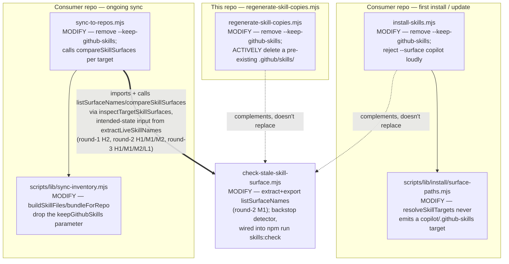

# Plan: Refactor skill-governance — remove the `.github/skills/` escape hatch everywhere it still exists

- **Date**: 2026-07-28
- **Status**: Complete
- **Author**: Claude + Test
- **Scope**: backend
- **Target domain(s)**: `install`, `tests`
- ⚠ **Cross-domain work** — touches `install` (three CLI scripts + one shared
  surface-resolution module) and `tests` (their regression coverage). This is
  the ordinary source/test split, not an architectural boundary crossing —
  noted per Phase 0.5b, not a design concern.

> **Round 1 `/audit-plan` (2026-07-28)**: NEEDS_REVISION, H:2 M:3 L:0, all 5
> valid + in-scope, all `fix-now` (no rebuttal — no disagreement with GPT on
> any point). Findings + fixes: **H1** `install-skills.mjs`'s switch parser
> would silently ignore a stray `--keep-github-skills` post-removal —
> §4 now specifies an explicit loud-reject case, not a bare deletion. **H2**
> `sync-to-repos.mjs`'s file-level plan removed the warning block with no
> replacement, leaving the exact field incident this plan cites undetected
> during sync — §4 now wires in `check-stale-skill-surface.mjs`'s own
> exported `compareSkillSurfaces`/`decideStaleSurfaceExit` as a real,
> automatic check. **M1** `resolveSkillTargets` silently returning `[]` for
> `'copilot'` is now an explicit thrown error — see §2.2. **M2** two test
> files added to §4.0 (`tests/install-surface-scope.test.mjs`,
> `tests/sync-stale-skill-detection.test.mjs`) for the H1/H2 behaviour
> (file count 8→10, later 10→12 after round 2 — see below). **M3**
> `regenerate-skill-copies.mjs`'s active-delete now has an explicit failure
> contract in §2.1/§4.
>
> **Round 2 `/audit-plan` (2026-07-28)**: NEEDS_REVISION, H:1 M:2 L:1 (down
> from H:2 M:3 — genuine design gaps in round 1's own H2 fix, not rigor
> pressure; continuing per the "concrete net-new bug" exception). All 4
> valid + in-scope, all `fix-now`. **H1** the round-1 H2 fix compared
> **post-write** on-disk `.claude/skills/` contents against stale names —
> in `--dry-run`/`--check` (explicitly-supported report-only modes, §1.4/
> §2.1/§3) no write happens, so a name that *would* newly collide is
> invisible. Fixed: comparison now uses the **intended** canonical name set
> already computed by `bundleForRepo`/`buildSkillFiles` for that target
> (forward-looking, uniform across write/no-write modes), not a post-write
> disk read. **M1** the round-1 H2 fix said `sync-to-repos.mjs` would "read
> the same way `check-stale-skill-surface.mjs`'s `main()` does" without
> actually sharing code, and left the unreadable-path case (`EACCES`/
> `EPERM`) undefined — a genuinely unreadable surface must never read as
> "no shadow." Fixed: `check-stale-skill-surface.mjs` now exports
> `listSurfaceNames(root, surface)` (extracted from its own internal
> `listSkillDirs`) with a `{names, readable, error}` contract; both
> `main()` and `sync-to-repos.mjs` call the same function — **this file is
> no longer "NOT needing modification"** (§4.0 updated; file count 10→12,
> including its own test file's one new case).
> **M2** no concrete function/contract was named for the sync-time check —
> fixed with a named seam, `_internals.inspectTargetSkillSurfaces({targetRoot,
> desiredLiveNames, logger})`, read-only by construction, feeding H1's
> intended-state input and M1's shared reader. **L1** `install-skills.mjs`'s
> own usage docblock (`:29`) still lists `--surface copilot` as a plain
> example — updated alongside the AGENTS.md sentence in Phase 4.
>
> **Round 3 `/audit-plan` (2026-07-28)**: NEEDS_REVISION, H:1 M:3 L:1. HIGH
> count held at 1 (didn't drop) — the convergence rule's plateau signal —
> but the finding is a concrete, fixable spec gap (not rigor pressure), so
> per the "genuine bug" exception it's fixed directly in this revision
> rather than spent on a disallowed 4th GPT round; **Step 6's mandatory
> Gemini gate now serves as the independent check on these fixes** — the
> intended handoff once the GPT round cap is reached. All 5 valid +
> in-scope, all `fix-now`. **H1** `desiredLiveNames` was asserted to be
> "already computed" with no concrete data contract — fixed: verified
> `bundleForRepo`'s real return shape (`{files: string[]}`, entries like
> `.claude/skills/<name>/<rel>`, confirmed by reading
> `scripts/lib/sync-inventory.mjs:189-200,265-275`) and specified the exact
> projection, `extractLiveSkillNames(files)` (below). **M1** the sync-time
> check warned only on an overlapping `shadowed` name, silently dropping
> `install-skills.mjs`'s "warn on any pre-existing tree" behaviour for a
> non-overlapping `.github/skills/` — fixed: `inspectTargetSkillSurfaces`
> now also surfaces `orphans` at a distinct message. **M2** `listSurfaceNames`
> was a static import with no injection point, so round 2's own
> unreadable-path test case wasn't actually drivable — fixed:
> default-parameter injection (`listSurfaceNamesFn = listSurfaceNames`); the
> "zero fs writes" claim is downgraded to a source-text assertion (honest
> about what it proves). **M3** the installer's new coverage was
> regex/source-pattern only, proving nothing about runtime behaviour —
> fixed: one functional child-process smoke test added alongside the
> existing source-pattern tests (layered, not replaced). **L1**
> `decideStaleSurfaceExit`/`LIVE_SURFACE` were named as sync-to-repos.mjs
> imports with no actual use — fixed: import list trimmed to
> `compareSkillSurfaces`, `listSurfaceNames`, `STALE_SURFACE`.
>
> **Step 6 Gemini final gate, round 1 (2026-07-28)**: CONCERNS — 2 new
> findings (primary reviewer), plus 3 shadow-only findings from the
> parallel, non-gating Claude Opus reviewer (`FINAL_REVIEW_SHADOW`) —
> evaluated on their merits per this session's standing practice, since 2 of
> the 3 are genuine and cheap to fix. All 5 valid, all `fix-now`. **G1**
> (Gemini, MEDIUM): the unreadable-surface branch's "exit 1 unconditionally"
> ignores `--format=json` — a JSON-expecting caller would get plaintext on
> stderr. Fixed: `main()` now emits a valid JSON envelope on that branch too
> when `--format json` was requested. **G2** (Gemini, LOW): the plan
> asserted `--keep-github-skills` "is rejected (exit 2)" without citing that
> `regenerate-skill-copies.mjs` **already has** an `ArgvError` →
> `process.exit(2)` catch-all (`:240-243`, verified) — no new code is
> needed, but the plan now cites the evidence instead of asserting an
> unverified outcome. **Shadow #1** (MEDIUM): `install-skills.mjs` doesn't
> call `resolveSkillTargets` directly — it calls
> `resolveSkillFiles(skillName, args.surface, repoRoot, files)` (`:274`),
> which internally delegates to `resolveSkillTargets`
> (`surface-paths.mjs:139`) with no swallowing in between, so the throw
> propagates correctly, but the plan's try/catch instruction named the
> wrong function. Fixed: §4 now names the real call site. **Shadow #2**
> (MEDIUM): what happens to a consumer repo's pre-existing
> `.github/skills/*` receipt entries from a prior
> `--keep-github-skills`/`--surface copilot` install? Traced
> `computeDeletes`/`authoritativeScopesFor` (`:354-385`, already-existing
> logic, no code change needed) — a `--surface both`/`agents` run naturally
> treats those entries as "no longer in the manifest" and prunes them via
> the existing delete-pruner, for free; a `--surface claude`-only run
> correctly leaves them alone (out of its scope authority, same invariant
> `tests/install-surface-scope.test.mjs` already pins). Documented in §5
> rather than coded — no new migration path needed. **Shadow #3** (LOW):
> `listSurfaceNames`'s contract only explicitly named `EACCES`/`EPERM`; a
> stray non-directory path (`ENOTDIR`) was unstated. Fixed: the contract now
> states any `readdirSync` throw (any `err.code`) maps to `readable:false` —
> already true of the implementation, now stated plainly.
>
> **Step 6 Gemini final gate, round 2 (2026-07-28)**: CONCERNS — 3 new
> findings (primary), shadow reviewer's own primary verdict flipped to
> **APPROVE** (3 shadow-only LOW findings remained). This is round 2, the
> nominal cap — but 2 of the 3 primary findings are concrete, verified
> correctness bugs (the "genuine bug" exception), so they're fixed directly
> and one more (3rd) round is run, per the doctrine's rare-exception clause,
> rather than stopping on a real bug. **G2** (MEDIUM, real bug): the
> `listSurfaceNames` extraction kept the original `fs.existsSync` pre-check,
> which swallows EACCES the same as ENOENT, so an unreadable directory
> would short-circuit to a false "clean" read before `readdirSync` ever ran
> — defeating round-2's own M1 fix. Fixed: no `existsSync` pre-check;
> `readdirSync` runs directly in a try/catch, `ENOENT` → clean,
> anything else → `readable:false`. **G3** (MEDIUM, real bug, verified
> against `:159,171-173,199`): `--check` mode's exit code depends on
> `stats.deletes`, and the active-delete function never specified
> incrementing it — a pending `.github/skills/` removal would silently
> report exit 0 in `--check` mode. Fixed: increment `stats.deletes` in both
> the real-delete and report-only branches. **G1** (MEDIUM): claimed the
> path-building uses `path.join` and would break on Windows —
> **CHALLENGED with evidence**: read `buildSkillFiles`, `enumerateSkillFiles`,
> `collectDirectoryMd` directly; all three use forward-slash template
> literals, never `path.join`; the claim doesn't hold against current
> source. The regex was hardened to accept either separator anyway (free
> insurance, not a concession the claim was correct). **Shadow #1** (LOW):
> grep-verified across all of `tests/` that exactly one file calls
> `resolveSkillFiles`/`resolveSkillTargets` (`tests/install/surface-paths.test.mjs`,
> already in scope); `receipt.test.mjs`'s fixtures are hand-built, unaffected.
> **Shadow #2** (LOW): `regenerate-skill-copies.mjs`'s **own** module
> docblock (`:2-27`) also documents the escape hatch and was missed by the
> round-2 L1 fix (which only caught `install-skills.mjs`'s) — added to this
> file's own section. **Shadow #3** (LOW): the risk register's "never
> crashes the sync loop" claim needed an actual try/catch at the call site,
> not just `listSurfaceNames`'s own non-throwing contract — added.
>
> **Step 6 Gemini final gate, round 3 (2026-07-28) — STOPPING HERE.**
> `CONCERNS_REMAINING` (primary), `CONCERNS_REMAINING` (shadow). This
> already exceeded the nominal 2-round cap once (round 2's genuine-bug
> exception for G2/G3); per doctrine a second extension needs an even
> higher bar, and this round's findings don't clear it — they're groundable
> claims and readability/completeness nits, not new design defects. Per
> "After round 2… implementation-completeness or rising nits → STOP,"
> stopping now, not running a 4th round. Findings: **G1** (primary,
> MEDIUM) claimed `.github/workflows/`/`package.json` might already invoke
> `--keep-github-skills`, risking a broken CI on removal — **grounded**:
> `grep -rn "keep-github-skills" package.json .github/workflows/` returns
> zero matches (verified live); no such call site exists to break. **Shadow
> #1** (MEDIUM) worried the `keepGithubSkills` parameter removal might
> desync `tests/sync-inventory-parity.test.mjs`'s array-equality assertions
> — **grounded**: that test (read in full earlier this session) compares
> `CORE_ENTRY`/`CORE_ASSETS`/`LEARNING_ENTRY`/`ARCH_ENTRY`/`DEBT_ENTRY`/
> `SYNC_ISOLATION_ENTRY` only; none reference `keepGithubSkills` or the
> skill-copy escape hatch (verified: zero matches for that string in that
> file) — a boolean parameter removed from `buildSkillFiles`'s signature
> doesn't touch these arrays' contents. **Shadow #2** (MEDIUM) — a genuine,
> no-code-change design tradeoff, addressed in §5's risk register: `main()`'s
> unconditional exit-1 now also fires on an unreadable **live**
> `.claude/skills/` surface, not just the stale one — accepted
> deliberately, since `.claude/skills/` is a committed, tracked directory
> that should always be readable in a normal checkout; an unreadable live
> surface is itself worth a loud pre-push failure, not a silently-swallowed
> "0 skills, clean" read (the exact anti-pattern M1 exists to close).
> **Shadow #3** (LOW, doc-sweep completeness — README.md, runbooks,
> adopter-handoff docs, `.cli-catalog.json`): deferred to
> `## Out of Scope (Future)` below — an unbounded prose-mention sweep is
> independent of the three write paths this plan actually closes. **Shadow
> #4** (LOW, plan-readability): a fair, self-aware point — this
> audit-history header has grown long relative to the net code change —
> acknowledged, not restructured: this repo's own convention (every shipped
> plan in `docs/plans/`) keeps its full round-by-round Implementation Log
> as permanent record, not just the final spec, and this header follows
> that same convention one phase earlier.

> Origin: today's debt-review clustering pass (`node scripts/debt-review.mjs`),
> cluster `skill-governance` (leverage 3.5, EASY effort). Three ledger entries
> — topicIds `43795dba`, `859011b3`, `980f2d49`, all HIGH severity, all
> deferred 2026-07-16 from audit run `audit-code-fswin-1784211544` — all
> describe the identical defect in `scripts/regenerate-skill-copies.mjs`: an
> opt-in `--keep-github-skills` flag that resurrects the deprecated
> `.github/skills/` directory, and a default path that only WARNS about an
> existing one rather than deleting it, contradicting the load-bearing
> invariant ("`.github/skills/` must remain deleted") documented in AGENTS.md.
>
> **Verifying against current source (2026-07-28) found the defect is real
> but the debt-review's own file list is too narrow.** The identical escape
> hatch — same shape, same default-preserves-not-deletes behaviour — exists
> independently in **three** places, not one. See §1.3 Code Trace for the
> full evidence; this is why this plan's scope (6+ files) is wider than the
> debt-review's own "EASY, 3 files" estimate, per this plan's own explicit
> instruction to flag exactly that discrepancy rather than silently match the
> debt-review's framing.

---

## 1. Context Summary

**Detected scope**: `backend` (three CLI scripts + one shared library module
+ their tests — no UI surface). **Stack**: `js-ts` (ESM, Node built-in test
runner).

### 1.1 Neighbourhood considered

Architectural-memory query (`get-neighbourhood`, intent: "remove the
`--keep-github-skills` escape hatch and default preserve-existing behaviour
from the skill-copy generator") returned `warnGithubSkillsDeprecation`
(`scripts/regenerate-skill-copies.mjs:50-60`) at `bandReason:
above-floor-standout`, `recommendation: precedent` — confirming this symbol
is indexed and central to the defect. The same query surfaced, at lower but
still meaningful similarity, **`maybeWarnGithubSkillsDeprecation`
(`scripts/install-skills.mjs:255-269`)** — a second, independently-written
function with a nearly identical name and purpose. That single result is
what widened this plan's scope; see §1.3.

### 1.2 Security incident neighbourhood

`get-incident-neighbourhood` returned 2 records (INC-001, path-canonicalisation;
INC-002, the Supabase wipe), **neither with path overlap**
(`pathOverlap: false` for both) and both driven mostly by generic semantic
similarity rather than concrete relevance (composite scores 0.51/0.47). This
plan doesn't cross a security trust boundary — no credentials, no DB writes,
no parsing of untrusted input; it deletes/skips writes to a local (or
consumer-repo) directory based on a CLI flag the operator supplies. No
**Security Considerations** section is required.

### 1.3 Code Trace — what exists today, and why this plan's scope grew

The debt-review and all three raw ledger entries name only
`scripts/regenerate-skill-copies.mjs`. Verified against current source
(2026-07-28), the identical "opt-in resurrect + warn-only default" shape
exists **independently in three places**, none of which call each other or
share a helper:

1. **`scripts/regenerate-skill-copies.mjs`** — `KEEP_GITHUB_SKILLS`
   (`:38`, read again at `:184`'s `KNOWN_FLAGS`); `warnGithubSkillsDeprecation()`
   (`:50-60`) warns but never `fs.rmSync`'s an existing `.github/skills/`.
   This is the file the 3 ledger entries name; it regenerates **this repo's
   own** `.claude/skills/` (and formerly `.github/skills/`) tree.
2. **`scripts/install-skills.mjs`** — an independent `--keep-github-skills`
   flag (`:61` default, `:84` parse), `maybeWarnGithubSkillsDeprecation()`
   (`:255-269`, same warn-not-delete shape), gating whether the `'copilot'`
   surface is filtered out of the write set (`:275`:
   `if (!args.keepGithubSkills) surfaces = surfaces.filter(t => t.surface !== 'copilot')`).
   This installs the skills bundle into a **consumer repo**, fresh or updating.
3. **`scripts/sync-to-repos.mjs`** (feeding `scripts/lib/sync-inventory.mjs`)
   — a third independent `--keep-github-skills` flag (`:143`, `:753`'s
   `KNOWN_FLAGS`) and deprecation-warning block (`:765-771`), gating whether
   `.github/skills/*` is included in the file bundle `sync-inventory.mjs`'s
   `buildSkillFiles`/`bundleForRepo` (`:189`, `:197`, `:265`, `:272`) computes
   for every `npm run sync` push into a **consumer repo's git tree**.

Fixing only #1 (matching the debt-review's literal file list) would leave
the identical risk fully live in #2 and #3: a consumer repo could still run
`install-skills.mjs --keep-github-skills`, or this repo's own
`npm run sync -- --keep-github-skills`, and actively recreate the exact
shadow-risk this plan exists to close. Per AGENTS.md's "scope is decided by
impact, not authorship" test, all three are load-bearing and in scope.

Also traced: **`scripts/check-stale-skill-surface.mjs`** (added 2026-07-19/20
— *after* these ledger entries were filed — motivated by a real field
incident: a consumer repo's untracked 9-skill `.github/skills/` tree
silently shadowed the live `.claude/skills/` copies, because VS Code
Copilot resolves `.github/skills` first on a name collision). It is wired
into `npm run skills:check` and provides **drift detection** for a
resurrected `.github/skills/` tree; it references neither
`--keep-github-skills` nor either deprecation-warning function, and needs no
change. It is the backstop this plan's fix **complements, not replaces** —
this plan closes the generators' ability to keep *actively recreating* the
surface; `check-stale-skill-surface.mjs` remains the safety net for a tree
that appears despite that (a bad manual merge, a stray copy).

**One further live coupling found while tracing #2**: `install-skills.mjs`'s
`'copilot'` surface resolves through a **shared** library function,
`scripts/lib/install/surface-paths.mjs::resolveSkillTargets` (`:114-117`),
which is the actual, single place that maps `surface: 'copilot'` →
`.github/skills/<name>`. `install-skills.mjs`'s own flag-gated filter (`:275`)
is a downstream symptom of that shared function still being able to produce
a copilot target at all — see §2.2.

### 1.4 Patterns reused vs new

**Reused**: this repo's existing `--dry-run`/`--check` report-only convention
(`regenerate-skill-copies.mjs` already has it — the fix reuses the same
`opts.dryOrCheck` branch its own `pruneOrphanSkillDirs`/`pruneFilesNotInSource`
already use); `assertKnownFlags` (`scripts/lib/cli-io.mjs`), already used by
`regenerate-skill-copies.mjs` and `sync-to-repos.mjs` — removing the flag
from each `KNOWN_FLAGS` list makes a stray future `--keep-github-skills`
invocation a loud, immediate rejection (exit 2) rather than a silent no-op.
`install-skills.mjs` uses its own pre-existing `switch`-based arg parser
(unrelated, unchanged convention) that silently ignores an unrecognized flag
— not retrofitted with `assertKnownFlags` here, since that would be a second,
unrelated fix outside this plan's declared scope.

**New**: two small, narrowly-scoped additions, not a new abstraction or
module — round 1 `/audit-plan` finding H2, refined by round 2's H1/M1/M2.
(1) `check-stale-skill-surface.mjs` exports one more pure reader,
`listSurfaceNames` (an extraction of logic that already existed as a
private helper in that file — not new logic, just a wider export surface
with an explicit unreadable-path branch it didn't have before). (2)
`sync-to-repos.mjs` gains one small orchestration function,
`_internals.inspectTargetSkillSurfaces` — read-only, no persistence, no
config, calling straight through to (1) and the existing
`compareSkillSurfaces`. **Right-sizing three lines** (§5 gate, since this
is new structure): band-aid extreme — leave round 1's post-write disk
comparison as-is and accept the `--dry-run`/`--check` blind spot round 2
found; over-engineered extreme — build a generic "surface diff" abstraction
with pluggable comparators/config for a problem that has exactly one
concrete instance; chosen — one named function with a 3-field return
contract, serving the one real requirement (detect a shadow at the one
moment sync can introduce it, correctly in every supported mode), nothing
generic or pluggable. Otherwise this plan **deletes** code paths (a flag, a
filter, a branch of a shared resolver) and **upgrades one warn to an active
delete**; it introduces no new dependency or persistent artifact.

---

## 2. Proposed Architecture



### 2.1 Decision — active deletion vs warn-only, decided per write path (#11 Testability, #14 Error Handling)

Two different default behaviours, deliberately:

- **`regenerate-skill-copies.mjs`** fully owns the `.claude/skills/` (and
  formerly `.github/skills/`) tree *within this repo* — it already actively
  prunes stale generated content elsewhere (`pruneOrphanSkillDirs`,
  `pruneFilesNotInSource`). Consistent with that existing philosophy, its
  default (no flags) now **actively deletes** a pre-existing
  `.github/skills/` tree — respecting `--dry-run`/`--check`, which report the
  would-be deletion without touching disk, exactly like every other mutation
  in this script. This is the tool that regenerates this exact tree; leaving
  stale deprecated output for a human to notice and delete manually is the
  same "warn instead of enforce" gap this whole plan closes.

  **Failure contract for the active delete** (round-1 audit M3 — undefined
  before this revision): deletion is a **required precondition**, ordered
  strictly before the copy-in of canonical `.claude/skills/` content, never
  interleaved with it — a half-deleted `.github/skills/` next to a
  half-copied `.claude/skills/` is a worse state than either failure alone.
  `fs.rmSync` is wrapped in try/catch; on failure (`EBUSY`/`EPERM`/`EACCES`
  — a locked file, a permissions issue), print a contextual error naming the
  exact path, the underlying `err.message`, and a remediation hint (close
  any program holding the path open / check filesystem permissions), then
  `process.exit(1)` **before** any copy step runs. A missing `.github/skills/`
  directory (`!fs.existsSync`) is a silent no-op success — idempotent, not an
  error. `--dry-run`/`--check` report the would-be deletion and never call
  `fs.rmSync`, matching every other mutation this script performs.
- **`install-skills.mjs`** and **`sync-to-repos.mjs`** both write into a
  *third party's* repo (a consumer's local checkout; a consumer's git tree,
  respectively). Actively deleting a directory in someone else's repository
  without an explicit prompt crosses this session's own destructive-action
  discipline, so **neither ever deletes** a pre-existing `.github/skills/`
  tree — `install-skills.mjs`'s message already points the operator at
  `check-stale-skill-surface.mjs --repo <repo>` and instructs manual
  deletion; that stays unchanged and warn-only. What changes for both
  is narrower and load-bearing: neither can **ever again actively write** new
  content into `.github/skills/`, because the escape hatch that made that
  possible — the flag itself — is removed entirely, not merely defaulted off.

  **Post-audit-code correction (audit-code round-1 H7 — see §4's
  `sync-to-repos.mjs` section)**: `sync-to-repos.mjs`'s NEW sync-time shadow
  detector (designed here as warn-only during audit-plan) was strengthened
  during code audit to **fail that repo's sync** (non-zero exit) on a
  genuine shadow — still never deleting, but no longer merely advisory.
  `install-skills.mjs` is unaffected by that change and remains warn-only as
  originally designed above; only the sync path's detector evolved further.

### 2.2 Decision — `surface-paths.mjs` stops emitting a `copilot` target at all (#5 Single Source of Truth)

`install-skills.mjs`'s own filter
(`if (!args.keepGithubSkills) surfaces = surfaces.filter(t => t.surface !== 'copilot')`)
is a symptom, not the source: `scripts/lib/install/surface-paths.mjs::resolveSkillTargets`
is the **one** place that decides `surface: 'copilot'` →
`.github/skills/<name>`, and it is a **shared** module (`install` domain) —
a second future consumer of `resolveSkillTargets` would inherit the same
live capability `install-skills.mjs`'s own filter currently has to
defensively suppress.

**Revised per round-1 audit M1** (originally: delete the `copilot`/`'both'`
branch entirely, so a bare `resolveSkillTargets(name, 'copilot', root)`
silently returns `[]`). A silent empty array is indistinguishable from "this
surface legitimately has zero targets" — the one current caller
(`install-skills.mjs`) happens to convert that into a loud error today, but
nothing in `resolveSkillTargets`'s own contract guarantees a *future* caller
does the same; it would inherit a silent no-op. Fix: `resolveSkillTargets`
keeps an explicit `case`/branch for `surface === 'copilot'` that **throws**
(`Error("surface 'copilot' (.github/skills/) was retired 2026-07-28 — see
docs/plans/refactor-skill-governance.md")`) rather than falling through to an
empty result. `install-skills.mjs` wraps its call in try/catch and turns the
thrown error into its own exit-1 message (§4) — same user-facing behaviour,
but the "unsupported surface" fact now lives once, at the shared source, not
duplicated as tribal knowledge in each caller.

`'both'` is unaffected by the throw — it is a **different** surface value,
not `'copilot'` itself, and per its own resolution branch continues to
silently narrow to `[claude, agents]` (2 targets instead of 3). `'both'` has
never specifically promised `copilot`, so this stays a quiet, correct
narrowing, not a behaviour change worth erroring on — only the bare,
explicit `'copilot'` request throws, because only there is the caller
unambiguously asking for a surface that no longer exists.

`--surface copilot` remains a documented CLI value (alongside `claude` /
`agents` / `both`). Per this plan's own thesis — a static analyzer or CLI
that can't decide/can't act must say so loudly, never silently do nothing —
`--surface copilot` alone must not silently complete a no-op install.
`install-skills.mjs` prints an explicit error naming the removed surface and
exits (1) rather than reporting success having written nothing.

---

## 3. Sustainability Notes

**Assumptions this design encodes:**

| Assumption | If it changes |
|---|---|
| `.github/skills/` stays permanently deprecated (no documented tool will ever read it again) | If a future tool needs it, this is a **new, deliberate** decision requiring its own plan — not a reason to keep a dormant escape hatch alive "just in case" today |
| `check-stale-skill-surface.mjs` remains the drift backstop | If it's ever removed/disabled, a resurrected `.github/skills/` tree in a consumer repo would go undetected again — this plan's fix (stopping the *write* paths) is independent of that detector but does not replace its value for a tree created by other means (manual copy, bad merge) |
| `install-skills.mjs`/`sync-to-repos.mjs` must not delete files in a repo they don't fully own | If this repo's own risk tolerance for automated cleanup in consumer repos changes, the warn-only default for those two scripts could be revisited — but that is a separate, explicit decision, not a side effect of this plan |

**Seams already in place, unchanged**: `check-stale-skill-surface.mjs`'s
detection gate; `--dry-run`/`--check` conventions on the two `assertKnownFlags`
CLIs. Nothing new is added.

**Pattern or exception?** Pattern — this closes the third and last live copy
of a pattern this repo's own generated-artifact-governance doctrine already
names ("`.github/skills` was a previously-generated mirror, deprecated...
Keeping `.github/skills` deleted stays load-bearing").

**Manual vs scripted (§5)**: 6 hand edits across genuinely different files
(different flag-parsing styles, different destinations, different
write-vs-consumer-repo trust boundaries) — each edit is judgment-heavy
(deciding active-delete vs warn-only per write path, §2.1) and there are
well under the "≥~5 regular/mechanical edits" codemod threshold. **By hand.**

---

## 4. File-Level Plan

### 4.0 Authoritative file inventory

**Updated per round-1 `/audit-plan` M2** — two test files added for the
H1/H2 behaviour changes (file count 8 → 10). **Updated per round-2 M1** —
`check-stale-skill-surface.mjs` now needs a small extraction (its
"NOT needing modification" status below no longer holds) plus its own
existing test file gets one new case; file count 10 → 12.

| # | File | Action | Phase | Domain |
|---|---|---|---|---|
| 1 | `scripts/regenerate-skill-copies.mjs` | modify | 1 | `install` |
| 2 | `tests/regenerate-skill-copies.test.mjs` | modify | 1 | `tests` |
| 3 | `scripts/lib/install/surface-paths.mjs` | modify | 2 | `install` |
| 4 | `tests/install/surface-paths.test.mjs` | modify | 2 | `tests` |
| 5 | `scripts/install-skills.mjs` | modify | 2 | `install` |
| 6 | `tests/install-surface-scope.test.mjs` | modify | 2 | `tests` |
| 7 | `scripts/check-stale-skill-surface.mjs` | modify | 3 | `install` |
| 8 | `tests/stale-skill-surface.test.mjs` | modify | 3 | `tests` |
| 9 | `scripts/sync-to-repos.mjs` | modify | 3 | `install` |
| 10 | `scripts/lib/sync-inventory.mjs` | modify | 3 | `install` |
| 11 | `tests/sync-stale-skill-detection.test.mjs` | create | 3 | `tests` |
| 12 | `AGENTS.md` | modify | 4 | — (doc only) |

**No longer "not needing modification"** (round-2 audit M1):
`scripts/check-stale-skill-surface.mjs` still has no reference to
`--keep-github-skills` or either deprecation-warning function (§1.3 stands),
but now needs one small extraction — see its own file section below.

### `scripts/regenerate-skill-copies.mjs` — **modify**

- Remove `KEEP_GITHUB_SKILLS` (`:38`) and its entry in `DEST_ROOTS` (`:40-43`,
  collapses to the single `.claude/skills` root) and `KNOWN_FLAGS` (`:184`).
- Replace `warnGithubSkillsDeprecation()` (`:50-60`) with an active-delete
  function (`removeStaleGithubSkills()` or similar): if `.github/skills/`
  exists, either report it would be removed (`opts.dryOrCheck`) or
  `fs.rmSync(dir, {recursive:true, force:true})` it, printing a one-line
  confirmation either way. Same `opts.dryOrCheck` gate `copyFileIfChanged`/
  `pruneFilesNotInSource` already use — no new option threading needed.
- **Gemini gate round-2 G3 (real bug, fixed)**: verified the actual exit
  logic (`:159,171-173`) — `--check` mode exits 1 iff
  `stats.writes + stats.deletes > 0`; `stats` is a plain counter object
  (`:199`) incremented by every mutating helper. `removeStaleGithubSkills()`
  must increment `stats.deletes` (by 1, for the whole-tree removal) whenever
  it detects a pending `.github/skills/` removal — in **both** the real-run
  and `--dry-run`/`--check` branches — or `--check` would report exit 0
  ("in sync") while a real, pending deletion sits undetected. This was
  unstated in the original draft; the fix is a one-line increment alongside
  the existing report/delete branch, not new machinery.
- **Gemini gate round-2, shadow finding #2**: this file's own module
  docblock (`:2-27`) independently documents the escape hatch — ``.github/skills/``
  as "optionally" generated, ``--keep-github-skills`` in its own Usage
  block, "Removed in next minor" (a promise this plan is the one honouring).
  §4's round-2 L1 fix caught `install-skills.mjs`'s stale docblock but
  missed this file's own — corrected: update `:2-27` in the same commit as
  the code removal, not left for a follow-up.
- **Why this file**: this is the file the 3 originating ledger entries name;
  it is the tool that regenerates this repo's own committed skill-copy trees.

### `scripts/lib/install/surface-paths.mjs` — **modify**

- Delete the `if (surface === 'copilot' || surface === 'both') {...}` branch
  (`:114-117`) from `resolveSkillTargets`, but **(revised per round-1 audit
  M1 — see §2.2)** replace it with two narrower branches, not one deletion:
  `'both'` resolves to `claude` + `agents` only (unchanged intent, no
  `copilot` push); a bare `surface === 'copilot'` **throws** an `Error`
  naming the retired surface and pointing at this plan, instead of falling
  through to an empty `targets` array.
- **Why this file**: the single shared source of the `copilot` →
  `.github/skills/<name>` mapping (§2.2) — fixing it here (throw, not silent
  `[]`) closes the capability AND makes "unsupported surface" a fact any
  caller gets for free, not tribal knowledge duplicated in each caller.

### `scripts/install-skills.mjs` — **modify**

- Remove `keepGithubSkills` from the `args` default (`:61`).
- **Revised per round-1 audit H1** — do NOT simply delete the
  `case '--keep-github-skills':` arm (`:84`); this file's `parseArgs` is a
  `switch` with no default/unknown-flag case, so a bare deletion makes the
  removed flag **silently ignored**, contradicting this plan's own "fail
  loudly, not silently" thesis and diverging from the other two CLIs'
  `assertKnownFlags` exit-2 behaviour. Replace the case body instead:
  ```js
  case '--keep-github-skills':
    console.error('--keep-github-skills was removed 2026-07-28 (docs/plans/refactor-skill-governance.md) — the .github/skills/ escape hatch no longer exists in this installer. Drop the flag.');
    process.exit(2);
  ```
  This is a narrow, targeted fix — not a retrofit of `assertKnownFlags` onto
  the whole file's parser, which stays out of scope per §1.4's existing
  reasoning (a second, unrelated fix).
- Remove `maybeWarnGithubSkillsDeprecation`'s flag gate (`:257`'s
  `if (args.keepGithubSkills || !fs.existsSync(stale)) return;` loses the
  first disjunct — it now always warns when the stale directory exists) and
  update its message to drop the now-false "pass `--keep-github-skills`" line.
- Delete the now-dead filter at `:275`
  (`if (!args.keepGithubSkills) surfaces = surfaces.filter(...)`) — `surfaces`
  can no longer contain a `copilot` entry once `surface-paths.mjs` stops
  emitting one.
- Add: `install-skills.mjs` does not call `resolveSkillTargets` directly —
  it calls `resolveSkillFiles(skillName, args.surface, repoRoot, files)`
  (`:274`), which delegates straight through to `resolveSkillTargets`
  (`surface-paths.mjs:139`) with no swallowing in between, so the thrown
  error propagates correctly (round-3 Gemini shadow finding #1 — the
  earlier draft's "wrap `resolveSkillTargets`" instruction named a function
  this file never calls). Wrap the actual `resolveSkillFiles(...)` call
  site at `:274` in a try/catch and turn the thrown `Error` (§2.2, M1) into
  this file's own user-facing message ("the copilot surface —
  `.github/skills/` — is no longer supported; use `--surface claude`,
  `--surface agents`, or `--surface both`") and exit 1, rather than silently
  completing a zero-write install.
- **Round-2 audit L1**: the module's own usage docblock (`:29`,
  `node scripts/install-skills.mjs --local --target /path/to/repo --surface copilot`)
  and the `--surface <s>` description block (`:341-344`) still present
  `copilot` as an ordinary example/value. Update the example to `--surface
  both` and add one line noting `copilot` is a retired legacy value that now
  errors with a pointer to the replacement values — keeping the CLI's own
  docs honest about what round-2 H1/M1/M2 actually built, not just AGENTS.md
  (file #12).
- **Why this file**: the consumer-repo installer; its own escape hatch and
  now-redundant filter both depend on this plan's other two decisions.

### `scripts/check-stale-skill-surface.mjs` — **modify** (round-2 audit M1)

- Extract the existing internal `listSkillDirs(root, surface)` into an
  **exported** `listSurfaceNames(root, surface)` with a richer, explicit
  contract: `{names: [], readable: true}` for an absent surface (clean — no
  directory is not a shadow); `{names: [...], readable: true}` for a
  readable one; `{names: null, readable: false, error: {code, message,
  path}}` when reading throws — **any** `err.code` (`EACCES`, `EPERM`,
  `ENOTDIR` for a stray non-directory path at the surface location, or
  anything else — round-3 Gemini shadow finding #3), never silently reads
  as "no shadow." **Gemini gate round-2 G2 (real bug, fixed)**: the
  original `listSkillDirs` this is extracted from opens with
  `if (!fs.existsSync(base)) return [];` — but `fs.existsSync` swallows
  **every** stat error and returns `false` for an EACCES-unreadable
  directory exactly the same as a genuinely-absent one, so keeping that
  pre-check would short-circuit before `readdirSync` ever runs, silently
  reporting `{names: [], readable: true}` for an unreadable path and
  completely defeating the round-2 M1 fix this file section exists for.
  Fixed: `listSurfaceNames` does **not** pre-check with `existsSync` — it
  calls `readdirSync(base, {withFileTypes: true})` directly inside a
  try/catch, treats `err.code === 'ENOENT'` as the absent/clean case
  (`{names: [], readable: true}`), and any other thrown code as
  `{names: null, readable: false, error: {...}}`.
- `main()` calls `listSurfaceNames` for both surfaces instead of the old
  private helper (same behaviour for the two existing happy paths — absent,
  readable). New: if either surface is `readable: false`, `main()` prints a
  warning naming the path + `error.message` and **exits 1 unconditionally**
  (not gated by `--gate`) — an inspection failure must never present as a
  clean pass, consistent with this repo's own capture-honesty doctrine
  (AGENTS.md, "audit your success paths"). **Gemini gate G1** — this branch
  must still respect `--format=json`: when JSON output was requested, emit
  a valid envelope (`{repo, staleSurface, liveSurface, status: 'error',
  inspectionError: error.message, exitCode: 1}`) to stdout before exiting,
  not plaintext to stderr — a JSON-expecting caller (a pipeline, a
  dashboard) must never receive an unparseable response on this branch.
- **Why this file**: round-1's H2 fix asserted `sync-to-repos.mjs` would
  read directories "the same way `check-stale-skill-surface.mjs`'s `main()`
  does" without actually sharing the code — round-2 M1 correctly flagged
  that as duplicated logic with an undefined failure path. Extracting one
  shared, exported reader closes both gaps in one place.

### `scripts/sync-to-repos.mjs` — **modify**

- Remove `KEEP_GITHUB_SKILLS` (`:143`) and its `KNOWN_FLAGS` entry (`:753`).
- Remove the deprecation-warning block (`:765-771`).
- **Revised across three audit-plan rounds** (round-1 H2 → round-2 H1/M1/M2 →
  round-3 H1/M1/M2/L1), **then again during audit-code** (round-1 H7): import
  only what's used — `compareSkillSurfaces`, `listSurfaceNames`,
  `STALE_SURFACE` (`compareSkillSurfaces`'s `contentOf` callback ignores its
  surface argument here — see below — so `LIVE_SURFACE` is never
  referenced; `decideStaleSurfaceExit` is likewise unused here — sync's own
  fail/don't-fail decision is `decideShadowFailure`, a separate function
  added during audit-code, below). Add three functions:
  ```js
  // Round-3 H1 — the concrete, verified projection from a bundle's file
  // list (bundleForRepo/getSyncInventoryForRepo return {files: string[]},
  // entries shaped `.claude/skills/<name>/<rel-path>` per
  // sync-inventory.mjs's buildSkillFiles) to the skill-name set that
  // matters for shadow detection. Gemini gate round-2 G1 claimed these
  // paths come from `path.join` and would carry backslashes on Windows,
  // blinding the regex — CHALLENGED with evidence: buildSkillFiles (:189-200),
  // enumerateSkillFiles, and collectDirectoryMd (scripts/lib/skill-packaging.mjs)
  // all build these strings with forward-slash TEMPLATE LITERALS
  // (`` `.claude/skills/${name}/${rel}` ``, `` `${relDir}/${ent.name}` ``),
  // never `path.join`, verified by reading all three call sites — the
  // claim doesn't hold against current source. The `[\\/]`-tolerant regex
  // above is kept anyway as a zero-cost hardening against a future
  // refactor introducing path.join here, not as an admission the claim
  // was correct today.
  function extractLiveSkillNames(files) {
    const names = new Set();
    for (const f of files) {
      const m = /^\.claude[\\/]skills[\\/]([^\\/]+)[\\/]/.exec(f);
      if (m) names.add(m[1]);
    }
    return [...names].sort();
  }

  // _internals export
  inspectTargetSkillSurfaces({
    targetRoot, desiredLiveNames, logger = console,
    listSurfaceNamesFn = listSurfaceNames, // round-3 M2 — injectable for tests
  }) {
    const stale = listSurfaceNamesFn(targetRoot, STALE_SURFACE);
    if (!stale.readable) {
      logger.warn(`[stale-skill-surface] cannot inspect ${STALE_SURFACE} under ${targetRoot}: ${stale.error.message}`);
      return { shadowed: [], orphans: [], inspectionError: stale.error };
    }
    const { shadowed, orphans } = compareSkillSurfaces({
      staleNames: stale.names, liveNames: desiredLiveNames, contentOf: () => null,
    });
    if (shadowed.length > 0) {
      logger.warn(`[stale-skill-surface] ${targetRoot}: ${shadowed.map(s => s.name).join(', ')} would be shadowed by a stale ${STALE_SURFACE}/ tree — see check-stale-skill-surface.mjs --repo ${targetRoot}`);
    }
    // Round-3 M1 — a non-overlapping stale name is not a live shadow, but it
    // is still the exact deprecated debt install-skills.mjs already warns
    // about unconditionally; surface it too so this check-site isn't
    // silently narrower than the installer's.
    if (orphans.length > 0) {
      logger.warn(`[stale-skill-surface] ${targetRoot}: deprecated ${STALE_SURFACE}/ contains ${orphans.join(', ')} with no live counterpart today — consider removing (see check-stale-skill-surface.mjs --repo ${targetRoot})`);
    }
    return { shadowed, orphans, inspectionError: null };
  }

  // Audit-code round-1 H7 (real gap, fixed): the design above was warn-only
  // — sync could report success while Copilot kept resolving a stale
  // .github/skills/ copy, recreating the exact field incident (§1.3) this
  // whole plan exists to prevent. Extracted as its own pure, testable
  // decision (mirrors decideStaleSurfaceExit in check-stale-skill-surface.mjs):
  // a genuine SHADOW fails this repo's sync; an orphan-only result stays
  // advisory. Never deletes anything — only decides whether the CLI's own
  // repoErrors/totalErrors counters (and therefore its final exit code)
  // reflect the shadow.
  function decideShadowFailure(inspection, repoName) {
    if (inspection.shadowed.length === 0) return null;
    return `stale-skill-surface FAILURE: ${inspection.shadowed.map(s => s.name).join(', ')} ` +
      `shadowed by ${STALE_SURFACE}/ — remove that directory before this sync can succeed for ${repoName}`;
  }
  ```
  The CLI's target loop calls `extractLiveSkillNames` on that target's own
  `bundleForRepo`/`getSyncInventoryForRepo` result (already computed to
  drive the sync — no new computation), then `inspectTargetSkillSurfaces`
  once per target immediately after — **wrapped in its own try/catch at the
  call site** (Gemini gate round-2, shadow finding #3): an unexpected throw
  from this check must never abort the whole multi-repo sync over one
  target's advisory-turned-conditional-failure check. The call site catches
  any exception from `inspectTargetSkillSurfaces` itself, logs it the same
  way as an `inspectionError`, and continues to the next target — this
  try/catch boundary is unaffected by the H7 escalation below.
  **Round-2 H1 fix preserved**: `desiredLiveNames` is never read from
  post-write disk, so detection is identical whether or not `--dry-run`/
  `--check` suppress the actual write. **Round-3 M2 fix**:
  `listSurfaceNamesFn` is a real injection point (default parameter), so the
  round-2 unreadable-path test case is drivable without module-mocking
  machinery. **Audit-code round-1 H7 (revises §2.1's original "warn, never
  block" framing for this detector specifically)**: a genuine shadow now
  calls `decideShadowFailure` and, on a non-null result, increments
  `repoErrors`/`totalErrors` — so the sync's own final
  `process.exit(totalErrors > 0 ? 1 : 0)` reflects it. Never deletes
  anything; an orphan-only result stays advisory (no failure).
- Update the call into `bundleForRepo`/`buildSkillFiles` to stop passing
  `keepGithubSkills` (paired with file #10).
- **Why this file**: the third independent copy of the escape hatch,
  specifically for the recurring consumer-repo sync path, and (after H2/H1/M2)
  the one point in the write path where a real-time, intended-state
  stale-surface check belongs.

### `scripts/lib/sync-inventory.mjs` — **modify**

- Remove the `keepGithubSkills` parameter from `buildSkillFiles` (`:189`,
  dropping the `:197` conditional push), `bundleForRepo` (`:265`, `:272`),
  `getSyncInventoryForRepo`, and `getAllConsumerInventories` — each always
  behaves as `keepGithubSkills: false` did before.
- **Why this file**: `sync-to-repos.mjs`'s only caller of this logic; the
  parameter must be removed here in the **same commit** as its one call site
  update (file #9) — a phase boundary between them would leave one commit
  calling a function with an argument the function no longer declares.

### `tests/regenerate-skill-copies.test.mjs` — **modify**

Add regression coverage (Tier 1 — deterministic seam, lands with its
behaviour per AGENTS.md's Testing Doctrine):
- A pre-existing `.github/skills/` tree is actively removed on a real run.
- `--dry-run`/`--check` **report** the would-be removal without touching the
  filesystem (mirrors the existing `--dry-run` safety-flag tests already in
  this file for `copyFileIfChanged`).
- `--keep-github-skills`, now absent from `KNOWN_FLAGS`, is **rejected**
  (exit 2) if still passed. **Grounded per Gemini gate G2**: this needs no
  new code — `main()` already wraps its `assertKnownFlags` call in a
  try/catch mapping `ArgvError`/`err.code === 'ARGV_ERROR'` to
  `process.stderr.write(err.message)` + `process.exit(2)` (`:240-243`,
  verified against current source, the same catch-all every other unknown
  flag on this CLI already goes through); removing the flag from
  `KNOWN_FLAGS` alone makes a stray `--keep-github-skills` fall into this
  existing path. The test proves the removal is loud via the CLI's existing
  contract, not a new one.
- **Round-1 audit M3**: the deletion failure contract — mock `fs.rmSync` to
  throw (`EBUSY`) and assert the run exits non-zero with a message naming
  the path, and that no `.claude/skills/` copy step ran afterward; assert a
  repo with **no** `.github/skills/` directory at all is a clean no-op exit.

### `tests/install/surface-paths.test.mjs` — **modify**

- `'returns copilot target for copilot surface'` (currently asserts
  `targets.length === 1`, `surface === 'copilot'`) is rewritten per
  **round-1 audit M1** to assert
  `assert.throws(() => resolveSkillTargets('audit-loop', 'copilot', '/repo'))`,
  not an empty-array return.
- `'returns 3 targets for both surface'` becomes **2** targets
  (`['agents', 'claude']`, no `'copilot'`).
- The `'claude'` surface test is unaffected.

### `tests/install-surface-scope.test.mjs` — **modify** (round-1 audit M2, round-3 audit M3)

This file already source-pattern-tests `install-skills.mjs`'s internals
(regex-matching the raw file text, the established convention for this
specific file's private, unexported `parseArgs`/scope-guard logic — see its
existing `authoritativeScopesFor` tests). Add one new `describe` block in
the same style, **plus one functional block** (round-3 M3 — the
source-pattern tests alone prove the code exists, not that it runs):
- Source-pattern (unchanged intent): the source contains a
  `case '--keep-github-skills':` arm whose body calls `process.exit(2)`
  (not a bare `break`/removal); the source's `--surface copilot` handling
  wraps the surface-resolution call in a `try`/`catch` and exits 1 on the
  thrown error.
- **Functional (round-3 M3, new)**: spawn
  `node scripts/install-skills.mjs --local --target <tmp-fixture-repo> --surface copilot`
  as a real child process (`execFileAsync`, the same pattern
  `tests/db-test-container.integration.test.mjs` already uses for CLI
  smoke coverage) and assert exit code `1` + a stderr message naming the
  removed surface; likewise spawn with `--keep-github-skills` and assert
  exit code `2`. This actually executes the changed CLI contract — closing
  the gap the source-pattern tests alone leave (they can't prove argument
  parsing reaches the case or that the process exits with the promised
  code). The two styles are layered, not one replacing the other.

### `tests/sync-stale-skill-detection.test.mjs` — **create** (round-1 M2/H2; round-2 H1/M1/M2; round-3 H1/M1/M2/L1)

New file — no existing test covers `sync-to-repos.mjs`'s CLI/write-path
behaviour directly (confirmed via search: no `tests/sync-to-repos*.test.mjs`
exists; `tests/sync-inventory-parity.test.mjs` covers a different concern —
array lock-step between `sync-to-repos.mjs` and `sync-inventory.mjs`, not
this). Tests, functional (import `_internals.inspectTargetSkillSurfaces`
and `_internals.extractLiveSkillNames` from `sync-to-repos.mjs`, same
`_internals` export pattern `sync-inventory-parity.test.mjs` already relies
on, against fixture directories under the test's own tmp scratch space — no
live consumer repo):
- **`extractLiveSkillNames`** (round-3 H1): a `files` array containing
  `.claude/skills/foo/SKILL.md`, `.claude/skills/foo/references/x.md`,
  `.claude/skills/bar/SKILL.md`, and unrelated non-skill entries (e.g.
  `scripts/foo.mjs`) reduces to exactly `['bar', 'foo']` — proving the
  projection is precise, not incidentally over- or under-inclusive.
- A fixture target with a stale `.github/skills/<name>` and `<name>` present
  in `desiredLiveNames` (**not** read off `.claude/skills/` on disk —
  round-2 H1) triggers a warning naming the shadowed skill, via an injected
  capturing `logger`.
- A fixture target with no `.github/skills/` at all produces no warning and
  an empty `shadowed` array.
- **Round-2 H1's dry-run-parity case**: a target whose `.claude/skills/`
  does NOT yet contain `<name>` on disk (simulating `--dry-run`/`--check`,
  or a first-ever push before any write happened) but whose
  `desiredLiveNames` (from `extractLiveSkillNames` on the bundle's own
  computed `files`) DOES include `<name>` still produces the warning —
  proving detection no longer depends on a prior write having happened.
- **Round-3 M1's orphan case**: a fixture target with a stale
  `.github/skills/<name>` where `<name>` is NOT in `desiredLiveNames`
  produces the distinct orphan-worded warning (not silence) — closing the
  inconsistency with `install-skills.mjs`'s unconditional warn-on-existence.
- **Round-2 M1 / round-3 M2's unreadable-path case**: pass a fake
  `listSurfaceNamesFn` (the injected default-parameter, not a module mock)
  returning `{names: null, readable: false, error: {...}}` — asserts
  `inspectionError` non-null and a logged warning — never a silent
  `shadowed: []` that would misreport an unverifiable path as clean.
- The seam never calls `fs.rmSync`/any delete — asserts the "detect, don't
  delete in a repo we don't own" principle (§2.1) holds for this new call
  site too. **Round-3 M2**: the "no mutation capability" claim is a
  source-text assertion (`inspectTargetSkillSurfaces`'s function body
  contains no `fs.rmSync`/`fs.writeFileSync`/`fs.unlinkSync` reference) —
  stated honestly as a static check, not a dynamic-instrumentation claim
  the seam has no facade to support.

### `tests/stale-skill-surface.test.mjs` — **modify** (round-2 audit M1, not in original inventory)

Existing file covering `check-stale-skill-surface.mjs`'s pure functions.
Add coverage for the newly-exported `listSurfaceNames`: absent surface →
`{names: [], readable: true}`; readable surface → sorted name list; a mocked
unreadable directory → `{names: null, readable: false, error}` with the
error's `code`/`message`/`path` populated — and that `main()`'s `--gate`
exit path returns 1 on an unreadable surface regardless of `--gate` being
passed (the "inspection failure never reads as clean" contract, round-2 M1).

### `AGENTS.md` — **modify**

- The sentence "`--keep-github-skills` remains a legacy escape hatch only."
  (in the Copilot-compat section) is stale once the flag is removed from all
  three CLIs — replace with a one-line note that the flag was removed
  2026-07-28 across all three write paths, pointing at this plan.

### 4b. Implementation Phases (the `/plan` §7b block — Gate 1: 12 files, 2 subsystems — fires)

**Phase 1 — Source-repo generator.** `regenerate-skill-copies.mjs` stops
supporting `--keep-github-skills` and actively deletes a pre-existing
`.github/skills/` tree (respecting `--dry-run`/`--check`, and the round-1
audit M3 failure contract — halt-before-copy on a delete failure, silent
no-op on a missing directory) instead of only warning about it, with
regression coverage for the deletion, the failure contract, and the
now-rejected flag. Files: `scripts/regenerate-skill-copies.mjs` (modify),
`tests/regenerate-skill-copies.test.mjs` (modify).

**Phase 2 — Shared surface resolution + consumer-repo installer.**
`surface-paths.mjs::resolveSkillTargets` stops emitting a `copilot` target
and instead throws on a bare `'copilot'` request (round-1 audit M1 — not a
silent `[]`); `install-skills.mjs` drops its now-redundant flag/filter,
explicitly rejects a stray `--keep-github-skills` with exit 2 rather than
silently ignoring it (round-1 audit H1), keeps its warn-only detection of a
pre-existing tree unconditional, and catches the thrown surface error to
reject `--surface copilot` loudly (exit 1) instead of completing a silent
zero-write install. Files: `scripts/lib/install/surface-paths.mjs` (modify),
`tests/install/surface-paths.test.mjs` (modify),
`scripts/install-skills.mjs` (modify),
`tests/install-surface-scope.test.mjs` (modify).

**Phase 3 — Consumer-repo sync (coupled pair) + real-time, intended-state
stale-surface check.** `check-stale-skill-surface.mjs` gets one extraction
(round-2 M1): `listSurfaceNames` becomes an exported, richer-contract
reader (`{names, readable, error}`), and `main()`'s own `--gate` path now
hard-fails on an unreadable surface instead of risking a false-clean read.
`sync-to-repos.mjs` drops `--keep-github-skills` and its deprecation-warning
block, and — round-1 H2, corrected by round-2 H1/M2 — adds a named,
read-only `_internals.inspectTargetSkillSurfaces` seam that compares each
consumer target's on-disk stale surface against the **intended** (not
post-write-observed) canonical name set already computed by this run's own
bundle, printing a non-blocking warning on a real shadow and never deleting.
`sync-inventory.mjs` drops the `keepGithubSkills` parameter its
`buildSkillFiles`/`bundleForRepo`/`getSyncInventoryForRepo`/
`getAllConsumerInventories` accept — the coupled sync pair lands together,
since removing the parameter without updating its one call site (or vice
versa) would leave a broken intermediate commit. Files:
`scripts/check-stale-skill-surface.mjs` (modify),
`tests/stale-skill-surface.test.mjs` (modify),
`scripts/sync-to-repos.mjs` (modify),
`scripts/lib/sync-inventory.mjs` (modify),
`tests/sync-stale-skill-detection.test.mjs` (create).

**Phase 4 — Documentation close-out.** Update the stale AGENTS.md sentence
describing `--keep-github-skills` as a standing escape hatch. Files:
`AGENTS.md` (modify).

**No `## 11. Execution Clustering` block** — Gate 2 requires phases to group
into ≥2 genuinely independent, separately-auditable clusters; here all four
phases enforce the *same* invariant (`.github/skills/` must never be
re-creatable) across three thematically-identical copies of one small
defect. A reviewer needs to see all four together to confirm the asymmetric
active-delete-vs-warn-only split (§2.1) is applied *consistently*, not
clustered into separately-gated chunks that could ship out of step with
each other. The whole plan is audited as one union diff.

---

## 5. Risk & Trade-off Register

| Risk | Likelihood | Mitigation |
|---|---|---|
| A consumer repo genuinely still relies on `.github/skills/` for a reason this repo can't see | Low — AGENTS.md's own doctrine already states no documented tool reads it, and the field incident this plan traces (§1.3) is evidence of active harm, not hypothetical risk | `check-stale-skill-surface.mjs` still runs and will surface any consumer repo carrying a stale tree; the fix here only stops **this tooling** from ever re-creating one — it does not touch a consumer's own untracked files |
| `regenerate-skill-copies.mjs`'s new active-delete surprises an operator who intentionally kept `.github/skills/` for an unrelated reason | Low | The active-delete only fires inside **this** repo's own regeneration script, which already fully owns and regenerates `.claude/skills/`; `--dry-run`/`--check` report the deletion before it happens, matching every other mutation this script performs |
| `install-skills.mjs`'s new `--surface copilot` error breaks an existing automation that always passed it (previously silently produced zero writes) | Low | Zero writes was already effectively broken/no-op behaviour (confirmed by tracing `buildSkillWrites`); an explicit, immediate error is strictly more informative than a silent no-op, and existing automation using `--surface both` (the default) is unaffected |
| The two coupled files (`sync-to-repos.mjs` / `sync-inventory.mjs`) land in separate commits, leaving one calling a removed parameter | Low, but real if phases are split incorrectly | §4's own note: they are the same commit-sized unit; both land in Phase 3 together |
| `sync-to-repos.mjs`'s new per-target stale-surface inspection (H2, corrected round-2 H1/M1/M2) reads a wrong/inaccessible consumer path and throws, aborting an otherwise-healthy sync | Low | `inspectTargetSkillSurfaces` calls the shared, exported `listSurfaceNames` (round-2 M1), whose contract returns `{readable:false, error}` on a read failure rather than throwing — the seam handles that branch explicitly (logs + returns `inspectionError`, never crashes the sync loop) |
| A `--dry-run`/`--check` sync run's stale-surface warning goes stale relative to the actual (unwritten) target state | Low, and now closed by design | Round-2 H1's fix: the comparison input is the run's own computed `desiredLiveNames` (the bundle, not post-write disk), so report-only and real-write modes see identical detection — this was the exact gap round-2 H1 found in round 1's version of the fix |
| `extractLiveSkillNames`'s regex projection (round-3 H1) mis-parses a future `buildSkillFiles` output shape (e.g. a path segment change) and silently produces an empty/wrong `desiredLiveNames` | Low | The regex is anchored to the one concrete, verified shape (`.claude/skills/<name>/<rel>`) `buildSkillFiles` actually emits today (confirmed by reading `sync-inventory.mjs`); the new unit test (§6) pins the exact projection against a realistic mixed `files` array, so a future shape change fails that test rather than silently mis-detecting |
| A non-overlapping stale `.github/skills/<name>` (round-3 M1's orphan case) is still silently ignored by the sync-time check | Low, now closed | `inspectTargetSkillSurfaces` surfaces `orphans` too (distinct, lower-urgency message), matching `install-skills.mjs`'s existing "warn on any pre-existing tree" behaviour — the round-3 M1 fix |
| A warn-and-continue sync (this design as audited through audit-plan) lets a sync report success while Copilot keeps resolving a stale `.github/skills/` copy — the exact field incident (§1.3) this plan traces, just relocated to the sync path (audit-code round-1 H7) | Medium, now closed | `decideShadowFailure` (§4) makes a genuine shadow increment `repoErrors`/`totalErrors`, so the sync's own final exit code is non-zero — still never deletes anything, only refuses to report success for a target whose intended live skills are unreachable. An existing automation that previously succeeded despite a shadow will now see that repo's sync fail — this is the intended, corrective behaviour change, not a regression |
| A consumer repo's install receipt carries stale `.github/skills/*` entries from a pre-plan `--keep-github-skills`/`--surface copilot` install, and nothing cleans them up (Gemini gate shadow finding #2, round 2) | Low, already closed by existing code | Traced `computeDeletes`/`authoritativeScopesFor` (`install-skills.mjs:354-385`) — a `--surface both`/`agents` run already treats any receipt entry absent from the new write set as "no longer in the manifest" and prunes it via the existing delete-pruner; no new code needed. A `--surface claude`-only run correctly leaves those entries alone (out of its scope authority), so cleanup is deferred, not skipped, until the next broader-scope install — consistent with the existing, already-tested authority invariant |
| `check-stale-skill-surface.mjs`'s new unconditional exit-1 fires on an unreadable **live** `.claude/skills/` surface too, not just the stale one it exists to police (Gemini gate shadow finding #2, round 3) | Low — accepted tradeoff, no code change | `.claude/skills/` is committed and tracked; an unreadable copy in a normal checkout means the repo itself is broken (permissions corruption, a stray non-directory file at that path), and a hard pre-push failure is the correct, honest response — silently swallowing it into "0 skills found, clean" (today's behaviour, via `existsSync`) is exactly the anti-pattern the M1 fix exists to close. Accepted deliberately; not treated as a defect to design around |
| A stray `--keep-github-skills` invocation on `install-skills.mjs` post-H1-fix now hard-exits(2) instead of no-op-ignoring — could break an operator's existing script that passed the flag defensively | Low | The flag's entire purpose (resurrecting `.github/skills/`) is gone; a script still passing it needs to know that now, and exit 2 with a clear message is strictly more actionable than a silent no-op that leaves the operator believing the flag still does something |

**Trade-offs consciously made:**

1. **Asymmetric default behaviour** (active delete for `regenerate-skill-copies.mjs`
   vs warn-only for the other two) rather than one uniform rule. Costs a
   slightly less "clean" story across three files; buys respecting the real
   difference between owning a tree fully (this repo) and writing into a
   third party's repo (consumer installs/syncs) — see §2.1.
2. **No shared abstraction extracted** across the three copies, even though
   they're near-duplicates. Costs continued textual similarity across three
   files; buys not building new machinery for code that is being **deleted**,
   not extended — there is nothing left to share once each flag is gone (§1.4).
3. **`check-stale-skill-surface.mjs`'s own detection logic is untouched**
   (round-2 M1 only extracted an existing private helper into a named
   export — `compareSkillSurfaces`/`decideStaleSurfaceExit`/`main()`'s
   overall behaviour are unmodified for the happy paths). Its detection
   value remains independent of whether the *generators* can still write
   the surface; this plan's fix and that detector are complementary
   controls, now sharing one small reader instead of conceptually
   duplicating it.

---

## 6. Testing Strategy

**Doctrine placement (AGENTS.md three tiers)**: Tier 1 — deterministic CLI/
file-write seams, test-first. No LLM, no network, no DB. New behaviour lands
in the same commit as its test (per file, per phase).

**Unit / integration:**
- `tests/regenerate-skill-copies.test.mjs` — active-delete on a real
  pre-existing `.github/skills/` tree; `--dry-run`/`--check` report-only;
  `--keep-github-skills` now rejected by `assertKnownFlags`; **M3**: a
  mocked `rmSync` failure halts before any copy step, with a contextual
  error; a missing directory is a clean no-op.
- `tests/install/surface-paths.test.mjs` — `resolveSkillTargets('name', 'copilot', ...)`
  **throws** (M1, not a 0-length return); `'both'` returns exactly
  `['agents', 'claude']`.
- `tests/install-surface-scope.test.mjs` — **H1**: the source carries an
  explicit exit-2 `case` for `--keep-github-skills`, not a bare deletion;
  **M1's caller side**: `--surface copilot` is caught and mapped to exit 1.
- `tests/sync-stale-skill-detection.test.mjs` (new) — **H2/round-2 H1/M2,
  round-3 H1/M1/M2**: `extractLiveSkillNames`'s projection is pinned against
  a realistic mixed `files` array; a fixture target with a shadowing
  `.github/skills/<name>` in `desiredLiveNames` produces a printed warning
  naming it, **including when `<name>` isn't yet on disk under
  `.claude/skills/`** (the dry-run-parity case); a non-overlapping stale
  name produces the distinct orphan warning, not silence; the injected
  `listSurfaceNamesFn` drives the unreadable-path case without module
  mocking; a clean target produces neither warning; the seam never deletes
  (source-text assertion).
- `tests/stale-skill-surface.test.mjs` (extended, round-2 M1) — the new
  `listSurfaceNames` export: absent/readable/unreadable contract; `main()`
  hard-fails on an unreadable surface regardless of `--gate`.
- `tests/install-surface-scope.test.mjs` (extended, round-3 M3) — a real
  child-process invocation of `install-skills.mjs --surface copilot` and
  `--keep-github-skills`, asserting actual exit codes (1 and 2
  respectively), layered alongside the existing source-pattern tests.
- Existing `tests/install/*.test.mjs` suites (lifecycle, receipt,
  conflict-detector, etc.) are unaffected — none construct a `copilot`
  surface target directly; confirmed no other test file references
  `keepGithubSkills` besides the ones in §4.0 (grep-verified, §1.3).
  **Gemini gate round-2, shadow finding #1**: `'both'` narrowing from 3
  targets to 2 (§2.2) could silently break a test asserting a default
  install's file/target count — grep-verified across the whole `tests/`
  tree that `resolveSkillFiles`/`resolveSkillTargets` are called from
  exactly ONE file, `tests/install/surface-paths.test.mjs`, which is
  already file #4 in this plan's own inventory and already gets the
  2-target rewrite; `tests/install/receipt.test.mjs`'s `writes.length`-style
  assertions construct their `managedFiles` fixtures by hand (literal
  arrays, not through `resolveSkillFiles`), so they're unaffected. No
  additional test file is at risk.

**Whole-suite regression**: `npm test` must stay green; `npm run skills:check`
(which runs `check-stale-skill-surface.mjs --gate`) must continue passing —
its own logic is untouched, so this is a pure regression check, not new
coverage.

**Key edge cases**: an operator invoking the now-removed flag on either
`assertKnownFlags`-based CLI (must exit 2, not silently proceed), or on
`install-skills.mjs` (must also exit 2 per H1, via the explicit case, not
silent ignore); `install-skills.mjs --surface copilot` alone (must exit 1
with a clear message, not report a successful zero-write install); a repo
with **no** `.github/skills/` directory at all
(`regenerate-skill-copies.mjs`'s new delete-path must be a correct no-op,
not an error on a missing directory, per M3); a `regenerate-skill-copies.mjs`
delete that fails partway (M3 — must halt before the copy step, never leave
a half-deleted/half-copied state); a `sync-to-repos.mjs` target with a
genuine shadowing `.github/skills/<name>` (H2 — must warn, never delete),
including in `--dry-run`/`--check` mode before any name exists on disk
(round-2 H1); an unreadable stale-surface directory (round-2 M1 — must
report `inspectionError`, never a false-clean `shadowed: []`).

**Explicitly NOT tested**: consumer-repo behaviour beyond this repo's own
test suite (no live consumer repo is driven by this plan's tests) — that
remains `check-stale-skill-surface.mjs --repo <path>`'s job, run manually
against a real consumer when needed; `tests/sync-stale-skill-detection.test.mjs`
uses fixture directories under the test's own tmp scratch space, not a real
consumer repo.

---

## Out of Scope (Future)

Recorded per `/audit-plan`'s stopping doctrine — the Gemini final gate was
run 3 rounds (exceeding the nominal 2-round cap once, for round 2's
genuine correctness bugs G2/G3), then stopped at round 3 rather than run a
4th: round 3's remaining findings were groundable claims (closed with
evidence, no code change) and completeness/readability nits, not new
design defects — the documented stop signal, not silent abandonment.

- **Repo-wide documentation sweep for `copilot`/`.github/skills` mentions**
  (Gemini gate round 3, shadow finding #3) — `README.md`,
  `docs/runbooks/consumer-adoption.md`, `docs/adopter-handoff/migration-playbook.md`,
  `docs/adopter-handoff/template-surfaces.json`, `scripts/.cli-catalog.json`,
  and any other prose that may still describe the copilot surface as a
  live install destination. **Independent** of this plan's actual scope:
  the three *write paths* (`regenerate-skill-copies.mjs`, `install-skills.mjs`
  + `surface-paths.mjs`, `sync-to-repos.mjs` + `sync-inventory.mjs`) are
  fully closed by this plan regardless of how many historical doc mentions
  remain uncorrected — a stale runbook sentence cannot recreate
  `.github/skills/` the way a live code path can. Worth a follow-up grep
  sweep, not a blocker here.
- **Plan-document length/signal-to-noise** (Gemini gate round 3, shadow
  finding #4) — this document's accumulated round-by-round audit narrative
  is long relative to the net code change. Acknowledged as a fair
  observation, not acted on: this repo's convention keeps the full
  Implementation Log as permanent record on every shipped plan; this
  header follows the same convention earlier in the lifecycle. A future
  session could consolidate the header into a single "final design"
  summary with the round-by-round detail moved to an appendix, if plan
  length becomes a genuine review bottleneck — not a correctness concern
  today.

---

## Implementation Log

### 2026-07-28 — implemented via `/cycle --autonomous`

**Completed**: all 12 files implemented per the audited plan (§4), across
Phases 1–4, as a single unclustered unit (below the §11 threshold). All
new/changed behaviour landed with its own test in the same commit-sized
unit, per this repo's Testing Doctrine.

**Audit-code** (4 rounds, `/audit-code --scope diff`, R2+ ledger suppression
+ debt capture): Round 1 (after an OpenAI 429 quota outage forced a retry)
found H:8 M:10 L:1 — fixed 3 genuine bugs (an `existsSync`/EACCES
conflation in `removeStaleGithubSkills`, matching a class already fixed
elsewhere; a sync-time shadow that only warned instead of failing the
sync — see below), suppressed 2 pre-existing intentional duplications via
`@duplicate-justification` pragmas, deferred 13 pre-existing/independent
findings as tracked debt. Round 2 found H:1 M:4 — fixed a genuine false-
assurance test bug (a regex that captured only a function's parameter
list, never its body) and one more duplication pragma; deferred 3 more
(one the plan's own explicit, twice-audited architectural decision — no
shared retirement-policy module, per §1.4/§5's trade-off #2). Round 3
found H:1 M:4 L:2 — fixed a real root-vs-surface `ENOENT` conflation in
`listSurfaceNames`, a stale test docstring plus a missing wiring-level
test, a narrow fs-method assertion list, and a stale docblock
contradiction; deferred 2 more. Round 4 found H:1 M:2 — all three exact,
zero-new-content re-raises of already-deferred concerns (one reaching its
4th independent confirmation) — converged via accepted deferrals per the
rigor-pressure/plateau doctrine, HIGH having already dropped 8→1 in round
1→2 with no genuine new substance since.

**Deviation — H7 (audit-code round 1, the most significant design change
since the plan was audited)**: the sync-time stale-surface detector, designed
during audit-plan as warn-only (§2.1's "warn, don't delete" principle,
correctly applied to *deletion*), was found to also warn-and-continue on
the *sync's own success/failure signal* — letting a sync report success
while Copilot kept resolving a stale `.github/skills/` copy, recreating
the exact field incident (§1.3) this whole plan traces, just relocated
from install to sync. Fixed by extracting `decideShadowFailure` as a pure,
tested decision: a genuine shadow now increments `repoErrors`/`totalErrors`
so the sync's own exit code is non-zero — still **never** deleting
anything, only refusing to claim success for a target whose intended live
skills are unreachable. §2.1/§4/§5 have been corrected in place to
describe this as the final design (a real Gemini-gate finding: the
original draft still asserted "never blocks the sync" after this fix
landed, which the plan and the shipped code then contradicted).

**Gemini final gate** (mandatory, `gemini-review.mjs`): Round 1 returned
`CONCERNS_REMAINING` — 1 new primary finding (`resolveSkillTargets` silently
returned `[]`, not a throw, for a genuinely unrecognized `--surface` typo;
fixed with a final validation), 1 correctly-challenged `wrongly_dismissed`
(round-1's dismissal of `check-stale-skill-surface.mjs`'s malformed
`--repo` handling wrongly cited a plan exemption that only ever applied to
`install-skills.mjs`; fixed — `--repo` with no value or another flag as its
value now exits 2 instead of silently defaulting to `cwd`), plus 3
shadow-only findings (the plan/code divergence above; `listSurfaceNames`'s
round-3 root-existence check itself used `existsSync`, reintroducing the
exact EACCES-swallowing defect fixed three times elsewhere — replaced with
an `lstatSync` probe; a LOW dead-branch observation in
`authoritativeScopesFor` — documented in place, not removed, since it's
load-bearing for pruning pre-existing copilot-scope receipt entries).

**Remaining**: none — all HIGH/MEDIUM findings across both the audit-code
loop and the Gemini gate are either fixed or deferred as documented,
evidenced debt (13 entries captured to the shared debt ledger, all
pre-existing/independent of this diff, several explicitly re-confirmed
across multiple rounds).
