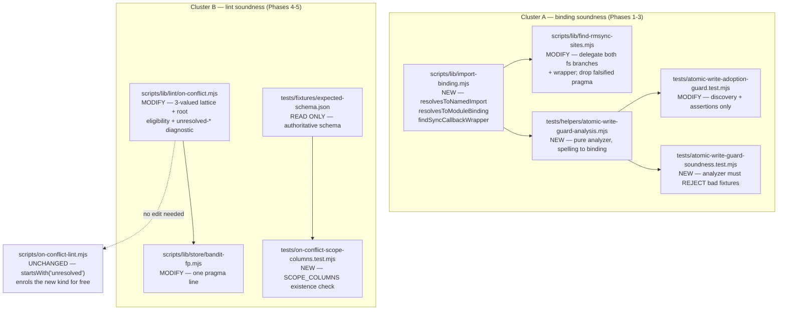

# Plan: Refactor static-analysis — make "I can't tell" representable in the repo's own guards and lints

- **Date**: 2026-07-27
- **Status**: **Complete** — implemented, code-audited (Cluster A: 6 GPT
  rounds, the max; Cluster B: 2 GPT rounds), consolidated Gemini gate APPROVE
  (1 fixed post-approval) — see Implementation Log
- **Author**: Claude + Test
- **Scope**: backend
- **Target domain(s)**: `shared-lib`, `tests`, `scripts`
- ⚠ **Cross-domain work** — touches `shared-lib` (a new binding-resolution
  primitive + the on-conflict lint), `tests` (two regression guards that are
  themselves the defect), and `scripts` (no change required — see §4). The
  `shared-lib`→`tests` direction is the ordinary source/consumer split
  (`tests`'s `allowedDeps` already include `shared-lib`); no new domain edge is
  introduced. Noted per Phase 0.5b, not a design concern.

> Origin: GPT-5.6 tech-debt clustering pass over the local debt ledger
> (`.audit/tech-debt.json`, gitignored), cluster `static-analysis`, ranked by
> leverage (3.75, MEDIUM effort). Seven raw entries (`0c1d3132`, `e54d6d52`,
> `82ab4534`, `0e18b00d`, `3f0e3fe7`, `19659d7a`, `9a7c7263`) collapse to
> **three** candidate design defects. Each was verified against current source
> on 2026-07-27 by *executing* it, not by reading the entry text — see §1 Code
> Trace and §1.4 Verification Harness. **Result: one of the three is already
> closed and is dropped; two are live; one of the two is materially narrower
> than the ledger claims.** The ledger entries are up to ~113 days old and this
> repo's doctrine is explicit that a debt entry can be invalidated by a fix
> shipped from an unrelated session — that is exactly what happened here.

---

## 1. Context Summary

**Detected scope**: `backend` (AST tooling, lint modules, Node test files — no
UI surface). **Stack**: `js-ts` (ESM, Node built-in test runner).

### 1.1 The one-sentence thesis

Every live defect in this cluster is the same root cause in two independent
subsystems: **a three-valued question is answered with a two-valued type, so
"I could not determine this" is silently laundered into "this is fine."**

- The atomic-write adoption guard asks *"does this identifier refer to the
  imported helper?"* and answers with `Set.has(name)`. A name either resolves
  to the import, resolves to something else (a shadow), or does not resolve —
  and the last two collapse into **yes**.
- The on-conflict lint asks *"can this expression be null?"* and answers with a
  `boolean`. An expression is either provably nullable or — implicitly —
  provably non-null. There is no third state, so every shape the classifier
  does not recognise is laundered into **safe**.

Both are the failure mode AGENTS.md names in its pre-ship doctrine: *"audit
your success paths — ask can this return green without having actually checked
anything?"* These two modules **are the repo's own regression machinery**, which
is what makes the class expensive: a guard that falsely certifies does not just
miss a bug, it **actively supplies false assurance** that the wiring it names is
in place.

### 1.2 Code Trace — what was read, and what executing it proved

Every claim below was produced by running the real code, not by inspection.
The harness is preserved in §1.4 so a reviewer can re-run it.

#### Defect 1 — rmSync detector + its retry guard → **ALREADY FIXED. DROPPED.**

Ledger entries `0c1d3132`, `e54d6d52`, `82ab4534` claim `find-rmsync-sites.mjs`
matches by identifier spelling, misses `fs['rmSync'](...)`, and misses
optional-call forms; and that `tests/rmsync-retry-guard.test.mjs` can falsely
certify an unprotected call as `retrySync`-wrapped.

**All three are closed.** Commit `40e4a0e` ("harden vcs.mjs git-output parsing
and find-rmsync-sites.mjs scope resolution", 2026-07-27, closing
`docs/plans/refactor-install-wal-vcs-2026-07.md`) rewrote the module onto
`@babel/traverse` scope resolution earlier the same day this cluster was
triaged.

Current source:

- `scripts/lib/find-rmsync-sites.mjs:225` and `:229` — `path.scope.getBinding(...)`
  feeds `resolveFsImportKind` (`:40-77`), which requires the binding's
  declaration path to be a real `node:fs`/`fs` import specifier. A shadowing
  parameter/local/catch binding resolves to a non-import declaration and
  correctly returns `null`.
- `scripts/lib/find-rmsync-sites.mjs:215` — the visitor key is
  `'CallExpression|OptionalCallExpression'`; `:220` accepts
  `OptionalMemberExpression`; `:221-223` accepts a **computed** `StringLiteral`
  property. So `fs['rmSync'](...)` and `fs?.rmSync?.(...)` are both matched.
- `tests/rmsync-retry-guard.test.mjs:86` — `callPath.scope.getBinding(call.callee.name)`,
  then `:87` requires the binding to be an `ImportSpecifier` whose `imported`
  name is `retrySync`, then `:90-94` resolves the import source to the real
  `scripts/lib/retry-transient-fs.mjs`. Name-only matching is gone.
- `tests/find-rmsync-sites.test.mjs` — 24 dedicated regression tests added by
  the same commit, including `:18` shadowed-parameter, `:60` computed access,
  `:69`/`:78` optional forms, `:229`/`:238` the ES2022 string-literal import
  spelling, and `:249-271` the async-wrapper rejection.

Executed proof (all 9 cases correct):

```
shadow-param      -> 0    genuine member   -> 1    aliased named   -> 1
shadow-local      -> 0    computed str     -> 1    arb-module-ns   -> 1
shadow-catch      -> 0    optional call    -> 1    non-fs import   -> 0
```

**Action: dropped from this plan.** No work is proposed against
`tests/rmsync-retry-guard.test.mjs`. `scripts/lib/find-rmsync-sites.mjs` is
still touched, but for a *different* reason (§1.2 Defect 2c), not to re-fix a
closed defect.

> Corroborating signal, recorded because it is easy to misread: the Phase-0.5
> architectural-memory query returned a symbol
> `find-rmsync-sites.mjs:30-53::collectFsImportBindings` that **no longer
> exists** — the current file has `resolveFsImportKind` at `:40-77`. The symbol
> index is stale relative to a fix that landed after the last `arch:refresh`.
> That is evidence *for* "already fixed", and a caution that neither the debt
> ledger nor the symbol index is a substitute for reading current source.

#### Defect 2 — the atomic-write adoption guard → **LIVE. Four sub-defects, all false-PASS.**

Ledger entries `0e18b00d` and `3f0e3fe7`. `tests/atomic-write-adoption-guard.test.mjs`
is a committed regression guard for `docs/plans/atomic-write-adoption-remaining-sites.md`.
Its own header (`:7-15`) claims it "does real import-binding resolution". It
does not — it collects import *local names* and then compares *spelling*.

The read path: `collectNamedImportBindings` (`:30-44`) returns a `Set` of local
name strings → `functionCallsAtomicWriteFileSync` (`:150-160`) accepts any
`CallExpression` at `:157` whose callee is an `Identifier` in that set, with no
scope check → `assertAllSitesRetrySyncWrapped` (`:200-222`) does the same at
`:215` for the wrapper side → site discovery via `collectFsMethodBindings`
(`:47-62`) + `findFsMethodSites` (`:106-126`) is likewise spelling-only and, at
`:113`, requires `!callee.computed`.

Four independently-proven false-passes (harness §1.4):

| # | Shape | Guard verdict | Correct verdict |
|---|---|---|---|
| **2a** | `export function applyFixes(atomicWriteFileSync) { atomicWriteFileSync(...) }` — the import shadowed by a **parameter** | `wired ✓` | not wired |
| **2a'** | same function declaring `const atomicWriteFileSync = (p,d) => fs.writeFileSync(p,d)` — a **non-atomic local** | `wired ✓` | not wired |
| **2b** | `const retrySync = (fn) => fn(); retrySync(() => fs.renameSync(...))` — a shadowing **no-op wrapper**, zero retry protection | `wrapped ✓` | not wrapped |
| **2c** | `retrySync(async () => fs.renameSync(...))` | `wrapped ✓` | **not** wrapped |
| **2d** | `fs['renameSync']('a','b')` | site **not discovered** (0 sites) | 1 site, must be checked |

**2c is copy-drift, and it is the load-bearing argument of this plan.**
`tests/atomic-write-adoption-guard.test.mjs:81-103` is a hand-copied
`findEnclosingCall`. `scripts/lib/find-rmsync-sites.mjs:154-190` is the
original — and at `:177` it carries `if (!arrowFn || arrowFn.async) return null;`
with a five-line rationale (`:141-148`): an `async` callback returns a Promise
immediately, so an exception rejects that Promise instead of throwing
synchronously into `retrySync`'s `try/catch` — the call is **not** retry-protected
at runtime despite matching the shape. The local copy at `:95` is
`if (!arrowFn) return null;`. The shared module gained the correctness fix; the
copy did not.

That copy is explicitly excused by a `@duplicate-justification` pragma at
`scripts/lib/find-rmsync-sites.mjs:153`, whose stated rationale is that the
test's target set is fixed and does not need the module's discovery. **The
drift falsifies that rationale**: the pragma reasons about *discovery* while the
duplicated code is the *shape detector*, which has nothing to do with discovery
and is exactly what went stale. This is not a hypothetical — the divergence is
in the tree today.

**Honesty qualifier — the false-passes are latent, not live.** Executed against
all 9 real target files: none currently shadows `atomicWriteFileSync` or
`retrySync`, none uses an async wrapper, none uses computed `fs['renameSync']`.
So the guard is telling the truth *today* — **by luck, not by construction**.
The defect is the guard's reliability as a gate, not a currently-broken write
path. This plan deliberately does not claim otherwise; severity rests on
"a gate whose green is unearned" (AGENTS.md `GREEN ≠ REALIZED`), which is the
whole reason the guard is committed.

#### Defect 3 — `scripts/lib/lint/on-conflict.mjs` → **LIVE, but MATERIALLY NARROWER than claimed.**

Two halves, and they verified very differently. This is where the census
mattered most.

**3a — `isNullableExpr` unsoundness (`19659d7a`): CONFIRMED, and it contradicts
the module's own stated doctrine.**

`scripts/lib/lint/on-conflict.mjs:130-151` returns a `boolean`. Executed:

```
"repoId || fallbackRepoId"  -> false      "repoId || null"    -> true
"maybeNull && 'value'"      -> false      "repoId ?? null"    -> true
"repoId || DEFAULT"         -> false      "cond ? a : null"   -> true
"fn()" / "obj.prop" / "await x" -> false
```

End-to-end, a write of `repo_id: repoId || fallbackRepoId` with `repo_id` in the
conflict target produces **0 findings and 0 diagnostics** — indistinguishable
from a clean site. Both shapes named in the ledger entry reproduce exactly.

The `&&` arm at `:144` was hardened since the entry was filed (it now
over-approximates in the safe direction and documents why at `:137-143`), so
that specific sub-claim is partly addressed — but only for operands the
classifier can already decide. The underlying two-valued type is untouched.

What makes this a *defect* rather than a documented limitation is that it
contradicts the module's own explicit contract. Its fileoverview (`:36-40`)
states: *a call site it CANNOT resolve is reported as a diagnostic,* **never
silently treated as clean** *— "the vacuous-green trap this repo names
repeatedly."* `analyzeUpsert` honours that on the conflict-target axis
(`:85` returns early when the target is unreadable, and
`processUpsertCall:451-455` emits `unresolved-conflict-target`). The
**nullability axis has no such channel** — the module built the honesty
mechanism and then did not wire this axis into it.

**3b — hand-maintained lists (`9a7c7263`): ONE HALF ALREADY MITIGATED, the
other half is a FUTURE risk with ZERO present instances.**

- *Helper callees.* `UPSERT_CALLEES` (`:62`) is still a hand list, but commit
  `f358b7a` added a fail-closed coverage self-check at `:392-417`: any callee
  matching `/^upsert/i` (identifier) or exactly `upsert` (member) that is **not**
  recognised emits an `unrecognized-upsert-like-callee` diagnostic naming the
  registration gap. A new `upsertBatch(...)` wrapper or a raw `x.upsert(...)`
  is no longer invisible. **This half is closed enough — no work proposed.**
- *Scope columns.* `SCOPE_COLUMNS` (`:57`) = `{repo_id, user_id, repo_name}`
  is hand-maintained with no drift detection, and a `tenant_id` conflict-target
  omission produces **0 findings and 0 diagnostics** (executed). The ledger's
  premise is real.

**But the census refutes the obvious fix.** Cross-checking the hand list against
the committed schema fixture `tests/fixtures/expected-schema.json` (71 tables,
467 distinct columns, regenerated on every schema change via `npm run db:local:regen`):

```
tenancy-shaped columns actually present:  repo_id (33 tables), user_id (9), repo_name (5)
present in schema but NOT enforced today: []          <-- zero
hand-listed but absent from schema:       []          <-- zero
```

**The hand list is exactly correct today.** A derivation engine would produce a
byte-identical result and serve no current requirement — §5's right-sizing gate
is unambiguous that "might need it later" does not justify the abstraction.
See §2.3 for what is proposed instead.

### 1.3 Blast radius (measured, not estimated)

| Surface | Measurement |
|---|---|
| `.mjs` files scanned by `rmsync-retry-guard` | **1,028** (159 contain `rmSync`) |
| Real `fs.rmSync` sites the guard asserts on | ~494 at guard-authoring time; floor assertion is `>= 200` |
| `tests/atomic-write-adoption-guard.test.mjs` targets | 7 Shape-A functions + 2 Rule-2 files (13 asserted sites) |
| `scripts/lib/store/**` files the on-conflict lint scans | **27**, 26 upsert sites, 81 conflict-target column writes |
| Live on-conflict state | 0 findings, 8 suppressed, 1 diagnostic (`unresolved-conflict-target`, `plans-ship.mjs:321`) |

The 1,028-file figure is why Cluster A carries a fix-gate (§11): a behaviour
regression in `find-rmsync-sites.mjs` turns the whole suite red, and Cluster B's
own close-out runs that suite.

### 1.4 Verification harness (reproducibility)

The measurements above were produced by three throwaway scripts under
`.claude/tmp/` (Category-A artifacts — gitignored, **not** committed, per the
generated-artifact policy):

- `sa-verify.mjs` — 9 rmSync scope/computed/optional cases + `isNullableExpr`
  truth table + two end-to-end `lintSource` probes.
- `sa-verify2.mjs` — verbatim re-execution of the atomic-write guard's own
  predicates (`collectNamedImportBindings`, `functionCallsAtomicWriteFileSync`,
  the local `findEnclosingCall`, `findFsMethodSites`) against shadowing /
  async / computed fixtures. Module-path resolution is simplified to a fixed
  module id so the harness needs no real files; **the binding and callee
  predicates are byte-identical to the file under test**, which is what the
  proof rests on.
- `sa-census.mjs` / `sa-census2.mjs` — the 81-column classification census and
  the schema-fixture scope-column cross-check.

Phase 1 of the implementation converts the fixtures in `sa-verify2.mjs` into
the committed meta-test `tests/atomic-write-guard-soundness.test.mjs`, so the
proofs stop being throwaway.

### 1.5 Patterns reused vs new

**Reused (all three, deliberately — nothing here is novel):**

1. `@babel/traverse` `scope.getBinding()` — the repo's established primitive for
   lexical resolution (§2.1).
2. The `unresolved-*` diagnostic channel already in `on-conflict.mjs`, including
   its `--strict` exit-3 wiring (§2.2).
3. The `@on-conflict-ok: <reason>` suppression pragma already in
   `on-conflict.mjs:343` (§2.2).

**New:** exactly one production module, `scripts/lib/import-binding.mjs`,
holding three functions — two binding predicates (the named-import predicate that
*is* defects 2a/2b, and the module-object predicate defect 2d needs) and the
wrapper-shape detector that *provably drifted*. Plus one test-support module,
`tests/helpers/atomic-write-guard-analysis.mjs`, in an established convention
directory. Nothing else is extracted (§2.4).

### 1.6 Neighbourhood considered

Architectural-memory consultation (`get-neighbourhood`, k=8, intent: "resolve
AST lexical bindings instead of identifier spelling in regression guards and
safety lints") returned **8 records, all banded `review`** — top similarity
0.692 (`on-conflict.mjs:324::makeResolver`), below this repo's noise floor
(`bandReason: below-noise-floor-near`, cliff 0.0058 — i.e. it came close). No
`precedent` band, so no existing symbol occupies the space the new
`import-binding.mjs` would take.

Two returned symbols are read as **anti-precedents**, not reuse candidates:

- `on-conflict.mjs:324::makeResolver` — a hand-rolled frame-chain resolver. It
  resolves *row-shape* indirection (which object literal does this `rows`
  argument denote), not *lexical bindings*, and it is intra-file and
  depth-bounded by design. It is not a substitute for `scope.getBinding()` and
  Cluster B does not extend it into one.
- `atomic-write-adoption-guard.test.mjs:30::collectNamedImportBindings` — the
  defective predicate itself. It is the thing being replaced.

**Security incident neighbourhood** (`get-incident-neighbourhood`, k=3) returned
2 records, neither with path overlap (`pathOverlap: false`, composite 0.47 /
0.43). Neither is a trust-boundary crossing for this plan, so no "Security
Considerations" section is required. **INC-001 is cited anyway for its lesson,
which is the same lesson as this plan's thesis**: *"Fail-closed on resolution
errors: a missing or unresolvable target is treated as sensitive. Never 'I
couldn't classify it so I'll allow it.'"* INC-001 was a lexical path classifier
that decided on the visible string instead of the resolved target — structurally
identical to a guard that decides on the visible identifier instead of the
resolved binding. This plan applies INC-001's lesson to a second surface.

---

## 2. Proposed Architecture



The two clusters share **no code**. They share a *doctrine* (§1.1), which is why
they are one plan and two clusters rather than two plans — argued in §11.

### 2.1 Decision — `@babel/traverse` `scope.getBinding()` is the primitive (#1, #5, #11)

**Verified available and idiomatic before designing on it**, as instructed:

- `@babel/traverse ^8.0.0` is a **production** dependency in `package.json`
  (alongside `@babel/parser ^8.0.0`) — not a devDependency, no new dep needed.
- `scripts/lib/ast.mjs:22-26` is an explicit in-repo instruction: *"Not a
  traversal framework. `walk` is a deliberately small hand-rolled recursive
  walker with no scope/binding resolution. Callers that need real lexical
  analysis (`scope.getBinding`) must use `@babel/traverse` directly — its
  `Scope` API only exists on a `NodePath`, which this walker does not produce.
  See the adjacency detector for that path."*
- Four existing call sites already do exactly this:
  `scripts/lib/audit/adjacency-detector.mjs:230` and `:341` (whose `:131-133`
  docstring records that an earlier hand-rolled ancestor-chain design was
  *replaced* by it), `scripts/lib/find-rmsync-sites.mjs:225`/`:229`,
  `tests/rmsync-retry-guard.test.mjs:86`, plus `scripts/lib/install/deps.mjs`.

**Decisive argument:** defect 1's fix (`40e4a0e`) is this exact primitive
applied to this exact defect class, and it is regression-locked by 24 tests that
pass today. Cluster A is therefore a **port of a proven fix**, not a novel
design. A hand-rolled resolver would be both the over-engineering cliff and
strictly less correct — Babel's `Scope` already handles hoisting, block scope,
catch bindings, and TDZ that a hand-roll would have to re-derive.

**The three-valued shape is what matters.** `scope.getBinding(name)` returns:

| Result | Meaning | Guard verdict |
|---|---|---|
| binding whose declaration is the expected `ImportSpecifier` from the expected module | resolves to the import | **pass** |
| binding whose declaration is anything else (param, local, catch, different import) | **shadowed** | **fail — loudly** |
| `undefined` (global / unresolvable) | **cannot determine** | **fail — loudly** |

The third row is the whole point. The current `Set.has(name)` cannot express it.

### 2.2 Decision — Cluster B: a third state routed to the module's own existing honesty channel (#6, #15, #19)

`isNullableExpr`'s `boolean` is replaced by **two** functions, split along the
layer boundary §2.2.1 defines:

- `classifyNullability(node)` → `'nullable' | 'non-null' | 'opaque'` — the pure
  lattice. **Node-only and purely syntactic; it takes no resolver** (audit
  R3-L1): it does not consult `makeResolver`, does not follow bindings, and has
  no depth limit beyond the expression tree. An expression whose nullability
  depends on a binding is exactly what `'opaque'` is for.
- `classifyColumnValue(node)` → `'nullable' | 'non-null' | 'unknown' | 'opaque'`
  — the lattice **plus** the root-kind eligibility gate, minting the payload
  value stored on the site.

`analyzeUpsert` then emits, for any conflict-target column whose stored value is
`'unknown'`, a diagnostic of kind **`unresolved-conflict-key-nullability`** — a
pure lookup, no AST.

Three properties make this right-sized rather than a rewrite:

1. **The `unresolved-` prefix is load-bearing and requires zero CLI change.**
   `scripts/on-conflict-lint.mjs:89` filters `d.kind?.startsWith('unresolved')`
   and `:137` exits 3 under `--strict`. Naming the kind in that family enrols it
   in the existing strictness contract automatically. `scripts/on-conflict-lint.mjs`
   is **not** in this plan's file set — verified, not assumed.
2. **A diagnostic, not a finding.** Findings gate (exit 1) and are drift-filtered;
   diagnostics do not gate by default. "I can't decide" is not "you have a bug",
   and inflating it to a finding would be the false-positive mirror of the defect
   being fixed.
3. **`isNullableExpr` keeps its exported boolean signature** as a thin
   `classifyNullability(...) === 'nullable'` wrapper (#18 backward compat). It is
   an existing export with existing test coverage; changing its return type is a
   breaking change this plan has no requirement to make.

**The census decided the scope of the third state.** A naive "anything I don't
recognise is `unknown`" classifier was measured first and **rejected**: it emits
**75 diagnostics across the 81 conflict-target column writes** in a clean store —
overwhelmingly bare `Identifier` (`refresh_id: refreshId`) and `MemberExpression`
(`importer_path: row.importerPath`) reads. Under `--strict` that gate would be
permanently red, which is a cried-wolf gate and worse than the defect.

```
naive  three-valued: nullable 5 | non-null 1 | unknown 75   <-- rejected
chosen (table below): nullable 5 | non-null 1 | unknown 1 | not-a-fallback 74
```

This is the *"census before calling a class too small to gate"* discipline run in
the other direction: measure before calling a class *large enough* to gate.

#### 2.2.1 The semantic contract — two layers, stated completely (audit R1-H1)

The two goals ("a bare-identifier fallback must reach `unknown`" and "a bare read
must stay quiet") are only jointly satisfiable if **leaf knowledge** and
**reporting eligibility** are separate layers. Stating only the outcome left the
mechanism underdetermined; here is the full table the implementation must satisfy.

**Layer 1 — the lattice** (`classifyNullability(node)`). Three values:
`'nullable'`, `'non-null'`, `'opaque'`. **Layer 1 never yields `'unknown'`** —
that value is minted by Layer 2 alone (Gemini gate R3; see the boundary note
below). Every node kind is assigned:

| Node kind | Class | Note |
|---|---|---|
| `NullLiteral`; `Identifier` named `undefined` | `'nullable'` | the provable case |
| `StringLiteral`, `NumericLiteral`, `BooleanLiteral`, `BigIntLiteral`, `TemplateLiteral`, `ObjectExpression`, `ArrayExpression`, `NewExpression` | `'non-null'` | a literal cannot be null |
| **any other node** — `Identifier`, `MemberExpression`, `CallExpression`, `AwaitExpression`, `TaggedTemplateExpression`, … | `'opaque'` | **this is the fix**: a dynamic read is not evidence of non-nullity |
| `a \|\| b`, `a ?? b` | `class(b)` | the fallback alone decides the result whenever `a` is absent, so `a`'s class is irrelevant |
| `a && b` | `'nullable'` if `class(a)` or `class(b)` is `'nullable'`; else `'opaque'` if either is `'opaque'`; else `'non-null'` | preserves the existing deliberate over-approximation documented at `:137-143` |
| `a ? b : c` | `'nullable'` if `class(b)` or `class(c)` is `'nullable'`; else `'opaque'` if either is `'opaque'`; else `'non-null'` | |

**Precedence rule (load-bearing):** a definite `'nullable'` path always wins over
an `'opaque'` one. A provable finding must never be downgraded to a diagnostic —
that would trade a gating signal for a non-gating one, i.e. re-introduce the
defect one level up. Both compound rows above encode this by testing `'nullable'`
first.

**Layer 2 — reporting eligibility.** Only the ROOT node of a conflict-target
column's value is consulted; recursion never emits. Layer 2 is a **separate
function that owns the root-kind test and mints the payload value**:

`classifyColumnValue(node)` → `'nullable' | 'non-null' | 'unknown' | 'opaque'`

| Layer-1 class of root | Root node kind | Payload value | `analyzeUpsert` emits |
|---|---|---|---|
| `'nullable'` | any | `'nullable'` | **finding** `nullable-conflict-key` — unchanged |
| `'non-null'` | any | `'non-null'` | nothing |
| `'opaque'` | `LogicalExpression` or `ConditionalExpression` | **`'unknown'`** | **diagnostic** `unresolved-conflict-key-nullability` |
| `'opaque'` | anything else (a bare read) | **`'opaque'`** | nothing — deliberately out of scope |

**Where Layer 2 runs, and why it is not in `analyzeUpsert` (Gemini gate R3).**
The root-kind test needs the AST; `analyzeUpsert` is deliberately AST-free (its
whole instance matrix is DB-free, node-free fixtures). So **`readRowObject` calls
`classifyColumnValue`**, not `classifyNullability`, and stores the 4-valued
result. `analyzeUpsert` then does a pure table lookup with no node access. An
earlier draft had `readRowObject` store raw Layer-1 output, which would have
handed `analyzeUpsert` an undifferentiated `'unknown'` for a bare read and a
fallback alike — emitting all 75 diagnostics, destroying the very guarantee the
census established.

**The quiet state is `'opaque'`, NOT `'non-null'`** — a deliberate departure from
the reviewer's suggested remedy. Relabelling an undecidable value as
"definitely non-null" to keep it quiet is *precisely* the laundering this whole
plan exists to remove (§1.1); it would fix the data flow by re-committing the
original sin one layer down. `'opaque'` stays honest ("undecidable, and out of
this rule's declared scope") and keeps the distinction available to any future
consumer that wants to widen the scope.

The last row is the entire 74-site quiet class, and it is a **scope decision, not
a soundness claim**: the plan does not assert those writes are non-null, it
asserts that a bare column read is not the defect class the three field instances
exhibited (all three were explicit `|| null` fallbacks) and that flagging them
would destroy the gate. §3 records this as an assumption.

Worked traces against the two shapes the ledger names, and the two that must not
regress:

| Expression | Layer-1 walk | Root kind | Payload | Emits |
|---|---|---|---|---|
| `repoId \|\| fallbackRepoId` | `class(right)` = `'opaque'` | Logical | `'unknown'` | **diagnostic** ✓ |
| `maybeNull && 'value'` | left `'opaque'`, right `'non-null'`, neither `'nullable'` → `'opaque'` | Logical | `'unknown'` | **diagnostic** ✓ |
| `repoId \|\| null` | `class(right)` = `'nullable'` | Logical | `'nullable'` | **finding** (no regression) |
| `refreshId` | `'opaque'` | Identifier | `'opaque'` | nothing (no new noise) |

This table is exactly what produced the measured `5 / 1 / 1 / 74` split, so the
census number and the specification are the same artifact, not two claims.

**The single remaining diagnostic is real and is adjudicated, not suppressed by
fiat.** It is `scripts/lib/store/bandit-fp.mjs:53`,
`context_bucket: arm.contextBucket || GLOBAL_CONTEXT_BUCKET`. `GLOBAL_CONTEXT_BUCKET`
is `export const GLOBAL_CONTEXT_BUCKET = 'global'` in `scripts/lib/config.mjs:260`
— provably non-null, but **in a different file**, and `on-conflict.mjs` is
intra-file by construction (`:44-45`: "No DB, no network"; resolver depth-capped
at 6). Cross-file resolution to silence one site is the over-engineering cliff.
The site already carries a hand comment at `:52` ("NEVER null — see above"); the
fix is to upgrade that comment to the module's existing machine-readable
adjudication — a reasoned `@on-conflict-ok:` pragma. One line, in the file whose
author holds the knowledge, using a mechanism that already exists and is already
checked for staleness (`orphaned-suppression`, `:495-498`) and for empty reasons
(`unreasoned-suppression`, `:439-442`).

This requires one small extension: today a pragma routes **findings** to
`suppressed` (`:491-502`) but does not silence diagnostics. Phase 4 extends it to
also silence a governed `unresolved-conflict-key-nullability` for the same site —
the pragma's stated purpose ("a suppression must state WHY the conflict target is
correct") covers this case exactly.

#### 2.2.2 Diagnostic identity + suppression lifecycle (audit R1-M1)

"Same site" is not a sufficient rule once one `upsert` call can carry several
conflict-target columns, a finding, and a diagnostic at once. Three things are
specified so a pragma cannot over-reach:

**1. Diagnostic identity.** Every `unresolved-conflict-key-nullability` record
carries `{ kind, file, table, line, endLine, column, callId }`, where `callId` is
the upsert `CallExpression`'s `start:end` byte span — the same join key
`tests/rmsync-retry-guard.test.mjs:51-60` already uses to reconcile nodes across
two parses. `column` makes per-column records distinguishable within one call,
which is what a per-site-only identity could not do.

**2. Pragma eligibility — kind allowlist AND column selection (audit R3-H1).**
An earlier draft gave the diagnostic a `column` field but then let a pragma
govern the whole `callId`. That is self-contradictory: it would suppress *every*
unknown at a multi-column call, defeating the very test case the draft required
(one suppressed unknown alongside an unsuppressed one on another column). The
suppression contract is therefore **signal-targeted**, and it is **additive** —
the 8 live suppressions measured on 2026-07-27 keep their exact current
behaviour:

| Pragma form | Governs | Rationale |
|---|---|---|
| `@on-conflict-ok: <reason>` (existing, no selector) | **findings only**, call-wide — byte-identical to today | back-compat; and it must NOT reach diagnostics, or every existing pragma would silently start hiding a new signal class it was never reviewed against |
| `@on-conflict-ok(<column>): <reason>` (**new** selector form) | the exact `{callId, column, kind}` signal(s) for that one column — allowlisted diagnostic **and** that column's findings | per-column precision; `bandit-fp.mjs` uses `@on-conflict-ok(context_bucket): ...` |

A selector naming a column absent from the call's row is itself reported
(`unknown-suppression-column`) rather than silently matching nothing.

**The parser change, stated explicitly (shadow-review S1).** A new pragma syntax
is inert unless the scanner is widened, and the existing scanner is a single
regex: `SUPPRESSION_RE = /@on-conflict-ok:\s*(.*)$/` (`:343`), consumed by
`findSuppression` (`:345-352`). It cannot match `@on-conflict-ok(context_bucket):`
— so without this change `bandit-fp.mjs`'s pragma would silently do nothing and
Phase 4's close-out assertion (zero `unresolved-conflict-key-nullability`) would
fail. The replacement makes the selector an **optional capture group**:

```
/@on-conflict-ok(?:\(([A-Za-z_][A-Za-z0-9_]*)\))?:\s*(.*)$/
```

`findSuppression` returns **every** match in its 3-line window as
`{ column: <group 1> | null, reason: <group 2>, line }` records — not the single
first match it returns today. That is required because a bare form and a selector
form are **not mutually exclusive**: they govern different signals, so an author
may legitimately write both above one call (shadow-review S1b). The collection is
keyed by `column ?? '*'`:

- a bare form and one or more distinct-column selectors at one call → all apply,
  each to its own scope;
- **two records sharing a key** (two bare forms, or two selectors naming the same
  column) → `duplicate-suppression` diagnostic naming both lines, and the
  **first** is applied. Reported rather than silently first-match-wins, because a
  redundant suppression is usually a copy-paste that the author believes is
  governing something it is not.

Three properties are required and each gets a named test:

- **Back-compat is exact.** For a bare `@on-conflict-ok: reason` the selector
  group is `undefined` → `column: null` → legacy findings-only call-wide
  behaviour, and `reason` captures byte-identically to today. The 8 live
  suppressions are unaffected.
- **The colon is not optional.** `@on-conflict-ok(col)` with no colon must NOT
  match (it would otherwise capture an empty reason and trip
  `unreasoned-suppression` confusingly). The identifier character class also
  refuses `@on-conflict-ok(): reason` — an empty selector is a malformed pragma,
  reported, not treated as call-wide.

The existing `\r?\n` line-splitting note (`:364-370`, the CRLF bug that made
pragmas silently stop suppressing on Windows checkouts) applies unchanged and
must not be reverted while touching this code.

With either form, the kind allowlist still applies:

| Signal at that `callId` | Silenced by a pragma? | Why |
|---|---|---|
| findings (`nullable-conflict-key`, `omitted-scope-identity`) | **yes** — existing behaviour, unchanged | |
| `unresolved-conflict-key-nullability` | **yes** — the new allowlist entry | the author holds knowledge the intra-file resolver lacks; that is what the pragma is for |
| `unresolved-upsert-rows`, `unresolved-conflict-target`, `unrecognized-upsert-like-callee`, `indeterminate-row`, `parse-error` | **NO — never** | these say *the lint could not read the site at all*. A pragma that could hide them would let an author silence the coverage self-check, which is the one thing this module's honesty doctrine exists to prevent |

The allowlist is a named constant so adding a kind to it is a visible, reviewable
edit rather than an emergent consequence of naming a diagnostic.

**3. Orphan detection evaluates the exact identity.** The existing
`orphaned-suppression` check (`:495-498`) fires when a pragma suppresses zero
findings. It is widened to evaluate whatever that pragma actually selects:

- no selector → zero findings at the `callId` (unchanged);
- with selector → zero findings **and** zero allowlisted diagnostics for that
  `{callId, column}`.

So removing the `|| GLOBAL_CONTEXT_BUCKET` fallback from `bandit-fp.mjs` makes
its pragma orphaned and the lint says so — a suppression cannot outlive its
cause. The existing `unreasoned-suppression` check (`:439-442`) is unchanged and
applies to both forms.

### 2.3 Decision — Cluster B: assert the ONE direction that is soundly decidable; defer the other with evidence (#5, §5 right-sizing)

The census (§1.2) found `SCOPE_COLUMNS` is **exactly correct today**: zero
tenancy-shaped columns in the 71-table committed schema are unenforced, and zero
listed columns are phantom. So a derivation engine has no current requirement —
that much was clear before the audit.

**An earlier draft of this section proposed a "tenancy shape regex" drift test
that would flag any `<entity>_<id|name|slug|key>` column missing from
`SCOPE_COLUMNS`. Audit R1-H3 refuted it and the proposal is withdrawn**, because
the refutation is correct on the merits:

- The shape `<entity>_id` **is** the broad `*_id` heuristic that
  `on-conflict.mjs:55-56` deliberately rejects ("a broad 'any *_id' heuristic
  would false-flag legitimate non-scope keys"). The draft cited that rationale
  approvingly while proposing the thing it forbids.
- A column *name* cannot distinguish a tenancy boundary from an ordinary foreign
  key. `run_id`, `plan_id`, and `variant_id` are all `<entity>_id` and none is a
  tenancy scope.
- Narrowing the regex until it stops false-flagging necessarily narrows it to
  `repo_id|user_id|repo_name` — i.e. it re-states `SCOPE_COLUMNS` and can
  discover nothing. The mechanism is either unsound or vacuous; there is no
  middle setting.

**Kept — the direction that IS soundly decidable, with no morphology at all.**
`tests/on-conflict-scope-columns.test.mjs` asserts pure **existence**: every
`SCOPE_COLUMNS` entry must appear as a real column in at least one table of the
committed schema fixture, and the test reports the per-column table coverage
(today: `repo_id` 33, `user_id` 9, `repo_name` 5). This is a set-membership
question against authoritative committed metadata — no heuristic, no regex, no
judgement.

It catches the failure mode that actually breaks a gate: a column **renamed or
dropped** by a migration leaves a `SCOPE_COLUMNS` entry that matches nothing, so
the `omitted-scope-identity` rule silently enforces nothing for that scope while
still *appearing* to. That is this plan's own defect class — a rule that looks
enforced and is not — applied to the lint's configuration instead of its logic.

**Deferred with evidence — discovering NEW tenancy columns.** Moved to Out of
Scope. The independence is real: no part of this plan's design depends on
discovery, and the census establishes there is presently nothing to discover
(zero unenforced tenancy columns across 71 tables / 467 distinct columns). What
would unblock it is named there — a semantic source (a reviewed scope-key
manifest, or constraint-level semantics) rather than name morphology.

**Fixture-availability honesty (gate honesty, AGENTS.md).** The test must not
read green when `tests/fixtures/expected-schema.json` is missing, unparseable, or
has an empty `tables` array — that is precisely the "can this go green having
checked nothing" hole. Each is a **hard test failure**, never a skip.

### 2.4 Decision — extract three named functions, not a framework (§5 right-sizing gate)

New structure is on the table, so the three-line gate is mandatory:

- **Band-aid extreme** — fix `tests/atomic-write-adoption-guard.test.mjs` in
  place and leave the drifted `findEnclosingCall` copy alone. Root cause
  (two copies of one shape detector, one of which silently fell behind)
  resurfaces the next time the shape rules change. Also leaves the
  `@duplicate-justification` pragma at `find-rmsync-sites.mjs:153` asserting a
  rationale the evidence has falsified.
- **Over-engineered extreme** — a general "AST scope/binding resolution utility"
  or an `ast.mjs` traversal framework, plus refactoring
  `find-rmsync-sites.mjs`'s working, 24-test-locked `resolveFsImportKind` into
  it, plus folding in `on-conflict.mjs`'s unrelated `makeResolver`. Rewrites
  code that was fixed and regression-locked *today* for zero behavioural gain,
  across a 1,028-file blast radius.
- **Chosen** — `scripts/lib/import-binding.mjs` with **exactly three** exports,
  each tied to a named current requirement:
  - `resolvesToNamedImport(identifierPath, { importedName, ...spec })` — resolves
    a **named** import binding. *Requirement*: this predicate **is** defects
    2a/2b, and two files need it.
  - `resolvesToModuleBinding(identifierPath, spec)` — resolves a **module-object**
    binding: `ImportDefaultSpecifier`, `ImportNamespaceSpecifier`, and
    `ImportSpecifier` whose imported name/value is `default`. *Requirement*:
    **added in response to audit R1-H2** — closing defect 2d requires proving
    the `fs` in `fs.renameSync(...)` is the real module, which is a
    default/namespace binding, not a named import. Without this export the
    guard rewrite is only half a fix.
  - `findSyncCallbackWrapper(siteNode, ancestors)` — a **pure structural shape
    detector over raw nodes**, returning the outer `CallExpression` node or
    `null`. *Requirement*: this function **provably drifted** between two copies
    (defect 2c). It deliberately does **not** resolve bindings — see §2.4.1.

  **Local name vs imported name are distinct inputs (audit R2-H1).** An earlier
  draft's `(nodePath, name, spec)` overloaded one `name` parameter for both, which
  cannot work: for `import { atomicWriteFileSync as write }; write(...)`,
  `scope.getBinding` needs the **local** spelling `write` while validation needs
  the **exported** spelling `atomicWriteFileSync`. So:

  - the **local** name is derived exclusively from `identifierPath.node.name` —
    never passed in, so it cannot disagree with the node being resolved;
  - the **exported** name is `spec.importedName`, checked against the resolved
    `ImportSpecifier`'s `imported.name ?? imported.value`.

  This is what makes the two adversarial cases separable, and both are required
  fixtures: a *valid alias* (`{ atomicWriteFileSync as write }` → **true**) and a
  *decoy* (`import { somethingElse as atomicWriteFileSync }` from the expected
  module → **false**, despite the local spelling matching perfectly). A predicate
  that passes the first and fails the second is still spelling-based.

  **Module-source comparison is specified, not left to the caller** (also R1-H2).
  Exactly one of two forms is required in `spec`, and mixing them is a
  programming error the module throws on:

  | `spec` form | Matches | Used by |
  |---|---|---|
  | `{ moduleSources: Set<string> }` | the `ImportDeclaration` source string **literally** | `fs` — `{'node:fs','fs'}`; a builtin has no filesystem path |
  | `{ moduleAbsPath, fromFileAbsPath }` | `path.resolve(dirname(fromFileAbsPath), source) === moduleAbsPath` | `scripts/lib/file-io.mjs`, `scripts/lib/retry-transient-fs.mjs` — relative specifiers, extensions always explicit in this repo's ESM |

  **Revision to the original position (audit R1-H2 changed this).** The first
  draft kept `find-rmsync-sites.mjs::resolveFsImportKind` private and untouched.
  That is no longer right: once `resolvesToModuleBinding` must exist for the
  guard, keeping a second fs-binding classifier is the *same* duplication that
  produced defect 2c, one layer down. So `resolveFsImportKind` now **delegates**
  — `isDefaultLike` → `resolvesToModuleBinding`, the `rmSync` branch →
  `resolvesToNamedImport` — while keeping its own
  `'namespace' | 'named-rmsync' | null` return, which is fs-specific and stays.
  This is not the generalisation §2.4 rejected: that was speculative ("some
  future consumer might"), this is a **named present requirement** (defect 2d).
  Behaviour-preserving, and its 24 tests are the proof.

  `on-conflict.mjs`'s `makeResolver` remains untouched — different problem (§1.6).

#### 2.4.1 Who owns the complete wrapper verdict (audit R2-H2)

Defect 2c is a **shape** question (is this an async callback?) and defect 2b is a
**binding** question (does this `retrySync` identifier refer to the real import?).
They need different inputs — raw nodes vs a `NodePath` carrying `Scope` — and an
earlier draft said the shared helper "closes 2b, 2c" without saying how they
compose. Splitting them across two components with no stated join is exactly how
2c drifted in the first place, so the composition is specified here.

**`findSyncCallbackWrapper` stays raw-node and shape-only.** It must, because
`find-rmsync-sites.mjs` calls it from an ancestry array of raw nodes (`:239`) and
that consumer is not being re-plumbed. It answers only: *is there a
`wrapper(() => site)` shape here, and is the arrow synchronous?*

**`analyzeRetryWrapping` (the `tests/helpers/` module) owns the complete verdict**
and performs the three-step join, using the byte-span index technique already
established at `tests/rmsync-retry-guard.test.mjs:51-60` (two parses never share
node identity, but `start:end` offsets are stable for identical text):

1. `findSyncCallbackWrapper(siteNode, ancestors)` → outer `CallExpression` node,
   else `status:'no-wrapper'`; an async arrow returns `null` here, and the helper
   distinguishes that case by re-testing the shape without the async clause so it
   can report `status:'async-callback'` rather than a generic miss.
2. Look the returned node up in the `start:end → NodePath` index built during the
   helper's single `traverse()` run.

   **A miss here is fail-closed, never a pass (shadow-review S3).** The technique
   is borrowed from `tests/rmsync-retry-guard.test.mjs:51-60`, where it reconciles
   nodes across *two* parses; here both artefacts come from *one* parse, so the
   lookup should be a guaranteed hit. "Should be" is exactly the reasoning this
   plan exists to distrust, so the enum carries a sixth member,
   `'index-miss'`, and the guard treats it as a **failure with a
   distinct message** ("the analyzer found a wrapper node it could not resolve to
   a NodePath — this is an analyzer bug, not a finding about the target file").
   It must never be silently coerced into `'wrapped'` or into a generic
   `'no-wrapper'`, which would hide an analyzer defect as a target-file verdict.
   `rmsync-retry-guard.test.mjs:85`'s existing `if (!callPath) return false;`
   is the *fail-safe-but-mute* version of this; the new enum names it.
3. `resolvesToNamedImport(wrapperCalleePath, { importedName:'retrySync', moduleAbsPath: RETRY_MODULE, fromFileAbsPath })`
   → `status:'wrapped'` or `status:'wrong-binding'`; a callee that is not a plain
   `Identifier`, or whose binding does not resolve at all, is
   `status:'unresolvable-binding'`.

**Canonical return contract (audit R3-M1 — this is the ONE authoritative shape;
every other section refers here).** Both helper functions return a
**discriminated `status`**, never a boolean plus a side-channel reason:

```
analyzeRetryWrapping(...)     -> { sites: Array<{ line, method, status }> }
  status in { 'wrapped', 'no-wrapper', 'async-callback',
              'wrong-binding', 'unresolvable-binding',
              'index-miss' }                                // only 'wrapped' passes

analyzeShapeADelegation(...)  -> { status }
  status in { 'wired', 'shadowed', 'no-import',
              'no-such-function', 'absent' }                 // only 'wired' passes
```

The guard test derives its assertion as `status === 'wrapped'` / `'wired'`; no
`found`/`wrapped` boolean field exists anywhere. The non-passing values are
distinct **on purpose**: collapsing them to a boolean is the two-valued mistake
this entire plan is about, and a soundness test that cannot tell
`'async-callback'` from `'wrong-binding'` cannot prove which defect it closed.

**Placement — a new sibling, not an addition to `ast.mjs` (#5).** `ast.mjs`'s
own scope rule (`:17-20`) admits a symbol only if it is "meaningful without
knowing what the caller is FOR", and its `:22-26` explicitly declares itself
*not* a traversal framework and *not* a producer of `NodePath`s. Adding a
`NodePath`/`Scope`-based API to it would violate a boundary that module states
about itself. `import-binding.mjs` is a sibling in the same `shared-lib` domain;
a one-line cross-reference is added to `ast.mjs`'s docstring so the next reader
finds it.

**Manual vs scripted (§5).** All edits are hand edits (the §4.0 inventory is the
normative count), each judgment-heavy
(binding semantics, diagnostic wording, pragma reasons). Well under the "≥~5
regular edits" codemod threshold and not a regular transformation. **By hand.**

### 2.5 Execution model (Phase 1.5) — dependencies

Within Cluster A there is a strict chain: `import-binding.mjs` must exist and be
tested before either consumer can delegate to it, and the guard rewrite must
land before the meta-tests that prove the guard rejects bad fixtures. Cluster B
is internally ordered (lattice → pragma → scope-column check) but **independent of
Cluster A** — zero shared modules, zero shared symbols.

One cross-cluster ordering constraint exists and is not a code dependency:
Cluster A modifies `find-rmsync-sites.mjs`, on which a 1,028-file test surface
rides, and Cluster B's close-out runs `npm test`. A silent regression in A would
surface as a confusing failure during B. Hence `fix-gate: yes` on Cluster A
(§11).

**Partial-failure semantics**: every phase is an independent commit-sized unit,
and each consumer is switched to the shared module in one edit. **This is a
constraint the phases must satisfy, not a property they have for free** —
shadow-review S2b found a violation in an earlier draft (the
`@duplicate-justification` pragma deleted in Phase 2 while its `target=` survived
to Phase 3, leaving one commit with an unexcused duplicate). The pragma deletion
was moved into Phase 3 to restore the invariant. The general rule for this plan:
**a pragma, justification, or assertion must land in the same commit as the code
it describes** — if a phase boundary would separate them, the boundary is wrong.
No rollback machinery needed.

---

## 3. Sustainability Notes

**Assumptions this design encodes, and what breaks if they change:**

| Assumption | If it changes |
|---|---|
| `@babel/traverse` keeps the `path.scope.getBinding` API | Four existing call sites break identically; `import-binding.mjs` becomes the single place to adapt — an improvement over today's four. |
| **The defect class lives in explicit *fallback* expressions, not bare reads** (§2.2.1 Layer-2 last row) — all three field instances were `\|\| null` | A field instance from a bare read would falsify it. Layer 1 already classifies bare reads `'opaque'` and the payload preserves that (rather than laundering it to `'non-null'`), so widening the scope changes only the Layer-2 eligibility row — one table row in `classifyColumnValue`, not a redesign. That separation is why the two layers exist, and why the quiet state kept an honest name. |
| `tests/fixtures/expected-schema.json` stays committed and regenerated on schema change (`npm run db:local:regen`) | Phase 5 hard-fails on a missing/unparseable/empty fixture (§2.3), so this assumption is mechanically enforced, not trusted. |
| `on-conflict.mjs` stays intra-file (no DB/network) | The one live `unknown` diagnostic is adjudicated by pragma rather than by cross-file resolution. If cross-file resolution ever arrives for another reason, the pragma becomes an `orphaned-suppression` and the generalised check (§2.2.2) tells you to remove it. |
| `SCOPE_COLUMNS` correctness is a **human** judgement, mechanically checked for existence only (§2.3) | Discovery is deferred, with the unblocking condition named in Out of Scope. |

**Seams deliberately built in:**

- `import-binding.mjs` is the single future home for binding-resolution
  predicates. A third consumer adds a call, not a third copy.
- The `unresolved-*` **naming convention** is the extension seam for lint
  honesty: any future axis that cannot decide gets a diagnostic in that family
  and is enrolled in `--strict` with no CLI change.
- The `@on-conflict-ok` **kind allowlist** (§2.2.2) is the reviewable seam for
  deciding which future diagnostics an author may adjudicate away — and, equally,
  which they never may.

**Pattern or exception?** Pattern. The rule this plan makes concrete —
*a static analyzer must be able to say "I don't know", and that answer must be
routed to a channel a human sees* — already exists in three places in this repo
(`find-rmsync-sites.mjs`'s `properties: null` fail-closed at `:96-98`,
`on-conflict.mjs`'s `unresolved-upsert-rows`, `ast.mjs`'s `recoveredErrors`
three-outcome contract at `:44-56`). This plan extends it to the two surfaces
that were missing it, and does not invent a new convention.

---

## 4. File-Level Plan

### 4.0 Authoritative file inventory (audit R1-L1)

This table is the single source of truth for the file set, the phase mapping,
and the §11 cluster scope. Earlier drafts quoted "5 files" in §2.4 and "9 files"
in §4b/§7; both were wrong. **The count is 11 changed + 1 read-only.**

| # | File | Action | Phase | Cluster | Domain |
|---|---|---|---|---|---|
| 1 | `scripts/lib/import-binding.mjs` | create | 1 | A | `shared-lib` |
| 2 | `tests/import-binding.test.mjs` | create | 1 | A | `tests` |
| 3 | `scripts/lib/find-rmsync-sites.mjs` | modify | 2, **and again in 3** (the `@duplicate-justification` pragma, §2.5) | A | `shared-lib` |
| 4 | `scripts/lib/ast.mjs` | modify (docstring only) | 2 | A | `shared-lib` |
| 5 | `tests/helpers/atomic-write-guard-analysis.mjs` | create | 3 | A | `tests` |
| 6 | `tests/atomic-write-adoption-guard.test.mjs` | modify | 3 | A | `tests` |
| 7 | `tests/atomic-write-guard-soundness.test.mjs` | create | 3 | A | `tests` |
| 8 | `scripts/lib/lint/on-conflict.mjs` | modify | 4 | B | `shared-lib` |
| 9 | `scripts/lib/store/bandit-fp.mjs` | modify | 4 | B | `stores` |
| 10 | `tests/on-conflict-lint.test.mjs` | modify | 4 | B | `tests` |
| 11 | `tests/on-conflict-scope-columns.test.mjs` | create | 5 | B | `tests` |
| — | `tests/fixtures/expected-schema.json` | **read-only** | 5 | B | `tests` |

**Verified as NOT needing modification** (checked, not assumed):

- `scripts/on-conflict-lint.mjs` — `:89` filters `d.kind?.startsWith('unresolved')`
  and `:137` exits 3; `unresolved-conflict-key-nullability` enrols automatically
  (§2.2). **The two new pragma-hygiene kinds deliberately do NOT** (shadow-review
  S4b): `duplicate-suppression` and `unknown-suppression-column` join the existing
  hygiene family — `unreasoned-suppression` (`:439-442`) and
  `orphaned-suppression` (`:495-498`) — which likewise do not start with
  `unresolved` and are likewise not `--strict`-gating today. That family says
  *"your suppression is malformed"*, which is a different claim from
  *"the lint could not read this site"*; only the latter must be able to fail a
  strict run. Naming them outside the prefix is the mechanism that keeps the two
  claims separate, so this is a decision, not an oversight — and no CLI change
  is needed for either.
- `tests/rmsync-retry-guard.test.mjs` — defect 1 closed (§1.2).
- `package.json` — `@babel/traverse ^8.0.0` is already a production dependency.

### `scripts/lib/import-binding.mjs` — **create** (`shared-lib`)

Three exports (§2.4), `@babel/traverse`-based, `node:path` for the relative form.
No other responsibility. Both binding predicates return `false` for a shadow
**and** for an unresolvable binding — the three-valued `getBinding` result
collapses to a boolean only at the very end, after the "cannot determine" case
has been given the same weight as "shadowed" (§2.1).

- `resolvesToNamedImport(identifierPath, { importedName, ...spec })` — local name
  from `identifierPath.node.name`, exported name from `importedName` (§2.4).
  Requires the binding's
  the binding's declaration path to be an `ImportSpecifier` whose
  `imported.name ?? imported.value` equals `importedName` — reading **both**
  properties so the ES2022
  arbitrary-module-namespace-name spelling resolves identically (matching
  `find-rmsync-sites.mjs:48`).
- `resolvesToModuleBinding(identifierPath, spec)` — `ImportDefaultSpecifier` |
  `ImportNamespaceSpecifier` | `ImportSpecifier` with imported `default`.
- `findSyncCallbackWrapper(siteNode, ancestors)` — lifted verbatim from
  `find-rmsync-sites.mjs:154-190`, **including the `arrowFn.async` rejection at
  `:177` and its rationale comment**; that clause is why this extraction exists.
  Raw-node, shape-only, binding-free by contract (§2.4.1).
- `spec` is `{moduleSources}` XOR `{moduleAbsPath, fromFileAbsPath}` (§2.4);
  supplying both or neither **throws** — a caller bug must not silently degrade
  into a permissive match.
- **Why this file**: #1 (DRY, applied only where divergence was demonstrated),
  #5 (single source of truth for the binding predicate), and `ast.mjs`'s own
  boundary rule (§2.4).

### `tests/import-binding.test.mjs` — **create** (`tests`)

Tier 1 (deterministic seam → test-first). Named case list, so the count is not
in doubt (audit R1-L1):

| Group | Count | Cases |
|---|---|---|
| Positive — named | 3 | `named-plain`, `named-aliased`, `named-es2022-string-form` |
| Positive — module | 3 | `module-default`, `module-namespace`, `module-default-as-named` |
| Positive — wrapper | 2 | `wrapper-sync-concise`, `wrapper-sync-block` |
| Negative — named | 6 | `named-shadowed-by-param`, `named-shadowed-by-local-const`, `named-shadowed-by-catch-binding`, `named-same-name-different-module`, `named-unresolvable-global`, **`named-decoy-wrong-export-aliased-to-expected-local`** (R2-H1) |
| Negative — module | 2 | `module-shadowed-by-param`, `module-same-name-different-module` |
| Negative — wrapper | 2 | `wrapper-async-concise`, `wrapper-async-block` |
| Contract | 2 | `spec-both-forms-throws`, `spec-neither-form-throws` |
| **Total** | **20** | |

The `named-decoy-…` case is the one R2-H1 identified as necessary: an alias test
alone cannot distinguish a correct implementation from one that still matches on
the local spelling.

### `scripts/lib/find-rmsync-sites.mjs` — **modify** (`shared-lib`)

1. `findEnclosingCall` (`:154-190`) delegates to `findSyncCallbackWrapper`.
2. `resolveFsImportKind` (`:40-77`) delegates its two branches to
   `resolvesToModuleBinding` / `resolvesToNamedImport` with
   `{moduleSources: FS_IMPORT_SOURCES}`, keeping its
   `'namespace' | 'named-rmsync' | null` return (§2.4, revised per R1-H2).
3. **Do not touch** `extractOptionsInfo`, the visitor, or — yet — the
   `@duplicate-justification` pragma at `:153`. **The pragma deletion moves to
   Phase 3** (shadow-review S2b): its `target=` field names
   `tests/atomic-write-adoption-guard.test.mjs:findEnclosingCall`, and that
   function is not deleted until Phase 3. Deleting the pragma here would leave
   one commit in which the duplicate still exists with no justification —
   exactly the state the duplication wave's orphaned-pragma check flags, and a
   self-inflicted red build between two phases of one plan.

Behaviour-preserving; `tests/find-rmsync-sites.test.mjs`'s 24 tests are the proof.

### `tests/helpers/atomic-write-guard-analysis.mjs` — **create** (`tests`)

**The seam fix for audit R1-M2.** The earlier draft proposed exporting the
guard's predicates from `tests/atomic-write-adoption-guard.test.mjs` (or an
`_internals` freeze on it). That is wrong: importing a `.test.mjs` under
`node:test` **registers and runs its suites as an import side effect**, so the
guard's 9 assertions would execute twice, and it would turn an incidental test
file into an undocumented shared module with no ownership boundary.

Instead the pure analyzer moves to a non-`.test.mjs` support module. This is an
established convention here, not a new one: `tests/helpers/` already holds 5
such modules (`fixtures.mjs`, `run-cli.mjs`, `db-fixtures.mjs`,
`fs-symlink-test-utils.mjs`, `provider-env.mjs`) imported by 15+ suites.

**Contract** — source-text in, verdict-records out; no `assert`, no `describe`,
no filesystem discovery, no process state:

- `analyzeShapeADelegation(sourceText, fileAbsPath, { functionName })`
- `analyzeRetryWrapping(sourceText, fileAbsPath, { methodNames, scopeToFunction })`

**Return shapes are defined once, in §2.4.1's canonical contract** — deliberately
not restated here (audit R3-M1). The point of the discriminated `status`:
`'shadowed'` vs `'absent'` is precisely the distinction the old `Set.has(name)`
could not make, so the module's own return type carries the three-valued answer
instead of collapsing it (§1.1).

**Accepted / rejected fs-call grammar (audit R3-M2).** Deleting
`collectFsMethodBindings` + `findFsMethodSites` must not silently drop a form
they support today, so the replacement's matrix is fixed here and every row is a
named regression fixture. "Discovered" means the call enters `sites` and is then
judged by `status`; a call that is *not* discovered is invisible to the guard,
which is defect 2d's failure mode.

| Form | Today | Required after | Note |
|---|---|---|---|
| `fs.renameSync(...)`, `fs` a default or namespace import of `fs`/`node:fs` | discovered | discovered, via `resolvesToModuleBinding` with `moduleSources` = both spellings | parity with today's `:52` |
| `import { default as fs }` then `fs.renameSync(...)` | **missed** | discovered | parity with `find-rmsync-sites.mjs:49-55` |
| `renameSync(...)` from `import { renameSync }` | discovered | discovered, via `resolvesToNamedImport` | |
| `rename(...)` from `import { renameSync as rename }` | discovered | discovered | alias support unchanged |
| `import { "renameSync" as rename }` (ES2022 string form) | **missed** | discovered | parity with `find-rmsync-sites.mjs:48` |
| `fs['renameSync'](...)` — computed **StringLiteral** | **missed** — defect 2d | discovered | mirrors `find-rmsync-sites.mjs:221-223` |
| `fs?.renameSync(...)` / `fs.renameSync?.(...)` — optional forms | **missed** | discovered | mirrors `find-rmsync-sites.mjs:215,220` |
| `fs[methodVar](...)` — computed **non-literal** | missed | **NOT discovered — out of scope** | the runtime key is statically unknowable; recorded so the absence is a decision, not an oversight |
| `local.renameSync(...)`, `local` a param/const shadow | **falsely discovered** | not discovered | binding resolution, not spelling |
| `fs.renameSync(...)` where `fs` imports `graceful-fs` | **falsely discovered** | not discovered | module-source check |
| CommonJS `require('fs').renameSync(...)` | missed | **NOT discovered — out of scope** | same exclusion `find-rmsync-sites.mjs:9-11` already documents |

The four **missed → discovered** rows may legitimately raise the Rule-2 site
counts; see the guard-test note below.

### `tests/atomic-write-adoption-guard.test.mjs` — **modify** (`tests`)

Retains ownership of *target discovery + assertions*; delegates all analysis.

- **Delete the `@duplicate-justification` pragma at
  `scripts/lib/find-rmsync-sites.mjs:153`** — moved here from Phase 2 so it lands
  in the *same commit* that deletes its `target=`, the local `findEnclosingCall`
  (shadow-review S2b). Its rationale was falsified by the drift (§1.2 Defect 2c),
  and leaving it after the duplicate is gone would trip the same orphaned-pragma
  check from the other side.
- Delete `collectNamedImportBindings` (`:30-44`), `collectFsMethodBindings`
  (`:47-62`), `walkAst` (`:64-78`), the local `findEnclosingCall` (`:81-103`),
  `findFsMethodSites` (`:106-126`), `findNamedFunctionRange` (`:129-147`),
  `functionCallsAtomicWriteFileSync` (`:150-160`) — all move into the helper,
  rewritten onto `@babel/traverse` so `NodePath`/`scope` exist.
- Rule 1 (`:177-190`) calls `analyzeShapeADelegation`. Closes **2a/2a'**.
- Rule 2 (`:200-236`) calls `analyzeRetryWrapping`. Closes **2b** (binding),
  **2c** (shared wrapper detector with the async rejection), and **2d**
  (computed `StringLiteral` property + binding-resolved `fs` object, mirroring
  `find-rmsync-sites.mjs:221-223`).
- Rewrite the header (`:7-15`), which claims binding resolution the code did not
  do — a stale docstring asserting a stronger contract than the code delivers is
  itself an instance of this plan's defect class.
- Keep the existing site-count assertions (`:227` `=== 12`, `:234` `=== 1`)
  — and this is now **measured, not assumed** (shadow-review S2). §1.2's original
  measurement covered only shadowing / async / computed access; it did not cover
  the `{default as fs}`, ES2022-string-import, or optional-call rows that the §4
  grammar matrix newly discovers. Those were measured separately on 2026-07-27
  against both Rule-2 files, applying the **full** new grammar:

  | File | Old collector | New grammar | Δ |
  |---|---|---|---|
  | `scripts/persona-consistency-promote.mjs` | 12 | 12 (12 plain member, 0 from every new row) | **none** |
  | `scripts/learning/backfill-outcomes.mjs` | 1 | 1 | **none** |

  Both files bind `fs` as a plain default import and use only non-computed,
  non-optional member calls, so all four *newly-discovered* rows and both
  *no-longer-falsely-discovered* rows contribute zero here. **The two assertions
  therefore stay at 12 and 1**; if either moves during implementation, the
  measurement was wrong and it is a real find, not a constant to update.

**Expected outcome: all 9 existing assertions still pass** — §1.2 established by
execution that no target file currently shadows, uses an async wrapper, or uses
computed access. **If any flips, that is a previously-hidden real defect** and
must be fixed in the target file, never by weakening the guard. Stated in
advance so a red result is not mistaken for a bad port.

### `tests/atomic-write-guard-soundness.test.mjs` — **create** (`tests`)

Meta-tests over inline fixtures, asserting the §2.4.1 `status` values exactly —
**not merely "did not pass"**, because a test that only checks non-passing cannot
tell which defect it closed:

| Fixture | Required `status` | Closes |
|---|---|---|
| `atomicWriteFileSync` shadowed by a parameter | `'shadowed'` | 2a |
| `atomicWriteFileSync` shadowed by a local `const` | `'shadowed'` | 2a' |
| target function imports the helper but never calls it | `'absent'` | (discriminates from `'shadowed'`) |
| no-op local `retrySync` wrapping a real site | `'wrong-binding'` | 2b |
| `retrySync(async () => ...)` | `'async-callback'` | 2c |
| site with no wrapper at all | `'no-wrapper'` | (discriminates from `'async-callback'`) |
| every row of the §4 fs-call grammar matrix | discovered / not discovered as tabulated | 2d + parity |

Without this the fix is unverifiable — the guard passes on all 9 real files
whether or not the port worked.

This is AGENTS.md's "audit your success paths" made executable: it tests the
guard's *pass* verdict by proving it can produce a *fail*. It promotes the §1.4
throwaway harness to committed coverage.

### `scripts/lib/lint/on-conflict.mjs` — **modify** (`shared-lib`)

- Add `classifyNullability(node)` — §2.2.1 Layer 1 exactly
  (`'nullable' | 'non-null' | 'opaque'`), and `classifyColumnValue(node)` —
  Layer 1 plus the root-kind gate (`… | 'unknown' | 'opaque'`). Keeping them
  **separate exported functions** is what lets `analyzeUpsert` stay AST-free
  (Gemini gate R3).
- `isNullableExpr` (`:130`) becomes `classifyNullability(node) === 'nullable'`.
  **Its behaviour is byte-identical, and that is proven rather than asserted**
  (shadow-review S4c). The old predicate returns `true` exactly on the nodes the
  new lattice classes `'nullable'`, arm by arm: `a || b` / `a ?? b` — old
  `isNullableExpr(right)`, new `class(right) === 'nullable'`; `a && b` — old
  `isNullableExpr(left) || isNullableExpr(right)`, new `'nullable'` iff either
  operand is; `a ? b : c` — same shape; every other node — old falls through to
  `return false`, new classes it `'opaque'`, and `'opaque' !== 'nullable'`. The
  new `'opaque'` value is only *distinguishable* from `'non-null'` above the
  wrapper, so the boolean projection cannot observe the widening. A named
  equivalence test asserts this across the whole lattice, so #18 is a checked
  contract rather than a claim.
- **The `site` payload contract widens — both ends, not just the output**
  (Gemini gate R2). `analyzeUpsert` is a *pure* function over an already-extracted
  `site`, so a three-valued output is impossible unless its input carries three
  values and the call identity. Two changes, both upstream of it:

  | `site` field | Today (`:74`, `:182`, `:467`) | After |
  |---|---|---|
  | `columnExprs[col]` | `{ nullable: boolean }` | `{ nullability: 'nullable' \| 'non-null' \| 'unknown' \| 'opaque' }` |
  | `callId` | *absent* | `` `${node.start}:${node.end}` `` of the upsert `CallExpression` |

  `readRowObject` (`:170-185`) stops calling `isNullableExpr` and calls
  **`classifyColumnValue(prop.value)`** — *not* `classifyNullability`; it is the
  component that still has the AST, so it is where Layer 2 must run (Gemini gate
  R3). `processUpsertCall` (`:432-468`) adds `callId` to the pushed site. `analyzeUpsert`'s JSDoc `@param` block (`:70-77`)
  is updated with it — that block is the contract the DB-free instance matrix is
  written against.

  **Fixture blast radius, measured**: `columnExprs` appears in exactly one test
  file, `tests/on-conflict-lint.test.mjs` (24 occurrences) — already in §4.0's
  inventory. `tests/on-conflict-scope-identity.test.mjs` does **not** construct
  `columnExprs` and is unaffected, which is why it is correctly absent from the
  file set.

- `analyzeUpsert` (`:79`) gains a diagnostics channel alongside findings, and
  emits `unresolved-conflict-key-nullability` records per §2.2.2's identity
  shape. Its callers are `lintSource` and `tests/on-conflict-lint.test.mjs` —
  both in scope.
- `lintSource` (`:477`): pragma allowlist + generalised orphan detection (§2.2.2).
- Rewrite the fileoverview's honesty paragraph (`:36-40`) to state the third
  state and the deliberate 74-site scope decision.
- **Not modified**: `SCOPE_COLUMNS`, `UPSERT_CALLEES`, `makeResolver`,
  `resolveRowObject`, `filterFindingsToDiff`, `readConflictTarget`.

### `scripts/lib/store/bandit-fp.mjs` — **modify** (`stores`)

One pragma line above the `upsert` call, in the **column-selector form**
(§2.2.2), formalising the existing `:52` prose comment:
`// @on-conflict-ok(context_bucket): falls back to GLOBAL_CONTEXT_BUCKET
('global', scripts/lib/config.mjs:260) — a module constant the intra-file
resolver cannot see; never null.` The selector matters here: this call's conflict
target is `(pass_name, variant_id, context_bucket)`, so a call-wide pragma would
also pre-silence any future signal on the other two columns.

### `tests/on-conflict-lint.test.mjs` — **modify** (`tests`)

See §6 for the case matrix, including the executable close-out assertion (R1-M3).

### `tests/on-conflict-scope-columns.test.mjs` — **create** (`tests`)

Existence check of every `SCOPE_COLUMNS` entry against the committed schema
fixture, with per-column table coverage reported (§2.3).

**Authoritative read interface (audit R2-M1): none is added, because one already
exists.** `SCOPE_COLUMNS` is already `export const SCOPE_COLUMNS = new Set([...])`
at `scripts/lib/lint/on-conflict.mjs:57` — the same binding `analyzeUpsert:110`
builds its membership check from. The test therefore `import { SCOPE_COLUMNS }`
and iterates it directly: one value, one consumer path, no duplication of
`repo_id`/`user_id`/`repo_name` into the test (which would make the check
vacuous against configuration drift) and no source-text parsing (which would
couple a semantic test to formatting). Adding a new accessor or re-export would
be over-engineering — §4.0's "modify" entry for `on-conflict.mjs` means its
`SCOPE_COLUMNS` **value** is unchanged, not that it is unreachable.

**Fixture traversal contract**: read `tests/fixtures/expected-schema.json`; build
the set of every `tables[].columns[].column_name`; assert each `SCOPE_COLUMNS`
member is present; report each member's table count (today: 33 / 9 / 5).
**Failure message** must name the offending column, the fixture path, and the
remedy: *"`<col>` is in SCOPE_COLUMNS but exists in no table of the committed
schema — a migration renamed or dropped it, so the omitted-scope-identity rule
now enforces nothing for that scope. Update SCOPE_COLUMNS, or re-run
`npm run db:local:regen` if the fixture is stale."*

Hard-fails on a missing, unparseable, or empty-`tables` fixture — never skips.

### `scripts/lib/ast.mjs` — **modify** (`shared-lib`)

One docstring line only. Its `:22-26` paragraph already directs scope-needing
callers to `@babel/traverse` and names the adjacency detector; add
`scripts/lib/import-binding.mjs` as the second signpost so the next reader finds
the shared predicates instead of writing a third copy.

### Close-out (not a phase) — with pass criteria (audit R1-M3)

| Command | Expected result | Notes |
|---|---|---|
| `npm test` | **exit 0** | includes every suite in §6 |
| `npm run on-conflict:check` (drift mode) | **exit 0** | the actual gate; drift-scoped |
| `npm run on-conflict:check -- --all --strict` | **exit 3, before AND after** | **not a pass criterion.** `--strict` exits 3 on any `unresolved-*`, and a pre-existing `unresolved-conflict-target` at `scripts/lib/store/plans-ship.mjs:321` (measured 2026-07-27) already trips it. This plan neither owns nor fixes that site. Run it for the inventory, judge it by the assertion below, not the exit code. |
| `npm run skills:check`, `npm run plans:index` | exit 0 | Category-B artifact freshness |

The executable criterion replacing "must be reconcilable to the baseline" is a
**test assertion, not a shell exit code** — `tests/on-conflict-lint.test.mjs`
asserts over `lintStoreTree()`'s returned inventory: zero findings; zero
`unresolved-conflict-key-nullability`; and the set of remaining diagnostic
`(kind, file)` pairs equals exactly `{('unresolved-conflict-target',
'scripts/lib/store/plans-ship.mjs')}`. Asserting on the **kind/file set** rather
than on counts of suppressed findings keeps it deterministic and stable against
unrelated store edits.

### 4b. Implementation Phases (the `/plan` §7b block — Gate 1: 11 files, 2 subsystems, a dependency chain — fires)

**Phase 1 — Extract the shared primitives.** Create the two binding predicates
and the wrapper-shape detector with full positive/negative/contract coverage,
before any consumer depends on them. Files: `scripts/lib/import-binding.mjs`
(create), `tests/import-binding.test.mjs` (create).

**Phase 2 — Retire the drifted copy and the second fs classifier.** Delegate
`find-rmsync-sites.mjs`'s `findEnclosingCall` and both `resolveFsImportKind`
branches to the shared module; signpost from `ast.mjs`. (The
`@duplicate-justification` pragma is deliberately left until Phase 3, which
deletes its target — §2.5.) Files: `scripts/lib/find-rmsync-sites.mjs` (modify),
`scripts/lib/ast.mjs` (modify — docstring only).

**Phase 3 — Spelling → binding in the atomic-write guard.** Extract the guard's
analysis into a `tests/helpers/` support module rewritten onto binding
resolution (closing 2a/2a'/2b/2c/2d), leave discovery + assertions in the guard,
correct the header's over-claim, retire the now-orphaned
`@duplicate-justification` pragma in the same commit as its target, and add the
meta-tests that prove the analyzer can fail. Files: `tests/helpers/atomic-write-guard-analysis.mjs` (create),
`tests/atomic-write-adoption-guard.test.mjs` (modify),
`tests/atomic-write-guard-soundness.test.mjs` (create).

**Phase 4 — Three-valued nullability + its adjudication.** Implement §2.2.1's
two-layer contract, the `unresolved-conflict-key-nullability` diagnostic with
§2.2.2's identity/allowlist/orphan lifecycle, and the one live pragma. Files:
`scripts/lib/lint/on-conflict.mjs` (modify), `scripts/lib/store/bandit-fp.mjs`
(modify), `tests/on-conflict-lint.test.mjs` (modify).

**Phase 5 — Assert the scope-column list against the schema.** Existence check
per §2.3, fail-closed on a missing/unparseable/empty fixture. Files:
`tests/on-conflict-scope-columns.test.mjs` (create).

**Close-out (not a phase)**: per the §4 close-out table — `npm test` ·
`npm run on-conflict:check` · `npm run skills:check` · `npm run plans:index`.

---

## 5. Risk & Trade-off Register

| Risk | Likelihood | Mitigation |
|---|---|---|
| **Phase 2 regresses the 1,028-file rmSync guard.** `find-rmsync-sites.mjs` is consumed by a repo-wide guard asserting on ~494 sites. | Low — the extraction is the same function moved | `tests/find-rmsync-sites.test.mjs`'s 24 tests (incl. 4 async-wrapper cases at `:249-271`) plus the `totalSites >= 200` floor at `rmsync-retry-guard.test.mjs:143` both run before Phase 3. `fix-gate: yes` on Cluster A. |
| **The guard rewrite flips a currently-passing assertion.** | Low — measured: no target file shadows today | Treated as a **real find**, fixed in the target file, never by weakening the guard (§4). Stated in advance so the reaction is not "the port is bad". |
| **The new diagnostic becomes noise.** | Low — measured at 1 site | Census (§2.2): 1 vs 75 for the naive design. Diagnostic-not-finding, so it does not gate outside `--strict`. |
| **A pragma over-reaches and hides a coverage gap.** | Low | §2.2.2's explicit kind allowlist: `unresolved-upsert-rows` / `unresolved-conflict-target` / `unrecognized-upsert-like-callee` are **never** suppressible, with named tests. |
| **`analyzeUpsert` gaining a diagnostics channel breaks a caller.** | Low | Only callers are `lintSource` and this module's tests, all in the plan's file set. `isNullableExpr`'s exported boolean signature is preserved (#18). |
| **The `tests/helpers/` analyzer becomes an unowned dumping ground.** | Low | Its contract is stated in §4 as two named functions with fixed return shapes; the guard test keeps discovery + assertions. Reviewed against the 5 existing `tests/helpers/` modules' scope. |
| **Fixing a test file feels lower-priority than fixing product code.** | Medium (process risk) | These guards *are* the mechanism by which product correctness is asserted. A false-certifying guard is worse than no guard: it converts an unknown into a believed-verified. This is the plan's severity argument and belongs in the trade register explicitly. |

**Trade-offs consciously made:**

1. **`find-rmsync-sites.mjs`'s `resolveFsImportKind` is not generalised.** Costs
   a future third consumer some duplication; buys not rewriting 24-test-locked
   code fixed hours ago, across a 1,028-file blast radius. No current
   requirement (§5 right-sizing).
2. **A pragma, not cross-file resolution**, for the one live `unknown`. Costs
   one manually-maintained adjudication; buys keeping `on-conflict.mjs`'s stated
   "no DB, no network, intra-file" contract intact. The existing
   `orphaned-suppression` check keeps the pragma from outliving its cause.
3. **An existence check, not a discovery mechanism**, for `SCOPE_COLUMNS`
   (§2.3, after audit R1-H3 refuted the morphology regex). Costs: renamed-column
   staleness is caught, newly-introduced tenancy columns are not. Buys: no
   unsound heuristic in a gating path, and no abstraction the census proved has
   zero present instances to serve. The gap is deferred with its unblocking
   condition named, not silently dropped.

---

## Out of Scope (Future)

Each entry states its **independence** — this plan's design does not depend on
any of them (per the impact-not-authorship test).

- **Cross-file constant resolution in `on-conflict.mjs`.** Would resolve
  `GLOBAL_CONTEXT_BUCKET` and drop the live diagnostic to zero. Independent:
  the plan's correctness rests on the third state existing and being surfaced,
  not on how any individual site is adjudicated; the pragma path is complete
  without it.
- **Full `UPSERT_CALLEES` analysis of unrecognised wrappers.** Already tracked
  at `on-conflict.mjs:414` (pointing at
  `docs/plans/audit-backlog-triage-hardening.md` item 6). Independent: existence
  is already flagged by the fail-closed diagnostic; this plan neither reads nor
  changes that path.
- **Discovering NEW tenancy/scope columns automatically** (the second half of
  ledger entry `9a7c7263`; the withdrawn morphology regex, §2.3). **Independence**:
  this plan's design depends on `SCOPE_COLUMNS` being *correct*, which Phase 5
  asserts, not on it being *auto-discovered*; nothing here reads a discovery
  mechanism. **Evidence it is not urgent**: the census found zero unenforced
  tenancy columns across 71 tables / 467 distinct columns, so there is presently
  nothing to discover. **What would unblock it** (named so this is a real
  deferral, not a shrug): a *semantic* source rather than name morphology —
  either a small committed scope-key manifest where each entry states why the
  column is a tenancy boundary and who owns it, or constraint-level semantics
  derived from `expected-schema.json`'s 197 constraints / 211 unique-index
  definitions. Both are larger than this cluster and neither is required by any
  present defect.
- **The 74 bare-read conflict-target writes** (§2.2.1 Layer-2 last row). Their
  nullability is genuinely unknown to an intra-file analyzer. **Independence**:
  the plan's claim is that the *fallback* class is now honest, not that every
  column write is proven; nothing in the design depends on those 74 being
  classified. Revisit if a field instance ever arises from a bare read — all
  three historical instances were explicit `|| null` fallbacks.
- **`tests/rmsync-retry-guard.test.mjs:87` reads only `imported.name`, not
  `imported.value`.** So `import { "retrySync" as r }` is unrecognised, whereas
  `find-rmsync-sites.mjs:48` handles both. **Deliberately deferred because the
  failure direction is fail-SAFE**: an unrecognised binding makes the guard
  report *not wrapped* — a loud test failure, never a false certification. It is
  a cosmetic asymmetry, not an instance of this plan's defect class, and folding
  it in would mean editing a file this plan otherwise correctly leaves alone.
  Independent: no part of this design reads that predicate.
- **Migrating `on-conflict.mjs`'s `makeResolver` onto Babel scope.** Independent:
  it resolves row-shape indirection, not lexical bindings (§1.6); nothing in
  this plan calls it.

---

## 6. Testing Strategy

**Doctrine placement (AGENTS.md three tiers).** Everything here is **Tier 1 —
deterministic seams, test-first**: pure AST-in/verdict-out functions with no LLM
and no network. `import-binding.mjs`, `classifyNullability`, and the drift check
all land with their tests in the same commit. No Tier 2/3 surface is touched
(no provider calls, no egress path, no sync/relocation contract).

**Unit:**
- `tests/import-binding.test.mjs` — the **20 named cases** enumerated in §4's
  case table (8 positive / 10 negative / 2 contract), which is the canonical
  inventory; this section does not restate them (audit R3-L2). The negatives are
  the point: a predicate with only passing tests has not been shown to
  *discriminate*.
- `tests/on-conflict-lint.test.mjs` — the §2.2.1 matrix, one case per lattice row
  and one per eligibility row, plus:
  - *no-regression*: `|| null`, `?? null`, `? : null`, literal `null` still
    produce **findings**;
  - *no-new-noise*: bare `Identifier` / `MemberExpression` / `CallExpression` /
    `AwaitExpression` roots store `'opaque'` and produce **neither** (the 74-site
    class);
  - *layer boundary* (Gemini gate R3): `classifyNullability` **never** returns
    `'unknown'` for any input — asserted directly, since that invariant is what
    keeps the two layers separable; and `classifyColumnValue` returns `'unknown'`
    **only** for a `LogicalExpression`/`ConditionalExpression` root whose Layer-1
    class is `'opaque'`;
  - *census invariants, not census counts* (shadow-review S4a): an earlier draft
    asserted the exact split `5 / 1 / 1 / 74` over the real
    `scripts/lib/store/**` tree. That reintroduces precisely the count-coupling
    §4's close-out rejected — those integers describe production files this plan
    does not own, and any unrelated new upsert column moves `opaque`. The test
    instead asserts what the **design** guarantees, which is what would actually
    regress:
    (i) every `'unknown'` payload in the tree has a `LogicalExpression` or
    `ConditionalExpression` root — the Layer-2 rule, checked against reality;
    (ii) no bare-read root ever yields `'unknown'`;
    (iii) `unknown` count ≤ 3 — a loose ceiling, not an equality, that still fails
    loudly on the 75-diagnostic regression the design exists to prevent.
    The exact 2026-07-27 split is **reported** by the test (and recorded in §2.2)
    as context, never asserted;
  - *precedence*: `maybeNull ? null : someCall()` → `nullable` (finding), **not**
    `unknown` — the definite path must win (§2.2.1);
  - *lifecycle* (§2.2.2): one call with a **selector-suppressed** `unknown` **and**
    an unsuppressed `unknown` on a different column of the same call; one call
    with a finding **and** a diagnostic; a pragma over a site whose governed
    expression was removed → `orphaned-suppression`; a pragma that must **not**
    silence `unresolved-upsert-rows` / `unresolved-conflict-target`;
  - *pragma parsing* (§2.2.2, shadow-review S1): bare `@on-conflict-ok: reason`
    captures its reason byte-identically to today and stays findings-only;
    `@on-conflict-ok(col): reason` captures `col`; `@on-conflict-ok(col)` with no
    colon does **not** match; `@on-conflict-ok(): reason` is reported malformed,
    not treated as call-wide; a selector naming an absent column yields
    `unknown-suppression-column`; and a CRLF-terminated line still suppresses
    (guarding the `:364-370` regression).

**Integration / meta:**
- `tests/atomic-write-guard-soundness.test.mjs` — the §4 `status` matrix (each
  proven false-pass fixture asserted on its *exact* discriminating `status`, plus
  the fs-call grammar rows). **This is the acceptance test for Cluster A**;
  without it the port is unverifiable, because the guard passes on all 9 real
  files either way.
- `tests/on-conflict-scope-columns.test.mjs` — existence + coverage report;
  hard-fails on a missing, unparseable, or empty-`tables` fixture (never skips).

**Whole-suite regression:**
- `npm test` — `find-rmsync-sites`'s 24 tests and the `rmsync-retry-guard` suite
  (1,028 files, `>= 200` site floor) must stay green after Phase 2;
  `atomic-write-adoption-guard`'s 9 assertions must stay green after Phase 3.
- **The store-inventory assertion (R1-M3)** lives in
  `tests/on-conflict-lint.test.mjs`, not in a shell exit code: over
  `lintStoreTree()`, assert zero findings, zero
  `unresolved-conflict-key-nullability`, and that the remaining diagnostic
  `(kind, file)` set is exactly
  `{('unresolved-conflict-target','scripts/lib/store/plans-ship.mjs')}`.
  **Baseline recorded as an executed measurement, not a claim** — produced by
  running `node scripts/on-conflict-lint.mjs --all --json` on 2026-07-27
  (0 findings / 8 suppressed / 1 diagnostic / 27 files), per the test-premise
  lint. See the §4 close-out table for why `--strict`'s exit 3 is *not* the
  criterion.

**Key edge cases:** catch-binding shadow; TDZ (`const` shadow declared *after*
the call in the same block); same local name imported from a *different* module;
`import { "x" as y }`; nested-function shadow with the genuine import visible in
an outer scope; `a || (b || null)` (nested fallback — must stay `nullable`);
`a || b || c` (left-associative chain — `class` of the rightmost fallback wins);
a `spec` carrying both/neither module-source form (must throw, not match).

**Explicitly NOT tested**: model prose, provider orchestration, DB round-trips.
None are in scope.

---

## 7. Execution Clustering (the `/plan` §11 block — Gate 2: §7b fired and the phases form 2 real clusters)

- **Cluster A** — Phases 1–3 — fix-gate: yes
  - Coupling: all three phases produce or consume `scripts/lib/import-binding.mjs`.
    Phase 1 creates it; Phase 2 makes `find-rmsync-sites.mjs` its first consumer;
    Phase 3 makes the atomic-write guard its second and adds the meta-tests that
    prove the shared predicate discriminates. Splitting them would leave an
    un-consumed module (Phase 1 alone) or a consumer of an untested primitive
    (Phase 3 alone). The seam `/audit-code`'s wiring pass should inspect is
    exactly the two call sites of one new predicate.
  - fix-gate rationale: Phase 2 edits a `shared-lib` module on which a
    1,028-file / ~494-assertion repo-wide guard rides, and **Cluster B's own
    close-out runs `npm test`** — so an unconverged regression here would
    surface as a confusing failure attributed to Cluster B. The gate is not
    ceremony; it is the reason the clusters are ordered this way rather than
    freely interleaved.
  - author-tier: standard
- **Cluster B** — Phases 4–5 — fix-gate: final
  - Coupling: both phases harden one module's soundness contract
    (`scripts/lib/lint/on-conflict.mjs`) along its two hand-maintained axes —
    nullability classification and scope-column coverage. Phase 5 asserts against
    `SCOPE_COLUMNS`, a constant Phase 4 deliberately leaves in place, so they
    share a file and a review context; a reviewer judging "is this lint now
    honest?" needs both in one diff.
  - Additional files: `tests/fixtures/expected-schema.json` (read-only fixture —
    consumed by Phase 5, never written).
  - author-tier: standard
- **Final gate**: a consolidated Gemini review over the union diff of Clusters A
  and B, checking the one claim that spans both — that each newly-representable
  "cannot determine" state is actually routed to a channel a human sees, rather
  than to a new silent default.

**Why one plan with two clusters, rather than two plans (the §11 decision, argued):**

The task framing anticipated that defects 1+2 would share a fix and defect 3
might be split out. Verification changed the shape of that question: **defect 1
is already fixed**, so the "two places, one bug class" pairing is no longer
1↔2 — it is 2 (live) against 1 (closed, and now the *reference implementation*).

Given that, the honest options were (a) one plan, one flat phase list; (b) one
plan, §11 with two clusters; (c) two separate plans.

- (a) is wrong: the §4.0 inventory spans two subsystems with zero shared code,
  so a flat list would give `/audit-code` one undifferentiated diff and force the
  wiring pass to look for a seam between `import-binding.mjs` and `classifyNullability` that does not
  exist.
- (c) is the over-engineering cliff at the *process* level: two plan documents,
  two audit loops, two ship cycles, two audit trails, for one ranked backlog
  unit whose halves are 7 and 4 files (§4.0). It also discards the finding that unifies
  them (§1.1), which is the most useful thing this investigation produced — the
  same root cause in two subsystems is a stronger signal than either alone, and
  a reviewer should see it once, not twice.
- (b) is what §11 exists for: **independent phase groups inside one plan**, with
  a declared partition so `/cycle` builds and audits each separately and never
  builds on un-audited coupled code. The clusters are genuinely independent
  (zero shared modules), which is precisely the condition that makes a clean
  contiguous partition possible.

**Partition check**: Phases 1,2,3 → Cluster A; Phases 4,5 → Cluster B. Every
implementation phase appears exactly once; none omitted, none duplicated; ranges
are contiguous and ascending (a valid topological order). Close-out is outside
the phase set and is not clustered. Each cluster's audit scope is the union of
its member phases' `Files:` lines — no free-standing per-cluster `Files:` line
exists (Cluster B's read-only fixture is declared as `Additional files:`, tagged).

---

## Audit Trail

Flow: `skills/audit-plan/SKILL.md`. Session
`audit-plan-static-analysis-1785174399`. Artifacts under `.claude/tmp/`
(Category A — gitignored, not committed).

### Verification-first (before any auditing)

The 7 raw ledger entries were **not** taken at face value. Each of the 3
synthesized defects was checked by *executing* current source. **Defect 1
(entries `0c1d3132`, `e54d6d52`, `82ab4534`) was found ALREADY CLOSED** by commit
`40e4a0e` earlier the same day and is dropped from the plan, with the executed
9-case proof recorded in §1.2. A stale symbol in the architectural-memory
response (`collectFsImportBindings`, a function that no longer exists)
corroborated it. Defects 2 and 3 were confirmed live — defect 2 by re-running the
guard's own byte-identical predicates against shadowing / async / computed
fixtures (4 proven false-passes), defect 3 end-to-end through `lintSource`.

### GPT rounds (`openai-audit.mjs plan --mode plan`)

| Round | Verdict | H/M/L | Outcome |
|---|---|---|---|
| R1 | NEEDS_REVISION | 3/3/1 | All 7 accepted and fixed |
| R2 | SIGNIFICANT_GAPS | 2/1/1 | All 4 accepted and fixed |
| R3 | NEEDS_REVISION | 1/2/2 | All 5 accepted and fixed |

**Zero findings were dismissed or rebutted across all three rounds** — every one
was valid and in-scope, so no GPT deliberation round was needed.

Substantive design changes the audit forced:

- **R1-H1** — the nullability contract was underdetermined. Produced §2.2.1's
  complete two-layer semantic table (lattice + root eligibility), the artifact
  that later made the G3 data-flow defect findable at all.
- **R1-H2** — the shared predicate could not resolve the `fs` object in
  `fs.renameSync(...)` (a default/namespace binding, not a named import), leaving
  defect 2d half-fixed. Added `resolvesToModuleBinding`, specified module-source
  matching, and **reversed** §2.4's original "don't touch `resolveFsImportKind`"
  position — once a second fs classifier had to exist, keeping two was the same
  duplication that caused defect 2c.
- **R1-H3** — **a proposal was withdrawn, not patched.** The draft's tenancy-shape
  regex *was* the broad `*_id` heuristic `on-conflict.mjs:55-56` deliberately
  rejects, and narrowing it until sound makes it vacuous. Replaced with the one
  soundly-decidable direction (schema existence) plus an explicit deferral of
  discovery, with its unblocking condition named.
- **R2-H1** — the predicate signature conflated local and exported names, so it
  could not both support aliases and reject a decoy export aliased to the
  expected local spelling.
- **R3-H1** — a self-contradiction introduced by the R1-M1 fix: per-column
  diagnostic identity paired with call-wide suppression. Produced the additive
  column-selector pragma form.

**Stop decision**: the 3-round cap, reached with HIGH trending 3 → 2 → 1. R3's
findings had shifted from unsound mechanisms (R1) to internal consistency between
sections of the plan document (R3-M1/L1/L2) — the documented stop signal.

### Gemini gate (`gemini-review.mjs review --mode plan`, MANDATORY)

| Round | Primary verdict | New | Outcome |
|---|---|---|---|
| G1 | **APPROVE** | 0 | 3 blind-shadow findings folded in (below) |
| G2 | CONCERNS | 1 MEDIUM | `site` payload contract — fixed |
| G3 | CONCERNS | 1 HIGH | Layer-1/Layer-2 data-flow contradiction — fixed |
| G4 | **APPROVE** | 0 | 0 over-engineering flags; coherence "Strong" |

**Rounds 3 and 4 exceeded the 2-round cap under the skill's documented
genuine-bug exception**, and it genuinely applied both times — each raised a
*concrete wrong-contract design defect*, never implementation-completeness or
rigor pressure:

- **G2** — `analyzeUpsert` is pure and AST-free, but its `site` payload carried
  only `{nullable: boolean}` and no `callId`, so the specified three-valued
  output and `callId`-bearing diagnostic identity were unreachable from the
  specified input. The output identity had been defined without the input
  contract.
- **G3** — storing raw Layer-1 output would have handed the AST-free analyzer an
  undifferentiated `'unknown'` for a bare read and a fallback alike, emitting
  **all 75** diagnostics and destroying the census guarantee the whole design
  rests on. Fixed by splitting `classifyNullability` (Layer 1, provably never
  returns `'unknown'`) from `classifyColumnValue` (Layer 1 + root gate), run in
  `readRowObject` where the AST still exists.

> **One reviewer remedy was deliberately not adopted, and the plan says why.**
> G3 suggested mapping ineligible unknowns to `'non-null'` to keep them quiet.
> That would fix the data flow by re-committing this plan's own root defect one
> layer down — relabelling an undecidable value as definitely-non-null is exactly
> the laundering §1.1 exists to remove. The quiet state is a distinct honest
> value, `'opaque'` (§2.2.1).

G4 recorded `deliberation_was_fair: true`, `claude_bias_detected: false`,
`gpt_false_positive_count: 0`.

### Blind shadow reviewer (`FINAL_REVIEW_SHADOW=claude-opus`, observation-only)

Ran in parallel with each Gemini round, never gating. It earned its keep, and the
two reviewers proved **complementary rather than redundant** — a real data point
for the pre-registered A/B stopping rule:

| Round | both | primary-only | shadow-only |
|---|---|---|---|
| G1 | 0 | 0 | 3 |
| G2 | 0 | 1 | 2 |
| G3 | 0 | 1 | 0 |
| G4 | 0 | 0 | 3 |

**Overlap was zero in every round.** Shadow-only findings accepted and folded in:

- **G1-S1** — the new pragma syntax was specified with no **parser** change;
  `SUPPRESSION_RE` (`:343`) cannot match it, so `bandit-fp.mjs`'s pragma would
  have been **inert** and Phase 4's own close-out assertion would have failed.
- **G1-S2** — site-count assertions were instructed to stay at 12/1 while the
  grammar matrix moved 6 rows. **Measured** rather than argued: both Rule-2 files
  bind `fs` as a plain default import with non-computed, non-optional calls, so
  every changed row contributes zero and the counts hold. Now recorded as
  evidence with a delta table.
- **G1-S3** — the byte-span NodePath lookup had no status for a miss; added a
  sixth fail-closed `'index-miss'` member so an analyzer bug can never be
  reported as a target-file verdict.
- **G2-S1b / G2-S2b** — undefined precedence when a bare and a selector pragma
  share a call; and Phase 2 deleting a `@duplicate-justification` pragma whose
  `target=` survived to Phase 3, leaving one commit with an unexcused duplicate.
  The latter also **falsified §2.5's claim** that no phase leaves a half-migrated
  state — that claim is now stated as a constraint the phases must satisfy, with
  the violation and its fix recorded rather than the claim quietly softened.
- **G4-S4a/b/c** — a census test that pinned four integers to production source
  the plan does not own (**contradicting §4's own stated rationale** for
  preferring kind/file-set assertions over counts); the two new pragma-hygiene
  diagnostic kinds sitting outside the `unresolved-*` `--strict` family without
  saying so; and an `isNullableExpr` back-compat claim that was asserted rather
  than proven. All three fixed; the equivalence is now argued arm-by-arm and
  regression-tested.

### Execution-clustering rubric (§11 block present)

Applied by both reviewers each round; no malformed-partition finding was raised.
Self-check: Phases 1–3 → Cluster A, Phases 4–5 → Cluster B; every implementation
phase in exactly one cluster, none omitted or duplicated; ranges contiguous and
ascending; close-out outside the phase set; cluster scope derived from member
phases' `Files:` with no free-standing per-cluster `Files:` line; `fix-gate: yes`
on Cluster A justified by a named seam (Cluster B's close-out runs `npm test`,
which rides on Phase 2's 1,028-file surface).

### Measurements that changed the design

Recorded because in each case the number, not the argument, decided the outcome:

| Measurement | Result | Effect |
|---|---|---|
| Naive three-valued classifier over the live store | **75** diagnostics on 81 conflict-target writes | Design rejected — would be a permanently-red strict gate |
| Fallback-shapes-only classifier | **1** diagnostic | Adopted |
| `SCOPE_COLUMNS` vs the committed 71-table schema | 0 missed, 0 phantom | Derivation engine rejected (no current requirement); existence check adopted |
| Shadowing / async / computed access across the 9 guard targets | 0 present | Defect 2 honestly downgraded to **latent, not live** |
| Full new fs grammar vs both Rule-2 files | 12 and 1, unchanged | Site-count assertions kept, as evidence |
| `columnExprs` fixture blast radius | 1 test file, 24 occurrences | Confirmed the §4.0 file set is complete |

### Status (superseded by the Implementation Log below)

**Approved, not implemented** at the time of the plan audit. No source file in
§4.0 was modified by that session — the only change was this plan document.
Implementation followed in a separate session; see below.

---

## Implementation Log

### 2026-07-28

**Completed**: both clusters, fully audited and gated.

#### Cluster A (Phases 1-3, fix-gate: yes)

`scripts/lib/import-binding.mjs` created with `resolvesToNamedImport`,
`resolvesToModuleBinding`, `findSyncCallbackWrapper` (the plan's originally-
audited three), plus two more added during audit — see Deviations.
`find-rmsync-sites.mjs`'s `resolveFsImportKind`/`findEnclosingCall` now
delegate to it (behaviour-preserving: all 24 existing regression tests and
the 1,043-site `rmsync-retry-guard` corpus scan stayed green throughout).
`tests/atomic-write-adoption-guard.test.mjs`'s spelling-only guard was
rewritten onto a new `tests/helpers/atomic-write-guard-analysis.mjs` support
module doing real binding resolution, closing all four proven false-passes
(2a/2a'/2b/2c/2d); `tests/atomic-write-guard-soundness.test.mjs` (new) proves
the analyzer can fail. The now-orphaned `@duplicate-justification` pragma in
`find-rmsync-sites.mjs` was deleted in the same commit as its target.

**Audit**: 6 GPT rounds (the max), and — unusually — every one of the first 5
found a genuine issue:
- R1: `analyzeShapeADelegation` used byte-range containment over the whole
  program, so a call inside an unexecuted nested closure counted as
  delegation (H1/H2). Fixed by traversing from the target function's own
  NodePath and skipping nested `Function` boundaries.
- R2: `findNamedFunctionNodePath`/`findNamedFunctionRange` didn't unwrap
  `export const name = () => {}` — only `export function`. Fixed both.
- R3: `importLocalName` was a scalar overwritten by each matching
  `ImportSpecifier`, so importing the same export under two aliases hid the
  first alias from candidate-call discovery. Fixed to a `Set`.
- R3 + R5: GPT's **compromise** ruling on "two independent
  `scope.getBinding()` derivations for one correctness check" (M4/M1) — see
  Deviations below.
- R4: `validateModuleSourceSpec` didn't catch a stray single abs-path field
  (only one of `moduleAbsPath`/`fromFileAbsPath` supplied). Fixed.
- R6 (the cap): only the expected recurring set — Phase 5 not yet reached,
  and a stale architectural-memory duplication-index re-raise (its cited
  target was deleted in this same Phase-3 diff; re-verified via `grep` and
  dismissed six times, once per round).

Genuinely out-of-scope, deferred: `ast.mjs`'s `recoveredErrors` not consumed
by any static-analysis guard (a cross-cutting concern shared by every
`parseSource` consumer, not something this plan's design depends on); two
pre-existing, unrelated architecture findings (`scripts/lib/store/arch/`
`coverage.mjs`, `scripts/lib/audit/tiered-shadow-contract-digest.mjs`) neither
touched nor depended on by this plan.

#### Cluster B (Phases 4-5, fix-gate: final)

`on-conflict.mjs`'s `isNullableExpr` (boolean) replaced by
`classifyNullability`/`classifyColumnValue` — the plan's §2.2.1 two-layer
`'nullable'|'non-null'|'unknown'|'opaque'` lattice, exactly as specified;
`isNullableExpr` kept as a byte-identical thin `=== 'nullable'` projection.
The site payload gained `nullability` + `callId`; `analyzeUpsert` now returns
`{findings, diagnostics}` with a new `unresolved-conflict-key-nullability`
diagnostic. The suppression pragma widened to an optional column-selector
form (`@on-conflict-ok(col): reason`) with duplicate/unknown-column/orphan
hygiene diagnostics, while the five never-suppressible `unresolved-*` kinds
stayed untouched. One live pragma added to `bandit-fp.mjs`
(`@on-conflict-ok(context_bucket)`). `tests/on-conflict-scope-columns.test.mjs`
(Phase 5) asserts every `SCOPE_COLUMNS` entry exists in the committed schema
fixture (measured: `repo_id` 33, `user_id` 9, `repo_name` 5 tables), hard-
failing on a missing/empty/unparseable fixture.

**Audit**: 2 GPT rounds. Both found only pre-existing/independent debt —
`bandit-fp.mjs`'s persistence-verification and error-handling logging
(100% pre-existing `syncBanditArms` behaviour; the diff there is exactly one
added comment line), and two concerns (SCOPE_COLUMNS auto-discovery,
cross-file constant resolution for the pragma) the plan's own §2.2/§2.3
already explicitly measured and rejected as over-engineering, recorded in its
own "Out of Scope (Future)" section — or unrelated architecture debt on files
not in this plan's scope.

**Close-out**: `npm test` — 9233 pass, 22 pre-existing env-gated skips, 0
fail. `npm run on-conflict:check` — clean (9 suppressed, 1 unresolved).
`npm run on-conflict:check -- --all --strict` — exit 3, exactly as predicted
(the one pre-existing `plans-ship.mjs` `unresolved-conflict-target` this plan
does not own). `npm run skills:check` and `npm run plans:index` — both clean.

**Consolidated Gemini gate** (union diff, both clusters): **APPROVE**, 1 new
finding (G1, fixed post-approval — see below), 0 wrongly-dismissed. Parallel
shadow reviewer (Claude Opus, never gating): 4 shadow-only findings, all
adjudicated on their merits (see below).

#### Deviations from the plan's original design (all audit-driven)

1. **`import-binding.mjs` grew from the audited "exactly three" exports to
   five** (`resolveNamedImportBinding`, `classifyCallbackWrapper` added).
   Both are GPT-compromise-driven, each closing a real drift-prone
   duplication the plan's own thesis (§1.1) is about: `resolveNamedImportBinding`
   (a discriminated `'matched'|'different-binding'|'unresolvable'` result)
   lets `analyzeRetryWrapping`'s `resolveSiteStatus` stop independently
   re-deriving `scope.getBinding()` after `resolvesToNamedImport` already
   returned false; `classifyCallbackWrapper` (a discriminated
   `'sync-wrapper'|'async-wrapper'|'no-wrapper'` classifier) lets the
   async-wrapper diagnostic path and `findSyncCallbackWrapper` share one
   ancestor-chain implementation instead of two. Both original boolean/
   sync-only functions are kept as thin, equivalence-tested projections —
   no existing caller's behaviour changed. Each addition is tied to a named
   *current* requirement discovered during implementation, consistent with
   §2.4's "exactly tied to a named current requirement" principle — not
   speculative symmetry (the shadow reviewer separately noted
   `resolvesToModuleBinding` did NOT receive the same treatment; deliberately
   — no current consumer needs that 3-valued split).
2. **A `malformed-suppression` diagnostic kind, not named in the original
   plan.** The plan's §2.2.2 states `@on-conflict-ok(): reason` "is reported
   malformed, not treated as call-wide" — the shipped Phase-4 implementation
   satisfied only the second half (the strict regex correctly fails to
   match, so it's never call-wide) but not the first (nothing was actually
   *reported* — the line was silently invisible). Gemini's consolidated-gate
   finding G1 caught this directly. Fixed post-approval: a loose
   `SUPPRESSION_ATTEMPT_RE` detects a pragma-shaped line that failed the
   strict grammar and emits `malformed-suppression` (joins the existing
   pragma-hygiene family — `duplicate-suppression`/`unknown-suppression-column`
   — deliberately outside the `unresolved-*` `--strict` family, since it's the
   same "your suppression is malformed" claim class). 3 regression tests
   added, including a false-positive guard (an ordinary comment mentioning
   "on-conflict" must not trip it).

#### Shadow reviewer findings (never gating), adjudicated

- **Recovered-parse-errors not consumed by `on-conflict.mjs`** — same
  cross-cutting, out-of-scope concern as Cluster A's deferred `H3`; not
  re-litigated.
- **The column-selector pragma can silence a gating `nullable-conflict-key`
  FINDING, not just the `unknown` diagnostic, with no signal distinguishing
  which** — re-examined against the plan's own §2.2.2 text, which explicitly
  specifies exactly this ("governs the exact `{callId, column, kind}`
  signal(s) for that one column — allowlisted diagnostic **and** that
  column's findings"). Not a bug: the column-selector form is a
  narrower-scoped version of the same trust the bare form has always
  extended to findings. No action.
- **The two new pragma-hygiene kinds don't gate `--strict` and aren't in the
  close-out's exact-set assertion** — true, and explicitly by design (the
  plan's own shadow-review S4b: naming them outside the `unresolved-*` family
  is the mechanism that keeps "your suppression is malformed" separate from
  "the lint couldn't read this site"). No action.
- **`resolvesToModuleBinding` didn't get a discriminated companion** — no
  current consumer needs the 3-valued split for the module-binding case
  (unlike `resolveNamedImportBinding`, which a real caller needed to avoid
  double-deriving `getBinding`); adding one would be speculative symmetry.
  Deferred with independence stated, not fixed.

**Gate**: `waived` — the post-approval `malformed-suppression` fix means the
committed tree differs from the audited one.
