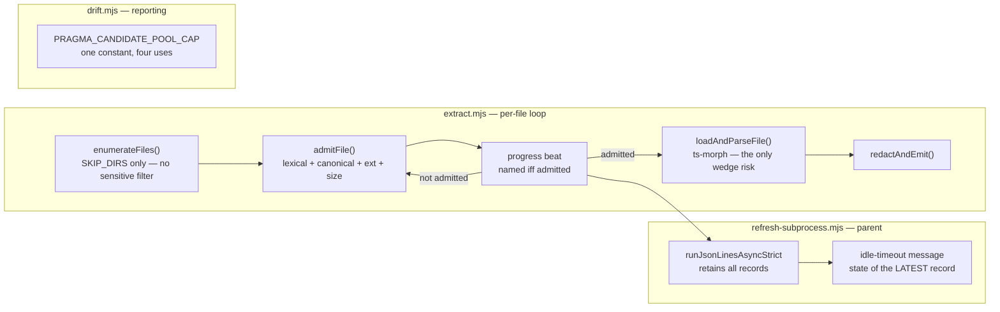

# Plan: Refactor symbol-index — close the progress-channel sensitive-path disclosure and the drift pragma-cap re-opener

- **Date**: 2026-07-27
- **Status**: **Approved — NOT yet implemented** (3 GPT plan-audit rounds +
  2 Gemini final-gate rounds, final verdict `APPROVE` with 0 new findings
  and 0 wrongly-dismissed — see Audit Trail)
- **Author**: Claude + Test
- **Scope**: backend
- **Target domain(s)**: `arch-memory`, `tests`
- ⚠ **Cross-domain work** — touches `arch-memory` (the extraction pipeline
  and the drift reporter) and `tests` (their regression coverage). This is
  the ordinary source/test split, not an architectural boundary crossing —
  noted per Phase 0.5b, not a design concern.

> **Origin**: GPT-5.6 tech-debt clustering pass over `.audit/tech-debt.json`
> (local/gitignored), cluster `symbol-index`, ranked #1 by leverage (4.25,
> MAJOR effort, 11 raw entries). **After verifying every entry against
> current source (2026-07-27), 8 of the 11 are already fixed and 1 is moot
> — its file no longer exists.** The MAJOR effort estimate was priced
> against a pre-PR-#66 snapshot of the tree. What actually remains is
> **one live defect** (raised twice under two topicIds) plus **one latent
> re-opener** of a bug PR #66 had just fixed. This plan is scoped to those,
> and to nothing else. See §1's Staleness Audit for the entry-by-entry
> verdict — the honest small scope IS the finding here, and inflating it to
> match the original 11-entry framing would be the band-aid's opposite
> cliff.

---

## 1. Context Summary

**Detected scope**: backend, `js-ts` stack (`detect-stack` → `{stack:
"js-ts", stackKinds: ["js-ts","postgres"]}`). No frontend surface — this is
a CLI extraction pipeline plus a reporting CLI.

### 1a. Staleness Audit — all 11 ledger entries verified against current source

`scripts/symbol-index/**` was substantially reworked by PR #66 / commit
`39dbd4b` (2026-07-27 14:17, `docs/plans/symbol-index-pipeline-reliability-hardening.md`,
`Status: Complete`). That plan is read in full and its Phase-by-Phase file
list cross-checked against this cluster before any work was scoped here.

| topicId | Sev | Verdict | Evidence (current source) |
|---|---|---|---|
| `c5b28713` | HIGH | **ALREADY FIXED** (PR #66 Phase 4) | `scripts/symbol-index/refresh-file-scope.mjs:104-124` — `retryFiles` now runs through `shouldSkipForIndexing(f, ['sensitive','generatedNoise'])` with a `retrySkipped` accumulator logged via `formatSkipLog`, the same treatment `diffResult.files` gets at `:59`. The comment at `:104` names this exact finding ("round-1 H4"). |
| `aba921ff` | HIGH | **ALREADY FIXED** (PR #66 Phase 4) | `scripts/symbol-index/refresh-args.mjs:46-74` — the `if/else` chain is now a `switch` over an `=`-split token (`:46-47`), boolean flags **throw** on an inline value, `--since-commit` throws on all three value-less shapes, and `--` terminates the loop (`:45`). |
| `59a36988` | MED | **ALREADY FIXED** (PR #66 Phase 3) | `scripts/symbol-index/extract.mjs:148-151` — `admitFile` derives `canonicalRel` from `cls.canonical` and runs `isExtensionAllowlisted(canonicalRel)` **after** `resolveAndClassify`, fail-closed on `resolutionFailed`/`escapedRepo`/`sensitive` (`:137-145`) with no fallback to the lexical path. |
| `43c77e0c` | MED | **ALREADY FIXED** (PR #66 Phase 3) | The 213-line `extractSymbols` is decomposed into `admitFile` (`:119-166`), `loadAndParseFile` (`:177-193`), `classifySymbolsInFile` (`:202-245`), `redactAndEmit` (`:256-308`); `extractSymbols` (`:320-436`) is now a sequencing loop plus a reason-`switch`. |
| `6327e5d8` | MED | **ALREADY FIXED** (PR #66 Phase 3) | `scripts/symbol-index/extract.mjs:344-346` — `ts.ScriptTarget.ESNext` / `ts.ModuleKind.ESNext` / `ts.ModuleResolutionKind.Bundler` replace the `99/99/100` literals. |
| `e058e7df` | MED | **RESOLVED BY MITIGATION — and incidentally strengthened** | `scripts/symbol-index/extract.mjs:408-410` already adds a second beat before the ts-morph parse of any file over `MAX_FILE_BYTES/2` (250KB). With `COVERAGE_DEFAULTS.hardTimeoutMs = 300_000` (`scripts/lib/symbol-index/graph-verdict.mjs:60`) as an **idle** bound, a ≤500KB file would need a >5-minute parse *after* a timer reset to trip. No work is commissioned for this entry — but Phase 1's named beat replaces `:408-410` with an unconditional pre-parse beat for *every* admitted file, so the mitigation gets strictly better as a side effect (§2 D2, §7 R2). |
| `3cac922a` | MED | **DEFECT FIXED, LATENT RE-OPENER LIVE** → Phase 3 | The *reported* defect (silent partial reconciliation) is fixed: `scripts/symbol-index/drift.mjs:187-202` now pairs `listSymbolsForSnapshot` with `countSymbolsForSnapshot`, computes `capped`, warns on stderr, and **skips** reconciliation rather than emitting false "unresolved" warnings. **But the `10000` literal is now written four times** (`:188` the query limit, `:191` the `capped` comparison, `:193` the stderr text, `:202` the report text) with a load-bearing invariant between the first two. See §1c. |
| `fca2fde3` | MED | **ALREADY FIXED** (PR #66 Phase 2) | `scripts/symbol-index/drift.mjs:84-88` — the `commitSha: drift.refresh_id` argument is deleted; only `refreshId` is passed, with a comment naming this finding ("round-1 H5"). |
| `688c866f` | MED | **HALF FIXED, HALF MOOT** — no work planned | drift.mjs half fixed: `scripts/symbol-index/drift.mjs:252` is `process.exitCode = …`, not `process.exit()`. archive half **moot**: `scripts/archive-completed-plans.mjs` was **deleted** on 2026-07-18 in commit `8e323b3` ("Phase 5 — delete the archiver"), together with its test — `git cat-file -e HEAD:scripts/archive-completed-plans.mjs` fails. See §1d for the residual-`process.exit()` defer rationale. |
| `45dcee69` | LOW | **LIVE** → Phases 1-2 | `scripts/symbol-index/extract.mjs:363` — `emit({type:'progress', file: rel})` fires at the TOP of the per-file loop, before `admitFile` at `:365`. |
| `a46ddb5a` | MED | **LIVE — duplicate of `45dcee69`** → Phases 1-2 | Same line, same defect, raised twice under two categories (`[backend] Sensitive path disclosure` and `[Sustainability] Sensitive-path observability bypass`). Treated as ONE defect; both topicIds close together. |

**Net**: 8 stale, 1 moot, 1 mitigated-no-action, **1 real defect** (two
topicIds) + **1 latent re-opener**. Nothing in this plan re-does PR #66's
work.

### 1b. The live defect — progress records disclose sensitive filenames

**Code Trace** (all verified 2026-07-27 by reading current source):

`scripts/symbol-index/extract.mjs::main` (`:740-748`)
→ `enumerateFiles(repoRoot, args.files)` (`:712-738`)
→ `extractSymbols(files, repoRoot, …)` (`:320-436`)
→ per-file loop `:350` → **`emit({type:'progress', file: rel})` `:363`**
→ `admitFile(abs, {repoRoot})` `:365`.

Three facts make this reachable, not theoretical:

1. **`enumerateFiles`'s full-mode walk does not filter sensitive paths.**
   `:726-736` skips only `SKIP_DIRS` (`:670-680` — `node_modules`, `dist`,
   `.git`, `.claude`, build/cache dirs). `.env`, `secrets/`,
   `credentials.json`, `id_rsa` and friends are enumerated and pushed into
   `out` like any other file. Sensitive-path policy is applied **only**
   inside `admitFile` (`:127-145`), which runs one line *after* the emit.
2. **`emit` writes to stdout.** `scripts/lib/cli-io.mjs:20-22` —
   `process.stdout.write(JSON.stringify(obj) + '\n')`. The record crosses
   the process boundary into the parent.
3. **The parent retains and can print it.**
   `scripts/symbol-index/refresh-subprocess.mjs:154` collects every record
   via `runJsonLinesAsyncStrict`; on an idle timeout `:160` logs
   `` last file: ${err.cause.records[err.cause.records.length - 1]?.file ?? '?'} ``
   through `logOk` — an operator-visible line that can name a sensitive
   file verbatim.

**Blast radius is the FULL refresh path specifically.** On an *incremental*
run, `scripts/symbol-index/refresh-file-scope.mjs` has already filtered the
scope (`:59`, and `:104-124` since PR #66), so `restrictFiles` carries no
sensitive path and `enumerateFiles` returns it unchanged (`:721-723`). It is
`npm run arch:refresh:full` — the whole-repo walk — where every sensitive
filename in the working tree transits the pipe.

**What is and is not disclosed** (stated precisely so severity is not
inflated): this leaks *names*, not *contents*, to a same-user child→parent
pipe and possibly an operator log. It is **not** an egress of secrets to a
third-party LLM — `redactAndEmit` (`:256-308`) and the `admitFile` gate are
both downstream and intact, so no sensitive file's body ever reaches
summarise/embed. MEDIUM (per `a46ddb5a`) is the honest severity; the LOW on
`45dcee69` understates it only because it was filed against the disclosure
surface alone.

**Why this survived PR #66**: the placement is *deliberate and documented*
there. `:352-362` argues the beat must fire "BEFORE admission is even
decided, so the max silent interval is exactly one file's processing time
regardless of outcome" — i.e. it is `e058e7df`'s fix. So the two entries are
in genuine tension, and the fix must satisfy both. That tension is the
entire design problem of this plan (§2).

**Existing test contract that pins the current shape**:
`tests/subprocess-idle-timeout.test.mjs:176-184` asserts
`progress.map(p => p.file).sort()` deep-equals `['a.mjs','b.mjs']` —
"one heartbeat per file, carrying the path". Any fix must consciously
re-state that contract rather than break it silently.

### 1b-i. Wire-format consumer census (exhaustive, round-1 M3)

`{type:'progress'}` is a JSON-lines *contract*, not a private detail, so
the full producer/consumer set was enumerated by repository search before
designing a shape change (`grep -rn "type: *'progress'\|'progress'"` over
`scripts/`, `tests/`, `dashboard/`, plus every `runJsonLinesAsync*` call
site):

| Role | Site | Effect of making `file` optional |
|---|---|---|
| **Producer** | `scripts/symbol-index/extract.mjs:363` (loop beat) | Changed by Phase 1 — the only site that attaches a name pre-admission. |
| **Producer** | `scripts/symbol-index/extract.mjs:409` (large-file tick) | Removed by Phase 1 as redundant — see D2. |
| **Consumer** | `scripts/symbol-index/refresh-subprocess.mjs:154` → `:160` | The only site that *reads* `progress.file`. Updated in Phase 2 (D3). |
| **Consumer** | `scripts/lib/audit/duplication-detector.mjs:108-111` | Spawns `extract.mjs --files-from` and immediately `.filter(r => r.type === 'symbol')`. Never inspects `progress` at all → **tolerant, no change needed**. Also always passes a restricted `--files-from` scope, so it never walks unfiltered sensitive paths. |
| **Test** | `tests/subprocess-idle-timeout.test.mjs:176-189` | Asserts the record shape + that `progress ∉ PUBLISHED_TYPES` (`:20-28`). Updated in Phase 2. |

**No schema, no Zod contract, no dashboard/telemetry collector, and no
persisted column reads this record type.** `progress` is deliberately
absent from `PUBLISHED_TYPES` (`tests/subprocess-idle-timeout.test.mjs:26-28`
— `['symbol','violation','import','coverage','summary']`), so no `progress`
record can reach a published snapshot or the store. The blast radius of the
shape change is therefore exactly the two files Cluster A already owns, plus
their two tests. Recorded here so the claim is auditable rather than
assumed.

### 1c. The latent re-opener — drift.mjs's quadruplicated cap literal

`scripts/symbol-index/drift.mjs:187-202`. `capped` is `totalCount > 10000`
(`:191`) while the pool is fetched with `limit: 10000` (`:188`). These two
literals **must** agree: lower the query limit to 5000 without touching the
comparison and a 7000-symbol snapshot computes `capped === false` while
reconciling against a 5000-row pool — which resurrects, exactly, the false
"unresolved pragma" warnings PR #66's fix exists to prevent (its own comment
at `:195-199` names that failure mode). Two further copies live in operator-
facing strings (`:193`, `:202`), which would silently start lying first.
This is a live coupling defect with a plausible edit that triggers it, not a
style nit.

### 1d. Deliberately NOT planned — with independence stated

Per AGENTS.md's *scope is decided by impact, not authorship* test, each
defer below names why this plan's correctness does **not** ride on it:

- **`e058e7df` (heartbeat granularity)** — no further work. The mitigation at
  `:408-410` plus a 300s idle bound makes the residual window implausible.
  This plan's design *preserves* the mitigation (§2 D2) rather than
  depending on further hardening.
- **`688c866f` residual `process.exit()` calls in `drift.mjs`** (`:97`,
  `:103`, `:109`, `:114`, `:126`, `:267`). **Independence**: the cited defect
  is *stdout truncation of the drift report*. Every one of these paths emits
  either a short stderr diagnostic or nothing, and **returns before any
  report is generated** — there is no stdout report for them to truncate, so
  the failure mode is structurally unreachable on those branches. The one
  stdout write among them (`:97`, `console.log('OK')`) is the repo-wide
  `--selfcheck-relocation` smoke contract mandated verbatim by AGENTS.md
  across the `CLI_SMOKE_SET`; changing it in one file would fork a uniform
  contract, and changing it repo-wide is a different task. Confirmed
  incidentally that `:252`'s `process.exitCode` does **not** hang the CLI:
  `scripts/lib/db/client.mjs:331` sets `allowExitOnIdle: true`, so the pg
  pool never holds the event loop open.
- **Making the pragma-pool cap configurable** (env var / `symbolIndexConfig`
  entry) — no current requirement asks for a different value; see §4's
  right-sizing gate.

### Patterns reused vs new

| Need | Existing pattern reused | Location |
|---|---|---|
| Single per-file admission decision (sensitive / canonical / extension / size) | `admitFile` — reused **in place**, not forked | `scripts/symbol-index/extract.mjs:119-166` |
| Fail-closed path classification | `resolveAndClassify` → `{category, canonical, escapedRepo, resolutionFailed}` | `scripts/lib/sensitive-paths.mjs` (INC-001 mitigation) |
| Redacted, aggregated skip reporting | `formatSkipLog(skippedSensitive, {logger:'extract'})` | already called at `scripts/symbol-index/extract.mjs:431-433` |
| Named constant over a repeated literal | `MAX_FILE_BYTES` (`:686`), `SKIP_DIRS` (`:670`) — same file, same idiom | `scripts/symbol-index/extract.mjs` |
| JSON-line record emission | `emit()` | `scripts/lib/cli-io.mjs:20-22` |

**No new module, no new abstraction, no new config surface.** Every change
is inside a function that already exists.

### Neighbourhood considered

`get-neighbourhood` (k=8, repo `6461a693-6690-4bf3-98ee-14c0385cc357`):
top match **`admitFile`** (`scripts/symbol-index/extract.mjs:119-166`,
score 0.835, `above-floor-cluster` → **`precedent`**). Opened it and decided
on the code: **reuse in place**. `admitFile` is already the single admission
oracle and already returns everything the beat needs to decide whether a
name is safe to print; writing a second "is this path safe to name" helper
would be exactly the competing-sibling duplication the band exists to flag.
The remaining 7 candidates (`redactAndEmit` 0.820, `resolveIncrementalFileScope`
0.812, `emitProgress` 0.810, `enumerateFiles` 0.806, `drift.mjs::atomicWrite`
0.776, `drift.mjs::main` 0.770, `extract.mjs::main` 0.766) all banded
`review` — below this repo's noise floor. Consistent with a plan that adds
**zero** new functions.

### Past incidents to verify against

> | Incident | Affected paths | Status | Lessons |
> |---|---|---|---|
> | **INC-001** — lexical sensitive-path classifier bypassed by symlink target | `scripts/lib/sensitive-paths.mjs`, `scripts/lib/sensitive-egress-gate.mjs`, `scripts/symbol-index/extract.mjs` | `manual-verification-required` | Canonicalise before any security decision on a path; fail closed — never "I couldn't classify it so I'll allow it." |

Composite score 0.589, and it names `scripts/symbol-index/extract.mjs`
explicitly. Addressed in **§10 Security Considerations**.

---

## 2. Proposed Architecture



### Key design decisions

- **D1 — the single named beat becomes two beats: an *anonymous* tick where
  today's beat already is, plus a *named* beat after admission** (#13
  Validation, #5 Single Source of Truth, INC-001's fail-closed lesson).
  The top-of-loop beat keeps its exact position — before any filesystem
  work — but drops the `file` field. A second, named beat is emitted after
  `admitFile` returns, **iff `admission.admitted === true`**, because
  admission is the *only* point in this pipeline that has cleared a path
  against the sensitive-path policy. Rejected files — lexical skip,
  canonical-sensitive, escaped symlink, resolution failure, bad extension,
  over-cap, stat error — are never named on this channel at all.

  **The earlier draft of this plan moved the single beat instead of
  splitting it, which was a genuine liveness regression** (round-1 H1).
  Moving it would have made the silent window span
  `parse(file_i) + admitFile(file_{i+1})` — concatenating one file's parse
  with the next file's path resolution into a single un-reset interval,
  where today those are two separate windows. The split has no such
  property: the first beat's position is byte-identical to today's, so the
  maximum silent interval is **≤ today's for every file**, and the fix
  becomes strictly safety-additive rather than a trade.

  **Fail-closed by construction, not by enumeration**: the rule is "name it
  only if admitted", not "withhold it if it looks sensitive". A future
  `admitFile` rejection reason added by someone else is silent-by-default,
  which is the safe direction. This is the same discipline INC-001's
  `resolveAndClassify` encodes one layer down.

  **`file`'s presence IS the discriminant** — no `phase`/`stage` field is
  added. A record carrying `file` means "this path was admitted and is
  about to be parsed"; a bare record means "still walking". That is
  everything the one reader (D3) needs, and it keeps the union to two
  shapes instead of introducing a lifecycle vocabulary (§4).

  **Fail-closed by construction, not by enumeration**: the rule is "name it
  only if admitted", not "withhold it if it looks sensitive". A future
  `admitFile` rejection reason added by someone else is silent-by-default,
  which is the safe direction. This is the same discipline INC-001's
  `resolveAndClassify` encodes one layer down.

  **Why withholding harmless names too (e.g. `package-lock.json`, a
  `generatedNoise` skip) is correct and not over-broad**: a two-branch rule
  ("sensitive → hide, generatedNoise → show") re-introduces a classification
  decision at the *emit* site, which is precisely the layering mistake
  INC-001's write-up calls out ("`gateSymbolForEgress` saw the pre-resolution
  `rel` — a layering inconsistency that hid the issue"). One branch, one
  oracle. The cost is that skipped files are unnamed on the progress
  channel — already covered, with proper redaction, by the `formatSkipLog`
  block at `:431-433`.

- **D2 — the record-cardinality contract is per-outcome, and the existing
  large-file tick is absorbed** (round-1 M1). The prior draft asserted
  "exactly one `progress` record per walked file", which was **already false
  in current source**: `extract.mjs:408-410` emits a second tick for any
  admitted file over `MAX_FILE_BYTES/2`. The corrected, explicit contract:

  | Per-file outcome | `progress` records | Shapes |
  |---|---|---|
  | Rejected (any of the seven `admitFile` reasons) | **1** | anonymous |
  | Admitted (any size) | **2** | anonymous, then named |

  **The `:408-410` large-file tick is deleted, not preserved** — D1's named
  beat sits at the same point in the loop (post-admission, pre-parse) and
  fires for *every* admitted file rather than only those over 250KB. It is
  therefore a strict superset of what the large-file tick provided, and
  keeping both would emit two adjacent records with no work between them.
  This **strengthens** `e058e7df`'s mitigation rather than merely preserving
  it: every admitted file now gets a fresh timer immediately before its
  ts-morph parse, where previously only large ones did.

  **Liveness, stated as an invariant rather than an estimate**: for every
  file, the first beat is emitted at the same point in the loop as today's,
  before any `realpathSync`/`statSync`/parse. Therefore the maximum silent
  interval after this change is **less than or equal to** the maximum before
  it, for every possible input — including the pathologically-slow-mount
  case. No timing estimate is load-bearing anywhere in this design.

- **D3 — the parent reports the *latest* progress record's state, and never
  guesses past a bare one** (#19 Observability, #15 Error Handling).

  An earlier draft scanned *backwards* for the last record carrying a
  `file`. That was wrong, and self-contradictory with D1 (round-2 H1): D1
  keeps the pre-admission tick precisely **because `admitFile` can block**
  on `realpathSync`/`statSync`. So if admission for file N wedges, a
  backwards scan would skip its bare tick and confidently name file **N-1**,
  which was parsed successfully. A confidently wrong culprit is worse than
  no culprit — it sends the operator to the wrong file.

  The corrected rule reads the **last `progress` record only**, using
  `file`'s own-property presence as the state discriminator (exactly the
  bit D1 defines):

  | Last `progress` record | Meaning | Parent reports |
  |---|---|---|
  | has `file` | that admitted file's parse is in flight | `last file: <path>` |
  | bare | *admission/path-classification* is in flight for an as-yet-uncleared file | `wedged during path admission (filename withheld — not yet cleared by the sensitive-path gate)` |
  | none at all | the child produced nothing | `?` (today's fallback) |

  The withheld case is **not** a regression in diagnostic power: the name is
  withheld because the gate has not yet decided whether it is safe to print,
  which is the whole point of D1. The operator still learns the *stage*, and
  the run's `formatSkipLog` aggregate plus the record count bound the search.
  This is also strictly more accurate than today's `records[len-1]?.file`,
  which already misattributes an admission-stage wedge to whichever file
  happened to be logged last.

  This is a **producer↔consumer wire-format change**, which is why Phases 1
  and 2 are one cluster (§6).

- **D4 — `drift.mjs` gets one module-level `PRAGMA_CANDIDATE_POOL_CAP`
  constant used at all four sites** (#1 DRY, #4 No Hardcoding), mirroring
  `MAX_FILE_BYTES`/`SKIP_DIRS` in its sibling `extract.mjs`. The query
  limit, the `capped` comparison, and both operator-facing strings become
  three references and one interpolation. Not configurable — see §4.

**Data flow after the change**: `enumerateFiles` yields every non-`SKIP_DIRS`
file → an **anonymous** `{type:'progress'}` tick is emitted (same loop
position as today, before any FS call) → `admitFile` decides → rejected
files `continue` (their names appear only in the redacted `formatSkipLog`
aggregate) → admitted files emit a **named** `{type:'progress', file}` beat
and proceed to parse/classify/emit. The parent's idle timer resets on any
record, named or not; on a trip it reports **the state of the latest
`progress` record** per D3's three-way table — naming the file only when
that record is itself named, and otherwise reporting an admission-stage
stall with the filename withheld. It never looks past a bare record to an
earlier named one.

---

## 3. Execution Model

Phases 1 and 2 form a **producer→consumer dependency chain** with a shared
wire-format contract: Phase 1 changes what `extract.mjs` puts on the
`progress` channel; Phase 2 changes how `refresh-subprocess.mjs` reads it.
Landing Phase 1 alone leaves the parent's wedge message printing `'?'` on
timeouts; landing Phase 2 alone is a no-op against today's producer. They
are therefore **one atomicity boundary** — same cluster, same commit
(§6 Cluster A).

Phase 3 is **fully independent**: different file, different subsystem
(reporting, not extraction), no shared symbol, no shared record type. It
consumes nothing Phases 1-2 produce and produces nothing they consume.

No rollback sequencing is needed beyond ordinary git revert of a cluster's
commit (§9).

---

## 4. Sustainability Notes

- **Assumption this design encodes**: `admitFile` remains the single
  admission oracle for the extraction loop, and its `{admitted: boolean}`
  result remains the authoritative "this path has been cleared" signal. If a
  future change introduces a second admission path (e.g. a fast-path that
  bypasses `admitFile`), the beat's naming rule must move with it. Called
  out here because the safety property is *positional*, not enforced by a
  type.
- **Assumption this design deliberately does NOT make**: that a wedge can
  only happen inside `loadAndParseFile`. An earlier draft assumed exactly
  that and was wrong (round-2 H1) — `admitFile`'s own `realpathSync`/
  `statSync` can block. D3's final three-way rule is therefore robust to a
  future `admitFile` gaining an expensive step (a content sniff, a network
  stat): such a stall reports as an admission-stage stall, which stays
  truthful rather than degrading into a wrong filename.
- **Extension point deliberately NOT built**: a redacted-digest form for the
  anonymous tick (`[redacted:<sha256-hex8>].<ext>`, the shape
  `SENSITIVE_PATHS_DEBUG=1` already produces in `sensitive-paths.mjs`).
  Skipped files cannot wedge, and `formatSkipLog` already reports them in
  aggregate — so no current requirement needs per-tick correlation. Adding
  it would be speculative generality.
- **Pattern others can follow**: "attach an identifier to a diagnostic only
  after the identifier's *source* has passed the policy gate, and let the
  gate's own boolean be the condition." Generalisable to any progress /
  telemetry / log channel that runs alongside a filter.

### Right-sizing gate

New structure introduced: one module-level constant in `drift.mjs`; a
field-stripped tick plus one guarded named beat in `extract.mjs`; one small
pure exported helper (`describeExtractStall`) in `refresh-subprocess.mjs`.
No new module, class, config key, or artifact.

- **Band-aid extreme**: delete the `file` field from the progress record
  entirely. Closes the disclosure in one line — and silently destroys the
  wedge-culprit diagnostic that `refresh-subprocess.mjs:160` exists to
  provide, which was itself added in response to a field-observed hang. It
  trades a real operational capability for a real safety property when both
  are obtainable. For `drift.mjs`: change nothing and trust the next editor
  to notice all four literals.
- **Over-engineered extreme**: introduce a `ProgressChannel` abstraction
  with a pluggable redaction policy; make the sensitive-name policy
  configurable per channel; promote the pragma-pool cap to
  `symbolIndexConfig` + an `ARCH_DRIFT_PRAGMA_POOL_CAP` env var with
  validation and a doctor check; add pagination to the pragma candidate pool
  so the cap disappears. **Also in this bucket** — round-1's H1
  recommendation of a staged lifecycle protocol (`admission-start` /
  `parse-start` discriminant fields, with the parent classifying timeouts by
  stage). It solves the same liveness problem D1 solves, but introduces a
  record vocabulary and a stage-aware consumer for a channel with exactly
  one reader that needs exactly one bit of information: *did this record
  name a file the gate had cleared?* Presence of `file` already encodes
  that. Rejected as machinery without a current requirement.
- **Chosen, and the current requirement each serves**: drop one field from
  an existing emit and add one guarded emit ten lines later (current
  requirement: stop putting sensitive filenames on the wire without weakening
  the liveness beat or the wedge diagnostic — nothing asks for a configurable
  redaction policy or a stage vocabulary); one named constant behind the
  module's existing `_internals` seam (current requirement: make the
  query-limit/comparison invariant impossible to break with a one-sided
  edit — nothing asks for a *different* cap value, so a config surface has
  no current consumer); one pure `describeExtractStall` helper mapping the
  latest record's shape to one of three messages (current requirement: keep
  the existing timeout message *truthful* under the new record shape — an
  earlier draft's backwards scan was rejected in round-2 review because it
  produced a confidently wrong culprit).

**Manual vs scripted**: manual. Four call-site edits across three files
plus targeted test updates — far below the ~5-regular-sites threshold, and
the edits are judgement-bearing (which branch gets the name), not
mechanical. A codemod here would be the over-engineering cliff.

---

## 5. File-Level Plan

### Phase 1 — Withhold sensitive filenames from the progress channel (producer)

Closes `45dcee69` + `a46ddb5a`.

Files:
- `scripts/symbol-index/extract.mjs` (modify) — in `extractSymbols`'s
  per-file loop (`:350-429`), three edits:

  1. **`:363`** — strip the `file` field from the top-of-loop beat, leaving
     its position untouched:
     ```js
     // Liveness heartbeat (docs/plans/extract-idle-timeout.md). Position is
     // UNCHANGED — before any filesystem work — so the maximum silent
     // interval is <= what it was before this change, for every file.
     // The path is NOT attached here: nothing has classified it yet, and a
     // full (unrestricted) walk enumerates `.env`/`secrets/**` like any
     // other file. The name is attached only after admitFile clears it.
     emit({ type: 'progress' });
     ```
  2. **after `:365`'s `admitFile` call**, once the reason-`switch`'s
     `continue` (`:367-399`) has been passed, emit the named beat:
     ```js
     // Named beat: admitFile is the single point that has cleared this path
     // against the sensitive-path policy (lexical + canonical + escape +
     // extension + size). Fail-closed BY CONSTRUCTION — the name is
     // attached iff admitted, so a rejection reason added later is silent
     // by default (INC-001: never allow what you could not classify).
     // Also the parse-start marker the parent's wedge diagnostic reads (D3),
     // and the pre-parse liveness tick for EVERY admitted file (D2).
     emit({ type: 'progress', file: rel });
     ```
  3. **`:402-410`** — delete the `if (admission.size > MAX_FILE_BYTES / 2)`
     block and its now-stale comment; edit 2's unconditional named beat
     supersedes it entirely (D2).

  The reason-`switch` at `:367-398` and the `continue` at `:399` are
  otherwise unchanged. The `formatSkipLog` block at `:431-433` is unchanged —
  it remains the redacted, aggregated reporting surface for skipped paths.

  **Why the `rel` computed at `:351` stays**: it is still needed for the
  `skippedSensitive` accumulator, `emitProgress` diagnostics, and
  `redactAndEmit`'s `filePath`. Only its use *in the top-of-loop emit* goes
  away.

**Acceptance criteria** (Phase 1): on a full (unrestricted) walk of a repo
containing `.env`, `secrets/token.ts`, and a symlink whose canonical target
is sensitive, **zero** `progress` records carry any of those names; a
rejected file produces exactly **1** `progress` record and it has no `file`
key; an admitted file produces exactly **2** (one anonymous, then one named
with its path), *regardless of size*; the first record for every file is
emitted before that file's `admitFile` call.

### Phase 2 — Keep the wedge diagnostic accurate under the new record shape (consumer)

Files:
- `scripts/symbol-index/refresh-subprocess.mjs` (modify) — the idle-timeout
  message at `:159-161` currently reads
  `err.cause.records[err.cause.records.length - 1]?.file ?? '?'`. Replace it
  with a helper that reports the **latest `progress` record's state** and
  never guesses past a bare one (D3):

  ```js
  /** Exported for test; pure. */
  export function describeExtractStall(records) {
    const progress = (records ?? []).filter(r => r?.type === 'progress');
    const last = progress[progress.length - 1];
    if (!last) return 'no progress records — wedged before the first file';
    return Object.hasOwn(last, 'file')
      // A named beat is emitted immediately before ts-morph parses that file.
      ? `last file: ${last.file}`
      // A bare tick means admission/path-classification is still running for a
      // file the sensitive-path gate has NOT yet cleared — its name is
      // deliberately withheld (D1). Naming the previous admitted file here
      // would be a confidently WRONG culprit (round-2 H1).
      : 'wedged during path admission (filename withheld — not yet cleared by the sensitive-path gate)';
    }
  ```

  and interpolate `describeExtractStall(err.cause?.records)` into the
  existing `logOk` warning. **`Object.hasOwn`, not truthiness** (round-2 M1):
  the discriminator is the field's *presence*, so an empty or falsy path can
  never be silently reclassified as an admission-stage stall. Exported so the
  three-way mapping is unit-testable without provoking a real timeout.
- `tests/subprocess-idle-timeout.test.mjs` (modify) — **this file is the
  designated seam for every progress-record assertion in this plan**
  (round-1 M2). It already drives the real `extract.mjs` CLI as a child
  process through `runJsonLinesAsyncStrict` over a temp fixture root
  (`EXTRACT` const at `:25`, used at `:176-184`), which is the only existing
  seam that actually *observes emitted records* — `emit` writes straight to
  `process.stdout` (`scripts/lib/cli-io.mjs:20-22`) and no in-process test
  captures it. Changes:
  - Re-state `:182-183`'s contract for the new shape: keep asserting that
    admitted fixture files appear as named records, but select them with
    `progress.filter(p => Object.hasOwn(p, 'file'))` — **presence, not
    truthiness** (round-2 M1) — and add the per-outcome cardinality
    assertion from D2.
  - Add a fixture containing a `.env`, a `secrets/`-prefixed file, a
    non-allowlisted extension, and a broken symlink, asserting **no**
    record's `file` matches any rejected path while the anonymous tick
    count still accounts for every walked file.
  - **Timeout error-shape seam**, also unspecified in the prior draft: the
    file already builds `err.cause.records` through the real
    `runJsonLinesAsync` controller driven by its own `makeFakeClock`
    fake-clock helper (`:30-` onward, used by the `idleTimeoutMs` suite at
    `:139-152`). The end-to-end D3 assertion is written against that same
    fake clock — no new mock, no real 300-second wait. **Its expectation is
    D3's table, not an earlier draft's**: a timeout whose last `progress`
    record is the bare tick of a *skipped* file must report the
    withheld-admission string and must **not** name the previously-admitted
    file (Gemini final-gate round 1 — a residual contradiction with the
    corrected D3 caught here).
- `tests/extract-admit-file.test.mjs` (modify) — **branch-logic only, not
  emission** (round-1 M2 — `admitFile` returns an admission result and emits
  nothing, so it cannot prove what the loop puts on the wire). Extend the
  existing `classify`-stub suites to cover the two rejection reasons the
  subprocess fixture above cannot reach with a real file (`stat-error`, and
  `resolution-failed` on platforms where a broken-symlink fixture is
  unreliable), asserting only `{admitted:false, reason}`. The emission
  consequence of each reason is proven in the subprocess test above; this
  file proves the classification that feeds it. The two suites are named as
  complements in each other's file header, as
  `tests/symbol-index-extract-failure-counters.test.mjs:9-11` already does
  for this pair.

**Acceptance criteria** (Phase 2) — derived directly from D3's three-way
table, no other rule: with a record stream whose last `progress` entry is
**named** `big.mjs`, the timeout message is `last file: big.mjs`; with one
whose last `progress` entry is **bare** (a stall during admission, even when
an earlier record named `big.mjs`), the message is the withheld-admission
string and contains **no** path — explicitly *not* `big.mjs`; with **no**
`progress` records at all, the message is
`no progress records — wedged before the first file`. Presence is tested
with `Object.hasOwn`, never truthiness, so an empty-string `file` cannot be
reclassified as an admission stall.

### Phase 3 — Single-source the drift pragma-pool cap

Closes `3cac922a`'s residual re-opener.

Files:
- `scripts/symbol-index/drift.mjs` (modify) — add a module-level
  `const PRAGMA_CANDIDATE_POOL_CAP = 10000;` beside the existing
  `DRIFT_STATUS` constant (`:66`), with a comment stating the invariant
  (*the query limit and the `capped` comparison must be the same number, or
  a partial pool is reconciled as if complete — the exact false-"unresolved"
  failure this cap's handling exists to prevent*). Replace all four literals:
  `:188` `limit: PRAGMA_CANDIDATE_POOL_CAP`; `:191`
  `totalCount > PRAGMA_CANDIDATE_POOL_CAP`; `:193` and `:202` interpolate the
  constant into their message text.
  **Test seam** (round-1 M4 — a module-local `const` is not importable):
  add it to the file's **existing** `_internals` export at `:255`, which is
  already this module's declared test seam
  (`export const _internals = { atomicWrite, parseArgs }`) and matches the
  `_internals` convention AGENTS.md records for `file-io.mjs` /
  `anthropic-client.mjs` / `extract.mjs`. No new public export is added —
  the constant stays module-private to importers that are not tests.
- `tests/symbol-index-drift-justification.test.mjs` (modify) — assert the
  boundary against `_internals.PRAGMA_CANDIDATE_POOL_CAP` rather than a
  literal, so the test cannot drift from the code: exactly `CAP` symbols →
  `capped === false` (reconciliation runs); `CAP + 1` → `capped === true`
  (reconciliation skipped, skip-notice section emitted). **Both sides of the
  invariant are covered, not just the comparison**: also assert that the
  `listSymbolsForSnapshot` call receives `limit === _internals.PRAGMA_CANDIDATE_POOL_CAP`
  (via a stubbed store module), since a one-sided edit to the *query* is the
  specific failure mode §1c describes and a comparison-only test would not
  catch it.

**Acceptance criteria** (Phase 3): `grep -c '10000' scripts/symbol-index/drift.mjs`
returns 1 (the constant's own definition); the boundary tests read the
constant through `_internals` rather than restating the number; the
query-limit assertion fails if the `limit:` argument is changed without the
comparison.

**Close-out (not a phase)**: `npm test` (full suite — which now includes the
automated whole-repo sensitive-name verifier described in §8, the real
security oracle); then `npm run arch:refresh:full` once against this repo
followed by `npm run arch:drift`, as a live-wiring sanity check that the
pipeline and the reporting path still complete end to end. Per §8's
handling contract, the dogfood run's raw child stdout is not captured to a
file or pasted into any log.

---

## 6. Execution Clustering

- **Cluster A** — Phases 1-2 — fix-gate: none
  - **Coupling**: a genuine producer↔consumer **wire-format** seam. Phase 1
    changes the shape of the `{type:'progress'}` record `extract.mjs` writes
    to stdout; Phase 2 changes how `refresh-subprocess.mjs` reads that same
    record, plus the two test files that assert on the format from both
    sides. Auditing them apart would grade the producer against a consumer
    that has not been updated (and vice versa) — precisely the seam
    `/audit-code`'s cross-cutting wiring pass exists to inspect. They also
    share one atomicity boundary (§3): either alone is a regression.
  - **author-tier**: frontier — the cluster edits a sensitive-path egress
    surface named in INC-001, which AGENTS.md's testing doctrine classes
    Tier 3 (HARD test-first).
- **Cluster B** — Phase 3 — fix-gate: final
  - **Coupling**: single file plus its own test, one self-contained
    invariant. **Deliberately NOT merged into Cluster A**: it shares no file,
    no symbol, no record type and no subsystem with Phases 1-2 (`drift.mjs`
    is the reporting CLI; `extract.mjs`/`refresh-subprocess.mjs` are the
    extraction pipeline), and neither cluster consumes the other's output.
    Merging them would put an unrelated constant rename inside the diff the
    sensitive-path audit has to read closely — a coverage cost, not a saving.
  - **author-tier**: economy — a mechanical single-file constant extraction
    with a boundary test.
- **Final gate**: mandatory consolidated Gemini review over the union diff of
  both clusters, regardless of per-cluster GPT convergence.

**Partition check**: Phases 1, 2, 3 each appear in exactly one cluster;
clusters are contiguous ascending ranges (1-2, then 3); close-out work is
outside the phase set and unclustered.

---

## 7. Risk & Trade-off Register

- **R1 — liveness regression: ELIMINATED by design, not accepted** (this
  entry previously accepted it; round-1 H1 showed the acceptance was
  unsound). The prior draft moved the single beat after `admitFile`, which
  would have merged `parse(file_i)` and `admitFile(file_{i+1})` into one
  un-reset silent window — strictly worse than today, and materially so on a
  slow mount. D1's split keeps the first beat exactly where it is, so the
  post-change maximum silent interval is provably ≤ the pre-change one for
  every input. **No timing estimate is load-bearing** in the resulting
  design; the guarantee is positional.
- **R2 — `e058e7df`'s mitigation is replaced, not preserved, and the
  replacement must not be "simplified" away.** Phase 1 deletes the
  `extract.mjs:408-410` large-file tick because D1's named beat strictly
  supersedes it. A future editor who removes the named beat as "redundant
  with the anonymous one" would silently reopen `e058e7df` *and* break D3's
  culprit attribution. Guarded by the per-outcome cardinality test (§8) —
  which fails on exactly that edit — and called out in the code comment
  Phase 1 specifies.
- **R3 — skipped files become unnamed on the progress channel**, a real (if
  small) loss of live diagnostic detail while a long run is in flight. Traded
  deliberately for the safety property; mitigated by `formatSkipLog`'s
  redacted aggregate at `extract.mjs:431-433`, which already reports skip
  categories and counts at end of run.
- **R4 — the disclosure is *names*, not contents, over a same-user pipe.**
  Stated explicitly so this plan is not read as closing a credential-egress
  hole it does not close (none exists on this path — `redactAndEmit` and
  `admitFile` are both intact). Anyone re-prioritising this work should price
  it as a MEDIUM hygiene/observability defect, not a P0 leak.
- **R5 — 8 of this cluster's 11 ledger entries are stale**, and the ledger
  will keep proposing them until their topicIds are closed. This plan does
  not itself write to `.audit/tech-debt.json`; closing the stale IDs is an
  operator action (`npm run debt:resolve`) noted in §11 so the next
  clustering pass does not re-rank a phantom MAJOR cluster.

---

## 8. Testing Strategy

Per AGENTS.md's testing doctrine, Phase 1 lands under **Tier 3 (HARD
test-first, non-negotiable)** — it modifies a sensitive-path handling surface
directly named by INC-001. Its test lands in the **same commit** as the fix.

**Seam note (round-1 M2)**: `emit` writes directly to `process.stdout`
(`scripts/lib/cli-io.mjs:20-22`), and no in-process test currently captures
it — `tests/symbol-index-extract-failure-counters.test.mjs` calls
`extractSymbols()` in-process and asserts only on its returned `stats`.
Therefore **every assertion about emitted records runs through the real
`extract.mjs` CLI as a child process**, using the `EXTRACT` +
`runJsonLinesAsyncStrict` pattern that
`tests/subprocess-idle-timeout.test.mjs:25`/`:176-184` already establishes.
No new injection seam is added to `extractSymbols`.

- **Unit (no DB, no subprocess)**:
  - `tests/extract-admit-file.test.mjs` — `admitFile`'s branch logic only
    (`{admitted, reason}`), via the `classify` stub it already accepts
    (`:119`), covering the reasons a real fixture cannot reliably produce
    cross-platform (`stat-error`, `resolution-failed`). This file proves
    classification; it cannot and does not assert emission.
  - `tests/symbol-index-drift-justification.test.mjs` — the
    `_internals.PRAGMA_CANDIDATE_POOL_CAP` / `+1` boundary **and** the
    query-limit argument, per Phase 3.
- **Integration (real subprocess + real filesystem, no DB)** — all in
  `tests/subprocess-idle-timeout.test.mjs`:
  - **Event-sequence matrix, per isolated fixture** (round-2 M1 — a global
    count cannot prove per-file ordering, and would not fail if a future edit
    duplicated a rejected tick, dropped an admission tick, or separated the
    two beats while keeping totals equal). Each case runs the CLI over a
    fixture root containing **exactly one** file and asserts the full
    `progress` sequence, using `Object.hasOwn(r,'file')` as the discriminator:

    | Fixture (single file) | Required exact sequence |
    |---|---|
    | admitted, small | `[bare, named(f)]` |
    | admitted, >250KB | `[bare, named(f)]` — *proves the deleted `:408-410` tick is not resurrected as a third beat* |
    | lexically-skipped (`.env`) | `[bare]` |
    | non-allowlisted extension (`.txt`) | `[bare]` |
    | over the size cap | `[bare]` |
    | broken symlink (`resolution-failed`) — *symlink-capable platforms only, per the matrix below* | `[bare]` |

    Plus one **mixed unrestricted** fixture asserting
    `totalProgress === walkedFiles + admittedFiles`, that the sequence is a
    valid interleaving of the per-file patterns above (never two consecutive
    `named`), and that no `named` record's `file` matches any rejected path.
  - **No sensitive name on the wire**: the deterministic fixture-root
    verifier specified under *Empirical* below — real `.env`, real
    `secrets/`-prefixed file, walked unrestricted, exercising the real
    `resolveAndClassify` rather than a stub.

  **Platform-capability matrix for the symlink cases** (round-3 M2 — the
  prior draft acknowledged symlink creation is unreliable on Windows and
  then required exact symlink sequences anyway). This repo already has both
  pieces needed, so no new infrastructure is invented:

  - `tests/helpers/fs-symlink-test-utils.mjs` — `trySymlink(target, linkPath)`
    plus `SYMLINK_UNSUPPORTED = new Set(['EPERM','EACCES'])`, the existing
    shared capability helper.
  - `tests/sensitive-paths-canonical.test.mjs:16` — the established
    `const skipOnWin = process.platform === 'win32'` convention, and (at
    `:156`) an **fs-injection** suite that already drives every
    `resolveAndClassify` path *without* real symlinks.

  | Capability | Cases that MUST run | Coverage when unavailable |
  |---|---|---|
  | Symlink creation available | The canonical-sensitive-symlink and broken-symlink subprocess sequences, end to end through the real `resolveAndClassify` | — |
  | Symlink creation refused (`EPERM`/`EACCES`, typical Windows / locked-down CI) | The **lexical**-sensitive full-walk emission case (`.env`, `secrets/**`) and the non-allowlisted-extension case — both symlink-free, and both cover the actual disclosure defect | `resolution-failed` / `escaped-repo` retain coverage via the `classify`-stub unit tests in `tests/extract-admit-file.test.mjs` and the existing fs-injection suite |

  A skipped symlink case must emit a **visible** skip marker (the repo's
  existing convention), never pass silently — an invisible skip is exactly
  the "green without having checked anything" failure AGENTS.md's
  success-path doctrine warns about. Note the load-bearing point: the
  disclosure defect itself is reachable **without any symlink at all** (a
  plain `.env` in the walk), so no platform loses coverage of the actual
  bug — only of the symlink-flavoured variants.
  - **Stall attribution** (D3): unit-test `describeExtractStall` directly
    over all three record shapes (last-is-named → names it; last-is-bare →
    withheld-admission message, and specifically **not** the prior admitted
    file's name; no records → `'?'`-equivalent). No timeout needs to be
    provoked; where an end-to-end trip is still wanted, the file's existing
    `makeFakeClock` helper drives it without a real 300-second wait.
  - The existing `progress ∉ PUBLISHED_TYPES` assertion (`:186-189`) is left
    untouched — it must keep passing, since the shape change must not make
    `progress` reachable by any refresh filter.
- **Regression guard**: the existing
  `tests/sensitive-egress.test.mjs` + `tests/audit-scope-egress.test.mjs`
  suite must stay green — they are the Tier-3 gate for this class and are
  the backstop against a fix that accidentally loosens classification.
- **Empirical (pre-ship, live-process) — automated, never "by inspection"**
  (round-2 M2). A unit test alone cannot close this out, because the defect
  lives specifically in the *unrestricted whole-repo walk* that only a full
  refresh exercises against a real working tree (this repo has a real `.env`
  on disk). But "capture stdout and eyeball it" is both unrepeatable and
  self-defeating — echoing the raw stream into a terminal, CI log, or
  retained artifact would itself disclose exactly what the change exists to
  prevent.

  The close-out step is therefore a **verifier, not an inspection** — and it
  runs against a **purpose-built temporary fixture root, not this repo's
  working tree** (round-3 M1). Walking the real tree would make the oracle
  environment-dependent in both directions: it would **pass vacuously** on a
  clean CI checkout or release artifact where the gitignored `.env` is
  absent, and its cost/behaviour would drift with unrelated repo growth,
  local symlinks, and permissions. The fixture guarantees the sensitive
  inputs exist:

  - `mkdtemp` root containing a real `.env`, a real `secrets/token.ts`, a
    non-allowlisted `notes.txt`, at least one genuinely admitted `.mjs`, and
    (where the platform allows — see below) a symlink whose canonical target
    is sensitive.
  - Invoke the real `extract.mjs --root <fixtureRoot>` in **unrestricted
    full-walk mode** (no `--files-from`), which is the exact code path the
    defect lives in.
  - Consume JSON lines in memory, reducing each record **immediately** to
    non-sensitive counters or a `formatSkipLog`-style redacted digest
    (`[redacted:<sha256-hex8>].<ext>`); the raw record is never retained past
    that reduction.
  - Assert every `progress` record's `file` (own-property presence) is
    classified non-`sensitive` by the repo's own
    `shouldSkipForIndexing`/`classifyPath` (`scripts/lib/sensitive-paths.mjs`),
    failing on any hit.

  **Handling contract**: raw child stdout is never logged, never written to
  an artifact, and never printed on failure — assertion messages and
  child-process error messages alike carry only counts, categories, and
  digests. A non-zero child exit or a spawn failure is itself a test failure
  reported the same reduced way (never by dumping the stream).

  Implemented inside the existing subprocess integration suite so it runs in
  `npm test` rather than depending on a human remembering a manual step. The
  `npm run arch:refresh:full` dogfood in Close-out remains a **live-wiring
  sanity check only** — explicitly *not* the security oracle.
- **Explicitly NOT tested**: that `admitFile`'s own classification is
  correct — that is `tests/sensitive-paths-canonical.test.mjs`'s job and is
  unchanged by this plan.

---

## 9. Rollback

All three phases are source-level edits to existing functions; no schema
migration, no data change, no artifact regeneration. Reverting Cluster A's
commit restores the prior (leaky but functional) progress protocol on both
sides of the wire atomically — which is why the producer and consumer edits
must share a commit (§3). Reverting Cluster B's commit restores the four
literals with no behavioural change at all.

---

## 10. Security Considerations

**INC-001 — lexical sensitive-path classifier bypassed by symlink target**
(`status: manual-verification-required`; affected paths include
`scripts/symbol-index/extract.mjs`, which this plan modifies).

The incident's two lessons map directly onto this design:

1. *"Anywhere we make a security decision based on a path, the path MUST be
   canonicalised before classification."* — This plan's defect is a
   **disclosure** decision made on a path before **any** classification had
   run. D1 relocates that decision to strictly after `admitFile`, which is
   the function INC-001's own mitigation (`resolveAndClassify`) is wired
   into. Note the precise scope: the emitted `rel` is the *visible* path, so
   the canonical-target class of leak is not what is being disclosed here —
   but the fix is placed behind the canonical gate anyway, so the naming
   rule cannot drift out of step with the classification rule. Same layer,
   one oracle.
2. *"Fail-closed on resolution errors: a missing or unresolvable target is
   treated as sensitive. Never 'I couldn't classify it so I'll allow it.'"*
   — D1 attaches the name **iff `admission.admitted`**, so
   `resolution-failed` and `escaped-repo` produce unnamed ticks by the same
   rule as `sensitive`. The condition is a positive assertion of safety, not
   an enumeration of dangers, so a future rejection reason inherits the safe
   behaviour without an edit.

INC-001's own write-up names the historical root cause as a **layering
inconsistency** ("`gateSymbolForEgress` saw the pre-resolution `rel`"). The
progress channel is the last surviving instance of that same inconsistency
inside `extract.mjs`: PR #66 closed it for the *admission* decision
(`59a36988`); this plan closes it for the *disclosure* decision. After this,
every path-based decision in `extractSymbols` — read, classify, name — is
downstream of one canonicalising gate.

**Residual risk accepted**: the progress channel still reveals the *number*
of files walked and the *timing* between them. This is inherent to any
liveness beat and discloses nothing about content or naming.

**Not in scope**: `enumerateFiles` continues to *enumerate* sensitive paths
(it filters only `SKIP_DIRS`). This plan deliberately does not add
sensitive-path filtering to the walker. **Independence**: the walker's output
is consumed exclusively by `extractSymbols`, whose `admitFile` gate already
refuses every such path before any read — so this plan's correctness does not
rest on the walker filtering. Pre-filtering there would be a defensible
defence-in-depth change, but it would also silently shrink the coverage
denominator computed at `extract.mjs:774` (`eligibleFiles`), changing a
measurement this plan has no mandate to move. Recorded in §11.

---

## 11. Out of Scope (Future)

- **Sensitive-path pre-filtering in `enumerateFiles`** — defence-in-depth
  ahead of `admitFile`. Deferred because it perturbs the coverage
  denominator (`eligibleFiles`, `extract.mjs:774`); see §10's independence
  note.
- **Redacted-digest identifiers on the anonymous tick** — see §4's
  deliberately-not-built note; no current requirement.
- **Making the pragma-pool cap configurable, or paginating the pool away** —
  §4 right-sizing; nothing currently asks for a different value.
- **`688c866f`'s residual `process.exit()` calls in `drift.mjs`, and the
  repo-wide `--selfcheck-relocation` stdout-then-exit contract** — §1d, with
  the structural-unreachability argument.
- **Operator action (not code)**: close the 8 stale topicIds
  (`c5b28713`, `aba921ff`, `59a36988`, `43c77e0c`, `6327e5d8`, `fca2fde3`)
  as fixed-by-PR-#66, `688c866f` as moot (file deleted in `8e323b3`), and
  `e058e7df` as resolved-by-mitigation, so the next leverage-ranking pass
  does not re-rank a phantom MAJOR cluster (§7 R5).

---

## Audit Trail

**Session**: `/audit-plan docs/plans/refactor-symbol-index.md` — 3 GPT
rounds (the cap) + 2 Gemini final-gate rounds, 2026-07-27.

### Pre-audit grounding

The single most consequential step was **not** an audit round: it was
verifying all 11 raw debt entries against current source before writing a
line of design. 8 were already fixed by PR #66 (`39dbd4b`), 1 was moot (its
file deleted in `8e323b3`), and 1 was resolved by an existing mitigation —
so the "MAJOR effort, leverage 4.25" framing the clustering pass produced
was priced against a tree that no longer exists. Writing the plan the
ledger implied would have re-planned already-shipped work, which was the
explicit top risk on this cluster.

### GPT rounds

- **R1** (H:1 M:4, `NEEDS_REVISION`) — all 5 accepted and fixed, none
  rebutted or dismissed.
  - **H1 (liveness regression)** — the genuinely valuable finding. The
    first draft *moved* the single progress beat to after `admitFile`,
    which would have merged `parse(file_i)` and `admitFile(file_{i+1})`
    into one un-reset silent window. Redesigned to **split** the beat
    (anonymous tick in the original position + named beat post-admission),
    which makes the maximum silent interval provably ≤ today's rather than
    a trade. GPT's own recommendation — a staged
    `admission-start`/`parse-start` lifecycle vocabulary — was **not**
    adopted; `file`'s presence already encodes the one bit the single
    consumer needs, and the heavier protocol is recorded in §4's
    over-engineered extreme.
  - **M1** — the draft's "exactly one record per walked file" invariant was
    **already false in current source** (`extract.mjs:408-410`'s large-file
    tick). Replaced with a per-outcome cardinality table; the large-file
    tick is now absorbed by the unconditional named beat, which
    *strengthens* `e058e7df`'s mitigation.
  - **M2** — the claimed test seam did not exist: `admitFile` emits
    nothing, and no in-process test captures `emit`'s stdout. Re-specified
    against the real seam (`tests/subprocess-idle-timeout.test.mjs`'s
    existing `EXTRACT` + `runJsonLinesAsyncStrict` subprocess pattern).
  - **M3** — drove an exhaustive producer/consumer census (§1b-i), which
    surfaced a **second consumer the plan had missed**:
    `scripts/lib/audit/duplication-detector.mjs:108-111`. It is tolerant
    (filters for `type==='symbol'` only), but the plan had asserted a
    single-consumer blast radius without checking.
  - **M4** — a module-local `const` is not importable; routed through
    `drift.mjs`'s existing `_internals` seam.
- **R2** (H:1 M:2, `NEEDS_REVISION`) — all 3 accepted and fixed.
  - **H1 (wrong-culprit attribution)** — a real defect *introduced by R1's
    own fix*, and self-contradictory with it: R1 kept the pre-admission tick
    precisely because `admitFile` can block, yet D3 still scanned backwards
    for the last named record — so an admission-stage wedge would
    confidently name the *previous, successfully parsed* file. Replaced with
    a three-way rule on the **latest** `progress` record (named → name it;
    bare → withheld-admission stall; none → explicit fallback). A
    confidently wrong culprit is worse than none.
  - **M1** — global record counts cannot prove per-file ordering; replaced
    with an isolated single-file event-sequence matrix, and
    `Object.hasOwn(r,'file')` rather than truthiness as the discriminator.
  - **M2** — "assert by inspection" for a security check is both
    unrepeatable and self-defeating (echoing the stream would disclose what
    the change prevents). Replaced with an automated verifier that never
    echoes a raw record.
- **R3** (H:1 M:2, `NEEDS_REVISION`) — all 3 accepted and fixed. GPT loop
  **stopped here at the 3-round cap**.
  - **H1 (internal contradiction)** — R2's edit corrected D3 but left four
    stale references (§2 data flow, §4 right-sizing, §5 Phase 2 acceptance
    criteria still naming `big.mjs`, §8's truthiness filter). Reconciled so
    every section derives from D3's single table; a repo-wide grep sweep
    then caught two further stale mentions in §4 that the finding had not
    itemised.
  - **M1** — the security oracle walked the *real working tree*, which
    would **pass vacuously** on a clean CI checkout where the gitignored
    `.env` is absent. Re-specified against a deterministic `mkdtemp`
    fixture; `arch:refresh:full` demoted to a wiring sanity check.
  - **M2** — the plan required exact symlink event sequences while
    acknowledging symlink creation is unreliable on Windows. Added a
    platform-capability matrix grounded in the repo's **existing**
    `tests/helpers/fs-symlink-test-utils.mjs` (`trySymlink`,
    `SYMLINK_UNSUPPORTED`) and the `skipOnWin` convention at
    `tests/sensitive-paths-canonical.test.mjs:16`, with visible skip markers
    and a note that the core defect is reachable without any symlink.

**Stop rationale**: HIGH held at 1 across all three rounds, but each HIGH
was a *different, concrete design defect* (liveness regression → wrong-culprit
attribution → internal contradiction), each introduced by the previous
round's own fix — not rigor pressure. The 3-round cap was respected rather
than exceeded; R3's remaining class was documentation consistency, which is
converged.

### Gemini final gate (MANDATORY)

- **Round 1** — `CONCERNS`, 2 findings, both LOW.
  - *Contradictory test contract* — **ACCEPTED, fixed**. One residual
    earlier-draft expectation survived R3's sweep in the Phase 2 timeout-seam
    bullet ("still names the last admitted file"), contradicting the
    corrected D3. Rewritten to require the withheld-admission string and to
    explicitly forbid naming the previously-admitted file.
  - *Hallucinated code seam* — **CHALLENGED, verified false positive**.
    Gemini asserted `scripts/symbol-index/drift.mjs` has no `_internals`
    export and that `parseArgs`/`atomicWrite` are module-private. Both
    claims are false: `drift.mjs:255` reads verbatim
    `export const _internals = { atomicWrite, parseArgs };`, confirmed at
    runtime (`Object.keys(m._internals)` → `[ 'atomicWrite', 'parseArgs' ]`).
    Adopting its recommendation to *create* the export would have introduced
    a duplicate declaration. No plan change made.
- **Round 2** — **`APPROVE`**, 0 new findings, **0 wrongly-dismissed** (the
  false-positive challenge was sustained on review). Observation-only shadow
  reviewer (Claude Opus): 0 findings. Gate closed at 2 rounds, within cap.

### Net effect of the audit

The design changed substantially, and in the safety-relevant direction: the
first draft would have shipped a **liveness regression** (R1-H1) and then,
after fixing that, a **confidently wrong wedge diagnostic** (R2-H1) — both
in a file whose whole purpose here is not lying about what it observed. The
final design's two safety properties are positional and provable rather than
estimated: the first beat never moves, and a filename is attached only
downstream of the gate that cleared it.

**Status on close**: Approved, **not implemented**. No source file was
modified by this session — only `docs/plans/refactor-symbol-index.md` was
created.
