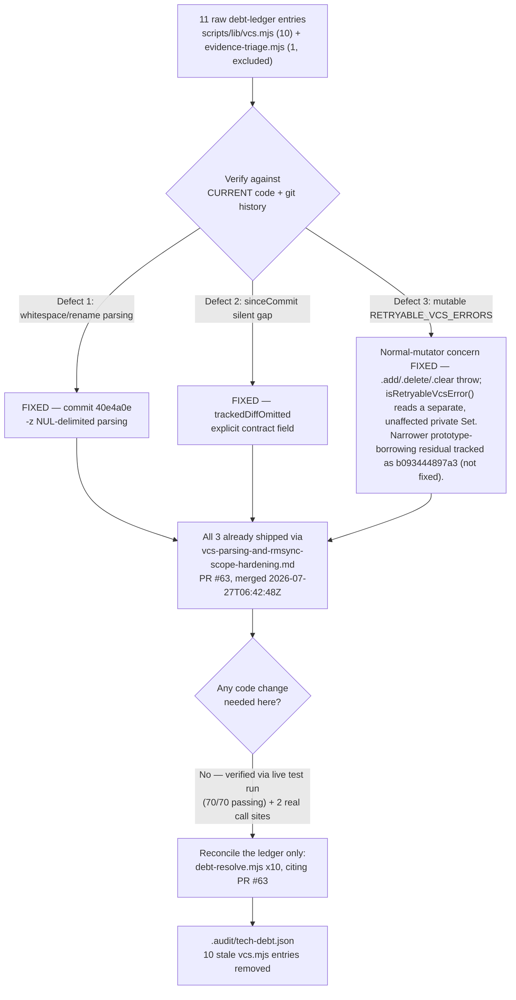

# Plan: vcs-protocol Tech-Debt Cluster — Verification & Ledger Reconciliation

- **Date**: 2026-07-27
- **Status**: Approved — audited, not yet implemented (3 GPT + 1 Gemini
  plan-audit rounds; see Audit Trail). The §4 ledger reconciliation is the
  only outstanding action; no code change is proposed.
- **Author**: Claude + Lbstrydom
- **Scope**: backend
- **Target domain(s)**: `shared-lib`

> Origin: GPT-5.6 clustered 170 open `.audit/tech-debt.json` entries into 10
> refactor candidates ranked by leverage; **`vcs-protocol` ranked #1**
> (leverage 5.5, MEDIUM effort). Of the 11 raw entries in the cluster, **10
> govern `scripts/lib/vcs.mjs` and collapse into 3 synthesized design
> defects — this plan's actual scope**; the 11th (`78e4d7aa`, a different
> file) is excluded (see §1 Out of scope). Per this repo's own doctrine
> ("a stale docstring/comment can mislead a reviewer into re-flagging an
> already-fixed issue" — the same applies to debt-ledger snapshots), this
> plan's first obligation was to verify each of the 3 synthesized defects
> against the CURRENT file before proposing any fix. **All three turned out
> to already be fixed.** This plan documents that verification and proposes
> the only action the evidence actually supports: reconciling the now-stale
> ledger entries, not a speculative code refactor. (One narrower, currently
> inert residual gap surfaced during this plan's own `/audit-plan` — see §1
> defect 3 and topicId `b093444897a3` — captured as its own follow-up debt
> item rather than folded in here or left blocking closure.)

## 1. Context Summary

**What exists today** (verified 2026-07-27 against current source and git
history, not assumed from the debt entries' summary text):

- `scripts/lib/vcs.mjs` HEAD state was read in full (715 lines). It already
  contains a `ReadOnlySet` class (lines 58–66), NUL-delimited (`-z`) git
  output parsing (`parseNameStatusZ` lines 324–361, `parseUntrackedPathsZ`
  lines 372–387), and an explicit `trackedDiffOmitted` contract field on
  `gitDiffWithWorkingTree` (lines 411–466) — all of which are exactly the
  fixes the 11 raw debt entries ask for.
- `git log -S "trackedDiffOmitted" -- scripts/lib/vcs.mjs` and
  `git log --oneline -- scripts/lib/vcs.mjs` both trace this hardening to a
  single commit, **`40e4a0e`** ("fix(shared-lib): harden vcs.mjs git-output
  parsing and find-rmsync-sites.mjs scope resolution"), which is the
  close-out commit of **`docs/plans/vcs-parsing-and-rmsync-scope-hardening.md`**
  — a plan run through a full `/cycle --autonomous` (6 GPT audit rounds + 2
  Gemini rounds, final verdict **APPROVE**, H:0 M:0 L:0; see
  `docs/plans/vcs-parsing-and-rmsync-scope-hardening-audit-summary.md`).
- That commit is **on `main`**, not a stray branch: `git branch --show-current`
  → `main`; `git merge-base --is-ancestor 40e4a0e HEAD` → true; `gh pr view 63`
  → `{"state":"MERGED","mergedAt":"2026-07-27T06:42:48Z","baseRefName":"main"}`.
  (An earlier same-day memory note flagged this PR as unmerged — re-checked
  live for this plan and confirmed it merged at 06:42:48Z, before this
  session started.)
- `.audit/tech-debt.json` still lists all 11 raw entries this task cited
  (topicIds `087d6ca8`, `1aa272b5`, `1f40ab08`, `bc3095ea`, `bd92cfe5`,
  `ebbbc2ad`, `1337d6e1`, `904c0d36`, `913d3a00`, `c2cca428`, `78e4d7aa`),
  every one carrying `deferredAt: 2026-07-16T…` — **11 days before** the
  40e4a0e fix landed. The ledger is a `deferredReason`/`deferredAt`
  append-list with no automatic "re-verify against current code" step tied
  to an unrelated PR merging, so nothing removed these entries when PR #63
  fixed the underlying code. This is the stale-snapshot failure mode named
  in this repo's own doctrine, just running in the direction of "the code
  moved on, the ledger didn't" rather than the more commonly discussed
  reverse.
- Live test run (this session, 2026-07-27): `node --test tests/vcs.test.mjs
  tests/vcs-blame.test.mjs tests/vcs-env-override.test.mjs` → **70 passing, 0
  failing** — not assumed green, actually executed.

**Per-defect verification** (the three synthesized clusters):

1. **Whitespace/rename-unsafe parsing** (raw topicIds `087d6ca8`, `1aa272b5`,
   `bc3095ea`, `bd92cfe5`) — **FIXED, drop from scope.**
   `gitDiffWithWorkingTree` (`scripts/lib/vcs.mjs:411`) calls
   `git diff --name-status -z` (line 424) and
   `git ls-files --others --exclude-standard -z` (line 448) — both
   NUL-delimited, not the whitespace-splitting regex the entries describe.
   `parseNameStatusZ` (lines 324–361) and `parseUntrackedPathsZ` (lines
   372–387) tokenize on `\0`, require a terminal NUL, reject interior empty
   tokens as malformed, and consume the correct token count per status
   letter (`R`/`C` consume 3 tokens for the from/to pair; `A`/`M`/`D`/`T`/
   `U`/`X`/`B` consume 2) — so a rename record like `R100<TAB>old.mjs<TAB>new.mjs`
   parses unambiguously and a filename containing spaces is never truncated.
   Verified live: `tests/vcs.test.mjs:207-211` ("filenames containing spaces
   are not truncated (the bug -z fixes)"), `:181-185` (rename from/to pair),
   `:213-242` (malformed-stream fault injection) — all passing in this
   session's test run.
2. **`sinceCommit` null/undefined short-circuit silently dropping tracked
   changes** (raw topicIds `1f40ab08`, `ebbbc2ad`) — **FIXED at the contract
   level, drop from scope.** `gitDiffWithWorkingTree` still skips the
   tracked-diff `git diff` call when `sinceCommit` is falsy (line 415:
   `if (sinceCommit) { … }`) — untracked files are still collected either
   way — but this is no longer a *silent* gap: line 413 computes
   `trackedDiffOmitted = !sinceCommit` and returns it (line 465) as an
   explicit, checkable field, and the docstring (lines 400–404) states the
   contract in exactly those terms. Verified live:
   `tests/vcs.test.mjs:429-455` (`trackedDiffOmitted` describe block, both
   `true` and `false` cases) — passing. **Additionally verified both real
   production call sites never actually hit the omission path**:
   `scripts/lib/audit/legacy-production-audit.mjs:2266`
   (`else if (auditBaseCommit)` — only calls the function when a commit is
   already present) and `scripts/symbol-index/refresh-file-scope.mjs:48-52`
   (`if (mode !== 'incremental' || !sinceCommit) return early` — same
   guarantee). So the practical "documented contract silently violated"
   scenario the ledger describes cannot currently occur; the residual risk
   (a hypothetical future caller ignoring the field) is bounded by the
   field's existence + the docstring's explicit warning, and adding
   enforcement machinery for a caller that doesn't exist yet fails this
   repo's own right-sizing gate (see §3).
3. **`RETRYABLE_VCS_ERRORS` mutable export + duplicate policy source** (raw
   topicIds `1337d6e1`, `904c0d36`, `913d3a00`, `c2cca428`) — **the ORIGINAL
   stated concern is FIXED, drop those 4 from scope; a narrower, distinct
   residual gap was found during this plan's own `/audit-plan` round and is
   tracked separately (below), not blocking this closure.** Lines 58–66
   define `ReadOnlySet`, whose `.add()`/`.delete()`/`.clear()` all throw
   `TypeError` on a normal method call — verified live:
   `tests/vcs.test.mjs:49-79` (real-`Set`-instance, exact-contents, frozen,
   and all three mutation-throws assertions), all passing. This closes what
   the original entries actually described: "any consumer can mutate it via
   `.add()`/`.delete()`, changing retry behavior globally" (1337d6e1) and a
   duplicate-source divergence between the export and `isRetryableVcsError()`
   (c2cca428).
   **Precise statement of what "cannot diverge" means here** (corrected
   during this plan's own GPT audit round 1, finding H1 — see Audit Trail):
   `RETRYABLE_VCS_ERRORS` (line 92) and the private `_retryableVcsErrors`
   (line 73) are two distinct `Set` objects — the `ReadOnlySet` constructor
   copies entries in, it does not share backing storage — so it is
   *`isRetryableVcsError()`'s answer* that cannot diverge (it reads only the
   private Set, never the public export), not literally "the same Set
   object" as the plan first said. Confirmed by direct empirical probe
   against the live module (Node v22.19.0):
   `Set.prototype.add.call(RETRYABLE_VCS_ERRORS, 'X')` **does** bypass the
   subclass's throwing `.add()` override and **does** mutate the public
   export's own internal data (`Object.freeze` does not protect a Set's
   `[[SetData]]` slot; calling the *inherited* native method directly
   sidesteps the override entirely) — but a second probe confirmed
   `isRetryableVcsError('X')` returns `false` both before and after that
   bypass, because it reads the separate, untouched private Set. A
   repo-wide `grep -r RETRYABLE_VCS_ERRORS scripts/` additionally confirms
   **zero production callers** currently import or read the export at all —
   it exists solely as a documented "deprecated compatibility export…
   retained only for external compatibility" (module docstring, lines
   76-91). This bypass is real but narrower than, and independent of, what
   the four original entries described — captured as its own follow-up debt
   item (topicId `b093444897a3`, `.audit/tech-debt.json`) rather than
   reopening 1337d6e1/904c0d36/913d3a00/c2cca428 or blocking their closure.
   **Decision, stated explicitly rather than left silent**: true tamper
   resistance (e.g., a `Proxy`-backed read-only façade immune to
   prototype-method borrowing) is NOT being built — the export has no
   current reader and zero behavioral blast radius, so hardening it further
   serves no current requirement (YAGNI; see §3 right-sizing note).

**Code Trace**: `scripts/lib/vcs.mjs:58-92` (ReadOnlySet + export),
`:102-104` (`isRetryableVcsError`), `:324-387` (both `-z` parsers),
`:411-466` (`gitDiffWithWorkingTree` + `trackedDiffOmitted`) →
`scripts/lib/audit/legacy-production-audit.mjs:2266` and
`scripts/symbol-index/refresh-file-scope.mjs:48-52` (the only two
production call sites) → `tests/vcs.test.mjs` (70 assertions, all passing
live) → `git log -S "trackedDiffOmitted"` / `git log --oneline -- vcs.mjs`
→ commit `40e4a0e` → `docs/plans/vcs-parsing-and-rmsync-scope-hardening.md`
+ its audit summary → PR #63 (`gh pr view 63`, merged 2026-07-27T06:42:48Z)
→ `.audit/tech-debt.json` (11 stale entries, `deferredAt: 2026-07-16`, still
present post-merge).

**Patterns reused**: none new — this plan proposes no new code. The
reconciliation action reuses the existing `scripts/debt-resolve.mjs` CLI
(Phase D manual debt-entry resolution — removes a ledger entry and appends
a `resolved` event to the cloud/local event log), already used elsewhere in
this repo for exactly this purpose.

**Neighbourhood considered**: `get-neighbourhood` (k=8, intent: "safer Git
output parsing (NUL-delimited) and immutable retry-policy export") returned
8 records, **all 8 inside `scripts/lib/vcs.mjs` itself** (`classifyChildError`,
`isRetryableVcsError`, `gitUnifiedDiffWithWorkingTree`, `exitCodeFor`,
`gitNumstatWithWorkingTree`, `isSafeGitRevision`, `gitShowFileAtRevision`,
`gitDiffWithWorkingTree`), every one banded `review` (below this repo's
noise floor — the top score was 0.82 similarity against the file's own
sibling functions, not a cross-file duplicate). This is the expected,
confirming result for a plan whose only proposed action touches the debt
ledger, not new code: there is no near-duplicate elsewhere to reuse, and no
new symbol is being introduced for the tool to flag. `get-incident-neighbourhood`
(k=3, intent: "Git command parsing changes") returned INC-001 (symlink
path-classification bypass) and INC-002 (test-DB disposability wipe) —
neither materially relevant: this plan touches no path-classification logic
and no destructive DB operation (`debt-resolve.mjs` removes one ledger
array entry via the existing, already-tested `removeDebt` helper, not a
schema-level DROP/TRUNCATE).

**Out of scope**: topicId `78e4d7aa` (`[Sustainability] Incomplete Git path
parsing`, `scripts/lib/audit/evidence-triage.mjs`) is excluded — different
file, different (parallel, separately-authored) plan. Two additional items
surfaced and resolved during this plan's own `/audit-plan` (round 1) are
captured to the debt ledger rather than implemented here — see §7.

## 2. Proposed Architecture



No production code, test, or module-boundary change is proposed by this
plan. The "architecture" here is a verification-and-reconciliation
procedure, not a code design — stated explicitly rather than forcing a
Component/Data-flow diagram over a change that doesn't exist, per the
right-sizing discipline below.

**Key decision and which principle drove it**: propose the smallest action
that is a true function of the evidence (AGENTS.md Design right-sizing —
"the simplest structurally-honest solution"). The evidence says the code is
already correct; the honest action is ledger hygiene, not a synthetic
refactor invented to make the plan look bigger than the problem.

## 3. Sustainability Notes

### Right-sizing gate — **not triggered, stated explicitly**

This plan introduces no new abstraction, dependency, persistent artifact, or
config surface (the Gate-1 trigger in AGENTS.md/Phase 5). Writing the
mandatory band-aid/over-engineered/chosen three-liner over a change that
doesn't exist would manufacture ceremony the plan doesn't need — so, per the
same doctrine, the honest statement is: **the "chosen" design here is doing
nothing to the code**, because the current requirement (safe parsing,
explicit working-tree-diff contract, immutable retry policy) is already met.
"Might harden it further anyway" is not a current requirement — YAGNI
governs the decision to stop here, not to add speculative code (e.g. a lint
enforcing `trackedDiffOmitted` consumption at every future call site, which
would be built for a caller that does not exist).

### System-level thinking

- **What assumption does this design encode?** That `.audit/tech-debt.json`
  entries are only as current as their last verification, not a live
  reflection of the code. Ranked-leverage clustering (GPT-5.6's "10 refactor
  candidates") is a snapshot at cluster time and can go stale exactly like
  any other cached analysis the moment an unrelated PR fixes the underlying
  file.
- **If requirements change in 6 months**: nothing about this reconciliation
  is fragile — `debt-resolve.mjs` is a stable, already-used CLI; removing
  ledger rows is idempotent (re-running against an already-removed topicId
  exits 2, `not found`, not a silent success).
- **Does this tighten or loosen coupling?** Neutral — no code coupling is
  touched.
- **Pattern or exception?** This is the second time in one day this repo's
  debt-review workflow has needed to distinguish "still open" from "fixed by
  a concurrently-shipped, differently-named plan" (see the
  `refactor-install-wal-vcs-2026-07` triage, which closed the SAME 13
  vcs.mjs/find-rmsync-sites.mjs entries under a different plan name before
  this task's debt-cluster snapshot was even taken). The pattern worth
  naming for future debt-cluster work: **before treating a leverage-ranked
  cluster as a work item, check whether its target file has moved since the
  cluster was computed** (`git log --oneline -- <file>` since the oldest
  `deferredAt` in the cluster is a 10-second check that would have made this
  plan's real scope obvious immediately).

## 4. File-Level Plan

- **`.audit/tech-debt.json`** (modify — via CLI, never hand-edited) — remove
  the 10 stale `scripts/lib/vcs.mjs`-scoped entries, one `debt-resolve.mjs`
  invocation per topicId, each citing the same rationale (PR #63 / commit
  `40e4a0e`):

  **Pre-execution precondition** (Gemini shadow-reviewer observation,
  non-gating but cheap and worth adopting — this repo's own "shared working
  tree, concurrent sessions" doctrine applies directly here): before running
  the 10 commands, re-read `.audit/tech-debt.json` and confirm all 10
  topicIds are still present. A concurrent session may have already
  resolved some (e.g. via its own debt-review pass) between this plan's
  approval and its execution — that is a legitimate, already-resolved state,
  not a failure of this plan. If a topicId is already absent, skip it
  (record which, and note it was pre-resolved by another session) rather
  than treating `debt-resolve.mjs`'s resulting exit 2 ("not found") as
  something to investigate.

  ```bash
  node scripts/debt-resolve.mjs 087d6ca8 --rationale "Fixed by commit 40e4a0e (PR #63, merged 2026-07-27T06:42:48Z) - gitDiffWithWorkingTree now parses git diff --name-status -z, NUL-delimited."
  node scripts/debt-resolve.mjs 1aa272b5 --rationale "Fixed by commit 40e4a0e (PR #63, merged 2026-07-27T06:42:48Z) - rename records parsed via parseNameStatusZ's 3-token R/C accounting, no ambiguity."
  node scripts/debt-resolve.mjs bc3095ea --rationale "Fixed by commit 40e4a0e (PR #63, merged 2026-07-27T06:42:48Z) - -z NUL-delimited output replaces the whitespace-splitting regex parse."
  node scripts/debt-resolve.mjs bd92cfe5 --rationale "Fixed by commit 40e4a0e (PR #63, merged 2026-07-27T06:42:48Z) - both git diff --name-status and git ls-files now use -z parsing."
  node scripts/debt-resolve.mjs 1f40ab08 --rationale "Fixed by commit 40e4a0e (PR #63, merged 2026-07-27T06:42:48Z) - trackedDiffOmitted makes the no-baseline gap an explicit contract field, not a silent one."
  node scripts/debt-resolve.mjs ebbbc2ad --rationale "Fixed by commit 40e4a0e (PR #63, merged 2026-07-27T06:42:48Z) - same trackedDiffOmitted fix; both real call sites already guard sinceCommit truthiness."
  node scripts/debt-resolve.mjs 1337d6e1 --rationale "Fixed by commit 40e4a0e (PR #63, merged 2026-07-27T06:42:48Z) - RETRYABLE_VCS_ERRORS is now a ReadOnlySet whose mutators throw TypeError."
  node scripts/debt-resolve.mjs 904c0d36 --rationale "Fixed by commit 40e4a0e (PR #63, merged 2026-07-27T06:42:48Z) - same ReadOnlySet fix."
  node scripts/debt-resolve.mjs 913d3a00 --rationale "Fixed by commit 40e4a0e (PR #63, merged 2026-07-27T06:42:48Z) - normal .add()/.delete()/.clear() calls throw; isRetryableVcsError() reads a separate private Set unaffected by any export mutation. A narrower prototype-borrowing bypass of the export itself is real and tracked separately as topicId b093444897a3, not claimed fixed here."
  node scripts/debt-resolve.mjs c2cca428 --rationale "Fixed by commit 40e4a0e (PR #63, merged 2026-07-27T06:42:48Z) - isRetryableVcsError() is the sole policy read path and cannot diverge from the export via normal mutation; a narrower prototype-borrowing bypass of the export itself is tracked separately as b093444897a3, not claimed fixed here."
  ```

  Each invocation removes one entry from `.audit/tech-debt.json` and appends
  a `resolved` event — the existing, already-tested behavior of
  `scripts/debt-resolve.mjs` (Phase D, `tests/debt-resolve-cli.test.mjs`,
  6/6 passing live this session). No new code is written for this; the CLI
  already exists and is already used for exactly this class of action
  elsewhere in this repo's workflow.
  **Recovery/idempotency contract for a partial run** (added during this
  plan's own `/audit-plan` round 1, finding M2 — see Audit Trail), cited
  directly from `scripts/lib/debt-memory.mjs::removeDebt` rather than
  assumed:
  - **Local removal is authoritative and fails closed.**
    `removeDebtEntry(topicId, …)` (the committed-ledger write) runs first;
    if it throws, `debt-resolve.mjs` catches it, exits 1 or 2, and the
    ledger is provably untouched — re-running the identical command is
    always the correct recovery action, never a guess.
  - **Cloud mirroring is explicit and best-effort, never masked, never
    itself "recovered" by a rerun.** `removeDebtEntryCloud(...).catch(() =>
    ({ok:false}))` never throws and never blocks the local write; the CLI's
    JSON output reports `removedCloud` per invocation. A `removedCloud:
    false` is an honest, incomplete-mirror outcome — it does NOT mean the
    command failed, and it is NOT retried by re-running the same
    `debt-resolve.mjs` call once the local entry is already gone (that
    rerun would just exit 2, "not found," touching neither ledger nor
    cloud). **Named entry point** (round 3 ambiguity — resolved precisely
    rather than gestured at): `reconcileLocalToCloud`
    (`scripts/lib/debt-memory.mjs:192`) is not a standalone operator
    command — it runs **automatically, opportunistically** at the start of
    the next `/audit-code` or `/audit-plan` invocation in this repo
    (`scripts/lib/audit/legacy-production-audit.mjs:1518-1524`, guarded by
    `if (debtContext.source === 'cloud')`, itself best-effort —
    `.catch(e => process.stderr.write(...))`, never blocking that audit
    run). **Observable condition proving catch-up**: its own log line,
    `[debt] reconciled <N>/<M> local events to cloud (...)`, printed to
    stderr on the next audit-loop run — no separate command needs to be
    invoked for this reconciliation. If the operator wants confirmation
    sooner than "whenever the next audit runs," `node -e
    "require('./scripts/lib/debt-memory.mjs').reconcileLocalToCloud(...)"`
    against the same context construction `debt-resolve.mjs` itself uses is
    the direct (if manual) equivalent — no new tooling proposed.
  - **Each of the 10 commands targets a distinct `topicId` with no shared
    state or ordering dependency** (Phase 1.5 execution model: confirmed
    independent, not assumed) — a partial run (e.g., process killed after
    the 6th) is safely resumed by re-running only the commands that have
    not yet succeeded.
  **Post-execution acceptance gate** (added during this plan's own
  `/audit-plan` round 3, finding M1 — required before treating the
  reconciliation as done, not just "the commands were run"):
  1. Capture and inspect each command's own JSON stdout
     (`{ok, topicId, removedLocal, removedCloud, eventWritten}`) — every one
     of the 10 must report `removedLocal: true`.
  2. `node -e "console.log(JSON.parse(require('fs').readFileSync('.audit/tech-debt.json','utf8')).entries.map(e=>e.topicId))"`
     (or equivalent) and assert: none of the 10 closed topicIds
     (`087d6ca8`, `1aa272b5`, `1f40ab08`, `bc3095ea`, `bd92cfe5`,
     `ebbbc2ad`, `1337d6e1`, `904c0d36`, `913d3a00`, `c2cca428`) remain;
     `78e4d7aa` (excluded, §1), `b093444897a3`, and `3040a87641ef` (this
     plan's own follow-ups, §7) are all still present.
  3. `git diff --stat .audit/tech-debt.json` (or `git status`, since this
     file is gitignored — see the repo's own generated-artifact policy —
     so there is no committed diff; the check is really "does the file's
     entry COUNT drop by exactly 10 and no other row's content change,"
     confirmed via a before/after entry-count + topicId-set comparison, not
     a git diff) — proves no unrelated ledger row was touched.
  4. Each of the 10 local `.audit/local/debt-events.jsonl` entries carries
     exactly the rationale text this plan specifies (spot-check a few,
     given the file is append-only and the 10 new lines are easy to find
     at the tail).
  5. `removedCloud` per command: if any is `false`, that is an accepted,
     honest incomplete-mirror outcome (not a failure to re-run) — the next
     `/audit-code` or `/audit-plan` invocation's automatic
     `reconcileLocalToCloud` call (above) catches it up; no blocking retry
     loop is required here.
  **Deliberately not part of this plan's own audit/ship cycle** — per this
  task's explicit instructions, only the plan document itself is committed
  now; the reconciliation commands above are documented here as the
  concrete next action for whoever (or whichever future session) picks this
  plan up to execute, since running them is a ledger-state change distinct
  from planning + auditing the plan.
- **`scripts/lib/vcs.mjs`** (no change) — read in full, contract verified
  against all three synthesized defects; no modification proposed.
- **`tests/vcs.test.mjs`, `tests/vcs-blame.test.mjs`,
  `tests/vcs-env-override.test.mjs`** (no change) — read, executed live
  (70/70 passing), coverage already includes every scenario the raw debt
  entries describe (space-containing filenames, rename records, malformed
  streams, `trackedDiffOmitted` true/false, mutation-throws on
  `RETRYABLE_VCS_ERRORS`). No new test is proposed.

No `§7b Implementation Phases` block — this plan touches one artifact
(`.audit/tech-debt.json`, via an existing CLI) and involves no dependency
chain, so it stays flat per Gate 1 (`< 6 files`, `< 2 subsystems`, no
sequencing).

## 5. Risk & Trade-off Register

| Risk | Mitigation |
|---|---|
| The "already fixed" conclusion is wrong (missed a real gap in the current code) | Verified against the actual file contents (not the ledger's summary text), a live test run (70/70 passing, executed this session), and the two real production call sites — not inferred from the commit message alone. |
| Reconciling the ledger closes an entry that still has a genuine, narrower residual concern | Defect 2's only theoretical residual (a future caller ignoring `trackedDiffOmitted`) has no current caller to protect against — fails YAGNI, documented in §3. Defect 3 DOES have a genuine narrower residual (the `Set.prototype.add.call` prototype-borrowing bypass, §1) — it is NOT claimed fixed; it is captured as its own tracked debt item (`b093444897a3`, §7) precisely so this reconciliation doesn't overclaim. Defect 1 has no known residual. |
| A different session/branch hasn't yet pulled `main` and still sees the "open" ledger entries, re-litigating this cluster | `debt-resolve.mjs`'s rationale text cites the exact commit + PR, so any future reader (human or LLM) hitting these entries again has the resolution already on record rather than re-investigating from scratch. |
| This plan is unusually "thin" for a rank-#1, leverage-5.5 cluster and might read as under-delivered | The leverage ranking was computed BEFORE the fix landed (debt entries dated 2026-07-16, fix merged 2026-07-27); the thinness is the correct, evidence-backed outcome, not a shortcut — forcing additional code changes here would be inventing work to match a stale ranking rather than the actual state of the code (see §3 System-level thinking). |

## 6. Testing Strategy

- **Already executed** (this session, live, not assumed): `node --test
  tests/vcs.test.mjs tests/vcs-blame.test.mjs tests/vcs-env-override.test.mjs`
  → 70 passing, 0 failing, 0 skipped. This is the evidence backing every
  "FIXED" claim in §1 — each cited assertion was confirmed to actually pass,
  not inferred from reading the test file's intent.
- **No new tests proposed** — no code change means no new behavior to lock
  in. The §4 reconciliation reuses `scripts/debt-resolve.mjs`, whose own
  coverage (`tests/debt-resolve-cli.test.mjs` — named explicitly, run live
  this session: 6/6 passing) already exercises the removal + event-append
  path this plan relies on; this plan does not duplicate that coverage.
- **Edge case already covered by existing tests, spot-checked**: rename
  detection under `git mv` (`tests/vcs.test.mjs:329-353`), malformed
  NUL-stream fault injection (`:213-242`, `:266-283`), and the
  `trackedDiffOmitted` true/false split (`:429-455`) — all passing.

## 7. Out of Scope (Future)

- **`78e4d7aa`** (`scripts/lib/audit/evidence-triage.mjs` — Git quoted-path
  decoding) — different file, addressed by a separate, parallel plan per
  this task's own instructions. Left untouched in the ledger for that plan
  to reconcile or fix.
- **`b093444897a3`** (new — captured to `.audit/tech-debt.json` during this
  plan's own `/audit-plan` round 1, finding H1) — the `RETRYABLE_VCS_ERRORS`
  prototype-method-borrowing bypass (`Set.prototype.add.call(...)` mutates
  the frozen public export despite the throwing overrides). Empirically
  confirmed real (§1, defect 3) but currently inert: zero production
  callers read the export, and `isRetryableVcsError()` — the sole read
  path — is proven unaffected. Deliberately NOT fixed here (would require a
  `Proxy`-based read-only façade or an intentional compatibility break,
  neither warranted by a currently-unread export) and NOT folded into the
  four topicIds this plan closes, since it describes a narrower, distinct
  concern the original entries never raised.
- **`3040a87641ef`** (new — captured during this plan's own `/audit-plan`
  round 1, finding M1) — a durable preflight for the debt-clustering/review
  pipeline itself: before presenting a leverage-ranked cluster as an
  implementation candidate, diff each candidate's `deferredAt` against
  `git log --oneline -- <file>` and flag re-verification-required if the
  file moved since. This is the second same-day instance of exactly the
  failure this plan's own verification step caught (§1) — worth a durable,
  independently-owned follow-up, but building it is a standalone
  debt-review-pipeline feature, not a rider on a one-time ledger
  reconciliation.
- **A caller-side lint/assertion that `trackedDiffOmitted` must be checked
  wherever `sinceCommit` could be falsy** — considered and rejected (§3):
  both real call sites already guard `sinceCommit` truthiness before
  calling, so there is no live caller this would protect, and building it
  speculatively is exactly the over-engineered extreme the right-sizing
  gate exists to catch. Revisit only if a genuine new caller introduces the
  omission path for real.
- **Broader `scripts/lib/vcs.mjs` test-coverage audit** (e.g. dedicated
  central tests for `gitWorktreeTree`, `gitIndexTree`,
  `gitUnifiedDiffWithWorkingTree`, `gitNumstatWithWorkingTree` beyond their
  existing per-feature test files) — independent of this cluster's three
  synthesized defects, which are all fully covered; not folded in here to
  avoid scope creep beyond what the debt cluster actually asked for.

## Audit Trail

- **2026-07-27** — `/audit-plan` Round 1 (GPT auditor, `--mode plan`).
  **Verdict: SIGNIFICANT_GAPS, H:1 M:2 L:0.**
  - **H1** (mutable-export verification) — partial accept, GPT ruling
    **compromise**, final severity **LOW**. Empirically re-tested GPT's own
    claim live against Node v22.19.0 rather than accepting or dismissing
    from prose: confirmed `Set.prototype.add.call(RETRYABLE_VCS_ERRORS, x)`
    does bypass the throwing override and mutate the public export's own
    data (the plan's "cannot diverge" wording was imprecise — corrected in
    §1 defect 3), but also confirmed `isRetryableVcsError()` — the sole
    production read path, verified via repo-wide grep to have zero other
    callers of the export — is provably unaffected. Resolution: corrected
    the plan's wording to state precisely what cannot diverge (the policy
    *answer*, not the export's raw contents); captured the residual gap as
    a new, distinct debt entry (`b093444897a3`) rather than reopening the
    four original topicIds or blocking their closure; explicitly decided
    NOT to build a tamper-resistant façade (no current reader, zero
    behavioral blast radius — YAGNI).
  - **M1** (recurring stale-cluster workflow) — partial accept, GPT ruling
    **compromise**, final severity **MEDIUM**. Agreed the observation is
    valid (second same-day instance of this exact failure mode) but
    rejected the recommended scope (building an automated debt-clustering
    preflight inside this one-time reconciliation plan — the
    over-engineered extreme). Resolution: captured as a new, durable,
    independently-tracked debt entry (`3040a87641ef`) rather than left as
    prose-only "Out of Scope" text, per GPT's compromise ruling that a
    follow-up needs a traceable ID, not just a habit to remember.
  - **M2** (ledger-mutation recovery contract) — partial accept, GPT ruling
    **compromise**, final severity **MEDIUM**, **fixed directly in this
    plan** (not deferred). Verified the actual recovery semantics live in
    `scripts/lib/debt-memory.mjs::removeDebt`/`appendEvents` rather than
    guessing: local removal is authoritative and fails closed; cloud
    mirroring is best-effort and reported per-invocation, never masked and
    never itself "recovered" by a blind rerun (the existing
    `reconcileLocalToCloud` mechanism is the right tool for that, cited
    rather than a new one built). Added this exact contract to §4, and
    named + ran `tests/debt-resolve-cli.test.mjs` (6/6 passing) in §4/§6
    instead of the vaguer "existing coverage" claim.
  - **Ambiguities** (11-vs-10+1 framing; cloud-mirroring semantics; naming
    the test file) — all three accepted as cheap, valid wording fixes;
    applied throughout §1/§4/§6.
  - Plan edited to incorporate all resolutions above before Round 2.
- **2026-07-27** — `/audit-plan` Round 2 (GPT auditor, R2+ mode, ledger-
  suppressed). **Verdict: NEEDS_REVISION, H:0→0, M:2→1.** H dropped to 0 and
  stayed there; continuing per the "HIGH actively dropping" rule.
  - **M1** (new — mechanical, `is_mechanical: true`) — accepted outright, no
    rebuttal needed. A real internal-consistency bug in my own Round-1
    edits: §1 and §7 were corrected to the precise "bounded claim" wording,
    but the §2 Mermaid diagram, the `913d3a00`/`c2cca428` `debt-resolve.mjs`
    rationale strings in §4, and the §5 risk register still carried the
    stale "single source of truth / no divergence possible" language —
    which mattered specifically because the §4 strings become **permanent**
    ledger `resolved` events the moment those commands are actually run.
    Fixed all four locations to state the bounded claim consistently:
    normal-mutator concern closed, `isRetryableVcsError()` provably
    unaffected, prototype-borrowing residual tracked separately as
    `b093444897a3` and explicitly not claimed fixed.
  - 0 suppressed, 0 reopened (per `_suppression` in the round-2 result) —
    confirms the four originally-fixed vcs.mjs findings were not
    re-litigated; only the genuinely new wording-consistency gap surfaced.
  - Plan edited to incorporate the M1 resolution before Round 3.
- **2026-07-27** — `/audit-plan` Round 3 (GPT auditor, R2+ mode, ledger-
  suppressed). **Verdict: NEEDS_REVISION, H:0, M:1→1 (plateaued, different
  finding).** **This is the GPT round cap (3)** — fixing this round's
  finding and then closing the GPT loop per the "max 3 rounds" rule, moving
  to the mandatory Gemini gate rather than opening a Round 4.
  - **M1** (new — "Missing Operational Verification", EASY effort, real bug
    not rigor pressure) — accepted outright. The plan specified 10
    state-mutating commands and a recovery contract, but never a
    post-execution acceptance check proving the mutation did what it
    claimed (exactly 10 rows removed, the 3 preserved topicIds still
    present, no unrelated row touched, correct event text, and precise
    handling of the named `removedCloud` entry point rather than a vague
    gesture at "the existing reconciliation path"). Judged genuine rather
    than rigor pressure because it is cheap (EASY effort, documentation-only,
    no new tooling) and directly on-point for a plan whose whole purpose is
    "don't leave the ledger's evidence trail inaccurate" (§ this plan's own
    origin). Fixed: added a 5-step acceptance gate to §4, and named the
    exact `reconcileLocalToCloud` entry point (automatic, on the next
    `/audit-code`/`/audit-plan` invocation,
    `legacy-production-audit.mjs:1518-1524`) resolving the round's
    ambiguity item precisely instead of gesturing at "the existing
    mechanism."
  - 0 suppressed, 0 reopened (per `_suppression`) — again confirms no
    re-litigation of the closed findings; `overall_reasoning` explicitly
    states "Round-2's wording-consistency repair is verified" and the four
    vcs.mjs closures remain sound.
  - Plan edited to incorporate the M1 resolution. **GPT loop closed at
    Round 3** (the cap) — proceeding to Step 6, the mandatory Gemini gate.
- **2026-07-27** — `/audit-plan` Step 6, Gemini final gate, Round 1
  (`gemini-pro-latest`; Claude Opus ran in parallel as an observation-only
  shadow reviewer per this repo's `FINAL_REVIEW_SHADOW` config — its
  verdict never gates). **Verdict: APPROVE**, 0 new findings, 0
  wrongly-dismissed, `architectural_coherence: Strong`.
  - `deliberation_quality`: `claude_bias_detected: false`,
    `gpt_false_positive_count: 0`, `deliberation_was_fair: true` —
    "Excellent deliberation... Claude responded with empirical testing,
    appropriate bounded claims, and separated unrelated follow-ups into
    their own debt entries without over-engineering this specific plan."
  - **Shadow reviewer** (Claude Opus, observation-only, never gates):
    verdict `APPROVE`, 2 shadow-only LOW findings. (1) "Brittle evidence
    citations" — the plan's Code Trace anchors absolute line numbers into
    files other plans actively edit, so citations can rot over time.
    Reviewed and NOT acted on: this matches an established, repo-wide Code
    Trace convention (every plan in this repo's history cites line numbers
    the same way, e.g. `docs/plans/persona-finding-hash-versioning.md`) —
    fixing it here would mean rewriting a repo-wide pattern, out of this
    plan's scope. (2) "Missing pre-execution precondition" — the §4
    acceptance gate only checked POST-execution state; a concurrent session
    could resolve some topicIds before this plan's reconciliation actually
    runs. Real and cheap — accepted and folded in: added an explicit
    pre-execution precondition to §4 (re-check all 10 topicIds are still
    present; an already-absent one is a legitimate concurrent resolution,
    not a failure to investigate), directly matching this repo's own
    "shared working tree — concurrent sessions" doctrine.
  - **No Round 2 needed** — primary verdict was APPROVE on Round 1 with 0
    new findings; the one shadow-only item worth adopting was folded in
    without requiring a re-review (it's an additive precondition, not a
    correction to anything Gemini's primary pass evaluated).
  - **Gemini gate closed at Round 1.** Plan is ready.

## Summary

- **GPT rounds**: 3 (the cap) — H:1→0→0→0 (H1 resolved round 1, stayed at
  floor); M:2→2(new)→1(new)→1(new), every round's finding genuinely new and
  fixed, none re-litigated (0 suppressed/0 reopened every round).
- **Gemini rounds**: 1 (of a 2-round cap) — APPROVE on the first pass, no
  CONCERNS round needed.
- **Two new debt items captured** during this plan's own audit (not part of
  the original 10-entry reconciliation): `b093444897a3` (RETRYABLE_VCS_ERRORS
  prototype-borrowing residual) and `3040a87641ef` (debt-clustering
  staleness-preflight follow-up).
- **No code change proposed or implemented.** This plan's only action is
  ledger reconciliation (§4), left for a future session/operator to execute
  per this task's explicit "plan + audit only" instruction.
