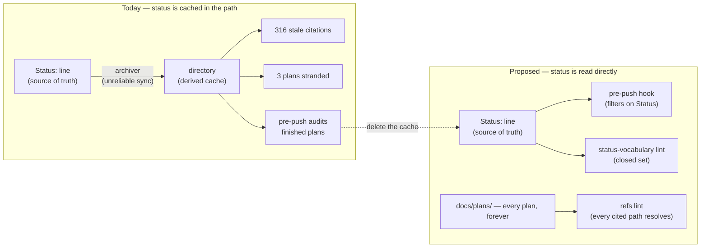

# Plan: Repo-Wide Reference-Integrity Gate

- **Date**: 2026-07-17
- **Status**: **Clusters A + B implemented + converged** (A 2026-07-17, B
  2026-07-18). Plan approved (3 GPT + 2 Gemini rounds). **Cluster A** (Phase 1,
  the lint): test-first, code-audited 5 GPT + 2 Gemini rounds, **merged to main**.
  **Cluster B** (Phases 2-3, the 145-file consolidation + 163-ref rewrite +
  drift-gate-framed Phase 3): built in an isolated worktree, fix-gate audit (GPT
  round 1 — all findings out-of-cluster/pre-existing/marker-long-tail, 0 in-cluster
  fixes) + consolidated Gemini gate (round 1 CONCERNS → 1 real fix + 1 refuted →
  round 2 **APPROVE**). **NOT yet merged** — deferred until the shared `main` is
  quiet AND Cluster C lands close behind (Cluster B empties `docs/completed/` but
  does not delete the archiver, which would re-populate it on the next `/ship`
  until Cluster C removes it). **Cluster C** (Phases 4-6: the status contract,
  archiver deletion, turn the gate live) remains unbuilt.
- **Author**: Claude + Louis Strydom
- **Scope**: backend

## Cluster A code-audit convergence (2026-07-17)

`scripts/check-docs-refs.mjs` + `docs/reference/reference-integrity.md` + wiring.
Report-only (Phase 6 turns on gating). Run in a dedicated worktree; merged to main.

**GPT: 5 rounds, ledger-driven R2+ suppression. In-cluster real-defect
trajectory `several → 2 → 1 → 1 → 0` = converged.** 10 distinct findings
accepted+fixed, 28 dismissed. What the rounds surfaced:

- **The gate self-tripped** — it flagged the ~24 tokens its own spec/tests use to
  *illustrate* the grammar (use vs mention). Resolved with a declared 4-file
  `SPEC` exclusion on this repo's own precedent (`egress-path-scan.mjs`, which
  names "their tests" for the identical self-trip).
- **Four genuine grammar-extraction bugs**, each with a concrete failing input,
  each fixed test-first: angle-bracket link destinations silently dropped (a
  false negative); `.md`-as-prefix-of-a-longer-token mis-extraction; the
  continuation-guard char class narrower than `seg`/`stem`; a closing paren
  binding `(planned)` with no space (suppressing a real finding — the cardinal sin).
- **Persistent non-findings, correctly held**: the out-of-cluster Structure-pass
  re-raises (H1/H2 = Cluster B/C — true statements about the repo that only later
  clusters resolve), and a **3-round Sustainability hallucination** (a claimed
  comment-before-the-shebang syntax error; `grep -c CHANGED` = 0, the file's first
  bytes are `23 21 2f`, it runs — refuted every round). Gemini agreed: **0
  wrongly-dismissed** across both its rounds.

**Gemini gate: 2 rounds (cap reached), 6 findings, all fixed.** Round 1 caught a
real MEDIUM the 5 GPT rounds missed — a URL fragment broke `(planned)` marker
attachment (false positive). Round 2 caught a real self-consistency HIGH — a
self-linking label carrying a marker bound the destination but not the label,
contradicting the contract's "both resolve identically". Plus doc-drift and an
O(N²) slice and a `matchAll` fragility cleanup. **Stopped at the 2-round cap**:
the findings had converged to ever-narrower marker-attachment regex edge cases
(closing char → fragment → link destination), the diminishing-returns signal the
cap exists for; the marker grammar's arbitrarily-nested-adjacent-syntax long tail
is a documented limitation, not a blocker for a report-only lint. **77 tests pass.**

## Audit trail

**GPT — 3 rounds, 22 findings, `Suppressed 0 | Reopened 0` in every R2+ round.**
HIGH 5 → 3 → 5. Every finding was **net-new**: rounds 2 and 3 found defects that
rounds 1 and 2's *fixes introduced*, not re-raises. **Stopped at the round-3 cap**
per the rigor-pressure rule — the increase was not scope pressure (R3 was mostly
self-contradictions from R2's own edits), but the cap is the cap; the remaining
findings were fixed and handed to the Gemini gate rather than spent on an R4.

Four findings changed the design rather than polishing it:

- **R1-H4** — deleting the archiver breaks
  `tests/atomic-write-adoption-guard.test.mjs:223-226`, which AST-asserts
  "exactly 2 sites … all wrapped" **against the file being deleted**, and orphans a
  requirements-ledger invariant provenance-anchored to `parseStatus`/`isComplete`
  (`.requirements/ledger.json:1488-1496`). Both were invisible until the deletion
  inventory was actually run.
- **R2-H1** — the round-1 lexical contract was **self-contradictory**: it restricted
  every segment to `[A-Za-z0-9._-]+` while requiring placeholders to contain
  `<`/`>`/`*`, so `docs/plans/<name>.md` parsed as "not a citation" and could never
  reach placeholder classification.
- **R2-H2** — the permanent lint was given a `MOVED` class it **cannot compute**
  (no relocation map; before Phase 2 the token simply resolves, after it is
  indistinguishable from a deletion). `MOVED` moved to the one-shot migration tool
  that owns the manifest. The gate got *smaller*.
- **R3-H2/H3 — the most valuable finding, and it refuted a premise.** The plan's
  `# Plan:`-H1 identity predicate is **contradicted by the corpus**: measured across
  all 140 `docs/completed/*.md`, a `# Plan:` H1 rejects **35** (22 audit summaries +
  13 free-form: `# allowTiered —`, `# Mega-Plan:`, `# Proposal:`, and `# Plan —`
  with an em-dash), and a `Status:`-line predicate rejects **20**. The preflight
  would have failed on a quarter of the corpus at implementation time. Resolved by
  **deleting the assumption** — the migration asserts no document shape, and
  selection uses the rule the repo already documents
  (`check-docs-placement.mjs:57`).

**Evidence correction (pre-audit)**: the inherited "741 raw / 378 actionable"
figures did not reproduce (**1004 / 316**; the claim's own components sum to 284),
and the motivating postgres-parity anecdote is **refuted** — see §1.

**Gemini gate — 2 rounds (cap reached), ending `APPROVE`.** `claude_bias_detected:
false`, `deliberation_was_fair: true`, `over_engineering_flags: 0`, and it credited
one **GPT false positive** correctly refuted (R3-H4, the consumer-sync packaging
concern — the hook executes the SOURCE repo's scripts via a sibling-scan sentinel).

- **Round 1 → `CONCERNS`**: 3 new, 0 wrongly-dismissed — all three **real mechanical
  defects in this plan's own spec**, all sustained and fixed:
  - **G1** — the boundary class contained `.`, so `See docs/plans/x.md.` extracted
    as `x.md.`, failed the `.md`-terminated rule, and **fell silently into
    "not a citation"** — i.e. every prose citation ending a sentence would have been
    dropped by the gate meant to catch them. Fixed structurally (the grammar regex
    is the extractor; it terminates at `.md`).
  - **G2** — a genuine **regex bug**: the separator class `[\s—–(:,.;-]` places the
    hyphen last, making it a *literal* hyphen, so the class contained precisely what
    the adjacent prose claimed it excluded, and `Complete-ish` would have parsed as
    `Complete`. The stated rule and the stated implementation contradicted each other.
  - **G3** — §7b Phase 2 still ordered the `# Plan:`-shape assertion that §2 had
    withdrawn (the same leftover-contradiction class as R3-H1).
- **Round 2 → `APPROVE`**: 2 new, both LOW, both **shrink the plan** and both
  adopted: an unreachable test requirement (cross-repo refs never extract, so they
  can't be a `classifyRef` exclusion), and a redundant manual step (Phase 2's
  consolidation **auto-heals** `compat-bootstrap.sql:5`, which also moots R12).
  **Stopped at the cap** — correctly, per the rule: round 2's findings were
  refinements, not design defects.

**Net effect of the audit**: the design got *smaller* at almost every step — `MOVED`
left the permanent gate, the shape predicate was deleted rather than replaced, two
manual steps evaporated, and one unsupportable guarantee was withdrawn.

- **Target domain(s)**: `scripts`, `tests`, `claude-hooks`, `install`
- ⚠ **Cross-domain work** — touches all four. The coupling is deliberate: the
  archive step (`scripts`) writes a directory the pre-push hook (`claude-hooks`
  / `install`) reads as a work queue. That seam IS the bug; a plan that touched
  only one side would fix a symptom.
- ⚠ **Untagged paths**: `AGENTS.md`, `package.json` — match no rule in
  `.audit-loop/domain-map.json`. Pre-existing gap, not introduced here; noted
  for `docs/plans/domain-map-reconciliation.md` (item 9, dead intents).

## Neighbourhood considered

`get-neighbourhood` (k=8, refresh `b1d8cceb`) returned **`review` for every
candidate** — no `reuse`/`extend`-tier match, so the new lint is greenfield.
Three returns are load-bearing context rather than duplication risks:

| Symbol | File | Score | Bearing |
|---|---|---|---|
| `runArchive` | `archive-completed-plans.mjs:87` | 0.814 | The function this plan **deletes**. Expected self-similarity. |
| `main` | `check-docs-placement.mjs:62` | 0.782 | **The precedent to mirror** — an allowlist-driven docs gate wired into `npm run check`. Its narrowness doctrine is adopted verbatim (see §2). |
| `walkMd` / `lintFile` | `lint-plan-mermaid.mjs:231` / `:210` | 0.775 / 0.772 | The existing per-file lint scaffold: `{severity, rule, file, lineNo, message}` + `--format json` + ERROR-blocks/WARN-advisory. **Reused as the shape**, not copied. |

**Deliberate divergence — `looksLikeRealPath`** (`scripts/lib/model-eval/egress-path-scan.mjs:52`)
is *not* reused. It solves a different question (is this prose token a real path?)
for a generic `word/word` extractor. This lint extracts a far narrower shape
(`docs/<bucket>/<name>.md` — always ≥2 segments, always an extension), so the
prose-collision class it defends against cannot arise. **Its lesson transfers and
is adopted**: that module documents a live 2026-07-12 incident where a
path-shaped-token gate false-positived on an audit finding's own prose, *and* a
same-day revert when the fix over-tightened and broke recall. That is precisely
the "noisy gate gets bypassed" failure this plan's §2 convention exists to
prevent, with receipts.

## Past incidents to verify against

> | Incident | Affected paths | Status | Lessons |
> |---|---|---|---|
> | **INC-001** — lexical path classifier bypassed by a symlink whose innocent name resolved into `~/.ssh/` | `scripts/lib/sensitive-paths.mjs` | `manual-verification-required` | Anywhere a decision is made from a path, canonicalise **before** classifying; fail closed on resolution error. |

Relevance is indirect but real: this plan adds a tool that **walks and reads every
tracked file**. See §Security Considerations.

---

## 1. Context Summary

**Detected scope**: backend (Node ESM, no UI). **Stack**: `js-ts` (+ `postgres`).

### What exists today (Code Trace)

The archive step and its consumers form one uninspected seam:

- `scripts/archive-completed-plans.mjs:33` — `STATUS_LINE_RE` parses
  `- **Status**: …`; `:34` `COMPLETE_RE = /^Complete\b/i`; `:56` `isComplete()`;
  `:87-146` `runArchive()` moves `docs/plans/X.md` → `docs/completed/X.md` via
  `fs.renameSync` (`:134`), plus `*-audit-summary*.md` siblings found by
  `findAuditSummariesFor` (`:65-71`). **It rewrites no references.**
- `skills/ship/SKILL.md:298` — Step 5.5 runs `npm run plans:archive` on every
  `/ship` unless `--no-archive`.
- `scripts/install-prepush-hook.mjs:89-95` — `PLANS_DIR="docs/plans"`; then
  `PLAN_FILE=$(ls -t "$PLANS_DIR"/*.md | head -1)` → audits it via
  `openai-audit.mjs code "$PLAN_FILE" --scope diff`. **There is no `Status:`
  filter.** The hook trusts the *directory* to mean "in flight".
- `scripts/explain-history.mjs:192` — `planSearch()` greps `docs/plans/` recursively.
- `scripts/debt-review.mjs:76` — `--write-plan-doc` writes `docs/plans/refactor-<id>.md`.
- `scripts/setup-postgres.mjs:254,498` — pins `sha256(filePath)` per migration and
  throws `migration ${f} sha256 mismatch — refusing to re-apply`. **The hash covers
  the whole file, comments included.**
- `docs/README.md:60-90` — documents `docs/completed/` as holding `Complete` **and
  `Superseded`**, and mandates that `*-audit-summary.md` `Status:` lines stay
  free-text convergence sentences ("Don't normalise the summary lines to `Complete`").

### The root cause

**`docs/plans/` vs `docs/completed/` is a denormalized cache of the `Status:` line,
and nothing invalidates it.** Status is the source of truth; the directory is a
derived copy; the archiver is the (only, unreliable) synchroniser. Every observed
symptom is one cache-coherence bug:

| Symptom | Cache failure | Measured |
|---|---|---|
| Stale citations | pointers to the cache's **old location** | **316 sites / 48 targets** |
| 3 finished plans stranded in `docs/plans/` | cache **never written** (`Status: Implemented` ≠ `/^Complete\b/`) | 3 |
| 3 `Superseded` plans hand-moved to `docs/completed/` | **manual** cache write (tool has no such concept) | 3 |
| Pre-push hook eligible to re-audit finished work | **stale read** — hook trusts the dir, not the Status | live today |

The fourth row is not hypothetical: because the archiver silently skipped the 3
`Implemented` plans, `ls -t docs/plans/*.md | head -1` can currently select a
*finished* plan and burn a real GPT audit on it every push.

### Evidence base — measured, not inherited

A prior session's figures were re-measured from scratch (`git ls-files`, tracked
files only, occurrence-counted). **They do not reproduce, and are corrected here:**

| Claim | Measured | Note |
|---|---|---|
| 741 raw dead refs | **1004** sites / 156 unique targets | not reproducible under any bucketing |
| 378 actionable | **316** MOVED sites / **48** unique targets (+28 GONE) | the claim's own components sum to **284**, not 378 — internally inconsistent; the unlisted `tests/**` surface (~106) is roughly the missing mass |
| "236 live code" | reconstructs as `scripts/**` 216 **+ `supabase/**` 20` | **mislabeled** — 20 are inside sha256-frozen migrations |
| "6 SKILL.md files" | **12 files / 16 sites** | `.claude/skills/**` is a generated mirror of `skills/**` |
| postgres-parity lint's escape hatch "pointed nowhere for weeks" | **REFUTED** | `check-non-core-references.mjs:213` already says `docs/completed/…` and the target **exists** (5675 B, archived `8d84c59`). The real stale ref is a different file: `scripts/lib/db/compat-bootstrap.sql:5`. |

**The headline harm anecdote does not survive contact.** The plan proceeds on the
316 genuinely-stale sites and the three structural failures above — not on that story.

**Actionable, by surface** (316 MOVED + 28 GONE):

| Surface | MOVED | GONE |
|---|---:|---:|
| `scripts/**` | 216 | 1 |
| `tests/**` | 80 | 17 |
| `skills/**` + `.claude/skills/**` (mirror) | 8 | 8 |
| `docs/**` | 5 | 0 |
| `AGENTS.md` | 1 | 0 |
| `.claude/hooks/**` | 1 | 0 |
| other (`.github/`, `.gitignore`, `setup.mjs`, `.githooks`) | 5 | 2 |

**Noise — 2/3 of the raw figure**, dominated by one file:

| Class | Sites | Why excluded |
|---|---:|---|
| **CORPUS** — `docs/experiments/audit-effectiveness/known-defects.candidates.json` | **309** | Other repos' plan paths mined from 500 commits (`wine-cellar-app` 588, this repo 331, `ai-organiser` 328). **Not citations at all.** 31% of the raw total, one file. |
| PLACEHOLDER | 80 | `README.md:185` `… code docs/plans/X.md`; `setup.mjs:273` `my-feature.md`; `docs/plans/*.md` globs |
| HISTORICAL doc prose | 58 | describes a past state; rewriting is falsifying the record |
| HISTORICAL session log (`status.md`) | 58 | same — an append-only log |
| **FROZEN** (sha256-pinned migrations) | 21 | **editing breaks every consumer's migration ledger** |
| VENDORED (`docs/plans/security/files/`) | 9 | a portable kit, path-mirrored on purpose |
| FIXTURE | — | `tests/arch-memory-followups.test.mjs:62` writes synthetic `docs/plans/a.md` to a temp root |

Two classes that must **never** be "fixed":
- **Deliberate forward-ref** — `skills/click-test/SKILL.md:582`:
  `Tracked in [docs/plans/click-test-v2-persistence.md] (file to be created when v2 starts; not a v1 blocker)`.
- **Cross-repo** — `tests/persona-test-candidates-cross-skill.test.mjs:15`:
  `Plan: wine-cellar-app/docs/plans/persona-test-consistency-phase3.md`.

### Patterns reused vs new

**Reused**: `check-docs-placement.mjs`'s allowlist-gate shape + narrowness doctrine;
`lint-plan-mermaid.mjs`'s issue record + `--format json` + ERROR/WARN split;
`git ls-files` as the scan set (inherits `.gitignore`, excludes `.audit/`,
`.claude/tmp/`, `node_modules/`). **New**: the reference resolver + the placeholder
convention. **Deleted**: the archiver.

---

## 2. Proposed Architecture

### The design fork — decided

**Decision: consolidate to a single `docs/plans/` directory. `Status:` is the only
status. The archive step is deleted.**



#### Right-sizing gate

- **Band-aid** — rewrite the 316 sites now. The archiver keeps moving files;
  the next `/ship` re-breaks them. Rots within a month. *(This is what was
  originally asked for; it is the wrong shape.)*
- **Over-engineered** — plan-ID indirection (`plan:postgres-parity`) with a
  resolver + editor tooling; or 140 redirect stubs at the old paths. The stub
  variant is the messy middle: every stub is a lie to `grep`, and it doubles
  the file count to preserve links nobody can follow mechanically anyway.
- **Chosen** — delete the denormalization. The `Status:` line already exists and
  is already authoritative; the directory adds nothing but a cache to invalidate.
  **Current requirements served**: (a) 316 sites are broken *now*; (b) the
  pre-push hook needs a mechanical in-flight predicate *now* and currently has a
  wrong one; (c) 3 plans are stranded *now*. No speculative abstraction is added
  — the plan **removes** ~200 lines, a `/ship` step, two npm scripts, and a test file.

#### Why B beats A, on measured evidence

| | A — keep two dirs, archiver rewrites refs | **B — one dir (chosen)** |
|---|---:|---:|
| Sites to rewrite | **316** | **~181** |
| Frozen sites left permanently broken | **21** | **5** |
| Ongoing machinery | archiver + ref-rewriter + lint | **lint only** |
| Failure class | prevented *by synchroniser* (can fail) | **eliminated by construction** |

Four load-bearing reasons:

1. **The repo already decided this — the other way, deliberately, and wrote down
   why.** `docs/README.md:95-99` on research runbooks: *"`arm-eval.md` is live;
   `model-ab-experiment.md` + `solo-control-experiment.md` are concluded — **each
   doc states which, so a status change never means a file move**."* Same problem,
   same repo, opposite convention. Plans are the outlier, not the precedent.
2. **The frozen surface votes 21:5.** sha256-pinned migrations cite `docs/plans/`
   21 times and `docs/completed/` 5 — because they were written while those plans
   were in flight. Consolidating to `docs/plans/` makes **21 permanently-unfixable
   comments true again, for free**. Option A can *never* repair them: editing a
   comment changes the file hash and `setup-postgres.mjs:498` refuses to re-apply,
   breaking every consumer's migration ledger.
3. **B deletes code; A adds it.** A must keep the archiver *and* grow a rewriter
   *and* still needs the lint for what the rewriter can't reach (consumer copies,
   commit messages, GitHub links).
4. **B's migration is smaller** (181 vs 316) and heals 316 + 21 sites at zero edit cost.

**Honest costs of B** (see §8 for full register): the path stops signalling
shipped-ness to a reader of an `AGENTS.md` link; `ls docs/plans/` stops being a
glanceable work list (147 files, 7 live); 140 renames land in history.

#### Fork #1 — detect or prevent? **Both, but structurally**

Prevention is by *construction* (no move ⇒ no broken ref), not by a synchroniser.
The lint remains — it catches the classes consolidation cannot: typos, deleted
targets (the 28 GONE), and refs to files that never existed.

#### Fork #2 — what counts as a reference? **The placeholder convention**

The rule that makes the gate non-noisy, and the reason `check-docs-placement.mjs`'s
doctrine is adopted verbatim (*"a lint that guesses it would be noise"*):

> **A path-shaped token is a citation and MUST resolve, UNLESS it is
> syntactically marked as a placeholder with angle brackets** — `docs/plans/<name>.md`.

##### The lexical contract (R1-H1 — the gate is not executable without this)

Prose is not a grammar. The contract below is **versioned** (`REFS_GRAMMAR_VERSION`),
lives in `docs/reference/reference-integrity.md`, and is pinned by a **table-driven
parser test** — one row per case, so the grammar is the test fixture, not an
implementer's guess.

**Two mutually-exclusive alternatives** (R2-H1 — the round-1 draft was
self-contradictory: it restricted every segment to `[A-Za-z0-9._-]+` while
*requiring* placeholders to contain `<`, `>`, `*`, so `docs/plans/<name>.md`
parsed as "not a citation" and could never reach placeholder classification. The
grammar below is the corrected, non-overlapping form):

```
citation    := concrete | placeholder
concrete    := "docs/" (seg "/")* stem ".md"
placeholder := "docs/" (seg "/")* phstem ".md"
seg         := [A-Za-z0-9._-]+                  ; directory segments are ALWAYS concrete
stem        := [A-Za-z0-9._-]+
phstem      := "<" [A-Za-z0-9._-]+ ">"          ; bracketed final stem
             | [A-Za-z0-9._*-]* "*" [A-Za-z0-9._*-]*   ; glob final stem
```

| Element | Rule |
|---|---|
| **Boundary** (corrected by G1) | **The grammar's own regex is the extractor — it terminates at `.md` and therefore never consumes trailing punctuation.** No "extract a blob, then validate" step, and no punctuation-stripping pass. Leading: `(?<![A-Za-z0-9._/<>*-])` — the class includes `<>*` so a placeholder is not truncated at `<`. Trailing: `(?![A-Za-z0-9_-])` — a negative lookahead, **not** a boundary-class member. <br><br>The round-3 draft was broken here: its boundary class contained `.` (needed for extensions), so `See docs/plans/my-plan.md.` extracted as `docs/plans/my-plan.md.`, failed the `.md`-terminated `concrete` rule, and **fell silently into "not a citation"** — dropping every prose citation that ends a sentence. Anchoring on `.md` fixes it by construction: `…my-plan.md.` → matches `docs/plans/my-plan.md`, the `.` is simply outside the match; `…my-plan.mdx` → **no match** (`x` fails the lookahead), correctly. |
| **Which alternative wins** | `concrete` and `placeholder` are disjoint by construction (a final stem either contains `<`/`*` or does not). The parser emits **exactly one** alternative per token, and which one is part of the returned record. |
| **Resolvability** | **Only `concrete` is resolved.** `placeholder` is emitted as PLACEHOLDER and **never** resolved — so a placeholder can never be a finding. |
| **Neither alternative** | Not a citation. Never a finding. (E.g. `docs/plans/` bare, or a token with a space.) |
| **Anchors / queries** | A trailing `#fragment` / `?query` is **stripped before resolution**; the fragment is never validated (it is not a path). |
| **Markdown links** | **No special case.** A token matching the grammar is a citation *wherever* it appears — prose, code comment, JSON string, link destination, **or link label**. So `[docs/plans/a.md](docs/plans/a.md)` is **two sites**, and that is correct: a label naming a path is itself a claim about that path; both resolve identically and one edit fixes both. *(An earlier draft said "only `dest` is extracted" — a context-sensitive rule the implementation never had and did not need. Caught by the Cluster-A code audit (R1-M3) and **removed rather than implemented**: it bought nothing and added a branch to get wrong.)* |
| **`(planned)` marker** | Valid **only** as the literal `(planned)` **immediately following the token**, separated by at most one space, or by a single closing `` ` `` / `)` then one space. Nothing else on the line, in the sentence, or in an enclosing block confers it. |
| **Normalization** | No case-folding (see R13). A token containing `..` is a **finding**, never resolved. |
| **Multiple per line** | Each occurrence is its own site; a marker binds to **its own** token only. |

The parser test is **table-driven with explicit positive AND negative boundary
rows** — `docs/plans/<name>.md` → PLACEHOLDER; `docs/plans/feature.md` → concrete
(→ GONE, proving bare stems are not absolved); `[x](docs/plans/a.md#h)` → concrete
`docs/plans/a.md`; `docs/plans/*.md` → PLACEHOLDER; `a docs/plans/x.md, and
docs/plans/y.md (planned)` → two sites, marker on `y` only.

Every classification result carries the **marker's string offset** (a JS UTF-16
code-unit index, for traceability only — never a byte position), so a suppression
is traceable to the exact token that earned it rather than inferred from context.
`(planned)` on a token that **now resolves** is itself a finding (`stale-planned-marker`)
— the marker cannot outlive its reason.

##### The classifier's boundary — MOVED is migration-time, not lint-time (R2-H2)

The round-1 draft gave the permanent lint a `MOVED` class it **cannot compute**.
`MOVED` is a statement about *relocation history*, and the lint has no relocation
map: before Phase 2 a `docs/completed/X.md` citation simply **RESOLVES**; after
Phase 2 the identical token is **indistinguishable from a genuinely deleted
target**. A permanent gate that infers "it's probably a move" from a sibling
directory would be guessing — the exact sin §2 forbids.

**The two concerns are separated:**

| | **`check-docs-refs.mjs`** (permanent gate) | **`migrate-refs.mjs`** (one-shot, Category A) |
|---|---|---|
| Knows | only the **current git index** | the preflight `source → destination` **relocation manifest** |
| Emits | `RESOLVES` · `GONE` · `PLACEHOLDER` · policy violation (`..`, stale-`(planned)`) | `MOVED` — enumerates inbound sites **from the manifest** and rewrites them |
| Lifetime | forever | dies with Phase 2 |

So the lint never has a `MOVED` branch to go stale, and the migration's correctness
is checked by the manifest it already built rather than by a heuristic. The §1
census's "MOVED" column is a **measurement of today's breakage**, not a lint class —
it is what `migrate-refs.mjs` consumes, and it is why the lint's own Phase-2
acceptance is stated as **GONE-count**, not "0 actionable" (R1-M1).

- Placeholders are **marked, not guessed** (`<…>` or a `*` glob). Legacy literals
  (`X.md`, `feature.md`, `my-feature.md`, `a.md`) are migrated to the marked form
  in Phase 1 — they are not allowlisted, because an allowlist of bare filenames
  would silently absolve a real typo.
- **Excluded surfaces** (declared, with the reason, in the lint's own source —
  mirroring `ROOT_ALLOWLIST`'s "each entry names the tool that owns it"):
  `supabase/migrations/**` (FROZEN — sha256-pinned; a stale comment there is
  permanent by design), `docs/experiments/**/known-defects*.json` (CORPUS — other
  repos' paths), `docs/plans/security/files/**` (VENDORED), `status.md` +
  `docs/completed/**` historical prose (append-only record).
- **Forward-refs are marked, not excluded**: `docs/plans/click-test-v2-persistence.md`
  → the citation carries a `(planned)` marker the lint honours. A forward-ref that
  is never created stays visible rather than being silently allowlisted.
- **Cross-repo refs** (`wine-cellar-app/docs/plans/…`) are out of scope by prefix —
  not this repo's tree.

The lint ships **report-only first** (Phase 1) precisely so the convention is
validated against real output *before* it can block a push.

#### The status contract — ONE parser, no second implementation (R1-H2)

Making `Status:` authoritative while giving the **shell hook** its own `grep` would
recreate this plan's own root cause one layer down: two implementations of one
contract, drifting silently. The hook is generated into consumer repos, so a drift
there is invisible.

**`scripts/lib/plan-status.mjs`** is the single source of truth, exporting:

- `parsePlanStatus(content)` → `{ok:true, token, kind:'terminal'|'active'} | {ok:false, reason}`
- `selectAuditPlan(dir)` → the one plan the pre-push hook should audit, or `null`

| Rule | Decision |
|---|---|
| **Grammar** (closed by R3-M1) | Line: `^- \*\*Status\*\*:\s*(.+)$`. **Exactly one** such line may exist — **≥2 is `{ok:false, reason:'duplicate'}`**, never "first wins" (the round-2 draft said both; they contradict). Strip surrounding `**`/`__` from the value, then trim. |
| **Token match** (corrected by G2) | The token must be a **prefix** of the trimmed value, matched case-insensitively, followed by **end-of-string or a separator** ∈ **`[\s—–(:,.;]`**. So `Complete — pending release` → `Complete`; `**Complete**` → `Complete`; `Complete (v1)` → `Complete`. **`Complete-ish` → `unrecognized`.** `In Progress` is matched before `In` (longest-token-first). <br><br>**The hyphen must not appear in that class.** The round-3 draft wrote `[\s—–(:,.;-]` while asserting "`-` is *excluded*" — but a trailing `-` inside a bracket expression is a **literal hyphen**, so the regex included exactly what the prose excluded, and `Complete-ish` would have matched `Complete` + `-`. The class above omits it; a test pins `Complete-ish` → `unrecognized`. *(Verified: zero corpus impact — no non-audit-summary plan has a hyphen-terminated status token. `Approved-with-known-debt` exists only as a hypothetical in `tests/archive-completed-plans.test.mjs:52`, a file this plan deletes.)* |
| **Vocabulary** | terminal `Complete`, `Superseded`; active `Draft`, `Approved`, `In Progress`. **Closed** — anything else is `unrecognized`. |
| **The DB `CHECK` is a THIRD vocabulary and must be reconciled** (found 2026-07-17, post-approval) | `plans.status` allows only `('draft','in_progress','complete','abandoned')` (`20260419120000_cross_skill_data_loop.sql:36`) — so **`Approved` and `Superseded` are instructed by our own docs but rejected by the store**, and `abandoned` appears in no doc. Reproduced live: `upsert-plan --status approved` → `violates check constraint "plans_status_check"`. This is **the same denormalization this plan exists to kill**, third instance: one vocabulary, three definitions (`skills/plan/SKILL.md:577`, `docs/README.md:76`, the DB CHECK), no source of truth. `lib/plan-status.mjs` becomes that source; Phase 4 aligns the other two to it — a migration widening the CHECK to the canonical set, and a SKILL.md correction. **In-scope by impact**: this plan makes `Status:` authoritative, and a status the store cannot persist makes it un-authoritative. |
| **`Implemented`** | **Rejected**, never aliased — ambiguous in the corpus (means "done" in 3 plans, "partially done" in `dismissed-fp-reopen-policy.md`). Error names both replacements. |
| **No `Status:` line** | `{ok:false, reason:'absent'}` → **not a plan** (the documented rule); not selectable, not linted. **Not a failure.** 20 real files depend on this. |
| **Malformed / duplicate / unrecognized** | `{ok:false}` → the **lint fails closed** (non-zero, names the file). |
| **Hook behaviour on any `{ok:false}`** | **Skip that file for selection; never abort the push.** Fail-closed for the *gate*, fail-open for the *push* — a broken header must not make the repo unpushable. Deliberate asymmetry. |
| **Selection order** (R3-M2) | Among `active` plans: newest `mtime`, tie-broken by lexical path. **`mtime` is not portable** (a fresh clone stamps every file identically), so it is a *heuristic*, not the contract: when **>1 active plan** exists the CLI **reports the ambiguity on stderr** and names the chosen file, so the choice is visible rather than silent. This is strictly better than today's `ls -t | head -1`, which picks one and says nothing. |

##### Hook ↔ CLI protocol (R3-H5) — a stray stdout byte becomes `PLAN_FILE`

The hook consumes selection via **command substitution**
(`PLAN_FILE=$(node … --select …)`), so the stream discipline is load-bearing: an
explanation printed to stdout would *become the plan path*, and a non-zero exit
under strict shell error handling would abort the push. The contract:

| Channel | Content |
|---|---|
| **stdout** | **The chosen repo-relative path, and nothing else** (no trailing prose, no banner). **Empty** when no active plan. This is the *only* stdout writer — consistent with the repo's `process.stderr.write()`-for-progress rule. |
| **stderr** | Every diagnostic: skipped malformed files, the >1-active-plan ambiguity, scanner failures. |
| **exit 0** | A plan was selected **or** none was — both are normal. |
| **exit ≠ 0** | Only a genuine tool fault (bad args, unreadable dir). |

**The hook never lets selection abort the push**: it invokes with `|| true` and
treats empty output as "nothing to audit" — exactly today's `[ -z "$PLAN_FILE" ] &&
exit 0`. Tested by asserting that a malformed plan present in the dir yields a clean
push and an empty `PLAN_FILE`.
| **Audit summaries** | `*-audit-summary.md` is **excluded from selection** and **exempt from the vocabulary lint** — `docs/README.md` mandates their free-text convergence sentence (`Audit-complete. 17 fixes applied.`); 22 real files depend on it. |
| **Discovery boundary** (R2-M2, corrected by R3-H2/H3) | **Shallow: `docs/plans/*.md` only, never recursive.** Selectable **iff** `parsePlanStatus` returns `kind:'active'` and the name is not `*-audit-summary*.md`. `docs/plans/security/**` is out by shallowness, not by allowlist. **No document-shape predicate** — see the corpus finding below. |

##### There is no structural "is a plan" predicate — and the plan no longer pretends there is (R3-H2/H3)

The round-2 draft invented `isPlanDocument` requiring a `# Plan:` H1, and asserted
that a nested live plan would be a "deterministic lint failure". **Both claims are
refuted by the corpus**, measured across all 140 `docs/completed/*.md`:

| Candidate predicate | Files it would wrongly reject |
|---|---:|
| `# Plan:` H1 | **35 / 140** — 22 audit summaries (`# Audit Summary — …`), plus 13 real plans with free-form H1s: `# allowTiered — …`, `# Dashboard UX — …`, `# Mega-Plan: …`, `# Proposal: …`, and `# Plan —` (**em-dash, not colon**) |
| `- **Status**:` line | **20 / 140** — incl. `audit-tool-staleness-check.md`, `browser-mcp-and-tooling.md` |

A `# Plan:`-only preflight would have **failed the migration on a quarter of the
corpus** at implementation time. The convention is aspirational, not real.

**The correction is to delete the assumption, not to build a better guesser:**

- **The migration preflight asserts *no* document shape.** `docs/completed/` **is**
  the plan archive by definition (`docs/README.md`: *"everything in it is assumed to
  be a plan"*), so shape is not the migration's business. It asserts only what it
  actually needs: 140 `.md` entries, unique case-insensitive destinations, no
  pre-existing destination. *(Verified today: 140/140 `.md`, 0 collisions.)*
- **Identity only matters for selection**, and there it is `Status:`-based, matching
  the repo's own documented rule — `check-docs-placement.mjs:57`:
  `['docs/plans/', 'a unit of work with a Status: line']`. **No `Status:` line ⇒ not
  selectable**, which is the safe default (a doc that doesn't claim to be in flight
  cannot be in flight) and is exactly today's `runArchive` behaviour ("no Status line
  found" → skip).
- **The vocabulary lint applies only to files that HAVE a `Status:` line.** The 20
  without one are unaffected — they are not plans by the documented rule.
- **The "nested plan = deterministic lint failure" guarantee is withdrawn.** With no
  reliable shape predicate, it cannot be honoured; claiming it would be the
  guessing §2 forbids. Placement is `check-docs-placement.mjs`'s remit, not this
  gate's. **Accepted, named**: a live plan in a new subdirectory is not selected —
  identical to today's `ls -t docs/plans/*.md` behaviour, so no regression.

**The hook calls the CLI; it does not re-implement it.** `install-prepush-hook.mjs`
emits `node "$AUDIT_LOOP_DIR/scripts/check-plan-status.mjs" --select "$PLANS_DIR"`,
which prints the chosen path or nothing. **Ordering constraint (load-bearing)**:
today the hook selects `PLAN_FILE` at `:89-95` *before* discovering `AUDIT_LOOP_DIR`
at `:97+`. That discovery **must move above** selection, and when it fails the hook
skips the audit exactly as it does today (never aborts the push).

##### Deployed-hook upgrade path (R2-H3)

The hook is a **deployed artifact**, and changing its template does nothing for
already-installed copies. Verified: `hooks:install` exists **only as a manual npm
script** — `sync-to-repos.mjs` and `setup.mjs` never invoke it — so a consumer
would keep the old `ls -t | head -1` body indefinitely. `npm run sync:dry` is a
*check*, not a deployment.

The installer already has the two pieces this needs, so the fix is wiring, not new
machinery:

- **A managed marker** — `HOOK_MARKER` (`:35`) + **legacy-marker acceptance**
  (`:36-39`, kept for the `claude-audit-loop`→`claude-engineering-skills` rename).
  That is the existing precedent for upgrading an older managed body.
- **A refusal path for unmanaged hooks** (`:196`, `:209`) — already correct; an
  operator-authored hook is never clobbered.

Changes: (a) **stamp a version** into the managed block and record it, so a stale
body is *detectable* rather than assumed; (b) have the supported install/update
flow invoke the idempotent refresh (managed or legacy marker → rewrite; unmanaged →
refuse + warn, as today); (c) document the operator command in
`docs/runbooks/consumer-adoption.md`.

Tests cover the **installed** hook body, not just the source template — including
an **upgrade from a legacy installed body** (asserting the `ls -t` selection is
actually replaced) and an unmanaged custom hook (asserting it is refused, not
overwritten).

---

## 6. Sustainability Notes

- **Assumption encoded**: a plan's identity is its filename, stable for life. This
  is *weaker* than today's assumption (identity = filename **+** current status),
  so it cannot break in a new way.
- **What changes in 6 months**: if `docs/plans/` grows past comfortable browsing,
  add `npm run plans:index` (generated, `SKILLS-INDEX.md` precedent). Deliberately
  **not** built now — no current requirement (see §8 R4); the hook needs a
  *predicate*, not an index, and `grep -L` serves humans meanwhile.
- **Coupling**: loosened. The hook stops depending on the archiver having run and
  reads the source of truth directly.
- **Pattern for others**: "status is metadata, never a path" becomes uniform across
  `docs/` — matching `research/`'s existing rule rather than contradicting it.
- **Extension point**: the refs lint resolves any `docs/**.md` citation, not just
  `docs/plans/` ones — the `docs/auth.md` dangling ref found during exploration is
  already in its net, and the first real run classified 1289 sites across the whole
  `docs/` tree. **It does NOT check non-`docs` repo paths** (`scripts/lib/x.mjs`
  cited in prose) — §2's grammar is explicit that a citation begins with `docs/`.
  *(An earlier draft of this bullet claimed "any repo path", which overclaimed
  against §2's own grammar — caught by the Cluster-A code audit, R1-H3. A plan
  about making claims checkable is a poor place for an unchecked claim.)*
  Widening to arbitrary repo paths is a **deliberate v2 decision**, not an
  oversight: every code path mentioned in prose becomes a candidate, so it needs
  its own noise analysis before the placeholder convention can absorb it (R6).

## Security Considerations

The lint walks and reads every tracked file (INC-001 class).

**R1-H3 — the first draft of this section was wrong and is corrected here.** It
claimed the lint "never follows a symlink out of the repo" while specifying an
ordinary `fs.readFileSync`, which **does** follow symlinks — and `git ls-files`
**can** list a tracked symlink. That is INC-001's exact failure mode (a lexically
innocent name resolving into `~/.ssh/`), restated as a security guarantee the design
did not implement. An extension allowlist is **not** a symlink defense.

The corrected sequence, per INC-001's lesson (*canonicalise before deciding; fail closed*):

1. **`lstat` every scan entry first.** `isSymbolicLink()` → **refuse to open it**;
   report `scanner/symlink-refused`. Not read, not followed, not classified.
2. **Regular files only.** Then `fs.realpathSync` and assert the canonical path is
   contained within `repoRoot` (prefix check on the canonical root, not string
   `startsWith` on the raw path).
3. **Fail closed, loudly.** Any `lstat`/`realpath`/read error → a scanner failure
   that makes the command **non-zero**. Never "couldn't classify it, so skip" — that
   is the success-path hole `pre-ship-empirical-verify.md` rule 3 warns about.
4. **Directories and out-of-policy files** are skipped *before* any read — per the
   explicit scan policy below, never an ad-hoc extension check.

Same-commit tests (Tier 1): an in-repo symlink → an external sensitive path; a
broken symlink; a symlinked directory; a `realpath` failure. Each must produce a
non-zero scanner failure, never a silent skip and never a read.

#### Scan policy — a silent skip is a false green (R2-M1)

"Walks every tracked file" and "skips non-allowlisted extensions" were both stated
and are in tension: an unlisted-but-text file would be **silently omitted**,
yielding a green "0 refs" that never checked the changed citation. That is exactly
the success-path hole `pre-ship-empirical-verify.md` rule 3 names.

`scanPolicy(path)` is **exported and tested**, returning `text` | `binary` |
`unclassified`:

- **`text`** — an explicit set: extensions (`.md .mjs .js .ts .json .sql .sh .yml
  .yaml .html .css`) **plus extensionless basenames/patterns** measured from the
  tracked inventory (`.gitignore`, `.githooks/*` — the census found citations in
  both, and neither has an extension).
- **`binary`** — explicit exclusions (`.png .jpg .svg .ico .woff2 …`), skipped silently.
- **`unclassified`** — anything else: **reported as `scan/unclassified-input` and
  the run is non-zero.** A new tracked text format therefore forces an explicit
  policy decision instead of vanishing from coverage.

Tests: one derives representative extensions/basenames from the real tracked
inventory (so the policy cannot silently fall behind the repo); one proves a novel
text-like file **cannot** produce an unqualified green scan.

- **Scan set is `git ls-files`** — tracked files only. Never traverses `node_modules/`,
  `.audit/`, `.claude/tmp/`, or anything gitignored.
- **Read-only.** The Phase-2 rewriter is a separate, one-shot, gitignored script
  (Category A) — never committed, never wired into `check`.
- **No egress.** No LLM call, no network. Nothing read is transmitted.
- The lint reports a path's *existence*, never its content — so a sensitive file
  can never be echoed into output.

---

## 7. File-Level Plan

| File | Intent | Purpose | Why (principle) |
|---|---|---|---|
| `scripts/lib/plan-status.mjs` | create | **The single status parser** (R1-H2). Exports `parsePlanStatus`, `selectAuditPlan`, `PLAN_STATUS_VOCABULARY`. Lives in `lib/` so `shared-lib` never imports upward. | #5 Single source of truth |
| `tests/plan-status.test.mjs` | create | Test-first; pins the `Implemented` rejection, the audit-summary exemption, malformed/duplicate `Status:`, deterministic selection order. | #11 |
| `scripts/check-plan-status.mjs` | create | Thin CLI over `plan-status.mjs`. `--select <dir>` (hook) and default lint mode. **No parsing of its own.** | #1 DRY |
| `scripts/check-docs-refs.mjs` | create | The **permanent** refs gate. Exports `extractRefs` (§2 grammar), `classifyRef` (**`RESOLVES`/`GONE`/`PLACEHOLDER`/violation only — no `MOVED`**, R2-H2), `scanPolicy` (R2-M1), `lintFile`, `runCheck`. Resolves against the **git index**, not `fs.existsSync` (R13). Mirrors `check-docs-placement.mjs`'s gate shape + `lint-plan-mermaid.mjs`'s issue record. | #1, #19 Observability |
| `tests/check-docs-refs.test.mjs` | create | Tier-1 test-first: table-driven grammar contract (positive **and** negative boundary rows), every class, every exclusion, the marker rules, the symlink matrix, the scan-policy inventory test, the no-silent-green test. | #11 |
| `docs/reference/reference-integrity.md` | create | The versioned lexical contract + convention. Sits in `reference/` per `docs/README.md`'s "enforced by" table (add the row). | #5 |
| `scripts/migrate-refs.mjs` | create (**Category A — scratchpad, gitignored, never committed**) | One-shot: builds the preflight bijection → **relocation manifest**; owns `MOVED`; enumerates + rewrites inbound sites from that manifest; emits a patch. Dies with Phase 2. | right-sizing (scripted+verifiable) |
| `docs/runbooks/consumer-adoption.md` | modify | Document the hook-refresh operator command (R2-H3). | #19 |
| `docs/completed/*.md` (140) | **move** | → `docs/plans/`. `git mv`, driven by the preflight map. | root cause |
| `scripts/**`, `tests/**`, `skills/**`, `docs/**`, `AGENTS.md` | modify | ~181 `docs/completed/X.md` → `docs/plans/X.md`. **`.claude/skills/**` is NOT in this set** (R1-M2 — generated). | migration |
| `.claude/skills/**` | **regenerate** | `npm run skills:regenerate` after canonical `skills/**` edits; `skills:check` asserts byte-identity. Never hand-edited. | generated-artifact policy |
| `scripts/archive-completed-plans.mjs` | **delete** | The synchroniser for a cache that no longer exists. | #20 |
| `tests/archive-completed-plans.test.mjs` | **delete** | Tests of deleted code. | — |
| **`tests/atomic-write-adoption-guard.test.mjs`** | **modify** | **R1-H4, verified**: `:223-226` AST-asserts `archive-completed-plans.mjs — exactly 2 sites … all wrapped`. **Deleting the module breaks this test.** Drop that `it()` + its Rule-2 comment at `:193`. | correctness |
| **`.requirements/ledger.json`** | **modify** | **R1-H4, verified**: `:1488-1496` anchors an invariant's provenance to `parseStatus`/`isComplete` in the deleted file; `coveredFiles:6` lists it. Reconcile via `requirements.mjs reconcile` — the invariant survives, re-anchored to `lib/plan-status.mjs`. | #5 |
| **`scripts/.cli-catalog.json`** | **modify** | **R1-H4, verified**: catalogues the deleted CLI. | #19 |
| `skills/ship/SKILL.md` | modify | Remove Step 5.5 + `--no-archive` (usage line `:12`, step `:298-313`, `:340`). | #5 |
| `scripts/install-prepush-hook.mjs` | modify | Move `AUDIT_LOOP_DIR` discovery **above** selection; select via the CLI. **Fixes a live bug.** | #2, #15 |
| `tests/prepush-hook-*.test.mjs` | modify | Prove a `Complete` plan is never selected, and a malformed one never aborts the push. | #11 |
| `docs/README.md` | modify | Rewrite `plans/`+`completed/` sections; state "status never means a move", matching `research/`. Remove the `plans:archive` reference. | #5 |
| `package.json` | modify | `-plans:archive*`, `+docs:refs`, `+plans:status`; wire both into `check`. | #19 |
| `scripts/lib/db/compat-bootstrap.sql` | modify | Fix the genuinely-stale ref at `:5`. **Verify it is not hash-pinned before editing** (R12). | correctness |
| `README.md`, `setup.mjs` | modify | Migrate legacy bare placeholders (`X.md:185`, `my-feature.md:273`) to the marked `<name>.md` form. | fork #2 |

> **Deletion-impact inventory (R1-H4) — the acceptance artifact.** The full tracked
> consumer set for `plans:archive` / `archive-completed-plans`, measured (`git grep -l`):
> `skills/ship/SKILL.md` + its `.claude/skills/` mirror · `package.json` ·
> `scripts/.cli-catalog.json` · `.requirements/ledger.json` ·
> `tests/atomic-write-adoption-guard.test.mjs` · `tests/archive-completed-plans.test.mjs` ·
> `docs/README.md` · `docs/architecture-map.md` (generated — `arch:refresh`) ·
> `status.md` + 5 `docs/completed/*.md` (**historical prose — do NOT rewrite**, R9).
> **Verified: the archiver is NOT in `sync-to-repos.mjs`/`sync-path-map.mjs`** — it was
> never synced, so there is **no consumer blast radius** and no consumer-side removal
> step is needed. Phase 4's acceptance is a re-run of this inventory returning only
> the historical-prose class.

### 7b. Implementation Phases

- **Phase 1 — The lint + the lexical contract (report-only)**. Build the resolver
  to the §2 grammar, the exclusion set, the symlink-safe scanner. Migrate legacy
  bare placeholders to the marked form. Ships **non-gating**; prints the census.
  Files: `scripts/check-docs-refs.mjs` (create), `tests/check-docs-refs.test.mjs`
  (create), `docs/reference/reference-integrity.md` (create), `package.json`
  (modify), `README.md` (modify), `setup.mjs` (modify), `docs/README.md` (modify —
  the "enforced by" row).
- **Phase 2 — Consolidate + rewrite (ATOMIC, preflight-driven)**. Files:
  `scripts/migrate-refs.mjs` (create, Category A), `docs/completed/*.md` (move),
  `scripts/**` (modify), `tests/**` (modify), `skills/**` (modify), `docs/**`
  (modify), `AGENTS.md` (modify), `docs/README.md` (modify), `.claude/skills/**`
  (regenerate).
  - **Preflight bijection first (R1-H5)** — no flat wildcard. Build an explicit
    `source → destination` map and **assert** before any mutation: every source is
    an `.md` file; every destination is unique **case-insensitively** (this repo
    already accepts `normalizePath()` lowercasing as Windows debt — a case-collision
    must fail loudly, not silently clobber); no destination already exists.
    **Asserts NO document shape** (G3 — §2's corpus finding: a `# Plan:` check would
    reject 35/140). *Measured today: 140/140 are `.md`, zero collisions — the
    preflight guards the window between now and execution, and is the acceptance
    artifact.*
  - **The rewrite set is derived from the map**, never from a free-text prefix `sed`.
  - **Patch-based, not in-place (R1-M3)** — the script emits a patch; `git apply
    --check` validates it; then apply. "One commit" is not filesystem atomicity, so
    the plan does not claim it: **recovery is `git checkout -- .`**, never a
    best-effort reverse rewrite. No atomic-write utility is needed because the tool
    does not write files in place.
  - **Acceptance (R1-M1, corrected by R3-H1)**: the **migration tool** reports every
    manifest entry rewritten (its `MOVED` set drained to zero), **and** `docs:refs`
    — which has no `MOVED` class — reports **no new GONE** beyond the pre-existing,
    reviewed 28-item inventory. **Not "0 actionable"**: GONE is Phase 3's. Plus
    `skills:check` green (R1-M2). The two tools are checked against each other; only
    the migration tool ever says "moved".
- **Phase 3 — Triage the GONE (reframed by a multi-LLM design review, 2026-07-18)**.
  The report-only gate, pointed at the whole repo for the first time, surfaced
  **118** GONE — but ~90 were **false-positive CLASSES**, not stale refs the plan's
  "~28 manual triage" anticipated. OpenAI + Gemini independently converged: a
  path-shaped token is not a citation; the durable answer is **baseline + drift-gate**
  (fail CI only on a ref that *newly* breaks in the changed surface, never on the
  standing GONE total), plus **structural subtree exclusions** for non-authored
  surfaces. So Phase 3 acceptance is **not "0 GONE"** (unreachable without
  over-excluding — the noise-then-bypass spiral) but **"false-positive classes
  structurally handled + genuine refs fixed + a recorded, drift-clean baseline."**
  - **Two structural exclusions added** (`check-docs-refs.mjs`): `FIXTURE`
    (`tests/**` — tests construct synthetic doc paths as data; a stale test-comment
    ref is acceptable decay) and `TOOL_OWNED` (`docs/arm-eval/**` — tool-written
    runtime archives per `docs/README.md`, same class as HISTORICAL). Cleared 73.
  - **35 genuine fixes**: 10 reorg-victim path fixes (`docs/pre-ship-empirical-verify.md`
    → `docs/runbooks/…`, targets verified), 23 usage-example placeholders → `<name>.md`,
    2 forward-refs → `(planned)`.
  - **Acceptance: 9 residual GONE, recorded as the accepted BASELINE** — all
    write-targets / never-produced artifacts / generated outputs / an illustrative
    comment, none with a correct mechanical fix. The drift-gate (Phase 6) fires
    only on *net-new* breakage, so this baseline is free. Baseline list (each a
    real `docs/**.md` target absent from the index):
    `docs/completed/architecture-intent-framework-audit-summary.md` (never-produced
    audit-summary, cited in an archived plan); `docs/experiments/audit-effectiveness/`
    `phase1-ledger-decomposition.md`×4 (a generated `--out` output, incl.
    `package.json:24`) + `phase5-decision.md` + `README.md` + a `…/phase1-ledger.md`
    shorthand (never-produced experiment docs); `docs/arm-eval/worksheets/`
    `model-ab-adjudication-worksheet.md` (tool-owned output cited from a runbook);
    `docs/auth.md` (an illustrative `// auth (docs/auth.md, …)` comment). *(The
    10th, `persona-test-consistency-phase3.md`, was NOT baseline — the consolidated
    Gemini gate correctly flagged it as a wine-cellar plan cited in local form; its
    code comment now carries the `wine-cellar-app/` prefix, so it is structurally
    invisible and no longer GONE.)* Files: ~15 (modify), `check-docs-refs.mjs` + its
    test + contract (modify).
  - **NOT scripted as pure codemod**: the fixups were deterministic (a Category-A
    scratchpad script for the regular replacements) but the *classification* (which
    class each GONE belongs to) was the judgement — exactly the plan's "scripted iff
    regular AND verifiable" split. The `.claude/skills/**` mirror was regenerated,
    never hand-edited (R1-M2).
  - **`compat-bootstrap.sql:5` is NOT in this phase (G2)** — it cites
    `docs/plans/postgres-parity-non-core-inventory.md`, and that file is one of the
    140 moving **into** `docs/plans/` in Phase 2, so the reference **heals for free**,
    exactly like the 21 frozen migration refs. The round-3 draft had it as a manual
    fix; that was a leftover from the pre-consolidation framing. This also moots R12
    (whether it is hash-pinned) — nothing edits it.
- **Phase 4 — The status contract**. Implement `lib/plan-status.mjs` + its CLI to
  the §2 table. **Ordered before Phase 5 because the hook fix consumes it.**
  **Acceptance is a measured number, not "it passes"**: the vocabulary lint's first
  run must flag **exactly 6** files — 4 × `Implemented`, 1 × `Ready to …`, 1 ×
  `Phase 1 IMPLEMENTED` — and **zero** others. *(Censused across all 147
  non-audit-summary plan docs: `Complete` 110, `Implemented` 4, `Draft` 4,
  `Superseded` 3, `Ready to` 1, `Phase` 1, `In Progress` 1. A 7th flag means the
  grammar is wrong; a 5th means it is too loose.)* Each of the 6 then gets a
  one-line honest status. **Also reconciles the two divergent vocabularies to
  `lib/plan-status.mjs`**: a migration widening `plans.status`'s CHECK to the
  canonical set (adding `approved`, `superseded`; keeping `abandoned` — it is
  already-persisted data, so dropping it would fail existing rows) and a
  `skills/plan/SKILL.md:577` correction. Acceptance: `upsert-plan --status approved`
  succeeds (it fails today). Files: `scripts/lib/plan-status.mjs` (create),
  `tests/plan-status.test.mjs` (create), `scripts/check-plan-status.mjs` (create),
  `supabase/migrations/<ts>_plans_status_vocabulary.sql` (create),
  `skills/plan/SKILL.md` (modify), `package.json` (modify), the 6 flagged plans
  (modify).
- **Phase 5 — Delete the archiver; fix + version the hook**. Consumes Phase 4's
  `selectAuditPlan`. Includes the **deployed-hook upgrade path** (R2-H3): stamp a
  version into the managed block, wire the idempotent refresh into the supported
  install/update flow, keep the unmanaged-hook refusal. Acceptance: the §7
  deletion-impact inventory re-run returns only the historical-prose class, **and**
  an upgrade test from a legacy installed body proves `ls -t` selection is gone.
  Files: `scripts/archive-completed-plans.mjs` (delete),
  `tests/archive-completed-plans.test.mjs` (delete),
  `tests/atomic-write-adoption-guard.test.mjs` (modify), `.requirements/ledger.json`
  (modify), `scripts/.cli-catalog.json` (modify), `skills/ship/SKILL.md` (modify),
  `scripts/install-prepush-hook.mjs` (modify), `scripts/sync-to-repos.mjs` (modify),
  `tests/prepush-hook-*.test.mjs` (modify), `docs/runbooks/consumer-adoption.md`
  (modify), `package.json` (modify).
- **Phase 6 — Turn both gates on**. Flip to gating in `npm run check`. Files:
  `package.json` (modify), `docs/reference/reference-integrity.md` (modify).

**Close-out (not a phase)**: `npm run check` · `npm run skills:regenerate` +
`skills:check` (the `.claude/skills/**` mirror must be regenerated, not
hand-edited) · `npm run arch:refresh` (140 renames + a deleted module) ·
`npm run sync:dry` (confirm no consumer drift).

**Manual vs scripted**: Phase 2's rewrite is **scripted** — 181 regular,
mechanically verifiable sites (the lint asserts the result). The throwaway script
is Category A (scratchpad, gitignored, never committed). Phase 3 is **manual** —
28 sites, each a judgement call.

---

## 8. Risk & Trade-off Register

| # | Risk / trade-off | Mitigation |
|---|---|---|
| R1 | **A bulk `sed` would corrupt sha256-pinned migrations** — 21 sites; `setup-postgres.mjs:498` then refuses to re-apply, breaking every consumer's ledger. | `supabase/migrations/**` is **excluded from both the lint and the rewriter**, declared with its reason in source. Consolidating *heals* all 21 without an edit. A test pins the exclusion. |
| R2 | The path stops signalling shipped-ness in an `AGENTS.md` link. | **Accepted.** The `Status:` line says it; `research/` already made this trade. AGENTS.md's `Design:`/`Operations:` prose carries the semantic. |
| R3 | External links (GitHub PRs, issues) to `docs/completed/X.md` break. | **Accepted, and symmetric**: links to `docs/plans/X.md` are *already* broken — that is the 316. B breaks them once; A leaves them broken forever. |
| R4 | Losing glanceable `ls docs/plans/` (147 files, 7 live). | The hook gets a real predicate (Phase 4). A generated index is **deliberately deferred** — no current requirement; `grep -L` serves humans. Revisit if browsing genuinely hurts. |
| R5 | 140 renames pollute history / blame. | One-time; `git mv` is rename-detected; `git log --follow` unaffected. |
| R6 | The lint becomes noise and gets bypassed — **the failure mode that caused this**. | Report-only for a full phase; a *marked* placeholder convention (never guessed); declared exclusions; the `egress-path-scan.mjs` precedent (2026-07-12 FP + same-day over-tighten revert) is cited in the lint's own docstring. |
| R7 | Phase 2 non-atomic ⇒ repo transiently has 181 broken refs. | One commit. The lint gates the commit, not the intermediate. |
| R8 | `.claude/skills/**` hand-edited instead of regenerated. | It is generated (`skills:regenerate`); `skills:check` enforces byte-identity. Close-out step. |
| R9 | **Deliberately deferred** — the 58+58 historical-prose sites in `status.md` / `docs/completed/**`. | Rewriting an append-only log falsifies the record. Excluded by convention, not by oversight. |
| R10 | **Deliberately deferred** — the CORPUS file's 309 sites. | Other repos' paths; not citations. Excluded by declared rule. |
| R11 | Consolidation may surface plans whose `Status:` is wrong (the 2026-05-23 audit corrected 25). | Phase 5's vocabulary lint makes every non-conforming status **loud**. Correcting a wrong-but-conforming status is out of scope. |
| R12 | `compat-bootstrap.sql` might be hash-pinned by a mechanism other than `supabase/migrations/**`. | **Verify before editing** (Phase 3). If pinned, add to the exclusion set instead. |
| R13 | **Case sensitivity** — the resolver runs on Windows (case-insensitive FS) and Linux CI (case-sensitive). A ref to `docs/plans/Foo.md` for `foo.md` would pass locally and fail CI. | The resolver **does not case-fold** (§2 grammar): it resolves against the **git index** (`git ls-files` output, which is case-exact) rather than `fs.existsSync`, so the verdict is identical on both platforms. Pinned by a test asserting a case-mismatched ref is a finding. This deliberately diverges from `normalizePath()`'s accepted lowercasing debt — that helper is for repo-file identity, not citation resolution. |
| R14 | **Deleting `parseStatus`/`isComplete` orphans a requirements-ledger invariant** whose provenance is anchored to them (`.requirements/ledger.json:1488-1496`). | Phase 5 re-anchors via `requirements.mjs reconcile` to `lib/plan-status.mjs`, which still exports equivalent behaviour. The **invariant survives the refactor**; only its provenance moves. Acceptance: `reconcile` reports no orphaned provenance. |
| R16 | **A consumer never refreshes its hook** and keeps auditing finished plans (R2-H3). | Version-stamped managed block + refresh wired into the supported install/update flow + an upgrade test from a legacy body. **Residual, accepted**: a consumer that never runs install/update keeps the old behaviour — which is exactly today's status quo, so this strictly improves it and cannot regress anyone. |
| R17 | **The one-shot `migrate-refs.mjs` is Category A, so its correctness is not regression-locked.** | Deliberate: it dies with Phase 2. Its output is validated by artifacts that *are* locked — `git apply --check`, the preflight assertions, and the permanent `check-docs-refs` gate. Nothing downstream depends on the script existing. |
| R18 | **R3-H4 — REFUTED, and the assumption is now explicit.** The concern was that the hook's new `check-plan-status.mjs` + `lib/plan-status.mjs` must be sync-packaged and path-mapped for consumers. | **Verified false**: the generated hook resolves `AUDIT_LOOP_DIR` by sibling-scanning for `scripts/sync-to-repos.mjs` (a *source-exclusive* sentinel, `install-prepush-hook.mjs:99-111`) and executes the **SOURCE repo's** scripts (`$AUDIT_LOOP_DIR/scripts/openai-audit.mjs`), never a synced copy. So no packaging, path-map entry, or relocation handling is required. **Stated as a load-bearing dependency**: if the hook ever switches to invoking synced consumer copies, both files must join the sync entry set — a note lands in `install-prepush-hook.mjs` beside the resolution block. |
| R20 | **A behavioural regression this plan introduces, named not hidden**: today `ls -t docs/plans/*.md` selects a plan **regardless of its `Status:` line**, so a hand-written plan with no `Status:` still gets a pre-push audit. Under `Status:`-based selection it silently would not. | **Accepted, with the blast radius bounded**: `/plan`'s Phase-7 template always emits a `Status:` line, so only a hand-authored plan is exposed; the failure mode is a *missed nudge*, not corruption or data loss; and it is discoverable (the hook prints "no active plan" on stderr). **Rejected the alternative** of warning on every `Status:`-less `docs/plans/*.md` — after consolidation that fires on all 20 legacy files forever, i.e. exactly the noise-then-bypass spiral R6 exists to prevent. |
| R21 | **Deliberately deferred — corpus convention normalisation** (35 free-form H1s; 20 absent `Status:` lines). | **Independence rationale**: this plan's design explicitly does **not** depend on either convention — that is the whole point of R3-H2/H3's correction. Normalising 55 legacy headers is an unrelated docs-hygiene task with its own judgement calls (an audit summary's H1 *should* differ from a plan's). Folding it in would re-introduce the coupling the correction removed. |
| R19 | **R3-M3 — new CLIs must join the repo's CLI lifecycle contract.** | Both CLIs implement the `--selfcheck-relocation` handler and join `scripts/.cli-catalog.json`. **They must NOT join `CLI_SMOKE_SET`** — corrected during Cluster A implementation (see R22). `scripts/lib/plan-status.mjs` is a library (no `main()`) → an import-test in `tests/relocation-guard.test.mjs` instead. Folded into Phases 1 and 4 rather than close-out, because close-out commands cannot prove registration. |
| R22 | **`CLI_SMOKE_SET` membership is a CONSUMER-PRESENCE assertion, not a "this is a CLI" label** — and adding `check-docs-refs.mjs` to it (as R19 originally said, by reflex) would have **failed `gate4` in every consumer repo while this repo's `npm test` stayed green**. Verified: `gate4()` (`sync-isolation-verify.mjs:294-300`) does `fs.existsSync(consumerRoot/TOOL_DIR/rel)` for every entry and reports `cli-missing`; `check-docs-refs.mjs` appears **0×** in `sync-to-repos.mjs`, so it is never synced. This is the Tier-3 "consumer sync / relocation contract" break-silently-cross-repo class. | **Removed from `CLI_SMOKE_SET`; the `--selfcheck-relocation` handler stays** (free, and correct). Membership would oblige declaring the script as a sync entry point — and **the gate should not be synced**: its contract (the SPEC allowlist, the exclusion set, the `docs/` grammar) encodes *this* repo's docs conventions, and a consumer's `docs/` differs. Syncing it is a deliberate v2 scope decision, not an oversight. **Caught by reading a parallel session's concurrent, uncommitted fix** to the same file, which had just corrected the identical by-reflex error for `verify-anchor-contract.mjs` — their NOTE is now the precedent this entry follows. |
| R15 | **Deliberately deferred — requirements coverage is knowingly partial** (16 target files unextracted; R1-M4). | **Independence rationale**: this plan's design does not depend on the requirements ledger being current — the ledger is an advisory rubric injected into audits, and no design decision here rests on an unextracted invariant. Phase 5 *does* reconcile the one invariant it structurally breaks (R14), which is the only load-bearing intersection. A full `requirements.mjs extract` over the changed set makes billed LLM calls for speculative benefit; it belongs to the ledger's own refresh cadence, not this plan. |

**Deliberately deferred (named, not silent)**: the generated plans index (R4);
historical prose (R9); the corpus (R10); status *correctness* (R11); full
requirements re-extraction (R15); `docs/plans/security/files/` vendored kit;
cross-repo refs.

---

## 9. Testing Strategy

**Tier 1 (test-first, per AGENTS.md doctrine — deterministic fs/string seams):**
`check-docs-refs.mjs` and `check-plan-status.mjs` both land with their tests.

- **`extractRefs`**: finds every `docs/<bucket>/<name>.md`; counts occurrences not
  lines; ignores binaries via extension allowlist.
- **`classifyRef`**: `RESOLVES` / `GONE` / `PLACEHOLDER` / violation — one case each,
  plus the `(planned)` forward-ref marker and the `stale-planned-marker` case.
  **A test asserts `MOVED` is NOT in the returned enum** (R3-H1) — the permanent gate
  must not grow a history-dependent heuristic. `MOVED` is tested only against
  `migrate-refs.mjs`'s manifest, in Phase 2.
- **Exclusions** (one test per class, each asserting the *reason* is declared):
  `supabase/migrations/**` (**R1 — the expensive one**), CORPUS, VENDORED,
  `status.md`, historical prose.
- **Cross-repo prefix is a PARSER test, not an exclusion test** (G2-round2): the
  leading lookbehind includes `/`, so `wine-cellar-app/docs/plans/a.md` never
  extracts — it is structurally invisible and never reaches `classifyRef`. Assert
  `extractRefs("See wine-cellar-app/docs/plans/a.md") → 0 sites`. Testing it as a
  `classifyRef` exclusion would test an unreachable branch.
- **Placeholder convention**: `<name>.md` passes; a bare `feature.md` **fails**
  (proves we didn't allowlist bare filenames).
- **`check-plan-status`**: `Complete`/`Superseded` → terminal; `Draft`/`Approved`/
  `In Progress` → active; **`Implemented` → rejected with the disambiguating
  message**; `Phase 1 IMPLEMENTED` → rejected; **`*-audit-summary.md` exempt**
  (`Audit-complete. 17 fixes applied.` must pass — 22 real files depend on it).
- **Pre-push hook**: full hook body with a `Complete` plan present ⇒ never
  selected. (Regression-locks the live bug.)
- **Integration**: after Phase 2, `npm run docs:refs` reports **0 actionable** — the
  migration's acceptance test.

**Edge cases**: a ref inside a fenced block; a ref in a JS template literal; two
refs on one line; a ref to a path that is a *directory*; a self-referential plan.

**Empirical verify (per `docs/runbooks/pre-ship-empirical-verify.md`)**: this ships
no browser/live-runtime assertion, so no live shakedown is owed. But the doctrine's
**third rule applies directly — audit the success path**: the forcing question for
`runCheck` is *"can this report 0 findings without having actually checked
anything?"* Explicit test: an empty scan set / an unreadable file must exit
non-zero, never a green "0 refs".

---

## 11. Execution Clustering

- **Cluster A** — Phases 1 — fix-gate: yes
  - Coupling: single phase, but it is the **measurement instrument** every later
    phase is verified with. It must converge before its own output can be trusted
    as an acceptance test.
  - author-tier: standard
- **Cluster B** — Phases 2-3 — fix-gate: yes
  - Coupling: the move and the rewrite are **one atomic seam** — moving 140 files
    without rewriting the ~181 `docs/completed/` refs leaves the repo broken, and
    the rewrite is meaningless without the move. Phase 3's GONE triage joins them
    because it is the same lint run's remaining output; splitting it would land a
    knowingly-red gate.
  - author-tier: standard
- **Cluster C** — Phases 4-6 — fix-gate: final
  - Coupling: policing the vocabulary, deleting the archiver, and filtering the
    hook are one seam — all three consume the `Status:` line that Cluster B made
    authoritative, and **Phase 5's hook fix imports Phase 4's `selectAuditPlan`
    directly** (the ordering is dependency-real, not cosmetic). Turning the gates
    on (Phase 6) is only honest once nothing can re-break them.
  - Additional files: `.requirements/ledger.json` (modify), `scripts/.cli-catalog.json` (modify), `tests/atomic-write-adoption-guard.test.mjs` (modify)
  - author-tier: standard

- **Final gate**: consolidated Gemini review over the union diff of all three
  clusters, plus `npm run check` green and `npm run sync:dry` clean.
