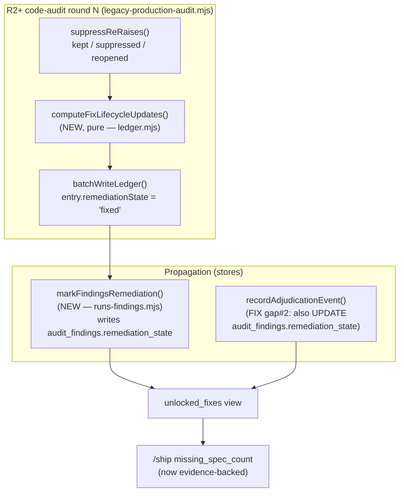

# Plan: Remediation-State Fix-Lifecycle Writer (un-starve `unlocked_fixes` + the /ship missing-spec gate)

- **Date**: 2026-07-21
- **Status**: Complete
- **Author**: Claude + Louis
- **Scope**: backend
- **Target domain(s)**: `audit-orchestration`, `findings`, `shared-lib` (⚠ cross-domain — the seam is deliberate and named in §11)

---

## 1. Context Summary

**Detected scope/stack**: backend · `js-ts` + `postgres` · no Python.

**The problem (field-observed 2026-07-21).** Across the whole audit store,
**0 of 989** `audit_findings` rows have `remediation_state` beyond `pending`.
Wine-cellar-app: 151 findings → 69 open HIGH, yet 8 consecutive clean ships
reporting `missing_spec_count: 0`. The ship gate is **vacuously green** — a
"green" unconstructable from evidence (AGENTS.md gate-honesty doctrine).

**Code Trace — the two independent breaks in the chain.**

The consumer chain is: `unlocked_fixes` view → `getUnlockedFixes()` → `/ship`
Step 0.5b `missing_spec_count`. Tracing it backwards to the source found **two**
breaks, either of which alone keeps the view empty:

1. **No transition source.** The `unlocked_fixes` view requires
   `f.remediation_state IN ('fixed','verified')`
   ([`supabase/migrations/20260520120000_consistency_source_kinds.sql:156-159`](../../supabase/migrations/20260520120000_consistency_source_kinds.sql)).
   Nothing in the pipeline ever transitions a finding to `fixed`. The R2+
   adjudication path (`outcome-sync.mjs::enrichFindings` `scripts/lib/outcome-sync.mjs:92`)
   copies `remediationState` verbatim from the ledger entry — and the ledger
   entry is minted `pending` (`ledger.mjs::upsertEntry` preserves whatever it
   was, and nothing sets it forward). The machinery that *would* set it —
   `findings-tasks.mjs::trackEdit`/`verifyTask` (`scripts/lib/findings-tasks.mjs:53,62`)
   — is **dead code**: exported only through the `shared.mjs`/`findings.mjs`
   barrels, **never called** (verified by grep — only import/re-export sites).

2. **No propagation to the column the view reads.**
   `recordAdjudicationEvent` (`scripts/lib/store/runs-findings.mjs:1209`) writes
   `remediation_state` to **`finding_adjudication_events`** (line 1234) but its
   `audit_findings` UPDATE sets **only** `adjudication_outcome` + `decided_at`
   (lines 1239-1245). The `unlocked_fixes` view reads
   **`audit_findings.remediation_state`** — a column written by **nothing** in
   the codebase (grep of `scripts/lib/store/`: the only occurrences are a
   `columnExists` guard + SELECT projection at `runs-findings.mjs:1025,1045`,
   and the events-table write at 1234). So even a correct ledger transition
   would still leave the view empty until this column is written.

**Consequence chain (both breaks):**
`remediation_state` never leaves `pending` → `unlocked_fixes` always empty →
`getUnlockedFixes()` (`scripts/lib/store/plans-ship.mjs:457`) returns `[]` →
`/ship` `missing_spec_count` always `0` **without checking anything**.

**Chosen evidence source (decided with the user): R2+ disappearance.** In a
later audit round, a prior-round **accepted** ledger entry whose scope file
**was in `changedFiles`** and which is **no longer raised** this round →
`fixed`. All three conjuncts are required. This is the doctrine-honest signal:
*was real* (accepted, not dismissed) ∧ *work happened* (scope changed) ∧ *gone
now* (not re-raised). It is the exact inverse of the `reopened` signal
`suppressReRaises` already computes (matched + scope changed).

**Patterns reused vs new.** Reuses the existing ledger→DB propagation spine
(`recordTriageOutcomes`→`writeCloudOutcomes`→`recordAdjudicationEvent`) and the
existing `suppressReRaises` matcher. New: one pure transition function + one
repo-scoped store writer + the `audit_findings.remediation_state` propagation fix.

**Neighbourhood considered** (arch-memory, refresh `574d80bb`):

| Symbol | File | Band | Bearing on this plan |
|---|---|---|---|
| `finalizeLedgerOutcomes` | `ledger.mjs:710` | **precedent · above-floor-cluster** (0.845) | THE pattern to mirror — a **pure** fn returning a plan of ledger updates (`mark-regressed`/`confirm-dismissal`) the caller applies. New fn is a **sibling**, not an extension (divergence justified in §2). |
| `suppressReRaises` | `ledger.mjs:292` | review (0.802) | Already computes the *reopened* half (matched+scope-changed). The fix signal is its inverse; reuse its matcher, do not duplicate. |
| `recordAdjudicationEvent` | `runs-findings.mjs:1209` | review | The propagation seam — gap #2 lives here. |
| `recordFindingResolution` | `store/learning-decisions.mjs:123` | review (0.76 hop-0) | Existing "patch a finding's resolution metadata (fix_commit_sha, TTR)" — the store-writer precedent to mirror for the new repo-scoped writer. |
| `trackEdit`/`verifyTask` | `findings-tasks.mjs:53,62` | review | Dead code. §2 decides: **retire**, do not wire. |

---

## 2. Proposed Architecture

Two independent fixes, sequenced so each is separately testable and shippable.



### Design decision A — the transition predicate (the load-bearing core)

The lifecycle is a small state machine over a ledger entry's `remediationState`,
with **two** evidence-gated transitions (both computed every R2+ round from the
same round-diff). `pending → fixed` is the primary; `fixed → regressed` is its
mandatory mirror (see A2) — shipping `fixed` without `regressed` would let a
re-broken fix keep lying as covered.

**A1 — `pending → fixed`.** A prior ledger entry `e` is marked `fixed` in round
`N` **iff ALL hold** (principle #s reference `references/engineering-principles.md`:
#11 idempotency, #15 error-handling, #2 SSoT):

1. `e.adjudicationOutcome ∈ {'accepted', 'severity_adjusted'}` — a real, open defect. **Excludes only `dismissed`** (a disproven FP that vanishes is not a fix) **and `pending`** (never triaged). `severity_adjusted` is included (Gemini-gate G2): a human re-rated but *sustained* the defect (e.g. HIGH→MEDIUM); when the developer fixes it, it vanishes exactly like an `accepted` one, and stranding it in `pending` forever is the same incoherence this plan exists to remove.
2. `e.remediationState ∈ {'pending', 'regressed'}` — a fresh open finding **or** a previously-fixed-then-regressed one (a re-broken fix that gets fixed again). Excludes already-`fixed`/`verified` (idempotent re-runs are no-ops). This is the **single entry gate** — there is no separate "reset regressed→pending" transition (R2-audit H1): `regressed` is itself directly eligible, so no phantom reset step exists to leave unassigned.
3. `e.source === 'session'` (or undefined-legacy) — exclude `debt` and `stage1-mechanical` entries (a mechanical dismissal disappearing is not a code fix).
4. **Scope changed**: at least one of `e.affectedFiles` ∈ `changedFiles` (normalized). Reuses `suppressReRaises`'s `changedSet`. This is the "work happened" evidence and the guard against flaky non-re-raise.
5. **No longer raised**: `matchesLedgerEntry(finding, e)` (§Decision B's single matcher — topicId equality → same-pass fuzzy ≥ `SUPPRESS_SIMILARITY_THRESHOLD` → cross-pass 0.8 fallback, exactly as it governs suppression) returns **false for every** current-round finding. A `reopened` finding this round is by definition still raised → NOT fixed. (A1.5 does not re-describe the matcher — it *is* whatever `matchesLedgerEntry` decides, so suppress/fixed/regressed can never diverge; R2-audit M4.)

**A2 — `fixed → regressed` (mandatory mirror — R1-audit H3).** A `fixed`/`verified`
entry `e` transitions to `regressed` in round `N` **iff** `matchesLedgerEntry`
finds a current-round finding matching `e` **and** `e`'s scope is in
`changedFiles` — i.e. exactly the `reopened` signal `suppressReRaises` already
computes, which A1 uses only as a *negative*. Without A2, a fix that a later
change re-breaks stays `fixed` in the DB and the `unlocked_fixes` view keeps
treating it as covered — the same class of lie, one layer down. The transition
sets **only** `remediationState='regressed'` and **does not touch
`adjudicationOutcome`** (Gemini-gate-2 fix): `regressed` alone already expresses
"open again" — the entry **drops out** of `unlocked_fixes` (which requires
`fixed`/`verified`) on the remediation axis, so mutating the adjudication axis is
both unnecessary and harmful. Reverting to `accepted` would (a) **desync the
ledger from the DB**, since the propagation writer touches only
`audit_findings.remediation_state`, not `adjudication_outcome`, and (b) **wipe a
human `severity_adjusted` decision** — erasing a deliberate downgrade. Leaving
`adjudicationOutcome` untouched keeps it in `{accepted, severity_adjusted}`, so
the entry stays A1-eligible (gate 1 passes) via the `regressed` branch of gate
(2) if a later round re-fixes it — a complete cycle, no unassigned transition, no
axis crosstalk.

*Why A2 keeps the `changedFiles` gate (Gemini-gate G3 — rebutted).* G3 argued the
gate should be dropped so any re-match regresses, fearing a "match without file
change" leaves the report showing an active defect while the DB stays `fixed`.
That contradiction **cannot arise**, because A2's condition is **identical to
`suppressReRaises`'s own reopen condition** (match ∧ scope-changed): a current
finding that matches a `fixed` entry with **unchanged** scope is **suppressed**
(removed from the report, per the existing `remediationState==='fixed'` branch of
the `resolved` filter, `ledger.mjs:313`), so it is *never* shown as active — there
is no report/DB divergence to fix. Keeping the gate also preserves the **symmetry
with A1**: both transitions require real scope-change evidence, so a flaky
re-emission cannot flap an entry `fixed→regressed→fixed`. Importer knock-on (a
break caused by an upstream change without the finding's own file in the diff) is
already covered — `computeImpactSet` expands `changedFiles` to importers before
the predicate runs. Dropping the gate (G3's fix) would desync A2 from suppression
and reintroduce flapping; it is declined for those reasons, not overlooked.

**Transition atomicity (R1-audit M4).** The predicate reads a ledger snapshot but
the apply is a **conditional** operation, not a blind upsert: `applyLifecycleUpdates`
performs the mark **inside** the same `proper-lockfile` read-modify-write
`batchWriteLedger` already holds, and re-checks the guard fields
(`adjudicationOutcome`/`remediationState`/`source`) on the freshly-read entry
before writing — so a concurrent audit, rerun, or another lifecycle writer that
changed the entry between compute and apply cannot be clobbered. The applier
returns only the updates it actually committed (an entry that no longer satisfies
its guard is a silent skip, not an overwrite). This matters here specifically —
this repo is often a **shared working tree with concurrent sessions**.

**Inverted-vacuous-green guard (the failure mode we design against).** Over-marking
fills `unlocked_fixes` with false `fixed` rows and the gate lies the *other* way.
Predicate conjunct (4) is the primary defence: **a finding that disappears with
its scope unchanged is left `pending`, never `fixed`** — because a model simply
not re-emitting a finding (run-to-run nondeterminism) is not evidence of a fix.
Conjunct (1) prevents dismissed FPs from ever counting.

**Right-sizing gate (new structure introduced — the `/plan` sustainability check):**
- *Band-aid*: set `remediation_state='fixed'` in `/ship` for any finding whose file appears in the commit. Cheap, one pass — but conjunct (4)-only with no "was accepted" / "no longer raised" evidence → mass false-fixed → the inverted vacuous-green. Rejected.
- *Over-engineered*: a full RemediationTask state machine persisted to its own `.audit/remediation-tasks.jsonl` store with verify/regress transitions and a task-reconciler (this is literally what the **dead** `findings-tasks.mjs` already is). No current requirement consumes per-task verify history; the view needs one column. Rejected — and **retire the dead module** rather than resurrect it (§7).
- *Chosen*: one pure predicate over evidence the round already has (ledger + `changedFiles` + current findings), mirroring `finalizeLedgerOutcomes`'s pure-plan shape. Serves exactly the current requirement (un-starve the view) with no new persistent artifact.

**Sibling vs extend `finalizeLedgerOutcomes` (neighbourhood precedent).** New fn
`computeFixLifecycleUpdates(ledger, currentFindings, changedFiles, round)` is a
**sibling** in `ledger.mjs`, not an extension of `finalizeLedgerOutcomes`:
different input (round-diff, not a Stage-2 `adjudicationResult`), different
trigger (**every** R2+ round, not tiered Stage-2 only). Both share the "pure,
returns `{ledgerUpdates:[{action,topicId,...}]}`, caller applies" contract —
the pattern is reused; the computation is genuinely distinct.

### Design decision B — the transition payload + propagation targeting (R1-audit H2)

**One typed transition payload — the identity travels with the update.** The R1
audit correctly flagged that a `topicId` alone cannot address a stored
`audit_findings` row (which the store keys by `finding_fingerprint`). Fix:
`computeFixLifecycleUpdates` returns a **`LifecycleUpdate`** carrying the immutable
targeting identity, not just `topicId`:

```
LifecycleUpdate = {
  action: 'mark-fixed' | 'mark-regressed',
  topicId,                 // ledger addressing (apply side)
  findingFingerprint,      // audit_findings/​events addressing (DB side) — REQUIRED, the sole required DB key
  pass, primaryFile,       // disambiguators for the fingerprint lookup
  resolvedRound: N,
  originatingAuditRunId?,  // OPTIONAL fast-path only (see below) — never required
}
```

`findingFingerprint` is the entry's `_hash` (`semanticId`) — **the same value
`recordFindings` stored in `audit_findings.finding_fingerprint`** and that
`recordAdjudicationEvent` already looks up by. It is available on the ledger
entry (persisted at write time; a legacy entry lacking it is recomputed via
`semanticId` from its stored `category`/`section`/`detail`, identical to how the
ledger derives `topicId` today). This closes the "how does a topicId become a
fingerprint" gap: it doesn't — the fingerprint is retained from the source
finding and carried through, never re-derived from the topicId.

**Targeting is repo-scoped by fingerprint — `originatingAuditRunId` is NOT
required (R2-audit H2).** The primary and always-available resolution is
`(repoId, findingFingerprint)` → the most-recent matching `audit_findings` row
within the view's 14-day window — the exact grain `unlocked_fixes` itself reads.
This needs **no new ledger schema field and no new minting call site**: `repoId`
is resolved at the round's existing `resolveRepoForStore` call, and the
fingerprint travels in the payload. `originatingAuditRunId` is an *optional*
fast-path disambiguator used only when it is already on hand (it is not today, so
v1 simply omits it) — it never gates correctness and its absence changes nothing.
This removes the R1-audit's run-scoped framing entirely.

**Propagation grain — why not the finalize-prior path.**
`finalizePriorRoundOutcomes` (`finalize-outcomes.mjs:156`) finalizes round `K`
at round `K+1` start by enriching **round K's findings** from the ledger. A
fixed finding is **absent** from round `K+1` — so this path structurally cannot
carry the fix (it only re-touches findings that are still present). Hence the
repo-scoped fingerprint writer above.

`markFindingsRemediation(target, updates)` — for each update, resolves the
`audit_findings` row by `(repoId, findingFingerprint)` within the 14-day window
(optionally narrowed by `pass`/`originatingAuditRunId` when present); updates
`audit_findings.remediation_state` **and** upserts the parallel
`finding_adjudication_events` row in one `withTx` (`deleteWhere`+`insertReturning`,
mirroring `recordAdjudicationEvent`). Idempotent by construction (setting `fixed`
twice is a no-op state).

### Design decision B2 — durable projection (R1-audit H1)

The R1 audit's sharpest finding: if the ledger commits `fixed` but the cloud
write fails (it is fail-open), `audit_findings.remediation_state` stays `pending`
**forever** — the ledger and DB diverge and nothing re-touches a disappeared
finding, so next round the entry is already non-`pending` (A1.2 fails) and the
projection is never retried. A silent permanent divergence.

**Resolution — the ledger is the SSoT; the DB projection is re-derivable, not
fire-and-forget.** Two layers, both cheap:

1. **Reconciliation sweep each R2+ round (primary), DB-driven for O(recent).**
   Before computing new transitions, `reconcileRemediationProjection(ledger, store)`
   is driven from the **bounded DB side, not the unbounded ledger side**
   (Gemini-gate-2 scalability fix — iterating all historical terminal ledger
   entries grows monotonically). The bound is the **14-day window alone**, NOT
   the remediation state (Gemini-gate-3 correctness fix — filtering the query to
   `remediation_state='pending'` would blind reconciliation to a failed
   `fixed→regressed` or `regressed→fixed` projection, whose DB row is *already*
   terminal, so those inter-terminal failures could never self-heal). It
   (a) queries `audit_findings` for the repo's rows within `audit_runs.created_at
   > now() - 14d` with `adjudication_outcome ∈ {accepted, severity_adjusted}`
   (indexed, and exactly the population `unlocked_fixes` can ever read — anything
   older is irrelevant by construction), **regardless of current
   `remediation_state`**; then (b) for each row, looks up its
   `finding_fingerprint` in an in-memory index of the ledger's terminal entries
   and, on a hit **where the DB state disagrees with the ledger's terminal
   state**, projects the ledger state onto the row (a matching state is a
   no-op). This is both **bounded** — O(recent DB rows in the 14-day window),
   never O(all ledger history) — and **complete** — it heals `pending→terminal`
   *and* `terminal→terminal` divergences, the property the `pending`-only filter
   destroyed. All ledger fields used — `remediationState`, `affectedFiles`,
   `findingFingerprint`, `resolvedRound` — exist on
   `LedgerEntrySchema`/`LedgerCoreFields`
   [`schemas.mjs:787-816`](../../scripts/lib/schemas.mjs) and are preserved on
   upsert (Gemini-gate-1 assumed otherwise; the 14-day bound is a DB timestamp,
   never a comparison against the `resolvedRound` integer). This makes a failed
   projection **self-healing** — the next round closes the gap. The ledger
   transition, once committed, is the durable record; the DB is an
   eventually-consistent projection of it.
2. **Local outbox fallback (defence-in-depth, reuses existing infra).** A
   projection failure also spills the `{target, update}` to the existing
   `.audit/learning-outbox/` path (the same mechanism telemetry already uses),
   so a repo that never runs another audit round still has a durable retry record.

Neither blocks the audit (fail-open preserved), but the state can no longer be
**lost** — only deferred to the next round or the outbox drain. The idempotency
key is `(repoId, findingFingerprint, remediationState)`: re-projecting an
already-projected fix is a no-op.

### Design decision C — gap #2, independent of the R2 feature

Fix `recordAdjudicationEvent` so its `audit_findings` UPDATE **also** sets
`remediation_state: event.remediationState` (when present). This keeps the
column coherent for **every** adjudication path (e.g. a Stage-2 `regressed`
mark), not just the new fixed-transition — and is the reason the column is
currently write-never. Small, isolated, separately testable; ships first.

---

## 6. Sustainability Notes

- **Assumption**: `changedFiles` is authoritative per round (it is — `--changed` is already the authoritative reopen input, `openai-audit.mjs:607`). If a future single-shot mode drops `changedFiles`, the predicate correctly emits **zero** fixes (conjunct 4 fails closed) rather than guessing.
- **Assumption**: fingerprints are stable enough to re-address a finding's DB row across rounds. They are the same `finding_fingerprint` the store already keys on; drift only *under-marks* (misses a fix), never *over-marks*.
- **Seam**: the predicate is one pure fn — a future evidence source (e.g. explicit `mark-fixed` label, or ship-commit correlation) adds an OR-branch at the call site, not a rewrite.

---

## 7. File-Level Plan

**Phase 1 — gap #2 (propagation), independently shippable**
- `scripts/lib/store/runs-findings.mjs` (modify) — `recordAdjudicationEvent`: add `remediation_state: event.remediationState` to the `updateWhere('audit_findings', …)` set (line ~1243), guarded so an undefined value doesn't null an existing state. *Why*: the column the view reads must be written (#2 SSoT). Tier-3-adjacent (silent-regression-prone DB write) → test in same commit.
- `tests/adjudication-remediation-propagation.test.mjs` (create) — assert the `audit_findings.remediation_state` column receives the event's value; assert an absent `remediationState` does not overwrite an existing one.

**Phase 2 — the matcher extraction + the pure transition core**
- `scripts/lib/ledger.mjs` (modify, step 2a — **do this first, test-guarded**) — extract `matchesLedgerEntry(finding, entry)` from the inline matching in `suppressReRaises` (topicId equality → same-pass fuzzy → cross-pass 0.8 fallback, all over `normalizePath`). `suppressReRaises` is **refactored to call it with behaviour unchanged** — locked by the golden compatibility suite (§9, R1-audit M5) written *before* the extraction.
- `scripts/lib/ledger.mjs` (modify, step 2b) — add `computeFixLifecycleUpdates(ledger, currentFindings, changedFiles, round)`: pure, returns `{ updates: LifecycleUpdate[] }` (payload shape in §Decision B) covering **both** `mark-fixed` (A1) and `mark-regressed` (A2). Uses `matchesLedgerEntry` — one matcher, three consumers (suppress, fixed, regressed). Add `applyLifecycleUpdates(ledgerPath, updates)` — the conditional locked read-modify-write (A2 atomicity) that returns only committed updates.
- `scripts/lib/findings-tasks.mjs` (**delete outright — R1-audit L6**) — retire the dead RemediationTask module + its barrel re-exports in `shared.mjs`/`findings.mjs`. Precondition, not a fallback: prove non-reachability via the import graph (`grep` + the arch symbol-index `get-callers-for-file`) **and** a green full `npm test` after removal. It is unreferenced (verified) and is the over-engineered alternative this plan rejects; leaving a `@deprecated` zombie preserves a competing state abstraction with no owner or removal date — so **delete, do not deprecate**. If (contra the evidence) a real importer surfaces, that importer is migrated to the ledger path in the same commit — never a parallel-abstraction reprieve.
- `tests/fix-lifecycle-predicate.test.mjs` (create) — the gate-honesty matrix (§9), both transitions.

**Phase 3 — wire the round loop + durable propagation**
- `scripts/lib/audit/legacy-production-audit.mjs` (modify — **the real code-audit round loop**) — after the authoritative `suppressReRaises` call (the code-round one, where `mergedLedger`/`changedFiles`/`cloudRepoId`/`round`/`ledgerFile` are all in scope), once the current findings are finalized: `computeFixLifecycleUpdates(...)` → `applyLifecycleUpdates(ledgerFile, …)` (conditional) → `markFindingsRemediation(cloudRepoId, …)` (DB projection) → `reconcileRemediationProjection(cloudRepoId, mergedLedger)` (B2 self-heal). Fail-open; single call site. *(Correction from the initial draft, confirmed at implementation: `openai-audit.mjs:952` is the **plan-mode** suppression path — the code-audit multi-pass round loop lives in `legacy-production-audit.mjs`, which is what `openai-audit.mjs code` delegates to. The wiring goes there.)*
- `scripts/lib/store/runs-findings.mjs` (modify) — (a) **gap #2 already in Phase 1**; (b) add `markFindingsRemediation(target, updates)` — the fingerprint-addressed writer (§Decision B), resolving by `(originatingAuditRunId, fingerprint[, pass])` or the repo-scoped 14-day fallback; updates `audit_findings.remediation_state` + upserts the event row in one `withTx`; idempotent. Add `reconcileRemediationProjection(ledger, store)` — re-projects ledger-terminal entries whose DB row lags; spills failures to `.audit/learning-outbox/`.
- `tests/mark-findings-remediation.test.mjs` (create) — writer updates `remediation_state` by fingerprint; idempotent; fail-open on cloud-off; reconcile re-projects a lagging row and no-ops a matching one.

**Close-out (not a phase)**: `npm run skills:regenerate` — required only if this change edits any `skills/**/SKILL.md` (grep `skills/ -rl remediation_state` before/after; v1 touches no SKILL text, so this is expected to be a no-op) · `npm test` · `npm run check`.

---

## 8. Risk & Trade-off Register

| Risk | Mitigation |
|---|---|
| **Over-mark → inverted vacuous-green** | Predicate conjunct (4) scope-changed + (1) accepted-only + (5) same-matcher-as-suppression. The test matrix asserts scope-unchanged-disappearance → NOT fixed. |
| **Ledger↔DB divergence on fail-open write (H1)** | The ledger is SSoT; `reconcileRemediationProjection` self-heals a lagging DB row every R2+ round, and failures spill to `.audit/learning-outbox/`. State can be deferred, never lost. |
| **`topicId` can't address a DB row (H2)** | The `LifecycleUpdate` payload carries `findingFingerprint` (+ originating run) retained from the source finding — the fingerprint is never re-derived from the topicId. |
| **A re-broken fix keeps lying as `fixed` (H3)** | A2 `fixed→regressed` mirror drops the entry out of `unlocked_fixes` and reverts adjudication to `accepted`. |
| **Concurrent/rerun clobber (M4)** | `applyLifecycleUpdates` re-checks guard fields inside the lock and returns only committed updates. |
| **Matcher extraction changes suppression (M5)** | Golden `suppressReRaises` compat suite written *before* extraction; must pass unchanged after. |
| Fingerprint drift misses a fix | Fails *closed* (under-marks). Acceptable — a missed fix keeps a spec-nudge alive, which is the safe direction. |
| Single-round audits emit no fix signal | By design — a fix isn't observable until a re-audit. Documented, not a bug. |
| Deleting `findings-tasks.mjs` breaks a hidden importer | Import-graph + green full suite are a *precondition* to deletion; a real importer is migrated in the same commit — no `@deprecated` zombie. |
| Gap #2 fix nulls an existing state | Guard: only include `remediation_state` in the UPDATE when `event.remediationState` is defined. |

**Deliberately deferred**: `verified` transition beyond what Stage-2 already
emits (the plan implements `pending→fixed` and `fixed→regressed`; explicit
human `verified` is a future additive branch); ship-commit-based correlation as
a second evidence source (the predicate's call site leaves an OR-seam for it).
Both are additive branches, not rewrites.

---

## 9. Testing Strategy (Tier-1 test-first — ledger + findings-* + store are deterministic seams)

**The gate-honesty matrix** (`fix-lifecycle-predicate.test.mjs`) — each row a fixture ledger + synthetic current-round findings + `changedFiles`:

| # | Prior entry state | Scope changed? | Re-raised this round? | Expected |
|---|---|---|---|---|
| 1 | accepted | yes | no | **fixed** ✅ (the one true-positive) |
| 2 | accepted | **no** | no | pending (flaky non-re-raise — the inverted-green guard) |
| 3 | accepted | yes | **yes** (reopened) | pending (still raised) |
| 4 | **dismissed** | yes | no | pending (disproven FP, not a fix) |
| 5 | **severity_adjusted** | yes | no | **fixed** ✅ (Gemini-gate G2 — a sustained-but-downgraded defect is still a real fix) |
| 6 | already **fixed** | yes | no | fixed, unchanged (idempotent; no duplicate write) |
| 7 | accepted, `source:'debt'` | yes | no | pending (debt disappearing ≠ code fix) |
| 8 | accepted, `source:'stage1-mechanical'` | yes | no | pending |
| 9 | **fixed** | yes | **yes** (re-raised) | **regressed** ✅ (A2 mirror) + adjudication→accepted |
| 10 | fixed | **no** | yes | fixed, unchanged (re-raise without scope change ≠ regression evidence) |
| 11 | fixed | yes | no | fixed, unchanged (still gone — no regression) |

**Concurrency (R1-audit M4)** — `applyLifecycleUpdates` conditional apply: an
entry whose `remediationState` was moved off `pending` by a concurrent writer
between compute and apply is **skipped, not clobbered**; the applier's return set
excludes it. Asserted with a fixture whose on-disk state differs from the
snapshot passed to compute.

**Matcher-extraction safety (R1-audit M5 — write BEFORE extracting)** —
`suppress-rereais-golden.test.mjs`: table-driven capture of the *current*
`suppressReRaises` classifications (topicId match, fuzzy threshold boundaries,
cross-pass/cross-file non-match, normalized paths, duplicate candidates,
reopen-on-change). This suite must pass unchanged after `matchesLedgerEntry` is
extracted — it is the regression lock that the extraction cannot silently alter
suppression/reopen behaviour.

**Durability (R1-audit H1/B2; Gemini-gate 2+3)** — `reconcile-remediation.test.mjs`:
(a) a ledger entry `fixed` whose DB row is `pending` is re-projected next round;
(b) **terminal→terminal** — a ledger entry `regressed` whose DB row is still
`fixed` (a failed A2 projection) IS re-projected (the case the `pending`-only
filter would have missed — Gemini-gate-3); (c) an already-consistent row is a
no-op; (d) the sweep touches no row outside the 14-day window (bound); (e) a
projection failure spills to the outbox.

Plus: `adjudication-remediation-propagation.test.mjs` (gap #2 column write +
no-overwrite-on-absent), `mark-findings-remediation.test.mjs` (fingerprint-
addressed writer idempotency + cloud-off no-op). Integration: none of the LLM
passes are touched — the round-loop wiring is asserted via a fixture ledger +
fake current findings, not a live audit (Tier-2 doctrine: don't test the mock).

---

## 11. Execution Clustering

- **Cluster A** — Phases 1 — fix-gate: yes
  - Coupling: gap #2 (`recordAdjudicationEvent` + column write) is a self-contained DB-propagation fix with its own test; it must land coherent before Phase 3 relies on the column being writable. Ships independently of the R2 feature.
- **Cluster B** — Phases 2–3 — fix-gate: final
  - Coupling: the pure predicate (Phase 2) and its single round-loop call site + repo-scoped writer (Phase 3) share the transition contract and the extracted `matchesLedgerEntry` matcher — the audit must see the ledger↔orchestrator↔store seam as one diff to verify the predicate's evidence guards aren't bypassed at the call site.
- **Final gate**: consolidated Gemini review over the union diff (Clusters A+B), with specific attention to the inverted-vacuous-green predicate and the gap#2 no-overwrite guard.

---

## Audit Trail

Refined via `/audit-plan` (GPT auditor + Gemini final gate), 2026-07-21.

| Round | Reviewer | Verdict | Findings → resolution |
|---|---|---|---|
| R1 | GPT (plan) | SIGNIFICANT_GAPS | 3H/2M/1L — all fixed in-plan (durable projection, fingerprint payload, fixed→regressed mirror, conditional apply, golden matcher tests, delete-not-deprecate) |
| R2 | GPT (plan) | NEEDS_REVISION | 2H/2M/1L — all fixed (regressed directly A1-eligible, run-id optional, reconciliation window-bounded, A1.5 = matchesLedgerEntry, ref cleanup) |
| Gemini-1 | Gemini pro | CONCERNS | G1 (schema fields) rebutted w/ `schemas.mjs` evidence + real round-int-vs-time bound fixed; G2 (severity_adjusted stranded) fixed; G3 (drop changedFiles gate) rebutted via suppression-consistency invariant |
| Gemini-2 | Gemini pro | CONCERNS_REMAINING (coherence Strong) | A2 adjudication-mutation desync/human-wipe → removed the mutation; reconciliation reversed to DB-driven O(recent) |
| Gemini-3 | Gemini pro | CONCERNS_REMAINING (coherence Strong) | `pending`-only reconciliation query blinded terminal→terminal self-heal → bound by 14-day window alone + reconcile-on-disagreement (bounded AND complete) |

**Stop decision**: halted after Gemini round 3 per the 2-round cap + genuine-bug
exception. Architectural coherence was "Strong" every Gemini round; the closing
findings were corrections to the reconciliation query (one sub-component), not
the core design (pure predicate + ledger-SSoT + A1/A2 + fingerprint projection),
which was validated from round 1. Gemini's round-3 note: fixing the query "will
make the plan airtight" — done.

---

## Implementation Log

### 2026-07-21
- **Completed** (all clusters): gap#2 propagation (`buildFindingAdjudicationPatch` — `recordAdjudicationEvent` now writes `remediation_state` to `audit_findings`); pure predicate `computeFixLifecycleUpdates` (A1 `pending/regressed→fixed`, A2 `fixed→regressed`) + conditional `applyLifecycleUpdates`; `matchesLedgerEntry`/`ledgerFindingSimilarity` extracted from `suppressReRaises` (golden-locked, behaviour-preserving); repo-scoped `markFindingsRemediation` (UPDATE…RETURNING affected-row assertion) + DB-driven `reconcileRemediationProjection`; wired into the code-audit round loop in `legacy-production-audit.mjs` (reconcile FIRST, then compute/apply/project); dead `findings-tasks.mjs` deleted; migration `20260721140000` widened `unlocked_fixes` to include `severity_adjusted`. 32 new test assertions; full suite green.
- **Audited**: `/audit-code` R1 (H2/M9) → R3 (H0/M1, qf0); **Gemini final gate APPROVE (coherence Strong)** on round 2 after fixing two integration bugs it caught — reconcile-order revert (HIGH) and the `severity_adjusted` view exclusion (MEDIUM).
- **Live confirmation**: after the audit runs, `list-unlocked-fixes` returned 2 rows (was permanently empty) — the view is no longer vacuously starved.
- **Deviations**: the plan first named `openai-audit.mjs:952` as the wiring site; that is the plan-mode suppression path — the real code-audit round loop is `legacy-production-audit.mjs`, corrected in §2/§7.
- **Deferred (pre-existing, independent — captured as debt)**: `persistKeptEmbeddings` N+1; `applyRecordTimeSuppression` repo-predicate; `runs-findings.mjs` 63KB module split; store→semantic-suppression layering import. A full enabled-cloud DB round-trip integration test needs a disposable-Postgres harness (the deterministic seams are unit-tested).
