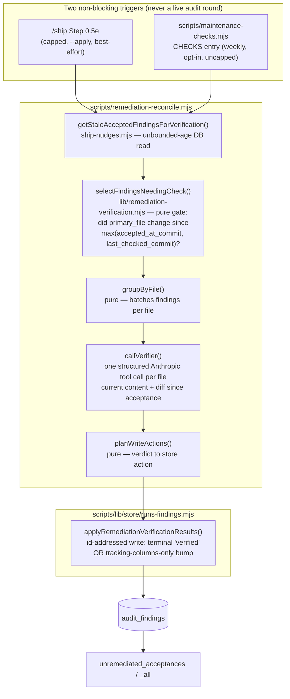

# Plan: Remediation-State Verification Reconciler (out-of-band, LLM-checked)

- **Date**: 2026-08-30
- **Status**: Complete
- **Author**: Claude + Louis
- **Scope**: backend
- **Target domain(s)**: `stores`, `audit-orchestration` (advisory hook only)
- **Upstream report**: `97d09c1c-8dd0-42d1-bfdb-93963f0c07a0` (wine-cellar-app, acknowledged) — this plan closes it.

---

## 1. Context Summary

**The problem (consumer-observed, 2026-08-30).** `wine-cellar-app`'s
`unremediated_acceptances` view accumulated 259 rows (178 code + 81 plan) stuck
at `remediation_state ∈ {pending, planned}` for 11–17 days. Manual verification
against HEAD found **173/178 (97%) of the code findings were already fixed** —
several by the very next round of the same `/audit-code` run that raised them —
yet nothing ever flipped `remediation_state`. Every fingerprint in the 259
appears exactly once in `audit_findings` (never re-raised), so an ordinary
re-audit was never going to close them either.

**Why the existing lifecycle machinery can't reach this population.** This repo
already ships a remediation-state lifecycle
([`docs/plans/remediation-state-fix-lifecycle.md`](remediation-state-fix-lifecycle.md),
shipped 2026-07-21): `computeFixLifecycleUpdates`
([`ledger.mjs:1197`](../../scripts/lib/ledger.mjs)) marks a ledger entry `fixed`
when it disappears from a later round's findings, and
`reconcileRemediationProjection`
([`runs-findings.mjs:2116`](../../scripts/lib/store/runs-findings.mjs)) self-heals
a lagging DB projection. Three properties of that machinery, each individually
deliberate and correctly audited at the time, compound into a structural blind
spot for exactly the population above:

1. **Session-scoped.** `computeFixLifecycleUpdates` only evaluates ledger entries
   with `source === 'session'` ([`ledger.mjs:1205`](../../scripts/lib/ledger.mjs)) —
   entries native to *this* live invocation. A finding carried into a *separate*,
   later `/audit-code` invocation via `mergeLedgers`
   ([`debt-ledger.mjs:252`](../../scripts/lib/debt-ledger.mjs)) is re-tagged
   `source: 'debt'` regardless of how it was originally raised, and is therefore
   permanently invisible to this predicate from that point on. (Confirmed: no
   `'carried-forward'`/`'external'` source value exists anywhere in the codebase —
   a merged entry is either `'session'`, `'stage1-mechanical'`, or `'debt'`, and
   `mergeLedgers` always assigns the latter two to anything not native to the
   current run.)
2. **Round-diff-scoped.** The predicate needs a round *N+1* to observe that a
   round-*N* finding disappeared. A finding accepted in a run's own **final**
   round has no later round to check it against, ever — not a bug, a structural
   property of "did it disappear from the next round's output."
3. **14-day-bounded.** `reconcileRemediationProjection`'s DB self-heal is
   deliberately windowed to `audit_runs.created_at > now() - interval '14 days'`
   ([`runs-findings.mjs:2124`](../../scripts/lib/store/runs-findings.mjs)) — a
   correct bound for *its* job (bounded, O(recent) self-heal of a **ledger** that
   only exists in memory during a live round) but it also requires a `ledger`
   argument sourced from the current run's in-memory `mergedLedger`
   ([`finding-assembly.mjs:471`](../../scripts/lib/audit/finding-assembly.mjs)) —
   i.e. it **only ever runs during an active audit round in the first place**. A
   repo with no fresh audit activity touching a file for >14 days has zero path
   back to a correct `remediation_state`, full stop.

Net effect: `remediation_state` converges with reality only when *all* of
(same live multi-round run) ∧ (before the run's own final round) ∧ (within 14
days) hold. Outside that intersection — measurably the common case — nothing
ever heals it. This is a correctness gap in the state machine, not a missed
schedule, and no amount of loosening the in-round predicate's guards closes
gap 3: a repo that ships rarely through this tooling structurally cannot
generate the "next round" gaps 1/2 need.

**Chosen fix — an independent, DB-driven, LLM-verified reconciler, not a patch
to the in-round predicate.** Rather than relaxing `computeFixLifecycleUpdates`'s
`source`/round guards (each was added deliberately across three Gemini-reviewed
rounds in the original plan, specifically to prevent over-marking — loosening
them risks reintroducing exactly the false-positive class they were hardened
against), this plan adds a **second, independent lifecycle writer** that:

- reads `audit_findings` directly (bypassing the ledger and its `source`/round
  semantics entirely — no ledger dependency, so gaps 1 and 2 do not apply to it),
- is **unbounded by age** (closes gap 3 directly — it is the reconciler *for*
  the population the 14-day sweep cannot reach),
- and, because it has no round-diff to lean on as evidence, substitutes a
  **higher-confidence signal**: an explicit LLM judgment call against the file's
  *current* content, gated so it only ever fires when the file actually changed
  since the finding was accepted.

This is additive: `computeFixLifecycleUpdates`/`reconcileRemediationProjection`
are untouched. The new path is the safety net for what that machinery
structurally cannot see, not a replacement for the fast, free, in-round case it
already handles well.

**Separately flagged, not fixed here.** `finalize-outcomes.mjs`'s own doc
comment notes the *adjudication_outcome* for a run's final round depends on a
skippable `/cycle` or manual CLI step. This reconciler's `WHERE
adjudication_outcome IN ('accepted','severity_adjusted')` means a finding whose
final-round outcome was never finalized is invisible to it too — same as it is
to `unremediated_acceptances` today. Not a regression this plan introduces;
tracked as pre-existing, independent debt (§6).

**Neighbourhood considered** (arch-memory, refresh `37d4f805`):

| Symbol | File | Band | Bearing on this plan |
|---|---|---|---|
| `reconcileRemediationProjection` | `runs-findings.mjs:2116` | **precedent · above-floor-cluster** (0.869) | Closest existing pattern — DB-driven remediation-state reconciliation. **Sibling, not extension** (see below): different trigger (periodic/on-demand vs. live-round-only), different evidence source (LLM verification vs. ledger-terminal-index lookup), different bound (unbounded vs. 14-day). |
| `selectReconcileTargets` | `runs-findings.mjs:1967` | review (0.853) | Pure "does DB state disagree with the intended state" predicate — the shape my `planWriteActions` mirrors, but keyed off an LLM verdict instead of a ledger index. |
| `markFindingsRemediation` | `runs-findings.mjs:2016` | review (0.825) | The existing fingerprint+14-day-window writer. Not reused directly — my writer addresses by **finding id** (already known from the selection query), sidestepping the window/fingerprint-ambiguity resolution this function exists to do for its own (different) callers. Shares its inner `withTx` UPDATE shape via a newly-factored helper (§2 Decision B). |
| `getUnremediatedAcceptances` | `ship-nudges.mjs:400` | review (0.823) | The read-side sibling — same view family, same repo-scoping fence. My selection query is a new sibling in the *same file*, not a rewrite of this one (it stays windowed for `/ship`'s human-facing nudge; mine is unbounded for the reconciler). |

**Why sibling, not extend, in each case (arch-memory rule):** `reconcileRemediationProjection`
answers "does the DB disagree with a ledger I already trust" — a pure lookup, no
new evidence gathering, and it structurally requires a live ledger. My function
answers "is there new evidence (an LLM read of current code) that changes what
the DB *should* say" — it gathers evidence the ledger was never asked for and
has no ledger input at all. Same output shape (write `remediation_state`),
different question, different inputs, different trigger — a sibling, not a
branch on the same function.

---

## 2. Proposed Architecture



### Design decision A — evidence source: explicit LLM verification, gated by "did it even change"

The in-round predicate's evidence is *implicit*: "it didn't reappear in the next
round's output." This reconciler has no next round, so it needs *explicit*
evidence, and an LLM read of the current file is the only source available
without re-running a full audit. Two guards keep this cheap and honest:

1. **Never call the LLM for a file that hasn't changed.** `selectFindingsNeedingCheck`
   (pure) computes, per finding, `sinceCommit = accepted_at_commit` (or
   `remediation_last_checked_commit` if a prior check already ran and found
   nothing new — see Decision C) and calls `gitDiffWithWorkingTree(repoRoot,
   sinceCommit)` ([`vcs.mjs:418`](../../scripts/lib/vcs.mjs)) once per distinct
   commit; a finding whose `primary_file` is not in `modified ∪ deleted ∪
   renamed` is **skipped, zero cost**. This is the same "work happened" evidence
   gate the original plan's conjunct 4 uses, applied to a reconciler that has no
   round-diff to read it from — it has to ask git directly instead.
2. **Default to `uncertain`, never guess `resolved`.** The verification system
   prompt (mirroring `ADJUDICATION_SYSTEM_PROMPT`'s discipline in
   [`campaign/adjudicate.mjs`](../../scripts/lib/campaign/adjudicate.mjs))
   requires: a truncated file with the defect not visible in the shown window ⇒
   `uncertain`, never `resolved`. This is the inverted-vacuous-green guard for
   this path, playing the same role conjunct 4 plays in the original plan.

**Batching.** Findings are grouped by `primary_file` (one LLM call verifies every
pending finding on that file at once) — the user's suggested shape, and it also
minimizes call count on a file with several stuck findings. A structured tool
call (forced `tool_choice`, mirrors `callAdjudicator`,
[`campaign.mjs:705`](../../scripts/campaign.mjs)) returns one verdict per
fingerprint: `resolved | still-present | uncertain` + a short rationale.

**Client/model.** `createAnthropicClient({backend: 'sdk'})` — pinned explicitly,
not the ambient `CLAUDE_BACKEND`, because forced `tool_choice` silently drops
under the `cli` backend (documented gotcha, AGENTS.md "Anthropic Backend
Routing"). Model: `resolveModel(process.env.AUDIT_REMEDIATION_RECONCILE_MODEL ||
'latest-sonnet')` — a real code-reading judgment call, not a naming/labeling
task, so Haiku is too weak and Opus is unnecessary for a well-scaffolded
per-file classification. Availability checked via `isClaudeAvailable()` before
any call; unavailable ⇒ the run reports `skipped: no-credential`, never a crash.

### Design decision B — the writer: id-addressed, not fingerprint+window

`markFindingsRemediation`'s fingerprint+14-day-window row resolution
([`runs-findings.mjs:2028-2034`](../../scripts/lib/store/runs-findings.mjs))
exists because *its* callers (the in-round A1/A2 transitions, the 14-day
self-heal) only have a fingerprint, not a row id, and must disambiguate within a
bounded recency window. This reconciler's selection query
(`getStaleAcceptedFindingsForVerification`) already reads `audit_finding_id`
directly off the row it selected — there is no ambiguity to resolve and no
reason to inherit the 14-day bound (which would defeat the entire point of this
plan).

New writer `applyRemediationVerificationResults(repoId, actions)` in
`runs-findings.mjs`, addressing by primary key:

```js
actions: Array<{
  findingId: string,          // audit_findings.id — already known, no lookup needed
  outcome: 'resolved' | 'still-present' | 'uncertain',
  checkedAtCommit: string,    // HEAD sha at verification time
  rationale?: string,         // logged, not persisted (§6 — v1 scope)
}>
```

For every action: `remediation_last_checked_at = now()`,
`remediation_last_checked_commit = checkedAtCommit` (new columns, §3) are always
bumped — this is what stops a `still-present`/`uncertain` verdict from being
re-asked on every subsequent invocation while the file sits unchanged. Only
`outcome === 'resolved'` additionally sets `remediation_state = 'verified'`
(the state machine's existing "explicit verification confirmed it" value —
distinct from `'fixed'`, which the in-round predicate uses for its weaker
implicit-disappearance signal; both are members of `TERMINAL_REMEDIATION` and
both satisfy the `unlocked_fixes` view identically) and upserts the parallel
`finding_adjudication_events` row.

The `withTx` UPDATE block inside `markFindingsRemediation`'s loop
([`runs-findings.mjs:2036-2093`](../../scripts/lib/store/runs-findings.mjs)) —
including its careful `user_action` CASE logic and the 0-row-update assertion
discipline — is factored into a shared private helper `projectRemediationState(findingId,
state, {resolvedRound})` that both `markFindingsRemediation`'s loop and the new
writer call, so the subtle correctness rules there (documented in place, e.g.
"user_action filled ONLY out of an undecided state") are not duplicated.

**Regression detection stays out of scope for this reconciler.** The candidate
population is explicitly `remediation_state IN ('pending','planned')` (per the
task) — an entry that was never `fixed` cannot `regress`. Watching already-
`fixed`/`verified` rows for a later re-break remains the job of the existing A2
in-round mirror and the 14-day self-heal; extending *this* reconciler to also
re-check terminal rows is a same-shape additive follow-up (a second query +
the same verdict schema), deliberately deferred (§6) rather than folded in here.

### Design decision C — where this runs (both non-blocking, neither a live audit round)

Two triggers, chosen because an LLM-verification pass is cost- and latency-
bearing in a way the existing free `/ship` nudge reads are not — it must never
sit on the critical path of a push, and it must be boundable in cost:

1. **`/ship` Step 0.5e (capped, primary path).** Immediately before the existing
   `getUnremediatedAcceptances` query, best-effort run
   `node scripts/remediation-reconcile.mjs --apply --cap 5` (a literal, not an
   env var — the two call sites deliberately make opposite cap choices, so one
   shared env default would fit neither; **5 files, not findings**, small enough
   that a typical push adds low-single-digit-second latency even with a live LLM
   call). Failures are swallowed exactly like every other 0.5-step (`try { }
   catch { log, continue }`); a one-line summary is appended to the existing
   0.5e card: `Auto-reconciled: <resolved> verified, <stillPresent> still open,
   <uncertain> uncertain, <mechanicallyResolved> file(s) deleted`. This directly
   makes 0.5e's own existing nudge **more accurate** (fewer stale rows to nag
   about) rather than adding a new UI surface. **Never blocks, no override
   flag** — same philosophy as 0.5e/0.5h today.
2. **`scripts/maintenance-checks.mjs` (periodic, uncapped, opt-in).** A new
   `CHECKS` entry (`key: 'remediation-reconcile'`) for repos that ship rarely
   through this tooling or want full-backlog convergence without waiting for N
   pushes at cap-5. Gated the same way every other weekly check is
   (`AUDIT_LOOP_WEEKLY_MAINTENANCE=1`, `requiredEnv: ['AUDIT_DB_URL']`, `steps:
   [{script: 'remediation-reconcile.mjs', args: ['--apply']}]` — **no `--cap`
   flag at all is what makes this uncapped**: the CLI's own default, absent
   `--cap`, is unbounded (subject only to the 200-row fetch ceiling), since a
   weekly cadence already bounds total spend and full-backlog convergence is
   this path's entire reason to exist).

Both call the **same** CLI with the **same** kill switch
(`AUDIT_REMEDIATION_RECONCILE_ENABLED`, default `true`, opt-out — mirrors
`AUDIT_SEMANTIC_SUPPRESS_ENABLED`'s "opt-out of a specific piece" precedent) so
disabling it once disables it everywhere.

---

## 3. Schema Change

New nullable columns on `audit_findings` (migration
`20260830140000_remediation_verification_tracking.sql`, `ADD COLUMN IF NOT
EXISTS`, idempotent):

| Column | Type | Purpose |
|---|---|---|
| `remediation_last_checked_at` | `timestamptz` | When this reconciler last examined this finding (any verdict). |
| `remediation_last_checked_commit` | `text` | HEAD sha at that check. Together with `accepted_at_commit` (`audit_runs.commit_sha`, already exists), this is the throttle: re-check only if the file changed *again* since the later of the two. |

No new column is needed for `accepted_at_commit` itself — it already exists as
`audit_runs.commit_sha`, joined exactly as `unremediated_acceptances_all`
already does (`r.commit_sha AS accepted_at_commit`).

Both new columns are read/written through the existing `columnExists` probe-
guard convention (mirrors the `verification`/`verification_reason` probe at
`runs-findings.mjs:671`) so a consumer store that hasn't yet run this migration
degrades to "always eligible, never throttled" rather than erroring — safe
because it fails toward *more* verification, never toward silently skipping a
real check.

**Deliberately not reused:** the existing `verification` /
`verification_reason` / `verdict_severity` columns (migration
`20260813120000`) are a *different* concept — the deterministic existence-gate
verdict computed **at record time** against the model's own citations
(`VALID_VERIFICATIONS = {'refuted','confirmed','requires_verification'}`).
Reusing them here would conflate "does the cited file exist" with "is this
defect still present days/weeks later" under one field name — exactly the
class of prose↔code field collision AGENTS.md's "Name the mismatch distinctly"
rule warns about. New, distinctly-named columns instead.

---

## 4. Sustainability Notes

- **Assumption**: `audit_runs.commit_sha` is a reliable "accepted at" anchor.
  It is — it's the same value the existing `unremediated_acceptances_all` view
  already surfaces as `accepted_at_commit`, so this plan introduces no new
  provenance assumption.
- **Assumption**: a finding's `primary_file` not changing since acceptance is
  sufficient evidence to skip verification. Under this assumption a fix that
  touches a *different* file (e.g. a caller) while leaving `primary_file`
  itself untouched is missed. The original plan's `computeImpactSet` (importer
  expansion) is a known refinement for the in-round predicate; porting it here
  is additive future work, not required for the reconciler to be correct on the
  common case (the file the finding is actually about changing).
- **Deliberately deferred** (additive, same-shape follow-ups, not required for
  this plan's stated scope): regression re-checking of already-`fixed`/`verified`
  rows outside the 14-day window (§2 Decision B); persisting LLM rationale to a
  queryable column beyond the CLI's own log output; `finalize-outcomes.mjs`'s
  separate final-round `adjudication_outcome` gap (§1, pre-existing, this plan
  does not make it worse or better — a finding never finalized into `accepted`
  is invisible to this reconciler exactly as it already is to
  `unremediated_acceptances`).
- **Seam**: `planWriteActions` is one pure function from verdicts to store
  actions — a future second evidence source (e.g. a human running
  `final-review-record-fix`, which already exists) writes through the same
  `applyRemediationVerificationResults` writer, not a parallel path.

---

## 5. File-Level Plan

**Cluster A — schema + pure logic (independently testable)**
- `supabase/migrations/20260830140000_remediation_verification_tracking.sql`
  (create) — the two new columns, `ADD COLUMN IF NOT EXISTS`.
- `scripts/lib/remediation-verification.mjs` (create) — pure: `selectFindingsNeedingCheck`,
  `groupByFile`, `planWriteActions`; the LLM-facing constants
  `VERIFICATION_TOOL`, `VERIFICATION_SYSTEM_PROMPT`, `normaliseVerificationVerdicts`
  (schema validation + verdict-pair sanity, mirroring `normaliseVerdict` in
  `campaign/adjudicate.mjs`); and `callVerifier({client, model, file, findings,
  diff, currentContent, truncated})` — the one impure LLM-call function,
  isolated so everything else stays a pure unit under test.
- `tests/remediation-verification-selection.test.mjs` (create) — table-driven:
  file unchanged since acceptance → skip; file changed once, verified once,
  unchanged since → skip on next run; file changed again after a prior check →
  re-included; grouping by file; verdict→action mapping for all three verdicts
  (`resolved`→terminal write, `still-present`/`uncertain`→tracking-only bump).

**Cluster B — store writer**
- `scripts/lib/store/runs-findings.mjs` (modify) — extract `projectRemediationState(findingId,
  state, {resolvedRound})` from `markFindingsRemediation`'s loop body (behavior-
  preserving refactor, locked by the existing `mark-findings-remediation.test.mjs`
  before/after); add `getStaleAcceptedFindingsForVerification` is **not** here —
  see Cluster C, it lives in `ship-nudges.mjs` with its view-family siblings.
  Add `applyRemediationVerificationResults(repoId, actions)` — the id-addressed
  writer (§2 Decision B), cloud-off no-op, fail-open per action.
- `tests/remediation-verification-writer.test.mjs` (create) — terminal write on
  `resolved`; tracking-only bump on `still-present`/`uncertain`; idempotent
  re-application; cloud-off no-op; `projectRemediationState` extraction is
  behavior-identical (existing writer test suite stays green unmodified).

**Cluster C — read query + CLI**
- `scripts/lib/store/ship-nudges.mjs` (modify) — add
  `getStaleAcceptedFindingsForVerification(scope, {cap, order})`: unbounded-age
  read against `unremediated_acceptances_all`-equivalent predicate (same
  repo-scoping fence this file already owns), returning `audit_finding_id,
  primary_file, detail_snapshot, category, severity, finding_fingerprint,
  accepted_at_commit, remediation_last_checked_at, remediation_last_checked_commit`,
  ordered oldest-checked-first (never-checked rows first) so a capped run makes
  steady progress across invocations rather than re-sampling the same rows.
- `scripts/remediation-reconcile.mjs` (create) — CLI entrypoint, shape mirrors
  `scripts/semantic-suppress.mjs`: `--apply` (dry-run default), `--cap <n>`
  (default 20 files), `--model`, `--selfcheck-relocation` handler (CLI smoke
  contract). Resolves its own repo via `resolveRepoForStore({cwd:
  process.cwd()})`. Kill switch `AUDIT_REMEDIATION_RECONCILE_ENABLED` (default
  `true`) checked first, before any DB/LLM call. Emits via `cli-io.mjs`'s
  `emit()` envelope (`{ok, checked, resolved, stillOpen, uncertain,
  skippedUnchanged, skippedNoCredential}`).
- `package.json` (modify) — `"remediation:reconcile": "node
  scripts/remediation-reconcile.mjs"`, `"remediation:reconcile:apply": "node
  scripts/remediation-reconcile.mjs --apply"`.
- `tests/relocation-guard.test.mjs` / `sync-isolation-verify.mjs`'s
  `CLI_SMOKE_SET` (modify) — register the new script.
- `tests/remediation-reconcile-cli.test.mjs` (create) — dry-run default (no
  writes); kill-switch short-circuit; cap respected; end-to-end wiring with a
  mocked `callVerifier`.

**Cluster D — wiring (advisory, non-blocking)**
- `scripts/maintenance-checks.mjs` (modify) — new `CHECKS` entry
  `remediation-reconcile` (§2 Decision C.2).
- `tests/maintenance-checks.test.mjs` (modify) — add the new key to the
  authoritative KEYS inventory.
- `docs/runbooks/local-maintenance-checks.md` (modify) — add the row to the
  hand-maintained table.
- `skills/ship/SKILL.md` (modify, Step 0.5e) — best-effort capped
  `--apply` call + the one-line auto-reconciled summary (§2 Decision C.1); run
  `npm run skills:regenerate` to sync `.claude/skills/ship/SKILL.md`.
- `docs/reference/environment-variables.md` (modify) — add
  `AUDIT_REMEDIATION_RECONCILE_ENABLED` and `AUDIT_REMEDIATION_RECONCILE_MODEL`
  rows (`--cap` stays CLI-only — see §2 Decision C.1 on why no shared env
  default fits both call sites).

**Close-out**: `npm run skills:regenerate` (Step 0.5e text changed) · `npm
test` · `npm run check`.

---

## 6. Risk & Trade-off Register

| Risk | Mitigation |
|---|---|
| LLM verdict wrongly marks a still-broken finding `verified` (false green) | System prompt defaults to `uncertain` on any ambiguity/truncation (Decision A.2); a wrong `verified` is a nag suppressed, not a destructive action — reversible by a human re-filing or by the existing manual `final-review-record-fix`. |
| Cost/latency creep on every `/ship` | Hard file cap (default 5) on the `/ship`-triggered path; kill switch; the uncapped path only runs on the opt-in weekly cadence. |
| Re-verifying unchanged content repeatedly | `remediation_last_checked_commit` throttle (§2 Decision B) — a file that hasn't moved since the last check is never re-sent to the LLM. |
| Store not yet migrated (new columns absent) | `columnExists` probe-guard, fails open toward "always eligible" (§3) — never crashes, never silently skips a real check. |
| Conflated with the existing existence-gate `verification` columns | Deliberately new, distinctly-named columns (§3) — different question, different lifecycle. |
| Duplicate/racing writer with the in-round predicate | Both write via `remediation_state`, both are idempotent (`verified`/`fixed` are equally terminal to `unlocked_fixes`); no shared mutable state between them — the in-round predicate only ever touches session-sourced ledger entries mid-round, this reconciler only ever runs outside a live round. |
| Regression on already-`fixed` rows outside 14 days | Explicitly out of scope for this plan (§2 Decision B) — not worsened, not fixed; flagged as an additive follow-up. |

---

## 7. Testing Strategy (Tier-1 test-first — store + pure selection logic are deterministic seams)

**Selection/gating matrix** (`remediation-verification-selection.test.mjs`):

| # | `accepted_at_commit` vs HEAD | `remediation_last_checked_commit` | Expected |
|---|---|---|---|
| 1 | file unchanged since accepted | never checked | skip — nothing to verify |
| 2 | file changed since accepted | never checked | include |
| 3 | file changed since accepted | checked at a commit before the latest change | include (changed again since last check) |
| 4 | file changed since accepted | checked at HEAD already | skip — no new evidence since last check |
| 5 | `accepted_at_commit` unresolvable (gc'd/rewritten history) | — | skip, logged — fail closed, never guess |

**Verdict→action mapping**: `resolved` → `{state:'verified', bumpTracking:true}`;
`still-present`/`uncertain` → `{state: unchanged, bumpTracking:true}` — both
bump tracking so an unresolved verdict is never re-asked until the file moves
again.

**Writer** (`remediation-verification-writer.test.mjs`): terminal write sets
`remediation_state`+event row; tracking-only bump touches neither; idempotent
re-application (`resolved` applied twice is a no-op state, tracking columns
still advance); cloud-off no-op; `projectRemediationState` extraction leaves
`markFindingsRemediation`'s existing test suite green unmodified (regression
lock).

**CLI** (`remediation-reconcile-cli.test.mjs`): dry-run default performs zero
writes; `AUDIT_REMEDIATION_RECONCILE_ENABLED=false` short-circuits before any
DB/LLM call; `--cap` bounds the number of files processed; a mocked
`callVerifier` proves the selection→group→verify→write pipeline wires
correctly end to end without a live LLM call in the unit suite (Tier-2
doctrine — never mock the whole provider, but the wiring itself is asserted
with canned verdicts).

**Not tested here** (Tier-2 boundary): actual LLM verdict quality — the
prompt's judgment calls are inherently non-deterministic; this plan tests that
a verdict is *correctly applied*, not that the model is *right*. A field
finding with a wrong verdict routes to a prompt refinement, not a new
adjudication-loop layer (per the project's Tier-2 doctrine).

---

## 8. Closing the upstream report

Once implemented and merged: `node scripts/cross-skill.mjs upstream fix --id
97d09c1c-8dd0-42d1-bfdb-93963f0c07a0 --commit <this-commit-sha> --disposition
"test:tests/remediation-verification-selection.test.mjs"` — closing with a
disposition naming the regression test that would now catch this class,
per the `consumer-friction-doctor` §2.4 requirement that a terminal upstream
transition name a probe, test, or exemption, never a bare close.

---

## Implementation Log

### 2026-08-30
- **Completed** (all clusters): migration `20260830140000` adds
  `remediation_last_checked_at`/`remediation_last_checked_commit` to
  `audit_findings` and surfaces both on `unremediated_acceptances_all`; pure
  logic in `scripts/lib/remediation-verification.mjs` (selection/gating incl.
  the sensitive-path refusal, batching, verdict schema/prompt/normalisation,
  write-action planning, mechanical file-deleted shortcut); id-addressed
  writer `applyRemediationVerificationResults` in `runs-findings.mjs`
  (`projectRemediationState` extracted from `markFindingsRemediation` for
  shared, behaviour-preserving reuse) writing `remediation_state='verified'`
  on `resolved`, throttle-only otherwise; read side
  `getStaleAcceptedFindingsForVerification` + its counter in `ship-nudges.mjs`
  (unbounded by age, single-repo, satisfies the repo-fence/ordering/counter
  static scans in `tests/cross-skill-unlocked-scope.test.mjs` without adopting
  the `{repoId,allRepos}` object contract — a literal `repo_id = $1` predicate
  is sufficient for a reader that is never global); CLI
  `scripts/remediation-reconcile.mjs` (dry-run default, `--apply`, `--cap`
  absent-means-uncapped, kill switch, sensitive-path gate, graceful
  no-credential degrade to the mechanical path only). Wired into `/ship` Step
  0.5e (capped `--cap 5`, best-effort, summary line) and a new
  `scripts/maintenance-checks.mjs` `remediation-reconcile` entry (uncapped,
  opt-in weekly). Registered in `sync-to-repos.mjs`/`sync-inventory.mjs`
  `CORE_ENTRY` and `sync-isolation-verify.mjs`'s `CLI_SMOKE_SET` so the CLI
  actually reaches consumer repos (the exact class of gap
  `docs/runbooks/local-maintenance-checks.md` already records once, from
  2026-07-22).
- **Verified**: `npm --test` for the new/touched files green (pure-logic
  selection suite, extended `mark-findings-remediation.test.mjs` incl. a new
  DB-gated integration describe block for the writer, the relocation-selfcheck
  smoke test, `cli:flags:gate`/`npm-args:gate`/`parity:check-coupling`/
  `skills:check`/`docs:refs:gate` all clean); full `npm test` — 14289/14291
  passing, the only two non-green results are pre-existing and unrelated:
  `model-eval-adjudicator-manifest.test.mjs` assumes a cloud-off environment
  that this session's ambient `AUDIT_DB_URL` falsifies (reproduces identically
  on an unmodified tree with the same env — confirmed by clearing
  `AUDIT_DB_URL` for that one file, which then passes 8/8), and
  `skills-artifact-freshness-wiring.test.mjs`'s manifest-vs-committed-sha check
  is expected to differ until this change is actually committed (it is testing
  exactly that property). Raised the two static-scan floors in
  `cross-skill-unlocked-scope.test.mjs` (readers 8→10, paged statements 6→7)
  per that file's own no-slack discipline, and the `learning-store.mjs`
  pinned export count (192→195) + its contract-matrix companion (unaffected —
  the new exports are outside the frozen 89-function subset).
- **Deferred (additive follow-ups, out of this plan's declared scope)**:
  regression re-checking of already-`fixed`/`verified` rows outside the
  14-day self-heal window (§2 Decision B); persisting LLM rationale to a
  queryable column; `finalize-outcomes.mjs`'s separate final-round
  `adjudication_outcome` gap (pre-existing, not worsened).
- **Closed upstream report**: `97d09c1c-8dd0-42d1-bfdb-93963f0c07a0`
  (wine-cellar-app) via `cross-skill.mjs upstream fix`.
