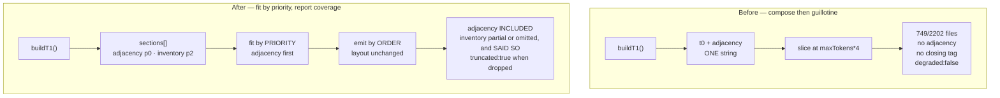

# Plan: Repo-context budget honesty — sections fitted by priority, coverage reported

- **Date**: 2026-08-21
- **Status**: Complete
- **Author**: Claude + pill
- **Scope**: backend
- **Target domain(s)**: `shared-lib`, `audit-orchestration`, `tests`
- ⚠ **Cross-domain work** — touches >1 domain; the seam (`repo-context.mjs` →
  its three prompt-assembling call sites) is the point of the change, so the
  crossing is intentional and is what §11's clustering is drawn around.

> **Neighbourhood considered** — band `review` (nothing above this repo's noise
> floor; top scores 0.818/0.805/0.789 are `buildT0`/`getRepoContext`/`buildT1`
> **in the file being modified**, i.e. the function itself, not a duplicate
> elsewhere). No sibling implementation exists to reuse or extend: this is a
> rewrite of one module's composition step, not a new capability.

---

## 1. Context Summary

Detected scope **backend**, stack **js-ts** (+ postgres). No UI surface, so §3/§4/§5/§10 are omitted.

### Code Trace

All line refs pinned to `2d6157f0`.

- `scripts/lib/repo-context.mjs:166 (2d6157f0)` `getRepoContext` — calls
  `listRepoFiles()`, picks a tier off `DEGRADE_CHAIN`, then at
  `:203 (2d6157f0)` applies `if (estimateTokens(block) > maxTokens)` and slices
  the assembled string at a line boundary.
- `scripts/lib/repo-context.mjs:61 (2d6157f0)` `buildT0` → one string:
  header + `inv.files.join('\n')` + `</repo_inventory>`.
- `scripts/lib/repo-context.mjs:68 (2d6157f0)` `buildT1` → `` `${t0}\n<adjacency_context…>…` `` —
  **inventory first, adjacency second**.
- Consumers (the complete set, from a repo-wide grep for
  `getRepoContext|fileListContext|repoContextBlock|repo_inventory`):
  `scripts/gemini-review.mjs:1408 (2d6157f0)` (T1, `full` scope only — the
  `!reduced` guard at `:1404`); `scripts/openai-audit.mjs:969 (2d6157f0)` (T0,
  plan scope); `scripts/lib/audit/legacy-production-audit.mjs:2549 (2d6157f0)`
  (T1 diff / T3 full) → `fileListContext`, which reaches **only** the
  `structure` and `wiring` passes (`:2670`, `:2703`).
- The real existence oracle, independent of all this:
  `scripts/gemini-review.mjs:2619 (2d6157f0)` `applyExistenceGate` →
  `listFiles()` → `{ repoFiles: inv.files, inventoryComplete: inv.complete }` —
  the **full** 2202-file list plus a completeness flag; same at
  `scripts/lib/audit/legacy-production-audit.mjs:3810 (2d6157f0)`.

### Measurements (all `measured`, 2026-08-21, at `2d6157f0`)

Commands: `getRepoContext({tier:'T1',targetPaths:[…],baseDir:process.cwd()})`;
`git ls-tree -r --name-only <sha> | wc -l`; `git log --reverse`.

| Fact | Value |
|---|---|
| Canonical inventory | 2202 files, `complete: true`, source `git` |
| Block delivered at every production call site | 749 lines, 31977 chars, 7995 est. tokens |
| Budget | 8000 est. tokens (`DEFAULT_MAX_TOKENS`) |
| Inventory share of budget | 99.9% — nothing else fits |
| `<adjacency_context>` present | **false** on all four call-site configurations |
| Closing `</repo_inventory>` present | **false** |
| Reported `degraded` / `fallbackReason` | `false` / `null` (T1 diff), i.e. healthy |
| Truncation began | `c38f93bd`, 2026-05-30, at 830 tracked files |
| Feature landed | 2026-05-17, 642 files — under budget, working |
| Duration broken | 1214 commits (~2.8 months) |
| HEAD inventory vs budget | 91022 chars = **2.84×** |

### Why the tests never caught it

`tests/repo-context.test.mjs:26,40 (2d6157f0)` — both real-repo cases pass
`maxTokens: 100_000`, and the T1 case's own comment says why: *"maxTokens lifted
from the default to ensure the adjacency_context block (which is appended AFTER
the T0 inventory) survives truncation as the repo's file count grows."* Budget
behaviour is exercised only at `:121 (2d6157f0)` in a bare temp dir at
`maxTokens: 200`. So the suite covers **content at an unrealistic budget** and
**budget at unrealistic content**, and never the production configuration. The
truncation was observed, and the test was moved out of its way.

### Telemetry state (constraint input — measured, not assumed)

| Surface | Reads this block? | State | Exposure |
|---|---|---|---|
| arm-eval (plan-authoring) | **No** — `contextPack` is `intent.pack` (`scripts/lib/arm-eval/run.mjs:75`) | in flight | none |
| bake-off `final-review-scoped-2026q3` | **No** — `controls.envelopeScope: "thin"`, and `thin` skips the block (`gemini-review.mjs:1404`) | active, 20/30 snapshots, epoch `e3-scoped-envelope` | none |
| bake-off `final-review-2026q3` | Yes — `controls.envelopeScope: "full"` | superseded, 1 snapshot | negligible |
| **tiered-recall shadow** | **Yes, via legacy** | ~~window MET — awaiting Phase-14~~ **STALE, see Correction below: Phase 14 was already closed on 2026-08-17** | ~~changing the legacy prompt changes what a compared row means~~ — no decision rode on those rows |

`TIERED_SHADOW_CONTRACT_EPOCH` is `v7-multi-hunk-selector-2026-07-27`. Its
digest (`tiered-shadow-contract-digest.mjs`) hashes correlation and eligibility
logic — **not prompt content** — so a prompt change would alter row meaning
*without* tripping the guard built for that exact omission class.

---

## 2. Proposed Architecture

### The defect, stated structurally

`getRepoContext` builds ONE opaque string, then slices it. Three consequences
follow from that single choice, and none is fixable by resizing anything:

1. **Priority is emission order.** Adjacency is small and high-value; the
   inventory is huge and low-value. Adjacency loses because it is concatenated
   second.
2. **The report is computed before the damage.** `degraded` means "a tier fell
   back", and is assigned at `:198` — before the truncation at `:203`. There is
   no state in which the object says "I cut something".
3. **A string slice has no idea what an element is.** Cutting at a line boundary
   avoids splitting a tag but still drops the closing one.

### The durable fix — fit whole sections by priority, then report coverage

Tier builders stop returning a string and return **sections**
(`{ id, priority, order, truncatable, … }`). One assembler fits them into the budget
**highest-priority first, whole sections only**, and always emits a coverage
line naming what it dropped.

This is not a new idea in this repo — it is
`docs/audit/shared-references/verification-discipline.md` §7 (shipped
2026-08-20, `53120366`): *a report states its COVERAGE, not only its verdict.*
The repo-context block is a report about the repo, and it currently states a
verdict (a file list) with no coverage. Applying the existing doctrine to it is
the fix.



### Key design decisions

- **Adjacency outranks inventory** (#1 single source of truth, #20 long-term
  flexibility). Adjacency is the only part that is *not* obtainable elsewhere;
  the inventory duplicates `applyExistenceGate`, which reads the full list.
- **A section is SELF-CONTAINED**: it renders its own opening and closing
  markup. No wrapper ever spans two sections, so "include or omit whole
  sections" is sufficient to keep the document well formed — it is a property of
  the section contract, not a hope about ordering (#15).
- **A section may declare itself `truncatable`, and truncation happens INSIDE
  the section's own renderer** — which knows how to emit a valid partial element
  *with* its closing tag and its own "N of M shown" line. The inventory is
  truncatable; adjacency is not (it is small, and a partial import list is
  actively misleading). This is what keeps T0 useful: see the tier table below.
- **The coverage statement is MANDATORY on the new composition path** and is
  charged to the budget first. When anything is omitted or partial, the block
  says what, how much, and that *absence from this list is not evidence a file
  is missing*. That closes the false-positive channel the truncated list
  currently opens over 66% of the repo.
  **The frozen `composeLegacy()` path is the one explicit exemption** (R2/H1 —
  stated here because an unqualified "mandatory" contradicted §2's telemetry
  pin). The exemption is not silent: `coverage.composedBy: 'legacy'` is returned
  on that path, so a legacy block can never be mistaken for a complete one by
  any reader, and `legacy-production-audit.mjs` logs it every run. What that
  path keeps until retirement is the model-facing defect itself — partial
  inventory, no adjacency, unterminated element, no in-prompt coverage. Stderr
  does **not** correct the model's input, and this plan does not pretend it
  does; that is the dated, owner-approved cost of not disturbing an
  adjudication-ready cohort, and the cohort's window is already met, so the cost
  is bounded in days, not quarters.
- **`truncated` + `coverage` are additive fields**; `degraded`/`resolvedTier`
  keep their exact current meaning (#18 backward compat). Same additive
  discipline as `bucketsMatched` / `requestIdentity`.
- **Budget accounting stays `estimateTokens` (chars/4)**, unchanged. Re-deriving
  a tokenizer here would be the over-engineering cliff and would itself break
  comparability.
- **`compose:'legacy'` is the PRESERVED OLD FUNCTION, not a mode of the new
  assembler** (corrected after R1/H1). The old behaviour is a *partial mid-list
  string slice*; a whole-section fitter cannot reproduce that byte-for-byte, so
  claiming one code path serves both was wrong. `composeLegacy()` is today's
  `buildT*` + trailing-slice logic moved verbatim into a frozen function with a
  deletion date. Two paths, one frozen — honest, and it makes the retirement a
  file deletion rather than an untangling.

### 2.1 `fitSections` contract (H2 — stated, not implied)

```
fitSections(sections, maxChars, { coverage }) -> { text, included[], omitted[], partial[] }
```

0. **Units** (R2/M2): `maxChars` is CHARS and is the sole internal unit.
   `getRepoContext` converts once at the boundary — `maxChars = maxTokens * 4` —
   because `estimateTokens` is `ceil(len/4)`. The public option stays
   `maxTokens`; nothing inside `fitSections` speaks tokens.
1. **Budget covers everything emitted**: section texts, separators, the
   enclosing header, and the coverage statement. `maxChars` is the length of
   the returned `text`, not of the sections alone.
2. **Coverage reservation is a fixed UPPER BOUND, not the final string**
   (R2/M2 — the final string depends on the selection it is being reserved
   for, which is circular). Reserve
   `coverageUpperBound(sections)` = the length of the statement with **every**
   section listed `omitted` and every count rendered at `total`'s digit width.
   That is an upper bound by construction. Fit sections in the remainder, then
   render the real statement into the reserved span; any slack is simply unused.
3. **Renderer protocol** (R2/M2, counts added per R3/M1). A section is
   `{ id, priority, truncatable, measure(), minSize(), counts(), render(budget) }`
   — note there is **no per-section `required`** (R3/H1: it contradicted §9-A,
   where a budget fitting only adjacency must still emit adjacency):
   - `measure()` → full char length, no side effects;
   - `minSize()` → smallest valid rendering (wrapper + counts + absence rule);
     a `truncatable` section is only offered a budget ≥ `minSize()`;
   - `counts()` → `{ total }`, side-effect-free and available BEFORE fitting —
     this is what makes `coverageUpperBound` computable without reaching into
     renderer closures (R3/M1);
   - `render(budget)` → `{ text, shown, total, partial }` — the section reports
     its own `shown`/`total`, so the fitter never counts files.
4. **Selection**: ascending `priority`; ties broken by declared array order
   (stable, deterministic — never by size, which would make output a function
   of repo state).
4a. **Selection order and EMISSION order are separate axes** (Gemini gate,
   MEDIUM). `priority` decides *who gets budget*; `order` decides *where the
   section appears in the prompt*. Fitting in priority order and then
   concatenating in that same order would silently invert the legacy layout —
   adjacency ahead of the inventory — changing the prompt's semantic shape as a
   side effect of a budgeting fix, which is not a change this plan is entitled
   to make. So: fit by `priority`, then **sort the fitted set by `order`** for
   emission. §2.2 sets `order` to preserve today's layout (inventory, then
   adjacency), which also leaves the small high-signal block in the recency
   position it already occupied.
5. **A `truncatable` section that does not fit whole** is handed its remaining
   budget and renders a valid partial element; it is listed in `partial[]`.
6. **A non-truncatable section that does not fit** is omitted whole and listed
   in `omitted[]`.
7. **Viability is per-TIER, never per-section, and nothing throws** (R3/H1;
   R2/M3). A tier yields a block when **at least one** of its sections fits.
   Sections that do not fit are omitted and named in coverage — including the
   inventory, which is exactly the `adjacency-only` row of §9-A. Only when **no**
   section reaches `minSize()` does `fitSections` return
   `{ text:'', included:[], omitted:[all], partial:[] }`, and `getRepoContext`
   then reports the terminal shape it ALREADY has for "no block": `block: ''`,
   `resolvedTier: 'empty'`, plus `truncated: true` and a `coverage` naming what
   could not fit. Callers already treat an empty `block` as "omit the section"
   (`if (rc.block)` at all three sites), so this needs no call-site change.

7a. **Tier fallback and budget fitting are SEPARATE stages** (R3/M2). The
   `DEGRADE_CHAIN` walk is about **source-artifact availability** — no symbol
   map, unknown T2 intent, empty inventory — and is evaluated *before* any
   budgeting, exactly as today. Budget outcomes never trigger tier fallback
   (falling back from T1 to T0 on a budget miss is incoherent: T0's inventory is
   the largest section there is). Order is: select tier by artifact availability
   → fit that tier's sections → `empty` iff none fit.
8. **`omitted[]`/`partial[]` carry section IDs, never file names**, so the
   coverage statement is O(sections) and cannot itself grow unbounded.

**`coverage` is ONE structured value with ONE rendering** (R1/M1 — it was
described both as a line in the prompt and as a return field, which invites
consumers to print it twice):

```js
coverage = {
  complete: boolean,                       // nothing omitted, nothing partial
  sections: [{ id, state: 'full'|'partial'|'omitted', shown?, total? }],
  note: string|null,                       // the absence rule, when not complete
}
```

- `renderCoverage(coverage)` → the single line embedded in `block`. Consumers
  **never** re-render it — `block` already carries it.
- Consumers log the **structured** value (`truncated`, section states) to stderr;
  that is a different audience (the operator) from `block` (the model).
- `coverage` is **always present**. When `complete: true`, `note` is `null` and
  `renderCoverage` returns `''` — so a complete block gains no tokens and the
  coverage line never becomes background noise that means nothing.

### 2.2 Per-tier sections (H3 — enumerated, not exemplified)

| Tier | Section `id` | Priority (budget) | Order (emission) | Truncatable |
|---|---|---|---|---|
| T0 | `inventory` | 2 | 1 | **yes** |
| T1 | `adjacency` | 0 | 2 | no |
| T1 | `inventory` | 2 | 1 | yes |
| T2 | `doc_section` | 1 | 1 | no |
| T3 | `symbol_map` | 1 | 1 | **yes** |

**Read the T1 row pair carefully — the two columns deliberately disagree.**
`adjacency` is fitted FIRST (priority 0, so it can never be starved by the
inventory again) but emitted LAST (order 2, exactly where it sits today). That
inversion is the entire fix, and keeping `order` at today's values is what stops
it becoming a layout change as well.

(No `Required` column — per §2.1 rule 7 viability is a property of the tier, not
of any one section.)

**T0 does not become coverage-only** (the regression H3 caught). `inventory` is
truncatable and required, so at the production budget T0 emits a *bounded,
explicitly-partial, well-formed* inventory — the same information
`scripts/openai-audit.mjs` gets today, minus the silence. The change for T1 is
that `adjacency` (priority 0) is now fitted **before** the inventory is handed
its remaining budget, which is the whole point.

### Right-sizing gate

- **Band-aid extreme**: raise `DEFAULT_MAX_TOKENS` until the inventory fits
  (~23k tokens today). Buys nothing — it triples the cost of the least valuable
  section, still ranks by emission order, still reports `degraded:false`, and
  breaks again at the next growth step. This is the "fix the symptom" cliff.
- **Over-engineered extreme**: a general prompt-composition framework with
  registered section providers, per-consumer budget policies, a tokenizer
  abstraction and config-driven priorities. No current requirement asks for a
  second policy or a third composer.
- **Chosen**: one `fitSections` helper (~30 lines) + tier builders returning
  arrays + a coverage line. It serves a **current** requirement — adjacency is
  specified, paid for on every audit round, and never delivered — and it is the
  smallest change that makes "what did I drop?" answerable rather than
  invisible.

### The telemetry constraint — a true scope boundary, time-boxed

The prompt bytes change. That is unavoidable for any real fix, so the honest
question is *sequencing*, not *whether*.

`legacy-production-audit.mjs` is one half of a comparison whose window is **met
and awaiting adjudication**. Landing a prompt change into it now would either
silently change what 33 already-collected rows mean, or force an epoch bump that
discards them. That is a genuine scope boundary — an open measurement cohort —
**not** "the correct fix is larger". Per AGENTS.md that is the only kind of
defer that is honest, and it must name the independence and the retirement.

So: **the durable fix lands in full and is the default everywhere.** Exactly one
call site — `legacy-production-audit.mjs` — passes `compose: 'legacy'` to hold
its prompt bytes stable, carrying a `TEMP — pending Phase-14 tiered decision`
label (AGENTS.md's sanctioned form for a time-boxed workaround).

It IS a second code path (`composeLegacy()` — see §2's last decision; pretending
otherwise was R1/H1). Three things stop it rotting into a permanent fork:

1. **The frozen path is a verbatim move, not a reimplementation.** Today's
   `buildT*`-concatenate-then-slice logic moves into `composeLegacy()` unchanged.
   Nothing about it is maintained or extended; its only test asserts it still
   emits what `2d6157f0` emitted.
2. **The reporting half is NOT pinned.** `truncated`/`coverage` are computed and
   returned on **both** paths from day one, and `legacy-production-audit.mjs`
   logs them to stderr. The legacy path stops *lying* immediately even while its
   prompt bytes stay frozen — so the honesty fix is universal on landing, and
   only the byte-level composition is deferred.
3. **A mechanically-enforced retirement predicate** (R1/M3 — a comment-adjacency
   check was not enforcement). The canonical decision artifact is
   **`docs/research/tiered-recall-phase14-decision.md`**, named exactly.
   `tests/repo-context-legacy-pin.test.mjs` asserts:
   - while that file is **absent** → the pin exists and carries its `TEMP` comment;
   - once that file **exists** → the test **FAILS**, with the message
     *"Phase-14 decision recorded — delete composeLegacy() and the
     compose:'legacy' argument (docs/plans/repo-context-budget-honesty.md §8)."*

   So the retirement predicate is a test that goes red the moment the trigger
   fires. It cannot be satisfied by waiting, and it names the exact edit. This is
   the "promote a one-off check with a named retirement predicate" pattern from
   `skills/audit-code/examples/contract-test-scaffold.md`, applied to a pin
   rather than a probe.

---

## 6. Sustainability Notes

- **Assumption that changed and will change again**: "the repo fits in the
  budget". True on 2026-05-17, false 13 days later, and false by 2.84× today.
  The new design does not assume it — it reports the shortfall instead.
- **The class this closes**: a composed artifact that silently drops content and
  reports success. `fitSections` returning `{ included, omitted }` makes the
  drop a value rather than an absence.
- **Extension point deliberately built in**: sections carry an `id`, so a future
  tier can add a section without touching the assembler.
- **Deliberately NOT built**: per-consumer budget policy, section providers,
  a real tokenizer. No current requirement.

---

## 7. File-Level Plan

- **`scripts/lib/repo-context.mjs`** (modify) — the change.
  `buildT0`/`buildT1`/`buildT2`/`buildT3` return `Section[]`
  (`{id, priority, truncatable, required, render(budget)}`, each self-contained
  incl. its closing markup); new `fitSections` per §2.1; new `renderCoverage`;
  `composeLegacy()` holding today's concatenate-then-slice verbatim;
  `getRepoContext` gains `compose` and returns additive `truncated` + `coverage`.
  Why: single source of truth for the composition (#1), and the module that owns
  the defect.
- **`tests/repo-context-legacy-pin.test.mjs`** (create) — the self-expiring
  retirement guard (§2 item 3). Why: a retirement predicate nothing evaluates is
  a comment (#11 testability).
- **`tests/repo-context.test.mjs`** (modify) — replace the two `maxTokens:
  100_000` dodges with tests at the **production default** against the real
  repo, asserting adjacency IS delivered and coverage IS stated. Add the
  negative controls (§9). Why: the dodge is why this survived 1214 commits.
- **`scripts/gemini-review.mjs`** (modify) — LOG the structured `coverage`
  + `truncated` on the `[repo-context]` stderr line. It does **not** render the
  coverage line: `block` already carries it (§2.1's one-rendering rule; R2/M1
  caught this file plan contradicting it). Default compose.
- **`scripts/openai-audit.mjs`** (modify) — same, T0 plan scope.
- **`scripts/lib/audit/legacy-production-audit.mjs`** (modify) — pass
  `compose: 'legacy'` + the `TEMP — pending Phase-14` comment; log
  `truncated`/`coverage` to stderr (reporting is NOT pinned).
- **`docs/plans/repo-context-budget-honesty.md`** (create) — this file.
- **`status.md`** (modify) — session log at ship time.

### 7b. Implementation Phases

- **Phase 1 — Freeze the legacy path**: move today's concatenate-then-slice into
  `composeLegacy()` verbatim; capture the §9-D byte-identity fixtures from
  `2d6157f0` BEFORE any other edit, so the baseline is the real prior behaviour
  rather than something reconstructed after the fact. Files:
  `scripts/lib/repo-context.mjs` (modify), `tests/repo-context.test.mjs` (modify).
- **Phase 2 — Sections + assembler**: `Section` shape (self-contained,
  `truncatable`, `required`), `fitSections` per §2.1, `renderCoverage`;
  `buildT0`–`buildT3` return sections per §2.2. Files:
  `scripts/lib/repo-context.mjs` (modify).
- **Phase 3 — Honest return contract**: `getRepoContext` fits sections, adds
  `truncated`/`coverage`, keeps `degraded`/`resolvedTier`/`block` semantics,
  routes `compose:'legacy'` to the frozen path. Files:
  `scripts/lib/repo-context.mjs` (modify).
- **Phase 4 — Test the production configuration**: §9-A synthetic selection
  table, §9-B default-budget real-repo test, §9-C well-formedness, §9-E negative
  controls; delete the `maxTokens: 100_000` dodges. Files:
  `tests/repo-context.test.mjs` (modify).
- **Phase 5 — Call-site wiring + retirement guard**: structured `coverage`
  LOGGING at the three consumers (never re-rendering the line — §2.1); the pinned
  `compose:'legacy'` at the legacy site with its `TEMP` comment; the
  self-expiring guard. Files: `scripts/gemini-review.mjs` (modify),
  `scripts/openai-audit.mjs` (modify),
  `scripts/lib/audit/legacy-production-audit.mjs` (modify),
  `tests/repo-context-legacy-pin.test.mjs` (create).

**Close-out (not a phase)**: `npm test`, `npm run check`.

---

## 8. Risk & Trade-off Register

| Risk | Handling |
|---|---|
| Prompt bytes change on the final-review `full` path | Accepted. The active campaign binds `thin` (immune); the `full` campaign is superseded with 1 snapshot. Measured, not assumed. |
| Prompt bytes change on the legacy audit path | **Pinned** via `compose:'legacy'` until the Phase-14 decision. Named retirement predicate + guard test. |
| `full` envelope byte-identity (`envelope.mjs`, 38 shadow runs) | The contract is over `assembleEnvelope`'s **ordering**, which is untouched; only the `repoContextBlock` string's content changes. The 38-run baseline is a concluded experiment (verdict KEEP), not an open cohort. |
| The pin becomes permanent | §8 debt entry + code comment + guard test; retirement is a one-argument deletion. |
| Coverage line adds tokens | ~2 lines. Net change is strongly negative once the inventory is omitted or fitted. |

**Accepted debt (dated, with an owner-stated trigger)**:
`legacy-production-audit.mjs` runs `compose:'legacy'` from 2026-08-21.

**Retire when**: the in-flight arm cohort finishes and is adjudicated — i.e. the
Phase-14 tiered production-flip decision is recorded in `docs/research/`. This
is the repo owner's explicit direction (2026-08-21): *"after the current bandit
arm run we move to the durable and remove the legacy."* So the pin is not an
open-ended "someday" — it has a stated trigger, a stated owner, and a
one-argument removal.

**Retirement is a deletion, not a migration**: remove the `compose:'legacy'`
argument and its `TEMP` comment; the legacy branch in `repo-context.mjs` then
has no caller and is deleted in the same commit. The guard test (§9) fails if
the argument outlives its comment, so the pin cannot quietly lose its
justification and become permanent.

**Deliberately deferred to that same moment**: removing the inventory section
outright. The priority-fitting change makes it *omittable and reported* now;
deciding it should never be sent is the natural companion to the Phase-14 call,
and doing it earlier would change the legacy prompt this pin exists to hold
still.

---

## 9. Testing Strategy

Tier 1 (test-first — `repo-context.mjs` is a deterministic module).

**A. Synthetic fixture — the deterministic core** (R1/M2: the real-repo test is
size-dependent and cannot pin selection). A fixture of known section sizes, with
an **exact expected selection table** per budget:

| Budget | Expected `included` | `partial` | `omitted` | `truncated` |
|---|---|---|---|---|
| fits all | adjacency, inventory | — | — | `false` |
| fits adjacency + part of inventory | adjacency | inventory | — | `true` |
| fits adjacency only | adjacency | — | inventory | `true` |
| fits neither | — | — | adjacency, inventory | `true` + `resolvedTier:'empty'`, `block:''` |

Plus: **emission order is independent of selection order** — a fixture whose
priority and `order` disagree must emit in `order`, which is the regression
that would otherwise reshape every prompt. Plus the boundary cases the contract
now names: **equal priorities** resolve by declared order; **coverage-reserved-first** (a budget that fits a section only
if coverage were unreserved must still reserve it); and **no section fits** →
the `resolvedTier:'empty'` terminal shape, never a throw and never a
silently-empty block (§2.1 rule 7).

**B. Real-repo, production configuration** — T1 at the **default** budget with
real `targetPaths` delivers `<adjacency_context>`. This is the assertion the old
suite bought its way out of with `maxTokens: 100_000`; it must fail on current
code. Deliberately asserts only *adjacency present + coverage stated* — the
size-dependent parts are pinned in A, so repo growth cannot silently weaken it.

**C. Well-formedness, property-style — bounded** (R2/M5: "every budget" against
real repo content is O(n²) in repo size and grows every month). Runs against the
**constant-size synthetic fixture only**, over a fixed 12-budget ladder spanning
0 → minSize−1 → minSize → mid → fits-all. Every emitted block parses as balanced
markup. Meaningful only because sections are self-contained (§2) — the old design
could not satisfy it at any budget.

**D. `composeLegacy()` byte-identity — MULTIPLE fixtures, not one** (R1/H1: one
captured string proves one input). Captured from `2d6157f0` across the matrix
that actually varies: {T0, T1-with-adjacency, T1-no-adjacency, T3-degraded} ×
{default budget, a budget that fits}. Any drift fails.

**E. Negative controls** (a check is not trustworthy until seen to fail):
restore emission-order priority → B fails; delete the coverage line → coverage
assertions fail; make a section non-self-contained → C fails; a budget that fits
everything → `truncated:false` **and no coverage line at all** (guards against a
line that is always printed and therefore carries no information).

**G. Per-tier acceptance cases** (R2/M4 — the builders for all four tiers are
rewritten, but only T1 had a stated case). One case per row of §2.2:
T0's truncatable `inventory` emits a bounded partial at the production budget;
T2's NON-truncatable `doc_section` is omitted whole rather than sliced, and
since it is T2's only section that tier yields `resolvedTier:'empty'` (§2.1
rule 7) — the one case where "omit whole" and "tier empty" coincide, which is
why it is worth an explicit test; T3's truncatable `symbol_map` partials; and
the T3→T1→T0 walk still selects on **artifact availability** (§2.1 rule 7a),
never on budget outcome. The §9-D legacy fixtures pin the OLD
bytes for these tiers and deliberately say nothing about new-path semantics —
these cases are what covers that.

**F. Retirement guard** — `tests/repo-context-legacy-pin.test.mjs` per §2 item 3:
red while the pin is unjustified, and red again the moment
`docs/research/tiered-recall-phase14-decision.md` appears.

**A calendar backstop, because a trigger nobody pulls is not an expiry**
(R3/M3). The decision-file trigger fires only when a human creates the file, so
the guard ALSO fails once `2026-09-30` passes while the pin still exists —
whichever comes first. That date is deterministic and offline (a store query
would fail-open when cloud is off, which is the wrong direction for an expiry).
It is ~6 weeks against a cohort whose window is already met, so it is a
backstop, not the plan: the expected path is retirement within days, and the
date exists so "indefinitely" is not reachable. Moving the date is a commit
that has to say why.

**Its three states are explicit** (R2/L1 — the post-retirement state was
undefined):
1. *decision absent, pin present* → **pass** (the steady state today);
2. *decision absent, pin missing or comment missing* → **fail** ("the pin lost
   its justification");
3. *decision present **or** past 2026-09-30* → **fail**, naming the exact edit. This deliberately turns
   main red when the decision document lands ahead of the code change: that is
   the forcing function, and it is why the retirement is a **single commit**
   that adds the decision doc, deletes `composeLegacy()`, deletes the
   `compose:'legacy'` argument, deletes the §9-D fixtures, and deletes this
   guard file. There is no fourth "retired and passing" state — the test does
   not survive its own predicate.

Close-out: full `npm test` + `npm run check`.

---

## 11. Execution Clustering

- **Cluster A** — Phases 1–4 — fix-gate: yes
  - Coupling: the frozen legacy path, the assembler that replaces it, the return
    contract it populates, and the tests that pin all three are one seam.
    `fitSections`'s `{included, partial, omitted}` IS `getRepoContext`'s
    `coverage`, so a test written against either half alone cannot see a
    mismatch between them; and the §9-D byte-identity fixtures must be captured
    (Phase 1) before the composition changes (Phases 2–3), which is a
    within-cluster ordering constraint, not a cluster boundary.
- **Cluster B** — Phase 5 — fix-gate: final
  - Coupling: all three consumers read the same new fields and must agree on
    rendering vs logging (§2.1's one-rendering rule); the legacy pin and its
    self-expiring guard are only meaningful once the default path exists.
- **Final gate**: mandatory consolidated Gemini review over the union diff.

---

## Audit Trail

- **GPT plan audit**: 3 rounds (the default cap). R1 H:3 M:3 → R2 H:1 M:5 L:1 → R3 H:1 M:3.
  **17 findings, 17 accepted as fix-now, 0 dismissed, 0 deferred — 100% acceptance
  in every round**, so the rounds were productive rather than rigor pressure
  (the acceptance-rate rule, not the count). Stopped at the 3-round default with
  R3's findings fixed; they were concrete design contradictions, not
  completeness nits.
- **Gemini final gate** (mandatory, `--mode plan`): **APPROVE**, round 1 of a
  2-round cap. `claude_bias_detected: false`, `gpt_false_positive_count: 0`,
  `deliberation_was_fair: true` — *"Excellent deliberation… Claude correctly
  defended the legacy-path freeze by citing the open measurement cohort, while
  still accepting the need for a strict calendar backstop."* Its one MEDIUM
  (selection priority vs emission order) is folded into §2.1 rule 4a and §2.2;
  no second Gemini round, per the cap and the APPROVE verdict.
- **What the audit changed** (the plan as first written would have shipped these
  defects): the legacy path went from "a mode of the new assembler" — provably
  impossible, since a whole-section fitter cannot reproduce a partial mid-list
  slice — to a frozen verbatim function (R1/H1); `required` moved from section
  to tier, resolving a contradiction between §2.2 and §9-A (R3/H1); the
  inventory became truncatable so T0 and `openai-audit.mjs` keep their structure
  instead of degrading to a coverage-only block (R1/H3); and the retirement
  gained a self-expiring guard test plus a calendar backstop, replacing a
  comment-adjacency check that enforced nothing (R2/M3, R3/M3).

---

## Correction 2026-08-21 — the pin's premise was stale on the day it was written

**The legacy pin was unnecessary, and the plan above says so for the wrong
reason.** It is left standing rather than rewritten, because the mistake is the
useful part of the record.

### What was wrong

§1's telemetry table and §2's "telemetry constraint" rest on the claim that the
tiered-recall shadow cohort was *awaiting adjudication*. It was not. Phase 14
was **deliberately closed without a production flip on 2026-08-17** — four days
before this plan was written — in
[`tiered-recall-audit-pipeline.md`](./tiered-recall-audit-pipeline.md)
§"Close-out 2026-08-17" (commit `e9305550`, plan `Status: Complete`). Its own
words: *"no further work on this plan's own Phase 14 is planned"*, with future
tiered-vs-legacy decisions handed to `campaign.mjs`.

### How the error was made

The evidence cited for "awaiting adjudication" was
`tiered-shadow-report.mjs`'s closing line — *"the plan's pre-registered 10-15
window is met. Time for the Phase-14 production-flip review."* That line is a
**generic threshold trigger keyed on `comparedRuns` alone**. It has no
knowledge of the plan's status and cannot know a decision was taken; it will
print the same sentence forever. The run count it reported (33) was accurate —
the *inference* drawn from it was not.

**The generalisable rule**: a tool's advisory line describes a threshold, not a
decision. When it says "time to decide X", the cheap check is X's plan
`Status:` line, not a re-derivation from the same metric the trigger already
read. Reading the report but not the plan is what produced a two-cluster
implementation, a frozen second code path, a self-expiring guard test and a
calendar backstop — machinery for a constraint that had already been lifted.

### What was kept, and what went

The **durable fix stands on its own merits** and is unaffected: the defect it
repairs (budget priority == emission order; `degraded` computed before the
slice; a string slice dropping the closing tag) was real and independent of any
telemetry question. §2's diagnosis, §2.1's `fitSections` contract, §2.2's tier
table and §9's tests are all unchanged.

Retired the same day, in one commit, per the guard's own instruction:
`composeLegacy()`, the now-dead `legacyBuildT0`/`legacyBuildT1`, the
`compose:'legacy'` argument and option, the legacy test cases, and
`tests/repo-context-legacy-pin.test.mjs`. `legacyBuildT2`/`legacyBuildT3` were
**not** deleted — the guard's instruction was over-broad and they are still the
only builders for T2/T3; they were renamed `buildDocSection`/`buildSymbolMap`,
since the `legacy` prefix had become a lie.

`legacy-production-audit.mjs` now runs the budgeted composition like every
other caller, and gets adjacency for the first time since 2026-05-30.

### The one thing that worked as designed

The retirement predicate did exactly its job: writing
`docs/research/tiered-recall-phase14-decision.md` (a transcription of the
existing decision, not a new one) turned
`tests/repo-context-legacy-pin.test.mjs` red and printed the precise four-step
edit. The debt did not have to be remembered — it announced itself. That much
of §2 item 3 is worth keeping as a pattern, even though the debt it guarded
should never have existed.

**Immutable residue**: commit `6d1b1bbd`'s message states the stale framing
("window is MET and awaiting Phase-14 adjudication"). It cannot be edited; this
section is the correction of record.
