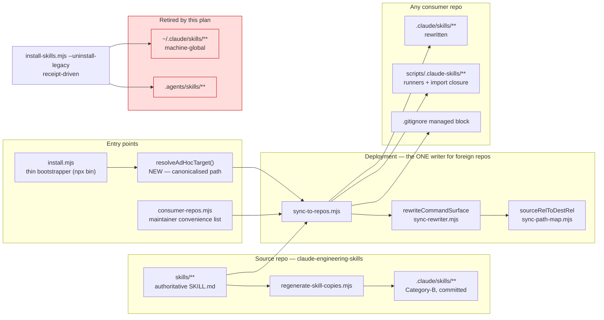

# Plan: Repo-Scoped Skill Surfaces + a Third-Party-Usable Installer

- **Date**: 2026-07-30
- **Status**: Complete
- **Author**: Claude + Louis
- **Scope**: backend

---

## 1. Context Summary

**Detected scope**: `backend` (explicit) · **Stack**: `js-ts` (from `package.json`) ·
**Target domain(s)**: `install`, `root-scripts`, `shared-lib`

- ⚠ **Cross-domain work** — touches 3 domains; the boundary crossings are intentional
  and named in §2 (a root-level entry point delegating into `install` + the sync engine
  is the `root-scripts → install` edge already declared in `.audit-loop/domain-map.json`).
- ⚠ **Untagged paths**: `.githooks/post-merge`, `README.md`, `AGENTS.md` — no rule in
  `.audit-loop/domain-map.json` matches them. They are hook/doc surfaces, not code;
  no rule is warranted.

### Neighbourhood considered

| Symbol | File | Domain | Score | Band |
|---|---|---|---|---|
| `main` | `install.mjs:36` | `root-scripts` | 0.847 | **`precedent`** (`above-floor-cluster`) |
| `main` | `scripts/install-skills.mjs:466` | `install` | 0.837 | `review` |
| `buildSkillFiles` | `scripts/sync-to-repos.mjs:567` | `install` | 0.837 | `review` |
| `maybeWarnGithubSkillsDeprecation` | `scripts/install-skills.mjs:266` | `install` | 0.827 | `review` |
| `resolveSkillTargets` | `scripts/lib/install/surface-paths.mjs:121` | `install` | 0.822 | `review` |
| `globalSurfaceRoot` | `scripts/lib/install/surface-paths.mjs:51` | `install` | 0.813 | `review` |

`install.mjs::main` came back **`precedent` / `above-floor-cluster`** — the strongest
duplication signal this index emits, and the only one above the repo's noise floor. Read
against `install-skills.mjs::main` and `sync-to-repos.mjs`'s repo loop, the cluster is
real and not a false positive: all three implement *"enumerate bundle files → write them
into a target repo"*, but only two of them do it correctly. **Decision: neither reuse nor
extend `install.mjs::main` — delete its duplicated body and make it a caller of the other
two.** This is the whole shape of Part B, and the arch-memory band is the independent
corroboration for it.

### Past incidents to verify against (2 of 2)

| Incident | Affected paths | Status | Bearing on this plan |
|---|---|---|---|
| **INC-001** — lexical sensitive-path classification bypassed by symlink | `scripts/lib/sensitive-paths.mjs`, `sensitive-egress-gate.mjs`, `symbol-index/extract.mjs` | `manual-verification-required` | This plan introduces an **operator-supplied arbitrary filesystem path** (`--target-path`). Canonicalise via `realpath` **before** any classification or write decision; fail closed on resolution error. |
| **INC-002** — destructive test wiped the shared Postgres store; the only gate was "is the env var *set*" | `tests/db-setup.test.mjs`, `tests/db-withtx.test.mjs`, `scripts/lib/db/client.mjs` | `manual-verification-required` | This plan introduces a **delete path** (`--uninstall-legacy`, removing `~/.claude/skills/**`). "Is a receipt present" is the same category of non-gate as "is the variable set". The delete must be positively bounded by receipt membership, never by directory enumeration. |

### What exists today

**Code trace — Part A (the shadowing bug), followed end to end:**

`.githooks/post-merge:11` → `node scripts/install-skills.mjs --local --surface claude --force`
→ `install-skills.mjs::main()` [scripts/install-skills.mjs:466] → `buildSkillWrites()`
[scripts/install-skills.mjs:282] → `resolveSkillFiles()`
[scripts/lib/install/surface-paths.mjs:172] → `resolveSkillTargets()`
[scripts/lib/install/surface-paths.mjs:121] → for `surface === 'claude'`,
`path.join(globalSurfaceRoot(), skillName)` [surface-paths.mjs:145] →
`globalSurfaceRoot()` = `path.join(os.homedir(), '.claude', 'skills')` [surface-paths.mjs:51].
`buildSkillWrites` then does `fs.readFileSync(srcPath)` [install-skills.mjs:294] and pushes
the bytes **verbatim** — there is no rewrite step anywhere on this path.

Measured consequence:

| File | `scripts/.claude-skills/` refs |
|---|---|
| `~/.claude/skills/ship/SKILL.md` | **0** |
| `wine-cellar-app/.claude/skills/ship/SKILL.md` | **20** |

The global copy even contains, at its line 475, the sentence *"Consumer repos: the synced
copy of this file already carries the rewritten `scripts/.claude-skills/ship-commit.mjs`
path"* — while itself carrying the unrewritten one. A Claude Code session in
`wine-cellar-app` was served that copy, every runner invocation missed, `MODULE_NOT_FOUND`
was read as "the tooling is not installed", and the session skipped its audit gates on
that false premise.

**Code trace — the correct path, for contrast:**

`scripts/sync-to-repos.mjs::main()` [sync-to-repos.mjs:860] → per-repo loop
[sync-to-repos.mjs:908] → `buildOwnedSourceTails(repo.files)` [sync-to-repos.mjs:~995] →
`rewriteCommandSurface({relPath, content, config})` [sync-to-repos.mjs:1171 and 1301] →
`rewriteTextCommandInvocations` [scripts/lib/sync-rewriter.mjs:53] →
`sourceRelToDestRel` [scripts/lib/sync-path-map.mjs:105] →
`scripts/<tail>` becomes `scripts/.claude-skills/<tail>`
[sync-path-map.mjs:119-123, `LAYOUT_CONSTANTS.CONSUMER_TOOLING_DIR`].

**Code trace — Part B (why nobody outside this machine can install):**

`sync-to-repos.mjs:734` → `export const REPOS = CONSUMER_REPOS.map(...)` →
`scripts/lib/consumer-repos.mjs:63` → `CONSUMER_REPOS` is a **frozen** array built from
two committed `BASE_REPOS` entries [consumer-repos.mjs:24] plus an optional gitignored
`consumer-repos.local.json` [consumer-repos.mjs:37]. `main()` filters it by
`r.name === targetFilter || r.alias === targetFilter` [sync-to-repos.mjs:875] and
`process.exit(1)`s on no match [sync-to-repos.mjs:879]. There is no code path that accepts
a filesystem path. **The only writer that can deploy runners correctly is reachable only
for repos hardcoded on the maintainer's machine.**

### The two layouts (the governing fact)

The bundle has exactly two deployment layouts, and a SKILL.md's runner paths are a pure
function of which one it sits in:

| Layout | Runners live at | Who writes the skills | Rewrite applied |
|---|---|---|---|
| **Source repo** | `scripts/X.mjs` | `regenerate-skill-copies.mjs` (Category-B, byte-verified by `skills:check`) | none needed |
| **Foreign repo** | `scripts/.claude-skills/X.mjs` | `sync-to-repos.mjs` | `rewriteCommandSurface` |

`~/.claude/skills/` is **one machine-wide directory shared by every repo**, therefore
layout-agnostic by construction, therefore **no correct content for it exists**. Applying
the sync rewrite there does not fix the bug — it flips which repo is broken.

### Patterns reused vs new

| Concern | Existing implementation — **reused, not reimplemented** |
|---|---|
| Enumerate skill files | `enumerateSkillFiles` / `skills.manifest.json` |
| Layout rewrite | `rewriteCommandSurface` (`scripts/lib/sync-rewriter.mjs`) |
| Source↔dest path map | `sourceRelToDestRel` (`scripts/lib/sync-path-map.mjs`) |
| Import-graph closure | `resolveBundle` (`sync-to-repos.mjs`) |
| Managed gitignore block | `sync-gitignore.mjs` / `ensureAuditGitignore` |
| Receipts + WAL + conflict detection | `scripts/lib/install/{receipt,transaction,conflict-detector}.mjs` |
| Receipt-scoped deletes | `computeDeletes` (`install-skills.mjs:364`) |
| Retired-surface precedent | `resolveSkillTargets`'s `copilot` throw (`surface-paths.mjs:122`) |

**Genuinely new**: one synthetic-target factory (~30 lines) and one CLI flag. Everything
else in this plan is deletion or redirection.

---

## 2. Proposed Architecture



### Key design decisions

**D1 — Surface ownership becomes single-writer per directory (#5 Single Source of Truth, #3 Modularity).**
`.claude/skills/**` in a repo is written by **exactly one** thing: `regenerate-skill-copies.mjs`
in the source repo, `sync-to-repos.mjs` in every other repo. No third writer. This is the
invariant the whole plan enforces; every other decision follows from it.

**D2 — `--surface claude` (global) is retired, not repointed (#5, #15 Error Handling).**
Repointing it to `<repoRoot>/.claude/skills/` was considered and **rejected**: `sync-to-repos.mjs`
already owns that directory in a consumer and is the only writer that can rewrite paths
correctly. Two writers for one directory is precisely the failure this plan exists to fix —
repointing would relocate the bug, not remove it. `resolveSkillTargets` therefore **throws**
for `claude`, mirroring the `copilot` precedent at `surface-paths.mjs:122` and for the reason
stated in that comment: a silent `[]` is indistinguishable from "legitimately zero targets".

**D3 — `--surface agents` is retired too (#5).**
This is a scope extension beyond the reported bug, and it is justified by impact, not
authorship (AGENTS.md's scope rule). `.agents/skills/` has the *same* defect — `buildSkillWrites`
copies bytes verbatim, so in a consumer it names `scripts/X.mjs` runners that live at
`scripts/.claude-skills/X.mjs` — and it is a **second Copilot-discovered root carrying the
same 15 skill names** as `.claude/skills/`, which is the exact collision AGENTS.md forbids
("never ship the same skill name in two discovered roots"). Retiring only the global surface
would leave a repo-scoped clone of the same bug armed. It has no automated caller
(`post-merge` uses `claude`; nothing runs `--surface both`).

**D3a — the selector contract, as a table (#15).**
"Throws for `claude` and `agents`, `both` degrades to zero targets, the installer errors
loudly" describes three behaviours without pinning any of them. Fixed here:

| Invocation | `resolveSkillTargets` returns / throws | Installer behaviour | Exit |
|---|---|---|---|
| `--surface claude` | **throws** `RetiredSurfaceError` naming `.claude/skills` ownership + the replacement command | abort before any write | `2` |
| `--surface agents` | **throws** `RetiredSurfaceError` (same shape) | abort before any write | `2` |
| `--surface copilot` | **throws** (pre-existing, unchanged) | abort | `2` |
| `--surface both` | **throws** — see below | abort before any write | `2` |
| unrecognised surface | **throws** (pre-existing, unchanged) | abort | `2` |
| `--uninstall-legacy` | not called — the delete path does not resolve targets | receipt-driven cleanup | `0` clean/no-op, `1` on transaction failure |
| no surface flag | defaults to `both` → throws | abort | `2` |

`both` **throws rather than returning `[]`**. This is the `copilot` precedent applied
literally, and for the reason `surface-paths.mjs:122` already gives: a silent empty array
is indistinguishable from "this surface legitimately has zero targets", and would let a
future caller inherit a silent no-op. With both member surfaces retired, `both` is a
request for two retired surfaces, not a request that narrows to zero — so it is an error,
not a degradation. The earlier draft's "degrades to zero targets" wording was wrong and is
withdrawn.

**D4 — `install-skills.mjs` is KEPT, its install path removed, its cleanup path added (#18 Backward Compat).**
Deleting the file was considered and **rejected on blast radius**: it is referenced by ~20
doc/plan files and 8 test files. Those historical plan records are correct about what the
file did at the time and must not be rewritten to satisfy a rename. The file is not in the
sync bundle (verified: 577 bundle files, zero install-related), so keeping it costs consumers
nothing. Its docstring and `--help` are rewritten to state what it now is — a **surface-retirement
and legacy-cleanup tool** — so the name is qualified rather than a lie.

**D5 — `CONSUMER_REPOS` stops being a gate and becomes a convenience list (#4 No Hardcoding, #20 Long-Term Flexibility).**
`resolveAdHocTarget(rawPath)` returns the same **identity triple** the registry yields —
`{name, alias, path}` — and *nothing else*. This is the single largest piece of new work
and the thing that makes the bundle distributable at all, and it is ~30 lines because the
loop was already path-driven.

**D5a — divergence is prevented by construction, not by matching field lists (#1, #5).**
`sync-to-repos.mjs:734` currently reads
`export const REPOS = CONSUMER_REPOS.map(r => { const {files, unresolved} = bundleForRepo(); return {...r, files, unresolved}; })`,
and the loop then consumes `repo.files` (`buildOwnedSourceTails(repo.files)`,
`extractLiveSkillNames(repo.files)`). A synthetic entry carrying only the identity triple
would therefore arrive with `repo.files === undefined` and either crash or copy nothing.

The fix is **not** to enumerate the deployment fields into a `TargetSpec` type — that
creates a second list to keep in sync with the loop's real consumption, which is the same
hand-maintained-duplicate failure this plan exists to remove. Instead, **decoration is
factored out of the `REPOS` module constant into one function**,
`decorateTarget(identity)`, applied to registry identities and ad-hoc identities alike:

```
resolveTargets(--target)  ─┐
                           ├─→ identity {name, alias, path} ─→ decorateTarget() ─→ loop
resolveAdHocTarget(--target-path) ─┘
```

There is then exactly **one** construction site for a sync target, so an ad-hoc target
cannot diverge from a registry target — not because the two field lists agree, but because
there is only one list. `bundleForRepo()` already takes no per-repo argument (every
consumer gets every bundle), so the "canonical default deployment profile" the divergence
risk implies **already exists and is the only profile**. §9's integration test asserts the
byte-identical property as the regression lock.

**D6 — `install.mjs` becomes a bootstrapper that owns no file lists (#1 DRY, #17).**
Its `SCRIPTS` array (7 hardcoded files, no import closure) is the exact rot that produced
the `MODULE_NOT_FOUND` class. It is deleted rather than corrected; `resolveBundle`'s
import-graph closure already solves the problem correctly. Same for its skill list, its
`.github/skills/` write, and its bogus pre-push hook.

**D6a — the bootstrap contract, stated (#15 Error Handling, #13 Idempotency).**
"Delegating caller" is not a specification, and this is the public entry point, so the
contract is fixed here rather than at implementation time:

| Concern | Contract |
|---|---|
| **Bundle source identity** | **One canonical constant**, read from `package.json`'s `repository` field via a tiny `bundleSource()` accessor — never re-derived from `git remote` and never inferred from the execution context. See D6d for why. |
| Cache location | `~/.claude-engineering-skills/bundle` — owned by this tool; never inside the target. Overridable with `CES_BUNDLE_CACHE` for CI and the hermetic tests. |
| Ref selection | Default: the remote's default branch, resolved via `git ls-remote --symref <url> HEAD`. `--ref <branch\|tag\|sha>` overrides. **The ref is resolved to an immutable SHA before anything is reset or written**, and that SHA is printed — so the operator sees what they installed, and a moving branch cannot mean two different things within one run. |
| Refresh | `git clone --depth 1` on first use; thereafter **verify the cache's `origin` matches `bundleSource()`** and `git fetch --depth 1 origin <sha> && git reset --hard <sha>`. A cache whose origin differs, or whose git state is unusable, is **deleted and re-cloned** — never fetched into, never repaired in place. |
| Concurrency | One lockfile **anchored to the cache root** — `path.join(path.dirname(cacheRoot), '.lock')` — via the repo's existing `withFileLock`. It must **not** be a separate `os.homedir()` join: `CES_BUNDLE_CACHE` would then relocate the cache while the lock stayed in the developer's real `$HOME`, so the hermetic E2E would pollute it and parallel runs would contend on a lock that guards nothing they share. Deriving it from `cacheRoot` makes "one lock per cache" true by construction. Acquire failure is a hard error, never a racy second clone. |
| Dependency install | `npm ci --omit=dev` with `cwd = bundleRoot`. Failure aborts before any target write. |
| Delegation mechanism | **Child process** (`execFileSync`), not an import: `node <bundleRoot>/scripts/sync-to-repos.mjs --target-path <canonicalTarget>`, `cwd = bundleRoot`. A child process is chosen deliberately — `sync-to-repos.mjs` resolves `SOURCE_ROOT` from its own location and calls `assertRepoRoot(import.meta.url)`, so it must run *as* the bundle; and the bundle's deps resolve from the bundle's own `node_modules`, not the target's. |
| CLI grammar | `install.mjs [<target-dir>] [--dry-run] [--ref <r>] [--yes] [--help]`. The target is a **single positional**; when absent and interactive, prompt (today's behaviour); when absent and non-interactive, **error** — never guess `cwd`. Flags may precede or follow the positional; a second positional is an error. Unknown flags error via `assertKnownFlags`. |
| Interactivity | `interactive = process.stdin.isTTY && !argv.includes('--yes')`. This single predicate is what D6b's prompt/no-prompt split keys on — it is never re-derived. `--yes` means "proceed without prompting", and per D6b that still **does not** authorise a `$HOME` delete. |
| `--home` | **Not a public flag on `install.mjs`.** It exists only on `install-skills.mjs` as the explicit internal handoff argument (D6c), so the delete target is stated rather than ambient. The hermetic E2E controls the home by setting the child's `HOME`/`USERPROFILE` env for the spawned process, not by a public override. |
| Argument forwarding | Closed set only: `--dry-run`, `--ref`. Unknown flags error (`assertKnownFlags`). No opaque passthrough. |
| **`--dry-run` semantics (whole-run, not just the sync)** | The bundle cache **is** acquired and validated (it lives outside the target, and there is nothing to rehearse without it); `npm ci` runs. Then: sync runs with `--dry-run`; **env/API-key prompts are skipped entirely**; and the legacy migration **inspects and reports only — it never prompts and never deletes, in any mode.** This is the asymmetry the rule exists to prevent: a dry-run sync writes no repo-scoped replacement, so a migration that still deleted the legacy copy would leave the machine with *neither*, from the one command that promised to change nothing. |
| Exit codes | The child's exit code is propagated verbatim. Bootstrap-stage failures (clone/deps/lock) use distinct non-zero codes so a CI log distinguishes "could not fetch the bundle" from "the sync failed". |
| Cleanup | The cache is **not** removed — it is the cache, and removing it makes every update a full clone. Nothing is written outside the cache and the target. |
| Ordering | Env/API-key prompts run **after** a successful sync, so a failed install never leaves a half-configured `.env`. |

**D6d — the bundle source must be a constant, because `npx github:` gives us no usable remote (#4 No Hardcoding, #5).**
"The repo's default branch" is not an implementable source identifier from inside the
running process. `npx github:owner/repo` executes an **unpacked package tarball**: there is
no guarantee of a `.git` directory, so `git remote get-url origin` may fail or — worse —
succeed and return the *target repo's* remote if cwd has drifted. Deriving the source from
the execution context is therefore both unreliable and a supply-chain hazard: it would let
whatever repository the operator happens to be standing in decide what gets installed.

The source is instead a single constant, `bundleSource()`, reading `package.json`'s
`repository.url` (already present, already the canonical statement of where this bundle
lives). Consequences that must hold:

- The **cache's `origin` is validated against it** on every reuse; a mismatch deletes and
  re-clones rather than fetching (D6a). A cache poisoned or repointed by an earlier run
  cannot silently persist.
- A `--ref` value is resolved against **that** URL, never against an ambient remote.
- `install.mjs` never reads `git remote` at all. This is asserted in
  `tests/install-bootstrap.test.mjs` as a structural regression, alongside the
  no-hardcoded-file-list assertion — both guard the same failure mode (the entry point
  re-deriving something it should be told).

**There is NO environment or config override for the bundle source.** No
`CES_BUNDLE_SOURCE`, no config-file lookup, no CLI flag. Any of those would reintroduce
exactly what D6d forbids — an ambient value choosing which code gets cloned and executed —
and would be a supply-chain hole opened for test convenience. `CES_BUNDLE_CACHE` is
deliberately *not* in this category: it selects **where** the verified bundle is cached,
never **what** is fetched, and the origin check still runs against the constant.

**The test injection boundary is the module seam, not the environment.** `bundleSource(pkg)`
is a **pure function of a passed-in package object**; `main()` is the only thing that reads
this bundle's own `package.json` and hands it in. The hermetic E2E imports
`_internals.bootstrap(...)` — this repo's established test-seam convention (`file-io.mjs`,
`shared.mjs`, `anthropic-client.mjs`) — and passes a fixture pkg pointing at the local
fixture remote. Production therefore has **zero** override path, and the E2E still drives
the real bootstrap code rather than a reimplementation of it. The structural test asserts
the absence of any env read for the source URL, so a future "just add an env var for
testing" cannot land quietly.

**D6b — legacy migration is part of installing, not a separate chore the user won't run (#12 Idempotency, #15).**
An install that deploys correct repo-scoped skills while leaving the stranded global tree
in place has **not fixed the reported bug** — the shadow is still there with undefined
precedence. So `install.mjs` and `sync-to-repos.mjs` both inspect the retired surfaces on
every run, using receipt membership only (never directory enumeration — S3), and report one
of three states:

**States are aggregated from per-member classification, so they are exhaustive by
construction.** An earlier draft defined the three surface states directly and left a real
gap: a valid receipt with one member already deleted by hand matched neither `removable`
("every member present and unmodified") nor `blocked` ("modified / unreadable"), which is
the *most common* partially-cleaned state. Classify each member first:

| Member classification | Meaning | In the delete set? |
|---|---|---|
| `present-clean` | On disk, SHA matches the receipt | **yes** |
| `present-modified` | On disk, SHA differs (user edited it) | no — skipped and reported (S3) |
| `absent` | Already gone from disk | no — nothing to delete; drops out of the rewritten receipt |

Then the surface state is a fold over those, with no uncovered combination:

| State | Condition | Behaviour |
|---|---|---|
| `absent` | No receipt, or **every** member classifies `absent` | Silent; proceed. Nothing to do — and the receipt is cleaned up by the next `--uninstall-legacy` as a `complete` run. |
| `removable` | ≥1 `present-clean`, **zero** `present-modified` | **Interactive**: prompt, default yes. **Non-interactive**: do not delete; print the exact `--uninstall-legacy` command and continue. Deleting from `$HOME` without consent is not something an install may do silently. |
| `blocked` | ≥1 `present-modified`, **or** the receipt is unreadable/unparseable, **or** ownership is unprovable | Warn with the specific files and the manual remedy. **Does not fail the install** — the repo-scoped copy is still an improvement, and refusing to install would withdraw a working fix to punish an unrelated state. |

This is now consistent with S3a: `absent`-on-disk members are exactly what turns a cleanup
into a `partial` outcome with a reduced receipt, rather than an unclassifiable state the
bootstrap cannot route.

`sync-to-repos.mjs` only ever warns (it is a file-distribution tool and must not touch
`$HOME`); the delete lives solely behind `install-skills.mjs --uninstall-legacy`.

**One voice per run.** Because `install.mjs` runs the sync as a child *before* its own
migration step, both would report the same legacy files — the child printing an
unactionable warning, the parent immediately prompting about the identical paths. That
reads as a tool arguing with itself on the primary onboarding path. So the delegated sync
is invoked with `--quiet-legacy-check`, added to its `KNOWN_FLAGS` and to D6a's closed
forwarding set. The inspection still runs (its result is not suppressed, only its output),
so a direct `npm run sync` is unchanged and the parent remains the single voice when it
owns the interaction.

**D6c — one read-only inspector, and there are TWO retired roots, not one.**
The draft above said "the global receipt" — wrong, and the error matters. The two retired
surfaces are recorded in **different receipts at different scopes**
(`partitionManagedFilesByScope`, `receiptPath`): `claude` members carry `scope: 'global'`
and live in `~/.audit-loop-install-receipt.json`; `agents` members carry `scope: 'repo'`
and live in `<repoRoot>/.audit-loop-install-receipt.json`. An inspector that reads only the
global receipt would report `absent` for a repo carrying a stale `.agents/skills/` tree —
a false clean, and exactly the class §9's success-path rule forbids.

So one module, `scripts/lib/install/legacy-surfaces.mjs`, is the single read-only oracle
consumed by all three callers:

```
inspectLegacySurfaces({ homeRoot, repoRoot }) -> {
  surfaces: [
    { surface: 'claude', root, receiptPath, state, members[], blockedReason? },
    { surface: 'agents', root, receiptPath, state, members[], blockedReason? },
  ],
  overall: 'absent' | 'removable' | 'blocked',
}
```

`RETIRED_SURFACES` is a fixed descriptor list (surface name → root resolver → receipt
scope), so adding or removing a retired surface is one entry, not three call-site edits.
The module **never writes and never deletes** — it returns the bounded member set and the
per-surface evidence; `computeDeletes` + the transaction remain the only delete path (S3).
`homeRoot`/`repoRoot` are injected rather than read from `os.homedir()` inside, so the
hermetic tests and the S3c CI fixture can drive it without touching a real `$HOME`.

**D6e — an explicit `--home` is only real if the resolvers accept it.**
D6c's handoff passes `--home <homeRoot>` "rather than inherited ambiently, so what the
prompt described is provably what the delete acts on" — but Phase 1 originally said to keep
`globalSurfaceRoot()` / `globalJournalPath()` unmodified, and those are **zero-argument
functions that call `os.homedir()` internally**. `transaction.mjs` resolves its containment
root through them. So the flag would have been parsed, logged, and then **silently ignored**
by the write engine, which would go on using the ambient home. The rule would have been
satisfied in syntax and violated in implementation — the worst shape, because the audit
trail would show an explicit root that the delete never honoured.

All three global resolvers therefore take an **optional `homeRoot`**, defaulting to
`os.homedir()` so every existing caller is unchanged:

```
globalSurfaceRoot(homeRoot = os.homedir())
globalJournalPath(homeRoot = os.homedir())
globalQuarantineDir(homeRoot = os.homedir())
```

`install-skills.mjs --uninstall-legacy --home <root>` threads that value into
`inspectLegacySurfaces`, `computeDeletes` and `executeTransaction`, and `transaction.mjs`
accepts it rather than re-deriving. This is also what makes the hermetic E2E honest: the
suite can point the whole delete path at a temp home through the same parameter production
uses, instead of relying on the spawned process's env being respected by code that never
reads it. A regression test asserts that a non-default `homeRoot` reaches the containment
check — a resolver that ignores its argument is precisely the failure this closes.

**Executable handoff.** After a confirmed prompt, `install.mjs` shells
`node <bundleRoot>/scripts/install-skills.mjs --uninstall-legacy --home <homeRoot> --repo-root <canonicalTarget>`
— the same bundle-root child-process discipline as the sync call (D6a), with the home and
repo roots passed **explicitly** rather than inherited ambiently, so what the prompt
described is provably what the delete acts on. Its exit code is propagated; a `blocked`
result never triggers the call at all. Ordering: **sync first, migration second** — the
correct copy must exist before the shadowing one is removed, so an aborted run never
leaves a repo with neither.

**D7 — `.githooks/post-merge` is deleted outright.**
Both of its commands are now unnecessary in the source repo: `.claude/skills/**` and
`skills.manifest.json` are **committed Category-B artifacts**, so `git pull` already
delivers them, and `skills:check` already proves they are fresh. The hook's only real
effect was writing the stranded global tree. Deleting it is code removal, not a
replacement.

### Data flow — third-party install, after this plan

```
npx github:Lbstrydom/claude-engineering-skills /path/to/repo
  → install.mjs: resolve + canonicalise target (realpath, fail closed)
  → install.mjs: clone/refresh bundle into cache dir; npm ci
  → sync-to-repos.mjs --target-path /path/to/repo
      → resolveAdHocTarget()  → {name, alias:null, path}
      → bundleForRepo()       → resolveBundle: entry points + import closure (577 files)
      → per-file: rewriteCommandSurface → scripts/.claude-skills/**
      → .claude/skills/**     → rewritten SKILL.md
      → sync-gitignore.mjs    → managed block
      → writeManifest         → scripts/.sync-manifest.json
  → install.mjs: env/API-key prompts (existing flow)
```

---

## 3. Execution Model (Phase 1.5)

Operations are **not** independent; there are two chains.

**Chain 1 — surface retirement (Phases 1→2).** `resolveSkillTargets` must stop returning
global targets *before* the uninstall path is exercised, or a cleanup run races an install
run that re-creates what it just deleted. Atomicity boundary: the existing
`executeTransaction` WAL. Partial-failure recovery: already implemented —
`reconcileJournals` (`install-skills.mjs:186`) fails closed on any `rec.error`, and
`skippedDeletes` reports files it refused to touch.

**Chain 2 — target generalisation (Phases 3→4→5).** `resolveAdHocTarget` must exist before
`sync-to-repos.mjs` can wire `--target-path`, which must exist before `install.mjs` can
delegate to it. Serial by construction.

**Chains 1 and 2 are independent of each other** and may be implemented in either order.
Phase 6 (callers + docs) depends on **both**, because `.githooks/post-merge`, `setup.mjs`
and `README.md` each reference a command whose contract changes in a different chain.

**Concurrency**: none. Single-operator CLI; `withFileLock` already guards the receipt
read-modify-write.

**Idempotency (#13)**: every operation must be re-runnable. `--uninstall-legacy` on an
already-clean machine is a no-op with exit 0 (not an error — the operator cannot know
whether a teammate already ran it). `--target-path` re-run over a synced repo produces
`unchanged` counts, exactly as the registry path already does.

---

## 4. Sustainability Notes

**Assumptions this design encodes, and what happens when they change:**

- *"The bundle has exactly two layouts."* If a third ever appears (say a published npm
  package with runners under `node_modules/`), the seam that must change is
  `sourceRelToDestRel` + `LAYOUT_CONSTANTS` — one module, already the single source of
  truth. The rewriter and every caller are layout-agnostic today.
- *"Claude Code and Copilot both discover a workspace `.claude/skills/`."* If Copilot
  changes its discovery roots, the fix is `buildSkillFiles`'s output prefix in
  `sync-to-repos.mjs:574` — one line. The retirement of the personal roots does not
  need revisiting, because the reason for it (layout-dependence) is independent of which
  roots exist.
- *"Third parties install from GitHub via npx."* If the bundle is ever published to npm,
  `install.mjs`'s clone step is the only thing that changes; the delegation below it is
  transport-agnostic.

**Extension points deliberately built in**: exactly one — `resolveAdHocTarget` returns the
registry's own entry shape, so any future target source (a config file, an env var, a
monorepo walker) plugs into the same loop without touching it.

**Extension points deliberately NOT built**: no target-source plugin interface, no layout
templating engine, no per-consumer profile system. See §5.

---

## 5. Right-Sizing Gate

**Band-aid extreme** — apply `rewriteCommandSurface` to the global copy in
`install-skills.mjs`, or hand-edit the 56 stranded files. *Rejected*: `~/.claude/skills/`
is one directory shared by every repo, so a rewrite makes it correct for consumers and
wrong for the source repo. The root cause (a layout-dependent artifact in a
layout-agnostic location) survives untouched and resurfaces the first time anyone opens
this repo in Claude Code. A second band-aid — "just delete `install.mjs` and tell people
to clone" — leaves Part B unsolved: cloning still gives them no way to run the sync.

**Over-engineered extreme** — publish the bundle to npm with a plugin registry for target
sources, a layout-templating engine that renders SKILL.md per deployment shape, and a
per-consumer profile system. *Rejected*: no current requirement needs more than two
layouts, and there is exactly one target-source axis (a path). A templating engine would
be a general solution to a problem with two instances, and the rewriter already handles
both. YAGNI overrides the flexibility checklist here.

**Chosen** — retire the layout-agnostic surfaces; add **one** function
(`resolveAdHocTarget`) and **one** flag (`--target-path`) so the existing correct writer
can reach any repo; reduce the broken entry point to a caller of it. The current
requirements served are precisely: (i) stop shipping wrong paths into every repo on the
machine, and (ii) let a third party install. **Net effect is code removal** — a deleted
hook, a deleted skill list, a deleted `SCRIPTS` array, a deleted `.github/skills` write, a
deleted duplicate hook-installer, and two deleted surfaces — against ~30 lines of genuinely
new logic. That asymmetry is the evidence the diagnosis is right: the root cause was a
hand-maintained duplicate of machinery that already existed in a correct, tested form.

**Manual vs scripted**: all edits are irregular and judgment-heavy (each file changes for a
different reason); there is no repeated mechanical transformation. **Done by hand.** No
codemod, no throwaway script.

---

## 6. Security Considerations

Both consulted incidents bear directly on new code paths in this plan.

**S1 — operator-supplied path canonicalisation (INC-001).** `--target-path` accepts an
arbitrary string from the command line. Before it is used for *any* read, write, or
classification decision, `resolveAdHocTarget` must `fs.realpathSync` it and operate on the
canonical result. INC-001's lesson is stated as a rule: *"Anywhere we make a security
decision based on a path, the path MUST be canonicalised before classification."* Fail
closed — an unresolvable path is a hard error, never a best-effort write.

**S2 — containment is a WRITER invariant, not a CLI validation.** Canonicalising the
submitted root is necessary but **not sufficient**: a target may legitimately exist while
one of its managed destination ancestors — `.claude/`, `.claude/skills/`, `scripts/`,
`scripts/.claude-skills/` — is itself a symlink or a Windows junction/reparse point
pointing outside the target. The writer would then follow it and overwrite files the
operator never named, including potentially the source repo, *despite* a clean root check.
This is INC-001's lesson applied to the destination side, and it is the flaw in the earlier
draft's one-time-validation framing.

Two layers, both required:

1. **Per-target, once**: reject the target if it resolves to the source repo or to any path
   inside it (the original S2 check, kept), and `lstat` each **managed destination root** —
   a closed, enumerable set derived from `LAYOUT_CONSTANTS` plus the skill/editor/hook
   surfaces — rejecting any that is a symlink or reparse point.
2. **Per write/delete**: a single destination-safe helper through which *every* managed
   write and delete passes. Its contract:
   - destinations are derived **only** from closed relative paths joined to the canonical
     target root — never from a caller-supplied absolute path;
   - the joined path is normalised and asserted to remain under the root (no `..` escape);
   - **every** component of the relative path is `lstat`-checked, not just the nearest
     existing ancestor, and a symlink or Windows reparse point in *any* component is
     rejected;
   - **`ENOENT` is a PASS, not an error** — and this is load-bearing, not a detail. S3b
     declares a fresh empty directory a valid target, so on a first install almost none of
     `.claude/`, `.claude/skills/`, `scripts/`, `scripts/.claude-skills/` exists yet. A
     traversal that let `lstat`'s `ENOENT` propagate would crash the **primary adoption
     path** — the exact scenario this plan exists to enable. A non-existent component
     cannot be a symlink, so `ENOENT` terminates the traversal successfully and every
     descendant of that point is likewise unvalidatable-and-fine. Any other `lstat` error
     (`EACCES`, `ELOOP`, `EIO`) still fails closed. The same rule applies to layer 1's
     managed-destination-root check and to the `root` check itself;
   - a destination that itself already exists as a symlink is rejected rather than
     followed;
   - the **temp-file and rename destinations** used by atomic writes are subject to the
     identical check — an atomic write whose temp path escapes containment is the same bug
     wearing a hat.

Layer 2 is deliberately **one** helper, not a check duplicated at each of the loop's write
sites: a containment rule enforced in N places is a rule that will be missed in the N+1th.

**Which engines need the new guard — CORRECTED against the code (2026-07-30).**
There are two write engines (§8, deferred-unification note): `sync-to-repos.mjs`'s copy
loop and `install/transaction.mjs`'s WAL. An earlier revision of this section asserted that
transaction.mjs's containment was "the lexical form that S1/S2 exist to replace" and
scheduled it for replacement. **That was wrong — the claim came from an audit finding and
was written into this plan without being checked against the code.**

`transaction.mjs::isWithinAllowedRoots` is not lexical. It walks to the nearest EXISTING
ancestor, `realpath`s that ancestor (which is what resolves a symlinked directory), then
re-appends the literal remainder and re-tests containment. Probed directly against the
running code:

| Case | Result |
|---|---|
| destination beneath a junction pointing outside the root | **rejected** |
| non-existent path inside the root (the first-install case) | accepted |
| literal `..` escape | **rejected** |

So the escape class S2 cares about is already closed there, and its ENOENT handling is
already right for rename targets that legitimately do not exist yet. Replacing it would be
churn plus a real behaviour change: `assertContainedDestination` additionally rejects a
symlink that stays *inside* the root, which is not an escape and which an existing consumer
may legitimately have.

**Therefore** `assertContainedDestination` is wired into `sync-to-repos.mjs`'s write site
only — where there genuinely was no such guard — and `transaction.mjs` keeps its own check.
A regression test now pins its escape-rejection behaviour so this question is settled by an
assertion rather than re-litigated from a docstring. The two guards are deliberately
distinct, and neither is "the lexical one".

**The guard validates the ROOT too — layer 1 does not reach the delete path.** Layer 1 is
performed by `resolveAdHocTarget`, which only ever runs for a *sync target*. The
`--uninstall-legacy` path never passes through it: its roots are `globalSurfaceRoot()` and
`<repoRoot>/.agents/skills`, neither of which is an operator-supplied sync target. If
`assertContainedDestination` checked only the relative components — trusting the root, as
an earlier draft of this section did — then a symlinked `~/.claude/skills/` would be
followed blindly and the delete would escape containment entirely, on the one path that
removes files from a user's home directory. `assertContainedDestination` therefore
**`lstat`-validates `root` itself** (rejecting a symlink or reparse point) before examining
any component, making the guard self-sufficient rather than dependent on a layer-1 call
that some callers never make. Layer 1 remains valuable for the sync target — it fails
early with a better message — but S2 no longer *relies* on it.

So the guard is its own module, `scripts/lib/install/safe-destination.mjs`, exporting
`assertContainedDestination({root, relPath})`, and **both** engines call it:
`sync-to-repos.mjs`'s copy helper with `root = canonical target`, and
`transaction.mjs`'s write/delete/rename primitives with `root =` the containment root that
transaction already tracks (`repoRoot` or `globalSurfaceRoot()` — it validates journal-entry
containment against those today, so the root is already in hand; this replaces an
existing lexical check with the symlink-aware one rather than adding a parallel concept).
`transaction.mjs` is therefore listed as modified in §7, and the containment tests cover
`.agents/skills` and `~/.claude/skills` deletes explicitly — retaining transaction.mjs's
current containment check unchanged is **not** sufficient, because it is the lexical form
that S1/S2 exist to replace.

**Threat model, stated honestly.** An earlier draft of this section claimed layer 2
"cannot be out-manoeuvred by a link created during a run". **That claim is withdrawn — it
is false.** Any check-then-write sequence has a TOCTOU window, and Node exposes no
`openat`/`O_NOFOLLOW`-style primitive that would let us close it portably. What layer 2
actually buys is defence against the realistic failure modes here — a pre-existing
symlinked directory, a stale junction from an earlier tool, a target path the operator
mis-typed into a linked tree — and it narrows the window to the interval between check and
rename. It is **not** a defence against a local attacker actively racing a privileged
install, and this plan does not claim to be. Documenting the limit is the point: a
security claim the implementation cannot honour is worse than a scoped one, because the
next reader builds on it.

This gap is **pre-existing** — it applies to registry targets today — but the correctness
of `--target-path` rides on it, so under AGENTS.md's impact test it is in scope here rather
than a silent defer.

**S3 — bounded deletion (INC-002).** `--uninstall-legacy` deletes from the user's home
directory. INC-002's lesson is that presence of a variable is not a safety gate; the same
applies to presence of a receipt. The delete set must be computed **only** from receipt
membership via the existing `computeDeletes`, never from `fs.readdir` of
`~/.claude/skills/`. A user's own unmanaged global skill must be unreachable by
construction, not by a filter. `detectConflicts`/`skippedDeletes` must remain armed so a
user-modified managed file is reported and skipped rather than removed.

**S3a — receipt state transitions (the partial-cleanup contract).** The earlier draft said
"remove the global receipt on success" while §9 required a user-modified member to be
skipped — leaving the most important case undefined. Deleting the receipt after a skip
would discard the **only authoritative bounded-membership record** for the file still on
disk, permanently converting a tracked managed file into an untouchable orphan and
defeating S3 on every future run. Outcomes are therefore distinct and exhaustive:

| Outcome | Condition | Receipt after | Exit |
|---|---|---|---|
| `clean` | No receipt, or zero surviving members | unchanged / absent | `0` |
| `complete` | Every member deleted | **removed** | `0` |
| `partial` | ≥1 member skipped (user-modified) or absent-on-disk | **atomically rewritten** to exactly the surviving members, identity metadata preserved | `0`, with each skipped file and its reason printed |
| `failed` | Transaction error or rollback | **unchanged** — never rewritten on a path that did not commit | `1`, journal retained |

The reduced receipt is written through the same atomic temp+rename `writeReceipt` the
install path used, inside the committed transaction's success branch only. A `partial`
outcome is a **success with a report**, not a silent pass: re-running it is a no-op that
re-prints the same skipped files, which is the honest steady state until the user resolves
them by hand.

**S3b — target eligibility (what counts as a valid `--target-path`).** An **empty but
writable directory is a valid target** — the sync creates `.claude/` and
`scripts/.claude-skills/` itself, and a fresh repo is the normal first-install case. The
eligibility rule is therefore: the path must exist, be a directory, be writable, and pass
S1/S2. Absence of `.git`/`package.json` is a **warning**, matching `validateTarget`'s
existing behaviour at `scripts/install-skills.mjs:158`, not a rejection — a non-Node
consumer legitimately adopts the `.claude/skills/**` half alone (the Tier-2 path
`classifyConsumerRuntime` already models at `sync-to-repos.mjs:~940`).

The success-path rule in §9 is about a *different* thing and the earlier draft conflated
them: the concern is that a run which **wrote nothing because it failed to enumerate or
could not write** must not report `0 errors`, not that an empty destination is invalid.
§9 is corrected accordingly.

**S3c — the drift backstop's three states (`check-stale-skill-surface.mjs`).** A
two-valued clean/dirty result cannot express "I could not look", which is how a backstop
starts reading green in exactly the environments it matters least to be wrong in. States:

| State | Meaning | CI |
|---|---|---|
| `absent` | No receipt-addressable managed content in the global root | pass |
| `managed-stale` | Receipt-addressable bundle content present | **fail** with the remedy command |
| `unknown` | Home unreadable/undefined, or receipt unparseable | **not a pass** — reported as unknown; non-blocking in CI, actionable locally |

Managed content is identified by **receipt/manifest provenance**, never by name matching
or directory enumeration — a user's own `~/.claude/skills/plan/` must never be reported as
our stale copy merely because the name collides. CI runs against a controlled fixture home
rather than the runner's real `$HOME`, so the host's state cannot make the gate flap.

**S4 — no credential handling changes.** `install.mjs` keeps its existing `.env` prompt
flow unchanged; this plan neither adds new secrets nor moves existing ones. The sensitive-path
egress contract is untouched — no new path reaches an LLM payload.

---

## 7. File-Level Plan

| # | File | Intent | Purpose |
|---|---|---|---|
| 1 | `scripts/lib/install/surface-paths.mjs` | modify | Retire `claude` + `agents` in `resolveSkillTargets`. Give `globalSurfaceRoot(homeRoot?)` / `globalJournalPath(homeRoot?)` / `globalQuarantineDir(homeRoot?)` an **optional explicit root**, defaulting to `os.homedir()` — see D6e. Keeping them zero-arg would make D6c's `--home` handoff a lie. |
| 2 | `scripts/install-skills.mjs` | modify | Remove the install path for retired surfaces; add `--uninstall-legacy`; rewrite the fileoverview + `--help`. |
| 3 | `tests/install/surface-paths.test.mjs` | modify | Assert both surfaces throw with an actionable pointer; assert `both` no longer yields targets. |
| 4 | `tests/install-surface-scope.test.mjs` | modify | Rewrite scope-authority assertions against the uninstall path. |
| 5 | `tests/install/legacy-uninstall.test.mjs` | create | S3 contract: deletes exactly receipt members; never enumerates the directory; no-op + exit 0 when clean; user-modified file skipped, not deleted. |
| 6 | `scripts/lib/consumer-repos.mjs` | modify | Add `resolveAdHocTarget(rawPath)` — realpath, existence, directory, writability, containment (S1/S2/S3b); returns the identity triple `{name, alias:null, path}` only. |
| 7 | `tests/consumer-repos-adhoc-target.test.mjs` | create | S1/S2/S3b contract: symlink resolved before use; unresolvable → hard error; source-repo and inside-source-repo targets refused; empty-but-writable dir accepted; missing `.git` warns, does not reject. |
| 8 | `scripts/sync-to-repos.mjs` | modify | Extract `decorateTarget(identity)` from the `REPOS` constant (D5a — one construction site); add `--target-path` to `KNOWN_FLAGS` + `main()`, mutually exclusive with `--target`; add the S2 layer-2 destination guard to the copy helper; emit the D6b legacy-surface warning. |
| 9 | `tests/sync-target-path.test.mjs` | create | Ad-hoc and registry targets produce byte-identical output for the same path (the D5a regression lock); flag conflict errors; S2 layer-2 rejects a symlinked managed destination root and a link created mid-run. |
| 10 | `install.mjs` | modify | Reduce to a bootstrapper implementing the D6a contract. Delete `SCRIPTS`, the skill list, the `.github/skills` write, the pre-push hook writer, and the stale `/audit-loop` banner. Delegate to `sync-to-repos.mjs --target-path`; run the D6b migration state machine. |
| 11 | `tests/install-bootstrap.test.mjs` | create | Assert `install.mjs` contains no hardcoded script/skill list and no `.github/skills` write (the regression that produced B.2/B.3); assert exit-code propagation and that unknown flags error; assert the D6b state machine never deletes non-interactively. |
| 12 | `setup.mjs` | modify | Step 5 stops installing globally; fix the step-5 banner and the closing "Skills live in ~/.claude/skills/" text; drop the post-merge hook writer. |
| 13 | `.githooks/post-merge` | delete | Both commands are unnecessary — see D7. |
| 14 | `scripts/check-stale-skill-surface.mjs` | modify | Extend the drift backstop to detect a stranded bundle copy in `~/.claude/skills/`. |
| 15 | `tests/stale-skill-surface.test.mjs` | modify | Cover the new global-tree detection. |
| 16 | `README.md` | modify | One command per audience; fix the Supported Platforms table (Claude Code row) and Quick Start ("installs all skills globally"); drop the stale `scripts/audit-loop.mjs` row. |
| 17 | `AGENTS.md` | modify | Short stub for the governing invariant + pointer (1200-line cap — stub, not a dossier). |
| 18 | `docs/reference/skill-surface-ownership.md` | create | The full statement: two layouts, single-writer-per-directory, why a personal root cannot be correct, the retired surfaces and their migration. |
| 19 | `scripts/lib/install/legacy-surfaces.mjs` | create | D6c: the single read-only inspector. `RETIRED_SURFACES` descriptors + `inspectLegacySurfaces({homeRoot, repoRoot})` → per-surface `absent`/`removable`/`blocked` + bounded member set. Never writes. |
| 20 | `tests/install/legacy-surfaces-inspector.test.mjs` | create | Both receipt scopes inspected (a stale `.agents/` tree with a clean global receipt must NOT read `absent`); unparseable receipt → `blocked`, never `absent`; injected roots, no real `$HOME`. |
| 21 | `package.json` | modify | **M2**: confirm `bin.claude-engineering-skills` still resolves to `install.mjs` (unchanged — the npx invocation must keep working, §8). Add the `repository.url` field if absent, since D6d makes it the canonical bundle source. Add a `sync:path` script alias for the ad-hoc target. Validated by `npm run check` + `tests/install-bootstrap.test.mjs`. |
| 22 | `tests/install-bootstrap-e2e.test.mjs` | create | **M3**: hermetic end-to-end over the real bootstrap entry point (see §9). |
| 23 | `scripts/lib/install/safe-destination.mjs` | create | S2 layer 2: `assertContainedDestination({root, relPath})` — the single symlink/reparse-aware containment guard, called by **both** write engines. |
| 24 | `scripts/lib/install/transaction.mjs` | modify | **Scope reduced after verification** — see the S2 correction in §6. Its `isWithinAllowedRoots` is already realpath-based and rejects symlinked-ancestor escapes, so it is NOT rerouted through `assertContainedDestination`. What it does get: the `homeRoot` threading (landed in Cluster A, see the amendment below) and a regression test pinning the escape rejection. |

### Cluster A scope amendment (declared, not silent)

`scripts/lib/install/transaction.mjs` was **moved into Cluster A's scope** during
implementation, for one surgical change: `recoverFromJournal` and
`anchorForJournal` now accept an optional `homeRoot`.

Why it could not wait for Phase 4 as originally planned: the Cluster A audit
raised it at R2/M4 (MEDIUM) and escalated it to R3/H2 (HIGH) after a defer. The
escalation was right, and the first defer rationale was wrong about the failure
direction. `recoverFromJournal` computed `allowedRoots = [repoRoot,
globalSurfaceRoot()]` from the **ambient** home while `reconcileJournals`
discovered the journal under the **injected** one — and per that function's own
ordering comment, entries failing containment cause the journal to be
**quarantined**. So the mismatch does not fail safe by aborting; it relocates a
healthy recovery record and destroys the owner's ability to self-heal. Cluster
A's `--home` contract (D6e) rides directly on that path, so under AGENTS.md's
impact test it was in scope for the fix regardless of which phase owned the file.

The change is additive with an ambient default, so every pre-existing caller is
byte-identical in behaviour. Phase 4 still owns the containment-guard rewrite in
the same file.
| 25 | `tests/install/safe-destination.test.mjs` | create | **A symlinked `root` itself is rejected** (the delete path never runs layer 1); symlinked component at every depth rejected; `..` escape rejected; existing-destination-is-a-symlink rejected; temp + rename paths checked; containment holds for `.agents/skills` and `~/.claude/skills` deletes; a non-default `homeRoot` reaches the containment check (D6e). |

**Close-out (not a phase)**:
`npm run skills:regenerate` → `npm run arch:refresh` → `npm run arch:render` →
`npm run check`.

`arch:refresh` + `arch:render` are required, not optional: this plan adds a new exported
symbol (`resolveAdHocTarget`, plus `decorateTarget`) and changes module boundaries, and
`docs/architecture-map.md` is this repo's live generated symbol index — the map would
otherwise silently describe a structure that no longer exists. `npm run check` is the
repo's own pre-push gate and already chains `context:check`, `docs:refs:gate`,
`plans:index:check`, `requirements:map:check`, `skills:check`, `plans:lint`,
`cli:flags:gate`, `knip:gate` and `npm test` (`package.json:53`) — naming it is both
shorter and drift-proof against that list changing.

### 7b. Implementation Phases

**Phase 1 — Retire the layout-agnostic surfaces**: `resolveSkillTargets` throws
`RetiredSurfaceError` for `claude`, `agents` **and `both`**, each naming the replacement
command; `install-skills.mjs` maps that error to **exit 2 before opening a transaction or
writing any file**. **§2 D3a is the sole normative selector contract** — this phase
implements that table and nothing else. Regression assertion: no write and no journal
entry occurs on any retired-surface invocation. Files:
`scripts/lib/install/surface-paths.mjs` (modify), `scripts/install-skills.mjs` (modify),
`tests/install/surface-paths.test.mjs` (modify),
`tests/install-surface-scope.test.mjs` (modify).

**Phase 2 — Legacy-surface inspector + receipt-driven cleanup**: build the D6c read-only
inspector first (both receipt scopes — global for `claude`, repo for `agents`), then add
`--uninstall-legacy` on top of it reusing `readReceipt` + `computeDeletes` +
`executeTransaction`; implement the four S3a outcomes (`clean`/`complete`/`partial`/
`failed`) including the atomic reduced-receipt rewrite on `partial`; honour S3. The
inspector lands in this phase because Phases 4 and 5 both consume it. Files:
`scripts/lib/install/legacy-surfaces.mjs` (create),
`tests/install/legacy-surfaces-inspector.test.mjs` (create),
`scripts/install-skills.mjs` (modify), `tests/install/legacy-uninstall.test.mjs` (create).

**Phase 3 — Ad-hoc target resolution**: `resolveAdHocTarget` with canonicalisation,
eligibility and containment (S1/S2 layer 1/S3b). Files: `scripts/lib/consumer-repos.mjs`
(modify), `tests/consumer-repos-adhoc-target.test.mjs` (create).

**Phase 4 — One construction site + `--target-path` + the shared writer guard**: build
`safe-destination.mjs` and route **both** write engines through it (S2 layer 2); extract
`decorateTarget` (D5a); wire flag parsing, `KNOWN_FLAGS`, mutual exclusion with `--target`;
emit the D6b warning. Files: `scripts/lib/install/safe-destination.mjs` (create),
`scripts/lib/install/transaction.mjs` (modify), `scripts/sync-to-repos.mjs` (modify),
`tests/install/safe-destination.test.mjs` (create), `tests/sync-target-path.test.mjs`
(create).

**Phase 5 — Bootstrapper**: rewrite `install.mjs` to the D6a contract, the D6d canonical
bundle source, and the D6b/D6c migration state machine + handoff. Files: `install.mjs`
(modify), `package.json` (modify), `tests/install-bootstrap.test.mjs` (create),
`tests/install-bootstrap-e2e.test.mjs` (create).

**Phase 6 — Callers, backstop and docs**: `setup.mjs`, hook deletion, drift backstop,
README, AGENTS stub, reference page. Files: `setup.mjs` (modify), `.githooks/post-merge`
(delete), `scripts/check-stale-skill-surface.mjs` (modify),
`tests/stale-skill-surface.test.mjs` (modify), `README.md` (modify), `AGENTS.md` (modify),
`docs/reference/skill-surface-ownership.md` (create).

---

## 8. Risk & Trade-off Register

| Risk | Mitigation |
|---|---|
| **Retiring `agents` is wider than the reported bug.** | Justified by impact, not authorship (D3): it carries the identical unrewritten-path defect and is a second discovered root duplicating all 15 names. Leaving it armed would be a silent defer of a path the fix depends on. |
| **A repo with neither a committed nor a synced copy loses its skills.** | Accepted, and it is a strict improvement: those skills already named runners that did not exist there. No skill beats a skill that confidently cites a nonexistent path — which is exactly the failure mode that cost a session its audit gates. |
| **Deleting `.githooks/post-merge` removes an auto-update.** | The artifacts it refreshed are committed and `skills:check`-verified, so `git pull` already delivers them. If drift is ever observed, the honest fix is a check, not a hook that writes. |
| **`--target-path` lets an operator sync into a wrong directory.** | S1/S2: canonicalise, require existence, refuse the source repo and anything inside it. The existing `--dry-run` remains the rehearsal path. |
| **Users of the old `npx` flow.** | The `bin` name and invocation are unchanged; only the implementation is replaced. No 404. |
| **Historical plan docs reference `install-skills.mjs`'s install behaviour.** | The file is kept (D4), so every reference stays resolvable; `docs/reference/skill-surface-ownership.md` records what changed and when. |

**Deliberately deferred**: unifying the two write engines (`install/transaction.mjs`'s
WAL versus `sync-to-repos.mjs`'s copy loop). That duplication predates this plan, and
neither reported problem depends on it — the surfaces this plan retires are exactly the
ones where the two engines overlapped, so after this change each engine owns a disjoint
set of directories. Revisit if a third writer is ever proposed.

| **A new install fixes the repo but leaves the machine-global shadow.** | D6b: every install and sync inspects the retired surfaces and reports `absent`/`removable`/`blocked`. Without this the plan's headline outcome is not actually delivered by the thing users run. |
| **Destination-containment gap is pre-existing and wider than `--target-path`.** | S2 layer 2 puts the invariant in the writer, so registry targets get it too. Accepting it as "pre-existing" would be a silent defer of a path this change depends on. |
| **`npm ci` in the bundle cache could fail behind a proxy/offline.** | D6a orders dependency install **before** any target write and aborts with a distinct exit code, so a failure leaves the target untouched rather than half-deployed. |

**Deliberately NOT deferred**: the `agents` surface (see the first row), the
`.github/skills` write in `install.mjs`, and the destination-containment gap (S2). All
three are pre-existing and none was introduced here, but the correctness of what this plan
ships rides on each, so a defer would be a band-aid under AGENTS.md's impact test.

---

## 9b. Implementation Audit Trail (code)

| Cluster | Rounds | Outcome |
|---|---|---|
| **A** — surface retirement + legacy cleanup | GPT ×3 (H 4→2→3, plateau) | Fixed: `--home --dry-run` swallowed the safety flag as a path value (brake loss); `recoverFromJournal` validated containment against the ambient home while discovery used the injected one, which **quarantines** a healthy journal rather than failing safe (scope amended to `transaction.mjs`, recorded above); `fs.existsSync` in `classifyMember` followed symlinks so a dangling link read as "already cleaned"; retirement tests were regex-only and would have passed a rename — replaced with 9 behavioural tests that run every retired invocation and diff both trees. |
| **B** — ad-hoc target + shared containment guard | GPT ×2 (H 5→3) | Fixed: the guard validated the root's own dirent but never the components leading TO it; registry targets bypassed the realpath/containment check that `--target-path` got; `SOURCE_REPO_ROOT` silently degraded to a lexical compare when canonicalisation failed; the parity test wrote `consumer-repos.local.json` into the REAL checkout (unsafe with concurrent sessions in one tree); a malformed private-consumer registry silently dropped the operator's repo while exiting 0. Also found a **pre-existing** one-time sync churn — the first write emitted raw source bytes while every later write emitted `JSON.stringify`, so `.vscode/mcp.json` always reported `upd` on a consumer's second sync. |
| **C** — bootstrapper, callers, docs | GPT ×1 | Fixed: the upward walk in `canonicalRoot` used `existsSync`, which reports false for a **dangling** link and would step past a real symlinked ancestor. |
| **Consolidated Gemini gate** (union diff) | 1 round — `CONCERNS_REMAINING`, coherence **Strong** | **MEDIUM accepted**: `--home=/path` (equals form) passed `assertKnownFlags` (which validates the name half) then fell through the whole-token switch, leaving `home` null and acting on the **ambient** home — verified before the fix: `--home=/tmp/x` printed `Home: C:\Users\User`. Same brake-loss class as `--home --dry-run`, on the one command that deletes from `$HOME`. **HIGH dismissed on verified evidence** — see below. |

**The dismissed HIGH, and why.** The gate claimed `classifyMember` omits `homeRoot`,
so `managedFileAbsPath` "falls back to `os.homedir()`". Checked against the code:
`managedFileAbsPath` never reads `os.homedir()` at all — a `global`-scope receipt
entry stores an **absolute** path recorded at install time and is returned
verbatim, so there is no home to fall back to and no parameter to thread. The
finding also quotes `receipt.files.map(...)`, which is not a construct in this
module (the call site is `scoped.map(m => classifyMember(m, roots.repoRoot))`).
Home-awareness in the inspector lives where it belongs — `descriptor.root({homeRoot})`
and `receiptPath(scope, repoRoot, homeRoot)` — and the injected-home path is
covered by `tests/install/legacy-surfaces-inspector.test.mjs` plus the two-home
decoy test in `legacy-uninstall.test.mjs`.

This is the second time in this cycle an audit assertion about existing code did
not survive being run (the first: `transaction.mjs`'s containment called
"lexical", §6 S2). Both were adopted into the plan before being checked, and both
had to be withdrawn. The lesson is recorded rather than just fixed: **an audit
finding about code the diff did not write is a hypothesis, not a defect, until
it is executed.**

## 10. Audit Trail

| Round | Auditor | Verdict | Outcome |
|---|---|---|---|
| 1 | GPT (`--mode plan`) | `SIGNIFICANT_GAPS` — H:5 M:3 | H1 → D5a (one construction site, not a `TargetSpec` type). H2 → S2 rewritten as a two-layer writer invariant. H3 → D6b migration state machine. H4 → S3a receipt state transitions. H5 → D6a bootstrap contract table. M1 → D3a selector table + S3b target eligibility (and §9's empty-target wording corrected). M2 → S3c three-state backstop. M3 → **split**. |
| 1 | GPT deliberation (M3) | resolutions: 1 | **Sustained** the architecture-map half — `arch:refresh`/`arch:render` added to close-out. **Overruled** the "requirements extraction as a pre-implementation gate for every in-scope file" half: `extract` is an on-demand LLM tool wired into no gate, the standing gate `requirements:map:check` is already inside `npm run check` (`package.json:53`), and AGENTS.md defines rubric consumption as explicitly non-blocking. |

| 2 | GPT (`--mode plan`, R2, ledger-suppressed) | `NEEDS_REVISION` — H:3 M:3 (HIGH −40%) | H1 → Phase 1 still carried the withdrawn "degrades to zero targets" wording; D3a made sole normative. H2 → D6c: one read-only inspector + explicit executable handoff, and the **two** retired roots corrected (`claude` = global receipt, `agents` = repo receipt). H3 → D6d: canonical `bundleSource()` from `package.json`, ref→immutable SHA, cache-origin validation. M1 → S2's TOCTOU claim **withdrawn** and the threat model scoped honestly. M2 → `package.json` added to §7 (item 21) and dropped from Cluster C's `Additional files`. M3 → hermetic bootstrap e2e suite driving the real entry point. All 6 valid + in-scope; no rebuttals. |

| 3 | GPT (`--mode plan`, R3, ledger-suppressed) | `SIGNIFICANT_GAPS` — H:3 M:2 (HIGH plateaued) | H1 → D6a gains a whole-run `--dry-run` row: cache/`npm ci` still run, env prompts skipped, **migration inspects only, never deletes in any mode**. H2 → D6b states rebuilt as a **fold over per-member classification** (`present-clean`/`present-modified`/`absent`), closing the unroutable partially-cleaned case and reconciling with S3a. H3 → S2's "one helper" made true across **both** write engines: new `safe-destination.mjs`, `transaction.mjs` listed as modified. M1 → D6a gains CLI-grammar, interactivity and `--home` rows. M2 → **no env override for the bundle source**; the test seam is `_internals` + a passed-in `pkg`. All 5 valid + in-scope; no rebuttals. |

| Gemini 1 | `gemini-pro-latest` (shadow: `claude-opus-5`) | `CONCERNS` — 2 new, 0 wrongly dismissed | **G1 (HIGH)** → S2 layer 1 runs only for a *sync target* via `resolveAdHocTarget`, so the `--uninstall-legacy` roots were never symlink-checked; `assertContainedDestination` now validates `root` itself, making the guard self-sufficient. **G2 (MEDIUM)** → D6c's explicit `--home` would have been silently ignored, because `globalSurfaceRoot()`/`globalJournalPath()` are zero-arg and `transaction.mjs` resolves through them; D6e gives all three resolvers an optional `homeRoot` and Phase 1's "keep unmodified" instruction is withdrawn. Both accepted — concrete design defects, not completeness nits. |

| Gemini 2 | `gemini-pro-latest` (shadow: `claude-opus-5`) | `CONCERNS` — 3 new · coherence **Strong** · over-engineering flags **0** · deliberation fair, no Claude bias (16/17 accepted) | **G2 (HIGH)** → the new containment traversal would let `lstat`'s `ENOENT` propagate and **crash every fresh install**, since S3b makes an empty directory a valid target and none of the managed dirs exist yet; `ENOENT` is now specified as a PASS, other errors still fail closed. **G1 (MEDIUM)** → the lockfile was a separate `os.homedir()` join while the cache was overridable, so the hermetic E2E would have polluted the real `$HOME`; it is now derived from `cacheRoot`. **G3 (LOW)** → parent and child both reporting the same legacy files; `--quiet-legacy-check` on the delegated sync. All three accepted. |

**Stopping decision — Gemini gate closed after round 2 (the cap).** All three round-2
findings were classified `TRIVIAL` effort and two were `is_mechanical`; the reviewer's own
summary is *"once these edge cases are specified, the plan is structurally sound and ready
for implementation"*, with coherence `Strong` and no over-engineering flags. That is the
documented stop condition — rising coherence plus edge-case specification, not design
defects. G2 was a genuine correctness bug and was fixed on its merits, but it does not buy
a third round: the remaining surface is implementation detail, which `/audit-code` verifies
against real code rather than prose. Gate closed at 2 rounds per the cap.

**Stopping decision — GPT loop closed after round 3.** The cap is 3 rounds unless HIGH is
actively dropping; HIGH went 5 → 3 → 3, i.e. **plateaued**, which is the documented stop
signal. The R3 findings were nonetheless genuine design defects rather than rigor
pressure, so they were fixed rather than deferred — but the *class* has clearly shifted
from "the design is wrong" (R1: the install flow never removed the shadow; containment was
not a writer invariant) to "this contract detail is unspecified" (R3: dry-run interaction,
state exhaustiveness, which module hosts the guard). That drift toward
implementation-completeness is what the cap exists to catch. Proceeding to the mandatory
Gemini gate rather than a 4th GPT round.

**Decisions that changed during the audit** — called out because a later reader will
otherwise assume the first draft said this:

- `both` **throws** rather than "degrading to zero targets" (D3a; R1→R2, and Phase 1 had
  to be corrected a second time).
- Containment moved from a one-time CLI check to a **writer invariant** (S2, R1) — and its
  "cannot be out-manoeuvred" claim was then **withdrawn as false** (M1, R2). TOCTOU is not
  closable with Node's portable APIs; the scoped claim replaced the overreaching one.
- Legacy cleanup became **part of install** (D6b, R1), then acquired an explicit handoff
  and a two-root inspector after the draft was found to be reading only one receipt (D6c,
  R2) — a false-clean bug in the plan itself, of exactly the class §9 forbids in the code.
- The bundle source became a **constant** rather than "the repo's default branch" (D6d,
  R2), once it was clear `npx github:` may execute an unpacked tarball with no usable git
  remote.

---

## 9. Testing Strategy

**Tier-3 HARD test-first (AGENTS.md doctrine — same commit as the change).** Phase 4
alters the consumer sync/relocation contract, which is one of the two named
silent-regression seams. `tests/sync-target-path.test.mjs` lands with Phase 4, and the
existing `sync-path-map` / `sync-rewriter` / `relocation-guard` /
`relocation-selfcheck-smoke` suites must stay green unmodified — if generalising the
target required changing them, the change reached further than intended and that is the
signal to stop.

**Tier-1 test-first (deterministic seams)**: `resolveAdHocTarget` (Phase 3) and
`resolveSkillTargets`' retirement (Phase 1). Crisp inputs, crisp outputs, cheap to assert.

**Unit**: surface retirement throws; `resolveAdHocTarget` canonicalisation + containment;
`computeDeletes` bounded to receipt members.

**Integration**: a temp-dir repo synced via `--target-path` yields byte-identical output
to the same repo synced via the registry (the property that proves generalisation did not
fork behaviour); `--uninstall-legacy` against a fixture home tree.

**Hermetic bootstrap end-to-end (`tests/install-bootstrap-e2e.test.mjs`).** The structural
assertions in `tests/install-bootstrap.test.mjs` ("no hardcoded list", "unknown flags
error", "never reads `git remote`") are necessary but they are *lint*, not proof — and the
empirical scratch-repo check in the earlier draft ran `sync-to-repos.mjs --target-path`
directly, which **bypasses every part of `install.mjs` that this plan actually rewrites**:
cache acquisition, origin validation, ref→SHA resolution, the lock, dependency-install
ordering, child-process argument construction, and the sync-then-migrate ordering. A green
suite there would have told us nothing about the bootstrapper.

So: build a **local fixture git remote** (a bare repo seeded from the working tree), drive
the **real** bootstrap via `_internals.bootstrap({pkg: fixturePkg, ...})` (the module seam
— D6d: there is no env override for the source), with `CES_BUNDLE_CACHE`, the child's
`HOME`/`USERPROFILE`, and the target all pointed at temp dirs. Assertions:

- resolves and reports the expected **immutable SHA**, not a branch name;
- a cache whose `origin` was repointed is deleted and re-cloned, not fetched into (D6d);
- invokes sync with the canonical target and produces the consumer layout
  (`scripts/.claude-skills/**` + rewritten `.claude/skills/**` + the managed gitignore
  block);
- **migration runs after sync, never before** (D6c ordering) — assert on the observed
  order, since an inverted order is invisible when both succeed;
- non-interactive mode **deletes nothing** and prints the `--uninstall-legacy` command;
- a `blocked` inspection does not fail the install;
- second run is idempotent (`unchanged` counts, no re-clone);
- a failing `npm ci` leaves the target **completely untouched** (D6a ordering);
- **`--dry-run` deletes nothing anywhere** — no repo-scoped write, and critically no legacy
  removal, so the run cannot leave the machine with neither copy (D6a dry-run row);
- a receipt with one member already absent from disk classifies `removable`, not
  unroutable (D6b member-fold), and the resulting cleanup is `partial` with a reduced
  receipt (S3a).

Hermetic throughout: no network, no real `$HOME`, no real remote.

**Success-path adversarial review (AGENTS.md pre-ship rule 3).** Every branch that can
emit a clean/green result gets the question *"can this return green without having checked
anything?"* Specifically:

- `--uninstall-legacy` with no receipt must be a **no-op exit 0 that says which state it
  observed** (`clean`), never a bare success that implies it verified the tree.
- A `partial` cleanup must print every skipped file and its reason — a success line with a
  hidden skip is the failure mode S3a exists to prevent.
- `--target-path` must not report `0 errors` when it wrote nothing because enumeration or
  the write itself failed. An **empty destination directory is not that case** — it is a
  valid first install (S3b); the assertion is on "wrote nothing *and* something went
  wrong", not on "the directory started empty".
- `check-stale-skill-surface.mjs` must return `unknown`, never `absent`, when it could not
  inspect the global root (S3c).
- The legacy-migration inspector must distinguish `absent` from `blocked`; a receipt it
  could not parse is `blocked`, not "nothing to do" (D6b).

**Key edge cases**: user-modified managed file (skip, report, do not delete); symlinked
target path; target inside the source repo; re-running every command twice (idempotency);
a home directory with unmanaged sibling skills.

**Empirical verify (AGENTS.md pre-ship doctrine)**: this plan touches no browser-driving
skill, so the live-runtime rule does not apply. It does change deployment, so the
end-to-end check is a real `--target-path` sync into a scratch repo plus a diff against a
registry sync of the same bundle.

---

## 11. Execution Clustering

- **Cluster A** — Phases 1–2 — fix-gate: yes
  - Coupling: both operate on the same two seams (`resolveSkillTargets`'s surface table and
    `install-skills.mjs`'s write/delete authority). The retirement removes the writes; the
    uninstall removes what those writes already left behind. Auditing them together lets the
    wiring pass see that `computeDeletes`' authority model still covers a scope no longer
    produced by `resolveSkillTargets` — the seam most likely to break silently.
  - author-tier: standard
- **Cluster B** — Phases 3–4 — fix-gate: yes
  - Coupling: `resolveAdHocTarget` exists solely to feed `sync-to-repos.mjs`'s repo loop,
    and the security contract (S1/S2) is only meaningful at the seam where the resolved
    path becomes a write root. Splitting them would audit a validator with no consumer.
  - author-tier: frontier
- **Cluster C** — Phases 5–6 — fix-gate: final
  - Coupling: every file here is a *caller or describer* of the contracts Clusters A and B
    establish — `install.mjs` calls Phase 4's flag and Phase 2's inspector, `setup.mjs` and
    the hook stop calling Phase 1's retired surface, and README/AGENTS/the reference page
    document both. They must change together or the docs contradict the code.
  - author-tier: standard
- **Final gate**: mandatory consolidated Gemini review over the union diff.

---

## Implementation Log

### 2026-07-30

**Completed** — all three clusters, all 6 phases, plus the close-out.

| Cluster | Phases | Delivered |
|---|---|---|
| A | 1–2 | `resolveSkillTargets` throws for `claude`/`agents`/`both`; `install-skills.mjs` reduced to `--uninstall-legacy` with the four S3a outcomes; new `lib/install/legacy-surfaces.mjs` (both receipt scopes) |
| B | 3–4 | `resolveAdHocTarget` + `assertNotSourceRepo` + `canonicaliseRegistryTarget`; `decorateTarget` extracted; `sync-to-repos.mjs --target-path` + `--quiet-legacy-check`; new `lib/install/safe-destination.mjs` |
| C | 5–6 | `install.mjs` → bootstrapper (D6a–D6e); `setup.mjs` verifies instead of installing; `.githooks/post-merge` deleted; drift-backstop report; README + AGENTS stub + `docs/reference/skill-surface-ownership.md` |

**Deviations from the approved plan** — three, each recorded where it applies:

1. **`transaction.mjs` was NOT rerouted through `assertContainedDestination`**
   (§6 S2, §7 item 24). The plan's premise — that its containment was "lexical" —
   was adopted from an audit finding and turned out to be false when executed: it
   realpaths the nearest existing ancestor and rejects symlinked-ancestor escapes.
   Replacing it would have been churn plus a behaviour change (the new guard also
   rejects in-root symlinks, which are not escapes). Its behaviour is now pinned
   by a regression test instead.
2. **Cluster A's scope was amended to include `transaction.mjs`** for the
   `homeRoot` threading, rather than deferring it to Phase 4. The defer was made
   once and was wrong about the failure direction — the mismatch quarantines a
   healthy journal rather than aborting safely.
3. **The retired-surface drift backstop reports but does not gate.** Every machine
   that ran the old installer carries the tree today (56 files on the authoring
   one), so gating would fail every push until each developer cleaned up — the
   cried-wolf gate that gets `--no-verify`'d. Gate it once the fleet is clean.

**Not carried out**: `check-skill-updates.mjs`'s retirement, spawned as a separate
task and shipped by that session.

**Verification**: `npm run check` exits 0 — 9554 tests, 0 failures. Audit trail in
§9b; the plan-stage trail is in §10.
