# Plan: Reviewer Cost-vs-Value Experiment (Experiment 5)

- **Date**: 2026-09-20
- **Status**: In Progress
- **Author**: Claude + Louis
- **Scope**: backend
- **Target domain(s)**: `scripts`, `solo-control`, `docs`
- ⚠ **Cross-domain work** — touches >1 domain; the crossings are the runner
  (`solo-control`) gaining a corpus file under `docs/experiments/` and a verdict
  under `docs/research/`. Both are the established shapes for experiments 1–4.

> **Past incidents to verify against** (2 shown of 2 total)
>
> | Incident | Affected paths | Status | Lessons |
> |---|---|---|---|
> | **INC-001** — symlink-bypass class in sensitive-path classification | `scripts/lib/sensitive-paths.mjs`, `scripts/lib/sensitive-egress-gate.mjs` | `manual-verification-required` | Every diff this experiment sends to a third party must pass through the ONE classifier (`resolveAndClassify`), never a local allowlist. See §Security Considerations. |
> | **INC-002** — DB test suites that could reach a production store | `scripts/lib/db/client.mjs` | `manual-verification-required` | The runner writes NO store rows (already true of solo-control); keep it that way — `assertDisposableDbUrl` is not the guard here, absence of writes is. |

## 0. The question, and what already answers half of it

**Question (operator's words)**: inside `/audit-code`'s audit step, which
configuration earns its cost for business-user consumers — the current
pipeline, a cold frontier model, or a cheap model run several times — and
what non-inferiority margin makes the cheaper option acceptable?

**What is already known (measured, cited)**:

| Prior result | Where | What it settles / leaves open |
|---|---|---|
| Cold solo Sonnet ≥ apparatus on shadow commits | `docs/research/experiment-1-solo-control.md` | Settles: a cold frontier model is a *credible* baseline. Leaves open: re-run pending; N small; adjudicated by Claude, not blind human. |
| $/diff re-scoring of exp-1 | `docs/research/analysis-cost-rescoring.md` | Settles: cost is decision-relevant. |
| GLM-5.2 in the GPT seat of the 5-pass → keep GPT | `docs/research/experiment-3-model-swap-glm-vs-gpt.md` | Settles: ONE cheap model in the 5-pass structure lost on FP-rate. Leaves open: Qwen/DeepSeek/Grok; N-sample union; cheap model *outside* the 5-pass structure. |
| Second final reviewer: real but not unique (~2% overlap) | `docs/research/final-review-shadow-bakeoff-verdict.md` | Settles: the gate's *marginal* yield is small on the transcript it sees. Leaves open: censored by fix-before-adjudication. |
| Cheap final reviewers vs Opus | `docs/research/experiment-4-cheap-final-reviewer-smoke.md` | Settles: kimi/glm not a drop-in for the gate. |

So this experiment does **not** re-ask "is the apparatus good". It asks the
narrower, unanswered pair: **(Q1)** does any cheap model, run N times and
unioned, reach a cold Sonnet's verified-HIGH yield at a fraction of the cost;
**(Q2)** does the apparatus beat the best cold arm by enough to justify its
cost. Q3 (5-pass structure with a cheap seat) has one data point (exp-3) and
is deferred to a conditional Phase 5 (§7b).

## 1. Context Summary

**Detected scope**: backend · stack `js-ts` (+ postgres) · no Python.

**What exists today** (Phase 1 exploration; every ref pinned to `09b729d1`):

- **`scripts/solo-control-audit.mjs`** is the instrument closest to this
  experiment and is what experiment 1 ran on. It already has: cold-diff
  extraction with sensitive-path exclusion, secret redaction and chunking
  (`extractDiff` `:183`); a cold reviewer arm (`cmdRun` `:354`) that runs
  **the same five `PASS_PROMPTS` as production** over each chunk
  (`:439`), with **`--repeats N --temperature`** producing an N-sample union
  (`:365-371`, `:391`, `:417`); the **apparatus arm** (`cmdApparatus` `:611`):
  a **single round** of the production 5-pass over each chunk (`:662-667`)
  followed by one Gemini **net-new** review over the deduped union
  (`runGeminiReview` `:562-580`, prompt "emit ONLY NET-NEW findings the prior
  audit MISSED"), with the gate model **pinned to `resolveModel('latest-pro')`**
  (`:625`) and the gate given **`chunks[0]` only** (`:672`); it writes
  `S-findings-A.json` with `pass: 'apparatus'` on every row (`:679`) and
  persists nothing to any store (`:636`). Helpers for GPT and OSS passes
  (`runGptPass` `:543`, `runOssPass` `:718` — both `PASS_PROMPTS[passName]`
  system prompts, `:719`) are reused by `apparatus-bc` `:742-751` and
  `solo-pass-retro` `:931`. The **blind protocol**: `cmdMerge` `:1247`
  builds `blind-adjudication.csv` (`:108`) with a separate `.blind-map.json`;
  the human labels `proven|actionable|plausible|false` **and assigns a
  `cluster`** (canonical defect identity); `cmdScore` `:1470` →
  `lib/solo-control/scoring.mjs::scoreArms` (`:44`), whose scoring unit is
  `(commit, arm, human_cluster)` (`:116`), which already carries an
  **eligibility ceiling** (`eligible = !underpowered && falseRate ≤ 0.33 &&
  noiseRate ≤ 0.5`, `:94`) and a **`matchesApparatus` rule** (`eligible &&
  value ≥ 0.9 × apparatus && kd-recall ≥ apparatus`, `:107-112`). Two gaps
  matter here: severity weight comes from the finding's *emitted* severity
  (`sevWeight(it.severity)`, `:74`), not from the adjudicator; and per-call
  `usage` is captured (`:344`, `:455`, `:489`) but **never costed**.
- **What "the apparatus" means on a frozen diff, stated plainly**: the
  production loop's 2-stable-round convergence is a property of an
  author-in-the-loop *repair* cycle — round N+1 audits round N's fixes. A
  frozen diff has no author and no fixes, so **multi-round convergence is not
  measurable here and is not claimed**; Arm A is exactly what `cmdApparatus`
  runs. Measuring repair-loop value is a separate "live repair ablation"
  (§8, deferred).
- **The gap in `cmdRun`**: it constructs `createAnthropicClient` only
  (`:411`), so a cold *non-Claude* reviewer cannot use the same arm code even
  though `runGptPass`/`runOssPass` exist twenty lines away. This is the one
  real code change (§7).
- **`scripts/model-eval-auditor.mjs`** was considered and rejected as the
  vehicle: its `--candidate` grammar refuses raw OpenRouter slugs
  (`lib/model-eval/route-catalog.mjs:184-190`) and its CLI refuses any
  non-openai-compatible transport (`model-eval-auditor.mjs:420-422`), so
  Claude arms cannot run there; it has no repeats; and its Tier-C oracle
  scoring is exactly the recall metric AGENTS.md says not to trust. Its
  promotion tier is the right tool for the deferred Q3 arm only.
- **Corpus**: `docs/experiments/audit-effectiveness/known-defects.json` (v3)
  has **18** entries across the three repos — below the 30–40 this
  experiment needs, and by construction selected on commits where a defect
  is *known*. `discoverCommits` (`:153`) draws from commits carrying B/C
  shadow findings — also selected on the incumbent's activity.
- **Transports and ids**: `lib/openai-client.mjs::createOpenRouterClient`
  (`:285-300`, key `OPENROUTER_API_KEY`); `modelFamily`/`VENDOR_ALIASES` in
  `lib/model-resolver.mjs:285-368` already know `deepseek`, `xai/grok`,
  `qwen/alibaba`. **Pricing gap**: `lib/model-pricing.mjs::OSS_PRICING`
  prices `qwen/qwen3.7-max` but not `qwen/qwen3.8-max`, and no
  `x-ai/grok-*` OpenRouter slug (`grok-4.6` is priced native only,
  `config.mjs::modelPricing:634-684`). `costFromUsage` (`config.mjs:328`,
  `PRICING_VERSION='2026-09-07'`) is the one costing function.
- **Kill switches**: `LEARNING_DISABLE=1` (`lib/learning/decision-logger.mjs:323`),
  `AUDIT_SEMANTIC_SUPPRESS_ENABLED=false` (`config.mjs:841`); the apparatus
  arm already passes `noLedger`/`noDebtLedger` (`arm-generation.mjs:180-229`
  shape, mirrored in `cmdApparatus`).
- **Final gate**: `lib/final-review-config.mjs:35-40` defaults
  `FINAL_REVIEW_MODEL` to `latest-flash` (moved from Pro 2026-09-07);
  `gemini-review.mjs` has no `--model` flag — Pro is pinned per run by env.

**Code Trace**: operator → `solo-control-audit.mjs run` `:354` →
`extractDiff` `:183` (sensitive-path + redaction) → `runPass` `:314`
(`client.messages.create`, usage captured `:344`) → `S-findings-<label>.json`
`:115` → `merge` `:1247` → `blind-adjudication.csv` `:108` (human labels) →
`score` `:1470` → `lib/solo-control/scoring.mjs::scoreArms` `:37`.

**Patterns reused**: the entire blind merge/label/score protocol; `--repeats`
union; apparatus arm; sensitive-path egress path; `costFromUsage`;
`modelFamily`. **New**: a family-dispatched client in `cmdRun`; a `costUsd`
field beside `usage`; a stratified corpus file; two pricing rows; the verdict
document.

**Neighbourhood considered**: `cmdRun` — `precedent` (this is the symbol
being extended, deliberately); `runOssPass`, `runGptPass`, `runGeminiReview`,
`cmdSoloPassRetro` — `review` (siblings the extension reuses rather than
duplicates).

## 2. Proposed Architecture

```mermaid
graph LR
  CORPUS["corpus: 35 commits<br/>3 repos, stratified"] --> X["extractDiff<br/>sensitive-path + redact"]
  X --> U["5-pass union<br/>immutable pre-gate artifact"]
  U --> A["Arm A: + Flash gate<br/>(production config)"]
  U --> APLUS["Arm A+: + Pro gate"]
  X --> B["Arm B: cold Sonnet x1"]
  X --> C["Arm C: cold Sonnet x3 union"]
  X --> D["Arm D: cold Opus x1"]
  X --> E["Arm E: Qwen x3 union<br/>OpenRouter"]
  X --> F["Arm F: DeepSeek x3 union<br/>OpenRouter"]
  X --> G["Arm G: Grok x3 union<br/>OpenRouter"]
  A --> M["merge: blind CSV<br/>+ .blind-map.json"]
  B --> M
  C --> M
  D --> M
  E --> M
  F --> M
  G --> M
  APLUS --> M
  A -. paired gate ablation .- APLUS
  M --> H["human labels + cluster + severity<br/>proven / actionable / plausible / false"]
  H --> S["score: adjudicated-HIGH per diff<br/>FP burden, $/diff from call ledger"]
  L["call ledger<br/>every call, every arm"] --> S
```

**Key design decisions (principle cited)**:

- **Resolve once, freeze, then dispatch on TRANSPORT** (#5 single source of
  truth; M1): `cmdRun` calls `resolveModel(input)` at preflight (sentinels
  allowed on the CLI, never in artifacts), then classifies the *resolved* id
  by **recipient** — `anthropic` (native SDK, `runPass`), `openai` (native,
  `runGptPass`), `gemini` (native, `runGeminiReview`/`runGeminiPass`),
  `openrouter` (any id the resolver maps to an OpenRouter route,
  `runOssPass`). `modelFamily` is used only for pricing and the
  `self_family` flag, never for routing — an `openai/…` OpenRouter slug and a
  native `gpt-…` id are the same family on two transports. The effective
  `{input, resolvedModel, transport, family, pricingVersion}` is written once
  to a **run manifest** (`.audit-loop/solo-control/run-<label>.manifest.json`)
  and every artifact row references it.
- **One cold-pass contract, three adapters** (#1 DRY; M2): the contract is
  *already* the one all three helpers implement — `PASS_PROMPTS[passName]`
  as the system prompt, the redacted chunk as the subject, the structured
  `findings[]` schema as output — run over the **same pass list × chunks ×
  repeats** for every family. The adapters differ only in transport and
  structured-output mechanism. `tests/solo-control-dispatch.test.mjs`
  asserts prompt-text equality per pass across the three adapters against
  transport stubs, so equivalence is tested, not assumed.
- **Egress authorization at the ONE pre-egress boundary** (INC-001; H1):
  a `recipientPolicy` — `{repoIdentity → allowedTransports}` — lives in the
  committed `docs/experiments/audit-effectiveness/recipient-policy.json`
  (G3: one source for every entry point; a corpus entry's
  `allowedTransports` must be a subset of the policy's for that repo, which
  the corpus validator checks) and is applied inside `extractDiff`'s caller
  before any provider client is constructed, keyed on canonical repo identity
  (`git remote` origin, normalised) and the **resolved transport**, never on
  model-string syntax. Missing policy for a repo ⇒ **fail closed** (refuse,
  exit 2, name the repo). It covers `--corpus`, `--commits` and
  `discoverCommits` alike because it sits below all three and reads the
  policy file, not the corpus — a bare `--commits` run on a repo absent from
  the policy is refused, not routed.
- **Cost is recorded per call into a ledger, then aggregated** (#19; H3):
  every provider call — each pass × chunk × repeat, each apparatus pass
  (tagged `sharedBy` when two configurations reuse it), each gate call,
  each retry — appends one row to
  `.audit-loop/solo-control/calls-<label>.jsonl`:
  `{callId, arm, sharedBy: string[]|null, commit, repeat, chunk, pass,
  purpose: pass|gate|retry, resolvedModel, recipient, usage, costUsd|null,
  pricingVersion, providerCostUsd|null, state}`. `callId` is deterministic:
  `sha256(commit + "|" + purpose + "|" + pass + "|" + chunkIndex + "|" +
  repeatIndex + "|" + resolvedModel)` — so the shared 5-pass calls behind A
  and A+ produce the *same* `callId` and are written once with
  `sharedBy: ["A", "A+"]`, and a retry of the same cell carries the same
  `callId` with `purpose: retry` and its own `usage`.
  Two aggregation predicates, stated so they cannot drift (G4): **scoring**
  `$/diff(arm, commit)` = Σ `costUsd` over rows where
  `row.arm === arm || (row.sharedBy ?? []).includes(arm)`; **budget ceiling**
  = Σ `costUsd` over rows **by unique `callId`** (a shared row is one call,
  spent once). The scoring aggregate carries
  `costComplete: false` if any row has `costUsd: null`. Absent pricing is
  `null`, never `0` (the null-honest rule `run-telemetry.mjs:109-131`).
- **No store writes** (INC-002; #16 graceful degradation): solo-control
  persists nothing to `audit_findings` today and this keeps it so.
  `LEARNING_DISABLE=1` and `AUDIT_SEMANTIC_SUPPRESS_ENABLED=false` are set
  for the apparatus arm so suppression cannot pre-filter its findings.
- **Corpus is a committed file, not a live query** (#5): `discoverCommits`
  selects on shadow-finding activity; a fixed, stratified list is the
  pre-registration.

### Right-sizing gate

- **Band-aid extreme**: run `solo-control run` for Claude and a hand-written
  one-off script for OpenRouter models, then merge CSVs by hand. Two code
  paths for one arm shape; the second is a throwaway that would need the
  same redaction, chunking and repeats logic re-implemented — the exact
  duplication `runOssPass` exists to avoid.
- **Over-engineered extreme**: a unified "experiment framework" that
  subsumes model-eval, solo-control and the campaign tooling with a shared
  snapshot format (the `comparison-tooling-consolidation.md` direction).
  No current requirement needs it; this experiment needs one runner to
  accept three families.
- **Chosen**: extend `cmdRun`'s client construction to dispatch by family
  and reuse the two helpers in the same file; add `costUsd`; add two pricing
  rows. Current requirement served: arms B–G run through one code path
  with one egress guard and one cost function.

**Manual vs scripted**: corpus selection is judgment-heavy (stratification,
excluding commits that are pure sync/regen churn) and ~35 items → **by hand**,
recorded in the corpus file with the stratum for each entry. Arm execution
is regular and verifiable → scripted (the runner).

## 3. Pre-registration (frozen before any spend)

**Corpus**: 35 commits = the 18 `known-defects.json` entries + 17 sampled
from the three repos' `main` history in 2026-06..09, stratified: size
(S <100 / M 100–500 / L >500 changed lines) and kind (backend / frontend /
docs-or-config / migration), weighted toward wine-cellar-app frontend (the
full-stack consumer). **Draws carry no cleanliness or prior-finding label.**
The original text here pre-registered "≥6 apparently clean (no shadow
finding)" commits; that was retracted during Phase 1 because (a) the store
no longer holds B/C shadow rows, (b) every "clean" candidate turned out to
be merely *never audited*, and (c) `audit_runs.commit_sha` is HEAD at audit
time, not the audited change, so findings cannot be joined to commits by
sha at all (verified: a run against `4195f9ec29` cites three files that
commit never touched). False-alarm behaviour is therefore reported on "the
17 draws with no pre-registered defect", never on "clean commits".
Each entry records `{repo, repoIdentity, sha, stratum: {size, kind},
source: kd|draw, allowedTransports: subset of [anthropic, openai, gemini, openrouter]}`
(recipients, not protocols — see §3 Recipient vocabulary). `allowedTransports`
is **required** on every entry — the schema validator refuses a corpus with a missing or empty
list (fail closed, H1).

**Data-governance split** (see §Security): commits from **this repo and
ai-organiser** carry `allowedTransports` including `openrouter`;
**wine-cellar-app** commits do not. This yields two pre-declared cohorts:
**Cohort ALL** (35 commits; configurations A, A+, B, C, D) and **Cohort OR**
(the 23 OpenRouter-eligible commits; configurations A, A+, B–G). Every
comparison is computed within one cohort — E–G are only ever compared to
A–D on Cohort OR. The gate ablation is reported on Cohort ALL, paired per
commit, outside both rankings.

**Arms** (resolved ids recorded in the run manifest; sentinels forbidden in
artifacts):

The table below is the **authoritative configuration registry** — arm
identity, gate selector, pre-gate dependency and scoring role — and Phase 3,
§8, §9 and the integration fixtures derive from it rather than restating a
roster (R3-H1). Two kinds of thing are measured and they are **never ranked
together** (R2-H3): **configuration candidates** — complete reviewer configurations a
consumer could be defaulted to — and one **gate ablation**, a paired
measurement that is not a configuration.

**Configuration candidates**:

| Arm | What | Runner |
|---|---|---|
| A | **the production configuration**: one round of the 5-pass (`gpt-6-astra`, all five passes, every chunk) → immutable pre-gate artifact → one Gemini net-new review over it with **`gemini-flash-latest`** (production's default since 2026-09-07); suppression OFF. **No repair loop** — see §1. A's findings = pre-gate union ∪ Flash gate output. | `apparatus --label A --gate-model gemini-flash-latest` |
| A+ | the same pre-gate artifact → **`gemini-pro-latest`** gate (what `cmdApparatus` pins today, `:625`). A+'s findings = pre-gate union ∪ Pro gate output. The 5-pass calls are **shared** with A: the ledger records them once, tagged `sharedBy: [A, A+]`, and each configuration's `$/diff` counts them once (shared compute, not double spend). | `apparatus --label A+ --gate-only --gate-model gemini-pro-latest` |
| B | cold `claude-sonnet-5` ×1, same five passes | `run --label B --model claude-sonnet-5` |
| C | cold `claude-sonnet-5` ×3 union, temperature pinned at 1.0 | `run --label C --model claude-sonnet-5 --repeats 3 --sdk` |
| D | cold `claude-opus-5` ×1 | `run --label D --model claude-opus-5` |
| E | `qwen/qwen3.8-max` ×3 union via OpenRouter, `provider:{require_parameters:true, sort:'throughput'}` + `reasoning:{effort}` pinned | `run --label E --model qwen/qwen3.8-max --repeats 3` |
| F | `deepseek/<slug pinned in the manifest at run time>` ×3 union | `run --label F --model deepseek/<slug> --repeats 3` |
| G | `x-ai/<slug pinned in the manifest>` ×3 union — **only if** OpenRouter lists it at preflight; else the arm is recorded `state: not-run` in the manifest, never silently dropped | `run --label G --model x-ai/<slug> --repeats 3` |

**Gate ablation (not a candidate)** — *Pro vs Flash, paired*: both gates
consume the **same immutable pre-gate artifact** `S-pregate-A-<sha>.json`
(the deduplicated five-pass union **before any gate ran**, plus the exact
gate-context chunk bytes), whose sha256 is in the manifest; each gate's
output is persisted **separately** (`G-pro-A-<sha>.json`,
`G-flash-A-<sha>.json`) and never merged back into the input (R2-H1). Both
outputs enter the blind merge as their configuration's rows. The ablation
reports, per commit: each gate's adjudicated net-new value, its gate-call
cost, and the paired difference. It is **excluded from `decide()`** — it
answers "did the 2026-09-07 Flash default cost anything", not "which
configuration should consumers get". `cmdApparatus` must be changed to
write the pre-gate artifact *before* calling the gate (today it only writes
the post-gate union, `:674-679`).

**Recipient vocabulary (R2-H2)** — `allowedTransports` values are
**recipients** (the party that receives repository content), distinct from
wire protocol: `anthropic`, `openai`, `gemini`, `openrouter`. OpenRouter is
one recipient regardless of which upstream model it routes to; an
`openai/…` OpenRouter slug is recipient `openrouter`, not `openai`.
Arms A/A+ need `openai` **and** `gemini`; B–D need `anthropic`; E–G need
`openrouter`. A corpus entry that lacks `gemini` cannot run A/A+ and is
`excluded` for those arms — it is not silently routed around.

**Execution contract (H4)** — every `(arm, commit, repeat, chunk, pass)`
cell has exactly one terminal state in the call ledger:
`ok` (response parsed, ≥0 findings), `conformance-miss` (response
unparseable), `provider-error` (HTTP/timeout after the helper's own retry),
`excluded` (pre-declared: transport not allowed, arm `not-run`). Completion
is derived, never asserted: an `(arm, commit)` is **complete** iff every
expected cell is `ok|conformance-miss` (a conformance miss is a real,
countable outcome of that model — zero findings, recorded); it is
**partial** if any cell is `provider-error`; **excluded** if any cell is
`excluded`. For ×3 arms all three repeats must be complete. The runner
checkpoints per cell and `run` resumes only missing cells (`--resume`).
`score` **refuses** to compute a comparison that includes a `partial`
`(arm, commit)`; it drops that commit from *every* arm in that cohort and
prints the dropped set, so arms are always compared on identical commits.
A verdict may not change the default while any arm in the deciding cohort
has > 10% partial cells; the verdict document must print the run matrix.

**Adjudication (H6)** — the blind CSV gains two adjudicator-owned columns
beside the existing `label` and `cluster`: `sev` ∈ `HIGH|MEDIUM|LOW`
assigned per **cluster** (canonical defect) from a written impact rubric
(HIGH = incorrect behaviour on a reachable path, data loss, or security
exposure; MEDIUM = incorrect on an edge/degraded path or a real
maintainability hazard; LOW = style/clarity), and `sevReason`. The
emitted severity is kept in a separate column for calibration only.
`.blind-map.json` stays sealed until `score`. **Credit is per canonical
cluster per arm**: an arm's ×3 union that raises the same cluster three
times earns it once. An `actionable` label needs a stated fix; a `proven`
label needs a reproduction or a code citation — same rule as exp-1.

**Primary metric**: per cohort, per arm — Σ over commits of
`sevWeight(adjudicated sev) × LABEL_FACTORS[label]` over the arm's
clusters (`scoreArms` `value`, with `sev` overriding emitted severity when
present), reported as **adjudicated-HIGH count** and as the weighted
`value`. **Secondary**: `falseRate`, `noiseRate` (existing), `$/diff` and
`costComplete` from the call ledger, wall-clock. Per stratum and pooled.

**Decision function (H5)** — deterministic, run by `score --decide`, inputs
`{cohort, configurations[], scoreArms output, ledger aggregates}`. Only
**configuration candidates** (A, A+, B–G) are inputs; the gate ablation is
never a candidate (R2-H3). `A` below is always the **production
configuration** (5-pass + Flash), because that is what consumers have today:

1. **Eligibility first**, using the existing invariants unchanged: an arm
   is ineligible if `underpowered`, `falseRate > 0.33`, or `noiseRate > 0.5`
   (`scoring.mjs:94`), **or** if `costComplete === false`, **or** if it has
   any `partial` commit in the cohort. Ineligible arms are reported, never
   ranked.
2. **Trust bar first** (Gemini R3-G1): the trust bar is
   `falseRate ≤ min(A.falseRate, 0.33)` when A is eligible, else the fixed
   `falseRate ≤ 0.33 && noiseRate ≤ 0.5`. `trusted` = eligible arms that
   clear it (A included when eligible). `best` = the **trusted** arm with the
   highest pooled `value` — an untrusted arm can never set the threshold
   others are measured against. If `trusted` is empty → `inconclusive`; if
   `best.value === 0` the cohort is **inconclusive** — no arm may be
   declared acceptable on a zero (a 90%-of-nothing pass is exactly the
   vacuous-pass the repo's doctrine forbids).
3. **Roles**: `A` is the *incumbent*; every other trusted configuration
   is a *replacement candidate* (Gemini R1-G2: an ineligible incumbent
   supplies no comparator — experiment 1 measured A at ~40% false-rate, so
   that branch is live, not hypothetical).
4. A replacement candidate is **acceptable** iff `value ≥ 0.9 × best.value`
   (it is trusted by construction). **No cost condition gates
   acceptability** — cost decides *among* acceptable arms, so A+, B and D
   compete on value first and are never disqualified for costing more than a
   discount they were never meant to meet.
5. **Winner** = the arm with the lowest `$/diff` in the set
   `{A if eligible and A.value ≥ 0.9 × best.value} ∪ acceptable`; ties →
   fewer recipients → fewer repeats. The function is **total**, and the
   fallbacks are few because `best` is trusted by construction and therefore
   always in `acceptable` — the set is empty **only** when `trusted` is empty,
   which step 2 already returns as `inconclusive`. So: (a) A eligible and
   nothing beats it on value → A is in the set and wins on its own cost;
   (b) A ineligible → A is simply not in the set and the lowest-`$/diff`
   acceptable arm wins — an untrusted incumbent is never preserved by a cost
   rule; (c) `trusted` empty → `inconclusive`. `decide()` asserts this
   invariant (set non-empty ⇔ trusted non-empty) rather than carrying a
   dead branch. When A is ineligible but `acceptable` is non-empty,
   the lowest-`$/diff` rule above already decides — A simply is not in the
   set.
6. **Cheap-challenger non-inferiority (Q1, reported separately, never a
   winner condition)**: a replacement candidate earns the label
   `nonInferiorCheap` iff it is acceptable **and**
   `$/diff ≤ 0.25 × A.$/diff` (only computable when A is eligible and
   `costComplete`). This is the claim the operator wanted answered; it is a
   *finding*, and the winner rule above is what actually changes the default.
7. **Cohort precedence**: the default configuration for consumers is
   decided on **Cohort ALL** (it includes the private repo, which is where
   the default will run). Cohort OR answers only whether a cheap arm is
   worth offering as an *opt-in* for public repos.

If the winner on Cohort ALL is A, A stays the default and the question is
closed for this model generation. If the winner is not A, the `audit-code` description clause added 2026-09-20 ("invoke for ANY
code review, even a pasted snippet") is reverted in the same ship as the
default change.

**Power, stated honestly**: at the observed rate of roughly one verified
HIGH per 2–3 diffs, 35 diffs yield ~12–17 HIGHs in the union. A 90% margin
is therefore "misses at most 1–2". That is thin for a safety claim and
adequate for a *default-configuration* choice, which is what is being
decided; the verdict document must say so and must not be read as a
rare-event safety bound.

**Blindness**: `.blind-map.json` is not opened until `score`. The operator
labels; an optional `judge-gpt` sheet is a *separate* file and never
replaces the human sheet (the repo's own 52%-agreement finding applies).

## 6. Sustainability Notes

- **Assumption that could change**: model ids. Pinned per run in
  artifacts; a re-run on a new generation is a new experiment number.
- **Extension point deliberately built in**: family dispatch in `cmdRun`
  makes any future openai-compatible or OpenRouter model a `--model` value,
  not a code change.
- **What this does NOT try to be**: the unified comparison core. If a third
  experiment needs a shared snapshot format across model-eval and
  solo-control, that is `comparison-tooling-consolidation.md`'s scope.

## 7. File-Level Plan

| File | Intent | Purpose / key change | Principle |
|---|---|---|---|
| `scripts/solo-control-audit.mjs` | modify | `cmdRun`: preflight `resolveModel` → recipient classification (`anthropic|openai|gemini|openrouter`) → run manifest; dispatch `runPass` / `runGptPass` / `runGeminiPass` / `runOssPass` by recipient; `--repeats` for every recipient; per-cell checkpoint + `--resume`; `--corpus <path>` (validates schema incl. `allowedTransports`); `--label <arm>` is **required** and names every artifact (`cmdRun` today derives `S-<model>[-xN]` at `:391`, which is why an explicit label is needed once two arms share a model); `recipientPolicy` check before any client is built. `cmdApparatus`: write the immutable pre-gate artifact `S-pregate-A-<sha>.json` (deduped 5-pass union + gate-context chunk bytes, sha256 in the manifest) **before** calling any gate; `--gate-model <id>`; `--gate-only` re-runs `runGeminiReview` over the pre-gate artifact (refusing if its sha256 does not match the manifest); gate outputs persisted separately as `G-<gate>-A-<sha>.json`; shared 5-pass ledger rows tagged `sharedBy`; `--corpus <path>` and per-cell checkpoint + `--resume` exactly as `cmdRun` (Arm A is the expensive arm and must survive interruption); **assembly**: after each gate run `cmdApparatus` writes the composite candidate file `S-findings-<A|A+>.json` = pre-gate union ∪ that gate's output (rows tagged `stage: pregate|gate`, `gateModel`), so `cmdMerge` ingests candidates through the existing `S-findings-*.json` glob unchanged and the pre-gate/gate files remain the immutable audit record. All provider calls append to the call ledger via one `recordCall()` helper. Imports `resolveModel`, `modelFamily`, `costFromUsage`. | #1, #5, #12, #19 |
| `scripts/lib/solo-control/scoring.mjs` | modify | `scoreArms`: prefer the adjudicated `sev` column over emitted severity when present; new `decide({cohort, arms, ledgerAggregates})` implementing §3's five steps, returning `{eligible[], ineligible[{arm,reason}], best, trustBar, acceptable[], winner, winnerReason: incumbent|replacement|incumbent-ineligible-fallback, nonInferiorCheap[], inconclusive}`; total over every input (a winner or `inconclusive`, never undefined). Existing eligibility thresholds untouched. | #5, #11 |
| `scripts/lib/model-pricing.mjs` | modify | Add `qwen/qwen3.8-max` and the pinned DeepSeek / `x-ai` OpenRouter slugs to `OSS_PRICING`; bump `PRICING_VERSION`. Absent rows stay `null`-honest. | #4, #19 |
| `docs/experiments/audit-effectiveness/recipient-policy.json` | create | `{repoIdentity → allowedTransports}` — the ONE source every entry path (`--corpus`, `--commits`, `discoverCommits`) consults; corpus entries must be subsets of it. | #5 |
| `docs/experiments/audit-effectiveness/experiment-5-corpus.json` | create | The 35-commit pre-registered corpus: `{repo, repoIdentity, sha, stratum, source, allowedTransports}` per entry. | #5 |
| `docs/experiments/audit-effectiveness/experiment-5-adjudication-rubric.md` | create | The written impact rubric for `sev` and the `proven`/`actionable` evidence bar, fixed before any labelling. | — |
| `tests/solo-control-dispatch.test.mjs` | create | Transport dispatch per resolved id; a sentinel input resolves once and the *resolved* id lands in the manifest; prompt text per pass is byte-equal across the three adapters (transport stubs); `costUsd` null for unpriced, numeric for priced; ledger row per call incl. retries; `--resume` re-runs only missing cells; `score` drops a `partial` commit from every arm in the cohort; `decide` returns `inconclusive` on `best.value === 0`, never ranks an ineligible arm, selects A when A is eligible and nothing beats it, selects the lowest-cost acceptable arm when A is ineligible and `acceptable` is non-empty, and the highest-value trusted arm only when `acceptable` is empty, never returns undefined, and labels `nonInferiorCheap` only under the 0.25 ceiling; scoring aggregate includes `sharedBy` rows while the budget aggregate counts each `callId` once; a bare `--commits` run on a repo absent from `recipient-policy.json` is refused. | Tier 1 |
| `tests/solo-control-egress.test.mjs` | create | (a) A diff with a sensitive path or a secret pattern reaches NO provider stub un-redacted, for all **four** recipients (anthropic, openai, gemini, openrouter). (b) A corpus entry whose `allowedTransports` excludes `openrouter` is **refused before any OpenRouter client is constructed** — asserted on the stub's constructor never being called; missing `allowedTransports` ⇒ exit 2. Same-commit obligation. | Tier 3a |
| `docs/research/experiment-5-reviewer-cost-value.md` (planned) | create | Verdict document: corpus, manifest (resolved ids, transports, pricing version), run matrix with cell states, per-cohort per-arm table, `decide` output verbatim, what the margin does and does not claim. Written **after** `score`, never before. | — |
| `docs/runbooks/model-eval-harness.md` | modify | One section: "cold-arm comparisons run on solo-control, not model-eval — and why". | — |

Repo-relative path self-check: run `node scripts/lib/plan-paths.mjs
docs/plans/reviewer-cost-value-experiment.md` before persisting; the paths
above are regex-resolvable, so fuzzy discovery does not fire.

### 7b. Implementation Phases

**Phase 1 — Policy, corpus + rubric**: write `recipient-policy.json`;
hand-select and commit the 35-commit stratified list with
`allowedTransports` (⊆ policy) on every entry; verify every sha
resolves in its `SOLO_CONTROL_REPO_ROOTS` checkout; write the severity/
evidence rubric. Files:
`docs/experiments/audit-effectiveness/recipient-policy.json` (create),
`docs/experiments/audit-effectiveness/experiment-5-corpus.json` (create),
`docs/experiments/audit-effectiveness/experiment-5-adjudication-rubric.md`
(create).

**Phase 2 — Runner + scoring**: resolution/transport dispatch, manifest,
recipient policy, call ledger, checkpoint/resume, `--corpus`, `--gate-only`;
adjudicated-severity scoring and `decide`; pricing rows; both tests. Files:
`scripts/solo-control-audit.mjs` (modify),
`scripts/lib/solo-control/scoring.mjs` (modify),
`scripts/lib/model-pricing.mjs` (modify),
`tests/solo-control-dispatch.test.mjs` (create),
`tests/solo-control-egress.test.mjs` (create).

**Phase 3 — Execution (spend)**: from a pinned worktree
(`npm run fixture:create -- --name exp5 --rev <sha>`), preflight writes the
manifest (resolved ids, G present/`not-run`); with
`LEARNING_DISABLE=1 AUDIT_SEMANTIC_SUPPRESS_ENABLED=false` run, per the
§3 registry: **A** = `apparatus --label A --gate-model gemini-flash-latest`
(writes the pre-gate artifact + `G-flash`), then **A+** = `apparatus --label
A+ --gate-only --gate-model gemini-pro-latest` (consumes that artifact, writes `G-pro`),
then B–G via `run`. The gate ablation needs no extra call — it is the paired
read of `G-flash` vs `G-pro`. One sitting;
`--resume` on interruption; artifacts under `.audit-loop/solo-control/`
(Category A). Files: none.

**Phase 4 — Adjudication + verdict**: `merge` → human labels `label`,
`cluster`, `sev`, `sevReason` on the blind CSV per the rubric → `score
--decide` per cohort → write the verdict with the run matrix and the
`decide` output verbatim; flip the default (and revert the `audit-code`
description clause if the rule says so) in a *separate* ship. Files:
`docs/research/experiment-5-reviewer-cost-value.md` (planned) (create),
`docs/runbooks/model-eval-harness.md` (modify).

**Phase 5 — Conditional, Q3**: only if no cold arm is acceptable and A wins
by less than 2× on cost: run the cheap-seat 5-pass via
`model-eval-auditor.mjs --tier promotion --candidate '{"kind":"oss-role","role":"reasoner"}'`
with `OSS_REASONER_MODEL` pinned, scored on its own FP-rate metric (the
exp-3 method), reported as a *separate* measurement. Files: none new.

**Close-out (not a phase)**: `npm run skills:check`, `npm test`
(the two new suites), `npm run plans:index`.

### 11. Execution Clustering

- **Cluster A** — Phases 1–2 — fix-gate: yes
  - Coupling: the runner's `--corpus` validation and the corpus file's
    schema are one contract; the egress test must exist before any diff
    leaves the machine.
- **Cluster B** — Phases 3–5 — fix-gate: final
  - Coupling: execution, adjudication and the verdict read the same
    artifacts; Phase 5 is gated on Phase 4's decision rule.
- **Final gate**: consolidated Gemini review over the union diff of
  Clusters A–B (code + docs), before the verdict is acted on.

## 8. Risk & Trade-off Register

- **Selection bias in the corpus**: 18 of 35 entries are known-defect
  commits, which favours arms tuned to that corpus. Mitigated by the 6+
  clean commits and per-stratum reporting; not eliminated. Stated in the
  verdict.
- **Human adjudication is the real cost**: ~2 person-hours per 10 diffs
  → ~7 hours. Deferring to an LLM judge would reintroduce the 52%
  disagreement; the plan keeps the human sheet primary.
- **OpenRouter provider drift**: a slug may route to a different backend
  mid-run. Mitigated by `provider:{require_parameters:true, sort}` and
  recording `provider_cost_usd` where the response carries it.
- **Arm G may not exist** at run time; recorded `not-run`, never a zero.
- **Apparatus arm cost**: A is the expensive arm (~$4–8/diff × 35). Budget
  ceiling for the whole run: **$350 API**, enforced from the call ledger's
  running Σ `costUsd` at preflight of each cell; on breach the runner stops,
  marks remaining cells `provider-error: budget`, and `score` treats them as
  `partial` (the verdict is then blocked by the > 10% rule — INCOMPLETE,
  never clean).
- **Gate sees `chunks[0]` only** (existing `cmdApparatus` behaviour): on
  large diffs both gates (A's Flash, A+'s Pro) review the first chunk.
  Kept as-is so A matches exp-1's instrument; recorded per commit
  (`chunkCount`) so the verdict can report gate coverage honestly.
- **What is deliberately deferred**: Q3 (structure vs family) to Phase 5;
  the **live repair ablation** (does the multi-round loop's author-in-the-
  loop fixing earn its cost — a separate design, needs an author arm); the
  unified snapshot format; a holistic single-prompt arm (every cold arm uses
  the same five `PASS_PROMPTS` `runPass` sends today — documented, not
  changed, so the comparison is against the instrument exp-1 validated).

## 9. Testing Strategy

- **Unit (Tier 1)**: transport dispatch per resolved id; sentinel resolved
  once, resolved id in the manifest; per-pass prompt byte-equality across
  adapters; cost null-honesty; one ledger row per call including retries;
  corpus schema validation (missing `allowedTransports` ⇒ refuse);
  `--resume` re-runs only missing cells; `score` drops a `partial` commit
  from every arm in the cohort; `decide` — `inconclusive` on
  `best.value === 0`, ineligible never ranked, A comparators from the same
  cohort, `$/diff` ceiling applied.
- **Egress (Tier 3a, same commit)**: sensitive path and secret never reach
  a provider stub for any transport; the assertion is on the *emitted
  request body*, not the client config. Recipient policy refuses **before**
  client construction (constructor spy never called).
- **Integration**: one commit through configurations A, A+, B and E
  end-to-end against stubbed providers; artifacts round-trip through `merge` (with `sev`
  column) and `score --decide`; the gate-only re-run consumes the
  pre-gate artifact (sha256-checked) and NOT the post-gate union — asserted
  by seeding the post-gate file with a marker finding and proving the Flash
  stub never receives it.
- **Edge cases**: `--repeats 1` on an OpenRouter model; a model with no
  pricing row (`costComplete: false` ⇒ ineligible); a corpus entry whose
  sha is absent from every root; a ×3 arm with one `provider-error` repeat
  (cell partial ⇒ commit dropped cohort-wide); budget ceiling breach
  mid-run.

## Security Considerations

This experiment sends real diffs from three repositories, one of them
private, to up to four third parties. Three rules, each mapped to an
incident:

1. **One classifier** (INC-001): every diff passes `extractDiff`, which
   delegates to `scripts/lib/sensitive-paths.mjs`; the new dispatch adds no
   second filter and no bypass. The egress test asserts the *request*.
2. **Private-repo egress is a declared decision, enforced at the boundary**:
   `allowedTransports` is required on every corpus entry (schema refuses
   its absence); the `recipientPolicy` check runs on canonical repo identity
   + resolved transport **before any provider client is constructed**, and
   below all three entry paths (`--corpus`, `--commits`, `discoverCommits`).
   Missing policy ⇒ refuse (exit 2). The runner never warns-and-sends, and
   the egress test asserts the client constructor was never reached.
3. **No store writes** (INC-002): the runner persists only local artifacts
   under `.audit-loop/solo-control/` (gitignored, Category A).

## Audit Trail

- **2026-09-20 /audit-plan** (`audit-plan-1789909322`): R1 SIGNIFICANT_GAPS H:6 M:2 → 8/8 accepted fix-now (apparatus = R1 5-pass + gate on a frozen diff, no repair loop; recipient policy at the egress boundary; call ledger; execution states; adjudicated severity; two-cohort `decide()`). R2 NEEDS_REVISION H:3 → 3/3 accepted (pre-gate artifact so the Flash/Pro ablation is uncontaminated; `gemini` as a recipient; gate ablation excluded from ranking). R3 H:1 → 1/1 accepted (stale A/P references — propagation debt from R2, not a new defect). **Stopped at 3 rounds**: acceptance 100% throughout, but R3's only finding was cross-reference propagation, so a fourth round would audit prose churn, not design. Gemini gate follows.
- **Gemini round 3** (operator-requested, beyond cap): CONCERNS, 4 new, 0 wrongly dismissed — G1 HIGH: `best` was drawn from eligible arms while acceptance used a stricter trust bar, so an untrusted arm could set the threshold (fixed: trust bar first, `best` over trusted arms only); G2 MEDIUM: ledger schema lacked `callId`/`sharedBy` and a `callId` rule (fixed, deterministic hash); G3 MEDIUM: registry commands lacked `--label` (fixed; note `cmdRun` already suffixes `-xN` so B/C never collided, but A/A+ would have); G4 LOW: diagram ids stale (fixed). All four fixed; closed on CONCERNS-with-fixes at 3 rounds. Each Gemini round produced one real logic catch plus completeness/cosmetic items — the marginal round paid for itself once more, and the pattern says a fourth would not.
- **Gemini round 2** (cap): CONCERNS, 3 new, 0 wrongly dismissed — G1 HIGH: the step-5 fallback sentence contradicted the set rule when A is ineligible but acceptable is non-empty (fixed: fallbacks apply only when the set is empty); G2 HIGH: F/G table rows lacked `--model` (fixed); G3 MEDIUM: `cmdApparatus` lacked `--corpus`/`--resume` and the pre-gate/gate → `S-findings-<A|A+>.json` assembly was unspecified (fixed). **Gate closed at the 2-round cap on CONCERNS-with-fixes-applied, not APPROVE**: round-2 findings were one prose contradiction plus two completeness items, the character the cap exists for; the code audit verifies the completeness items against real code.
- **Gemini round 1**: CONCERNS, 4 new (G1 HIGH: `decide()` could never accept the incumbent — `$/diff ≤ 0.25×A` is false for A itself — and held frontier arms to a challenger-only discount; G2 HIGH: no fallback when A fails the trust bar, which exp-1 measured at ~40%; G3 MEDIUM: `recipientPolicy` undefined for bare `--commits`; G4 MEDIUM: shared-row aggregation predicate ambiguous), 0 wrongly dismissed, deliberation "exemplary". All four accepted: roles + total winner rule + incumbent-ineligible fallback + `nonInferiorCheap` as a reported finding; committed `recipient-policy.json` as the one source; scoring vs budget predicates stated. Gemini round 2 follows (cap 2).

## Implementation Log

### 2026-09-20 — Phase 1 complete (no API spend)
- Completed: `recipient-policy.json` (3 repos; wine excludes `openrouter`); `experiment-5-corpus.json` — 35 entries = 18 KD `buggyCommit`s + 17 seeded (seed 20260920) stratified draws from each repo's `main` 2026-06..09, all 35 shas verified to resolve in their `SOLO_CONTROL_REPO_ROOTS` checkouts, zero policy violations; Cohort ALL = 35, Cohort OR = 27; sources kd 18 / clean 10 / sampled 7; `experiment-5-adjudication-rubric.md` (label evidence bar, per-cluster `sev` impact rubric with lower-tier tie-break, clustering rules, 40-row cap).
- Remaining: Phases 2–4.
- Deviations (corrected same day, corpus v2): v1 labelled draws "clean"/"sampled" from the store and under-sampled frontend (3/35). Both retracted after the operator pushed back: every "clean" draw was merely never audited, and `audit_runs.commit_sha` proved to be HEAD-at-audit-time, so findings cannot be attributed to commits by sha (a repo-level finding, spawned as its own task). v2: 17 draws stratified by repo/kind/size only, no prior labels; frontend 7/35 (6 wine), wine 12/35; Cohort OR = 23. Corpus records its own limitations.
