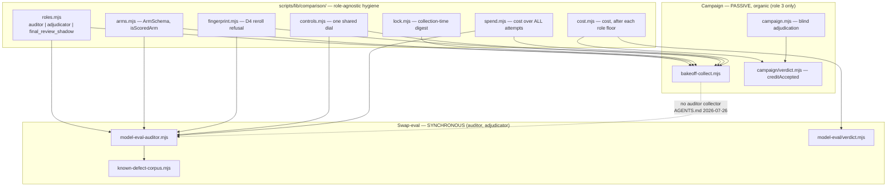

# Plan: Role-Agnostic Model-Comparison Core

- **Date**: 2026-08-14
- **Status**: Draft
- **Author**: Claude + Louis
- **Scope**: backend (CLI + store + one generated dashboard readout line)
- **Target domain(s)**: `scripts`, `shared-lib`, `model-eval`, `dashboard`
- ⚠ **Cross-domain work** — touches 4 domains; the boundary crossings are the
  point of the plan (that is what "extract a shared core" means), but §11's
  clustering must keep each crossing auditable rather than incidental.

## Audit trail

| Gate | Rounds | Result |
|---|---|---|
| GPT (`/audit-plan`) | 3 (default cap) | H 7→6→7, M 1→2→2. **25 of 25 accepted as fix-now — zero dismissals, zero deferrals, zero rebuttals** (100% every round). |
| Gemini (`--mode plan`, mandatory) | 2 of 2 (cap) | R1 `CONCERNS` (2 HIGH) · R2 **`REJECT`** (2 HIGH, 1 MED), coherence `Weak`. 0 wrongly-dismissed both rounds; over-engineering flags none. **All 5 accepted and fixed.** |

**Total: 30 findings, 30 accepted, 0 dismissed, 0 deferred, 0 rebutted.**

> **The `REJECT` was earned, and two of its findings were verified against real
> code before acceptance** (a finding about code I had not read is a hypothesis,
> not a fact):
> - `ORACLE_FLOOR_KEYS = ['minRecall','maxFalsePositiveRate','minF1']` **does**
>   exist in `scripts/lib/model-eval/contracts.mjs (38c52385)` — so the shared
>   scalar `evaluateFloor` this plan's R2/R3 rounds built was mathematically
>   incapable of expressing the auditor's floor. The central abstraction was
>   wrong, and the fix (D2b) **shrinks** the core to `evaluateCost` only.
> - `scripts/campaign.mjs` **does** import `gitShowFileAtRevision` and read at
>   `audited_sha (38c52385)` — so the `realpath`-everything rule I added as a
>   security fix would have broken the adjudicator whenever a cited file moved
>   after its snapshot. Split into `resolveLocalPath` / `resolveGitPath`.
>
> Both were introduced by *my own fixes* in rounds the GPT loop never saw,
> which is precisely what the reviewer said: *"logical gaps introduced by
> Claude's final round of fixes, which GPT did not have the opportunity to
> review due to the 3-round cap."* That is the cap's real cost, stated plainly
> — and it is still the right trade, because a 4th GPT round would have audited
> R3's fixes and produced a 5th round's worth of the same.
>
> **Status stays `Draft` pending a re-gate.** Both caps are spent, so the fixes
> for the REJECT findings have had no independent review. The honest next step
> is `/cycle`'s code audit against a real implementation — not a third Gemini
> round, which the cap exists to prevent and which would re-audit my own edits
> for the fourth time.

**Stop decision — at the cap, and the reason is the shape of the findings, not
their number.** Acceptance stayed at 100% and every finding was a concrete
design defect, which the rule says *permits* a fourth round. Stopping anyway,
because three rounds established a stable pattern: **each round's findings were
manufactured by the previous round's fixes**, and the most common shape was
*"you fixed this for one sibling and not the other."* R2/M1 gave `floor.mjs` a
normalized contract; R3/H6 observed that `spend.mjs`, its sibling in the same
extraction, still had none. R1/H3 and R1/H7 each put `maxAttemptsPerArm` in a
different home, and R2/H2 caught them contradicting. R2/H1's fix for the digest
introduced R3/H7's contradiction in the same table.

That class does not converge by re-reading prose — it converges against code
that runs, which is `/audit-code`'s artifact. Two findings across the three
rounds also caught me **over-building** rather than under-specifying (R2/H6's
reservation protocol, dropped; R3/H1's grammar, which violated a recorded
invariant instead of honouring it), and the right response to those was to
delete design, not add more.

Three defects worth recording because a reviewer would not have found them from
the prose alone: the plan contradicted **REQ-safety-f0ef6d7d** (a real recorded
repo invariant) by making `--manifest` an alternative to `--candidate`; it
described a **branded type** as a safety control in a JavaScript repo, where a
brand is a comment; and it named `scripts/campaign.mjs` as a security-boundary
consumer while omitting it from the file plan entirely.

> **Scope call — `backend`, not `full-stack`.** The only dashboard change is one
> additional readout line (incomplete-snapshot spend) inside an existing pane.
> No new component, flow, or state, so §3/§4/§5/§10 (UX, technical-frontend,
> state map, Playwright acceptance criteria) do not apply. Declaring
> `full-stack` would load three principle sets to justify a string.

---

## 1. Context Summary

**Detected**: stack `js-ts` (+ `postgres`), scope `backend`, no Python.

**The ask.** Compare arbitrary model combinations for *any* LLM role in the
audit chain — including the **auditor** role (GPT vs alternatives) — with the
same apples-for-apples guarantees the final-review role already has, and
without the arm set being hardcoded anywhere.

**What exists today — and the central finding: the capability is already built
twice, in two places that do not know about each other.**

| | Final-review campaign | Model-swap eval harness |
|---|---|---|
| Entry | `scripts/bakeoff-collect.mjs`, `scripts/campaign.mjs` | `scripts/model-eval-auditor.mjs` |
| Role vocabulary | `role: z.enum(['final_review_shadow'])` | `ROLES = ['auditor', 'adjudicator']` |
| Verdict | `scripts/lib/campaign/verdict.mjs` (653L) | `scripts/lib/model-eval/verdict.mjs` (405L) |
| Cost | `armCostUsd` in `scripts/bakeoff-collect.mjs` | `scripts/lib/model-eval/cost.mjs` (265L) |
| Blind scoring | blind DTO + HMAC in `scripts/campaign.mjs` | `scripts/lib/model-eval/blind-judge.mjs` (279L) |
| Collection | **passive**, organic transcripts, N=12 stopping rule | **synchronous**, curated-defect corpus, tiers |
| Arms | declarative, committed `.campaigns/*.json` | `--candidate <spec>` flags |

The two role enums are **disjoint and complementary**: together they name
exactly the three roles in this repo's chain (auditor → GPT, adjudicator →
Gemini, final_review_shadow → Opus/Kimi/Grok). Neither imports the other.
Widening `campaign/config.mjs`'s enum to `'auditor'` — the obvious reading of
the request — would create a **third** overlapping vocabulary and a second
`auditor` that means something subtly different. That is the thing to avoid.

### Code Trace

Pinned to `38c52385`. Read, not inferred:

- **Two role vocabularies.** `scripts/lib/model-eval/contracts.mjs:34
  (38c52385)` — `export const ROLES = Object.freeze(['auditor','adjudicator'])`;
  `scripts/lib/campaign/config.mjs` `CampaignConfigSchema.role` `(38c52385)` —
  `role: z.enum(['final_review_shadow'])`. Neither file imports the other
  (verified by import-list read of both).
- **Campaign hygiene path.** `scripts/bakeoff-collect.mjs::main (38c52385)` →
  `resolveArms({campaignId})` → `deriveArms` (model string → route + env via
  `transportForModel`) → `classifyArmCollisions` (D4 pre-flight
  request-fingerprint refusal, built on `armRequestFingerprint`
  `scripts/bakeoff-collect.mjs:240-242 (38c52385)`) → `computeCollectLock`
  `scripts/bakeoff-collect.mjs:296-314 (38c52385)` → per-arm `runArm`
  `scripts/bakeoff-collect.mjs:1001-1012 (38c52385)` (spawns `gemini-review`)
  → `mintArmRun` `:936-969` → log append → `isCompleteForEntry` → `summarise`
  `:711-800` → `printProgress`.
- **Scored-arm oracle.** `scripts/lib/campaign/config.mjs::isScoredArm
  (38c52385)`, added 2026-08-14, replacing four inline `type !== 'replicate'`
  re-derivations (two in `config.mjs`, two in
  `scripts/lib/campaign/verdict.mjs::assessThresholdSensitivity` and
  `::computeVerdict`).
- **Campaign verdict exports** `scripts/lib/campaign/verdict.mjs (38c52385)`:
  `terminalEvent`, `compareEvents`, `creditAccepted`, `completionMatrix`,
  `armSpend`, `evaluateFloor`, `evaluateCost`.
- **Swap-eval exports** `scripts/lib/model-eval/ (38c52385)`:
  `verdict.mjs::computeVerdict` + `VerdictInputSchema`;
  `cost.mjs::{buildUsageEvent, assembleCostRows, CostRowSchema}`;
  `blind-judge.mjs::{runBlindJudgeProtocol, getJudgeBatchesForRun, SEV_WEIGHTS}`;
  `route-catalog.mjs::{resolveCandidateRoute, resolveEvaluationTier}`;
  `contracts.mjs::{ROLES, TIERS, JUDGE_TIERS, RUN_STATUSES}`.
- **Auditor entry** `scripts/model-eval-auditor.mjs (38c52385)`, 389 lines,
  imports `structured-extractor`, `deterministic-scorer`,
  `known-defect-corpus`, `egress-path-scan`, `model-eval/verdict` — i.e. it
  already has the synchronous execution + oracle half; what it lacks is
  declarative arms and the campaign's hygiene primitives.

**Neighbourhood considered** (`get-neighbourhood`, k=8, refresh
`564c6161`): all 8 candidates banded `review` — nothing cleared this repo's
noise floor, top hit `computeCollectLock` at 0.8229 with
`bandReason: below-noise-floor-near`, cliff 0.013. That is *not* a
"proceed greenfield" signal here: the 8 hits are precisely the symbols this
plan proposes to **move**, so the query confirms the extraction inventory
rather than suggesting reuse. 6 of 8 sit in `scripts/bakeoff-collect.mjs`,
which is the concentration the extraction is meant to break up.

### Field evidence — the first real 4-arm collection, 2026-08-14

Measured, on `.campaigns/final-review-scoped-2026q3.json` (arms `opus`,
`kimi`, `grok`, `gemini-control`), commands in `.audit/bakeoff-log.jsonl`:

| Snapshot | Outcome | Spend |
|---|---|---|
| `fe759bad1e69` | all 4 arms ran → **complete** | $2.94 |
| `1a6e776f92eb` | `grok` `exit 1` → incomplete | $3.43 |
| `e9b3860c5acf` | `opus` `exit 1` → incomplete | $0.73 |

**Actual spend $7.10; $4.16 of it bought no counted snapshot.** The progress
readout reports `total $2.94 ($2.94/snapshot)` because `summarise` sums only
`complete` entries. Per-arm cost on the complete snapshot is wildly asymmetric:
`opus $2.26` (77% of spend) vs `kimi $0.18`, `grok $0.22`, `gemini-control
$0.27`. Thin envelope measures $2.94/snapshot vs ~$5.85 full ($29.24÷5), so
N=12 ≈ $35 — but only if incomplete snapshots stop being silently repaid.

---

## 2. Proposed Architecture

### D1 — One role VOCABULARY, plus a per-mechanism ELIGIBILITY SUBSET (R1/H1)

`scripts/lib/comparison/roles.mjs` owns the single vocabulary:
`ROLES = ['auditor', 'adjudicator', 'final_review_shadow']`. (#5 single source
of truth, #1 DRY.) Two enums cannot share a lock digest, so this is a
prerequisite for everything else.

**But a shared vocabulary is not a shared eligibility set, and conflating them
was a real contradiction in R1 of this plan.** The first draft said both
existing vocabularies "re-export from it; neither keeps a literal list" *and*
that the campaign schema keeps accepting only `final_review_shadow`. Those
cannot both hold: a re-exported `ROLES` contains `auditor`, so
`CampaignConfigSchema` would accept an auditor manifest and route it straight
into the passive collector D3 forbids — and the proposed reference-equality
drift test could never pass. The distinction the design actually needs:

| Concept | Lives in | Contains |
|---|---|---|
| **Vocabulary** — what role names exist | `comparison/roles.mjs` `ROLES` | all three |
| **Eligibility** — which roles THIS mechanism accepts | each consumer | a subset |

So `scripts/lib/campaign/config.mjs` declares
`CAMPAIGN_ELIGIBLE_ROLES = ['final_review_shadow']` and validates against that,
while `scripts/lib/model-eval/contracts.mjs` declares
`SWAP_ELIGIBLE_ROLES = ['auditor', 'adjudicator']`. Neither re-exports `ROLES`
as its own validator.

The drift test is therefore a **subset assertion, not reference equality**:
every eligible set must be a strict subset of `ROLES`, and their union must
equal `ROLES` — so adding a role to the vocabulary without giving it a home
fails, and inventing a role name outside the vocabulary fails. That pair of
assertions is what reference-equality was reaching for and could not express.

> **Eligibility is not manifest support, and the union assertion must not be
> read as coverage (R2/H4).** `adjudicator` is in `SWAP_ELIGIBLE_ROLES`, so the
> union holds — but this plan gives it **no controls sub-schema and no
> declarative-arm execution path**. That is a deliberate v1 boundary, not an
> oversight, and it is independent of everything this plan delivers: the
> adjudicator swap-eval has *never been run* (AGENTS.md records it as pending
> at Phase 14), so there is no operator asking to declare adjudicator arms and
> no evidence about what its controls vocabulary should contain. Designing one
> now would be guessing at a dial set with no user.
>
> To keep the gap honest rather than latent, `ComparisonManifestSchema`
> **refuses `role: 'adjudicator'` with an explicit "not yet supported"
> message**, instead of accepting it and failing later on a missing controls
> schema. The union assertion above proves every role has a *home*; only the
> per-role controls table proves it has a *manifest*.

### D2 — Extract the HYGIENE, not the collector

New `scripts/lib/comparison/` holds only what is provably role-independent —
each item already exists and moves, none is invented:

| Module | Moves from | What it guarantees |
|---|---|---|
| `roles.mjs` | both enums | one role vocabulary |
| `arms.mjs` | `config.mjs` ArmSchema + `isScoredArm` | `control`/`replicate` never scored |
| `lock.mjs` | `computeCollectLock` + `configDigest` | collection-time inputs only; analysis-time fields never orphan paid evidence (canonical input set in D2a) |
| `fingerprint.mjs` | `armRequestFingerprint` + `classifyArmCollisions` | D4: an undeclared reroll is refused **pre-flight** (lesson c) |
| `controls.mjs` | `ControlsSchema` (role-parameterised) | ONE shared dial per campaign (lesson b) |
| `spend.mjs` | `armCostUsd` + `armSpend` | cost over ALL attempts (see D5) |
| `cost.mjs` | `evaluateCost` **only** | cost compared only among arms that already cleared their own floor; unknown cost never selects (D2b) |

#### D2a — The lock's canonical input set, and a compatibility RULE (R1/H7)

A byte-identical golden test pins today's digest and says nothing about which
*future* change should orphan evidence — which is the only judgement the lock
exists to make. The membership rule (stated once, inherited from the completed
campaigns plan): **an input belongs in the lock iff changing it would make
already-collected evidence mean something different.** Applied, per role:

Three columns, because "should be in the lock" and "is in the digest today"
are different questions and conflating them was R3/H7:

| Class | Inputs | Belongs in the lock? | In today's digest? |
|---|---|---|---|
| Ask | role, decision, arms (id+model+mode+type) | yes | **yes** |
| Ask, dials | `reasoningEffort`, and the role's controls sub-schema (`envelopeScope`; `passes`/`scope`/`rounds`) | yes | **yes** (inside `controls`) |
| Ask, resolved | prompt-template hash, output-schema hash, resolved model route | yes | **NO — classified only** |
| Subject identity | corpus revision / `audited_sha`; transcript+sha `snapshotId` | yes | **NO — carried on the snapshot/cohort row instead** |
| Analysis-time | `targetN`, `calibration`, `decisionRule`, matcher version+threshold, `maxAttemptsPerArm` | no | no |
| Environment | pricing table version, evaluation code revision | no, but **recorded** | no |

The two `NO — classified only` rows are the point of the third column. They
*would* change what evidence means, so they belong in a future lock — but
adding them now would change the digest bytes, which contradicts the
byte-identical extraction guard and the recorded campaign-identity invariant.
They are therefore documented, not implemented, and `lockSchemaVersion` is the
mechanism by which a later plan adds them deliberately. Writing them into the
"in the lock" column without that distinction is what made R2's version
self-contradictory.

`maxAttemptsPerArm` is analysis-time (see D5a's note — R1 gave it two homes).

**This table describes the digest's EXISTING inputs; Phase 2 changes none of
them (R2/H1).** The R1 draft asked for a byte-identical golden digest while
simultaneously naming new inputs — which cannot both hold, and would also break
the repo's recorded campaign-collection-identity invariant. Separating the two
concerns:

- **Phase 2 is a pure move.** `configDigest`'s input set, key order and
  precision are untouched, so the committed campaigns' digests are byte-
  identical before and after. That is the extraction's regression guard, and it
  is the *only* thing the golden test asserts.
- **`lockSchemaVersion` is recorded ALONGSIDE the digest, not inside it.** It
  is a column on the cohort row, value `1`. Storing it outside the hash is what
  lets it exist today without changing a single byte, while still giving future
  work a deliberate, greppable way to declare "all prior evidence is
  incomparable" — a bump is a decision someone made, not a side effect of an
  unrelated edit.
- **Any change to the input set itself is out of scope here** and requires that
  bump. This plan does not add prompt-template or route hashes to the digest;
  the table above documents which class each input *is*, so that decision is
  informed when someone makes it.

A second test asserts the classification directly — mutate one input from each
class and assert the digest changes exactly for the `yes` rows — so the
membership rule is enforced rather than merely written down.

**Not moved, deliberately**: `creditAccepted`, `completionMatrix`,
`terminalEvent` stay in `campaign/verdict.mjs`. They are defined over
*adjudication events on organic findings* — a concept the curated-defect oracle
does not have. Moving them would produce a "core" abstraction with one real
caller, which is the over-engineering cliff.

#### D2b — extract COST only; floors stay domain-specific (Gemini/G3)

**The shared `evaluateFloor` is abandoned, and this is the most important
correction in the plan.** R2/M1 gave it a normalized scalar contract —
`scorePerUnit: Record<armId, number>` — and R3/M1 extended the same shape to
cost. That abstraction is *mathematically incapable* of expressing the auditor
role's floor. Verified against the code at `38c52385`:
`scripts/lib/model-eval/contracts.mjs` declares
`ORACLE_FLOOR_KEYS = ['minRecall', 'maxFalsePositiveRate', 'minF1']`, with a
`COMPARATIVE_FLOOR_KEYS` set beside it. Recall and F1 are functions of true
positives, false positives and false negatives; one scalar per arm cannot
encode three counts. A scalar floor would have forced the auditor to lose its
floor semantics or smuggle them past the contract — making the central
extraction goal impossible as designed.

So the floors stay where their domains are:

| Role | Floor lives in | Shape |
|---|---|---|
| `final_review_shadow` | `scripts/lib/campaign/verdict.mjs` | scalar accepted-per-snapshot ratio vs incumbent − margin |
| `auditor` | `scripts/lib/model-eval/verdict.mjs` | multi-dimensional classification (`minRecall`, `maxFalsePositiveRate`, `minF1`) |

**Only `evaluateCost` is shared**, and it can be, because it consumes the
*boolean outcome* of whichever floor applied rather than the floor's internals:

```
evaluateCost({
  clearedFloor:  Record<armId, boolean>,      // each role's own floor decided this
  spendUsd:      Record<armId, number|null>,  // null = unpriced, NEVER 0
  acceptedUnits: Record<armId, number>,       // what the spend bought, role-defined
  ceilingUsdPerAccepted: number | null,
}) -> { perArm: Record<armId, {costPerAccepted: number|null, withinCeiling: boolean|null}>,
        evidence: 'complete' | 'partial' | 'unknown',
        selectable: armId[] }
```

Three rules it enforces, each already load-bearing elsewhere: an arm with
`clearedFloor: false` is **never** `selectable` — floor-before-cost is the
ordering D5 exists to protect, and it survives here precisely *because* cost
never sees the floor's internals; an arm with `spendUsd: null` is
`costPerAccepted: null` and never selectable, since unknown cost must not
select a winner; and zero accepted units yields `null`, never `Infinity`,
because a computable-looking number invites comparison.

This is a **smaller** core than R2/R3 proposed, and a correct one. The lesson
generalises past this plan: **a shared abstraction must be validated against
the most demanding consumer, not the one it was extracted from.** Extracting
from the campaign and assuming the auditor would fit is exactly what produced a
contract the auditor could not express.

**`spend.mjs` keeps its adapter (R3/H6)** — `scripts/lib/model-eval/cost.mjs`
stays the auditor's usage-row producer and gains a `toArmSpend()` projection
into the `Record<armId, number|null>` shape above. Folding the two cost
pipelines into one would collide two irreconcilable notions of "unit".

### D3 — The auditor role gets DECLARATIVE ARMS, not a collector

This is the load-bearing decision, and it is a constraint, not a preference.
AGENTS.md (2026-07-26) states: *"A model swap is SYNCHRONOUS, never a
background window… Passive collection killed arm-eval and produced five false
'window met' reads… **Do not add a sixth collector.**"* Extending
`bakeoff-collect.mjs` to `role: auditor` adds exactly that sixth collector.

So: `scripts/model-eval-auditor.mjs` keeps its synchronous execution and its
curated-defect oracle, and gains the ability to read the **same declarative
arm manifest format** the campaigns use, via the shared core. You get
"compare GPT vs X vs Y for the auditor role, declared in a committed file,
with reroll detection and a shared dial" — without a passive window that
needs elapsed time to be honest.

`CAMPAIGN_ELIGIBLE_ROLES` therefore stays `['final_review_shadow']` (D1).
**The core generalises; the collector does not.** A future role earns a
campaign only when it also earns a shadow, by the rule above.

#### D3a — The auditor CLI grammar (R1/H2)

"Accept a declarative arm manifest" specified nothing enforceable. The
contract:

- **`--manifest` is a DRIVER, not an alternative input (R3/H1).** The first
  draft made it exclusive-or with `--candidate`, which violates the repo's own
  recorded invariant **REQ-safety-f0ef6d7d** — the auditor CLI must refuse to
  execute unless `--candidate` is supplied with a valid `--tier` — and the
  acceptance checklist then enshrined the violating invocation as a test.
  Instead: `--manifest` resolves the arm set and **invokes the existing
  single-candidate execution path once per scored arm**, each with a real
  `--candidate` and the shared `--tier`. The invariant holds unchanged at the
  execution boundary, the manifest is a declaration layer above it, and no
  requirement needs amending. Passing `--candidate` *and* `--manifest`
  together is still an `ArgvError` before any provider call — that pair is
  ambiguous about which arm set was intended.
- **Arm→role mapping is read from the manifest, not inferred**: `decision.incumbent`
  names the incumbent arm's model (already the campaign contract); every other
  scored arm is a candidate; `control`/`replicate` arms are collected and never
  scored (`isScoredArm`).
- **`--tier` still required** and applies to the whole manifest, because it is
  a shared dial — a per-arm tier would measure the tier, not the model
  (lesson b).
- **Expansion is one run PER SCORED ARM, sharing one `comparisonId`**, not one
  aggregate run. `model_eval_runs` rows are per-candidate today and the verdict
  logic reads them that way; one aggregate row would need a schema change this
  plan explicitly defers. The shared `comparisonId` is what makes them a
  cohort.
- **Per-arm failure is terminal for that arm only**: its row reaches a terminal
  status (`failed`), siblings continue, and the comparison reports
  `INCONCLUSIVE` for the failed arm rather than dropping it silently — the same
  rule D5 applies to snapshots.

**`comparisonId` needs persistence, and that is three edits (R2/H3).** A cohort
that exists only in a CLI variable cannot be reconstructed by a later verdict
or history query, so:

1. **Migration** `supabase/migrations/<ts>_model_eval_comparison.sql` — creates
   a **cohort table**, because cohort-level facts have nowhere to live on a
   per-run row (R3/H3): `model_eval_comparisons (id pk, repo_id fk,
   comparison_key, config_digest, lock_schema_version int not null default 1,
   role, subject_ref, created_at, unique (repo_id, comparison_key,
   config_digest, lock_schema_version))`. **`lock_schema_version` is IN the
   unique key (Gemini/G5)**: the whole point of D2a is that a version bump
   leaves `config_digest` byte-identical, so excluding it would make an
   intentional bump collide with the legacy cohort and crash the insert on the
   one operation the column exists to enable. Including it lets the bump create
   a distinct parallel cohort, which is what "prior evidence is incomparable"
   should mean. Then adds `model_eval_runs.comparison_id uuid null` (FK)
   + `arm_id text null` — nullable with no backfill, because an existing
   single-candidate run legitimately has no cohort and `NULL` reads as
   "pre-comparison", which is true — plus an index on `comparison_id`.
2. **Store** `scripts/lib/store/model-eval.mjs` — write both on run creation;
   add a cohort read that returns every arm's row for one `comparisonId`,
   including `failed` siblings. A read that hides failures would make a
   half-collected comparison look complete.
   **The cohort needs the SAME attempt reducer as the campaign (Gemini/G1).**
   `config_digest` is deterministic, so the unique constraint means re-running
   a manifest after a partial failure **reuses the existing cohort** — and
   without a reducer the driver then blindly inserts a second successful row
   for every arm that already succeeded, double-counting the cohort and
   double-charging the operator. D5a solved exactly this for campaigns and I
   did not carry it across; that is the third instance in this plan of fixing
   one sibling and not the other, and it is why the migration below is not
   just two nullable columns.

   So `model_eval_runs` also gains `attempt int not null default 1` +
   `superseded_at timestamptz null`, with `unique (comparison_id, arm_id,
   attempt)` and a partial `unique (comparison_id, arm_id) where superseded_at
   is null`. The reducer is D5a's, verbatim and deliberately not re-derived:
   the highest live attempt is authoritative, a retry supersedes the failed
   attempt in the same transaction that claims N+1, and a **successful** arm is
   never re-run — re-invoking the driver resumes the cohort by running only the
   arms without a live success, which is the resume semantics the campaign side
   already has.
3. **DB-suite enrolment** — `tests/model-eval-comparison-store.test.mjs` must
   be added to `db-test-container.mjs`'s `*_SUITE_FILES` **and** to
   `postgres-parity.yml`, in the same commit. AGENTS.md is explicit that this
   is two edits and never one: a DB-gated suite no runner names skips itself,
   and node reports a suite that never ran as a clean pass. `npm run
   db:enrolment:gate` enforces it.



### D4 — Manifest format is shared; the controls block is role-parameterised

One `ComparisonManifestSchema` with a role-keyed `controls` sub-schema:
`final_review_shadow` → `envelopeScope`; `auditor` → `passes`, `scope`,
`rounds`. `.strict()` throughout, so a dial belonging to the wrong role is a
load-time refusal, not a silently-ignored key (the lesson from
`reasoningEfort`). `reasoningEffort` is required for **every** role — lesson
(b) is role-independent.

### D5 — Spend counts every attempt, including incomplete snapshots

Measured above: 59% of spend was invisible. Three changes, all in
`spend.mjs`:

1. `armSpend` sums arm-runs on **all** snapshots — complete, incomplete, and
   superseded. Effectiveness metrics keep reading complete+live rows only;
   these are different questions and must not share a sum.
2. `printProgress` gains an explicit line: `incomplete-snapshot spend: $X
   (bought no N)`. Silence here is what let $4.16 disappear.

   **The dashboard needs a pipeline, not just a renderer (R1/H4).** R1 listed
   only `sections/campaigns.mjs`; a renderer cannot invent a value. Four
   integration points, which is the same set the campaigns plan already
   identified for this page — and the campaigns plan also recorded that a
   non-`.strict()` Zod object **strips** an undeclared key, so a value can
   vanish silently between collector and renderer:
   `scripts/lib/dashboard/collect-campaigns.mjs` computes it via the shared
   `spend.mjs` (never a second summation); `scripts/lib/dashboard/schema.mjs`
   **declares the key**; the presenter passes it through; the renderer prints
   it. Semantics, stated because "spend" is ambiguous: it is
   **per-cohort under the current lock**, includes superseded and retried
   attempts, and excludes arms whose cost is `unpriced` from the number while
   naming them beside it. A fixture test asserts the value survives the schema
   round-trip — the failure mode being guarded is a silent strip, which renders
   as a confident `$0.00`.

   **The view model, field by field (R2/M2)** — D5 gave the number four
   semantics and Phase 5 declared one key, which leaves the renderer to invent
   the rest:

   | Field | Why it must be its own field |
   |---|---|
   | `cohortDigest` | The number is cohort-scoped; a figure without its cohort is unattributable across a lock change. |
   | `incompleteSpendUsd` \| `null` | `null` = not computable. Never `0` — that is the exact misread this whole line exists to prevent. |
   | `monetaryStatus` : `complete` \| `partial` \| `unknown` | `partial` when some arm is unpriced; without it a partial total renders as a complete one. |
   | `excludedArmIds[]` | Names the arms whose cost is unpriced, so the reader can see WHAT is missing rather than that something is. |
   | `incompleteSnapshotCount` | A spend figure with no denominator cannot be sanity-checked. |
   | empty state | Zero incomplete snapshots renders **"no incomplete snapshots"**, not a `$0.00` row — an absent thing and a zero-valued thing must not look identical. |
3. **Per-arm retry**: a snapshot where 3 of 4 arms succeeded retries only the
   failed arm, against the same `snapshotId` and lock, recorded as
   `attempt N+1` on that arm alone. Discarding three paid arm-runs because a
   fourth returned `exit 1` is the waste; the `attempt` column added
   2026-08-14 already makes it representable.

#### D5a — The attempt reducer (R1/H3)

"Retry only the failed arm" turns one-result-per-arm into an attempt history,
and a history without a reducer is not deterministically reproducible — which
would defeat the lock. The contract, all of it expressed on rows that already
exist:

| Question | Rule |
|---|---|
| Which attempt is authoritative? | The **highest `attempt` with `superseded_at IS NULL`** for that `(cohort, snapshot, arm)`. The partial unique index already guarantees at most one. |
| Failure then success? | Both rows persist. The failed attempt is marked `superseded_at` at the moment the retry is claimed, so exactly one live row remains and history stays readable. |
| Late first attempt racing a retry? | The receipt `wx` claim on `…--<attempt>.receipt.json` is the mutual exclusion; the loser exits. Attempt numbers come from `max(disk, db) + 1`, so a late writer cannot reuse a number. |
| Retry eligibility | Only an arm whose live attempt has `error != null`. A *successful* arm is never re-run by retry — that would be a reroll, and D4's fingerprint check would refuse it. |
| Maximum attempts | `maxAttemptsPerArm`, default **2** (one retry). Bounded because each attempt is paid. **Analysis-time, NOT in `controls` and NOT in the lock** — see the note below. |
| Terminal failure | Exhausting `maxAttemptsPerArm` marks the arm `permanently-failed` for that snapshot. The snapshot stays **incomplete**, is excluded from every denominator, and its spend is reported on the incomplete line. It is never silently retried again on a later invocation. |

Completeness (§2.5b-i) therefore reads *live* attempts only, while spend reads
*all* of them — the same split as D5's first two bullets, applied one level
down.

> **`maxAttemptsPerArm` has exactly one home: analysis-time (R2/H2).** R1 gave
> it two. D5a put it in `controls` — locked, unraisable mid-cohort, so a flaky
> arm could not be rescued — while D2a listed it as analysis-time, append-only
> and watermarked. Materially different policies for the same field, from two
> fixes in the same round; the same "two individually-correct edits that
> collide" shape this repo keeps hitting.
>
**Crash- and concurrency-safety, across two persistence systems (R3/H5).** The
reducer above defines outcomes but not durable transitions, and
`max(disk, db) + 1` deliberately spans the receipt directory and the store —
so the failure modes have to be named:

| Crash point | State left behind | Recovery |
|---|---|---|
| After marking the failed attempt superseded, before claiming N+1 | **Zero live attempts** for that arm — the dangerous one, because completeness reads live rows and would see the arm as absent rather than failed | Supersede and claim are **one transaction**; the supersede is not committed unless the claim succeeds. A crash therefore leaves the failed attempt still live, which is the honest state. |
| After claiming the receipt, before recording the result | An `intent` receipt, no row | Already covered by the existing protocol: `campaign.mjs reconcile` reports it for operator decision and **never auto-retries** — paid-or-not is genuinely unknown, and guessing is the double-charge this protocol exists to prevent. |
| Two runners racing the same arm | Both resolve the same `max + 1` | The `wx` receipt claim is the mutual exclusion; exactly one creates the file, the loser exits. |

The authority split stays deliberate: **the receipt directory is authoritative
for what was *claimed*, the store for what was *recorded*.* A crash is
precisely the window where they differ, which is why attempt resolution must
read both — and why neither alone may be trusted to answer "is this arm done".

> Analysis-time wins, because the membership rule decides it rather than
> preference: **changing a retry budget does not change what already-collected
> evidence means.** A cohort collected at 2 attempts and one collected at 3
> contain the same kind of arm-runs against the same subject under the same
> dials — only the operator's persistence differed. Locking it would orphan a
> whole paid cohort to change a retry count, which is precisely the failure the
> lock's membership rule exists to prevent. So: raising it appends a
> `rule_changed` event, the standings carry the watermark, and the evidence
> survives.

### D6 — Budget guard is a BETWEEN-CALLS STOP, not a hard cap (R1/H6)

`opus` is 77% of spend. A single campaign-level ceiling lets the expensive arm
exhaust the budget before the cheap arms finish, biasing which arms have
evidence. So `controls.budgetUsdPerArm` is per-arm, and exhaustion **stops that
arm and marks the comparison INCONCLUSIVE for it**, never silently reporting a
partial denominator as a result.

**What it can and cannot promise, stated honestly.** R1/H6 is right that a
resolved unit price cannot *prevent* overspend: token usage is known only after
the provider responds, so no pre-flight check can bound a call that is already
in flight. Claiming a hard cap would be the same shape as INC-002 — treating a
configured value as a safety property. The enforceable contract:

- **It is a POST-HOC STOP, with no reservation protocol (R2/H6).** After each
  **billable unit** completes, the arm's cumulative recorded spend is compared
  with `budgetUsdPerArm`; at or over, that arm attempts no further units.
  Worst-case overshoot is **one unit's worth of that arm** — bounded, stated,
  and not zero.
- **The unit is role-defined, or the guard cannot fire at all (Gemini/G2).**
  R2's wording said "after each arm-*snapshot*", which is the passive
  collector's loop — but the auditor evaluates its whole curated corpus in one
  synchronous execution, so a between-snapshots check would **never fire for
  half the roles this plan claims to cover**. A guard that is structurally
  unreachable is worse than an absent one: it reads as protection. So the unit
  is declared per role, and it is the smallest thing each mechanism actually
  finishes:

  | Role | Billable unit | Checked |
  |---|---|---|
  | `final_review_shadow` | one snapshot | between snapshots, in `bakeoff-collect.mjs`'s loop |
  | `auditor` | one corpus case | between cases, inside `model-eval-auditor.mjs`'s batch loop |

  Exhaustion mid-corpus aborts that arm **cleanly** — its partial results are
  retained and its verdict is `INCONCLUSIVE (budget-exhausted)`, never a score
  computed over however many cases happened to fit. A partial denominator
  silently reported as a result is the failure this whole plan is about.
- **The reservation-and-release design is dropped, deliberately.** R1 answered
  "this cannot be a hard cap" by specifying reservations — and that protocol
  needed a state owner, a lease, crash recovery after a reservation but before
  a response, a reconciliation rule against actual usage, and a
  `maxOutputTokens` source the manifest never declared. That is the
  over-engineering cliff: a distributed-lease design to shave one snapshot off
  a worst case, for a local CLI that already records every attempt's real cost.
  The post-hoc stop needs **no new state at all** — it reads the same
  all-attempts sum `spend.mjs` already computes.
- **Unpriced routes**: an arm whose route has no price cannot be
  budget-governed at all, so declaring `budgetUsdPerArm` for it is refused at
  manifest load rather than run under an unenforceable ceiling. This is the
  INC-002 lesson: a ceiling being *configured* must not be mistaken for a
  ceiling being *enforced*.
- **Retries count against the same per-arm budget** (they are paid calls),
  which is the second reason `maxAttemptsPerArm` is bounded (D5a).
- **`armSpend` nullability**: an arm with any unpriced attempt reports
  `costUsd: null` with `costStatus: 'unpriced'` and is **excluded from monetary
  aggregates while remaining visible as a row**. It is never coerced to 0, and
  the readout prints the word `unknown` — the anti-green rule, and the one the
  original NULL-cost incident violated.

### Right-sizing gate

- **Band-aid**: widen `campaign/config.mjs`'s role enum to `'auditor'`, point
  the passive collector at diffs. Cheapest, and wrong twice — it adds the
  forbidden sixth collector *and* a third role vocabulary.
- **Over-engineered**: a plugin architecture with role registries, a DSL for
  factor matrices, dynamic adapter discovery, a unified store schema across
  both mechanisms. No current requirement needs any of it; two roles and two
  mechanisms do not justify a registry.
- **Chosen**: extract seven hygiene modules that already exist, unify the one
  vocabulary that is genuinely duplicated, and give the *existing* synchronous
  auditor harness declarative arms. Every piece serves a current requirement:
  the user asked to compare auditor models without hardcoding, and the field
  run proved the spend accounting is wrong today.

### Security Considerations

`get-incident-neighbourhood` returned **INC-001** and **INC-002**, both
`manual-verification-required`. (⚠ `docs/security-strategy.md` edited since
last refresh — run `npm run security:refresh`.)

- **INC-001 (lexical path classification bypassed by symlink).** Directly
  in scope: the adjudicator's `citedSources` pre-fetch reads operator-reachable
  paths out of a manifest, and an auditor manifest will name corpus/diff paths
  too. Every path resolved by the core MUST go through
  `resolveAndClassify` (realpath-then-classify, fail-closed), never a lexical
  check. The manifest's `id` patterns are defence-in-depth, not the guard.

  **This duty now has an owner, a module and a phase (R1/H5).** R1 asserted the
  requirement and assigned it to nobody, which makes it a comment rather than a
  control — the exact way INC-001 happened the first time (the classifier
  existed; one call site saw the pre-resolution string). So:
  `scripts/lib/comparison/paths.mjs` (Phase 2) is the **single** resolver for
  every manifest-derived path, and no consumer may read a manifest path
  directly. Its contract:

  **Two capabilities, because `realpath` is wrong for half the reads
  (Gemini/G4).** The R2 draft applied `fs.realpathSync` to every path — but
  `scripts/campaign.mjs` imports `gitShowFileAtRevision` from
  `scripts/lib/vcs.mjs` and reads cited files **at `audited_sha`, not from the
  working tree** (verified at `38c52385`). `realpath` resolves against the
  *current* filesystem, so a file deleted, renamed, or turned into a symlink
  after the snapshot would fail resolution — and because the resolver is
  fail-closed, it would refuse a legitimate historical read and mark a true
  finding unverifiable. My own security fix would have broken the adjudicator
  exactly when the repo moved on, which is always.

  | Capability | Used for | Containment via |
  |---|---|---|
  | `resolveLocalPath` | working-tree reads: corpora, diffs, transcript dirs | `fs.realpath` then classify |
  | `resolveGitPath` | historical reads at a revision: cited sources | **`git ls-tree` traversal at that sha** — never touches the host filesystem |

  `resolveGitPath` verifies containment and resolves symlinks *inside the git
  object tree*, so it answers the only question that is meaningful for a
  historical read: what did this path point to **in that commit**. A missing
  blob at that sha is `unverifiable` (the existing §2.5c contract), never a
  refusal and never a false absence. `scripts/campaign.mjs` is wired
  exclusively to the git-aware form.

  | Rule | Behaviour |
  |---|---|
  | Base directory | The repo root. Manifest paths are repo-relative; an absolute path is refused. |
  | Allowed roots | Resolved path must be repo-root-contained — after `realpath` for local reads, after `ls-tree` traversal for historical ones. A symlink escaping the repo is refused, never followed. |
  | Sensitive targets | Delegates to `scripts/lib/sensitive-paths.mjs::resolveAndClassify` — the repo's single classification oracle. Never a fifth implementation. |
  | Missing path | Refused at **manifest load**, before any provider call, so a typo costs nothing. |
  | Failure mode | **Fail-closed**: a resolution error classifies as sensitive and refuses. Never "could not classify, so allow". |
  | TOCTOU | Resolve-and-read once through the same canonical handle; a path is never re-resolved between check and read. |

  Tests live in `tests/comparison-paths.test.mjs`: a symlink into a sensitive
  target, a symlink escaping the repo, an absolute path, a missing path, and
  the negative control that an ordinary in-repo path IS accepted (a resolver
  that refuses everything would pass all four refusal tests).

  **The fields it governs, and the call sites it replaces (R2/H5).** A resolver
  with no declared inputs and no rewired consumers is the INC-001 shape again —
  the classifier existed that time too; one call site simply saw the
  pre-resolution string. So `ComparisonManifestSchema` declares every
  path-bearing field explicitly, and each is typed `RepoRelativePath` (the
  branded type `paths.mjs` returns, so an unresolved string is not assignable):

  | Field | Role | Read by |
  |---|---|---|
  | `subject.corpusPath` | auditor | `scripts/lib/model-eval/known-defect-corpus.mjs` |
  | `subject.diffPath` | auditor | `scripts/model-eval-auditor.mjs` |
  | `subject.transcriptDir` | final_review_shadow | `scripts/bakeoff-collect.mjs` |
  | finding-cited paths (runtime, not manifest) | both | cited-source prefetch in `scripts/campaign.mjs` |

  Those consumers are added to the file plan and to Phase 2 — **including
  `scripts/campaign.mjs`, which R2 named as the cited-path consumer and then
  omitted from the plan (R3/H4)**. Each must take the resolved handle rather
  than re-resolving a string, or the boundary has a hole in exactly the place
  the incident found one. The last row is runtime rather than
  manifest-declared, and is the one most easily forgotten: cited paths arrive
  from *model output*, the least trustworthy source in the system.

  **"Branded type" was a comment, not a control (R3/H4).** This repo is
  JavaScript; a brand enforces nothing at runtime and nothing at build time
  either. `paths.mjs` instead returns a **frozen handle object**
  `{ __resolved: true, abs, rel, classification }`, and every consumer accepts
  the handle — a bare string throws `TypeError` at the boundary rather than
  being read. The guard that this cannot silently regress is a test that greps
  the consumer set for direct `fs.read*` calls taking a manifest-derived value,
  in the same spirit as the repo's existing relocation and client-migration
  guards. A convention nobody can violate accidentally beats a type annotation
  the runtime never sees.
- **INC-002 (env-set treated as a safety gate).** The lesson generalises to
  this plan's budget and role gates: "the variable is set" proves intent, never
  safety. A per-arm budget must be *verified against a resolved price*, not
  assumed because a ceiling was configured.

---

## 6. Sustainability Notes

- **Assumption that could change**: exactly two collection modes (passive,
  synchronous). If a third appears, `comparison/` is the seam it plugs into —
  which is why the split is by *hygiene vs collection*, not by role.
- **Extension point deliberately built**: `roles.mjs` is a list; adding a role
  is one entry plus a controls sub-schema. Adding a *collector* remains
  deliberately hard, per AGENTS.md.
- **Deliberately NOT built**: a shared store schema. `model_eval_runs` and
  `campaign_*` have different lifecycles; unifying them buys nothing today and
  would couple two independently-evolving migration histories.

---

## 7. File-Level Plan

| File | Intent | Purpose |
|---|---|---|
| `scripts/lib/comparison/roles.mjs` | create | The single `ROLES`/`RoleSchema`. Both existing enums re-export. |
| `scripts/lib/comparison/arms.mjs` | create | `ArmSchema`, `isScoredArm`, arm-id pattern. Moved from `scripts/lib/campaign/config.mjs`. |
| `scripts/lib/comparison/fingerprint.mjs` | create | `armRequestFingerprint`, `classifyArmCollisions`. Moved from `scripts/bakeoff-collect.mjs`. |
| `scripts/lib/comparison/lock.mjs` | create | `configDigest` + collection-time lock. Moved from `config.mjs` / `bakeoff-collect.mjs`. |
| `scripts/lib/comparison/controls.mjs` | create | Role-parameterised controls schema; `reasoningEffort` required for every role. |
| `scripts/lib/comparison/spend.mjs` | create | Cost over ALL attempts (D5), per-arm budget (D6). |
| `scripts/lib/comparison/cost.mjs` | create | **`evaluateCost` only** (Gemini/G3). `evaluateFloor` is NOT extracted — each role keeps its own floor, so `scripts/lib/campaign/verdict.mjs` retains the scalar one and `scripts/lib/model-eval/verdict.mjs` retains the F1/recall one. |
| `scripts/lib/comparison/paths.mjs` | create | **The single resolver for every manifest-derived path** (R1/H5) — repo-root containment, `resolveAndClassify` delegation, fail-closed, refuse-at-load; returns a frozen handle, not a string (R3/H4). |
| `scripts/lib/comparison/manifest.mjs` | create | **Owns `ComparisonManifestSchema`** (R3/H2) — composes `arms.mjs` + `controls.mjs` + the path fields; refuses `role: 'adjudicator'` with an explicit not-yet-supported message. |
| `scripts/campaign.mjs` | modify | Cited-source prefetch takes the resolved handle from `paths.mjs` (R3/H4) — named as a consumer in R2 and omitted from the plan. |
| `scripts/lib/model-eval/cost.mjs` | modify | Add `toArmSpend()` projection into the shared spend shape (R3/H6). Stays the auditor's usage-row producer. |
| `scripts/db-test-container.mjs` | modify | **Enrol** `tests/model-eval-comparison-store.test.mjs` in `*_SUITE_FILES` (R3/M2). |
| `.github/workflows/postgres-parity.yml` | modify | **Enrol the same suite** — the second of the two required edits (R3/M2). |
| `scripts/lib/dashboard/collect-campaigns.mjs` | modify | Compute incomplete-snapshot spend via the shared `spend.mjs` (R1/H4). |
| `scripts/lib/dashboard/schema.mjs` | modify | **Declare the incomplete-spend key** — an undeclared key is silently stripped (R1/H4). |
| `tests/comparison-paths.test.mjs` | create | Tier 1: symlink-to-sensitive, repo-escape, absolute, missing — plus the negative control that an ordinary path is accepted. |
| `scripts/lib/campaign/config.mjs` | modify | Re-export from the core; keep campaign-only semantic rules. |
| `scripts/lib/campaign/verdict.mjs` | modify | Import floor/spend from core; keep `creditAccepted`/`completionMatrix`. |
| `scripts/bakeoff-collect.mjs` | modify | Import fingerprint/lock/spend from core; per-arm retry; incomplete-spend line. |
| `scripts/lib/model-eval/contracts.mjs` | modify | Declare `SWAP_ELIGIBLE_ROLES` as a subset of the core `ROLES`; stop declaring its own list (D1). |
| `scripts/lib/model-eval/verdict.mjs` | modify | **Keeps** its multi-dimensional floor; calls the shared `cost.mjs` with `clearedFloor` booleans (D2b). |
| `scripts/lib/model-eval/known-defect-corpus.mjs` | modify | Take the resolved path handle from `paths.mjs`; never re-resolve a manifest string (R2/H5). |
| `scripts/lib/store/model-eval.mjs` | modify | Write/read `comparison_id` + `arm_id`; cohort read includes `failed` siblings (R2/H3). |
| `supabase/migrations/<ts>_model_eval_comparison.sql` | create | Nullable `comparison_id` + `arm_id` on `model_eval_runs`, no backfill; index (R2/H3). |
| `tests/model-eval-comparison-store.test.mjs` | create | DB-gated cohort read/write. **Must also be enrolled in `db-test-container.mjs` AND `postgres-parity.yml`** — two edits, never one. |
| `scripts/model-eval-auditor.mjs` | modify | Accept a declarative arm manifest (D3a grammar); consume core hygiene. |
| `scripts/lib/dashboard/sections/campaigns.mjs` | modify | Render the incomplete-snapshot spend line. |
| `tests/comparison-core.test.mjs` | create | Tier 1: role enum unity, isScoredArm, digest stability, D4 refusal. |
| `tests/comparison-spend.test.mjs` | create | Tier 1: all-attempts sum, incomplete included, per-arm budget, negative controls. |
| `tests/model-eval-auditor-manifest.test.mjs` | create | Tier 1: manifest load, wrong-role dial refused, shared dial enforced. |
| `docs/runbooks/model-campaigns.md` | modify | Document declaring an auditor comparison. |

### 7b. Implementation Phases

- **Phase 1 — One role vocabulary.** Files: `scripts/lib/comparison/roles.mjs` (create), `scripts/lib/model-eval/contracts.mjs` (modify), `scripts/lib/campaign/config.mjs` (modify), `tests/comparison-core.test.mjs` (create).
- **Phase 2 — Extract arms + fingerprint + lock + manifest + the path resolver.** Files: `scripts/lib/comparison/arms.mjs` (create), `scripts/lib/comparison/fingerprint.mjs` (create), `scripts/lib/comparison/lock.mjs` (create), `scripts/lib/comparison/controls.mjs` (create), `scripts/lib/comparison/manifest.mjs` (create), `scripts/lib/comparison/paths.mjs` (create), `tests/comparison-paths.test.mjs` (create), `scripts/bakeoff-collect.mjs` (modify), `scripts/campaign.mjs` (modify), `scripts/lib/campaign/config.mjs` (modify).
- **Phase 3 — Spend correctness + per-arm retry.** Files: `scripts/lib/comparison/spend.mjs` (create), `scripts/lib/comparison/cost.mjs` (create), `scripts/lib/campaign/verdict.mjs` (modify), `scripts/bakeoff-collect.mjs` (modify), `scripts/lib/model-eval/cost.mjs` (modify), `tests/comparison-spend.test.mjs` (create).
- **Phase 4 — Auditor declarative arms + cohort persistence.** Files: `scripts/model-eval-auditor.mjs` (modify), `scripts/lib/model-eval/contracts.mjs` (modify), `scripts/lib/model-eval/verdict.mjs` (modify), `scripts/lib/model-eval/known-defect-corpus.mjs` (modify), `scripts/lib/store/model-eval.mjs` (modify), `supabase/migrations/<ts>_model_eval_comparison.sql` (create), `tests/model-eval-auditor-manifest.test.mjs` (create), `tests/model-eval-comparison-store.test.mjs` (create), `scripts/db-test-container.mjs` (modify), `.github/workflows/postgres-parity.yml` (modify).
- **Phase 5 — Readout pipeline + docs.** Files: `scripts/lib/dashboard/collect-campaigns.mjs` (modify), `scripts/lib/dashboard/schema.mjs` (modify), `scripts/lib/dashboard/sections/campaigns.mjs` (modify), `docs/runbooks/model-campaigns.md` (modify).
- **Close-out (not a phase)**: `npm run skills:regenerate`, `npm run db:enrolment:gate`, `node scripts/setup-postgres.mjs --migrate`, `npm test`, `npm run check`.

---

## 8. Risk & Trade-off Register

| Risk | Mitigation |
|---|---|
| **Extraction changes behaviour silently.** Seven modules move; a subtly different digest orphans the live cohort. | The lock digest is content-addressed — Phase 2 asserts `configDigest` of the committed `.campaigns/*.json` is **byte-identical** before and after the move, as a test, not by inspection. |
| **Role vocabulary and eligibility drift apart** (R1/H1). | Not reference-equality — that was the contradiction. Two assertions: every `*_ELIGIBLE_ROLES` is a strict subset of `ROLES`, and their union equals `ROLES`. A new role with no home fails; an invented role name fails; the campaign accepting `auditor` fails. |
| Per-arm retry double-charges. | Retry writes `attempt N+1` for that arm only, and D5's sum counts all attempts — a retried arm shows *higher* spend, which is the honest direction. |
| Auditor manifest diverges from campaign manifest. | One `ComparisonManifestSchema`; the role-keyed controls block is the only difference, and `.strict()` refuses cross-role dials at load. |
| **Deferred**: unified store schema; a passive auditor collector; migrating the existing bake-off log format. | Each named in §6 with its reason; none blocks the stated requirement. |

---

## 9. Testing Strategy

- **Tier 1 (test-first)**: everything in `scripts/lib/comparison/` — pure,
  deterministic, no LLM. Digest stability, `isScoredArm` over all four arm
  shapes, D4 refusal (and the direction it must NOT fire: a *declared*
  duplicate is allowed), spend sums, per-arm budget arithmetic.
- **Negative controls, mandatory**: every gate here is one whose false-green is
  invisible. Each test asserts the failing direction too — a digest test that
  cannot fail when the digest changes is worthless, and the 2026-08-14
  completeness bug is precisely a check that returned a confident wrong answer.
- **Edge cases from the field**: an arm that errors after siblings succeeded; a
  snapshot with 0 complete arms; an unpriced model (must read `unknown`, never
  0); a manifest naming a dial from another role.
- **Not tested**: provider responses. No whole-provider mock — that tests the
  mock.

### 9a. End-to-end acceptance, as an executable checklist (R1/M1)

"A live run" is not a criterion. The highest-risk changes here are
cross-boundary, which is precisely what the pure-module tests cannot reach, so
the integration check is specified as commands with expected results. Run in
this order; each line's output is the evidence to retain in the ship log.

| # | Command | Expected |
|---|---|---|
| 1 | `node scripts/lib/campaign/config.mjs --selfcheck-relocation` (and each new core module's import test) | `OK` — modules resolve after the move |
| 2 | `node -e "…configDigest(committed scoped campaign)"` | **byte-identical** to the pre-extraction digest recorded in the Phase-2 commit message |
| 3 | `node scripts/bakeoff-collect.mjs --progress --campaign final-review-scoped-2026q3` | `1/12`; a per-arm unique line naming all four declared arms; a non-zero `incomplete-snapshot spend` line (it is **$4.16 today** — a `$0.00` here means the pipeline is wrong, not that the money came back) |
| 4 | Re-collect snapshot `1a6e776f92eb` (grok previously `exit 1`) | only `grok` re-runs; `attempt 2` recorded; opus/kimi/gemini-control NOT re-charged; snapshot flips to complete |
| 5 | `node scripts/model-eval-auditor.mjs --manifest <a 2-arm auditor manifest> --tier screen` | one `model_eval_runs` row per scored arm, all linked to one `model_eval_comparisons` row; the driver issues a real `--candidate` per arm (REQ-safety-f0ef6d7d holds); `--candidate` + `--manifest` together exits `ArgvError` |
| 6 | A manifest naming a symlink into a sensitive target | refused at **load**, zero provider calls, non-zero exit |
| 7 | `npm run dashboard` then grep the generated page | the incomplete-spend line is present with the same value as (3) |

Safe manifest for (5): the two cheapest auditor routes, `--tier screen`, so the
whole check costs well under one final-review snapshot. **Row (6) must be run
before (5) in anger** — it is the only one that can leak.

---

## 11. Execution Clustering

- **Cluster A** — Phases 1–2 — fix-gate: yes
  - Coupling: both are pure extraction over the same seam — the role enum and
    the schema/digest primitives move together, and Phase 2's `configDigest`
    byte-identity assertion is meaningless until Phase 1's enum is the one
    both consumers read.
  - Additional files: `.audit-loop/domain-map.json` (modify),
    `docs/plans/role-agnostic-comparison-core.md` (modify).
    Added 2026-08-14 when `cycle-cluster-scope.mjs` refused the audit envelope
    for out-of-scope edits — correctly, and the refusal is the reason they are
    declared rather than quietly excluded. The domain-map rule is a *direct
    consequence* of this cluster: creating `scripts/lib/comparison/**` makes a
    new subsystem, and the repo requires an explicit rule above the
    `scripts/lib/**` catch-all (the defect that split `lib/cross-skill/**` from
    `cross-skill.mjs` and produced 10 layering violations). The plan file is
    listed because implementing a plan legitimately corrects it — Phase 4's
    `db-test-container.mjs` path was wrong, caught by the Step 0.7 preflight
    before any code ran.
- **Cluster B** — Phases 3–4 — fix-gate: yes
  - Coupling: `spend.mjs`/`cost.mjs` are what the auditor adapter consumes;
    building the adapter against a spend module that is about to change its
    summation rule would audit the wrong contract.
- **Cluster C** — Phase 5 — fix-gate: final
  - Coupling: readout + docs are the only consumers of the finished shape, and
    both are user-visible surfaces best reviewed against the settled core.
- **Final gate**: mandatory consolidated Gemini review over the union diff of
  A–C.
