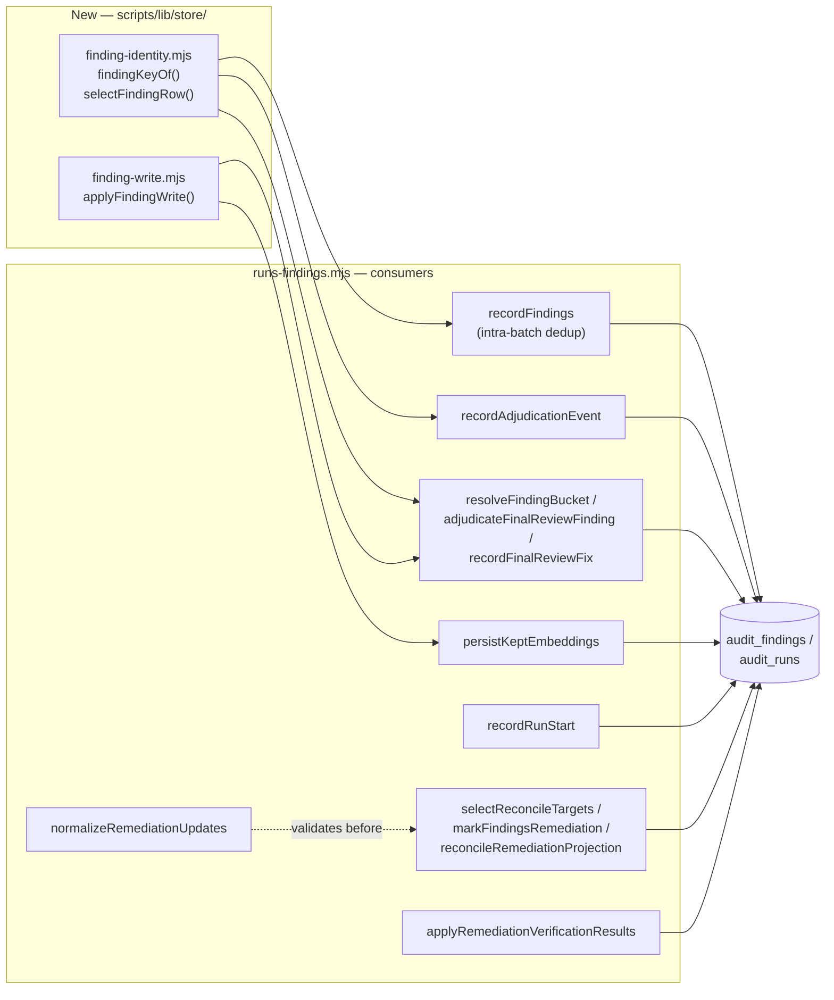

# Plan: `runs-findings.mjs` Identity & Write-Boundary Hardening
- **Date**: 2026-09-25
- **Status**: Approved
- **Author**: Claude + Louis Strydom
- **Scope**: backend
- **Depends on**: none (docs/plans/triage-independence-test-and-write-boundary-fixes.md already landed its two call sites; this plan does not touch `projectRemediationState`'s repo-isolation fix or the severity-truthiness guard it shipped)

## 1. Context Summary

**Detected scope + stack**: backend, `js-ts` (Node ESM), Postgres via `pg` (`detect-stack` → `{"stack":"js-ts","stackKinds":["js-ts","postgres"]}`).

**What exists today**: `scripts/lib/store/runs-findings.mjs` (2,496 lines) is the sole persistence module for `audit_findings`/`audit_runs` — writers, readers, and reconciliation logic for the whole audit-code/audit-plan pipeline. It already contains real hardening discipline in places (`recordFindings`' NOT-NULL write-boundary guard, its `opts.client`-aware rethrow-inside-caller-tx, `applyRemediationVerificationResults`' fail-open-per-action framing, `resolveFindingBucket`'s refuse-to-guess-on-ambiguity contract) — this is not a neglected file, it is an inconsistently-hardened one: the same discipline some functions already have was never generalised into a shared primitive, so newer/adjacent functions repeat the two gaps below instead of reusing a fix.

**Origin of this plan**: `/audit-code` session `audit-code-1790324930` (round 1, `be-services` + `Sustainability` passes) surfaced 19 debt entries against this file while auditing `docs/plans/triage-independence-test-and-write-boundary-fixes.md` (deferred — that plan fixed only `projectRemediationState`/`applyRemediationVerificationResults`'s repo-isolation gap). Read back via `node scripts/debt-review.mjs` is not sufficient (it only sees the local ledger in a fresh worktree); the entries live in the cloud debt store — `repo_id 6461a693-6690-4bf3-98ee-14c0385cc357`, `deferred_run='audit-code-1790324930'`. 4 of the 23 total entries target unrelated SKILL.md documents (broken CLI example, audit-scope drift, session-ID collision, non-reproducible worktree hydration) and are explicitly **out of scope** here.

**Code Trace** (pinned at `8e4f7060`) — every debt-entry claim below was re-verified by reading the live function, not taken on the audit's word:

- `recordFindings` intra-batch dedup, `scripts/lib/store/runs-findings.mjs:700-708 (8e4f7060)` — keys on `fingerprintOf(f)` alone via `seenFingerprints`, while the DB-level upsert conflict target three lines later (`:828-830`) is already `run_id, finding_fingerprint, pass_name, COALESCE(bucket,'')`. The intra-batch loop runs *before* that statement, so a same-fingerprint-different-bucket pair never reaches the correctly-scoped SQL — confirmed real (debt `1b5bce68d2ce`/`883d3001f45f`).
- `resolveFindingBucket`, `:1158-1179 (8e4f7060)` — `SELECT DISTINCT bucket ... WHERE run_id=$1 AND finding_fingerprint=$2`, no `pass_name` filter. Two different-pass_name rows sharing a fingerprint AND the same bucket value (e.g. both `NULL`) collapse to one `DISTINCT` row, so the "ambiguous — refuse" branch (`:1172-1176`) never fires even though the identity is genuinely ambiguous across `pass_name`. `adjudicateFinalReviewFinding`'s `UPDATE ... WHERE run_id=$1 AND finding_fingerprint=$2 AND bucket IS NOT DISTINCT FROM $5` (`:1126-1132`) then matches *every* row with that bucket regardless of pass_name — confirmed real, and worse than the debt entry's wording: it is not just "omits pass_name", the disambiguation guard is silently defeated (debt `49e4b2b29f9f`/`c4a5540210a8`).
- `recordAdjudicationEvent`, `:2069-2073 (8e4f7060)` — `SELECT id FROM audit_findings WHERE run_id=$1 AND finding_fingerprint=$2 [AND pass_name=$n] [AND round_raised=$n] LIMIT 1`, no `ORDER BY`; `if (!finding?.id) return;` on no-match, and the `catch` at `:2087-2089` only logs. Confirmed: a missing finding and a DB failure are both indistinguishable `undefined` to the caller, and a multi-row match picks whichever row Postgres returns first (debt `28d5f3d2fde7`, `8dbc3a738ff8`).
- `selectReconcileTargets` → `markFindingsRemediation`, `:2125-2132` + `:2259-2276 (8e4f7060)` — the reconciler identifies specific divergent `{fingerprint, state}` pairs from a `(repo_id, created_at)`-windowed row set, then `markFindingsRemediation` re-resolves each bare fingerprint via its own query with `ORDER BY f.created_at DESC LIMIT 1` (`:2261-2267`) — explicitly "the newest matching row". If two runs in the 14-day window both raised the same fingerprint and both diverge from the ledger, only the newer is ever touched; the older is silently left unreconciled on every subsequent sweep. Confirmed real, reported independently by both passes (debt `61809b947026`/`08cf3203f120`).
- `recordRunStart`, `:266` and `:312 (8e4f7060)` — `if (existing.repo_id && repoId && existing.repo_id !== repoId)` only refuses reuse when *both* sides are present and differ; either side being unset (a legacy row with a null `repo_id`, or a caller that forgot to thread `repoId`) silently allows reuse. Confirmed still live — this is the exact gap the sibling `triage-independence` plan already closed for `projectRemediationState`, not yet closed here (debt `68dc4939db8b`, umbrella `6706b21a3335`).
- `persistKeptEmbeddings`, `:112-147 (8e4f7060)`, called from `recordFindings:844` with the **same `exec`** the caller may have supplied as a transaction client (`opts.client`). Its own `try`/`catch` per row (`:126-144`) swallows every write error unconditionally — it has no equivalent to `recordFindings`' own `if (opts.client) throw err;` rethrow (`:868`) despite sharing the exact same `exec`. A failed embedding INSERT inside a caller-supplied tx aborts that tx; the swallow reports only `result.failed++`, so the caller's later `COMMIT` silently degrades to `ROLLBACK` with no signal. Confirmed real (debt `3c3f95142582`).
- `applyRemediationVerificationResults`, `:2321-2344 (8e4f7060)` — for `outcome === 'resolved'`, `projectRemediationState(findingId, 'verified', ...)` commits the terminal state first (`:2324`), then a **separate** `UPDATE ... SET remediation_last_checked_at...` stamps the throttle columns (`:2338-2341`). Both are inside one `try` (`:2322-2347`), but they are two independent statements/transactions; if the second throws, the `catch` (`:2345-2347`) logs and moves on — `updated` is never incremented for that row even though the terminal `verified` write already landed. Confirmed real, and the debt entry's framing ("under-counts a verification that actually succeeded") is precise (`a2999cbf144f`).
- `normalizeRemediationUpdates` → `markFindingsRemediation`, `:2147-2158` + `:2251 (8e4f7060)` — `markFindingsRemediation` calls `normalizeRemediationUpdates(updates)` at `:2251`, *before* entering its own per-row `try`/`catch` at `:2259`. `normalizeRemediationUpdates`'s loop calls `updateTargetState(u)` (`:2150`), which reads `u.state` (`:2136`) — a `null` array entry throws `TypeError` here, outside any catch, defeating `markFindingsRemediation`'s documented fail-open-per-row contract (`:2254-2257`). Confirmed real (debt `a6b21fc5011f`, MEDIUM).
- `recordFinalReviewFindings`, `:926-940 (8e4f7060)` — `updateRunMeta` (verdict + model attribution) runs *before* the findings transaction. The function's own comment (`:923-925`) argues the ordering is safe because `updateRunMeta`'s columns are overwrite-idempotent on *retry*. That argument does not cover the case this plan's round-1 audit named: a *first-ever* call whose findings tx then fails (`:979-984` already returns early, correctly skipping the verdict-bearing record) still leaves the *metadata* write standing — a `gemini_verdict` persisted with no findings behind it, and nothing guarantees a retry ever happens. Confirmed real, distinct from the retry-safety the comment actually established (debt `3d77eba7cae1`). **Phase 10 fixes this by reordering, not by re-triage** — see below.
- Oversized module (`43a4ee6f94bb`, MEDIUM): 2,496 lines confirmed via `wc -l`; `.file-size-baseline.json` already grandfathers it (`size:ratchet:gate` blocks further growth, not the existing size).

**Patterns reused vs new**: reuses `withTx`/`query`/`one`/`many` from the existing `db/query.mjs` seam (no new DB client code); reuses the `resolveFindingBucket`-style "refuse to guess on ambiguity" idiom already proven in this file; reuses `recordFindings`' own `opts.client`-aware rethrow idiom. New: two small helper modules (below) that generalise those two idioms so the remaining call sites stop re-deriving them ad hoc.

**Neighbourhood considered** (Phase 0.5, `get-neighbourhood`, target `scripts/lib/store/runs-findings.mjs` + `scripts/lib/durable-write.mjs` + `scripts/lib/concern-identity.mjs`):

| Symbol | File | Domain | Band | Note |
|---|---|---|---|---|
| `recordFindings` | `runs-findings.mjs:662` | `stores` | `precedent` (above-floor-standout) | Self-match — expected; the file is its own strongest precedent for the write-boundary idiom. |
| `durableWrite` | `durable-write.mjs:165` | `shared-lib` | `review` | **Read, not reused as-is** — see below. |
| `registerWriter` | `durable-write.mjs:99` | `shared-lib` | `review` | Same. |
| (concern-identity.mjs did not surface in the top-50 candidates for this query, but was read directly per the task's own pointer) | | | | |

`durableWrite`/`registerWriter` solve a **different** problem — cross-process durability (write-ahead envelope on disk, spill-to-disk-and-replay-later if the process dies mid-write) for orchestrator-facing, best-effort writes. Root Cause 2 below is about **intra-call** atomicity (did this multi-statement SQL operation apply to the expected rows, inside one call, right now) — a lighter, DB-transaction-only concern with no disk envelope needed. The plan borrows `durableWrite`'s **philosophy** (a typed outcome, never a silent swallow, never conflate "not attempted" with "failed") but not its mechanism. `concern-identity.mjs` is the direct precedent for Root Cause 1: a small, single-purpose module whose entire job is "stop re-deriving an identity key ad hoc at each call site" (AGENTS.md: "One exported accessor owns the read" — the duplicate inline predicate in `cross-skill.mjs` is cited there as the reason the drift went undetected).

**Target domain**: `stores` (single domain, `compute-target-domains` → `{"crossDomain":false}`). No cross-domain boundary work.

## 2. Root-Cause Analysis (why two modules, not thirteen patches)

**Root Cause 1 — no canonical finding-identity key.** The real natural key for one `audit_findings` row is `(repo_id, run_id, finding_fingerprint, pass_name, bucket)` — the DB-level unique index in `recordFindings`' own `ON CONFLICT` clause already encodes exactly this (minus `repo_id`, which is reachable via `run_id`). Every *other* read/lookup site re-derives a partial, ad hoc subset of that key: fingerprint alone, or fingerprint+bucket without pass_name, or a bare `LIMIT 1` with no ordering. Six debt entries (`1b5bce68d2ce`/`883d3001f45f`, `49e4b2b29f9f`/`c4a5540210a8`, `28d5f3d2fde7`, `61809b947026`/`08cf3203f120`, `68dc4939db8b`, umbrella `6706b21a3335`) are this ONE gap, worn at six sites.

**Root Cause 2 — no shared write-boundary primitive for intra-call atomicity + verified outcome.** `recordFindings` already has the right idiom (rethrow inside a caller's tx, typed `reason` strings, never treat 0 affected rows as success) but it is bespoke to that one function. Four debt entries (`3c3f95142582`, `a2999cbf144f`, `8dbc3a738ff8`, umbrella `0c3aec5ee550`) are the same gap at sites that never got that idiom.

**Standalone** (do not fold into either primitive): `a6b21fc5011f` (input-validation ordering bug, one-line fix) and `43a4ee6f94bb` (module size — addressed as a byproduct, not a target).

**Design right-sizing** (AGENTS.md gate — this plan introduces two new modules):
- **Band-aid extreme**: patch the six identity sites and four write-boundary sites independently — 10 near-duplicate inline fixes, each free to drift the next time someone touches this file, which is exactly how the file arrived at this state (the discipline `recordFindings` already has never generalised).
- **Over-engineered extreme**: a generic `Repository<T>`-style abstraction — configurable identity schemas, a query builder, pluggable transaction strategies — reusable by every store module in the repo, not just this one.
- **Chosen**: two small, file-scoped helpers sized to the *measured* defect population (13 confirmed bugs, 1 file, 2 repeating shapes) — not a repo-wide abstraction no other module has asked for. If a second store module later exhibits either shape, that is new evidence to promote the pattern; this plan does not pre-guess it.

## 3. Proposed Architecture

### `scripts/lib/store/finding-identity.mjs` (new)

- `coalesceBucket(bucket)` — pure, `bucket ?? ''`, the exact expression `recordFindings`' own `ON CONFLICT (..., COALESCE(bucket, ''))` target already uses (`:829`). **This is a JS-side string-identity helper only — never used to build a SQL predicate.** It exists solely so a caller building a `Set`/`Map` dedup key (Phase 3) or any other JS-side comparison agrees with the DB's unique-index expression. Deliberately distinct from the existing `normaliseBucket` at `runs-findings.mjs:555-557`, which validates/canonicalises a bucket *enum value* — a different concern; this plan does not touch that function and the two must never be conflated or merged.
- `findingKeyOf({runId, fingerprint, passName, bucket})` — pure, builds the canonical compound key **object** (for passing to `selectFindingRow`'s query-building, not for use as a Set/Map key — see below). Every field is **optional except `fingerprint`**; an *absent* field (not present as an own property) means "do not filter on this column at all", which is semantically different from an *explicit* `null` (filter `col IS NOT DISTINCT FROM NULL`) — this distinction is load-bearing for `bucket` specifically (round-2 finding H2): an omitted bucket must let a lookup resolve across every bucket (the existing `recordAdjudicationEvent`/`resolveFindingBucket` behaviour when no bucket is supplied), while an explicit `bucket: null` must match only rows where the DB column is genuinely `NULL` (a primary finding). `findingKeyOf` does **not** coalesce `bucket` — that would destroy exactly this distinction; `coalesceBucket` is a separate, JS-string-identity-only helper (above).
- `findingKeyString(key)` — pure, builds a **string** from a partial key's fields (only the fields the caller cares about — e.g. Phase 3 passes only `{fingerprint, bucket}`), passing `bucket` through `coalesceBucket` first. This is the function Phase 3's intra-batch `Set` actually uses (round-2 finding H1: `findingKeyOf` returns a plain object, and a JS `Set` compares objects by reference — two separately-constructed key objects for the *same* logical finding would never be seen as equal, silently defeating the whole dedup. A `Set<string>` keyed by `findingKeyString`'s output has no such problem).
- `selectFindingRow(client, key)` — the ONE lookup oracle, and the only place a `SELECT` against `audit_findings` for one logical finding is written. Contract:
  - **`runId` is mandatory** in `key` — never a bare fingerprint-only or repo-only query (closes the "unbounded partial lookup" gap: `runId` alone already bounds the candidate set to one audit run, so no separate row cap is needed on top of it).
  - A key field counts as **present** only when `key[field] !== undefined` — **not** merely "is an own property" (round-4 finding H1: a caller building `{runId, fingerprint, bucket: opts.bucket}` from an optional CLI flag the user didn't supply still creates an own `bucket` property whose value is `undefined`; testing own-property-hood alone would treat that as "filter for `bucket IS NULL`" and defeat the search-across-all-buckets behaviour the omitted-field case exists for). `undefined` and "no such property" are one case; **explicit `null` is a different, present, filterable value.** A present field becomes a `col IS NOT DISTINCT FROM $val` predicate (null-safe equality, matching the idiom `adjudicateFinalReviewFinding` already uses today) with the **raw** value — never coalesced. An absent (or `undefined`) field adds no predicate at all. This is what lets an omitted `bucket` search across buckets while an explicit `bucket: null` searches only `NULL` rows (round-2 H2's fix — coalescing to `''` in a SQL predicate would additionally have been wrong on its own terms: `bucket = ''` never matches a `NULL` row in SQL, coalesced value or not).
  - **No `repoId` option** — round 3 (H3) initially had this module offer one, described as existing for "callers with no known `runId`"; round 5 (M2) correctly caught that no phase in this plan actually has such a caller: Phase 4's three callers (`recordAdjudicationEvent`, `adjudicateFinalReviewFinding`, `recordFinalReviewFix`) all already require `runId`, which is already repo-scoping by construction (`audit_runs.repo_id` is a foreign key, so a `run_id`-filtered query cannot cross repos regardless), and Phase 5's row-id path (below) does **not** go through `selectFindingRow` at all — it already has a specific `audit_findings.id` from `selectReconcileTargets` and only needs to *verify* that id's repo ownership, a different operation (a targeted existence/ownership check) from *searching* for a row via a partial key, which is what `selectFindingRow` exists for. Per this plan's own right-sizing gate: no current caller needs a `repoId` option, so `selectFindingRow` does not carry one — a future caller that genuinely resolves findings without a `runId` is new evidence to add it then.
  - Supports an optional `roundRaised` key field (preserving `recordAdjudicationEvent`'s existing optional `round_raised` filter, round-2 finding M2) alongside `passName`/`bucket` — adding a future disambiguating column means adding one more optional field here, never touching a call site.
  - Queries with `ORDER BY created_at DESC` **and then explicitly checks uniqueness**: fetches up to 2 candidates (not 1), and if a 2nd exists whose *unsupplied* key fields differ from the top candidate, returns `{ok:false, reason:'ambiguous', candidates:[...]}` rather than trusting `DESC` to have picked "the" row. `ORDER BY` alone was never a uniqueness proof.
  - Returns `{ok:true, id, ...resolvedKey}` on a clean single match — **critically, the row's `id`**, not just the disambiguating column values, so a caller writes back by `id` (see Phase 4) instead of re-deriving a `WHERE` predicate from column values a second time.
  - Generalises `resolveFindingBucket`'s existing refuse-to-guess contract (#3 Open/Closed). Never a bare `LIMIT 1` (#12 Defensive Validation).
- Replaces the ad hoc `WHERE`-clause construction currently duplicated in `recordAdjudicationEvent` (`:2058-2072`) and the `resolveFindingBucket`/`adjudicateFinalReviewFinding`/`recordFinalReviewFix` trio.

### `scripts/lib/store/finding-write.mjs` (new)

- `applyFindingWrite(client, statement, {expectAffected, isCallerTx})` — runs one statement, verifies its affected-row count against `expectAffected`, and never opens or owns a transaction itself in **either** mode. **`isCallerTx` means exactly one thing: is `client` currently inside an open Postgres transaction (`BEGIN`…`COMMIT`), full stop** — never a proxy for caller intent or ownership semantics. Round 3 caught the round-2 draft naming a false example of the `false` case ("a one-off `withTx` this function's caller opened") — any client inside an open transaction, whoever opened it and for whatever reason, **must** be `isCallerTx: true`; the flag is a fact about the client's current state, not a policy choice:
  - **`isCallerTx: true`** — `client` is inside an open transaction (e.g. `recordFindings`' own `opts.client`, threaded down). A DB error, **or** an under-count against `expectAffected`, **rethrows** — the caller's own `withTx` then rolls back the whole transaction, exactly as `recordFindings`' existing `if (opts.client) throw err` already does for its own statement. This is the only mode where a Postgres-level abort is in play, and only a thrown exception (not a merely-empty result set) triggers one — a 0-row `UPDATE`/`INSERT` is not itself a Postgres error and does not abort anything on its own.
  - **`isCallerTx: false`** (default) — `client` is **not** inside any transaction (a bare pool connection, autocommit per statement — the only shape this mode covers). A DB error or under-count is caught and returned as a typed `{outcome:'not-found'|'failed', affected, error?}` — never thrown, since there is genuinely no transaction to protect. This is `persistKeptEmbeddings`' pool-connection case (Phase 7) and `recordFinalReviewFix`'s standalone conditional UPDATE (Phase 4) — the latter is a **single** statement, which is atomic at the SQL level on its own and needs no explicit `BEGIN`/`COMMIT` wrapper, so `isCallerTx:false` is the *correct* mode for it, not a fallback.
  - On success either way: `{outcome:'written', affected}`.
- Consumers (revised from the round-1 draft — see Phase 8 below for why `applyRemediationVerificationResults` no longer routes through this module): **Phase 4** (`recordFinalReviewFix`'s atomic conditional UPDATE, `isCallerTx:false` — a standalone action, not part of a larger caller transaction) and **Phase 7** (`persistKeptEmbeddings`, `isCallerTx` set from `recordFindings`' own already-computed `!!opts.client`).
- Deliberately **not** `durableWrite`: no disk envelope, no spill queue, no cross-process replay. This is intra-call atomicity only — see the Neighbourhood note above for why the two are not the same problem (#5 Interface Segregation: `finding-write.mjs`'s callers don't need `durableWrite`'s replay/registry machinery, so it isn't forced on them).

## 4. Sustainability Notes

- **Assumption that could change**: the natural key stays `(run_id, finding_fingerprint, pass_name, bucket)`. If a future migration adds another disambiguating column (e.g. a `round` axis becomes load-bearing for identity, not just an optional filter as it is in `recordAdjudicationEvent` today), `finding-identity.mjs` is the one place to extend — every consumer inherits the fix without being touched again (#20 Long-Term Flexibility).
- **God-module decomposition is NOT this plan's net effect, and the round-1 draft overclaimed it (round-5 finding M3)**: Phases 1-2 create new logic in two new files, but most of Phases 3-10 also **add** logic to `runs-findings.mjs` itself (the atomic conditional UPDATE, the `isCallerTx` threading, `projectRemediationState`'s third statement, the null-safety check, two return-value widenings and their caller wiring) — the honest expectation is that `runs-findings.mjs`'s *net* line count is uncertain, plausibly flat or even slightly larger, not a clean 150-250-line shrink. This plan's actual decomposition contribution is qualitative (new logic added *after* this plan lands in two focused modules rather than inline in the god-module, so the NEXT extraction has less to move) rather than a quantitative shrink this plan can promise. Full decomposition (e.g. extracting the reporting/census queries at the bottom of the file, which no debt entry here touches) stays explicitly **out of scope**. **Close-out now runs `npm run size:ratchet:gate` unconditionally** (not only "if it shrank") — `.file-size-baseline.json` blocks unrecorded growth past the baseline for a file already over 1,000 lines, and this plan's own edits could plausibly trip it; a failure here means either finding one more small, genuine extraction to net back under the baseline, or re-baselining upward with the gate's own required justification — decided at implementation time against the gate's real output, not guessed at here.
- **Coupling**: this plan *tightens* internal coupling within `stores` (more callers depend on two new shared modules) while *loosening* it structurally (call sites no longer each own a private, drift-prone copy of the same logic) — the standard shared-helper trade, judged worth it here because the drift already happened once (measured: 13 confirmed bugs from exactly two un-shared idioms).

## 5. File-Level Plan

- **`scripts/lib/store/finding-identity.mjs`** (create) — `coalesceBucket`, `findingKeyOf`, `findingKeyString`, `selectFindingRow`. Depends on: `db/query.mjs` (`one`/`many`). Depended on by: `runs-findings.mjs` (Phase 3 uses `findingKeyString`; Phase 4 uses `selectFindingRow`). Phases 5 and 6 fix the same Root-Cause-1 defect *class* but as local, direct changes to their own existing queries — see each phase for why neither routes through this module. Why: #1 DRY, #10 Single Source of Truth for the sites that do share it.
- **`scripts/lib/store/finding-write.mjs`** (create) — `applyFindingWrite`. Depends on: `db/query.mjs` (`withTx`/`query`). Depended on by: `runs-findings.mjs` (Phases 4, 7). Why: #14 Transaction Safety, #15 Consistent Error Handling.
- **`tests/store-finding-identity.test.mjs`** (create) — unit tests for `findingKeyOf`/`selectFindingRow`, including the ambiguous-match refusal path (Tier 1 per `docs/reference/testing-doctrine.md` — deterministic module, test-first).
- **`tests/store-finding-write.test.mjs`** (create) — unit tests for `applyFindingWrite`'s typed outcomes, including the rethrow-inside-caller-tx path (fake client — no DB needed).
- **`tests/store-finding-write-db.test.mjs`** (create) — live-Postgres integration tests for Phases 7-8's transaction-abort/rollback behaviour (a fake client cannot produce a real Postgres abort). Created and enrolled as part of **Phase 8** (the later of its two covering phases — Gemini's final review caught that this file and its enrolment edits were described in §7 prose but not assigned to a specific phase or listed as modified files here).
- **`scripts/db-test-container.mjs`** (modify) — add `tests/store-finding-write-db.test.mjs` to the appropriate suite list (`ISOLATED_SUITE_FILES` or `DESTRUCTIVE_SUITE_FILES`, decided at implementation time by whether the suite truncates shared tables). Part of Phase 8, per the AGENTS.md two-edits-always rule.
- **`.github/workflows/postgres-parity.yml`** (modify) — the required second edit of that same rule, same commit as the above. Part of Phase 8.
- **`scripts/lib/store/runs-findings.mjs`** (modify) — all phases below.
- **`scripts/lib/outcome-sync.mjs`** (modify) — Phase 4's one production caller of `recordAdjudicationEvent` (`:162`), updated to check the widened `{ok, reason?}` return instead of discarding it.
- **`scripts/lib/final-review/shadow.mjs`** (modify) — Phase 10's one production caller of `recordFinalReviewFindings` (`runShadowAndPersist`, `:617`), updated to check `verdictPersisted` instead of discarding the return value.

### 7b. Implementation Phases

**Phase 1 — Identity primitive**: create `finding-identity.mjs` + its unit tests. No consumers yet. Files: `scripts/lib/store/finding-identity.mjs` (create), `tests/store-finding-identity.test.mjs` (create).

**Phase 2 — Write-boundary primitive**: create `finding-write.mjs` + its unit tests. No consumers yet. Files: `scripts/lib/store/finding-write.mjs` (create), `tests/store-finding-write.test.mjs` (create).

**Phase 3 — `recordFindings` intra-batch dedup**: change `seenFingerprints` (`:701-708`) from a `Set` keyed on `fp` alone to a `Set<string>` keyed on **`findingKeyString({fingerprint: fp, bucket: f.bucket})`** from Phase 1 — a string, never `findingKeyOf`'s object (a `Set` compares objects by reference, so two separately-built key objects for the same logical finding would never collapse — the exact bug round 2 caught in the original draft). `pass_name`/`runId` are already constant for one `recordFindings` call, so they are deliberately excluded from THIS key — `findingKeyString` accepts a partial key by design (see §3); only `fingerprint`+`bucket` vary within a batch, and `bucket` goes through the same `coalesceBucket` normalisation `findingKeyString` already applies internally, so the intra-batch key agrees with the DB-level `ON CONFLICT` target's `COALESCE(bucket, '')`, which is otherwise unchanged. Files: `scripts/lib/store/runs-findings.mjs` (modify).

**Phase 4 — Adjudication/remediation lookup + the `recordFinalReviewFix` race**: `recordAdjudicationEvent` (`:2055-2090`) and `resolveFindingBucket`/`adjudicateFinalReviewFinding`/`recordFinalReviewFix` (`:1096-1263`) adopt `selectFindingRow` from Phase 1, adding `pass_name` to the disambiguation. **The subsequent write targets the resolved row by `id`** (`WHERE id = $resolvedId`), never by re-deriving a `WHERE` predicate from the resolved column values a second time — closing the TOCTOU window between "which row did we mean" and "which row did we actually update" that a re-derived predicate leaves open.

**`recordAdjudicationEvent` concretely widens its own return value** (round-4 finding M1: "adopts `selectFindingRow`" does not by itself change what the function reports — it currently always returns `undefined`, both on success and on every failure path) from `void` to `{ok:boolean, reason?:'no-match'|'ambiguous'|'db-error'}`, mirroring the shape `adjudicateFinalReviewFinding`/`recordFinalReviewFix` already use, replacing the bare `if (!finding?.id) return;` (no-match) and the catch-and-log-only handler (db-error) with distinguishable typed returns. Its one production caller, `scripts/lib/outcome-sync.mjs:162` (`await store.recordAdjudicationEvent(...)`, result currently discarded), is updated to check `ok` and log a distinct warning naming the fingerprint on failure — the same "widen the return AND wire the one real caller" treatment as Phase 10, applied here since round 4 established that pattern generalises.

`recordFinalReviewFix`'s check-then-write race (`:1230-1253`) is folded into one atomic conditional `UPDATE audit_findings SET ... WHERE id = $resolvedId AND user_action IS DISTINCT FROM 'dismissed' AND adjudication_outcome IS DISTINCT FROM 'dismissed' RETURNING id`, run through `finding-write.mjs` with **`isCallerTx: false`** — this is a standalone action (not nested inside a broader caller-owned transaction), so a 0-row result comes back as a typed `{outcome:'not-found', affected:0}`, never a thrown exception. Zero rows is ambiguous between "the row is gone" and "it's now dismissed" — resolving that ambiguity does not change what was WRITTEN (the atomic UPDATE already correctly refused in both cases), only what the caller is TOLD, so a cheap follow-up `SELECT user_action, adjudication_outcome FROM audit_findings WHERE id = $resolvedId` runs *after* a 0-row result purely to classify the reason string (`not-found` vs `dismissed-cannot-be-fixed`) — this read is not part of the atomicity guarantee and its own staleness is harmless (worst case: a slightly-stale explanation for a write that already correctly did or didn't happen). Files: `scripts/lib/store/runs-findings.mjs`, `scripts/lib/outcome-sync.mjs` (modify).

**Phase 5 — Reconciliation identity**: `selectReconcileTargets` (`:2125-2132`) is changed to carry the full row identity it already has visibility into (it queries `f.finding_fingerprint, f.remediation_state` today — extend to also select `f.id`), and `markFindingsRemediation` (`:2249-2277`) accepts an optional row id to address directly instead of always re-resolving "newest row for this fingerprint". `reconcileRemediationProjection` threads the id through. **The optional row-id path is repo-scoped, not trusted bare**: the query joins `audit_findings` to `audit_runs` and requires `r.repo_id = $repoId`, so an id from one repo can never be used to update another's row (closing this path against the same Root-Cause-1 bypass class as every other site in this plan) — matching `selectFindingRow`'s own repo-join contract from Phase 1.

`markFindingsRemediation`'s *other* caller — the ledger-driven `/audit-code` projection, which has no row id — **keeps** the fingerprint-only, `ORDER BY created_at DESC LIMIT 1` "newest row" path, and this plan states explicitly why that is the correct fallback rather than a second unfixed gap: `buildLedgerTerminalIndex` (`:2103-2111`) indexes the on-disk adjudication ledger by `semanticHash`/fingerprint alone — the ledger format itself carries no row-id pointer, so "newest row in the repo-scoped window for this fingerprint" is the best identity available from that caller's actual input. Giving the ledger a row-id pointer is a change to the ledger schema, touched by call sites well outside this file (`write-ledger-entries`, the R2+ suppression ledger, `/audit-code`'s orchestrator) — explicitly out of scope for this plan; see the Risk Register. Files: `scripts/lib/store/runs-findings.mjs` (modify).

**Phase 6 — `recordRunStart` repo-id guard** (operates on `audit_runs`, not `audit_findings` — never a `finding-identity.mjs` consumer by construction, unlike Phases 3-4): close the reuse gap at `:266`/`:312` with a **symmetric** rule — the current guard (`if (existing.repo_id && repoId && existing.repo_id !== repoId)`) only inspects the "both present and differ" case, but a mixed case (one side null, the other set) is refused just as wrongly today, in either direction: `repoId` unset with `existing.repo_id` set short-circuits `false` and reuses just as silently. The fixed rule: **reuse is allowed only when `existing.repo_id` and `repoId` are both non-null and equal, OR both are null/absent** (the genuine single-tenant/local-only case). Any mixed case — one present, one absent — refuses. **The refusal path does not need new run-identity-flow machinery**: it returns `null`, exactly matching what the existing "both present and differ" branch already does at `:268` today — `recordRunStart`'s established contract is that `null` means "proceed cloud-degraded for this call", and every caller already handles it (this is not a new caller obligation the round-2 finding correctly flagged as missing; it is the function's own existing behaviour, now applied consistently to the two mixed cases instead of only the one it already covered). Round 1's draft wrongly suggested "mint a fresh row" for the refusal path, inventing a substitute-runId-propagation problem that does not need to exist — `null`, not a fresh row, is the correct and already-established refusal outcome. **Pre-flight sanity check, not a design gate**: before shipping, run a one-off count of live `audit_runs` rows with a null `repo_id` against the store — a large fraction would mean many in-flight runs suddenly degrade cloud-off for a round, worth knowing before this ships, but it does not change which rule is correct. Files: `scripts/lib/store/runs-findings.mjs` (modify).

**Phase 7 — `persistKeptEmbeddings` tx-awareness**: route its per-row write through `applyFindingWrite` from Phase 2, called with **`isCallerTx: !!opts.client`**. `!!opts.client` is a fact about whether a client was *supplied*, not directly a fact about whether it is inside an open transaction (round-5 finding M1) — but `recordFindings` **already** relies on exactly that equivalence for its own statement, silently, today: its existing `if (opts.client) throw err` (`:868`) only makes sense if "a caller supplied `opts.client`" already means "that client is transaction-scoped and a thrown error there must propagate to the caller's `withTx`". This plan does not introduce that assumption; it **names it as an explicit, documented invariant of `recordFindings`' own contract** — its JSDoc gains the line "`opts.client`, when supplied, MUST be a client from an open transaction; passing a bare pool connection here is a caller bug, not a supported mode" — so Phase 7's `isCallerTx: !!opts.client` inherits an invariant `recordFindings` already required of its callers, made explicit rather than newly invented. When `opts.client` was supplied (a caller-owned transaction, e.g. `recordFinalReviewFindings`' `withTx`), a failed embedding write **rethrows**, so the caller's transaction correctly rolls back — the confirmed bug (a swallowed error masking a poisoned tx). When `recordFindings` fell back to its own pool connection (no caller tx), each row's `INSERT` is independently autocommitted — there is no shared transaction to protect, so a failure there is correctly caught and counted (`result.failed++`), exactly as it already behaves today; forcing a rethrow in that branch would only abort the rest of an otherwise-independent per-row loop for no benefit. This distinction (round-2 finding M3) is the same one `recordFindings`' own `if (opts.client) throw err` already makes for its own statement (`:868`) — Phase 7 threads it one level deeper rather than assuming every call is caller-tx. Files: `scripts/lib/store/runs-findings.mjs` (modify).

**Phase 8 — `applyRemediationVerificationResults` atomicity**: **not** via `finding-write.mjs` — `projectRemediationState` (`:2187-2247`) already opens its own `withTx` wrapping two statements (the `audit_findings` update and the `finding_adjudication_events` update); composing it with a second, separately-transactional throttle-stamp UPDATE through `applyFindingWrite` would mean nesting one transactional unit inside another, which is exactly the transaction-ownership ambiguity `finding-write.mjs` exists to avoid (see §3). Instead, **extend `projectRemediationState` itself** to accept an optional `{throttleStamp: {checkedAtCommit}}` and, when present, run the `remediation_last_checked_at`/`remediation_last_checked_commit` UPDATE as a **third statement inside the same `withTx` callback** (`:2215-2245`). `applyRemediationVerificationResults` (`:2321-2344`) then makes one call instead of two, and its `updated` count reflects the single atomic outcome — a failure anywhere in the transaction rolls back the terminal state too, so "verified but not counted" (the confirmed bug) becomes structurally impossible rather than merely less likely. **Also creates and enrols `tests/store-finding-write-db.test.mjs`** (its live-Postgres transaction-abort assertions for Phases 7-8, per §5/§7 — Gemini's final review caught this test file and its two-edits-always enrolment (`db-test-container.mjs` + `postgres-parity.yml`) as specified in prose but not assigned to a phase). Files: `scripts/lib/store/runs-findings.mjs`, `tests/store-finding-write-db.test.mjs` (create), `scripts/db-test-container.mjs`, `.github/workflows/postgres-parity.yml` (modify).

**Phase 9 — `normalizeRemediationUpdates` null-safety**: reject a `null`/non-object array entry as an invalid input inside the function's existing loop (`updateTargetState` must not be called on a non-object) rather than letting it throw past `markFindingsRemediation`'s per-row `try`/`catch`. One line + a `rejected` entry. Files: `scripts/lib/store/runs-findings.mjs` (modify).

**Phase 10 — `recordFinalReviewFindings` metadata ordering**: move the `updateRunMeta` call (`:926-940`) to run **after** the primary findings transaction (`tx1`, `:963-985`) succeeds, before the shadow transaction. The existing early-return at `:979-984` already correctly skips recording anything further when `tx1` fails — moving the metadata write past that point closes the first-write orphan case (verdict recorded, findings not) the round-1 plan audit identified.

**Round 2 correctly named the mirror-image case this reorder creates**: findings commit, then `updateRunMeta` itself fails — now no verdict/model attribution is stored at all, and the plan cannot lean on retry-idempotence for this direction either (the same argument this plan already used to reject retry-idempotence as sufficient for the *original* direction). This plan does not chase full cross-write-path atomicity for it, and states why explicitly rather than leaving the asymmetry silent: `updateRunMeta` is shared, non-transactional infrastructure used by several *other* unrelated call sites (model-A/B/C shadow assignment, among others) with no atomicity relationship to `audit_findings` writes; retrofitting it to accept an external tx client for every caller, or duplicating its column-existence-probed UPDATE inline inside `recordFindings`' own transaction, would both be larger, riskier changes than this plan's scope — the over-engineered extreme this plan's own right-sizing gate (§2) argues against, for a defect class (a stale/missing verdict, not a *misleading* one) less consequential than the original orphan case it replaces. The right-sized fix pairs the reorder with **observability at two levels**, closing round 3's follow-up (a warning alone gives the operator nothing to act on programmatically): `updateRunMeta`'s widening to `{ok: boolean}` is purely mechanical, **not new error-handling machinery** (round-5 finding H1) — the function already wraps its write in `try { await updateWhere(...) } catch (err) { process.stderr.write(...) }` (`:486-490`) and never throws; the fix only makes that already-caught outcome ALSO a return value: fall through to `{ok:true}` after a successful `try`, set `{ok:false}` in the existing `catch` alongside its existing stderr write. No new exception path is introduced or needs to be. **The independent shadow transaction (`tx2`) is unaffected either way** — it already runs regardless of `tx1`'s cost/metadata bookkeeping today, on the same "a provider-shaped defect here cannot roll back the other half" principle the existing code states for shadow-vs-primary independence (`:986-988`); `updateRunMeta`'s outcome only feeds the function's own return composition, never a gate on whether `tx2` proceeds. `recordFinalReviewFindings` then **widens its own return value on every path** — including the pre-existing `tx1`-failure early return at `:979-984`, currently a bare `return` producing `undefined` — to a consistent `{findingsRecorded: boolean, verdictPersisted: boolean}` (round 4 caught both the missing early-return case and the fact that a widened return value with no reader closes nothing on its own).

**The one real production caller is wired, not left as a hypothetical "the orchestrator" (round-4 finding H2)**: `runShadowAndPersist` in `scripts/lib/final-review/shadow.mjs:617` (`await persistFn(runId, persistPayload);`, return value currently discarded) — confirmed the only non-test call site via a repo-wide search for `.recordFinalReviewFindings(` (a comment-only reference in `gemini-review.mjs:906` had misled the round-1 Code Trace into treating that file as a candidate caller; it is not one). Phase 10 changes that one line to capture the result and, specifically when **`findingsRecorded === true && verdictPersisted === false`** — the genuinely inconsistent state (findings landed, verdict didn't) — emit a distinct, grep-able stderr line naming the run id. `findingsRecorded === false` (the `tx1`-failure path) is a different, already-clean outcome — nothing was written, so there is no inconsistency to flag here; conflating the two into one `verdictPersisted === false` check would have warned on a case that isn't actually broken (a gap Gemini's final review caught). Files: `scripts/lib/store/runs-findings.mjs`, `scripts/lib/final-review/shadow.mjs` (modify).

**Close-out (not a phase)**: `npm test`; `npm run size:ratchet:gate` — run unconditionally, not only on a suspected shrink (round-5 finding M3: this plan's net effect on `runs-findings.mjs`'s line count is not reliably a shrink — see §4). A failure names whether the file grew past its baseline or genuinely shrank; either way, re-baseline via the gate's own documented recipe (do not hand-edit `.file-size-baseline.json`).

### 11. Execution Clustering

- **Cluster A** — Phases 1, 2, 3, 4, 5, 6 — fix-gate: yes
  - **Coupling**: Phase 4 (`recordFinalReviewFix`'s atomic conditional UPDATE) needs **both** `finding-identity.mjs` (Phase 1) *and* `finding-write.mjs` (Phase 2) — it was the round-2 finding H5 that caught the original split (Phase 2 in Cluster B, after Phase 4's consumption of it in Cluster A) as an invalid forward dependency contradicting the plan's own "neither cluster's code depends on the other's" claim. Both primitive-creation phases now land together, before every phase that consumes either of them, so Cluster A is genuinely self-contained: it builds both new modules and every call site that is a *real* consumer of `finding-identity.mjs` (Phases 3, 5, 6) or needs `finding-write.mjs` this early (Phase 4). Reviewing either module apart from a real consumer cannot verify its contract holds end-to-end.
- **Cluster B** — Phases 7, 8, 9 — fix-gate: yes
  - **Coupling**: Phase 7 is `finding-write.mjs`'s second consumer (built in Cluster A, which is fix-gated ahead of B — this is the ordinary "depends on a prior cluster's landed output" case, not a same-cluster forward reference). Phase 9's null-safety fix is small enough to ride along rather than form its own single-phase cluster, and it shares `markFindingsRemediation`'s neighbourhood with Phase 8's `applyRemediationVerificationResults` fix — both touch the fix-lifecycle projection section of the file.
- **Cluster C** — Phase 10 — fix-gate: final
  - **Coupling**: N/A (single phase). Does not depend on either new module — a pure statement-reordering fix — but is kept as its own cluster and held for the consolidated Gemini pass because it is a subtle temporal-ordering change worth an isolated look against the union diff, including whether Clusters A/B's changes to `recordFindings`/`recordFinalReviewFix` (which `recordFinalReviewFindings` calls into) shifted anything relevant to the reordering.
- **Final gate**: consolidated Gemini review over the union diff of Clusters A + B + C.

## 6. Risk & Trade-off Register

1. **`recordRunStart`'s pre-flight null-`repo_id` count (Phase 6)** is not yet run — the symmetric refusal rule itself is settled (§7b Phase 6). Phase 6's refusal path returns `null` (cloud-degraded for that call), **not** a fresh row (stale language from the round-1 draft, caught by Gemini's final review) — so if the count reveals a large fraction of live rows with a null `repo_id`, the risk worth knowing before merging is unexpected cloud-degradation for those runs, not duplicate-row creation.
2. **Deferred**: full decomposition of `runs-findings.mjs` beyond what Phases 1-2 extract. Accepted because no debt entry in this deferred run asks for it beyond the MEDIUM "already grandfathered" entry, and forcing a full split into this plan would multiply its already-large surface for no evidence-backed gain (design right-sizing, §2 above).
3. **Deferred**: giving the on-disk adjudication ledger a row-id pointer, which would let `markFindingsRemediation`'s ledger-driven caller (Phase 5) address a specific row instead of falling back to "newest matching fingerprint". Accepted because the ledger format is shared well outside this file (`write-ledger-entries`, R2+ suppression, `/audit-code`'s orchestrator) — an independent concern this plan's design does not rest on, not a load-bearing gap in Root Cause 1's fix.
4. **Trade-off**: Cluster A and Cluster B both modify `runs-findings.mjs`, so they cannot literally run in parallel without a merge step even though neither's *code* depends on the other's. Sequencing A before B (as listed) is a scheduling choice, not a correctness dependency.

## 7. Testing Strategy

- **Unit (Tier 1, test-first)**: `finding-identity.mjs` — `findingKeyString`'s dedup behaviour (two differently-constructed calls for the same logical `{fingerprint, bucket}` produce equal strings — the direct regression test for round 2's Set-by-reference finding), `coalesceBucket` vs `findingKeyOf`'s deliberate non-coalescing (an omitted `bucket` key produces no predicate; an explicit `bucket: null` differs from an absent one), the ambiguous-match refusal (2-candidate fetch, differing unsupplied field), the "no match" case, the repo-join scoping, the optional `roundRaised` field. `finding-write.mjs` — typed outcomes for both `isCallerTx` modes: `true` rethrows on a DB error *and* on an under-count (construct a fake tx client, assert the error propagates rather than being caught); `false` catches both and returns a typed `{outcome:'failed'|'not-found', ...}` instead.
- **Regression, against a real enrolled DB suite, not fake clients alone**: `tests/adjudication-remediation-propagation-live.test.mjs` is the **existing enrolled home** for exactly this class of assertion — it already proves `recordAdjudicationEvent`'s real write path against a seeded schema (the aged-out finding `879932a9` it guards is the same "pure test green, real write path broken" shape this plan's fixes need to survive). Phases 4, 5, 6, 9's new assertions land there. Phases 7-8 (transaction/atomicity-specific — the rethrow-inside-tx and the merged-statement paths) need a **new** enrolled file, `tests/store-finding-write-db.test.mjs`, because they assert on real Postgres transaction-abort behaviour a mock cannot produce; per AGENTS.md's DB-enrolment invariant this is **two edits, always** — add it to `db-test-container.mjs`'s `ISOLATED_SUITE_FILES` (or `DESTRUCTIVE_SUITE_FILES` if it truncates) **and** `.github/workflows/postgres-parity.yml`, in the same commit as the test file, or it runs in one environment only and `npm run db:enrolment:gate` is the mechanical check that would have caught the omission.
- Concrete outcomes per new/extended assertion (not just "a fixture exists"): Phase 3 — a batch with two same-fingerprint, different-bucket findings persists both rows (`recordFindings(...).rows === 2`, both fingerprints present with distinct buckets in a follow-up `SELECT`). Phase 4 — **the race this fix actually protects against, and only in the one direction it actually closes** (round 2 corrected the original wording: two concurrent `recordFinalReviewFix` calls do not themselves dismiss anything and can both legitimately satisfy the conditional UPDATE's `WHERE`, so that pairing proves nothing; round 3 then caught the corrected version still overclaiming symmetry) is a `recordFinalReviewFix` call racing a concurrent `adjudicateFinalReviewFinding(..., 'dismissed')` on the same row — assert a fix cannot apply once a dismissal has landed (the loser reads `dismissed-cannot-be-fixed`). The **reverse** ordering — a dismissal landing *after* a fix already committed — is explicitly **not** prevented by this plan, and the assertion must not claim it is: `projectRemediationState`'s own existing comment (`:2205-2209`) states the codebase's design is to let that specific contradiction stand and surface it for reconciliation via `classifyFinalReviewOutcome`, on purpose, rather than refuse the write. This plan does not change that. Phase 5 — two divergent rows sharing a fingerprint within the reconcile window both end up reconciled (`reconciled === 2`), not just the newer one. Phase 7 — a forced embedding-INSERT failure with `opts.client` supplied (caller-tx path) causes the caller's subsequent `recordFindings` rows to also roll back (assert zero rows persisted, not partial); a forced failure with **no** `opts.client` (standalone pool path) is caught and counted in `result.failed`, and does **not** abort the rest of that row's siblings in the same batch — both paths need a passing assertion, not just the caller-tx one. Phase 8 — a forced failure on the throttle-stamp statement (now the third statement inside `projectRemediationState`'s own `withTx`) rolls back the terminal `verified` write too (assert `remediation_state` is unchanged, not silently advanced). Phase 9 — `markFindingsRemediation([null, validUpdate])` returns `{updated:1, attempted:1}` instead of throwing.
- **Edge cases**: Phase 6's guard has **five** cases, not three — `(equal-present → reuse)` and `(both-null → reuse)` are pre-existing behaviour, unchanged; `(present ≠ present → refuse)` is the pre-existing branch this plan leaves alone; **`(repoId set, existing null → refuse)`** and **`(repoId null, existing set → refuse)`** are the two cases this plan's fix actually changes (both currently silently reuse) — a unit test for each of the five, and the pre-flight count from the Risk Register before shipping. A batch where every finding is dropped (0 persistable rows) for Phase 3, to confirm the existing early-return at `:773` still fires correctly with the new dedup key. The **original round-1 debt finding's own scenario** — two same-fingerprint, same-bucket rows differing only in `pass_name` (a `'merged'`-pass finding and a `'final-review'`-pass finding sharing an identity) — needs its own explicit assertion against `selectFindingRow`: with `passName` supplied, exactly one resolves; with it omitted, the ambiguous-match path fires (`{ok:false, reason:'ambiguous'}`), rather than the pre-fix silent-collapse-to-one-DISTINCT-bucket behaviour. Phase 10's two failure-ordering cases each need a dedicated assertion: `tx1` fails → no `gemini_verdict` is ever written (the original orphan case, now closed); `tx1` succeeds but `updateRunMeta` fails → findings are queryable, `gemini_verdict` is null, and `recordFinalReviewFindings` returns `{findingsRecorded:true, verdictPersisted:false}` (the accepted, now-surfaced incompleteness).

## 8. Acceptance Criteria

N/A in the `/ux-lock verify` sense — this section's P0-P3/semantic-DOM format is for `/ux-lock verify`-gradeable UI flows, which this backend-only plan has none of. That is not the same as "nothing gates this ship": §7 Testing Strategy is this plan's actual release condition — every phase's concrete assertion listed there, plus `/audit-code` convergence per cluster, is what a reviewer checks before merging. Treat §7, not this section, as authoritative for backend plans.

## 9. Audit Trail

- **GPT deliberation**: 5 rounds (the absolute cap) — H:6→6→3→2→1, M:2→3→2→1→3 (M3 in round 5 was itself a new class, not recurrence), 100% acceptance every round (29/29 findings accepted as fix-now, 0 dismissed, 0 deferred). Stopped at the cap, not at convergence-by-acceptance-rate — the round-5 findings were still concrete design defects (a real error-handling gap, two real internal-consistency contradictions the plan had introduced across earlier rounds, and an unverified quantitative claim), not rigor-pressure or implementation-completeness nits, so this was a genuine 5-round session, not one padded past where it should have stopped.
- **Gemini final review**: round 1 of 2 — **APPROVE**, 0 findings wrongly dismissed across all 5 GPT rounds (independent confirmation the triage above was sound), 3 new LOW findings (stale language in the Risk Register, an unassigned test-enrolment file, an imprecise caller-side check) — all applied directly rather than spending a second Gemini round on trivial polish.
- Round-5 outcomes recorded via the manual `write-code-outcomes.mjs` fallback (no round 6 exists to auto-carry the capture): `runId 5f801e6b-3c73-441a-b0bc-fe410ba47dc8`, 4/4 labelled, cloud=ok.
