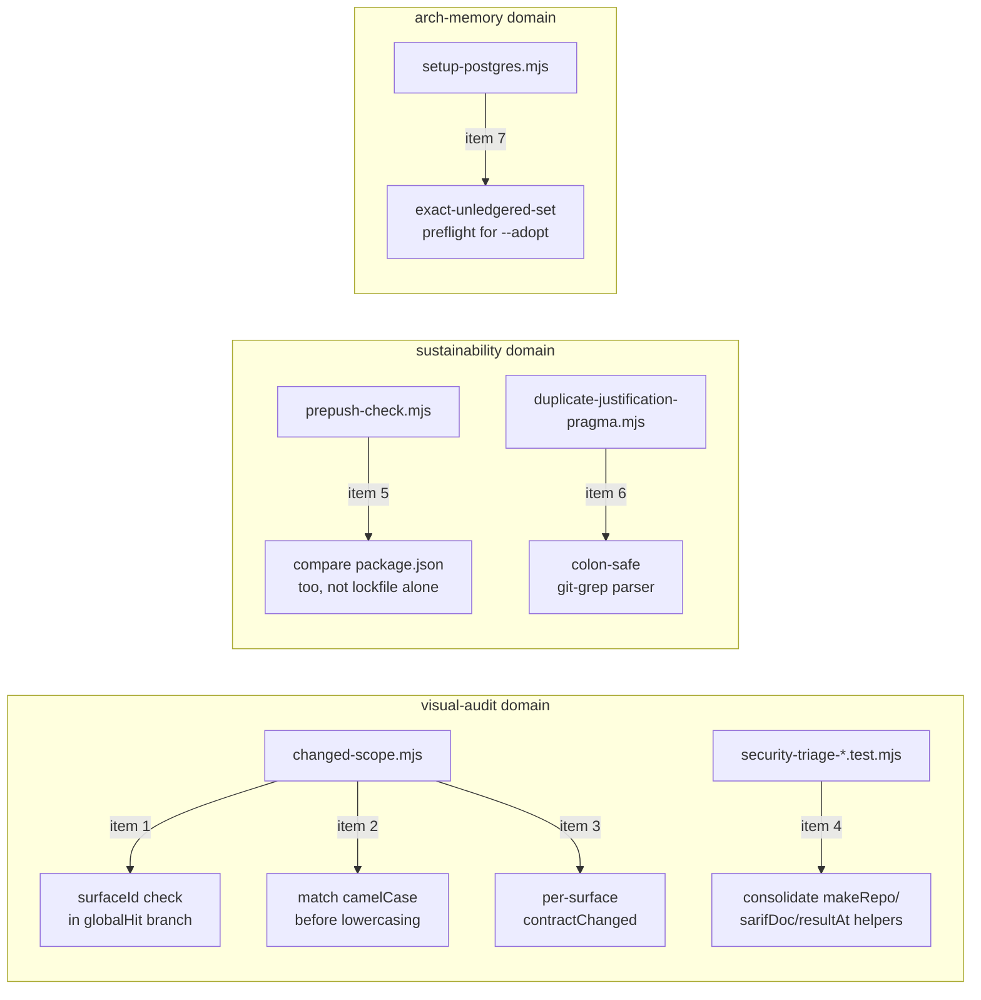

# Plan: Sast-Routing, Sandbox Integrity & Migration-Adoption Hardening (7-item punch list)

- **Date**: 2026-07-24
- **Status**: Draft
- **Author**: Claude + Louis Strydom
- **Scope**: backend

- **Target domain(s)**: `visual-audit`, `sustainability`, `arch-memory`
- ⚠ **Cross-domain work** — touches 3 domains across 5 files. This is NOT new
  cross-domain wiring — each item is a self-contained fix inside its own
  file/function; the domain split reflects that the 7 items came from one
  backlog-reconciliation sweep, not one feature.

## Context Summary

Sibling plan to
[`docs/plans/arch-audit-pipeline-observability-hardening.md`](arch-audit-pipeline-observability-hardening.md)
— see that plan's Context Summary for the full provenance of the
2026-07-24 learning-store backlog reconciliation. This plan collects the 7
surviving findings that cluster around visual-audit's changed-scope gate
logic and build/migration integrity (pre-push sandbox validation, the
git-grep-based duplicate-justification pragma sweep, and
`setup-postgres.mjs --adopt`'s blast radius). The two plans are independent
and can ship in either order.

**Code Trace** (every citation re-verified directly against HEAD on
2026-07-24 by a dedicated investigation agent per finding):

- `scripts/lib/visual/changed-scope.mjs:69` (`if (globalHit) return true;`)
  — returns `true` for every finding including unattributed ones
  (`surfaceId == null`), while the sibling `allSurfaces` branch (line 57)
  explicitly excludes unattributed findings (item 1)
- `scripts/lib/visual/changed-scope.mjs:24` (`familyOfFinding`) — lowercases
  `finding.property` before checking `TOKEN_FAMILIES`, but canonical family
  names are camelCase (`fontSize`, `lineHeight`, `fontWeight`), so
  `'fontSize'.toLowerCase()` → `'fontsize'` fails both the direct check and
  the hyphen-requiring regex fallbacks (item 2)
- `scripts/lib/visual/changed-scope.mjs:40,48,74` — `contractChanged` is a
  single scalar boolean applied uniformly to every finding whose `surfaceId`
  resolves to *any* known surface; it cannot express "only surface X's
  contract changed" (item 3)
- `tests/security-triage-cli.test.mjs:42,47,54` and
  `tests/security-triage-gate-honesty.test.mjs:35,39,43` — `makeRepo`/
  `sarifDoc`/`resultAt` independently defined, near-byte-identical, in both
  suites (item 4)
- `scripts/prepush-check.mjs:148-180` (`provisionNodeModules`) — sandbox
  `node_modules` reuse authorized solely by byte-comparing
  `package-lock.json`; a `package.json` dependency edit unaccompanied by a
  lockfile change is never detected (item 5)
- `scripts/lib/duplicate-justification-pragma.mjs:95` (`^([^:]+):(\d+):(.*)$`)
  — the `git grep -n` output parser assumes a filename cannot contain a
  colon, though colons are valid in POSIX filenames (item 6)
- `scripts/setup-postgres.mjs:908-948` (`runAdopt`) — a whole-DB ledger seed
  with no preflight scoping it to an intended migration;
  `docs/plans/debt-burndown-workstreams.md:216-229` already specs the fix
  ("Exact-unledgered-set preflight + whole-DB `--adopt`") as "Design
  retained for a future adopt-based repair (R3-H2), not built" (item 7)

**Neighbourhood considered**: all seven are surgical fixes inside existing
files — architectural-memory consultation is not applicable per the "pure
bug fix that changes only an existing function's body" exemption.

**Security incident check**: `get-incident-neighbourhood` against the 5
target files surfaced no matching incidents.

## Proposed Architecture

Not a new architecture — a punch list of 7 independent, surgical fixes
inside 5 existing files, grouped into two natural clusters.

## Sustainability Notes

**Right-sizing gate** (item 7, the only item introducing new structure —
a preflight check):

- **Band-aid** — dismiss the finding; `--adopt` has caused no incident to
  date (the one historical unledgered-migration case resolved itself via
  parallel `--migrate` work before `--adopt` was ever invoked in anger).
- **Over-engineered** — build a full interactive per-migration review UI or
  a generalized "partial adopt" mode accepting arbitrary migration subsets.
- **Chosen** — exactly the preflight already designed and written down in
  `docs/plans/debt-burndown-workstreams.md:225-229`: enumerate the
  unledgered set via the same logic `--check-drift` uses, and if it is not
  *exactly* the operator's intended file(s), abort with the full set printed
  rather than silently ledgering all of them. This is implementing an
  already-approved design, not inventing new scope.

**Manual vs scripted**: all 7 fixes are irregular, judgment-heavy,
single-site edits (item 4's helper consolidation touches ~3 near-identical
functions across 2 files — below the ~5-site threshold that would justify a
codemod) — every fix is done by hand.

## File-Level Plan

### Item 1 — `changed-scope.mjs` `globalHit` bypasses surface attribution

- **File**: `scripts/lib/visual/changed-scope.mjs:69`
- **Current**: `if (globalHit) return true;` runs inside the per-finding
  filter with no `surfaceId` check, so a finding with no declared-surface
  attribution (`surfaceId == null`) — or an unknown surface ID — blocks on
  any global-style edit, while the sibling `allSurfaces` branch (line 57)
  explicitly excludes exactly these unattributed findings
  (`f.surfaceId != null && surfaceById.has(f.surfaceId)`).
- **Fix approach**: apply the same attribution check the `allSurfaces`
  branch already uses before the `globalHit` short-circuit returns `true`,
  so an unattributed finding degrades to `unverified`/excluded rather than
  becoming a false gate blocker. (#1 Single Source of Truth — one
  attribution rule, not two divergent ones)
- **Acceptance**: `tests/visual-changed-scope.test.mjs` gains a case for an
  unattributed finding (`surfaceId: null`) under a `globalStyleGlobs` hit,
  asserting it is NOT treated as gate-eligible the way an attributed finding
  is.

### Item 2 — camelCase token-family findings fail matching

- **File**: `scripts/lib/visual/changed-scope.mjs:24` (`familyOfFinding`)
- **Current**: lowercases `finding.property` before checking
  `TOKEN_FAMILIES` (canonical values are camelCase: `fontSize`,
  `lineHeight`, `fontWeight`, `border`). `'fontSize'.toLowerCase()` →
  `'fontsize'` fails the direct `TOKEN_FAMILIES.includes()` check and the
  regex fallbacks (`/font-size/`, `/line-height/`, `/font-weight/`), which
  all require a literal hyphen no longer present post-lowercase.
- **Fix approach**: check `TOKEN_FAMILIES.includes(finding.property)`
  against the raw (non-lowercased) property first; only fall back to a
  case-insensitive/hyphen-tolerant match for legacy hyphenated inputs.
  (#4 No Hardcoding-adjacent — match the schema's actual casing contract
  instead of silently normalizing it away)
- **Acceptance**: a test asserts `familyOfFinding({property: 'fontSize'})`,
  `{property: 'lineHeight'}`, and `{property: 'fontWeight'}` all resolve to
  their correct family (currently failing per the investigation's direct
  repro).

### Item 3 — `contractChanged` cannot express per-surface attribution

- **File**: `scripts/lib/visual/changed-scope.mjs:40,48,74`
- **Current**: the API receives only a boolean `contractChanged`, applied
  uniformly to every finding whose `surfaceId` resolves to *any* known
  surface — it cannot represent "only surface X's contract changed,"
  contrary to the documented eligibility rule that a contract change should
  gate a finding only when that finding's own surface is among the changed
  surfaces.
- **Fix approach**: widen the parameter from a single boolean to a set/map
  of changed surface IDs (or `true` for "all surfaces," preserving the
  existing caller contract where the whole contract changed); gate a
  finding only when its own `surfaceId` is in the changed set. (#4 No
  Hardcoding — represent what actually changed instead of collapsing it to
  a boolean)
- **Acceptance**: `tests/visual-changed-scope.test.mjs` gains a
  multi-surface case: surface A's contract changes, surface B's does not; a
  finding on surface B is asserted NOT gate-eligible via this rule (while a
  finding on surface A is).

### Item 4 — near-identical test-fixture helpers duplicated across two suites

- **File**: `tests/security-triage-cli.test.mjs:42,47,54` and
  `tests/security-triage-gate-honesty.test.mjs:35,39,43`
- **Current**: both suites independently implement `makeRepo`,
  `sarifDoc`, and `resultAt` with near-identical bodies and already-slightly-
  divergent signatures/defaults. `writeFile` was already consolidated into
  `tests/helpers/fixtures.mjs`; these three were not.
- **Fix approach**: move `makeRepo`/`sarifDoc`/`resultAt` into
  `tests/helpers/fixtures.mjs` alongside `writeFile`, reconciling the
  divergent signatures to one shared contract; update both test files to
  import from there. (#1 Single Source of Truth for test-domain helpers)
- **Acceptance**: `makeRepo`/`sarifDoc`/`resultAt` are defined exactly once
  (in `tests/helpers/fixtures.mjs`); both test files import them; both
  suites still pass in full (35/35 CLI, 50/50 gate-honesty, per the
  investigation's baseline run).

### Item 5 — pre-push sandbox `node_modules` reuse ignores `package.json` drift

- **File**: `scripts/prepush-check.mjs:148-180` (`provisionNodeModules`)
- **Current**: `lockChanged` is computed solely by byte-comparing
  `package-lock.json`; if unchanged, the sandbox symlinks `node_modules` and
  never runs `npm ci`. A commit that edits `package.json` dependency
  declarations without touching the lockfile silently reuses dependencies
  that don't represent the commit being checked.
- **Fix approach**: also byte-compare `package.json` (the same pattern
  already used for the lockfile); if either changed, treat as
  `lockChanged` (reinstall), not just the lockfile alone. (#11 Validation —
  the sandbox's authorization check must cover both files a dependency
  change can touch)
- **Acceptance**: a test stages a `package.json`-only dependency edit (no
  lockfile change) and asserts `provisionNodeModules` now triggers a fresh
  install instead of reusing the symlinked `node_modules`.

### Item 6 — `duplicate-justification-pragma.mjs` mis-parses filenames containing colons

- **File**: `scripts/lib/duplicate-justification-pragma.mjs:95`
- **Current**: `const m = line.match(/^([^:]+):(\d+):(.*)$/);` assumes a
  filename cannot contain a colon. POSIX filenames may legally contain
  colons, so a repository-controlled path with one is parsed incorrectly
  during the pragma sweep (the line number and rationale text can shift
  into the wrong capture group).
- **Fix approach**: parse from the right instead of the left — the last two
  colon-delimited segments are always `<line>:<rest>`, so match greedily on
  the filename prefix: `/^(.+):(\d+):(.*)$/` (greedy `.+` consumes any
  embedded colons in the path, leaving the final `:<digits>:` as the
  anchor) — or equivalently split on the LAST occurrence of `:\d+:`. (#11
  Validation — correct parsing of the actual `git grep -n` output grammar,
  not an assumed simplification of it)
- **Acceptance**: a test feeds a `git grep -n`-shaped line for a path
  containing a colon (e.g. `notes:draft.md:12:some text`) and asserts the
  parser recovers the correct filename (`notes:draft.md`), line number
  (`12`), and rest-of-line text.

### Item 7 — `setup-postgres.mjs --adopt` has no scoping preflight

- **File**: `scripts/setup-postgres.mjs:908-948` (`runAdopt`)
- **Current**: `--adopt` is a whole-DB ledger seed — after a schema-manifest
  match, `seedUnledgeredMigrations` records *every* currently-unledgered
  migration as applied. There is no way to scope adoption to one intended
  migration; if any *other* migration happens to be unledgered at the same
  time (unrelated to the one the operator means to adopt), it gets silently
  recorded as applied too, converting a narrow repair into silent schema
  drift. `docs/plans/debt-burndown-workstreams.md:216-229` already specs
  the exact fix as "Design retained for a future adopt-based repair
  (R3-H2), not built."
- **Fix approach**: implement the preflight the plan already designed —
  before seeding, enumerate the unledgered set (the same computation
  `--check-drift` uses) and compare it against an explicit
  `--adopt-only <file[,file...]>` allowlist (new optional flag; omitting it
  preserves today's whole-DB behavior for the common case where the
  unledgered set is already known-empty-or-intended, since this repo's own
  measured state as of 2026-07-18 has zero unledgered migrations). When
  `--adopt-only` is passed and the unledgered set contains anything outside
  it, abort with the full set printed and record nothing — never partially
  seed. (#12 Fail-Closed Validation — matching the plan's own design intent)
- **Acceptance**: a test seeds a disposable DB with two unledgered
  migrations, invokes `runAdopt` with `--adopt-only` naming just one of
  them, and asserts the run aborts with both migration names printed and
  neither is recorded in the ledger; a matching-set invocation (naming both,
  or invoked without `--adopt-only` when the set is empty) still seeds
  correctly as before.

### Implementation Phases

Gate 1 fired (`compute-target-domains` returns `crossDomain: true` across 3
domains, 5 files). All 7 items are independent — items 1-3 share
`changed-scope.mjs` but touch different functions/branches, not an output
dependency — so no Execution Clustering (§11) is needed; work them in any
order, one sitting each.

**Phase 1 — `changed-scope.mjs` gate-correctness fixes (items 1, 2, 3)**:
Files: `scripts/lib/visual/changed-scope.mjs` (modify)

**Phase 2 — consolidate sast test fixture helpers (item 4)**: Files:
`tests/helpers/fixtures.mjs` (modify), `tests/security-triage-cli.test.mjs`
(modify), `tests/security-triage-gate-honesty.test.mjs` (modify)

**Phase 3 — pre-push sandbox `package.json` drift check (item 5)**: Files:
`scripts/prepush-check.mjs` (modify)

**Phase 4 — colon-safe pragma-sweep parser (item 6)**: Files:
`scripts/lib/duplicate-justification-pragma.mjs` (modify)

**Phase 5 — `--adopt` exact-unledgered-set preflight (item 7)**: Files:
`scripts/setup-postgres.mjs` (modify)

**Close-out (not a phase)**: run `npm test` and `npm run check`.

## Risk & Trade-off Register

- **Item 1/3 risk**: both touch the visual-audit CI gate's eligibility
  logic — a false-negative here (a finding that SHOULD block silently
  doesn't) is worse than a false-positive. Both fixes narrow eligibility
  toward the documented intent (attribution-respecting), so the direction of
  change reduces over-blocking, not under-blocking; still verify against
  `tests/visual-changed-scope.test.mjs`'s full existing suite, not just the
  new cases.
- **Item 5 risk**: comparing `package.json` in addition to the lockfile
  increases sandbox-reinstall frequency (a `package.json`-only touch with no
  actual dependency change, e.g. a script-block edit, now triggers a
  reinstall). Accepted — correctness over the marginal CI-time cost; a
  future refinement could diff only the `dependencies`/`devDependencies`
  keys, but that's out of scope here (would be over-engineering this fix).
- **Item 7 risk**: `--adopt-only` is new surface area on a rarely-invoked,
  high-blast-radius command. Default behavior (no flag) is deliberately
  unchanged to avoid breaking any existing invocation; the new safety only
  activates when explicitly requested. Consumer-repo unavailability of
  `--adopt` (a separate, already-spun-off issue per
  `docs/plans/debt-burndown-workstreams.md:1076-1078`) is NOT this item's
  scope.

## Testing Strategy

- Unit tests per item as specified in each item's Acceptance line above.
- Item 7's test needs a disposable Postgres DB per this repo's
  `assertDisposableDbUrl` invariant — never point it at a shared DSN.
- `npm test` full suite must stay green throughout.
- No live-runtime/browser verification needed for items 1-6; item 7 has no
  UI surface either.

## Security Considerations

No sensitive-path or credential-handling code is touched by any of the 7
items (confirmed by the `get-incident-neighbourhood` check above returning
no matches). Item 7's new preflight only changes what `--adopt` is willing
to ledger, not what SQL it executes or what credentials it uses.
