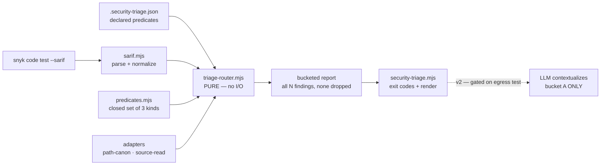

# Plan: SAST Triage — Route, Never Suppress

- **Date**: 2026-07-19
- **Status**: Approved
- **Author**: Claude + Louis Strydom
- **Scope**: backend

---

## 1. Context Summary

**Detected**: scope `backend` · stack `js-ts` · no Python framework.

- **Target domain(s)**: `scripts`, `security`
- ⚠ **Cross-domain work** — touches 2 domains; the CLI lands in `scripts`, the
  logic in `security`. Intentional: mirrors the existing
  `security-memory/` (CLI) + `lib/security/` (logic) split.

### The problem this solves

A consumer repo's Snyk Code run produced **240 results** (a hand-transcribed walk
of the web UI captured only 157 of them — see §2b), of which **~8–10 were
genuinely actionable** — a signal rate under 5%. The bottleneck was never detection;
it was that a human spent hours converting 157 rows into 10 decisions by opening
one data-flow modal at a time in a web UI with no export. Meanwhile every
false-positive *class* had a crisp, mechanically-checkable predicate:

| Class | n | Mechanical predicate |
|---|---|---|
| Hardcoded secret | 14/14 | file under `tests/` |
| Path traversal | 8/8 | source is `process.argv`, file under `scripts/` |
| Weak password hash | 9/9 | `createHash` → cache/dedup key, never auth |
| SQL injection | 4/5 | only the `$N` placeholder *list* is string-built |
| DOM XSS | ~90/108 | every `${…}` passes `esc`/`escapeHtml`/`DOMPurify` |
| ReDoS | 1/1 | "sink" was `caches.match()` — Cache Storage API, not a regex |

> ⚠ **The DOM-XSS row is the one estimate that did not survive measurement.**
> Against the real source it is **3**, not ~90 — a ~30× overstatement, because
> the estimate assumed the sink *is* the template, and in this codebase it
> usually is not. §2d has the measurement and the cause. The other rows held.
> Read this table as the hypothesis the design started from, not as a result.

### What exists today

**Code Trace** — read before designing:

- `scripts/lib/audit/evidence-triage.mjs:589` `runStage0EvidenceTriage` — the
  tiered pipeline's deterministic Stage 0. Pure core + caller-injected adapters
  (`blameAdapter`, `impactAdapter`, `headContentAdapter`); `resolveScopeBucketForFinding:471`
  routes findings into 3 buckets by a restrictiveness ordering.
  → **Pattern to follow, NOT reuse.** It answers *"did the LLM fabricate this?"*.
  We answer *"is this real-but-known-safe?"*. Different question, same shape.
- `scripts/lib/visual/changed-scope.mjs:46` `resolveChangedScope` — the canonical
  gate-eligibility contract. Pure, glob-based, encodes *"scope by impact, not
  authorship"*, and returns empty when `changedPaths == null` so it can never
  false-block. → **Concept reused** for the changed-scope predicate.
- `scripts/lib/sensitive-paths.mjs:214` `resolveAndClassify` — the INC-001
  mitigation: `realpathSync` then re-classify, fail-closed on resolution error
  or repo escape. → **Mandatory dependency** (see §Security Considerations).
- `scripts/lib/claudemd/sarif-formatter.mjs:11` `toSarif` — SARIF **2.1.0** is
  already this repo's vocabulary, on the *output* side. We add the input side.
- `scripts/security-memory/incident-status.mjs:71` `runSemgrepIfNeeded` — an
  existing scanner shell-out with caching and a path-traversal guard on the rule
  ref. Currently **completely dead**: no `semgrep/` rule directory exists and no
  incident in `docs/security-strategy.md` declares a `semgrep:` mitigation (the
  only such strings are the format legend at lines 46–48).
- `scripts/lib/schemas.mjs:37` — finding severity enum is `HIGH|MEDIUM|LOW`.

Patterns **reused**: pure-core-plus-injected-adapters (evidence-triage),
restrictiveness-ordered bucket resolution (evidence-triage), glob scope matching
(changed-scope), canonical path classification (sensitive-paths).
Patterns **new**: SARIF ingestion; predicate-driven routing.

### Field evidence incorporated

`docs/upstream-issues/claude-engineering-skills-feedback-2026-07-19.md` (authored
in the consumer, copied here — this repo is the one it is about) — written from the
same engagement, every item reproduced in practice.
Folded in here: **item 1** (comment-blinded scanner → D3a2), **item 7** (negative
control as a procedure → §9), **item 8** (walk-based test timeouts → §9), and the
**Meta** note confirming Snyk's REST/CLI emits SARIF with full data flow even
though the web UI offers no export — which is the premise D5 rests on.

Its **item 2** independently corroborates this plan's core thesis from a different
scanner: of 121 Supabase advisories, 91 `rls_enabled_no_policy` **INFO** rows were
noise while 3 **ERROR** rows were a live unauthenticated cross-tenant leak —
*"rank by exploitability, not by lint level."* That is D1/D2 restated. Items 2–6
are real but out of scope here; they are tracked separately (§Out of Scope).

### Neighbourhood considered

All candidates returned `recommendation: review` (max similarity 0.668 —
below the 0.75 threshold). Closest: `runTieredAuditPipeline` (0.668),
`normalizeFindingsForOutput` (0.667), `processFindings` (0.662). No reuse or
extend mandate; proceeding greenfield is correct, but the architecture
deliberately mirrors `evidence-triage.mjs` so the two read as siblings.

### Past incidents to verify against

| Incident | Status | Bearing on this plan |
|---|---|---|
| **INC-001** — lexical path classifier bypassed by symlink | `manual-verification-required` | **Directly load-bearing.** Two of our predicates classify by path. A symlink named `tests/mock.js` resolving into `src/` would downrank a real finding. |
| **INC-002** — env-gate that checked "is it set", not "is it safe" | `manual-verification-required` | Bearing by analogy: a predicate that checks "did a rule match" is not the same as "is this finding safe". Drives the route-never-suppress decision. |

---

## 2. Proposed Architecture



### Key design decisions

**D1 — Predicates ROUTE; they never delete.** (#5 SSoT, #16 Graceful Degradation)
The output always contains every ingested finding, each carrying its bucket and a
machine-readable reason. This is the load-bearing decision and it directly answers
the strongest objection raised in design review: *a regex that sees
`DOMPurify.sanitize(varA)` on line 42 will happily dismiss a finding about
unescaped `varB` on that same line.* Under routing, that mistake costs **rank**,
not a missed vulnerability. A wrong predicate is recoverable; a wrong suppression
is INC-002 again.

**D2 — Buckets are ordered by review priority, not by confidence.**
(#5 SSoT, mirrors `SCOPE_BUCKET_RESTRICTIVENESS`)

| Bucket | Meaning | Estimated (prose walk) | **MEASURED** (§2d, real source) |
|---|---|---|---|
| `A unexplained` | No predicate matched. **Review first.** | ~12 | **145 (60%)** |
| `C likely-mitigated` | Heuristic predicate matched — **spot-check, do not trust**. | ~93 | **3 (1%)** |
| `D out-of-reach` | Not reachable from untrusted input (canonicalized path). | ~25 | **92 (38%)** |

The estimate column is kept deliberately, next to the measurement rather than
deleted by it: the gap between the two is the most useful thing this plan
learned, and a table showing only the right answer would hide that the design
was aimed at a distribution that does not exist. `D` beat its estimate 3.7×;
`C` missed its own by ~30×. See §2d.

There are **three** finding buckets, not four (Gemini gate). An earlier draft
listed a `U unverified` bucket, but nothing could ever land in it: run-level
problems (malformed input, `maxResults` exceeded) refuse the run and produce **no**
findings, while finding-level anomalies (unresolvable URI, sink unresolved, clamp
exceeded) explicitly route to `A`. `unverified` is a **run status** (D5a), never a
finding bucket — keeping it in `counts` would have been an unreachable state
advertising a distinction the design does not make.

`C` sits deliberately *above* `D`: the sanitizer predicate is the one that can be
wrong in the dangerous direction, so it never reaches the bottom bucket.

**There is no trust-assertion bucket in v1** (audit R1-H1). An earlier draft
declared one for the server-set `isHtml` case, but no shipped predicate could
produce it, and making it real requires a source-context fingerprint so an
assertion goes stale when the code moves — which is precisely the content-keyed
allowlist mechanism this plan deferred as unvalidated. Those ~2 findings stay in
`A` and get read by a human. Correct outcome, zero new machinery.

**D3 — Only three predicate kinds ship in v1, and each is decidable from the
SARIF location plus the source at that location.** (#4 No Hardcoding, #20 Flexibility)
No taint analysis, no AST, no expression language — a closed set parameterized by
config, which is *not* a policy DSL:

1. `path-scope` — **two independent signals that must agree** (see §2b): the
   producer's own test-context classification (Snyk encodes it as a `/test` rule-ID
   suffix; 39.6% of the real corpus) AND the canonicalized path matching a declared
   non-reachable glob. Both agree → `D`; they disagree → `A`. Decidable without
   reading source.
2. `sink-mismatch` — `(ruleId, sinkFunction)` pair is on a declared
   known-mislabel list → `D`. Covers ReDoS 1 + blob-download 2.
3. `sanitizer-wrapped` — every interpolation in the sink region matches a
   declared sanitizer allowlist → `C`. Covers XSS ~90.

**D3a0 — Which SARIF location is the claimed sink** (audit R2-H1 — the primary
location is *not* reliably the sink). Snyk Code, Semgrep, and CodeQL all emit
data-flow results whose `result.locations[0]` may be the taint **source**, an
assignment, or a diagnostic anchor, while the sink is the terminal step of a code
flow. Resolution order, applied per finding and recorded in its diagnostics:

1. Collect the terminal `physicalLocation` of **every** `threadFlow` across
   **every** `codeFlow` (audit R3-M3 — taking `codeFlows[0].threadFlows[0]` was
   arbitrary when a result carries several). If they all agree on one
   `(uri, startLine)` → that is the sink.
2. Else if `result.locations` has exactly one entry → that entry is the sink.
3. Else (no locations, or terminal steps that **disagree**) → **sink is
   unresolved**: both `sanitizer-wrapped` and `sink-mismatch` return no match, and
   the finding routes to `A` with reason `sink-unresolved`.

A sink in a **different file** from the primary location is normal and fully
supported — cross-file source→sink flow is the common case, and an earlier draft
wrongly rejected it (R3-M3). Only genuine *disagreement between terminal steps*
is unresolvable.

Both source-reading predicates consume `sinkLocation`, never the primary location
directly. Rule 3 is the honest default: a predicate that cannot identify the sink
must not pretend to have evaluated it.

**D3a — `sanitizer-wrapped` v1 specification** (audit R1-H4 — this is the
load-bearing predicate, so its boundary is spelled out rather than implied):

- **Sink region** = `sinkLocation.region` per D3a0, expanded to whole lines,
  clamped to `maxSinkLines` (default **12**). A region that would exceed the clamp
  yields **no match**.
- **Supported sink forms** (v1, closed): a template literal, or a
  `+`-concatenation of string literals and identifiers, appearing on the region's
  lines. Anything else — call chains, ternaries, spreads, JSX — is unsupported.
- **Interpolation extraction**: `${…}` spans in a template literal; non-literal
  operands in a concatenation. Nesting depth > 1 is unsupported.
- **Sanitizer matching**: an interpolation matches iff its *outermost* call
  expression's callee name is in the declared `sanitizers` list. Bare identifiers,
  member expressions not in the list, aliases, and re-assignments do **not** match.
- **Every unsupported, ambiguous, multiline-truncated, or unreadable case returns
  NO MATCH**, which routes to `A`. The predicate can only ever *demote*; it can
  never rescue a finding it failed to parse.

**D3a2 — Comments and string-literal contents are stripped from the sink window
BEFORE any extraction, and this is a first-class requirement, not a detail.**
(Field evidence: `docs/upstream-issues/claude-engineering-skills-feedback-2026-07-19.md` item 1.) A consumer's `innerHTML` contract scanner located its template by
index-scanning for the first backtick in a 60-line window. An explanatory **code
comment** that quoted an identifier in backticks won the scan; the scanner hashed
a fragment of the comment and the real unescaped sink **disappeared from detection
entirely**.

Three properties of that failure make it the exact hazard this predicate faces:

1. **It failed open** — the site vanished rather than erroring.
2. **It looked like success** — the content-keyed allowlist then reported the
   entry as *stale*, i.e. "this debt was paid down", the signal a developer is
   trained to celebrate.
3. **It defeated the negative control** — reverting the fix left the test green,
   because the detector could no longer see the site at all.

Our `sanitizer-wrapped` predicate reads a source window and looks for `${…}` and
sanitizer call names — a comment containing either would corrupt the analysis the
same way, and the corruption would *demote* a real finding to `C`. Therefore:
strip line and block comments and string-literal bodies from the window first;
if stripping cannot be done unambiguously (an unterminated block comment or
template inside the clamp), return **no match** → `A`.

**D3b — All predicates are evaluated; one bucket is selected by an explicit
ordered resolver.** (audit R1-H4) Every predicate runs against every finding and
its evidence is retained in the report. The final bucket is the **most
conservative** (lowest-lettered) among the matches, mirroring
`SCOPE_BUCKET_RESTRICTIVENESS` — so a finding matching both `sanitizer-wrapped`
(`C`) and `path-scope` (`D`) lands in `C`. Ties are impossible: the ordering is
total.

**Deliberately NOT implemented in v1**: the SQL bound-parameter predicate and the
non-adversarial-hash predicate. Both require following a *value* to its use, which
regex cannot do honestly. Those 13 findings stay in bucket `A` — correctly, since
one of the 5 SQLi findings *was* a real deviation.

**D4 — No LLM in v1. The tool is fully deterministic.** (audit R2-H4; #15 Error
Handling, gate-honesty doctrine) An earlier draft made LLM contextualization of
bucket `A` both architectural and "optional", without saying whether it shipped —
which left SC2's egress enforcement and the provider-payload capture test with no
implementation target. Resolved by **cutting it**: v1 ingests, routes, and reports,
and calls no model at all.

This is the right-sized call, not a punt. The measured bottleneck was converting
157 rows into 10 decisions — ranking solves that; prose about the top 10 does not.
And the doctrine reason stands independently: in this same consumer, a plan-authored
security remediation (`rejectUnauthorized: true`) was statically plausible and
would have caused a production outage — the correct fix required pinning a root
CA, and only measurement caught it. A deterministic v1 has no branch where a model
can emit "clean", because there is no model.

When contextualization is added later it inherits a **precondition**, recorded
here so it cannot be skipped: the SC2 gate-2 provider-payload check must exist and
be tested *before* the first provider call is written.

**D5 — v1 input contract: `--sarif <file>` ONLY.** (audit R1-H3) An earlier draft
described the CLI as both running a scanner *and* ingesting an operator-produced
file, which left "scanner failure" undefined in file-ingest mode. Resolved: the
CLI **never executes a scanner** in v1. The operator produces the SARIF
(`snyk code test --sarif > out.sarif`, or Semgrep, or CodeQL) and passes the path.
This keeps the tool scanner-agnostic, keeps tokens out of our process, and makes
the failure model tractable. Scanner execution is deferred, not implied.

**D5a — One run-status state machine; exit-code precedence is total.** (#16, #19)
Statuses are mutually exclusive and evaluated in this order — the first match wins:

| Order | Run status | Exit | Condition |
|---|---|---|---|
| 1 | `config_invalid` | `6` | Config missing a required field, or a malformed glob. |
| 2 | `input_unreadable` | `4` | `--sarif` path absent, unreadable, or exceeds `maxSarifBytes`. |
| 3 | `input_malformed` | `5` | Not valid SARIF 2.1.0, or Zod validation fails. |
| 4 | `unverified` | `4` | Parsed, but **zero** results — a real scan finds *something* to say; zero is indistinguishable from a scanner that did not run. Never `0`. |
| 5 | `needs_review` | `3` | Bucket `A` is non-empty. |
| 6 | `routed_clean` | `0` | ≥1 finding parsed, bucket `A` empty. **The only success state**, and it explicitly means "everything routed to C/D", never "no findings". |

`0` is therefore unreachable from an empty, failed, or unparsed input by
construction — the property the gate-honesty tests assert.

---

## Security Considerations

**SC1 — Every path from the SARIF must be canonicalized before any path
predicate runs (INC-001).** SARIF is *external, untrusted input*: it names paths
we then make a security decision about. `resolveAndClassify(p, {repoRoot})` is
mandatory; a path whose canonical target escapes `repoRoot`, or fails to resolve,
is **fail-closed → bucket `A`**, never `D`. A lexical `startsWith('tests/')` check
here would reintroduce INC-001 verbatim.

**SC2 — Sensitive source is never read, and the egress gate is a precondition on
v2** (audit R1-H2, narrowed by R2-H4's cut of the LLM). A finding located in
`.env`, a credential file, or a symlink resolving to one matches no predicate and
lands in bucket `A` — historically the bucket eligible for external
contextualization. With no provider in v1, one gate is live and one is a
documented precondition:

1. **LIVE — before any source read**: classify the resolved target with
   `resolveAndClassify`. A `sensitive`, `resolutionFailed`, or `escapedRepo`
   target is **never opened**; the finding keeps its location, gets no source
   context, and is marked `contextWithheld`. This matters even without a provider,
   because the report file itself carries snippets and gets pasted into issues,
   PRs, and chat.
2. **PRECONDITION for v2** — the first provider call must be preceded by passing
   the *complete* payload (snippets, messages, paths, rule help, derived context)
   through `sensitive-egress-gate.mjs` with canonical provenance, and by the
   payload-capture test that asserts absence. Recorded as a gate on the follow-up,
   not as v1 scope.

**Redaction covers EVERY externally-supplied field, not just snippets** (audit
R3-H3). Withholding the source read is not sufficient: SARIF carries
`region.snippet` and `contextRegion.snippet` inline, and a hardcoded-secret rule's
`message.text` routinely quotes the matched literal. Since the renderer consumes
only `TriageReport`, an unredacted `message` or verbatim `rawLocation` would carry
a secret straight to stdout, a saved report, an issue, or a chat paste — defeating
gate 1 entirely.

Therefore every externally-supplied field is passed through
`lib/secret-patterns.mjs` — but at **two** points, because they arrive at two
different phases (Gemini gate G2: an earlier draft said "all three redacted at
ingestion", which was impossible — Phase 1 is filesystem-free and never holds
`sourceContext`, so it would have crashed or, worse, silently skipped it):

| Field | Arrives at | Redacted at |
|---|---|---|
| `message` | Phase 1 (from SARIF) | Phase 1, before `NormalizedFinding` is constructed |
| `rawLocation` | Phase 1 (from SARIF) | Phase 1, same point |
| `sourceContext` | Phase 3 (bounded read) | Phase 3, **immediately after the read**, before the finding reaches the router |

The invariant is *redact at the boundary where the field first exists*, so no
later consumer can forget. Never `sanitizer.mjs`, whose blanket 20+ char redaction
would corrupt the very snippet under review (the distinction
`security/secret-classifier.mjs` documents).

**SC3 — The class that resists mechanization gets an executable test, not an
annotation.** A dynamically-imported `DOMPurify` whose import failure silently
degrades sanitization needs a **test or fail-closed behavior**; there is no
config entry in this tool that can mark it acceptable. With bucket `B` removed
(D2), no annotation surface exists to abuse — the only way to retire such a
finding is to fix it or to record it in the existing security-incident memory.

---

## 2b. Measured Against the Real Corpus (2026-07-19)

Everything above was designed against a **hand-transcribed prose summary** of the
consumer's Snyk findings. A real `snyk code test --sarif` run has since been
produced (`wine-cellar-app/.audit/snyk-code.sarif`, SnykCode 1.1306.1, SARIF
2.1.0). Measuring the design's assumptions against it changed three of them.
**These are measurements, not estimates — re-measure rather than trust this table
if the producer version changes.**

| Assumption | Measured | Verdict |
|---|---|---|
| ~157 findings | **240** results in one run | The hand-walk missed 83, including an entire 75-finding `DisablePoweredBy/test` class never seen in the UI. Prose lost a third of the corpus. |
| Primary location may not be the sink (D3a0) | **42 of 240 (17.5%)** have the terminal code-flow step in a **different file** from `locations[0]` | **Validated and load-bearing.** The pre-D3a0 draft would have read the wrong file for 42 findings — and matched sanitizers there, i.e. a false `C` demotion. Dangerous direction. |
| Cross-file sink is unresolvable (pre-R3-M3 draft) | 42 cross-file cases are all normal source→sink flows | The R3-M3 fix was necessary; the earlier rule would have wrongly forced 17.5% of the corpus to `A`. |
| Multiple codeFlows/threadFlows need reconciling (R3-M3) | **0** results have >1 codeFlow or >1 threadFlow | Unexercised by Snyk. Keep as producer-agnostic insurance, but it is not load-bearing here — do not spend implementation effort perfecting it. |
| D3a0 rule 2 (single unambiguous location) | All 240 have exactly 1 location **and** a codeFlow, so rule 1 always wins | Rule 2 is dead code against Snyk. Keep for other producers; do not assume it is tested by this corpus. |

**New signal found in the data — the producer already classifies test context.**
Snyk encodes it in the **rule ID suffix**: `javascript/HardcodedNonCryptoSecret/test`,
`javascript/PT/test`, etc. Measured: **95 findings (39.6%) carry `/test`, and all
95 are `note` level.** Cross-tabulated against a path glob:

- 92 `/test`-rule findings are in a test path — both signals agree.
- 3 are **not** (`public/js/browserTests.js`, `scripts/vivino-audit/run-test.mjs` ×2)
  — and inspection shows Snyk is **right**: these are genuine test files that
  simply do not live under `tests/`. The producer's classification beat our glob.
- **0** non-`/test` rules landed in a test path.

So `path-scope` becomes a **two-signal predicate requiring agreement**, not a glob
alone: demote to `D` only when the producer's rule suffix *and* the canonical path
glob agree. Disagreement → `A`. This costs 3 findings a human glance and buys
independence — two detectors that can fail differently, rather than one inference
we made up. (It stays 3 predicates; this is a second input to an existing one, not
a fourth kind.)

**The expected bucket counts in D2 were derived from the 157-item prose walk and
are now stale.** They are illustrative only. The authoritative counts come from
running the router over `corpus.sarif` and are recorded in
`corpus.expected.json` — which is the artifact the manifest exists to make
reviewable.

## 2c. Boundary Contracts and Bounds

**Seam schemas** (audit R1-M1) — each exported from `sarif.mjs` and Zod-enforced
at the boundary (#12 Validation, #5 SSoT):

- `NormalizedFinding` — `{findingId, occurrenceIndex, ruleId, toolName,
  location: {canonicalPath, region{startLine,startColumn,endLine,endColumn}} | null,
  rawLocation, sinkResolution: 'codeflow'|'single'|'unresolved', message, level,
  sourceContext?|null, contextWithheld?, diagnostics[]}`.
  **`location` is nullable** (audit R2-H2): a result with no `physicalLocation`,
  or whose URI does not resolve (see below), keeps `location: null` and retains
  `rawLocation` — the verbatim SARIF fragment — so it can still be reported and
  routed to `A`. Requiring a path here while also promising to route locationless
  results was a direct contradiction; nullability resolves it without dropping a
  finding.
  **Identity** is `(contentHash(ruleId, rawLocation, message), occurrenceIndex)`
  where `occurrenceIndex` is a 0-based counter over results sharing the same
  content hash **in document order** (audit R2-M3). This makes identity unique
  per *occurrence*, so duplicate preservation and per-occurrence routing can both
  be verified — a map keyed on the hash alone would have conflated them.
- `TriageReport` — `{schemaVersion, runStatus, exitCode, counts{A,C,D},
  findings[{...NormalizedFinding, bucket, matches[{predicate, matched, reason}]}],
  unusedPredicates[], diagnostics[]}`. Versioned; the human renderer consumes
  **only** this object, so render and logic cannot diverge.

**`repoRoot` and the canonicalization layer boundary** (audit R3-H1 — ownership
was contradictory: Phase 1 emitted `canonicalPath` while Phase 3 owned the
canonicalization adapter). Resolved by splitting lexical from filesystem work:

- **`repoRoot`** = `git rev-parse --show-toplevel` from the CLI's cwd; on failure
  (not a git repo), `--repo-root <path>` is **required** rather than silently
  defaulting to cwd — every security decision downstream is relative to this root.
- **Phase 1 (`sarif.mjs`) is filesystem-free.** It resolves `uri` + `uriBaseId`
  **lexically** to a repo-relative `location.path`, or emits `location: null`
  with a diagnostic. It never calls `realpath`, `stat`, or `readFile`.
- **Phase 3 (CLI adapter) owns all filesystem contact.** It calls
  `resolveAndClassify(location.path, {repoRoot})` to produce `canonicalPath` +
  classification, performs the bounded read, and hands the enriched findings to
  the router.
- **Phase 2 (router) stays pure** — it consumes whatever the adapter produced and
  performs no I/O of its own.

So `canonicalPath` and `contextWithheld` are adapter-populated fields, absent from
`sarif.mjs`'s output. The `NormalizedFinding` schema marks them optional-at-parse,
required-at-route, enforced by a distinct `RoutableFindingSchema` the router
validates on entry. That schema carries three adapter-supplied fields:

- **`repoRelativePath`** — the router's glob matcher anchors with `^` against a
  *repo-relative* path, but `resolveAndClassify` returns an **absolute** realpath
  (Gemini gate G3). Phase 3 must therefore apply
  `path.relative(repoRoot, canonicalPath)` (normalized to forward slashes) before
  handing the finding over. Without it, `tests/**` silently matches nothing and
  `path-scope` becomes a no-op — a predicate that appears configured and does
  nothing, which is the worst failure mode this plan has.
- **`pathClassification`** — `'ok' | 'sensitive' | 'unresolved' | 'escaped'`,
  verbatim from `resolveAndClassify`. **Not** merged into `contextWithheld`.
- **`contextWithheld`** — reason-tagged: `'sensitive' | 'too-large' | 'unreadable'`.

**The router returns no match for EVERY predicate when `pathClassification !==
'ok'`** (Gemini gate G1 — a genuine security-invariant bypass). `contextWithheld`
alone could not carry this: it is also set for a merely *large* file, which is
legitimately demotable to `D`. So a `.env` finding whose path happened to match a
broad `nonReachableGlobs` entry would have been demoted to `D`, silently
bypassing the mandatory bucket-`A` review SC2 promises. Sensitivity is now an
explicit, separate input to the routing decision, and it is checked **before** any
predicate runs.

**Config contract** (audit R2-H3 — an example file is not an operational
contract; `config_invalid` cannot be a first-class run state without one):

- **Discovery**: `--config <path>`; default `.security-triage.json` at repoRoot.
  **Required** — there is no implicit default policy, because a silently-defaulted
  security policy is the kind of thing that reads as configured when it isn't.
  Absent file → `config_invalid` (exit 6).
- **Schema** (Zod, `ConfigSchema`, `.strict()` — unknown keys are an error, not
  ignored, so a typo'd key can never silently disable a predicate):
  ```
  { version: 1,
    pathScope:     { nonReachableGlobs: string[] },
    sinkMismatch:  { pairs: [{ ruleId: string, sinkFunction: string }] },
    sanitizerWrapped: { sanitizers: string[] },
    bounds?:       { maxSarifBytes?, maxResults?, maxMessageChars?,
                     maxSinkLines?, maxSourceBytesPerFile? } }
  ```
- **Glob base** is repoRoot, always; globs are matched against the canonical
  repo-relative path, never the raw SARIF URI.
- **Duplicates/conflicts**: duplicate globs are allowed (idempotent); a duplicate
  `(ruleId, sinkFunction)` pair is allowed; an empty `sanitizers` array is valid
  and simply means the predicate never matches. A predicate section that is
  present but empty is reported as `unusedPredicates`, not an error.

**SARIF URI resolution** — `artifactLocation.uri` + `uriBaseId` resolve against
`repoRoot` and the run's `originalUriBaseIds`. An absolute URI, an unknown
`uriBaseId`, a `file://` URI outside `repoRoot`, or any unresolvable form
produces a **diagnostic and routes the finding to `A`** — never a guessed path.
Canonicalization (SC1) depends on this resolving correctly, so a guess here would
silently defeat the INC-001 mitigation. Multi-`run` SARIF: all runs are ingested;
`run.tool.driver.name` is retained on each finding for provenance.

**Resource bounds** (audit R1-M2 — SARIF is untrusted input and was previously
unbounded). Configurable within **hard ceilings** (audit R3-M1): every bound is
`z.number().int().positive().max(CEILING)`, and a config value above its ceiling
is a `config_invalid` error, not a clamp — a policy file must not be able to
disable the protection it configures. Ceilings are module constants, not
configurable. Defaults / ceilings:

| Bound | Default | On exceed |
|---|---|---|
| `maxSarifBytes` | 32 MiB / **128 MiB** | `input_unreadable` (exit 4), checked by `stat` before read |
| `maxResults` | 5,000 / **50,000** | **Refuse the run**: `unverified` (exit 4), no findings ingested, no partial report (audit R2-M1). Partial ingestion would break the every-finding-appears-once contract; routing all of them would make the bound meaningless. Refusing is the only option consistent with both. |
| `maxMessageChars` | 4,000 / **32,000** | truncate **for render only**, flag `truncated` |
| `maxSinkLines` | 12 / **200** | predicate returns no match → `A` (D3a) |
| `maxSourceBytesPerFile` | 1 MiB / **16 MiB** | no source context; `contextWithheld` |

**Bounded source read is an algorithm, not an assertion** (audit R2-M2). A
`readFile` followed by a length check has already allocated the whole file, which
defeats the bound. Required sequence: `fs.promises.stat` → if `size >
maxSourceBytesPerFile`, set `contextWithheld` and **do not open** → else open a
file handle and read only the byte range covering the clamped line window, via a
streaming line scan that aborts once `region.endLine + maxSinkLines` is passed.
The bound is enforced before allocation, not after.

**Per-run caching — findings are grouped by file before any read** (audit R3-M2,
which correctly caught that "one byte-range read" and "one read per file" are
incompatible claims). The realizable algorithm:

1. Group all findings by `canonicalPath`.
2. Per file, compute the union of required line windows and the maximum line
   needed (`max(region.endLine) + maxSinkLines`).
3. `stat`; if over `maxSourceBytesPerFile`, withhold context for every finding in
   that file and never open it.
4. Otherwise **one** streaming line-scan per file, aborting at the maximum line
   needed, collecting every required window in that single pass.

So 108 findings in one file cost one `realpath` + one bounded scan, not 108 — and
the scan is still bounded, because it stops at the last line any finding needs
(#17 N+1 prevention). The cache is process-local and dies with the run.

## 2d. Measured Against the Real Consumer SOURCE (2026-07-20)

§2b measured the design against the real SARIF. It could not measure the one
predicate that needs a source tree: `corpus.sarif` names files that do not exist
in this repo, so `corpus.expected.json` records `C: 0` and says so. This section
records the run that closed that gap — the shipped CLI against the consumer
repo where all 165 files are present.

**Method.** Sanitizers were discovered *empirically* before the run (`escapeHtml`
869 interpolations, `esc` 29, `DOMPurify` in 3 files) rather than chosen to
flatter the tool. `encodeURIComponent` was deliberately excluded despite 74 uses:
it is a URL encoder, not an HTML-context escaper. The config was **not** iterated
after seeing results.

| | Estimated | Measured |
|---|---|---|
| `D out-of-reach` | ~25 | **92 (38%)** |
| `C likely-mitigated` | ~93 | **3 (1%)** |
| `A unexplained` | ~12 | **145 (60%)** |

**Precision held; recall did not.** All 3 `C` findings are fully-escaped
templates on inspection. All 92 `D` findings are `/test`-rule two-signal
agreements. **No false demotion was observed** — the direction that hides a
vulnerability is clean, which is the property D1 was designed to protect.

**Why `C` is 3 and not ~90.** The 100 DOM-XSS findings still in `A`, by cause:

| n | Cause | Assessment |
|---|---|---|
| **36** | Sink is `el.innerHTML = renderTable(x)`, `.map(renderRow).join('')`, or a bare variable — **the template lives in another function** | Architectural mismatch |
| 21 | Multiple or nested templates in the window | Refused by design (D3a, §7c-2) |
| 14 | Window ends mid-construct | Design interaction — see below |
| 27 | Genuinely unsanitized, or a ternary/other unsupported interpolation | **Correctly in `A`** |
| 1 | `escapeHtml(x) \|\| 'NV'` | Conservative near-miss |
| 1 | Template with zero interpolations | Correct |

The dominant cause is architectural, not a defect: this codebase renders HTML
through components, so escaping happens one or two frames away from the sink the
scanner reports. **D3a's supported forms — "a template literal, or a
`+`-concatenation" — describe a shape this code mostly does not use.** The ~90
estimate came from the prose walk, which read escaped templates and assumed the
scanner would point at them.

Two findings worth keeping: 11 of the 27 are *genuinely unsanitized bare
identifiers* — exactly the review candidates the tool exists to surface, the same
class as §9's negative control. And the near-miss is instructive: `escapeHtml(x)
|| 'NV'` is refused because D3a requires the outermost call to span the whole
interpolation, and here the outermost expression is `||`. The value is safe; the
predicate still declines. That is D1 working — it costs rank, not safety.

**A methodology note, recorded because it nearly produced a wrong conclusion.**
The first diagnostic pass classified the *truncated* `sourceContext` from the
report rather than the window the predicate actually sees, and reported "22
refused as unterminated" plus one apparent predicate bug. Both were artifacts of
the diagnostic. The tell was that re-running at `maxSinkLines: 200` changed
nothing — if clamping were the constraint, it would have. **Re-running the tool
with a bound raised to its ceiling is the cheap control for "is this a bound or a
shape problem"**; it should be the first move next time.

### What this changes

- **v1 ships on the `D` bucket.** 38% of the queue removed mechanically with zero
  false suppression is the real, measured value. The `C` bucket is honest but
  narrow, and the report already labels it spot-check-only.
- **Two v1.1 candidates, neither the deferred tar pit** (both are expression-shape
  work, no cross-function analysis): (1) credit `sanitizer(x) || <literal>` and
  `?? <literal>`, which is idiomatic here; (2) fix the whole-prefix-masking vs
  bounded-read interaction — a template opening before the read boundary and
  closing after it currently poisons the window, costing 14 findings.
- **The 36 render-delegation cases need following the sink one function hop.**
  That is adjacent to the analysis §6 deferred as the tar pit, and is NOT folded
  in here. It is the decision v1.1 has to take deliberately, with this same
  measurement re-run as the evidence.

## 6. Sustainability Notes

### Right-sizing gate

- **Band-aid**: a shell one-liner that greps the SARIF and drops `tests/` rows.
  Fast, but deletes findings, keeps no provenance, drifts from the scanner, and
  reproduces the suppression failure mode.
- **Over-engineered**: a policy DSL, a custom AST/taint engine, a reusable
  contract-test harness deployed into consumer repos, a scanner plugin system,
  DB persistence, and an `/audit-code` wave — all at once.
- **Chosen**: one CLI + a pure router + **three** built-in predicate kinds
  parameterized by a committed config, emitting a bucketed report.
  **Current requirement served**: turn 157 rows into a ranked queue whose top
  bucket is ~10. Nothing here is built for a requirement we don't have.

**Explicitly deferred** (decided in design review — do not re-litigate):
generalizing the consumer's content-keyed allowlist harness into a reusable
deployable (it has exactly **one voluntary adopter in a month** — not a validated
abstraction); any AST/taint engine; any policy DSL; migrating the consumer's
hand-rolled contract tests; and the remediation proof-bundle / negative-control
gate (correct, but it improves the last mile while the noise problem is upstream).

**Right-sizing, re-checked against measurement (§2d).** The chosen design was
sized for a distribution where `C` absorbed ~90 findings. It absorbs 3. That
does not retroactively make the design over-built — the three predicate kinds
are still the smallest thing that serves the requirement, and `D`'s measured
38% is the value actually delivered — but it does move where the next increment
should go, and it changes what "smallest honest thing" means for v1.1:

- **In scope for v1.1 (expression-shape only, no cross-function analysis):**
  crediting `sanitizer(x) || <literal>` / `?? <literal>`, and fixing the
  whole-prefix-masking vs bounded-read interaction. Neither adds a new predicate
  *kind*; both make the existing one see what is already in front of it.
- **Still the tar pit, still deferred:** following the sink into a render
  function. It is one hop, not a taint engine — but "one hop" is how taint
  engines start, and the 36 findings it would recover are safely in `A`
  meanwhile. Take that decision deliberately, not as a follow-on.

**Manual vs scripted**: scripted. The transformation is regular (N SARIF results
→ N routed findings) and verifiable (bucket counts assert against fixtures).

### Assumptions that could change

- **SARIF 2.1.0 shape** — pinned to the version already used by
  `claudemd/sarif-formatter.mjs`. A version bump touches `sarif.mjs` only.
- **Snyk as the producer** — nothing in the design is Snyk-specific; Semgrep and
  CodeQL both emit SARIF. This is why ingestion is SARIF-shaped rather than
  Snyk-shaped, and it gives the currently-dead semgrep wiring a live use.
- **Predicate set stays small** — if it grows past ~6 kinds, revisit whether a
  declarative form is warranted. It is not warranted at 3.

---

## 7. File-Level Plan

| File | Action | Purpose | Why (principle) |
|---|---|---|---|
| `scripts/lib/security/sarif.mjs` | create | Parse + validate SARIF 2.1.0 → internal finding shape. Zod-validated at the boundary; throws on malformed. | #12 Validation, #5 SSoT |
| `scripts/lib/security/predicates.mjs` | create | The 3 built-in predicate kinds. Pure functions `(finding, config, adapters) → {bucket, reason} \| null`. | #4 No Hardcoding, #11 Testability |
| `scripts/lib/security/triage-router.mjs` | create | `routeFindings(findings, config, adapters)` → bucketed report. **Pure, no I/O** — mirrors `evidence-triage.mjs`. | #11 Testability, #1 DRY |
| `scripts/security-triage.mjs` | create | CLI: `--sarif <file>` ingest only (D5), wire real adapters (canonicalize · bounded read · redact · egress-gate), render, exit codes. **No `--selfcheck-relocation`** — this CLI is not in a synced surface in v1 (audit R1-L1); add it if and when consumer sync lands. | #15 Error Handling, #19 Observability |
| `.security-triage.example.json` | create | Committed example config: predicate globs, sanitizer allowlist, sink-mismatch pairs, bounds. | #4 No Hardcoding |
| `tests/fixtures/security-triage/corpus.sarif` | create | Sanitized 157-result corpus derived from the real consumer run; paths anonymized, snippets scrubbed. | Tier 2 fixtures |
| `tests/fixtures/security-triage/corpus.expected.json` | create | Expected-bucket manifest: per-finding identity → bucket + reason, plus total counts. Routing drift becomes a reviewable diff (audit R1-M3). | #5 SSoT |
| `tests/security-triage-router.test.mjs` | create | Tier 1 TDD — routing, precedence resolver (D3b), every-finding-present invariant. | Testing doctrine Tier 1 |
| `tests/security-triage-sarif.test.mjs` | create | Parse, malformed, empty, multi-run, URI/uriBaseId resolution, bounds. | Tier 2 fixtures |
| `tests/security-triage-cli.test.mjs` | create | The Phase-3 I/O boundary end-to-end: config discovery + Zod validation, exit-code precedence, bounded-read behaviour, rendered output post-redaction (audit R1-M3). | Tier 3 — the boundary that enforces every invariant |
| `tests/security-triage-gate-honesty.test.mjs` | create | The never-green invariants (D5a, SC1, SC2). | Tier 3 — silent-regression-prone |

### 7b. Implementation Phases

**Phase 1 — SARIF ingestion + contracts**: the `NormalizedFinding` /
`TriageReport` Zod schemas, SARIF 2.1.0 parsing, URI/`uriBaseId` resolution,
multi-run handling, and the ingestion-side bounds. Rejects malformed loudly.
Files: `scripts/lib/security/sarif.mjs` (create),
`tests/security-triage-sarif.test.mjs` (create),
`tests/fixtures/security-triage/corpus.sarif` (create),
`tests/fixtures/security-triage/corpus.expected.json` (create).

**Phase 2 — Pure router + predicates**: the three predicate kinds (incl. the
D3a `sanitizer-wrapped` spec) and the D3b ordered resolver. No I/O; adapters
injected. Files: `scripts/lib/security/predicates.mjs` (create),
`scripts/lib/security/triage-router.mjs` (create),
`tests/security-triage-router.test.mjs` (create).

**Phase 3 — CLI shell + egress boundary + gate honesty**: config load/validate,
adapter wiring (canonicalize → bounded read → redact), the SC2 double egress
gate, run-status state machine and exit-code precedence, rendering. Files:
`scripts/security-triage.mjs` (create), `.security-triage.example.json` (create),
`tests/security-triage-cli.test.mjs` (create),
`tests/security-triage-gate-honesty.test.mjs` (create).

**Close-out (not a phase)**: `npm run check`.

---

## 7c. Captured Implementation Constraints (settled at code-audit, not here)

The predicate-to-sink-expression boundary was raised in all three audit rounds
(R1-H4 → R2-H1 → R3-H2), each time in a sharper form. Rounds 1–2 produced real
design changes (D3a, D3a0). Round 3's residue is **implementation-completeness** —
"how do you select the sink expression when the region's lines contain several
expressions, comments, or string literals", "where exactly does `sinkFunction`
come from" — which prose cannot settle honestly and which `/audit-code` will
verify against real code and the real 157-result corpus. Recorded as binding
constraints on the implementer rather than guessed at now:

1. **`sinkFunction` matches the callee name of the call expression the region
   *identifies*, in any of three forms** (Gemini gate — an earlier draft required
   the region to be enclosed by the **arguments**, which was self-defeating:
   Snyk and Semgrep commonly anchor the region on the whole call expression or on
   the callee identifier, so the motivating `caches.match` ReDoS mislabel — the
   exact case the predicate exists for — would never have matched):
   - the region **is** the call expression (`caches.match(req)`), or
   - the region **is** the callee (`caches.match` / `match`), or
   - the region **is enclosed by** the call's argument list.
   Only when the region corresponds to none of these does `sink-mismatch` return
   no match.
2. **When the clamped sink window contains more than one candidate expression**
   (multiple template literals, a template inside a comment, a concatenation
   beside a literal), the predicate returns **no match** rather than choosing.
   Ambiguity resolves to `A`, never to a demotion.
3. **Comments and string-literal contents are excluded** from interpolation
   extraction; a scanner-free line-level tokenizer is sufficient and an AST
   parser is explicitly not to be introduced (that is the deferred tar pit).
4. Each of 1–3 lands with a test case drawn from the real corpus, and the
   corpus manifest is the arbiter of whether the choice was right.

This is the documented hand-off, not a silent defer: the plan gate stops at the
3-round cap, and these become `/audit-code`'s to verify.

## 7e. Out of Scope (Future)

Raised by the 2026-07-19 consumer feedback, verified, and deliberately **not**
folded into this plan — each is independent of this design's correctness, which is
the test for a legitimate defer (they concern other surfaces entirely; nothing in
the SARIF router calls or depends on them):

| # | Item | Status | Why separate |
|---|---|---|---|
| 2 | **No skill covers platform/DB configuration** — the engagement's only P0 was an unauthenticated cross-tenant leak via three `SECURITY DEFINER` views granted to `anon` (242 rows across 4 cellars). SAST structurally cannot see it: it is in the grant table, not the code. | **Needs its own plan.** Note `scripts/check-rls.mjs` already exists in this repo and is wired into **nothing** — no `check` chain, no workflow, no hook. The decisive step was empirical (actually `GET /rest/v1/<view>` with the anon key and assert 401/`[]`), which is the same prove-it-don't-lint-it principle as §9's negative control. | A different detector over a different substrate; sharing only a philosophy. |
| 3 | `/security-review` is diff-scoped, so it cannot answer "is my repo secure?" | Needs a `--scope repo` mode or a rename + pointer. | Skill-surface scoping, not triage. |
| 4 | Ship telemetry silently absent in a consumer | **Diagnosis corrected — see below.** | Consumer hygiene + sync governance. |
| 5 | `--no-tests` documented but unimplemented | **Confirmed**: `ship-commit.mjs:122` rejects it (allowlist is `--message-file\|--skill\|--models\|--gate\|--no-run-id`) and `:346` commits without `--no-verify`. The documented escape hatch cannot be taken. | `/ship` bug, unrelated to triage. |
| 6 | `regen-contract-allowlists.mjs --write` rewrites the Map but never the justifications | Consumer-side; the drift risk is real. | Consumer tooling. |

**Item 4 — the reported cause is wrong and the real one is worse.** The report
attributed silent telemetry loss to `/ship` invoking bare `scripts/cross-skill.mjs`
where consumers have `scripts/.claude-skills/cross-skill.mjs`. Checked directly:
the consumer's `.claude/skills/ship/SKILL.md` **is** correctly rewritten (all 8
call sites point at `scripts/.claude-skills/`). The rewriter works.

The actual cause is that the consumer also has an untracked, stale
`.github/skills/` tree — 9 skills, whose `ship/SKILL.md` is 220 lines against the
current 586, predates the cross-skill data loop entirely (**zero** mentions of
`ship_event`), and contains no helper invocations at all. Telemetry never fired
because in that version *the step does not exist*.

This is precisely the hazard `AGENTS.md` already documents: Copilot's Agent Skills
discovers **both** `.github/skills/` and `.claude/skills/`, with **`.github/skills/`
taking precedence on name collisions** — so a stale resurrected copy silently
shadows the current one. It is documented as a known danger and it has now happened
in the field, affecting 9 skills, not just `ship`. Deleting that tree is the fix;
detecting its reappearance is the follow-up worth building.

## 7d. Audit Trail

| Gate | Rounds | Outcome |
|---|---|---|
| GPT plan audit | 3 (cap) | H:4→4→3. All 21 findings accepted and fixed; none dismissed or deferred. Stopped at the cap with the recurring predicate-spec finding folded into §7c as a code-audit hand-off. |
| Gemini final gate | 2 (cap) | R1 `CONCERNS` (2 findings: self-defeating `sink-mismatch` enclosure logic; unreachable bucket `U`) → fixed. R2 `CONCERNS` (3 findings, all layer-boundary contradictions introduced by the R3 fixes: G1 sensitivity conflated with `contextWithheld`, G2 impossible Phase-1 redaction of a Phase-3 field, G3 absolute-vs-relative path mismatch) → fixed. **Stopped at the 2-round cap.** |

**Stop rationale**: every round-2 Gemini finding was a *contract contradiction
introduced while fixing the previous round* — a class where each additional round
carries a fresh chance of introducing another. Gemini's own assessment was that
fixing these three completes the architecture. The residual risk is now better
addressed by `/audit-code` against real code than by a fourth prose round, which
is exactly what the cap exists to force.

**One caveat worth recording**: Gemini noted Claude accepted *every* GPT finding
across all three rounds with zero dismissals. It read that as absence of bias, but
it is equally consistent with insufficient pushback. The findings were checked
individually and each was real — but a reviewer with no rejections is a signal to
watch, not a clean bill of health.

## 8. Risk & Trade-off Register

| Risk | Mitigation |
|---|---|
| **The resolved sink location is wrong for an unfamiliar producer** (R2-H1) | D3a0 resolves via code-flow terminal step, falls back to a single unambiguous location, and otherwise declares `sink-unresolved` → `A`. A producer we have not seen degrades to "reviewed by a human", never to a false demotion. |
| **`sanitizer-wrapped` mis-fires on a multi-variable sink line** (the varA/varB case) | Routes to `C`, never `D`; `C` is explicitly labeled spot-check. The whole routing design exists for this risk. |
| **Predicates rot as the codebase changes** | Config is committed and diffable; a predicate matching **zero** findings is reported as `unused`. Crucially the report must label this **ambiguous, not clean**: zero matches means either "no such findings exist" or "this predicate is broken" — the field incident in D3a2 produced exactly the second while reading as the first. The renderer states both readings; it never prints `unused` as if it were good news. |
| **Bucket `C` becomes a dumping ground nobody reviews** | Report always prints per-bucket counts; `C` non-empty is visible, not hidden. Deliberately NOT gated in v1 — this is a triage aid, not a gate. **Measured (§2d): the opposite happened — `C` is 3, not ~93.** The risk register anticipated `C` being too full; it was never too empty. Worth noting as a register blind spot: every row here guards against a predicate being too *permissive*, and none asked what happens if one almost never fires. |
| **`sanitizer-wrapped` almost never fires on real code** (§2d, measured 2026-07-20) | **Not mitigated in v1 — accepted and documented.** 36 of 100 DOM-XSS sinks delegate rendering to another function, so there is no expression at the sink to analyse. The predicate refuses rather than guesses, so the cost is rank, not safety, and every one of those findings is in `A` for a human. Recovering them needs a one-function hop, which is adjacent to the tar pit §6 deferred; that decision belongs to v1.1 with §2d's measurement re-run as its evidence. |
| **Snyk requires a token in CI** | Formalized as D5: the CLI ingests a SARIF *file* and never executes a scanner. Acquiring it is the operator's business, which keeps this scanner-agnostic and keeps tokens out of our process. |
| **Egress gate is bypassed when the LLM lands in v2** (SC2) | Recorded as an explicit precondition on the follow-up: the payload-capture test must exist before the first provider call is written. v1 has no provider, so there is nothing to bypass today. |
| **The expected-bucket manifest becomes a rubber stamp** | It is a committed diff. A routing change that moves any of the 157 findings shows up as a reviewable line, which is the point; regenerating it blindly is the same anti-pattern the consumer's regen script warns about. |
| **Cross-domain placement (`scripts` + `security`)** | Matches the existing `security-memory/` precedent exactly. |

**Deliberately deferred**: DB persistence of triage runs; `/audit-code`
integration; a `/security-audit` skill wrapper; consumer sync. All are cheap to
add *after* the router proves itself on the real 157-finding corpus, and all are
speculative before that.

---

## 9. Testing Strategy

**Tier 1 (test-first — deterministic seams)**: `triage-router`, `predicates`,
`sarif` parsing. New behaviour lands with its test.

**Tier 3 (HARD test-first — silent-regression-prone)**: the gate-honesty and
egress invariants. These land in the **same commit** as the code:

1. **Every ingested finding appears in exactly one bucket** — the D1 contract.
   Assert `sum(counts) === input length` on the 157-row corpus.
2. **Empty-but-valid SARIF ⇒ `unverified`, exit 4** — never exit 0 (D5a row 4).
3. **Exit-code precedence is total** — a run that is both config-invalid and
   malformed exits `6`; assert every adjacent pair in the D5a table.
4. **A symlinked path escaping repoRoot ⇒ bucket `A`, not `D`** (SC1/INC-001).
   Skipped on platforms without symlink permission, never silently passed.
5. **A finding in a sensitive path is never opened** (SC2 gate 1): assert
   `contextWithheld === true` and that no `open`/`read` occurred for that path
   (spy on the fs adapter — asserting the classifier was *called* is not the same
   as asserting the file was not read).
6. **An unresolvable SARIF URI routes to `A` with a diagnostic**, never a guessed
   path — the property SC1 depends on.
7. **A locationless result survives ingestion** (R2-H2): `location === null`,
   `rawLocation` retained, routed to `A`, counted once.
8. **Duplicate results stay distinct** (R2-M3): two byte-identical results yield
   `occurrenceIndex` 0 and 1 and appear as two rows in the manifest.
9. **`maxResults` exceeded refuses the run** (R2-M1): exit 4, `counts` all zero,
   and no findings array — never a truncated prefix.
10. **No finding is ever assigned a bucket outside `{A,C,D}`** (Gemini gate) —
    asserts the unreachable-state removal stays removed.
11. **A sensitive-path finding lands in `A` even when its path matches a
    `nonReachableGlobs` entry** (Gemini G1) — the security-invariant-bypass
    regression, asserted directly rather than implied by the classifier call.
12. **`path-scope` matches a repo-relative glob against a canonicalized absolute
    path** (Gemini G3) — asserts `tests/**` still matches after realpath, so the
    predicate cannot silently degrade into a no-op.

**Negative control — an explicit, ordered procedure, not a fixture** (feedback
item 7, earned twice in one session upstream). The corpus includes a *known real*
finding (the unescaped `r.reason` beside an escaped `r.wineName` on the same
template) which must land in `A`. But a fixture alone is insufficient, because a
blinded detector passes it. Each predicate ships by running:

1. Write the test. Confirm **GREEN**.
2. **Break the predicate** (invert its match, or blind it the D3a2 way by feeding
   it a window whose comment contains a decoy `${…}`).
3. Confirm the test goes **RED**, and read *why* — a red for the wrong reason is
   not a passing negative control.
4. Restore. Confirm **GREEN**.

The rule this encodes: *green can mean the check passed, or it can mean the check
stopped looking, and only revert-and-watch-it-go-red distinguishes them.* It costs
seconds. Upstream, skipping it nearly shipped a "verified" XSS fix whose
verification was meaningless.

**Timeouts on corpus-walking tests** (feedback item 8): the corpus test reads
real files for 157 findings, so its cost scales with machine load, not logic — the
profile that produces rotating flakes under parallel test runners. It declares an
explicit generous timeout rather than inheriting a short default. (Node's test
runner: `test(name, {timeout: 30_000}, fn)`. Under Vitest 4 the options object is
the **second** argument — the third-arg form throws.)

**Edge cases**: SARIF with no `results` array · result with no `physicalLocation`
· duplicate `(ruleId, path, line)` · path outside repoRoot · Windows backslash
paths (`normalisePath` handles) · a rule id absent from all predicates.

---

## 11. Execution Clustering

- **Cluster A** — Phases 1–2 — fix-gate: `yes`
  - Coupling: the router consumes the exact shape `sarif.mjs` emits; the two share
    one internal finding contract and a change to either is a change to that seam.
    Auditing them together is what lets the wiring pass inspect that contract.
  - author-tier: `standard`
- **Cluster B** — Phase 3 — fix-gate: `final`
  - Coupling: single I/O shell — adapter wiring, scanner invocation, exit codes,
    and config loading are one surface, and it is where every gate-honesty
    invariant is actually enforced.
  - author-tier: `frontier`
- **Final gate**: mandatory consolidated Gemini review over the union diff of
  Clusters A + B.
