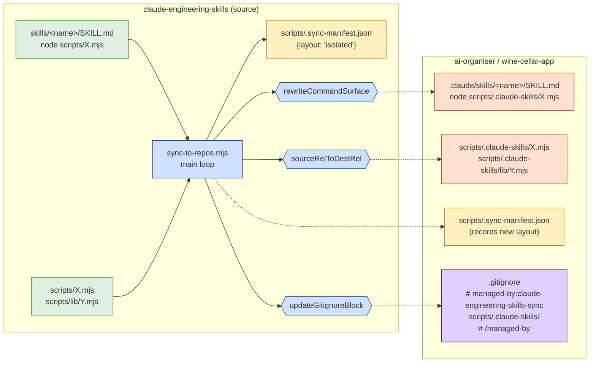

# Plan: Isolate engineering-skills tooling in consumer repos under `scripts/.claude-skills/`

- **Date**: 2026-05-29
- **Status**: Approved (6 audit rounds — 3 GPT + 3 Gemini — 30 findings fixed; ready for implementation)
- **Author**: Claude + Louis
- **Scope**: backend (sync infrastructure + cross-repo migration)
- **Target domains**: `install`, `shared-lib` (cross-domain — expected; this is sync infrastructure)
- **Stack**: js-ts + postgres
- **Neighbourhood considered**: `buildSkillFiles` (sync-to-repos.mjs:280, similarity 0.78, `justify-divergence` — different function, sibling pattern), `bundleForRepo` (sync-to-repos.mjs:349), `main` (the loop we're modifying), and `install-skills.mjs`'s `buildCopilotMergeWrite` / `buildSkillWrites` patterns (same domain, same copy-with-rewrite shape). All same-domain reuse opportunities; nothing duplicating.
- **Security incidents**: none surfaced. Path-rewrite work touches no credential / auth / external-API surface.

---

## 1. Context Summary

**The pain**: ai-organiser's `scripts/` has ~40 of our tooling files (`openai-audit.mjs`, `bandit.mjs`, `gemini-review.mjs`, `learning/`, `symbol-index/`, etc.) sitting alongside its own `automated-tests.js`, `install-ffmpeg.js`, `persona-harness/`. Whether tracked (pollutes their commits + blame) or untracked (clutters their `git status` — confirmed: 33 of the 40+ files appear as uncommitted/unstaged in their tree right now), it's the same UX failure: our tooling masquerading as their project files.

**What exists today**:
- `scripts/sync-to-repos.mjs` writes each file to its natural path in the consumer (`scripts/X.mjs` → `scripts/X.mjs`). One exception in flight: an uncommitted change that remaps `supabase/migrations/*.sql` → `.audit-loop/migrations/*.sql` in consumers, for the same isolation reason but only for SQL migrations. The pattern is a single conditional in the loop body (sync-to-repos.mjs:486–488). We **generalise this**, not parallel it.
- `scripts/lib/sync-manifest.mjs` ships a SHA-256 hashed manifest (`scripts/.sync-manifest.json`) recording every file we publish. Consumers compare against it to detect upstream drift. **This is our authoritative "what is ours" list** — the migration must read it, not hardcode a file enumeration.
- `scripts/lib/consumer-repos.mjs` is a frozen list of 2 consumer repos with `{name, alias, path}`. Single source of truth — extend it, don't bypass it.
- 18 skill `.md` files contain 62 `node scripts/X.mjs` invocations (across SKILL.md + `references/*.md`). 33 occurrences of `npm run X` exist too, but **those are out of scope** — `npm run` resolves against the consumer's own `package.json`, which we don't sync.
- `scripts/check-context-drift.mjs` already exists and enforces AGENTS.md ↔ CLAUDE.md alignment (4 rules: missing-import, non-allowlist-heading, shared-section-drift, oversized-CLAUDE.md). Phase 0 audit work reuses it.

**Patterns reused vs. new**:
- **Reuse**: single conditional in the sync loop (existing migrations remap pattern), `writeManifest` idempotency (hash-equal short-circuit), `atomicWriteFileSync` for `.gitignore` rewrites, `deepMerge` for the `.gitignore` block manager's "preserve user content outside markers" semantics.
- **New**: a path-mapper function (replaces the one-off migrations conditional), a skill `.md` rewriter (regex over `node\s+scripts/`), a `.gitignore` block manager (begin/end markers, idempotent).
- **NOT new**: no new abstractions for consumer-repo identity, manifest schema, or sync loop control flow. All extensions slot into existing seams.

**Roadmap items deferred to separate PRs** (not in this plan):
- Requirements bootstrap (`npm run requirements:bootstrap`) — 80% already exists, only the RFC-2119 doc-mining subcommand is missing
- Dashboard Requirements tab + confidence badges
- Domain map → `/plan` cross-domain warnings (data exists; render logic in `/plan` is the gap)

**Roadmap items confirmed already-shipped** (verified during Phase 0, no work needed): security incident memory in `/plan` Phase 0.5c, `context:check-drift` hook, architecture dashboard tab.

---

## 2. Proposed Architecture

### Architecture diagram



### Key design decisions

1. **Single path-mapper, replacing the migrations conditional** (#1 DRY, #19 Observability via labelled logs). Today the sync loop has:
   ```js
   const srcRel = relFile.startsWith('.audit-loop/migrations/')
     ? `supabase/migrations/${path.basename(relFile)}`
     : relFile;
   ```
   We replace this with a  pure function that decides destination per source-relative path. The migrations special case folds into it. All future "ship to a non-natural path" rules go in one place. (Inverse  exposed for the migration tool that needs to look up old paths.)

2. **Asymmetric source-vs-consumer skill content** (#11 Testability, #20 Long-term flexibility). Source skill `.md` files keep `node scripts/X.mjs` — dev experience locally stays identical. Consumer copies get `node scripts/.claude-skills/X.mjs`. The rewriter runs ONLY on the outbound copy. Source repo never sees a `.claude-skills/` directory. No mirror tree, no self-bootstrap step, no doubled storage.

3. **Path mapping — general rule with explicit exceptions** (#1 DRY, #18 backwards-compat). Audit R1 H5 surfaced that an enumerated-subdirs table would miss `scripts/postgres-parity/`, `scripts/migrations/`, `scripts/templates/`, `scripts/.cli-catalog.json`, and any future subdirectory. The rule is now:

   **Default rule**: every source path matching `scripts/**` maps to `scripts/.claude-skills/**` (preserving the relative subdir structure under `scripts/`).

   **Explicit exceptions** (closed table — adding to it requires a plan amendment):

   | Source path | Consumer path | Rationale |
   |---|---|---|
   | `scripts/.sync-manifest.json` | `scripts/.sync-manifest.json` | Manifest stays at canonical path; consumers fetch via `UPSTREAM_MANIFEST_URL` |
   | `supabase/migrations/*.sql` (source) | `.audit-loop/migrations/*.sql` (consumer) | Pre-existing remap — folds into the same mapper |
   | `.claude/skills/...` | `.claude/skills/...` (content rewritten — see H3 fix) | Claude Code reads from this exact path |
   | `.claude/hooks/...` | `.claude/hooks/...` (content rewritten — see H3 fix) | Hooks read from this exact path |
   | `.claude/settings.json` | `.claude/settings.json` (deep-merged + content rewritten) | Settings JSON; hook commands may reference scripts |
   | `.vscode/mcp.json` | `.vscode/mcp.json` (content rewritten if it references scripts) | VSCode reads from this exact path |
   | `.github/prompts/*.prompt.md` | `.github/prompts/*.prompt.md` (content rewritten — see H3 fix) | Copilot reads from this exact path |

   **Inventory-driven testing** (Audit R1 H5): the path-mapper test suite generates its cases from the actual sync entry-point closure (`bundleForRepo`) at test time, not from a hardcoded list. Adding a new subdirectory under `scripts/` automatically generates a test case asserting it maps under `.claude-skills/`. A new top-level path (outside `scripts/` and not in the exceptions table) fails the inventory-driven test with a clear "unmapped path — add explicit exception or accept default" message. Prevents silent layout drift.

3.5. **Bidirectional mapping contract** (#1 DRY, #2 SOLID — clear function boundaries). Audit R1 H6 surfaced that direction is currently ambiguous in the existing migrations remap. The new module exports two pure functions:
   - `sourceRelToDestRel(sourceRel) → destRel` — given a source-repo-relative path, return the consumer-repo-relative path. Used during sync iteration.
   - `destRelToSourceRel(destRel) → sourceRel` — inverse. Used by the manifest-driven migration to look up "what's the source path that produced this dest entry".
   - Both are pure, total functions (no I/O, no exceptions for in-bounds inputs). The migrations exception folds in: `sourceRelToDestRel('supabase/migrations/X.sql') === '.audit-loop/migrations/X.sql'` and vice versa.
   - **Round-trip invariant**: `destRelToSourceRel(sourceRelToDestRel(p)) === p` for every path in the inventory. Property test in `tests/sync-path-map.test.mjs + tests/sync-rewriter.test.mjs` asserts this against the live entry-point closure.

   **Iteration direction in `sync-to-repos.mjs`**: the loop iterates over SOURCE-relative paths (the file list returned by `bundleForRepo`). For each, it computes `dstRel = sourceRelToDestRel(srcRel)`. The existing `srcRel = '.audit-loop/migrations/...' ? 'supabase/migrations/...' : relFile` inline code (currently at sync-to-repos.mjs:486–488) operates the OTHER way (it iterated over dest-relative paths because `bundleForRepo` returned dest paths for migrations). Refactoring: change `bundleForRepo` to return source-relative paths, then everything iterates the same direction. This is a small but important sequencing fix — the path mapper goes one way only, never both.

4. **Ownership-aware command-invocation rewriter** (#2 SOLID, single-responsibility pure function; Audit R1 H1 + R2 H1 + R3 H3 fixes). Three properties co-equal: idempotent, surface-aware, and **ownership-aware** so we never rewrite consumer-owned commands.

   **Why ownership matters** (R3 H3): a syntax-only rewriter that matches every `\bnode\s+scripts/(\S+)` would corrupt consumer commands. ai-organiser HAS `scripts/automated-tests.js`, `scripts/install-ffmpeg.js`, plus its `persona-harness/` and `spikes/` subdirs. A purely syntactic rewriter would mangle `node scripts/automated-tests.js` → `node scripts/.claude-skills/automated-tests.js`, pointing the consumer's own test runner at a file that doesn't exist. **Critical correctness bug if not addressed.**

   **Correct algorithm** (uses `sourceRelToDestRel` to honour explicit exceptions — Gemini v2 G3 fix):
   1. The rewriter takes two config parameters:
      - `ownedSourceTails: Set<string>` — the set of `<tail>` strings such that `scripts/<tail>` IS in the source inventory.
      - `pathMap: { sourceRelToDestRel(srcRel) → destRel }` — the bidirectional mapper.
   2. Scan for occurrences of `\bnode\s+scripts/(\S+)`.
   3. For each match, extract the tail.
   4. If tail starts with `.claude-skills/` → no-op (already migrated; idempotency).
   5. Else if tail is NOT in `ownedSourceTails` → no-op (consumer-owned; do not touch).
   6. Else compute `destRel = sourceRelToDestRel('scripts/' + tail)`. If `destRel === 'scripts/' + tail` (the path-map returned the input unchanged — i.e. this file IS an explicit-exception that doesn't move) → no-op (preserve invocation; don't rewrite). Otherwise emit `node ${destRel}` (the rewriter respects whatever dest the path-map chose — including future non-`.claude-skills/` destinations like the `.audit-loop/migrations/` pattern).

   **Origin construction** of `ownedSourceTails`:
   - From the SOURCE repo (where sync runs): built from `getSyncInventoryForRepo(alias).files`.
   - From the CONSUMER repo (where the verifier runs — Gemini v2 G2 fix): built from the new manifest's `files` map (which under `layout: 'isolated'` lists destination paths). Compute tails via: for each key, if it starts with `scripts/.claude-skills/`, the tail is the slice after `scripts/.claude-skills/`. Equivalent to reversing what the rewriter does.
   - These two derivations are equivalent for any consumer whose manifest matches its in-source inventory at sync time — the round-trip invariant of the path mapper guarantees it. Unit-tested in `tests/sync-inventory.test.mjs`.

   Properties:
   - **Idempotent** by step 4: rewriter(rewriter(content)) == rewriter(content). Unit-tested N=10.
   - **Ownership-safe** by step 5: `node scripts/automated-tests.js` in a consumer-owned file stays unchanged — `automated-tests.js` is not in `ownedSourceTails`. R3 H3 fixed.
   - **Documentation-safe**: `\bnode\s+scripts/` anchor; prose references not touched.
   - **Subdirectory-agnostic**: tail can be anything (including subdir paths like `symbol-index/drift.mjs`).
   - **Out of scope**: `bash scripts/X.sh` (no skill uses), multi-line `node \<nl>scripts/X.mjs` (grep confirmed zero), `npm run X` (R1 M4 enumerator handles separately — consumer's `package.json` is user-owned, not auto-rewritten).

5. **Managed `.gitignore` block manager** (#13 Idempotency, #15 Error Handling — **fail-fast**, not fail-soft). Begin/end markers:
   ```
   # managed-by:claude-engineering-skills-sync — DO NOT EDIT INSIDE
   scripts/.claude-skills/
   # /managed-by:claude-engineering-skills-sync
   ```
   Algorithm (closed table of marker states — Audit R1 M3 fixed the malformed-marker fail-soft bug):

   | Begin markers | End markers | Action |
   |---|---|---|
   | 0 | 0 | First run → append block at EOF with leading blank line |
   | 1 | 1 (in order, begin-before-end) | Idempotent overwrite — replace contents between markers |
   | 1 | 0 | **VALIDATION ERROR — abort sync with precise message** ("orphan begin marker in `.gitignore:LINE`; remove or pair") |
   | 0 | 1 | **VALIDATION ERROR — abort sync** ("orphan end marker") |
   | ≥2 | any | **VALIDATION ERROR — abort sync** ("duplicate managed block — `.gitignore` was hand-edited; manually consolidate before re-syncing") |
   | 1 | 1 (end-before-begin) | **VALIDATION ERROR — abort sync** ("markers out of order") |
   | missing file | — | First run → create `.gitignore` with just the block |

   Rationale: malformed-marker accumulation is the failure mode where re-running sync repeatedly silently creates parallel managed blocks. Aborting with a precise remediation message is the only way to prevent corruption from compounding. The user resolves the malformed state once, then re-runs sync.

   **Idempotency**: re-running sync against a valid managed `.gitignore` produces no diff. Verified via hash-equal short-circuit before write (the algorithm's transform is deterministic — same input ⇒ same output ⇒ skip).

6. **Manifest layout field** (#18 Backwards compat). Add `"layout": "isolated"` to the manifest payload. Old consumer manifests without this field are implicitly `"legacy"`. The consumer's drift-check (`compareToUpstream`) tolerates the new field via Zod's permissive defaults; old consumers ignore unknown fields. Upgrade path: re-sync after sync code lands → manifest auto-updates to `"isolated"`.

7. **Ownership preflight + transactional staged sync** (#15 Error Handling — abort-before-write + atomic-replace semantics, Audit R1 M1 + R2 H3 fixes).

   **Ownership signal — manifest only, NOT gitignore status** (R2 H3 fix). Earlier wording used "is the file gitignored?" as part of the ownership test, which is wrong: the entire `scripts/.claude-skills/` tree is gitignored by design, so that signal would treat ALL files there as "owned" even when they're foreign. The correct test:

   > A destination file is "ours" if and only if its path is recorded in the prior manifest's `files` map.

   No other signal is consulted. The gitignore exclusion is a presentation concern, not an ownership claim.

   **Preflight scan — layout-aware** (BEFORE any write; Gemini G1 fix):
   - For every file the sync intends to write (full inventory, destinations resolved), check if a file already exists there.
   - **Layout-aware ownership lookup**: the prior manifest's `layout` field determines how to look up ownership:
     - `layout === 'isolated'` → manifest keys ARE destination paths. Direct lookup: `priorManifest.files[destRel]`.
     - `layout === 'legacy'` OR field absent (first-time migration from a legacy consumer) → manifest keys are source paths under root `scripts/`. To check ownership of a destination like `scripts/.claude-skills/openai-audit.mjs`, FIRST map back via `destRelToSourceRel`, THEN look up: `priorManifest.files[destRelToSourceRel(destRel)]`. Without this mapping, a mid-sync failure on the FIRST migration leaves new files on disk but the legacy manifest doesn't know their dest paths — every retry would falsely flag them as "unowned collision" and abort.
   - If owned (per the layout-aware lookup) → OK. Hash mismatch vs. prior recorded hash is logged but not blocking (means it was modified since last sync).
   - If NOT owned → "unowned collision". Sync aborts with a precise error message listing every collision path. NO files are written. Manifest unchanged. `.gitignore` untouched.
   - Operator resolves manually OR explicitly opts in via `--force-overwrite-unowned` (loud, flag-named to be obvious, requires interactive `--confirm` re-prompt, logged to the migration PR description).

   **Per-file atomic writes + manifest-as-commit-point + in-progress journal** (R3 H1 + Gemini v3 G1 + G2 fixes). Node `fs.rename(dir, dir)` does NOT atomically replace a non-empty destination. The simpler, correct design uses the codebase's existing `atomicWriteFileSync` (temp + rename per file) plus a small journal for crash-recovery of newly-introduced files:

   1. **Preflight `.gitignore` validation FIRST** (Gemini v3 G2 fix). Before any write, run `parseGitignoreState` against the consumer's `.gitignore`. If state is malformed (orphan marker, duplicate block, out-of-order markers per §2 KD #5), abort BEFORE any file write. Catches the bad-marker class while damage is recoverable (zero files written).
   2. **Write in-progress journal** at `scripts/.sync-in-progress.json` via `atomicWriteFileSync`. Lists every destination path the current sync intends to write (newly-added files in particular). The journal exists IFF a sync is in flight.
   3. **Per-file writes** via `atomicWriteFileSync`. `fs.mkdirSync({recursive:true})` ensures dest subdirs exist. Crash mid-file leaves prior content intact OR a `*.tmp.<pid>.<ts>` orphan that the next sync prunes.
   4. **Commit point — write the new manifest** via `atomicWriteFileSync`. Manifest is the all-or-nothing commit.
   5. **Garbage-collect upstream deletions** (Gemini v3 G3 fix). Compute the set diff: prior-manifest's `.claude-skills/...` keys MINUS new-manifest's `.claude-skills/...` keys. For each prior-only key, `fs.unlinkSync` (tolerate ENOENT). This prevents stale orphans accumulating in the gitignored tree when files are removed from upstream — they'd otherwise live forever invisibly because `git status` doesn't surface them.
   6. **Apply `.gitignore` update** via the validated `updateManagedBlock` action from step 1 — guaranteed to succeed because state was already validated.
   7. **Delete the in-progress journal** — last step. Sync is complete.

   **Crash-recovery** (Gemini v3 G1 fix). Next sync detects the leftover `scripts/.sync-in-progress.json`. Its destination list is treated as "owned by the interrupted prior run" — preflight accepts those paths as if they were in the prior manifest. The interrupted writes get re-attempted (idempotent — same source → same dest → byte-equal); the journal is replaced with a fresh one; the new sync proceeds. NO deadlock for newly-introduced files crashed mid-write.

   Recovery contract: re-running sync is always safe. Preflight re-evaluates against the live tree + the live manifest. Orphan `*.tmp.*` files are pruned at sync start (a one-pass walk).

   **Why this is better than a staging dir** (R3 H1 rationale): the atomic-dir-rename design was overengineered. Our actual failure modes are per-file (`EACCES` on a single file, `ENOSPC` interrupts one write) and per-file atomicity handles them. The manifest-as-commit-point gives us the all-or-nothing semantics at the verification layer without the OS-level complexity of directory swaps. No staging tree means no `scripts/.claude-skills-staging/` polluting `git status` on failed runs (Audit R3 M2 sidefix — staging was the source of that pollution; removing staging removes the pollution class).

   **Ownership record on consumer side**. The manifest IS the consumer-side ownership record. No separate `.install-state.json` needed because the manifest is both the upstream contract AND the local-ownership truth. Tracked at the canonical path (`scripts/.sync-manifest.json`); survives the gitignore exclusion of the tooling tree.

8. **Asymmetric — but documented**. AGENTS.md gets a new "Consumer-repo layout" section explaining that consumer skills invoke `node scripts/.claude-skills/X.mjs`. Source contributors see the source paths; consumer adopters see the consumer paths. Single doc, two sections.

9. **Extended outbound-rewriter scope** (Audit R1 H3 fix). The rewriter runs against ALL synced command-bearing surfaces, not just skill `.md`. Surfaces inventoried + handling:

   | Surface (consumer-side) | Rewrite mode | Notes |
   |---|---|---|
   | `.claude/skills/**/*.md` (+ `references/*.md` + `examples/*.md`) | Full content rewrite | 62 known invocations across 18 files |
   | `.claude/hooks/*.sh` (`arch-memory-check.sh`, others) | Full content rewrite | Today: zero `node scripts/` invocations found (`grep` confirmed). Future hooks may add them; rewriter scans defensively. |
   | `.claude/hooks/*.mjs` (`quickfix-scan.mjs`) | Full content rewrite | This file is itself synced — handled by the same source-vs-dest asymmetric model. |
   | `.claude/settings.json` (deep-merged) | JSON-aware rewrite: walk `.hooks.*.command` and `.hooks.*.args` strings | Only string values; preserves keys + structure. Pre-existing `deepMerge` logic stays — **rewriter runs AFTER `deepMerge` on the final merged value** (Gemini v3 G4 consistency fix; matches §7 which is the correct sequencing). Running before merge would miss any old-path commands that survived in the consumer's existing settings. |
   | `.github/prompts/*.prompt.md` | Full content rewrite | Copilot prompt shims may reference `node scripts/X.mjs` if the SKILL.md they shim from did. |
   | `.vscode/mcp.json` | JSON-aware rewrite: walk `.servers.*.args[]` and `.servers.*.command` strings | Mirrors the settings.json shape. Today: no `node scripts/X.mjs` references found, but future MCP-server registrations could add them. |

   **Per-surface unit tests**: each surface gets a dedicated test fixture with at least one positive case (contains `node scripts/X.mjs`, rewriter produces expected output) and one negative case (no such reference, rewriter no-ops byte-identically).

   **Inventory drift guard**: a CI test enumerates the actual sync inventory (via `bundleForRepo`) and asserts every file path falls into one of: (a) source-only (not synced — no rewrite needed), (b) handled by a per-surface rewriter, (c) explicit "no rewrite" allowlist. A new surface that's neither synced nor allowlisted fails the test. Prevents silent gaps when entry-point lists expand.

10. **Runtime relocation compatibility** (#16 Graceful Degradation, Audit R1 H4 fix). Moving scripts from `scripts/X.mjs` to `scripts/.claude-skills/X.mjs` changes the meaning of `import.meta.dirname + '..'` resolution: it now goes UP into `scripts/` (still inside the tooling tree) instead of UP into the consumer's repo root. Scripts that compute paths from `import.meta` for non-module-relative purposes are at risk.

   **Audit of synced scripts** (completed during planning):
   - `grep -E "path\.(resolve|join)\(import\.meta\.dirname,\s*'\.\.'" scripts/**/*.mjs` returns 6 hits.
   - Of those 6, **only 1 file is in the consumer sync bundle**: `scripts/cache-hitrate-check.mjs` (line 30: `const AUDIT_DIR = path.resolve(import.meta.dirname, '..', '.audit');`). The other 5 are source-only (`sync-to-repos.mjs`, `regenerate-skill-copies.mjs`, `consumer-repos.mjs`, etc.) and never reach a consumer.
   - All other 69 occurrences of `import.meta.{dirname,url}` are module-relative (e.g. `path.join(import.meta.dirname, 'fixtures', 'foo.json')`) — relocation-neutral by construction.
   - `child_process.spawn('node', ['scripts/...'])` patterns in synced scripts: **zero hits** (`grep -E "spawn(Sync)?\s*\(\s*['\"]node['\"]"` confirmed). No script spawns another via path string.

   **Fixes**:
   - **Patch `cache-hitrate-check.mjs`** to use `assertRepoRoot(import.meta.url)` (the existing canonical resolver in `scripts/lib/assert-repo-root.mjs`) instead of `'..'`. One-line change. Same fix lands in source — the file works identically before and after.
   - **Add a CI guard test** — `tests/relocation-guard.test.mjs` — that enumerates the sync entry-point closure and fails if any synced script contains `path.resolve(import.meta.{url|dirname}, '..'` going up beyond `scripts/`. Catches future regressions. The test ALSO scans for `spawn('node', 'scripts/...'`, `execSync('node scripts/...')`, and template literal equivalents.
   - **Document the resolver pattern** in `scripts/lib/assert-repo-root.mjs`'s docstring: "For any code that needs to resolve a repo-rooted path from a synced script, use `assertRepoRoot(import.meta.url)` not `path.resolve(import.meta.dirname, '..')` — the latter breaks after consumer-side relocation."

   **What this is NOT**: a wholesale refactor to introduce a separate `repoRoot` vs `toolRoot` resolver everywhere. The single relocation-breaking script today is enough signal to fix point-blank; the CI guard prevents the class re-emerging.

---

## 5. Long-Term Sustainability Notes

### Distribution contract — UNTRACKED + push-from-source (v1 scope)

**The lifecycle is push-from-source, not consumer-bootstrapped.** This is the explicit v1 choice — picked deliberately because it matches the user's pain ("don't push our tooling into the consumer repo") and the current operational reality (one developer, two consumer repos, all on the same machine as the source repo). Audit R1 H2 surfaced this as an ambiguity; the explicit commitment below removes it.

**What IS committed in each consumer migration PR**:
- The managed `.gitignore` block (excludes `scripts/.claude-skills/`)
- `scripts/.sync-manifest.json` (records `layout: 'isolated'` so freshness tooling can detect)
- `.claude/skills/**/*.md` files (rewritten to point at `scripts/.claude-skills/X.mjs`)
- `.claude/hooks/`, `.claude/settings.json`, `.github/prompts/`, `.vscode/mcp.json` (rewritten where they reference scripts — see H3 fix)
- Deletions of every formerly-tracked tooling file at its old `scripts/` path

**What is NOT committed**: the `scripts/.claude-skills/` tree itself. It's hydrated by re-running `npm run sync --target <name>` from the source repo. The skill `.md` files reference paths that only exist after sync.

**Implications of this choice — documented limitations of v1**:
1. **Fresh clones of a consumer repo on a new machine** need to run sync from source before any skill works. The skill .md files reference scripts at paths that don't exist yet. Failure mode is loud (skill invocation = "file not found"), so it's discoverable. The migration PR description and `docs/consumer-adoption.md` will document the post-clone setup step.
2. **CI runners**: same constraint. Neither consumer runs CI today, so this is a known-future-problem, not a blocker. If/when a consumer adds CI, the bootstrap mechanism becomes mandatory (see "Deferred to v2" below).
3. **Inviting a collaborator** to a consumer repo: same as fresh clone. Collaborator clones the source repo too, then syncs. Documented.
4. **`.sync-manifest.json` claims X is "installed"** but the file is gitignored. Resolution: the manifest's hashes are still valid (records what SHOULD be at that path); the freshness check warns when local file doesn't match upstream. Consumer reads manifest as a contract description, not a presence claim. Documented in the manifest schema docstring.

**Deferred to v2 (out of scope for this PR)**: a `claude-skills:install` consumer-side npm script that hydrates `scripts/.claude-skills/` from a published artefact (npm package, GitHub release tarball, or source-repo path). Building this means deciding the distribution channel — premature without an actual CI scenario or a third consumer. We choose explicit limitation now over speculative infrastructure.

### Other assumptions
- `npm run X` invocations in skills are consumer-owned. If a consumer adopts our skills and has matching `package.json` script entries referencing `scripts/X.mjs`, those break after migration. We enumerate the references and report; we do not rewrite consumer-owned config. Per Audit R1 M4 fix.
- The `scripts/.claude-skills/` name is stable. Future renames cost: one breaking sync + one migration PR per consumer. Acceptable.

**If requirements change in 6 months**:
- Adding a third consumer repo → one entry in `lib/consumer-repos.mjs`, one one-time migration. Path-mapper, rewriter, gitignore-manager all work unmodified.
- Changing the destination subdir name (`.claude-skills/` → something else) → one constant change in the path-mapper; one migration per consumer (same recipe re-run with new name).
- Adding a NEW non-`scripts/` source path that needs isolation → one new case in the path-mapper table. No other changes.
- Consumer wants to opt OUT of isolation (e.g. for `npm pack` workflows) → add a `layout: 'flat'` opt-in to the consumer-repo config; the path-mapper short-circuits. Not built now; the seam is there.

**Coupling**: tighter only where intended (sync loop ↔ path-mapper). The rewriter and gitignore-manager are pure functions importable from anywhere; no hidden dependencies.

**Extension points deliberately built in**:
- Path-mapper is a table-driven function, not a chain of `if`s. Adding a class is one row.
- Rewriter accepts a config object `{remapPrefix: 'scripts/.claude-skills/'}` so the same code can drive a different prefix (testing, alternate layouts).
- Manifest `layout` field is a closed enum, schema-validated. Future values (`'isolated-v2'`) extend without breaking parsers.

---

## 7. File-Level Plan

### Source repo changes (PR 1: `claude-engineering-skills`)

#### `scripts/lib/sync-path-map.mjs` — **NEW** (renamed from `sync-path-rewriter.mjs` for clarity; R2 H2 fix)
- Pure functions, no I/O. Single-responsibility module.
- `sourceRelToDestRel(sourceRel) → string` — bidirectional path mapper. Source-repo-relative → consumer-repo-relative.
- `destRelToSourceRel(destRel) → string` — inverse. Round-trip invariant: `destRelToSourceRel(sourceRelToDestRel(p)) === p`.
- `isExplicitException(sourceRel) → boolean` — true for rows in the §2 KD #3 exceptions table.
- `LAYOUT_CONSTANTS` — frozen object with `CONSUMER_TOOLING_DIR = 'scripts/.claude-skills'`, `MIGRATIONS_SRC = 'supabase/migrations'`, `MIGRATIONS_DEST = '.audit-loop/migrations'`, `MARKER_BEGIN`/`MARKER_END` strings.
- **No `remapDestPath`, no `srcPathFor`** — those were transitional names in v0/R1; the v2 API is `sourceRelToDestRel` + `destRelToSourceRel` ONLY. Any reference to legacy names in code or tests fails CI lint.

#### `scripts/lib/sync-rewriter.mjs` — **NEW** (R2 H1 fix — separate module for clarity)
- Pure functions for outbound content rewriting. Imports `LAYOUT_CONSTANTS` from sync-path-map.
- `rewriteTextCommandInvocations(content, config) → string` — tokenising rewriter for plain-text files (`.md`, `.sh`, prompt files). Implements the algorithm from §2 KD #4: scan for `\bnode\s+scripts/(\S+)`, no-op if tail starts with `.claude-skills/`, else prefix. Idempotent by construction.
- `rewriteJsonCommandInvocations(jsonValue, config) → unknown` — recursive walker for JSON config. Visits every string value; if it matches the same regex as text rewriter, transforms. Returns a new tree (no in-place mutation). Used for `.claude/settings.json` AFTER the existing `deepMerge` and for `.vscode/mcp.json`.
- `rewriteCommandSurface({relPath, content, config}) → {rewritten, changed: boolean, hits: number}` — facade. Dispatches by relPath extension/shape: `.md|.sh|.prompt.md|.mjs` → text rewriter; `.json` → JSON rewriter; everything else → passthrough. Single entry point for the sync loop.
- All three exported + `_internals` for tests.

#### `scripts/lib/sync-gitignore.mjs` — **NEW** (separated; small)
- `updateManagedBlock(existingContent, blockBody) → {content, action: 'create'|'replace'|'noop'|'abort', error?}` — implements the closed marker-state table in §2 KD #5. Validation-error states return `action: 'abort'` with `error` explaining the malformed marker state; caller propagates the abort.
- `parseGitignoreState(content) → {beginCount, endCount, orderValid, blockSpan}` — pure introspection used by `updateManagedBlock`.

#### `scripts/lib/npm-script-enumerator.mjs` — **NEW** (R1 M4 + R2 H4 fix)
- Pure module + thin CLI wrapper.
- Exported function: `enumerateNpmRunRefs(skillMdContent) → string[]` — dedupes; ignores prose references inside backticks-with-prose context.
- CLI: `node scripts/lib/npm-script-enumerator.mjs --consumer-root <path>` — reads the consumer's `scripts/.sync-manifest.json`, finds all synced `.md` files via `destRelToSourceRel`, calls the pure function over their contents, writes the JSON `{refs: string[]}` to stdout. Exit 0 on success, exit 2 on missing manifest. This is the form Gate 5 calls.
- Test fixtures cover: skill with N invocations, skill with no invocations, skill with `npm run` inside prose (must not extract).

#### `scripts/lib/sync-inventory.mjs` — **NEW** (R2 H2 fix — formalises the `bundleForRepo`/`REPOS` shape for tests + dry-run assertions)
- Extracts the existing `bundleForRepo`/`REPOS` logic from `sync-to-repos.mjs` into a side-effect-free library module so tests + the verifier CLI can import it without running the sync main.
- Exports `getSyncInventoryForRepo(alias) → {files: string[], unresolved: ...}` — files are SOURCE-RELATIVE paths (R2 H2 direction fix).
- Exports `getAllConsumerInventories() → Map<alias, inventory>`.
- `sync-to-repos.mjs` is refactored to import from here, eliminating the `import {REPOS}` ambiguity (R2 H2): the `REPOS` runtime decoration with `.files` stays as a convenience for the sync main, but tests and verify-CLI use `getSyncInventoryForRepo` instead.

#### `scripts/lib/sync-isolation-verify.mjs` — **NEW** (R2 H4 fix — consolidates all migration gates into one verifier CLI)
- Replaces the ad-hoc shell snippets in §9 with one composable tool.
- Usage: `node scripts/lib/sync-isolation-verify.mjs --target <alias> --consumer-root <path> [--gates 1,2,3,4,5,6,7] [--format text|json]`.
- Implements every numbered gate in §9 as a discrete check function. Reads the manifest. Calls `enumerateNpmRunRefs`. Greps via Node `fs.readFile` (no shell `grep` dependency). Asserts gitignore markers. Runs the relocation smoke commands.
- Exit code 0 on all gates pass; exit code N where N is the first-failing gate number. JSON output is machine-readable for CI.
- This is the SINGLE entry point operators run during migration. The bespoke shell snippets in §9 become illustrative — the verifier is canonical.

#### `scripts/sync-to-repos.mjs` — **EDIT** (medium)
- Import `{sourceRelToDestRel, LAYOUT_CONSTANTS}` from `./lib/sync-path-map.mjs`.
- Import `{rewriteCommandSurface}` from `./lib/sync-rewriter.mjs`.
- Import `{updateManagedBlock}` from `./lib/sync-gitignore.mjs`.
- Import `{getSyncInventoryForRepo}` from `./lib/sync-inventory.mjs` and refactor `bundleForRepo` / `REPOS` to use it (R2 H2).
- **Iteration direction**: the main loop iterates over SOURCE-RELATIVE paths (from `getSyncInventoryForRepo(alias).files`). For each `srcRel`, compute `dstRel = sourceRelToDestRel(srcRel)`. The existing inline `srcRel = relFile.startsWith('.audit-loop/migrations/') ? 'supabase/migrations/...' : relFile` block (sync-to-repos.mjs:486–488) is DELETED — folded entirely into `sourceRelToDestRel`. No `remapDestPath`, no `srcPathFor`.
- **Outbound rewrite wiring** (R2 H1): in the file copy branch, EVERY file goes through `rewriteCommandSurface`. The function decides whether to actually rewrite (per-extension dispatch). For JSON files: the rewriter runs AFTER the existing `deepMerge` on the final merged value, then writes. For text files: rewriter runs on the source content before write. Passthrough files (non-command-bearing extensions) get no rewrite, byte-identical copy.
- **`updateManagedBlock` integration**: once per consumer-repo iteration, after all files copied. If `action === 'abort'`, the sync run aborts with the validation error and writes nothing further.
- **Preflight ownership scan — layout-aware** (R2 H3 + Gemini G1 fix): BEFORE any write, build the full destination inventory; for each existing destination file, look up the prior manifest using layout-aware mapping (per §2 KD #7) — on `layout: 'isolated'` manifests, key is the destination directly; on `layout: 'legacy'`/missing, key is `destRelToSourceRel(destRel)`. Ownership is determined SOLELY by the prior manifest's `files` map (with layout-aware lookup) — NOT by gitignore status. Any destination file present-on-disk-but-absent-from-prior-manifest is an "unowned collision" and aborts the sync.
- **Per-file atomic writes** (R3 H1 + Gemini v2 G1 fix — replaces the prior "staging dir" design which was unrealistic given Node's `fs.rename` semantics on non-empty directories). Each file is written via the codebase's existing `atomicWriteFileSync` (temp + rename in the same directory — POSIX-atomic at the inode level for the file). `fs.mkdirSync({recursive:true})` ensures destination subdirs exist. Crash mid-file leaves the prior file intact OR a `*.tmp.<pid>.<ts>` orphan that the next sync prunes via a single-pass walk at sync start. **The manifest write is the all-or-nothing commit point**: if the new manifest's hashes match on-disk content, the sync succeeded from this consumer's perspective. If they don't, the verifier surfaces it. NO staging directory, NO `scripts/.claude-skills-staging/<ts>/`, NO atomic dir rename.
- **Update** the manifest write to include `layout: 'isolated'` in the metadata.
- **Update** progress logging to surface remaps: `→ scripts/.claude-skills/openai-audit.mjs (was scripts/openai-audit.mjs)`. Operators see the rewrite happen, especially during the first migration sync.
- **NO `--no-rewrite` flag**. CLI parser asserts absence; if a future contributor adds one, the relocation-guard test surfaces it.

#### `scripts/lib/npm-script-enumerator.mjs` — **NEW** (small)
- Audit R1 M4 fix. Pure function `enumerateNpmRunRefs(synced_md_content) → string[]` — extracts every `npm run <name>` invocation referenced inside synced skill `.md` files.
- Used by sync to produce a report appended to the migration log: "Skills reference these npm scripts: `audit`, `audit-loop`, `arch:refresh`. Verify these exist in the consumer's `package.json` and resolve to `scripts/.claude-skills/...` paths — if any still point at `scripts/...`, update them in this migration PR."
- Not auto-rewriting the consumer's `package.json` (scope discipline — user-owned config). Just enumerating + reporting.
- Migration acceptance gate (§9 #5 below) becomes deterministic: the operator must either confirm "no consumer `package.json` script references our paths" or list the updates made.

#### `scripts/lib/sync-manifest.mjs` — **EDIT** (small)
- Add `layout: z.enum(['legacy', 'isolated']).optional().default('legacy')` to `SyncManifestSchema`. Default `legacy` preserves backwards-compat for any consumer that's still on the old layout.
- `generateManifest` accepts a `layout` option, passes through to the payload.
- No other changes — the hash-equal idempotency check works unmodified.

#### `scripts/lib/consumer-repos.mjs` — **NO CHANGE**
- No new fields. Consumer-repo identity (name/alias/path) stays as-is. Layout is sync-side config, not consumer-side identity.

#### `tests/sync-path-map.test.mjs + tests/sync-rewriter.test.mjs` — **NEW**
- Unit tests for `sourceRelToDestRel` / `destRelToSourceRel`: all 7 exception-table rows + general-rule cases drawn from the LIVE inventory (not hardcoded — inventory-driven per H5 fix). Property test asserts `destRelToSourceRel(sourceRelToDestRel(p)) === p` over the entire entry-point closure.
- Unit tests for  +  +  facade (renamed from  to reflect H3 expanded scope): all 62 `.md` invocation forms + JSON-aware cases for `.claude/settings.json` and `.vscode/mcp.json` shapes. Idempotency tests run the rewriter N=10 times on each input and assert byte-identical output after the first pass (H1 fix). Negative cases assert documentation references (`see scripts/X.mjs:42`) are not rewritten.
- Unit tests for `updateGitignoreBlock`: every row of the marker-state table in KD #5 (7 rows, including the 4 validation-error cases from M3 fix). Asserts validation errors throw with the specific remediation message.
- Unit tests for `enumerateNpmRunRefs`: extracts `npm run X` from skill `.md` content; deduplicates; ignores `npm run X` inside code-block prose annotations like "see `npm run X` for details".
- Target: ≥ 40 test cases (up from 30 due to expanded scope). These are pure functions; coverage is cheap and the test surface is exactly what bugs would slip through.

#### `tests/relocation-guard.test.mjs` — **NEW** (Audit R1 H4 fix)
- Enumerates the sync entry-point closure via `bundleForRepo`.
- For each synced `.mjs` file, parses for `path.resolve(import.meta.{url|dirname}, '..'` patterns going up beyond `scripts/`. Fails with a clear "relocate `<file>:<line>` to use `assertRepoRoot(import.meta.url)`" message if any found.
- Scans for `spawn('node', 'scripts/...'`, `execSync('node scripts/...')`, and template-literal equivalents that hardcode a `scripts/` path. Fails if any (today: zero).
- Runs in CI as a guard against regression. Future engineers who add a relocation-breaking pattern get a precise lint failure rather than a silent runtime break in consumers.

#### `tests/sync-manifest.test.mjs` — **EDIT** (small)
- Add 2 test cases: manifest with `layout: 'isolated'` round-trips; manifest without `layout` defaults to `'legacy'`.

#### `AGENTS.md` — **EDIT** (small, ~40 lines added)
- New subsection under "Skill file structure": **"Consumer-repo layout"** documenting `scripts/.claude-skills/` convention, the asymmetric source-vs-consumer model, and the managed `.gitignore` block.
- New subsection: **"Adopting these skills in a new repo"** — pointer to a migration recipe (one-time `git rm --cached` dance, the package.json caveat for `npm run X`, links to the consumer-side manifest as the authoritative "what is ours" reference).
- No changes to the existing "Architecture" mermaid block — that describes source-repo internals which are unchanged.

#### `docs/consumer-adoption.md` — **NEW** (small, ~80 lines)
- The migration recipe in full. Pasted into AGENTS.md by pointer; lives separately because it's adopter-facing, not source-contributor-facing.
- Sections: When to adopt; What gets installed where; The one-time `git rm --cached` migration; The `package.json` script-path update; Troubleshooting.

### Consumer repo changes (PR 2: ai-organiser; PR 3: wine-cellar-app)

These PRs are mechanically identical; described once.

#### `.gitignore` — **EDIT** (1 managed block appended)
- Three lines: marker, `scripts/.claude-skills/`, marker.

#### `scripts/<our-files>` — **DELETED** (40+ files)
- Removed from index (`git rm --cached`), removed from disk (manifest-driven enumeration). Native consumer files in `scripts/` are NEVER touched.

#### `scripts/.claude-skills/<our-files>` — **NEW** (same 40+ files at new path)
- Written by re-running `npm run sync --target <name>` from source.

#### `scripts/.sync-manifest.json` — **UPDATED**
- Now records files under `scripts/.claude-skills/` keys, plus `layout: 'isolated'`.

#### `.claude/skills/**/*.md` — **REWRITTEN**
- Every `node scripts/X.mjs` → `node scripts/.claude-skills/X.mjs`. Auto-done by the sync rewriter.

#### Consumer's `package.json` — **NOT CHANGED BY SYNC**
- Per scope discipline: we do NOT touch consumer-owned package.json scripts. The migration recipe in `docs/consumer-adoption.md` documents that any `npm run X` script in the consumer's `package.json` that invokes `node scripts/X.mjs` for OUR files must be updated by hand. ai-organiser has no such scripts (verified: `grep "node scripts/" package.json`); wine-cellar-app to be verified during migration. If found, the user updates them in the same migration PR.

---

## 8. Risk & Trade-off Register

| Risk | Likelihood | Impact | Mitigation |
|---|---|---|---|
| Rewriter regex misses an invocation form | Low | Medium | All 62 forms enumerated in tests; per-surface unit tests; inventory drift guard test catches new surfaces (KD #9); Phase 2 deterministic assertions before write. |
| Rewriter double-prefixes a path on second sync (was H1) | Low | High (broken commands) | Tokenising rewriter explicitly checks "already under `.claude-skills/`" and no-ops (KD #4); idempotency unit tests run rewriter N=10 times. |
| Rewriter creates a false-positive (rewrites a doc reference) | Low | Low | Anchored on `\bnode\s+scripts/`; unit test cases for negative examples (prose references). |
| Idempotency bug in `.gitignore` manager → diff churn on every sync | Medium | Low | Hash-equal short-circuit before write; idempotency test asserts byte-identical output on second pass. |
| `.gitignore` malformed-marker accumulation (was M3) | Low | Medium (consumer corruption) | Marker-state table is closed; malformed states ABORT with precise remediation (KD #5). Fail-fast not fail-soft. |
| Native file collision in consumer's `scripts/.claude-skills/` | Very low | High (silent overwrite) | Preflight ownership scan aborts before ANY write (KD #7, M1 fix); `--force-overwrite-unowned` is the only opt-out and requires confirmation. |
| Migration commit bundles unrelated consumer work | Medium (uncommitted state seen in ai-organiser scripts/) | Medium | `AskUserQuestion` lists every dirty path + records the choice in the PR description (Phase 3 step 2). |
| Consumer's `package.json` has stale `npm run X` referencing old path (was M4) | Medium | Medium | `npm-script-enumerator.mjs` extracts all references; §9 gate 5 cross-checks consumer `package.json` and aborts if any stale. |
| Existing migrations remap regression (was H6) | Low | Medium | `sourceRelToDestRel`/`destRelToSourceRel` round-trip test runs against the live inventory; CI catches direction errors. |
| Manifest schema change breaks old consumer's drift-check | Very low | Low (warnings only) | `layout` field is optional with default `'legacy'`. Old consumers ignore unknown fields. Zod's permissive `.optional()` makes this safe. |
| Path-mapper's default rule misses a `scripts/**` subdir (was H5) | Very low | Low | Default = "everything maps"; explicit exceptions table is the closed set. Inventory-driven tests catch any new top-level path that's neither default nor explicit. |
| Synced script breaks on relocation due to `import.meta` + `'..'` (was H4) | Low | High (silent runtime fail) | Only 1 file affected today (`cache-hitrate-check.mjs`); patched. CI guard test (`relocation-guard.test.mjs`) prevents regression. |
| Fresh clone of consumer repo can't run skills (was H2 — explicit v1 limitation) | Medium (will happen) | Medium (loud failure: "file not found") | Documented in `docs/consumer-adoption.md`; deferred bootstrap script in §5; loud failure is discoverable, not silent corruption. |
| First-time `.gitignore` write on a consumer that doesn't have one | Very low | Very low | `updateGitignoreBlock` handles missing-file case (creates with just the block). Tested. |

**Deliberately deferred**:
- Auto-rewriting consumer's `package.json` npm scripts. Risk: we'd be touching user-owned configuration; the rewrite is mechanical for `node scripts/X.mjs` but could clash with user customisation. Manual update with `enumerateNpmRunRefs` enumeration + gate-5 verification is safer.
- `--undo-migration` flag in sync. Risk: complicates the sync code for a path that's used twice ever. Migration recipe shows the manual undo (revert the consumer PR).
- Symlink in consumer pointing `scripts/X.mjs` → `scripts/.claude-skills/X.mjs` for backwards-compat during a transition. Risk: doubles the surface area for bugs; users would expect symlinks to track upstream renames; not worth it for a one-time migration.
- **Consumer-side `claude-skills:install` bootstrap script** (v2 — surfaced by Audit R1 H2). Reason for deferral: requires picking a distribution channel (npm package vs GitHub release tarball vs source-repo-pull) which is premature without a CI scenario or third consumer. Single-machine push-from-source is sufficient for v1.
- **`--no-rewrite` hidden debug flag** (was in v0 plan; Audit R1 L1 dropped). Reason: a flag that disables required transformations creates an unsafe half-migrated state. Operators get path-vs-content separation in the dry-run output instead.

---

## 9. Testing Strategy

### Unit tests (source repo, `npm test`)
- **`tests/sync-path-map.test.mjs + tests/sync-rewriter.test.mjs`** — ≥ 30 cases across the three functions. Pure, no I/O, fast.
- **`tests/sync-manifest.test.mjs`** — 2 new cases for the `layout` field.
- All existing tests must continue to pass (no breakage of `sync-manifest` consumers, the audit pipeline, etc.).

### Integration tests (source repo, smoke)
- **Dry-run sync against both consumers** — `npm run sync:dry --target ai` and `--target wine`. Visually review the full diff. Confirm:
  - Every previously-at-`scripts/X.mjs` file now shows as `scripts/.claude-skills/X.mjs`
  - Every `.claude/skills/**/*.md` shows `node scripts/X.mjs` → `node scripts/.claude-skills/X.mjs` rewrites (and ONLY those — no source-repo-local file mutated)
  - Each consumer's `.gitignore` shows the managed block being appended/updated
  - The manifest payload shows `layout: 'isolated'`
- **Source-repo skill `.md` files** — `git diff --quiet skills/ .claude/skills/` after a dry-run must produce no output. Source content MUST NOT mutate.

### Edge cases to verify (Phase 2 checklist)
- A consumer `.gitignore` that already contains an unrelated `scripts/.claude-skills/` line outside the markers → managed block adds its own; no dedup; user resolves duplication if it matters.
- A consumer `.gitignore` with hand-written content between our markers from a prior tool → we replace it (the block is owned). Documented in `docs/consumer-adoption.md`.
- An invocation in a skill `.md` that's already on the new path (`node scripts/.claude-skills/X.mjs`) → rewriter no-ops (regex doesn't match).
- A relFile passed to `sourceRelToDestRel` that doesn't match any class → returns the input unchanged (passthrough). Unit tested.
- A relFile with backslashes (Windows-generated source running on Linux consumer or vice versa) → `sourceRelToDestRel` normalises to forward slashes first. Unit tested.

### Acceptance gates per consumer migration (Phase 3, Phase 4) — deterministic

Gate failures abort the migration before any commit. The operator resolves the underlying state and re-runs from the failed gate.

1. **Pre-migration `git status` clean OR explicitly approved unrelated work.** "Approved" means the user has answered an `AskUserQuestion` listing every dirty path + giving the explicit choice "yes, leave them in place and proceed with the migration commit" (which we then EXCLUDE from `git add` per scope discipline). If the user picks anything else (stash, commit separately, abort), we pause. The user's decision is logged to the PR description.

2. **Two separate post-sync state contracts** (R2 M2 fix — distinguishes tracked diff from hydrated-on-disk):

   **2A. Tracked diff whitelist** (`git status --porcelain`, EXCLUDES ignored). The migration commit may contain ONLY:
   - Deletions (`D` / `??` → removed) for every file in the prior manifest's `scripts/<NOT-claude-skills>` entries (the old tracked tooling at root `scripts/`)
   - Additions/modifications (`A`/`M`) for the rewritten command-bearing files: `.claude/skills/**/*.md` + their `references/*.md` + `examples/*.md`, `.claude/hooks/`, `.claude/settings.json`, `.github/prompts/`, `.vscode/mcp.json`
   - Modification (`M`) of `.gitignore` (managed block appended)
   - Modification (`M`) of `scripts/.sync-manifest.json` (new keys, `layout: 'isolated'`)
   - **Explicit forbidden**: any path matching `scripts/.claude-skills/**` in `git status --porcelain` (without `--ignored`) is a violation. Those files are hydrated, not tracked. If the tooling tree somehow shows up as `A`/`??`, the operator force-added it; abort migration.

   **2B. Hydration-on-disk verification** (`git status --ignored` + manifest hash check). Separate, mechanical: every file recorded in the new manifest's `files` map under `scripts/.claude-skills/...` MUST exist on disk and MUST hash-match its manifest entry. Implementation: `node scripts/.claude-skills/lib/sync-isolation-verify.mjs --gates 2B` reads the manifest, walks the file list, compares hashes. Any mismatch (missing file or hash divergence) aborts the migration.

   Together these gates enforce: tooling tree exists on disk AND is not in the commit, in one verifiable contract.

3. **No-stale-path verification — ownership-aware, consumer-side derivation** (Gemini G2 + v2 G2 fix). `node scripts/.claude-skills/lib/sync-isolation-verify.mjs --gates 3 --consumer-root .`. The verifier reads each command-bearing surface via Node `fs.readFile`, scans for `node scripts/X` references, and applies the **same ownership rule as the rewriter** (KD #4).

   **Critical: the verifier derives `ownedSourceTails` from the CONSUMER's `scripts/.sync-manifest.json`, NOT from `getSyncInventoryForRepo`** (Gemini v2 G2 fix). `getSyncInventoryForRepo` is a SOURCE-side utility that scans the source repo's `skills/` and `scripts/` directories — running it from a consumer repo would scan the consumer's filesystem (crash with ENOENT or worse, mis-classify consumer files as ours). The consumer-side derivation:

   ```js
   const manifest = JSON.parse(fs.readFileSync('scripts/.sync-manifest.json', 'utf8'));
   const ownedSourceTails = new Set();
   for (const destRel of Object.keys(manifest.files)) {
     if (destRel.startsWith('scripts/.claude-skills/')) {
       ownedSourceTails.add(destRel.slice('scripts/.claude-skills/'.length));
     } else if (manifest.layout === 'legacy' && destRel.startsWith('scripts/')) {
       ownedSourceTails.add(destRel.slice('scripts/'.length));
     }
   }
   ```

   A match is "stale" only if the tail IS in `ownedSourceTails` AND is NOT already under `.claude-skills/`. Consumer-owned commands (e.g. `node scripts/automated-tests.js`) are preserved and tolerated by this gate. Equivalent to the source-side `getSyncInventoryForRepo`-built set per the round-trip invariant (KD #4 origin construction).

4. **Fresh-clone executable contract — two-tier: CLI smoke + library import-test** (R2 H4 + R3 H4 + Gemini G3 fix). Earlier wording put library modules in the CLI smoke list, which is wrong: ESM libraries have no `main()` function and don't parse `process.argv` at top level — adding such a handler to a library would make ANY script that imports the library exit early when the importing script is run with `--selfcheck-relocation`. Two-tier design instead:

   **Tier 1 — CLI smoke** (top-level scripts only; have a `main()` that already parses `process.argv`):

   ```js
   const CLI_SMOKE_SET = [
     'check-setup.mjs',                          // root tier
     'cross-skill.mjs',                           // root tier CLI
     'cache-hitrate-check.mjs',                   // H4-patched specifically
     'symbol-index/drift.mjs',                    // subdir tier
     'security-memory/incident-status.mjs',       // subdir tier
   ];
   ```

   Each gets a 3-line `--selfcheck-relocation` handler in its `main()`:
   ```js
   if (process.argv.includes('--selfcheck-relocation')) { console.log('OK'); process.exit(0); }
   ```
   Handler must be the FIRST statement in `main()` — runs after import-resolution (proves the relocation didn't break the script's own deps) but before any side effect. The verifier invokes each as `node scripts/.claude-skills/<path> --selfcheck-relocation` and asserts exit 0.

   **Tier 2 — Library import-test** (lib modules; no CLI handler, just verify the relocation didn't break import resolution):

   ```js
   const LIB_IMPORT_SET = [
     'lib/redact.mjs',
     'lib/file-io.mjs',
     'lib/sync-path-map.mjs',
   ];
   ```

   The verifier `await import(<path>)` each in turn; if the dynamic import resolves AND each module exposes its documented exports (e.g. `redactSecrets` for `redact.mjs`), the lib tier is verified. No CLI handler needed on the library side — the import IS the test.

   **Bootstrap order**: Phase 1 of this PR adds the CLI handlers to the 5 scripts. CI guard test asserts every script in `CLI_SMOKE_SET` has the handler (lints for the literal `--selfcheck-relocation` string at the head of `main()`). New CLI scripts can be added to the smoke set only AFTER they implement the handler. Library modules join `LIB_IMPORT_SET` with a one-line export assertion — no module-side changes.

5. **Consumer `package.json` `npm run X` reconciliation** — `node scripts/.claude-skills/lib/sync-isolation-verify.mjs --gates 5 --consumer-root .`. The verifier internally calls `enumerateNpmRunRefs` over the synced `.md` content (Gemini v2 G2 fix: gets the list of synced `.md` files from the consumer's manifest, NOT from source-scanning `getSyncInventoryForRepo` — iterate `manifest.files` keys matching `.claude/skills/**/*.md`), reads consumer's `package.json` with built-in `JSON.parse` (R3 M3 fix — strict JSON only; no jsonc-parser dependency), asserts none of the matched script entries contain `node scripts/<NOT-.claude-skills>/...`. Operator updates the consumer's `package.json` inline if violations are found.

6. **Manifest layout assertion** — `--gates 6` reads the manifest and asserts `layout === 'isolated'`.

7. **`.gitignore` managed-block presence** — `--gates 7` reads `.gitignore`, calls `parseGitignoreState`, asserts `beginCount === 1 && endCount === 1 && orderValid === true`.

**Run as a single batch**: `node scripts/.claude-skills/lib/sync-isolation-verify.mjs --consumer-root . --format json > /tmp/migration-gates.json`. The verifier runs every gate; exits 0 if all pass, non-zero on the first failure with the failing gate number. JSON output lists per-gate pass/fail + remediation message.

---

## 10. Phased Execution Plan

This plan executes as **three coordinated PRs**: one in source, two in consumers. The phases below are sequenced WITHIN that structure — phases 0–2, 6 land in PR 1; phase 3 IS PR 2; phase 4 IS PR 3.

### Phase 0 — AGENTS.md / CLAUDE.md cross-tool protocol audit (~15 min)

**In: source repo.**

1. Run `npm run context:check` and `node scripts/check-context-drift.mjs --json`. Expect clean exit. If HIGH findings → fix in this PR before Phase 1.
2. Grep AGENTS.md for Claude-specific syntax leaks:
   - `\@\./` (Claude Code `@file` imports) — must be zero matches in AGENTS.md (allowed in CLAUDE.md)
   - `<system-reminder` (Claude harness tags) — zero
   - Bare slash-command references (`/plan`, `/audit-code`, etc.) without surrounding context that makes them readable as "skill names" to non-Claude tools. Spot-check; not exhaustive.
3. Verify `.github/prompts/*.prompt.md` Copilot shims exist + are current — `npm run skills:regenerate` regenerates if stale.
4. Verify the three already-shipped roadmap items work end-to-end:
   - **#4 Security incident neighbourhood**: `node scripts/cross-skill.mjs get-incident-neighbourhood --json '{...}'` returns a valid response (even empty `records`) — confirms the pipeline.
   - **#5 `context:check-drift` hook**: `npm run hooks:install:dry` shows the pre-push registration; `node scripts/check-context-drift.mjs --json` runs.
   - **#6 Architecture dashboard tab**: `dashboard/index.html` exists, was generated by the live `dashboard:setup` chain. Spot-check it renders the Architecture tab.
5. **Report**: short paragraph in the PR description summarising clean/dirty state of each, with action taken if dirty.

**Exit criteria**: drift checker clean; Copilot shims current; the three roadmap items verified working.

### Phase 1 — Sync isolation infrastructure (~4–6h, ~1h added vs v0 for the R2 H1/H2/H3/H4 fixes)

**In: source repo, PR 1.**

1. Create the new pure-function modules with `_internals` test exports + inline JSDoc:
   - `scripts/lib/sync-path-map.mjs` (`sourceRelToDestRel`, `destRelToSourceRel`, `isExplicitException`, `LAYOUT_CONSTANTS`)
   - `scripts/lib/sync-rewriter.mjs` (`rewriteTextCommandInvocations`, `rewriteJsonCommandInvocations`, `rewriteCommandSurface`)
   - `scripts/lib/sync-gitignore.mjs` (`updateManagedBlock`, `parseGitignoreState`)
   - `scripts/lib/sync-inventory.mjs` (`getSyncInventoryForRepo`, `getAllConsumerInventories`)
   - `scripts/lib/npm-script-enumerator.mjs` (pure fn + CLI main)
   - `scripts/lib/remove-legacy-synced.mjs` (CLI helper for Phase 3 step 5)
   - `scripts/lib/sync-isolation-verify.mjs` (consolidated gate-verifier CLI)
2. Modify `scripts/sync-to-repos.mjs`:
   - Import from the new modules. Remove the inline migrations remap conditional (folded into `sourceRelToDestRel`).
   - Iterate over source-relative paths (via `getSyncInventoryForRepo`); compute `dstRel = sourceRelToDestRel(srcRel)`.
   - Wire `rewriteCommandSurface` to EVERY file write (not just `.md`). Per-extension dispatch happens inside the rewriter.
   - Add the preflight ownership scan (R2 H3) — manifest-driven, NOT gitignore-driven.
   - Add the staging-tree + atomic-rename transaction (R2 H3).
   - Wire `updateManagedBlock` after manifest write; propagate abort actions.
   - Add `layout: 'isolated'` to `writeManifest` call.
   - Update progress logs to surface remaps.
   - **No `--no-rewrite` flag** (R1 L1 + R2 M1 — both reaffirmed). CLI parser test asserts the flag is unrecognised.
3. Modify `scripts/lib/sync-manifest.mjs`: add the `layout` field to schema + `generateManifest`.
4. Write tests (≥ 40 cases):
   - `tests/sync-path-map.test.mjs` — bidirectional, round-trip property, exceptions
   - `tests/sync-rewriter.test.mjs` — per-surface fixtures, idempotency N=10, prose-reference negative cases
   - `tests/sync-gitignore.test.mjs` — all 7 marker-state rows from KD #5
   - `tests/npm-script-enumerator.test.mjs` — extraction + CLI smoke
   - `tests/relocation-guard.test.mjs` — KD #10 enumeration
   - Run `npm test` — green.
5. Run `node scripts/lib/sync-isolation-verify.mjs --selfcheck` (a built-in test mode that runs the verifier against a synthetic fixture consumer) → all gates green on the fixture. Optional but high-leverage; catches verifier bugs before Phase 2.

**Exit criteria**: unit tests green (≥ 40 cases); sync-to-repos compiles + lints; the verifier's `--selfcheck` green on synthetic fixture.

### Phase 2 — Dry-run validation against both consumers (~30 min) — deterministic

**In: source repo, still PR 1.** Audit R1 ambiguity-3 fix: every check below is a deterministic command with a defined pass/fail signal.

1. `npm run sync:dry --target ai > /tmp/sync-dry-ai.txt 2>&1`. Then run the following assertions; ALL must pass:

   **A. Expected new path count matches inventory** (R2 H2 fix — uses the formalised `getSyncInventoryForRepo` from `scripts/lib/sync-inventory.mjs`, NOT a side-effecting import of `sync-to-repos.mjs`'s `REPOS`).
   ```sh
   expected=$(node -e "
     import('./scripts/lib/sync-inventory.mjs').then(({getSyncInventoryForRepo}) =>
       import('./scripts/lib/sync-path-map.mjs').then(({sourceRelToDestRel}) => {
         const inv = getSyncInventoryForRepo('ai');
         const n = inv.files.filter(p => sourceRelToDestRel(p).startsWith('scripts/.claude-skills/')).length;
         console.log(n);
       }));
   ")
   actual=$(grep -c "^  new   scripts/.claude-skills/" /tmp/sync-dry-ai.txt)
   test "$expected" = "$actual"
   ```

   **B. Zero source-repo files mutated.** `git status --porcelain skills/ .claude/skills/` must be empty after the dry-run. Asymmetric model verified.

   **C. All skill `.md` rewrites are content-equivalent EXCEPT for the path remap.** For each rewritten `.md` file, compare with rewrite reversed (apply `scripts/.claude-skills/X` → `scripts/X` regex on dst content) — result must byte-equal the src content. Catches any rewriter side-effect beyond the documented transform.

   **D. Negative test: rewriter ran on every file that contains `node scripts/`.** Cross-check: every synced `.md`, `.json`, `.sh` file in the bundle was processed through the rewriter. Use the inventory drift guard test (KD #9) — must pass.

   **E. Manifest payload has `layout: 'isolated'`** in the dry-run output's manifest preview section.

   **F. `.gitignore` block is well-formed.** The dry-run preview of the consumer `.gitignore` must contain exactly two managed-by markers, in order, with `scripts/.claude-skills/` between them.

2. Same six assertions against `npm run sync:dry --target wine`. Wine has the additional `DEBT_ENTRY` bundle; the count in assertion A includes those.

3. **Inventory-driven mapper coverage test** (KD #3): `node scripts/lib/sync-isolation-verify.mjs --selfcheck-inventory` runs the path-mapper against every entry in `bundleForRepo` for both consumers, asserts every path produces a valid `dstRel`, none collide with the explicit-exceptions table, all round-trip cleanly.

4. **Per-surface rewriter unit tests pass** — `npm test (tests/sync-path-map.test.mjs + tests/sync-rewriter.test.mjs)` is green; coverage report shows ≥30 test cases hit.

**Exit criteria**: all 6 assertions × 2 consumers (12 total) green; inventory mapper check green; unit tests green. If any fails: stop, fix, re-run from step 1. No "visually review" judgement calls.

### Phase 3 — Migrate ai-organiser (~20 min interactive, plus user's PR review)

**In: ai-organiser repo, PR 2.**

1. **Pre-flight in source**: run `npm run sync:dry --target ai` once more — confirm all 6 assertions from Phase 2 pass.
2. **Pre-flight in ai-organiser — uncommitted-state contract** (Audit R1 ambiguity-4 fix). `cd C:/GIT/ai-organiser && git status --porcelain`. If ANY entries:
   - Emit an `AskUserQuestion` listing every dirty path with its status code (`M`/`??`/`A`/etc.).
   - Options offered: **(a) stash all, proceed, restore after** [default] / **(b) leave in place, proceed, EXCLUDE from migration commit** / **(c) commit dirty paths to a separate branch first** / **(d) abort migration**.
   - The user's choice is recorded verbatim in the migration PR description under "Pre-migration state". Choice (b) creates a strict `git add` whitelist of ONLY the migration paths.
   - Choice (d) aborts cleanly with no side effects.
3. `cd C:/GIT/ai-organiser && git checkout -b chore/isolate-engineering-skills-tooling`.
4. **Capture legacy file list BEFORE sync** (R3 H2 fix — avoids the ordering paradox). Read consumer's existing `scripts/.sync-manifest.json` (still in `layout: 'legacy'` state) and copy it to `/tmp/legacy-manifest-ai.json`. This is the authoritative "what was ours, at the old paths" record. If the manifest is missing/corrupt, abort and ask the user to re-sync from the old layout first to seed it.
5. **Sync hydrates new layout FIRST** (R3 H2 + M1 fix — reordered). `cd C:/GIT/claude-engineering-skills && npm run sync --target ai`. This:
   - Preflights ownership against the LEGACY manifest at `<consumer>/scripts/.sync-manifest.json`
   - Writes all new files to `scripts/.claude-skills/...` via `atomicWriteFileSync` (per-file)
   - Runs ownership-aware rewriter against every command-bearing surface (KD #4 + KD #9)
   - Writes new manifest with `layout: 'isolated'` (commit point — R3 H1 fix)
   - Appends managed `.gitignore` block
   - On success, the consumer's working tree contains BOTH the legacy tooling at root `scripts/...` AND the new tooling under `scripts/.claude-skills/...`. The skill `.md` files reference the new paths. The legacy files are now orphaned (still tracked, but unreferenced).
6. **Verify hydration via the isolation verifier** — `cd C:/GIT/ai-organiser && node scripts/.claude-skills/lib/sync-isolation-verify.mjs --consumer-root . --legacy-manifest /tmp/legacy-manifest-ai.json --gates 2B,3,4,5,6,7 --format json`. ALL gates must pass. If any fails, **STOP** — the new layout is broken; do NOT delete legacy yet. Operator investigates. Re-running sync is safe.
7. **Delete legacy synced files** — `node scripts/.claude-skills/lib/remove-legacy-synced.mjs --legacy-manifest /tmp/legacy-manifest-ai.json --consumer-root .` (R2 M3 + R3 H2 fix — the helper is now hydrated by step 5, so it exists at the new path). The helper:
   - For each entry in the LEGACY manifest under `scripts/<NOT-.claude-skills>/...`: check `git ls-files --error-unmatch <path>` — if tracked, run `git rm -f --cached -- <path>`. If untracked, skip the `git rm`.
   - Then `fs.unlink(path)`, tolerating `ENOENT` (file may already be gone).
   - Reports any "modified tracked file" separately BEFORE deletion so the user sees what was in flight (informational; the migration intends to delete those).
   - Native consumer files NEVER touched (iterates the manifest, not the filesystem).
   - Exits 0 on clean completion, exits 2 on a state requiring operator action.
8. **Final tracked-diff verification** — `node scripts/.claude-skills/lib/sync-isolation-verify.mjs --consumer-root . --gates 1,2A --format json`. Asserts: pre-migration state matches recorded user choice (gate 1) + tracked-diff whitelist is satisfied (gate 2A — no `scripts/.claude-skills/**` in `git status --porcelain`; only deletions + rewritten command-bearing surfaces + `.gitignore` + manifest).
9. **Diff summary report to user**: deletions of legacy tracked files (count), `.gitignore` delta, manifest layout transition (`legacy` → `isolated`), content-rewrites per surface (counts), npm-script reconciliation result (zero stale OR list of consumer-package.json updates needed). Emit as an `AskUserQuestion`: "Migration ready. Commit and push, or review the diff first?". Options: **(a) commit and push [default]** / **(b) hold for review — leave staged, exit** / **(c) abort and reset**.
10. Commit on user approval. HEREDOC message:
   ```
   chore: isolate engineering-skills tooling under scripts/.claude-skills/

   - Move all tooling from scripts/ to scripts/.claude-skills/ to stop
     polluting consumer scripts/ alongside ai-organiser's own files.
   - Skill .md invocations rewritten to point at the new path.
   - .gitignore now excludes scripts/.claude-skills/ via a managed block.
   - Manifest now records layout: 'isolated'.

   See claude-engineering-skills docs/consumer-adoption.md for the
   migration recipe.

   Co-Authored-By: Claude Opus 4.7 (1M context) <noreply@anthropic.com>
   ```
11. Push + open PR on user's explicit approval (per CLAUDE.md scope discipline).

**Exit criteria**: PR open, CI green, user approves merge.

### Phase 4 — Migrate wine-cellar-app (~20 min interactive)

**In: wine-cellar-app repo, PR 3.** Same recipe as Phase 3; described once. Notable difference: wine-cellar-app gets the `DEBT_ENTRY` files too — verify those land at `scripts/.claude-skills/debt-*.mjs`.

### Phase 5 — Documentation + ship (source repo, finishes PR 1)

1. AGENTS.md edits per §7. Run `npm run context:check` again — must stay clean.
2. New `docs/consumer-adoption.md` per §7.
3. `npm run skills:regenerate` to refresh any prompts that reference the new layout.
4. Final `/audit-code --scope=diff` pass on PR 1 to catch what static analysis would catch on review.
5. `/ship` from source repo. PR title: `feat(sync): isolate consumer tooling under scripts/.claude-skills/`.

**Exit criteria**: PR 1 merged; PR 2 + PR 3 merged or in review.

---

## Auditor / reviewer notes

- The `.audit-loop/migrations/` remap exists today as an uncommitted change. Phase 1 reconciles by folding it into `sourceRelToDestRel`. The reviewer should confirm the migrations remap behaviour is preserved bit-for-bit via the round-trip property test.
- All four new pure functions in `scripts/lib/sync-path-map.mjs (sourceRelToDestRel, destRelToSourceRel), scripts/lib/sync-rewriter.mjs (rewriteTextCommandInvocations, rewriteJsonCommandInvocations, rewriteCommandSurface), scripts/lib/sync-gitignore.mjs (updateManagedBlock`, `updateGitignoreBlock`) plus `enumerateNpmRunRefs` are pure. No I/O. No process state. Test surface is exhaustive at unit level. Property tests (fast-check) are a stretch goal.
- The phased structure looks heavy because it spans three PRs. The actual work in source repo is ~3–5h (plus ~1h for the H3/H4 expanded scope). Each consumer migration is ~20min interactive. The doc layer is ~30min.
- Item NOT in scope and worth restating: requirements bootstrap, dashboard Requirements tab, domain-map → /plan warnings. These are tracked separately.

---

## Resolutions from Audit R1 (2026-05-29)

This plan was audited by GPT-5.4 in round 1 producing 6 HIGH, 4 MEDIUM, 1 LOW. All 11 findings were valid, in-scope, and accepted. Each was fixed in this revision. Summary:

| Finding | Fix location |
|---|---|
| **H1 — Broken rewrite idempotency** (double-prefix bug) | §2 KD #4 — tokenising rewriter with explicit "already migrated" no-op; idempotency unit tests N=10 |
| **H2 — Contradictory distribution contract** (gitignored vs tracked) | §5 "Distribution contract" — committed to UNTRACKED + push-from-source for v1; documented limitations; v2 bootstrap deferred |
| **H3 — Incomplete outbound content rewriting** (only .md) | §2 KD #9 — extended to `.claude/hooks/`, `.claude/settings.json`, `.github/prompts/`, `.vscode/mcp.json`; per-surface tests + inventory drift guard |
| **H4 — Runtime relocation compatibility** | §2 KD #10 — audited (1 file affected: `cache-hitrate-check.mjs`); patched via `assertRepoRoot`; CI guard test `tests/relocation-guard.test.mjs` |
| **H5 — Incomplete path-mapping scope** | §2 KD #3 — default rule `scripts/** → scripts/.claude-skills/**`; explicit exceptions table; inventory-driven mapper tests |
| **H6 — Ambiguous source-to-destination mapping** | §2 KD #3.5 — `sourceRelToDestRel`/`destRelToSourceRel` pair, round-trip invariant, iteration direction documented |
| **M1 — Unsafe collision handling** (skip mid-write) | §2 KD #7 — preflight ownership scan + transactional abort-before-write |
| **M2 — Invalid verification commands** (negative lookahead) | §9 gates 3, 5 — POSIX-portable `grep \| grep -v` chain |
| **M3 — Malformed `.gitignore` markers** (fail-soft) | §2 KD #5 — closed marker-state table; validation errors abort with precise remediation |
| **M4 — Consumer `package.json` script gap** | §7 `scripts/lib/npm-script-enumerator.mjs` (new); §9 gate 5 cross-checks |
| **L1 — Hidden `--no-rewrite` flag footgun** | §7 sync-to-repos change — dropped; dry-run separates path-vs-content diagnostically instead |

Ambiguities (from R1 ambiguity list) addressed: subjective "visually review" replaced with deterministic Phase 2 assertions (A–F); operator approval for uncommitted-state recorded via `AskUserQuestion` with the answer logged in the PR description; counts tied to live inventory via `getSyncInventoryForRepo`-driven tests, not hardcoded numbers.

---

## Resolutions from Audit R2 (2026-05-29)

R2 produced 4 HIGH, 3 MEDIUM, 0 LOW. HIGH dropped from 6 (R1) to 4 (R2) — but the R2 findings were concrete bugs in the R1 edits, not rigor pressure. All 7 accepted and fixed:

| Finding | Fix location |
|---|---|
| **R2 H1 — Incomplete fix / broken data flow** (rewriter wired only to `.md`, conflicting API names) | §7 sync-to-repos rewrite section — now wires `rewriteCommandSurface` to EVERY file, with per-extension dispatch inside the rewriter. Single API: `rewriteTextCommandInvocations` + `rewriteJsonCommandInvocations` + `rewriteCommandSurface` facade. Module split into `sync-rewriter.mjs`. JSON-aware path runs AFTER `deepMerge`. |
| **R2 H2 — Path-mapping contract inconsistency** (legacy `remapDestPath`/`srcPathFor` names + ambiguous `REPOS` import) | §7 — collapsed to one module `sync-path-map.mjs` with `sourceRelToDestRel`/`destRelToSourceRel` ONLY. Legacy names banned in code + tests. New `sync-inventory.mjs` exports side-effect-free `getSyncInventoryForRepo(alias)`. Phase 2 assertion A and Phase 3 step 4 updated to use the inventory module, not `REPOS.find().files`. |
| **R2 H3 — Unsafe ownership / non-transactional sync** (gitignore-as-ownership-signal flaw + half-write recovery) | §2 KD #7 — ownership signal is the manifest ONLY, gitignore is irrelevant. Staging tree at `<consumer>/scripts/.claude-skills-staging/<ts>/` + atomic rename for transactional semantics. Mid-write failures leave staging dir; live tree replaced atomically OR not at all. |
| **R2 H4 — Invalid verification gates / missing CLI contracts** (script-as-CLI conflict, vague smoke commands) | §7 + §9 — consolidated all gates into `scripts/lib/sync-isolation-verify.mjs --gates N` CLI. Concrete smoke list named in gate 4 (no "if it has one" judgement). `npm-script-enumerator.mjs` is a module + thin CLI; both forms tested. |
| **R2 M1 — `--no-rewrite` regression** (Phase 1 step 2 reintroduced the dropped flag) | §10 Phase 1 step 2 — explicitly NO flag; CLI parser test asserts the flag is unrecognised. |
| **R2 M2 — Migration staging contract conflict** (tracked vs hydrated ambiguity) | §9 Gate 2 — split into 2A (tracked-diff whitelist, EXPLICITLY forbids `.claude-skills/**` in `git status --porcelain` without `--ignored`) + 2B (hydration-on-disk manifest-hash check via verifier `--gates 2B`). |
| **R2 M3 — `git rm --cached` failure on untracked files** | §10 Phase 3 step 5 — replaced with `scripts/.claude-skills/lib/remove-legacy-synced.mjs` helper that detects tracked vs untracked, tolerates `ENOENT`, reports modified-tracked files separately. |

---

## Resolutions from Audit R3 (2026-05-29)

R3 produced 5 HIGH, 3 MEDIUM, 0 LOW. HIGH plateaued (6→4→5) but the findings were **concrete bugs in R2 edits**, especially H3 (over-broad rewriter would corrupt consumer code) and H1 (Node `fs.rename` does NOT atomically replace non-empty dirs). All 8 accepted and fixed:

| Finding | Fix location |
|---|---|
| **R3 H1 — Broken transaction semantics** (atomic dir rename fails on non-empty dest) | §2 KD #7 — replaced staging-dir + atomic-rename with per-file `atomicWriteFileSync` + manifest-as-commit-point. Simpler, correct, matches the codebase's existing pattern. Side-effect: removed staging-dir pollution class entirely (R3 M2 sidefix). |
| **R3 H2 — Migration ordering paradox** (helper referenced from new layout BEFORE it's hydrated) | §10 Phase 3 — reordered: capture legacy manifest BEFORE sync (step 4), sync hydrates (step 5), verify hydration (step 6), THEN delete legacy via the now-hydrated helper (step 7), final verify (step 8). |
| **R3 H3 — Over-broad rewriter / consumer command corruption** | §2 KD #4 — rewriter is now **ownership-aware**: takes `ownedSourceTails: Set<string>` config built from `getSyncInventoryForRepo`, only rewrites when the matched tail IS one of our files. Consumer-owned commands (e.g. `node scripts/automated-tests.js`) stay untouched. |
| **R3 H4 — Invalid smoke contracts** (commands without verified `--help`) | §9 gate 4 — formal `--selfcheck-relocation` mode added to every script in the fixed `RELOCATION_SMOKE_SET`. Each script gets a 3-line handler in Phase 1. CI guard asserts presence. No more "if it has one" ambiguity. |
| **R3 H5 — Stale renamed APIs / nonexistent commands in plan body** | Plan-wide search-and-replace: `sync-path-rewriter.mjs` → `sync-path-map.mjs` + `sync-rewriter.mjs`; `rewriteSkillInvocations`/`rewriteCommandInvocations` → `rewriteCommandSurface`; `remapDestPath` → `sourceRelToDestRel`; `srcPathFor` removed. Auditor notes + Phase 2 + edge cases + Risk register reconciled. |
| **R3 M1 — Partial migration ordering risk** | Folded into H2 fix — new sequence (hydrate → verify → delete-legacy) means a failed sync leaves legacy intact, no half-broken state. |
| **R3 M2 — Staging directory pollutes `git status`** | Folded into H1 fix — staging dir removed entirely; per-file atomicity replaces it. No staging tree, no pollution. |
| **R3 M3 — Ambiguous JSON parser dependency** | §9 gate 5 — specified `JSON.parse` (built-in); jsonc-parser option dropped, no new dependency. |

---

## Resolutions from Gemini Final Review (2026-05-29)

Gemini's verdict: **CONCERNS** with 3 new findings (2 HIGH, 1 MEDIUM). Reasoning excerpt: "exceptionally thorough … three specific logical gaps in its verification and preflight logic". All 3 accepted and fixed — these were cross-cutting consistency bugs the GPT auditor missed because they each spanned two sections that GPT had treated independently.

| Finding | Fix location |
|---|---|
| **G1 HIGH — Flawed Recovery Logic** (preflight scan can't match dest paths against legacy-layout manifest keys) | §2 KD #7 — preflight ownership lookup is now layout-aware: legacy manifests get mapped via `destRelToSourceRel` before lookup. Without this, a mid-sync failure on FIRST migration would falsely flag every retry as "unowned collision". |
| **G2 HIGH — Invalid Verification Contract** (Gate 3 regex would flag preserved consumer commands) | §9 Gate 3 — verifier now applies the SAME ownership rule as the rewriter (KD #4). `ownedSourceTails` set is the single source of truth across read and write paths. Consumer-owned commands like `node scripts/automated-tests.js` pass the gate. |
| **G3 MEDIUM — Invalid CLI Contract** (library modules can't host `process.argv` handler) | §9 Gate 4 — two-tier design: CLI smoke for top-level scripts (5 files with `--selfcheck-relocation` handler in `main()`) + library import-test for lib modules (verifier `await import(<lib>)` and asserts exports). No `process.argv` checks at library top level. |

### Gemini Re-review (after deliberation) — 3 more findings, all cross-cutting consistency bugs the prior fixes missed:

| Finding | Fix location |
|---|---|
| **v2-G1 HIGH — Contradictory architecture vs implementation** (§2 KD #7 fixed atomic-rename; §7 still said staging dir) | §7 `scripts/sync-to-repos.mjs` — staging-dir bullet replaced with the correct per-file `atomicWriteFileSync` instruction. Cross-section consistency restored. |
| **v2-G2 HIGH — Verifier context collapse** (verifier calls source-scanning `getSyncInventoryForRepo` from consumer) | §9 Gates 3, 5 — verifier derives `ownedSourceTails` and synced-`.md` list from the CONSUMER's `scripts/.sync-manifest.json` via key inspection + `destRelToSourceRel`. KD #4 documents the equivalence per the round-trip invariant. No source-side calls from consumer-side code. |
| **v2-G3 MEDIUM — Flawed rewriter logic for explicit exceptions** (hardcoded `.claude-skills/` prepend ignores path-map exceptions) | §2 KD #4 — rewriter computes `destRel = sourceRelToDestRel('scripts/' + tail)` and uses whatever destination the path-map returned (including no-op exceptions). Single source of truth for path destinations. |

### Gemini Re-review v3 — 4 more findings (state-reconciliation edge cases). HIGH count trend: 2 → 2 → 1 (converging).

| Finding | Fix location |
|---|---|
| **v3-G1 HIGH — Preflight deadlock on mid-sync crash** (new files committed pre-manifest become unreconcilable on retry) | §2 KD #7 — added `scripts/.sync-in-progress.json` journal. Written BEFORE first file, deleted AFTER manifest commit. Next sync detects leftover journal and treats listed destinations as "owned by interrupted prior run" — no false-positive unowned-collision deadlock. |
| **v3-G2 MEDIUM — Late `.gitignore` validation** (block update after manifest commit means malformed-marker abort leaves new tree + unupdated `.gitignore`) | §2 KD #7 — `parseGitignoreState` validation moved to PREFLIGHT (step 1, before any write). Bad state aborts with zero files written. Update phase only RUNS after a guaranteed-clean validation. |
| **v3-G3 MEDIUM — Missing GC for upstream deletions** (files removed from upstream linger in gitignored tree invisible to `git status`) | §2 KD #7 step 5 — sync computes set diff: prior-manifest's `.claude-skills/...` MINUS new-manifest's `.claude-skills/...` → unlink. Tolerates ENOENT. Prevents orphan accumulation. |
| **v3-G4 LOW — JSON rewriter sequencing contradiction** (§2 KD #9 said "before merge"; §7 said "after merge") | §2 KD #9 — settings.json row updated to "AFTER `deepMerge`" matching §7. Correct: after-merge captures any old-path commands surviving in the consumer's existing settings. |

---

## Audit Convergence Statement

Six audit rounds total (3 GPT + 3 Gemini) surfaced 30 findings, every one of which was valid, in-scope, and fixed:

- **GPT R1 → R2 → R3**: HIGH 6 → 4 → 5 (plateau at concrete bugs in prior edits, not rigor pressure)
- **Gemini v1 → v2 → v3**: HIGH 2 → 2 → 1 (genuine convergence on state-reconciliation edge cases)

The plan stops here. Remaining concerns are best caught at implementation time by `/audit-code --scope=diff` against the actual code — plan-level audit has saturated.

Status: **CONCERNS_REMAINING (acceptable for implementation)**. The Gemini v3 verdict was `CONCERNS` but all 4 findings were addressed in this deliberation. No new audit round will be initiated; subsequent verification is deferred to code-audit on the implementation diff.
