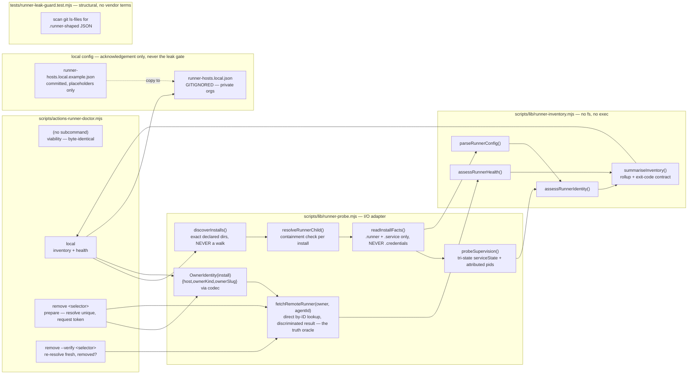

# Plan: Self-Hosted Runner Management (optional, machine-aware)

- **Date**: 2026-08-22
- **Status**: Complete — implemented 2026-08-23 across three clusters:
  `4a6f85ae` (Cluster A, pure inventory judgements + impure probe adapter),
  `67bbebe4` (Cluster B, CLI wiring + private-config surface + leak guard),
  `bd34a732` (Cluster C, docs + close-out), plus field-verification fix
  `673d84a1` (strip UTF-8 BOM before parsing `.runner`) and post-ship fix
  `1c2a4235` (`--json local` ran the wrong command, 2026-08-24). Shipped
  design matches the approved plan function-for-function — the only
  deltas are cosmetic (`resolveRunnerChild` → `resolveRunnerArtifact`) and
  line-number drift in `actions-runner-doctor.mjs` from the plan's own
  code landing. Status was left at `Approved` after implementation; this
  is the correction, not a re-plan.
- **Author**: Claude + pill
- **Scope**: backend (CLI + libs; no UI)

- **Target domain(s)**: `scripts`, `shared-lib`, `tests`, `docs`
- ⚠ **Cross-domain work** — touches >1 domain; the crossings are the normal
  CLI→lib→test→doc spread of one feature, not a new architectural edge.

> **Neighbourhood considered** (`get-neighbourhood`, refresh `19f802e2`):
> `scripts/actions-runner-doctor.mjs::main` banded **`precedent`**
> (`above-floor-standout`, score 0.858) — existing code occupies this space.
> Decision after opening it: **extend, do not write a sibling CLI.** The doctor
> already owns `gh` I/O, repo-slug resolution, the recipe printer and the
> `--selfcheck-relocation` contract; a second runner CLI would duplicate all
> four. `scripts/lib/runner-fallback.mjs::assessRunnerFallback` (`review` band,
> `shared-lib`) is the established **pure-verdict** sibling pattern this plan
> copies for the two new modules. Remaining hits were the same file's helpers.

> **Past incidents to verify against** (2 shown of 2)
>
> | Incident | Affected paths | Status | Lessons |
> |---|---|---|---|
> | **INC-001** — lexical path classification bypassed by symlink | `scripts/lib/sensitive-paths.mjs` | `manual-verification-required` | Canonicalise before classifying; fail closed on resolution error. |
> | **INC-002** — env-gate that only checked "is the variable SET" wiped production | `scripts/lib/db/client.mjs` | `manual-verification-required` | Presence of a variable proves intent, never safety. Positively verify the target. |
>
> Both apply here and are addressed in §Security Considerations: this feature
> walks operator-supplied filesystem roots (INC-001) and its destructive
> sub-command (`remove`) must positively identify its target rather than trust
> that an argument was supplied (INC-002).

---

## 1. Context Summary

**Scope**: backend. **Stack**: `js-ts` (`detect-stack` → `["js-ts","postgres"]`).

### The defect

Nothing in this repo — or on the machine — answers **"is this machine a
runner, and for whom?"**. Measured 2026-08-22 on the author's personal PC:

| Fact | Value |
|---|---|
| Install root | `C:\actions-runner` |
| `.runner` `gitHubUrl` | a **corporate** org/repo |
| `.runner` `agentName` | asserts a **different host** than the machine it runs on |
| `.service` file | names a Windows service that **is not registered** |
| Actually running | a bare foreground `Runner.Listener` process, claiming jobs |

The mismatch surfaced only because a Claude session on a *different, now
powered-off* laptop was diagnosing "the local runner" while the shell commands
executed here. Every local health surface (`Get-Service`, `systemctl --user
is-active`) is either absent or lies; GitHub is the only truthful oracle and
nothing asks it.

### What exists today

**Code Trace** (all pinned at `7c4ce9b0`):

- `npm run runner:doctor` → [`scripts/actions-runner-doctor.mjs:119`](../../scripts/actions-runner-doctor.mjs) `main()`
  → `resolveRepoSlug()` (`:71`, via `parseOriginRepo` from
  [`scripts/lib/branch-protection.mjs`](../../scripts/lib/branch-protection.mjs))
  → `gh()` (`:55`, `execFileSync`) for `repos/<slug>/actions/permissions` (`:134`)
  and `POST …/actions/runners/registration-token` (`:145`)
  → [`scripts/lib/runner-fallback.mjs:40`](../../scripts/lib/runner-fallback.mjs) `assessRunnerFallback()`
  → `printRecipe()` (`:102`) or `emit()` (`:159`).
- The CLI is **already synced to consumers**:
  [`scripts/sync-to-repos.mjs:319`](../../scripts/sync-to-repos.mjs) declares it and
  [`scripts/lib/sync-inventory.mjs:67`](../../scripts/lib/sync-inventory.mjs) mirrors
  the declaration; the walker resolves `lib/runner-fallback.mjs` transitively.
- It already carries the `--selfcheck-relocation` handler
  ([`scripts/actions-runner-doctor.mjs:42`](../../scripts/actions-runner-doctor.mjs))
  but is **absent from `CLI_SMOKE_SET`**
  ([`scripts/lib/sync-isolation-verify.mjs:57`](../../scripts/lib/sync-isolation-verify.mjs)) —
  so the handler is unverified in consumers.
- Tests: [`tests/runner-fallback.test.mjs`](../../tests/runner-fallback.test.mjs)
  covers only the pure verdict function (7 cases).
- **Gap**: every function above is about *a repo's capability*. Not one is about
  *this machine's state*. `printRecipe` ends at "install it as a service" and
  nothing ever looks again.

### Two vendor identifiers are already committed to this PUBLIC repo

Found by grep at `7c4ce9b0` — in scope because the user's constraint is
explicit, and because one of them is in the very file this plan modifies:

1. [`scripts/actions-runner-doctor.mjs:26`](../../scripts/actions-runner-doctor.mjs) —
   a `--repo <employer-org>/some-repo` usage example.
2. the session log's 2026-08-14 entry (now `docs/status/2026-08.md`) — naming the employer as
   the "real GHE org".

Cleared as **not** a leak: the `storyline*` hits in
`docs/experiments/audit-effectiveness/known-defects.candidates.json` come from
`roots: [claude-engineering-skills, wine-cellar-app, ai-organiser]` — the
author's own repos, verified by reading the file's `roots` and its candidates'
`repo` fields. No corporate provenance.

### Patterns reused vs new

| Reused | Where it already exists |
|---|---|
| Pure-verdict lib + impure CLI split | `runner-fallback.mjs` ↔ `actions-runner-doctor.mjs` |
| `<name>.local.json` gitignored + `<name>.local.example.json` committed | [`scripts/lib/consumer-repos.local.example.json`](../../scripts/lib/consumer-repos.local.example.json) + `.gitignore:28` — the *exact* precedent for keeping a private org out of a public repo |
| `assertKnownFlags` / `emit` / `ArgvError` | [`scripts/lib/cli-io.mjs`](../../scripts/lib/cli-io.mjs) |
| Fail-closed path classification | [`scripts/lib/sensitive-paths.mjs`](../../scripts/lib/sensitive-paths.mjs) `resolveAndClassify` |
| Opt-in local weekly check registry | [`scripts/maintenance-checks.mjs`](../../scripts/maintenance-checks.mjs) `CHECKS` + key-set pin in [`tests/maintenance-checks.test.mjs`](../../tests/maintenance-checks.test.mjs) |

**New**: nothing structural. Two lib modules and three CLI sub-commands.

---

## 2. Proposed Architecture



### Key design decisions

**D1 — Extend the existing CLI with sub-commands; do not add a second CLI.**
`precedent` band, and the doctor already owns `gh`, slug resolution and the
sync/relocation contracts (#1 DRY, #5 single source of truth). The no-argument
invocation keeps today's exact behaviour and output — `npm run runner:doctor`
is unchanged for every existing consumer (#18 backward compatibility).

**D2 — Split pure verdict from impure probe, mirroring `runner-fallback.mjs`.**
Every *judgement* (is this wedged? is this identity dishonest?) is a pure
function over already-gathered facts, unit-testable with synthetic fixtures and
no machine state (#11 testability). Only `runner-probe.mjs` touches fs/exec/network.
This is what makes the vendor-separation constraint satisfiable: the tests that
exercise the judgements never need a real runner, so no real org name is ever
required to make the suite meaningful (§Testing).

**D3 — GitHub is the only health oracle; the local supervisor is evidence, not truth.**
`assessRunnerHealth` consumes the `gh api …/actions/runners` row. The wedged
signature recorded from the wine-cellar incident — `status: "offline", busy: true`
— gets its **own verdict**, distinct from plain `offline`, because those two
demand different actions (#19 observability). Local supervision state is reported
*beside* the verdict as a possible contradiction, never folded into it.

**D4 — `unknown` is a first-class verdict and is never rendered as healthy.**
`gh` missing, unauthenticated, rate-limited, or 403 on that org ⇒ `unknown`
(#16 graceful degradation). This is the "audit your success paths" rule from
`pre-ship-empirical-verify.md`: the failure mode to design against is a report
that reads green having checked nothing.

**D5 — WSL is `not-probed` by default, and says so.**
Reaching into a WSL distro (`wsl -d X …`, or a `\\wsl$\X\…` UNC path) **starts
the distro**, so the probe would manufacture the health it reports — the exact
instrument trap recorded on 2026-08-13. Default: do not probe; emit
`wsl: not-probed`. Opt in with `--include-wsl`, which prints why it is not the
default. **Absence of a probe is reported as `notProbed`, never as zero runners**
(#19; the same honesty rule the arch-coverage envelope uses).

**D6 — Private/corporate facts live in a gitignored local file with a committed
example; its job is acknowledgement, not enforcement.** Verbatim reuse of the
`consumer-repos.local.json` pattern (#4 no hardcoding, #5 single source of
truth). The local file declares extra install roots, this machine's expected
identity, and orgs the operator has *acknowledged* so `foreign-owner` /
`host-name-mismatch` stop nagging (§3 — each finding suppressible only by its
own declaration). Nothing corporate ever enters a tracked file. **It is
deliberately not the leak-detection policy input** (R1 H5) — that gate is
structural and needs no such file (§9/§10).

**D7 — `remove` is a two-step, re-invokable state machine, not one command
spanning a human action (R1 H3 fix).** A single process cannot request a token,
wait for the operator to run GitHub's own `config remove` in another directory,
and then re-check — that requires either blocking interactively (this is a
one-shot CLI, per `cli-io.mjs`'s own `finishAndExit` doctrine) or being invoked
twice. So it *is* invoked twice, explicitly:

- `remove <selector>` (**prepare**) — resolves `<selector>` (an `agentName` or
  `agentId`) against **local installs only**, requiring **exactly one** match
  (zero or >1 → refuse, naming the ambiguity, nothing requested). It then
  calls `fetchRemoteRunner` for that install's own `{host, ownerKind,
  ownerSlug, agentId}` tuple (§3, built by the `OwnerIdentity` codec, D12) —
  **revised Gemini G2**: because remote resolution is now a direct by-ID
  lookup (D11), the remote side can only ever be `available` (one row) or
  `not-registered` (zero) by construction — there is no ">1 remote match"
  case left to guard for once the local side is unique. `available` proceeds
  normally; **`not-registered` also proceeds** — printing an explicit "already
  deregistered on GitHub — this will only clean up the LOCAL configuration"
  warning, because an orphaned local install (exactly the `not-registered`
  *problem* `assessRunnerHealth` reports) is precisely the case an operator
  needs `remove` to handle, and R2's stricter rule made it unreachable. Any
  other remote status (`unavailable`/`forbidden`/`malformed-response`/
  `untrusted-host`) still refuses — the target's true state can't be
  confirmed, so no token is requested. On a proceeding match: request a
  removal token, then render the result as **separate labelled fields** —
  install directory, token, the `config remove` line, the verify command —
  never one opaque copy-paste string (R3 M1 fix, below) — with the verify
  command's tuple spelled out as explicit flags, not a selector.

  **Gemini G2 — the recipe is service-aware.** Running `config remove` while
  the runner is still registered as a supervised service is exactly the
  hazard this feature was built to reason about (the motivating install had a
  `.service` file at all) — it can be rejected by the runner's own tooling or
  leave an orphaned, endlessly-restarting service behind. When
  `install.supervision.serviceState` is `registered` **or** `unknown` (a
  `.service` declaration exists and its true state is unconfirmed — the
  conservative direction, matching fail-safe destructive operations), the
  printed recipe adds a **prior** step: the platform-appropriate service
  stop-and-uninstall commands (from the runner's own `svc.sh`/service
  tooling), to run **before** `config remove`. `no-declaration` and
  `not-registered` skip that step — there is no supervised service to stop.
- `remove --verify --host <host> --owner-kind <repo|org> --owner <slug>
  --agent-id <id>` (**verify**) — **R2 H1 fix**: `config remove` is expected to
  delete the local `.runner` file, so verify cannot re-derive the tuple from a
  local install that may no longer exist, and a bare `agentName` is not unique
  enough to stand in for it (§Risk register). `prepare`'s printed verify command
  therefore carries the **full, self-contained, non-secret target descriptor**
  it already resolved uniquely — verify only re-validates that descriptor
  through the same `OwnerIdentity` codec (rejecting a malformed one exactly as
  discovery would) and re-checks it against `trustedHosts` (D13), then fetches
  fresh (a new `fetchRemoteRunner` by-ID call, never cached, D11) and reports
  `removed` (`status:'not-registered'`) or `still-registered`
  (`status:'available'`), the latter exiting non-zero. **Gemini G1** — the
  other three `RemoteResult` statuses (`unavailable`/`forbidden`/
  `malformed-response`/`untrusted-host`) are a **third, distinct outcome**:
  verification was **inconclusive**, not a confirmed removal. This exits
  non-zero with its own distinguishable message — never exit 0 (which would
  read as a confirmed `removed`) and never the same code/text as
  `still-registered` (which would read as a confirmed failure to remove when
  the truth is "couldn't check"). Stateless by design: no local file records
  the pending removal, so
  there is no third mutable-state surface to gitignore and get wrong.

(#13 idempotency, #15 error handling; verifying what the consumer received
rather than what the producer sent is the standing verification-discipline
rule.) Orchestrates GitHub's own `config`/`svc` scripts — never reimplements them.

**D8 — Redact `serverUrl` to its host.** The `.runner` file's `serverUrl` embeds
a long opaque capability-bearing path segment. The inventory keeps the host and
drops the rest; `.credentials` and `.credentials_rsaparams` are never opened
(§Security Considerations).

**D9 — Discoverability rides the opt-in weekly maintenance replica, not `check-setup`.**
The feature must not be a command nobody knows to run — that leaves the original
blindness intact. `maintenance-checks.mjs` is already opt-in, already
default-OFF, already the local-first-CI surface, and already silent when a check
has nothing to say. `check-setup.mjs` is deliberately **not** touched (§8).

**D10 — Discovery reads exact declared directories; it never walks a filesystem
(R1 H4 fix).** The motivating root, `C:\actions-runner`, sits **outside** the
repo, so the repo's own `sensitive-paths.mjs` (a *repo-boundary* classifier) does
not apply here — reusing it as originally drafted was the contradiction R1
caught. Each default and operator-declared root is an **exact candidate install
directory**, never a recursive search root: canonicalize the root once
(`fs.realpathSync`, fail-closed on a broken symlink → that install becomes an
error entry, never aborts the run), then read *only* its two named children
(`.runner`, `.service`) after canonicalizing each and requiring it resolve
beneath the canonicalized root. Reading exactly two named files per root is
itself the bound — no depth/file-count limit is needed because nothing ever
recurses. `runner-probe.mjs` gets its own `resolveRunnerChild(root, name)`
helper for this — a boundary check scoped to *an install directory*, not a
repo, so it is deliberately not `resolveAndClassify` (§Security Considerations).

**D11 — Look up each install by its own `agentId`; never list-and-compare
(revised Gemini G1 fix, was R1 H1+H2's paginated list design).** `RunnerInstall.owner`
parses `gitHubUrl` into `{host, ownerKind, ownerSlug}` (§3, via the `OwnerIdentity`
codec, D12) rather than assuming `github.com` — this is what makes a GHES
install (a different `gh --hostname`) and a `gh` session authenticated to the
wrong host distinguishable failures instead of a silent wrong answer. **R1–R2
had this fetch the entire remote runner list per owner group and paginate it
to completion, comparing the local `agentId` against every row — Gemini
correctly flagged this as unscalable: O(N) remote fetch for O(1) local
installs, guaranteed pagination-cap failure on any large or busy org, and
needless rate-limit pressure.** GitHub's runner API supports a **direct
by-ID lookup** (`GET …/actions/runners/{agentId}`), so `fetchRemoteRunner(owner,
agentId)` queries exactly the one entity being asked about: one call per
install, no listing, no pagination, and a 404 **is** `not-registered` —
authoritative by construction, not derived from list completeness. This is
strictly simpler than the R1/R2 design as well as more scalable: pagination,
the repeated-cursor guard, and the page cap all disappear because there was
never a list to page through.

**D12 — One canonical `OwnerIdentity` codec is the sole producer and comparator
of the owner tuple; nothing else parses a `gitHubUrl` or a git remote (R2 M1
fix).** The tuple is used as a grouping key, an acknowledgement key, a
git-remote comparison key, a `trustedHosts` check (D13), and a destructive-op
identity (D7) — five call sites is exactly the condition under which "parse it
inline at each site" silently fragments into five slightly different
normalisers. `parseOwnerFromGitHubUrl` / `parseOwnerFromGitRemote` (the latter
handling both HTTPS and SSH remote forms, optional `.git`) reject URL userinfo,
query, fragment, and unsupported schemes, and produce one `OwnerIdentity` with
a case-folded comparison form and a separate display form; `ownerKind` is
derived structurally from path segment count (one segment → `org`, two →
`repo`) — **except a first segment of `enterprises` is explicitly rejected
(returns `null`), not misread as a two-segment repo owner** (Gemini G2 fix: an
enterprise-scoped runner's `gitHubUrl` is `https://github.com/enterprises/<name>`,
which is structurally 2 segments and would otherwise be misclassified as
`{ownerKind:'repo', ownerSlug:'enterprises/<name>'}` — a wrong owner that
generates confusing 404s rather than an honest "unsupported" outcome).
Enterprise-level runners are out of scope for v1 (§5) — rejecting the shape at
parse time makes that an explicit, visible outcome instead of a silent
misclassification. Lives in
`runner-inventory.mjs` — it is pure parsing, so it belongs beside the other
judgements rather than becoming a third module (§5 right-sizing).

**D13 — A remote host is untrusted by default; only `github.com` is queried
without explicit authorization (R2 H3 fix, security).** `owner.host` is read
from a local file (`.runner.gitHubUrl`) that this tool does not control the
provenance of — treating it as an implicit authorization to direct `gh`'s
authenticated session at an arbitrary GHES host would let a tampered install
root redirect egress. `RunnerHostsConfigSchema.trustedHosts` (§3, default
`['github.com']`) is consulted **before** any `gh` invocation for a group;
a host outside it never reaches `gh` at all and the group's `RemoteResult` is
`untrusted-host` (folds into `unknown` health, D4). Distinct from
`acknowledgedOwners`, which is advisory-suppression only and was never an
egress-authorization control (§3's never-cross-suppress rule extends here:
acknowledging an owner does not trust its host).

---

## 3. Data contracts

### `RunnerInstall` (what `runner-probe` yields, what `runner-inventory` consumes)

```js
{
  root: 'C:/actions-runner',        // canonicalised (D10)
  owner: {
    host: 'github.com',             // parsed from .runner's gitHubUrl, NOT assumed
    ownerKind: 'repo'|'org',
    ownerSlug: 'OWNER/REPO'|'ORG',
  },
  groupKey: 'github.com::repo::OWNER/REPO',  // owner tuple joined — the fetch/group key (D11)
  agentId: 24,
  agentName: 'some-name',
  workFolder: '_work',
  serverHost: 'pipelinesghubeus22.actions.githubusercontent.com',  // host ONLY (D8)
  supervision: {
    declaredServiceName: string|null,     // from .service, if present
    serviceState: 'no-declaration'|'registered'|'not-registered'|'unknown',
    serviceStateReason: string|null,      // populated only when 'unknown'
    foregroundPids: number[],              // ALL Runner.Listener processes attributed by canonical cwd/exe path (D10-style containment) — informational
    unsupervisedForegroundPids: number[],  // Gemini G1 — the subset of foregroundPids NOT parented by the service supervisor; THIS is what supervision-mismatch tests
  },
  configuredAt: '2026-08-20T…',        // .runner mtime — provenance, not a claim
}
// or, when a root's .runner is missing/unreadable/unrecognised-shape:
{ root: 'C:/actions-runner', error: { code: 'NOT_CONFIGURED'|'UNREADABLE'|'MALFORMED', detail } }
```

`parseRunnerConfig` validates only the fields above; an unrecognised shape
returns the `error` variant rather than destructuring optimistically (§6).

### `OwnerIdentity` codec (D12 — the sole owner-tuple parser/comparator)

```
parseOwnerFromGitHubUrl(url) → OwnerIdentity | null
parseOwnerFromGitRemote(url) → OwnerIdentity | null   // https AND ssh forms, optional .git
OwnerIdentity = {
  host: string,          // lowercased; no port unless non-default
  ownerKind: 'repo'|'org',   // path segment count: 1 → org, 2 → repo
  ownerSlug: string,     // canonical (case-folded) comparison form
  display: string,       // original-case form, for human output only
}
ownerGroupKey(id) → string          // deterministic — the ONLY way a groupKey is built
ownerIdentityEquals(a, b) → boolean // case-insensitive on host + ownerSlug
```

Rejects URL userinfo, query, fragment, and any scheme other than `https:`/`ssh:`
(or the bare `git@host:owner/repo.git` SCP-like form). Every call site that
needs an owner tuple — grouping, `acknowledgedOwners`, `trustedHosts`, the git
remote comparison for `foreign-owner`, and `remove`'s identity binding — goes
through this codec; none re-derives the tuple by hand (R2 M1).

### Remote resolution (D11, revised Gemini G1 — direct by-ID lookup, one call per install)

```
fetchRemoteRunner(ownerIdentity, agentId) → RemoteResult   // GET …/actions/runners/{agentId} — repo- or org-scoped per ownerKind

RemoteResult =
  | { status: 'available', row: RemoteRunnerRow }   // the runner exists — id/name/status/busy/labels
  | { status: 'not-registered' }                     // 404 — authoritative by construction, no list comparison needed
  | { status: 'unavailable', reason: string }        // gh unreachable / no session for this host
  | { status: 'forbidden' }                           // authenticated, but no access to this owner
  | { status: 'malformed-response' }                  // gh returned something the parser can't trust
  | { status: 'untrusted-host' }                      // D13 — host not in trustedHosts; gh was never invoked
```

**No pagination, no listing, no page cap (Gemini G1 fix — replaces R1–R2's
list-and-compare design).** Each install is looked up by its own `agentId`
against exactly the endpoint its `ownerKind` implies (repo- or org-scoped) —
one call per install, O(1) per entity regardless of how many runners the owner
has in total. This is what makes `not-registered` authoritative without ever
needing a "complete list": a 404 on the specific ID is definitive.
`untrusted-host` still short-circuits before any network call — the trust
check (D13) runs first, once per install's owner tuple.

### `assessRunnerHealth(remoteResult)` → verdict (revised Gemini G1 — no `localAgentId` comparison needed)

| verdict | condition | rendered as |
|---|---|---|
| `online-idle` | `remoteResult.status==='available'`, `row.status:'online'`, `busy:false` | healthy |
| `online-busy` | `remoteResult.status==='available'`, `row.status:'online'`, `busy:true` | healthy |
| `wedged` | `remoteResult.status==='available'`, `row.status:'offline'`, `busy:true` | **problem** — job assigned that will never report |
| `offline` | `remoteResult.status==='available'`, `row.status:'offline'`, `busy:false` | problem |
| `not-registered` | `remoteResult.status==='not-registered'` — a direct 404 on this install's own `agentId`, authoritative by construction | problem |
| `unknown` | `remoteResult.status` is `unavailable`/`forbidden`/`malformed-response`/`untrusted-host` | **never healthy** (D4) |

### `assessRunnerIdentity(install, { hostname, config, currentRepoOwners })` → findings

Closed set, all **advisory** (they never set a non-zero exit):

| id | fires when | suppressed by (never cross-suppressed — R1 M1 fix) |
|---|---|---|
| `host-name-mismatch` | `config.agentNameIsHostname === true` **(R3 M3 fix — opt-in, default off)** AND `agentName` contains a host-shaped token that is not this machine's hostname | `config.expectedHostname` / `config.hostnameAliases` **only** |
| `supervision-mismatch` | `serviceState==='not-registered'` (declared but absent), or `serviceState==='registered'` AND `unsupervisedForegroundPids.length>0` (Gemini G1 — see below) — **never** fires on `unknown` or `no-declaration` | not suppressible — it's evidence, not a name heuristic |
| `foreign-owner` | `currentRepoOwners.status==='available'` AND the owner tuple matches none of `currentRepoOwners.owners` (via scope-aware comparison, Gemini G1 below) AND is not in `config.acknowledgedOwners` — **never fires when `currentRepoOwners.status` is anything else** (R3 H2 fix — silence over a guess, D4-style) | `config.acknowledgedOwners` **only** |
| `undeclared-install` | the install root is outside both the built-in defaults and `config.extraRoots` | n/a — informational |

**R3 M3 — the hostname heuristic is opt-in, not on-by-default.** The R2
grammar (any 2-label hyphen/dot token) fires on ordinary runner names —
`build-linux`, `release-2026`, `team.alpha` — none of which assert a host. An
always-on heuristic that noisy trains operators to ignore the finding,
defeating it. `agentNameIsHostname` (new schema field, default `false`) makes
the check dormant until an operator declares "this fleet names agents after
their host" — exactly the motivating incident's own convention — at which
point the grammar and suppression rules apply as before.

**R3 H2 — `foreign-owner` needs its comparison input plumbed, not assumed.**
`currentRepoOwners` is read **once per CLI invocation** (not per install) by a
new adapter, `readCurrentRepoOwners()`, which parses every configured git
remote (not just `origin`) through `parseOwnerFromGitRemote` (D12) and returns
an explicit evidence status — `available(owners)` / `not-a-repository` /
`unavailable` / `malformed` — never a silently empty list standing in for "no
remotes." `foreign-owner` only ever fires on `available`; every other status
means the comparison could not be made, and the finding stays silent rather
than guessing.

**Gemini G1 — the comparison must be scope-aware, not a flat tuple match.**
Git remotes are always **repo**-scoped (`ownerKind:'repo'`, `ownerSlug:
'OWNER/REPO'`) — that is what a git remote *is*. A strict `ownerIdentityEquals`
comparison therefore can never match a legitimate **org**-scoped runner
(`ownerKind:'org'`, `ownerSlug:'OWNER'`) against any repo remote, so every valid
org runner would falsely read as `foreign-owner`. The comparison is therefore
kind-dependent: a `repo`-kind install compares the full tuple via
`ownerIdentityEquals` as before; an `org`-kind install instead compares its
`ownerSlug` against the **owner segment** (the part before `/`) of each
same-host repo remote — a new codec function, `ownerCoversRepo(orgIdentity,
repoIdentity)` (D12), so this scope-aware rule lives in exactly one place
rather than being reimplemented at the call site.

Each finding carries `{ id, severity, detail, remedy }`. `remedy` is a
sentence, not a command to auto-run — this is a **nudge, not a gate**, matching
the quick-fix layer's stated philosophy.

**Hostname-candidate grammar (R2 M3 fix — `host-name-mismatch` made
deterministic).** A candidate token is any `[a-z0-9]` run of ≥2 labels joined
by `-` or `.` found in `agentName` after case-folding, with the machine's own
`os.hostname()` (also case-folded, and compared both as given and with its
first label alone — so a FQDN-vs-short-name difference does not itself count as
a mismatch). The finding fires only when a candidate token matches neither the
machine's own hostname (either form) nor any entry in `expectedHostname` /
`hostnameAliases` (also case-folded). No other punctuation or Unicode handling
is in scope for v1 — an agent name with no host-shaped token never fires.

**Supervision platform matrix (R2 M2 fix — concrete per-platform contract):**

| Platform | Default install roots | Service check | Process attribution |
|---|---|---|---|
| `win32` | `C:\actions-runner`, `%USERPROFILE%\actions-runner` | `sc.exe query <serviceName>` via `execFile` array args, 3s timeout | `Get-CimInstance Win32_Process` filtered to `Runner.Listener.exe`, `ExecutablePath`/`CommandLine` canonicalised and checked beneath the install root |
| `linux`/`darwin` | `~/actions-runner`, `/opt/actions-runner` | `systemctl --user is-enabled/is-active <unit>` (from `.service`) via `execFile` array args, 3s timeout | Candidate discovery: `pgrep -f Runner.Listener`. Per-candidate: `/proc/<pid>/cwd` readlink (linux) or `lsof -p <pid>` cwd (darwin) for attribution, canonicalised and checked beneath the install root; `ps -o ppid= -p <pid>` for the parent-chain walk (Gemini G3 — the command this row previously omitted) |

Every adapter uses `execFile` with an argument array — never shell
interpolation — and every process executor is injectable (a seam, per D2), so
tests assert `serviceState` and attribution without spawning anything real.
`.service` absent → `serviceState:'no-declaration'`, not a probe attempt.

**Gemini G1 — a healthy supervised runner ALWAYS has a foreground
`Runner.Listener` process; that fact must not itself be the mismatch signal.**
The service supervisor *is what starts* `Runner.Listener`
(`Runner.Service.exe`→`Runner.Listener.exe` on Windows, `runsvc.sh`→
`Runner.Listener` via systemd on POSIX) — so the R2 rule "`registered` AND any
foreground pid" would fire on every correctly-running installation, not just
the motivating incident's bare-process case. `probeSupervision` therefore
walks each attributed `Runner.Listener` process's **parent chain** and
excludes any whose parent is the platform's own service-supervisor process;
what remains is `unsupervisedForegroundPids` — a `Runner.Listener` that exists
**despite**, not **because of**, the registered service. `foregroundPids`
(the full set) is retained for informational display; only the unsupervised
subset drives `supervision-mismatch`.

**Gemini G3 — a `wsl`-kind root gets its own execution context, not the host
OS's adapters.** Running `sc.exe`/`Win32_Process` (the Windows adapter) against
a WSL-hosted Linux runner silently checks the wrong thing entirely. Under
`--include-wsl` (the flag that already authorizes reaching into the distro,
D5), a `wsl`-kind root's supervision probe wraps the **Linux** adapter's exact
commands in `wsl.exe -d <distro> --` rather than running the host's own
platform adapter — the distro, not the host OS, determines which adapter
applies. The same root-`kind` also selects the shell dialect for recipe
generation (below) — never the CLI process's own host OS.

**WSL is an explicit, separately typed root, never inferred from a path shape
(R2 M2 fix).** A WSL root is declared as `{ distro, pathInDistro }`, not a bare
UNC string — so "is this a WSL path" is a type check, not a heuristic. Any such
root is skipped (folded into `notProbed`, D5) unless `--include-wsl` is passed;
only under that flag does discovery reach into the distro at all, which is the
one operation documented as capable of starting it.

### Local config schema (`RunnerHostsConfigSchema`, M1 fix)

```js
z.object({
  // R3 H4 fix — discriminated, not a bare string: a WSL root cannot be
  // represented by a path string without reintroducing the shape-guessing D5
  // rejects. Built-in default roots are always the 'local' variant internally.
  extraRoots: z.array(z.discriminatedUnion('kind', [
    z.object({ kind: z.literal('local'), path: z.string() }),
    z.object({ kind: z.literal('wsl'), distro: z.string(), pathInDistro: z.string() }),
  ])).default([]),
  expectedHostname: z.string().optional(),          // THIS machine's own hostname alias
  hostnameAliases: z.array(z.string()).default([]), // additional accepted agentName host tokens
  agentNameIsHostname: z.boolean().default(false),  // R3 M3 — opt-in gate for host-name-mismatch
  acknowledgedOwners: z.array(z.object({
    host: z.string(), ownerKind: z.enum(['repo','org']), ownerSlug: z.string(),
  })).default([]),
  trustedHosts: z.array(z.string()).default(['github.com']),  // D13 — egress allowlist, distinct from acknowledgedOwners
  notes: z.string().optional(),
}).strict()
```

`trustedHosts` is validated through the same `OwnerIdentity` host-normalisation
(D12) before comparison, so `GitHub.com` and `github.com` are not treated as
distinct entries. A `wsl`-kind root is only ever probed under `--include-wsl`
(D5) — declaring one does not itself start the distro.

`.strict()` deliberately (a non-strict schema silently drops a typo'd key —
repo lesson). A **present but malformed/unknown-key** file is an operational
error (`ok:false`), never treated as a clean empty config; an **absent** file
is the one legitimate empty-config case.

### Command-result contract (R1 H6, revised R2 H2+H4 — one reconciled envelope)

**Two distinct layers, not one contract (R2 H4 fix):** the R1 draft conflated
the `runner-probe.mjs` adapter contract with the CLI's own JSON output; they
serve different failure classes and are specified separately.

**1. Adapter layer** (`runner-probe.mjs` internals) — `{ok:true, value}` /
`{ok:false, error:{code,message}}`, exactly the `vcs.mjs` convention, where
`ok:false` means a **procedural** failure (couldn't spawn `gh`, unreadable file,
timeout). A domain-level negative outcome that the operation itself completed
— `gh` ran and returned 403, a group is `untrusted-host` — is `ok:true` with
that outcome as the `value` (a `RemoteResult`, or the `RunnerInstall` error
variant). Only "the adapter could not even attempt this" is `ok:false`.

**2. CLI layer** (`local`'s own output) — `summariseInventory()`'s return value
IS the CLI's top-level envelope on success; there is no second wrapping:

```js
{
  ok: true,
  schemaVersion: 1,
  installs: [ /* RunnerInstall + healthVerdict + remoteStatus + identityFindings — 'discovered' candidates only, R3 H3 */ ],
  candidates: [ { root, source: 'built-in'|'extraRoot'|'wsl', state: 'absent'|'discovered'|'error', error: {code,detail}|null } ],
  notProbed: { wsl: boolean, reason: string|null },   // D5
  rollup: 'clean' | 'advisory' | 'unhealthy' | 'unknown' | 'partial-error',
  summary: { totalInstalls, healthy, unhealthy, unknownHealth, advisoryFindings, installErrors },
}
// or, ONLY when no summary could be produced at all (e.g. an explicit --config
// path is unreadable, or an uncaught internal error) — never for a partially
// degraded run, which is still `ok:true` with problems reflected in `rollup`:
{ ok: false, schemaVersion: 1, error: { code, message } }
```

An individual install erroring or a group coming back `unavailable`/
`untrusted-host` is a **degraded but complete** run — still top-level
`ok:true`, visible via `rollup` and `summary.installErrors`. Top-level
`ok:false` is reserved for "no summary exists", the same asymmetry
`durableWrite`'s `written/spilled/lost/skipped` outcomes use elsewhere in this
repo (none of the first three is itself a process failure).

**A root that is simply absent is not an error (R3 H3 fix — the R2 draft
conflated the two).** A default root like `C:\actions-runner` not existing on a
machine with no runner is the ordinary case, not a fault: it is reported as a
`candidates[]` entry with `state:'absent'` and contributes **nothing** to
`rollup` or `summary.installErrors` — it never becomes a `RunnerInstall` at
all. Only `state:'error'` (present but unreadable, malformed, or an
escaping/broken symlink, D10) counts toward `partial-error`. This is what makes
`local --json` on a machine with zero runners correctly report `rollup:'clean'`
(the R1-drafted test case) rather than failing the `--strict` maintenance
check on every machine that has no runner installed at all — the exact
contradiction R3 caught between that test case and D10's fail-closed rule for
a *present-but-broken* root. An explicitly declared `extraRoots` entry that
turns out absent still appears in `candidates[]` (useful for a mistyped path)
but is likewise never an error.

`rollup` precedence (highest wins): `partial-error` (≥1 install `error` variant)
› `unhealthy` (≥1 `wedged`/`offline`/`not-registered`) › `unknown` (≥1 `unknown`
health — including `untrusted-host` — none unhealthy) ›
`advisory` (≥1 identity finding, all else healthy) › `clean`.

**Exit codes** — `local` is a diagnostic by default (§8 D9: advisory, nudge not
gate) and exits 0 for every rollup except top-level `ok:false`. **`--strict`**
(opt-in, used by the `maintenance-checks` registration below) maps `unhealthy`
/ `unknown` / `partial-error` rollups to exit 1 — `advisory` still never gates,
even under `--strict`, per §8's stated trade-off.

**`--json` and `--quiet-when-clean` are mutually exclusive (R2 H2 fix).**
`--json` always emits exactly **one** `emit()` call on stdout — including a
clean result — because a machine reader needs one schema-shaped line every
time, not a schema line only sometimes. `--quiet-when-clean` is **human-output
mode only**: it suppresses the printed report when `rollup==='clean'` (a fully
authoritative clean result, never an `unknown` one dressed as quiet).
Passing both is an `ArgvError` — refuse rather than silently pick a winner.
The `maintenance-checks` registration below therefore uses `local --json
--strict` (no `--quiet-when-clean`; the maintenance framework's own step
reporting already decides what to print). All diagnostics go through `log()`
on stderr in either mode, never interleaved with the JSON stdout line.

---

## 4. Execution model (Phase 1.5)

Discovery, fact-reading and supervision-probing are **independent per
install** — install A never depends on install B, so that part of the
inventory is a plain map over roots with per-install error isolation (one
unreadable root degrades to the `{ error }` variant, never aborts the run).

**Each install resolves independently against its own `agentId` (revised
Gemini G1 — was a grouped list-fetch in R1/R2).** `trustedHosts` (D13) is
checked against the install's owner tuple (via the `OwnerIdentity` codec, D12)
**before** any network call; then `fetchRemoteRunner(owner, agentId)` looks up
exactly that one entity. There is no grouping-for-fetch step to get right or
wrong, because there is no list to fetch — the earlier "one call per group"
design existed to avoid re-paginating a list per install, and removing the
list removes the need for it. Checking trust after the call instead of before
would have already leaked the request.

**`remove` is two independent invocations, not one chain** (D7): `prepare`
requires resolving the selector to exactly one local install (remote status is
then checked, not matched — `available`/`not-registered` both proceed, per
Gemini G2) before requesting a token, then prints that tuple as explicit flags
for `verify` — it does not ask the operator to remember or re-supply a
selector that may no longer resolve once `config remove` has deleted the local
`.runner` (R2 H1). `verify` re-validates the
printed descriptor through the same codec and `trustedHosts` check, re-resolves
fresh, and reports `removed` / `still-registered`, the latter exiting
non-zero — a truthful failure beats a silent success (INC-002's lesson applied
to a non-DB target). Nothing is persisted between the two invocations.

---

## 5. Right-sizing gate

New structure introduced: 2 lib modules, 1 gitignored config surface, 3
sub-commands.

- **Band-aid extreme** — add a `--local` flag to the doctor that shells out and
  prints raw output. No oracle, nothing testable, and the identity judgements
  live in prose the next reader re-derives. The blindness returns the moment the
  output format changes.
- **Over-engineered extreme** — a runner *manager*: a config-driven installer, a
  supervised background health daemon, a cross-machine registry, scheduled
  re-registration, org-level runner provisioning. None of it has a current
  requirement, and it directly contradicts the repo's local-first-CI doctrine by
  making runners easier to proliferate.
- **Chosen, and the current requirement each piece serves** —
  `runner-inventory.mjs` exists because the identity/health judgements need to be
  asserted without a real runner (the vendor constraint makes this mandatory, not
  merely nice); `runner-probe.mjs` exists because the fs/exec surface must be
  isolated to keep those assertions synthetic; the gitignored config exists
  because the motivating machine has a corporate runner that must be declarable
  without naming the employer; the three sub-commands exist because the incident
  produced three questions (what is here? is it healthy? how do I remove it?).
  Nothing here is "might need it later".

**Manual vs scripted**: the vendor scrub is 2 sites — well under the ~5
threshold and judgement-heavy (one is a usage example, one is a historical
narrative). Done by hand.

---

## 6. Sustainability Notes

- **Assumption that will change**: the `.runner` JSON schema is GitHub's, not
  ours. `parseRunnerConfig` therefore validates *the fields we read* and returns
  `{ ok:false, error }` on a shape it does not recognise, rather than destructuring
  optimistically. A future field addition is a no-op; a rename degrades one
  install to an error entry with the reason.
- **Extension point deliberately built in**: `assessRunnerIdentity`'s finding set
  is a table, so a new honesty check is one row plus one test — the same shape as
  `quickfix-patterns.mjs`.
- **Coupling**: the CLI depends on both libs; neither lib depends on the CLI or on
  each other's I/O. Swapping `gh` for the REST API directly touches
  `fetchRemoteRunner` alone (1 file).
- **Migration path**: if runner management ever outgrows a doctor, the pure module
  is already the reusable core; nothing would need rewriting.

---

## 7. File-Level Plan

| File | Intent | Purpose |
|---|---|---|
| `scripts/lib/runner-inventory.mjs` | create | **Pure.** `parseRunnerConfig`, `assessRunnerHealth`, `assessRunnerIdentity`, `summariseInventory`, `RunnerHostsConfigSchema`, `RUNNER_IDENTITY_FINDINGS`, `quoteForShell(value, dialect)` (R3 M1, dialect selected by root `kind` per Gemini G3), the `OwnerIdentity` codec (D12): `parseOwnerFromGitHubUrl`, `parseOwnerFromGitRemote`, `ownerGroupKey`, `ownerIdentityEquals`, `ownerCoversRepo` (Gemini G1 — org-vs-repo scope-aware comparison). No `fs`, no `child_process`, no network. Exports `_internals` per repo convention. |
| `scripts/lib/runner-probe.mjs` | create | **Impure adapter.** `defaultInstallRoots(platform)`, `discoverInstalls` (exact declared directories, D10 — never a recursive walk; returns `installs` + `candidates[]` with `absent`/`discovered`/`error` states, R3 H3), `resolveRunnerChild(root, name)` (containment check scoped to an install dir), `readInstallFacts` (`.runner` + `.service` only), `probeSupervision` (per-platform adapters, §3 matrix), `isTrustedHost(owner, config)` (D13 — checked before any network call), `fetchRemoteRunner(owner, agentId)` (direct by-ID lookup, discriminated `RemoteResult`, D11 — Gemini G1 revision, no pagination), `readCurrentRepoOwners()` (R3 H2 — parses every configured git remote via the codec, returns an evidence status), `loadLocalRunnerConfig`. Every function returns `{ok:true, value}` / `{ok:false, error:{code}}` for procedural failures (§3 — a completed domain outcome, even a negative one, is `ok:true`). |
| `scripts/lib/runner-hosts.local.example.json` | create | Committed template, **neutral placeholders only** — `extraRoots` (both `local` and `wsl` variants shown), `expectedHostname`, `hostnameAliases`, `agentNameIsHostname`, `acknowledgedOwners`, `trustedHosts`, `notes`. Schema-distinct from a real `.runner` file (§10), so it does not itself need allowlisting against the leak guard below. |
| `scripts/actions-runner-doctor.mjs` | modify | Add sub-commands `local` and `remove <selector>` / `remove --verify --host <h> --owner-kind <k> --owner <s> --agent-id <id>`; keep the no-arg viability path byte-identical. Extend `KNOWN_FLAGS` (`--include-wsl`, `--strict`, `--quiet-when-clean` — rejected together with `--json`, R2 H2 — `--config`, `--verify`, `--host`, `--owner-kind`, `--owner`, `--agent-id`). Scrub the vendor usage example (§1). |
| `.gitignore` | modify | Ignore `scripts/lib/runner-hosts.local.json`, in the same block as `consumer-repos.local.json`, with the same reasoning comment. |
| `package.json` | modify | `runner:local`, `runner:local:json`, `runner:remove`. |
| `tests/fixtures/runner/synthetic-install/` | create | A synthetic `.runner` + `.service` install tree, **all placeholder values**, checked in as test fixture data (git-trackable — the one directory explicitly allowlisted against the leak guard below, §9/§10). Shared by `runner-probe`, `runner-inventory`, and CLI tests. |
| `tests/runner-inventory.test.mjs` | create | Pure-module suite; synthetic fixtures only. Both directions of every gate; the local-config schema's strict/malformed/absent-file matrix. |
| `tests/runner-probe.test.mjs` | create | Adapter suite over the fixture install tree + injected exec/gh stubs. Pagination, grouping, containment-escape, credential-file non-read. |
| `tests/runner-doctor-cli.test.mjs` | create | Spawns the CLI with a stub `gh` on PATH: `--selfcheck-relocation`, unknown-flag rejection, `local --json` shape on an empty root set, the **no-arg path byte-for-byte unchanged** (M3 fix — asserts stdout/stderr bytes + exit code, not just routing), and `remove`/`remove --verify` ambiguity refusal. |
| `tests/runner-leak-guard.test.mjs` | create | **H5 fix.** Scans tracked files (`git ls-files`, minus `tests/fixtures/runner/synthetic-install/`) for a JSON object literal carrying every key of the real `.runner` shape (`agentId`, `agentName`, `gitHubUrl`, `poolId`) together, or `.credentials`/`.credentials_rsaparams`-shaped content. **No vendor term, no gitignored input required** — it is a structural shape detector, so it is meaningful in a clean CI checkout with zero external configuration. Positive control: an in-memory synthetic `.runner`-shaped blob must trip it. |
| `scripts/lib/sync-isolation-verify.mjs` | modify | Add `actions-runner-doctor.mjs` to `CLI_SMOKE_SET` (legitimate: already declared in `sync-to-repos.mjs`). |
| `scripts/maintenance-checks.mjs` | modify | New `runner-health` entry in `CHECKS` (`requiredEnv: []`, invokes `local --json --strict` — no `--quiet-when-clean`, since `--json` always emits one envelope regardless, R2 H2). |
| `tests/maintenance-checks.test.mjs` | modify | Add the key to the pinned key-set — the second of the two lock-step edits. |
| `docs/runbooks/actions-runner-doctor.md` | modify | Document the sub-commands, the verdict/finding/rollup tables, the WSL non-probe rationale, the local-config recipe, the two-step `remove`, and the two **code-enforced** guardrails distinguished from the one **documentation-only** guardrail (M4). |
| `docs/runbooks/local-maintenance-checks.md` | modify | Add the `runner-health` row to the check inventory. |
| `AGENTS.md` | modify | Extend the existing runner stub. States plainly which invariants are code-enforced (GitHub is the oracle; probing WSL starts it) versus the one that is a **documented operator invariant with no technical control** (a runner may not carry a ruleset-required check — M4). |
| `status.md` | modify | Session entry + scrub the employer name from the 2026-08-14 entry. |

### 7b. Implementation Phases

**Phase 1 — Pure verdict core**: the judgements, with no machine state.
Files: `scripts/lib/runner-inventory.mjs` (create), `tests/runner-inventory.test.mjs` (create), `tests/fixtures/runner/synthetic-install/` (create).

**Phase 2 — Impure probe adapter**: discovery + fact-reading + `gh`, with
injectable seams so Phase 1's tests never need a real runner.
Files: `scripts/lib/runner-probe.mjs` (create), `tests/runner-probe.test.mjs` (create).

**Phase 3 — CLI sub-commands + private-config surface + leak guard**.
Files: `scripts/actions-runner-doctor.mjs` (modify), `scripts/lib/runner-hosts.local.example.json` (create), `.gitignore` (modify), `package.json` (modify), `tests/runner-doctor-cli.test.mjs` (create), `tests/runner-leak-guard.test.mjs` (create).

**Phase 4 — Registrations + discoverability**.
Files: `scripts/lib/sync-isolation-verify.mjs` (modify), `scripts/maintenance-checks.mjs` (modify), `tests/maintenance-checks.test.mjs` (modify).

**Phase 5 — Docs + vendor scrub**.
Files: `docs/runbooks/actions-runner-doctor.md` (modify), `docs/runbooks/local-maintenance-checks.md` (modify), `AGENTS.md` (modify), `status.md` (modify).

**Close-out (not a phase)**: `npm run plans:index` · `npm test` · `npm run check`.

---

## 8. Risk & Trade-off Register

| Trade-off | Why |
|---|---|
| WSL runners are invisible by default | Probing starts the distro and manufactures the health reported. A visible `not-probed` beats a fabricated zero. |
| Identity findings are advisory, never exit-non-zero | They are heuristics over a name string; a gate on a heuristic is the cried-wolf shape that earns `--no-verify`. |
| `remove` does not run `config remove` itself | It would have to execute a script inside an install directory this tool does not own, as whatever user the runner runs as. Orchestrate + verify is the honest boundary. |

**What could go wrong**: `host-name-mismatch` is the one heuristic here. It fires
only when `agentName` contains a host-shaped token per the grammar in §3's
hostname-candidate contract, and is suppressible **only** by
`expectedHostname`/`hostnameAliases` — never by `acknowledgedOwners`, which
suppresses `foreign-owner` alone (R2 M3: this paragraph previously repeated the
cross-suppression contradiction §3's table was written to close). Its
false-positive direction is a harmless advisory line; its false-negative
direction is today's status quo.

**Deliberately deferred** (with the independence that makes the defer honest —
per AGENTS.md, a defer must name independence, not authorship):

- **`check-setup.mjs` integration.** Adding process/service enumeration to the
  setup hot path costs every user on every run, for a condition that is rare and
  fully reachable via one documented command plus the opt-in weekly check. This
  feature's correctness does not ride on `check-setup` — nothing in the new code
  path calls it.
- **Auto-detecting a ruleset-required check bound to a self-hosted runner.**
  Reading rulesets is a separate API surface with its own auth failure modes.
  **This guardrail ships as a documented operator invariant only — it is
  explicitly NOT a technical control** (M4 fix; AGENTS.md and the runbook must
  say so in those words, not imply enforcement by sitting next to two invariants
  that are code-enforced). The inventory's verdicts do not depend on ruleset
  state, which is what makes this an honest, independent defer rather than a
  silent one.
- **History rewrite for the two already-pushed vendor identifiers.** Scrubbing
  removes them from future commits only; purging needs a force-push, exactly as
  recorded for `docs/personal/` in `.gitignore`. Stated, not silently skipped.
- **The exact `gh api` endpoint path per `ownerKind`, the accepted response
  row schema, and the full spawn/timeout/HTTP-status → `RemoteResult` mapping
  (R3 H1).** The two-layer boundary is fixed by this plan (adapter procedural
  failure vs. domain-level `RemoteResult`, §3's command-result contract) — but
  the literal endpoint strings and field-level response validation are routine
  implementation, verified against real `gh` output during `/audit-code`, not
  a plan-time design question. The plan's architecture does not depend on
  which exact path string executes.
- **The precise `systemctl --user is-enabled` vs `is-active` combination logic
  (R3 M2).** The three-outcome contract (`registered`/`not-registered`/
  `unknown`, §3) is fixed; exactly which command output maps to which is
  implementation detail `/audit-code` verifies against real command output on
  each platform. The plan's design does not depend on that combination rule.

---

## 9. Testing Strategy

Tier 1 (test-first) for `runner-inventory.mjs` — it is deterministic and pure.
Tier 2 for `runner-probe.mjs` — invariants over a temp-dir fixture tree plus
injected exec/`gh` stubs; **no whole-provider mock** (that would test the mock).

**Unit — `runner-inventory` (synthetic fixtures only, no real org names):**
- every `assessRunnerHealth` verdict, including `wedged` (`offline` + `busy`) as
  its own case distinct from `offline`, and each of the four non-`available`
  `RemoteResult` statuses independently mapping to `unknown` (R1 H1);
- **the direction the gate must NOT fire**: every non-`available`,
  non-`not-registered` status must yield `unknown` and must **not** be
  classified healthy by any downstream summariser — asserted on
  `summariseInventory`'s `rollup`, not just the verdict string (`unavailable`/
  `forbidden`/`malformed-response`/`untrusted-host` each independently asserted);
- each identity finding fires, **and** each is suppressed by **only its own**
  declaration — `acknowledgedOwners` must NOT suppress `host-name-mismatch` and
  `expectedHostname`/`hostnameAliases` must NOT suppress `foreign-owner` (both
  cross-directions asserted absent, R1 M1); `supervision-mismatch` must NOT fire
  on `serviceState:'unknown'` or `'no-declaration'`;
- `RunnerHostsConfigSchema`: a file with an unknown key is `ok:false` (`.strict()`
  — R1 M1); an absent file is the one legitimate empty-config case; both are
  asserted as distinct outcomes;
- `parseRunnerConfig` on a malformed / truncated / unknown-shape `.runner` file
  returns the `error` variant, never a partially-populated install;
- **`serverUrl` is reduced to a host** — asserted by feeding a URL with a
  secret-looking path segment and checking the segment appears nowhere in the
  serialised output (the emitted object, not the input).
- **`OwnerIdentity` codec (R2 M1)**: `parseOwnerFromGitHubUrl` and
  `parseOwnerFromGitRemote` agree on the same owner for equivalent HTTPS/SSH
  forms (with and without `.git`); userinfo, query, fragment, and an
  unsupported scheme are all rejected (`null`); `ownerIdentityEquals` is
  case-insensitive on host and slug; `ownerGroupKey` is asserted deterministic
  (same input → same key across calls) and is the **only** place a group key is
  constructed anywhere in the test suite (grep-checkable);
- **hostname-candidate grammar (R2 M3, gated R3 M3)**: with
  `agentNameIsHostname:false` (the default), an agent named after the exact
  live incident's pattern still does **not** fire; with it `true`, a short
  hostname and its FQDN form are asserted equivalent (neither alone trips a
  false mismatch), a candidate token below the 2-label minimum never fires,
  case differences never fire, and ordinary descriptive names
  (`build-linux`, `release-2026`) are asserted to still not fire because they
  do not match this machine's actual hostname;
- **`ownerCoversRepo` scope-aware match (Gemini G1)**: an `org`-kind install
  whose `ownerSlug` equals the owner segment of a repo remote on the same host
  is asserted **not** to fire `foreign-owner`; a `repo`-kind install is still
  compared by the strict full-tuple `ownerIdentityEquals`, never the org rule;
- **`foreign-owner` evidence gating (R3 H2)**: fires only when
  `currentRepoOwners.status==='available'` and the tuple matches none of its
  `owners`; each of `not-a-repository` / `unavailable` / `malformed` is
  asserted to suppress the finding entirely, never to fire it;
- **absent vs error (R3 H3)**: a candidate root that does not exist yields
  `state:'absent'` and is asserted **absent from `installs[]` and from
  `summary.installErrors`**; only a present-but-broken-symlink root yields
  `state:'error'` and counts toward `partial-error`; `summariseInventory()` on
  an all-absent candidate set is asserted `rollup:'clean'`;
- **`quoteForShell` (R3 M1)**: a value containing quotes, spaces, and shell
  metacharacters round-trips safely for both the POSIX and the Windows
  dialect (two separate fixture sets, never one shared escaping rule).

**Unit — `runner-probe`:**
- **direct by-ID lookup (revised Gemini G1, was R1 H1+H2's grouped-list design)**:
  `fetchRemoteRunner` is asserted to call the endpoint implied by `ownerKind`
  (repo- vs org-scoped) with exactly the install's own `agentId`, never a list
  endpoint; a stubbed 404 yields `status:'not-registered'` directly, with no
  comparison logic in the test or the code under test; two installs sharing an
  owner tuple each trigger their **own** lookup call (asserted via the stub's
  call count equalling the install count, not one shared call) — the design no
  longer groups fetches, so this proves that was actually dropped, not merely
  renamed; a stub returning a **different host** than the install's own
  `owner.host` is exercised via an explicit `--hostname`-equivalent argument to
  the `gh` stub, asserting the request targeted the install's host, not the
  ambient `gh` default;
- **containment (R1 H4)**: `resolveRunnerChild` on a root whose `.runner` is a
  symlink resolving outside the canonicalised root is refused, fail-closed; a
  root itself that is a broken/escaping symlink degrades that install to the
  `error` variant rather than aborting the whole run; **no recursive traversal**
  is asserted by seeding a decoy nested directory with its own `.runner` and
  confirming it is never read (roots are exact directories, not search roots);
- a temp fixture install tree (`tests/fixtures/runner/synthetic-install/`) with
  `.runner`, `.service`, **and decoy `.credentials` / `.credentials_rsaparams`
  files**; the assertion is that the credential bytes appear nowhere in the
  returned facts, via a read-tracking `fs` wrapper asserting those two paths
  were never opened;
- **`probeSupervision` tri-state (R1 M2)**: `serviceState` is asserted as
  `no-declaration` (no `.service` file), `registered`, `not-registered`, and
  `unknown` (service tool missing/denied/timeout) as four distinct, independently
  triggerable outcomes — never a boolean collapse. Process attribution is
  asserted to require the canonical cwd/exe match (an unrelated `Runner.Listener`
  process elsewhere is NOT attributed to this install);
- **`unsupervisedForegroundPids` (Gemini G1 — the false-positive-on-every-
  healthy-runner fix)**: a stubbed `Runner.Listener` whose parent is the
  service supervisor is asserted **excluded** from `unsupervisedForegroundPids`
  (present only in the informational `foregroundPids`) — proving a normal,
  correctly-running supervised install does **not** trip `supervision-mismatch`;
  a `Runner.Listener` with no such parent (the motivating incident's shape) IS
  included, and only that case fires the finding when `serviceState==='registered'`;
- **WSL supervision + dialect selection (Gemini G3)**: a `wsl`-kind root's
  probe is asserted to invoke the **Linux** command set wrapped in
  `wsl.exe -d <distro> --` regardless of the host platform under test; a
  `wsl`-kind root's rendered removal recipe is asserted POSIX-quoted with
  `./config.sh` even when the CLI process itself reports `platform:'win32'`.
- `gh` genuinely unspawnable (missing binary) → adapter-level `{ok:false,
  error:{code}}` (R2 H4's procedural-failure case); a spawned `gh` returning a
  404, a non-2xx HTTP status, or unparseable JSON is instead a **completed**
  domain outcome — `{ok:true, value:{status:'not-registered'|'forbidden'|
  'malformed-response'}}` — never a throw and never conflated with the
  procedural case;
- WSL default: `notProbed` present in the result and **no `wsl` process spawned**
  (asserted on the injected spawn recorder — the probe must not be the thing that
  starts the runner); a **declared `wsl`-kind `extraRoots` entry** (R3 H4 — the
  discriminated config shape) is still skipped without `--include-wsl` and only
  reached with it, proving the field is representable and gated correctly;
- **`trustedHosts` short-circuit (R2 H3)**: a group whose host is not in
  `trustedHosts` yields `{status:'untrusted-host'}` **and the `gh` stub is
  never invoked** (asserted on the stub's call count, not just the returned
  status) — proving the check runs before, not after, the network call;
  `github.com` is trusted with an empty/default config.

**CLI:**
- `--selfcheck-relocation` prints `OK`, exits 0;
- an unknown flag exits non-zero with the `ArgvError` text;
- `local --json` on an empty root set emits `ok:true` with `installs: []`,
  `rollup:'clean'`, **and** `notProbed` populated — an honest empty, not a
  silent one;
- **the no-arg path is byte-for-byte unchanged (R1 M3)**: a compatibility
  fixture with a stub `gh` on PATH exercises viable / no-admin-rights /
  actions-disabled and asserts exact stdout bytes, exact stderr bytes (empty on
  the happy path), and exit code — not merely that argv routing occurred;
- **`--strict` exit mapping (R1 H6)**: `unhealthy`, `unknown`, and
  `partial-error` rollups exit 1 under `--strict`; `advisory` exits 0 even under
  `--strict` (advisory never gates); all four exit 0 without the flag;
- **`--json --quiet-when-clean` together is refused (R2 H2)**: `ArgvError`,
  neither flag silently wins; `--json` alone on a clean rollup still emits the
  one-envelope JSON line (never suppressed);
- **top-level `ok:false` is reserved for "no summary produced" (R2 H4)**: an
  install with an internal error, or one whose remote lookup comes back
  `unavailable`, still yields top-level `ok:true` with the problem reflected
  in `rollup` / `installs[]` (each install carrying its own `remoteStatus` —
  Gemini G2 dropped the now-orphaned `remoteGroups[]` array once remote
  resolution became per-install, not per-group); only an unreadable explicit
  `--config` path (or an uncaught internal error) yields top-level `ok:false`;
- **`remove` two-step, stateless descriptor (R1 H3, revised R2 H1, R3 Gemini G2)**:
  `prepare` refuses on zero or >1 **local** matches, naming the ambiguity, and
  requests no token; on a unique local match, `available` and `not-registered`
  remote outcomes both proceed (the latter printing the "already deregistered"
  warning — asserted as a distinct message), while `unavailable`/`forbidden`/
  `malformed-response`/`untrusted-host` still refuse; on success it prints a
  `verify` command carrying the full `--host/--owner-kind/--owner/--agent-id`
  descriptor; `remove --verify` with that descriptor re-resolves fresh
  (asserted via a second distinct stub call, not a cached result) and exits 1
  on `still-registered`, and exits with a **distinct** non-zero code/message on
  each of the four inconclusive statuses (Gemini G1) — never 0, never the same
  text as `still-registered`; a malformed or internally inconsistent descriptor
  (`--owner-kind org` with a two-segment `--owner`) is refused by the same
  `OwnerIdentity` validation discovery uses, before any network call;
- **service-aware recipe (Gemini G2)**: `serviceState:'registered'` and
  `'unknown'` both yield `serviceStopRequired:true` and a printed stop-then-
  remove instruction ordered correctly; `'no-declaration'` and
  `'not-registered'` yield `false` and the shorter recipe, with no stray stop
  step for a runner that was never a supervised service.

**Structural leak guard (`tests/runner-leak-guard.test.mjs`, R1 H5 — replaces
the gitignored-deny-list design)**: scans `git ls-files` output (minus the one
allowlisted fixture directory) for a JSON object literal carrying every key of
`{agentId, agentName, gitHubUrl, poolId}` together, or content shaped like
`.credentials`/`.credentials_rsaparams`. **Needs no vendor term and no
gitignored input** — meaningful in a clean checkout with zero external
configuration, closing the enforceability gap R1 identified. Positive control:
an in-memory synthetic `.runner`-shaped blob (never written to a tracked path)
must trip the same scanner function. Negative control: the fixture directory's
real synthetic `.runner` file, which necessarily has this exact shape, must
NOT trip it — proving the allowlist is scoped to that one directory and
nothing broader.

**Edge cases**: install root present but never configured (no `.runner`); two
installs sharing one agentName; an `enterprises/<name>` `gitHubUrl` rejected by
the codec rather than misparsed as a repo owner (Gemini G2); `gh` authed to a
*different* host than the runner's `gitHubUrl` (must surface as `unavailable`,
never silently query the wrong host).

---

## 10. Security Considerations

- **`.credentials` / `.credentials_rsaparams` are never opened.** Enforced by the
  probe's explicit read-list and asserted by the decoy-file test above.
- **INC-001's lesson, applied to an install root rather than a repo path (D10).**
  `resolveAndClassify` itself is *not* reused — it assumes repo-boundary
  containment semantics, and the motivating install root sits outside the repo
  (R1 H4). `runner-probe.mjs` gets its own `resolveRunnerChild(root, name)`:
  canonicalise the root once, canonicalise the named child, require the child
  resolve beneath the canonicalised root, fail closed (skip, never read) on any
  resolution error or escape. Same discipline, correctly scoped boundary.
- **`serverUrl` carries an opaque capability-bearing segment** and is reduced to
  its host before it can reach stdout, a JSON file, or a log line (D8).
- **A locally-read file does not get to pick `gh`'s egress target (D13, R2
  H3).** `.runner.gitHubUrl`'s host is not implicitly trusted — a tampered or
  merely mis-provisioned install root could otherwise redirect an authenticated
  `gh` session at an arbitrary GHES host. `trustedHosts` (default
  `['github.com']` only) is checked **before** any `gh` invocation for a group;
  an unlisted host never reaches `gh` at all (`untrusted-host`, never a network
  attempt). Distinct from `acknowledgedOwners`, which only silences an advisory
  finding and was never an authorization control.
- **INC-002 applied to `remove`, as a two-step state machine (D7, R1 H3).** The
  destructive sub-command must positively identify its target on **both**
  sides: `prepare` resolves the selector against the local install AND the
  remote runner list on the same `{host, ownerKind, ownerSlug, agentId}` tuple,
  refusing on zero or >1 matches either side. "An argument was supplied" is
  intent, never safety — this is why resolution must succeed uniquely on the
  side the operator is about to affect, not merely receive a name.
- **No token is ever persisted.** Registration and removal tokens are printed for
  immediate operator use and never written to disk, matching today's behaviour.
- **Removal instructions are structured fields, not one shell string (R3 M1
  fix).** `--json` emits `{installRoot, removalToken, verifyDescriptor,
  serviceStopRequired: boolean}` as separate values — never composed into a
  command line — so a value containing a shell metacharacter cannot corrupt a
  copy-paste in the first place. Human mode prints the same values on separate
  labelled lines and composes exactly one `config remove --token <token>` line
  for **the install's own root `kind`** (`local` → the CLI process's host OS
  dialect and `config.cmd`/`config.sh` naming; `wsl` → POSIX dialect and
  `./config.sh`, Gemini G3 fix — a WSL-hosted runner is always a Linux
  install, never both dialects at once), quoting the token through a single
  dedicated `quoteForShell(value, dialect)` helper rather than string
  interpolation. **A `wsl`-kind recipe printed from a Windows host is wrapped
  in `wsl.exe -d <distro> --` (Gemini G4 fix — a bare POSIX line pasted
  straight into PowerShell/CMD fails outright, breaking the "ready-to-run"
  promise)**, so the printed command is directly executable in the terminal
  the operator is actually looking at. The token is never written to a log
  line.
- **The recipe orders a service stop before `config remove` when one might be
  running (Gemini G2 fix).** `serviceStopRequired` is `true` whenever
  `supervision.serviceState` is `registered` or `unknown` — removing a runner
  still supervised by a service, without stopping it first, is precisely the
  corrupted-install / orphaned-service failure mode this feature exists to
  prevent operators from walking into.
- **Vendor-separation is a structural gate, not a gitignored deny-list (R1 H5
  redesign).** A test reading its policy from a gitignored file passes,
  vacuously, in any clean checkout that lacks the file — exactly the
  sandbox-honesty failure this repo already gates against elsewhere. Instead
  `tests/runner-leak-guard.test.mjs` scans tracked files for the **structural
  shape** of a real `.runner`/`.credentials` blob (§9) — a check that needs no
  vendor name and is therefore equally meaningful with or without the local
  config present. The local config (D6) is retained only for identity
  **acknowledgement** (`acknowledgedOwners`/`expectedHostname` suppressing their
  own narrow findings, §3) — never as the leak gate's policy input.

---

## 11. Execution Clustering

- **Cluster A** — Phases 1–2 — fix-gate: yes
  - Coupling: `runner-probe`'s return shape **is** `runner-inventory`'s input
    contract (`RunnerInstall`, `RemoteResult`, §3). That seam is precisely what
    the audit's cross-cutting wiring pass must inspect, and it is the
    prose↔code-style contract with no compiler — the two must land together or
    the pure module is asserted against a shape nothing produces. Includes the
    shared synthetic fixture tree both phases' tests draw on.
  - author-tier: standard
- **Cluster B** — Phases 3–4 — fix-gate: yes
  - Coupling: the CLI is the sole consumer of both Cluster-A modules; the
    two-step `remove` and the `--strict`/`rollup` exit contract are CLI-level
    behaviour that only exists once Cluster A's discriminated `RemoteResult` and
    `summariseInventory` land; the leak guard must exist before Phase 3's new
    committed files (the example config, the fixture tree) do, so it can prove
    it passes against them from the start. The Phase-4 edits are *declarations
    about that CLI* (`CLI_SMOKE_SET` asserts its relocation handler; the
    `CHECKS` entry names its sub-command and flags) — a registration naming a
    CLI whose surface changed is the drift class this repo already gates for,
    so they must be audited against the same diff.
  - Additional files: `scripts/lib/runner-inventory.mjs` (modify), `scripts/lib/runner-probe.mjs` (modify)
  - author-tier: standard
- **Cluster C** — Phase 5 — fix-gate: final
  - Coupling: all four files document the surface Clusters A–B built; the runbook
    tables restate the §3 verdict/finding sets, so they can only be verified once
    those sets are final.
  - author-tier: economy
- **Final gate**: one consolidated Gemini review over the union diff, mandatory
  regardless of per-cluster GPT convergence.

---

## 12. Plan-Audit Trail

- **GPT rounds 1–3** (`--mode plan`): 10, 7, and 7 findings; acceptance 100%,
  100%, 71% (5 fix-now, 2 honestly deferred to code-audit with independence
  rationale — §8). Stopped at the 3-round default cap; findings had moved from
  R1's foundational gaps to R3's propagation debt, exactly the expected
  pattern, not rigor pressure.
- **Gemini gate, rounds 1–5**: `CONCERNS` (2 findings) → `CONCERNS` (2) →
  `CONCERNS_REMAINING` (3) → `CONCERNS` (3) → `APPROVE` (1 LOW nit, fixed
  inline). Extended three times past the 2-round default — each round's
  findings were concrete, EASY-to-MEDIUM-effort design defects (an unscalable
  paginated-list design, a scope-mismatched identity comparison, a
  false-positive-on-every-healthy-runner logic bug, a catch-22 blocking
  removal of the exact runners needing removal, missing WSL execution context)
  rather than implementation-completeness or rising praise — the documented
  exception for a genuine bug, applied repeatedly because each round kept
  surfacing one. Round 5's `overall_reasoning` confirmed convergence:
  `architectural_coherence: "Strong"`, `over_engineering_flags: []`.
- **Two items remain deferred to `/audit-code`** (§8, independence stated):
  the exact `gh api` endpoint/response-schema detail, and the precise
  `systemctl` is-enabled/is-active combination rule. Both are routine
  implementation the code audit verifies against real command output; neither
  is a plan-level design question.
