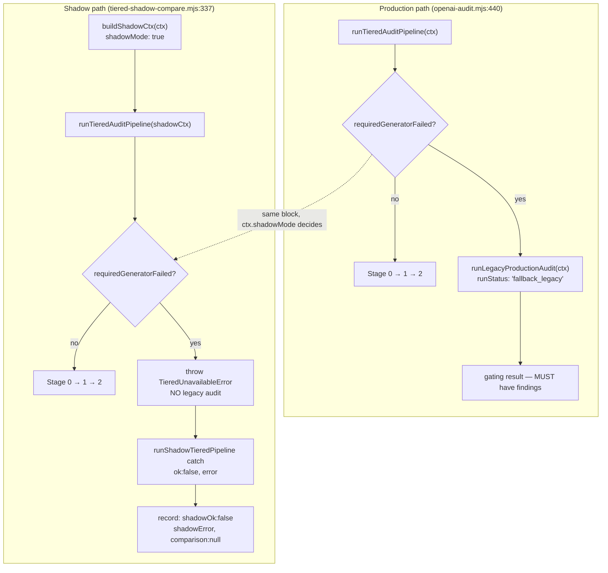

# Plan: Remove the legacy fallback from the tiered-SHADOW path

- **Date**: 2026-07-17
- **Status**: Implemented (2026-07-17) via `/cycle --autonomous`. Plan-audit: 3 GPT rounds (7 findings, all fixed) + Gemini gate APPROVE ("watertight", 0 findings). Code-audit: 2 rounds (18 → 5; 13 suppressed), one real bug found and fixed (M2 shared-mutable-state), one HIGH refuted by live reproduction (H1), the recurring `diffText` HIGH dismissed with mechanical independence (5th recurrence). Consolidated Gemini gate: CONCERNS → **APPROVE** after G1 (a claimed timer leak) was refuted both statically and empirically. Pre-ship empirical verify: 14/14.
- **Author**: Claude + Louis Strydom
- **Scope**: backend

- **Target domain(s)**: `audit-orchestration`
- Single-domain; no boundary crossings.

## Neighbourhood considered

`get-neighbourhood` (k=8, refresh `585078ec`) returned **`review` for every
candidate** — no near-duplicate to reuse or extend, so the new logic is
greenfield. Two returns are load-bearing context rather than duplication
risks:

| Symbol | File | Purpose (indexed) | Bearing |
|---|---|---|---|
| `buildShadowCtx` | `tiered-shadow-compare.mjs:81` | "Creates a shadow audit context that disables ledger writes and cloud persistence for comparison-only runs." | **This is the existing shadow-marking seam.** Decision #1 EXTENDS it rather than inventing a parallel flag. |
| `runShadowTieredPipeline` | `tiered-shadow-compare.mjs:196` | "Executes the tiered pipeline as an observation-only shadow with timeout protection." | Already owns the `{ok:false, error}` no-result path this plan reuses. |

## Context Summary

Detected scope: **backend** (Node ESM, no UI). Stack: `js-ts`.

### What exists today (Code Trace)

`runTieredAuditPipeline` (`scripts/lib/audit/tiered-pipeline.mjs:431`) has
exactly **two** callers:

1. **Production** — `scripts/openai-audit.mjs:440`:
   `if (tieredAuditConfig.pipelineEnabled && ctx.allowTiered) { const mergedResult = await runTieredAuditPipeline(ctx); … }`
   This is the **gating** path. Its result IS the audit. It **must** return
   findings.
2. **Shadow** — `scripts/lib/audit/tiered-shadow-compare.mjs:337`, inside
   `runShadowTieredPipeline`:
   `const result = await Promise.race([runTieredAuditPipeline(shadowCtx), timeout]);`
   Observation-only. It has **no obligation** to return findings.

Both reach the same block (`tiered-pipeline.mjs:659-674`):

```js
if (requiredGeneratorFailed) {
  const discoveryGeneratorOutcomes = [...(ctx.generatorOutcomes || [])];
  const { runLegacyProductionAudit } = await import('./legacy-production-audit.mjs');
  const legacyResult = await runLegacyProductionAudit(ctx);   // ← a SECOND full legacy audit
  return { ...legacyResult, runStatus: 'fallback_legacy', fallbackReason: … };
}
```

**The defect**: in the shadow, this runs a second complete 5-pass GPT audit
and returns *legacy's* findings labelled as the *tiered* result.
`runTieredShadowComparison` (line 246) then calls
`compareAuditRunResults(legacyResult, shadowOutcome.result)` — comparing the
real legacy run against a second legacy run.

Measured consequence (`.audit/tiered-shadow-log.jsonl`, 57 real records):
**41 `fallback_legacy` / 15 `complete` / 1 hard timeout.** Each of those 41
paid for a full extra legacy audit to yield zero tiered signal, and their
`overlap: 0` is not recall — it is two independent legacy runs disagreeing
with each other (an accidental measurement of GPT's own nondeterminism).
This is the dominant cost of the entire shadow experiment.

**The fallback is not wrong — it is wrong *here*.** For caller (1) it is
correct and required. Only caller (2) must not fall back. Three independent
models (GPT-5.6, Gemini-pro, Claude) converged on deleting it from the
shadow path; the code trace refines that to *making it production-only*.

### The existing no-result path (why this is small)

`runShadowTieredPipeline` (`:196-216`) already handles "no tiered result":

```js
try   { const result = await Promise.race([...]); return { ok: true,  result, latencyMs }; }
catch (err)                                       { return { ok: false, error: err.message, latencyMs }; }
```

and `runTieredShadowComparison` already records
`{ shadowOk: false, shadowError, comparison: null }`. One record in the live
log already uses it (`shadowError: 'shadow timed out after 1200000ms'`).
So the honest, cheap outcome we want **already has a persisted shape**. This
plan routes generator-unavailability into it instead of inventing a new one.

### Patterns reused vs new

- **Reused**: `buildShadowCtx`'s existing "mark the shadow context" role
  (`noLedger`/`noDebtLedger`/`readOnlyDebt`/`noCloudRecording` are all
  precedents for exactly this kind of flag); `runShadowTieredPipeline`'s
  `{ok:false, error}` contract; `appendShadowLog`'s existing `shadowError`
  column.
- **New**: one typed error class so the shadow's catch can distinguish
  "tiered unavailable" (expected) from "shadow harness bug" (not expected).

### Right-sizing note — why NOT a new `runStatus` enum value

`AuditRunResultSchema.runStatus` (`schemas.mjs:568`) is a **closed enum**:
`z.enum(['complete', 'incomplete', 'fallback_legacy'])`, shared by BOTH the
legacy and tiered paths.

- **Band-aid**: delete the fallback with no signal → the shadow throws an
  untyped error; "provider unavailable" is indistinguishable from a real bug.
- **Over-engineered**: add `tiered_unavailable` to the enum. This ripples to
  **18 files**, and — decisively — it is a **persisted** value: 41 rows in
  `.audit/tiered-shadow-log.jsonl` plus the Supabase
  `tiered_shadow_observations` table already carry `fallback_legacy`, and a
  `gate-contract.json` fixture is built from it. That is a data migration
  with a backward-compat surface, for a status no consumer needs to
  distinguish (every consumer already treats "not `complete`" as
  "not decision-grade").
- **Chosen**: a typed error + one ctx flag. The shadow's *existing*
  `shadowOk:false` record is the honest result. **Zero schema change, zero
  migration, no new persisted vocabulary.** `fallback_legacy` remains valid
  and meaningful — for the production path that genuinely produces it.

The current requirement is "stop the shadow burning a legacy audit and
poisoning the denominator". Both are met without touching the enum.

## Proposed Architecture



### Key design decisions

1. **`buildShadowCtx` sets `shadowMode: true`** — extending the function
   whose indexed purpose is already "creates a shadow audit context that
   disables …". Sits alongside `noLedger`/`noCloudRecording` as one more
   "this is not the real run" marker. The production caller never sets it, so
   production behaviour is **byte-identical**.
2. **The fallback block gates on `ctx.shadowMode`**, throwing
   `TieredUnavailableError` instead. The `runLegacyProductionAudit` dynamic
   import must be **inside** the non-shadow branch so the shadow never even
   loads the legacy module.
3. **A typed error carrying ONLY `.reason`** — no `.generatorOutcomes`
   (round-2 plan-audit M4: the round-1 fix declared outcomes must not be
   threaded through the error, while the file plan still had the class
   carrying them — a leftover contradiction). `TieredUnavailableError`
   exists for exactly two small, real reasons: the catch can set
   `error: err.reason` (the clean formatted reason) rather than a raw
   `err.message`, and tests can assert the class rather than regex a string.
   It is not a carrier for state the harness already holds.
4. **Reason diagnosability must not regress — and it mirrors the EXISTING
   convention exactly: group by the RAW reason string, no bucketing**
   (round-1 M1 + round-2 H2/M3, all three dissolved by the same correction).
   Today a fallback's cause is aggregated by `summarize()`'s
   `tieredFallbackReasons`. Read what that actually does:
   ```js
   const reason = r.comparison.tieredFallbackReason || 'unknown';
   acc[reason] = (acc[reason] || 0) + 1;    // groups by the RAW string
   ```
   It does **not** bucket into coarse classes. The round-1 draft invented
   coarse bucketing ("timeout / overloaded / egress / non-JSON / other") and
   thereby invented its own bug: **19 of the 41 live rows are multi-cause**
   (`sonnet: …; glm: [timeout] …`) and would have been mis-attributed to one
   class. Grouping by the raw string cannot mis-attribute — a multi-cause row
   is simply its own key, which is honest and is exactly what an operator
   already reads today.
   So `shadowFailureReasons` groups `shadowError` by raw string across
   `!shadowOk` records. **Without it the change would trade one
   silent-failure mode for another** — the anti-pattern this effort exists
   to end.
   This also **dissolves round-2 H2 and M3**: no `shadowGeneratorOutcomes`
   DTO, no snapshot semantics to define, and — decisively — **no new
   persisted field**. `shadow_error` is an EXISTING column on
   `tiered_shadow_observations` (verified in
   `supabase/migrations/20260713140000_tiered_shadow_observations.sql`), so
   the reason is already durable on both sinks. The right-sizing claim below
   survives intact: still zero migration.
   The `unavailable`-vs-harness-bug distinction H1 wanted is preserved
   *without* a persisted boolean: the reason string is self-discriminating
   (`required generator failed: …` vs any other throw), which is what a human
   reading the breakdown actually uses. A boolean column no consumer branches
   on would be ceremony.
5. **`shadowFailures` is the correct bucket** — no new counter. A required
   generator being unavailable IS "the shadow produced no tiered result",
   which is what `shadowFailures` already counts. Honest, and it makes the
   26%-availability finding *more* visible, not less.
6. **Historical rows keep working, untouched.** `excludedFallback` and
   `tieredFallbackReasons` continue to read the 41 existing
   `fallback_legacy` rows exactly as today. New shadow rows simply stop
   producing that status. Both metrics must remain correct across the
   mixed-shape corpus — the same two-shape discipline
   `historicalCompleteRuns`/`comparedRuns` already established.

## Sustainability Notes

- **Assumption that could change**: that production still wants a fallback.
  If the tiered pipeline is ever promoted to sole gating path, the fallback
  becomes the only safety net and gets *more* important — this plan
  deliberately strengthens rather than erodes it by making its purpose
  explicit and its test surface real.
- **Extension point**: `shadowMode` is a general "this is an observation
  run" marker. Any future behaviour that should differ between a real and an
  observed run (cost caps, sampling) has an obvious home.
- **What this does NOT do**: it does not improve generator reliability. It
  makes the failures cheap and honest. The remaining 26 non-egress fallbacks
  (12 GLM timeouts, 8 Sonnet tool-call misses, 3 non-JSON, 2× 529) are out
  of scope and separately tracked.

## File-Level Plan

### `scripts/lib/audit/tiered-pipeline.mjs` (modify)
- **Purpose**: make the fallback production-only; export the typed error.
- **Key changes**:
  - New export `TieredUnavailableError extends Error` — `name` + `.reason`
    (the formatted generator-failure string) ONLY. **No `.generatorOutcomes`**
    (round-2 M4): the harness already owns `shadowCtx`, so the error is not a
    second channel for state in hand.
  - The `requiredGeneratorFailed` block branches on `ctx.shadowMode`: throw
    in shadow; keep today's exact fallback otherwise. The
    `await import('./legacy-production-audit.mjs')` moves inside the
    production branch.
- **Why this file**: it owns the fallback.

### `scripts/lib/audit/tiered-shadow-compare.mjs` (modify)
- **Purpose**: mark the shadow ctx; preserve the CLASSIFICATION (not just a
  string) through the catch.
- **Key changes**:
  - `buildShadowCtx` adds `shadowMode: true` (documented alongside the
    existing `noCloudRecording` rationale).
  - `runShadowTieredPipeline`'s catch discriminates on the error type
    (`err instanceof TieredUnavailableError`) and returns
    `{ok:false, error: err.reason}` vs `{ok:false, error: err.message}` for
    any other throw — so the clean formatted reason reaches the EXISTING
    `shadowError` field rather than a raw message.
  - `recordObservation` is **unchanged**: `shadowError` already carries the
    reason to both sinks (`shadow_error` is an existing column). No new
    persisted field ⇒ no store change, no migration (round-2 H2/M3).
- **Why this file**: it owns the shadow ctx, the no-result path, and the
  recorder.

### `scripts/lib/audit/tiered-shadow-summary.mjs` (modify)
- **Purpose**: decision #4 — don't trade one silent failure for another.
- **Key changes**: new `shadowFailureReasons` aggregation grouping the RAW
  `shadowError` string across `!shadowOk` records — byte-for-byte the same
  shape as the existing `tieredFallbackReasons` reducer three lines above it
  (`acc[reason] = (acc[reason]||0)+1`), so the two read identically and
  cannot drift. No bucketing ⇒ no mis-attribution of the 19/41 multi-cause
  rows. A `!shadowOk` record with no `shadowError` keys as `'unknown'`,
  matching the existing reducer's own `|| 'unknown'` fallback.
  `excludedFallback` + `tieredFallbackReasons` unchanged (historical rows).
- **Why this file**: it owns every aggregation the window reads.

### `scripts/tiered-shadow-report.mjs` (modify)
- **Purpose**: surface the new breakdown.
- **Key changes**: print `shadowFailureReasons` beside the existing
  `tieredFallbackReasons`, labelled so an operator can tell a live cause
  (new rows) from a historical one (pre-plan rows).
- **Why this file**: it is the CLI output formatter.

### `tests/tiered-shadow-compare.test.mjs` (modify)
- Shadow ctx carries `shadowMode: true`; a `TieredUnavailableError` thrown by
  an injected pipeline resolves `{ok:false}` with the structured reason
  preserved (not flattened); `runTieredShadowComparison` records
  `shadowOk:false, comparison:null` and **never** invokes the legacy path.

### `tests/tiered-pipeline-wiring.test.mjs` (modify)
- The load-bearing pair: with `shadowMode:true` + a failing required
  generator, `runTieredAuditPipeline` **throws `TieredUnavailableError`**;
  without the flag, today's `fallback_legacy` result is byte-identical
  (production regression guard).
- **"legacy is never invoked" — the exact seam** (round-1 plan-audit M2: the
  round-1 draft demanded an injection-based proof, but production uses an
  INTERNAL `await import('./legacy-production-audit.mjs')` with no DI hook,
  loader param, or module boundary to spy on — the plan asked for a proof
  its own design made impossible). Two complementary, honest checks, both
  matching conventions this repo already uses:
  1. **Behavioural**: the throw itself is the proof. The `await import(…)`
     sits *after* the `ctx.shadowMode` branch point inside the same block,
     so a propagated throw structurally guarantees that line was never
     reached. Asserted via `assert.rejects`.
  2. **Static pin**: assert the `await import('./legacy-production-audit.mjs')`
     lies INSIDE the non-shadow branch — the same static-pin convention
     already used throughout this file (e.g. the `backend:'sdk'` pin). This
     is what actually catches a future refactor hoisting the import above
     the branch, which the behavioural test alone would not.
  Neither claims to be an injection proof, because there is no injection
  seam and inventing one (a loader parameter threaded purely for a test)
  would be the over-engineered cliff.

### `tests/tiered-shadow-summary.test.mjs` (modify)
- `shadowFailureReasons` buckets correctly; historical `fallback_legacy` rows
  still count under `excludedFallback`/`tieredFallbackReasons` (mixed-corpus
  guard).

## Risk & Trade-off Register

| Risk | Mitigation |
|---|---|
| Production fallback silently breaks | A dedicated regression test pins that a non-shadow ctx still returns `fallback_legacy` byte-identically. Production is the untouched default path (flag absent ⇒ old behaviour). |
| `shadowFailures` now mixes harness bugs with provider unavailability | Accepted, and *named*: `shadowFailureReasons` breaks it down. Both are genuinely "no tiered result"; conflating the COUNT while separating the REASON is the honest split. |
| Losing the `fallback_legacy` telemetry stream | It was never signal — 41 rows of legacy-vs-legacy. Historical rows remain readable; new rows carry a truer reason. |
| A future caller forgets `shadowMode` | Fails safe: it falls back (today's behaviour), i.e. costly but correct — never a wrong result. |

## Testing Strategy

Tier 1 (deterministic seam, test-first): the `shadowMode` branch and the
`summarize` aggregation are pure/injectable — both land with their tests.

Tier 2 (invariant, not prose): "the shadow never invokes
`runLegacyProductionAudit`" is asserted **exactly as the file plan above
specifies — behaviourally (the throw structurally precludes reaching the
later `await import`) plus a static pin on the import's location** (round-3
plan-audit M5: this section previously said "by injection", contradicting
the file plan's own finding that no injection seam exists and that inventing
one would be the over-engineered cliff). It is NOT asserted by injection and
NOT by mocking the legacy module; the two checks named above are the whole
proof, and the static pin is the half that actually survives a refactor
hoisting the import.

**Pre-ship empirical verify** (this repo's doctrine — the tiered pipeline
asserts on a live runtime): drive `runTieredAuditPipeline` with a real
shadow ctx and a deliberately-failing required generator, and assert (a) it
throws rather than falling back, (b) no legacy audit ran, (c) the recorded
observation carries the real reason. A stubbed generator is legitimate here
— the *generator* is upstream of this change; the fallback branch is what is
under test.

## Implementation Phases

**Phase 1 — production-only fallback**: add `TieredUnavailableError`, gate
the block on `ctx.shadowMode`, set the flag in `buildShadowCtx`, preserve
the reason through the catch. Files: `scripts/lib/audit/tiered-pipeline.mjs`
(modify), `scripts/lib/audit/tiered-shadow-compare.mjs` (modify),
`tests/tiered-pipeline-wiring.test.mjs` (modify),
`tests/tiered-shadow-compare.test.mjs` (modify).

**Phase 2 — reason diagnosability**: `shadowFailureReasons` aggregation +
CLI surface. Files: `scripts/lib/audit/tiered-shadow-summary.mjs` (modify),
`scripts/tiered-shadow-report.mjs` (modify),
`tests/tiered-shadow-summary.test.mjs` (modify).

**Close-out (not a phase)**: `npm run check`; pre-ship empirical verify
above.

## Execution Clustering

- **Cluster A** — Phases 1-2 — fix-gate: final
  - Coupling: one seam. Phase 2 exists *because of* Phase 1 (routing
    unavailability out of `comparison` is what silences
    `tieredFallbackReasons`), so shipping Phase 1 without Phase 2 would
    knowingly introduce the silent-failure mode this plan exists to prevent.
    They are not independently shippable and must not be split.
  - Files: `scripts/lib/audit/tiered-pipeline.mjs` (modify),
    `scripts/lib/audit/tiered-shadow-compare.mjs` (modify),
    `scripts/lib/audit/tiered-shadow-summary.mjs` (modify),
    `scripts/tiered-shadow-report.mjs` (modify),
    `tests/tiered-pipeline-wiring.test.mjs` (modify),
    `tests/tiered-shadow-compare.test.mjs` (modify),
    `tests/tiered-shadow-summary.test.mjs` (modify)

- **Final gate**: consolidated Gemini review over the union diff, plus the
  pre-ship empirical verify.


## Close-out: pre-ship empirical verify — result (2026-07-17)

Ran the REAL `runTieredShadowComparison` → `buildShadowCtx` →
`runShadowTieredPipeline` → `runTieredAuditPipeline` chain against a real
on-disk log, with only the upstream LLM generators stubbed. **14/14 pass.**

The decisive assertion is a **measurement, not a claim**: a counting `openai`
stub was threaded through the ctx, and the legacy 5-pass audit cannot execute
without calling it.

| Assertion | Result |
|---|---|
| The legacy audit is never invoked on a shadow run | **0 openai calls** |
| Cost of an unavailable shadow run | **486 ms** (a real fallback measured **407 s** earlier the same session — ~800× cheaper) |
| `comparison` on an unavailable run | `null` — no fabricated legacy-vs-legacy row |
| The cause survives to `shadowError` | `required generator failed: glm: …; sonnet: …` |
| The real ctx's `generatorOutcomes` | **0 entries leaked** (the M2 fix, verified live) |
| `shadowFailureReasons` surfaces the live cause | yes — and the multi-cause string lands as ONE honest key, exactly the case coarse bucketing would have mis-attributed |
| **Production still falls back** | yes — **openai called 1×**, proving the gating path is untouched |

**What this does NOT do**: it does not improve generator reliability. It makes
the failures cheap, honest, and diagnosable. The remaining causes (12 GLM
timeouts, 8 Sonnet tool-call misses, 3 non-JSON, 2× 529) are unaffected and
separately tracked — the window still cannot FILL until discovery-generator
reliability is addressed.
