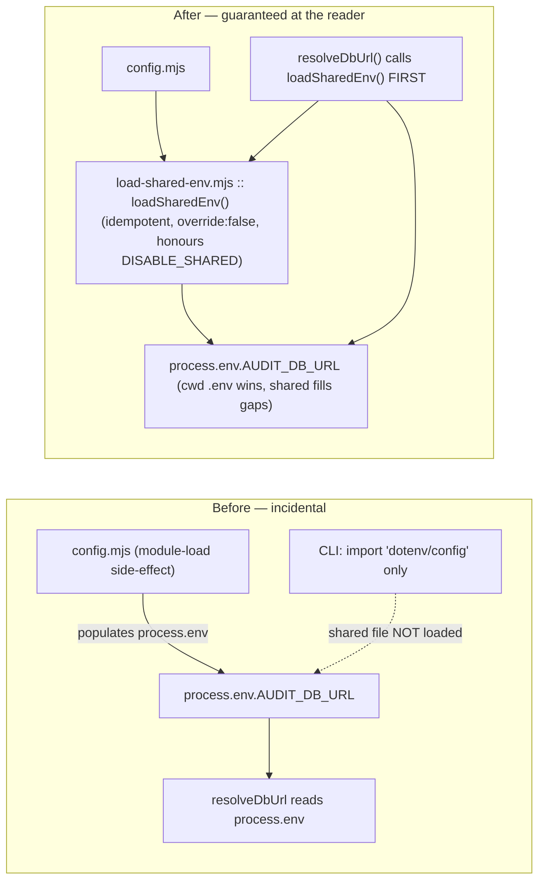

# Plan: Shared-Env Loading Root-Fix + Contract Guard (+ cache-seed experiment record)

- **Date**: 2026-06-15
- **Status**: Complete
- **Author**: Claude + Louis
- **Scope**: backend
- **Target domain(s)**: `shared-lib`, `scripts`
- ⚠ **Cross-domain work** — touches the `shared-lib` seam (env loader, db client) and its `scripts` consumers (audit orchestrator, cache check). The seam is deliberate: one env-loading contract must hold for every DB reader.

> **Origin**: brainstorm synthesis (2026-06-15). Four recurring bug classes
> traced to *implicit runtime contracts*. This plan fixes the highest-leverage
> one — "shared-env loaded only as an incidental import side-effect" — **at the
> reader**, plus a guard that travels to consumers. Two deferred classes
> (bootstrap wrapper, executable skill hooks) are explicitly out of scope.

---

## 1. Context Summary

- **Scope / stack**: backend · `js-ts` + postgres · `node --test`.
- **What exists today**:
  - `scripts/lib/config.mjs` (lines 14–56) loads env in a fixed precedence at
    **module-load** as an import side-effect: (1) discover + load cwd/git-root
    `.env` (via `discoverLocalEnvPath` + `dotenv.config`), then (2) load the
    per-user shared `~/.audit-loop.env` with `override:false` (cwd wins), gated
    by the `AUDIT_LOOP_DISABLE_SHARED=1` hermeticity escape hatch, with a
    one-time stderr note guarded by the `_AUDIT_LOOP_SHARED_LOADED` sentinel.
  - `scripts/lib/db/client.mjs::resolveDbUrl()` (line 91) is the **single
    reader** of `process.env.AUDIT_DB_URL` (+ the `AUDIT_POSTGRES_URL` alias).
    `getPool()` (line 210) calls it once on first init then caches `_pool`.
  - So cloud connectivity depends on *something* having imported `config.mjs`
    (or otherwise populated `process.env`) before `getPool` runs. CLIs that only
    do `import 'dotenv/config'` (cwd `.env` only) silently miss the shared DSN.
- **The bug class (already hit 3×, patched per-instance)**: `check-setup`,
  `setup-postgres`, `cache-hitrate-check` each falsely reported cloud-off /
  INSUFFICIENT_DATA when the DSN lived only in `~/.audit-loop.env`. A scan found
  ~16 more CLI candidates with the bare-`dotenv/config` pattern (over-reported —
  some import `config.mjs` transitively, e.g. `cross-skill.mjs` via
  `neighbourhood-query.mjs`).
- **Cache-seed sub-issue**: `cache-hitrate-check` decides whether to flip
  `AUDIT_CACHE_SEED` ON by measuring the seed-OFF population; with the seed off
  `decideSeed()` returns `env-disabled` and the cache is never warmed, so 74/75
  R2+ runs are structurally 0%. The check can only decide on a **seed-ON cohort**.
- **Patterns reused vs new**: reuse the existing `discoverLocalEnvPath`
  (shared-cloud-config.mjs), the `dotenv` dep, the `AUDIT_LOOP_DISABLE_SHARED`
  escape hatch, the `_AUDIT_LOOP_SHARED_LOADED` sentinel, the hermetic
  child-process test pattern from `tests/relocation-selfcheck-smoke.test.mjs`,
  and the migration-ledger path. **New**: one tiny `load-shared-env.mjs` module
  (extracted, not invented) + one boolean column for the cache experiment record.
- **Neighbourhood considered**: `get-neighbourhood` returned all `review`
  (<0.75) — `getPool`, `resolveDbUrl`, `discoverDotenv`, `closePool`,
  `_resetForTest`. No reuse/extend candidate; this plan **consolidates** the
  env-loading side-effect into one function both config.mjs and client.mjs call
  (anti-duplication: #1 DRY, #5 SSoT) — not a new identity/loader scheme.

---

## 2. Proposed Architecture

### Key design decisions (cite `references/engineering-principles.md`)

- **Fix at the reader, not the entrypoint (#1 DRY, #5 SSoT, #16 Graceful
  Degradation).** The single reader (`resolveDbUrl`) calls `loadSharedEnv()`
  before reading `process.env.AUDIT_DB_URL`. This kills the class everywhere
  `getPool` is reached — every CLI, cron, consumer — **with no entrypoint to
  remember**. A bootstrap wrapper (the brainstorm alternative) is opt-in by
  convention and stays forgettable; the reader-fix is enforced by control flow.
- **Extract, then correct (#1, #18 Backward Compat).** `loadSharedEnv()` starts
  from the logic currently inline in config.mjs (cwd `.env` then shared
  `override:false`) and adds the deliberate corrections this plan introduces:
  the DB-group precedence guard, the non-throwing read, and the latch.
  config.mjs's top becomes `loadSharedEnv()`. config.mjs module-load behaviour is
  **preserved except** those documented precedence/lifecycle corrections (which
  also make config.mjs more correct — same fix, one place).
- **Full precedence preserved (#18).** `loadSharedEnv()` does BOTH layers in
  order — (1) discover+load cwd `.env`, (2) shared file `override:false` — so
  precedence (cwd wins, shared fills gaps) holds regardless of which entrypoint
  triggers it. A CLI that did neither now gets correct layered loading via
  `getPool`.
- **DSN is one logical key across its alias (#5 SSoT, #2 Least Surprise) —
  resolves R1-H1.** Per-key `override:false` is NOT sufficient for the DSN,
  because `resolveDbUrl()` reads TWO spellings — canonical `AUDIT_DB_URL` and
  the deprecated alias `AUDIT_POSTGRES_URL` (canonical wins). Naive layering
  breaks "cwd wins": cwd `.env` sets `AUDIT_POSTGRES_URL=local`, shared sets
  `AUDIT_DB_URL=cloud` → after load both keys exist → resolver prefers the
  shared canonical and silently connects to the **wrong** DB. **Contract**:
  `loadSharedEnv` treats `{AUDIT_DB_URL, AUDIT_POSTGRES_URL}` as ONE logical DSN
  slot — before applying the shared layer, if EITHER spelling is already present
  from a higher-precedence layer (shell env or cwd `.env`), the shared layer
  contributes **neither** DSN key. **Generalised to the whole DB group
  (resolves R2-H1)**: DB config is ONE bundle, not independent key-pairs. The
  DB group = every key `resolveDbUrl()` + `buildPoolConfig` read —
  `{AUDIT_DB_URL, AUDIT_POSTGRES_URL, AUDIT_DB_SSL_MODE, AUDIT_POSTGRES_SSL_MODE,
  AUDIT_DB_POOL_MAX}`. If a higher-precedence layer supplied a DSN (either
  spelling), the shared layer contributes **NONE** of the DB-group keys — so a
  cwd-local DSN can never be paired with a shared/cloud SSL mode. If no higher
  DSN exists, the shared layer MAY contribute DB-group keys, each still applied
  with per-key `override:false` (a higher explicit SSL/pool override without a
  DSN still wins). Non-DB keys (LLM API keys, etc.) keep plain per-key
  `override:false`. Implementation: `dotenv.parse` the shared file into a temp
  object; compute `higherHasDsn = !!(process.env.AUDIT_DB_URL ||
  process.env.AUDIT_POSTGRES_URL)` BEFORE merging; if true, delete all DB-group
  keys from the temp object; then merge remaining keys with `override:false`
  (NOT a blind `dotenv.config` of the file).
- **Idempotent + cheap (#13 Idempotency, #17 Performance) — resolves R1-M2 + G2.**
  The latch is set **unconditionally after the first shared-layer attempt**
  (loaded / absent / error all latch), guaranteeing exactly ONE filesystem
  interaction per process — no redundant reads on local-only runs and no
  internal contradiction with "same-process reload is out of scope" (R2-M1).
  The cwd layer is likewise idempotent (`dotenv.config` re-merge with
  `override:false` is a no-op on set keys). `getPool` calls it on first init only
  (then `_pool` is cached), so steady-state cost is zero. `_resetSharedEnvForTest()`
  clears the latch (mirrors `_resetForTest`). Same-process mutation of the shared
  file is not supported (no current call site — §7 Phase 1 / R2-M1).
- **Test isolation is first-class (#11 Testability).** Per-key `override:false`
  means a test that sets `process.env.AUDIT_DB_URL` is **never** clobbered.
  **`AUDIT_LOOP_DISABLE_SHARED=1` disables ONLY the shared layer (resolves
  R1-M1)** — cwd/git-root `.env` discovery+load still runs. "No-op" in the
  testing notes means "the shared `~/.audit-loop.env` layer is skipped", never
  "the whole loader returns early." This is the existing hermetic opt-out and is
  unchanged in meaning.

### The critical invariant (resolves the open question)

> **Auto-loading the shared file at `getPool` does NOT change cloud on/off for
> any consumer that legitimately intends cloud-off.** Proof by cases:
>
> | Consumer state | Today | After fix | Verdict |
> |---|---|---|---|
> | No `~/.audit-loop.env`, no DSN in env/.env | `getPool` → null (local) | `existsSync` false → no-op → null (local) | **unchanged** |
> | Has shared file, CLI imports config.mjs (most) | cloud ON | cloud ON | **unchanged** |
> | Has shared file, CLI does NOT import config.mjs (the bug) | wrongly local-only | cloud ON | **intended fix** |
> | Wants cloud-off despite shared file | `AUDIT_LOOP_DISABLE_SHARED=1` → off | same | **unchanged** |
> | Per-case test sets/omits `process.env` | honoured (override:false) | honoured | **unchanged** |
> | cwd `.env` `AUDIT_POSTGRES_URL` (alias) + shared `AUDIT_DB_URL` | cwd alias used (cwd loaded, shared not) | cwd alias used — DSN-pair guard skips the shared canonical | **unchanged** (the guard is what keeps it so) |
>
> The only behaviour change is the third row — the bug — flipping to correct.
> The genuine cloud-off intent ("no shared file + no DSN", or the explicit
> escape hatch) is fully preserved. The DSN-pair guard (above) keeps the last
> row's cwd override winning across the alias spelling. **No regression for
> cloud-off consumers.**

---

## 5. Sustainability Notes

- **Assumption that could change**: that `~/.audit-loop.env` at `os.homedir()`
  is the shared-config location. `loadSharedEnv` keeps resolving it via the same
  `sharedEnvPath(homedir)` helper, so a future relocation is one function.
- **Extension seam**: `loadSharedEnv()` is now the single place env layering
  happens — a future third layer (e.g. an org-level config) is one ordered
  `dotenv.config` call here, not 40 entrypoint edits.
- **Guardrail**: the new hermetic test (Phase 3) fails the build if the reader
  ever stops resolving the shared DSN — it locks the contract in a seam that
  travels to consumers (no CI there, so the test ships with the bundle).

### Right-sizing gate

- **Band-aid extreme**: keep patching each CLI's `import 'dotenv/config'` → bare
  `config.mjs` import (the 3 fixes so far). Leaves ~16 latent + every future CLI.
- **Over-engineered extreme**: a mandatory `runCli(ctx)` bootstrap wrapper every
  CLI must adopt + an ESLint/typescript-eslint toolchain to enforce it + a
  manifest-hook system for skill side-effects. New toolchain, ~40-entrypoint
  migration, violates the repo's no-build/no-new-deps stance.
- **Chosen**: extract the existing side-effect into one function and call it at
  the single reader (`resolveDbUrl`) + one hermetic guard test. Smallest change
  that makes the env precondition a function of control flow rather than luck.
  Current requirement: cloud-reading CLIs must see the shared DSN from any
  entrypoint. (Wrapper/manifest deferred — no current requirement forces them.)

### Cache experiment-record (Cluster B) right-sizing

- **Band-aid**: leave the check measuring the seed-OFF population → HOLD forever.
- **Over-engineered**: a full A/B experiment framework with cohorts/CIs/quality
  deltas.
- **Chosen**: record one fact — was the seed ON for this run — in both the local
  jsonl and a single `audit_runs.cache_seed_enabled` boolean, and have the check
  **segment** seed-ON vs seed-OFF and report each. Current requirement: stop the
  check contaminating the decision with structural zeroes. Cluster B is
  **independently deferrable** (see §8) if only the root-fix is wanted now.

---

## 7. File-Level Plan

### Phase 1 — Extract the shared-env loader
- **`scripts/lib/load-shared-env.mjs`** (create): export `loadSharedEnv(opts?)`.
  It reproduces config.mjs's current env-loading **behaviour** (not a literal
  line copy — the line refs are descriptive; the latch + DSN-pair guard are
  deliberate additions, resolving the R1 "verbatim vs adds latch" ambiguity):
  1. **cwd layer**: `discoverLocalEnvPath` → `dotenv.config({override:false})`
     for the cwd/git-root `.env` (always runs — NOT gated by DISABLE_SHARED).
  2. **shared layer** (skipped entirely when `AUDIT_LOOP_DISABLE_SHARED=1`):
     read via a **non-throwing helper (resolves R2-H2)** — the read path is now
     the DB-resolution chokepoint, so a malformed/unreadable/racing
     `~/.audit-loop.env` must NEVER crash `resolveDbUrl`. **No `existsSync`
     (resolves G3 — avoids the TOCTOU anti-pattern + halves FS I/O)**: attempt
     `readFileSync` directly inside `try`; `catch (err)` → `err.code === 'ENOENT'`
     returns status `absent`; EACCES/EISDIR/other/parse-error → warn ONCE (no
     secret values) → status `error`. Helper returns
     `{status: 'loaded'|'absent'|'skipped'|'error', keysAdded}`. On `loaded`,
     apply the **DB-group guard** (§2): if a higher layer supplied a DSN, drop all
     DB-group keys from `parsed`; merge the rest with `override:false`. One-time
     `_AUDIT_LOOP_SHARED_LOADED` stderr note for newly-added keys.
  3. **Latch (resolves R1-M2 + G2)**: set the module `_loaded` flag
     **unconditionally after the first shared-layer attempt** — `loaded`,
     `absent`, or `error` all latch — so there is exactly ONE filesystem
     interaction per process and no redundant `readFileSync` on local-only runs.
     (`skipped` via `AUDIT_LOOP_DISABLE_SHARED` is checked before the latch and
     does not set it.) **No `force` option, no same-process create-then-verify
     support (resolves R2-M1)** — that flow is OUT OF SCOPE (no call site;
     `setup:cloud` writes the file in one process, a *separate* process reads it;
     a fresh process re-evaluates the latch from scratch). YAGNI per §5; add a
     provenance-aware reload only when a real same-process writer needs it.
     `_resetSharedEnvForTest()` clears the latch for tests.
  4. Exports `_resetSharedEnvForTest()` (clears `_loaded` + the dedupe sentinel).
  Imports `discoverLocalEnvPath`/`sharedEnvPath` from `shared-cloud-config.mjs`
  and `dotenv`. **Why**: SSoT for env layering (#1, #5).
  - **Cycle check (hard stop, not advisory — resolves R1 ambiguity)**: confirm
    `shared-cloud-config.mjs` imports NEITHER `config.mjs` NOR `client.mjs` (it's
    a low-level parser — expected clean). If a cycle exists, **stop and redesign**
    (extract the path/parse helpers `load-shared-env` needs into a leaf module);
    do NOT patch around it with a lazy/dynamic import. The Phase-3 structural
    test (below) makes the no-cycle property permanent.

### Phase 2 — Wire the loader into config.mjs + the DB reader
- **`scripts/lib/config.mjs`** (modify): replace the inline lines 14–56 block
  with `import { loadSharedEnv } from './load-shared-env.mjs'; loadSharedEnv();`
  at the same module-load point. Behaviour-preserving except the documented
  precedence/lifecycle corrections (§2). **Why**: #18 + SSoT (one loader).
- **`scripts/lib/db/client.mjs`** (modify): `import { loadSharedEnv }` and call
  it as the **first statement** of `resolveDbUrl()` (before reading
  `process.env.AUDIT_DB_URL`). Sync call, no signature change. **Why**: the
  reader-fix — guarantees the precondition (#16). `getPool`'s `_pool` cache means
  this runs once per process.

### Phase 3 — Contract guard (travels to consumers)
- **`tests/shared-env-loading.test.mjs`** (create): hermetic child-process test
  (pattern reused from `relocation-selfcheck-smoke.test.mjs`). **Full hermeticity
  (resolves R2-M2)**: spawn each child with `cwd` = a fresh temp dir containing
  no `.env` (so `discoverLocalEnvPath` can't find the developer's repo `.env`);
  import `db/client.mjs` by absolute `file://` URL; pass an **explicit env
  allowlist** that sets BOTH `HOME` and `USERPROFILE` (cross-platform homedir)
  and **removes** `AUDIT_DB_URL` / `AUDIT_POSTGRES_URL` / `AUDIT_DB_SSL_MODE` /
  `AUDIT_POSTGRES_SSL_MODE` / `AUDIT_DB_POOL_MAX` / `AUDIT_LOOP_DISABLE_SHARED`
  unless a case intentionally sets them — otherwise inherited operator env could
  false-pass the core case. Cases:
  1. **shared file ONLY** (temp HOME dir with `.audit-loop.env` holding a dummy
     DSN; cwd has no `.env`; no `AUDIT_DB_URL` in env; the child imports ONLY
     `db/client.mjs`, never config.mjs) → `resolveDbUrl()` returns the dummy DSN.
     **The core guard.**
  2. no shared file + no DSN → `resolveDbUrl()` returns `null` (cloud-off held).
  3. `AUDIT_LOOP_DISABLE_SHARED=1` + shared file present → `null` (escape hatch).
  4. **DISABLE_SHARED + cwd `.env` DSN + shared DSN** → cwd DSN resolves, shared
     ignored (resolves R1-M1 — proves the flag skips only the shared layer).
  5. cwd `.env` `AUDIT_DB_URL` + shared `AUDIT_DB_URL` → cwd wins (same-key).
  6. **cwd `.env` `AUDIT_POSTGRES_URL=local` (alias) + shared `AUDIT_DB_URL=cloud`**
     → resolves the cwd **local** alias, NOT the shared canonical (resolves
     R1-H1 — the cross-key precedence hole).
  7. shell-env `AUDIT_DB_URL` + shared `AUDIT_POSTGRES_URL` → shell wins.
  Pure resolver test — never opens a socket, so it runs in the normal suite
  (not gated on `AUDIT_DB_URL`). **Why**: locks the contract where it ships.
- **Structural import-boundary guard (resolves R1-M3)** — add to this file (or
  `tests/relocation-guard.test.mjs`): statically assert `scripts/lib/db/client.mjs`'s
  import closure does **NOT** include `scripts/lib/config.mjs`, and that it DOES
  import `load-shared-env.mjs`. Without this, the behavioural cases above could
  pass for the wrong reason (client.mjs incidentally importing config.mjs, which
  also loads the shared env) and a refactor removing the direct `loadSharedEnv()`
  call would go undetected. Reuse the existing module-graph/import walker the
  repo already has (the relocation/dep-closure tooling); no new dep.

### Phase 4 — Cache experiment record: capture seed-state (migration-before-code)
- **`supabase/migrations/<ts>_audit_runs_cache_seed.sql`** (create): `ALTER TABLE
  audit_runs ADD COLUMN IF NOT EXISTS cache_seed_enabled BOOLEAN;` (nullable —
  NULL = unknown/pre-canary; no backfill, no index). **Why**: the only way the
  cross-machine check can segment a seed-ON cohort.
- **Telemetry contract (resolves R1-M4)**: `cache_seed_enabled` and the local
  `seedUsed` field both mean **"the effective cache-seed path actually ran for
  this run"** — i.e. `decideSeed()`'s returned `seedUsed === true` (env flag ON
  AND `units.length > 1` AND eligible), NOT merely "the env flag was set." A run
  where `AUDIT_CACHE_SEED=1` but seeding was skipped (`seedSkipReason` set, e.g.
  `units.length<=1`) records `false`. This is the value the cohort segmentation
  keys off, so "seed-ON cohort" = runs where warming genuinely happened.
- **`scripts/openai-audit.mjs`** (modify ~L2965 + the DB cache-metrics write):
  add `seedUsed` to the local `cache-metrics.jsonl` entry (from the `decideSeed`
  envelope already threaded through the pass telemetry) AND set
  `cache_seed_enabled` on the `audit_runs` cache-metrics UPDATE — **conditionally
  included via the existing `columnExists('audit_runs', 'cache_seed_enabled')`
  probe** (the same capability-probe pattern `runs-findings.mjs` already uses for
  `adjudication_outcome`/`remediation_state`). **Why**: resolves R1-H2 — a bare
  `UPDATE … SET cache_seed_enabled` referencing a missing column FAILS under
  direct `pg` (`ADD COLUMN IF NOT EXISTS` only protects the migration, not the
  DML). The probe omits ONLY that column pre-migration; all other cache metrics
  still persist (graceful degradation, #16). A structured one-line warning is
  logged when the column is absent.
- Deploy order: migration applied (`setup-postgres --migrate`) **before** the
  write is relied on; the `columnExists` probe makes a pre-migration run safe
  (skips just the column) rather than failing the whole metrics write.

### Phase 5 — Cache check segmentation + fixture
- **`scripts/cache-hitrate-check.mjs`** (modify): segment R2+ runs into
  `seedOn` / `seedOff` / `unknown` cohorts (DB: `cache_seed_enabled`; local:
  `seedUsed`). **Add `cache_seed_enabled` to the explicit column list in
  `loadFromSupabase()`'s `SELECT` (resolves G1)** — the query enumerates columns,
  so omitting it leaves `r.cache_seed_enabled === undefined`, dumping every
  Supabase run into the `unknown` cohort and yielding `INSUFFICIENT_SEED_ON_DATA`
  forever regardless of real seed-ON data. Decision rule now keys off the
  **seed-ON** cohort:
  `seedOn.length >= MIN_RUNS && median(seedOn) > FLIP_THRESHOLD → FLIP`;
  `seedOn.length < MIN_RUNS → INSUFFICIENT_SEED_ON_DATA` (actionable: "run N
  audits with AUDIT_CACHE_SEED=1"); report seed-OFF median as baseline context.
- **`tests/cache-hitrate-check*.test.mjs`** (create or extend): unit-test the
  cohort segmentation + decision rule on fixtures: seed-ON ≥5 >30% → FLIP;
  seed-ON <5 → INSUFFICIENT_SEED_ON_DATA; seed-OFF reported as baseline only;
  plus the R1-M4 edge fixtures — `cache_seed_enabled=false` env-on-but-no-effective-
  seed (must NOT count as seed-ON), `null` legacy rows (→ `unknown`, excluded
  from both cohorts), mixed. Pure (no DB).
- **`tests/fixtures/expected-schema.json`** (regen): include `cache_seed_enabled`
  via `generate-expected-schema.mjs` after the migration applies (separate
  mechanical step — same as the persona repo_id change).

**Close-out (not a phase) — deterministic order (resolves R1-L1)**: (1) create
the Phase-4 migration; (2) apply it to the test/live DB via
`setup-postgres.mjs --migrate`; (3) regenerate `tests/fixtures/expected-schema.json`;
(4) run targeted cache/schema tests; (5) run full `npm test` (against the applied
schema + fresh fixture — never before steps 2–3); (6) `npm run skills:regenerate`
(no SKILL.md change expected — but if the regen reports writes, that's a drift to
review + commit, not ignore); (7) `npm run sync` (manifest refresh for the
changed core scripts).

### 11. Execution Clustering

- **Cluster A** — Phases 1–3 — fix-gate: yes
  - Coupling: Phases 1–2 are the extract→wire of one function across the
    config.mjs ↔ load-shared-env ↔ client.mjs seam; Phase 3 is the guard that
    asserts that exact seam under a hermetic env. Auditing them together inspects
    the env-precedence + cloud-on/off-invariant + test-isolation contract as one
    unit — a mismatch here silently re-fragments cloud detection or breaks
    graceful degradation.
  - Additional files: `tests/db-config-resolver.test.mjs` (modify),
    `tests/arch-memory-split.test.mjs` (modify),
    `tests/setup-postgres-check-drift.test.mjs` (modify) — hermeticity fixes
    required by the reader-fix (resolveDbUrl now loads the shared layer, so
    resolver/cloud-off tests must set `AUDIT_LOOP_DISABLE_SHARED=1`). Same seam
    as Phase 3's test-isolation contract; included in Cluster A's audit scope.
- **Cluster B** — Phases 4–5 — fix-gate: final
  - Coupling: Phase 5's segmentation reads exactly the seed-state Phase 4
    records (DB column + jsonl field); together they form the "experiment
    record → decision" contract. Independent of Cluster A (no shared code path);
    builds nothing on A.
- **Final gate**: consolidated Gemini review over the union diff of all phases.

---

## 8. Risk & Trade-off Register

| Risk / trade-off | Decision |
|---|---|
| **Reader-fix changes a load-bearing chokepoint** (`resolveDbUrl`, every cloud op). | Behaviour is byte-identical except the documented bug-row (§2 invariant table). Guarded by Phase 3 hermetic test + existing `db-*`/`shared-cloud-config` tests. `getPool` cache → runs once per process. |
| **Cloud on/off semantics change for cloud-off consumers** (the open question). | Resolved: §2 invariant table proves no legitimate cloud-off intent is violated; only the bug flips to correct. The plan states the invariant; Phase 3 cases 2+3 lock it. |
| **Import cycle** (client.mjs → load-shared-env → shared-cloud-config). | Phase 1 verifies shared-cloud-config.mjs imports neither config.mjs nor client.mjs (low-level parser — expected clean). Abort/redesign if a cycle appears. |
| **Test-suite pollution**: loading the operator's real `~/.audit-loop.env` during `npm test`. | Existing suites already rely on `AUDIT_LOOP_DISABLE_SHARED=1`; the latch + override:false preserve per-case `process.env`. Phase 3's own cases run in spawned children with a temp HOME — never touch the real file. |
| **Cluster B adds a column to the hot `audit_runs` table.** | Nullable, no backfill, no index — additive + cheap. **Independently deferrable**: if only the root-fix is wanted now, ship Cluster A and drop B to a follow-up (the check stays honest-but-undecided until seed-ON data exists). |
| **The seed-ON canary still needs operator action** (run audits with `AUDIT_CACHE_SEED=1`). | Out of code scope — Cluster B delivers the *instrumentation*; the decision waits on the operator running the canary. The check's new `INSUFFICIENT_SEED_ON_DATA` state says exactly this. |
| **16 candidate CLIs not individually fixed.** | Intentional — the reader-fix subsumes them (any that reach `getPool` are now correct). The 3 already-patched CLIs keep their explicit loads (harmless; `loadSharedEnv` is idempotent). No per-file sweep needed. |
| **R1-H1 — cross-key DSN precedence**: cwd alias + shared canonical → wrong DB. | Resolved: §2 DSN-pair guard treats `{AUDIT_DB_URL, AUDIT_POSTGRES_URL}` (and the SSL pair) as one logical slot — shared layer contributes neither if either is already set by a higher layer. Locked by Phase-3 cases 6–7. |
| **R1-H2 — pre-migration DML failure** on `cache_seed_enabled`. | Resolved: Phase 4 conditionally includes the column via the existing `columnExists('audit_runs', …)` probe; the rest of the cache-metrics write proceeds (graceful). Pre/post-migration tested. |
| **R1-M1 — DISABLE_SHARED "no-op" ambiguity.** | Resolved: the flag skips ONLY the shared layer; cwd `.env` still loads. Stated in §2 + Phase-3 case 4. |
| **R1-M2 — latch lifecycle** (create-then-verify in one process). | Resolved: latch set only after a successful shared load; absent/disabled → unlatched (cheap re-check); `force` option for same-process reload. |
| **R1-M3 — guard false-pass via incidental config.mjs import.** | Resolved: Phase-3 adds a structural import-boundary assertion (client.mjs closure excludes config.mjs, includes load-shared-env). |
| **R1-M4 — seed telemetry semantics.** | Resolved: `cache_seed_enabled`/`seedUsed` := `decideSeed().seedUsed` (effective warming happened), not the env flag. Edge fixtures added. |
| **R1-L1 — close-out order.** | Resolved: deterministic close-out (migrate → regen fixture → targeted tests → full test → regen skills → sync). |
| **R2-H1 — SSL/pool mixed across layers** (cwd DSN + shared SSL). | Resolved: §2 generalised the guard to the whole DB group `{DSN×2, SSL×2, POOL_MAX}` — if a higher layer has the DSN, shared contributes NONE of them. Phase-3 case added. |
| **R2-H2 — manual read can throw** at the new chokepoint. | Resolved: Phase 1 specifies a non-throwing read helper (structured status, warn-once, never throws); `resolveDbUrl` stays graceful. Unreadable-file test added. |
| **R2-M1 — `force:true` provenance/dead-API.** | Resolved by removal — no current same-process create-then-verify call site (YAGNI); documented as out of scope until a real writer needs provenance-aware reload. |
| **R2-M2 — child-test hermeticity.** | Resolved: temp `cwd` (no `.env`), absolute `file://` import, explicit env allowlist clearing all DB/shared vars + both HOME/USERPROFILE. |
| **G1 — `cache_seed_enabled` missing from `loadFromSupabase` SELECT** (would strand every run in `unknown`). | Resolved: Phase 5 explicitly adds the column to the enumerated SELECT projection. |
| **G2 — latch contradiction** (unlatch-on-absent vs no-same-process-reload). | Resolved: latch unconditionally after first attempt (one FS check/process); removed the create-then-verify rationale. |
| **G3 — `existsSync` TOCTOU** before `readFileSync`. | Resolved: direct `readFileSync` in try/catch, `ENOENT → absent`; eliminates the race + halves FS I/O. |
| **Deferred (explicitly out of scope)**: `runCli`/`withContext` bootstrap wrapper; manifest-backed executable skill hooks; ESLint/typescript-eslint/`checkJs`. | Noted as follow-ups. The repo is deliberately plain-JS / no-build / no-new-deps; the reader-fix removes the env class without a linter, and the floating-promise class is already covered by `tests/iscloudenabled-awaited.test.mjs`. |

---

## 9. Testing Strategy

- **Phase 1/2 (unit)**: `loadSharedEnv()` is idempotent (two calls → one load,
  one log line); `override:false` leaves a pre-set `process.env.AUDIT_DB_URL`
  intact; `AUDIT_LOOP_DISABLE_SHARED=1` → no-op. config.mjs module-load still
  populates env identically (regression-guard the existing config tests).
- **Phase 3 (contract, hermetic child)**: the four cases above — the load-bearing
  one is "shared-file-only DSN resolves via `resolveDbUrl` with no config.mjs
  import." Cross-platform HOME via setting both `HOME` and `USERPROFILE` in the
  child env.
- **Phase 5 (unit)**: cohort segmentation + decision rule on fixtures
  (seed-ON ≥5 >30% → FLIP; seed-ON <5 → INSUFFICIENT_SEED_ON_DATA; seed-OFF
  reported as baseline only).
- **Egress/sensitive-path invariants**: unchanged — no new external payloads;
  `loadSharedEnv` only reads local env files (never sent anywhere).
- **Regression**: full `npm test` (3485 baseline) + the relocation smoke set
  (the changed CLIs must still `--selfcheck-relocation` → OK).

---

## Implementation Log

### 2026-06-15 — Cluster A (autonomous `/cycle`)
- **Deviation from the §2 draft (justified)**: the plan said `loadSharedEnv()`
  loads BOTH layers at the reader "regardless of entrypoint." In implementation
  that loaded the repo's cwd `.env` on every `getPool` call, polluting in-repo
  unit tests, and it was redundant (every real CLI loads cwd `.env` via
  `import 'dotenv/config'`/config.mjs before `getPool`). The bug class was ONLY
  the missing shared layer. Refined: `loadSharedEnv({ includeCwd })` — the
  reader (`resolveDbUrl`) passes `includeCwd:false` (shared layer only; cwd is
  the entrypoint's job); config.mjs uses the default `true` (full layering). This
  is more correct + test-isolatable and still fully fixes the bug.
- **Test-isolation fallout**: 3 existing resolver/cloud-off tests now set
  `AUDIT_LOOP_DISABLE_SHARED=1` (they were accidentally passing only on machines
  without `~/.audit-loop.env`; now deterministic everywhere). Added to Cluster A
  scope (§11 Additional files).
- Cluster A green: full suite 3497 pass / 0 fail; new `tests/shared-env-loading.test.mjs`
  (10 cases) + structural import-boundary guard pass.

### 2026-06-15 — Cluster A code-audit (R1: H3 M8 L2) triage
- **Fixed (in-scope)**: HIGH-1 — `getPool()` ran `assertPublicSchema()` (an env
  read) before `resolveDbUrl()` (the loader); now `loadSharedEnv({includeCwd:false})`
  runs at the top of `getPool()` before any env read. MEDIUM-DRY — the DB-group
  key set is now a single source of truth in `shared-cloud-config.mjs`
  (`DB_GROUP_KEYS`/`DSN_GROUP_KEYS`), imported by `load-shared-env`. LOW — temp-dir
  cleanup added to the guard test.
- **Rebutted (already-handled, test-proven)**: HIGH-2 "broken cross-key alias
  precedence" — the DB-group provenance guard already makes the higher layer's
  DSN win across canonical/alias spellings; `tests/shared-env-loading.test.mjs`
  case 5 (`AUDIT_POSTGRES_URL` higher + shared `AUDIT_DB_URL` → alias wins)
  proves it. No code change. 3× MEDIUM "missing planned file" — false positives
  (auditor matched the plan's `db/client.mjs` shorthand / `references/…` citation
  / `expected-schema.json` against the tree).
- **Deferred (out-of-scope, INDEPENDENT of the env-loading reader-fix — pre-existing
  client.mjs hardening; named follow-ups, NOT silent)**:
  - HIGH-3 — the DB client doesn't reject the forbidden Supabase Transaction
    pooler (port 6543). Real gap (the `options=-c search_path=public` startup pin
    isn't preserved by the txn pooler — AGENTS.md §2 R9), but client.mjs never
    validated the DSN port and the reader-fix doesn't depend on it. → separate
    DSN-validation hardening task.
  - MEDIUM — no structural DSN/SSL-mode/pool-max validation (`buildPoolConfig`
    accepts unknown SSL values, fractional pool sizes). Pre-existing; independent.
  Both fold naturally into a future "db/client.mjs config validation" pass.
### 2026-06-15 — Cluster A R2→R3 + convergence stop
- **R2 (H2 M4)**: HIGH-1/HIGH-3/DRY confirmed cleared. Fixed R2's two HIGHs —
  normalized `higherHasDsn` to match `resolveDbUrl` (`(x||'').trim()`), and the
  arch-memory-split cloud-off test now also clears the `AUDIT_POSTGRES_URL` alias
  + `AUDIT_STORE`; plus the structural-guard regex now catches bare side-effect
  `import '…'`. Full suite green.
- **R3 (H2 M5 L1) — STOPPED (rigor pressure, not new bugs)**: both R3 HIGHs say
  "DB precedence is order-dependent / mutates process.env / not a normalized
  config object." That is the **deferred over-engineered design** (normalized
  config object / `runCli` wrapper — brainstorm + §5 right-sizing, YAGNI). The
  order-dependence is **theoretical/unreachable**: it would require a CLI to call
  `getPool` BEFORE loading cwd `.env`, but every real entrypoint does
  `import 'dotenv/config'`/config.mjs first. Remaining R3 items are recurring
  false-positives (plan path shorthand: `db/client.mjs`, `expected-schema.js`,
  `references/…`), cosmetic (trim-vs-`undefined` edge with no harmful outcome —
  whitespace DSN still resolves null), or a PRE-EXISTING arch-split-guard test
  the auditor wandered into (out of scope). Per the rigor-cap doctrine (exceed
  caps for concrete bugs, not rigor pressure), Cluster A is **converged** for
  genuine in-scope work: R1+R2 real findings fixed, full suite 3497/0, contract
  locked by the 12-case guard. The normalized-config-object refactor is a noted
  future option, not this change.

- **By-design (acknowledged, documented)**: implicit entrypoint contract
  (`includeCwd:false` — the B2 deviation above), one-load-per-process latch
  (deliberate; `_resetSharedEnvForTest` for tests), graceful warn-once on an
  unreadable shared file, and the `_reset*ForTest` export (accepted project debt,
  AGENTS.md).

## Audit trail

- **GPT plan-audit R1**: verdict NEEDS_REVISION. H:2 M:4 L:1 — all valid,
  all `fix-now` (none rigor-pressure or out-of-scope). H1 (cross-key DSN
  precedence) and H2 (pre-migration DML) were genuine design holes; M1–M4
  contract-precision; L1 mechanical. All 7 folded into the plan (see Risk
  Register R1-* rows). No rebuttal needed — no finding was dismissed.
- **GPT plan-audit R2**: verdict NEEDS_REVISION. H:2 M:2 L:0 — suppression
  confirmed all 7 R1 findings stayed fixed (0 reopened); the 4 were net-new.
  R2-H1 (DB-group SSL/pool layering) + R2-H2 (non-throwing read) were concrete
  refinements of the precedence + graceful-degradation invariants; R2-M1 resolved
  by removing the speculative `force` API; R2-M2 tightened test hermeticity. All
  folded in (Risk Register R2-* rows). **Stopped GPT at R2** (HIGH plateaued 2→2;
  the genuine-bug exception was honoured by fixing R2-H1/H2, but the remaining
  surface is edge/implementation detail the code audit verifies against real
  code — per the rigor-pressure convergence rule). → Gemini final gate.
- **Gemini final gate (gemini-pro-latest, --mode plan)**: verdict **CONCERNS**;
  **architectural coherence Strong**; no Claude bias, 0 GPT false positives, 0
  wrongly-dismissed, 0 over-engineering flags ("deliberation excellent; 11 valid
  findings folded; design exceptionally robust — fixes the bug class at the root
  reader seam"). 3 new findings, all mechanical/trivial: G1 (MED — add
  `cache_seed_enabled` to the `loadFromSupabase` SELECT), G2 (LOW — latch
  contradiction; latch unconditionally), G3 (LOW — drop `existsSync` TOCTOU).
  All folded in. **Stopped at Gemini round 1** (1 of the 2-round cap): the
  verdict is CONCERNS but every finding is implementation-completeness/mechanical
  with Strong coherence — re-running to convert CONCERNS→APPROVE is the
  spin-for-a-stamp anti-pattern the cap forbids. The 3 mechanical items are
  captured here and will be verified against real code by `/audit-code`.
- **Outcome**: plan **Approved** for implementation. GPT 2 rounds (cap 3,
  stopped on HIGH-plateau), Gemini 1 round (cap 2). 14 findings total, all
  accepted + folded; none dismissed.
- **Implementation (`/cycle --autonomous`, 2026-06-15)**: Cluster A code-audit
  R1–R3 (genuine bugs fixed: getPool ordering, normalize, test-alias, regex,
  DRY; stopped R3 on rigor pressure toward the deferred config-object design).
  Cluster B (fix-gate:final) folded into the consolidated gate. **Consolidated
  Gemini gate over the union diff: APPROVE** — coherence Strong, no bias, 0
  over-engineering flags, 0 new findings, 0 wrongly-dismissed ("precedence
  semantics flawlessly preserved; DB-group isolation reliably addresses the
  cross-key risk; comprehensive hermetic tests"). Full suite 3503/0. **Status:
  Complete.** Deferred follow-ups (independent, flagged): pooler-6543
  enforcement + DSN/SSL structural validation in db/client.mjs.
