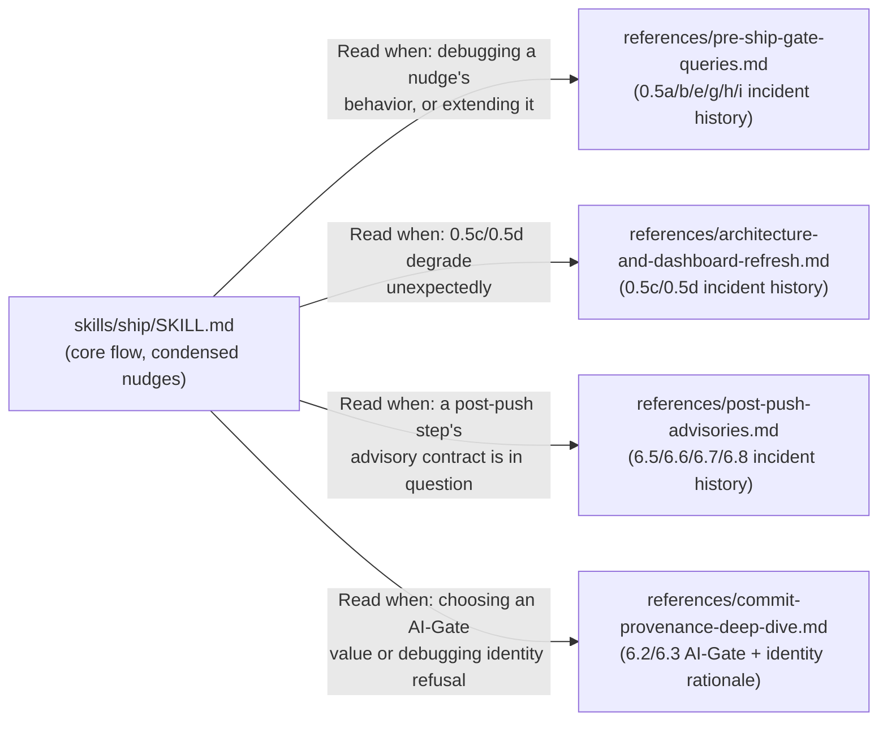

# Plan: Reduce `skills/ship/SKILL.md`'s size via progressive disclosure

- **Date**: 2026-09-16
- **Status**: Approved (GPT: 3 rounds, 4→1→0 findings, 100% acceptance both rounds with findings; Gemini: 1 round, APPROVE — no concerns)
- **Author**: Claude
- **Scope**: backend/tooling (skill-content reorganization; no code behavior changes)
- **Target domain(s)**: `skills-content`
- **Closes**: tech-debt topicId `44716fd984ed` (deferred 2026-09-02 at ~74,707 chars; re-measured 2026-09-16 at 93,664 chars / 1716 lines — the debt has grown 25% since deferral, confirming the trend named in the deferral rationale).

## Context Summary

`skills/ship/SKILL.md` is the single largest skill in this repo by a wide
margin, and the only one whose main document has never had a size-reduction
pass despite the repo's own stated convention: `SKILL.md ≤3K tokens target +
references/<topic>.md`, progressive disclosure, "read only when the trigger
applies" (AGENTS.md "Skill file structure"). It already has five reference
files (`references/{input-acquisition,migration-credentials,python-environment-
discovery,status-md-format,verification-discipline}.md`, 2.6K–27.7K chars each)
— the pattern is proven in this exact skill, just not applied broadly enough
to the main document's own bulk.

**Code Trace** (`skills/ship/SKILL.md` @ `16d7b075`, full-file read, all 1716
lines): the document's header list (`grep '^#{1,4} '`) shows 40 headings. The
bulk is concentrated in two families, both flagged "non-blocking" /
"advisory" in their own section titles:

- **Step 0.5's pre-ship gate queries, Phase-1 slice** (lines 118–827: `0.5a`
  persona-test P0s, `0.5b` unlocked-fixes regression-spec backlog, `0.5e`
  unremediated acceptances, `0.5g` migration realization, `0.5h` upstream
  issue queue, `0.5i` stalled comparison campaigns, `0.5f` override flags) —
  **710 lines, ~41% of the file** (`wc -l` on that exact line range).
- **Step 0.5's Phase-2 slice** (lines 844–964: `0.5c` architectural-memory
  refresh, `0.5d` local dashboard rebuild) — **121 lines, ~7% of the file**.
- **Post-push advisories, Phase-3 slice** (lines 1388–1651): `6.5` security
  memory refresh, `6.6` friction closure, `6.7` final-review credit, `6.8`
  consumer-side verification — **264 lines, ~15% of the file**.

These three ranges (all of Step 0.5 plus the four post-push advisories) total
**1095 lines, ~64% of the document**. Both families are already
self-described as advisory/non-blocking in their own headings, and both are
DENSE with incident-history narrative: each nudge carries one or more
`> **... — fixed 2026-0X-XX ...**` blockquotes recounting the specific
measured defect a prior fix closed (wrong scope returning another repo's
rows, `rows.length` undercounting a capped page, a `agedOut` banner counting
unlockable plan rows as a leak, etc.). This narrative is valuable for
understanding *why* the current behavior is correct, but it is not needed to
*execute* the step — the operative content per nudge is: one or two bash
commands, the JSON shape to read, a `measured`-before-count rule, and a
warning-card template to print verbatim.

**The rest of the document (Usage, Phase 0 stack detection, Steps 1/2/4/5/5.5/
5.8, Step 6 stage-commit-push, Step 7 emit event, Quick Reference, Reminders —
36% of the file) is core flow, executed or consulted on every ship, and stays
close to its current shape.** Step 6.2–6.3 (commit provenance + push) is the
one exception inside "core": it is unavoidably dense (the `AI-Gate` four-value
semantics, the identity-precondition rationale, the squash-merge rebase note)
because these are load-bearing RULES an agent must get right every ship, not
merely historical color — see Key Design Decisions for how much of that stays
inline.

## Right-sizing gate

- **Band-aid**: trim whitespace/redundant words here and there without a real
  extraction strategy. Does not meaningfully move the character count and
  leaves the actual problem (an undifferentiated wall of "why" and "what" in
  one always-loaded document) unaddressed.
- **Over-engineered**: invent a NEW mechanism beyond `references/*.md` — e.g.
  a build step that assembles `SKILL.md` from fragments at sync time, or a
  second-level "references of references" hierarchy. This repo's progressive-
  disclosure pattern (a flat `references/` directory, one summary-frontmatter
  row per file in the parent's index table) already solves this problem for
  every other skill; inventing a second mechanism for one skill is not
  justified by anything specific to `ship`.
- **Chosen**: apply the EXISTING, already-proven pattern this exact skill
  already uses five times over — extract the "why" narrative for each
  advisory-nudge family into a `references/*.md` file, condense each nudge's
  inline text down to what an agent needs to EXECUTE it correctly (command,
  return-shape, the one or two rules that change behavior, the printed
  template), and add a one-line pointer. No new abstraction; more instances
  of the one this skill already has.

## Key Design Decision: the gate-honesty D6 check is diff-scoped to `SKILL.md`, not `references/`

`skills/ship/gate-contract.json` carries 10 `gates[]` entries and 141
`ignoredCandidates[]` entries, and *every one* of the latter is a byte-exact
`line` string pinned against the CURRENT text of `skills/ship/SKILL.md`. A
naive reading of this makes the whole extraction look prohibitively risky —
moving or rewording any of those 141 lines looks like it breaks its
disposition.

**Verified false, by reading the enforcing code, not by assumption**
(`scripts/lib/gate-honesty/verb-pattern.mjs` + its caller
`scripts/check-gate-contracts.mjs:110`): the D6 check resolves its candidate
set via `git diff ... -- 'skills/*/SKILL.md'` — **diff-scoped to changed lines
within `skills/*/SKILL.md` files only.** Two consequences, both load-bearing
for this plan:

1. **A line DELETED from `SKILL.md` (moved verbatim into a `references/*.md`
   file) leaves the scanned corpus entirely.** Its `ignoredCandidates` entry
   becomes unused — not invalid, not flagged, simply inert. `findUndisposition
   edCandidates` only reports candidates that are present AND uncovered; an
   entry with no matching candidate produces nothing to report. There is no
   "orphaned disposition" check in this module or its caller.
2. **`references/*.md` is never scanned at all** — the diff glob is
   `skills/*/SKILL.md` exactly, not `skills/**`. Moving text there needs no
   disposition, ever, regardless of how many `never`/`must`/`gate` words it
   carries.

**What DOES need a fresh disposition**: only the small amount of NEW or
REWORDED text this plan adds directly to `SKILL.md` — the condensed
replacement paragraphs and the one-line pointers to each new reference file —
if that text itself contains a whole-word match against
`ENFORCEMENT_VERBS` (`blocks/block/fails/fail/exits/exit/refuses/refuse/
requires/require/must/never/always/threshold/thresholds/cap/caps/max/gate/
gates`). Given the condensed replacements are deliberately short and mostly
just cite the command + the one behavior-changing rule, the disposition
surface this plan adds is small and enumerated in the File-Level Plan below,
not left to be discovered by trial and error at push time.

**Corollary**: `npm run gates:check` (validates the contract's shape +
`statedIn` truth) and the D6 push-time gate (validates diff coverage) are
DIFFERENT checks with different scopes — this plan must pass both, but only
the second one cares about which lines moved where.

## Mermaid diagram

## Symbol/Content-Movement Matrix

"Byte-identical" below means the extracted paragraph's TEXT is a pure
relocation (copy-paste, no rewording) — only the inline replacement in
`SKILL.md` is newly authored. Enumerated from the full-file read at
`16d7b075` (line numbers as of that commit; will shift slightly by the time
Phase 1 lands after Phase 0's own edits — re-grep each heading before
editing, do not trust these numbers past the phase that reads them).

| Section (heading, lines @ 16d7b075) | Extract to | Condensed inline replacement keeps |
|---|---|---|
| `0.5a` Recent persona-test P0s (118–196) | `references/pre-ship-gate-queries.md` §0.5a | The two commands, the `measured`-before-count rule, the four closed-failure-semantics bullets (kept as a short list, not blockquote narrative), the `pendingVerification` one-line rule, the printed warning card verbatim |
| `0.5b` Unlocked-fixes backlog (197–391) | same file §0.5b | The two commands (`list-unlocked-fixes` + `--all-ages`), `byMode.code` as the count (one line, not the full incident), `danglingLocks` existence + the repoint/`--delete` commands, the two printed warning cards verbatim, the `primary_file`-based UI-vs-backend judgment call |
| `0.5e` Unremediated acceptances (392–672) | same file §0.5e | The auto-reconcile command, the two `list-unremediated-acceptances` commands, `byMode.total` as the count (one line), the `notYetDue`/`agedOut`/`prePractice` three-way distinction (kept, it changes what gets printed), the plan-mode Complete-vs-in-flight disposition rule, the two printed warning cards verbatim, the `final-review-record-fix` command |
| `0.5g` Migration realization (673–734) | same file §0.5g | Both commands (`--check-migrations`, `stores:drift`), the "commit-time enforcement stays at 6.3" one-liner, the cloud-off/no-ledger silent-skip rule, the on-block remedy command |
| `0.5h` Upstream issue queue (735–796) | same file §0.5h | The `upstream:queues` command, the source-repo gate, "never blocks / no override" one-liner, the full-uuid-required rule, the triage commands |
| `0.5i` Stalled campaigns (797–827) | same file §0.5i | The `campaign.mjs stale` command, the source-repo gate, "never blocks" one-liner, the collection-is-not-a-ship-time-chore rule |
| `0.5c` Architectural memory refresh (844–907) | `references/architecture-and-dashboard-refresh.md` §0.5c | The three commands, "never staged, Category A" one-liner, "always advisory" one-liner + the condensed 5-state failure list (one line each, not the full paragraph) |
| `0.5d` Dashboard rebuild (910–961) | same file §0.5d | The three commands, "never blocks" one-liner, "nothing here is ever staged, Category A" one-liner, the exit-code-is-a-reporting-signal two-line rule |
| `6.5` Security memory refresh (1388–1431) | `references/post-push-advisories.md` §6.5 | The command, "call by path never the npm alias" one-liner, the regex + the printed nudge line verbatim |
| `6.6` Friction closure (1434–1476) | same file §6.6 | The command, the host-portable-vs-accelerator one-liner, the printed nudge line verbatim, the silent-no-op conditions |
| `6.7` Final-review credit (1479–1575) | same file §6.7 | The primary render command, the pagination commands + "keyset cursor, no offset" one-liner, the two-axis-labelling one-liner, "advisory, always exits 0" one-liner |
| `6.8` Consumer-side verification (1578–1650) | same file §6.8 | The retrieval table (kept — it is the operative content), the `pending-note write` command, the three terminal states + the `unverified`-needs-a-reason rule |
| Dense AI-Gate/identity rationale INSIDE 6.2–6.3 (selected blockquotes only, not the whole section — see below) | `references/commit-provenance-deep-dive.md` (new) | The four AI-Gate values + one-line-each semantics, the `--expect-head`/`--expect-branch` requirement + when it may be omitted, the `--path` mandatory rule, the exit-code contract — ALL stay inline (load-bearing every ship). Only the multi-paragraph "why identity is a precondition and not a warning" / "passed is rare by design, and its rarity is not a defect" / measured-history blockquotes move. |

**Deliberately NOT touched**: Usage, Phase 0, Steps 1/2/2b/4/5/5.5, Step 7,
Quick Reference, Reminders, the "Reference files" index itself (extended, not
restructured), and the five existing reference files. Step 5.8 (pre-push
staleness check) stays inline in full — at 47 lines it is not a major
contributor and its content is a live git-state procedure an agent runs
in-sequence, not incident history to defer.

## File-Level Plan

**Phase 0 — Confirm current line numbers.** Re-run the heading grep against
the CURRENT `skills/ship/SKILL.md` (this plan may land after other edits to
the file); resolve every range in the matrix above against real content
before editing. Files: none (verification only).

**Every phase below ends with the same three commands, in this order —
stated once here rather than repeated four times**: `npm run skills:regenerate`
(regenerates `.claude/skills/ship/**` from the just-edited `skills/ship/**`;
`skills:check`'s own `regenerate-skill-copies.mjs --check` step fails on a
stale generated copy, so regeneration must precede the check within the SAME
phase, never deferred to close-out), then `npm run skills:check`, then
`npm run gates:check` (the contract's own shape/`statedIn`-truth validation —
distinct from, and cheaper than, the push-time D6 diff-scoped gate, which only
evaluates real changed lines against a real git diff and cannot be dry-run
standalone; the Key Design Decision above stays the authority for reasoning
about D6 coverage, not a local command). `gate-contract.json` is listed as a
per-phase file where that phase's condensed inline text plausibly needs a new
disposition — see the per-phase "Gate-contract" line below.

**Coverage is per VERB OCCURRENCE on a line, not per line** — re-verified
against `lineIsCovered` (`scripts/lib/gate-honesty/verb-pattern.mjs:92-109`)
after plan-audit round 2 M1 caught an earlier draft's single-substring
shortcut: a `stated`/`ignoredCandidates` entry covers only the character SPAN
it matches, and "a verb position is covered iff it falls inside some covering
span" — so a condensed line containing an already-`gates[]`-contracted
restatement AND a second, independent enforcement-verb clause (e.g. combining
two originally-separate sentences to save space) is only PARTIALLY covered:
the restated span passes, the second clause's verb sits outside every
covering span and D6 flags it, even though the line "contains" a covered
substring. **The check per condensed line is therefore**: list every
enforcement-verb word on the FINAL line (`blocks/block/fails/fail/exits/
exit/refuses/refuse/requires/require/must/never/always/threshold/thresholds/
cap/caps/max/gate/gates`, whole-word, case-insensitive — the frozen list in
`ENFORCEMENT_VERBS`), and for EACH occurrence confirm it falls inside either
an existing gate's `stated` substring or a covering `ignoredCandidates.line`
— not merely that SOME substring of the line matches somewhere. A line
combining two claims needs either two covering spans or one
`ignoredCandidates` entry equal to the WHOLE line. Distinguish a RESTATEMENT
of an already-`gates[]`-contracted claim (covered once its exact `stated`
span is confirmed present — no edit needed) from a genuinely NEW descriptive
claim or a second clause added onto a covered line (needs a new
`ignoredCandidates` entry, reasoned the same way the pre-existing 141 entries
already are: name what behavior it describes and why it is prose, not code).
Prefer keeping a restated claim and a new clause on SEPARATE lines during
condensation specifically so this per-occurrence check stays simple to do by
inspection — merging them onto one line is not forbidden, but it is the shape
that produced round 2's finding.

**Phase 1 — Extract Step 0.5's nudge family.** Create
`skills/ship/references/pre-ship-gate-queries.md` (summary frontmatter: one
line covering 0.5a/b/e/g/h/i's shared "why" — non-blocking pre-ship signals,
their scoping/undercounting incident history, and the disposition rules).
Move the six sections' incident-history prose verbatim; condense each
section's `SKILL.md` inline text per the matrix.
Add the reference-index row.
Gate-contract: several condensed one-liners restate an already-`gates[]`-
contracted claim (e.g. `unremediated-acceptances-never-blocks`,
`persona-gate-unmeasured-is-not-silent`) — check each against that gate's
`stated` substring first; only add an `ignoredCandidates` entry for text with
no covering `stated` span.
Files: `skills/ship/references/pre-ship-gate-queries.md` (create),
`skills/ship/SKILL.md` (modify), `skills/ship/gate-contract.json` (modify, as
needed per the above), `.claude/skills/ship/**` (regenerated, modify).

**Phase 2 — Extract 0.5c/0.5d (architecture + dashboard refresh).** Create
`skills/ship/references/architecture-and-dashboard-refresh.md`. Move both
sections' incident-history prose verbatim; condense inline per the matrix.
Add the reference-index row. Gate-contract: same per-line disposition
discipline as Phase 1. Files:
`skills/ship/references/architecture-and-dashboard-refresh.md` (create),
`skills/ship/SKILL.md` (modify), `skills/ship/gate-contract.json` (modify, as
needed), `.claude/skills/ship/**` (regenerated, modify).

**Phase 3 — Extract the post-push advisories (6.5–6.8).** Create
`skills/ship/references/post-push-advisories.md`. Move all four sections'
incident-history prose verbatim; condense inline per the matrix (6.8's
retrieval table stays inline — it is operative, not historical). Add the
reference-index row. Gate-contract: same per-line disposition discipline as
Phase 1 (e.g. `final-review-credit-advisory-exit-zero`'s `stated` substring
likely still covers its condensed restatement). Files:
`skills/ship/references/post-push-advisories.md` (create),
`skills/ship/SKILL.md` (modify), `skills/ship/gate-contract.json` (modify, as
needed), `.claude/skills/ship/**` (regenerated, modify).

**Phase 4 — Extract the AI-Gate/identity deep-dive from 6.2–6.3, and
close out.** Create `skills/ship/references/commit-provenance-deep-dive.md`
(distinct from the EXISTING `docs/reference/commit-provenance.md`, which
documents the trailer schema/query cookbook for the whole repo, not this
skill's specific operational callouts — cross-link the two rather than
merging). Move the "why identity is a precondition", "passed is rare by
design", and the freshness/`--no-run-id` measured-history blockquotes
verbatim; keep every RULE (the four AI-Gate values, the mandatory flags, the
`--path` requirement, exit contract, the squash-merge rebase note's operative
instruction) inline per the matrix. Add the reference-index row. Gate-contract:
this phase touches the DENSEST cluster of `gates[]`-contracted lines
(`gate-passed-refused-without-evidence`, `gate-converged-requires-verified-
divergence`, `gate-no-tests-caps-the-verdict`, `guard-a`/`guard-b`) — verify
each condensed rule's text still contains (or is replaced by an
`ignoredCandidates` entry matching) its gate's exact `stated` string before
moving on. Then, additionally:
- Measure the final `SKILL.md` character count and record it in this plan's
  Testing Strategy results (see the minimum-reduction bar below).
- Resolve tech-debt topicId `44716fd984ed`.

Files: `skills/ship/references/commit-provenance-deep-dive.md` (create),
`skills/ship/SKILL.md` (modify), `skills/ship/gate-contract.json` (modify, as
needed), `.claude/skills/ship/**` (regenerated, modify).

## Testing Strategy

This is a content-reorganization plan with no code behavior change, so the
"tests" are mechanical integrity checks, not unit tests:

Each extracted section splits into two DISJOINT parts, per the
Symbol/Content-Movement Matrix's "keeps" column — the condensed inline text
and the moved reference-file prose are complementary, not duplicates of one
another. "No content lost" therefore means: the UNION of (inline-kept text) ∪
(reference-file text) covers the original section, not that either half
alone reproduces the whole original verbatim.

| Invariant | How verified |
|---|---|
| No operative content lost — every command, every printed template, every behavior-changing rule survives somewhere reachable | Manual diff review per phase, checked as a union: for each condensed section, confirm (a) every item in the matrix's "keeps" column is present in the new inline text, and (b) every sentence of the ORIGINAL section not covered by (a) is present verbatim in the new reference file — i.e. `original section text` ⊆ `condensed inline text` ∪ `reference file text`, with no sentence appearing in neither. `git diff` reviewed phase-by-phase, not just at the end. |
| `skills:check` — reference-index row `Summary` byte-matches each new file's `summary:` frontmatter, AND generated-copy parity (`.claude/skills/ship/**` == `skills/ship/**`) | `npm run skills:regenerate` THEN `npm run skills:check`, in that order, at the end of EVERY phase (not deferred to close-out — see the File-Level Plan's shared per-phase closing sequence) |
| Gate-contract shape validity (`gates[]`/`ignoredCandidates[]` schema, `statedIn` truth) | `npm run gates:check` at the end of every phase, same sequence |
| Gate-honesty D6 — every enforcement-verb OCCURRENCE (not merely every line) on a changed `SKILL.md` line is covered | Cannot be dry-run standalone (it is diff-scoped against a real git diff at push time — see the Key Design Decision above); mitigated by the File-Level Plan's per-occurrence coverage check (added after plan-audit round 2 M1), applied to every condensed line before that phase's commit, and confirmed for real at Cluster close-out when `/audit-code`'s own push-time verification runs |
| Size reduced by a concrete floor, not merely "some" | **Minimum bar: `skills/ship/SKILL.md` must drop below 40,000 characters** (from the pre-Phase-1 93,664; verified via `node -e "..."` char-counting the exact Phase 1–3 line ranges, not estimated from line-count proportion: the three ranges total 61,797 of the file's 93,664 chars — removing them entirely would land at 31,867, so a 40,000 floor leaves ~8,100 chars of headroom for every phase's condensed inline replacement, on top of whatever Phase 4 additionally moves out of 6.2–6.3). Measured after every phase (not just Phase 4), so a shortfall is visible before close-out rather than discovered there. If Phase 4 completes above the floor, that is a plan failure to fix (extract more, or reduce a phase's "keeps" list further) before resolving the tech-debt entry — not a result to ship as-is. |
| Consumer sync unaffected | No consumer-specific content touched; the sync mechanism (`sync-to-repos.mjs`) already handles arbitrary file adds under `skills/ship/references/**` the same way it handles the five existing ones — no new sync logic needed |

**Deliberately not covered**: this plan does not change `ship-commit.mjs`,
`cross-skill.mjs`, or any of the CLIs the skill invokes — their own test
suites are unaffected and out of scope.

## Execution Clustering

- **Cluster A** — Phase 1 (Step 0.5's six-section nudge family) — fix-gate: yes
  - Coupling: none of the four phases depend on each other's content (each
    extracts a disjoint section range into its own new file), but Phase 1 is
    the largest single removal (710 lines / 40,823 chars) and worth landing and verifying
    alone first, since it is also the phase most likely to surface an
    unanticipated gate-honesty disposition gap — better to learn that on the
    smallest independently-revertable unit.
- **Cluster B** — Phases 2–3 (0.5c/0.5d + the four post-push advisories) —
  fix-gate: yes
  - Coupling: both are smaller, same-shape extractions (advisory section →
    dedicated reference file) with no dependency on Phase 1's specific text;
    grouping them keeps cluster count proportionate to a content-reorg task's
    actual risk.
- **Cluster C** — Phase 4 (commit-provenance deep-dive + close-out) —
  fix-gate: final
  - Coupling: the most judgment-heavy extraction (deciding exactly which
    Step 6.2–6.3 prose is "rationale" vs "rule" — see the matrix's explicit
    keep-list) and the phase that runs the close-out measurement + debt
    resolution, so it groups with the last cluster rather than standing
    alone, same reasoning as the gemini-review.mjs decomposition's own
    Cluster C.
- **Final gate**: mandatory consolidated Gemini review over the union diff
  after all three clusters converge.
