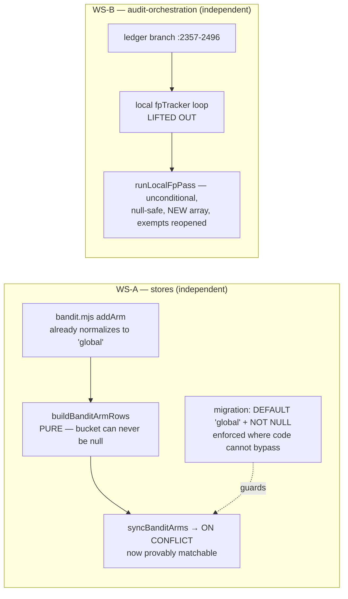

# Plan: Close Two Sibling-Path Defects (bandit_arms NULL key + local FP tracker in the ledger branch)

- **Date**: 2026-07-17
- **Status**: Draft
- **Author**: Claude + Louis Strydom
- **Scope**: backend

- **Target domain(s)**: `stores` (`bandit-fp.mjs`), `audit-orchestration`
  (`legacy-production-audit.mjs`), `shared-lib` (`suppression-policy.mjs`)
- ⚠ **Cross-domain work** — two independent workstreams in different domains.
  No new edges: each modifies functions in place. WS-A is `stores`-local;
  WS-B reuses the existing `audit-orchestration → shared-lib` edge that the
  cloud-FP change already established.

## Provenance

Both items were **deferred from the cloud-FP-suppression code audit**
(2026-07-17, `docs/completed/cloud-fp-suppression-read-loop.md`) with named
independence, and spawned as tasks rather than buried:

| Item | Found as | Why deferred there |
|---|---|---|
| WS-A — `syncBanditArms` NULL-conflict key | R1-H2 + R1-H4 (two independent passes) | Genuinely independent: the cloud FP read loop reads `false_positive_patterns` only; `bandit_arms` is a disjoint table + code path it never calls. |
| WS-B — local `fpTracker` trapped in the ledger branch | R1-M2 | Fixing it **changes cloud-off suppression behaviour**, which that plan's constraint 1 explicitly forbade and which none of its 5 GPT + 2 Gemini rounds audited. Shipping it under cover of a cloud-read PR would have been a scope violation. |

**The shared theme (and the reason they are one plan):** both are cases where a
targeted fix was applied to one path and **the identical defect was left on its
sibling**. 718ca90 fixed the NULL-conflict key for `false_positive_patterns` and
nobody checked `bandit_arms`. The cloud-FP plan lifted `runCloudFpPass` out of
the ledger branch (its R1-H1) and left the local tracker one branch away. That
is a *recurring* review failure worth naming, not two coincidences — see
§Sustainability.

## Neighbourhood considered

`get-neighbourhood` over both target files returned 50 records, **all
`recommendation: review`**, top matches being the very functions this plan
edits (`runLegacyProductionAudit` 0.795, `validateLedgerForR2` 0.801 — expected
self-similarity). **No `reuse`/`extend` candidate exists and this plan creates
no new sibling**: WS-A modifies `syncBanditArms`/`loadBanditArms` in place and
extracts one pure builder that *deliberately* mirrors the audited
`buildFpPatternRows` shape; WS-B reuses `runCloudFpPass`'s already-shipped seam
shape rather than inventing a second one.

## Past incidents to verify against

| Incident | Relevance |
|---|---|
| **The 2026-07-17 FP-sync incident** (403k rows / ~140MB in 3 days, Supabase Disk IO budget depleted) | WS-A is **the same defect class in a different table**. Its fix (718ca90 + migration `20260717120000`) is the template this plan mirrors — and the reason the DB-level constraint, not just the code fix, is load-bearing. |
| **INC-002** (test DSN aliased to prod wiped the DB, 2026-07-14) | Both workstreams are DB-adjacent. **No test in this plan touches a live DSN**; every case is a pure function over injected fixtures, and the live reads below were read-only `SELECT`s. |

---

## 1. Context Summary

**Detected scope + stack**: backend; `js-ts` (Node ESM) + postgres.

### THE HEADLINE: both defects are LATENT, not live — measured, not assumed

The task brief said **"CHECK FIRST"**, and the check changed the plan
materially. Both defects are real, but **neither is currently firing**, and the
"dedupe existing rows" work the brief anticipated **does not exist**:

| Check (read-only, live store) | Result | Consequence for this plan |
|---|---|---|
| `SELECT count(*) FROM bandit_arms` | **20 rows** | Tiny table — no scale problem. |
| `... WHERE context_bucket IS NULL` | **0 rows** | **No dedupe migration needed.** The brief's step 2 ("dedupe existing null-bucket rows deterministically") is dead work. |
| duplicate `(pass_name, variant_id)` null-bucket groups | **0** | The 403k-style explosion has **not** happened here. |
| bucket distribution | **`'global'` → 20** (100%) | Every live row already holds the sentinel the fix would write. |
| local FP tracker patterns | **2,424 tracked, 10 would auto-suppress** | WS-B's blast radius is **10 patterns**, not thousands. |
| debt-ledger entries | **343** | **WS-B is latent too** — see below. |

### Why WS-A does not fire (Code Trace)

`scripts/lib/store/bandit-fp.mjs:36` writes
`context_bucket: arm.contextBucket || null` while `:42` names
`onConflict: ['pass_name','variant_id','context_bucket']`. That is a genuine
self-contradiction — Postgres treats NULLs as DISTINCT, so a null-bucket row
could never match its own conflict target and every sync would INSERT a
duplicate.

**But the `|| null` is unreachable**, because the bandit normalizes twice
upstream:

- `scripts/bandit.mjs:77-83` — `addArm(passName, variantId, contextBucket = null, …)`
  does `const bucket = contextBucket || GLOBAL_CONTEXT_BUCKET;` and stores
  `contextBucket: bucket`.
- `scripts/bandit.mjs:64-66` — *"Normalize legacy arms without contextBucket"*:
  `if (!arm.contextBucket) arm.contextBucket = GLOBAL_CONTEXT_BUCKET;` on load.

So no in-memory arm can carry a falsy `contextBucket`, which is exactly why all
20 live rows are `'global'` and zero are null. Call path:
`PromptBandit.addArm()` (`bandit.mjs:77`) → `bandit.arms` → `syncBanditArms(bandit.arms)`
(`legacy-production-audit.mjs:2752`) → `bandit-fp.mjs:36`.

**The defect is therefore fragility, not damage**: the write boundary's
`|| null` contradicts its own ON CONFLICT target and is one refactor away from
firing (an arm object constructed outside `addArm`; the `:66` normalizer
removed as "dead"), and **nothing at the DB level prevents it** — `context_bucket`
has no `NOT NULL` and no `DEFAULT`.

### Why WS-B does not fire (Code Trace)

`legacy-production-audit.mjs` — the local FP loop
(`if (fpTracker) { … fpTracker.shouldSuppress(f) … }`, inside the
`if (mergedLedger.entries.length > 0)` branch that opens at `:2357`) is skipped
whenever the merged ledger is empty. But `mergedLedger` is
`mergeLedgersForSuppression(sessionLedger, debtLedger)` and **Phase D merges the
debt ledger on every round, not just R2+** (`:2306-2313`, *"debt gets suppressed
in every round, not just R2+"*). With **343 debt entries** in this repo, the
branch is effectively always taken.

**Reachability is therefore narrow and worth stating precisely**: it needs a repo
with **learned FP patterns but an empty merged ledger** — no session ledger AND
no debt entries (a `--no-debt-ledger` run, a purged debt ledger, or a fresh
consumer). And a *fresh* repo has an empty tracker too, so there is nothing to
suppress — the two mechanisms accumulate together. The genuinely exposed case is
a **mature tracker + deliberately-suppressed debt ledger**.

### Patterns reused vs new

**Reused** — `GLOBAL_CONTEXT_BUCKET` (`config.mjs:223`, already the bandit's own
normalization target); `buildFpPatternRows`' pure-row-builder + schema-guard-test
shape (`bandit-fp.mjs`, `tests/store-bandit-fp.test.mjs`); `runCloudFpPass`'s
unconditional null-safe seam + array-ownership contract
(`suppression-policy.mjs`); the migration shape of `20260717120000_fp_sync_idempotency.sql`.

**New** — one pure `buildBanditArmRows`; one migration; one `runLocalFpPass`
seam (or a documented decision not to extract one — see §2).

---

## 2. Proposed Architecture



### Right-sizing gate — WS-A

- **Band-aid**: change `|| null` to `|| GLOBAL_CONTEXT_BUCKET` and stop. Fixes
  today's code but leaves the DB with no constraint, so the next writer (a
  consumer running stale synced code, a new call site) can re-introduce nulls
  silently. The FP-sync incident is precisely what "code-only fix, no DB
  constraint" looks like when it fails.
- **Over-engineered**: the brief's full 718ca90 mirror — dedupe migration +
  backfill + constraint rework. **The dedupe is dead work: there are 0 null rows
  and 0 duplicates.** Writing a dedupe for an empty set is ceremony that must
  itself be reviewed and can itself be wrong.
- **Chosen**: normalize at the row-build boundary **and** add the DB
  `DEFAULT 'global'` + `NOT NULL` (#12 validation at boundaries, #13
  idempotency). No dedupe — the measurement says there is nothing to dedupe, and
  the migration is a plain `ALTER` that a pre-check makes safe. This is the
  smallest thing that makes the invariant *unbypassable* rather than
  *conventional*.

### Right-sizing gate — WS-B

- **Band-aid**: leave it; it does not fire here. But "it does not fire *in this
  repo, today*" is not a property of the code — it depends on the debt ledger
  being non-empty, which is incidental. That is the reasoning that left the
  sibling defect in place to begin with.
- **Over-engineered**: unify local + cloud + ledger suppression under one
  policy engine (the `suppression-policy.mjs` module's original ambition). That
  changes cloud-off behaviour far beyond this fix, and the cloud-FP plan already
  recorded it as out-of-scope with a revisit trigger (the local tracker's legacy
  raw-count fallback differs from the policy's semantics — a parity suite is a
  prerequisite).
- **Chosen**: lift the loop out into a `runCloudFpPass`-shaped seam and nothing
  more (#2 modularity, #11 testability). Same shape, same guarantees, one
  behaviour change — which is measured (10 patterns) and gated by its own audit.

### Key design decisions

1. **WS-A's `|| null` becomes `|| GLOBAL_CONTEXT_BUCKET`, and the DB enforces
   it** (#5 single source of truth). The sentinel is not invented here — it is
   `config.mjs:223`, already the value `addArm` writes. The code fix makes the
   write boundary agree with its own ON CONFLICT target; the constraint makes it
   true for writers that bypass the builder (a stale consumer, a future call
   site). Both, or neither is a real fix.

2. **No dedupe migration** (the measurement, not an assumption). 0 null rows, 0
   duplicate groups. The migration **pre-checks and fails loudly** rather than
   silently no-op'ing if that ever stops being true:
   ```sql
   DO $$ BEGIN
     IF EXISTS (SELECT 1 FROM bandit_arms WHERE context_bucket IS NULL) THEN
       RAISE EXCEPTION 'bandit_arms has NULL context_bucket rows — dedupe before applying NOT NULL';
     END IF;
   END $$;
   ALTER TABLE bandit_arms ALTER COLUMN context_bucket SET DEFAULT 'global';
   ALTER TABLE bandit_arms ALTER COLUMN context_bucket SET NOT NULL;
   ```
   A blind `UPDATE … SET context_bucket='global' WHERE context_bucket IS NULL`
   would be *worse than nothing*: on a table that has drifted it would collapse
   distinct arms into one identity and silently destroy bandit state. Refusing
   is the honest failure. **Verify the unique constraint** covers exactly
   `(pass_name, variant_id, context_bucket)` at implementation — if it is
   missing entirely, ON CONFLICT is broken for a different reason and that is a
   separate finding, not something to smuggle in here.

3. **`buildBanditArmRows` is extracted as a pure function** (#11), mirroring
   `buildFpPatternRows`. This is not symmetry for its own sake: it is what makes
   "the bucket can never be null" assertable **DB-free** (INC-002 forbids a live
   DSN in tests), exactly as the FP builder's test pins "repo_id can never be
   null". It also joins the schema-guard test that parses migrations — the guard
   that would have caught the FP reader's phantom columns.

4. **WS-B mirrors `runCloudFpPass` exactly** — unconditional call, null-safe
   (`fpTracker` absent → return input unchanged), and **returns a NEW array**.
   The array-ownership contract is load-bearing and already cost this codebase
   once: the call site does `allFindings.length = 0; push(...cloudPass.findings)`,
   so a seam returning its input by reference **erases every finding**
   (cloud-FP plan R3-H1). The new seam sits next to that one and inherits the
   same contract and the same test shape (including the call-site replay).

5. **WS-B exempts `reopened` — decided, not inherited.** Today the local loop
   filters `kept` only, so it never sees reopened findings; lifting it out over
   `allFindings` (= kept + reopened) would **silently start suppressing
   reopens**, letting category statistics mask a regression. That is the exact
   hazard the cloud pass's `exempt` set exists to prevent. So the lifted seam
   takes the **same `reopenedSet`**. This preserves today's semantics *and* the
   cloud path's, rather than quietly acquiring a new behaviour as a side effect
   of a refactor.

6. **WS-B's one intended behaviour change is stated and bounded**: on a run with
   an empty merged ledger, the local tracker now applies. Measured blast radius:
   **10 of 2,424 tracked patterns** clear the auto-suppress bar
   (raw ≥ 5 ∧ ema < 0.15). Unreachable in this repo today (343 debt entries), so
   the change is preventive. It must be **named in the plan and the commit**, not
   discovered later — it is precisely what constraint 1 of the cloud-FP plan
   forbade shipping unaudited.

7. **The two workstreams are INDEPENDENT and must not be merged.** Different
   domains, different tables, different risk, zero shared symbols. They are one
   *plan* because they share a provenance and a lesson; they are two *clusters*
   because neither's correctness depends on the other. §11 splits them, and a
   reviewer can reject one without the other.

---

## 6. Sustainability Notes

- **The real lesson is the sibling-path miss, and it deserves a mechanism, not
  a resolution to be careful.** Both defects exist because a fix was scoped to
  the instance that hurt rather than the *class*. The FP-sync fix asked "is
  `false_positive_patterns` broken?" instead of "which other tables share this
  ON CONFLICT shape?". The cloud-FP fix lifted one loop out of the branch and
  stepped over its neighbour. **Follow-up recorded in §Out of Scope**: a
  mechanical check for `onConflict` targets containing a column the writer can
  emit as null would have caught WS-A years earlier and will catch the next one.
  Deliberately NOT built here (it is its own plan, and this one must stay
  reviewable).
- **Assumption that could change (WS-A)**: that `addArm` remains the only arm
  constructor. If a future call site builds arm objects directly, the `|| null`
  would fire — which is *why* the DB constraint, not the code fix, is the
  durable half.
- **Assumption that could change (WS-B)**: that the debt ledger stays non-empty.
  Today it is why the defect is latent; it is not a guarantee. `--no-debt-ledger`
  or a debt purge exposes it immediately.
- **Coupling**: no new domain edges. WS-A is `stores`-local; WS-B reuses the
  `audit-orchestration → shared-lib` edge the cloud-FP change already
  established, and places the new seam beside `runCloudFpPass` so the two
  suppression passes stay visibly symmetric rather than drifting.

---

## 7. File-Level Plan

### WS-A — `bandit_arms` NULL-conflict key

#### `scripts/lib/store/bandit-fp.mjs` (modify)
- **New export `buildBanditArmRows(arms)`** → `object[]` — PURE. Bucket derives
  from `arm.contextBucket || GLOBAL_CONTEXT_BUCKET`; **never null**. Mirrors
  `buildFpPatternRows` so the DB-free test can pin the invariant.
- `syncBanditArms` delegates to it. `loadBanditArms` (`:64`) already coerces
  `row.context_bucket || 'global'` — **replace the literal with the imported
  `GLOBAL_CONTEXT_BUCKET`** so reader and writer share one constant (#5).
- **Why this file**: it owns this table's write contract.

#### `supabase/migrations/<ts>_bandit_arms_bucket_not_null.sql` (create)
- Pre-check that RAISEs on any NULL row (decision #2), then `SET DEFAULT 'global'`
  + `SET NOT NULL`. Idempotent, transactional. No dedupe — 0 rows to dedupe.
- **Why**: makes the invariant unbypassable by a writer that skips the builder.

#### `tests/store-bandit-fp.test.mjs` (modify — Tier 1, test-first)
1. `buildBanditArmRows`: a missing/empty/null `contextBucket` → `'global'`, **never
   null** (the direct analogue of the existing `repo_id` never-null pin).
2. An explicit bucket passes through unchanged.
3. The emitted `context_bucket` is **always** a non-empty string across a fixture
   of legacy + scoped + explicit arms.
4. **Schema guard**: every column `buildBanditArmRows` emits is declared by a
   migration (extend the existing `declaredFpPatternColumns` parser to
   `bandit_arms`).
5. `syncBanditArms` cloud-off → no-op, no throw (existing contract preserved).

#### `tests/learning-store-exports.test.mjs` (modify)
- Add `buildBanditArmRows` to `EXPECTED_EXPORTS` (the barrel `export *`s
  `bandit-fp.mjs`) and bump the pinned count 160 → 161, with the same
  explanatory comment style as `buildFpReadQuery`.

### WS-B — local FP tracker out of the ledger branch

#### `scripts/lib/suppression-policy.mjs` (modify)
- **New export `runLocalFpPass(findings, { fpTracker, exempt, log })`** →
  `{findings, suppressedCount, suppressed}`. Null-safe (`fpTracker` absent →
  fresh copy of `findings`), **always returns a NEW array** (decision #4),
  exempts `exempt` members by identity (decision #5). Wraps
  `fpTracker.shouldSuppress` — the tracker's semantics (including its legacy
  raw-count fallback) are **not** touched.
- **Why this file**: it already owns `runCloudFpPass`; putting the sibling seam
  anywhere else guarantees the two drift.

#### `scripts/lib/audit/legacy-production-audit.mjs` (modify)
- Delete the local loop from inside the ledger branch; call `runLocalFpPass`
  **after the branch closes (`:2496`) and BEFORE `runCloudFpPass`**, preserving
  today's local-then-cloud ordering (a cloud pattern known locally must still
  attribute to the local counter).
- Thread `fpSuppressedCount` from the returned count; keep the existing
  `_suppressionData` field semantics and the `keptCount` subtraction contract
  (the cloud-FP plan's R5-M2 fix — the same reconciliation now applies to two
  passes, so subtract each pass's own count).
- **Why this file**: it is the orchestrator; it must hold no decision logic.

#### `tests/suppression-policy.test.mjs` (modify — Tier 1, test-first)
1. **No ledger → the tracker now suppresses** (the fix): a matching pattern with
   `fpTracker` present and `exempt` empty → suppressed.
2. **MIRROR — it can still keep**: a non-matching finding survives, so the suite
   cannot pass by suppressing everything.
3. **`reopened` is exempt** (decision #5): a reopened finding matching a
   suppressing pattern is **kept**.
4. **Null-safe**: `fpTracker: null` → findings unchanged, `log` never called.
5. **Array ownership**: `result.findings !== input` on both paths, **plus** the
   call-site replay (`arr.length = 0; arr.push(...r.findings)` → every finding
   survives) — the R3-H1 regression.

### Close-out (not a phase)

`node scripts/setup-postgres.mjs --migrate` → `npm test` → verify the live
`bandit_arms` bucket distribution is still 100% `'global'` and the row count has
not grown anomalously after one real audit run (the FP-sync incident's tell was
row-count growth, so check the thing that actually detects it).

### 7b. Implementation Phases

**Phase 1 — bandit-arms row builder + reader constant**: extract
`buildBanditArmRows`, delegate `syncBanditArms`, align `loadBanditArms` on the
shared constant. Files: `scripts/lib/store/bandit-fp.mjs` (modify),
`tests/store-bandit-fp.test.mjs` (modify), `tests/learning-store-exports.test.mjs` (modify).

**Phase 2 — bandit-arms DB constraint**: the pre-checked `DEFAULT` + `NOT NULL`
migration. Files: `supabase/migrations/<ts>_bandit_arms_bucket_not_null.sql` (create).

**Phase 3 — local FP pass seam**: `runLocalFpPass` + its tests. Files:
`scripts/lib/suppression-policy.mjs` (modify), `tests/suppression-policy.test.mjs` (modify).

**Phase 4 — orchestrator wiring**: lift the loop out; thread the count; preserve
ordering + `keptCount` semantics. Files:
`scripts/lib/audit/legacy-production-audit.mjs` (modify).

**Close-out (not a phase)**: `setup-postgres --migrate`; `npm test`; live
bucket-distribution + row-count check.

---

## 8. Risk & Trade-off Register

| Risk | Direction | Mitigation |
|---|---|---|
| The `NOT NULL` migration fails on a consumer whose `bandit_arms` HAS drifted to null rows | availability | The pre-check RAISEs with a directive message instead of applying. **Deliberate**: a blind backfill would collapse distinct arms into one identity and destroy bandit state — refusing is the honest failure. Measured 0 null rows here; a consumer may differ. |
| A stale consumer running old synced code writes `null` post-migration | correctness | It now fails **loudly** (`23502`) in its fire-and-forget stderr log instead of silently growing the table — the same escape the FP-sync migration chose, for the same reason. |
| WS-B newly suppresses findings on no-ledger runs | recall | The single intended behaviour change. Bounded and **measured**: 10 of 2,424 patterns clear the bar; unreachable in this repo today (343 debt entries). Named in plan + commit; `reopened` exempted so regressions can never be masked. |
| WS-B's lifted seam aliases its input and erases all findings | correctness / total data loss | The R3-H1 class, one file away. Contract: always a NEW array; pinned by the call-site-replay test, not by an isolation-only test (which is what let R3-H1 through the first time). |
| Extracting `buildBanditArmRows` is symmetry-for-its-own-sake | over-engineering | It has a current requirement: the never-null invariant must be assertable DB-free (INC-002). Without it the fix is untestable, not merely untested. |
| The two workstreams get merged into one commit/audit | scope | §11 splits them; each is independently rejectable. |

**Deliberately deferred**: the dedupe migration (0 rows — dead work); unifying
local+cloud+ledger suppression (needs a parity suite first); the mechanical
null-in-conflict-target lint (§Out of Scope).

## Out of Scope (Future)

| Item | Revisit trigger |
|---|---|
| **A mechanical check for `onConflict` targets naming a column the writer can emit as null** — the check that would have caught WS-A at 718ca90 time and will catch the next sibling | Now-ish, as its own plan. Two instances of this exact class in one repo (`false_positive_patterns`, `bandit_arms`) is a pattern, not a coincidence. Cheap: the write builders are a small, enumerable set. |
| Unify `fpTracker.shouldSuppress` with `resolveSuppressionPolicy` | The local tracker's legacy raw-count fallback is retired, OR a parity suite exists. Inherited from the cloud-FP plan's Out of Scope. |
| Dedupe/backfill tooling for `bandit_arms` | The pre-check ever RAISEs — i.e. a real deployment has drifted. |
| Verify the `bandit_arms` unique constraint actually covers `(pass_name, variant_id, context_bucket)` | Confirm at implementation; if it is **absent**, ON CONFLICT is broken for an unrelated reason → its own finding, not a smuggled fix. |

---

## 9. Testing Strategy

- **Tier 1, test-first** (AGENTS.md doctrine): both workstreams are pure
  functions over injected fixtures. No DB, no DSN, no LLM (INC-002).
- **Success-path adversarialism**: the dangerous green is "suppression silently
  removed a real finding". Every "now suppresses" case has a mirror proving it
  can still keep (WS-B tests 1↔2), and the exempt case proves reopens survive.
  A suite asserting only the fix's happy path would pass with recall destroyed.
- **Test the composition, not just the seam** — the R3-H1 lesson from the sibling
  plan: the WS-B array-ownership test replays the literal call-site sequence
  rather than trusting the return value in isolation, because an isolation-only
  test is exactly what missed it last time.
- **Schema guard extension** (WS-A test 4): the parser that pins "every column
  the writer emits is migration-declared" is the guard that would have caught the
  FP reader's phantom columns. Extending it to `bandit_arms` is why WS-A's
  builder extraction earns its keep.
- **Pre-ship empirical verify**: not a browser skill. The live check is the one
  that actually detects this defect class — after one real audit run, confirm
  `bandit_arms` row count has not grown and bucket distribution is still 100%
  `'global'` (row-count growth was the FP-sync incident's tell).

## Security Considerations

- **No egress**: neither workstream adds anything to a provider payload. WS-A is
  a DB write shape; WS-B is post-output finding filtering.
- **DB**: WS-A adds one `ALTER` guarded by a pre-check that refuses rather than
  destroys. No test touches a live DSN (INC-002); the measurements in §1 were
  read-only `SELECT`s.
- **No new logging of sensitive data**: WS-B's `log` seam emits category strings
  only, matching `runCloudFpPass`.

---

## 11. Execution Clustering

- **Cluster A** — Phases 1-2 — fix-gate: yes
  - Coupling: the row builder and the DB constraint are **two halves of one
    invariant** — code-only leaves the next writer free to re-introduce nulls;
    constraint-only breaks a writer still emitting them. They must be audited
    together, and the migration's pre-check is only meaningful against the
    builder that guarantees the sentinel.
  - Additional files: `supabase/migrations/<ts>_bandit_arms_bucket_not_null.sql` (create)
  - author-tier: standard
- **Cluster B** — Phases 3-4 — fix-gate: final
  - Coupling: the seam and its call site are the classic composition pair — the
    array-ownership contract and the local-then-cloud ordering only exist *at the
    join*, and R3-H1 proved a correct seam with a wrong call site erases every
    finding. Auditing them apart would repeat that.
  - author-tier: frontier
- **Final gate**: mandatory consolidated Gemini review over the union diff.

> **Cluster A and Cluster B are independent** (different domains, tables and
> symbols; neither reads the other's output). `fix-gate: yes` on A is about
> A's own two halves, not a dependency B has on A — B may be rejected, reverted
> or deferred without touching A.
