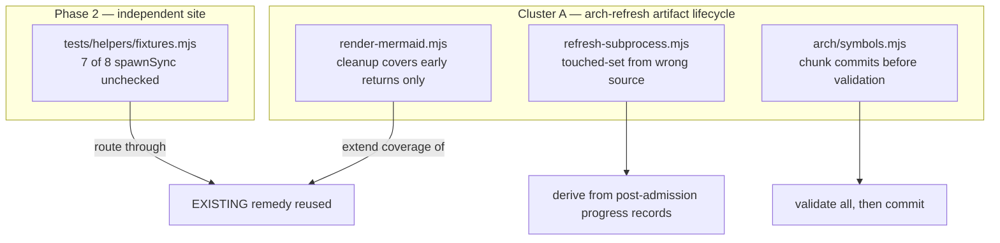

# Plan: Four places that report success without establishing it

- **Date**: 2026-08-14
- **Status**: Complete
- **Author**: Claude + Louis
- **Scope**: backend
- **Target domain(s)**: `arch-memory`, `stores`, `tests`, `visual-audit`
- ⚠ **Cross-domain work** — four domains, but one defect class. The clustering in
  §11 splits on the real seam (the arch-refresh artifact lifecycle vs one
  independent site), not on domain labels.

> **Origin**: triage of the unremediated-acceptances backlog, 2026-08-14. 74 rows
> in, 7 closed as already-fixed-never-closed, and five re-verified against
> current code. They are measured, not inherited.

---

## 1. Context Summary

**Detected scope**: backend (`detect-stack` → `js-ts`). No UI; `--no-persona`
and `--no-uxlock` are correct. Phases 3–4 skipped by scope.

### The class

This repo already names it in three places: the `durableWrite` seam ("silent
DB-write error-swallow + unverified-write-success as HIGH"), the capture-honesty
rule ("audit your success paths — can this return green without having checked
anything?"), and the sandbox-honesty rule. These four are that same failure in
four sites. **None is a redesign**, and three of the four have an existing correct
mechanism nearby that simply does not cover every path. A fifth candidate was
investigated and REFUTED (item 5 below).

### Code Trace

All citations pinned to `8c0bd8cf`.

- **(1) `scripts/symbol-index/render-mermaid.mjs`** — `cleanupStaleObservedDeps`
  (`:93`) unlinks the stale observed-deps file; `cleanupOrFail` (`:146`) wraps it
  with `process.exit(1)`; `writeAbortStub` (`:157`) exists so the map and the
  observed-deps file are *consistently* unavailable rather than half-stale
  ("Gemini-R3-M3 split-brain prevention", its own docstring). Measured: **4
  `cleanupOrFail` call sites, all at early returns, and no `try`/`finally`.** The
  file's own comment states the residual verbatim: *"a throw here would reach the
  top-level fatal handler, which does NOT clear a prior observed-deps envelope,
  so an unguarded call would let a banner lookup strand a stale coverage verdict
  on disk."* The author guarded that one call site and left the general case.
- **(2) `scripts/lib/store/arch/symbols.mjs`** — in `recordSymbolEmbeddings`,
  `vectorLiteral()` is called **inside** `for (const batch of chunk(...))`
  (measured: 0 calls before the loop, 1 inside). Chunk N commits, then chunk N+1
  throws on a malformed vector.
  **Already fixed, do NOT re-touch**: both writers check `result.rowCount` and
  warn (`:137`, and `total += result.rowCount` in the batch writer). That backlog
  row was closed as stale during triage.
- **(3) `scripts/symbol-index/refresh-subprocess.mjs`** — `buildTimeoutRecovery`
  returns `recoveredTouchedSet: new Set(finalSymbols.map(s => s.filePath))`. That
  is the set of files that *produced symbols*, not the set successfully *reached*.
- **(4) `tests/helpers/fixtures.mjs`** — `makeGitRunner` (`:86-93`) **already does
  it right**: `assert.equal(r.status, 0, \`git ${args.join(' ')} failed: ${r.stderr}\`)`.
  Measured: **7 other `spawnSync` sites bypass it** (`:156`, `:157`, `:158`,
  `:159`, `:173`, `:187`, `:188`), all raw with `stdio: 'ignore'` and no result
  read — 8 calls, 1 checked.
- **(5) `scripts/lib/visual/contract.mjs` — REFUTED, dropped from this plan.**
  The backlog row cited `contractExists()`, which is a bare `fs.existsSync` — but
  it is a *read helper*, not the guarantee. The actual write path,
  `writeContract(root, contract, { force })`, imports `atomicWriteFileSync`, takes
  an explicit `force`, and carries this comment: *"deliberately NOT `if (!force &&
  existsSync(file)) return`. … the EEXIST handler at the write is what actually
  enforces it."* The no-clobber guarantee is already enforced at the syscall.
  **Verified 2026-08-14; the row will be closed as stale, not fixed.** This plan
  therefore covers FOUR defects, not five.

### Neighbourhood considered

`get-neighbourhood` returned 8 records, top band **`precedent` /
`above-floor-standout`** at 0.721 — `cleanupOrFail` itself, with
`cleanupStaleObservedDeps`, `writeAbortStub`, and four `fixtures.mjs` symbols
including `makeGitRunner` behind it.

Opened all of them, as the band requires. **Decision: EXTEND in three of four
cases, write nothing new.** The band pointed at the remedies rather than at
duplicates — `cleanupOrFail`/`writeAbortStub` are the correct mechanism with
partial coverage, and `makeGitRunner` is the correct runner that 7 siblings
bypass. Recording this explicitly because it is the single largest right-sizing
input to the plan: a reader could reasonably expect four new guards, and three of
four are "route the stragglers through what is already there".

---

## 2. Proposed Architecture



### Key design decisions

**KD-1 — Extend `cleanupOrFail` + `writeAbortStub` to the exception path, with an
explicitly bounded lifecycle window. (#1 DRY, #15 Error Handling)**

The consistency invariant already exists and is documented ("the map and the
observed-deps file are CONSISTENTLY unavailable rather than half-stale"). Only
its *coverage* is partial: 4 early-return call sites, no exception path.

**The window is bounded, and stating it is load-bearing** — "wrap the render
body" is not implementable as written, because a catch placed too early destroys
a still-valid envelope and one placed too late strands stale data:

| Failure before the render has invalidated anything (argv parse, config load, identity resolution) | **Outside** the window. The prior envelope is still valid; deleting it would turn a usage error into data loss. |
|---|---|
| Failure from the first write/invalidate step onward (observed-deps regeneration, map render, banner lookup) | **Inside** the window. The envelope can no longer be trusted to describe what is on disk. |

So the guard wraps from the first invalidating step, not from `main()`'s entry.

**Reconciling `cleanupOrFail` with re-throw.** `cleanupOrFail` calls
`process.exit(1)` when cleanup itself fails, which is correct at an early return
but wrong inside a catch — it would discard the original error and report the
cleanup failure instead. The exception path therefore calls
`cleanupStaleObservedDeps` (the bool-returning primitive) directly: on `false`,
log the cleanup failure and **still re-throw the original error**, so the reason
the render died is what reaches the operator. Both facts stay visible; neither
masks the other.

**The abort stub runs too, and the two steps have an order and a failure
contract.** The invariant is *consistent unavailability* of BOTH artifacts, so
clearing one without stubbing the other reproduces the split-brain
`writeAbortStub` exists to prevent. In the catch, in this order:

1. `cleanupStaleObservedDeps(repoRoot)` — remove the envelope first. If it
   fails, the map must NOT be stubbed: a stub plus a live stale envelope is
   strictly worse than the untouched pair, because the stub asserts "no map"
   while the envelope still claims coverage. Log and re-throw.
2. `writeAbortStub(...)` with `reason: 'render failed'` — only reached when (1)
   succeeded. It already refuses to swallow its own write failure (its
   `Gemini-R4-G2` comment), and that behaviour is kept: a stub-write failure is
   logged and the ORIGINAL error is still what re-throws.

So there are three outcomes and none of them is silent: both succeed → clean
abort, original error re-thrown; cleanup fails → stub skipped, both failures
logged, original error re-thrown; stub fails → cleanup already done, both logged,
original error re-thrown. The original error is the one that reaches the operator
in every case, because it is the one that explains why the render died.

**Not** a `finally` that swallows: cleanup on the way out, then re-raise. A
`finally` that returns normally would convert a failed render into a silent
success — the very class this plan closes.

**KD-2 — VALIDATE all rows first; keep formatting per-chunk. (#14 Transaction Safety)**

A validate-only pre-pass runs `vectorLiteral()` over every row for its **throw**,
discarding the result; the chunk loop then formats as it does today. So no
`INSERT` is issued until every vector is known good, and nothing changes about
how the statement is built.

**Explicitly NOT `rows.map(vectorLiteral)`.** Retaining ~95k formatted vector
strings materialises a second full copy of the largest data in the run, which
undercuts the batching whose whole purpose is Disk-IO pressure (documented in the
function's own comment, measured 2026-07-24). Validation is O(n) in time and O(1)
in retained memory; caching the literals is O(n) in both. The duplicated
`vectorLiteral` call is the deliberate price, and it is cheap.

Also rejected: one transaction across all chunks — same batching rationale.

**KD-3 — Derive the recovered touched-set from the post-admission `progress`
records, not from `finalSymbols`. (#12 Validation)**

`finalSymbols` is the EMBED stage's output, so a file reached and parsed that
yielded zero symbols (an empty file, one of only type declarations) never appears
— and those are exactly the files copy-forward then wrongly resurrects from a
prior refresh.

**No existing record expresses "successfully processed", so this adds one** —
`emit({ type: 'processed', file: rel })` after `redactAndEmit` in
`extract.mjs`'s per-file loop.

An earlier draft proposed reusing `progress{file}` (`:579`). **Reading it showed
that would have introduced a new bug.** There are two progress emits and neither
means what is needed:

| Emit | Meaning | Why unusable |
|---|---|---|
| `:531` `{type:'progress'}` | every walked file, **no path** — deliberately, because an unrestricted walk enumerates `.env`/`secrets/**` and the name attaches only after `admitFile` clears it (INC-001, fail-closed) | no path to collect |
| `:579` `{type:'progress', file}` | its own comment: *"the parse-start marker … and the pre-parse liveness tick for EVERY admitted file"* — fires **before** `loadAndParseFile`, and a parse failure `continue`s at `:588` | marks parse-FAILED files as reached, suppressing a correct copy-forward |

The new record fires only on the success path, after classification, so it means
exactly "admitted, parsed, and classified". It carries a path, and that is safe
for the same reason `:579`'s is: it is downstream of `admitFile`.

**It is a STREAM contract, not a local emit.** `processed` joins the stage's
existing discriminated union (`symbol` | `progress` | `violation` | `import` |
`coverage` | `summary`) on the same NDJSON channel that
`runJsonLinesAsyncStrict` already parses, so there is no new serializer, parser
or transport. Two consequences to honour: the strict reader hard-fails on an
unparseable line (that is its contract, and it is why an unknown \`type\` must be
*ignored* by consumers rather than rejected), and an OLDER extract child paired
with a newer parent emits no `processed` records at all — that yields an empty
`reachedFiles`, which must degrade to today's behaviour rather than to "nothing
was reached". Stated explicitly because that is the fail-open direction.

**Path identity is canonical on both sides (M3).** `rel` is the repo-relative
POSIX path the extractor already uses for `symbol.filePath`, which is what
`priorForRecovery`/copy-forward compare against — so the `Set` membership test is
like-for-like by construction. The guard asserts that a file appearing in BOTH
`processed` and `finalSymbols` has byte-identical path strings, so a future
separator or case divergence fails loudly instead of silently missing every
membership test. A `processed` record without a string `file` is skipped, never
inserted as `undefined`.

Threading: `buildTimeoutRecovery`'s signature widens from
`{priorForRecovery, finalSymbols}` to add `reachedFiles`. `finalSymbols` stays —
the recovery shape still needs it. There is **one** call site (`:8b` in
`runExtractSummariseEmbed`); the accumulation happens where the extract stage's
records are already partitioned by `type`, alongside the existing
`symbol`/`violation`/`import`/`coverage` filters. Duplicate paths are collapsed
by the `Set`; a malformed record without a `file` is skipped rather than
inserted as `undefined`.

**KD-4 — Route the 7 unchecked `spawnSync` sites through the checked runner.
(#5 Single Source of Truth)**

`makeGitRunner` is the existing oracle and already asserts status with stderr in
the message. The 7 stragglers predate it or sit in helpers it was not threaded
into. This is the highest-leverage of the four: a fixture that *looks* built and
is not makes downstream suites green for the wrong reason, which is
indistinguishable from the code being correct.

**Invocation contract, because "route them through it" is not implementable
without one:**

- **Availability**: the stragglers are module-scope helpers taking an explicit
  `dir`, so they build a runner per call (`makeGitRunner(() => dir)`) rather than
  receiving one — no signature changes, no threading through callers.
- **`stdio`**: the raw calls use `stdio: 'ignore'`, which is why a failure is
  invisible. The runner already uses `encoding: 'utf-8'` and puts `r.stderr` in
  the assertion message; that is the point of the change, so `stdio: 'ignore'`
  goes. Output stays out of test logs because the runner returns it rather than
  inheriting.
- **`env`**: every straggler already passes `gitFixtureEnv()`, which is what the
  runner uses — no behaviour change.
- **Expected status**: all 7 are setup commands that must succeed; none has a
  meaningful non-zero. `git commit --allow-empty` included (`:173`) — it is
  expected to succeed, not to be tolerated when it fails.
- **Census shape — AST, not text.** A literal `spawnSync(` count is
  formatting-sensitive and semantically blind: it passes on `spawnSync (`, on an
  import alias, or on `child_process.spawnSync`, and fails on harmless
  reformatting. The repo already has the right instrument —
  `scripts/lib/find-rmsync-sites.mjs` walks with `@babel/traverse` and exports
  `findRmSyncCallSites`. The tripwire follows that precedent: parse
  `fixtures.mjs`, resolve every `spawnSync` callee through real lexical scope,
  and assert exactly one call site whose enclosing function is `makeGitRunner`.
  Reusing the walker's shape rather than its function, since it is rmSync-specific.

**KD-5 — WITHDRAWN.** An earlier draft proposed `{ flag: 'wx' }` for
`visual/contract.mjs`. Reading the module showed the guarantee is already
enforced at the write via EEXIST on an `atomicWriteFileSync`, with an explicit
`force` path — and a comment saying check-then-write was deliberately rejected.
A `wx` flag bolted on would have broken the legitimate `force` overwrite and
returned a raw EEXIST where the caller expects a contract-level outcome. The
finding is refuted; the row gets closed as stale (§1).

**KD-6 — The batch-validation guard is a UNIT test, not a DB test. (#11 Testability)**

The invariant is *ordering*: no query is issued until every vector has been
validated. That is assertable without a database — inject a query function,
feed a batch whose LAST row is malformed, and assert the injected function was
**never called**. Asserting "the table is untouched" against real Postgres would
test the same thing far more expensively.

**The seam is an optional parameter with a production default, not a stub.** ESM
imports are not replaceable ad hoc, so `recordSymbolEmbeddings(rows)` becomes
`recordSymbolEmbeddings(rows, { query } = {})`, resolved as:

```js
let run = query;
if (!run) {
  const pool = await getPool();
  if (!pool) return 0;                 // unchanged: cloud-off short-circuit
  run = (text, params) => pool.query(text, params);
}
```

An earlier draft wrote `const q = query ?? (await getPool())?.query.bind(pool)`,
which is **not executable** — `pool` is unbound in its own initialiser, so the
no-injection path would throw `ReferenceError` exactly when a pool exists. The
form above keeps the existing cloud-off `return 0` and binds through a closure.
No call site changes; production behaviour is unchanged; the test passes a
counting fake. This mirrors how the module already takes its dependencies
explicitly rather than reaching for module-level singletons mid-function.

This matters beyond convenience: a DB-gated suite must be enrolled in BOTH
`db-test-container.mjs`'s `*_SUITE_FILES` and `postgres-parity.yml`, or it skips
itself and node reports the never-run suite as a clean pass — the census that
found 15 such suites in 2026-08. Choosing a unit assertion avoids taking on that
two-edit obligation for an invariant that does not need it. `db:enrolment:gate`
stays satisfied because no DB-gated suite is added.

### Right-sizing gate

New structure: none. Three of the four fixes route through machinery that already
exists; the fourth adds one emit and one parameter.

- **Band-aid extreme** — fix only the two HIGH-visibility ones (render-mermaid,
  fixtures) and leave the rest as backlog rows. The class stays open and the
  backlog keeps its credibility problem.
- **Over-engineered extreme** — a shared "verified operation" abstraction
  (wrapper/decorator) applied to all four sites. They are unlike: a filesystem
  cleanup path, a DB batch-validation ordering, a set-derivation source, and a
  subprocess result check. A common wrapper over four unlike shapes buys nothing
  and hides all four.
- **Chosen** — four local corrections, three of which route through machinery
  that already exists. Current requirement: four verified-live defects sharing a
  class the repo already gates for elsewhere. A fifth candidate was investigated
  and refuted rather than fixed, which is why the count moved during planning.

**Manual vs scripted**: 5 files, each judgement-heavy and unlike. By hand.

---

## 6. Sustainability Notes

- **Assumption that could change**: that `makeGitRunner` stays the single checked
  git runner in `fixtures.mjs`. A new helper adding a raw `spawnSync` reopens the
  hole — the §9 census test is the tripwire.
- **Deliberately NOT owned**: the `legacy-production-audit.mjs` monolith (4,729
  lines, a real but unbounded observation), the duplicated skill source, and the
  duplicated sync inventory. All three are documented patterns or unbounded
  refactors, and all three were explicitly excluded from this plan's scope.

---

## 7. File-Level Plan

| File | Intent | Purpose |
|---|---|---|
| `scripts/symbol-index/render-mermaid.mjs` | modify | Extend the existing `cleanupOrFail` + `writeAbortStub` consistency invariant to the exception path; re-throw after cleanup (KD-1). |
| `scripts/symbol-index/extract.mjs` | modify | Emit `{type:'processed', file: rel}` on the success path, after `redactAndEmit` (KD-3). New member of the stage's existing discriminated union (`symbol`/`progress`/`violation`/`import`/`coverage`/`summary`), carried over the same NDJSON stream. |
| `scripts/symbol-index/refresh-subprocess.mjs` | modify | Accumulate `processed` records and pass `reachedFiles` into `buildTimeoutRecovery`, which widens to accept it (KD-3). |
| `scripts/lib/store/arch/symbols.mjs` | modify | Hoist `vectorLiteral()` validation above the chunk loop (KD-2). Do NOT touch the `rowCount` checks — already correct. |
| `tests/helpers/fixtures.mjs` | modify | Route the 7 raw `spawnSync` sites through the checked runner (KD-4). |
| `tests/silent-success-guards.test.mjs` | create | Red-then-green coverage for all four, plus the census tripwire from §6. |

### 7b. Implementation Phases

**Phase 1 — arch-refresh artifact lifecycle**: the sites that share the refresh
pipeline's artifact consistency story, including the producer half of KD-3.
Files: `scripts/symbol-index/render-mermaid.mjs` (modify),
`scripts/symbol-index/extract.mjs` (modify),
`scripts/symbol-index/refresh-subprocess.mjs` (modify),
`scripts/lib/store/arch/symbols.mjs` (modify).

**Phase 2 — the fixture runner**: no shared seam with Phase 1 beyond the defect
class. Files: `tests/helpers/fixtures.mjs` (modify).

**Phase 3 — the guards**: one suite covering both phases, written red-first.
Files: `tests/silent-success-guards.test.mjs` (create).

**Close-out (not a phase)**, as executable commands rather than intentions:

```bash
node --test tests/silent-success-guards.test.mjs   # the four guards + the census
npm test                                            # full suite — the broadest tier
npm run check                                       # gate chain
npm run requirements:map:check                      # governed-file ledger freshness
```

**The extraction is part of the change, not a fallback.** `requirements:map:check`
only re-renders the map from the ledger already in memory — it cannot tell that
the ledger was never extracted for the files this plan edits, so a stale ledger
passes it. Run the extraction unconditionally, before the check:

```bash
node scripts/requirements.mjs extract --files scripts/symbol-index/render-mermaid.mjs,scripts/symbol-index/extract.mjs,scripts/symbol-index/refresh-subprocess.mjs,scripts/lib/store/arch/symbols.mjs,tests/helpers/fixtures.mjs
node scripts/requirements.mjs reconcile
```

and commit `.requirements/ledger.json` **with** the change rather than after it.

---

## 8. Risk & Trade-off Register

- **KD-1's re-throw is the load-bearing detail.** A `try/finally` that lets the
  function return normally would turn a failed render into a silent success — the
  exact class being closed. The §9 test asserts the non-zero exit survives.
- **KD-3 depends on the admitted set being available** at `buildTimeoutRecovery`.
  If it is not threaded there, the fix needs a parameter added — a small widening
  that must be verified against the code before implementing, not assumed.
- **One backlog row is refuted, not fixed** (§1 item 5). It will be closed as
  stale with the evidence, which is a different action from remediation and must
  not be recorded as one.
- **Scope discipline**: the working tree is clean at `8c0bd8cf` and no concurrent
  session is running, so the per-cluster audits will scope correctly.

---

## 9. Testing Strategy

**Tier 1** for the pure/deterministic parts, **Tier 3** for `fixtures.mjs` (it is
test infrastructure — a break there ships silently into every suite that uses it).

- **Red-then-green, one defect at a time.** Each of the four gets an assertion
  written against CURRENT code and **seen failing** before the fix. A guard never
  observed red is indistinguishable from one asserting the wrong thing.
- **KD-1**, all three declared branches, because they are what separate
  root-cause preservation from error masking:
  1. throw mid-body, cleanup and stub both succeed → no stale envelope, abort
     stub present, exit non-zero, and the ORIGINAL error text on stderr;
  2. cleanup fails (unlink throws) → stub is NOT written, both failures logged,
     and the original error is still the one re-thrown;
  3. stub write fails after successful cleanup → envelope gone, failure logged,
     original error still re-thrown.
  Branch 1 alone would pass against a `finally` that swallows; branches 2 and 3
  are the ones that catch a catch which reports the wrong error.
- **KD-2**: with an injected query function, a batch whose LAST row is malformed
  leaves that function **never called** — the ordering invariant, asserted without
  a database (KD-6).
- **KD-3**: a file processed successfully that yields zero symbols IS in the
  recovered touched-set. Negative control: a file never reached is NOT.
- **KD-4**: a failing `git` invocation inside each previously-unchecked helper
  fails the fixture loudly. **Census tripwire**: assert every `spawnSync` in
  `fixtures.mjs` goes through the checked runner, so a future helper cannot
  reopen the hole (§6).
- **`fs.rmSync` in every new test is retry-hardened** `{recursive:true,
  force:true, maxRetries:3, retryDelay:50}` — the guard enforces it at every call
  site, single-file ones included.

---

## 11. Execution Clustering

- **Cluster A** — Phases 1–2 — fix-gate: yes
  - Coupling: Phase 1's three sites share the arch-refresh artifact lifecycle —
    a stale envelope, a wrongly-derived touched-set and a partially-written
    embedding space are three ways the SAME refresh reports a completeness it
    does not have, and the wiring pass should see them together. Phase 2's single site is
    independent of that lifecycle, but is grouped here rather than split into a
    third cluster because it is one local edit with no seam for a cross-cutting
    pass to inspect — a cluster per one-file fix is the ceremony §11 exists to
    avoid.
- **Cluster B** — Phase 3 — fix-gate: final
  - Coupling: single-phase cluster. The guards must be written against the
    finished behaviour of both prior phases, so they cannot land earlier; and
    they are the artifact the final gate most needs to see.
- **Final gate**: consolidated Gemini review over the union diff of Clusters A+B.

---

## 12. Audit Trail

**GPT plan audit — 3 rounds (default cap), 17/17 accepted — 100% every round.**

| Round | Verdict | Findings |
|---|---|---|
| 1 | SIGNIFICANT_GAPS | H:4 M:2 L:1 |
| 2 | NEEDS_REVISION | H:2 M:4 |
| 3 | NEEDS_REVISION | H:2 M:3 |

**Gemini gate — 1 round, `APPROVE`** (reviewer `claude-opus-5`, the documented
fallback). 0 new findings, 0 wrongly-dismissed, 0 over-engineering flags.

**What the loop changed — three of these were defects in the plan's own
reasoning, caught by reading the code rather than by argument:**

- **A fifth "defect" was refuted mid-plan.** `visual/contract.mjs` already
  enforces no-clobber at the write via EEXIST on an `atomicWriteFileSync`, with
  an explicit `force` path and a comment rejecting check-then-write. The proposed
  `{flag:'wx'}` would have BROKEN the legitimate force overwrite. Scope went 5 → 4.
- **KD-3's first source would have introduced a new bug.** Reusing
  `progress{file}` (`:579`) looked right until its own comment identified it as
  the *parse-start* marker — it fires before `loadAndParseFile`, so parse-FAILED
  files would have been marked reached and their correct copy-forward suppressed.
  The plan now adds a `processed` record on the success path instead.
- **The dependency seam was not executable.** `const q = query ?? (await
  getPool())?.query.bind(pool)` references `pool` in its own initialiser — a
  `ReferenceError` on exactly the non-injected production path it claimed left
  unchanged.

Also corrected: the abort-stub ordering and its three failure branches (only one
of which the original tests covered); a text-based `spawnSync` census replaced
with an AST walk following `find-rmsync-sites.mjs`; `extract.mjs` added to the
file plan once KD-3 required a producer change; and requirements extraction made
unconditional rather than contingent on a check that cannot detect a stale ledger.

**Stop decision**: GPT stopped at the 3-round default with acceptance at 100%
throughout — the rounds were buying real corrections, but the Gemini gate is
mandatory and it approved on the first pass with nothing outstanding.

---

## 13. Implementation Log

### 2026-08-14 — shipped (`cbbe944e`)

All four fixes landed with 17 executable guards. Full check chain green:
12,132 pass / 0 fail. Consolidated gate `APPROVE` on round 2.

**Deviation: KD-1's failure path was extracted into `handleRenderFailure`.** The
plan said "wrap the render body"; that shipped, but the consolidated gate then
raised two findings. One was a **false positive** — it claimed a throwing
`writeAbortStub` would mask the original error, when the inner catch already
prevented that. The other was correct and explained the first: the KD-1 guards
asserted on source TEXT and token order, so they could neither confirm nor refute
a claim about runtime behaviour. Extracting the catch into an injectable function
made all three branches executable; branch 3 now refutes the HIGH by running it.

**Caught by red-proofing a guard against my own fix**: the KD-2 test used two
rows, which fit inside one chunk (`UPSERT_CHUNK_SIZE` = 500), so the throw
preceded the only query and the assertion passed against the UNFIXED code. It now
spans more than one chunk. A guard that stays green when the fix is reverted is
asserting the wrong thing.

**Cluster A audit**: H:0, M:5 — one `deferred-declared` to Cluster B (the guard
file, since discharged), one verified false positive (`fixtures.mjs` was reported
as having 7 unchecked `spawnSync` sites; it had 1 — the auditor restated this
plan's problem statement as current code), and three pre-existing CLI
arg-parsing findings deferred with named independence: `parseArgs` runs before
the artifact-consistency window opens, so this change's correctness does not ride
on it.

**A note on `--files` scoping, corrected here**: the audit read 9 files against a
declared 5. That is not a leak — `mergeScopeFiles` unions plan-referenced files
with the `--files` allowlist by design. Scoping worked (no foreign-session files,
no working-tree recompute); the earlier characterisation of `--files` as purely
replacing the set was wrong.

**The new cluster-scope tooling proved itself on first real use**: it refused the
Cluster A envelope because a concurrent session's untracked plan doc was in the
worktree. Correct fail-closed behaviour — the file was provably foreign, so the
allowlist was used deliberately rather than by amending the cluster.
