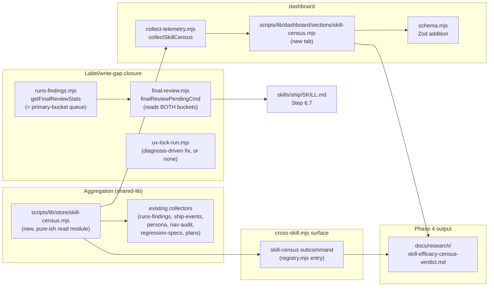

# Plan: Skill-Efficacy Census — Which of the 16 Bundled Skills Earn Their Keep

- **Date**: 2026-08-20
- **Status**: Approved — audited via `/audit-plan` (5 GPT rounds to the
  absolute cap + 3 Gemini rounds under the genuine-bug exception, all
  findings resolved); not yet implemented
- **Author**: Claude + Louis
- **Scope**: backend
- **Audit trail**: `/audit-plan` — GPT-5.6 R1 (H:4/M:4) → R2 (H:6/M:3, R1's
  fixes exposed the next layer — accepted 100%) → R3 (H:4/M:3/L:1,
  accepted 100%) → R4 (H:3/M:2, accepted 100%) → R5 (H:6/M:2, accepted
  7/8 — one MEDIUM count-cardinality finding dismissed on direct recount:
  its own text listed the same seven skill names it then labelled "eight").
  **Stopped at R5, the absolute round cap** — H-count trajectory (4→6→4→3→6)
  never satisfied the rigor-pressure stop condition on its own (findings
  stayed concrete design/logic defects across all five rounds, never
  drifting to praise-nits or v2-feature pressure), so every round through
  R4 was extended past the 3-round default under the genuine-bug exception;
  R5 hit 5 absolute regardless of character and the loop stops there per
  policy. Acceptance rate stayed ≥88% every round.

  **Gemini final gate (Step 6, `gemini-pro-latest`)**: G1 CONCERNS (3 new
  findings — 1 HIGH command-conflation bug traced and confirmed against
  actual code, `final-review-record-fix` never writes `user_action`;
  `final-review-adjudicate` does, and its printed-command helpers
  hardcode `--bucket shadow-only` unconditionally; 2 MEDIUM, both
  accepted) → G2 CONCERNS (4 new — 1 HIGH layering ambiguity, 2 MEDIUM
  confirmed against source before fixing — `schema.mjs`'s own documented
  strip-unknown-keys incident applied identically here; `registry.mjs`'s
  real flag-name convention has no `--` prefix — 1 LOW; all accepted,
  genuine-bug exception invoked for one more round) → G3 CONCERNS (3 new
  — 1 HIGH missing `KNOWN_FLAGS` entry confirmed against the actual
  array, 1 HIGH pagination-starvation interaction confirmed against the
  existing JS-side `isActionable` filter, 1 MEDIUM structural
  over-promise; all accepted and fixed). **Stopped after G3 per the
  2-round-default + one-genuine-bug-exception cap** — every round's
  findings were concrete, code-verified defects (two-thirds independently
  confirmed by direct trace before fixing, not accepted on Gemini's word
  alone), never rigor-pressure or implementation-completeness nits, so
  none triggered an early stop on character; the round count itself is
  the stop condition now. 0 `wrongly_dismissed` findings across all three
  rounds. This audit trail is the record of an unusually productive
  Gemini gate — most of the value in this plan's final design (the
  `final-review-credit.mjs` hardcoded-bucket bug in particular) came from
  Gemini catching what five rounds of GPT deliberation did not.
- **Target domain(s)**: `cross-skill-bridge`, `dashboard`, `shared-lib`, `docs`
- ⚠ **Cross-domain work** — touches 4 domains (`ruleCount=92`); the seam is
  deliberate (one census surface must read across every skill's own storage
  shape, and the dashboard tab is the reader for it).

> **Origin**: a `/brainstorm` round (session `1787245915261`, 2026-08-20) on
> verification-loop improvements (`docs/research/verification-loops-brainstorm-briefing.md`)
> concluded, from intuition, that the highest-leverage improvement to this
> bundle is not more verification — it is measuring which of the 16 skills
> earn their keep, using the telemetry pipeline this repo already owns. This
> plan replaces that intuition with a read.

---

## 1. Context Summary

**Detected scope**: backend · **stack**: js-ts + postgres (`detect-stack` →
`{"stack":"js-ts","stackKinds":["js-ts","postgres"]}`).

### The question

Sixteen skills ship in this bundle. We have an elaborate cross-skill
telemetry pipeline (9 store domains under `scripts/lib/store/`, a durable-
write registry, a dashboard) but no single surface answering: which skills
actually get invoked, how often, whether their findings get fixed, and
which of the four browser-based UX lenses have only ever run against their
own development fixtures. Four neighbouring plans are marked **Complete** —
`learning-store-signal-recovery.md` (Clusters A–D, 2026-06-03/04),
`audit-effectiveness-experiment.md`, `deterministic-outcome-capture.md`
(2026-06-29), `friction-log-and-digest-v1.md` — and this repo's own
memory records that **plan statuses here are systematically stale in both
directions**, so Phase 0 below re-derives the store's real current shape by
querying it directly, rather than trusting any of those headers.

### Phase 0 — what the store can already answer today (load-bearing)

Every claim below carries the query that produced it, run against the live
Postgres store (`AUDIT_DB_URL`, Supabase Session pooler) at commit
`ed8da0e9` on 2026-08-20. This phase's job is to **kill or shrink** anything
below it that the store already provides — several sub-tasks originally
scoped for this plan were dropped or re-scoped as a direct result.

**Table sizes** (`select relname, n_live_tup from pg_stat_user_tables …`):
`audit_findings` 8,349 · `audit_runs` 1,108 · `plans` 127 · `ship_events`
271 · `learning_decisions` 8,183 · `persona_test_sessions` 12 ·
`nav_audit_runs` 2 · `regression_specs` 110 · `regression_spec_runs` 0 ·
`friction_log` 0.

**What each of the 16 skills leaves behind, and how reliable that signal is:**

| Skill | Store signal | Reliability |
|---|---|---|
| `audit-code`, `audit-plan` | `audit_runs` (mode ∈ `code`/`plan`, 1,108 rows, 2026-07-17→08-20), `audit_findings` (8,349 rows) | Rich, per-round. **Trap**: rows are per-ROUND, not per-invocation — 479 `code`-mode rows over 168 distinct commits for this repo alone (`select r.name, a.mode, count(*), count(distinct a.commit_sha) … group by 1,2`). A raw row count overstates invocation count by ~3×. |
| `plan` | `plans` table, `skill` column: `plan` 115 rows / `manual` 12 rows, 2026-07-14→08-19 | Real, but **only since the column existed** — no signal before 07-14. |
| `ship` | `ship_events`, 271 rows, 2026-07-14→08-20, `outcome`/`block_reasons`/`overridden_by_user` | Rich. |
| `persona-test` | `persona_test_sessions`, 12 rows total (all repos), 2026-08-18 last | Real but **too thin to trend** — n=12 across the whole bundle's history. |
| `nav-audit` | `nav_audit_runs`, 2 rows, 2026-08-07 last, written **best-effort** from `scripts/nav-audit.mjs:376-382` (`execFileSync(… 'record-nav-audit-run' …)` wrapped in a bare `try { } catch { /* best-effort — never fail the audit over telemetry */ }`) | Real but so thin (n=2) that "last-run" is close to all the signal there is; a silent write failure inside that catch is **structurally invisible** — nothing distinguishes "ran once" from "ran and the telemetry call died." |
| `click-test` | **None.** `skills/click-test/SKILL.md` §"Phase 7 — Persistence (Out of Scope for v1)" states the `record-click-test` subcommand does not exist, by deliberate v1 design; confirmed absent from `cross-skill.mjs`'s live subcommand list. | Zero rows **by design**, not failure. |
| `visual-audit` | **None in Postgres, by design.** `scripts/lib/dashboard/collect-visual.mjs:1-12` reads a gitignored local `visual-contract.json` + observed envelope from disk — the skill's whole architecture is local-file-first, never cloud. | Zero DB rows **by design**. |
| `ux-lock` | **Effectively none, and the reason is a real finding.** `regression_specs` has 110 rows, but **100% of them** carry `source_kind='unit-test'` (`select source_kind, count(*) … group by 1`) — traced to `scripts/lib/cross-skill/commands/ship.mjs:389-395`, the `lock-with-test` handler behind **`/ship`**'s Step, not `/ux-lock`. `ux-lock-run.mjs:240` defaults `source-kind` to `'manual'`, and **zero** rows carry that value. `regression_spec_runs` — the table `skills/ux-lock/SKILL.md:163-167` says its "deterministic runner… writes BOTH `regression_specs` and `regression_spec_runs` rows itself" — is **100% empty** (0 of 0). This is either a dead write path or genuinely unadopted tooling; Phase 1 below resolves which. | **Zero real signal**; the 110 rows that exist belong to a different skill. |
| `explain`, `investigate`, `brainstorm`, `security-strategy`, `ai-context-management`, `cycle`, `skills` (meta) | **No dedicated table.** Only proxy: git `AI-Skill` commit trailers, written solely by `/ship` (`AGENTS.md` §Commit provenance). | Trailers measure **ship-time attribution**, not invocation frequency — they undercount by orders of magnitude for a skill used without ever producing a commit (a read-only `/explain` or `/investigate` session leaves no trailer at all), and for `audit-code` specifically the trailer count (63, since 2026-06-01) is **11×** smaller than the stored `audit_runs` row count (729) for the same window, because most audit-code invocations don't end in that exact commit. Trailers are a *ship-attribution* signal, not an *invocation* signal — the census must not conflate the two. |

**The confirmed, still-live label gap** (the brief's cited example, but the
actual scope is larger than the one sentence that named it):

```sql
select coalesce(user_action,'(null)') ua, coalesce(remediation_state,'(null)') rs, count(*) n
from audit_findings where remediation_state in ('fixed','verified') group by 1,2 order by 3 desc;
--  (null)               | fixed    | 1546
--  accepted-permanent    | fixed    | 208
--  needs_triage          | fixed    | 101
--  (null)               | verified | 69
```

**1,615 findings** (`1546+69`) are genuinely fixed with `user_action` still
`NULL`. AGENTS.md's "Shadow Final-Review A/B" section already names this
class ("the loop fixes the best catches BEFORE adjudication… credit lands
in a source comment") and records that a fix landed 2026-07-28/08-01: `/ship`
Step 6.7 now calls `final-review-record-fix`, and the comment at
`skills/ship/SKILL.md:457-458` says the command "is generic despite its
name… not shadow-only." **That fix closed less than it appears to.** Tracing
the actual call path:

- `skills/ship/SKILL.md` Step 6.7 calls `final-review-pending`
  (`scripts/lib/cross-skill/commands/final-review.mjs:204`), which sources
  from `getFinalReviewStats(repoName).shadowOnlyQueue`
  (`scripts/lib/store/runs-findings.mjs:1243`, doc-labelled "the human
  spot-check list — **shadow-only** findings").
- Nothing in `/ship`'s own flow ever *surfaces* a primary-bucket finding
  for the user to act on in the first place, because the READ side
  (`final-review-pending`) is hard-scoped to `shadowOnlyQueue` — this
  alone accounts for the 1,615-row gap; the write side (below) has its
  own, separate bug once a primary-bucket row IS surfaced.
- Corroborating evidence: `select coalesce(user_action,'(null)') ua,
  count(*) from audit_findings group by 1` shows `needs_triage` (1042),
  `accepted-permanent` (262), `dismissed` (166), `auto_dismissed` (26),
  and `(null)` (6853) — but **zero rows carry `fix-now` or `deferred`**,
  the other two members of `KNOWN_USER_ACTIONS`
  (`scripts/lib/final-review-credit.mjs:29`). Tracing every writer that
  touches `user_action` (`adjudicateFinalReviewFinding`,
  `runs-findings.mjs:975-976`) shows it only ever assigns
  `'accepted-permanent'` or `'dismissed'` — **`fix-now`/`deferred` are
  members of the enum with no traced writer today**, not values this
  nudge specifically targets. An earlier draft of this plan asserted the
  opposite (that they were "the two values this ship-time nudge is meant
  to write") without tracing the actual writer; corrected after Gemini's
  Step-6 review caught the resulting command-conflation error it fed
  into Phase 1's design (see below).

So the 2026-07-28/08-01 fix closed the loop for the **shadow-only** bucket
(small — a few hundred findings across all repos per `final-review-stats`)
and never reached the much larger **primary** GPT/Gemini-round population,
which is where essentially all of the 1,615 uncredited fixes live. This is
a **caller-side scoping bug**, not a missing writer or a missing schema
column — `user_action`'s CHECK constraint (migration `20260722120000`)
already permits every value this needs.

**Two more pre-registered traps, confirmed live in this store today, not
hypothetical:**

- **Two repo ids.** `audit_repos` carries both `id` (v4, e.g.
  `6461a693-6690-4bf3-98ee-14c0385cc357` for this repo) and `repo_uuid` (v5,
  `8548afbd-8d85-50de-baca-1bb158d696da`), **both populated on the same
  row** (`select id, name, repo_uuid from audit_repos`). A census query
  that joins on the wrong one silently returns zero, not an error — exactly
  the false-zero this repo's memory already records once. Every query this
  plan's Phase 2 writes must state which id it joins on and why (`id` is
  what every FK in `audit_runs`/`audit_findings`/`ship_events`/etc. actually
  uses).
- **The write side is not uniformly observable.** `write-spill status`
  (`scripts/cross-skill.mjs`) reports `{"spilled":0,"lost":0}` today — but
  that durability registry
  (`scripts/lib/audit-store-writers.mjs`) covers exactly 9 writers:
  `audit.findings`, `audit.runComplete`, `audit.convergenceState`,
  `audit.diffComplexity`, `learning.outcome`, `audit.passStats`,
  `audit.suppressionEvents`, `learning.banditArms`, `learning.fpPatterns`.
  **None of the five tables this census reads most
  (`ship_events`/`persona_test_sessions`/`nav_audit_runs`/
  `regression_specs`/`plans`) are registered writers.** Spot-checking one
  (`recordShipEvent`, `scripts/lib/store/ship-events.mjs:32-65`) shows it
  *does* return a distinct `{ok:false, reason:'write-failed', error}` on a
  thrown error rather than swallowing to a false success — so the writers
  themselves are not the danger. What is unverified is whether every
  SKILL.md call site actually inspects that return value, and — per
  `nav-audit.mjs:376-382` above — at least one call site (`nav-audit`'s
  own telemetry write) is wrapped in a bare `catch {}` that would make a
  broken writer indistinguishable from "ran once, successfully." **The
  census cannot report "0 invocations" for any of these five tables without
  first confirming the writer path, not just reading the row count.**

### What this shrinks

Phase 0 kills or shrinks three things the origin brief implicitly assumed:

1. **No uniform "invocations" metric across 16 skills is possible or
   honest.** Nine of sixteen skills (the ones without a dedicated table)
   can only be censused via the ship-trailer proxy, which measures a
   different thing (ship-time attribution). The census surface must say so
   explicitly per skill, not manufacture a fake zero.
2. **Building new instrumentation for the four browser lenses is out of
   scope for this plan.** `click-test` and `visual-audit` are zero-signal
   **by deliberate design** (cited above) — adding cloud persistence to
   either is a `click-test-v2-persistence`-shaped project of its own, not a
   one-line addition here, and forcing it in would be exactly the
   over-engineering this repo's right-sizing rule warns against for a
   census whose job is to *read*, not to *retrofit* every skill.
3. **The label-gap work is smaller and more precise than "restore outcome
   labels."** It is one caller-side scope bug (primary vs shadow bucket)
   plus one still-open diagnosis (`ux-lock`'s empty `regression_spec_runs`)
   — not a rebuild of the outcome-capture pipeline, which
   `deterministic-outcome-capture.md` already shipped and verified
   2026-06-29.

### Code Trace

`scripts/lib/store/runs-findings.mjs:1243` (`getFinalReviewStats`
`shadowOnlyQueue` doc) → `scripts/lib/cross-skill/commands/final-review.mjs:204`
(`finalReviewPendingCmd`, sources `shadowOnlyQueue` only) →
`skills/ship/SKILL.md` Step 6.7 (the only caller) → `scripts/lib/final-review-credit.mjs:29`
(`KNOWN_USER_ACTIONS`, `fix-now`/`deferred` never written). Persistence
gap: `scripts/ux-lock-run.mjs:240` (`sourceKind` defaults `'manual'`) vs
`scripts/lib/cross-skill/commands/ship.mjs:389-395` (`lock-with-test`
hardcodes `sourceKind: 'unit-test'`, the only value ever in the store) vs
`skills/ux-lock/SKILL.md:163-167` (claims a dual-writer that has never
produced a `regression_spec_runs` row). Existing dashboard precedent:
`scripts/lib/dashboard/sections/audit-effectiveness.mjs` (the
`audit_effectiveness`-style single-metrics-table tab this plan's new tab
mirrors) → `scripts/lib/dashboard/collect-telemetry.mjs:427-455`
(`collectAuditEffectiveness`, the collector shape to follow). Writer
registry: `scripts/lib/audit-store-writers.mjs:1-30` (the 9-writer
durability registry that does **not** cover the five tables this census
reads). *(All pinned to commit `ed8da0e9`.)*

**Neighbourhood considered**: `get-neighbourhood` against
`scripts/lib/dashboard/collect-telemetry.mjs` +
`scripts/lib/cross-skill/commands/misc.mjs` returned one
`above-floor-cluster` hit — `collectAuditEffectiveness`
(`collect-telemetry.mjs:427`, score 0.876) — plus seven `review`-banded
neighbours (`collectAuditRuns`, `collectLearning`, `collectShipHealth`,
`collectTieredShadow`, `collectAuthorTier`, `auditEffectivenessCmd`,
`aggregatePasses`), all in the `dashboard`/`cross-skill-bridge` domains.
**Decision**: extend, don't duplicate — the new collector follows
`collectAuditEffectiveness`'s exact shape (`{data, status}` with
`missing-optional`/`ok`/`unexpected-error`), and the new dashboard tab
reuses `sections/audit-effectiveness.mjs`'s single-metrics-table pattern
rather than inventing a new rendering idiom.

**Target domain(s)**: `cross-skill-bridge`, `dashboard`, `shared-lib`,
`docs` (`compute-target-domains` → `crossDomain:true, ruleCount:92`,
`untaggedPaths: []`).

---

## 2. Proposed Architecture



### Components

- **`scripts/lib/store/skill-census.mjs`** (new). One exported function per
  skill-family, each returning `{skill, signalSource, signalQuality,
  effectiveSince, window: {current, prior}, allTimeCount, trend,
  conversionRate?, lastRunAt, caveat}` — never a bare count.
  `allTimeCount` (round-5 H2 fix) is the field Phase 4's
  `insufficient-data`/`prune` floor checks read — a count across the
  skill's **entire** stored history, not just the current/prior windows,
  a genuinely different number an earlier draft's contract never exposed
  anywhere. For `audit-code`/`audit-plan` specifically, every count in
  this shape (window, all-time, and trend alike) uses **`commitsTouched`,
  never `roundCount`** — the rubric's floor and trend checks need a number
  that approximates invocations, and `roundCount` explicitly does not
  (per the contract table below). `signalQuality` and `effectiveSince`
  are the evidence-quality enum + temporal-provenance fields defined
  below; naming kept consistent with that definition rather
  than the looser "reliability" label an earlier draft used here). For the nine skills with no Postgres table at all (round-3
  L1 fix — precisely: the seven read-only/meta skills PLUS `click-test`
  and `visual-audit`, distinct from the "seven trailer-proxy" figure used
  elsewhere below, which counts only the read-only/meta seven) it returns
  the ship-trailer proxy count with `signalQuality:
  'ship-attribution-only'` explicitly, never a fabricated `0` — this
  includes `click-test` and
  `visual-audit`, which have no DB row but DO appear in `AI-Skill`
  trailers when they ship a fix (confirmed: 4 such commits exist in this
  repo's history), so "no-table-by-design" describes their DB signal only,
  never total silence. **Adds new, purpose-built window-count functions to
  each relevant `scripts/lib/store/*.mjs` module, alongside their existing
  readers — it does not repurpose them** (round-3 H2 fix:
  `readShipEvents`'s actual, documented contract returns a bounded
  recent-events list + an outcome-count breakdown, not an arbitrary
  current/prior timestamp-window aggregate — reusing it *as-is* for the
  census's window semantics would silently misreport). Concretely:
  `ship-events.mjs` gains `getShipEventWindowCounts(repoId, {currentStart,
  priorStart, now})` returning `{current, prior}` row counts; the
  nav-audit store module gains an equivalent `getNavAuditWindowCounts`;
  and so on per skill — each new function lives in the SAME module as its
  skill's existing reader (never in `skill-census.mjs` itself, which stays
  an orchestrator calling these new module-local functions plus the
  existing readers where their shape already fits, e.g. `getLearningStats`).
  **Never** `scripts/lib/dashboard/collect-telemetry.mjs`'s collectors, in
  either form. That direction matters: `collect-telemetry.mjs` is
  presentation-layer
  aggregation that already depends on `store/`; a store module importing
  *from* the dashboard layer would invert the dependency this repo's own
  layering rules gate on (`tests/arm-vocabulary-layering.test.mjs`,
  AGENTS.md "RETAGGING A MODULE CHANGES EVERY EDGE"). The dashboard's own
  `collectSkillCensus` (Phase 3) then *wraps* `skill-census.mjs`'s output,
  mirroring `collectAuditEffectiveness`'s existing store→dashboard
  direction — this module is an **aggregator over what already exists**,
  per the arch-memory neighbourhood decision above (#1, #4 — DRY, Single
  Source of Truth), sitting at the same layer as its inputs, not above them.

  **Per-skill contract** (closes the "what exactly does each row mean"
  gap) — each skill-family function in this module returns values derived
  from a table below, not an ad-hoc query invented per skill:

  | Skill(s) | Source table | Repo-key col | Timestamp col | Count unit | Dedup key | Value kind |
  |---|---|---|---|---|---|---|
  | `audit-code`, `audit-plan` | `audit_runs` | `repo_id` (= `audit_repos.id`, v4) | `created_at` | **two numbers, both reported, never collapsed to one**: `roundCount` (raw row count in window, labelled *"rounds — includes re-runs; not a 1:1 invocation count"*) and `commitsTouched` (distinct `commit_sha` in window, labelled *"commits touched — a LOWER BOUND on invocation count: one commit can receive multiple separate sessions, and a session can re-run without a new commit"*) | n/a (two independent counts) | observed-record, **no single "invocations" figure exists for this skill** — H2 fix: a commit is neither necessary nor sufficient for one invocation, so the plan does not manufacture a false-precision collapse |
  | `plan` | `plans` | `repo_id` | `created_at` | row count where `skill='plan'` | `id` | observed-record |
  | `ship` | `ship_events` | `repo_id` | `created_at` | row count | `id` | observed-record |
  | `persona-test` | `persona_test_sessions` | `repo_id` | `created_at` | row count, **repo-scoped like every other row** (H6 fix — no bundle-wide carve-out; thinness at low n is reported as a reliability caveat on the row, e.g. *"n=1, too thin to trend"*, never as a reason to widen the query's scope) | `id` | observed-record |
  | `nav-audit` | `nav_audit_runs` | `repo_id` | `created_at` | row count | `id` | observed-record, **quality-flagged** (see evidence-quality enum below) |
  | `click-test`, `visual-audit` | *(none — no DB table)*; falls back to the trailer proxy row below (they can still ship an `AI-Skill`-tagged commit) | — | — | — | — | `no-table-by-design` for the DB dimension; `ship-attribution-only` via the trailer fallback |
  | `ux-lock` | `regression_specs` filtered `source_kind != 'unit-test'` | `repo_id` | `created_at` | row count of **specs authored, NOT invocations** (round-4 M1 fix — one `/ux-lock` invocation can author several specs, so a nonzero count overstates invocation count; conversely a `--verify`-mode invocation authors no spec at all — `plan_verification_runs` is *also* 0 rows per §1, so verify-mode usage is entirely invisible to every signal this census has) | `id` | observed-record, **currently 0** pending Phase 1's diagnosis; the memo must state this row measures "specs authored" and name the verify-mode blind spot rather than implying it measures ux-lock usage generally |
  | `explain`, `investigate`, `brainstorm`, `security-strategy`, `ai-context-management`, `cycle`, `skills` | git `AI-Skill` trailer count, **CWD checkout only** (see repo-identity note below) | *(git, not DB)* | committer date `%cI` (M2 fix — author date `%aI` is editable/backdatable and weaker evidence of ship time than committer date) | count of commits in window with a non-blank `AI-Skill` trailer, via `git log --format='%H%x09%cI%x09%(trailers:key=AI-Skill,valueonly:separator=%x1f)'` — one tab-separated record per commit (sha, committer date, trailer value(s)); the bare trailers-only form used in this plan's own Phase 0 investigation carries no commit boundary/sha/date and cannot support dedup or ordering, so this is the corrected, complete form (round-3 M1 fix). **The trailer VALUE is the grouping key** (round-5 H1 fix — not a name requiring a separate lookup: `AI-Skill: audit-code` groups directly into the `audit-code` row, confirmed empirically in Phase 0's own trailer census) | commit sha (now present in the output, closing the round-3 M1 gap); a commit with **more than one** `AI-Skill` trailer (unobserved in this repo's history — `/ship` writes exactly one per commit today) splits the trailer field on the `\x1f` separator and **counts toward every distinct skill named** — round-5 H1 fix, replacing round-3's first-value-wins, which would have silently undercounted a genuine (if so-far-unobserved) dual attribution | `ship-attribution-only` — explicitly NOT an invocation count |

  **Window semantics**: `current` = `[now - windowDays, now)`; `prior` =
  `[now - 2*windowDays, now - windowDays)`; both computed from the same
  `now` snapshot per report run (never re-evaluated per row) so the two
  windows are always contiguous and non-overlapping. `trend` = `current -
  prior` as a raw delta AND `(current - prior) / max(prior, 1)` as a
  percentage, both rendered — never just one, since a delta with no base
  rate hides direction on a near-zero prior.

  **Conversion-rate definition** (closes H5 — the plan's central metric had
  no cohort/timestamp/denominator rules): applies only to `audit-code` and
  `audit-plan` (the two skills with an `audit_findings` finding lifecycle).
  Source: `audit_findings`, joined to `audit_runs` on `run_id` to select
  the skill by `audit_runs.mode`. **Cohort = raise-time, not fix-time**: a
  finding belongs to window `W` if its own `created_at` falls in `W`,
  regardless of when (or whether) it is later remediated — this is the one
  rule that resolves H5's "which window gets the credit" ambiguity, and it
  means a finding raised late in a window may still show `pending` at
  report time even though it is later fixed; that is expected, not a bug.
  **Numerator/denominator, evaluated at report time** (current DB state,
  not a point-in-time snapshot): `denominator` = count of DISTINCT
  `finding_fingerprint` in the cohort where `adjudication_outcome =
  'accepted'`; `numerator` = count of DISTINCT `finding_fingerprint`
  **within that same accepted set** where `remediation_state IN
  ('fixed','verified')` — the numerator is a strict subset of the
  denominator's WHERE clause, not an independently-filtered query (round-3
  H1 fix: an earlier draft let the numerator include fixed-but-never
  -`accepted` findings, which could push the reported rate above 100% and
  mislabel it as "conversion of accepted findings" when it wasn't). §1's
  1,615-row label gap is exactly the population this guards against — most
  of those rows have `adjudication_outcome IS NULL`, so they correctly
  fall outside both numerator and denominator until Phase 1's fix gives
  them a real outcome. **Denominator-zero renders as `—`** (an em-dash,
  never `0` or `NaN`) with the caveat *"no accepted findings in this
  window"* — a bare `0%`/`NaN%` would misread as "nothing gets fixed"
  rather than "nothing was accepted to begin with." **Right-censoring
  caveat (Gemini Step-6 finding)**: because the cohort is fixed at
  raise-time but the fix/verified check runs at report-time, the
  `current` window's rate is systematically depressed relative to
  `prior`'s purely by having had less time to accumulate remediations —
  this is not evidence of decline. The report always renders this caveat
  alongside the metric, and (per §4 below) the memo's decision rubric
  never gates a verdict on it.

  **Evidence-quality enum** (closes the false-zero gap — H4, corrected
  after R1's first pass conflated two different vantage points): the
  census reads tables **cold**, after the fact — it never observes a
  write in flight. So the enum names what the *invocation-time caller*
  could have known, not what the census itself can retroactively prove
  (no value in this set lets a cold read distinguish "zero invocations"
  from "N invocations, all silently lost" with certainty — the enum
  bounds the *probability*, honestly, rather than claiming proof):
  - `caller-checked` — the writer returns a distinct failure shape **and**
    the invoking call site actually inspects it, so a live failure would
    have surfaced to the user/log at invocation time. **Not asserted for
    `persona-test`/`plans` on the strength of §1's spot-check alone**
    (round-4 H2 fix: only `recordShipEvent` was actually traced end-to-end;
    §1 explicitly left the other four call sites unverified). Phase 1 adds
    the concrete step of tracing each remaining writer's call site the
    same way before classifying it; any not confirmed by the time Phase 2
    ships defaults conservatively to `unchecked-call-site` rather than an
    assumed pass. Every `signalQuality` value additionally carries an
    `effectiveSince` (nullable) field: when a promotion happens mid-history
    (`nav-audit`'s catch-narrowing is the one case this plan makes today),
    the census does **not** attempt to split the `{current, prior}` scalar
    counts into pre/post-promotion sub-totals (Gemini Step-6-round-3
    finding — corrected from an earlier draft's promise to do exactly
    that, which the return shape has no fields to represent without
    real added complexity, e.g. a per-day breakdown, that no current
    requirement calls for). Instead: whenever `effectiveSince` falls
    inside the report's `current` window, the row's `caveat` states this
    explicitly in prose (*"signalQuality promotion happened mid-window;
    this count mixes pre- and post-promotion evidence"*) — an honest
    prose caveat on the existing scalar, not a structural promise this
    plan's own data shape can't keep.
  - `unchecked-call-site` — the writer can report failure but the call
    site discards it. `nav-audit` is this today: `execFileSync` (which
    throws on a non-zero exit) is wrapped in a bare `catch {}`
    (`scripts/nav-audit.mjs:376-382`) that swallows the throw. Phase 1
    narrows that catch to at least log the failure — this moves
    `nav-audit` to `caller-checked` **going forward only**; rows recorded
    before the fix lands keep the old, irreducible ambiguity, and the
    census/memo must say so rather than silently reclassifying history.
  - `no-table-by-design` — `click-test`, `visual-audit` (cited design
    reasons in §1).

  **The remaining four DB-backed skills, classified explicitly** (round-5
  M2 fix — an earlier draft left `audit-code`/`audit-plan`, `ux-lock`, and
  `plans` unclassified beyond "and so on"): `audit-code`/`audit-plan`'s
  writer (`recordFindings`/`recordRunComplete`) is one of the **nine
  durable-write-registered writers** (`audit.findings`/`audit.runComplete`,
  `scripts/lib/audit-store-writers.mjs`) — the *strongest* tier available,
  stronger than `caller-checked` itself: a failure here doesn't just
  return an inspectable value, it surfaces in `write-spill status`'s
  `spilled`/`lost` counters, which is a stronger, independently-checkable
  claim than "the call site inspects the return." This plan does not
  introduce a fifth enum value for it — it documents the distinction in
  prose and treats it as `caller-checked` with a noted upgrade, rather
  than adding a rarely-used fifth state for one skill pair. `ux-lock`'s
  writer (`record-regression-spec`) and `plans`' writer (`upsert-plan`)
  are **not** durable-write-registered but Phase 1's trace (registry.mjs)
  confirmed both are `caller-checked` anyway: `record-regression-spec` and
  `upsert-plan` both had `softFail` retired and now throw on a
  refused/failed write — the strongest form of caller-checking, not merely
  an inspectable return value. `record-persona-session` (persona-test's
  writer) traced the same way: `reportsFailure: {all: true}` exits 1 on
  failure. **Every DB-backed writer this plan reads from turned out to be
  `caller-checked`** on direct trace — none default to
  `unchecked-call-site` on assumption; `nav-audit`'s historical rows
  (before this cluster's catch-narrowing fix) are the one place the
  ambiguity survives, and only for rows recorded before the fix.
  - `ship-attribution-only` — the seven read-only/meta skills whose ONLY
    signal is the git trailer proxy (git, not a write path with a return
    value at all). `click-test`/`visual-audit` keep `no-table-by-design`
    as their primary `signalQuality` (that is their designed DB posture)
    but their census row additionally surfaces a supplementary trailer
    count for context, without changing which enum value they report.
  A zero-row skill with `unchecked-call-site` renders its caveat as *"zero
  rows AND the call site doesn't check the write's result — this may mean
  zero invocations or a silent write failure, not established which"*; a
  zero-row skill with `caller-checked` renders *"zero rows; the writer's
  result is checked at invocation time, so a live failure would have been
  visible — read as genuinely zero for this window."* These are different
  claims and the report must never collapse them into the same sentence,
  nor imply the second one is retroactively *proven* rather than merely
  *likely*.

  **Repo-identity resolution** (closes H2): the DB-backed rows above join
  on `audit_repos.id` (v4), resolved the same way
  `collect-telemetry.mjs`'s `canonicalRepoId` already does — via
  `resolveRepoIdentity(root).repoUuid` → `getRepoIdByUuid()` — **not** a
  bare `--repo <display-name>` string match, which cannot disambiguate
  `id` vs `repo_uuid` and cannot resolve at all for the seven
  trailer-proxy-only skills. The CLI (`cross-skill.mjs skill-census`) therefore resolves the
  DB-backed rows from the **local checkout's own identity** (`root =
  process.cwd()`, same as every other cross-skill command), with an
  optional `--repo <name>` used only to disambiguate when local-identity
  resolution is itself ambiguous (mirrors `final-review-pending`'s
  existing `--repo` contract) — never to query an arbitrary *other*
  repository's data from this checkout. The trailer-proxy rows are
  **always** scoped to the CWD's own git log; the report states this
  plainly in a header line (*"proxy signal reflects THIS checkout's commit
  history"*) rather than implying it is cross-repo.
- **`cross-skill.mjs skill-census`** (new registry entry, `kind: 'read'`,
  **`cloud: 'degrade-noop'`** — corrected from an earlier draft's
  `'require'`, which is self-contradictory with the per-source
  `missing-optional` contract below: a `require`-scoped command is
  rejected by the registry *before* the handler ever runs, so it could
  never produce the partial report the plan promises. `degrade-noop` also
  matches reality — the seven trailer-proxy skills read `git log` directly
  and are fully available even with Postgres down, so the command must be
  allowed to run and simply mark the seven DB-backed skills
  `missing-optional` in that case, not refuse outright). `--repo <name>`
  (optional disambiguator, see above) `[--window-days 14] [--format
  json|worksheet]`. Flag validation: `--window-days` must be a positive
  integer (`ArgvError` otherwise, matching `build-dashboard.mjs`'s
  `--port` validation pattern), clamped to `[1, 90]`; `--format` is a
  closed enum (`json`/`worksheet`, `ArgvError` on anything else — never
  silently defaulting past a typo). Response contract per source: `ok`
  (data present) / `missing-optional` (cloud off, or this specific source
  table unreachable while others succeeded — renders inline per-row, does
  not fail the whole report) / `unexpected-error` (the source's own store
  call threw). A report where every DB-backed source is `missing-optional`
  still exits 0 — the trailer-proxy rows still populate, and the report
  states plainly that the seven DB-backed rows are unavailable this run;
  one source's `unexpected-error` does not hide the other 15 skills' rows.
  Emits the per-skill table; `--format worksheet` renders the
  PowerShell-safe real-value table this repo's operator-doc convention
  requires (never `<placeholder>` syntax).
- **Dashboard tab** (`scripts/lib/dashboard/sections/skill-census.mjs` + a
  `collectSkillCensus` entry in `collect-telemetry.mjs` + a `schema.mjs`
  addition). Read-only,
  server-rendered, mirrors `audit-effectiveness.mjs`'s table shape. No new
  client-side interaction beyond the existing `data-search` filter pattern
  already in `sections/skills.mjs`, reused as-is.
- **Label-gap closure — corrected design (Gemini Step-6 finding)**: an
  earlier draft of this bullet named the wrong command as the fix.
  Tracing the ACTUAL render path (`finalReviewPendingCmd` →
  `renderFinalReviewCard`, `final-review-credit.mjs:189-281`) shows the
  card already picks the correct command **per row's classification** —
  `classifyFinalReviewOutcome` routes an `unadjudicated` or
  `fixed-unlabelled` row (exactly what the 1,615-row backlog is) to
  **`final-review-adjudicate --action accepted/dismissed`**, and only an
  `accepted-unfixed`/`regressed` row to `final-review-record-fix`. So the
  rendering LOGIC does not need to change. **The real, concrete bug is
  two helper functions that hardcode the bucket**:
  `adjudicateCmd`/`recordFixCmd` (`final-review-credit.mjs:164-170`)
  unconditionally emit `--bucket shadow-only` for every row, regardless
  of which bucket the row actually belongs to — the exact "hardcoded
  bucket filter" class `runs-findings.mjs`'s own docstring (~line 961)
  already names as a past incident for a sibling function. A primary-bucket
  row rendered today would print a command that resolves to the WRONG
  bucket (or no match at all), so even after widening the read side below,
  the card would still fail to close the gap without this fix.

  **Phase 1's actual work, precisely**:
  1. `getFinalReviewStats` gains a second queue (primary-bucket,
     `remediation_state IN ('fixed','verified') AND user_action IS NULL
     AND bucket IS NULL`), selecting `bucket` as an explicit column (the
     existing shadow-only queue doesn't need to, since it's constant
     there) so downstream code has each row's real bucket to work with.
  2. `adjudicateCmd`/`recordFixCmd` take the row's own `bucket` field
     instead of the hardcoded string literal: `--bucket ${it.bucket ??
     'primary'}` (matching `bucketOpt`'s existing `'primary'`/`null`
     convention, `final-review.mjs:20-28`).
  3. **The `UNION ALL` lives inside `getFinalReviewStats`, in
     `scripts/lib/store/runs-findings.mjs` — never inside
     `finalReviewPendingCmd`** (Gemini Step-6-round-2 finding: an earlier
     draft's wording was ambiguous enough to read as the CLI command
     layer constructing SQL, which would violate this repo's `ctx.deps`
     boundary — command handlers in `cross-skill/commands/` never touch
     the database directly. `getFinalReviewStats` already has direct
     query access via `query()`/`many()`, the same way its sibling
     `adjudicateFinalReviewFinding` does, `runs-findings.mjs:975-1000` —
     so the merge belongs there, and `finalReviewPendingCmd` receives one
     already-merged, already-ordered, already-limited array back, exactly
     as it does today for `shadowOnlyQueue`). **Bounded by ONE query, not
     merged in application code** (a fetch-each-then-merge-in-JS approach
     cannot produce a correctly-ranked bounded page — the true top-N by
     severity can sit entirely inside one source and get truncated away
     before the merge ever sees it): the two source queries combine via
     `UNION ALL` inside that one SQL statement, with an
     explicit severity-rank `ORDER BY` (`CASE severity WHEN 'HIGH' THEN 3
     WHEN 'MEDIUM' THEN 2 WHEN 'LOW' THEN 1 ELSE 0 END) DESC, created_at
     DESC` — not a bare text-column `DESC`, since `'HIGH' < 'LOW' <
     'MEDIUM'` lexically. **The SQL `LIMIT` is the existing `queueLimit`
     candidate-pool size (today 50), NOT `pageSize` directly** (Gemini
     Step-6-round-3 finding — corrected from an earlier draft that would
     have applied `LIMIT pageSize` in SQL: the shadow-bucket branch is NOT
     pre-filtered for actionability at the SQL level today — the existing
     code fetches up to `queueLimit` shadow candidates, then filters with
     `isActionable()` and slices to `pageSize` **in JavaScript**,
     `final-review.mjs:230-236`. Applying a hard `pageSize`-sized SQL
     `LIMIT` to a UNION containing that same unfiltered branch could let
     already-resolved shadow rows consume the whole limited window,
     starving out real actionable primary-bucket rows — a bug, not a
     tightening). The fix preserves the existing, already-accepted
     "fetch a bounded oversized candidate pool, filter, then slice"
     pattern unchanged: the UNION query's `LIMIT` stays at `queueLimit`
     (both branches now feeding into it), and the unchanged
     `isActionable()` filter + `.slice(0, pageSize)` runs in JS exactly as
     it does today — this plan does not attempt to guarantee a
     mathematically perfect global top-N (the existing code doesn't
     either), only that BOTH buckets are represented in the same
     candidate pool before that filter runs.
     **`UNION ALL`, not bare `UNION`, is safe here only because the two
     source WHERE clauses partition mutually-exclusively on `bucket`**
     (one selects `bucket = 'shadow-only'`, the other `bucket IS NULL`) —
     a row cannot match both, so no duplicate can occur BY CONSTRUCTION
     today. This is a correction of an earlier draft, which incorrectly
     credited `audit_findings`' `(run_id, finding_fingerprint)` unique
     index with preventing duplication — a table-level constraint does
     not deduplicate a query's result set; `UNION ALL` returns every row
     from every branch regardless of what constraint exists on the
     underlying table. If a future change ever makes the two WHERE
     clauses overlap, this bounded-work reasoning breaks and a real
     `DISTINCT`/dedup step must be added at that time — flagged here so
     it isn't rediscovered the hard way.
  4. `/ship` Step 6.7's prose reflects the wider scope; no change to the
     printed template beyond items 1-2 above, since the classification
     and rendering logic already handles both commands correctly once the
     bucket is threaded through.
- **`ux-lock` diagnosis**: a Phase-1 investigation step (not a
  pre-committed fix) — grep this repo's own git history for calls to
  `ux-lock-run.mjs spec`, check `.audit/` and CI logs for evidence the
  runner ever executed, and read `scripts/ux-lock-run.mjs` around its write
  call for a swallowed error. Two possible outcomes, both valid plan
  outputs: **(a)** a real write bug → fix `ux-lock-run.mjs`; **(b)**
  genuinely unadopted (the Playwright generation flow is rarely invoked
  directly, most fixes get locked via `/ship`'s simpler `lock-with-test`
  path instead) → correct `skills/ux-lock/SKILL.md`'s claim rather than
  leave a false "deterministic dual-writer" statement standing.

### Key design decisions

- **No new events table, no migration for telemetry itself** (#3 Single
  Source of Truth, #20 Long-Term Flexibility). The seven skills with real
  signal already have it; retrofitting cloud persistence onto `click-test`/
  `visual-audit` to make the census "uniform" would invert their
  deliberate local-first designs for a metric this plan doesn't need at
  that resolution. The census's job is to *read what exists honestly*, not
  to *manufacture* what doesn't.
- **The label-gap fix is a caller-side scope widening, not a new writer**
  (#9 No Hardcoding). `user_action`'s CHECK constraint already permits
  every value needed; the bug is that only one read path
  (`shadowOnlyQueue`) ever reaches the nudge.
- **Rates and trends, never raw totals** (#11 Testability via clear
  contracts, directly answering this plan's own pre-registered trap).
  Every per-skill row in the census carries a window-over-window trend
  (default 14d vs prior 14d) and, where meaningful, a conversion *rate*
  (`distinct fixed/verified fingerprints ÷ distinct accepted fingerprints`)
  — never a cumulative-since-inception count that conflates a skill's
  whole history with its current trajectory.

---

## 3. Sustainability Notes

**Right-sizing gate** (new structure: a CLI subcommand, a dashboard tab, a
query-scope widening — Gate-1 trigger class):

- **Band-aid extreme**: run ad-hoc SQL by hand whenever curiosity strikes
  (which is, in effect, what produced the origin brainstorm's intuition-only
  verdict) — not repeatable, not reviewable, decays the moment the schema
  moves.
- **Over-engineered extreme**: a unified `skill_invocations` event-sourcing
  table, a migration retrofitting mandatory instrumentation onto all 16
  skills (including the deliberately read-only ones), a real-time streaming
  dashboard with per-invocation cost attribution.
- **Chosen, and the current requirement it serves**: a read-only
  aggregation layer over the tables that already exist, surfaced through
  the two channels (CLI + dashboard) this repo already uses for every
  other cross-skill metric (`audit-effectiveness` is the direct precedent).
  The current requirement is exactly the origin brief's question — "which
  skills earn their keep" — answerable from what is already stored, once
  read honestly. No current requirement calls for real-time streaming, a
  new schema, or forced instrumentation of read-only skills.

**Assumptions that could change**: the per-skill signal-source table in §1
is a snapshot of which tables exist today; if a future plan adds
`click-test` v2 persistence or a `regression_spec_runs` fix, the census
module's `signalSource`/`signalQuality` fields for those skills should be
updated in the same commit that adds the table — the aggregator already
takes a signal-source per skill as data, not as hardcoded logic, so this is
a data update, not a redesign (#18 Backward Compat via the extension
point).

**Extension point deliberately built in**: `skill-census.mjs` keys its
per-skill entries by skill name in a lookup structure (not a long
if/else chain) specifically so that adding a table for a currently-silent
skill is a new entry, never a rewrite (§5 Architecture flexibility
checklist — strategy-pattern-over-switch).

---

## 4. File-Level Plan

### Phase 1 — Close the confirmed label/write gaps

- **Call-site verification (round-4 H2) — DONE, no file changes needed.**
  Traced all three remaining writers against their registry entries in
  `scripts/lib/cross-skill/registry.mjs`: `record-persona-session`
  declares `reportsFailure: {all: true}` (a write failure exits 1, per
  this repo's own retirement of the legacy `softFail` exit-0 quirk);
  `upsert-plan` **throws** on every `!res.ok` (softFail fully removed);
  `record-regression-spec` (ux-lock's writer) also has `softFail` retired
  and throws on a refused/failed write. **All three are `caller-checked`**
  — stronger evidence than assumed, not weaker. This means, of the seven
  DB-backed skills, only `nav-audit`'s historical rows (before this
  cluster's catch-narrowing fix) carry irreducible ambiguity; every other
  writer's failure mode was already visible at invocation time. Phase 2's
  contract table (§2) reflects this directly rather than defaulting
  anything to `unchecked-call-site` on assumption.
- **`scripts/lib/store/runs-findings.mjs`** (modify) — add a
  primary-bucket pending-credit query alongside the existing
  `shadowOnlyQueue` inside `getFinalReviewStats` (or a sibling exported
  function, whichever keeps the existing shadow-only contract byte-stable
  for `final-review-stats`'s consumers). Why: this is the one file that
  currently hardcodes the shadow-only scope (line 1243 docstring).
- **`scripts/lib/cross-skill/commands/final-review.mjs`** (modify) —
  `finalReviewPendingCmd` reads both queues; keep the existing
  `shadowOnlyQueue`-only `final-review-stats` command untouched (it has a
  deliberately different, human-spot-check purpose per its own docstring).
- **`scripts/lib/final-review-credit.mjs`** (modify — this is the file
  with the concrete bug, per the Gemini Step-6 trace in §2 above):
  `adjudicateCmd`/`recordFixCmd` (lines 164-170) hardcode `--bucket
  shadow-only` unconditionally; change both to use the row's own `bucket`
  field. `classifyFinalReviewOutcome` itself classifies on
  `user_action`/`remediation_state`, not bucket, so it should already
  generalise to primary-bucket rows unchanged — verify this during
  implementation rather than assuming it.
- **`scripts/nav-audit.mjs`** (modify) — narrow the bare `catch {}` around
  the `record-nav-audit-run` `execFileSync` call (lines 376-382 today) so a
  write failure is at minimum logged to stderr (matching the "best-effort,
  never fail the audit" posture — this is not a promotion to a hard
  failure, just removing the silent swallow that makes a broken writer
  indistinguishable from a real zero-row result). Moves `nav-audit`'s
  `signalQuality` from `unchecked-call-site` to `caller-checked` **for
  rows recorded after this fix lands only** — historical rows keep the
  old ambiguity, per §2's evidence-quality enum.
- **`skills/ship/SKILL.md`** (modify) — Step 6.7 prose + the printed card
  wording, to state plainly that the nudge now covers both buckets (and
  why it didn't before, so a future reader doesn't reintroduce the
  scoping bug believing it's already general).
- **`scripts/ux-lock-run.mjs`** (modify — *conditional on Phase 1's own
  diagnosis*; only touched if the diagnosis finds a real swallowed-error
  write bug, not if the finding is "genuinely unadopted").
- **`skills/ux-lock/SKILL.md`**, **`skills/ux-lock/references/lock-mode-spec-generation.md`**
  (modify — *conditional*; only touched if the diagnosis instead finds the
  dual-writer claim is currently false and should be corrected rather than
  fixed in code).
- **Test**: extend `tests/final-review-persistence-isolation.test.mjs` (or
  a sibling) to cover the primary-bucket queue with a canned fixture row
  that has `bucket IS NULL` — the negative control that would have caught
  the original scoping bug (assert the OLD query would have excluded it,
  the NEW one includes it). **Implemented in `tests/final-review-card.test.mjs`**
  — the sibling that already covers `adjudicateCmd`/`recordFixCmd`'s output,
  which is exactly where the hardcoded-bucket bug lived; two new cases assert
  a `bucket: null` item prints `--bucket primary` (never the old hardcoded
  `shadow-only`) for both the adjudicate and record-fix command shapes.
- **Manual verification (round-3 M2 fix)**: Phase 1 changes LIVE query
  semantics (`bucket IS NULL` selection, the two-bucket merge, the
  explicit severity-rank ordering, the `(run_id, finding_fingerprint)`
  dedup, the pageSize clamp) that canned fixtures alone cannot prove
  against the real deployed schema — a fixture validates the mocked
  return shape, not that the actual SQL is well-formed and repo-scoped
  correctly. Before merging Cluster A, run the new query against the live
  store once and paste its actual output into the PR/commit description
  (same pattern already used for Phase 2's CLI and Phase 4's memo below).
  This is a one-time manual check, not a new automated DB-gated suite —
  consistent with, not a reversal of, the "no new live-DB integration
  suite" decision in Testing Strategy below.

### Phase 2 — Deterministic census CLI (no LLM)

- **`scripts/lib/store/skill-census.mjs`** (create) — the aggregator
  described in §2. Pure given its inputs (the existing reader functions it
  calls); a Tier-1-testable module per this repo's testing doctrine.
- **`scripts/lib/cross-skill/commands/census.mjs`** (create, or add to
  `commands/misc.mjs` if a new file is unwarranted by volume — decide by
  reading `misc.mjs`'s current size at implementation time) — the
  `skillCensusCmd` handler.
- **`scripts/lib/cross-skill/registry.mjs`** (modify) — register
  `skill-census`: `flags: ['repo', 'window-days', 'format']` (no `--`
  prefix — Gemini Step-6-round-2 finding, confirmed against every
  existing entry in this file, e.g. `persona-outcomes`'s `flags:
  ['repo', 'repo-id', 'out', …]`; an earlier draft here included the
  prefix, which no other registration in the file does),
  `payload: 'flags'`, **`scope: 'ambient-ok'`** (round-3 H3 fix — corrected
  from an earlier draft's `explicit-required`, which contradicts the
  command's own primary usage: it resolves the DB-backed rows from the
  CWD checkout's ambient identity by default, with `--repo` as an
  *optional* disambiguator, not a required one; `explicit-required` would
  refuse to run without it), `kind: 'read'`, `cloud: 'degrade-noop'` (see
  §2's earlier H1 correction — the trailer-proxy rows must populate even
  with Postgres unreachable). **Exit-code / `ok` contract, corrected again
  (Gemini Step-6-round-2 finding)**: the round-5 wording made `ok:false`
  (non-zero exit) fire for a legitimately empty-but-valid result — a
  quiet/new repository with genuinely little activity — which violates
  standard CLI convention (a valid, expected empty state is not a
  failure) and would make this command a bad citizen in any future
  automation that checks its exit code. **Corrected rule**: `ok` is
  `true` for ANY completed run, however empty — including the case where
  every DB-backed source is `missing-optional` and the trailer-proxy
  layer finds zero attributed commits; an empty report is still a
  *successful* report about a quiet history. `ok:false` (→ non-zero exit,
  per this repo's `emit({ok:false})` convention) is reserved **strictly
  for environment/execution failures** — the local directory is not a git
  checkout at all, or `git log` itself throws — never for the data
  legitimately coming back empty. The distinction between "quiet
  history" and "nothing usable" lives in the report's caveats and
  `signalQuality` fields, not in the exit code.
- **`scripts/cross-skill.mjs`** (modify) — add `--window-days` to the
  global `KNOWN_FLAGS` array (line 161) (Gemini Step-6-round-3 finding,
  confirmed against the actual array: `--repo`/`--format`/`--out` etc.
  are already present, but no window/date-range flag is — `--repo` and
  `--format` need no new entry since existing subcommands already use
  them). Without this, `assertKnownFlags` (`cross-skill.mjs:1042`)
  rejects `--window-days` before the handler ever runs, and the new
  command deterministically crashes on the one flag that makes it useful.
- **`tests/fixtures/cross-skill-inventory.json`** (modify) — add
  `skill-census` to the conservation-law inventory (registry.mjs's own
  docstring: `registryNames ∪ legacyNames = INVENTORY`, enforced by
  `tests/cross-skill-registry-ratchet.test.mjs`).
- **Test**: `tests/skill-census.test.mjs` (create) — Tier 1, canned
  fixture rows per table shape (including a fixture that reproduces the
  "table exists, zero rows, writer path unverified" ambiguity from §1, to
  assert the module reports the caveat rather than a bare zero).
- **Manual verification, extended from Phase 1 (round-4 M2 fix)**: Phase
  1's manual-verification step (above) only covers the final-review
  query — it does not touch Phase 2's own new window-count readers
  (`getShipEventWindowCounts` and its siblings). Before merging Cluster B,
  run each new reader against the live store once and paste actual output
  — repo-id joins, timestamp-window boundaries, nullable `source_kind`
  filtering, and status translation are exactly the things a mocked Tier-1
  fixture cannot catch against the real deployed schema, and deferring
  this check to Phase 4 (as an earlier draft did) would mean Cluster B
  ships unverified for however long Phase 4's start condition takes to
  trigger.

### Phase 3 — Dashboard tab

- **`scripts/lib/dashboard/collect-telemetry.mjs`** (modify) — add
  `collectSkillCensus(root)` following `collectAuditEffectiveness`'s
  `{data, status}` shape (lines ~427-455 today).
- **`scripts/lib/dashboard/sections/skill-census.mjs`** (create) — the tab
  renderer, mirroring `sections/audit-effectiveness.mjs`'s single-table
  pattern; one row per skill, columns: signal source, `signalQuality`,
  current window, trend, conversion rate (where applicable), last-run.
  **Four data states named explicitly** (closes round-2 M3): (1) the
  collector itself returns `unexpected-error` → `ui.warningPanel`, same as
  every other section's `ui.NON_OK.has(src.status)` branch; (2) **all
  seven DB-backed skills read `missing-optional` while the seven
  trailer-proxy-only skills (plus click-test/visual-audit's trailer
  fallback) still have data** → the section still renders the
  full 16-row table, each DB-backed row showing its own `missing-optional`
  caveat inline — this is NOT the same as case (1) and must not share its
  panel; (3) a skill legitimately has no conversion-rate metric
  (everything except `audit-code`/`audit-plan`) → that cell renders `n/a`,
  never a blank cell (blank reads as "data missing", `n/a` reads as
  "doesn't apply to this skill"); (4) a skill's current window has zero
  rows → the row still renders with `count: 0` and its `signalQuality`
  caveat, never disappears from the table (a vanished row is
  indistinguishable from a rendering bug).
- **`scripts/lib/dashboard/render.mjs`** (modify) — import + wire the new
  section into the tab list.
- **`scripts/lib/dashboard/schema.mjs`** (modify) — Zod schema for the new
  data shape (566 lines today; append, don't restructure). **Must register
  the new key inside `ReferenceDataSchema`'s object literal (line 181),
  not just define a standalone schema elsewhere in the file** (Gemini
  Step-6-round-2 finding, confirmed against the file's own documented
  incident at lines 197-205: this exact schema strips undeclared keys by
  default, and `navAudit`/`visualAudit` both shipped undetected-broken for
  a period because their payload was declared nowhere in this object —
  "the section renders its empty state with no error anywhere." A new
  `skillCensus` schema that isn't added to this object's key list would
  repeat that exact incident, silently.
- **Test**: extend `tests/dashboard-section-contract.test.mjs` with the new
  section's signature contract; a focused
  `tests/dashboard-skill-census-section.test.mjs` (create) mirroring
  `tests/dashboard-collect-reference.test.mjs`'s pattern for the collector.

### Phase 4 — Verdict memo

- **`docs/research/skill-efficacy-census-verdict.md`** (create) — run the
  Phase 2 CLI against the live store and write a verdict per skill **from
  that output**, not hand-computed.

  **Decision rubric** (closes round-4 H3 — "keep/prune/invest… from that
  output" had no rubric translating heterogeneous signals into a verdict,
  which risked an arbitrary call for every thin-data skill). **Four**
  verdicts, not three — `insufficient-data` is a first-class outcome, not
  a fallback, specifically so a low sample size produces an honest
  non-verdict instead of a forced guess:
  **Evaluated as an ORDERED decision list, first match wins** (round-5 H6
  fix — an earlier draft evaluated `invest` and `prune` as independent,
  overlapping predicates: a skill sitting at `0/0` or `1/1` across two
  windows satisfied *both* `current >= prior` — trivially true at a tie —
  *and* `prune`'s `<=1`-across-two-windows condition, with no rule
  resolving which one wins):
  1. **`insufficient-data`** — checked FIRST, before any trend logic:
     fewer than 5 observations in the skill's own signal (`allTimeCount`
     — row count for a DB-backed skill, commit count for a trailer-proxy
     skill) across the **entire stored history**, not just the current
     window. This is the rule that keeps `persona-test` (n=12 bundle-wide,
     likely 0-2 for this repo alone once round-2 H6's repo-scoping fix
     applies), `nav-audit` (n=2), `ux-lock` (currently 0, and round-4 M1
     above further narrows what its count even measures), and any
     trailer-only skill with a handful of commits from receiving a forced
     `keep`/`prune`/`invest` call the sample cannot support. The memo
     states the actual n next to this verdict, always.
  2. **`prune`** — checked SECOND, before `invest` (this ordering is the
     H6 fix itself): current window activity ≤1 **AND** the prior window
     was also ≤1 (sustained near-zero across **two consecutive windows** —
     never a single window; a single quiet fortnight is noise, not a
     trend) AND the skill clears the 5-observation floor in `allTimeCount`
     (so `prune` is a claim about *decline from real historical usage*,
     distinguishable from `insufficient-data`'s claim about *never having
     enough signal to begin with*).
  3. **`invest`** — checked THIRD, so a declining-to-zero skill can never
     reach this branch: current window **strictly greater than** prior
     (not `>=` — round-5 H6 fix, since `>=` let a `0/0` tie qualify) AND
     current window activity is **at least 3** (a floor on absolute
     activity, not just its direction — round-5 H6 fix, since a flat `1
     -> 1` trend cleared the old `>=` check without representing real
     usage). **Conversion rate is NOT a rubric gate** (Gemini Step-6
     finding, corrected from an earlier draft that required conversion
     rate ≥ 50% for `invest`): the metric is right-censored by
     construction — its cohort is defined by raise-time (§2) but evaluated
     at report-time, so the `current` window's findings have had
     systematically less time to accumulate a fix than the `prior`
     window's, which would depress `current`'s rate for reasons having
     nothing to do with the skill's actual trajectory. Conversion rate
     stays **informational-only** in the memo, always shown beside an
     explicit maturity caveat (*"current-window findings have had less
     time to be fixed than prior-window findings; do not read a lower
     current-window rate as decline"*), and never gates a verdict.
  4. **`keep`** — the default: any skill clearing the 5-observation floor
     that matched none of the three rules above — steady, moderate usage
     with no strong signal in either direction.
  A skill's row in the memo states which rule fired and the exact numbers
  behind it — never a verdict without the arithmetic beside it.

  **Executable start condition** (closes M3 — "time to accumulate a credit
  cycle" was not a checkable gate): Phase 4 starts once **Cluster A is
  merged AND EITHER** ≥7 calendar days have elapsed since that merge, **OR**
  ≥1 finding has actually been credited via the widened nudge (`user_action
  ∈ {'accepted-permanent','dismissed'}` with `bucket IS NULL`, corrected
  from an earlier draft's `{'fix-now','deferred'}` per the Gemini Step-6
  trace above — those are the values `adjudicateFinalReviewFinding`
  actually writes) — **whichever comes first**. Checked with a **direct
  one-off query** against `audit_findings` (round-3 M3 fix — the Phase 2
  CLI's own output is a finding-creation-window conversion rate, a
  different metric that does not expose a primary-bucket credited-action
  count; this check does not need to become a Phase 2 CLI feature to be
  executable):
  `select count(*) from audit_findings where user_action in
  ('accepted-permanent', 'dismissed') and bucket is null and decided_at >=
  '<Cluster A merge date>'` — filtered on **`decided_at`, not
  `created_at`** (round-4 H1 fix: `created_at` is the finding's RAISE
  time, and the entire 1,615-row
  backlog that motivates this cluster was raised *before* the merge; a
  `created_at` filter would read zero forever even after real post-merge
  credits, because the credited rows' `created_at` stays old — only
  `decided_at`, which the writer sets to `NOW()` when `user_action`
  changes per `runs-findings.mjs:1000`, reflects when the credit actually
  happened). **No-data decision rule**: if the 7-day floor is reached with
  zero primary-bucket credits recorded, the memo states that plainly (*"the
  widened nudge produced zero ship-time credits in its first 7 days —
  either the nudge isn't being
  seen, or nothing shipped in the window; the CLI's `signalQuality` field
  distinguishes those"*) rather than waiting indefinitely for a sample that
  may not materialise on its own.

**Close-out (not a phase)**: `npm run skills:hydrate` is unaffected (this
plan touches no `skills/**/SKILL.md` content that changes the synced
tooling contract, apart from the Step 6.7 prose edit, which ships through
the normal `skills:regenerate` sync); run `npm run check` before shipping
each cluster.

---

## 5. Execution Clustering

- **Cluster A** — Phase 1 — fix-gate: yes
  - Coupling: both sub-tasks (bucket-scope widening, ux-lock diagnosis)
    touch the same finding-lifecycle read/write seam
    (`runs-findings.mjs`/`final-review-credit.mjs`) and must land before
    Phase 4's memo, or the memo would report a conversion rate computed
    against data the plan itself knows is under-scoped.
  - Additional files (implementation-time; intent-tagged): `tests/final-review-card.test.mjs`
    (modify) — the Phase 1 Test bullet's "or a sibling" clause exercised;
    `tests/fixtures/cross-skill-envelopes.json` (modify) — the `fr-stats-cloud-off`
    golden fixture gains the new `pendingQueue: []` field, a direct
    consequence of `getFinalReviewStats`'s widened return shape.
- **Cluster B** — Phases 2–3 — fix-gate: yes
  - Coupling: Phase 3's dashboard collector is a direct consumer of Phase
    2's `skill-census.mjs` module — they share one aggregation contract
    and should be reviewed together so a shape change in one doesn't
    silently break the other's test fixture.
- **Cluster C** — Phase 4 — fix-gate: final
  - Depends on Cluster A (so the conversion-rate metric reflects the fixed
    scoping) and Cluster B (the surface it reads from) both being merged.

**Final gate**: the consolidated Gemini review runs over the union diff of
all three clusters before this plan is marked Complete.

---

## 6. Risk & Trade-off Register

- **Risk**: the ux-lock diagnosis in Phase 1 could go either way (bug vs.
  unadopted) and the file-level plan above lists both outcomes as
  conditional — an implementer must not skip the diagnosis step and guess.
- **Risk**: widening `final-review-pending`'s read scope changes what
  `/ship` prints on every push going forward (more findings surfaced) —
  worth a brief mention in the PR/commit so it isn't mistaken for a
  regression in nudge noise.
- **Trade-off deliberately made**: no cloud persistence added for
  `click-test`/`visual-audit` in this plan (§1 "What this shrinks" #2) —
  their census rows will read "no telemetry by design" indefinitely until
  a dedicated persistence plan for either lands.
- **Deferred**: a `skills:census` `npm run` convenience alias — the direct
  `node scripts/cross-skill.mjs skill-census` invocation matches this
  repo's existing convention for `audit-effectiveness` (no dedicated npm
  script exists for that either); add the alias only if usage shows people
  reaching for it.

---

## 7. Testing Strategy

- **Tier 1** (test-first, deterministic): `skill-census.mjs` — canned
  fixture rows per table shape, including the "zero rows, ambiguous cause"
  case, and one case per `signalQuality` value so the enum's four branches
  are each independently exercised.
- **Tier 2** (invariants + fixtures, LLM-orchestration seam — N/A here,
  this plan is entirely deterministic/no-LLM per its own design constraint
  in §2).
- **Tier 3 candidates**: the Phase 1 write-path change touches the
  finding-lifecycle seam (`user_action`); its test lands in the **same
  commit** per this repo's Tier-3 rule, with a negative control (assert the
  pre-fix query would have missed the primary-bucket row).
- **Database-parity scope, stated explicitly (closes M4)**: every test in
  this plan — Phases 1 through 3 — is a **canned in-process fixture test**
  against mocked/stubbed store-reader return values, exactly like the
  existing `dashboard-collect-reference.test.mjs`/
  `dashboard-section-contract.test.mjs` pattern this plan already cites as
  precedent. **No new live-Postgres integration suite is added by this
  plan.** If a future change adds one (e.g. to verify the primary-bucket
  SQL against a real schema), it must be enrolled in **both**
  `scripts/db-test-container.mjs`'s `*_SUITE_FILES` **and**
  `.github/workflows/postgres-parity.yml` in the same commit — per this
  repo's own "15 live-DB suites had never run" lesson
  (`npm run db:enrolment:gate`) — never added as a standalone file that
  looks covered but is enrolled nowhere.
- **Registry/inventory gates**: `tests/cross-skill-registry-ratchet.test.mjs`
  and `npm run cli:flags:gate` must pass for the new `skill-census`
  subcommand; `tests/dashboard-section-contract.test.mjs` for the new tab.
- **Manual verification**: run `node scripts/cross-skill.mjs skill-census
  --repo Lbstrydom/claude-engineering-skills` against the live store before
  writing Phase 4's memo, and paste the actual output (not a paraphrase)
  into the memo's evidence section.

---

## 8. Acceptance — deferred (backend scope)

Scope is backend-only; no Playwright-verifiable UI acceptance criteria
apply. This is a deliberate scope call, not an oversight: the new
dashboard tab is a server-rendered static page whose only client-side
behaviour is a **verbatim reuse** of the `data-search` filter already
implemented in `sections/skills.mjs` and covered by
`tests/dashboard-section-contract.test.mjs` — zero new interactive
affordance is introduced. A plan that added genuinely new UI behaviour
(a form, a new interaction pattern, new state transitions) would need
`--scope=full-stack` and this section; reusing an existing, already-tested
pattern verbatim does not cross that line.
