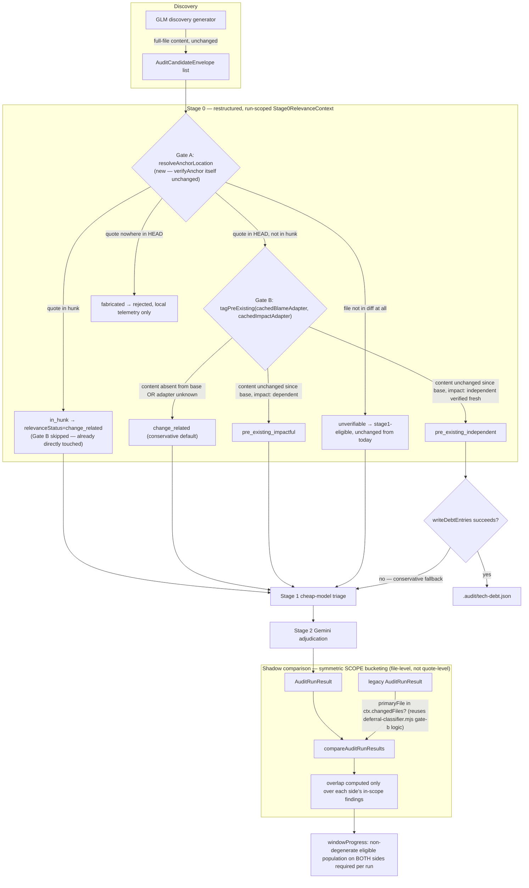

# Plan: Stage 0 Evidence-Relevance Split (Tiered-Recall Audit Pipeline)

- **Date**: 2026-07-16
- **Status**: Implemented (2026-07-16) — all 3 clusters landed via `/cycle --autonomous`. Plan-audit: 3 GPT rounds + 2 Gemini rounds. Code-audit: Clusters A+B converged over 3 GPT rounds + interim Gemini APPROVE (0 new findings); Cluster C 1 round (fix-gate: final) + consolidated Gemini gate. The 3 deferred implementation-completeness items were all verified at code-audit (exact `contentExistsAtMappedRange` signature carries the quote; `Stage0RelevanceContext` per-run caching spy-tested; `scopeBucket` resolution has a single call site in `tiered-pipeline.mjs`'s findings union).
- **Author**: Claude + Louis Strydom
- **Scope**: backend

> **Implementation deviations (authorized 2026-07-16, post-approval)**:
> 1. **`comparedRuns` population predicate is `||`, not the `&&` specified in
>    the tiered-shadow-summary section** — the symmetric "both sides non-empty"
>    requirement was a vestige of a superseded eligibility design (pre-Gemini-G2,
>    when "eligible" meant a post-bucketing subset). Once eligibility collapsed
>    to "reached the comparison at all", `&&` reduced to "both pipelines found
>    ≥1 finding" — silently dropping one-sided runs (legacy-found-tiered-missed
>    = recall failure; tiered-found-legacy-missed = tiered's value-add), i.e.
>    exactly the runs the Phase-14 decision most needs, biasing the surviving
>    overlap rate upward toward a false production-flip. Only both-sides-empty
>    runs are excluded (degenerate). Operator-authorized; tests pin both the
>    one-sided inclusions and the both-empty exclusion.
> 2. **The decision-grade comparison fields (`legacyEligibleCount`/
>    `tieredEligibleCount`/`overlapDebtRouted`) are ALWAYS emitted by
>    `compareAuditRunResults`, not gated on the bucketed-mode `opts`** — a
>    cross-session review flagged that a future unbucketed call site would
>    silently produce old-shape, un-comparable rows forever (a 5th way the
>    window could read wrong). The fields never needed the bucket maps, so the
>    `opts` dependency was accidental; only the sub-bucket provenance counts
>    remain opts-gated. Removes the misuse class by construction.
> 3. **Found + fixed while wiring (pre-existing, production-breaking, outside
>    this plan's declared scope but load-bearing for it)**: the discovery
>    generators validated against `ProducerFindingSchema` (V1 — no evidence
>    fields), so Zod silently stripped `evidenceType`/`anchor` from every
>    candidate and Stage 0 rejected 100% as fabricated (confirmed live:
>    2026-07-16's six `complete` shadow runs all show `stage0Verified: 0`
>    against 10-20 raw candidates). Now `ProducerFindingV2Schema` — without
>    this, every mechanism in this plan was unreachable.
> 4. **Found by the Close-out empirical verify itself, and fixed**: the V2
>    switch (#3) was necessary but NOT sufficient. With anchors now required,
>    GLM-via-OpenRouter failed `EvidenceAnchorSchema`'s superRefine on 3/3
>    findings (`a 'modified' anchor requires both oldFile and newFile present
>    and equal` — it omits `oldFile`), so the required generator failed and
>    every run still fell back to legacy. Root cause: the generator's system
>    prompt was one sentence and never stated the anchor contract, and
>    OpenRouter (unlike Anthropic tool-use, which validates provider-side —
>    hence Sonnet never hit this) accepts our JSON Schema without enforcing
>    it. Fixed on both sides: the anchor contract is now spelled out in BOTH
>    generators' prompts, and `normalizeModifiedAnchorPaths` mirrors the one
>    definitionally-derivable field, composed alongside the pre-existing
>    `clampToJsonSchemaLimits` preprocessor that already absorbs this exact
>    "OSS router doesn't enforce" class. Narrow by construction (never invents
>    a path, never touches added/deleted/renamed/copied, never edits
>    `quote`/lines) and independently re-checked by Gate A against the real
>    diff, so a wrong mirror is caught as `fabricated`, not trusted.

## Close-out: pre-ship empirical verify — result (2026-07-16)

**Verified (real git, real diff, real working-tree content, real DB, real
debt ledger; only the upstream LLM generators stubbed):**

- Stage 0 verified **2 of 3** candidates, rejecting **only** the genuinely
  fabricated quote — directly refuting the `stage0Verified: 0` signature the
  six live `complete` runs earlier the same day exhibited.
- Gate A's HEAD-content fallback resolved a real quote that lives outside
  every diff hunk (the case the whole plan exists for).
- `contentExistsAtMappedRange` → real `git show` found a pre-existing quote
  at **base line 63 while it sits at head line 65** — empirical proof that
  the diff-derived line mapping is load-bearing and that raw line-number
  comparison across revisions would have been wrong.
- Decision #5's dirty-tree guard held: nothing was routed
  `pre_existing_independent` on a dirty tree.
- Every surviving finding carried a resolved `scopeBucket` +
  `_originCandidateIds`; `debtRoutedFiles`/`debtRoutingIncomplete` were
  always present, never `undefined`.

**NOT established — the window is NOT yet trustworthy.** Two full-provider
runs were attempted; both ended `fallback_legacy`. The first surfaced bug #4
above (now fixed — the schema error is gone). The second timed out waiting
on GLM (`OSS retry 1/1 [timeout]`, 120s × 2), which is the same pre-existing
discovery-generator flakiness the day's shadow log shows throughout
(OpenRouter timeouts, Sonnet `529 overloaded_error`, egress-gate refusals).
That is independent of this plan and is now the **next blocker**: this plan
makes Stage 0 correct and the window's arithmetic honest, but the window
still cannot FILL until discovery-generator reliability is addressed.
Do not read a future "window met" as decision-grade until a real
`tieredRunStatus: 'complete'` run with `stage0Verified > 0` has been
observed in the wild.

- **Target domain(s)**: `audit-orchestration`, `shared-lib`, `scripts`
- ⚠ **Cross-domain work** — touches all three; confirm boundary crossings are intentional (see §2 for why).

## Neighbourhood considered

Architectural-memory query against the target files returned `tagPreExisting`
(`scripts/lib/audit/evidence-triage.mjs:185-191`) as a `justify-divergence`
match (cosine 0.856) — the system correctly flagged that this plan is about
to touch a symbol that already exists and does almost exactly what's being
proposed. **This plan does not diverge**: it reuses `tagPreExisting()`
verbatim rather than writing a parallel classifier. Every other high-score
match (`runStage0EvidenceTriage`, `verifyAnchor`, `quoteAppearsOnSide`,
`compareAuditRunResults`, `classifyDeferralEvidence`, VCS primitives in
`vcs.mjs`) is a file this plan directly modifies — expected self-similarity,
not evidence of an unrelated duplicate.

## Context Summary

### What exists today (Code Trace)

The tiered-recall audit pipeline (`docs/plans/tiered-recall-audit-pipeline.md`)
runs discovery → Stage 0 evidence triage → Stage 1 cheap-model triage →
Stage 2 Gemini adjudication as an alternative to the legacy 5-pass GPT audit,
currently shadow-validated (never gating) via
`runTieredShadowComparison()` (`scripts/lib/audit/tiered-shadow-compare.mjs:246`).

**Discovery** (`runTieredAuditPipeline`, `scripts/lib/audit/tiered-pipeline.mjs:168`)
prompts the GLM generator with the FULL current content of every changed file:
```
tiered-pipeline.mjs:214  const discoveryCode = readFilesAsContext(ctx.changedFiles || [], { maxPerFile: 8000, maxTotal: 100000 });
tiered-pipeline.mjs:237  userPrompt: `## Plan\n${ctx.planContent ?? ''}\n\n## Changed Files (code)\n${discoveryCode}`,
```
`readFilesAsContext` (`scripts/lib/audit-scope.mjs:121`) reads real files off
disk via `safeReadFile` — no diff-awareness anywhere in this path.

**Stage 0** (`runStage0EvidenceTriage`, `evidence-triage.mjs:244-275`) verifies
each candidate's quoted evidence via `verifyAnchor` → `quoteAppearsOnSide`
(`evidence-triage.mjs:103-126`), which **only searches within `@@`-delimited
diff hunks** (`splitIntoHunks`, line 74). A quote that is real but lives in an
unchanged region of the file — which is most of what a full-file read
naturally surfaces — cannot be found in any hunk, so `verifyAnchor` returns
`'fabricated'` (line 161) and `runStage0EvidenceTriage` routes it to
`rejected[]` (line 260), never reaching Stage 1.

The pipeline already has the correct tool for this exact case,
**`tagPreExisting()`** (`evidence-triage.mjs:185-191`) — a two-check
(blame-ancestry + impact-independence) classifier — but it is **never called**
from `runStage0EvidenceTriage` or anywhere else in production. Its production
call site passes permanent stubs:
```
tiered-pipeline.mjs:353-356
  const { verified: stage0Verified } = runStage0EvidenceTriage(envelopes, { diffText: ctx.diffText }, {
    blameAdapter: () => null, // 'unknown' by default — never silently 'pre_existing_independent'
    impactAdapter: () => null,
  });
```
A second, independent dead-code layer sits one level up:
`classifyDeferralEvidence`'s gate (d) (`deferral-classifier.mjs:273-292`) is
explicitly designed to consume a `preExistingCheck` function matching
`tagPreExisting`'s exact contract, but `findings-pipeline.mjs` imports only
`parseAcceptV1Markers` from that module (line 16) — `classifyDeferralEvidence`
itself has zero production callers (confirmed via repo-wide grep; only its own
test file references it). The "Phase 3" pre-existing-evidence work this
comment refers to was built and unit-tested on both ends but never connected.

**Symptom, confirmed via live Supabase telemetry** (`tiered_shadow_observations`,
queried directly 2026-07-16): 7 consecutive `tieredRunStatus: 'complete'` runs
today all show `discoveryRawFindings: 8-18` but `stage0Verified: 0`,
`stage0Rejected` = 100%. `tieredFindingCount` is 0 in 13 of the last 15
"complete" comparisons across this repo + wine-cellar-app. The naive
readiness check (`npm run audit:tiered-shadow-report --repos <sibling>`)
reported "15/15 compared runs, window met, ready for Phase 14" — but
`compareAuditRunResults` (`tiered-shadow-compare.mjs:130-169`) computes
`overlapCount` via exact-hash `semanticId()` matching between two
near-empty/empty finding sets, so the 0%-overlap reading is a construction
artifact, not evidence about pipeline quality. This is the **third** distinct
mechanism behind a false "window met" reading, after the documented
2026-07-14 Sonnet/cli-backend `tool_choice` drop and `comparedRuns`
miscounting incidents (`docs/plans/tiered-recall-audit-pipeline.md` Addendum
2026-07-14).

**`vcs.mjs`** already has the closest primitive to a blame surrogate:
`gitShowFileAtRevision(revision, filePath)` (`scripts/lib/vcs.mjs:235-265`)
retrieves a file's content at a specific commit. No existing primitive does
line-range ancestry directly, and — round-1 plan-audit H1 — a naive
same-line-number comparison between base and HEAD is unsound: an unrelated
earlier hunk shifts every later line number, so comparing "line 40 in base"
against "line 40 in HEAD" compares unrelated content. §2 decision #4 below
replaces this with a content-based check that never touches line numbers on
the base side.

**Architectural-memory** (`symbol_file_imports` / `.audit-loop/domain-deps-observed.json`,
maintained by `arch:refresh`) already computes the reverse-dependency graph
this plan needs for `impactAdapter` — "does any changed file import/depend
on `file`?" is a lookup against data that already exists, not new analysis.

### Patterns reused vs new

- **Reused**: `tagPreExisting()` (unmodified signature — only its call site
  gains real adapters), `AuditCandidateEnvelope.stageDecisions` (append-only
  log — the new relevance decision is one more entry, same shape as existing
  `stage0`/`stage1`/`stage2` entries), `gitShowFileAtRevision` (blame-adapter
  building block), the architectural-memory import graph (impact-adapter data
  source), `.audit/tech-debt.json` + `writeDebtEntries`/`buildDebtEntry`
  (`scripts/lib/debt-capture.mjs`, `scripts/lib/debt-ledger.mjs` — the
  **already-live** routing target for `pre_existing_independent` findings,
  exercised directly in this session's own `/audit-code` run today).
- **New**: `blameAdapter` implementation (content-based pre-existence check —
  the one piece with no existing equivalent), `impactAdapter` implementation
  (versioned, run-scoped wrapper over the existing import graph), the Gate B
  relevance-classification step itself, a run-scoped `Stage0RelevanceContext`
  caching layer, a file-level relevance classification for legacy findings
  (reusing `deferral-classifier.mjs`'s existing out-of-scope file check —
  see decision #6), and the non-degenerate window-readiness gate.

### Right-sizing note — why NOT `classifyDeferralEvidence`

`classifyDeferralEvidence`'s dead gate (d) looks like the "proper",
adaptive-learning-integrated home for `pre_existing_independent` findings —
but it is itself unwired end-to-end (no caller ever supplies
`preExistingCheck`, and nothing downstream consumes its `class: 'pre-existing'`
output into `learning_decisions`/`recurring_finding_clusters`). Wiring
*two* independently-dead subsystems together in one plan is exactly the
over-engineered extreme this section exists to reject — it would require
either building out the Learning System Phase 1 consumption path (out of
scope; no current requirement drives it here) or leaving a second half-wired
path behind. The **band-aid** extreme would be silently dropping
`pre_existing_independent` findings on the floor (no routing at all) — loses
real signal, and the debt these findings represent goes untracked.
**Chosen**: route to `.audit/tech-debt.json`, a debt-capture mechanism that
is fully wired, already proven in production (used ~20 times in this
session's own `/audit-code` run against this exact fix cycle), and requires
zero new infrastructure. `classifyDeferralEvidence` gate (d) stays
documented-but-dormant — a candidate for a future, separately-scoped
Learning System integration plan, not this one.

## Proposed Architecture



**Note on asymmetric granularity** (round-1 plan-audit H2): tiered findings
get precise quote-level Gate A/B classification; legacy findings (free-text,
no structured `EvidenceAnchor`) get a coarser file-level "is this finding's
file in `ctx.changedFiles`" classification, reusing
`deferral-classifier.mjs`'s existing out-of-scope check. This is a
deliberate, documented simplification, not a silent gap: both sides answer
the same conceptual question ("is this finding about something the shipped
diff touches"), just at different precision. See decision #6.

**Why this doesn't collapse into a single-domain change** (the cross-domain
flag above): the blame-adapter's line-ancestry logic is a general git
primitive that belongs beside `vcs.mjs`'s existing revision/diff helpers
(`shared-lib`), not duplicated inside `audit-orchestration`; `tiered-shadow-report.mjs`
(`scripts`) needs its output-formatting layer touched for the new per-bucket
overlap display. All three crossings are pre-existing seams this plan's
target files already sit on (per the neighbourhood/domain query above), not
new coupling introduced by this design.

### Key design decisions

1. **Two sequential deterministic gates, not one combined check** (#1 SOLID
   — single responsibility, #3 Modularity). Gate A answers "is this quote
   real" (fact); Gate B answers "does this PR depend on it" (relevance).
   Conflating them is the root cause being fixed — keeping them separate
   means a future change to relevance policy (e.g. a stricter
   impact-independence bar) never risks reintroducing hallucination risk.

2. **`unknown` from either blame or impact adapter degrades to
   `change_related`, not to `rejected` or to `pre_existing_independent`**
   (#12 Validation, matching the existing `tagPreExisting` contract's
   "never silently pre_existing_independent" invariant, and this repo's
   established fail-closed-toward-inclusion pattern from `resolveAndClassify`'s
   symlink handling). A finding whose relevance can't be determined stays
   in the audit-blocking path rather than silently escaping review — the
   safe failure direction is "reviewed once too often," not "silently
   dropped."

3. **Gate A falls back to full-HEAD-file search, not the diff at large —
   via an explicit injected adapter, and via LINE-BY-LINE matching, never a
   whole-blob normalize-then-search** (#5 Single Source of Truth; Gemini
   final-review round-1 G2/G3). The discovery generator was shown the
   exact file content in `readFilesAsContext` — Gate A verifies against
   that same text. Two corrections to how, precisely:
   - **G2 — explicit adapter, not implicit threading**: `resolveAnchorLocation`
     needs `headContent` for a file, but `evidence-triage.mjs`'s module
     docblock promises "no I/O, no VCS access" — round-1/2's "already
     available via `readFilesAsContext`'s output — threaded through, not
     re-read" was never actually specified AS an injected dependency.
     `runStage0EvidenceTriage(envelopes, ctx, adapters)` gains a THIRD
     adapter, `adapters.headContentAdapter: (filePath) => string | null`,
     alongside `blameAdapter`/`impactAdapter` — `tiered-pipeline.mjs`
     implements it as a lookup into the SAME file-content map
     `readFilesAsContext` already built for the discovery prompt (zero new
     reads), matching the existing adapter-injection pattern this module
     already establishes rather than being the one exception to it.
   - **G3 — line-by-line matching, not blob normalization**: normalizing
     the WHOLE file into one string (collapsing all newlines) and then
     searching it, as round-1/2 implied, makes the matched character
     offset impossible to map back to a line number without a separate
     token-to-line index. Instead, `resolveAnchorLocation`'s HEAD-fallback
     splits `headContent` into lines UP FRONT (mirroring
     `quoteAppearsOnSide`'s existing line-array approach, not a new
     technique) and slides a window of consecutive lines across the file,
     normalizing and joining only the WINDOW (not the whole file) at each
     position and comparing against the normalized quote — exactly
     `quoteAppearsOnSide`'s existing per-hunk algorithm, generalized from
     "one hunk's lines" to "a sliding window over the whole file." The
     matched window's start/end line indices ARE the matched line range —
     no separate mapping structure needed, because the search never left
     line-indexed space to begin with.

4. **`blameAdapter` uses diff-derived line mapping, never a global content
   search** (round-2 plan-audit H1 — round-1's "does the quote appear
   ANYWHERE in the base file" is itself unsound: common snippets like
   `return null` or a repeated validation condition can genuinely occur
   both pre-existing AND newly-added elsewhere in the same file, so a
   global search can misclassify a real new occurrence as pre-existing).
   The fix is occurrence-specific, and needs no new git calls beyond what
   Stage 0 already has: `diffText` (already fetched for the whole audit
   run) contains every hunk's `@@ -a,b +c,d @@` header for the cited file
   — parsing those headers (currently discarded by `splitIntoHunks`, which
   keeps only hunk bodies) gives a deterministic mapping from any HEAD line
   number to its corresponding BASE line number for lines OUTSIDE a hunk
   (cumulative offset arithmetic from the hunks preceding that line — a
   standard, bounded diff-line-mapping computation, not a heuristic).
   Gate A's HEAD-fallback search (in `resolveAnchorLocation`) now also
   records the MATCHED LINE RANGE in `headContent`, not just a boolean.
   Gate B computes that range's corresponding base-line range via the
   mapping above, fetches ONLY that specific range from the base file
   (`gitShowFileAtRevision` still supplies the base content — one call per
   unique file per run, per decision #7/M4's caching context, unchanged),
   and compares content at THAT exact location, not anywhere in the file.
   Any ambiguity — a hunk header that doesn't parse, a computed base range
   outside the file's bounds, or the file not existing at `baseSha` (added
   by this commit) — returns `null` (unknown), never a guess (decision #2).
   `contentExistsAtRevision` (round-1's name) is renamed
   `contentExistsAtMappedRange(filePath, headLineRange, diffText, baseSha)`
   to make the occurrence-specificity part of the function's own contract,
   not an implementation detail a future caller could accidentally lose.

5. **`impactAdapter` is a versioned, run-scoped, conservative, BOUNDED
   TRANSITIVE graph query — and returns `null` unconditionally on a dirty
   working tree** (#5 Single Source of Truth, #17 avoid redundant I/O —
   round-1 plan-audit H3/M4, round-2 plan-audit H2/H6). Two distinct fixes:
   - **Snapshot consistency (H2)**: the architectural-memory graph is only
     ever fresh for a COMMITTED snapshot (`arch:refresh` runs against
     `git`, never the working tree), but discovery reads the LIVE working
     tree — a graph fresh for HEAD cannot see an import introduced or
     removed by an uncommitted change. Rather than building a live
     import-overlay (real engineering cost this plan's scope doesn't
     justify — no current requirement drives auditing dirty trees with
     full impact precision), `impactAdapter` checks the SAME
     `workingTreeDirty` signal `openai-audit.mjs`'s existing scope
     resolution already computes and returns `null` unconditionally when
     the tree is dirty. This is an honest, documented reduced-coverage
     mode (Risk Register), not a silent gap: on a dirty tree, EVERY
     outside-hunk finding falls through Gate B's `unknown` default to
     `change_related` — safe (decision #2), conservative, never a false
     independence claim.
   - **Real transitive traversal (H6), correct polarity, and a REACHABLE
     confident-independent signal** (round-3 plan-audit H6/H7, corrected
     again by Gemini final-review round-2 G1 — round-3's H7 fix over-
     corrected: by making the BFS NEVER return a confident "no dependency
     found," it made `impactAdapter(file) === true` — the ONE value
     `tagPreExisting` requires to ever classify anything
     `pre_existing_independent` — structurally unreachable, silently
     disabling the entire debt-routing feature the plan exists to build).
     The existing `getImportersForFiles` primitive is single-hop only
     (`Map<imported_path, importer_paths[]>`); depending on it directly
     under-detects multi-hop impact (A imports B imports C; a change to C
     should mark A as dependent) — fixed by loading the full reverse-edge
     graph ONCE per run (decision #4's/M4's caching) and performing an
     in-memory bounded BFS over reverse edges, **starting from the cited
     file's REVERSE NEIGHBORS, never from the cited file itself** (round-3
     H4 — the cited file is always a member of `ctx.changedFiles` too,
     since discovery only examines changed files; starting the BFS AT the
     cited file trivially self-matches on hop zero for every candidate).
     The visited set includes the root from the start (no cycle re-entry).
     Bounded by `IMPACT_TRAVERSAL_MAX_DEPTH` (default 6). **`impactAdapter`
     returns exactly `tagPreExisting`'s expected polarity — `true` means
     INDEPENDENT, matching the pre-existing `tagPreExisting` contract this
     plan wires into, not the BFS's own internal "found a dependent?"
     framing**:
     - A changed-file dependent IS found among the reverse neighbors
       within the depth bound → **`false`** (confidently dependent — a
       found graph edge is real regardless of whether the REST of the
       graph is complete, so this needs no completeness proof).
     - The bounded traversal EXHAUSTS with no changed-file dependent found,
       on a graph that passed the freshness check below → **`true`**
       (confidently independent — Gemini G1's correction: treating a
       fresh, depth-bounded, clean-tree traversal's clean exhaustion as
       reasonable evidence of independence is the correct read of a
       heuristic graph query; demanding a formal completeness PROOF, as
       round-3's H7 draft did, makes the feature permanently unreachable,
       which is a worse outcome than accepting this bounded confidence
       level — the graph's OWN staleness/dirty-tree/language-coverage
       gaps are already independently guarded below).
     - `maxDepth` reached before either resolution, OR an unresolved edge
       encountered anywhere in the traversal → **`null`** (genuinely
       uncertain — never guessed).
   - **Freshness validation** (round-1 H3, unchanged): the graph is
     validated fresh for HEAD (rules-digest/`active_refresh_id` convention
     AGENTS.md already documents for the dashboard reader) BEFORE any
     traversal — combined with the dirty-tree check above, `impactAdapter`
     returns `null` on: cloud unavailable, stale graph, dirty working
     tree, or unsupported language — independent of the three-way
     true/false/null traversal result above, which only ever runs on a
     graph that already passed this gate.

6. **Legacy-side bucketing is file-level, not quote-level** (round-1
   plan-audit H2 — right-sizing: legacy findings from
   `legacy-production-audit.mjs` are free-text, with no structured
   `EvidenceAnchor` to run Gate A/B against; building one would mean
   parsing arbitrary LLM prose for quotable code spans, a substantially
   larger and less reliable undertaking than this plan's actual goal).
   Both sides answer the coarser, already-available question "is this
   finding about a file the shipped diff touches" — reusing
   `deferral-classifier.mjs`'s existing `(b) out-of-scope: cited file NOT
   in --changed` check (`deferral-classifier.mjs:196-217`, currently
   exercised only by its own tests, same as gate (d) — this plan's second
   reuse of already-built-but-dormant logic, not new classification code).
   `runTieredShadowComparison` (`tiered-shadow-compare.mjs:246`) is the
   producer: it has both `legacyResult` and `ctx.changedFiles` in scope
   already, so it computes `legacyBuckets` immediately before calling
   `compareAuditRunResults`, with no new persistence path needed (the
   existing local JSONL + Supabase write already carries the full
   `comparison` object `compareAuditRunResults` returns). The exact
   membership check reused: a new narrow, pure export
   `isFileInChangedScope(filePath, changedFiles)` extracted from
   `deferral-classifier.mjs`'s gate (b) body (round-2 plan-audit M2 —
   naming the exact function, not "the classifier or the check it wraps";
   extracting it avoids coupling comparison to `classifyDeferralEvidence`'s
   other three unrelated gates).

7. **Symmetric, PERSISTED population counts — both sides, always** (round-2
   plan-audit H3). `legacyEligibleCount` and `tieredEligibleCount` are
   computed from the SAME bucket maps immediately before overlap
   calculation and BOTH persisted on the `comparison` object (not just
   `tieredEligibleCount`, which round-1 specified alone). Historical rows
   without either field are `null`, not `0` — `summarize()`'s readiness
   predicate (decision #9 below) treats `null` as "insufficient data",
   never as "zero population confirmed."

8. **Explicit candidate→finding provenance, not an implicit "buckets come
   from stageDecisions" claim** (round-2 plan-audit H4). Every
   `AuditCandidateEnvelope` already carries a stable `fingerprint`
   (confirmed reused today: `stage1-triage.mjs:385` already falls back to
   `envelope.fingerprint` for `semanticHash`, and
   `final-adjudication.mjs:526` already reads `envelope.candidateId` at
   the Stage 2 boundary — partial provenance threading already exists,
   this decision makes it complete and named). Stage 1/Stage 2 are
   required to preserve an `_originCandidateIds: string[]` array on every
   finding they emit or promote (a merge of N candidates into one finding
   unions their ids), sourced from the existing `fingerprint`/`candidateId`
   references above. `AuditRunResult.findings[].scopeBucket` is then a
   direct lookup: for each finding, resolve `_originCandidateIds` against
   the Stage 0 routing manifest's per-candidate `relevanceStatus`
   (decision #8's table) — a finding with multiple origins takes the
   LEAST-restrictive bucket among them (i.e. `change_related` if ANY
   origin is change-related — safe-toward-inclusion, decision #2).
   `unverifiable` candidates (no Gate B run, per the result-model table)
   get `scopeBucket: 'change_related'` for comparison purposes — included,
   not silently unbucketed, matching decision #2's default.

9. **Debt-routing reconciles the FULL `writeDebtEntries` result, not just
   thrown exceptions** (round-2 plan-audit H5 — round-1's fix handled a
   write exception but not the API's normal `rejected[]` array for
   invalid/duplicate entries, which is not an exception path). All
   `pre_existing_independent` candidates for a run are built into debt
   entries UP FRONT (keyed by their `fingerprint`) and submitted as ONE
   batch. After the call, ANY fingerprint appearing in `result.rejected`
   is treated identically to a write exception: restored to the Stage-1
   pool, and recorded in a structured `debtRoutingIncomplete: {fingerprint,
   reason}[]` array on `AuditRunResult` (not a bare boolean — round-1's
   flag is upgraded to carry per-candidate reasons, satisfying both H5 and
   the observability half of round-1's original H4 fix). Only fingerprints
   NEITHER thrown NOR rejected are considered durably debt-routed.
   `AuditRunResult` additionally persists `debtRoutedFiles: string[]` — the
   set of files whose successfully-debt-routed candidates originated from
   (decision #10 below needs this).

10. **A correctly debt-routed finding is NOT a tiered "miss"** (Gemini
    final-review round-1 G1 — the single most consequential gap in the
    whole plan: legacy's file-level bucketing (decision #6) marks a file
    "eligible" whenever it's in `changedFiles`, with no concept of
    per-candidate debt-routing; a `pre_existing_independent` candidate
    correctly routed to debt is, by design, ABSENT from
    `tieredResult.findings` entirely — so a legacy finding on that same
    file would register as `onlyLegacyCount`, a tiered miss, EXACTLY when
    the tiered pipeline did its job correctly. Left unfixed, this would
    have systematically penalized the tiered pipeline's most important new
    capability in the very metric this plan exists to make trustworthy).
    Fix: `compareAuditRunResults`'s bucketed overlap computation checks
    each legacy `in_scope` finding's file against `tieredResult.debtRoutedFiles`
    (decision #9's new field) BEFORE counting it as `onlyLegacyCount`. A
    match is counted separately as `overlapDebtRouted` (handled, not
    missed) — neither `overlapCount` (which specifically means "both sides
    independently produced a finding") nor `onlyLegacyCount`. This is
    file-level matching, not candidate-level — consistent with decision
    #6's existing file-level/quote-level asymmetry between the two sides;
    a false-positive `overlapDebtRouted` (legacy's finding was actually
    about something unrelated to the specific debt-routed candidate, just
    sharing a file) is the safe direction — it under-counts misses rather
    than falsely inflating them, and file-level granularity is exactly
    what decision #6 already accepted as this plan's right-sized bucketing
    precision for the legacy side.

## Sustainability Notes

- **Assumptions that could change**: this design assumes the discovery
  generator's evidence is always a literal, findable substring of the file
  it cites (true for GLM/Sonnet today). If a future discovery model produces
  paraphrased or structurally-different evidence (e.g. symbol references
  instead of quotes), Gate A's `quoteAppearsOnSide` substring match would
  need a resolver upgrade — the two-gate split isolates that future change
  to Gate A alone; Gate B's relevance logic is quote-format-agnostic.
- **Extension points already built in**: `blameAdapter`/`impactAdapter` are
  injected functions (existing `tagPreExisting` signature) — a future,
  cheaper or more precise implementation of either swaps in without touching
  `runStage0EvidenceTriage`'s call site shape.
- **Migration path**: if `.audit/tech-debt.json` debt volume from
  `pre_existing_independent` routing becomes large enough to need proper
  triage workflow (dashboards, resolution tracking beyond what
  `debt-resolve.mjs` already offers), the existing debt-capture
  infrastructure already supports that — no schema change needed to route
  more volume through it.
- **Pattern for future discovery-model swap-ins** (`docs/model-eval-harness.md`):
  every future candidate model reuses this exact Gate A/B split unmodified —
  the fix generalizes by construction, since nothing in Gate A or Gate B is
  GLM-specific.

## File-Level Plan

### Stage 0 per-candidate result model (round-1 plan-audit M1 — resolving the
contradiction between "Gate B only for `verified_outside_hunk`" and "one
`stage0b` decision per envelope")

Every candidate gets exactly ONE `anchorStatus` (from Gate A) and, only when
`anchorStatus === 'outside_hunk_in_head'`, exactly one `relevanceStatus`
(from Gate B):

| `anchorStatus` (Gate A, `resolveAnchorLocation`) | Gate B runs? | `relevanceStatus` | `scopeBucket` (decision #8) | disposition |
|---|---|---|---|---|
| `in_hunk` | no | `change_related` (implicit) | `change_related` | stage1-eligible |
| `outside_hunk_in_head` | **yes** | `change_related` \| `pre_existing_impactful` \| `pre_existing_independent` \| `unknown`→treated as `change_related` | same as `relevanceStatus` | stage1-eligible, EXCEPT `pre_existing_independent` → debt-routed (decision #9) |
| `unverifiable` (file not in diff) | no | n/a | `change_related` (safe default, decision #8) | stage1-eligible (**unchanged from today**) |
| `fabricated` | no | n/a | n/a — never reaches comparison | rejected, local telemetry only (**unchanged from today**) |

`stageDecisions` gets exactly one `stage: 'stage0a'` entry per candidate
(always) and one `stage: 'stage0b'` entry ONLY when Gate B actually ran.

### `scripts/lib/text-normalize.mjs` (create — round-2 plan-audit M1: extracting
`normalizeWhitespace` to break a `shared-lib` → `audit-orchestration` reverse
dependency the round-1 draft introduced by having `vcs.mjs` import from
`evidence-triage.mjs`)
- **Purpose**: dependency-neutral home for whitespace normalization, shared
  by `vcs.mjs` (quote-location policy stays in evidence-triage; the raw
  string operation moves here) and `evidence-triage.mjs` (updated to import
  from here instead of defining it).
- **Key changes**: single export `normalizeWhitespace(s)` — verbatim
  behavior move, no logic change.
- **Why this file**: `shared-lib` may be imported by both `vcs.mjs` and
  `audit-orchestration` modules; neither should import from the other for
  a primitive this generic.

### `scripts/lib/audit/evidence-triage.mjs` (modify)
- **Purpose**: add Gate A's HEAD-fallback (occurrence-specific, per decision
  #4) via a NEW dedicated resolver (not a `verifyAnchor` signature change —
  round-1 plan-audit M2), and the Gate B relevance step per the table above.
- **Key changes**:
  - Update to import `normalizeWhitespace` from the new
    `scripts/lib/text-normalize.mjs` (moved, not duplicated).
  - `splitIntoHunks` (line 74) additionally parses each hunk's
    `@@ -a,b +c,d @@` header (currently discarded) into `{baseStart,
    baseCount, headStart, headCount}` — needed by the line-mapping below.
  - **New export** `mapHeadLineToBase(headLine, hunks)` — pure function,
    walks the parsed hunk headers in order and returns the corresponding
    base-file line number for a HEAD line OUTSIDE every hunk (cumulative
    offset from hunks strictly before it), or `null` if `headLine` falls
    WITHIN a hunk (that path is `in_hunk`, handled separately) or the
    computation is ambiguous (unparseable header, negative/out-of-bounds
    result).
  - **New export** `resolveAnchorLocation(anchor, diffText, headContent)` —
    Stage-0-only resolver, used nowhere else, and STILL PURE (Gemini G2's
    fix is about how `headContent` reaches this function, not about this
    function doing I/O itself). First tries the existing hunk search
    (delegates to the unchanged `quoteAppearsOnSide`); on a miss, performs
    the LINE-BY-LINE sliding-window search over `headContent` per decision
    #3's G3 fix and records the MATCHED LINE RANGE (not just a boolean).
    Returns `{status: 'in_hunk'|'outside_hunk_in_head'|'unverifiable'|
    'fabricated', headLineRange?}`. `verifyAnchor` itself is **completely
    unchanged** — every existing caller keeps working with zero
    modification.
  - `runStage0EvidenceTriage(envelopes, ctx, adapters)` gains a THIRD
    required adapter, `adapters.headContentAdapter` (decision #3's G2 fix
    — explicit injection, not implicit threading), and calls
    `adapters.headContentAdapter(filePath)` to obtain `headContent` BEFORE
    calling the now-pure `resolveAnchorLocation` with it — the I/O (or,
    in production, the map lookup) lives in the adapter, exactly like
    `blameAdapter`/`impactAdapter` already do; `resolveAnchorLocation`
    itself never reaches outside its own parameters. For
    `outside_hunk_in_head` candidates, computes the base-line range via
    `mapHeadLineToBase` and calls `tagPreExisting()` with
    `adapters.blameAdapter(filePath, mappedBaseRange)`/
    `adapters.impactAdapter` per the table above — an unmappable range
    short-circuits straight to `unknown` without calling `blameAdapter` at
    all. Returns THREE arrays: `verified` (stage1-eligible — `in_hunk` +
    `outside_hunk_in_head`-but-not-independent + `unverifiable`),
    `preExistingIndependent` (routed to debt, decision #9), `rejected`
    (fabricated — unchanged).
  - Appends `stageDecisions` entries per the table above, including a
    `scopeBucket` field per candidate (decision #8) for the provenance
    threading below.
- **Dependencies**: imports `EvidenceAnchorSchema`, `promoteAlternative`,
  `nowIso` (unchanged), `normalizeWhitespace` (now from
  `text-normalize.mjs`). New: none beyond that (adapters remain
  caller-injected; every new export stays pure — no I/O).
- **Why this file**: it already owns `verifyAnchor`, `tagPreExisting`, and
  hunk-splitting — the line-mapping logic that makes Gate B
  occurrence-specific belongs beside the hunk-parsing it extends.

### `scripts/lib/vcs.mjs` (modify)
- **Purpose**: add the occurrence-specific, diff-mapped content check
  (round-1 H1 fix, deepened by round-2 H1 — never a global content search).
- **Key changes**: new export `contentExistsAtMappedRange(filePath,
  mappedBaseRange, baseSha)` — the occurrence-specificity is now part of
  the function's own name and contract, not an implementation detail a
  future caller could drop. Calls `gitShowFileAtRevision(baseSha,
  filePath)` exactly ONCE (per unique file per run — decision #7/M4
  caching, unchanged), extracts ONLY `mappedBaseRange` from the result
  (not the whole file), normalizes via the shared `normalizeWhitespace`,
  and compares against the anchor's quote at that specific location.
  Returns `true` (matches at the mapped location — genuinely
  pre-existing), `false` (mapped location exists but content differs —
  the range shifted/changed, safe `change_related` default applies), or
  `null` on resolution failure (file didn't exist at `baseSha`, revision
  unreadable, or `mappedBaseRange` is out of the base file's bounds —
  matches the existing `VcsErrorCode` fail-closed pattern). Takes NO
  free-floating quote-search parameter — round-1's
  `contentExistsAtRevision(filePath, quote, baseSha)` design is replaced
  entirely, not renamed, because a quote-anywhere search is the exact
  defect round-2 H1 identified.
- **Dependencies**: reuses `gitShowFileAtRevision`, `classifyChildError`
  (both already in this file); imports `normalizeWhitespace` from the new
  `scripts/lib/text-normalize.mjs` (not from `evidence-triage.mjs` —
  round-2 M1 fix).
- **Why this file**: `vcs.mjs` is the existing structured-VCS-contract
  module — a new git-content primitive belongs beside its siblings.

### `scripts/lib/audit/tiered-pipeline.mjs` (modify)
- **Purpose**: build the run-scoped `Stage0RelevanceContext`, wire real
  adapters (including the dirty-tree guard, decision #5), and route
  `pre_existing_independent` findings via a batch-reconciled debt write
  (decision #9).
- **Key changes**:
  - **New**: build one `Stage0RelevanceContext` per pipeline run, BEFORE
    calling `runStage0EvidenceTriage`: preloads each unique cited file's
    base-revision content lazily on first request (memoized by
    `(filePath, baseSha)`), and loads + freshness-validates the
    architectural-memory import graph exactly once — `null` if validation
    fails OR `ctx.workingTreeDirty` is true (decision #5's snapshot-
    consistency fix). `blameAdapter`/`impactAdapter`/`headContentAdapter`
    (Gemini G2 fix, decision #3) become closures over this context —
    `headContentAdapter` closes over the SAME file-content map
    `discoveryCode`/`readFilesAsContext` already built (a lookup, zero new
    reads) — replacing the current `() => null, () => null` stubs (line
    354-355), now a THREE-adapter object.
  - `ctx.baseSha`, `ctx.workingTreeDirty`, and `ctx.commitSha` are **new
    required fields on `AuditRunContext`** for the tiered pipeline path
    (round-3 plan-audit H2 fix — round-2 said "no `headSha` field" as a
    blanket claim, which directly contradicted `getFreshImportersOrNull`'s
    own signature below; the correction is that NO second revision is
    needed for the BLAME primitive specifically, per decision #4, but the
    IMPORT-GRAPH freshness check is a genuinely separate concern that DOES
    need the current commit sha to validate the graph's generation commit
    against). All three are already resolved by `openai-audit.mjs`'s
    existing scope logic (`auditBaseCommit`/`diffBase`, the dirty-tree
    check, and `git rev-parse HEAD` respectively) and simply threaded
    through unchanged — no new resolution logic anywhere in this plan.
    `getFreshImportersOrNull`'s `headSha` parameter (below) is fed from
    `ctx.commitSha`.
  - **Debt routing, full batch reconciliation** (decision #9): after
    `runStage0EvidenceTriage` returns, build ALL `preExistingIndependent`
    candidates into debt entries up front (keyed by `fingerprint`) and
    submit as ONE `writeDebtEntries` batch call. Reconcile the result:
    fingerprints in `result.rejected`, OR any candidate whose write threw,
    are restored to the Stage-1-eligible pool; everything else is durably
    debt-routed. `AuditRunResult.debtRoutingIncomplete` becomes a
    structured `{fingerprint, reason}[]` array (not a bare boolean).
  - `discoveryCode` (line 214) stays exactly as-is — full-file content is
    correct per the brainstorm consensus; only the verification layer
    changes.
- **Dependencies**: new imports `contentExistsAtMappedRange` (`scripts/lib/vcs.mjs`),
  `writeDebtEntries` (`scripts/lib/debt-ledger.mjs`), `buildDebtEntry`
  (`scripts/lib/debt-capture.mjs`),
  `getFreshImportersOrNull` (`scripts/lib/store/arch/imports.mjs` — see
  next entry).
- **Why this file**: it's the sole production call site for
  `runStage0EvidenceTriage` — context construction and adapter wiring
  belong where the adapters are currently stubbed.

### `scripts/lib/store/arch/imports.mjs` (modify)
- **Purpose**: add the freshness-validated, dirty-tree-guarded, BOUNDED
  TRANSITIVE reverse-dependency query `impactAdapter` calls (round-1 H3,
  round-2 H2/H6).
- **Key changes**: new export `getFreshImportersOrNull({ repoUuid, headSha,
  workingTreeDirty, filePath, changedFiles, maxDepth = 6 })`:
  1. Returns `null` immediately if `workingTreeDirty` (decision #5 — a
     graph fresh for a committed HEAD cannot see uncommitted import
     changes; no live overlay is built, this is a documented
     reduced-coverage mode, not silently wrong).
  2. Resolves the repo's `active_refresh_id`, validates that refresh's
     generation commit against `headSha` (reusing the dashboard reader's
     existing freshness-check convention per AGENTS.md); returns `null` on
     any mismatch or cloud-unavailability.
  3. On a fresh, clean-tree match: loads the FULL reverse-edge graph for
     the snapshot ONCE (not per candidate — reuses the existing
     `getImportersForFiles` primitive for the bulk load), then performs an
     in-memory bounded BFS starting from `filePath`'s reverse neighbors
     (NEVER `filePath` itself — round-3 H4) over reverse edges. Returns
     `tagPreExisting`-polarity results (decision #5, corrected by Gemini
     G1 — `true` means INDEPENDENT): a changed-file hit among those
     neighbors within `maxDepth` → `false` (confidently dependent); clean
     exhaustion with no hit → `true` (confidently independent, on an
     already-freshness-validated graph); `maxDepth` reached before
     resolution, or an unresolved edge anywhere in the traversal → `null`
     (genuinely uncertain).
- **Dependencies**: reuses `getImportersForFiles`, `isCloudEnabled`
  (already imported in this file). New: a repo/refresh-freshness lookup —
  named at implementation start against the dashboard reader's own
  freshness-check call site (the ONE remaining "resolved at
  implementation start" note in this plan, scoped to a single, precisely
  described lookup, not an open choice between alternatives — round-2 M2).
- **Why this file**: it already owns every `symbol_file_imports` read — the
  freshness- and depth-bounded traversal wrapper belongs beside its
  siblings (#5 Single Source of Truth).

### `scripts/lib/audit/stage1-triage.mjs` (modify) and
`scripts/lib/audit/final-adjudication.mjs` (modify) — round-2 plan-audit H4
- **Purpose**: complete the candidate→finding provenance link that already
  partially exists (`stage1-triage.mjs:385` already falls back to
  `envelope.fingerprint`; `final-adjudication.mjs:526` already reads
  `envelope.candidateId`), so `AuditRunResult.findings[].scopeBucket` can
  be resolved deterministically.
- **Key changes**: both files are updated so every finding they emit or
  promote carries `_originCandidateIds: string[]` (a merge of N candidates
  unions their ids, using the already-threaded `fingerprint`/`candidateId`
  references — no new identifier scheme introduced). A new small pure
  helper (co-located in `evidence-triage.mjs` beside the Stage 0 routing
  manifest it reads) resolves each finding's `scopeBucket` from
  `_originCandidateIds` against that manifest's per-candidate
  `relevanceStatus`, taking the LEAST-restrictive bucket among multiple
  origins (decision #8).
- **Why these files**: they're the only two places a candidate becomes (or
  is merged into) a final finding — provenance must be preserved at the
  point it could otherwise be lost.

### `scripts/lib/audit/tiered-shadow-compare.mjs` (modify)
- **Purpose**: symmetric SCOPE bucketing (file-level — decision #6) for
  legacy findings, and bucketed, SYMMETRICALLY-POPULATED overlap
  computation (decision #7).
- **Key changes**:
  - `runTieredShadowComparison` (line 246) is the producer: immediately
    before calling `compareAuditRunResults`, it computes `legacyBuckets`
    via the new `isFileInChangedScope(filePath, changedFiles)` export
    (decision #6/M2 — extracted from `deferral-classifier.mjs`'s gate (b)
    body as its own narrow, pure, named function, not an inline reuse of
    the whole classifier). `tieredBuckets` comes directly from
    `tieredResult.findings[].scopeBucket` (H4's provenance link above —
    not "directly from stageDecisions" as round-1 vaguely claimed).
  - `compareAuditRunResults(legacyResult, tieredResult, { legacyBuckets,
    tieredBuckets })` gains one new optional param object (backward
    compatible — omitted falls back to today's unbucketed calculation).
    When supplied, `overlapCount`/`onlyLegacyCount`/`onlyTieredCount` are
    computed over a shared `isComparisonEligible` policy (round-3
    plan-audit H5, corrected again by Gemini final-review round-2 G2).
    **`isComparisonEligible` is unconditionally true for EVERY
    `scopeBucket` value, with no bucket-based exclusion rule at all** —
    round-3's draft still tried to exclude `pre_existing_independent` by
    bucket, but decision #9 already guarantees a SUCCESSFULLY debt-routed
    candidate never becomes a finding in `tieredResult.findings` in the
    first place (it's removed before Stage 1 entirely). So any finding
    that reaches the comparison function AT ALL — regardless of its
    `scopeBucket` — is, by construction, one Stage 1/2 actually processed,
    and belongs in the comparison; a `pre_existing_independent`-bucketed
    finding present here is specifically a debt-routing FAILURE fallback
    (decision #9's `debtRoutingIncomplete`), not a routed one, and must be
    compared against legacy like any other finding. Detailed sub-bucket
    counts (`change_related` vs `pre_existing_impactful` vs
    `pre_existing_independent`) remain separately reported for
    provenance/visibility — eligibility is now simply "did this finding
    reach the comparison at all," which detailed classification never
    gates.
    New reported fields, BOTH sides symmetrically (round-2 H3 —
    round-1 only specified the tiered side): `legacyEligibleCount`/
    `tieredEligibleCount`, `legacyOutOfScopeCount`/
    `tieredPreExistingIndependentCount`.
  - **Debt-routed findings never count as a tiered miss** (Gemini
    final-review round-1 G1 — decision #10): before computing
    `onlyLegacyCount`, each `legacyBuckets`-eligible legacy finding's file
    is checked against `tieredResult.debtRoutedFiles` (decision #9). A
    match is counted in a NEW field `overlapDebtRouted`, not
    `onlyLegacyCount` — the tiered pipeline correctly identified and
    routed the finding; it is not a miss.
  - Add `tieredStage0Verified: tieredResult._stageBreakdown?.stage0Verified ?? null`
    to the return object, mirroring the existing copy-straight-through
    convention.
- **Dependencies**: imports the new `isFileInChangedScope` export from
  `deferral-classifier.mjs`.
- **Why this file**: it already owns both the orchestration
  (`runTieredShadowComparison`) and the pure comparison math
  (`compareAuditRunResults`) — bucketing production and bucketed
  comparison belong together here.

### `scripts/lib/audit/deferral-classifier.mjs` (modify)
- **Purpose**: extract the narrow, reusable file-membership predicate
  decision #6 names.
- **Key changes**: new export `isFileInChangedScope(filePath,
  changedFiles)` — the exact boolean check currently inlined in gate (b)
  (`deferral-classifier.mjs:205-206`), extracted so
  `tiered-shadow-compare.mjs` can reuse it WITHOUT importing
  `classifyDeferralEvidence` and its three unrelated gates. Gate (b)
  itself is updated to call the new export rather than duplicating the
  check inline — zero behavior change to `classifyDeferralEvidence`.
- **Why this file**: the check already lives here; extracting it in place
  is the minimal change that satisfies decision #6 without new coupling.

### `scripts/lib/audit/tiered-shadow-summary.mjs` (modify)
- **Purpose**: non-degenerate window-readiness criterion (round-1
  plan-audit M3 — `stage0Verified > 0` alone still admits a single-candidate
  run with zero effective comparison population).
- **Key changes** (round-3 plan-audit M1 fix — two NAMED, NON-OVERLAPPING
  metrics, resolving round-2's internally-contradictory "old rows count
  under the old criterion" vs "old rows can never satisfy the new
  criterion" language): `summarize()` now reports two distinct fields,
  never conflated:
  - `historicalCompleteRuns` — the PRE-EXISTING metric, unchanged:
    `tieredRunStatus === 'complete'`, regardless of row shape. Old-shape
    rows (`tieredEligibleCount` absent/`null`, pre-migration) count here,
    exactly as they did before this plan — `totalRuns`/`legacyFailures`/
    `shadowFailures` reporting is entirely unaffected by this plan.
  - `comparedRuns` — the NEW, STRICTER, Phase-14-decision-grade metric:
    `tieredRunStatus === 'complete'` AND `tieredEligibleCount > 0` AND
    `legacyEligibleCount > 0`, where BOTH fields are explicitly non-null
    (an old-shape row's `null` never satisfies `> 0` — it is EXCLUDED, not
    counted under any prior criterion). `windowProgress()` consumes ONLY
    `comparedRuns`, never `historicalCompleteRuns`.
  Three EXCLUSION REASONS are reported for records NOT counted in
  `comparedRuns` (not collapsed into one count): `excludedNoStage0Evidence`
  (tiered found nothing verifiable at all), `excludedDegenerateComparison`
  (some evidence existed but the eligible population was empty on one or
  both sides after bucketing, OR the record is old-shape), and the
  pre-existing `excludedFallback` (tiered fell back to legacy entirely).
- **Dependencies**: none new.
- **Why this file**: it already owns `comparedRuns`/`windowProgress` — the
  fix is a stricter, better-decomposed filter predicate.

### `scripts/tiered-shadow-report.mjs` (modify)
- **Purpose**: surface the new per-bucket overlap, exclusion-reason
  breakdown, and pre-existing-independent counts in CLI/dashboard output.
- **Key changes**: `reportRows` (line 100-169) prints the three exclusion
  reasons from the file above (not just a single filtered `comparedRuns`
  number) plus `legacyOutOfScopeCount`/`tieredPreExistingIndependentCount`,
  so an operator can tell "nothing verifiable" apart from "verifiable but
  degenerate" apart from "fell back to legacy" at a glance.
- **Dependencies**: none new.
- **Why this file**: it's the existing CLI-output formatter.

### `tests/text-normalize.test.mjs` (create)
- `normalizeWhitespace`: the existing behavior, moved verbatim — same
  cases `evidence-triage.test.mjs` already covers, relocated.

### `tests/evidence-triage.test.mjs` (modify)
- Add cases: `resolveAnchorLocation`'s 4-way discrimination
  (`in_hunk`/`outside_hunk_in_head`/`unverifiable`/`fabricated`) INCLUDING
  the matched-line-range it now returns; `mapHeadLineToBase` — a line
  before/after/between hunks maps correctly, an unparseable `@@` header or
  out-of-bounds result returns `null`; the per-candidate result-model table
  exercised end-to-end through `runStage0EvidenceTriage`'s 3-array return
  shape, INCLUDING a duplicate-quote case (the same snippet appearing both
  pre-existing AND newly-added elsewhere in the file) to directly regression-
  lock round-2 H1. New case: `runStage0EvidenceTriage` calls
  `adapters.headContentAdapter(filePath)` exactly once per unique cited
  file, never reading `headContent` from anywhere else (Gemini G2
  regression lock). New case: a multi-line quote spanning a sliding-window
  match correctly reports the matched line RANGE (not a single line),
  proving the search never left line-indexed space (Gemini G3 regression
  lock). `verifyAnchor`'s own existing tests are unmodified.

### `tests/vcs-blame.test.mjs` (create — dedicated file, resolving round-1
plan-audit L1's TBD)
- `contentExistsAtMappedRange`: content matches at the mapped range → true,
  mapped range exists but content differs → false, file absent at base
  (added-by-this-commit) → null, unreadable revision → null, mapped range
  out of the base file's bounds → null (fail-closed, per decision #2).

### `tests/learning-deferral-classifier.test.mjs` (modify)
- New case: `isFileInChangedScope` matches gate (b)'s existing behavior
  exactly (extraction is a pure refactor — same truth table, new name).
  Existing `classifyDeferralEvidence` tests stay green unmodified.

### `tests/stage1-triage.test.mjs` (modify) and
`tests/final-adjudication.test.mjs` (modify)
- New cases: a promoted/merged finding carries `_originCandidateIds`
  correctly (single-origin passthrough; multi-origin union on merge).

### `tests/tiered-pipeline-wiring.test.mjs` (modify)
- Real (non-stub) `blameAdapter`/`impactAdapter` wiring smoke test —
  injected fakes returning each of the 4 `tagPreExisting` outcomes, asserts
  the debt-capture batch call fires exactly once per run (not once per
  candidate) and includes exactly the `pre_existing_independent` set. New
  cases: a `rejected[]` entry in the batch result AND a thrown write
  exception both restore their candidate to the stage1-eligible pool and
  populate `debtRoutingIncomplete` with a per-fingerprint reason (H5 fix
  verification); `Stage0RelevanceContext` caching — two candidates citing
  the SAME file trigger exactly one base-content fetch, not two (M4 fix
  verification); `ctx.workingTreeDirty: true` forces `impactAdapter` to
  `null` on every call regardless of graph freshness (H2 fix verification).

### `tests/arch-memory-split.test.mjs` (modify — confirmed at implementation
start via `getImportersForFiles` coverage already present, line ~234)
- New cases for `getFreshImportersOrNull`, asserting `tagPreExisting`
  polarity throughout (`true` = independent, `false` = dependent — Gemini
  final-review round-2 G1's own regression lock, the exact bug that made
  `pre_existing_independent` unreachable): a changed file directly imports
  the cited file (depth 1) → **`false`** (dependent); a changed file
  transitively imports it at depth 3 → **`false`**; NO changed file
  imports it anywhere within `maxDepth`, on a fresh graph → **`true`**
  (independent — the case that makes debt-routing reachable at all);
  `maxDepth` reached before resolution → `null`; an unresolved edge
  mid-traversal → `null`; `workingTreeDirty: true` → `null` unconditionally,
  even with a fresh graph. **The cited file present in `changedFiles` but
  with NO changed importers → `true` (independent), not a false self-match**
  (round-3 plan-audit H4's own regression lock — the cited file itself must
  never count as its own hit); a cycle routing back to the cited file does
  not falsely re-trigger a root hit.

### `tests/tiered-shadow-compare.test.mjs` (modify)
- New cases for the bucketed `compareAuditRunResults` overload (asserting
  BOTH `legacyEligibleCount` and `tieredEligibleCount` are populated
  symmetrically) and the `legacyBuckets` producer logic in
  `runTieredShadowComparison`; existing unbucketed-call test cases stay
  green unmodified (backward-compat check). New case (Gemini round-1 G1
  regression lock, decision #10): a legacy `in_scope` finding whose file
  matches `tieredResult.debtRoutedFiles` is counted in `overlapDebtRouted`,
  NOT `onlyLegacyCount` — directly asserting the debt-routed-is-not-a-miss
  fix. New case (Gemini round-2 G2 regression lock): a
  `pre_existing_independent`-bucketed finding that reached
  `tieredResult.findings` (i.e. debt-routing FAILED for it) IS counted in
  `tieredEligibleCount` and included in overlap — asserting eligibility is
  never bucket-gated, only presence-gated.

### `tests/tiered-shadow-summary.test.mjs` (modify)
- `summarize()`: a `complete` record with `tieredEligibleCount: 0` OR
  `legacyEligibleCount: 0` (either side) counts toward
  `historicalCompleteRuns` but NOT `comparedRuns`, attributed to
  `excludedDegenerateComparison` specifically (not lumped with
  `excludedNoStage0Evidence`). A `complete` record with either field
  `null` (old-shape record, pre-migration) counts toward
  `historicalCompleteRuns` (matching today's pre-plan behavior exactly)
  but is EXCLUDED from `comparedRuns` — explicit test asserting these two
  fields diverge for the same fixture row, directly regression-locking
  round-3 M1's fix.

## Risk & Trade-off Register

- **Trade-off**: `contentExistsAtMappedRange`'s diff-derived line mapping
  can't distinguish "this exact occurrence was reformatted but semantically
  unchanged" from "genuinely new content at that mapped location" — a
  reformatted pre-existing line reads as `change_related` (safe direction
  — over-includes rather than under-includes, decision #2). This is a
  narrower, more precise version of round-1's original trade-off, scoped
  to a single mapped occurrence rather than the whole file.
- **What could go wrong**: `impactAdapter`'s reverse-dependency lookup is
  only as complete as the last `arch:refresh` for repos where cloud is
  configured, AND is entirely disabled on a dirty working tree (decision
  #5). Freshness validation (round-1 H3) closes the stale-but-present
  class; the dirty-tree guard (round-2 H2) closes the uncommitted-import
  class. The residual risk is a repo where `arch:refresh` has genuinely
  never run recently enough to pass validation even on a clean tree —
  correctly degrades to `unknown` → safe `change_related`, never a silent
  misclassification. `arch:refresh`'s own refresh cadence remains a
  separate, existing concern.
- **Trade-off**: dirty-tree audits get REDUCED impact-classification
  coverage (every outside-hunk finding defaults to `change_related`, never
  `pre_existing_independent`, while the tree is dirty) — a deliberate,
  documented simplification (decision #5) rather than building a live
  import-overlay, which no current requirement justifies. This does not
  reduce SAFETY (the default is the safe direction), only DEBT-ROUTING
  PRECISION on dirty-tree runs specifically.
- **Trade-off**: bounded transitive traversal (`maxDepth = 6`, decision #5)
  can return `null` (unknown) for a genuinely-independent file whose only
  path to any changed file exceeds the depth bound, in an unusually
  deep/tangled dependency chain — degrades to the safe default, never a
  false negative in the dangerous direction.
- **Deliberately deferred**: wiring `classifyDeferralEvidence`'s gate (d) /
  full Learning System integration for `pre_existing_independent` findings
  (see right-sizing note above) — tracked as a candidate future plan, not
  silently dropped.
- **Deliberately deferred**: upgrading Gate A beyond literal-substring
  matching for future non-quote-based discovery models — no current model
  needs it (see Sustainability Notes).
- **Window reset**: shipping this plan voids the current 15/15
  `comparedRuns` reading (9 + 6 across two repos) — those rows persist
  under the new `historicalCompleteRuns` metric (nothing is deleted or
  hidden), but NONE of them satisfy the new, stricter `comparedRuns`
  criterion (round-3 M1's two-metric fix makes this explicit and
  non-negotiable, not just "practically" true). The window restarts
  genuinely collecting, a fourth time, with a criterion that can no longer
  read "met" on empty-, single-candidate, asymmetrically-populated, or
  old-shape-row comparisons.

## Out of Scope (Future) — Implementation-Completeness Notes for Code-Audit

Three round-3 plan-audit findings are genuine gaps but at a level of
implementation specificity (exact function signatures, exact caching data
structures, exact call-site ownership) that a design plan's job is to
communicate intent for, not fully pre-specify — per this repo's plan-audit
doctrine, that class of finding belongs to the CODE audit, which verifies
against real code, not further rounds of plan text. The plan-audit round
cap (3 rounds; HIGH count has increased for 3 consecutive rounds — 4→6→7 —
each time surfacing real issues one level deeper, the expected shape of an
infinite-refinement surface) is being honored here rather than exceeded a
third time. All three are captured explicitly so `/audit-code` verifies
them against the actual implementation, not silently dropped:

- **Round-3 H1 — `contentExistsAtMappedRange`'s exact signature must carry
  the anchor's quote** (or the normalized expected content) alongside
  `mappedBaseRange`, not just the range — the plan's prose is clear about
  WHAT is being compared ("content at THAT exact location" — decision #4)
  but round-2/3's signature draft omitted the comparison operand itself.
  Implementation must add it; code-audit must verify the actual function
  signature includes it.
- **Round-3 H3 — the exact `Stage0RelevanceContext` caching data structure**
  (what closures capture, how per-file memoization keys are formed, how
  `impactAdapter`'s single bulk graph load is threaded to every per-file
  closure) is described at the INTENT level (decision #5/M4 — "load once
  per run, not per candidate") but not at the exact-code level. Code-audit
  must verify actual per-run call counts (e.g. via a spy/counter test, per
  `tests/tiered-pipeline-wiring.test.mjs`'s M4 caching case above) match
  the stated intent, not just that the intent is documented.
- **Round-3 H6 — exact ownership of the `scopeBucket` resolution call
  site** (Phase 4 says Stage 1/2 preserve `_originCandidateIds`; a helper
  "co-located in `evidence-triage.mjs`" resolves `scopeBucket` from the
  Stage 0 routing manifest — but the plan does not pin down which specific
  function in `tiered-pipeline.mjs`'s orchestration calls that helper,
  against which specific manifest object). Code-audit must verify a
  concrete, single, correctly-scoped call site exists — not scattered or
  duplicated resolution logic.

## Testing Strategy

- **Unit** (Tier 1 — deterministic seam, per AGENTS.md testing doctrine):
  `resolveAnchorLocation`'s 4-way discrimination, `mapHeadLineToBase`,
  `contentExistsAtMappedRange`, the Gate B bucketing logic in
  `runStage0EvidenceTriage`, `isFileInChangedScope`,
  `compareAuditRunResults`'s bucketed overload, `summarize()`'s
  non-degenerate-population filter, `getFreshImportersOrNull`'s bounded
  BFS — all pure/injectable, all get test-first coverage.
- **Integration**: `tiered-pipeline-wiring.test.mjs`'s real-adapter smoke
  test (fakes, not live git/DB) confirming the debt-capture batch call
  fires correctly end-to-end through the pipeline, including the H5
  rejected-batch/exception failure paths and the M4 caching case.
- **Key edge cases**: the duplicate-quote occurrence-ambiguity case (round-2
  H1's own regression lock — same snippet both pre-existing and newly-added
  elsewhere in the file); quote appears in HEAD but the file was added by
  this commit (no base version exists — `contentExistsAtMappedRange` → null
  → `unknown` → safe `change_related` default); a finding whose cited file
  isn't in `ctx.changedFiles` at all (existing `unverifiable` path,
  unchanged by this plan); cloud-unavailable repo (`impactAdapter` → null
  on every call, pure degrade, no crash); stale architectural-memory graph
  for HEAD (→ null, same safe degrade); DIRTY WORKING TREE (`impactAdapter`
  → null unconditionally, regardless of graph freshness — round-2 H2's own
  regression lock); a transitive (depth > 1) dependency correctly returning
  `pre_existing_impactful`, not `pre_existing_independent` (round-2 H6's
  own regression lock); a GENUINELY INDEPENDENT candidate (fresh graph,
  clean tree, no changed-file dependent found within `maxDepth`) actually
  reaching `pre_existing_independent` (Gemini final-review round-2 G1's
  own regression lock — the exact "structurally unreachable" bug that
  finding identified; this is the single most important end-to-end test
  in this plan, since its absence is precisely how G1's bug shipped
  undetected through 3 GPT rounds).
- **Pre-ship empirical verify** (AGENTS.md doctrine — this touches a
  load-bearing evidence gate): run the tiered pipeline live against ≥2 real
  commits in this repo post-implementation, inspect the actual
  `stageDecisions` trail for at least one genuine `pre_existing_impactful`
  (ideally at transitive depth > 1, to confirm the BFS actually works
  against real repository history, not just the unit-test graph) and one
  genuine `pre_existing_independent` classification before calling this
  done.

## Implementation Phases

**Phase 1 — shared utility + Gate A/B core logic**: extract
`normalizeWhitespace` to the new `text-normalize.mjs`, then rewrite Stage
0's per-candidate model in `evidence-triage.mjs` — the new
`resolveAnchorLocation` resolver (with matched-line-range), the
`mapHeadLineToBase` diff-line mapper, and Gate B wiring, per the
result-model table above. `verifyAnchor` itself is untouched. Files:
`scripts/lib/text-normalize.mjs` (create),
`scripts/lib/audit/evidence-triage.mjs` (modify),
`tests/text-normalize.test.mjs` (create),
`tests/evidence-triage.test.mjs` (modify).

**Phase 2 — blame primitive**: add the occurrence-specific,
diff-mapped content check to `vcs.mjs`. Files: `scripts/lib/vcs.mjs`
(modify), `tests/vcs-blame.test.mjs` (create).

**Phase 3 — pipeline wiring, caching, debt routing, import graph**: build
`Stage0RelevanceContext`, wire real `blameAdapter`/`impactAdapter`
(including the dirty-tree guard), add the batch-reconciled debt-routing
path, and the freshness-validated, bounded-transitive import-graph
wrapper. Files: `scripts/lib/audit/tiered-pipeline.mjs` (modify),
`scripts/lib/store/arch/imports.mjs` (modify),
`tests/tiered-pipeline-wiring.test.mjs` (modify),
`tests/arch-memory-split.test.mjs` (modify).

**Phase 4 — candidate→finding provenance**: thread `_originCandidateIds`
through Stage 1/Stage 2 promotion/merge, and add the `scopeBucket`
resolution helper. Files: `scripts/lib/audit/stage1-triage.mjs` (modify),
`scripts/lib/audit/final-adjudication.mjs` (modify),
`tests/stage1-triage.test.mjs` (modify),
`tests/final-adjudication.test.mjs` (modify).

**Phase 5 — symmetric bucketing and window-readiness**: extract
`isFileInChangedScope`, the legacy-side file-level bucketing producer, the
bucketed + symmetrically-populated `compareAuditRunResults` overload, the
non-degenerate window-readiness filter, and CLI output. Files:
`scripts/lib/audit/deferral-classifier.mjs` (modify),
`scripts/lib/audit/tiered-shadow-compare.mjs` (modify),
`scripts/lib/audit/tiered-shadow-summary.mjs` (modify),
`scripts/tiered-shadow-report.mjs` (modify),
`tests/learning-deferral-classifier.test.mjs` (modify),
`tests/tiered-shadow-compare.test.mjs` (modify),
`tests/tiered-shadow-summary.test.mjs` (modify).

**Close-out (not a phase)**: pre-ship empirical verify (≥2 live tiered
pipeline runs against real commits in this repo, per Testing Strategy
above) before declaring the shadow-validation window's fourth restart
trustworthy.

## Execution Clustering

- **Cluster A** — Phases 1-2 — fix-gate: yes
  - Coupling: the fact/relevance split in `evidence-triage.mjs` (plus its
    new `text-normalize.mjs` dependency) and the new `vcs.mjs` primitive
    are inseparable — Gate B cannot be tested without Gate A's new
    `outside_hunk_in_head` discriminator and `mapHeadLineToBase` existing
    first, and both are pure/unit-testable in isolation from the pipeline
    wiring.
  - Files: `scripts/lib/text-normalize.mjs` (create),
    `scripts/lib/audit/evidence-triage.mjs` (modify),
    `scripts/lib/vcs.mjs` (modify),
    `tests/text-normalize.test.mjs` (create),
    `tests/evidence-triage.test.mjs` (modify),
    `tests/vcs-blame.test.mjs` (create)

- **Cluster B** — Phases 3-4 — fix-gate: yes
  - Coupling: wiring the real adapters into `tiered-pipeline.mjs`
    (including the import-graph wrapper) and threading candidate
    provenance through Stage 1/2 are one seam — the `scopeBucket` field
    Phase 4 adds to final findings is what Cluster C's symmetric-bucketing
    comparison consumes; neither is independently useful without the
    other.
  - Files: `scripts/lib/audit/tiered-pipeline.mjs` (modify),
    `scripts/lib/store/arch/imports.mjs` (modify),
    `scripts/lib/audit/stage1-triage.mjs` (modify),
    `scripts/lib/audit/final-adjudication.mjs` (modify),
    `tests/tiered-pipeline-wiring.test.mjs` (modify),
    `tests/arch-memory-split.test.mjs` (modify),
    `tests/stage1-triage.test.mjs` (modify),
    `tests/final-adjudication.test.mjs` (modify)

- **Cluster C** — Phase 5 — fix-gate: final
  - Coupling: the legacy-side bucketing extraction, the bucketed
    comparison, and the window-readiness/reporting changes are one
    reporting seam, all consuming Cluster B's `scopeBucket` output.
  - Files: `scripts/lib/audit/deferral-classifier.mjs` (modify),
    `scripts/lib/audit/tiered-shadow-compare.mjs` (modify),
    `scripts/lib/audit/tiered-shadow-summary.mjs` (modify),
    `scripts/tiered-shadow-report.mjs` (modify),
    `tests/learning-deferral-classifier.test.mjs` (modify),
    `tests/tiered-shadow-compare.test.mjs` (modify),
    `tests/tiered-shadow-summary.test.mjs` (modify)

- **Final gate**: consolidated Gemini review over the union diff of all
  three clusters, plus the pre-ship empirical verify (≥2 live pipeline
  runs) before declaring the shadow-validation window's fourth restart
  trustworthy.
