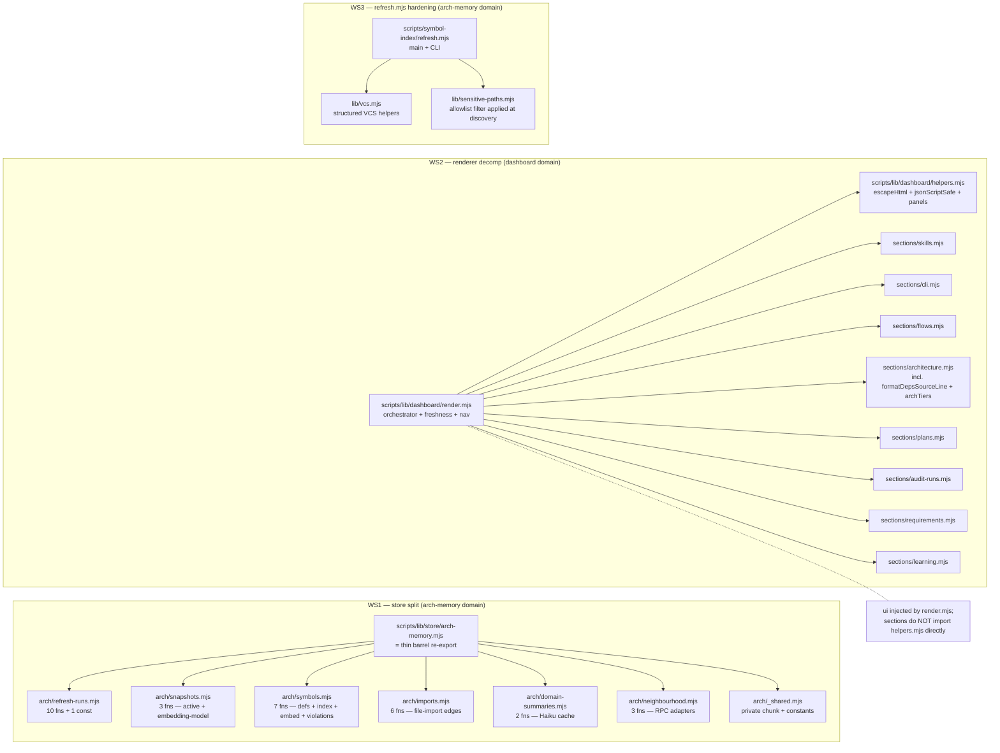

# Plan: Sustainability cleanup batch — god-module split + monolithic renderer decomp + refresh.mjs hardening

- **Date**: 2026-05-22
- **Status**: In Progress — WS1 complete (commit pending), WS2 + WS3 remaining
- **Author**: Claude + Louis
- **Scope**: backend
- **Stack**: js-ts (+ postgres)

## Implementation Log

### 2026-05-22 — WS1 store split complete

**Completed**: All §6 WS1 file-level work — split `scripts/lib/store/arch-memory.mjs` (838 LOC, 31 exports) into thin barrel + 6 sub-modules under `arch/`:

| Sub-module | Exports |
|---|---|
| `arch/refresh-runs.mjs` | 10 (lifecycle + retention; `GET_REFRESH_RUN_COLUMNS` stays file-private) |
| `arch/snapshots.mjs` | 3 (active snapshot + embedding-model config) |
| `arch/symbols.mjs` | 7 (defs + index + embeddings + violations + JOIN read + copy-forward) |
| `arch/imports.mjs` | 6 (file-import graph + populated flag) |
| `arch/domain-summaries.mjs` | 2 (per-domain Haiku cache) |
| `arch/neighbourhood.mjs` | 3 (drift + duplicates + neighbourhood RPC adapters) |
| `arch/_shared.mjs` | constants only (`UPSERT_CHUNK_SIZE`, `IN_CHUNK`, `chunk`) |

Tests: 35 new tests in `tests/arch-memory-split.test.mjs` covering the 31-name manifest, file-privacy of `GET_REFRESH_RUN_COLUMNS`, cross-module separation, and per-fn cloud-disabled neutral-value contract. Full suite **2803/2820 passing**.

**Deviations from the plan**:
- Plan §6 WS1 was meant to be behaviour-preserving (pure refactor). However the pre-existing `recordSymbolEmbedding` had a pgvector serialisation bug (passing JS `number[]` to the generic `upsert()` helper produced text-array `{"0.1",...}` literals that pgvector rejects with SQLSTATE 22P02). The bug was flaky-reproducing on `arch:refresh` (worked some sessions, failed others). Since arch:refresh is the end-to-end smoke for WS1's behaviour-preservation claim, the fix had to land for verification to pass. Rolled it into `arch/symbols.mjs` with a co-located `vectorLiteral()` formatter + raw SQL `[…]::vector` cast. Documented in status.md + commit message.

**Pending**: WS2 (renderer decomp), WS3 (refresh.mjs hardening). Plan §3 sequencing applies.
- **Target domain(s)**: `arch-memory`, `dashboard`, `stores`
- ⚠ **Cross-domain work** — touches 3 domains; each workstream is self-contained within one domain so boundary crossings are minimal.

## 1. Context Summary

Three pre-existing patterns Gemini repeatedly flagged across the observed-deps audit-code cycle (R1-R5 + 4 Gemini reviews) but were deferred as out-of-scope: god-module store file, monolithic dashboard renderer, missing sensitive-path discovery + structured VCS error contract in arch:refresh. None are functional bugs today; all three are sustainability concerns that compound as the repo grows. The pre-existing fact pattern (large files with multiple concerns, ambient error handling on subprocess calls) is documented in their own header comments — the M3 split note in arch-memory.mjs literally says "The largest M3 domain — 18 functions" (now 31 after additions).

### Current state

| File | Lines | Concerns inside | Frozen contract |
|---|---|---|---|
| [scripts/lib/store/arch-memory.mjs](scripts/lib/store/arch-memory.mjs) | 838 | 6 distinct sub-domains (refresh-runs lifecycle, snapshots, symbols, embeddings, imports, domain-summaries, neighbourhood RPCs) | **YES** — 31 exports, all re-exported by `learning-store.mjs` barrel (frozen at 107 names per `tests/learning-store-exports.test.mjs`) |
| [scripts/lib/dashboard/render.mjs](scripts/lib/dashboard/render.mjs) | 607 | 8 section renderers (skills/cli/flows/architecture/plans/auditRuns/requirements/learning) + shared helpers (escapeHtml, panels, freshness banner, nav, renderDocument) | Only `escapeHtml`, `jsonScriptSafe`, `renderDocument` are exported externally; all sections are file-private |
| [scripts/symbol-index/refresh.mjs](scripts/symbol-index/refresh.mjs) | 463 | CLI orchestration + 4 VCS helpers (`gitCommitSha`, `isSafeGitRevision`, `gitDiffWithWorkingTree`, `runJsonLines`) + main loop | No exports — pure CLI entry |

### Neighbourhood considered

Architectural-memory consultation returned 50 candidates, all of them symbols **inside** the three target files (recommendation: `review`). No external near-duplicates → no reuse risk. The candidates are the symbols this plan moves/decomposes; the consultation confirms there's nothing similar elsewhere to converge on.

No prior security incidents matched these paths. No `untaggedPaths`. The architecture-map's `stores`, `dashboard`, `arch-memory` sections are already detailed; the refactor preserves the import surface those sections describe.

## 2. Proposed Architecture



### Key design decisions

1. **arch-memory.mjs becomes a thin barrel** (#1, #5) — file stays at the same path so `learning-store.mjs` barrel and all 18+ existing callers continue to work unchanged. The barrel does `export * from './arch/refresh-runs.mjs'` etc. across 6 sub-modules. **Zero contract change** — the frozen-export test still sees 107 names.

2. **Sub-modules live under `scripts/lib/store/arch/`** (#3 modularity) — sibling of the existing `scripts/lib/store/` 10 atomic modules from M3. The naming `arch/` makes it visually clear these are the arch-memory bundle. Each sub-module owns one cohesive responsibility (the 6 groups identified in §1). Shared internal helpers (`chunk`, `UPSERT_CHUNK_SIZE`, `IN_CHUNK`) move to `arch/_shared.mjs` (underscore-prefix = module-internal).

3. **`scripts/lib/dashboard/render.mjs` stays the public entry** (#5) — only `escapeHtml`, `jsonScriptSafe`, `renderDocument` were ever exported externally. Move the 8 section renderers into `scripts/lib/dashboard/sections/<name>.mjs`. Shared helpers move into a new **`scripts/lib/dashboard/helpers.mjs`** owned by NEITHER `render.mjs` NOR `sections/`. **Imports flow one direction only**: `render.mjs → sections/*.mjs → helpers.mjs`. Sections are FORBIDDEN from importing `render.mjs` (eslint or a unit test enforces this). `render.mjs` re-exports the public surface (`escapeHtml`, `jsonScriptSafe`) from `helpers.mjs` for backward compatibility — no external caller needs to change.

4. **Section module signature is LOCKED — `(viewModel, ui)`** (#3, #20, addresses R1-M3). Every section module exports a single default function with the signature `default(viewModel, ui) → string`. `viewModel` is the section-specific slice of `data` (typed via JSDoc, NOT the whole `data` object — limits coupling). `ui` is a single frozen object `{ escapeHtml, warningPanel, emptyPanel, statusDot, tab, panel, splitUsage }` constructed once in `render.mjs` and passed to every section. NO ambient imports of helpers inside section modules — the `ui` argument is the ONLY way. Locking this prevents drift where one section pulls from `_helpers.mjs` and another from `render.mjs`. A test asserts each section module exports `default` and consumes exactly the documented `ui` keys.

5. **`scripts/lib/vcs.mjs` is a new shared-lib module** (#5, #15, addresses R1-H3) — extracted from `refresh.mjs`. Exports `gitCommitSha(cwd)`, `gitDiffWithWorkingTree(cwd, sinceCommit)`, `isSafeGitRevision(s)`, `runJsonLines(cmd, args, opts)`. Returns the **structured contract**:

   ```js
   // gitDiffWithWorkingTree success
   { ok: true, files: { added: string[], modified: string[], deleted: string[], untracked: string[], renamed: {from: string, to: string}[] } }
   // failure
   { ok: false, error: { code: ErrorCode, message: string, cause?: Error } }
   ```

   **`ErrorCode` is a closed enum** (locked at design time — see the typedef in WS3 below; addresses R2-H1 by splitting the original umbrella `GIT_UNAVAILABLE` into precise causes). Mapping to CLI exit codes via `vcs.exitCodeFor(code)`:

   | code | exit | retryable | meaning |
   |---|---|---|---|
   | `GIT_BINARY_MISSING` | 127 | no | `git` not on PATH |
   | `NOT_A_GIT_REPOSITORY` | 5 | no | cwd outside a git repo |
   | `BAD_REVISION` | 4 | no | `--since-commit` value doesn't resolve |
   | `WORKING_TREE_UNREADABLE` | 5 | no | git ls-files / diff exec succeeded but output unreadable |
   | `EXEC_FAILED` | 1 | YES | subprocess crashed (signal, OOM, transient FS) |

   The `isSafeGitRevision` regex change shipped previously stays — pure relocation; it's a plain boolean predicate, not part of the structured contract.

   **Renamed files carry pairs** through the entire pipeline. The categorised diff shape preserves rename `{from, to}` objects so the sensitive-path filter can check BOTH endpoints (a sensitive rename from `src/foo.ts → .env.local` must be filtered out as sensitive). The filter API consumes the categorised diff in, produces a categorised diff out (see §2 #6 for the filter shape).

6. **`scripts/lib/sensitive-paths.mjs` is a new shared-lib module — TWO CATEGORIES** (#5, #15, addresses R1-H4 + R1-M1 + R1-H2). Categories are explicit; consumers opt in to the set they need:

   - **`sensitive`** — egress-sensitive paths that MUST NEVER leak to logs, embeddings, LLM prompts, or `audit-loop` egress: `.env*`, `*.env`, `secrets/**`, `*.pem`, `*.key`, `*.p12`, `*.pfx`, `.aws/**`, `.ssh/**`, `credentials.json`, `id_rsa`, `id_ed25519`. Path-normalised first so `C:\repo\.env` and `/Users/.../repo/.env` both match.
   - **`generatedNoise`** — non-sensitive but high-volume autogenerated files that hurt the symbol index without adding signal: `package-lock.json`, `yarn.lock`, `pnpm-lock.yaml`, `bun.lockb`, `*.min.js`, `*.map`.

   API:
   ```js
   export const SENSITIVE_PATTERNS = [...];  // category: 'sensitive'
   export const GENERATED_NOISE_PATTERNS = [...];  // category: 'generatedNoise'
   export function classifyPath(path) → 'sensitive' | 'generatedNoise' | null;
   export function filterDiffFiles(diff, categories) → { diff, skipped };
   //   diff: the {added, modified, deleted, renamed, untracked} shape from vcs.mjs
   //   categories: ['sensitive']  // refresh.mjs egress; STRICT
   //              | ['sensitive', 'generatedNoise']  // refresh.mjs full skip set
   //   returns the same diff shape minus filtered entries; skipped: [{path, category, pattern}]
   //   For renamed files: drop the pair if EITHER endpoint matches a filtered category
   ```

   Egress-sensitive consumers (e.g. future LLM-prompt builders) opt into `['sensitive']` only. The refresh pipeline opts into both. The category split means a future logging-redactor can confidently use only the `sensitive` set without accidentally treating `package-lock.json` as a secret.

   **SCOPE: this PR migrates the three current inline consumers** so the "single source of truth" claim is real (R1-H4): (a) `scripts/symbol-index/extract.mjs::skip-path` runtime check, (b) `scripts/lib/quickfix-patterns.mjs::SENSITIVE_FILE_PATTERN`, (c) `scripts/lib/audit-scope.mjs` sensitive-file regex. Each gets a one-line replacement importing the canonical predicate. If a consumer needs an extra category not modelled here, this PR ADDS the category to `sensitive-paths.mjs` rather than re-inlining a list.

7. **All three workstreams ship sequentially in separate commits** (#11, #16) — full test suite must stay green after EACH commit. WS1 first (refactor without behaviour change), WS2 second (refactor without behaviour change), WS3 third (one new public file + one new contract + one main() rewrite that has behaviour change). This sequencing means the highest-risk change (WS3 behaviour) lands LAST when the other refactors are already proven stable.

### Public-CLI contract change blast radius (R1-H3)

`scripts/symbol-index/refresh.mjs` is invoked from:

| Caller | Today's expectation | Post-WS3 behaviour |
|---|---|---|
| `npm run arch:refresh` (operator CLI) | exit 0 on any non-fatal path, even when git diff fails silently | exit 0 only on `ok:true`. New non-zero exits per WS3 typedef: 4 (BAD_REVISION), 5 (NOT_A_GIT_REPOSITORY / WORKING_TREE_UNREADABLE), 127 (GIT_BINARY_MISSING), 1 (EXEC_FAILED — retryable). Stderr carries `[refresh] vcs failure: <code> — <message>` |
| `npm run arch:refresh:full` | same as above; passes `--full` | passes through the SAME skip policy via `shouldSkipForIndexing` (R3-H3 parity). The full-refresh path uses `git ls-files` directly — the helper is applied there too, NOT just on the incremental diff. |
| `npm run dashboard:setup` (chain) | passes through arch:refresh exit code | inherits the new non-zero codes; the chain `&&` already stops on first failure (correct behaviour) |
| `npm run arch:refresh -- --since-commit <X>` | silently returns empty diff on bad ref | exits 4 (BAD_REVISION). **This is the only behaviour change a human operator would notice.** |
| `arch:refresh` from outside a repo (operator mistake) | silent | exits 5 (NOT_A_GIT_REPOSITORY) |
| `arch:refresh` when `git` is missing from PATH (CI without git) | silent / undefined | exits 127 (GIT_BINARY_MISSING) |
| `.github/workflows/*.yml`, cron, pre-push hooks | grep for "command not found" / exit 0 implicit success | grep `claude-engineering-skills/.github/workflows/` + `.git/hooks/pre-push` + `scripts/install-prepush-hook.mjs` — inventory all `arch:refresh` invocations in this PR, document each in the implementation log |

**Action**: before the WS3 implementation commit, grep all `arch:refresh` callers and add the inventory to the implementation log. If any caller relies on exit-0-on-failure semantics (e.g. background cron that tolerates flakes), update that caller to either (a) handle the retryable `EXEC_FAILED` (code 1) with backoff, or (b) deliberately ignore terminal codes 4/5/127 rather than implicit silence.

## 3. Execution Model (Phase 1.5)

**Are any planned operations dependent on others?** All three workstreams are **independent** at the implementation level — no file shared across two workstreams (arch-memory.mjs is WS1-only, render.mjs is WS2-only, refresh.mjs is WS3-only). The only shared touchpoint is the test suite, which must pass after each commit.

### Sequencing

| Order | Workstream | Atomicity boundary | Failure semantics |
|---|---|---|---|
| 1 | WS1 — store split | One commit per sub-module move + barrel update + tests green | If frozen-export test breaks → revert just that sub-module move; barrel structure stays |
| 2 | WS2 — renderer decomp | One commit per section move + tests green | Section moves are independent; revert one section without rolling back others |
| 3 | WS3 — refresh.mjs hardening | Three sub-commits: (a) extract `lib/vcs.mjs` no behaviour change; (b) add `lib/sensitive-paths.mjs` + apply at discovery; (c) rewrite `gitDiffWithWorkingTree` callers to handle structured `{ok, files, error}` | Each sub-commit independently revertable; (b) is the only one with observable behaviour change |

### Concurrency model

Sub-modules within a workstream can be split across multiple commits (e.g. one commit per arch/ sub-module). Workstream commits MUST be serial — running both WS1 + WS3 in parallel is fine for independent branches but should land sequentially on main to keep bisect clean.

### Partial failure recovery

- WS1: if a sub-module move breaks an import in a caller file (>30 callers across the repo), revert the move, fix the caller, re-attempt.
- WS2: if a section move breaks the rendered HTML output (caught by `tests/dashboard.test.mjs`), revert that section.
- WS3: structured `{ok, files, error}` is a contract change for `main()`. If subprocess error handling regresses (caught by `tests/refresh.test.mjs` if it exists, otherwise by `npm run arch:refresh` smoke), revert (c) only.

## 4. Engineering Principles Applied

| # | Principle | How it shows up |
|---|---|---|
| #1 | DRY | Renderer helpers (`escapeHtml`, panels) imported by every section instead of duplicated; one canonical `SENSITIVE_PATHS` module replaces inline literal lists across extract.mjs / requirements.mjs / debt-capture |
| #3 | Modularity | Three workstreams each take one over-large file and decompose into single-responsibility modules |
| #5 | Single Source of Truth | `SENSITIVE_PATHS` allowlist owned by `lib/sensitive-paths.mjs`; VCS commands centralised in `lib/vcs.mjs` |
| #6 | Open/Closed | Adding a new dashboard section = add `sections/<name>.mjs` + register in `renderDocument`. No edits to existing sections. Adding a new arch-memory function = pick the right sub-module; no growth of the god module |
| #11 | Testability | Each sub-module + each section module unit-testable in isolation; vcs.mjs structured contract enables injectable stubs |
| #15 | Graceful Degradation | `gitDiffWithWorkingTree` structured `{ok, files, error}` lets callers distinguish "no diff" from "git missing" rather than collapsing both to empty |
| #16 | Error Handling | Structured VCS contract surfaces error codes (`ENOENT`, `EXEC_FAILED`, `BAD_REVISION`) instead of swallowed exit-code-checks |
| #18 | Backward Compat | arch-memory.mjs barrel keeps every existing import path working; learning-store.mjs frozen-export test catches accidental drops |
| #19 | Observability | refresh.mjs logs `[sensitive]` skip events with the matching pattern so operators see what was filtered |
| #20 | Long-Term Flexibility | New seams (sections, vcs, sensitive-paths) compose well — future dashboard tabs, new VCS backends, new sensitive-path consumers slot in without touching existing code |

## 5. Long-Term Sustainability

- **Assumptions that could change**: rule set for sensitive paths may grow (new credential file formats); VCS-error taxonomy may need codes we don't anticipate today. Both are open-ended; the `SENSITIVE_PATHS` array + the `error.code` enum are extension points.
- **Coupling**: barrel re-exports keep the public contract decoupled from internal layout. Sub-module names ARE part of the implementation detail; callers must continue to import from `learning-store.mjs` (the public seam).
- **Migration path**: if the renderer ever needs to ship multiple themes / outputs (JSON, RSS), the per-section modules are the natural seam — each section gains a `(data, helpers, format)` signature.
- **What we WON'T do**: turn arch-memory sub-modules into separate npm packages, introduce dependency injection containers, replace the `pg` driver. These are over-engineering for the current need.

## 6. File-Level Plan

### Workstream 1 — store split

#### Export-ownership matrix (LOCKED — addresses R1-M2)

Every one of the 31 current `arch-memory.mjs` exports MUST appear exactly once in the destination column below. Implementation MUST match this table exactly; any deviation requires re-auditing the plan.

| # | Export | Destination module | Rationale |
|---|---|---|---|
| 1 | `openRefreshRun` | `arch/refresh-runs.mjs` | refresh_runs lifecycle |
| 2 | `publishRefreshRun` | `arch/refresh-runs.mjs` | refresh_runs lifecycle |
| 3 | `abortRefreshRun` | `arch/refresh-runs.mjs` | refresh_runs lifecycle |
| 4 | `heartbeatRefreshRun` | `arch/refresh-runs.mjs` | refresh_runs lifecycle |
| 5 | `getRefreshRun` (only; `GET_REFRESH_RUN_COLUMNS` stays **file-private** inside `arch/refresh-runs.mjs`, NOT re-exported — Gemini-r2-G1) | `arch/refresh-runs.mjs` | refresh_runs read API |
| 6 | `findStaleRunningRefresh` | `arch/refresh-runs.mjs` | refresh_runs read |
| 7 | `listPrunableRefreshRuns` | `arch/refresh-runs.mjs` | refresh_runs retention |
| 8 | `deleteRefreshRuns` | `arch/refresh-runs.mjs` | refresh_runs retention |
| 9 | `demoteRefreshRuns` | `arch/refresh-runs.mjs` | refresh_runs retention |
| 10 | `listRollbacksForRepo` | `arch/refresh-runs.mjs` | refresh_runs read by repo |
| 11 | `getActiveSnapshot` | `arch/snapshots.mjs` | active-refresh pointer + embedding-model joined read |
| 12 | `setActiveEmbeddingModel` | `arch/snapshots.mjs` | embedding-model write (sibling of getActiveSnapshot's join target) |
| 13 | `getActiveEmbeddingModel` | `arch/snapshots.mjs` | embedding-model read |
| 14 | `recordSymbolDefinitions` | `arch/symbols.mjs` | symbol_definitions write |
| 15 | `recordSymbolIndex` | `arch/symbols.mjs` | symbol_index write |
| 16 | `recordSymbolEmbedding` | `arch/symbols.mjs` | symbol_embeddings write (uses pgvector literal — pre-existing helper) |
| 17 | `recordLayeringViolations` | `arch/symbols.mjs` | symbol_layering_violations write |
| 18 | `listSymbolsForSnapshot` | `arch/symbols.mjs` | symbol_index read (JOIN with symbol_definitions) |
| 19 | `listLayeringViolationsForSnapshot` | `arch/symbols.mjs` | violations read |
| 20 | `copyForwardUntouchedFiles` | `arch/symbols.mjs` | incremental refresh: carry symbols across snapshots |
| 21 | `recordSymbolFileImports` | `arch/imports.mjs` | symbol_file_imports write |
| 22 | `copyForwardImports` | `arch/imports.mjs` | incremental refresh: carry import edges |
| 23 | `listFileImportsForSnapshot` | `arch/imports.mjs` | import-graph read (this PR's predecessor introduced this) |
| 24 | `markImportGraphPopulated` | `arch/imports.mjs` | import-graph populated flag |
| 25 | `getImportGraphPopulated` | `arch/imports.mjs` | import-graph populated flag read |
| 26 | `getImportersForFiles` | `arch/imports.mjs` | importer lookup |
| 27 | `upsertDomainSummary` | `arch/domain-summaries.mjs` | per-domain Haiku cache write |
| 28 | `getDomainSummaries` | `arch/domain-summaries.mjs` | per-domain Haiku cache read |
| 29 | `callNeighbourhoodRpc` | `arch/neighbourhood.mjs` | neighbourhood RPC adapter |
| 30 | `computeDriftScore` | `arch/neighbourhood.mjs` | drift RPC adapter |
| 31 | `getTopDuplicateClusters` | `arch/neighbourhood.mjs` | duplicate-cluster RPC adapter |

**Count check**: 11 (incl. row 5 = `getRefreshRun` only) + 3 + 7 + 6 + 2 + 3 = **31** exports — matches the current arch-memory.mjs export count. `GET_REFRESH_RUN_COLUMNS` is file-private (always was) and stays so; the test manifest below asserts exactly 31 PUBLIC functions, no const.

#### File layout

- **NEW** `scripts/lib/store/arch/_shared.mjs` — **narrowly scoped to arch-specific constants** only (addresses R2-M3): `UPSERT_CHUNK_SIZE`, `IN_CHUNK`, `chunk(arr, n)`. **No re-exports** of generic db primitives — each sub-module imports `many`, `one`, `insertReturning`, `updateWhere`, `upsert` directly from `'../../db/query.mjs'` and `getPool` from `'../../db/client.mjs'` and `isCloudEnabled` from `'../repo.mjs'`. This keeps `_shared.mjs` at ~15 lines and prevents it from becoming a new god-tier file.
- **NEW** `scripts/lib/store/arch/refresh-runs.mjs` — entries 1-10 (10 fns + 1 const)
- **NEW** `scripts/lib/store/arch/snapshots.mjs` — entries 11-13 (3 fns)
- **NEW** `scripts/lib/store/arch/symbols.mjs` — entries 14-20 (7 fns)
- **NEW** `scripts/lib/store/arch/imports.mjs` — entries 21-26 (6 fns)
- **NEW** `scripts/lib/store/arch/domain-summaries.mjs` — entries 27-28 (2 fns)
- **NEW** `scripts/lib/store/arch/neighbourhood.mjs` — entries 29-31 (3 fns)
- **EDIT** `scripts/lib/store/arch-memory.mjs` — becomes a thin barrel: `export * from './arch/refresh-runs.mjs'` × 6. Plus a header comment explaining the split, the matrix above, and why the file stays at this path (barrel for the `learning-store.mjs` frozen contract).

**Tests**:
- `tests/learning-store-exports.test.mjs` — passes unchanged (107 frozen names re-export through the barrel through `learning-store.mjs`).
- **NEW** lightweight per-sub-module smoke test confirming the public functions still resolve through the barrel: `tests/arch-memory-split.test.mjs` asserts every name listed in §6 above is `typeof === 'function'` when imported from `scripts/lib/store/arch-memory.mjs`.

### Workstream 2 — renderer decomp

#### File layout

- **NEW** `scripts/lib/dashboard/helpers.mjs` (addresses R1-H1 + R3-M1) — the **only** module that defines `escapeHtml`, `jsonScriptSafe`, `statusDot`, `tab`, `panel`, `warningPanel`, `emptyPanel`, `splitUsage`. **Imported only by `render.mjs`** — NOT by any section module. Sections receive the helper bundle via the `ui` argument. **No other helper module exists.**
- **NEW** `scripts/lib/dashboard/sections/skills.mjs` — `export default sectionSkills(viewModel, ui)` where `viewModel = data.skills`, `ui = {escapeHtml, warningPanel, emptyPanel, statusDot, tab, panel, splitUsage}` (frozen object built in render.mjs)
- **NEW** `scripts/lib/dashboard/sections/cli.mjs` — `export default sectionCli(viewModel, ui)` where `viewModel = {cli: data.cli, sources: data.sources}`
- **NEW** `scripts/lib/dashboard/sections/flows.mjs` — `export default sectionFlows(viewModel, ui)` where `viewModel = {flows: data.flows, sources: data.sources}`
- **NEW** `scripts/lib/dashboard/sections/architecture.mjs` — `export default sectionArchitecture(viewModel, ui)` + co-located `archTiers`, `formatDepsSourceLine`, `ARCH_TIER_LABELS`
- **NEW** `scripts/lib/dashboard/sections/plans.mjs` — `export default sectionPlans(viewModel, ui)` + co-located `planList`
- **NEW** `scripts/lib/dashboard/sections/audit-runs.mjs` — `export default sectionAuditRuns(viewModel, ui)` (telemetry kind)
- **NEW** `scripts/lib/dashboard/sections/requirements.mjs` — `export default sectionRequirements(viewModel, ui)` (telemetry kind)
- **NEW** `scripts/lib/dashboard/sections/learning.mjs` — `export default sectionLearning(viewModel, ui)` (telemetry kind)
- **EDIT** `scripts/lib/dashboard/render.mjs` — keeps `freshnessBanner`, `nav`, `renderDocument`. **Re-exports** `escapeHtml` + `jsonScriptSafe` from `helpers.mjs` for backward-compat (existing callers in tests + other scripts import them from render.mjs). The orchestrator builds the `ui` object once, imports each section's default, calls them in `renderDocument` with the relevant `(viewModel, ui)`. Shrinks from 607 lines to ~150.

#### Imports — one-way only (no circular dependency, no helper drift)

**LOCKED contract** (addresses R2-H2): `render.mjs → helpers.mjs` AND `render.mjs → sections/*.mjs`. Section modules MUST NOT import `helpers.mjs` directly — they receive helpers via the `ui` argument. Same applies in reverse: `helpers.mjs` MUST NOT import any section module nor `render.mjs`.

**Enforced by a hermetic unit test, NOT a dep-cruiser CLI step** (addresses R2-M2 + Gemini-r4-G3 — dep-cruiser is currently used programmatically only inside `arch-intent`; introducing a top-level `.dependency-cruiser.cjs` config + `npm run check` integration is a surface-area expansion this plan should avoid). The test in `tests/dashboard-section-contract.test.mjs` programmatically asserts the boundary:

```js
import fs from 'node:fs';
import path from 'node:path';

const SECTIONS_DIR = 'scripts/lib/dashboard/sections';
const FORBIDDEN_TARGETS = ['../render.mjs', './render.mjs', '../helpers.mjs', './helpers.mjs'];

for (const file of fs.readdirSync(SECTIONS_DIR)) {
  const src = fs.readFileSync(path.join(SECTIONS_DIR, file), 'utf-8');
  for (const target of FORBIDDEN_TARGETS) {
    assert.ok(!src.includes(`from '${target}'`), `${file} must not import ${target}`);
    assert.ok(!src.includes(`from "${target}"`), `${file} must not import ${target}`);
  }
}
// Symmetric: helpers.mjs imports nothing from sections/ or render
const helpers = fs.readFileSync('scripts/lib/dashboard/helpers.mjs', 'utf-8');
assert.ok(!helpers.includes("from './sections/"));
assert.ok(!helpers.includes("from './render"));
```

This is reliably deterministic, runs under `npm test`, requires no new tooling. If a future enforcement need outgrows substring checks (e.g. detecting `await import('./render.mjs')` dynamic imports), THAT'S when to invest in dep-cruiser CLI wiring — not this PR.

**`ui` is internal to `render.mjs`** — not re-exported as part of the public surface. The architecture-contract test imports it via a non-public test helper (`scripts/lib/dashboard/_test-helpers.mjs` exporting `buildUiForTest()`) rather than widening `render.mjs`'s public API.

**Tests**: existing `tests/dashboard.test.mjs` + `tests/dashboard-cli.test.mjs` must remain byte-identical output (the deterministic-render test is the contract gate). Plus see §8 for per-WS behavioral additions.

### Workstream 3 — refresh.mjs hardening

#### NEW `scripts/lib/vcs.mjs`

Exports `gitCommitSha`, `gitDiffWithWorkingTree`, `isSafeGitRevision`, `runJsonLines`, plus the `exitCodeFor(errorCode)` mapper. **Closed `ErrorCode` enum** and full structured contract:

```js
/**
 * R2-H1: split umbrella `GIT_UNAVAILABLE` into precise causes. Each code
 * has distinct exit-code + retryability semantics:
 *   - GIT_BINARY_MISSING: `git` not on PATH — terminal, exit 127, never retryable
 *   - NOT_A_GIT_REPOSITORY: cwd outside a git repo — terminal, exit 5
 *   - BAD_REVISION: passed --since-commit doesn't resolve — terminal, exit 4
 *   - WORKING_TREE_UNREADABLE: git ls-files / diff failed — terminal, exit 5
 *   - EXEC_FAILED: subprocess crashed (signal / OOM) — retryable (transient), exit 1
 */
/** @typedef {'GIT_BINARY_MISSING' | 'NOT_A_GIT_REPOSITORY' | 'BAD_REVISION' | 'WORKING_TREE_UNREADABLE' | 'EXEC_FAILED'} VcsErrorCode */

/** @typedef {{ added: string[], modified: string[], deleted: string[],
 *              untracked: string[], renamed: {from: string, to: string}[] }} DiffShape */

/** @returns {{ok: true, sha: string} | {ok: false, error: {code: VcsErrorCode, message: string, cause?: Error}}} */
export function gitCommitSha(cwd) { /* ... */ }

/** @returns {{ok: true, files: DiffShape} | {ok: false, error: {code: VcsErrorCode, message: string, cause?: Error}}} */
export function gitDiffWithWorkingTree(cwd, sinceCommit) { /* ... */ }

/** boolean predicate — pre-existing, unchanged semantics */
export function isSafeGitRevision(s) { /* ... */ }

/** retryable classification — only transient subprocess crashes retry */
export const RETRYABLE_VCS_ERRORS = new Set(['EXEC_FAILED']);

/** code → CLI exit code mapping (see §2 #7 blast-radius table) */
export function exitCodeFor(code) { /* ... */ }
```

**`runJsonLines` stays in `refresh.mjs` as a file-private helper, NOT moved to `vcs.mjs`** (Gemini-r4-G2). It's a generic subprocess helper that happens to invoke `extract.mjs` (a Node child process), and has nothing to do with version control — putting it in `vcs.mjs` would degrade module cohesion. If a future caller needs JSON-lines subprocess parsing, extract it then to a `scripts/lib/subprocess.mjs` (YAGNI today).

#### NEW `scripts/lib/sensitive-paths.mjs`

Two-category contract per §2 #6. Path normalisation runs first (`\` → `/`, lowercase on Windows). Regex patterns:

```
SENSITIVE_PATTERNS — STRICT SUPERSET of the current quickfix-patterns.mjs +
sensitive-egress-gate.mjs sets (Gemini-G1 + Gemini-r2-G2):
  /(^|\/)\.env(\..+)?$/                                        # .env, .env.production, etc.
  /(^|\/)\.env\.local$/                                        # explicit local override
  /(^|\/)[^/]+\.env$/                                          # foo.env style
  /(^|\/)secrets?(\..+)?$/                                     # secrets, secrets.json, secret.yaml — Gemini-r4-G1: legacy **/secrets* matched bare-name files
  /(^|\/)credentials?(\..+)?$/                                 # credential, credentials, credentials.yaml — Gemini-r4-G1: legacy **/credentials* matched bare-name files
  /\.(pem|key|crt|cer|der|p12|pfx|gpg|asc)$/i                  # cert/key bundles — incl. .cer/.der (X.509 binary) + .gpg/.asc (GPG) from egress-gate (Gemini-r2-G2)
  /(^|\/)(secrets|credentials|private|\.aws|\.ssh)\//          # well-known sensitive directories — incl. **/private/** from egress-gate (Gemini-r2-G2)
  /(^|\/)id_rsa.*$/                                            # ssh keys — wildcard suffix (id_rsa.pub, id_rsa.bak) from egress-gate (Gemini-r2-G2)
  /(^|\/)id_ed25519.*$/                                        # ed25519 ssh keys — wildcard suffix

GENERATED_NOISE_PATTERNS:
  /(^|\/)package-lock\.json$/   /(^|\/)yarn\.lock$/
  /(^|\/)pnpm-lock\.yaml$/      /(^|\/)bun\.lockb$/
  /\.min\.js$/                  /\.map$/
```

**Superset gate (Gemini-G1, Gemini-r3-G1)**: implementation MUST include an automated test that pre-existing inline patterns from `quickfix-patterns.mjs::SENSITIVE_PATH_PATTERNS` and `sensitive-egress-gate.mjs::DEFAULT_PATH_DENYLIST` are all covered by the new canonical set. For each legacy pattern, generate a positive-case fixture path and assert `classifyPath(p) !== null` (matches EITHER `'sensitive'` OR `'generatedNoise'` — since legacy patterns merged both concepts under one denylist, the new two-category split is still a superset as long as every legacy pattern lands in at least ONE category). The test ALSO asserts the per-pattern category-mapping table:

| Legacy pattern | New category |
|---|---|
| `**/private/**`, `**/*.cer`, `**/*.der`, `**/*.gpg`, `**/*.asc`, `**/id_rsa*`, all `secrets*`/`credentials*` | `sensitive` |
| `**/*.lock`, `**/package-lock.json`, `**/*.min.js`, `**/*.map` | `generatedNoise` |

If a legacy pattern doesn't have a covering match in EITHER category, the test fails.

Plus negative-test fixtures (e.g. `src/env-config.ts` MUST NOT match `.env`; `src/keystore.ts` MUST NOT match `.key$`; `src/credential-helper.ts` MUST NOT match `credentials.*`).

#### EDIT `scripts/symbol-index/refresh.mjs`

1. Imports `vcs.mjs` + `sensitive-paths.mjs`. Original helpers deleted (moved to vcs.mjs). **All existing call sites updated for the new structured return shapes** (Gemini-G2):

   - `gitCommitSha(repoRoot)` (existing call site at refresh.mjs in the `openRefreshRun({walkStartCommit: ...})` chain) returns `{ok, sha} | {ok, error}`. Update to: `const sha = vcs.gitCommitSha(repoRoot); const walkStartCommit = sha.ok ? sha.sha : null;` — preserves the nullable-string-for-walkStartCommit semantics the store expects. **A `!sha.ok` result is NOT fatal at this call site** (the snapshot walk-anchor is informational; the refresh can proceed without it).
   - All call sites that previously did `const sha = gitCommitSha(); if (sha) { ... }` get re-shaped to destructure `{ok, sha}` first.
   - The test fixture (`tests/refresh-cli-contract.test.mjs`) covers the `!ok` path for `gitCommitSha` — confirms the store still gets a `null` walkStartCommit when git fails, not a malformed object.

2. `main()` calls `vcs.gitDiffWithWorkingTree(...)` and switches on `{ok}`:
   - `ok: true` → call `filterDiffFiles(files, ['sensitive', 'generatedNoise'])` (refresh opts into both categories); log per **§6 sensitive-log redaction policy** (below); pass the filtered diff to the extractor.
   - `ok: false` → write structured stderr `[refresh] vcs failure: ${error.code} — ${error.message}`; `process.exit(vcs.exitCodeFor(error.code))`.
3. **State-aware filtering across ALL diff categories** (addresses R3-H2 + Gemini-r3-G3 — generalised to deletes/modifies, not just renames):

   The naive blanket-drop is a **data-leak risk**. If `git diff` reports `deleted: ['.env']` and the filter drops that entry, the indexer never gets the tombstone signal — prior `.env` symbol rows persist in the database. Same for `modified` — the indexer never updates, leaving stale rows. Generalised state-aware rewriting per category:

   | Diff entry | Path matches filter? | Rewritten entry |
   |---|---|---|
   | `added: [p]` | yes | dropped (no prior state to clean — file never indexed) |
   | `added: [p]` | no | preserved |
   | `modified: [p]` | yes | **emitted as `deleted: [p]`** — signal that the indexer must tombstone prior content (file is sensitive now; whatever was indexed must be wiped) |
   | `modified: [p]` | no | preserved |
   | `deleted: [p]` | yes | **preserved in `deleted: [p]`** (the indexer NEEDS this signal to tombstone the symbol rows; suppressing it leaves them in the DB) |
   | `deleted: [p]` | no | preserved |
   | `untracked: [p]` | yes | dropped (never indexed) |
   | `untracked: [p]` | no | preserved |
   | `renamed: [{from, to}]` | from yes, to yes | dropped |
   | `renamed: [{from, to}]` | from yes, to no | emitted as `added: [to]` (from was never indexed; to is newly visible) |
   | `renamed: [{from, to}]` | from no, to yes | **emitted as `deleted: [from]`** — symbol rows for `from` must be cleaned up; `to` not indexed |
   | `renamed: [{from, to}]` | from no, to no | preserved as rename |

   Tests cover all 12 cases. The `filterDiffFiles` helper produces a `skipped: [{path, category, pattern, action: 'dropped' | 'rewritten-delete' | 'rewritten-add' | 'preserved-as-tombstone'}]` array so the operator log distinguishes the cases. The `preserved-as-tombstone` action specifically logs "filter classified `<path>` as `<category>`; preserved in `deleted` so indexer can tombstone prior content" — visibility into why a sensitive path is still appearing in the downstream diff.

   **Property test** added: feed any diff through `filterDiffFiles` twice; the second invocation produces no further changes (idempotent). Catches accidental state-machine bugs where rewriting introduces re-classifiable entries.

#### Sensitive-log redaction policy (addresses R2-M5)

Logging exact paths of sensitive files leaks information even when the file CONTENTS never egress — a path like `/srv/secrets/api-key-prod-2026-q2.pem` encodes environment, year, customer cohort.

**Canonical contract — applies to ALL consumers, not just refresh.mjs** (addresses R3-H4). The redaction formatter is owned by `sensitive-paths.mjs`; all migrated consumers (refresh.mjs, extract.mjs, audit-scope.mjs, quickfix-patterns.mjs) MUST emit sensitive-skip log lines via this formatter. Raw-path logging for `category: sensitive` paths is a contract violation — caught by a dep-cruiser rule + a code-audit pass.

```js
/**
 * @param {SkipEntry[]} skipped
 * @param {{debug?: boolean, logger?: string}} opts  — logger is the prefix like 'refresh'/'extract'
 * @returns {string[]}  array of formatted log lines, ready for stderr.write
 */
export function formatSkipLog(skipped, { debug = false, logger = 'sensitive-paths' } = {}) { ... }
```

**Default behaviour** (no `SENSITIVE_PATHS_DEBUG=1` env):
- `category: 'sensitive'` skips: aggregated only — `[<logger>] sensitive-skip: <count> files (category=sensitive, patterns=[...])`. Path NEVER logged.
- `category: 'generatedNoise'` skips: full path logged (these aren't secret) — `[<logger>] noise-skip: <path> (matched <pattern>)`.

**With `SENSITIVE_PATHS_DEBUG=1` env** (operator-opt-in, applies process-wide so all consumers debug uniformly) — addresses Gemini-G4 (basenames encode secrets too):
- Sensitive skips log **only the file extension + a content hash**: `[<logger>] sensitive-skip: [redacted:<sha256(path).slice(0,8)>].<ext> (matched <pattern>)`. Example: `/srv/secrets/api-key-prod-2026-q2.pem` → `[<logger>] sensitive-skip: [redacted:a4f2c901].pem (matched /\.pem$/i)`. The 8-char hash is **stable** across runs for the same path so an operator can correlate two log lines as referring to the same file without learning the path.
- A loud `[<logger>] WARNING: SENSITIVE_PATHS_DEBUG enabled; sensitive skips log redacted hashes only — basenames are NOT shown. To inspect a specific path, grep the working tree directly.` banner once per process.

**No mode** for "full unredacted paths" or "masked basename". The hash-only form is the maximum diagnostic — basenames can encode environment/customer/year/cohort and must NEVER leak even at debug verbosity.

`formatSkipLog` accepts an injectable `hashFn` for testability (deterministic stub in tests); production uses `crypto.createHash('sha256')`.

**Tests**:
- `tests/sensitive-paths.test.mjs::formatSkipLog default aggregates sensitive skips` — assert no log line contains the raw sensitive path, basename, or any path substring under default config; aggregated count line present.
- `tests/sensitive-paths.test.mjs::formatSkipLog debug emits hash + ext only` — assert masked form is `[redacted:<hex8>].<ext>`, no basename leaked, hash stable across calls for the same path.
- `tests/sensitive-paths.test.mjs::generatedNoise never aggregated` — assert noise paths always shown in full (they're not secret).
- **Superset gate** (Gemini-G1): for every regex in the legacy `quickfix-patterns.mjs::SENSITIVE_PATH_PATTERNS` array AND `sensitive-egress-gate.mjs::DEFAULT_PATH_DENYLIST` array, generate a synthetic positive-case path and assert `classifyPath(p) === 'sensitive'`. Hardcoded list of (legacy-pattern, fixture-path) pairs lives in the test file; if a legacy pattern doesn't have a covering match in the new set, the test fails.

**Dep-cruiser rule**: forbid `process.stderr.write` (or any logger) on a string containing `<path>` in a context where the path crossed `filterDiffFiles` and was classified sensitive. This rule is harder to enforce statically — we rely on the formatter being the only sanctioned exit route + a code-audit pass on the consumer migration commit.
4. The cleanup-on-early-exit pattern from the prior persona-test-driven fix (`cleanupStaleObservedDeps`) is preserved — VCS failures also clear stale observed-deps for the same reason.

#### Consumer migrations for "single source of truth" (addresses R1-H4)

In the SAME WS3 commit, switch these **four** existing inline consumers to delegate to `sensitive-paths.mjs` (Gemini-G3 added the fourth):

- **EDIT** `scripts/symbol-index/extract.mjs` — replace the inline `skip-path` check with `shouldSkipForIndexing(rel, ['sensitive'])` (addresses Gemini-r2-G3 — same predicate as `refresh.mjs::main()` full-refresh path; single canonical entry). **Log lifecycle**: accumulate skipped entries in a `const skipped = []` local during the file-iteration loop; emit ONE `formatSkipLog(skipped, {logger: 'extract'})` block at end of file processing — never per-file. This matches the redaction policy (aggregate by default, never one-line-per-sensitive-path). `generatedNoise` is already filtered upstream by refresh.mjs so extract.mjs only ever needs the `['sensitive']` category — defense in depth.
- **EDIT** `scripts/lib/quickfix-patterns.mjs` — replace `SENSITIVE_PATH_PATTERNS` array with `isSensitivePath(filePath)` from the canonical module. Drop the inline regex list. Existing tests in `tests/quickfix-patterns.test.mjs` cover the negative cases; new superset gate (above) covers the positive ones.
- **EDIT** `scripts/lib/audit-scope.mjs` — replace the sensitive-file regex with a call to `classifyPath(p) === 'sensitive'`. The audit-scope module's own tests cover the diff-scope sensitive-filter path.
- **EDIT** `scripts/lib/sensitive-egress-gate.mjs` (Gemini-G3, refined by Gemini-r3-G2) — the existing `isPathSensitive(filePath, denylist)` function and `DEFAULT_PATH_DENYLIST` array delegate to the canonical module. Implementation: `isPathSensitive` becomes `return classifyPath(filePath) !== null` — **blocks BOTH `sensitive` AND `generatedNoise`** categories from LLM egress (lockfiles in prompts blow context windows without adding signal, even though they aren't secrets — preserves the legacy denylist's behaviour exactly). `DEFAULT_PATH_DENYLIST` is removed. The egress gate's strict-superset behaviour is verified by a dedicated test that runs the legacy fixture set through the new gate and asserts every legacy-blocked path is still blocked.

After these migrations the `sensitive-paths.mjs` claim of "single source of truth" is true and verifiable via `grep -r '\.env\b' scripts/lib/ scripts/symbol-index/ | grep -v sensitive-paths.mjs | grep -v .test.mjs` — expect ZERO matches.

#### Full-refresh skip parity (addresses R3-H3)

The R2 plan only filtered the VCS-diff path. The `--full` refresh code path uses `git ls-files --others --exclude-standard` to enumerate every tracked + untracked file and does NOT go through `gitDiffWithWorkingTree`. Without explicit parity, full-refresh would silently index sensitive files even though incremental refresh correctly filters them — a regression of the very policy we're trying to enforce.

**Fix**: introduce a single canonical predicate in `sensitive-paths.mjs`:

```js
/**
 * The ONE place that decides if a path should be skipped at indexing-discovery time.
 * Used by both refresh.mjs paths (full + incremental) AND extract.mjs (defense in depth).
 *
 * @param {string} relPath
 * @param {('sensitive' | 'generatedNoise')[]} categories
 * @returns {{skip: boolean, category?: string, pattern?: string}}
 */
export function shouldSkipForIndexing(relPath, categories) { ... }
```

Apply at THREE discovery points:
- `refresh.mjs::main()` incremental path → already called via `filterDiffFiles` from the structured-VCS step.
- `refresh.mjs::main()` full-refresh path (where it enumerates `git ls-files`) → loop calls `shouldSkipForIndexing(p, ['sensitive', 'generatedNoise'])` and excludes matching paths from the work queue. Logs identical to the incremental path so the operator sees the same skip messages.
- `extract.mjs` → existing `skip-path` runtime check delegates to `shouldSkipForIndexing(rel, ['sensitive'])` (defense-in-depth; generatedNoise is already excluded upstream so extract focuses on sensitive only).

**Parity test** in `tests/refresh-cli-contract.test.mjs`: a fixture working tree with one `.env.local`, one `package-lock.json`, and one `src/foo.ts`. Run `arch:refresh:full` once and `arch:refresh` once (with the file as a touched modification) — assert IDENTICAL skip log lines for the two sensitive files in both invocations.

**Tests**:
- **NEW** `tests/vcs.test.mjs` — unit tests for `gitCommitSha`, `gitDiffWithWorkingTree` against fixture repos (or stubbed `spawnSync`). Asserts the structured `{ok, files, error}` shape and that all four `error.code` enums are reachable.
- **NEW** `tests/sensitive-paths.test.mjs` — unit tests covering each `SENSITIVE_PATTERNS` entry plus negative cases (e.g. `src/env-config.ts` MUST NOT match `.env`).
- **EDIT** `tests/arch-memory-followups.test.mjs` — the `isSafeGitRevision` regex test gets a new import path (was reading `refresh.mjs`, now reads `vcs.mjs`). Add an assertion that `gitDiffWithWorkingTree({ok:false})` propagates the error code through `main()`.

### Doc updates

- **EDIT** [AGENTS.md](AGENTS.md) — under the existing "Architecture" or new "Sensitive paths" subsection, document the canonical `lib/sensitive-paths.mjs` source and the VCS structured-error contract. One paragraph each.
- **EDIT** [.audit-loop/domain-map.json](.audit-loop/domain-map.json) — no changes; the new sub-modules under `scripts/lib/store/arch/**` already tag as `stores` (via `scripts/lib/store/**` rule).
- The first `arch:refresh` after WS1 lands will re-extract the symbols and reflect the new sub-module structure in `docs/architecture-map.md` automatically.

## 7. Risk & Trade-off Register

| Risk | Mitigation |
|---|---|
| Sub-module move breaks an import path in a caller file the grep missed | The frozen-export test (`learning-store-exports.test.mjs`) catches any name lost in transit. Per-workstream commits keep bisect surgical. |
| Section move changes rendered HTML by accident (e.g. whitespace) | Existing `tests/dashboard.test.mjs::render is deterministic` test catches byte-level changes. Run + diff before and after. |
| Structured `{ok, files, error}` contract change ripples to more callers than expected | Audit all `gitDiffWithWorkingTree` callers before the rewrite; if >2, do the contract change in a single commit with all callers updated atomically. |
| `SENSITIVE_PATTERNS` filters something that should NOT be filtered | Tests cover the negative cases; logs every skip with the matching pattern so an operator can see what was filtered and add an exclusion if needed. |
| `package-lock.json` exclusion (categorised as "skip-too-noisy", not sensitive) changes refresh behaviour | Already extract-time skipped per current `[extract] skip-path` logging; pulling forward into discovery-time is a pure perf win (extract never sees it). No behaviour delta. |
| LF/CRLF noise on Windows when moving files | Set `* text=auto` in `.gitattributes` if not already; trust git's existing line-ending normalization. |
| arch-memory.mjs file at the old path becomes hollow (just barrel) — does that break anything? | No — `learning-store.mjs` already follows this exact "thin barrel" pattern (`export * from './lib/store/arch-memory.mjs'`). Same pattern at one layer deeper. |

### Deliberately deferred

- **Don't migrate other sensitive-path consumers in this PR** (audit-code diff scope, requirements extract, debt sensitivity scan). They each have their own inline lists today; converging on `lib/sensitive-paths.mjs` is a separate refactor with its own audit cycle.
- **Don't introduce a logger abstraction** to replace the inline `process.stderr.write` calls. Multiple modules use the same pattern; standardising it is a separate concern.
- **Don't decompose `main()` in refresh.mjs further** beyond extracting VCS helpers. Its CLI-orchestration shape is appropriate for a single entry point.
- **Don't add a Mermaid validator hook** to dashboard:build. Out of scope.

## 8. Testing Strategy

(R1-M4 addressed: each workstream has behavioral coverage, not just symbol-resolution checks.)

### WS1 — store split tests

**Existing gate**: `tests/learning-store-exports.test.mjs` (frozen-export count 107) — passes unchanged through the barrel re-export.

**NEW** `tests/arch-memory-split.test.mjs` covers:
- **Explicit export manifest** (addresses R2-M1 + Gemini-r2-G1): a hard-coded array `EXPECTED_EXPORTS = ['openRefreshRun', 'publishRefreshRun', ...]` — exactly **31 names**, all functions (no `GET_REFRESH_RUN_COLUMNS` — that's file-private). The test asserts each name resolves through the barrel and is `typeof === 'function'`.
- **Per-module behavioral path** — addresses R2-M4 by pinning the cloud-disabled neutral-value contract per function. Each row is a hard contract that JSDoc + tests must agree on:

  | Function | Cloud-disabled neutral value | JSDoc pin |
  |---|---|---|
  | `openRefreshRun(...)` | throws `Error` with `.code === 'CLOUD_DISABLED'` (refresh requires cloud) | yes |
  | `publishRefreshRun(...)` | throws `'CLOUD_DISABLED'` | yes |
  | `abortRefreshRun(...)` | no-op resolved promise | yes |
  | `heartbeatRefreshRun(...)` | no-op resolved promise | yes |
  | `getRefreshRun(id, {select})` | `null` | yes (select-validation still runs first — programmer-error path stays deterministic) |
  | `findStaleRunningRefresh(id)` | `null` | yes |
  | `listPrunableRefreshRuns(...)` | `[]` | yes |
  | `deleteRefreshRuns(ids)` | resolved `0` (rowCount) | yes |
  | `demoteRefreshRuns(ids, _)` | resolved `0` | yes |
  | `listRollbacksForRepo(repoId)` | `[]` | yes |
  | `getActiveSnapshot(repoId)` | `null` | yes |
  | `setActiveEmbeddingModel(...)` | no-op | yes |
  | `getActiveEmbeddingModel(repoId)` | `null` | yes |
  | `recordSymbolDefinitions(...)` | `{}` (empty key→id map) | yes |
  | `recordSymbolIndex(...)` | resolved `0` | yes |
  | `recordSymbolEmbedding(...)` | no-op (programmer-error validation still throws) | yes |
  | `recordLayeringViolations(...)` | resolved `0` | yes |
  | `listSymbolsForSnapshot(...)` | `[]` | yes |
  | `listLayeringViolationsForSnapshot(refreshId)` | `[]` | yes |
  | `copyForwardUntouchedFiles(...)` | resolved `0` | yes |
  | `recordSymbolFileImports(...)` | `{inserted: 0}` (matches pre-split shape) | yes |
  | `copyForwardImports(...)` | `{copied: 0}` | yes |
  | `listFileImportsForSnapshot(refreshId)` | `[]` | yes |
  | `markImportGraphPopulated(refreshId)` | no-op | yes |
  | `getImportGraphPopulated(refreshId)` | `false` | yes |
  | `getImportersForFiles({...})` | empty `Map` | yes |
  | `upsertDomainSummary(...)` | no-op | yes |
  | `getDomainSummaries(repoId)` | empty `Map` | yes |
  | `callNeighbourhoodRpc(...)` | `{records: [], totalCandidatesConsidered: 0}` | yes |
  | `computeDriftScore({repoId, refreshId})` | `{score: 0, breakdown: null}` (or whatever the existing pre-split implementation returns — pin it via test against current behaviour) | yes |
  | `getTopDuplicateClusters(...)` | `[]` | yes |

  Each row is a single `node:test` case. Drift catches the entire matrix.
- **Cross-module separation**: assert no sub-module imports another sibling (e.g. `symbols.mjs` does not import `refresh-runs.mjs`) — keeps the split clean.

### WS2 — renderer decomp tests

**Existing gates**: `tests/dashboard.test.mjs` + `tests/dashboard-cli.test.mjs` (deterministic-render contract — byte-identical output is the gold standard).

**NEW** `tests/dashboard-section-contract.test.mjs` covers:
- **Import direction** — eslint-equivalent assertion: no file under `scripts/lib/dashboard/sections/` contains the substring `from '../render` or `from './render` (locks one-way imports).
- **`helpers.mjs` purity** — assert it does NOT import from `render.mjs` or any `sections/*.mjs`.
- **Section module shape** — for each of the 8 sections, assert `export default` is a function with arity 2.
- **`ui` contract** — assert the `ui` object exported (for test fixturing) from `render.mjs` has exactly the documented keys: `{escapeHtml, warningPanel, emptyPanel, statusDot, tab, panel, splitUsage}`. Drift detection.

**Behavioral fixtures** added to `tests/dashboard.test.mjs` — one fixture per section covering:
- **Normal state** (existing — happy path with full data).
- **Empty state** (added) — empty array / missing optional → section renders the empty-panel hint, not a crash.
- **Warning state** (added) — `sources.<name>.status = 'invalid'` → section renders the warning panel with the detail.

These map to "normal / empty / warning" — 8 sections × 3 states = 24 cases. Most reuse one helper; the matrix lives in a fixture array.

### WS3 — refresh hardening tests

**NEW** `tests/vcs.test.mjs`:
- All five `VcsErrorCode` enum values reachable: `GIT_BINARY_MISSING` (PATH= override → `git` unresolvable), `NOT_A_GIT_REPOSITORY` (`cwd` to `mkdtemp` outside any git tree), `BAD_REVISION` (passed `--since-commit deadbeef99`), `WORKING_TREE_UNREADABLE` (mock `spawnSync` returning output failing the ls-files parser), `EXEC_FAILED` (mock subprocess crash via signal).
- `gitDiffWithWorkingTree` returns the `DiffShape` exactly; renamed entries are `{from, to}` pairs.
- `exitCodeFor` returns the documented integer per code; unknown code → 1 (default).
- `RETRYABLE_VCS_ERRORS` set contains exactly `EXEC_FAILED` (the only transient code).

**NEW** `tests/sensitive-paths.test.mjs`:
- Each `SENSITIVE_PATTERNS` entry matches its positive case AND fails its negative case (e.g. `src/env-config.ts`, `src/keystore.ts`).
- `classifyPath()` returns one of `'sensitive' | 'generatedNoise' | null`.
- `filterDiffFiles(diff, ['sensitive'])` preserves diff shape; `skipped` entries carry `{path, category, pattern}`.
- **Rename-pair filtering**: a rename `{from: 'src/foo.ts', to: '.env.local'}` is dropped (sensitive `to`); a rename `{from: '.env.prod', to: 'src/bar.ts'}` is also dropped (sensitive `from`); a clean rename passes through.
- **All-files-filtered case** (R1-M4 callout): a diff where every entry is sensitive — `filterDiffFiles` returns an empty-but-typed `DiffShape` (not undefined; not throws).

**NEW** `tests/refresh-cli-contract.test.mjs` — **fully hermetic** (addresses R3-M2). All tests run against `mkdtemp` working trees with stubbed subprocess invocations OR small fixture git repos created via `git init` in the test setup. **No** test touches the active repo, the live cloud DB, or relies on Gemini/Anthropic API keys:

- Setup: `git init` in a `mkdtemp` dir; `git commit --allow-empty` a single commit so HEAD exists.
- Exit-code matrix (each test creates the relevant fixture state):
  - `--since-commit deadbeef99` → exit 4 (BAD_REVISION), stderr matches `vcs failure: BAD_REVISION`.
  - cwd to a non-git `mkdtemp` → exit 5 (NOT_A_GIT_REPOSITORY).
  - `PATH=` cleared → exit 127 (GIT_BINARY_MISSING).
- Skip-policy parity (R3-H3): fixture tree with `.env.local` + `package-lock.json` + `src/foo.ts` → both `--full` and incremental modes emit identical skip log lines.
- Rename rewriting (R3-H2): fixture tree with `git mv src/foo.ts .env.local` → diff shows `deleted: ['src/foo.ts']` not `renamed: [...]`.

**Opt-in integration job** (separate, NOT part of `npm test`): a `npm run check:integration` script that does an end-to-end `arch:refresh` against the active repo + Postgres. Documented in AGENTS.md as "run manually before ship, requires `AUDIT_DB_URL`". Default suite stays hermetic and reproducible offline.

### Existing-suite invariants

- All 2768 currently-passing tests stay green after each workstream commit.
- The 73 byte-deterministic dashboard tests are the WS2 gate.
- The 107 frozen-export test is the WS1 gate.

### Regression locks

- No `/ux-lock` runs (no UI changes — the dashboard renders identical output before/after WS2).
- Persona-test against the refreshed dashboard after all three workstreams ship — same persona as the previous run, verifying the Architecture-tab subtitle still reads correctly and no regression slipped in.

## 9. Cross-skill registration

```bash
node scripts/cross-skill.mjs upsert-plan --json '{
  "path": "docs/plans/sustainability-cleanup-batch.md",
  "skill": "plan-backend",
  "status": "draft"
}'
```

Update `status` to `in_progress` when the first workstream commit lands, `complete` when all three workstreams are merged.
