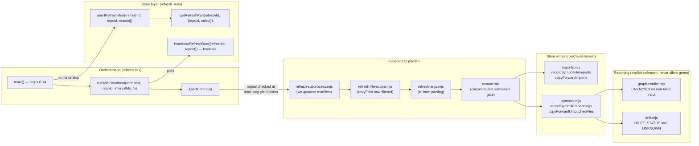

# Plan: Symbol-Index / Arch-Memory Pipeline Reliability Hardening

- **Date**: 2026-07-27
- **Status**: Complete — all 5 execution clusters (A-E) built and audited via `/cycle --autonomous` on 2026-07-27; consolidated Gemini final gate APPROVE (0 new findings) over the union diff; shadow reviewer's 4 observation-only findings triaged (1 fixed, 2 deferred, 1 dismissed as a verified false positive). Full test suite green (8954 passing); dogfooded end-to-end via `npm run arch:refresh` + `arch:render` against this repo's own code.
- **Author**: Claude + user
- **Scope**: backend
- **Target domain(s)**: `arch-memory`, `stores`
- ⚠ **Cross-domain work** — touches both the `arch-memory` CLI pipeline
  (`scripts/symbol-index/**`, `scripts/lib/symbol-index/**`) and the
  `stores` write layer (`scripts/lib/store/arch/**`). Confirmed intentional
  and architecturally sound: `allowedDeps.arch-memory = ["learning-store",
  "shared-lib"]` — every `scripts/symbol-index/*.mjs` file already reaches
  the store layer only through the `learning-store.mjs` facade (which
  barrel-re-exports `lib/store/arch-memory.mjs`), so nothing in this plan
  adds a new direct cross-domain import; it only changes function bodies/
  signatures behind the existing facade.

> **Source**: this is the follow-up detailed design for the raw tech-debt
> triage at `docs/plans/refactor-arch-memory-symbol-index-2026-07.md` (25
> entries, 6 themes). Running `/audit-plan` directly against that triage
> doc returned `SIGNIFICANT_GAPS` (H:9, M:4) — every HIGH finding was a
> variant of "no operational design specified" (H1: "the document is
> principally a debt inventory... does not specify file-by-file
> implementation steps, contracts, ordering, failure behavior, or
> acceptance criteria"). This plan is the proper design doc that inventory
> was always meant to feed — mirroring the same pattern used earlier today
> for two sibling triage clusters (`transaction-wal-cleanup-failure-
> distinction.md`, `vcs-parsing-and-rmsync-scope-hardening.md`), both of
> which shipped successfully via this exact detour.

---

## 1. Context Summary

**Detected scope**: backend, `js-ts` stack. No frontend/UI surface — this
is a CLI pipeline + Postgres store layer.

**What exists today**: `scripts/symbol-index/refresh.mjs` orchestrates the
architectural-memory refresh pipeline (repo registration → stack
detection → embedding-profile resolution → file-scope computation →
subprocess-spawned symbol extraction (`extract.mjs`) → summarisation →
embedding → persistence via `scripts/lib/store/arch/{symbols,imports}.mjs`
→ drift/coverage reporting (`drift.mjs`, `graph-verdict.mjs`)). A prior
session (commit `164b722`, merged today via PR #63) partially fixed the
heartbeat-visibility half of Theme 1 below — failures are now counted and
surfaced in the run's own JSON result — but did not touch the
enforcement half (an aborted run's pipeline keeps executing).

**Code Trace** (verified against current source 2026-07-27, superseding
the triage doc's 2026-07-26 snapshot — two entries had already moved,
documented inline below):

- `refresh.mjs:146-158` (`runWithHeartbeat`) → spawns a `setInterval` that
  calls `beatFn({refreshId})` (`heartbeatRefreshRun`,
  `scripts/lib/store/arch/refresh-runs.mjs:80-82`), which only stamps
  `last_heartbeat_at`; `fn()` — the entire steps-6-through-14 pipeline —
  runs to completion regardless of what the heartbeat observes.
  `refresh-lock.mjs:74-76`'s comment claims "the aborted worker's
  heartbeat loop exits cleanly when it observes status != 'running'" —
  confirmed FALSE; no such check exists anywhere.
- `drift.mjs:106` → `Number(drift.score) || 0` coerces a missing/NaN score
  to `0`, which `classify()` reads as GREEN. `drift.mjs:59-69`
  (`renderMarkdownViaShared`) passes **both** `commitSha: drift.refresh_id`
  **and** `refreshId: drift.refresh_id` to `renderDriftIssue` — verified
  the callee (`scripts/lib/arch-render.mjs:450-461`) already renders them
  as two separate labelled fields (`` Commit: ${commitSha||'unknown'}
  refresh_id: ${refreshId||'unknown'} ``), so the bug is purely the
  redundant, mislabeling `commitSha:` argument — deleting that one line
  is the entire fix; `refreshId` already carries the correct value and
  `renderDriftIssue` needs no signature change. `drift.mjs:155` →
  `listSymbolsForSnapshot({..., limit: 10000})` — this function lives in
  `scripts/lib/store/arch/symbols.mjs:327` (already in Cluster E's file
  list for an unrelated reason; see §6 cross-cluster note), an unreported
  hard cap. `drift.mjs:177-183` → `process.stdout.write(...)` then
  unconditional `process.exit()`, contained to the `isMain()` CLI guard.
- `extract.mjs:86-299` (`extractSymbols`, 213 lines) → per-file loop:
  progress emit (`:124`) → extension-allowlist gate on the **lexical**
  path (`:136`) → canonical resolution (`resolveAndClassify`, `:149`) →
  size-cap check on `cls.canonical` (`:162-164`). The extension gate runs
  **before** canonical resolution — the WS-CANON hoisting that fixed this
  exact bug class for the size-cap check (comment at `:27-30`) was never
  extended to the extension gate. `extract.mjs:106-108` → raw numeric
  ts-morph compiler-option literals. `extract.mjs:560` → an **independent
  instance of the same conflation as `b021576b` below**, found during
  grounding, not in the original triage doc.
- `refresh-subprocess.mjs:92-94` → `if (restrictFiles &&
  restrictFiles.length > 0)` conflates an explicitly-empty array with
  `null`; `filesManifest = path.join(os.tmpdir(),
  \`arch-refresh-files-${pid}-${Date.now()}.txt\`)` then plain
  `fs.writeFileSync` — predictable path, no symlink guard.
- `refresh-file-scope.mjs:95-105` → `retryFiles` (from
  `listFilesNeedingSummaryRetry`) unioned into `restrictFiles` with no
  `filterDiffFiles`/`shouldSkipForIndexing` pass, unlike `diffResult.files`
  at `:59`.
- `refresh-args.mjs:23-45` (`KNOWN_FLAGS = ['--full', '--since-commit',
  '--force', '--include-delegates']`, `parseArgs`) → strict `===` token
  match only; `cli-io.mjs`'s `assertKnownFlags` (`:130-146`) already
  tolerates `--flag=value` at the name-validation layer via
  `a.includes('=') ? a.slice(0, a.indexOf('=')) : a`, so a
  `--since-commit=abc123` flag **passes validation** but matches no `===`
  branch in the parse loop and is silently dropped — a real,
  currently-reachable defect (a value-bearing flag passed in `=`-form
  silently promotes an incremental refresh to a full walk). Confirmed:
  `--since-commit` is the **only** value-bearing flag (`argv[++i]`); the
  other three (`--full`, `--force`, `--include-delegates`) are pure
  booleans with no value-consumption today.
- `scripts/lib/store/arch/refresh-runs.mjs:63-77` (`abortRefreshRun`) and
  `:111-134` (`getRefreshRun`) → `WHERE id = $1` only, no `repo_id`
  predicate — the single-tenant assumption the triage doc's `1b95d1e7`
  cites at the caller sites (`refresh-mode.mjs:74`, `refresh-lock.mjs:80`)
  actually lives here, one layer down. `findStaleRunningRefresh` in the
  same file (`:140-154`) already scopes correctly (`WHERE repo_id = $1
  AND status = 'running'`) — these two functions are the odd ones out in
  their own file. **Blast radius** (confirmed via grep): `abortRefreshRun`
  has 3 callers — `refresh-lock.mjs:80` (repoId already in scope),
  `refresh.mjs:618`'s catch block (repoId **not** in scope — `main()`
  declares `let refreshId;` before its `try` but resolves `repoId` only
  inside it), and `cross-skill.mjs`'s `cmdAbortRefreshRun` (`:2017-2027`,
  validates only `p.refreshId`, unlike its sibling
  `cmdPublishRefreshRun`'s `if (!p.repoId || !p.refreshId)` at `:2007`).
  `getRefreshRun` has **exactly one caller** (grep-confirmed):
  `refresh-mode.mjs:74`, inside `finalizeRefreshMode({mode, sinceCommit,
  repoId, embedProfile, logOk})` — `repoId` is already a parameter of the
  enclosing function, so this caller needs no new plumbing, only passing
  the value through.

  **`refresh.mjs`'s real step structure** (read in full — `main()` spans
  `:160-639`): steps 1-5 (repo registration, embed-profile resolution,
  `walkStartCommit`, lock acquisition, mode finalization) run OUTSIDE
  `runWithHeartbeat`, before it opens. Steps 6-14 run INSIDE the
  heartbeat-monitored callback (`:225-595`): 6 (file-scope) → 7
  (`runExtractSummariseEmbed` — the subprocess spawn, by far the most
  expensive single step) → 9-13b (a sequence of store writes — symbol
  definitions, symbol_index rows, embeddings, layering violations,
  duplicate-justification pragmas, import edges, coverage, copy-forward,
  import-graph-populated flag — ALL scoped to `refreshId`, a snapshot
  that is not yet externally visible) → **14 (`publishRefreshRun`,
  `:490-498`) is the ONLY externally-visible, truly irreversible action**
  — it atomically flips `active_refresh_id` server-side. Everything
  before it is a safely-abandonable unpublished snapshot (exactly what
  already happens on any OTHER failure path via the existing catch
  block's `abortRefreshRun` call) — this is the key fact H3 below hinges
  on: the abort check does not need to guard every store write, only (a)
  the expensive subprocess spawn (cost-saving) and (b) the one point of
  no return (correctness-critical).
- `scripts/lib/store/arch/symbols.mjs`: `recordDuplicateJustifications`
  (`:258-320`) carries a dated comment — **`0aa2b07f` is ALREADY FIXED as
  of 2026-07-27** (chunked apply, `UPSERT_CHUNK_SIZE`-bounded, well under
  Postgres's 65,535-param limit) — this triage entry needs no further
  action. The triage doc's cited lines for `db707fba`
  (`recordSymbolIndex:97-105`, `recordLayeringViolations:216-221`) **are
  also already fixed** (both carry the round-3-H2 rowCount-check pattern).
  The same unfixed defect class survives at two *other* functions in the
  same file: `recordSymbolEmbeddings` (`:158-195`, `total += batch.length`
  — attempted count, not `pool.query()`'s own `rowCount`) and
  `copyForwardUntouchedFiles`'s bulk insert (`:489-494`, same pattern).
- `scripts/lib/store/arch/imports.mjs`: `recordSymbolFileImports`
  (`:44-74`, lines 63-68) and `copyForwardImports` (`:85-118`, lines
  108-112) — both discard `upsert()`'s return value, `inserted +=
  payload.length` / `copied += payload.length`. Confirmed unchanged,
  `45d75ad9` fully open.
- `scripts/lib/symbol-index/graph-verdict.mjs:223-233` — three
  independent `Number.isFinite(X) && X > threshold` degradation guards; a
  non-finite `X` silently skips that guard and, if all three are
  non-finite, falls through to `return {status: S.VERIFIED, reason:
  null}` — the file's own docstring names itself "the single oracle for
  is this observed graph trustworthy" and defines `UNKNOWN` as a
  first-class non-`verified` status (`:16-21`), but doesn't apply that
  rigor to its own missing-measurement case.

**Patterns reused vs new**:

| Need | Existing pattern to reuse | Location |
|---|---|---|
| Canonical (symlink-resolved) path classification before a security-relevant decision | `resolveAndClassify(p, {repoRoot})` → `{category, lexical, canonical, escapedRepo, resolutionFailed}` | `scripts/lib/sensitive-paths.mjs:214-280` |
| Explicit closed status enum instead of a silent numeric/boolean fallback | `GRAPH_STATUS` (`VERIFIED\|DEGRADED\|UNVERIFIED\|UNKNOWN`) | `scripts/lib/symbol-index/graph-verdict.mjs:16-21` (this file is itself the canonical instance of the pattern Theme 2 needs to copy) |
| Symlink-safe exclusive temp-file creation | `fs.writeFileSync(lockPath, payload, {flag: 'wx'})` + `EEXIST` handling | `scripts/lib/file-lock.mjs:69-79` |
| rowCount-honest bulk write | capture `pool.query()`/`upsert()`'s own `rowCount`, never the attempted array length | `scripts/lib/store/arch/symbols.mjs:308-313` (`recordDuplicateJustifications`, "round-3 H2 fix" comment) |
| Chunked bulk write | `chunk(arr, n)` + `UPSERT_CHUNK_SIZE`/`IN_CHUNK` | `scripts/lib/store/arch/_shared.mjs:17-25` — already used by every write path this plan touches; **no new chunking logic needed anywhere in this plan** |
| Mutation scoped by (own-id, repo_id) together | `WHERE run_id = $1 AND repo_id = $2` | `scripts/lib/store/model-eval.mjs:200-213`; also `symbols.mjs`'s own `recordDuplicateJustifications` ("every other `record*` function in this file binds `repo_id` explicitly too") |
| `--flag=value` name tolerance | `a.includes('=') ? a.slice(0, a.indexOf('=')) : a` | `scripts/lib/cli-io.mjs:137-138` (`assertKnownFlags`) |
| `process.exitCode` over forceful `process.exit()` for a CLI whose stdout may be piped | established convention (memory: CLI exit-code discipline) | n/a — applying, not new |

**Neighbourhood considered** (`get-neighbourhood`, 8 candidates, repo
`6461a693-6690-4bf3-98ee-14c0385cc357`): the top match (score 0.85,
`above-floor-cluster`/`precedent`) is `refresh.mjs`'s own `main` function —
expected and correct, since this plan *modifies* that exact symbol rather
than adding a competing one. All 7 remaining candidates (the exact
`symbols.mjs`/`imports.mjs`/`extract.mjs` functions this plan edits)
scored `review` (below this repo's noise floor for genuine duplication
risk) — confirms every fix in this plan extends existing symbols in place;
nothing here introduces a new function that duplicates one already in the
neighbourhood.

**Security-incident neighbourhood** (`get-incident-neighbourhood`, k=3):
**INC-001** (composite score 0.62) — the exact symlink-bypass class
Theme 3's extension-gate-on-lexical-name bug belongs to. Its mitigation
(`resolveAndClassify`, WS-CANON) is already the established repo pattern;
this plan's Theme 3 fix is the last unclosed application of that same
mitigation inside `extract.mjs` (the size-cap check already uses it; the
extension gate is the piece the original WS-CANON pass missed). **INC-002**
(the Supabase wipe, composite 0.48) is not directly relevant to file-content
changes here, but its lesson ("an env-gate that checks 'is this set' is not
a safety gate") is echoed structurally by this plan's Theme 5 fix
(checking that a write *happened*, via `rowCount`, is the same category of
discipline as checking a DSN is genuinely disposable before trusting it).

---

## 2. Proposed Architecture



**Data flow (request lifecycle)**: `refresh.mjs main()` opens a
`refresh_runs` row → enters `runWithHeartbeat` with an `AbortController` →
a self-scheduling (never-overlapping) heartbeat tick awaits
`heartbeatRefreshRun`'s **boolean** return (was: void) and calls
`controller.abort()` the first time it observes `status != 'running'` →
exactly two checkpoints consult `signal.aborted`: immediately before
spawning the extract/summarise/embed subprocess (cost-saving — skip the
most expensive step entirely), and immediately before `publishRefreshRun`
(correctness-critical — the only externally-visible, irreversible action;
see the Code Trace's step-structure note in §1). On any abort path,
`abortRefreshRun` is now called with `repoId` alongside `refreshId`
everywhere (D1).

**Key design decisions**:

- **D1 — repo-scope every refresh-run mutation, not just the ones the
  triage doc named** (#20 Long-Term Flexibility: this schema is
  multi-repo-capable; the code shouldn't assume otherwise). All three of
  `abortRefreshRun`, `getRefreshRun`, AND `heartbeatRefreshRun` gain a
  required `repoId` param (Gemini R1/H1 widened this beyond the triage
  doc's original two — leaving `heartbeatRefreshRun` id-only while its two
  siblings became repo-scoped would just relocate the same class of gap).
  `refresh.mjs` hoists `let repoId;` before its `try` (mirroring the
  existing `let refreshId;`) so the catch-block's `abortRefreshRun` call
  can supply it; `cross-skill.mjs`'s `cmdAbortRefreshRun` payload contract
  widens to require `repoId`, mirroring its sibling `cmdPublishRefreshRun`;
  `refresh-mode.mjs`'s sole `getRefreshRun` caller passes through the
  `repoId` it already has in scope.
- **D2 — cancellation is a signal check at exactly two yield points, never
  a subprocess kill, and the heartbeat loop is race-free by construction**
  (right-sizing: see §4/§7 Risk R1). `runWithHeartbeat` replaces
  `setInterval` with a **self-scheduling `setTimeout` loop**: each tick
  awaits `beatFn(...)` to fully settle (catching and counting any
  rejection) before scheduling the next tick, so two ticks can never
  overlap and a slow DB call can never pile up concurrent heartbeats. A
  module-level `settled` flag flips true the instant `fn()` returns or
  throws, checked both at the top of each tick (a tick already in flight
  when `fn()` finishes will not call `controller.abort()` after the fact)
  and before scheduling the next one. `heartbeatRefreshRun` changes
  contract from void to `Promise<boolean>` (its sole caller is
  `runWithHeartbeat`, confirmed via grep — a contained, non-public-API
  change). This recovers the cost of *not starting* the remaining pipeline
  steps after a force-stop; it does not kill an already-launched
  extraction subprocess mid-flight (Risk register, R1). **The in-process
  signal check is a cost-saving optimization, not the correctness
  boundary** (round-2 H1): the actual race-safety guarantee is now two
  DB-level guards — `abortRefreshRun`'s widened `AND status = 'running'`
  predicate (Phase 1 File-Level Plan) and `publishRefreshRun`'s
  already-existing atomic RPC check — which together make the
  `running→aborted` and `running→published` transitions mutually
  exclusive regardless of what the in-process signal observed or when.
- **D3 — the closed-status-enum idiom (`GRAPH_STATUS`) is applied to
  itself and to `drift.mjs`, and is explicitly advisory, never a gate**
  (#5 Single Source of Truth). Both files already model "verified vs not"
  as a status, not a boolean; this plan closes the last silent-fallback
  gaps in each rather than inventing a new pattern. `drift.mjs`'s CLI exit
  code stays governed solely by `RED` (`process.exitCode = status ===
  'RED' ? 1 : 0`) — `UNKNOWN` (like `GREEN`/`AMBER`) exits 0 and is
  reported, never gates automation; deciding otherwise is future work, not
  silently implied by this plan.
- **D4 — the extension-allowlist gate moves to run on `cls.canonical`,
  fail-closed, with NO fallback to the pre-resolution path** (#13
  Validation, INC-001 mitigation). Reuses the exact `resolveAndClassify`
  call `extract.mjs` already makes three lines later for the size-cap
  check. Critically: `admitFile` refuses admission outright — never reads
  the file — on `cls.resolutionFailed`, `cls.escapedRepo`, or
  `cls.category === 'sensitive'`; there is no `cls.canonical || abs`
  fallback anywhere (a fallback to the pre-resolution path on a failed
  resolution would defeat the entire point of canonical-first checking —
  this was a genuine bug in the first draft of this plan, caught in
  round-1 audit as H6).
- **D5 — store writers report what actually happened, not what was
  attempted** (#19 Observability). `recordSymbolEmbeddings`,
  `copyForwardUntouchedFiles`, `recordSymbolFileImports`,
  `copyForwardImports` all switch from summing input-array length to
  summing the write call's own `rowCount` — copying, verbatim, the pattern
  already proven in the same files' sibling functions.

---

## 3. Execution Model

Clusters C and D are **mutually independent** of everything — verified
disjoint file sets, no cluster consumes another's output. **Two
exceptions, both FILE-level ordering dependencies (not functional ones),
both resolving to Cluster E last**: Clusters B and E both touch
`scripts/lib/store/arch/symbols.mjs` (round-2 M2 — Phase 2 adds
`countSymbolsForSnapshot`; Phase 5 fixes `recordSymbolEmbeddings`/
`copyForwardUntouchedFiles`'s rowCount honesty in the same file), and
Clusters A and E both touch `scripts/lib/store/arch/imports.mjs`
(final-gate round 2 shadow finding — Phase 1 widens
`markImportGraphPopulated`/`getImportGraphPopulated`; Phase 5 fixes
`recordSymbolFileImports`/`copyForwardImports`'s rowCount honesty in the
same file). Both are pure file-overlap, not a functional dependency (§6
documents both as "X before E"). Cluster A and Cluster B have no ordering
constraint against each other or against C/D. No dependency graph or
atomicity boundary is needed beyond (a) each cluster's own transaction/
commit and (b) executing both Cluster A and Cluster B before Cluster E,
specifically (Cluster E is `fix-gate: final` — the last cluster — so this
is automatically satisfied by declared order, not an extra constraint to
separately enforce).

---

## 4. Sustainability Notes

- **Assumption this design encodes**: `refresh_runs.status` stays a
  3-value enum (`running`/`published`/`aborted`) with a partial-unique
  index enforcing one in-flight run per repo. If a future change adds a
  `cancelling` intermediate state, `heartbeatRefreshRun`'s "not running"
  boolean check still holds (anything other than `running` means stop).
- **Extension point deliberately NOT built**: killing an already-spawned
  extraction subprocess mid-flight. The `AbortController`'s `signal` is
  wired to the point where a *future* pass could add
  `child.kill(signal.reason)` to the subprocess spawn in
  `refresh-subprocess.mjs`, but building that now would need
  process-group/orphan-cleanup handling no current requirement asks for
  (§5 right-sizing).
- **Pattern others can follow**: D3 (apply `GRAPH_STATUS`-shaped enums to
  every score/verdict signal, not a boolean-coercion fallback) already had
  one precedent (`graph-verdict.mjs`) and now has two (`drift.mjs`) — this
  plan explicitly establishes it as the repo convention for the
  `arch-memory` domain, not a one-off.

### Right-sizing gate

New structure introduced: `DRIFT_STATUS`-shaped closed enum in
`drift.mjs`; widened `abortRefreshRun`/`getRefreshRun` signatures;
`AbortController` threading through `runWithHeartbeat`.

- **Band-aid extreme**: keep `Number(drift.score) || 0` and just rename
  the variable; keep `abortRefreshRun(refreshId)` id-only and hope no
  cross-repo race ever happens; log a warning when the heartbeat fails but
  still let the whole pipeline run to its natural (wasted) end.
- **Over-engineered extreme**: build a full cancellation-aware
  process-group supervisor that can kill a subprocess mid-parse and
  resume from a checkpoint; add a generic multi-tenant row-level-security
  layer to every `arch/*` table instead of fixing the two functions that
  actually lack the predicate; replace `refresh-args.mjs`'s parser with a
  new shared CLI-parsing library used repo-wide.
- **Chosen, and the current requirement it serves**: signal-check
  cancellation at existing pipeline boundaries (current requirement: stop
  wasting cost on steps 6-14 after a force-stop, not build general process
  supervision); repo-scope exactly the two functions the grounding
  confirmed are unscoped (current requirement: close the specific
  multi-tenant gap found, not redesign the schema); a closed enum for
  exactly the two signals that currently coerce (current requirement:
  stop silent-GREEN/silent-VERIFIED, not build a generic status framework).

**Deliberate scope exclusion — `--files-from` NUL-delimited rewrite**
(`395e92881aa4`/`c191e74d781b`): the triage doc's own comment already
accepts this as debt, and fixing it properly (mirroring PR #63's
`parseNameStatusZ` NUL-delimited precedent) would require the
manifest-writer (`refresh-subprocess.mjs`, Cluster D) and reader
(`extract.mjs`, Cluster C) to change in lockstep — the one place in this
plan where two otherwise-independent clusters would need merging.
Deferred to "Out of Scope (Future)" below rather than force a cluster
merge for a debt item the triage doc itself already accepted; the two
duplicate topicIds are tracked as one future item, consistent with the
doc's own framing.

---

## 5. File-Level Plan

**Phase 1 — Heartbeat-driven cancellation + repo-scoped refresh-run
mutations** (Theme 1 + `1b95d1e7`)
Files:
- `scripts/lib/store/arch/refresh-runs.mjs` (modify) — `abortRefreshRun`,
  `getRefreshRun`, AND `heartbeatRefreshRun` all gain a required `repoId`
  param (D1 — widened beyond the triage doc's original two after round-1
  audit H1). **Canonical final signatures** (round-3 M1 — the first two
  drafts described these inconsistently, mixing positional and
  options-object notation for the same functions): all three keep their
  EXISTING calling convention, confirmed against current source —
  `abortRefreshRun({refreshId, repoId, reason})` (already an
  options-object today, just gaining one required key);
  `getRefreshRun(refreshId, {repoId, select})` (its existing signature is
  `getRefreshRun(refreshId, {select})` — `refreshId` STAYS the first
  positional arg, `repoId` is added into the SAME second-arg options
  object alongside the existing `select`, which is otherwise untouched);
  `heartbeatRefreshRun({refreshId, repoId})` (already an options-object
  today). No function changes its parameter COUNT or ordering, only which
  keys the (already-existing) options object carries.
  **Implementation mechanism (Gemini-shadow finding, final-gate round 1)**:
  read in full — `abortRefreshRun` and `heartbeatRefreshRun` both
  currently call the generic `updateWhere(table, patch, where, opts)`
  helper (`scripts/lib/db/query.mjs`), NOT raw SQL. `updateWhere` already
  supports a multi-key `where` object (AND-joined predicates via
  `flattenWhere`) and an `opts.returning` option (returns `res.rows`,
  else `{rowCount}`) — **neither function needs to switch to raw SQL**;
  the fix is purely widening each call's arguments. **Critical correction
  (Gemini final-gate round 2, GFG1 — the round-1 sketch would crash at
  runtime)**: `query.mjs`'s `normalizeReturning` (read in full)
  **rejects a raw string** for `returning` — it only accepts `true | '*'
  | string[]`, throwing `TypeError: returning: must be true | '*' |
  string[] (raw strings are not accepted — pass ['col1','col2'])` for
  anything else. The prior sketch's `{ returning: 'id' }` would have
  thrown this on every single call, crashing the refresh cancellation and
  heartbeat mechanisms and leaving the run hanging with an orphaned lock
  — the exact opposite of this phase's goal. Corrected to `{ returning:
  ['id'] }` (an array) in both places:
  ```js
  export async function abortRefreshRun({ refreshId, repoId, reason }) {
    const rows = await updateWhere('refresh_runs',
      { status: 'aborted', error: reason || null, completed_at: new Date().toISOString(), retention_class: 'aborted' },
      { id: refreshId, repo_id: repoId, status: 'running' },
      { returning: ['id'] });
    if (rows.length === 0) process.stderr.write(`  [refresh-runs] abortRefreshRun(${refreshId}): 0-row update (already terminal) — not an error\n`);
  }
  export async function heartbeatRefreshRun({ refreshId, repoId }) {
    const rows = await updateWhere('refresh_runs',
      { last_heartbeat_at: new Date().toISOString() },
      { id: refreshId, repo_id: repoId, status: 'running' },
      { returning: ['id'] });
    return rows.length > 0;
  }
  ```
  `getRefreshRun`'s own existing implementation is a raw `one()` query
  (not `updateWhere`) — that stays as-is, only its `WHERE` predicate
  widens to `WHERE id = $1 AND repo_id = $2`. **`abortRefreshRun` ALSO
  adds `AND status = 'running'`** (round-2 H1 — a real distributed-race
  gap in the first draft): a 0-row result (already `published` or
  already `aborted`) is logged, not treated as an error — mirrors
  `findStaleRunningRefresh`'s own existing `AND status = 'running'` scope
  in the same file, and is the piece that makes the abort/publish race
  safe: this guard prevents a stale/late force-abort call from flipping
  an already-`published` run back to `aborted` after the fact, and
  `publishRefreshRun`'s EXISTING atomic RPC guard (`IF v_status !=
  'running' THEN RAISE EXCEPTION`, confirmed in §1's Code Trace) already
  prevents the reverse — a run that just got aborted server-side cannot
  successfully publish, because the RPC call itself fails inside the same
  transaction. Together these two ALREADY-EXISTING-STYLE guards (one
  pre-existing, one added here) make the two transitions mutually
  exclusive and race-safe **at the database layer** — the in-process
  `AbortController`/`signal.aborted` check in `refresh.mjs` below is
  therefore a **cost-saving optimization** (skip wasted pipeline work
  early), never the correctness boundary; the correctness boundary is
  these two SQL-level guards. This resolves round-2 H1 by adding no new
  machinery — just extending a scoping pattern this file already uses
  elsewhere in itself.
- `scripts/symbol-index/refresh.mjs` (modify) — `runWithHeartbeat(refreshId,
  repoId, intervalMs, fn, beatFn = heartbeatRefreshRun)`: replaces
  `setInterval` with a self-scheduling `setTimeout` loop (D2 — closes
  round-1 H2's overlap/race findings). Sketch:
  ```js
  const MAX_CONSECUTIVE_HEARTBEAT_FAILURES = 3;   // ~45s at the 15s interval
  let consecutiveFailures = 0;
  const controller = new AbortController();
  const heartbeatStatus = { failureCount: 0, lastError: null, aborted: false };
  let settled = false, timer = null;
  async function tick() {
    if (settled) return;
    try {
      const stillRunning = await beatFn({ refreshId, repoId });
      consecutiveFailures = 0;
      if (!settled && !stillRunning && !heartbeatStatus.aborted) {
        heartbeatStatus.aborted = true;
        controller.abort(new RefreshAbortedError(refreshId));
      }
    } catch (err) {
      heartbeatStatus.failureCount++;
      heartbeatStatus.lastError = err.message;
      consecutiveFailures++;
      if (heartbeatStatus.failureCount <= 1) logErr(`heartbeat failed for refresh ${refreshId}: ${err.message}`);
      // Gemini-shadow finding: an unreachable DB for the whole run means
      // `stillRunning` is never observed either way — the cancellation
      // mechanism goes silently dead exactly like the ORIGINAL bug, just
      // one level down ("no check exists" -> "the check never gets an
      // answer"). Treat sustained inability to confirm authorization as
      // itself abort-worthy, not indefinite continuation on an unverified
      // run.
      if (!settled && consecutiveFailures >= MAX_CONSECUTIVE_HEARTBEAT_FAILURES && !heartbeatStatus.aborted) {
        heartbeatStatus.aborted = true;
        controller.abort(new RefreshAbortedError(refreshId, `heartbeat unreachable for ${consecutiveFailures} consecutive ticks`));
      }
    } finally {
      if (!settled) timer = setTimeout(tick, intervalMs);
    }
  }
  timer = setTimeout(tick, intervalMs);
  try { return await fn(heartbeatStatus, controller.signal); }
  finally { settled = true; if (timer) clearTimeout(timer); }
  ```
  No two ticks ever run concurrently (the next is scheduled only after
  the current one's `beatFn` call and error handling fully settle); the
  `settled` flag closes the "a heartbeat in flight when `fn()` already
  resolved fires a stale abort" race from H2 — a tick that observes
  `settled === true` (checked on entry, and again before rescheduling)
  never calls `controller.abort()`. `fn` (the steps-6-through-14 callback)
  receives `(heartbeatStatus, signal)` and checks `signal.aborted` at
  exactly two points (per D2/§1's step-structure trace): immediately
  before calling `runExtractSummariseEmbed` (step 7 — skip the subprocess
  spawn entirely if already aborted) and immediately before
  `publishRefreshRun` (step 14 — the one point of no return; on abort,
  throw a `RefreshAbortedError` instead of publishing, letting the
  existing catch block's `abortRefreshRun` call handle cleanup as it
  already does for every other failure mode). `main()` hoists `let
  repoId;` before its `try` (mirroring the existing `let refreshId;`) so
  the catch block's `abortRefreshRun` call can pass it; the call site
  passes `repoId` into `runWithHeartbeat`'s new second param.
- `scripts/symbol-index/refresh-mode.mjs` (modify) — `finalizeRefreshMode`'s
  `getRefreshRun(prior.refreshId, {select: [...]})` call at `:74` passes
  the `repoId` it already receives as its own parameter — a one-line,
  purely-additive change, no logic change.
- `scripts/symbol-index/refresh-lock.mjs` (modify) — its
  `abortRefreshRun` call gains `repoId` (already in scope as a function
  param); the false "exits cleanly when it observes status != 'running'"
  comment is corrected to describe the real mechanism now implemented
  (the heartbeat loop's own `beatFn` status check, not a check inside
  `refresh-lock.mjs` itself).
- `scripts/cross-skill.mjs` (modify) — `cmdAbortRefreshRun`'s payload
  validation widens to `if (!p.repoId || !p.refreshId) return
  emitError(...)`, mirroring `cmdPublishRefreshRun`'s existing check.
  **Implementation-time check** (shadow finding, final-gate round 3):
  confirm whether a declarative command-surface artifact (e.g. a CLI
  catalog file, if one documents this command's payload shape) also
  needs updating for the widened contract — grep for `abort-refresh-run`
  beyond this file before considering Cluster A done.
- `scripts/lib/store/arch/imports.mjs` (modify — Gemini-shadow finding,
  final-gate round 2): `markImportGraphPopulated(refreshId)` and
  `getImportGraphPopulated(refreshId)` (read in full, confirmed both
  `id`-only, no `repoId` at all) are the SAME class of gap D1 states as
  its governing principle ("repo-scope every refresh-run mutation, not
  just the ones the triage doc named") — both mutate/read the identical
  multi-tenant `refresh_runs` table, and both are called directly from
  the very `refresh.mjs` pipeline (steps 13/13b) Cluster A is hardening.
  Leaving them out would directly contradict D1's own stated scope.
  Widened to `markImportGraphPopulated(refreshId, repoId)` (`WHERE id =
  $1 AND repo_id = $2`) and `getImportGraphPopulated(refreshId, repoId)`
  (same predicate); `refresh.mjs`'s two call sites already have `repoId`
  in scope at both points. **This file is ALSO in Cluster E's scope** for
  the unrelated rowCount-honesty fix (Phase 5) — same cross-cluster
  pattern already established for `symbols.mjs` between Clusters B and E
  (§6): Cluster A must execute before Cluster E for `imports.mjs`, same
  as B-before-E for `symbols.mjs`.

**Acceptance criteria** (Phase 1): a force-abort (`--force` on a second
concurrent invocation) results in **exactly one** of the two valid
outcomes for the first run — either it observes `signal.aborted` and
exits via `RefreshAbortedError` before `publishRefreshRun`, **or** its
`signal.aborted` check happened to pass just before the race and it
proceeds to a successful publish — **never both, and never neither**
(round-4 M5 — the true guarantee is DB-level mutual exclusion between the
two SQL predicates, not "abort always wins"; asserting `RefreshAbortedError`
unconditionally over-promises a guarantee the design doesn't make and
can't: which side wins a genuine race is not itself a defect). Whichever
outcome occurs, `refresh_runs.status` for that run settles to EXACTLY ONE
of `aborted`/`published`, never left dangling in `running`, and a
subsequent stale operation of the other kind is always a no-op (proven
deterministically by the two-directional race test in §8, independent of
which way any single empirical run happens to land). **Scope caveat**
(shadow finding, final-gate round 3): this guarantee assumes the DB is
reachable enough to record SOME terminal outcome. A total, sustained DB
outage spanning the entire run — including the catch block's own
`abortRefreshRun` cleanup write — is a scenario no application-level code
can fully guarantee recovery from; the local process still exits
non-zero with a clear stderr message, but the row may remain `running`
in the DB until a LATER `--force` invocation's existing
`findStaleRunningRefresh` sweep cleans it up once the DB becomes
reachable again. This is an accepted limitation of the design, not an
unhandled case. A cross-repo
`abortRefreshRun`/`getRefreshRun`/`heartbeatRefreshRun` call (wrong
`repoId` for a real `refreshId`) is a no-op, not a silent cross-tenant
mutation; no unhandled promise rejection is ever raised by the heartbeat
loop under a failing `beatFn`.

**Phase 2 — Explicit-unknown-state hardening for drift/graph-verdict**
(Theme 2 + Theme 6)
Files:
- `scripts/symbol-index/drift.mjs` (modify) — new `DRIFT_STATUS`
  (`GREEN|AMBER|RED|UNKNOWN`) constant. **Critical placement correction
  (Gemini final-gate finding 0 — a real bug in the first draft)**: the
  guard MUST compute `status` as a value, never use a bare `return` —
  `drift.mjs:106`'s `const status = classify(...)` line sits directly
  inside the top-level `main()` async function (read in full and
  confirmed: no wrapping helper), so an early `return {status:
  DRIFT_STATUS.UNKNOWN, ...}` at that point would resolve `main()`'s
  Promise immediately, skipping `renderMarkdownViaShared` and the stdout
  JSON emission entirely — producing NO drift report at all, exactly the
  opposite of the visibility this fix exists to add. Corrected shape:
  ```js
  const status = Number.isFinite(drift.score)
    ? classify(drift.score, threshold)
    : DRIFT_STATUS.UNKNOWN;
  ```
  `classify()` is only ever called with a value already confirmed finite;
  the ternary computes a plain value assigned to the SAME `status`
  variable `main()` already uses for every downstream step (rendering,
  exit code), never an early return. Deliberately stricter than the old
  `Number(x) || 0`: `drift.score` is a genuine numeric DB column, so a
  numeric *string* slipping through some JSON boundary is itself a
  data-integrity anomaly worth surfacing as UNKNOWN, not silently parsed
  (round-1 H8 — the change is intentional, not an oversight).
  `renderMarkdownViaShared`
  (`:58-71`) currently passes **both** `commitSha: drift.refresh_id` AND
  `refreshId: drift.refresh_id` to `renderDriftIssue` — read in full
  (`scripts/lib/arch-render.mjs:450-461`): the callee ALREADY renders them
  as two separate labelled fields (`` Commit: ${commitSha||'unknown'}
  refresh_id: ${refreshId||'unknown'} ``), so the entire fix is deleting
  the redundant, mislabeling `commitSha: drift.refresh_id,` line — no
  signature change to `renderDriftIssue`, no other consumer affected
  (round-1 H5 resolved: the ambiguity was never in the callee's contract,
  only in one caller passing a bad value into a field the callee already
  handles gracefully via `|| 'unknown'`). A NEW, additive
  `countSymbolsForSnapshot({refreshId, kind, domainTag, filePathPrefix})`
  function is added to `scripts/lib/store/arch/symbols.mjs:327` (same
  file `listSymbolsForSnapshot` already lives in — this file is ALSO in
  Cluster E's scope for unrelated reasons; see §6 cross-cluster note),
  mirroring `listSymbolsForSnapshot`'s own `WHERE` clause but running
  `SELECT count(*)::int AS total` instead of the row query — **cast to
  `::int` explicitly** (round-3 M2: Postgres `COUNT(*)` returns `bigint`
  by default, and node-postgres's default type parser for `bigint`
  returns a JS **string**, not a number, to avoid precision loss outside
  JS's safe-integer range; a symbol count will never remotely approach
  that range, so casting server-side to `int` — parsed as a genuine JS
  number by `pg` — is the correct, simplest fix, not a client-side
  `Number(...)` coercion layered on top of a value that's already wrong
  in transit). **`listSymbolsForSnapshot`'s own signature and return
  shape do not change at all** (round-2 M2: the first draft's "gains a
  parallel count" language was ambiguous about whether the existing
  function's return type changed; it does not, so no other caller of
  `listSymbolsForSnapshot` is affected). `drift.mjs`'s caller calls BOTH
  functions and composes `{symbols, totalCount, capped: totalCount >
  10000}` itself (no pagination added — a human-readable drift report
  over >10,000 symbols isn't more useful paginated; it just needs to
  admit the cap). **Correction (Gemini final-gate finding 1 — the round-3
  fix mischaracterized this list's actual consumer)**: `listSymbolsForSnapshot`'s
  result at `drift.mjs:155` does NOT feed duplicate-cluster detection
  (that is a separate call, `getTopDuplicateClusters`, at `:113`, an
  independent query) — read in full and confirmed it is the CANDIDATE
  POOL for `resolvePragmasToDefinitions()`, the report-time
  `@duplicate-justification` pragma reconciliation (`:148-` onward,
  itself a round-2 fix noted inline in current source). Capping this pool
  at 10,000 means a pragma on a symbol outside the top 10k would be
  wrongly reported as "unresolved" — a false-positive warning, not a
  safety gap (the write-path enforcement in `refresh.mjs` is unaffected;
  this is purely advisory report accuracy per the existing "Report-time
  reconciliation... advisory surfacing" comment). **Fix**: reuse the SAME
  `capped` flag already computed above — when `capped` is true, skip the
  ambiguous/unresolved pragma reconciliation section entirely and instead
  emit one line noting it was skipped due to the cap, rather than running
  a reconciliation that would produce false "unresolved" warnings for
  symbols the capped query never saw. **Surfacing** (round-3 M2 — the
  first draft never specified where `capped` becomes visible): when
  `capped` is true, ALSO emit one `process.stderr.write` line (``
  arch:drift: showing 10000 of ${totalCount} symbols in this cluster
  analysis (capped) `` ), the same mechanism this file already uses for
  other advisory warnings (e.g. the pragma-sweep-failure line in
  `refresh.mjs`) — this does NOT touch `renderDriftIssue`'s tested
  markdown contract; the drift score/cluster rendering itself is entirely
  unaffected by this cap, only the separate pragma-reconciliation section
  is. **Boundary test** (round-3 M2): exactly 10,000
  symbols → `capped: false`; 10,001 → `capped: true` — both asserted as
  distinct DB-integration test cases, not inferred from the `>` operator
  alone. `main()`'s
  `process.exit(status === 'RED' ? 1 : 0)` becomes `process.exitCode =
  status === 'RED' ? 1 : 0;` — avoids truncating a piped stdout write
  before the event loop flushes it. Exit-code contract (D3, resolves
  round-1 H8's "advisory or gate" gap): `UNKNOWN` behaves exactly like
  `GREEN`/`AMBER` for the exit code (0) — it is reported, not gating;
  only `RED` is non-zero.
- `scripts/lib/symbol-index/graph-verdict.mjs` (modify) — restructure the
  three `Number.isFinite(X) && X > threshold` checks so a non-finite `X`
  is tracked in a `missing` list rather than silently skipped; if
  `missing.length > 0` after all three checks (and none independently
  triggered a `DEGRADED` return), return `{status: S.UNKNOWN, reason:
  R.MALFORMED_MEASUREMENT, missing}` instead of falling through to
  `VERIFIED`. **`MALFORMED_MEASUREMENT` is a NEW constant added to the
  existing `R` reason enum alongside `BUDGET_EXCEEDED`/`BELOW_FLOOR`/
  `BELOW_ATTRIBUTION_FLOOR`** (round-4 M1 — the first draft referenced it
  without specifying this; an unadded constant would silently evaluate to
  `undefined` at the reason field, defeating the whole point of a closed
  enum). `missing` (an array of the specific field names that were
  non-finite, e.g. `['elapsedMs']`) IS part of the stable verdict shape
  going forward — any consumer that destructures `{status, reason}` from
  this function's return is unaffected (additive field), but a consumer
  that does an exact deep-equality comparison against a fixture would need
  its fixture updated for the new `UNKNOWN` case specifically (not for
  existing `VERIFIED`/`DEGRADED` returns, which are unchanged). A
  present-and-degraded measurement still returns `DEGRADED` even if a
  sibling measurement is separately missing (order: check
  finite-and-degraded first per field, accumulate missing only for the
  fallthrough case).

**Phase 3 — `extract.mjs` symbol-extraction hardening** (Theme 3 + the
`extract.mjs:560` duplicate found during grounding)
Files:
- `scripts/symbol-index/extract.mjs` (modify) — decompose the 213-line
  `extractSymbols` into four named steps called in sequence per file:
  `admitFile(filePath, opts)`, `loadAndParseFile(canonicalPath)`
  (ts-morph `SourceFile` load), `classifySymbolsInFile(sourceFile, ctx)`
  (declaration extraction + domain tagging), `redactAndEmit(symbols,
  ctx)` (sensitive-path redaction + the progress/emit call — moved to run
  **after** `admitFile`'s decision, closing the
  progress-before-classification ordering bug). **`admitFile` is
  fail-closed with no fallback path** (D4, resolves round-1 H6 — the
  first draft's `cls.canonical || abs` fallback would have defeated the
  entire canonical-first check on a resolution failure):
  ```js
  // `classify` defaults to the real resolveAndClassify but is injectable —
  // mirrors the `beatFn` pattern Phase 1 already establishes for
  // runWithHeartbeat, so a test can stub canonical-path resolution
  // without a real filesystem symlink fixture (round-2 M1).
  function admitFile(filePath, { repoRoot, classify = resolveAndClassify }) {
    const rel = path.relative(repoRoot, filePath);
    const cls = classify(rel, { repoRoot });
    if (cls.resolutionFailed) return { admitted: false, reason: 'resolution-failed' };
    if (cls.escapedRepo) return { admitted: false, reason: 'escaped-repo' };
    if (cls.category === 'sensitive') return { admitted: false, reason: 'sensitive' };
    // Only reachable with a real, safe, non-sensitive canonical path.
    const canonicalRel = path.relative(repoRoot, cls.canonical);
    if (!isExtensionAllowlisted(canonicalRel)) return { admitted: false, reason: 'extension-not-allowlisted' };
    if (/* existing size-cap check, unchanged, now reads cls.canonical */) return { admitted: false, reason: 'size-cap' };
    return { admitted: true, canonicalPath: cls.canonical };
  }
  ```
  This absorbs the extension-gate reorder (the gate now tests
  `canonicalRel`, derived from `cls.canonical`, never the raw `rel`) and
  is the single admission decision point `redactAndEmit`'s progress/emit
  call now waits on. Replace `target: 99, module: 99, moduleResolution:
  100` with `ts.ScriptTarget.ESNext`, `ts.ModuleKind.ESNext`,
  `ts.ModuleResolutionKind.Bundler` (Risk R3 — **no numeric-value pinning
  test** per round-3 L1: asserting e.g. `ts.ScriptTarget.ESNext === 99`
  would reintroduce, one level removed, the exact hardcoded-magic-number
  dependency this fix removes, and would need churn on every TypeScript
  upgrade even when the named constants remain semantically correct.
  Verification is functional instead: the existing extraction test suite
  already parses real fixture files end-to-end and asserts on the
  resulting symbols — that suite continuing to pass with the named
  constants swapped in IS the verification; no new test is needed). Add
  one extra
  progress/heartbeat tick immediately before parsing any file whose size
  exceeds half the 500KB cap (250KB), in addition to the existing
  top-of-loop tick — a file-processing-observability improvement,
  independent of Phase 1's DB-side heartbeat (this is the child
  process's own stdout progress channel, a different liveness
  mechanism). **Scope note (round-4 M3)**: a rejected candidate (bad
  extension, escaped path, sensitive, broken symlink, over-cap) does NOT
  get this extra tick — `admitFile`'s rejection path is a cheap,
  synchronous check with no ts-morph parse and no filesystem read beyond
  what `resolveAndClassify` already does, so a long walk over many
  rejected files is fast by construction. The original concern this
  addresses (`e058e7df`) was specifically about a single large ADMITTED
  file's ts-morph parse taking a long time with no interior signal — that
  scope is deliberately narrow, not "every file gets a second tick." Also
  fix the identical empty-vs-null `restrictFiles`
  conflation independently found at `extract.mjs:560`'s `enumerateFiles`
  gate, using the identical tri-state contract Phase 4 defines for
  `refresh-subprocess.mjs`'s equivalent gate (same one-line idiom,
  applied here because it's the same file already being decomposed — see
  §1 Code Trace load-bearing note): `restrictFiles == null` → full walk;
  `Array.isArray(restrictFiles) && restrictFiles.length === 0` → zero
  files admitted, no walk attempted; `length > 0` → walk restricted to
  those files, as today.

**Acceptance criteria** (Phase 3): a symlink whose target resolves outside
`repoRoot`, or a broken/unresolvable symlink, is refused admission and
never read, regardless of its lexical extension; the size-cap and
extension checks both observe the SAME canonical path (no more
independent gates on different path forms); `admitFile`'s four
`reason` values are each independently testable without a real
filesystem symlink (inject a stub `resolveAndClassify`).

**Phase 4 — Refresh-subprocess / file-scope / args CLI hardening**
(Theme 4's remaining items: `b021576b`, `e86a9cbb`, `c5b28713`,
`aba921ff`)
Files:
- `scripts/symbol-index/refresh-subprocess.mjs` (modify) — replace `if
  (restrictFiles && restrictFiles.length > 0)` with the same explicit
  tri-state Phase 3 applies to `extract.mjs:560` (round-1 H4 — one
  contract, defined once, applied at both gates): `restrictFiles == null`
  → full walk (no `--files-from` flag passed); `Array.isArray(restrictFiles)
  && restrictFiles.length === 0` → nothing to extract — `runExtractSummariseEmbed`
  returns immediately with `{finalSymbols: [], violations: [], importEdges: [],
  coverageLine: null, extractionTimedOut: false, timeoutRecovery: null,
  recoveredTouchedSet: null, skipped: true}` (an additive `skipped: true`
  field distinguishes "genuinely nothing to do" from every other
  zero-result shape) — no subprocess is spawned at all; `length > 0` →
  pass the restricted file list as today. Downstream (`refresh.mjs` steps
  9-13b) needs NO special-casing for the empty case: every store writer
  in this pipeline is already `chunk()`-based (`_shared.mjs`), and
  `chunk([], n)` yields zero chunks — an empty `finalSymbols` array
  already flows through as a correct no-op write. `touchedSet` stays a
  real (empty) `Set`, so step 13's copy-forward still runs normally and
  correctly copies forward every previously-indexed symbol (nothing
  "touched" means everything else carries over unchanged — already-correct
  existing behavior, unaffected by this fix). The manifest write gains
  `{flag: 'wx'}` (matching `file-lock.mjs`'s pattern). Full resource
  lifecycle (round-2 M3 — the first draft left entropy, permissions, and
  failure-path cleanup unspecified): on `EEXIST`, regenerate the filename
  with a `crypto.randomBytes(4).toString('hex')` suffix and retry the
  `wx` write exactly once more; a second `EEXIST` is treated as a hard
  failure (throw), not an infinite retry loop. No special permission
  hardening beyond the `wx`/`O_EXCL` flag itself — this is a
  same-user, same-process temp file with no cross-privilege-boundary
  threat model here (the `wx` flag is what closes the actual symlink-
  preemption risk; default `writeFileSync` permissions are an accepted,
  scoped decision, not an oversight). Cleanup: **the existing `finally`
  block at `refresh-subprocess.mjs:127-129` (`if (filesManifest) { try {
  fs.unlinkSync(filesManifest) } catch {} }`) already unlinks whatever
  `filesManifest` resolves to** — the wx-retry logic only needs to
  reassign the `filesManifest` variable to the ACTUAL filename that
  succeeded (including a retry-generated alternate name) before that
  existing cleanup runs; no new cleanup path is needed. This also
  correctly covers a subprocess-spawn failure or abnormal child exit
  AFTER a successful manifest write — the `finally` block is unconditional
  and already runs regardless of how the surrounding `try` exits.
- `scripts/symbol-index/refresh-file-scope.mjs` (modify) — `retryFiles`
  (from `listFilesNeedingSummaryRetry`) is passed through
  `filterDiffFiles`/`shouldSkipForIndexing` before being unioned into
  `restrictFiles`, the same treatment `diffResult.files` already gets at
  line 59.
- `scripts/symbol-index/refresh-args.mjs` (modify) — resolves round-1 H7
  with a fully-specified `switch`, replacing the `if/else if` chain.
  `--since-commit` is the only value-bearing flag today (confirmed via
  full-file read); the other three are pure booleans:
  ```js
  export function parseArgs(argv) {
    assertKnownFlags(argv, KNOWN_FLAGS, { cli: 'refresh' });
    const args = { full: false, sinceCommit: null, force: false, includeDelegates: false };
    for (let i = 2; i < argv.length; i++) {
      let a = argv[i], inlineValue = null;
      // POSIX `--` terminator: assertKnownFlags above already stops
      // validating at this token (cli-io.mjs:136), so parseArgs must
      // honor the same boundary — Gemini-shadow finding, final-gate
      // round 2: without this break, `refresh.mjs -- --full` would pass
      // validation (assertKnownFlags stops at `--`) but this loop would
      // keep going and match the positional `--full` as a real flag.
      if (a === '--') break;
      const eq = a.indexOf('=');
      if (eq !== -1) { inlineValue = a.slice(eq + 1); a = a.slice(0, eq); }
      switch (a) {
        case '--full':
          if (inlineValue !== null) throw new Error(`--full does not take a value; got --full=${inlineValue}`);
          args.full = true; break;
        case '--since-commit': {
          const value = inlineValue !== null ? inlineValue : argv[i + 1];
          // round-2 H2: reject, never silently accept, every shape that
          // would otherwise fall through to "value is falsy → treated as
          // absent → silently promoted to a full walk" — end-of-argv
          // (value undefined), a missing value where the NEXT token is
          // itself a known flag (`--since-commit --force`, which used to
          // consume `--force` as the commit and leave force disabled),
          // and `--since-commit=` (empty string).
          if (!value || value.startsWith('--')) {
            throw new Error(`--since-commit requires a non-empty value (got ${JSON.stringify(value ?? null)})`);
          }
          if (inlineValue === null) i++;   // only advance past a space-separated value
          args.sinceCommit = value;
          break;
        }
        case '--force':
          if (inlineValue !== null) throw new Error(`--force does not take a value; got --force=${inlineValue}`);
          args.force = true; break;
        case '--include-delegates':
          if (inlineValue !== null) throw new Error(`--include-delegates does not take a value; got --include-delegates=${inlineValue}`);
          args.includeDelegates = true; break;
      }
    }
    return args;
  }
  ```
  Boolean flags REJECT (throw) an inline value rather than silently
  discarding it — closes H7's "what happens for boolean flags" gap
  explicitly rather than leaving it implicit. `--since-commit` now THROWS
  (never silently falls through) on every value-less shape — end-of-argv,
  `--since-commit --force` (the next token looking like a flag), and
  `--since-commit=` — closing round-2 H2's finding that the first draft
  still silently promoted an intended incremental refresh to a full walk
  in exactly the cases this phase exists to fix. The space-separated form
  (`--since-commit abc123`) is unaffected for the legitimate case — `i`
  only advances past a genuinely-consumed space-separated value, never
  past an inline (`=`-form) one. This is a local, contained fix; it does
  not touch the shared `cli-io.mjs` module or risk its other callers.

**Phase 5 — Store-layer write-result honesty** (Theme 5's remaining
items — `db707fba` redirected, `45d75ad9`; `0aa2b07f` is already fixed,
confirmed, no action)
Files:
- `scripts/lib/store/arch/symbols.mjs` (modify) — `recordSymbolEmbeddings`
  and `copyForwardUntouchedFiles`'s bulk insert both switch from summing
  the attempted input-array length to summing the write call's own
  `rowCount`, copying the exact pattern already proven in the same file's
  `recordDuplicateJustifications` (the "round-3 H2 fix" comment).
- `scripts/lib/store/arch/imports.mjs` (modify) — `recordSymbolFileImports`
  and `copyForwardImports` get the identical fix: capture `upsert()`'s
  return value and sum its `rowCount`, never `payload.length`. **Contract
  note (Gemini-shadow finding, final-gate round 2)**: `recordSymbolFileImports`'s
  own JSDoc already documents its return as "count of DISTINCT edges
  **persisted**" (not "attempted") — switching to `rowCount` makes the
  implementation MATCH its own docstring for the first time (the OLD
  `payload.length` counted attempts, which could silently overstate
  "persisted" whenever a distinct edge's FK target didn't yet exist; this
  fix corrects that discrepancy rather than introducing one). Also add
  the same stderr warning `recordSymbolIndex` already has when a chunk's
  `rowCount` disagrees with its attempted `slice.length`, to both
  `recordSymbolFileImports` and `copyForwardImports` (the round-1 draft
  specified the rowCount CAPTURE but not this warning explicitly for
  these two functions). **Note** (shadow finding, final-gate round 3):
  for `copyForwardImports` specifically, every upserted row targets a
  brand-NEW `refresh_id` under `ON CONFLICT (refresh_id, importer_path,
  imported_path)` — by construction every row is a fresh insert, never an
  update, so `rowCount === payload.length` is expected on EVERY call; the
  warning is a defensive tripwire for an unexpected reachable case (a
  batch-partial failure, or a conflict on some other constraint), not
  something normally expected to fire. Worth knowing at implementation
  time so a firing warning here is investigated as a real anomaly, not
  dismissed as routine noise the way an occasional `recordSymbolIndex`
  mismatch legitimately can be (that one DOES expect real updates,
  `copyForwardImports` does not).

**Close-out (not a phase)**: `npm test` (full suite); `npm run
arch:refresh -- --since-commit <baseline>` run once against the modified
pipeline itself (dogfooding — the very pipeline being fixed must still
refresh cleanly); `npm run arch:render` to confirm the render step still
succeeds against the hardened extractor/store layer.

---

## 6. Execution Clustering

- **Cluster A** — Phase 1 — fix-gate: none
  - **Coupling**: `refresh.mjs`'s catch block, `refresh-lock.mjs`'s abort
    call, and `cross-skill.mjs`'s `cmdAbortRefreshRun` all call the SAME
    widened `abortRefreshRun({refreshId, repoId, reason})` signature — a
    genuine shared-contract seam; splitting them would audit one caller
    against a signature the others haven't been updated to match yet.
    **`cmdAbortRefreshRun` producer inventory (round-3 H1)**: grep-confirmed
    `cross-skill.mjs` is the ONLY file in this repository referencing
    `cmdAbortRefreshRun`/`abort-refresh-run` besides this plan itself —
    there is no other in-repo script, CI job, or command producer to
    update. Any caller outside this repository's tree (a consumer repo's
    own tooling, if `cross-skill.mjs` is synced there) that omits `repoId`
    now gets an explicit validation error instead of the prior silent
    behavior — a strictly safer failure mode (loud, not silent) even
    though this plan cannot enumerate callers it has no visibility into.
- **Cluster B** — Phase 2 — fix-gate: none
  - **Coupling**: both files apply the identical "closed status enum,
    explicit UNKNOWN, never silently default" idiom to a sibling
    score/verdict signal in the same `arch-memory` domain;
    `graph-verdict.mjs`'s existing `GRAPH_STATUS` is the literal
    reference implementation `drift.mjs`'s new `DRIFT_STATUS` copies —
    reviewing both together lets the audit confirm the two enums are
    actually shaped alike, not just similarly named.
- **Cluster C** — Phase 3 — fix-gate: none
  - **Coupling**: single file, five sub-fixes that all touch the same
    per-file admission/parse/emit loop — decomposing `extractSymbols`
    while ALSO reordering the extension gate inside it is one coherent
    refactor, not two.
- **Cluster D** — Phase 4 — fix-gate: none
  - **Coupling**: all three files sit on the same refresh-orchestration
    CLI-input path (`refresh.mjs` → `refresh-subprocess.mjs` →
    `refresh-file-scope.mjs`/`refresh-args.mjs`), and all four fixes are
    the same class of defect (an input/file-list boundary silently
    accepting something it shouldn't) — reviewing them together lets the
    audit check for a fifth instance of the pattern before closing the
    cluster.
- **Cluster E** — Phase 5 — fix-gate: final
  - **Coupling**: both files apply the identical rowCount-honesty fix to
    their own already-half-fixed write functions — same pattern, same
    verification approach (an integration test asserting the reported
    count matches a real, disposable-DB `rowCount`).

**Cross-cluster notes (neither is a merge)**: `scripts/lib/store/arch/symbols.mjs`
appears in BOTH Cluster B's file list (Phase 2's `listSymbolsForSnapshot`/
`countSymbolsForSnapshot` addition) and Cluster E's (Phase 5's
`recordSymbolEmbeddings`/`copyForwardUntouchedFiles` rowCount fix) — two
unrelated functions in the same file, not a shared contract. Separately,
`scripts/lib/store/arch/imports.mjs` appears in BOTH Cluster A's file list
(Phase 1's `markImportGraphPopulated`/`getImportGraphPopulated` repoId
widening — final-gate round 2 shadow finding) and Cluster E's (Phase 5's
`recordSymbolFileImports`/`copyForwardImports` rowCount fix) — same
pattern, different unrelated functions. Neither is merged (unlike the
deferred `--files-from` case in §4, where writer and reader genuinely
need to agree on a wire format): since `/cycle` executes clusters
strictly in declared order and each cluster's diff is scoped to
`clusterStartRef..WORKTREE` at ITS OWN start, Cluster B (and separately
Cluster A) fully committing before Cluster E begins means Cluster E's
diff cleanly picks up only its own delta in each shared file — no
ambiguity about which cluster "owns" a given hunk, as long as declared
order (A and B both before E) is respected on resume.
- **Final gate**: mandatory consolidated Gemini review over the union
  diff of all five clusters, regardless of per-cluster GPT convergence.

---

## 7. Risk & Trade-off Register

- **R1 — cancellation does not kill an in-flight subprocess.** A
  force-stop observed while `extract.mjs`'s child process is mid-parse of
  a single very large file will still let that one subprocess step finish
  before the next yield-point check aborts the rest of the pipeline.
  Accepted (§4 sustainability note) — the cost recovered is "don't run
  steps 7-14 after an abort," not "instantly kill any in-flight work."
- **R2 — `heartbeatRefreshRun`'s contract change (void → boolean) is a
  breaking signature change.** Mitigated: grep-confirmed single caller
  (`runWithHeartbeat`); both change together in Cluster A.
  `abortRefreshRun`/`getRefreshRun`'s widened signatures are likewise
  breaking, but Cluster A updates all three known callers of each in the
  same phase.
- **R3 — the `ts.ScriptTarget`/`ts.ModuleKind`/`ts.ModuleResolutionKind`
  named-constant mapping must be verified against the installed
  `typescript` version at implementation time**, not assumed from general
  knowledge. Deliberately NOT a numeric-value assertion test (round-3
  L1 — that would reintroduce the hardcoded-literal dependency this fix
  removes); verification is the existing extraction test suite
  continuing to parse real fixtures correctly with the named constants in
  place.
- **R4 — the `--files-from` NUL-delimited rewrite is explicitly deferred**
  (see §4) — the two duplicate topicIds remain open debt, tracked as one
  item, consistent with the triage doc's own framing. Not fixed here.
- **R5 — `db707fba`'s fix location differs from the triage doc's cited
  lines.** The doc's cited functions (`recordSymbolIndex`,
  `recordLayeringViolations`) are already fixed; this plan redirects the
  topicId to the two functions in the same file that still lack the
  check. Documented explicitly so a future auditor doesn't reopen the
  already-fixed functions by mistake.

---

## 8. Testing Strategy

- **Unit** (no DB): `graph-verdict.mjs`'s new UNKNOWN branch (non-finite
  input on each of the three fields independently, and combined with a
  genuinely-degraded sibling field to confirm DEGRADED still wins);
  `drift.mjs`'s pre-`classify()` guard, including a regression assertion
  that `driftScore()`'s returned `score` is a genuine JS `number` (never a
  string) through the `drift_score` RPC → `jsonb_build_object` → pg JSONB
  auto-parse path — the round-2 H3 rebuttal traced this precisely; this
  test is what keeps that trace true if the RPC or the pg client version
  ever changes. `refresh-args.mjs`'s `=`-form parsing (space-separated
  form unaffected; `=`-form populates the same field for `--since-commit`;
  boolean flags THROW on an inline value; `--since-commit` throws on
  end-of-argv, on a next-token-looks-like-a-flag, and on an empty `=`
  value — round-2 H2's three failure shapes, each asserted as its own
  test case); the tri-state `restrictFiles` conflation fix in both
  `refresh-subprocess.mjs` and `extract.mjs:560` (null vs `[]` vs
  non-empty, asserted as three distinct code paths); `admitFile`'s four
  `reason` values via the injected `classify` stub (round-2 M1). No
  numeric-value test for the `ts.*` enum swap (round-3 L1 — see Phase 3's
  own note: that would reintroduce the hardcoded-literal dependency this
  fix removes; verification is functional, via the existing extraction
  suite).
- **Integration** (gated on `AUDIT_DB_TEST_URL`, mirroring
  `tests/mark-findings-remediation.test.mjs`'s DB-integration convention
  from earlier today): `abortRefreshRun`/`getRefreshRun`/
  `heartbeatRefreshRun` **all three** now refuse a `repoId` mismatch
  (round-4 M4 — the first draft's cross-repo isolation test only covered
  abort/get, omitting the newly-widened heartbeat mutation that actually
  drives cancellation; insert two repos' refresh runs, confirm a
  cross-repo heartbeat call returns `false`/no-op rather than falsely
  reporting "still running"). A REAL (non-stubbed) symlink fixture
  additionally exercises `extractSymbols`'s full admission path end to
  end — `path.relative` → the real `resolveAndClassify` → canonical
  resolution → ts-morph read (round-4 M2 — the stubbed `classify`-based
  unit tests verify `admitFile`'s branch logic but not the production
  integration with a genuine filesystem symlink; this test complements,
  not replaces, the stubbed unit tests, and reuses the existing
  `tests/sensitive-egress.test.mjs`/`tests/audit-scope-egress.test.mjs`
  fixture-creation helpers if present, rather than inventing new symlink
  test infrastructure). `recordSymbolEmbeddings`/`copyForwardUntouchedFiles`/
  `recordSymbolFileImports`/`copyForwardImports` report a `rowCount`
  equal to a real, verified `SELECT count(*)` after the write, not the
  input array length (construct a case where a row's target doesn't
  exist, confirming the reported count is genuinely lower than attempted
  — the exact class of bug `markFindingsRemediation`'s earlier fix this
  session targeted); `countSymbolsForSnapshot` returns a genuine JS number
  (not a string) and the exact 10,000/10,001 boundary (round-3 M2).
  **Deterministic abort/publish race test** (round-3 M3 — replaces
  reliance on the empirical test below for the actual correctness proof,
  since a normal timing-based run may never hit the interesting
  interleaving): against the disposable DB, directly and deterministically
  drive BOTH orderings without relying on real timing — (a) create a
  `running` row, call `publishRefreshRun` to completion, THEN call
  `abortRefreshRun` on the same row and assert it is a 0-row no-op
  (`status` stays `published`); (b) create a fresh `running` row, call
  `abortRefreshRun` (row becomes `aborted`), THEN call `publishRefreshRun`
  on that row and assert the RPC itself rejects (its existing `IF
  v_status != 'running'` guard). Together these two tests fully and
  deterministically verify the mutual-exclusion invariant D2/Phase 1
  describe, independent of any real-world timing.
- **Empirical (pre-ship, live-process)**: per AGENTS.md's pre-ship
  empirical-verify doctrine, and resolving round-1 M1's under-specified
  test sequence — (1) start a real `npm run arch:refresh` in the
  background against a disposable test-repo checkout; (2) poll
  `refresh_runs` until that run's row reads `status='running'`; (3)
  invoke `node scripts/symbol-index/refresh.mjs --force` a second time
  against the SAME repo — this reuses `refresh-lock.mjs`'s EXISTING
  force-abort path, unchanged by this plan, which already calls
  `abortRefreshRun` on the stale row; (4) assert the FIRST process's own
  outcome is one of the two valid ones (round-4 M5 — softened from an
  unconditional `RefreshAbortedError` expectation, since which side wins
  a genuine race is not a defect either way): EITHER it exits via
  `RefreshAbortedError` having not reached `publishRefreshRun`, OR it
  publishes successfully having passed its `signal.aborted` check just
  before the race — assert it is never left in an ambiguous state
  matching neither; (5) assert `refresh_runs.status` for the first run's
  row settles to exactly one terminal value (`aborted` XOR `published`,
  matching whichever outcome (4) observed), never left in `running`.
  Cleanup: both processes are joined (or killed on a timeout) in a
  `finally` block; runs against the same disposable-DB fixture the
  DB-integration tests above use, reset between test cases per this
  repo's existing convention. A unit-mocked assertion alone would not
  catch a timing/wiring bug in the real self-scheduling-timeout/signal
  plumbing (D2) — the deterministic race test above is what actually
  proves the invariant; this empirical run is a live-wiring sanity check,
  not the primary correctness proof.
- **Regression guard**: extract.mjs's admission-order fix (Theme 3, D4)
  is verified against this repo's existing `tests/sensitive-egress.test.mjs`
  / `tests/audit-scope-egress.test.mjs` guard suite per the Tier-3
  test-first doctrine for sensitive-path-egress changes (AGENTS.md) — this
  change is in-scope for that doctrine because INC-001 directly matches
  it.

---

## 9. Rollback

All changes are additive/refactor-only to existing functions — no schema
migrations. `abortRefreshRun`/`getRefreshRun`/`heartbeatRefreshRun`'s
signature widening is a source-level change with all callers updated in
the same cluster (Cluster A), so a revert of that cluster's commit alone
restores the prior (unscoped) behavior cleanly without touching any other
cluster's files.

## Out of Scope (Future)

- **`--files-from` NUL-delimited manifest rewrite** (`395e92881aa4`/
  `c191e74d781b`) — deferred per §4's right-sizing gate; would require
  merging Clusters C and D. A future dedicated pass should mirror PR #63's
  `parseNameStatusZ` precedent for both the writer
  (`refresh-subprocess.mjs`) and reader (`extract.mjs`) in lockstep.
- **Subprocess-kill cancellation** (R1) — killing an in-flight extraction
  child process on force-stop, not just skipping subsequent steps. No
  current requirement justifies the process-group/orphan-cleanup work
  this would need.

## Implementation Log

### 2026-07-27

- **Completed**: all 5 execution clusters, in declared order, via `/cycle
  --autonomous`. Cluster A: 6 GPT rounds + 3 Gemini rounds, converged clean.
  Cluster B: 3 rounds (fix-gate: none); a round-1 file-scoping mistake
  (`--changed` without `--files`, so the audit read the whole dirty tree
  instead of just Cluster B's files) was caught and corrected mid-cluster.
  Clusters C/D: 1 round each (fix-gate: none). Cluster E: 1 round
  (fix-gate: final, deferred to the consolidated gate as designed).
  Consolidated Gemini gate: `APPROVE`, 0 new findings, over the full
  30-file union diff. The observation-only shadow reviewer (Claude Opus)
  additionally surfaced 4 findings post-gate; 1 was confirmed real and
  fixed (`abortRefreshRun` lacked the `isCloudEnabled()` guard its two D1
  siblings have — added, with a regression test), 2 were already-deferred
  duplicates, 1 was a verified false positive (a claimed manifest
  wx-retry race that synchronous `fs.writeFileSync` semantics rule out).
  Full test suite green throughout (final: 8954/8976 passing, 22
  pre-existing skips). Dogfooded end-to-end: `npm run arch:refresh --
  --since-commit <branch-base>` and `npm run arch:render` both completed
  cleanly against this repo's own code, through the hardened
  admitFile/heartbeat/countSymbolsForSnapshot/rowCount-honesty paths.
- **Remaining**: the two items already listed under "Out of Scope
  (Future)" above (`--files-from` NUL-delimited rewrite; subprocess-kill
  cancellation), plus debt captured during implementation (repo-ownership
  scoping for symbol reads/writes across `arch/symbols.mjs`/`arch/imports.mjs`;
  escalating the rowCount-honesty warn-on-mismatch to a hard failure;
  repo-wide error-cause-swallowing in store-layer writers;
  `recordSymbolDefinitions`/`recordSymbolIndex`'s missing global pre-chunk
  de-dup, unlike their siblings; `getRefreshRun`'s catch-all masking real
  DB errors as "not found", which needs a coupled fix in
  `finalizeRefreshMode`'s caller-side interpretation too) — all recorded
  in `.audit/tech-debt.json` with impact-tested rationale, none silently
  dropped.
- **Deviations**: none from the approved plan's file-level scope. Two
  small, mechanical fixes were applied opportunistically beyond the
  plan's explicit text but squarely within the spirit of the cluster
  they landed in: extending Cluster E's rowCount-honesty pattern to the
  singular `recordSymbolEmbedding` (the plan's Phase 5 only named the
  batched `recordSymbolEmbeddings`), and fixing a `parseArgs` flag-value-
  swallow bug in `extract.mjs`'s own CLI parser (Cluster C) using the
  same guard idiom the plan already established for `drift.mjs` and
  `refresh-args.mjs`.
