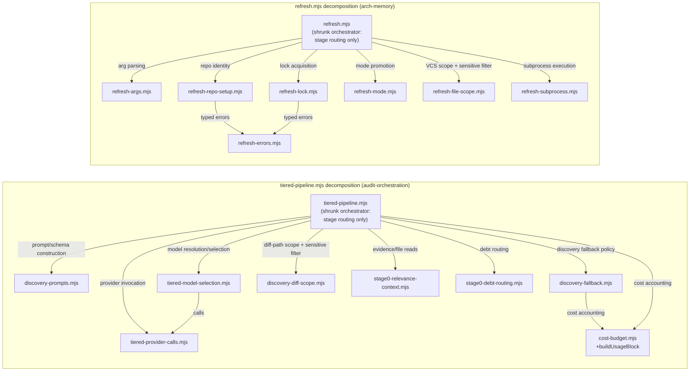

# Plan: Decompose `tiered-pipeline.mjs` and `refresh.mjs::main()` God-Modules

- **Date**: 2026-07-24
- **Status**: Complete — implemented autonomously via `/cycle --autonomous`
  (both clusters), audited (Cluster A: 3 GPT rounds to effective
  convergence; Cluster B: 1 GPT round, fix-gate final), and APPROVED by the
  mandatory consolidated Gemini gate over the union diff (round 1, 0 new
  findings, 0 wrongly dismissed, "Strong" architectural coherence). See
  Implementation Log below for the full round trail and the autonomous
  execution's own findings/fixes.
- **Author**: Claude + Louis Strydom
- **Scope**: backend

- **Target domain(s)**: `arch-memory`, `audit-orchestration`
- ⚠ **Cross-domain work** — touches 2 domains across 29 files (23 source/
  call-site files + 5 new test files added during round-1 plan audit +
  1 new error-class module added during round-3 plan audit). This is NOT
  new cross-domain wiring — the two targets share no files, no imports, and
  no runtime coupling; the split reflects two independent decompositions
  bundled into one plan because they were deferred by the same prior plan.

## Context Summary

[`docs/plans/arch-audit-pipeline-observability-hardening.md`](arch-audit-pipeline-observability-hardening.md)
(shipped 2026-07-24) explicitly deferred full decomposition of two
god-modules as accepted debt, via a right-sizing gate: for a 13-item punch
list, extracting only the ONE concern each item was already touching was
the correctly-scoped middle ground, and a full ~6-module split was
documented as "the over-engineered extreme" **for that plan's scope**, not
as a permanent verdict on the code. Its Risk & Trade-off Register recorded
this explicitly: *"explicitly NOT attempting full decomposition of either
god-module. Accepted per the right-sizing analysis above — tracked as
debt, not silently dropped."* This plan is that tracked debt's dedicated
follow-up — the same right-sizing question, re-asked with the actual
requirement (a real decomposition, not a punch-list side effect) in front
of it instead of behind it.

**Code Trace** (re-verified directly against HEAD 2026-07-24, both files
read in full):

- `scripts/lib/audit/tiered-pipeline.mjs` (1517 lines) — `runTieredAuditPipeline`
  (lines 687-1499, ~813 lines) is the Stage 0→1→2 orchestrator. It contains,
  INLINE (not as named top-level functions): discovery-generator schema/prompt
  construction (`anchorContract` + 5 zod schemas, lines 822-919, ~98 lines),
  the GLM and Sonnet discovery-provider closures (`glmCall`/`sonnetCall`,
  lines 920-1082, ~163 lines), Stage-1 triager selection wiring (lines
  1201-1229, ~29 lines), and a Gemini usage-metering wrapper (`meterGeminiCall`,
  lines 1274-1297, ~24 lines). Seven more concerns are ALREADY factored into
  named top-level functions but stay in this one file: `stripMaxLengthFor`
  (178-202), `resolveEligibleDiffPathMap` (204-226), `buildStage1TriagerPrompt`
  (240-251), `defaultTriagerCall`/`validatedTriagerCall` (265-322),
  `collectCandidateAnchorFiles`/`buildStage0RelevanceContext`/3 adapter
  factories (332-428), `extractCanonicalAnchorFile`/`buildPreExistingDebtEntry`/
  `routePreExistingIndependent` (439-534), `TieredUnavailableError`/
  `failRequiredGenerator`/`skippedNoGeneratorResult` (101-107, 551-589,
  636-681). Items 9/10 of the prior plan already touched (and this plan does
  NOT re-propose touching) the shadow-context construction seam in the
  SIBLING file `tiered-shadow-compare.mjs` — a different file entirely,
  confirmed by re-reading it is not `tiered-pipeline.mjs`.
- `scripts/symbol-index/refresh.mjs` (960 lines) — `main()` (lines 237-948,
  ~711 lines) is the refresh orchestrator. The prior plan's items 1-3 already
  extracted `persistExtractionCoverage` (194-222) and cleaned up
  `runWithHeartbeat` (224-235, dead `alive` var removed, heartbeat-failure
  logging added) — confirmed both already exist in their fixed form; not
  re-proposed. Residual concerns still inline in `main()`: arg parsing is
  ALREADY a named function (`parseArgs`, 136-154, plus `KNOWN_FLAGS` 132-134)
  but stays in this file; repo identity + registration (264-282, ~19 lines);
  lock acquisition with force-retry (284-335, ~52 lines, plus
  `walkStartCommit` resolution at 290-291); mode promotion (338-387, ~50
  lines, wrapping the already-exported pure `provenanceRequiresFullReembed`
  at 96-98); VCS-scope + sensitive-path-filtered file-list assembly
  (399-463, ~65 lines); subprocess execution — extract→summarise→embed spawns
  plus 8b timeout-recovery (471-571, ~101 lines, plus the already-exported
  pure `buildExtractSpawnOpts` at 116-118).

**Neighbourhood considered** (`get-neighbourhood`, k=8, both target files):
all 8 candidates banded `review` (`below-noise-floor` or unqualified
`review` — none `precedent`). The candidates ARE the functions this plan is
about to relocate (`parseArgs`, `logOk`/`logErr`, `buildStage0RelevanceContext`,
`resolveEligibleDiffPathMap`, `runTieredAuditPipeline`, `validatedTriagerCall`,
`skippedNoGeneratorResult`) — expected, since a decomposition plan's
"neighbours" are its own source functions, not external precedent. No
existing sibling module duplicates any of the seven new-module
responsibilities below. One naming collision avoided during exploration:
`scripts/lib/audit/diff-scope-resolver.mjs` already exists (git-ref → DiffScope
resolution for the orphan-introduced detector) — unrelated responsibility
(entry-point/pre-edge extraction, not diff-path-map + sensitive-path
filtering), but close enough in name that this plan's new
`discovery-diff-scope.mjs` is deliberately NOT named `diff-scope-resolver*`
to avoid confusion between two same-named-sounding-but-unrelated modules.

**Security incident check** (`get-incident-neighbourhood`, k=3): 2 records
returned — INC-002 (the 2026-07-14 DB wipe; `pathOverlap: false`, not
directly relevant — no test-DSN code is touched here) and INC-001 (the
symlink sensitive-path-classification bypass; `pathOverlap: false`,
directly relevant as a **lesson**, addressed below in Security
Considerations, since `refresh.mjs`'s sensitive-path-filtered file-list
assembly is one of the blocks being relocated).

**Known user-visible issues**: none — `PERSONA_TEST_REPO_NAME` signal is
n/a (backend scope, no persona-test history for this area; both files are
internal tooling with no UI).

## Proposed Architecture

Two independent decompositions, sharing no files. Each turns one
~700-800-line orchestrator function into a shrunk orchestrator (stage
routing only) plus N sibling modules, each owning exactly one of the
concerns the prior plan's own Code Trace already named.



### Design decisions

- **One file per named concern, siblings not layers** (#2 SOLID-SRP, #7
  Modularity). Tracing the actual call graph shows the new modules are
  almost entirely mutually independent — the orchestrator is the only
  thing that imports more than one of them. The single exception is
  `tiered-model-selection.mjs`, which calls `tiered-provider-calls.mjs`'s
  `defaultTriagerCall`/`validatedTriagerCall` (policy selecting mechanism).
  Documented under Phase 1.5 below. This is a flat "extract siblings"
  refactor, not a layered redesign — the safest shape for a
  behavior-preserving decomposition (#13 Idempotency of the refactor
  itself: re-running the extraction produces the same files).
- **No new abstraction layer** (#3 Open/Closed considered and rejected).
  GLM and Sonnet discovery calls have genuinely different shapes (different
  SDKs, different response parsing) — a common `DiscoveryAdapter` interface
  would be premature generalization for exactly 2 concrete
  implementations with no third on the horizon. `createGlmDiscoveryCall`
  and `createSonnetDiscoveryCall` stay two distinct, differently-shaped
  factory functions in the same file, not implementations of a shared
  interface.
- **Provider-call factories take explicit params, not closures over outer
  scope** (#6 Dependency Inversion, #11 Testability). Today `glmCall`/
  `sonnetCall` are closures capturing ~10 outer `runTieredAuditPipeline`
  locals directly. Once relocated they cannot close over anything outside
  their own file — `createGlmDiscoveryCall({ providers, model, contract,
  discoveryPlan, discoveryCode, recordUsage })` makes every dependency an
  explicit, injectable parameter. This is a genuine testability
  improvement, not just a relocation: each factory becomes independently
  unit-testable with a fake `providers` object, no `runTieredAuditPipeline`
  invocation required.
- **`buildUsageBlock` moves into the existing `cost-budget.mjs`, not a new
  file** (#1 DRY, #10 Single Source of Truth). It is a 5-line wrapper
  around `computeCostReport` (already in `cost-budget.mjs`) whose whole
  job is documented there ("costUsd null when nothing priced, never a
  fabricated 0"); colocating it with the function it wraps is more
  discoverable than adding an 8th tiered-pipeline sibling module for one
  function used by two callers.
- **`refresh.mjs`'s six new siblings inject `logOk`/`logErr` rather than
  duplicating them** (#1 DRY, #6 Dependency Inversion). `logOk`/`logErr`
  are one-line stderr writers; duplicating them into six files would
  violate Single Source of Truth for the `[refresh]` log prefix.
  `refresh.mjs` keeps owning them and passes them as explicit parameters
  into each extracted function that logs — the same adapter-injection
  pattern `tiered-pipeline.mjs` already uses for
  `blameAdapter`/`impactAdapter`/`headContentAdapter`. `throwVcsError`
  relocates into `refresh-file-scope.mjs` (its only call site) since it
  is a pure error-shaping helper with no dependency on the rest of
  `refresh.mjs`. **What this DI does NOT claim (round-1 finding
  correction)**: only the logging port is injected. `learning-store.mjs`,
  `vcs.mjs`, and `../lib/subprocess.mjs` stay static imports inside the
  new siblings, matching how every other module in this codebase already
  talks to the store/VCS/subprocess layer (no repo-wide port-injection
  convention exists to be consistent with, and introducing one here would
  be a materially larger architectural change than "decompose the god
  module" — its own right-sizing gate, not smuggled into this one).
  Concretely, this means the extracted functions are testable the SAME
  way equivalent code in this repo is already tested today: VCS-touching
  functions via real temporary git repos (`tests/helpers/fixtures.mjs`'s
  `gitInit`/`commit`, the pattern `tests/refresh-provenance-promotion.test.mjs`'s
  sibling suites already use), and store-touching functions via this
  repo's existing DB-integration-test doctrine (`assertDisposableDbUrl`,
  gated on `AUDIT_DB_TEST_URL`, skips gracefully when absent) — NOT via
  hand-rolled fake `{ repoIdentity, refreshStore, vcs, subprocess }`
  objects. The plan's first draft overclaimed "directly unit-testable
  with fake DB/client objects" for these six functions; that claim is
  withdrawn. Every one of the six still touches `learning-store`/`vcs`/
  `subprocess` directly, so the real testability win here is narrower
  than originally stated: it is the REMOVAL of `process.exit()` from
  library code (see `refresh-repo-setup.mjs`/`refresh-lock.mjs` below),
  which makes their ERROR paths assertable via a thrown-error value
  without a child-process harness — not full mock isolation of their
  DB/VCS paths, which stays integration-tested as today.
- **Both shrunk orchestrators keep "stage routing" as their own residual
  concern**, matching the prior plan's own item-12 framing verbatim (its
  Sustainability Notes named "stage routing" as the one concern that was
  NOT a decomposition target). `runTieredAuditPipeline` and `refresh.mjs
  main()` both stay as the sequencing shell that calls the extracted
  modules in the pipeline's documented order. **Round-2 finding
  correction**: "stage routing only" is precise for `tiered-pipeline.mjs`
  (its result-object literal aside, addressed in the Risk register), but
  was an overstatement for `refresh.mjs` — `main()` still directly INLINES
  the DB-persistence chain (steps 9-12b), copy-forward, publish, and
  calibration (steps 13-14), not just sequencing calls to named siblings.
  The accurate claim, matching the Risk register's own "Deliberately NOT
  decomposing further" entry: `refresh.mjs main()` is stage routing PLUS
  a deliberately-retained inline persistence/finalization block that does
  not meet this plan's extraction bar (see Out of Scope below) — not a
  pure sequencing shell. This is a wording fix, not a scope change: this
  plan does not stop being right-sized by clarifying an inaccurate
  self-description.

## Sustainability Notes

**Right-sizing gate — re-asked with this plan's own (different) scope**:

- **Band-aid** — leave both files exactly as the prior plan left them.
  Rejected: that is the exact debt this plan exists to pay down, and the
  prior plan's own Implementation Log observed the coupling was already
  getting WORSE, not stable ("this plan's own changes made the coupling
  worse, not better" — item 3's finding).
- **Over-engineered** — either (a) a file per individual function (would
  produce 20-30+ nano-modules and force a reader to jump between files to
  understand one pipeline stage), or (b) a generic provider-adapter
  registry/strategy-pattern abstraction unifying GLM/Sonnet/GPT discovery
  calls behind one interface. Both rejected: (a) has no current
  requirement — the seven/six concerns named by the prior plan's own Code
  Trace are the real fault lines, and splitting further would fragment
  cohesive units (e.g. `buildStage0RelevanceContext` + its 3 adapter
  factories are one concern, not three); (b) has no current requirement
  either — 2 concrete discovery providers with genuinely different call
  shapes do not justify a shared interface abstraction (YAGNI overrides
  the flexibility checklist here).
- **Chosen** — one file per concern the prior plan's own debt record
  already named (7 for `tiered-pipeline.mjs`: provider invocation, model
  resolution, prompt construction, discovery fallback policy, diff-path
  scope, evidence/file reads, plus debt-routing found during exploration
  as an equally cohesive 7th concern the original taxonomy didn't name
  but which meets the identical bar — self-contained, single-purpose,
  zero coupling to any other extracted module; 6 for `refresh.mjs`: arg
  parsing, repo identity, lock acquisition, mode promotion, VCS-scope +
  sensitive-path filtering combined into one file since they are two
  sequential steps of ONE pipeline stage rather than two independently
  callable concerns, and subprocess execution). Function signatures are
  preserved verbatim where they were already top-level exports; only the
  discovery-provider closures and the refresh logging calls change shape
  (closures → explicit-param factories / injected loggers), and both
  changes are required by the relocation itself, not speculative
  flexibility.

**Manual vs scripted**: every extraction is a judgment-heavy relocation
(deciding which outer-scope variable becomes which explicit parameter,
preserving exact behavior for ~15 documented historical bug-fix comments
per file) — done by hand, file by file. Not a candidate for a codemod:
the transformations are irregular (closures becoming factories is not a
mechanical rename) and there are only 19 new files (14 source, 5 test),
well under the ~5-SITE threshold where scripting would pay for itself —
the threshold is about the number of repeated, regular transformations at
one call pattern, not the number of files touched, and none of these 18
transformations repeat.

## File-Level Plan

### `tiered-pipeline.mjs` decomposition (audit-orchestration domain)

- **`scripts/lib/audit/discovery-prompts.mjs`** (create) — prompt +
  schema construction for the discovery generators.
  - `stripMaxLengthFor(jsonSchema, fieldName)` — moved verbatim (currently
    178-202).
  - `buildStage1TriagerPrompt(dto)` — moved verbatim (currently 240-251).
  - `buildDiscoveryContract(diffPathMap)` — NEW, extracts the currently-inline
    schema/anchor-contract block (currently 822-919): returns
    `{ diffPathTable, anchorContract, producerFindingSchema, glmLenientSchema,
    glmResponseValidationSchema, unclampedQuoteSchema, sonnetFindingsTool }`.
  - Depends on: `zod`, `../schemas.mjs` (`makeProducerFindingV3Schema`,
    `clampToJsonSchemaLimits`), `./diff-path-map.mjs` (`renderDiffPathTable`).
    No dependency on any other new module. (#2 SRP, #11 Testability — pure,
    no I/O, directly unit-testable.)

- **`scripts/lib/audit/tiered-provider-calls.mjs`** (create) — all provider
  invocation.
  - `defaultTriagerCall(dto, providers)` — moved verbatim (265-280).
  - `validatedTriagerCall(dto, providers, model)` — moved verbatim (294-322).
  - `createGlmDiscoveryCall({ providers, model, contract, discoveryPlan,
    discoveryCode, recordUsage })` — NEW factory wrapping the currently-inline
    `glmCall` closure (920-982); returns the async call.
  - `createSonnetDiscoveryCall({ providers, ctx, contract, discoveryPlan,
    discoveryCode, recordUsage })` — NEW factory wrapping the currently-inline
    `sonnetCall` closure (994-1082); returns the async call.
  - `wrapWithUsageMetering(fn, recordUsage)` — NEW, relocated from the
    currently-inline `meterGeminiCall` (1274-1297), body unchanged. Renamed
    because its two call sites (`providers.geminiReviewCall`,
    `providers.geminiCleanRegionCall`) can each resolve to Gemini, Opus, or
    Azure-Claude depending on `gemini-review.mjs`'s own provider
    precedence — `meterGeminiCall` already named the wrong invariant today.
    **Not a general provider-agnostic wrapper** (round-1 finding: the
    plan's first draft implied it could wrap "whichever provider call the
    caller passes", which is false — GLM/Sonnet discovery calls have a
    different raw response shape and are metered via `recordUsage` calls
    built inline in their own factories, not through this wrapper). Its
    contract is scoped and documented: `fn` must resolve to a value
    carrying the Stage-2 adjudication result shape `{ _usage?:
    {input_tokens, output_tokens, thinking_tokens?}, _model?: string,
    ...rest }` (the `gemini-review.mjs --out` JSON shape, regardless of
    which underlying model produced it) — the wrapper reads exactly those
    two optional fields and forwards `...rest` unchanged; it does not
    interpret or require anything else. A doc comment states this
    explicitly so a future caller cannot mistake it for a general adapter.
  - Depends on: `../llm-helpers.mjs` (`callGPT`), `../model-resolver.mjs`
    (`resolveModel` — one level up from `scripts/lib/audit/` to
    `scripts/lib/`, matching the import `tiered-pipeline.mjs` itself
    already uses at its line 72; the plan's own first draft mis-stated
    this as `../../model-resolver.mjs`, flagged and fixed round 1). No
    dependency on `discovery-prompts.mjs` — the orchestrator builds the
    contract first and passes the finished prompt/schema objects in as
    plain data.

- **`scripts/lib/audit/tiered-model-selection.mjs`** (create) — model
  resolution/selection policy.
  - `selectStage1TriagerCall({ tieredAuditConfig, providers, recordUsage,
    openaiConfig })` — NEW, wraps the currently-inline Stage-1 triager
    selection block (1201-1229): calls `resolveStage1TriagerModel`, decides
    validated-vs-default, logs the reason via `process.stderr.write` exactly
    as today, returns the ready-to-call `triagerCall` closure.
  - Depends on: `./stage1-triager-resolver.mjs` (`resolveStage1TriagerModel`),
    **and `./tiered-provider-calls.mjs`** (`defaultTriagerCall`,
    `validatedTriagerCall`) — the one real inter-module edge in this
    decomposition (policy calls mechanism).

- **`scripts/lib/audit/discovery-fallback.mjs`** (create) — discovery
  fallback policy.
  - `TieredUnavailableError` class — moved verbatim (101-107).
  - `failRequiredGenerator(ctx, reason, discoveryGeneratorOutcomes)` — moved
    verbatim (551-589), including its dynamic `import('./legacy-production-audit.mjs')`.
  - `skippedNoGeneratorResult(ctx, map, startedAt)` — moved verbatim (636-681).
  - Depends on: `./cost-budget.mjs` (`buildUsageBlock`, relocated there —
    see below; same directory, `scripts/lib/audit/`, not `../` — the
    plan's own first draft mis-stated this too, flagged and fixed round 1).

- **`scripts/lib/audit/discovery-diff-scope.mjs`** (create) — diff-path
  scope resolution with sensitive-path filtering.
  - `resolveEligibleDiffPathMap(diffText)` — moved verbatim (204-226).
  - Depends on: `./diff-path-map.mjs` (`buildDiffPathMap`), `../sensitive-paths.mjs`
    (`shouldSkipForIndexing`, `normalisePath`). Named `discovery-diff-scope.mjs`,
    NOT `diff-scope-resolver.mjs` — that name is already taken by an
    unrelated module (orphan-introduced detector's git-ref resolver);
    reusing it would be a false-precedent collision.

- **`scripts/lib/audit/stage0-relevance-context.mjs`** (create) — evidence/
  file-read caching for Stage 0.
  - `collectCandidateAnchorFiles(envelopes)` — moved verbatim (332-348).
  - `buildStage0RelevanceContext(ctx, envelopes)` — moved verbatim (370-408).
  - `makeHeadContentAdapter(stage0Ctx)`, `makeImpactAdapter(stage0Ctx)`,
    `makeBlameAdapter(stage0Ctx, baseRef)` — moved verbatim (410-428).
  - Depends on: `../file-io.mjs` (`safeReadFile`), `../vcs.mjs`
    (`contentExistsAtMappedRange`, `gitShowFileAtRevision`), `../store/arch/imports.mjs`
    (`getFreshImportersOrNull`), `../repo-identity.mjs` (`resolveRepoIdentity`).

- **`scripts/lib/audit/stage0-debt-routing.mjs`** (create) — pre-existing-
  independent candidate → debt-ledger routing. Not in the prior plan's
  named 5/6-concern list, but discovered during exploration to meet the
  identical bar for extraction: self-contained (439-534, ~95 lines), zero
  coupling to any other extracted module, its own doc comments already
  describe it as one cohesive decision (batch-reconciled debt routing,
  decision #9).
  - `extractCanonicalAnchorFile(canonicalFinding)` — moved verbatim (439-444).
  - `PRE_EXISTING_DEBT_RATIONALE` constant — moved verbatim (446).
  - `buildPreExistingDebtEntry(envelope, runId)` — moved verbatim (454-475).
  - `routePreExistingIndependent(preExistingIndependent, ctx)` — moved
    verbatim (490-534).
  - Depends on: `../debt-ledger.mjs` (`writeDebtEntries`), `../debt-capture.mjs`
    (`buildDebtEntry`).

- **`scripts/lib/audit/cost-budget.mjs`** (modify) — add `buildUsageBlock`
  (currently tiered-pipeline.mjs 630-634), colocated next to
  `computeCostReport`, which it wraps. Same signature:
  `buildUsageBlock(usageEvents, acceptedFindings = [], droppedCount = 0)`.

- **`scripts/lib/audit/tiered-pipeline.mjs`** (modify) — shrinks to:
  module docblock (updated to describe the new file layout), imports from
  the 7 new siblings + `cost-budget.mjs`, and `runTieredAuditPipeline`
  itself reduced from ~813 to an estimated ~400-450 lines (stage sequencing
  + the final result-object literal, which is not further decomposed — a
  single "build the result contract" step matching the shared
  `AuditRunResultSchema`, not a repeated pattern worth extracting). The
  `AUDIT_EXPORTS_FOR_TESTS`/`__testExports` gate is REMOVED — every function
  it used to expose now has its own file and is a plain export there, so
  the gate has nothing left to guard for this file (it existed specifically
  to hide internal helpers of a file with one dominant public export; once
  those helpers move to single-purpose files, gating them is no longer
  meaningful — a 20-40 line file's whole surface IS its API, unlike a
  1500-line file's).

### `tiered-pipeline.mjs` decomposition — call-site + test updates

- **`scripts/verify-anchor-contract.mjs`** (modify) — `TieredUnavailableError`
  import moves from `./lib/audit/tiered-pipeline.mjs` to `./lib/audit/discovery-fallback.mjs`.
- **`scripts/lib/audit/tiered-shadow-compare.mjs`** (modify) — same import
  path update for `TieredUnavailableError`.
- **`tests/tiered-pipeline-wiring.test.mjs`** (modify) — `TieredUnavailableError`
  import path update; `runTieredAuditPipeline` import unchanged (still
  exported from `tiered-pipeline.mjs`).
- **`tests/tiered-pipeline-stage0-wiring.test.mjs`** (modify) — replace the
  `AUDIT_EXPORTS_FOR_TESTS=1` + dynamic-import + `__testExports` destructure
  (its current lines 28-35) with plain top-level imports from the 3 new
  homes: `stage0-relevance-context.mjs` (`collectCandidateAnchorFiles`,
  `buildStage0RelevanceContext`, `makeHeadContentAdapter`, `makeImpactAdapter`,
  `makeBlameAdapter`), `stage0-debt-routing.mjs` (`extractCanonicalAnchorFile`,
  `buildPreExistingDebtEntry`, `routePreExistingIndependent`),
  `discovery-diff-scope.mjs` (`resolveEligibleDiffPathMap`),
  `discovery-prompts.mjs` (`stripMaxLengthFor`). Update the file's own
  docblock (currently explains the freezing hazard that motivated the
  dynamic-import dance) — that hazard no longer applies once these are
  plain exports of dedicated files; state so explicitly rather than leaving
  a stale rationale. This is a genuine test-simplification, not just an
  import-path churn.

### `refresh.mjs` decomposition (arch-memory domain)

- **`scripts/symbol-index/refresh-args.mjs`** (create) — arg parsing.
  - `KNOWN_FLAGS` — moved verbatim (132-134), including its doc comment.
  - `parseArgs(argv)` — moved verbatim (136-154), now exported (was
    file-local).
  - Depends on: `../lib/cli-io.mjs` (`assertKnownFlags`).

- **`scripts/symbol-index/refresh-repo-setup.mjs`** (create) — repo
  identity resolution + registration.
  - `assertRegisteredRepo(repo)` — NEW, a small PURE guard extracted
    specifically for testability (round-2 finding fix, see below): throws
    `RepoRegistrationError` (see `refresh-errors.mjs` below) when `repo`
    is falsy, otherwise returns `repo` unchanged. No I/O, no imports
    beyond the error class — deterministically unit-testable with a bare
    `null` input, no store mock required.
  - `resolveAndRegisterRepo(repoRoot)` — NEW, wraps `resolveRepoIdentity` +
    `persistRepoIdentity` + `upsertRepoByUuid` + `assertRegisteredRepo`
    (currently 264-282); returns **`{ repoId }`** (round-3 finding fix,
    L1 — narrowed from `{ identity, repo, repoId }`: `identity` is never
    read again anywhere in `main()` after `persistRepoIdentity`'s side
    effect, confirmed by re-tracing the source, so returning it would be
    exporting dead state as public sibling-module API; `repo` likewise
    has no consumer beyond the `repoId` field already extracted here). A
    zero-risk drive-by cleanup, not a scope expansion — matching this
    repo's own established "already touching this code" trigger (the
    prior plan's item 1 dropped the dead `alive` variable the same way).
    **Round-1 finding fix**: the plan's first draft had this call
    `process.exit(1)` directly on a null `upsertRepoByUuid` result — a
    library module terminating the process is exactly the case
    AGENTS.md's own Accepted Technical Debt table names as the revisit
    trigger for `process.exit()` helpers ("if ever called from a library
    context"). This now THROWS (via `assertRegisteredRepo`) instead;
    `refresh.mjs`'s `main()` catches `RepoRegistrationError` and performs
    the exact same `logErr(...); process.exit(1)` it does today — the
    orchestrator, not the helper, owns process termination. No behavior
    change in what gets logged or which exit code is used.
  - Depends on: `../lib/repo-identity.mjs` (`resolveRepoIdentity`,
    `persistRepoIdentity`), `../learning-store.mjs` (`upsertRepoByUuid`),
    `./refresh-errors.mjs` (`RepoRegistrationError`).

- **`scripts/symbol-index/refresh-lock.mjs`** (create) — lock acquisition.
  - `resolveWalkStartCommit(repoRoot)` — NEW, thin wrapper around
    `vcs.gitCommitSha` (currently inline at 290-291).
  - `classifyLockOpenError(err, { force })` — NEW, a small PURE classifier
    extracted specifically for testability (round-2 finding fix, see
    below): given the error `openRefreshRun` threw and whether `--force`
    was passed, returns one of `{action: 'exit-in-flight'}` (REFRESH_IN_FLIGHT,
    no force), `{action: 'retry-with-abort'}` (REFRESH_IN_FLIGHT, force),
    or `{action: 'rethrow'}` (anything else) — mirrors the current bare
    `if/else if/else` exactly (301-335), with no I/O. Deterministically
    unit-testable with constructed fake error objects
    (`{code: 'REFRESH_IN_FLIGHT'}`, `{code: 'SOMETHING_ELSE'}`).
  - `acquireRefreshLock({ repoId, mode, walkStartCommit, force, logOk })`
    — NEW, wraps the try/catch/retry-on-force `openRefreshRun` sequence
    (currently 301-335) using `classifyLockOpenError` to decide the
    branch, including the `--force` abort-and-retry branch calling
    `findStaleRunningRefresh`/`abortRefreshRun`. Returns **`{ refreshId
    }`** (round-3 finding fix, L1 — narrowed from `{ refreshId,
    cancellationToken }`: `cancellationToken` is captured but never read
    anywhere in `refresh.mjs`, before or after this plan, per the grep
    cited in the wiring table's step-4 row; dropping it from the return
    contract is a zero-risk drive-by cleanup of pre-existing dead state,
    matching the same "already touching this code" trigger as
    `resolveAndRegisterRepo`'s `identity`/`repo` narrowing above — NOT a
    removal of live cancellation functionality, since none currently
    exists). **Round-1 finding fix (same process.exit()-in-a-library
    issue as `resolveAndRegisterRepo` above)**: throws a typed
    `RefreshInFlightError` on the `exit-in-flight` classification, and a
    typed `LockAbortError` if the `retry-with-abort` path's own abort
    attempt fails; `main()` catches each and performs the exact same
    `logErr(...); process.exit(2)` behavior it does today for both cases.
    The `rethrow` classification re-throws the original error unchanged
    (matching the current bare `else { throw err; }`).
  - Depends on: `../lib/vcs.mjs`, `../learning-store.mjs`
    (`openRefreshRun`, `findStaleRunningRefresh`, `abortRefreshRun`),
    `./refresh-errors.mjs` (`RefreshInFlightError`, `LockAbortError`).

- **`scripts/symbol-index/refresh-errors.mjs`** (create) — round-3 finding
  fix (H1): the canonical, single home for the three typed errors
  `refresh-repo-setup.mjs`/`refresh-lock.mjs` throw and `refresh.mjs`
  catches, so their contract exists in exactly one place rather than
  being implicitly defined by whichever file happens to construct them
  first. Each class carries only a `message` (no extra fields — none of
  the three original inline branches carried structured data beyond the
  log string) and preserves the EXACT current message text verbatim:
  - `class RepoRegistrationError extends Error {}` — message:
    `'upsertRepoByUuid returned null — aborting'` (currently line 279).
  - `class RefreshInFlightError extends Error {}` — message: the current
    `err.message` from `openRefreshRun`'s own `REFRESH_IN_FLIGHT` throw,
    passed through unchanged (currently line 308's `logErr(err.message)`
    — the error text originates in `learning-store.mjs`, not this file,
    so the typed wrapper forwards it rather than re-deriving it).
  - `class LockAbortError extends Error {}` — message: the current
    ``--force: failed to abort prior run: ${abortErr.message}`` template
    (currently line 326).
  - No `code`/`cause` fields beyond the message — the three `main()`
    catch arms distinguish which happened by `instanceof`, not by an
    error code, matching this file's existing convention for its own
    `throwVcsError`-shaped errors elsewhere (those use `.code`/`.vcsCode`
    specifically because ONE generic catch needs to branch on many VCS
    outcomes; these three each have exactly one meaning and one
    `instanceof` check is simpler and equally sufficient).
  - **Catch nesting/order in `main()`** (round-3 finding fix, H1): the
    three new `catch` arms are separate, EARLIER blocks in the SAME
    surrounding `try` that already exists in `main()` today (not nested
    inside `runWithHeartbeat`'s own try — lock acquisition and repo
    registration happen BEFORE `runWithHeartbeat` is ever called, exactly
    where their un-extracted inline forms run today), each checked via
    `instanceof` BEFORE the existing generic `catch (err) { ... }` block:
    ```js
    try {
      const { repoId } = await resolveAndRegisterRepo(repoRoot);
      // ...
      const { refreshId } = await acquireRefreshLock({ ... });
      // ...
    } catch (err) {
      if (err instanceof RepoRegistrationError) { logErr(err.message); process.exit(1); }
      if (err instanceof RefreshInFlightError) { logErr(err.message); process.exit(2); }
      if (err instanceof LockAbortError) { logErr(err.message); process.exit(2); }
      // falls through to the EXISTING generic handling for everything else
      // (unchanged — the same block that already handles subprocess/VCS
      // failures from steps 6-14, per the Sequencing Shell section)
    }
    ```
    This preserves the exact current exit codes (1 for repo registration,
    2 for both lock cases) and log content, and does not change which
    single `catch` block ultimately handles unrelated errors.

- **`scripts/symbol-index/refresh-mode.mjs`** (create) — mode promotion.
  - `provenanceRequiresFullReembed(prior, nextProvenanceId)` — moved
    verbatim (currently 96-98, already exported and test-covered by
    `tests/refresh-provenance-promotion.test.mjs`).
  - `finalizeRefreshMode({ mode, sinceCommit, repoId, embedProfile, logOk
    })` — NEW, wraps the "Finalize scope under the running lock" block
    (currently 338-387): the provenance-change guard AND the no-anchor
    promotion. Returns `{ mode, sinceCommit, prior }`. **Risk**: this is
    the item the prior plan's Risk & Trade-off Register flagged (item 8,
    a different item, but the same file area) as touching code with a
    documented prior calibration-validity incident — re-read
    `docs/plans/arch-memory-band-recalibration.md` §"Round-2 findings" in
    full before implementing, and preserve the exact escalation order
    (provenance-change guard checked BEFORE the no-anchor check, `else
    if`) since a reordering would change which log line fires when both
    conditions are true.
  - Depends on: `../learning-store.mjs` (`getActiveSnapshot`,
    `getRefreshRun`).

- **`scripts/symbol-index/refresh-file-scope.mjs`** (create) — VCS scope +
  sensitive-path filtering + file-list assembly, combined into one file
  since they are sequential steps of ONE pipeline stage (git diff → filter
  → union with the summary-retry queue → restrictFiles/touchedSet), not
  two independently callable concerns.
  - `throwVcsError(err)` — moved verbatim (currently 168-175; relocates
    here since this is its only call site).
  - `resolveIncrementalFileScope({ mode, repoRoot, sinceCommit, repoId,
    prior, logOk })` — NEW, wraps the currently-inline enumerate-files
    block **including its existing guard clause** (399:
    `if (mode === 'incremental' && sinceCommit) { ... }`). **Round-1
    finding fix**: the plan's first draft specified this as called
    unconditionally with no documented full-mode/no-anchor behavior — but
    the source's own guard already answers this exactly: when
    `mode !== 'incremental' || !sinceCommit`, the block never runs and
    `restrictFiles`/`touchedSet`/`diffStats` stay at their declared `null`
    defaults (391-393, 398). The extracted function reproduces this
    verbatim as an internal early return:
    ```js
    export function resolveIncrementalFileScope({ mode, sinceCommit, ... }) {
      if (mode !== 'incremental' || !sinceCommit) {
        return { restrictFiles: null, touchedSet: null, diffStats: null };
      }
      // ...existing git-diff + filterDiffFiles + retry-queue body...
    }
    ```
    A full run (or an incremental run mode-promoted to `full` by
    `finalizeRefreshMode`) therefore gets the exact same
    `{restrictFiles: null, touchedSet: null, diffStats: null}` it gets
    today — one function, one contract, both modes, not two functions or
    a mode-branch in `main()`. `main()` calls it unconditionally and
    always receives a fully-defined result. Inside: `vcs.gitDiffWithWorkingTree`
    + `throwVcsError` on failure + `filterDiffFiles` (sensitive-path
    filtering) + `formatSkipLog` + fileList assembly + the NULL-SUMMARY
    RE-QUEUE union (`listFilesNeedingSummaryRetry`). Returns
    `{ restrictFiles, touchedSet, diffStats }` in all cases.
  - Depends on: `../lib/vcs.mjs`, `../lib/sensitive-paths.mjs`
    (`filterDiffFiles`, `formatSkipLog`), `../learning-store.mjs`
    (`listFilesNeedingSummaryRetry`).
  - **Security**: this is the block INC-001's lesson applies to — the
    relocation MUST call `filterDiffFiles` exactly as today (same args,
    same import), never reimplement or inline any part of the
    classification logic. `filterDiffFiles` already resolved INC-001's
    symlink-canonicalization gap upstream in `sensitive-paths.mjs`; this
    plan touches only the CALLER, not the classifier.

- **`scripts/symbol-index/refresh-subprocess.mjs`** (create) — subprocess
  execution.
  - `buildExtractSpawnOpts(coverageConfig)` — moved verbatim (currently
    116-118, already exported and test-covered by
    `tests/subprocess-idle-timeout.test.mjs`).
  - `sibling(name)` helper — moved verbatim (currently 82; its only
    remaining use site after this extraction).
  - `runExtractSummariseEmbed({ repoRoot, repoId, mode, restrictFiles,
    includeDelegates, coverageConfig, concreteEmbedModel, logOk })` — NEW,
    wraps steps 6-8 + 8b (currently 471-571): the extract/summarise/embed
    `runJsonLinesAsyncStrict` spawns (including the temp `--files-from`
    manifest write/cleanup), the extraction-idle-timeout catch, and the
    timed-out-full recovery decision (`timeoutRecovery`). Returns
    `{ finalSymbols, violations, importEdges, coverageLine,
    extractionTimedOut, timeoutRecovery, recoveredTouchedSet }`.
    **Round-2 finding fix**: within the source range this wraps (471-571),
    `touchedSet` is WRITE-ONLY — the 8b recovery branch (`touchedSet = new
    Set(finalSymbols.map(...))`, line 563) never reads the step-6 value
    first, it unconditionally overwrites it. So the extracted function
    needs NO `touchedSet` input at all, and its output field is named
    `recoveredTouchedSet` (not `touchedSet`) specifically so it cannot be
    mistaken for an unconditional replacement: it is a `Set` ONLY when
    `mode === 'full' && extractionTimedOut && priorForRecovery?.refreshId`
    (the exact 8b condition), and `null` otherwise. `main()`'s
    consumption is therefore a CONDITIONAL rebind, never a destructuring
    overwrite: `if (result.recoveredTouchedSet) touchedSet =
    result.recoveredTouchedSet;` — on every other path, the step-6
    `touchedSet` value (from `resolveIncrementalFileScope`) passes through
    completely untouched. (The plan's round-1 wiring-table fix had this
    backwards — it described an unconditional destructure that would have
    silently replaced a valid step-6 `Set` with `undefined` on the
    ordinary incremental path; caught and corrected in round 2.)
  - `shouldAttemptTimeoutRecovery({ mode, extractionTimedOut })` — NEW, a
    small PURE gate extracted specifically for testability (Gemini-gate
    finding fix, round 1 of the final review): returns the exact boolean
    the 8b `if` condition currently tests (`mode === 'full' &&
    extractionTimedOut`), synchronous, no I/O. `runExtractSummariseEmbed`
    calls this FIRST and only calls `getActiveSnapshot(repoId)` when it
    returns `true` — matching the source's current behavior of never
    issuing that DB read otherwise.
  - `buildTimeoutRecovery({ priorForRecovery, finalSymbols })` — NEW, a
    small PURE decision function (same testability motivation): given the
    `getActiveSnapshot` result and the reached symbols, returns
    `{ timeoutRecovery, recoveredTouchedSet }` — both `null` when
    `priorForRecovery?.refreshId` is falsy, otherwise
    `{ timeoutRecovery: { prior: priorForRecovery }, recoveredTouchedSet:
    new Set(finalSymbols.map(s => s.filePath)) }`, reproducing the 8b
    branch verbatim. No I/O — the DB read already happened in the caller;
    this function only makes the decision from its RESULT.
    `runExtractSummariseEmbed` performs the two existing `logOk(...)`
    WARNING messages (success-with-recovery vs. no-prior-to-recover-from)
    itself, driven by which shape `buildTimeoutRecovery` returned —
    logging stays in the impure orchestrator, not the pure decision
    functions, matching this plan's `classifyLockOpenError`
    (`refresh-lock.mjs`) precedent exactly.
  - Depends on: `../lib/subprocess.mjs` (`runJsonLinesAsyncStrict`,
    `SUBPROC_ERROR_CODES`), `../learning-store.mjs` (`getActiveSnapshot`,
    for the 8b recovery's prior-snapshot lookup).

- **`scripts/symbol-index/refresh.mjs`** (modify) — shrinks to: module
  docblock (updated), `logErr`/`logOk` (stay here — the injected
  dependency, per the Design Decisions above), imports from the 7 new
  siblings (including `refresh-errors.mjs`), and `main()` reduced from
  ~711 lines to the sequencing shell described in the wiring table
  immediately below. `main()` also gains three new `instanceof` `catch`
  branches for `RepoRegistrationError`/`RefreshInFlightError`/
  `LockAbortError` (see `refresh-errors.mjs` above for the exact
  structure) — each reproducing the exact `logErr` + `process.exit(<code>)`
  the removed inline logic used to perform directly. `runWithHeartbeat`
  and `persistExtractionCoverage` (both already-fixed by the prior plan)
  are NOT touched by this plan.

#### Sequencing shell — `main()` wiring table (round-1 finding fix; error
handling + heartbeat scope corrected round 3)

The prior draft described the call order in prose only, which left several
things unspecified: where each function's return value is consumed
downstream, the canonical home and catch order for the three typed
errors (now specified in `refresh-errors.mjs` above), and the EXACT
lexical extent of `runWithHeartbeat`'s callback. This table is the
acceptance artifact for Phase 5: every extracted return value must appear
on the consumer side exactly as listed, with no field silently dropped.

**Heartbeat boundary (round-3 finding fix, H2)**: re-tracing the current
source precisely — `runWithHeartbeat(refreshId, 15_000, async () => {
...})`'s callback opens at step 6 (currently line 391, the start of the
"4. Enumerate files" block) and closes AFTER band calibration and the
final `process.stdout.write` (currently line 907, immediately before the
top-level `catch`). It encloses steps 6 through 14 **in full** — file-scope
resolution, subprocess execution, every DB upsert (9-12b), coverage
persistence, copy-forward, publish, AND band calibration — not just step
6 in isolation. Steps 1-5 (repo registration through mode finalization)
run BEFORE `runWithHeartbeat` is entered, matching their current
un-extracted position. This plan does not change that boundary in any
way — it stays exactly where it is today; the table below marks it
explicitly so no implementer narrows or widens it by assumption. A
heartbeat failure inside the callback is caught and logged internally by
`runWithHeartbeat` itself (already fixed by the prior plan's item 2) and
does not abort the wrapped `fn` — this is unchanged, pre-existing
behavior, not a claim newly introduced here.

| Step | Call | Returns | Consumed by |
|---|---|---|---|
| 1 | `resolveAndRegisterRepo(repoRoot)` | `{ repoId }` | `repoId` → steps 2-14 (nearly everything) |
| 2 | (unchanged) embed-model resolution | `{ concreteEmbedModel, embedProfile, embedDim }` | `embedProfile`/`embedDim` → step 8, `finalizeRefreshMode`, publish; `concreteEmbedModel` → `runExtractSummariseEmbed`, log line |
| 3 | `resolveWalkStartCommit(repoRoot)` | `walkStartCommit` | → step 4 (`acquireRefreshLock`) |
| 4 | `acquireRefreshLock({ repoId, mode, walkStartCommit, force: args.force, logOk })` | `{ refreshId }` | `refreshId` → steps 5-14, `runWithHeartbeat`, the top-level catch |
| 5 | `finalizeRefreshMode({ mode, sinceCommit: args.sinceCommit, repoId, embedProfile, logOk })` | `{ mode, sinceCommit, prior }` | `mode`/`sinceCommit` → step 6 (`resolveIncrementalFileScope`) and `runExtractSummariseEmbed`; `prior` → step 6 (retry-queue lookup) and the copy-forward block (step 13, unchanged). **Runs BEFORE `runWithHeartbeat` opens** (matching the source today — mode finalization is not itself heartbeat-monitored, only the long-running work after it is) |
| — | **`runWithHeartbeat(refreshId, 15_000, async () => { … })` opens here** (round-4 Gemini finding fix — this delimiter previously sat ABOVE step 5, contradicting step 5's own "runs BEFORE" text; moved to its correct position) — everything from step 6 onward runs inside this one callback, per the Heartbeat boundary note above | | |
| 6 | `resolveIncrementalFileScope({ mode, repoRoot, sinceCommit, repoId, prior, logOk })` | `{ restrictFiles, touchedSet, diffStats }` | `restrictFiles` → step 7; `touchedSet` → step 7 (may be conditionally overridden by its 8b recovery), the pragma-scoping block (unchanged), and step 13 copy-forward (unchanged); `diffStats` → the differential-churn log line (unchanged) |
| 7 | `runExtractSummariseEmbed({ repoRoot, repoId, mode, restrictFiles, includeDelegates: args.includeDelegates, coverageConfig, concreteEmbedModel, logOk })` | `{ finalSymbols, violations, importEdges, coverageLine, extractionTimedOut, timeoutRecovery, recoveredTouchedSet }` | `finalSymbols`/`violations`/`importEdges`/`coverageLine` → steps 9-12b DB upserts (unchanged); `extractionTimedOut` → `persistExtractionCoverage` (unchanged call site); `timeoutRecovery` → step 13 copy-forward (unchanged); **`recoveredTouchedSet` CONDITIONALLY rebinds** the step-6 `touchedSet`: `if (recoveredTouchedSet) touchedSet = recoveredTouchedSet;` — non-null only on the timed-out-full recovery path |
| 8-14 | (unchanged) DB upserts, pragma resolution, import-edge persistence, `persistExtractionCoverage`, copy-forward, publish, band calibration | — | all still inside the same `runWithHeartbeat` callback, unchanged from today |

**`catch` structure** (round-3 finding fix, H1 — the exact nesting, per
`refresh-errors.mjs`'s pseudocode above): the three typed-error `catch`
arms sit in the SAME surrounding `try` that already wraps steps 1-4 today
(repo registration + lock acquisition), checked via `instanceof` BEFORE
the existing generic handler. Every other thrown error — including
everything from steps 5-14, all of it inside `runWithHeartbeat` — falls
through to the EXISTING top-level catch (unchanged — still reads
`err.code`/`err.vcsCode`/`err.stage` exactly as today, regardless of
which extracted function threw it: `resolveIncrementalFileScope`'s
`throwVcsError` and `runExtractSummariseEmbed`'s subprocess errors both
already carry the exact error shape that catch block expects, since those
code paths moved verbatim). The three typed errors and the generic
handler are the SAME `catch` block with `instanceof` branches at its top,
not two separate `try`/`catch` statements — `refresh-errors.mjs`'s
pseudocode shows this precisely.

### `refresh.mjs` decomposition — test updates

- **`tests/cli-unknown-flags.test.mjs`** (modify) — `KNOWN_FLAGS` import
  path: `../scripts/symbol-index/refresh.mjs` → `../scripts/symbol-index/refresh-args.mjs`.
- **`tests/subprocess-idle-timeout.test.mjs`** (modify) — `buildExtractSpawnOpts`
  import path: `../scripts/symbol-index/refresh.mjs` → `../scripts/symbol-index/refresh-subprocess.mjs`.
- **`tests/refresh-provenance-promotion.test.mjs`** (modify) —
  `provenanceRequiresFullReembed` import path: `../scripts/symbol-index/refresh.mjs`
  → `../scripts/symbol-index/refresh-mode.mjs`.

### Implementation Phases

Gate 1 fired (29 files, 2 domains). Phase 1.5 execution-model check: the
extractions are almost entirely independent siblings — the ONE real import
edge is `tiered-model-selection.mjs` → `tiered-provider-calls.mjs`
(Phase 1 below sequences accordingly). `refresh.mjs`'s six new modules have
ZERO import edges between them; ordering across Phases 4-5 is purely for
reviewable chunk size, not a dependency requirement.

**Phase 1 — `tiered-pipeline.mjs`: prompt/schema construction + provider
invocation + model selection**: Files: `scripts/lib/audit/discovery-prompts.mjs`
(create), `scripts/lib/audit/tiered-provider-calls.mjs` (create),
`scripts/lib/audit/tiered-model-selection.mjs` (create),
`scripts/lib/audit/cost-budget.mjs` (modify),
`tests/tiered-provider-calls.test.mjs` (create),
`tests/tiered-model-selection.test.mjs` (create)

**Phase 2 — `tiered-pipeline.mjs`: diff-scope, fallback policy, Stage-0
context, debt routing**: Files: `scripts/lib/audit/discovery-diff-scope.mjs`
(create), `scripts/lib/audit/discovery-fallback.mjs` (create),
`scripts/lib/audit/stage0-relevance-context.mjs` (create),
`scripts/lib/audit/stage0-debt-routing.mjs` (create)

**Phase 3 — `tiered-pipeline.mjs`: rewire orchestrator + update call sites
+ tests**: Files: `scripts/lib/audit/tiered-pipeline.mjs` (modify),
`scripts/verify-anchor-contract.mjs` (modify),
`scripts/lib/audit/tiered-shadow-compare.mjs` (modify),
`tests/tiered-pipeline-wiring.test.mjs` (modify),
`tests/tiered-pipeline-stage0-wiring.test.mjs` (modify)

**Phase 4 — `refresh.mjs`: args, repo-setup, lock, mode-promotion**: Files:
`scripts/symbol-index/refresh-args.mjs` (create),
`scripts/symbol-index/refresh-errors.mjs` (create),
`scripts/symbol-index/refresh-repo-setup.mjs` (create),
`scripts/symbol-index/refresh-lock.mjs` (create),
`scripts/symbol-index/refresh-mode.mjs` (create),
`tests/refresh-repo-setup.test.mjs` (create),
`tests/refresh-lock.test.mjs` (create),
`tests/refresh-provenance-promotion.test.mjs` (modify — add
`finalizeRefreshMode` cases, not just an import-path change)

**Phase 5 — `refresh.mjs`: file-scope + subprocess execution; rewire
`main()` + update tests**: Files: `scripts/symbol-index/refresh-file-scope.mjs`
(create), `scripts/symbol-index/refresh-subprocess.mjs` (create),
`scripts/symbol-index/refresh.mjs` (modify),
`tests/cli-unknown-flags.test.mjs` (modify),
`tests/subprocess-idle-timeout.test.mjs` (modify — import-path only),
`tests/refresh-subprocess-recovery.test.mjs` (create)

**Close-out (not a phase)**:

1. **Export-migration verification (round-1 finding fix; broadened round
   2 — mandatory, before step 2)**: before removing any export from
   `tiered-pipeline.mjs` or `refresh.mjs`, audit the WHOLE repo (not just
   the call sites this plan already names) for every symbol this plan
   relocates — `TieredUnavailableError`, `KNOWN_FLAGS`,
   `buildExtractSpawnOpts`, `provenanceRequiresFullReembed`, and each name
   previously reachable only via `tiered-pipeline.mjs`'s `__testExports`
   (`collectCandidateAnchorFiles`, `buildStage0RelevanceContext`,
   `makeHeadContentAdapter`, `makeImpactAdapter`, `makeBlameAdapter`,
   `extractCanonicalAnchorFile`, `buildPreExistingDebtEntry`,
   `routePreExistingIndependent`, `resolveEligibleDiffPathMap`,
   `stripMaxLengthFor`) — against its OLD import path, confirming the
   File-Level Plan's named call sites are the COMPLETE set, not a sample.
   **Round-2 finding fix**: a bare `from ['"].*(tiered-pipeline|symbol-index/refresh)\.mjs['"]`
   grep only catches static `import`/`export...from` declarations, not
   dynamic `import('./tiered-pipeline.mjs')`/`import('../scripts/symbol-index/refresh.mjs')`
   expressions (the exact form `tests/tiered-pipeline-stage0-wiring.test.mjs`
   itself currently uses, per its own File-Level Plan bullet above) or a
   bare path-string reference. Use TWO passes instead: (a) a static-import
   grep as above, AND (b) a grep for the bare old path segments
   (`tiered-pipeline\.mjs|symbol-index/refresh\.mjs`) with NO syntax
   anchor, over every `.mjs`/`.js` file under `scripts/` and `tests/`,
   manually classifying every hit as static import / dynamic `import()` /
   comment-only / unrelated-string. Any executable (non-comment,
   non-docstring) hit against an old path after the rewire is a close-out
   failure — the acceptance bar is ZERO remaining executable consumers of
   a moved export via its old location, not zero matches of one narrow
   syntax pattern.
2. `npm test`
3. `npm run check`
4. `npm run arch:refresh` (re-tag domains and regenerate
   `docs/architecture-map.md` — both target directories already match
   existing `domain-map.json` globs [`scripts/symbol-index/**` →
   `arch-memory`, `scripts/lib/audit/**` → `audit-orchestration`],
   confirmed during exploration, so no domain-map.json edit is needed —
   this is a pure re-index of moved/new symbols).

## Execution Clustering

- **Cluster A** — Phases 1-3 — fix-gate: yes
  - Coupling: all three phases create siblings of, or modify, the same
    `tiered-pipeline.mjs` orchestrator and its shared discovery/schema/
    provider seam; Phase 3's rewire cannot be meaningfully audited until
    Phases 1-2's new modules exist to import.
- **Cluster B** — Phases 4-5 — fix-gate: final
  - Coupling: both phases create siblings of, or modify, the same
    `refresh.mjs` orchestrator. Entirely independent of Cluster A — zero
    shared files, different domain (`arch-memory` vs `audit-orchestration`),
    confirmed by the cross-domain check above.
- **Final gate**: mandatory consolidated Gemini review over the union diff.

## Risk & Trade-off Register

- **Behavior-preservation risk (both clusters)**: this is a pure
  refactor — no new behavior, no schema change, no new config surface.
  The risk is entirely in accidentally changing behavior WHILE relocating
  code (a dropped parameter, a reordered check, a closure capturing the
  wrong value). Mitigated by: moving function bodies verbatim wherever
  possible (noted per-file above), and by the existing test suite
  (2218 lines across the 9 originally-affected test files) staying green
  with only import-path changes where no new assertions were added, plus
  5 new dedicated test files (Testing Strategy below) proving the
  extracted seams behave identically to their pre-extraction inline
  form — the combination is the parity evidence, not line-count
  preservation alone (round-1 finding).
- **`refresh-mode.mjs` risk**: touches the incremental→full mode-promotion
  logic, which has a documented prior calibration-validity incident
  (Gemini-r2-G3, per the prior plan's own Risk register for a different
  item in the same file area). Re-read
  `docs/plans/arch-memory-band-recalibration.md` §"Round-2 findings" before
  implementing Phase 4; preserve the exact `else if` escalation order.
- **`refresh-subprocess.mjs` risk**: the 8b timed-out-full-recovery branch
  currently reassigns the OUTER `touchedSet` variable as a side effect
  (line 563) — a mutation-based coupling that must become an explicit
  return value once extracted, or step 13's copy-forward logic
  (which reads `touchedSet` from `main()`'s own scope) would silently see
  a stale `null`. Flagged explicitly in the File-Level Plan above; the
  acceptance criterion for Phase 5 must assert the timed-out-full path
  (`extractionTimedOut && mode === 'full'`) still triggers copy-forward
  recovery downstream, not just that unit tests for the extracted function
  pass in isolation.
- **Deliberately NOT decomposing further**: `refresh.mjs`'s DB-upsert
  sequence (steps 9-12b: `recordSymbolDefinitions`, `recordSummaryOutcomes`,
  `recordSymbolIndex`, `recordSymbolEmbedding` loop, `recordLayeringViolations`,
  pragma resolution, `recordSymbolFileImports`) and copy-forward/publish/
  band-calibration (steps 13-14 + calibration) stay inline in `main()`,
  matching this plan's own "stage routing stays in the orchestrator"
  principle — none of these were named as god-code concerns by the prior
  plan, each upsert call is already a thin single-purpose call into
  `learning-store.mjs`, and the sequence itself IS the orchestration this
  file exists to do. Extracting these would be the over-engineered cliff
  this plan's own right-sizing gate rejects above.
- **`tiered-pipeline.mjs`'s final result-object literal (~120 lines) stays
  inline**: it is a single assembly of the `AuditRunResultSchema` contract
  from already-computed local values, not a repeated pattern or a
  separable concern — extracting it would just move the same code to a
  different file with an equally long parameter list.

## Testing Strategy

- **Parity bar**: every extracted function keeps its existing test
  coverage — the 9 modified test files stay green with import-path-only
  changes (bodies untouched). Comparing pre/post line counts alone is
  NOT the parity evidence (round-1 finding: a test can retain its lines
  while losing assertions over changed closure/return-value behavior) —
  the evidence is `npm test` passing with each test file's assertions
  unmodified.
- **Mandatory new test files (round-1 finding: named explicitly, not
  left as "expected but optional")** — these seams currently have NO
  direct test coverage (only indirect, through `runTieredAuditPipeline`'s
  and `main()`'s own integration tests) and gain it for the first time
  as a direct consequence of extraction:
  - `tests/tiered-provider-calls.test.mjs` (create, Phase 1) —
    `createGlmDiscoveryCall`/`createSonnetDiscoveryCall` with a fake
    `providers` object: success path, malformed/missing-result-array
    throw, `recordUsage` call shape (including the `provider_cost_usd`
    passthrough branch).
  - `tests/tiered-model-selection.test.mjs` (create, Phase 1) —
    `selectStage1TriagerCall`: validated-manifest branch, default-GPT
    fallback branch (both `oss_provider_unavailable` and
    `no_override_or_manifest` reasons), and the exact fallback-reason
    log line for each.
  - `tests/refresh-repo-setup.test.mjs` (create, Phase 4) — **round-2
    finding fix (scoped to what this codebase's tooling can actually
    exercise)**: this repo's own established convention
    (`tests/legacy-production-audit-hardening.test.mjs:361-365`'s own
    comment) is that plain ESM named function exports — which is what
    `upsertRepoByUuid` is — **cannot** be `t.mock.method`'d (only object
    methods / class prototypes can); the plan's first-draft test
    description ("make a real `upsertRepoByUuid` return null") was not
    achievable with this repo's tooling and is withdrawn. What IS
    directly, deterministically testable: `assertRegisteredRepo(null)`
    throws `RepoRegistrationError` with the exact expected message;
    `assertRegisteredRepo({id: 'x'})` returns it unchanged. The
    DB-touching `resolveAndRegisterRepo` wrapper itself stays covered the
    way it always has been — indirectly, by whatever integration/CLI-level
    coverage already exercises a real `main()` run — no new claim is made
    about testing the null-return branch end-to-end (it was untested
    before this plan too; this is not a regression).
  - `tests/refresh-lock.test.mjs` (create, Phase 4) — **round-2 finding
    fix, same rescoping**: `classifyLockOpenError` is the directly
    unit-testable surface — `{code: 'REFRESH_IN_FLIGHT'}` + `force:
    false` → `{action: 'exit-in-flight'}`; `{code: 'REFRESH_IN_FLIGHT'}` +
    `force: true` → `{action: 'retry-with-abort'}`; any other error code →
    `{action: 'rethrow'}`. The plan's first-draft assertions that
    `findStaleRunningRefresh`/`abortRefreshRun` "were called" are
    withdrawn — the same ESM-named-export mocking limitation applies, and
    no call-observation seam exists in this codebase's tooling for it;
    the retry SEQUENCE itself stays covered the way lock acquisition has
    always been covered (operationally, via a real `--force` refresh
    run), not by this new unit test.
  - `tests/refresh-provenance-promotion.test.mjs` (modify, Phase 4 — NOT
    just an import-path change) — ADD `finalizeRefreshMode` cases
    alongside its existing `provenanceRequiresFullReembed` cases (same
    file, since both now live in `refresh-mode.mjs`): the provenance-
    change branch fires BEFORE the no-anchor branch when both conditions
    hold (the `else if` ordering flagged in the Risk register); the
    no-anchor branch alone promotes to `full`; neither condition leaves
    `mode`/`sinceCommit` unchanged; AND (per round-2 finding H1's
    dismissal — GPT's own recommended acceptance test once the rebuttal
    confirmed `repoId` alone is sufficient input) a case proving that when
    an active snapshot exists and `getRefreshRun` is reachable,
    `finalizeRefreshMode` queries it with `prior.refreshId` — the prior
    PUBLISHED snapshot's id — never the current in-progress run's
    `refreshId`, and uses the returned `walk_start_commit` as the
    incremental anchor.
  - `tests/refresh-subprocess-recovery.test.mjs` (create, Phase 5) — two
    tiers, reusing this repo's OWN already-established split for the
    identical problem one layer down (`tests/subprocess-idle-timeout.test.mjs`'s
    own documented Tier A/Tier B split — round-3 finding fix, M1: the
    plan's first draft asserted a full DB-backed integration path without
    specifying how to induce it deterministically; specifying the exact
    test-harness mechanics belongs to Phase 5 implementation and
    `/audit-code`'s verification against the real test file, not to this
    plan's prose — but the PATTERN to reuse, and what each tier proves,
    is plan-level and stated here):
    - **Tier A (deterministic, no real subprocess, no mocking needed)**:
      **Gemini-gate finding fix (final review round 1)** — the original
      description ("call `runExtractSummariseEmbed` with a fake
      extraction step") had the same unmockable-ESM-static-import problem
      round-2 finding H3 already identified elsewhere; there is no seam
      to inject a fake extraction step into the orchestrator without a
      real subprocess or unsupported module mocking. Rescoped, matching
      the `classifyLockOpenError` precedent: test
      `shouldAttemptTimeoutRecovery`/`buildTimeoutRecovery` directly —
      both pure, both take plain-data inputs. Cases:
      `shouldAttemptTimeoutRecovery` is `true` only for
      `{mode:'full', extractionTimedOut:true}`, `false` for every other
      combination (incremental+timeout, full+no-timeout, etc.);
      `buildTimeoutRecovery` returns `{timeoutRecovery: null,
      recoveredTouchedSet: null}` when `priorForRecovery` is `null`/lacks
      a `refreshId`, and the populated shape (with a `Set` built from
      `finalSymbols`' file paths) otherwise. This is the DIRECT
      regression lock for the round-2 `recoveredTouchedSet` contract bug
      — it needs no DB, no subprocess, and no mock.
    - **Tier B (real, timing-tolerant smoke, generously margined — same
      caveat `subprocess-idle-timeout.test.mjs` already carries: NOT
      asserted on timing precision)**: one end-to-end run of `main()`
      against a disposable test DB + temp git repo proving a
      `recoveredTouchedSet` returned by step 7 is the SAME set step 13's
      copy-forward call receives — the acceptance evidence the Risk
      register's `refresh-subprocess.mjs` entry requires. Gated on
      `AUDIT_DB_TEST_URL` exactly like this repo's other DB-integration
      suites (skips gracefully when unset, per Tier 3 of the testing
      doctrine); if constructing a genuinely-idle child process
      deterministically proves impractical within Phase 5, Tier A's
      direct-call proof is the acceptance floor and the Tier-B gap is
      recorded honestly in the Risk register rather than claimed done.
  - `tests/subprocess-idle-timeout.test.mjs` stays scoped to the generic
    `scripts/lib/subprocess.mjs` timeout controller (confirmed during
    exploration — it does not, and after this plan still will not, cover
    `runExtractSummariseEmbed`'s recovery decision; that is
    `refresh-subprocess-recovery.test.mjs`'s job, a deliberate split by
    concern, not a coverage gap).
- **Tier per this repo's testing doctrine**: Tier 1 (deterministic seams —
  schemas, provider-call factories with injectable providers, pure
  data-shaping functions). No Tier 3 seam is touched (no sensitive-path
  classification logic is REWRITTEN, only its caller relocated; no
  consumer-sync/relocation contract is touched).
- **What "testable" means for the `refresh.mjs` siblings (round-1 finding
  correction — see Design Decisions)**: `resolveAndRegisterRepo`/
  `acquireRefreshLock`/`finalizeRefreshMode`/`resolveIncrementalFileScope`/
  `runExtractSummariseEmbed` still statically import `learning-store.mjs`/
  `vcs.mjs`/`../lib/subprocess.mjs` — they are tested via this repo's
  EXISTING conventions (real temp git repos via `tests/helpers/fixtures.mjs`,
  and the `AUDIT_DB_TEST_URL`-gated DB-integration doctrine), not via
  hand-rolled fake store/VCS objects. Only the logging port and (new)
  the thrown-error contract are genuinely fake-object-testable in
  isolation.
- `npm test` full suite must stay green throughout both clusters.
- No live-runtime/browser verification needed — neither file touches a UI
  or a deployed skill's browser-driven surface.

## Out of Scope (Future)

- **Further splitting `refresh.mjs main()`'s post-subprocess workflow**
  (round-2 finding, M2: proposed `persistRefreshArtifacts` for steps
  9-12b and `finalizeRefreshRun` for copy-forward/publish/calibration).
  Declined for THIS plan, per the convergence rule against re-litigating
  an already-decided right-sizing call: the Risk & Trade-off Register's
  "Deliberately NOT decomposing further" entry already weighed this exact
  split and rejected it on the merits (none of these were named god-code
  concerns by the prior plan; each call is already a thin single-purpose
  store call; the sequence itself IS this file's orchestration job) — the
  round-2 finding re-raised the same question without new evidence
  against that rationale. What DID change as a result of the finding: the
  plan's own "stage routing only" self-description was corrected above to
  honestly name this residual rather than imply it doesn't exist.
  Independence from this plan's design: this plan's correctness does not
  depend on that further split happening — the 13 extractions this plan
  DOES make are complete and coherent without it. Revisit trigger: if a
  FUTURE change needs to independently test or reuse
  `persistRefreshArtifacts`/`finalizeRefreshRun`-shaped logic (the same
  "we're already touching this code for another reason" trigger the
  ORIGINAL prior plan used for its own items 1-3/9/10), extract it then,
  scoped to that plan's actual requirement — not speculatively here.

## Security Considerations

`get-incident-neighbourhood` returned INC-001 (symlink sensitive-path-
classification bypass) as relevant by lesson, not by direct path overlap.
The lesson — "anywhere a security decision is based on a path, canonicalize
before classifying" — is already correctly implemented inside
`sensitive-paths.mjs`'s `filterDiffFiles`/`shouldSkipForIndexing`, which
this plan does not modify. The one place this plan touches sensitive-path
filtering is `refresh-file-scope.mjs`'s `resolveIncrementalFileScope`,
which is a pure RELOCATION of the existing `filterDiffFiles(diffResult.files,
['sensitive', 'generatedNoise'])` call — same arguments, same import,
same category list. The acceptance bar: a diff review of Phase 5 must show
the `filterDiffFiles` call site is byte-identical modulo its new home,
never a re-derived or partially-reimplemented filter.

## Implementation Log

### 2026-07-24 — Plan audited, not yet implemented

**GPT round trail** (3 rounds, the hard cap; SID `audit-plan-1784891229`):

| Round | H:M:L | Notable |
|---|---|---|
| 1 | 3:4:0 | First pass. 2 wrong relative-import paths in the plan's own prose; `resolveIncrementalFileScope` specified with no full-mode/no-anchor contract (the source's own guard clause was the missing piece); no explicit `main()` wiring table; test coverage described as "expected, not required"; a DI/testability claim for the `refresh.mjs` siblings overstated what static-import + ESM actually allows; `wrapWithUsageMetering` implied general provider-agnosticism it doesn't have; export-migration verification was call-site-sampled, not repo-wide. All 7 fixed. |
| 2 | 3:2:0 (1 dismissed via rebuttal) | `finalizeRefreshMode`'s proposed signature was challenged as missing a `refreshId` input — DISPUTED via formal rebuttal (`.claude/tmp/rebuttal-r2.md`) and OVERRULED by GPT once Claude traced the real source: `getRefreshRun` uses `prior.refreshId` (the prior published snapshot's id, obtained via `getActiveSnapshot(repoId)`), never the in-progress run's own id — `repoId` alone was already sufficient. The other 4 findings were real: the round-1 wiring-table fix had specified an UNCONDITIONAL `touchedSet` destructure that would have discarded a valid step-6 value on the ordinary path (fixed — renamed to `recoveredTouchedSet`, conditional rebind); 2 new refresh test files asserted scenarios this codebase's own tooling cannot mock (ESM named exports aren't `t.mock.method`-able, per this repo's own documented precedent) — rescoped to test 2 new pure guard/classifier functions instead; the export-migration grep was static-import-only, missing dynamic `import()`; and a "stage routing only" self-description was corrected (refresh.mjs's residual DB-persistence/copy-forward/publish/calibration chain stays inline, deliberately, recorded as Out of Scope). |
| 3 (final GPT round) | 2:1:1 | Two typed-error-boundary specification gaps (no canonical module for the 3 new error classes; the `runWithHeartbeat` callback's true lexical extent was unstated) — both fixed (new `refresh-errors.mjs` bullet; explicit Heartbeat boundary note). One test-strategy gap rescoped (Tier A/Tier B split matching this repo's own `subprocess-idle-timeout.test.mjs` precedent). One LOW fixed as a zero-risk drive-by (narrowed 2 return contracts to drop pre-existing dead state that would otherwise become public sibling-module API). |

**Gemini final review** (2 rounds, the cap):
- Round 1: `CONCERNS`, 2 new findings, 0 wrongly dismissed. G1 (MEDIUM):
  the round-3 Tier A test-strategy fix STILL specified an unmockable seam
  (calling the orchestrator with "a fake extraction step" — the same
  ESM-mocking limitation round-2's H3 already established elsewhere).
  Fixed by extracting `shouldAttemptTimeoutRecovery`/`buildTimeoutRecovery`
  as two new pure functions, mirroring the `classifyLockOpenError`
  precedent. G2 (LOW, mechanical): the `runWithHeartbeat`-opens-here
  delimiter row in the wiring table was physically misplaced (above step
  5, contradicting step 5's own "runs BEFORE" text) — moved to its
  correct position between steps 5 and 6.
- Round 2 (re-verify): `APPROVE`, 0 new findings, 0 wrongly dismissed.

**Pattern across all 4 review passes (3 GPT + Gemini round 1)**: every
round that found something real was catching a gap INTRODUCED by the
PREVIOUS round's own fix (round 1's wiring-table fix broke `touchedSet`
in round 2; round 2's test-file fix under-specified the error-class
contract in round 3; round 3's Tier-A test fix still had an unmockable
seam per Gemini). This is expected, not a process failure — each fix
closes one gap and the next-most-specific review layer catches whatever
that fix left underspecified, converging monotonically rather than
looping. No finding recurred unchanged across rounds; the ledger's 16
entries + Gemini's 2 are each a distinct defect class.

### 2026-07-24 — Implemented autonomously via `/cycle --autonomous` (Step 3C)

Both clusters implemented, audited, and closed out in one autonomous run.

**Cluster A** (`tiered-pipeline.mjs`, Phases 1-3, fix-gate: yes) — 7 new
sibling modules + `cost-budget.mjs::buildUsageBlock`, all moved verbatim per
the File-Level Plan. Audited 3 GPT rounds (SID `audit-code-1784894996`):
- R1: H:4 M:26 L:3. All 4 HIGHs + the bulk of the MEDIUMs traced to
  pre-existing, verbatim-moved code (confirmed via `git diff HEAD`) —
  dismissed with per-finding rationale; 5 genuinely debt-worthy items
  (the `resolveEligibleDiffPathMap` lexical-vs-symlink tradeoff,
  `buildStage0RelevanceContext`'s sequential I/O + error-swallowing, and 3
  unrelated pre-existing architecture-boundary findings) captured to
  `.audit/tech-debt.json`. 9 findings were stale-architectural-memory-index
  false positives (symbols relocated, not duplicated — resolved at Close-out
  `arch:refresh`). Genuine fixes: an async/finally-ordering bug in a shared
  `withCwd` test helper (2 files), 2 `@duplicate-justification` pragmas, and
  a hardcoded `"GPT-5.5"` log string that had drifted from the real
  fallback model.
- R2 (after fixes): H:4 M:9. One NEW genuine bug found: `glmLenientSchema`/
  `glmResponseValidationSchema` clamped against `producerResponseJsonSchema`
  (which still carries `quote`'s `maxLength`) instead of
  `unclampedQuoteSchema` — silently truncating `quote` on the GLM path
  exactly like the pre-2026-07-18 bug the surrounding comment already
  documents fixing; only the Sonnet path had actually been exempted. Fixed
  both preprocess calls; strengthened the corresponding test.
- R3 (verify): H:1 M:3, all confirmed pre-existing/out-of-scope (Cluster B
  not yet built; stale index; pre-existing test-rigor gap; already-tracked
  architecture debt). Outcomes finalized via `finalize-outcomes` (4/4
  labelled, 0 needs_triage).

**Cluster B** (`refresh.mjs`, Phases 4-5, fix-gate: final) — 7 new sibling
modules, including converting 3 inline `process.exit()` calls in library
code to typed thrown errors (`RepoRegistrationError`, `RefreshInFlightError`,
`LockAbortError`) caught by `main()`'s own catch block, exactly per the
plan's design. Audited 1 GPT round (SID `audit-code-1784898076`): H:7 M:14.
Every finding verified via `git diff HEAD` as pre-existing/verbatim-moved,
a stale-index duplicate, or a mechanical adjacency-wave control marker
(`ADJACENCY_INCOMPLETE`) unrelated to the diff — dismissed with per-finding
rationale (fix-gate: final defers further deliberation to the consolidated
gate, so no additional rounds were run). 5 of the most substantive findings
(cross-repo UUID-only scoping in `getRefreshRun`/`abortRefreshRun`, the
retry-queue sensitive-path re-check gap, the `restrictFiles: []` vs `null`
empty-scope conflation, the predictable-temp-file-path + non-exclusive-write
security concern, and the `--flag=value` CLI parsing gap between
`assertKnownFlags` and `parseArgs`) captured to `.audit/tech-debt.json` for
a dedicated future fix. Outcomes finalized (21/21 labelled, 0 needs_triage).

**Close-out**: two-pass export-migration verification (static-import grep +
bare-path-segment grep, both passes over the whole `scripts/`+`tests/`
tree) found and fixed 3 real gaps the plan's own audit trail hadn't
surfaced: a dynamic `import()` of `TieredUnavailableError` in
`tests/tiered-shadow-compare.test.mjs`, and two whole families of static
source-inspection tests (in `tests/tiered-pipeline-wiring.test.mjs` +
`tests/tiered-pipeline-stage0-wiring.test.mjs` for Cluster A, and
`tests/refresh-cli-contract.test.mjs`'s "refresh.mjs wiring (source
inspection)" block for Cluster B) that read production source text via
`fs.readFileSync` and needed retargeting to the relocated symbols' new file
homes — a class of test the plan's own audit rounds never exercised since
they only ever read the plan prose, not this test-authoring pattern.
`npm test`: 8683 passed, 22 skipped (pre-existing DB-integration gates,
`AUDIT_DB_TEST_URL` unset), 0 failed. `npm run check`: clean (the
`docs:refs:gate` transiently flagged this plan doc as `GONE` before
staging — confirmed a staging-order artifact, not a real gap, by staging
and re-running). `npm run arch:refresh` + `npm run arch:render`: both ran
the REWIRED `refresh.mjs` (+ all 7 new siblings) end-to-end against the
live cloud DB — 331 symbols extracted/summarised/embedded, published
successfully, `docs/architecture-map.md` regenerated cleanly. This is a
genuine live-runtime proof of the `refresh.mjs` decomposition, not just
unit tests.

**Consolidated Gemini gate** (mandatory, over the union diff, SID
`consolidated-gemini-r1`): `APPROVE` on round 1 — 0 new findings, 0
wrongly dismissed, `over_engineering_flags: []`, architectural coherence
"Strong". Gemini's own deliberation-quality note: *"Claude demonstrated
excellent technical judgment, accepting genuine defects ... while
rigorously defending the plan's exact boundaries against GPT's scope
creep. GPT raised numerous false positives by treating verbatim-moved
legacy code as new, demanding unmockable ESM static-import tests, and
relying on stale index artifacts."*
