# Plan: Tiered Recall-Weighted Audit Pipeline

- **Date**: 2026-07-09
- **Status**: Approved — `/audit-plan` complete (2 GPT rounds + 3 Gemini rounds, 26 findings addressed, 0 disputes, 0 wrongly-dismissed reversals; see "Audit Trail" at bottom). Ready for implementation, starting with Cluster C (Phase 5).
- **Author**: Claude + Louis
- **Scope**: backend

- **Target domain(s)**: `audit-orchestration`, `learning-store`, `shared-lib`
- ⚠ **Cross-domain work** — touches all three; the coupling is deliberate (orchestration reads/writes the ledger, which is `shared-lib`, and records bandit rewards into `learning-store`).

## Neighbourhood considered

`get-neighbourhood` returned one dominant candidate across all 8 slots: `runMultiPassCodeAudit` (`scripts/openai-audit.mjs:1556-3182`, domain `audit-orchestration`, score ~0.78-0.80, recommendation **`review`**). This confirms the redesign is an **extension of the existing orchestrator**, not a new sibling pipeline — Phase 1 exploration below traces exactly which of its internals change vs. stay. No `reuse`/`extend`-tier (≥0.85) candidates existed, so the divergence from a pure "add one more pass" change is justified: this plan restructures *control flow* (tiers, gates, dismissal authority), not just adds a pass. Round-1 audit finding #12 (God-function risk) sharpened this further — see Phase 6/7/9 below, which now extract named stage functions rather than growing `runMultiPassCodeAudit` inline.

## Past incidents to verify against

INC-001 (symlink-bypass on lexical path classification, `manual-verification-required`) surfaced against `scripts/lib/sensitive-paths.mjs`. Not directly in scope — Stage 0's file-existence check classifies diff-cited paths (already-trusted git output, not attacker-controlled), not arbitrary filesystem paths — but Stage 0's implementation reuses `classifyPath`-adjacent patterns, so **Security Considerations** below states explicitly why this incident's failure mode doesn't recur here.

---

## 1. Context Summary

**What exists today.** The production audit pipeline (`runMultiPassCodeAudit` in `openai-audit.mjs`) runs GPT-5.5 across 5 passes (structure/wiring/backend/frontend/sustainability, from `PASS_PROMPTS` in `lib/prompt-seeds.mjs`), multi-round with R2+ adjudication, then a mandatory Gemini final review (`gemini-review.mjs::runFinalReview`). Findings flow through a **pure post-processing pipeline** (`lib/audit/findings-pipeline.mjs::processFindings`) that fingerprints and applies two suppression layers, then (separately, at the ledger layer) a **fuzzy re-raise suppressor** (`lib/ledger.mjs::suppressReRaises`) that Jaccard-scores findings against prior rulings. A narrow deterministic auto-defer classifier already exists (`lib/audit/deferral-classifier.mjs::classifyDeferralEvidence`) but is scoped to *low-risk categories only* (style/formatting/unused-import — `AUTO_DEFERRABLE_CLASSES`) and explicitly excludes security/correctness/concurrency/data-integrity (`FORBIDDEN_CLASSES`). A Thompson-sampling bandit (`bandit.mjs::PromptBandit`) already exists for prompt-*variant* selection within a pass. An OSS-model calling path (`lib/oss-structured-output.mjs::ossStructuredCall`) already exists — it was built for the experiment's Arm B/C and is production-ready for GLM. A live shadow-run toggle (`lib/arm-eval/toggle.mjs::resolveShadowArmsWithToggle`) already exists and is the mechanism behind the standing model-A/B/C shadow. Diff-scope tooling already computes blast-radius/entry-points (`lib/audit/diff-scope-resolver.mjs::computeEntryPoints`) — reused below for both the GPT-sentinel trigger and Stage 0's impact-independence check.

**The governing empirical finding** (from the completed solo-control experiment, `docs/experiments/audit-effectiveness/`): the current pipeline is precision-gated but the operator's real utility function is recall-weighted and cost-governed. A cost re-scoring of the experiment data (this session, not yet a committed artifact) showed GLM-5.2 + Gemini review matches the production pipeline's known-defect recall at ~1/6 the cost, and that output-token pricing (not diff/input size) is the dominant cost driver.

**Code Trace** (Phase 1 exploration, backend scope):
- `runMultiPassCodeAudit` (`scripts/openai-audit.mjs:1556`) → per-pass GPT calls → `lib/audit/findings-pipeline.mjs:143 processFindings()` → `applyLedgerSuppression` (exact-fingerprint, **no reopen**) → `applyAcceptV1Suppression` → survivors handed to R2+ round logic → `lib/ledger.mjs:266 suppressReRaises()` (fuzzy Jaccard, **has reopen-on-file-touch** at line 359-364) is invoked separately at the round-boundary, not inside `processFindings`.
- `gemini-review.mjs:613 runFinalReview()` → `applyScopeFilter` → `applyDebtSuppression` → provider call → `recordNewFindings` / `recordWronglyDismissed` (`gemini-review.mjs:1399-1442`) — the **wrongly-dismissed channel is already wired end-to-end**; this plan's Stage 2 reuses it rather than building a parallel oversight path.
- `bandit.mjs:50 PromptBandit` keys arms as `passName:variantId:contextBucket`, Thompson-selects via Beta(alpha,beta). Reusable for the GPT-sentinel decision by registering it as a pass (`gpt-sentinel-trigger`) with two variants (`fire`/`skip`), not by building a new selection mechanism — round-1 finding #11 below adds the counterfactual-exploration design this reuse needs to actually learn correctly.

**A load-bearing correction found during exploration** (this changes synthesis point #6 from the brainstorm): the brainstorm session assumed the ledger had **no** reopen-on-touch mechanism. That's only true of `findings-pipeline.mjs::applyLedgerSuppression` (exact fingerprint, permanent). `lib/ledger.mjs::suppressReRaises` (the fuzzy path used at round boundaries) **already reopens a suppressed finding when its affected file is touched again** (`scopeDirectlyChanged` check, ledger.mjs:359). So the real design problem is narrower than originally scoped: **Stage 1's cheap-tier dismissals must be recorded into the fuzzy/reopenable ledger path, not the exact-fingerprint permanent path** — this is a *routing* decision, not new reopen logic to build. Phase 8 below implements exactly this routing, plus closes one adjacent gap: the `HARD_SUPPRESS_THRESHOLD = 3` "overrule 3×" path (ledger.mjs:292-314) bypasses reopen entirely, so Stage 1's mechanical dismissals must be tagged distinctly from judgment overrules so they never accumulate toward that hard-suppress count.

**Patterns reused vs. new**: reused — `ossStructuredCall` (GLM calls), `PromptBandit` (GPT-sentinel weighting), `resolveShadowArmsWithToggle` (prospective shadow validation), `classifyDeferralEvidence`'s Gate-1/Gate-2 shape (Stage 0 extends this pattern rather than inventing a new one), `recordWronglyDismissed`/`applyDebtSuppression` (Stage 2 oversight), `computeEntryPoints` (blast-radius, reused twice — see above). New — the versioned evidence-contract schema (§2 below), the `AuditCandidateEnvelope` provenance wrapper (round-1 finding #9), Stage 0's file/quote/blame/impact verifiers, Stage 1's cheap-triage orchestrator, per-stage cost-budget instrumentation (`UsageEvent` schema, round-1 finding #13), the contrarian-stratified validation script + its machine-readable manifest (round-1 finding #7).

---

## 1.5 Execution Model

### Authoritative state machine (round-1 finding #1)

The round-1 audit correctly flagged that the component diagram (Stage 0→1→2→Human) and Phase 7's prose ("Stage 1 is wired... before the existing R2+ round logic") described two different, unreconciled control flows. Resolving this required a real design decision, not just clearer prose: **tiered triage and R2+'s round logic operate on different axes and are not in competition.**

- **Tiered triage (Stage 0→1→2) runs WITHIN a single round**, filtering raw generation output down to a curated candidate set. This is new.
- **R2+'s round-over-round logic (rulings injection, regression detection) is RETAINED, but re-scoped to operate on Stage 2's output**, not on raw Stage 0/1 candidates. Round 2's proven field-record value — catching regressions round 1's own fixes introduced — is exactly the kind of check that belongs after triage has already curated the candidate set, not before.

Full candidate lifecycle (every candidate is an `AuditCandidateEnvelope` — schema in round-1 finding #9, Phase 3):

```
generated (raw, from Discovery Portfolio)
  → Stage 0 verify
      → stage0_rejected            (fabricated anchor / file not in diff — LOCAL TELEMETRY ONLY, never touches the ledger; see quick-fix guard below)
      → stage0_verified             (passes to Stage 1)
      → stage0_unverifiable         (verifier itself failed — e.g. blob unreadable; escalates to Stage 1, never silently dismissed)
  → Stage 1 triage (on stage0_verified / stage0_unverifiable)
      → stage1_mechanical_dismissed (deterministic evidence only — ledger entry, source='stage1-mechanical', routed via suppressReRaises)
      → stage1_escalated            (judgment dismissal of a HIGH/omission candidate, OR any parse/API failure — never silently dismissed)
      → stage1_confirmed_survivor   (not dismissed, not HIGH/omission enough to force escalation)
  → Stage 2 (Gemini adjudicator + bounded clean-challenge — round-1 finding #4)
      reviews: all stage1_escalated + 100% of HIGH stage1_mechanical_dismissed lacking deterministic disproof
               + 100% of omission-type stage1_mechanical_dismissed + a bounded random tail
               + a bounded stratified "clean region" sample (files NO portfolio model flagged at all)
      → stage2_reversed             (Gemini overturns a mechanical dismissal → re-enters as active; recordWronglyDismissed)
      → stage2_confirmed_dismissal  (Gemini agrees → ledger entry confirmed, stays suppressed)
      → stage2_missed_candidate     (Gemini's clean-challenge sample surfaces something the whole portfolio missed — NEW candidate, not a reversal)
      → stage2_verified             (survivor confirmed → human queue)
  → human_queue (terminal state for anything a person sees)

Cross-round (R2+, operating on this round's human_queue + stage2_confirmed_dismissal set):
  → reopened_on_touch  (existing suppressReRaises mechanism — a stage1_mechanical_dismissed entry's file is touched again in a LATER round)
  → superseded         (a later round's candidate replaces a stale round-N entry for the same underlying issue)
```

The **quick-fix guard this state machine enforces**: `stage0_rejected` candidates (fabricated anchors, non-existent files) are diagnostic telemetry for tuning the discovery prompts — they are explicitly **never** written to the adjudication ledger, so a hallucinated candidate can never accumulate toward `HARD_SUPPRESS_THRESHOLD` or pollute `suppressReRaises`'s fuzzy-match candidate pool. Only `stage1_mechanical_dismissed` (a real candidate with a real deterministic disproof) reaches the ledger.

### Dependencies

- **Evidence contract (Phase 1) must land before Stage 0 (Phase 3)** — Stage 0 verifies anchor blocks that don't exist until generators emit them.
- **Validation (Phase 5) must complete before Stage 1's cheap model is chosen (Phase 7)** — the whole point of the contrarian-stratified session is to pick the model empirically rather than assume one. Phase 7 reads Phase 5's machine-readable manifest (round-1 finding #7), not a hand-parsed markdown file.
- **Ledger routing fix (Phase 8) must land alongside Stage 1 (Phase 7)** — shipping asymmetric dismissal authority without fixing where dismissals are recorded would create the exact permanent-recall-hole failure mode the brainstorm flagged, just via the corrected (routing) root cause instead of the originally-assumed one.
- **Discovery portfolio (Phase 6) is independent of the triage stages** — it changes what feeds INTO the pipeline, not how the pipeline processes findings. It can ship before or after Phases 3/5/7/8.

### Failure semantics (round-1 finding #6 — new)

No stage may treat a failure as an implicit "no finding" (quick-fix guard: *"Do not silence Stage 1, Gemini, or git failures by treating them as empty findings. Fail incomplete or escalate."*):

Each discovery-portfolio generator is classified `required` (GLM, Sonnet), `optional`, or `exploratory` (the GPT sentinel/exploration fires — round-1 finding #11). **Generator status is tracked at the RUN level, not the finding level** (revised: Gemini gate round-1 finding #G3, a real domain-modeling error in the round-2 draft — a generator that fails and produces zero findings creates zero envelopes, so a finding-level `sources[].status` would silently lose the failure signal entirely, breaking every row of the table below): `AuditRunContext.generatorOutcomes: [{model, role: 'required'|'optional'|'exploratory', status: 'succeeded'|'failed'|'skipped'}]`, populated once per generator invocation regardless of how many (if any) findings it produced. An envelope's own `sources[]` (Phase 3) lists only the models that actually **contributed to that specific finding** — a narrower, correctly-scoped concept.

| Failure | Behavior |
|---|---|
| A `required` discovery generator fails (whether it was the sole generator or one of several — round-2 finding #2 closed the original gap covering only the "sole generator" case) | Run marked `incomplete` for that commit; falls back to `runLegacyProductionAudit` (round-2 finding #1 — see Phase 6), the **extracted, unchanged current production path** (GPT 5-pass + Gemini), same output contract as the tiered path. Never silently proceeds with partial/degraded discovery. |
| An `optional` or `exploratory` generator fails | Logged on `AuditRunContext.generatorOutcomes`; does not block the run — the portfolio's `required` members are sufficient to proceed. |
| Stage 0 verifier fails (diff/blob unreadable) | Candidate marked `stage0_unverifiable` → escalates to Stage 1. Never dismissed, never silently dropped. |
| Stage 1 parse/API failure | Escalates to Stage 2 (`stage1_escalated`). Never treated as an implicit dismissal. |
| `git blame` fails (shallow clone, rename, merge commit) | `tagPreExisting` returns `unknown` — `unknown` can **never** satisfy the two-check `pre_existing_independent` requirement (round-1 finding #3 below); the candidate routes through normal triage. |
| Provider rate-limited | Standard retry/backoff — reuses the existing `classifyLlmError` retry pattern (AGENTS.md "Model Resolution"), not new logic. |
| Gemini (Stage 2) unavailable | Reuses the existing Claude Opus fallback in `gemini-review.mjs` unchanged. If both are unavailable, escalated items stay `stage1_escalated` — pending, retried next round, **never** silently treated as accepted or dismissed. |
| Uncommitted/staged worktree diff (no real `headSha`) | Anchors use the literal `headSha: 'WORKTREE'`; Stage 0 re-reads live file content instead of `git show`. |

Every phase below remains additive/env-var-gated — no phase requires a rollback plan beyond flipping its gate off. The validation session (Phase 5) is offline and touches no production path — if it produces an inconclusive result, Phase 7 stays on GPT-5.5 as the Stage 1 triager (the status quo model, just in a new role) rather than blocking.

---

## 2. Proposed Architecture

### Right-sizing gate (new structure: the tiered pipeline itself)

- **Band-aid extreme**: keep the current single GPT-5.5-primary pipeline and just lower its severity thresholds or truncate its rounds to cut cost. Doesn't touch the actual cost driver (output-token pricing on a noisy generator) and would silently cut recall on whatever findings get truncated.
- **Over-engineered extreme**: a fully generic, pluggable N-tier triage framework with configurable model routing, arbitrary DAGs of triage stages, and a rules-engine for dismissal authority. No current requirement needs more than the 3 tiers this plan specifies (deterministic / cheap-model / Gemini-adjudicator) — a config-driven arbitrary-depth framework would be solving a problem we don't have.
- **Chosen**: exactly 3 fixed tiers (Stage 0 deterministic → Stage 1 cheap-model → Stage 2 Gemini-adjudicator), because that's the number of trust levels the data actually supports (mechanically-provable / probabilistically-triaged / human-adjacent-oversight) and each tier maps to a currently-measured cost/accuracy tradeoff. Adding a 4th tier is not a current requirement.

### Right-sizing gate (new structure: evidence contract schema — revised per round-1 finding #2)

- **Band-aid**: keep the existing free-text `detail`/`section` fields and have Stage 0 regex-guess whether a quote is present. Fragile, silently degrades as prompt wording drifts, and — round-1's sharpest objection — **cannot distinguish a real anchor from a syntactically-plausible fabricated one**, since a bare `{file, symbolName, startLine, endLine}` tuple has no content to verify against, only line numbers (which drift across chunked diffs anyway).
- **Over-engineered**: a full structured-argumentation schema (claim/warrant/backing/rebuttal per Toulmin). No current consumer needs more than a causal chain string plus a content-verifiable anchor.
- **Chosen — `EvidenceAnchorV2`** (versioned; legacy findings normalize to V1, see round-1 finding #10 in Phase 1 below):
  ```
  evidenceType: 'commission' | 'omission'
  anchor (commission only): {
    diffPathId: string,             // stable identity for this diff's file-pair (round-2 finding #8)
    oldFile?: string,                // base-side path — present for modified/deleted/renamed/copied
    newFile?: string,                // head-side path — present for modified/added/renamed/copied
    fileStatus: 'modified' | 'added' | 'deleted' | 'renamed' | 'copied',
    side: 'base' | 'head',          // omission claims often cite BASE — "this used to exist, should have changed"
    startLine: number,
    endLine: number,
    quote: string,                   // the actual cited text — content-verifiable, not line-number-only
    symbolName?: string,
    headSha: string,                 // 'WORKTREE' for uncommitted diffs
  }
  triggerAnchor (omission only): { ...same shape as `anchor` above }   // the cited trigger fact (e.g. the schema-changing line) — a commission, deterministically verifiable
  causalChain (omission only): string   // structured as: changed → obligation created → what was searched → why it's absent
  ```
  **`triggerAnchor` added by round-3 finding #G1**: an omission claim's `causalChain` is free text — a Stage 0 verifier can't mechanically check it, which would let a hallucinated trigger slip past deterministic filtering entirely. Splitting out a structured `triggerAnchor` (same verifiable shape as a commission anchor) lets Stage 0 check the one fact within an omission claim that IS mechanically checkable — the trigger — while leaving the absence itself, correctly, to judgment.
  Minimal relative to full argumentation schema, but the `quote`+`side`+`headSha` triple is exactly what closes the fabrication gap: Stage 0 verifies the quote's actual content appears in the named file/side of the named commit snapshot, not just that a symbol name superficially resembles something in the diff. **Round-2 finding #8**: a bare `file` field is ambiguous for renamed/copied/deleted files, where the base-side and head-side paths differ — `verifyAnchor` resolves `diffPathId` through a central diff-path map produced by `diff-scope-resolver.mjs` (reused, not new parsing logic) and checks the quote against `oldFile` when `side==='base'`, `newFile` when `side==='head'`.

### Component diagram

```mermaid
graph LR
  subgraph Discovery["Discovery Portfolio (cheap, recall-max)"]
    GLM["GLM-5.2 5-pass\n(ossStructuredCall)"]
    Sonnet["Claude Sonnet-5\ncold pass"]
    GPTSentinel["GPT-5.5\ntriggered specialist\n+ low-freq sentinel\n+ exploration sample\n(PromptBandit-weighted)"]
  end

  subgraph S0["Stage 0 — deterministic (0 LLM cost)"]
    Envelope["AuditCandidateEnvelope\n(dedupe preserves provenance)"]
    FileCheck["file-exists-in-diff"]
    AnchorCheck["anchor content+side\nverify (quote match)"]
    BlameCheck["git-blame + impact-independence\n(2-check pre-existing tag)"]
  end

  subgraph S1["Stage 1 — cheap-model triage"]
    CheapTriage["candidate model\n(chosen by Phase 5\nvalidation manifest)"]
  end

  subgraph S2["Stage 2 — Gemini adjudicator + bounded clean-challenge"]
    Gemini["gemini-review.mjs\nadjudicator-only role:\ncontested + 100% HIGH/omission\ndismissals + clean-region sample"]
  end

  subgraph R2P["R2+ round logic (cross-round, re-scoped)"]
    Rulings["rulings injection +\nregression detection\n— operates on Stage 2 OUTPUT only"]
  end

  GLM --> Envelope
  Sonnet --> Envelope
  GPTSentinel --> Envelope
  Envelope --> FileCheck --> AnchorCheck --> BlameCheck
  AnchorCheck -->|stage0_rejected: LOCAL TELEMETRY ONLY, never ledger| Telemetry["diagnostic log"]
  BlameCheck -->|stage0_verified / unverifiable| CheapTriage
  CheapTriage -->|stage1_mechanical_dismissed| Ledger["lib/ledger.mjs\nsuppressReRaises\n(fuzzy, reopen-on-touch,\nexcluded from hard-suppress count)"]
  CheapTriage -->|stage1_escalated: HIGH/omission judgment\nor any parse/API failure| Gemini
  CheapTriage -->|stage1_confirmed_survivor| Gemini
  Gemini -->|stage2_verified| HumanQ["Human review queue"]
  Gemini -->|stage2_reversed| Ledger
  Gemini -->|stage2_missed_candidate| HumanQ
  HumanQ --> Rulings
  Ledger --> Rulings

  CostBudget["Cost-budget tracker\n(UsageEvent per call →\neuros + operator-minutes\nper accepted-HIGH)"] -.observes.-> GLM
  CostBudget -.observes.-> CheapTriage
  CostBudget -.observes.-> Gemini
```



### Key design decisions

- **GPT-5.5 stays, demoted to triggered specialist + sentinel + a separate exploration sample** (#4 no-hardcoding — the trigger conditions are config, not code; #20 long-term flexibility — its bandit weight can rise again if data shows it earning its keep). Trigger conditions, defaults, and the exploration-sample design are fully specified in Phase 6 below (round-1 findings #11, #14 closed the vagueness the first draft left here).
- **Evidence contract splits by type, is content-verifiable, not a single string-match tax** (#2 SOLID). This is the direct fix for the flaw both external brainstorm models converged on independently, sharpened by round-1 finding #2 into a content+side+commit-identity check.
- **Stage 0 extends `deferral-classifier.mjs`'s Gate-1/Gate-2 shape rather than inventing new classification logic** (#1 DRY, #5 single source of truth) — same two-gate pattern, new gate content, now including the two-check impact-independence requirement from round-1 finding #3.
- **Stage 1 dismissals route through `suppressReRaises` (fuzzy, reopen-on-touch), never through `applyLedgerSuppression` (exact, permanent)** (#11 idempotency / #16 graceful degradation) — and per round-1 finding #1's state machine, `stage0_rejected` candidates never reach the ledger at all.
- **Stage 2 is adjudicator-plus-bounded-clean-challenge, not strictly "never net-new"** (round-1 finding #4) — closes the false-clean risk (a fully-missed defect would otherwise have no candidate for Gemini to ever review) while staying bounded in cost (a stratified sample, not full re-discovery).
- **Cost-budget tracking is a cross-cutting observer via one `UsageEvent` schema, not embedded per-stage logic** (#3 modularity) — full schema in Phase 4 (round-1 finding #13).
- **Orchestration is extracted into named stage functions, not grown inline inside `runMultiPassCodeAudit`** (#1 DRY / #3 modularity — round-1 finding #12) — see Phase 6/7/9.

---

## 3. Sustainability Notes

- **Assumption that could change**: GLM-5.2 remains cheap and competent. If GLM pricing rises or a better cheap model emerges, the discovery portfolio's model choice is config (`AUDIT_DISCOVERY_MODEL` sentinel via `model-resolver.mjs`, per the existing `latest-*` sentinel pattern), not code — swapping models touches 1 env var.
- **6-months-out risk**: if the evidence contract's `omission` branch turns out to need more structure (e.g. per-obligation-class templates), the schema is additive — new fields, not a breaking change, because `causalChain` is a free-text field with a documented shape, not a rigid sub-schema. The V1/V2 normalizer (round-1 finding #10) means this kind of extension never breaks historical data.
- **Extension points deliberately built in**: the 3-tier structure allows a 4th "trusted" tier later (e.g. a fine-tuned classifier) by adding a stage between 0 and 1 without touching Stage 2's adjudicator role — but per the right-sizing gate above, this is explicitly NOT being built now.
- **Coupling**: Stage 0/1 are loosely coupled to the discovery portfolio (they process whatever `AuditCandidateEnvelope` arrives, regardless of which model produced it) — swapping GLM for another OSS model changes zero triage code.

---

## 4. File-Level Plan

### Phase 1 — Evidence contract schema (revised: round-1 findings #2, #10)

- **`scripts/lib/schemas.mjs`** (modify): add the versioned `EvidenceAnchorV2` shape (§2 above) — `evidenceType`, `anchor` (nested: `file`, `side`, `startLine`, `endLine`, `quote`, `symbolName?`, `headSha`), `causalChain`. **Versioning** (round-1 finding #10): findings without these fields parse as `FindingV1` (legacy — normalizes to `evidenceStatus: 'missing'`); findings with them parse as `FindingV2`. A single `normalizeFindingEvidence(finding)` function returns the unified internal shape every downstream stage consumes, so old ledger entries, canned test fixtures, and pre-migration Gemini outputs keep working unchanged. V2 is enforced only at NEW generator call sites, after Phase 1/2 prompts ship. Exports feed `zodToGeminiSchema()` (already the single source of truth per AGENTS.md) so all providers pick it up automatically.
- **`scripts/lib/prompt-seeds.mjs`** (modify): `PASS_PROMPTS` — add the contract instruction (cite a content-verifiable anchor with `quote`+`side` for a commission claim; state the `causalChain` for an omission claim) to each of the 5 pass prompts.

### Phase 2 — Known blind-spot obligation checks

- **`scripts/lib/prompt-seeds.mjs`** (modify): add a `POSITIVE_OBLIGATIONS` block (cache/version-invalidation, transaction/locking, valid-zero `||`, fail-open defaults, replay/resume accounting) injected into the `backend` and `sustainability` pass prompts. Structured as "if you see X changed, verify Y exists nearby" — each with a real quotable trigger. **Classified as `omission`-type, not `commission`** (revised: Gemini gate round-2 finding #G3 — the original draft called these "commission-type findings," but the defect they describe IS an omission (something's missing), and forcing them into `commission` would strip them of Phase 9's 100% Stage-2-review guarantee for omission-type dismissals — exactly the safety net these five field-record blind-spot classes most need). The `causalChain` quotes the real trigger (e.g. the schema-changing line) to prove the obligation was created; the defect itself — the missing invalidation/lock/etc — is structurally an omission.

### Phase 3 — Stage 0 deterministic triage (revised: round-1 findings #3, #9; round-2 findings #3, #4, #6)

- **`scripts/lib/schemas.mjs`** (modify — round-2 finding #4): add `AuditStageDecisionV1`, a Zod discriminated union on `stage`, replacing the original draft's untyped `stageDecisions: {}`:
  ```
  {stage: 'stage0', outcome: 'verified'|'rejected'|'unverifiable', reasonCode: string, evidenceRef: string, createdAt: string}
  {stage: 'stage1', outcome: 'mechanical_dismissed'|'escalated'|'confirmed_survivor', reasonCode: string, hasDeterministicDisproof: boolean, createdAt: string}
  {stage: 'stage2', outcome: 'reversed'|'confirmed_dismissal'|'verified'|'missed_candidate', reasonCode: string, createdAt: string}
  ```
  Every field that was previously implied by prose or a string comparison (whether a dismissal has deterministic disproof, whether it's omission-type-driven, whether it's ledger-eligible) is now a typed field on the decision record every stage appends to.
- **`scripts/lib/audit/candidate-envelope.mjs`** (new — round-1 finding #9): `AuditCandidateEnvelope` shape — `{candidateId, canonicalFinding, evidenceAlternatives: [{sourceModel, evidenceType, anchor|causalChain, rawDetail}], sources: [{model, pass, timestamp}], stageDecisions: AuditStageDecisionV1[], fingerprint}` (append-only decision log, not a mutable object). **`sources[]` intentionally carries no `status` field** (Gemini gate round-1 finding #G3) — generator-level success/failure is a run-level concern (`AuditRunContext.generatorOutcomes`, §1.5), not a finding-level property; an envelope only exists at all once a generator has produced a finding, so a failed generator would never get a chance to record its own failure here. **Merge contract** (round-2 finding #6, closing the original draft's under-specification): `mergeIntoEnvelopes(rawFindings)` groups raw findings into ONE envelope only when their fingerprints indicate the exact same underlying issue **after normalization** (never a fuzzy file+category proximity match — that risks conflating distinct issues that happen to share a fingerprint prefix); envelope severity is the **maximum** of contributing sources' normalized severities unless a later stage (Stage 2 or human review) explicitly lowers it; every contributing source's full claim is preserved as a distinct `evidenceAlternatives` entry, including ones that *disagree* with the chosen `canonicalFinding` — disagreement is never silently discarded on merge.
- **`scripts/lib/audit/evidence-triage.mjs`** (new):
  - `verifyAnchor(envelope, diffText)` — confirms the anchor's `quote` string-matches (exact or normalized-whitespace) real content at the named `oldFile`/`newFile` (per `side` and `fileStatus` — round-2 finding #8) and lines in the diff for `headSha` (reuses diff-parsing + the diff-path map already in `lib/audit/diff-scope-resolver.mjs`). Returns `verified` / `unverifiable` (diff unreadable) / `fabricated` (file exists but quote doesn't match anywhere near the cited location). **Called only for `evidenceType === 'commission'` claims** (Gemini gate round-1 finding #G4 — an omission claim has no `anchor`, only a `causalChain`; calling `verifyAnchor` on one is a type error, not a missing-anchor case to handle gracefully). **Envelope-aware fallback, not canonical-only** (Gemini gate round-2 finding #G1 — a genuine data-loss bug the original draft had: `mergeIntoEnvelopes` runs before Stage 0, so if the chosen `canonicalFinding` happens to be the one contributing model's hallucinated/malformed anchor, verifying only the canonical claim would mark the WHOLE envelope `stage0_rejected` and silently discard a perfectly valid anchor another model contributed to the same envelope's `evidenceAlternatives`): if the canonical claim's anchor is `fabricated`, `verifyAnchor` retries against each `evidenceAlternatives` entry in order; the first one that verifies is **promoted to `canonicalFinding`** (the original canonical claim demotes to an `evidenceAlternatives` entry tagged `verificationFailed: true`, never discarded) and the envelope proceeds as `stage0_verified`. Only when **every** alternative fails does the envelope become `stage0_rejected`.
  - `tagPreExisting(envelope, {repoRoot, sha})` — **two-check requirement, not blame alone** (round-1 finding #3, correcting the original draft's conflict with this repo's own documented "scope by impact, not authorship" invariant): (1) **line-ancestry** — `git blame` proves the cited lines predate `sha` (implements `deferral-classifier.mjs`'s previously-deferred item (d)); (2) **impact-independence** — the diff's changed hunks do not call, configure, migrate, route to, or otherwise depend on the cited pre-existing path (reuses `computeEntryPoints`/blast-radius machinery from `diff-scope-resolver.mjs` for the reachability check). Returns `pre_existing_independent` only when **both** hold; returns `unknown` on blame failure (shallow clone, rename, merge commit — never silently treated as pre-existing). A `pre_existing_independent` tag is a **deferral candidate** (routes toward "Out of Scope (this PR)"), never a silent drop — matching AGENTS.md's explicit rule that scope is decided by impact, not authorship.
  - **`runStage0EvidenceTriage(envelopes, ctx, adapters)`** — the Stage 0 **orchestration** entry point (round-2 finding #3, correcting a real design error the round-1 draft introduced): `verifyAnchor`/`tagPreExisting` need VCS/diff/blob access, but `findings-pipeline.mjs::processFindings` is documented — correctly, per Phase 1 exploration — as a **pure, I/O-free** normalization/suppression pipeline. Stage 0 does **not** live inside `processFindings()`. The real sequence is: raw findings → `processFindings()` (**unchanged, stays pure** — normalizes, fingerprints, applies the existing ledger/accept-v1 suppression exactly as it does today) → `mergeIntoEnvelopes` → `runStage0EvidenceTriage(envelopes, ctx, adapters)` (a new orchestration layer, explicit `adapters` param for git/diff/blob access — injectable for testing, per Tier-1 unit-test doctrine). **First branch: `evidenceType`** (Gemini gate round-1 finding #G4, refined by round-3 finding #G1 — see the schema update below): `commission` claims run `verifyAnchor` + `tagPreExisting` against the `anchor`; `omission` claims run `verifyAnchor` **against `triggerAnchor` only** (never `tagPreExisting`, which doesn't apply) — the obligation's *absence* is semantic (deferred to Stage 1/2 judgment, not mechanically checkable), but the *trigger* the `causalChain` cites (e.g. "the schema-changing line") is itself a commission-type fact and must be deterministically checked, or a hallucinated trigger would sail past Stage 0 straight into expensive downstream processing. Per the state machine in §1.5: `stage0_rejected` (fabricated `anchor` or `triggerAnchor`, or file not in diff) is written to a **local diagnostic log only, one file per run** (round-3 finding #G3 — no cross-run append, so no unbounded growth; the file is truncated/recreated at run start, named by `runId`, and — per the same Category A/B test used elsewhere in this plan — gitignored, since it's ephemeral per-run telemetry, not a durable record) — it never reaches `applyLedgerSuppression`, `suppressReRaises`, or any ledger write path.
- **`scripts/lib/audit/deferral-classifier.mjs`** (modify): wire `tagPreExisting`'s two-check result as the deterministic evidence source for the `pre-existing` class, closing the gap the file's own comments had flagged as deferred — but gated behind the impact-independence check, not blame alone.

### Phase 4 — Cost-budget tracking (revised: round-1 finding #13)

- **`scripts/lib/audit/usage-event.mjs`** (new): the provider-neutral `UsageEvent` schema — `{provider: 'openai'|'anthropic'|'gemini'|'oss', modelSentinel, resolvedModel, inputTokens, outputTokens, cachedTokens?, costAmountUsd, costAmountEurAtRecordedFx, fxRateUsed, wallClockMs, usageReliability: 'exact'|'estimated'|'unavailable'}`. Provider prices are USD at source; **EUR is snapshotted at event-RECORDING time, not report time** (corrected: round-3 finding #G2 — the original draft's "convert at report time from one documented FX point" was logically inverted. Report-time conversion using a *current* rate means any future FX-rate update silently re-prices every historical run — exactly the corruption the original wording claimed to avoid. Snapshotting `fxRateUsed` and `costAmountEurAtRecordedFx` on the event itself at recording time makes every historical EUR figure immutable once written; a report can still show a *live-rate* re-estimate alongside the recorded one if useful, but the recorded figure never changes retroactively).
- **`scripts/lib/audit/review-effort-event.mjs`** (new — round-2 finding #7, closing the original draft's ambiguous combined-scalar design): a separate `ReviewEffortEvent` schema, stored beside `UsageEvent` rather than folded into it — `{envelopeId, reviewerId?, startedAt, endedAt, minutesSpent}`. Manually logged at the human-queue review stage (**operator-minutes are NOT inferred from model wall-clock** — that's latency, not human time; documented v1 limitation: auto-tracking human review time is out of scope).
- **`scripts/lib/audit/cost-budget.mjs`** (new): `recordUsageEvent(event)` / `recordReviewEffort(event)` append to per-run ledgers, each event's EUR figure already snapshotted at write time (round-3 finding #G2). `computeCostReport(runId)` returns a **structured tuple, not one ambiguous combined scalar** (round-2 finding #7): `{costUsd, costEurAsRecorded, operatorMinutes, acceptedHighEquivalentCount, costUsdPerAcceptedHigh, operatorMinutesPerAcceptedHigh}` — `costEurAsRecorded` is a pure sum of each event's already-immutable `costAmountEurAtRecordedFx`, never a fresh conversion. **`acceptedHighEquivalentCount` is defined explicitly** (round-2 finding #7): the severity-weighted count of envelopes reaching `stage2_verified` or `stage2_missed_candidate`, using the **same `SEV_WEIGHTS` ratios already in production use** (`model_ab_finding_scores`'s `SEV_WEIGHTS: {LOW:1, MEDIUM:3, HIGH:8}`, confirmed live in this session's `model-ab-decision` output) rather than inventing a new weighting — a HIGH counts as 1.0 equivalent, a MEDIUM as 3/8. **Zero-accepted-HIGH edge case**: returns `{acceptedHighEquivalentCount: 0, costUsdPerAcceptedHigh: null, reason: 'no-accepted-highs', ...}` rather than dividing by zero or silently reporting 0.
- **`scripts/lib/anthropic-client.mjs` / `scripts/lib/openai-client.mjs`** (modify, small): surface `cost_usd`/`usage` from each provider response as a `UsageEvent` instead of being discarded (closes the gap confirmed absent from both `openai-audit.mjs` and `gemini-review.mjs` in Phase 1 exploration).
- **Gemini and OSS/GLM call sites** (`gemini-review.mjs`, `lib/oss-structured-output.mjs`) (modify, small): emit `UsageEvent`s too — round-1 finding #13 flagged the original draft covered only OpenAI/Anthropic, leaving 2 of 4 providers unaccounted.
- **`scripts/openai-audit.mjs`, `scripts/gemini-review.mjs`** (modify, small): call `recordUsageEvent` at existing per-call sites.

### Phase 5 — Validation session tooling (revised: round-1 finding #7 — gates Phase 7)

- **`scripts/lib/solo-control/cheap-triager-validate.mjs`** (new): runs a candidate cheap model (configurable: GLM / Gemini Flash / Haiku) as triager over the existing 2,314-row experiment sheet; **contrarian stratified sampling** — isolates rows where the candidate disagrees with the two-judge consensus, unions with all known-defect-linked rows, all HIGH dismissals, all omission-type dismissals (retrofit-labeled where the historical data allows), plus a random tail — and renders a human-gradeable worksheet.
- **Output — machine-readable manifest, not a hand-parsed markdown file** (round-1 finding #7 — quick-fix guard: *"Do not parse a human markdown validation report in production code"*): `docs/experiments/audit-effectiveness/cheap-triager-validation.json`:
  ```
  {
    datasetHash: string,          // sha256 of blind-adjudication.csv + .blind-map.json content
    candidateModel: string,       // resolved sentinel
    strata: [{name, count, falseDismissalRate, ci95: [lo, hi]}],
    thresholds: {highOrOmissionMaxFalseDismissalRate: 0.05, overallMaxFalseDismissalRate: 0.10},
    passed: boolean,
    generatedAt: ISO string,
  }
  ```
  Thresholds are an explicit **starting bar to calibrate against** (≤5% false-dismissal on the load-bearing HIGH/omission strata, ≤10% overall) — stated as revisable after the first real validation run, not sacred. A companion `cheap-triager-validation.md` is **rendered from** the JSON for human readability, never the primary artifact. Phase 7 checks `datasetHash` against the current experiment files before trusting `passed` — a mismatch means the validation is stale and Phase 7 falls back to GPT-5.5 as the Stage 1 triager (the safe default) with a loud warning, never silently trusting a stale manifest.
- **Generated-artifact policy classification** (round-2 finding #5 — this repo has an explicit, load-bearing Category A/B policy in AGENTS.md, and the original draft left the artifact unclassified): `cheap-triager-validation.json` is **neither** Category A (gitignored — it's not routine derived noise) **nor** strict Category B (regenerate-and-byte-diff-checked in `check` — it is not a pure deterministic function of committed source, since it depends on a one-time human grading session and live model calls). It follows the **existing precedent already committed in this repo**: `docs/experiments/audit-effectiveness/known-defects.json` — a hand-curated, non-deterministically-authored research/ground-truth artifact that IS committed as a durable decision record, not regenerated on every run. `cheap-triager-validation.json`/`.md` are committed the same way: a permanent record of the one-time validation decision, never subject to the pre-push byte-identical regeneration check.
- This session also doubles as the first human ground-truth check on the original two LLM judges' "false" labels (dual-purpose, per the brainstorm synthesis).

### Phase 6 — Discovery portfolio wiring (revised: round-1 findings #11, #12, #14; round-2 findings #1, #2)

- **`scripts/lib/audit/legacy-production-audit.mjs`** (new — round-2 finding #1, and ordered FIRST in this phase deliberately): before anything else changes, **extract the current production pass-orchestration loop unchanged** into `runLegacyProductionAudit(ctx): AuditRunResult`, with the exact output contract downstream R2+/Gemini logic already expects today. This is a pure extraction (no behavior change) — verified by the existing test suite passing unchanged against the extracted function. This is what §1.5's failure-fallback ("falls back to the current production path") actually calls; the original draft named this fallback in prose without ever specifying that it must survive as a callable, tested unit once `runMultiPassCodeAudit` stops hosting the loop inline.
- **`scripts/lib/audit/discovery-portfolio.mjs`** (new — extracts the discovery step out of `runMultiPassCodeAudit`, round-1 finding #12): `runDiscoveryPortfolio(ctx)` orchestrates GLM (via `ossStructuredCall`, classified `required`) + one Sonnet cold pass (via `createAnthropicClient`, classified `required`) as the default generators, plus conditional GPT-5.5 (classified `optional`/`exploratory` per the trigger logic below). **Run-level generator status tracking** (round-2 finding #2, corrected by Gemini gate round-1 finding #G3): each generator's outcome (`succeeded`/`failed`/`skipped`) is recorded on `ctx.generatorOutcomes` (an `AuditRunContext`-scoped list) **independent of whether that generator produced any findings** — required-generator failure triggers `runLegacyProductionAudit` fallback for that commit per §1.5; optional/exploratory failure is logged and does not block. All provider calls go through the existing guarded client factories (`createAnthropicClient` / `createOpenAIClient` / `ossStructuredCall`), which already call `assertEgressSafe` internally (round-1 finding #8) — **no call site in this module talks to a provider SDK directly.**
- **`scripts/lib/audit/gpt-sentinel-trigger.mjs`** (new): three independent trigger paths, each logged with which one fired:
  1. **Deterministic** — `shouldTriggerGpt({diffSize, changedFiles, keywordMatches, portfolioDisagreement})`, pure function. Diff-size and blast-radius inputs reuse `computeEntryPoints` from `diff-scope-resolver.mjs`; keyword groups live centrally in this module's `KEYWORD_GROUPS` export (tested, not inline strings — round-1 finding #14).
  2. **Sentinel** — `PromptBandit`-backed `shouldFireSentinel()`, registers `gpt-sentinel-trigger:fire`/`:skip` arms, rewards on whether GPT found a unique accepted HIGH the portfolio's `AuditCandidateEnvelope.sources` shows it alone contributed (reuses `computeReward` from `bandit.mjs`, and the envelope's provenance from Phase 3 — this is exactly what round-1 finding #9 unblocked).
  3. **Exploration sample** (round-1 finding #11 — fixes the bandit's missing counterfactual): a separate, smaller config'd fraction of commits (`AUDIT_GPT_EXPLORATION_RATE`, default 0.1) where GPT **fires regardless of the bandit's `skip` choice**, purely to generate the counterfactual label "would GPT have found something the portfolio missed here." Only this exploration sample's outcomes feed the `skip` arm's reward update — deterministic-trigger fires are forced, not exploratory, and never count as bandit signal.
- **`scripts/lib/config.mjs`** (modify) — concrete config table (round-1 finding #14, closing the original draft's vague-threshold gap):

  | Env var | Default | Range | Notes |
  |---|---|---|---|
  | `AUDIT_DISCOVERY_MODEL` | `z-ai/glm-5.2` (concrete) | OpenRouter model id | **Documented divergence from the "sentinels, not concrete IDs" rule** (post-audit alignment check): `model-resolver.mjs` has NO GLM/OSS tier — OpenRouter models route through `oss-structured-output.mjs`, outside the resolver's catalog entirely, so a `latest-glm` sentinel would be an invented alias (the exact anti-pattern AGENTS.md forbids). The env var itself is the staleness seam (one-line override when GLM-6 ships). Adding an OSS tier to model-resolver is deliberately deferred (right-sizing: one OSS model in use — no current requirement for a resolver tier). |
  | `AUDIT_GPT_SENTINEL_RATE` | `0.2` | 0.0–1.0 | random specialist-sentinel trigger rate |
  | `AUDIT_GPT_EXPLORATION_RATE` | `0.1` | 0.0–1.0 | forced-fire rate for bandit counterfactual |
  | `AUDIT_GPT_DIFF_SIZE_TRIGGER_CHARS` | `150000` | positive int | deterministic size trigger |
  | `AUDIT_STAGE1_MODEL` | *(set by Phase 5 manifest)* | any sentinel | override for re-validation |
  | `AUDIT_STAGE1_MAX_FALSE_DISMISSAL_HIGH` | `0.05` | 0.0–1.0 | validation gate threshold |
  | `AUDIT_STAGE1_MAX_FALSE_DISMISSAL_OVERALL` | `0.10` | 0.0–1.0 | validation gate threshold |
- **`scripts/openai-audit.mjs`** (modify): `runMultiPassCodeAudit` becomes a chooser between `runTieredAuditPipeline` (the new Stage 0→1→2 sequence, built across Phases 6-9) and `runLegacyProductionAudit` (the extracted fallback), selected per §1.5's required-generator-failure rule — never hosting orchestration logic inline itself.

### Phase 7 — Stage 1 cheap-model triage wiring

- **`scripts/lib/audit/stage1-triage.mjs`** (new): `runStage1CheapTriage(envelopes, ctx)` — calls the model chosen by Phase 5's `cheap-triager-validation.json` (freshness-checked via `datasetHash`; falls back to GPT-5.5 on staleness — see Phase 5), routed through the existing guarded client factories only (round-1 finding #8). Verifies each Stage-0 survivor against its cited anchor/causal-chain. **Dismissal validity is severity-independent; escalation-on-valid-dismissal is severity-gated** (revised: Gemini gate round-2 finding #G2, which correctly noted the original rule left non-HIGH/non-omission invalid dismissals in an undefined state): a dismissal is **valid only when an explicit deterministic disproof is cited** (a real, checkable fact contradicting the claim), **regardless of severity** — an invalid dismissal attempt (no disproof cited) on ANY candidate never produces `stage1_mechanical_dismissed`; it reverts to `stage1_confirmed_survivor` instead (proceeding to Stage 2's normal coverage, same as any un-dismissed candidate). Severity only controls what happens to a **valid** dismissal: a valid dismissal of a HIGH-severity or omission-type candidate is **not** trusted outright — it sets the candidate to `stage1_escalated` for mandatory Stage 2 review; a valid dismissal of a MEDIUM/LOW commission-type candidate becomes `stage1_mechanical_dismissed` directly. Any parse/API failure also sets the candidate to `stage1_escalated` (per §1.5's failure semantics). (The original condition additionally referenced `verifyAnchor === 'fabricated'`, which was dead code — Stage 0 already routes fabricated anchors to `stage0_rejected` and never passes them to Stage 1 at all, per §1.5's state machine; corrected in Gemini gate round-1 finding #G1.)
- **`scripts/openai-audit.mjs`** (modify): calls `runStage1CheapTriage` between Stage 0 and Stage 2 — the state machine in §1.5 is now the single authoritative sequence (resolves round-1 finding #1).

### Phase 8 — Ledger routing fix

- **`scripts/lib/ledger.mjs`** (modify): Stage 1's deterministic dismissals are appended as ledger entries with `source: 'stage1-mechanical'` (new tag, distinct from `session`/`debt`) so they (a) flow through `suppressReRaises`'s fuzzy/reopen-on-touch path, never `applyLedgerSuppression`'s exact/permanent path, and (b) are **excluded from the `overruleCountIndex` hard-suppress-at-3 count** (ledger.mjs:292-314) — a mechanical dismissal reason (file didn't exist) can become false later (file gets created) in a way a judgment overrule never does.
- **`scripts/lib/audit/findings-pipeline.mjs`** (modify, small): `processFindings` stops calling `applyLedgerSuppression` for `stage1-mechanical`-sourced entries and defers **authoritative** suppression decisions to the round-boundary `suppressReRaises` call exclusively — exactly one authoritative suppression path with reopen semantics, not two (#1 DRY). **Cheap early filter, to avoid an LLM-cost leak** (Gemini gate round-2 finding #G4: relying solely on the round-boundary check means a still-dismissed finding gets re-verified by Stage 0/1, and potentially re-reviewed by the expensive Stage 2 Gemini adjudicator, on every subsequent round until its file happens to be touched): `processFindings` gains one additional **pure** step (a `changedFiles`-membership `Set` lookup — no I/O, no LLM call, doesn't reintroduce round-2 finding #3's purity violation) that drops any `stage1-mechanical` ledger-matched candidate whose file is **not** in the current round's changed-file set, before it ever reaches Stage 0/1/2. `suppressReRaises` remains the sole **authoritative** reopen mechanism (its fuzzy match + `scopeDirectlyChanged` check is the real decision); this early filter is a cost-saving fast path only, never a correctness path — on any doubt (file ambiguity, fuzzy-match edge cases) the candidate falls through to the normal pipeline rather than being dropped early.
- **Ledger lifecycle states** (round-1 finding #5 — durable dismissal lifecycle, closing the ambiguity between the diagram, Phase 3, and Phase 8): the states enumerated in §1.5's state machine (`stage1_mechanical_dismissed`, `stage2_reversed`, `stage2_confirmed_dismissal`, `reopened_on_touch`, `superseded`) are the full, authoritative lifecycle — `stage0_rejected` is explicitly excluded (never persisted to the ledger).

### Phase 9 — Gemini adjudicator + bounded clean-challenge (revised: round-1 finding #4)

- **`scripts/lib/audit/final-adjudication.mjs`** (new — extracts this step out of inline orchestration, round-1 finding #12): `runFinalAdjudication(envelopes, ctx)` calls `gemini-review.mjs` in a new `--role adjudicator-only` mode.
- **`scripts/gemini-review.mjs`** (modify): add `--role adjudicator-only` (default for this pipeline; existing `--role` behavior preserved for other call sites). Reviews: all `stage1_escalated` items, **100% of HIGH `stage1_mechanical_dismissed` entries** (revised: Gemini gate round-1 finding #G2 — the original "lacking deterministic disproof" qualifier described an empty set, since Phase 7's dismissal authority requires a disproof to reach `stage1_mechanical_dismissed` at all; Gemini's actual job on this 100% sample is to **re-verify the cited disproof is genuinely sound**, catching a Stage-1 model that hallucinates a disproof — not to find dismissals that skipped the disproof requirement, which cannot occur), 100% of omission-type `stage1_mechanical_dismissed`, a smaller random tail sample — **plus a bounded stratified "clean region" sample** (files/regions **no** discovery-portfolio model flagged at all, sized as `min(10%, N)` of changed files per commit, seeded/reproducible). On the clean-region sample only, Gemini may emit a `stage2_missed_candidate` finding — a genuinely new candidate, not a dismissal reversal. This directly fixes round-1's false-clean objection: **"never emits net-new findings" is no longer an absolute invariant** (removed from Testing Strategy below) — Gemini's role stays bounded (a sized sample, not full re-discovery) while a fully-missed defect now has a path to surface. Reuses `recordWronglyDismissed`/`applyDebtSuppression` unchanged.
- **`scripts/lib/ledger.mjs`** (modify, small): `finalizeLedgerOutcomes(envelopes)` — the terminal step (round-1 finding #12) that writes `stage2_reversed`/`stage2_confirmed_dismissal`/`stage2_missed_candidate` outcomes.

### Close-out (not a phase)

- Prospective shadow validation: reuse `lib/arm-eval/toggle.mjs::resolveShadowArmsWithToggle` (the existing model-A/B/C shadow infra) to run the new pipeline as a fourth shadow arm on the next 10-15 real commits, never gating. No new shadow mechanism built.
- `npm run check` (pre-push hook); confirm whether `.claude/skills/audit-loop/SKILL.md`'s operator-facing description needs updating to describe the new pipeline shape — deferred until the design is validated (Phase 5) and wired (Cluster D), not part of this plan's implementation scope.

### Follow-on phases (post-shadow-validation — OUTSIDE the audited Cluster A-D scope)

> Added 2026-07-09 **after** the /audit-plan gate closed, so the full roadmap
> lives in one document. These are **milestone stubs, not audited designs** —
> each gets validated/planned in detail (and re-audited where warranted) before
> actioning. They are deliberately excluded from §8's clustering partition and
> from `/cycle`'s implementation scope.

- **Phase 10 — Mechanical blind-spot layer in `quickfix-patterns.mjs`**: the five named Claude blind-spot classes (Phase 2) get their regex-detectable subset added to the PostToolUse quickfix hook's `PATTERNS` matrix (e.g. `|| 0`/`|| null` on known-numeric fields, empty-catch-around-transaction shapes) — edit-time nudges, complementing Phase 2's LLM-prompt layer. Cheap, independent of the pipeline work; can land any time. Files: `scripts/lib/quickfix-patterns.mjs` (modify), `tests/` (extend).
- **Phase 11 — Production flip + consumer re-sync**: after the shadow validation (close-out above) passes its pre-registered comparison (accepted-HIGHs, triage minutes, euros vs. the legacy path over 10-15 commits), flip the tiered pipeline to default (`runMultiPassCodeAudit`'s chooser), retire the always-on GPT 5-pass, update `.claude/skills/audit-loop/SKILL.md` + AGENTS.md operator docs, and `npm run sync` to the consumer repos. **This is a decision gate, not just a task** — the operator reviews the shadow numbers before the flip; an inconclusive shadow means staying on legacy and extending the shadow window.
- **Phase 12 — Marginal-budget shift toward live verification (process convention, not code)**: both repos' field records show the worst escapes passed every static reviewer and fell only to live tests (persona/consistency/ux-lock). Once the tiered pipeline's cost drop lands, the freed budget's first claim is more live verification on UI-bearing changes — recorded here as a standing allocation principle to apply at /cycle and /ship time, not a tooling change.

---

## 5. Risk & Trade-off Register

| Risk | Mitigation |
|---|---|
| Stage 0's anchor-verification is exploitable (generator quotes a real-but-irrelevant symbol to pass the check) | Content-verifiable `quote`+`side`+`headSha` (round-1 finding #2) closes the "line numbers only" gap the original draft had. Stage 1's asymmetric authority means passing Stage 0 does NOT mean accepted — Stage 0 only filters *fabricated* anchors, never substitutes for correctness review. |
| Discovery portfolio (GLM+Sonnet) may share blind spots not visible in the 13-commit benchmark | The GPT sentinel's bandit weight is the correction mechanism — and round-1 finding #11's exploration sample means the bandit can now actually learn from missed-opportunity counterfactuals, not just from forced fires. |
| Cheap-triager validation circularity (measuring conformity to unvalidated judges) | Contrarian stratified sampling (Phase 5) — human time is spent exactly where the cheap triager disagrees with the judges. Now backed by explicit numeric thresholds and a freshness-checked manifest (round-1 finding #7), not a hand-read markdown file. |
| A wrongly-dismissed HIGH/omission finding is never seen by a human because Stage 2's sample missed it | Bounded clean-challenge sample (round-1 finding #4) gives fully-missed defects a path to surface without unbounding Gemini's cost. |
| `git blame`-based pre-existing tagging could silently defer a load-bearing bug because "the line predates this diff" | Two-check requirement — blame alone is never sufficient; impact-independence must also hold (round-1 finding #3), matching this repo's own documented scope-by-impact rule. |
| New provider call sites (Stage 1 triager, GPT sentinel) bypass the existing sensitive-egress gate | Explicit requirement: all new call sites route through the existing guarded client factories only (round-1 finding #8) — no direct SDK calls. |
| Cost-budget tracking adds instrumentation overhead to every provider call site | Kept to one `UsageEvent` emission per site (Phase 4) — same pattern as existing telemetry calls already in these files. |
| Deliberately deferred: a 4th "trusted classifier" tier | Right-sizing gate above — no current requirement for it. |
| Deliberately deferred: consumer-repo-specific triage logic | Explicit non-goal — this is upstream tooling; consumer repos inherit via the existing sync mechanism unchanged. |
| Deliberately deferred: auto-tracked operator-minutes | Explicit v1 limitation (Phase 4) — human review time is manually logged, not inferred from model latency; revisit if the metric proves load-bearing enough to justify tooling. |

## 6. Testing Strategy

- **Unit** (Tier 1, deterministic seams — test-first per AGENTS.md testing doctrine): `evidence-triage.mjs` (`verifyAnchor`'s three outcomes against fixture diffs incl. `side`/`quote` mismatches; `tagPreExisting`'s two-check gate, including the `unknown`-on-blame-failure path), `candidate-envelope.mjs` (`mergeIntoEnvelopes` preserves all contributing sources on dedupe — round-1 finding #9), `gpt-sentinel-trigger.mjs` (all three trigger paths independently, incl. the exploration-sample rate), `usage-event.mjs`/`cost-budget.mjs` (`computeCostPerAcceptedHigh` arithmetic incl. the zero-accepted-HIGH null-return case), `ledger.mjs`'s new `stage1-mechanical` source tag (exclusion from `overruleCountIndex`, inclusion in `suppressReRaises`'s reopen path) — extends the existing `tests/` suite pattern for `ledger.mjs`/`deferral-classifier.mjs`.
- **Schema compatibility** (round-1 finding #10, #15): `normalizeFindingEvidence` correctly parses both legacy `FindingV1` fixtures (old ledger entries, canned Gemini outputs) and new `FindingV2` findings without breaking either.
- **Provider failure modes** (round-1 finding #6, #15): one test per row of the §1.5 failure-semantics table — discovery-provider failure triggers the production-path fallback (not silent zero-discovery); Stage 0 verifier failure escalates (not dismisses); Stage 1 parse/API failure escalates; `git blame` failure yields `unknown` (never `pre_existing_independent`); Gemini+Opus both unavailable leaves items pending, never silently resolved.
- **Sensitive-egress enforcement** (round-1 finding #8, #15): a static import-check test (mirrors the existing `--selfcheck-relocation` / relocation-guard pattern) asserting `stage1-triage.mjs` and `gpt-sentinel-trigger.mjs` import only the guarded client factories, never a provider SDK directly.
- **Validation-manifest freshness** (round-1 finding #7, #15): a stale/mismatched `datasetHash` correctly triggers the GPT-5.5 fallback, not a silently-trusted stale `passed: true`.
- **Worktree/uncommitted diff scenarios** (round-1 finding #15): `headSha: 'WORKTREE'` anchors verify against live file content, not `git show`.
- **Integration** (Tier 2, LLM-orchestration invariants, not prose assertions, canned-response fixtures, no live model calls in CI): "a Stage 1 dismissal is NEVER written via `applyLedgerSuppression`'s exact-fingerprint path"; "a `stage0_rejected` candidate NEVER reaches any ledger write path"; "an omission-type finding is NEVER auto-demoted for lacking an anchor". (The original draft's "Gemini adjudicator-only mode never emits net-new findings" invariant is **removed** — round-1 finding #4 replaced it with the bounded clean-challenge design, which explicitly CAN emit `stage2_missed_candidate`.)
- **End-to-end golden run** (round-1 finding #15): one canned-provider fixture running the full sequence from diff input to final ledger/human-queue output, covering: no findings, all dismissed, provider failure, invalid/fabricated anchor, omission finding, sensitive path, uncommitted worktree diff, duplicate multi-model finding merged into one envelope with preserved provenance.
- **Validation session** (Phase 5) is itself the acceptance gate for Stage 1's model choice — a one-time human-graded run producing the machine-readable manifest that Phase 7 reads, not a CI-run test.
- **Key edge case**: a commit with zero Stage-0 survivors (everything mechanically dismissed) must not silently read as "clean" — Stage 0 must emit a distinguishable `all-dismissed` state, not indistinguishable from `no-findings` (AGENTS.md "audit your success paths").
- **Consumer-sync/relocation contract (Tier 3 — non-negotiable per AGENTS.md, added by post-audit alignment check)**: every new lib module this plan creates (`candidate-envelope.mjs`, `evidence-triage.mjs`, `usage-event.mjs`, `review-effort-event.mjs`, `cost-budget.mjs`, `discovery-portfolio.mjs`, `gpt-sentinel-trigger.mjs`, `stage1-triage.mjs`, `final-adjudication.mjs`, `legacy-production-audit.mjs`) syncs to consumer repos via the import-graph closure and MUST land with its import-test entry in `tests/relocation-guard.test.mjs` **in the same commit** — a silent relocation break ships invisibly to consumers. `sync-to-repos.mjs` picks the modules up automatically (entry-point closure); only fs-read assets (e.g. if the Phase 5 manifest is read at runtime by a synced script) need explicit declaration.

---

## 7. Security Considerations

INC-001's failure mode (lexical path classification bypassed by a symlink resolving outside the expected target) does not recur here: Stage 0's `verifyAnchor`/`tagPreExisting` operate on **paths already emitted by `git show`/`git blame` against a trusted commit SHA** — not attacker-supplied filesystem paths requiring canonicalization. The relevant analogous risk — a finding's cited file path escaping the diff's actual file set — is exactly what `verifyAnchor` checks (file must appear in the diff's own file list, content-verified against the correct `side`), a stronger, narrower guarantee than the incident's general symlink-canonicalization concern.

**New from round-1 finding #8**: every new external-model call site this plan introduces (`discovery-portfolio.mjs`'s GLM/Sonnet/GPT-sentinel calls, `stage1-triage.mjs`'s cheap-triager call) **must** route through the existing guarded client factories (`createAnthropicClient`, `createOpenAIClient`, `ossStructuredCall`) — all three already call `assertEgressSafe` internally. No new call site may construct a provider SDK client directly; this is enforced by the static import-check test in §6.

---

## 8. Execution Clustering

- **Cluster A** — Phases 1-2 — fix-gate: yes
  - Coupling: both are pass-prompt/schema changes to the generator contract (now including the versioned `EvidenceAnchorV2` + V1/V2 normalizer); must land together so Stage 0 (Cluster B) verifies against a stable shape.
- **Cluster B** — Phases 3-4 — fix-gate: yes
  - Coupling: both are verification/instrumentation layers wrapped around the `AuditCandidateEnvelope` stream, operating strictly AFTER the existing pure `processFindings()` (round-2 finding #3 clarified this — Stage 0 is its own orchestration layer, `runStage0EvidenceTriage`, not an insertion into `findings-pipeline.mjs`) — Stage 0 verifies evidence validity (now content+impact+rename-aware), cost-budget verifies spend (now via the provider-neutral `UsageEvent` + `ReviewEffortEvent` schemas). Neither depends on the other but both consume the same envelope shape and its typed `AuditStageDecisionV1` log.
- **Cluster C** — Phase 5 — fix-gate: yes
  - Coupling: standalone (operates on historical experiment data, not production code) — isolated because it gates Cluster D's Stage 1 model choice via its machine-readable, freshness-checked manifest and must complete first.
- **Cluster D** — Phases 6-9 — fix-gate: final
  - Coupling: all four phases modify the same orchestration sequence (extracted into named stage functions per round-1 finding #12 and round-2 finding #1: `runLegacyProductionAudit`, `runDiscoveryPortfolio`, `runStage1CheapTriage`, `runFinalAdjudication`, `finalizeLedgerOutcomes`) and its ledger interaction — discovery portfolio (with the extracted legacy-path fallback and per-generator required/optional/exploratory classification), Stage 1 triage, ledger routing fix, and Gemini's reconfigured adjudicator-plus-clean-challenge role are one coherent change to "what happens to a candidate between generation and human review" and must be reviewed as a single diff to catch cross-phase interactions (e.g. Stage 1's dismissal shape must match Phase 8's routing expectations, and the exploration-sample design in Phase 6 must match the reward-attribution the envelope in Phase 3 provides).
- **Final gate**: mandatory consolidated Gemini review over the full union diff (all 4 clusters) before this ships — per existing pipeline convention, and appropriately meta given the plan redesigns what that gate does.

---

## Audit Trail

- **Round 1** (GPT-5.5, `--mode plan`): verdict `SIGNIFICANT_GAPS`, H:9 M:6 L:0. All 15 findings triaged `valid`/`in-scope`/`fix-now` — no disputes, no rebuttal round needed.
- **Round 2** (GPT-5.5, `--mode plan --round 2`, prior rulings injected): verdict `NEEDS_REVISION`, H:4 M:4 L:0 — HIGH count dropped 9→4 (56%). All 8 findings triaged `valid`/`in-scope`/`fix-now` — no disputes. Sharpest catch: round-2 finding #3 caught that the round-1 draft's own Phase 3 design contradicted `findings-pipeline.mjs`'s documented pure/no-I/O contract (a contract Phase 1's own exploration had correctly identified one round earlier) — corrected by extracting Stage 0 into its own orchestration layer.
- **GPT round cap**: 2 rounds (explicit user override of the skill's default 3-round cap). All 23 findings across both rounds are addressed in this document; ledger entries recorded `accepted`/`sustain`/`fixed`.
- **Gemini gate, round 1** (`gemini-pro-latest`): verdict `CONCERNS`. Deliberation-quality check: `claude_bias_detected: false`, `gpt_false_positive_count: 0`, "excellent deliberation... no dispute." 4 new findings (G1 MEDIUM, G2 MEDIUM, G3 HIGH, G4 MEDIUM) — all genuine internal contradictions between phases written in different passes, no disputes. Sharpest: **G3** caught that round-2's own fix (per-generator status tracking) was placed on the wrong object — a finding-level envelope, which doesn't exist when a generator fails and produces zero findings, silently losing the exact failure signal §1.5's fallback logic depends on. Fixed by moving generator status to a run-level `AuditRunContext.generatorOutcomes`. G1/G2 were dead-code/empty-set contradictions between Phase 3/7/9 (Stage 0 already filters what Stage 1's dismissal condition referenced; Phase 9's "lacking disproof" sample described a set Phase 7's own rules make impossible). G4 caught that Stage 0 never branched on `evidenceType` before calling anchor-only verifiers against omission claims, which have no anchor.
- **Gemini gate, round 2**: verdict `CONCERNS` again — 4 new findings (G1 HIGH, G2/G3/G4 MEDIUM), still `claude_bias_detected: false`. Unlike round 1's internal-contradiction class, these were genuine design/correctness defects, not implementation-completeness nits — the skill's "exceed the cap only for a concrete net-new design bug" exception applies: **G1** was a real silent-data-loss bug (merge-before-verify meant a hallucinated anchor on the *chosen* canonical claim could discard a valid finding another model contributed to the same envelope) — fixed with alternative-promotion on verification failure. **G3** was sharply ironic: the plan's own `POSITIVE_OBLIGATIONS` block (the five named field-record Claude blind-spot classes — the checks this whole plan is motivated by) was classified `commission`, which silently stripped them of Phase 9's 100%-Gemini-review guarantee for omissions — reclassified to `omission`. **G2** closed an undefined fallback state for a disproof-less dismissal of a non-HIGH/non-omission candidate. **G4** closed a real cost leak (relying solely on late round-boundary suppression means a dismissed finding gets re-verified, and potentially re-reviewed by expensive Gemini, every round until its file is touched) — fixed with a cheap, pure, non-LLM early filter.
- **Gemini gate, round 3**: verdict `CONCERNS` again, 3 findings (G1 HIGH, G2 MEDIUM, G3 LOW) — count and severity mix declining from round 2 (4: 1H/3M → 3: 1H/1M/1L), still `claude_bias_detected: false`. **G1** caught a gap in the round-2 fix itself: bypassing Stage 0 entirely for omission claims meant a hallucinated *trigger* citation (not just the unverifiable absence) would leak past deterministic filtering into expensive Stage 1/2 — fixed by splitting a structured, verifiable `triggerAnchor` out of the free-text `causalChain`. **G2** caught a genuinely inverted piece of logic: "convert to EUR at report time to avoid drift" in fact *guarantees* historical re-pricing whenever the FX rate updates — the opposite of what was intended — fixed by snapshotting the rate at event-recording time instead. **G3** (LOW) was a missing log-retention policy — fixed with one-file-per-run, gitignored.
- **Stop decision**: fixed all 3, but **did not run a 4th Gemini round.** Rounds 2 and 3 both qualified for the skill's "genuine-bug exception" (real design/correctness defects, not rigor pressure) — but that exception is meant to be rare, not chained indefinitely, and both the finding count and severity are declining round-over-round (a convergence signal, not a plateau). A 4th round risks exactly the infinite-refinement pattern the round caps exist to prevent. The pattern across rounds 2-3 (each fix occasionally exposes a narrower gap one level deeper) is itself expected and healthy — it's what "the design got harder to attack" looks like, not evidence of an unstable design.
- **Total**: 26 findings across 3 GPT+Gemini rounds combined (23 GPT + 3 Gemini-only, since Gemini round 1's 4 findings and round 2's 4 findings were fixed and not re-flagged in later rounds — genuine convergence, not re-raises), all `valid`/`in-scope`/`fix-now`, zero disputes, zero wrongly-dismissed reversals. Ledger entries recorded `accepted`/`sustain`/`fixed` throughout.
- **Status**: ready for implementation, starting with Cluster C (Phase 5 — validation session) per the dependency order in §1.5.
