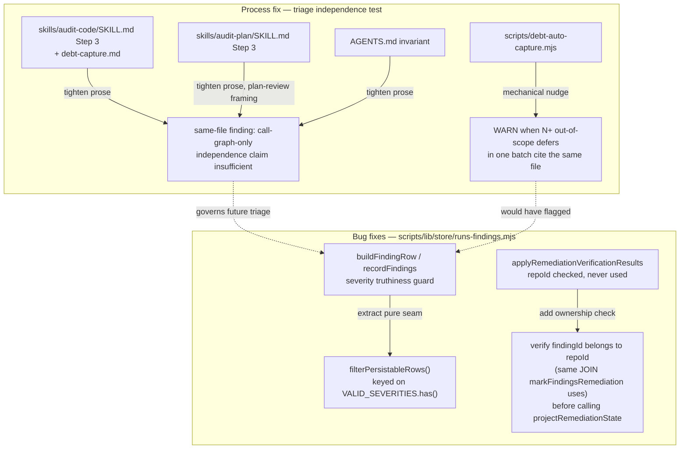

# Plan: Close the Same-File Independence Loophole in Triage, Fix Two Bugs It Let Through

- **Date**: 2026-09-25
- **Status**: Complete
- **Author**: Claude + Louis
- **Scope**: backend

> **Addendum (2026-09-25, same day)**: after `/cycle` converged and Gemini
> approved, a sustainability review identified two honest gaps: the
> same-file-batch nudge is gameable by splitting a batch across files/rounds
> to duck the count-5 threshold, and the repoId-isolation fix (unlike the
> other two code fixes) had not yet been proven red-then-green post-hoc.
> Both closed: (1) added `detectTemplateRationales` to
> `scripts/debt-auto-capture.mjs` — a second, independent WARN that fires on
> 3+ near-identical rationale TEMPLATES (normalized by stripping
> backtick-quoted/dotted/snake_case identifiers) regardless of file, which
> catches the split-batch case the same-file count cannot see; documented in
> `skills/audit-code/references/debt-capture.md`; covered by 5 new CLI
> black-box tests in `tests/debt-auto-capture-same-file-nudge.test.mjs`. (2)
> Proved the repoId fix red-then-green: temporarily reverted both `EXISTS`
> clauses to the original unscoped `WHERE id = $2`, confirmed the cross-repo
> isolation test failed (`1 !== 0`), restored from a verified backup,
> confirmed 41/41 green. Confirmed no file overlap with the concurrently
> running `claude/friendly-babbage-4d605e` session (hardening
> `runs-findings.mjs` itself) before starting either change. **What remains
> a genuine, named limitation, not silently claimed solved**: the tightened
> independence test and both nudges are still enforcement-by-visibility, not
> mechanically-verified-content — nothing checks that a stated "no shared
> column/transaction" claim is actually true. That is a structurally harder
> problem (would need static analysis of column/transaction usage per
> function) and is deliberately not attempted here; revisit by re-running
> this session's own debt_entries query in a few months to see whether
> compliance holds up over time, the same way the original gap was found.

## 1. Context Summary

**Detected scope**: backend (js-ts stack, no UI surface — Phase 3/4/§10 skipped).

### What exists today

`AGENTS.md` already states the invariant *"Scope is decided by impact, not
authorship"* for Step 3 triage in `/audit-code` and `/audit-plan`: a
pre-existing finding is only `defer`-eligible once the change being shipped
is genuinely **independent** of it. In practice this test is being satisfied
by something narrower than intended.

**Measured this session** (queried `debt_entries` for this repo,
`repo_id 6461a693-6690-4bf3-98ee-14c0385cc357`):

- 234 open `out-of-scope` deferrals, 71 HIGH severity.
- Several single audit runs mass-deferred large same-shaped batches in one
  shot: 46 entries (`audit-code-1757000000`, 2026-09-04), 45
  (`cluster-b-r5`, 2026-08-19), 33 (`final-review-credit-triage-2026-09-16`),
  24 (`audit-code-1789921259`, 2026-09-20) — spanning April through
  September 2026, so this is a recurring pattern, not a one-off.

**Concrete case** — run `audit-code-1789921259` (2026-09-20) added one
function, `getRunMeta`, to `scripts/lib/store/runs-findings.mjs`. The audit
surfaced 19 HIGH/MEDIUM findings about *other* functions in that same file.
Every one was deferred with near-identical boilerplate:

> "unrelated to getRunMeta... Independence: verified zero coupling to
> getRunMeta, the only function this plan modifies in this file."

That rationale answers *"does my new code call this"* (direct call-graph
coupling) — not *"is this shared module's correctness something my change
now depends on"* (systemic reliance), which is what the AGENTS.md invariant
actually asks. `runs-findings.mjs` is the core write path for the entire
audit store; adding a function to it makes the change a new tenant of every
sibling function's bugs, not independent of them.

**What the process fix does and does not claim to prevent (round-3
plan-audit H1 — read this before §2's design decisions).** `getRunMeta`
(the function the concrete case's plan actually added) is a plain,
untransacted `SELECT ... FROM audit_runs`; it shares no column, no
constraint, and no transaction instance with `recordFindings`'s severity
guard or `applyRemediationVerificationResults`'s writes to
`audit_findings`/`finding_adjudication_events`. Under this plan's own
tightened two-part test (§4), `getRunMeta` genuinely IS independent of
those two specific bugs — a strict, correct application of the test would
still permit deferring them. **The prose fix (Phase 3) is therefore not
what would have caught the concrete case; the mechanical nudge (Phase 2)
is.** The nudge counts same-file batch size, not per-finding
independence — it would have fired on 19 out-of-scope defers citing
`runs-findings.mjs` in one capture regardless of whether any one of them
individually passes or fails the independence test, and that count is
what should have prompted a second look. The two mechanisms guard
different failure modes: the nudge catches *batch shape* (many same-file
defers, whatever their individual merit); the prose fix catches a
*narrower, separate* loophole — a same-file finding that genuinely DOES
share state or a transaction with the new code, waved through by lazy
call-graph-only reasoning. Both are real; neither alone is the whole
answer, and this plan does not claim the prose fix alone would have
changed the concrete case's outcome.

Two of those 19 deferred findings are **still live, verified bugs** in the
current tree (read at `8e4f7060`, 2026-09-25):

1. `scripts/lib/store/runs-findings.mjs:739` (inside `recordFindings`'s
   row-filtering loop, the "NOT-NULL write-boundary guard" added
   2026-07-26): `if (!row.severity)` is a truthiness check, not a
   membership check against `VALID_SEVERITIES` (`runs-findings.mjs:570`,
   `new Set(['HIGH','MEDIUM','LOW'])`). A value like `"CRITICAL"` is truthy
   and survives the guard, then hits the DB's `severity` CHECK constraint
   inside a caller-owned transaction — the comment three lines above this
   exact guard already documents the failure class (a null-`category`
   finding once silently dropped a whole batch this way); this is the same
   shape, unfixed, for `severity`.
2. `scripts/lib/store/runs-findings.mjs:2304-2305`,
   `applyRemediationVerificationResults(repoId, actions)`: `repoId` is
   checked only for truthiness and never used again. Both writes inside the
   function — the terminal `projectRemediationState` write (line 2324) and
   the throttle-column `UPDATE` (lines 2338-2342) — address rows by
   `findingId` alone, no repo-scoping predicate. `markFindingsRemediation`
   (line 2249, same file) shows the correct shape one function above:
   before touching a row it verifies ownership with
   `SELECT f.id FROM audit_findings f JOIN audit_runs r ON r.id = f.run_id
   WHERE r.repo_id = $1 AND f.finding_fingerprint = $2` (line 2261-2267).
   `applyRemediationVerificationResults` skips that check entirely — a real
   cross-repo isolation gap in a store this repo's own docs
   (`AGENTS.md` §Postgres-Parity) describe as shared across multiple
   consumer repos on one Supabase project.

### Code Trace

- `scripts/lib/store/runs-findings.mjs:566-570` (8e4f7060) — `VALID_SEVERITIES` domain set, already used correctly for `verdict_severity` via `normaliseEnum` at line 632.
- `scripts/lib/store/runs-findings.mjs:718-763` (8e4f7060) — the NOT-NULL write-boundary guard block; `row.severity` truthiness check at line 739.
- `scripts/lib/store/runs-findings.mjs:2249-2277` (8e4f7060) — `markFindingsRemediation`, the correctly repo-scoped sibling (fingerprint+repo lookup, then a verified `findingId` into `projectRemediationState`).
- `scripts/lib/store/runs-findings.mjs:2187-2247` (8e4f7060) — `projectRemediationState(findingId, state, opts)`, the shared internal writer both `markFindingsRemediation` and `applyRemediationVerificationResults` call; takes no `repoId` today.
- `scripts/lib/store/runs-findings.mjs:2304-2350` (8e4f7060) — `applyRemediationVerificationResults`, the unscoped sibling.
- `scripts/debt-auto-capture.mjs:436-533` (8e4f7060) — `main()`; `deferredEntries` (line 477) is the full per-run batch this plan hooks the same-file nudge into; `printSummary` (line 335) is the existing WARN-card convention (capture-trail WARN, line 364) the new nudge follows.
- `skills/audit-code/SKILL.md:302-398` (8e4f7060) — Step 3 triage rules + the "Scope is decided by impact, not authorship" load-bearing test + the honest-deferral independence-sentence requirement.
- `skills/audit-code/references/debt-capture.md:16-22` (8e4f7060) — "Impact-tested, not authorship-tested" callout, the doc `debt-auto-capture.mjs` is driven by.
- `skills/audit-plan/SKILL.md:149-181` (8e4f7060) — the plan-review parallel of Step 3 ("Scope is decided by impact, not ownership").
- `AGENTS.md` §"Scope is decided by impact, not authorship (load-bearing test)" (8e4f7060) — the repo-wide invariant statement both skills cite.
- `tests/mark-findings-remediation.test.mjs:372-486` (8e4f7060) — the existing `applyRemediationVerificationResults` DB-integration `describe` block; the fixture/harness pattern (repo/run/finding inserts, `assertDisposableDbUrl` guard) the new cross-repo test extends.
- `tests/store-finding-verification-persistence.test.mjs` (8e4f7060) — precedent for unit-testing a pure seam pulled out of `recordFindings` (`buildFindingRow`) without a live DB; the same pattern this plan follows for the severity-filter seam.
- `tests/debt-auto-capture-trail-warn-cli.test.mjs` (8e4f7060) — the CLI black-box test pattern (`makeRunCli`, `writeRoundLedger`, `makeDeferEntry`) every `debt-auto-capture.mjs` test uses; the new same-file-batch nudge test follows it rather than exporting a unit-testable internal (this file has no precedent for that — all of its behaviour is tested through the CLI).
- `scripts/db-test-container.mjs` and `.github/workflows/postgres-parity.yml` (8e4f7060) — both already enrol `tests/mark-findings-remediation.test.mjs` in CI against a real ephemeral Postgres. The new cross-repo isolation test lands inside that already-enrolled file, so it inherits CI execution without a new enrolment step — load-bearing for §6's answer to "does `npm test` alone prove this," since a local run without `AUDIT_DB_TEST_URL` skips it.
- `AGENTS.md` character count at time of writing: 91,168 / 92,000-char `ctx/oversized-agents-md` cap (`npm run context:check`) — 832 chars of headroom. Load-bearing for how small the `AGENTS.md` edit in §4 must be.

### Patterns reused vs new

- Reused: the `markFindingsRemediation` ownership-check shape (repo-scoped
  SELECT before a projector write) — applied to
  `applyRemediationVerificationResults` instead of inventing a new pattern.
- Reused: the existing pure-seam-extraction precedent (`buildFindingRow`,
  `buildFindingAdjudicationPatch`, `normalizeRemediationUpdates`) — the
  severity-filter fix follows the same shape: pull the filter decision out
  of `recordFindings` into a small, directly-testable function.
- Reused: `debt-auto-capture.mjs`'s existing WARN-card convention
  (`checkCaptureTrail` → advisory WARN, never changes the exit code) — the
  same-file-batch nudge is a second WARN of the same kind, not a new
  mechanism.
- New: nothing structurally new. No new files, no new abstraction layer.

### Neighbourhood considered

`get-neighbourhood` over `scripts/lib/store/runs-findings.mjs` returned 8
candidates, all in the same file (`stores` domain) — expected, since this
plan edits existing functions there rather than adding new ones.
`recordFindings` scored `precedent` (`above-floor-cluster`); the rest
`review`. No action needed beyond what Phase 1 already did (read the real
functions before editing): this plan extends `recordFindings`'s existing
filter logic and `applyRemediationVerificationResults`'s existing body, it
does not add a sibling function that would duplicate either.

**Target domain(s)**: `stores`, `skills-content`. ⚠ **Cross-domain work** —
intentional: one code fix (store write path) + one process fix (skill/docs
prose + a CLI nudge). `AGENTS.md` is untagged (expected — root-level doc).

No security-incident neighbourhood matches directly on point (the two
returned, INC-001 symlink classification and INC-002 the Supabase wipe, are
about path canonicalisation and destructive-test DSN checks respectively —
unrelated mechanisms). Noted, not actioned.

## 2. Proposed Architecture



### Component summary

- **Bug fixes** (`scripts/lib/store/runs-findings.mjs`): two independent,
  small edits to existing functions. No new exports beyond one small
  extracted seam (for testability, mirroring the file's own established
  pattern).
- **Process fix**: prose tightening across four documents (two skills, one
  reference doc, `AGENTS.md`) plus one small mechanical nudge added to an
  existing CLI (`debt-auto-capture.mjs`). No new script, no new gate — the
  nudge is a WARN appended to a summary card that already exists.

### Key design decisions

- **Enforce ownership INSIDE the write itself, not as a separate precondition
  query** (#1 Core Design — Single Source of Truth; #11 Transaction Safety).
  Round-1 plan-audit findings H1/H3 correctly rejected the original design
  (a `SELECT` ownership check before the write loop): it is not atomic with
  the write it guards (a TOCTOU gap), it leaves `projectRemediationState`
  itself available to any future caller that forgets the precondition, and a
  *failed* ownership query would abort the whole action loop instead of
  being handled per-action like every other failure in this function. Fixed
  design: `projectRemediationState` gains a **required** `repoId` parameter
  (both existing callers — `markFindingsRemediation` and
  `applyRemediationVerificationResults` — already have one in scope, so
  this is not a breaking change for either), and the repo check moves INTO
  the `UPDATE ... WHERE id = $2 AND EXISTS (SELECT 1 FROM audit_runs r
  WHERE r.id = audit_findings.run_id AND r.repo_id = $3)` — a single
  atomic statement, no separate query, no TOCTOU window, and a future
  caller cannot omit `repoId` because the function throws without it.
  `applyRemediationVerificationResults`'s own throttle-column `UPDATE`
  (the one write in that function `projectRemediationState` does not cover)
  gets the identical `EXISTS` clause. A wrong-repo `findingId` now reads as
  a 0-row update — the same code path and the same log line the function
  already uses for "finding vanished" — so no new failure mode needs new
  handling; H3's "missing row vs. failed query" distinction dissolves
  because there is no longer a separate query to fail.
- **Extract, don't inline-patch, the severity filter** (#14 Testability).
  The current filter loop lives inline in `recordFindings` (lines 735-748),
  which is only reachable through a live-DB integration test. The file
  already establishes the pattern of pulling a decision out into a small
  pure function for direct unit testing (`buildFindingRow`,
  `buildFindingAdjudicationPatch`, `normalizeRemediationUpdates` — all
  exported, all unit-tested without a DB). This fix follows that precedent
  rather than adding a DB-only regression test, which would be the weaker
  guard the file's own history already moved away from.
- **Nudge, not gate — and the mechanism that actually covers the concrete
  case** (Right-sizing / #16 Graceful Degradation; round-3 plan-audit H1,
  §1). The prose fix cannot catch a same-file finding that is genuinely
  independent by the tightened test (as `getRunMeta` is, against the two
  bugs this plan fixes) — only a batch-shape signal can, since it doesn't
  require the finding to fail an independence test at all. The same-file-
  batch detector in `debt-auto-capture.mjs` never blocks a capture and
  never changes the exit code — same posture as the existing capture-trail
  WARN. This mirrors the repo's own precedent (`AGENTS.md`
  §Quick-fix detection, Layer 1: "fires on every edit... NEVER blocks").
  A hard gate here would risk exactly the cried-wolf failure `AGENTS.md`
  warns about elsewhere (a gate that can't be satisfied by doing correct
  work earns `--no-verify`) — a legitimately independent same-file batch is
  possible (e.g. many genuinely unrelated style/formatting findings in a
  huge file); the fix is to make the operator *look*, not to refuse.
- **Prose fix targets the specific failure mode, not the general rule**
  (avoids band-aid *and* over-engineering — see §5). The existing
  "load-bearing test" and "independence sentence" requirements are not
  wrong; they're under-specified for exactly one case (same file as
  something the diff touches). The fix adds one clause to that case, it
  does not rewrite Step 3.
- **`audit-plan`'s parallel gets the same clause, reframed for plan
  review** (#3 Modularity — one invariant, two call sites already existed
  before this plan; keep them in sync rather than letting one drift). Plan
  review has no "file" to compare against (it reviews prose, not code), so
  the adapted clause keys on: does the finding cite a module/section the
  plan's own design already extends, even if the plan doesn't propose
  editing that section's text.

## 3. Right-Sizing Gate

- **Band-aid extreme**: relabel the 19 (and 234 total) existing debt entries
  by hand, or write a one-off script to bulk-edit their rationale text. Does
  not touch the process that produced them — the next audit run reproduces
  the same boilerplate on the next god-module.
- **Over-engineered extreme**: build a general "deferral quality classifier"
  — an LLM or heuristic pass that scores every independence sentence for
  argument strength, wired into a new blocking gate with its own config
  surface, thresholds, and override mechanism.
- **Chosen, and the current requirement it serves**: (a) fix the two
  findings that are *actually* real and unfixed — current requirement:
  they're live bugs; (b) tighten the exact prose clause that let a
  call-graph-only claim pass for a same-file finding — current requirement:
  that's the literal gap the concrete case exposed, no more; (c) add one
  mechanical WARN reusing an existing summary card and an existing
  threshold-style constant (`MIN_RATIONALE`-shaped) — current requirement:
  make the *next* 19-in-a-row batch visible to the operator instead of
  silent, without inventing new infrastructure. No new abstraction, no new
  script, no new blocking gate. Existing 234-entry backlog is explicitly
  out of scope for a bulk relabel (see §8 Risk Register) — it gets the
  benefit of the tightened rule going forward and remains reachable through
  the existing `debt-review.mjs` periodic clustering.

## 4. File-Level Plan

### `scripts/lib/store/runs-findings.mjs` (modify)

- **Purpose**: fix the severity-truthiness guard and the `repoId`
  isolation gap.
- **Key changes**:
  - Extract a new exported pure function, `filterPersistableRows(mappedRows)`,
    from the inline loop currently at lines 735-748. Returns
    `{ rows, droppedFingerprints, coercedCategories }`. Behaviour is
    unchanged except the severity check becomes
    `!VALID_SEVERITIES.has(row.severity)` instead of `!row.severity` — a
    row with an out-of-domain severity (e.g. `"CRITICAL"`) is dropped the
    same way a missing one already is. `recordFindings` calls the extracted
    function and keeps its existing stderr-logging behaviour (unchanged;
    the logging stays inline since it's an I/O side effect, not the pure
    decision).
  - `projectRemediationState(repoId, findingId, state, opts)`: add
    `repoId` as a new, required leading parameter (throw if falsy — this
    is an internal, unexported helper with exactly two call sites, both
    updated in this same commit, so there is no external caller to break).
    Its `UPDATE audit_findings SET ... WHERE id = $2` becomes
    `WHERE id = $2 AND EXISTS (SELECT 1 FROM audit_runs r WHERE r.id =
    audit_findings.run_id AND r.repo_id = $3)`. The `finding_adjudication_events`
    update after it is unaffected — it already only runs when the first
    `UPDATE` returned a row, so it is transitively scoped.
  - `markFindingsRemediation`: pass its own `repoId` through to
    `projectRemediationState` at the existing call site (line 2269) — it
    already resolves `finding.id` via a repo-scoped lookup, so this is
    defense-in-depth, not a behaviour change.
  - `applyRemediationVerificationResults(repoId, actions)`: pass `repoId`
    through to `projectRemediationState` at its existing call site (line
    2324). Add the identical `AND EXISTS (SELECT 1 FROM audit_runs r
    WHERE r.id = audit_findings.run_id AND r.repo_id = $3)` clause to its
    OWN throttle-column `UPDATE` (lines 2338-2342), which
    `projectRemediationState` does not cover. No separate ownership query,
    no change to the existing per-action `try`/`catch` shape — a
    wrong-repo `findingId` now falls through the SAME "0-row update —
    finding vanished, not counted" branch the function already has for a
    genuinely deleted finding.
- **Why this file**: it's the file both bugs live in; no other file needs
  to change for the code fix.

### `tests/store-finding-verification-persistence.test.mjs` (modify)

- **Purpose**: add unit coverage for `filterPersistableRows` (pure, no DB).
- Add tests: a row with `severity: 'CRITICAL'` is dropped (same shape as
  the existing "no severity" case would be, extended to cover the
  membership check); a row with a valid severity from `VALID_SEVERITIES`
  passes through unchanged; `droppedFingerprints`/`coercedCategories`
  counts stay correct on a mixed batch. This file already imports
  `buildFindingRow` from the same module and exercises the same kind of
  pure seam — natural home, no new test file needed.

### `tests/record-findings-write-boundary.test.mjs` (create)

- **Purpose** (round-3 plan-audit M2): the pure `filterPersistableRows`
  unit tests (above) prove the FILTER decision in isolation; they do not
  prove `recordFindings` actually uses that decision to persist/exclude
  rows at the database, which is what `REQ-correctness-6de9e5ff`'s own
  gap ("no linked test covers... persistence") and this plan's Close-out
  requirements re-derivation (§4) both need to be true, not merely
  asserted. **No existing test in this repo calls `recordFindings` against
  a live database at all** — checked: zero matches for `recordFindings(`
  across `tests/`. This is a real, pre-existing gap this plan's own
  severity-guard edit makes worth closing now, not a new requirement
  invented for its own sake.
- DB-integration `describe` block, `AUDIT_DB_TEST_URL`-gated, following
  `tests/mark-findings-remediation.test.mjs`'s exact fixture/teardown
  shape (repo + run insert, `assertDisposableDbUrl` guard, `after()`
  cleanup — Code Trace, §1).
- Tests, split by pre-/post-fix behaviour (**round-4 plan-audit L1**
  corrected the pre-fix expectation below — see the note after):
  - **Post-fix** (the steady-state test, stays green forever): call
    `recordFindings(runId, findings, 'test', 1)` with a batch of four —
    one valid `HIGH`, one `severity: 'CRITICAL'` (invalid), one
    `severity: undefined` (missing), one valid severity with no
    `category`. Query `audit_findings` for the run afterward and assert:
    exactly the two valid-severity rows persisted (2 of 4); the
    no-category row persisted with `MISSING_CATEGORY_MARKER`;
    `recordFindings`'s return value reports `droppedFingerprints.length
    === 2`.
  - **Pre-fix, run once manually to confirm red** (temporarily revert the
    guard, per §6's red-then-green discipline — this is a one-time proof
    during implementation, not a permanent second test case): the SAME
    batch. **Round-4 L1 caught that the originally-stated pre-fix
    expectation was wrong** — a `severity: 'CRITICAL'` row is truthy, so
    the *unfixed* application guard (`!row.severity`) lets it through to
    the `INSERT`, but `'CRITICAL'` still violates the database's
    `audit_findings_severity_check` CHECK constraint. It does not
    silently persist; per the exact incident class the guard's own
    2026-07-26 comment already documents (a bad row poisoning a
    caller-owned transaction), the INSERT throws and the *entire batch*
    — including the otherwise-valid `HIGH` row — is lost. The correct
    pre-fix assertion is therefore `await assert.rejects(recordFindings(...))`
    on the Postgres CHECK-violation SQLSTATE (`23514`), not a query
    proving the bad row is present — asserting on the driver error's
    structural code, per `AGENTS.md`'s own `assert.rejects`-on-structure
    guidance, never on the error's prose message.
- **Enrolment (`AGENTS.md` §Testing — "adding a DB-gated suite is two
  edits, never one")**: add this new file to `scripts/db-test-container.mjs`'s
  `*_SUITE_FILES` list AND `.github/workflows/postgres-parity.yml`, mirroring
  exactly how `tests/mark-findings-remediation.test.mjs` is already
  enrolled in both (Code Trace, §1) — `npm run db:enrolment:gate` verifies
  this mechanically at push time, so a missed edit fails closed rather
  than shipping a DB suite CI never runs.

### `tests/mark-findings-remediation.test.mjs` (modify)

- **Purpose**: add a DB-integration regression proving the cross-repo
  isolation fix, inside the existing
  `applyRemediationVerificationResults — DB write shape (integration)`
  `describe` block (line 379).
- Add: a second `audit_repos`/`audit_runs`/`audit_findings` fixture set
  under a *different* `repoId` (with its own seeded
  `finding_adjudication_events` row, mirroring the existing
  `findingIdResolved` fixture in the same `describe` block), then call
  `applyRemediationVerificationResultsLive(repoId, [{ findingId:
  <the-other-repo's-finding-id>, outcome: 'resolved', checkedAtCommit:
  '...' }])` scoped to the *first* repo's id and assert `updated === 0`
  AND — **round-2 plan-audit M2**, closing the gap where the original
  assertion only checked `remediation_state` — that ALL THREE things the
  fix touches on the other repo's row are untouched: `remediation_state`,
  the throttle columns (`remediation_last_checked_at` /
  `remediation_last_checked_commit`, the fix's *second* write, which
  `updated === 0` alone does not prove was skipped), and the
  `finding_adjudication_events` row's `remediation_state`/`round` (proves
  `projectRemediationState`'s second UPDATE never ran either). This is the
  existing file's own established fixture/teardown pattern (repo → run →
  finding → event inserts, `assertDisposableDbUrl` guard, `after()`
  cleanup) — extended, not reinvented.

### `scripts/debt-auto-capture.mjs` (modify)

- **Purpose**: add the same-file-batch nudge.
- Add a small function, `detectSameFileBatchDefers(deferredEntries,
  { threshold, changedFiles })`. Groups by file, but — round-1 plan-audit
  M2 — counts a ledger entry toward **every** file in its `affectedFiles`
  array, not just `affectedFiles[0]`: iterating the whole array is a
  one-line difference from `ledgerEntryToFinding`'s single-file
  `primaryFile` derivation and closes the false-negative M2 identified
  (a cited sibling file listed second in `affectedFiles` must still count).
  Falls back to the `section`-prefix file only when `affectedFiles` is
  empty. Returns entries whose file has `>= threshold` members. Default
  threshold: 5 — every real mass-defer batch measured this session (19,
  24, 33, 45, 46) sits far above it; not user-configurable (right-sizing —
  no current requirement asks for a tunable knob). **Gemini-gate G3**:
  every file path (from `affectedFiles`, the `section` prefix, AND the
  `--changed` CSV) is normalized before comparison — backslashes to
  forward slashes, a leading `./` stripped — since this repo develops on
  Windows and `git diff --name-only` always emits forward slashes while a
  model-authored `affectedFiles` entry is not guaranteed to; an unnormalized
  comparison would false-negative on Windows. One small shared normalizer,
  applied at every comparison site in this function, not three ad hoc ones.
- **`changedFiles` (round-1 plan-audit M3)**: the detector's WARN is a
  proxy for "this file was touched by the change," but a raw same-file
  count inside one capture batch cannot prove that on its own — a batch
  could legitimately cluster same-file findings in a file the diff never
  touched at all. Add an optional `--changed <comma-separated-files>` flag
  to `debt-auto-capture.mjs` (mirrors the existing `--ledger`/`--reason`
  flag style). When passed, the WARN fires only for a same-file cluster
  whose file is ALSO in `--changed` — the precise condition the tightened
  independence clause addresses. When `--changed` is omitted (never
  passed) — a caller that doesn't have it handy, or the SKILL.md snippet's
  own empty-value guard (§4, round-3 M1) — fall back to the count-only
  heuristic but phrase the WARN as a prompt to check ("...verify whether
  this file was in your diff"), never as an assertion that it was. An
  explicitly-passed `--changed` with a non-empty value is the only case
  that gets the assertive wording; the flag's mere presence is not enough
  on its own — an empty string must be treated as omitted, never as
  "zero files changed."
- Call it in `main()` right after `deferredEntries` is computed (line 477),
  but only when `args.reason === 'out-of-scope'` (the default) — the other
  four `deferredReason` values aren't about the independence test this
  nudge exists to catch.
- Render the result in `printSummary` (line 335) as a new WARN block,
  same shape and placement as the existing capture-trail WARN (line
  364-370): naming the file, the count, and pointing at `AGENTS.md`'s
  "Scope is decided by impact, not authorship" section. Advisory only —
  never changes the exit code (matches this file's existing WARN
  convention exactly).
- **Round-2 plan-audit H1**: an earlier draft of this bullet claimed Step
  3.6 could reuse a `$CHANGED_FILES` variable "Step 4's audit invocation
  already computes." False — checked against the actual skill: Step 4 is
  the FIX step and computes nothing; the `$CHANGED`/`$FILES` variables only
  exist from Step 5 onward (the operator tracks files touched *during*
  Step 4, for the R2+ re-audit — "Collect files modified during Step 4 →
  `--changed`," `skills/audit-code/SKILL.md:595`). Step 3.6 runs BEFORE
  Step 4, so no such variable is in scope yet, for either a first-round or
  a later-round capture. Fixed: Step 3.6's own snippet computes its
  `--changed` value fresh, immediately before invoking
  `debt-auto-capture.mjs`, using the SAME dirty-aware base rule already
  documented in this skill's own scope-resolution note (dirty → `HEAD`,
  clean → `HEAD~1`) and already used verbatim in `/cycle`'s own
  empty-diff guard:
  ```bash
  BASE=$([ -n "$(git status --porcelain)" ] && echo HEAD || echo HEAD~1)
  CHANGED_FILES=$( (git diff --name-only "$BASE"; git ls-files --others --exclude-standard) | sort -u | tr '\n' ',')
  if [ -n "$CHANGED_FILES" ]; then
    node scripts/debt-auto-capture.mjs --ledger .audit/$SID-ledger.json --run "$SID" --changed "$CHANGED_FILES"
  else
    node scripts/debt-auto-capture.mjs --ledger .audit/$SID-ledger.json --run "$SID"
  fi
  ```
  (Gemini-gate G1: `--run "$SID"` restored — an earlier draft of this
  snippet dropped it while adding `--changed`; every existing
  `debt-auto-capture.mjs` invocation and CLI test passes it so capture
  events correlate to the run that produced them.)
  This is a one-line reuse of an existing, already-documented pattern
  (POSIX shell, Git Bash on Windows — same caveat `/cycle` Step 3 already
  states), not a second base-resolver: it answers "what changed" the same
  way Round 1's `--scope diff` already does, self-contained at the point
  it's needed, with no dependency on a variable a later step hasn't
  computed yet.
  **Round-3 plan-audit M1 found two real bugs in the earlier version of
  this snippet, both fixed above**: (1) `git diff --name-only` never lists
  untracked files — a brand-new file created by the work (this plan's own
  `tests/debt-auto-capture-same-file-nudge.test.mjs` is a live example)
  would silently never count, even though `git status --porcelain`'s
  dirty check already treats untracked files as "dirty." Fixed by unioning
  in `git ls-files --others --exclude-standard` (the same tracked+untracked
  pattern this repo already uses elsewhere for exactly this class of gap —
  `AGENTS.md`'s ownership-oracle discussion). (2) The snippet previously
  always passed `--changed`, even when the computed value was an empty
  string — which is NOT the same as omitting the flag, and would have
  been read as "nothing changed" rather than falling back to the intended
  hedged count-only heuristic. Fixed with the `if`/`else` above: an empty
  `CHANGED_FILES` genuinely omits the flag.
  **Accepted, not fixed**: this snippet independently re-derives a
  dirty-aware base rather than reading back whatever exact range the
  audit round itself used (which could diverge under a concurrent commit,
  or when the round used an explicit `--diff` patch file). This is
  accepted because the nudge is advisory-only (§2's "nudge, not gate"
  decision, reinforced by round-1 M3's hedged-wording requirement) — a
  slightly-stale changed-set weakens a proxy signal, it does not produce
  a wrong scoping decision the way it would for the audit itself.

### `tests/debt-auto-capture-same-file-nudge.test.mjs` (create)

- **Purpose**: CLI black-box coverage for the new nudge, following the
  exact pattern `tests/debt-auto-capture-trail-warn-cli.test.mjs` already
  uses (`makeRunCli`, `writeRoundLedger`, `makeDeferEntry`).
- Tests: (a) 5 `out-of-scope` defer entries citing the same file in one
  ledger → WARN naming that file and count; (b) 4 same-file entries (one
  under threshold) → no WARN; (c) 5 same-file entries but `--reason
  blocked-by` → no WARN (reason gate); (d) 5 entries across 5 *different*
  files → no WARN (the grouping, not just the count, must be right);
  (e) 5 entries whose *second* `affectedFiles` entry (not the first) is
  the shared file → WARN still fires (locks the M2 fix — the old
  `affectedFiles[0]`-only grouping would have missed this); (f) 5 same-file
  entries with `--changed` passed and that file NOT in the list → no WARN
  (locks the M3 fix); (g) same as (f) but the file IS in `--changed` → WARN
  fires, phrased as a statement not a hedge (contrast with the no-`--changed`
  case, which must hedge — assert the two WARN strings differ).

### `skills/audit-code/SKILL.md` (modify)

- **Purpose**: close the same-file loophole in Step 3's load-bearing test
  with a **concrete, checkable** two-part test — round-1 plan-audit M1
  rejected the first draft ("is the module's correctness something my
  change depends on") as circular: it restates the existing load-bearing
  question instead of operationalising it, and gives no evidence standard,
  so it can't distinguish the concrete case's bad defers from the plan's
  own accepted example of a legitimately independent same-file finding
  (a cosmetic style nit in an untouched function of a huge file).
- Add, immediately after the existing "Scope is decided by impact, not
  authorship" paragraph (lines 323-327): when a finding's file is one the
  diff already touches, "my new/modified code doesn't call this function"
  is not sufficient on its own. The independence sentence must additionally
  state, truthfully, BOTH: (a) the cited code does not read or write the
  SAME column(s), or enforce/depend on the SAME constraint or invariant,
  that the new/modified code also reads, writes, or depends on; and (b)
  the cited code's writes do not execute inside the SAME transaction
  instance the new/modified code's writes participate in. If either
  cannot be stated truthfully, the finding is load-bearing, not
  independent — regardless of whether anything calls it.
  **Round-2 plan-audit M1 narrowed this from an earlier, overbroad draft**
  that keyed on sharing a *table* and sharing an *operational boundary*
  (a request, a file, a subsystem) — correctly rejected with two
  counterexamples: two operations touching *different columns* of the
  same table, or running in the *same request*, without either depending
  on the other. Sharing a table or a request is explicitly NOT sufficient
  under the fixed wording above; the overlap must be at the column/
  constraint level and the same transaction instance, which is what makes
  the test checkable against real code (grep the column names, read the
  transaction boundary) without over-firing on coincidental co-location.

### `skills/audit-code/references/debt-capture.md` (modify)

- **Purpose**: reflect the same two-part test in the field this doc
  actually governs (`deferredRationale` for an `out-of-scope` entry,
  lines 16-22), and document the new nudge (incl. `--changed`) under
  "Automatic protections".

### `skills/audit-plan/SKILL.md` (modify)

- **Purpose**: parallel two-part test, reframed for plan review (no
  diff/file concept — plan sections and the modules/tables they describe
  instead). Add after the existing "Scope is decided by impact, not
  ownership" paragraph (lines 165-181): a finding about a module/section
  the plan's own design already extends is not independent merely because
  the plan doesn't propose editing that section's *text* — the same
  column/constraint-level and same-transaction-instance test from
  `skills/audit-code/SKILL.md` applies, reframed for a not-yet-built
  design: does the plan's new design read/write the SAME column(s) or
  depend on the SAME constraint the cited concern describes (not merely
  the same table), and does it execute inside the SAME transaction
  instance (not merely the same request or subsystem)?

### `AGENTS.md` (modify)

- **Purpose**: tighten the repo-wide invariant both skills cite (§"Scope is
  decided by impact, not authorship (load-bearing test)"), sized to the
  832-char headroom noted in the Code Trace. Add, verbatim, immediately
  after the existing "...not the authorship." sentence (266 chars,
  confirmed under budget — **round-2 plan-audit M1 tightened this from an
  earlier draft** that said "shares a table, invariant, or transaction
  boundary," which M1 correctly flagged as overbroad; the wording below
  matches the narrowed skills-level test — column/constraint and
  transaction-instance, not table/boundary):

  > A same-file finding needs more than a call-graph claim: the
  > independence sentence must state the cited code does not share the
  > SAME column/constraint or the SAME transaction instance the new code
  > depends on — sharing a table or a broader boundary is not sufficient.

  This is the terse, canonical form; the two skills' fuller two-part
  wording above are specific instances of this one sentence (#3
  Modularity, #5 Single Source of Truth) — `AGENTS.md`'s own stated
  philosophy is "load-bearing invariants, not dossiers," so the detail
  lives in the skills, not here.

### Close-out (not a phase)

- `npm run skills:regenerate` — regenerates `.claude/skills/audit-code/`
  and `.claude/skills/audit-plan/` from the edited `skills/**` sources.
- `npm run skills:check` — verifies the regenerated copies are byte-exact.
- `npm run context:check` — round-1 plan-audit M5: confirms the `AGENTS.md`
  edit stays under the 92,000-char `ctx/oversized-agents-md` gate. Expected
  to pass given the 266-char addition against 832 chars of headroom, but
  this is the mechanical proof, not the arithmetic above.
- **Requirements ledger** (round-1 M5 raised the staleness in general;
  **round-2 M3 found the specific hit an earlier draft missed**): a
  round-1 draft of this plan declined requirements verification, claiming
  no change here relates to a ledger requirement. False —
  `REQ-correctness-6de9e5ff` (`.requirements/ledger.json`) directly
  governs `runs-findings.mjs`, provenance-anchored to `recordFindings` /
  `MISSING_CATEGORY_MARKER`, asserting *"Findings without severity must
  not be persisted"* — exactly the write boundary the severity-truthiness
  fix touches. Checked: the fix does not violate this requirement, it
  strictly broadens it (severity-less rows were already dropped; an
  invalid-but-truthy severity like `"CRITICAL"` is now also dropped) — but
  the requirement's own `gap.rationale` already says *"No linked test
  covers missing-severity and category persistence"* (`status: untested`),
  and this plan's new tests close exactly that gap — the pure-filter
  cases in `tests/store-finding-verification-persistence.test.mjs` AND,
  per round-3 M2 below, the actual DB-integration persistence proof in the
  new `tests/record-findings-write-boundary.test.mjs`. Close-out therefore
  runs, after the code+tests land:
  `node scripts/requirements.mjs extract --files scripts/lib/store/runs-findings.mjs`
  then `node scripts/requirements.mjs reconcile` — re-deriving the
  requirement's assertion text and evidence against the broadened
  behaviour and the new test, rather than hand-editing the generated
  ledger entry.
  **Deviation observed during implementation**: `extract` ran cleanly (104
  candidates); `reconcile` failed with a Zod validation error — the
  committed `.requirements/overrides.json` carries a `{$comment,
  overrides}` wrapper shape that the reconcile schema's flat
  `REQ-<kind>-<8hex>`-keyed record rejects outright. This is a pre-existing
  bug in `requirements.mjs`/`overrides.json`, unrelated to this plan's own
  changes (confirmed: `git status --porcelain .requirements/` shows no
  drift either before or after the attempt — `reconcile` failed before
  writing anything). Per this plan's own impact test: nothing this plan
  ships depends on `reconcile` succeeding, so this is out-of-scope debt,
  not a blocker — flagged as a separate task rather than fixed here or
  silently skipped.
- `npm test` — full suite.

## 5. Sustainability Notes

- **Assumptions that could change**: the threshold of 5 is calibrated
  against this session's measured batches (19-46). If future batches
  cluster much smaller (e.g. consistently 3-4), the threshold would need
  revisiting — not designed as a hard boundary, just a practical trigger.
- **Extension points deliberately NOT built**: no config surface for the
  threshold, no second nudge type, no auto-remediation of flagged batches.
  If a second failure mode of this shape emerges, it should get its own
  small, targeted fix rather than generalizing this one preemptively.
- **The 234-entry existing backlog is not touched by this plan.** It
  remains reachable via `npm run debt:review` (periodic clustering,
  already exists) and `debt-health-check.mjs` (staleness/recurrence,
  already exists) — this plan changes what happens to *new* out-of-scope
  defers, not what already accumulated.

## 6. Testing Strategy

- **Unit** (no DB): `filterPersistableRows` — severity membership check,
  category coercion, mixed-batch counts. `detectSameFileBatchDefers` —
  covered indirectly through the CLI black-box tests below (this file's
  established pattern has no precedent for exporting internals for direct
  unit testing).
- **Integration** (`AUDIT_DB_TEST_URL` gated): the new cross-repo isolation
  test in `tests/mark-findings-remediation.test.mjs` — proves a
  `findingId` from repo B is not affected by a call scoped to repo A,
  across ALL three things the fix touches (`remediation_state`, the
  throttle columns, and the `finding_adjudication_events` row — round-2
  M2). **Proved red-then-green post-implementation** (temporarily reverted
  the `EXISTS (SELECT 1 FROM audit_runs ...)` clauses in both writes back to
  the original unscoped `WHERE id = $2`, confirmed the isolation test failed
  with `1 !== 0` — the cross-repo write succeeded — restored the fix from a
  verified backup, confirmed 41/41 green across the three affected test
  files). **Also new**:
  `tests/record-findings-write-boundary.test.mjs` (round-3 M2) — the
  first DB-integration test of `recordFindings` itself, proving the
  write-boundary guard actually persists/excludes rows at the database,
  not just that the extracted pure filter returns the right decision.
  **Round-1 plan-audit H2**: a local `npm test` without
  `AUDIT_DB_TEST_URL` skips both of these, so close-out's bare `npm test`
  line does NOT by itself prove the security regression or the
  persistence behaviour is covered — the actual guarantee is CI
  enrollment in `scripts/db-test-container.mjs` and
  `.github/workflows/postgres-parity.yml` (Code Trace, §1; the new file
  gets the same two-edit enrolment per §4), so both run against a real
  ephemeral Postgres on every push regardless of the local dev
  environment. Stated explicitly here rather than left implicit in
  "npm test" the way H2 found it.
- **CLI black-box**: `tests/debt-auto-capture-same-file-nudge.test.mjs` —
  seven cases per the File-Level Plan above (over threshold, under
  threshold, wrong reason, wrong grouping, non-first-`affectedFiles`
  grouping, `--changed` exclusion, `--changed` inclusion with hedge-vs-
  assertion wording).
- **Not mechanically tested, by design (round-1 plan-audit M4)**: whether
  an agent following the tightened Step 3 prose actually stops accepting a
  call-graph-only independence claim for a same-file finding. Agent
  compliance with prose guidance is not unit-testable the way the CLI
  nudge or the DB write are — `AGENTS.md`'s own "prose↔code seam" section
  documents this class of gap and its remedy (grep the producer prose,
  don't assume), which is a code-side contract check, not an agent-
  behaviour check; there is no equivalent instrument for "did the model
  apply this triage rule correctly" short of the plugin-eval framework
  `CLAUDE.md` describes for skill-*selection* prompts (a different problem
  shape — picking the right skill, not a triage decision inside one), and
  authoring a new eval case for this specific decision is a
  disproportionate build for what this plan needs (right-sizing, §3). The
  mechanical `debt-auto-capture.mjs` nudge (Phase 2) is the actual
  verifiable backstop for this exact failure mode — it does not require
  the agent to have internalised the prose correctly, only that the batch
  shape it already measures crosses the threshold. Prose effectiveness
  itself is observable the same way this session found the original gap:
  a future `debt_entries` census.
- **Regression discipline** (`AGENTS.md` §Verification discipline): each
  new/modified test must be run red-then-green against the actual bug,
  not just written to pass against the fixed code — confirm by
  temporarily reverting the fix locally before finalizing, per Step 4.5
  of `/audit-code`.
- **Edge cases**: an un-migrated store (no throttle columns) going through
  `applyRemediationVerificationResults`'s existing degradation path must
  still respect the new ownership check — the ownership check runs before
  the throttle-column branch, so this is structural, not a case to special
  case in tests beyond the existing `hasThrottleColumns` coverage already
  in the file's DB-integration block.

## 7. File-Level Plan — Implementation Phases

Ten files modified + two created, two subsystems (store write-path code;
skill/process prose) — Gate 1 met (≥6 files). No sequential dependency
chain between the code fix and the prose fix (Phase 1.5: operations are
independent), so phases are ordered for reviewability, not because later
phases depend on earlier ones landing first.

**Phase 1 — Fix the two write-path bugs + their tests**. Files:
`scripts/lib/store/runs-findings.mjs` (modify),
`tests/store-finding-verification-persistence.test.mjs` (modify),
`tests/mark-findings-remediation.test.mjs` (modify),
`tests/record-findings-write-boundary.test.mjs` (create),
`scripts/db-test-container.mjs` (modify — enrol the new DB suite),
`.github/workflows/postgres-parity.yml` (modify — same).

**Phase 2 — Add the same-file-batch nudge + its tests**. Files:
`scripts/debt-auto-capture.mjs` (modify),
`tests/debt-auto-capture-same-file-nudge.test.mjs` (create).

**Phase 3 — Tighten the triage prose**. Files: `AGENTS.md` (modify),
`skills/audit-code/SKILL.md` (modify),
`skills/audit-code/references/debt-capture.md` (modify),
`skills/audit-plan/SKILL.md` (modify).

**Close-out (not a phase)**: the full command sequence and its reasoning
are §4's "Close-out (not a phase)" subsection, not restated here (Gemini-
gate G2 — an earlier draft of this summary line omitted
`context:check` and the `requirements.mjs extract`/`reconcile` pair that
§4 requires, reading as a shorter, inconsistent close-out).

This plan stays under the §11 clustering threshold (Gate 2: ≥2 clusters —
a real merge/split decision). The three phases above are independent but
small and cohesive as one unit of work; `/cycle --autonomous` runs the
degenerate single-cluster path (whole plan as one implementation, one
`/audit-code` pass over the union diff, one fix-gate loop) rather than
declaring clusters for a plan this size.

## 8. Risk & Trade-off Register

- **Trade-off**: the nudge threshold (5) is a constant, not derived from
  the repo's own distribution the way e.g. the architectural-memory band
  is (`μ + 3σ`). Deliberate — this is a coarse, cheap signal meant to
  catch the shape of the measured incidents, not a calibrated statistic.
  If it proves too noisy or too quiet in practice, that's a one-line
  follow-up, not a design failure to fix now.
- **What could go wrong**: the prose tightening could be read as "same-file
  findings can never be deferred," which is too strong and would
  reintroduce a cried-wolf risk. Mitigated by wording the clause as
  "call-graph-only independence is not *sufficient*" (an additional
  requirement on the rationale), not "same-file findings are always
  load-bearing" (a ban). A genuinely independent same-file finding — e.g. a
  cosmetic style nit in a function the diff never touches within a huge
  file — can still be deferred; the operator just has to say so explicitly
  in terms of the module, not the function.
- **Deliberately deferred**: relabelling or bulk-triaging the 234 existing
  `out-of-scope` debt entries. That's a distinct, larger effort
  (`debt-review.mjs` clustering + manual judgment per entry) and not what
  this plan's two concrete bugs or the recurrence-prevention fix require.
  Explicitly out of scope per §5.
- **Resolved during plan audit, not accepted (round-1 M2)**: an earlier
  draft of this plan grouped `detectSameFileBatchDefers` by
  `affectedFiles[0]` only, matching `ledgerEntryToFinding`'s single-file
  `primaryFile` derivation, and accepted the resulting false-negative
  (a cited file listed second in `affectedFiles` would silently not count)
  on the grounds that it mirrored an existing simplification elsewhere in
  the same pipeline. The plan-audit correctly rejected that reasoning —
  matching an unrelated function's simplification does not satisfy THIS
  detector's own purpose. Fixed instead: the detector iterates the whole
  `affectedFiles` array (§4). No remaining risk of this shape.
- **What could go wrong (nudge scope)**: even with the `--changed`
  narrowing (§4, round-1 M3), a caller that omits `--changed` still gets
  the weaker count-only heuristic (hedged wording, per §4) — a same-file
  batch in a file genuinely NOT in the diff could still print a WARN in
  that fallback path. Accepted: the fallback exists specifically so the
  nudge still fires for a caller that doesn't have `--changed` handy
  (advisory, never blocking), and the hedged phrasing is the mitigation —
  it asks the operator to check, it does not assert the file was touched.

