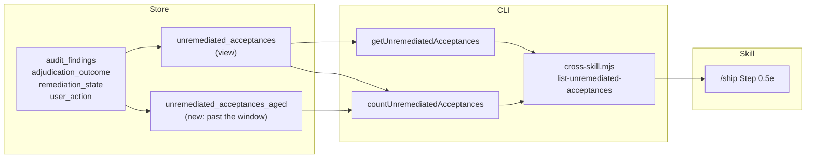

# Plan: Unremediated-acceptance backlog — fix the mechanism, then the rows

- **Date**: 2026-08-09
- **Status**: Approved
- **Author**: Claude + Louis
- **Scope**: backend
- **Target domain(s)**: `cross-skill-bridge`, `shared-lib`, `skills-content`, `stores`, `supabase`
- ⚠ **Cross-domain work** — touches 5 domains; the crossings are the point (a store view, its CLI reader, and the skill prose that consumes it are one contract in three places, and drift between them is the defect being fixed).

> **Neighbourhood considered**: `review` band — nothing cleared the repo's noise
> floor for this intent, so no existing symbol occupies this space. The work
> below deliberately adds almost no new code: it changes a view predicate, adds
> one projection, and corrects prose.

---

## 1. Context Summary

**Stack**: js-ts, Postgres store. **Scope**: backend (no UI surface).

201 findings in this repo are `adjudication_outcome ∈ (accepted,
severity_adjusted)` with `remediation_state ∈ (null, pending, planned)` — i.e.
accepted and never remediated. `/ship` Step 0.5e nags about them every push.

### Code Trace

**Re-verified at commit `e1beb385` (2026-08-10)** — 30 commits landed while this
plan sat in Draft, including `8fecb8bf`, which changed this exact reader. Every
citation below was re-read at `e1beb385`; the superseded `1c076eb9` line numbers
are gone rather than left to decay into wrong-but-resolving references.

- `unremediated_acceptances` view (live definition read via `pg_get_viewdef`,
  not the migration file — migrations are cumulative). **Unchanged**: still
  filters on `adjudication_outcome`, `remediation_state`, `severity` and the
  **7–30 day band on `r.created_at`**, and still **never consults
  `user_action`**. D1 and D3 both remain necessary.
- `scripts/lib/store/plans-ship.mjs:779 (e1beb385)` `getUnremediatedAcceptances`
  — now takes `(scope, opts)`, resolves `{limit, offset}` via `resolveNudgePage`,
  and spells out `ORDER BY CASE severity … , accepted_at ASC, audit_finding_id`
  inline in both branches (`8fecb8bf`).
- `scripts/lib/store/plans-ship.mjs:835 (e1beb385)` `countUnremediatedAcceptances`
- `scripts/cross-skill.mjs:909,916 (e1beb385)` → calls both; payload is now
  `{ok, cloud, scope, measured, reason, rows, shown, total, byMode, limit, offset}`
- `skills/ship/SKILL.md` Step 0.5e → consumes it (prose corrected in `1c076eb9`,
  cite by section not line — the file is append-newest-first)
- `audit_findings_user_action_check` → `CHECK (user_action IN ('fix-now',
  'deferred','dismissed','needs_triage','accepted-permanent','auto_dismissed'))`

**Figures re-measured at `e1beb385`** (same queries as the originals):
`in_window: 201` (unchanged), `aged_out: 0` (unchanged), `accepted-permanent: 44`
(unchanged), `needs_triage: 6` (unchanged). Only the total moved, 231 → **261**,
entirely in the `too_fresh` (<7d) bucket — a day's audit output, not backlog
growth. Every load-bearing number in this plan still holds.

### What the exploration falsified

Two premises in this plan's own commissioning brief were **wrong**, and the
measurements are why the design below is small rather than large:

1. **"The ledger has no state for *declined on the merits*."** False. It has
   one — `user_action = 'accepted-permanent'` — it is in the CHECK constraint,
   and **44 of the 201 rows already carry it**, every one with `decided_at`
   set. They are genuinely adjudicated, not defaults. The view simply never
   consults `user_action`. So 22% of the backlog is *already decided* and still
   being reported as an open obligation.

2. **"Scale under-reporting made growth invisible."** True but already fixed
   (`countUnremediatedAcceptances`, 2026-07-31; the surviving prose half fixed
   in `1c076eb9`). Nothing more to do.

### What the exploration found that was NOT in the brief

**The view has an upper time bound: `r.created_at > now() - '30 days'`.** A
finding accepted 31 days ago and never fixed **silently leaves the view**. It is
not resolved, not closed, not counted — it simply stops being reported.

Measured for this repo: `in_window: 201, aged_out: 0, too_fresh: 30`. Nothing
has aged out **yet** — the entire accepted-unremediated population is ≤30 days
old, because the store's history is short. That makes this a **latent** defect
rather than a realised one, and it is about to bite: those 201 rows begin
dropping out silently as they cross 30 days, and the backlog will appear to
"resolve itself".

This is the same family as the capped-rows undercount, one layer deeper: a
nudge that under-reports scale is recoverable; a nudge that **forgets** is not.

---

## 2. Proposed Architecture



### Key design decisions

**D1 — The view excludes `user_action = 'accepted-permanent'` (#1 DRY, #5 Single
Source of Truth).** The disposition already exists and is populated; adding a
second "declined" concept would be a second source of truth for the same idea.
Reuse, do not invent. Removes 44 rows (22%) on day one *without touching a
single finding* — they were never open work.

**D2 — `accepted-permanent` must not become a silent dumping ground
(#19 Observability).** Excluding it from the nag is only honest if the count
stays visible. The CLI payload gains `byDisposition: {open, acceptedPermanent}`
so 0.5e can print "N open · M permanently accepted" — the decision is
respected *and* auditable. A disposition you cannot see is indistinguishable
from a leak.

**D3 — The aged-out population is reported, never dropped (#15 Error Handling,
#19).** The 7–30 day band stays as the *nag* window (it is a sensible "don't
nag about last week's work" rule), but the reader also returns
`agedOut: <count>` from a companion view with no upper bound. A row that ages
past 30 days moves from "nagged" to "counted", never to "gone". This is the
sandbox-honesty rule applied to a time window: *a check that stops looking must
say so.*

**D4 — No new lifecycle state, no new table, no backfill job.** The remaining
157 rows are worked by the cluster strategy in §7b, not by a migration. A
mechanised "close everything stale" pass is exactly the band-aid that would
make the numbers look good while remediating nothing.

### D5 — Canonical result schema, defined before the queries change (H1)

The three new fields were named without cohorts, so `total` could silently mean
three things. Defined once here; the store, the CLI and §6's tests all key on
this table and nothing restates it.

**P lives in SQL exactly once (M1).** The count cannot source its cohorts from
the nag/aged views — both exclude `accepted-permanent`, which the count must
report — so a naive implementation repeats P in three places and D1's
"single update point" claim would be false. The migration therefore creates a
base view first:

```
unremediated_acceptance_candidates  -- P only: no disposition filter, no time band
  └── unremediated_acceptances       -- + IS DISTINCT FROM 'accepted-permanent' + 7–30d
  └── unremediated_acceptances_aged  -- + IS DISTINCT FROM 'accepted-permanent' + <= 30d
  └── countUnremediatedAcceptances   -- FILTER clauses over the base view
```

A future policy change to P (a new severity, a new remediation state) edits one
relation and every cohort follows. The fixture matrix proves today's agreement;
the base view is what keeps it true tomorrow.

Let **P** = the invariant candidate predicate, identical for every cohort:
`adjudication_outcome ∈ (accepted, severity_adjusted)` **AND**
`remediation_state IS NULL OR ∈ (pending, planned)` **AND**
`severity ∈ (HIGH, MEDIUM)` **AND** `repo_id = $1`.
All time bands are on **`audit_runs.created_at`** (aliased `r.created_at`) —
never `audit_findings.created_at`; the existing view uses the run's timestamp
and changing that axis would silently re-cohort every row.

| Field | Cohort | Predicate |
|---|---|---|
| `rows` | nag window, paged | P ∧ `user_action IS DISTINCT FROM 'accepted-permanent'` ∧ `now()-30d < r.created_at < now()-7d`, `LIMIT/OFFSET` per `resolveNudgePage` (default 20, max 200) |
| `shown` | `rows.length` | the cap, made visible |
| `total` / `byMode` | **unchanged meaning** — the nag window | same predicate as `rows`, uncapped count |
| `byDisposition.open` | = `total` | a derived bucket, NOT a stored `user_action`; named so the payload is self-describing |
| `byDisposition.acceptedPermanent` | **all time** | P ∧ `user_action = 'accepted-permanent'` — **no time band** (P3) |
| `agedOut` | past the window | P ∧ `user_action IS DISTINCT FROM 'accepted-permanent'` ∧ `r.created_at <= now()-30d` |

**Invariants** (asserted in §6, not merely stated):
- `total === byDisposition.open` — one number, two names; if they ever differ the
  payload is lying.
- `open` and `acceptedPermanent` are **mutually exclusive** (disjoint
  `user_action` predicates) — but NOT co-extensive with one window: see below.
- `agedOut` is disjoint from `open` (different time band) and from
  `acceptedPermanent` (different disposition).

**`acceptedPermanent` is deliberately unwindowed (P3, round 3).** An earlier
draft scoped it to the same 7–30 day band as the nag, which reproduced the exact
time-based invisibility D3 exists to remove: a decision taken 31 days ago would
have vanished from every field, so D2's "the count stays visible so it can never
become a silent dumping ground" would have been false after a month — the
guarantee expiring precisely when the dumping ground becomes worth auditing. It
is therefore an all-time count. The three fields answer three different
questions and are not required to sum to one population; §6 asserts the
disjointness, not a total.
- Rows newer than 7 days appear in **no** field — deliberate, and asserted, so
  "fresh work is not yet an obligation" cannot silently become "fresh work is
  invisible forever".

`total` deliberately keeps its current meaning. Redefining an existing field is
how a dashboard number changes under a reader that was never updated.

### D6 — The aged cohort is retrievable, not just countable (H2)

> **REVISED 2026-08-10 — `8fecb8bf` shipped paging into this exact reader while
> this plan sat in Draft.** The first draft specified keyset/cursor pagination.
> That is now the wrong answer, and the reason is this plan's own M1 thesis:
> `getUnremediatedAcceptances` and its `unlocked_fixes` sibling now both take
> `{limit, offset}`, clamped in the store by `resolveNudgePage`, with the
> resolved page echoed on the payload. Introducing a *second* paging paradigm in
> the same file would be precisely the one-sibling-only divergence that commit
> was fixing — it records it as "the third… divergence the file records in its
> own docblocks, and fixing one half again is the failure mode itself".
> Cursor encoding, versioning, `nextCursor` and stale-cursor semantics are all
> **withdrawn**; the sections below replace them.

A count you cannot act on is not an improvement over forgetting — it just moves
the dead end. `agedOut` on the `/ship` payload stays an aggregate (that path
must stay small), but the rows are reachable on demand:

```bash
node scripts/cross-skill.mjs list-unremediated-acceptances --aged [--limit N] [--offset N]
```

Repo-scoped by the same `resolveShipNudgeScope` fence as the default mode, and
paged by the **existing** `resolveNudgePage` — `--limit` default 20, clamped to
`NUDGE_PAGE_MAX` (200); `--offset` default 0. The store owns the clamp and the
payload echoes the **resolved** `limit`/`offset`, because a caller who cannot
tell a clamped page from a full one cannot tell a short page from the last page.
`--limit`/`--offset` are already registered flags; only `--aged` is new and needs
adding to `KNOWN_FLAGS`.

- **Ordering**: reuse the sibling's clause verbatim —
  `ORDER BY CASE severity WHEN 'HIGH' THEN 0 ELSE 1 END, accepted_at ASC,
  audit_finding_id`. It is **total** (the id breaks `accepted_at`'s day-
  granularity ties), which is what makes offset paging safe against permutation
  across pages.
- **Spell the clause out at each call site; do NOT hoist it into a `const` and
  interpolate.** `tests/cross-skill-unlocked-scope.test.mjs` statically scans the
  SQL literals in this file, and an interpolated `${order}` is invisible to it —
  the scan goes green while reading a variable. `8fecb8bf` tried the hoisted
  version and records that the guard caught it. Duplication here is deliberate
  and guarded; de-duplicating it is a silent regression.
- **Success envelope for `--aged`**: identical to the default mode plus nothing —
  `{ok, cloud, measured, reason, scope, rows, shown, limit, offset}`. No shape
  branch for the caller. `byDisposition`/`agedOut` are **absent** in `--aged`
  mode (it is a listing, not a census); the default mode remains the only place
  counts are reported.
- **`measured:false` in `--aged` mode**: `rows` is **absent**, exactly as the
  count fields are in default mode — never `[]`. An empty array is a business
  fact ("no aged obligations") and would render as one; the whole point of the
  availability contract is that unmeasured must not be expressible as a result.
- **Offset drift, and why it does not bite here.** Offset paging is unstable
  under concurrent mutation: disposition a row and every later row shifts left,
  so the next page skips one. That is a real hazard *during a burn-down*, which
  is exactly when rows are being dispositioned. The method, not the mechanism,
  removes it — **§7b Phase 2 pages the cohort to completion first (read-only),
  then dispositions from the collected list.** Keyset would also solve it, but
  at the cost of the divergence above; collecting first is free.
- `/ship` never calls `--aged`; it prints the count and the command.

### Right-sizing gate

- **Band-aid extreme**: bulk-close the 201 rows (or widen the nag window and
  call it done). Numbers improve, not one defect is fixed, and the ledger
  becomes actively misleading.
- **Over-engineered extreme**: a full disposition state machine — new enum, new
  `finding_dispositions` table, an approval workflow, a reconciliation job, and
  a UI to drive it. Nothing in the current requirement asks for approval
  workflow or history beyond `decided_at`, which already exists.
- **Chosen**: consult the disposition that is already there, surface the two
  counts it implies, and stop the window from silently forgetting. Current
  requirement served: *a /ship nudge whose number an operator can act on and
  trust.* 44 rows close because they were already decided; the rest are worked
  as findings, by hand, in clusters.

**Manual vs scripted**: the §7b cluster work is **by hand**. The rows vary
(each is a distinct finding needing a source read), and the judgement is the
whole point — a codemod over 157 heterogeneous findings is the over-engineering
cliff, and it is what "do NOT re-audit all 201 individually" is guarding
against in the other direction.

---

## 3. Sustainability Notes

- **Assumption that could change**: that `user_action` remains the disposition
  axis. If a future change moves disposition onto `adjudication_outcome`, D1's
  predicate is the single place to update — hence one view, not N readers.
- **The window is a policy, not a law.** It is stated in the view and reported
  by the reader, so changing 7/30 is a one-line change with a visible effect,
  not an archaeology exercise.
- **Extension point deliberately built in**: `byDisposition` is a map, not two
  scalars, so a third disposition (e.g. `policy-exception`) costs a key.

---

## 4. File-Level Plan

**`supabase/migrations/<ts>_unremediated_acceptance_disposition.sql`** (create)

Migration contract (M1) — "same predicate" is not a DDL spec, and these views
are cumulative, so the migration must be written against the **live**
`pg_get_viewdef` output, not against an earlier migration file:

0. **Create the base view first (P2)** —
   `CREATE OR REPLACE VIEW unremediated_acceptance_candidates AS` with the
   **identical 14-column projection** and the `JOIN audit_runs r`, carrying
   predicate P **only**: the outcome, remediation-state and severity
   predicates. It carries **no `repo_id` filter** (that is the caller's
   parameterised `$1`, applied by the reader — baking it in would make the view
   unusable for the `--all-repos` path), **no disposition filter** and **no time
   band**. Both child views and the count aggregate then select `FROM
   unremediated_acceptance_candidates`, never from the base tables — this is
   what makes D5's single-owner claim true rather than aspirational, and a
   reviewer should reject any child view that re-states P.
1. **Reproduce the current definition verbatim** in the nag view — the full 14-column
   projection (`audit_finding_id`, `audit_run_id`, `repo_id`, `severity`,
   `category`, `primary_file`, `detail_snapshot`, `adjudication_outcome`,
   `remediation_state`, `accepted_at_commit`, `accepted_at`, `days_open`,
   `audit_mode`, `finding_fingerprint`), the `JOIN audit_runs r ON r.id =
   f.run_id`, the severity/outcome/remediation predicates, and the
   `CASE severity WHEN 'HIGH' THEN 0 ELSE 1 END, r.created_at` ordering.
2. **State exactly two deltas, and only these**:
   - `AND f.user_action IS DISTINCT FROM 'accepted-permanent'` — null-safe, so
     the 204 `user_action IS NULL` rows stay in (a bare `<>` would drop every
     one of them, silently emptying the nag).
   - the qualified `r.created_at` band per D5.
3. **`unremediated_acceptances_aged`**: identical **projection and predicates**
   (same column names, same column order, so a reader needs no shape branch),
   with `r.created_at <= now() - '30 days'` and **no lower bound**.
   **Ordering now lives at the READ site, not in the view** (revised — see D6):
   `8fecb8bf` moved the authoritative `ORDER BY` into `getUnremediatedAcceptances`
   precisely because a `CREATE OR REPLACE VIEW` that dropped an inner sort would
   silently start hiding HIGH rows. Give the aged view the same inner
   `ORDER BY` as its sibling for consistency, but **the read must spell out its
   own clause** — never rely on the view's inner sort surviving into an outer
   `LIMIT`, which Postgres does not guarantee.
   **Boundary partition**: the nag view's lower edge is strict
   (`r.created_at > now()-30d`) and the aged view's is inclusive
   (`<= now()-30d`), so the two are exhaustive and disjoint at the seam. Writing
   `<` in the aged view would drop rows sitting exactly on the boundary into
   **neither** cohort — the silent-gap failure this whole plan exists to remove,
   reintroduced by one character. §6 asserts a row at exactly 30d appears in
   exactly one cohort.
4. `CREATE OR REPLACE VIEW` for both — idempotent and re-runnable. Column list
   is fixed by `CREATE OR REPLACE` semantics (Postgres refuses a projection
   change), which is a feature here: an accidental column drop fails loudly.
- ⚠ The `CREATE OR REPLACE FUNCTION` proconfig/ACL trap in AGENTS.md is
  function-specific and does **not** apply to views — noted so a reviewer does
  not ask for a `search_path` re-pin that would be meaningless here.

**`scripts/lib/store/plans-ship.mjs`** (modify)
- `countUnremediatedAcceptances` → also return `acceptedPermanent` and `agedOut`
  per D5's table. **One query with `FILTER` clauses**, not three round trips —
  the three cohorts share predicate P, so computing them separately invites the
  drift D5 exists to prevent.
- `getUnremediatedAcceptances` → gains an `aged` flag on its existing `opts`
  (which already carries `{limit, offset}` since `8fecb8bf`), selecting the aged
  view instead of the nag view. Still routed through `resolveExplicitRepoScope`
  — a new mode must not become the third unscoped reader — and still paged by
  `resolveNudgePage`, with the `ORDER BY` spelled out inline per branch.
- **Why**: D2/D3/D6.

**Availability is not a count of zero (H1, round 2).** The sibling readers
already solved this and the first draft regressed it: `list-unlocked-fixes`
returns `measured:false` + `reason` precisely so "nothing was measured" cannot
render as "no obligations". The new fields obey the same contract —
- cloud-off / query failure / timeout → `measured:false`, `reason ∈
  {cloud-off, repo-identity-unresolvable, query-failed, timeout}`, and the count
  fields **absent**, not `0`.
- `/ship` prints `unremediated: not measured (<reason>)` — never
  `0 open · 0 permanently accepted · 0 aged-out`, which is a credible-looking
  lie about a store that was never reached.
- `statement_timeout`: **5000 ms** via `withTx` + `SET LOCAL`, surfacing as
  `reason: 'timeout'`. Sized well under the pre-push budget: a nudge that
  delays a push is worse than a nudge that says it could not measure.
- An invalid scope still **throws** — a programming error must not be laundered
  into an empty nudge.

**`scripts/cross-skill.mjs`** (modify)
- `list-unremediated-acceptances` → emit `byDisposition` + `agedOut`; accept
  `--aged`. `--limit`/`--offset` are **already registered and handled** as of
  `8fecb8bf` — only `--aged` is new and needs adding to `KNOWN_FLAGS`, or
  `cli:flags:gate` fails. (Note the precedent that commit records: `--limit` sat
  in `KNOWN_FLAGS` accepted-and-validated but read by no handler — an allowlist
  entry is a claim the parser does something with it.)
- **Why**: D2/D3/D6.

**`skills/ship/SKILL.md`** (modify)
- Step 0.5e prints open / permanently-accepted / aged-out.
- **Why**: the operator-facing half of D2/D3.

**`tests/cross-skill-unlocked-scope.test.mjs`** (modify)
- Extend the counter-contract block: the payload must carry `agedOut` and
  `byDisposition`, so a future reader cannot drop them silently.

**`tests/unremediated-acceptance-view.test.mjs`** (create)
- View-level: an `accepted-permanent` row is excluded from the nag view and
  present in the counts; a 31-day-old row is absent from the nag view and
  present in the aged view. Red-then-green against the pre-migration view.

**Close-out (not a phase)**: `node scripts/setup-postgres.mjs --migrate`,
**regenerate the expected-schema fixture**, `npm run skills:regenerate`,
`npm test`, `npm run check`.

> **The schema fixture is load-bearing here (shadow).** This migration creates
> or replaces **three relations**, and `setup-postgres.mjs --check-drift` /
> `--adopt` compare the live schema against `tests/fixtures/expected-schema.json`.
> Shipping without regenerating it turns a green gate red for everyone —
> including CI — for a change that is correct. Regenerate with
> **`npm run db:local:regen` (a fresh replay), never from the production
> store**: a restored DB renumbers `attnum` past dropped-column tombstones, so
> a production-sourced fixture bakes in wrong `ordinal_position` values (this
> happened on 2026-08-08, silently, because the disposable-host guard was a
> denylist at the time).

---

## 5. Risk & Trade-off Register

| Risk | Mitigation |
|---|---|
| `accepted-permanent` becomes a way to silence findings | D2 keeps the count visible on every push; `decided_at` already records when |
| Excluding 44 rows looks like progress that isn't | Say so explicitly in the ship output and the status entry — they were never open work |
| The aged view grows unbounded and is ignored | It is a **count**, not a list; if it grows it is the signal to schedule a burn-down |
| Migration applied but code not shipped (or vice versa) | `/ship` Step 0.5g already blocks a push with unapplied migrations |

**Deliberately deferred**: the 157 genuinely-open rows are not resolved by this
plan. That is the point — this plan makes them *countable and workable*; §7b
works them.

---

## 6. Testing Strategy

- **Unit/contract**: the two new test files above. The view test needs a real
  Postgres — use the disposable-DSN harness (`assertDisposableDbUrl`, the
  loopback **allowlist**); never point it at the production store. Note the
  allowlist is host+port+database, so the NAS store on `:5433` is not
  disposable however it is spelled.

**Fixture matrix (M3)** — one seeded matrix, not a handful of examples, because
the risk is a cohort silently losing a predicate. Cross every axis:

| Axis | Values |
|---|---|
| repo | this repo, one other (proves scoping) |
| `adjudication_outcome` | `accepted`, `severity_adjusted`, `dismissed` (must be excluded) |
| `remediation_state` | `null`, `pending`, `planned`, `fixed` (must be excluded) |
| `severity` | `HIGH`, `MEDIUM`, `LOW` (must be excluded) |
| `user_action` | `null`, `needs_triage`, `deferred`, `accepted-permanent` |
| `r.created_at` | 3d (fresh), 14d (nag), 45d (aged) |

Assert **membership in each view** and the **exact aggregates** against D5's
table — not field presence. Specifically:
- `total === byDisposition.open`, and `open + acceptedPermanent` = the nag-window
  candidate count.
- `agedOut` disjoint from both; the 3-day rows in **none** of the three.
- `user_action` ∈ {`null`, `needs_triage`, `deferred`} stays **open** — only
  `accepted-permanent` is excluded (the null-safe predicate's whole point; a
  bare `<>` would drop the 204 null rows and is the single most likely
  implementation slip).
- the other repo's rows never appear under either scope.

- **Negative controls (non-negotiable)**: revert the view predicate → the
  `accepted-permanent` exclusion test must go red; revert the aged view → the
  45-day test must go red; change the null-safe predicate to `<>` → the
  `user_action IS NULL` rows must disappear and that test must go red. Revert
  **one at a time** — two defects on one predicate mask each other.
- **Vacuous-pass guard**: assert the nag view still returns a non-zero count for
  an ordinary accepted row — otherwise "excluded everything" passes.

**Behavioural contracts the matrix does NOT cover (P5)** — view membership is
only half the surface, and these are the halves most likely to regress silently:

| Contract | Assertion |
|---|---|
| availability ≠ zero | cloud-off / query-failure / timeout → `measured:false`, correct `reason`, and the count fields **absent** (assert absence, not `=== 0` — `0` is the bug) |
| timeout classification | a forced `statement_timeout` surfaces `reason:'timeout'`, not a generic failure |
| page clamping is visible | `--limit 0/-1/'abc'` → the **resolved** `limit` on the payload is the default, and `--limit 500` echoes `200`; a caller can always tell a clamped page from a full one |
| pagination completeness | seed 25 aged rows, page at `--limit 7` (does not divide 25): **25 rows, 25 distinct, full coverage** — the same shape `8fecb8bf` used at 44/7 |
| total ordering | two rows sharing `accepted_at` to the day appear in a stable, id-broken order across repeated paged reads — a non-total order permutes across pages, showing one row twice and skipping another |
| transitions (M2) | a `needs_triage` row and a `deferred` row each reach **both** terminals via the named CLI, and leave the nag view afterwards |
| all-time disposition count | an `accepted-permanent` row **older than 30 days** still appears in `byDisposition.acceptedPermanent` (the P3 regression guard) |
| cohort boundary | a row at **exactly** `now()-30d` lands in exactly ONE of nag/aged — never both, never neither (the `<` vs `<=` off-by-one) |
| `--aged` unavailability | `measured:false` → `rows` **absent**, asserted as absent rather than `[]` |
| ORDER BY not hoisted | the SQL literals in `plans-ship.mjs` contain the clause inline in every branch — an interpolated `${order}` passes the static scan while asserting nothing |

**Performance acceptance criterion (M2)** — `agedOut` has no lower time bound,
so it grows without limit and runs on **every push**. This repo has direct scar
tissue: `memory_health_metrics` ran >15 min and died as a bare
`spawn ETIMEDOUT`, and the fix was an index plus an `OFFSET 0` planner fence.
Before this ships:
1. Inventory existing indexes on `audit_findings(run_id, adjudication_outcome,
   remediation_state, severity, user_action)` and `audit_runs(repo_id, created_at)`.
2. `EXPLAIN (ANALYZE, BUFFERS)` both count queries against a
   production-shaped disposable dataset (≥50k findings).
3. **Acceptance**: index-supported plan, no sequential scan of `audit_findings`,
   and total added `/ship` latency **< 250 ms**. If unmet, add the minimal
   covering index in the same migration — justified by the measured plan, never
   speculatively.
4. Bound it at the caller (`withTx` + `SET LOCAL statement_timeout`) — a `SET`
   inside a function body is decorative, per AGENTS.md, and this is a pre-push
   path where a hang is worse than a missing nudge.

---

## 7b. Implementation Phases

**Phase 1 — Disposition + aged view**: migration, store counts, CLI payload,
skill prose, both test files. Files: `supabase/migrations/<ts>_unremediated_acceptance_disposition.sql` (create),
`scripts/lib/store/plans-ship.mjs` (modify), `scripts/cross-skill.mjs` (modify),
`skills/ship/SKILL.md` (modify), `tests/unremediated-acceptance-view.test.mjs` (create),
`tests/cross-skill-unlocked-scope.test.mjs` (modify).

**Phase 2 — Cluster burn-down, largest family first**: work the remaining rows
as findings, not as data.

**Operating contract (H3) — the canonical mutation, named before any cluster
starts.** There is exactly one supported writer of the disposition axis:
`adjudicateFinalReviewFinding` (`scripts/lib/store/runs-findings.mjs`), exposed
as:

```bash
node scripts/cross-skill.mjs final-review-adjudicate --run-id <id> --fingerprint <fp> --action accepted|dismissed
```

It writes `user_action`, `adjudication_outcome` and `decided_at` **together** —
writing `user_action` alone leaves a finding "labelled to a human, unlabelled to
the learner", which its own docblock records as a prior defect. Do not hand-write
UPDATEs.

Contract details that decide whether a row actually moves:
- `--action accepted` → `user_action='accepted-permanent'`, `adjudication_outcome='accepted'`. This is the state D1 excludes; it IS the "declined on the merits" disposition.
- **Omit `--bucket`** for ordinary (primary) findings — it auto-resolves when exactly one bucket matches. Passing `--bucket shadow-only` against a primary row fails `no-match-in-bucket` (observed 2026-08-09). Pass it explicitly only to disambiguate a genuine multi-bucket match.
- The command is **generic despite its `final-review-` name** — the same note `/ship` 0.5e already carries for `final-review-record-fix`.
- **Remediation** (a row that was genuinely fixed) is the other axis:
  `final-review-record-fix --run-id --fingerprint --commit <sha> --state fixed`.
  Both keys are projected by the view, so every listed row is closable from
  what the read hands back — the contract `tests/view-writer-key-contract.test.mjs` exists to hold.

**Where the rationale lives — and how a row links to it (M3, round 2).**
`audit_findings` has no rationale column and this plan does not add one (D4):
`decided_at` records when, git records why. But git-as-the-rationale-store is
only usable if a row can be traced *to* the commit, and it cannot be assumed
from `accepted_at_commit` — that column is `audit_runs.commit_sha`, the commit
the **audit ran against**, not the commit that dispositioned the finding, and
the disposition writer does not touch it. Reading it as provenance would be a
wrong-but-plausible link, which is worse than none.

The link is therefore made explicit and cheap: **every Phase-2 disposition
commit message carries one real git trailer per fingerprint** (P4 — a trailer is
a repeated `Token: value` record; "several values under one token" is not
trailer syntax and `git interpret-trailers` would not parse it):

```
Dispositioned: 3339be19
Dispositioned: a9ff15b5
```

`git log --grep='^Dispositioned: <fp>'` is then the mapping. The fingerprint is
already projected by the view, so it comes from the same read that surfaced the
row.

**This is a convention, not a gate, and is labelled as one.** P4 is right that
nothing validates it; a linter that cross-checks every dispositioned row against
git history is a real build with no current requirement behind it, and the
`AI-*` trailer precedent in this repo shows the honest bar — trailers written by
one tool, verified where a claim depends on them. Nothing here depends on the
trailer for correctness: it is a recovery aid for a human asking "why is this
`accepted-permanent`?". If Phase 2 finds itself repeatedly unable to answer that
question, THAT is the evidence that earns a validator.

Revisit triggers additionally go in the owning plan's Out-of-Scope section,
which is where `d6d8267b1fd9`'s decision already lived and proved recoverable.

**Allowed transitions used by Phase 2 (M2, round 2).** The source `user_action`
is `null` for 204 rows, but **not for all of them** — 6 carry `needs_triage`,
and `deferred` is also in the CHECK. D5 correctly classifies all three as open,
so restricting Phase 2 to `user_action=null` would strand them in the backlog
permanently. Every open disposition therefore has a route:

| From `user_action` | To | Via |
|---|---|---|
| `null` | `accepted-permanent` \| `fixed` | `final-review-adjudicate` \| `final-review-record-fix` |
| `needs_triage` | same two | same two — the writer overwrites `user_action`; triage is a waypoint, not a terminal state |
| `deferred` | same two | same two; a `deferred` row that is genuinely permanent debt becomes `accepted-permanent` (the honest terminal), not a second deferral |
| `accepted-permanent` | — | **already done** (the 44); Phase 1 stops it re-surfacing |
| `dismissed` / `auto_dismissed` | — | not in P; never in this backlog |

`adjudicateFinalReviewFinding` does an unconditional `SET user_action = $3`, so
no from-state gating exists in the writer and none is needed — the table above
is the *policy*, and §6 asserts a `needs_triage` row reaches both terminals.

**Paging method — collect first, then disposition (revised 2026-08-10).** The
reader pages by `LIMIT/OFFSET`, which is unstable under concurrent mutation:
dispositioning a row removes it from the view and shifts every later row left, so
the next page skips one. Do **not** interleave. Page the cohort to completion
read-only, hold the list, then disposition from it. The full 201 is ~11 pages at
the default 20, or one page at `--limit 200`. This is why D6 did not need keyset
pagination — the hazard is removed by the method, not the mechanism.

Order and method:
1. `[Sustainability]` (81) — for each, the **first** question is "has a completed
   plan already decided this?" (the `d6d8267b1fd9` shape). If yes →
   `accepted-permanent` with the decision + revisit trigger as rationale. If no →
   verify against current source; fix or record honestly.
2. `[be-services]` (33) — persistence/scoping safety; verify against source
   first (this session's own experience: 21 of 25 tracked items were already
   fixed).
3. `[backend]` (16), `[Architecture]`+`[Structure]` (11), misc (~21).
4. plan-mode (39) — each is a plan section accepted and never amended; resolve
   by amending the plan or recording the decision.
Files: no fixed set — determined per cluster by the findings themselves.

## 11. Execution Clustering

- **Cluster A** — Phases 1 — fix-gate: yes
  - Coupling: single phase, but the seam is the point — the view predicate, the
    count projection, the CLI payload and the skill prose are ONE contract in
    four places. Auditing them together is what catches the drift class that
    produced the 20-vs-201 report; auditing them apart is how that drift
    happened.
- **Cluster B** — Phases 2 — fix-gate: final
  - Coupling: one cluster per category family would fragment a judgement that is
    the same in all of them ("is this decided, already fixed, or genuinely
    open?"). Depends on Cluster A: without the disposition exclusion and the
    aged count, the burn-down cannot tell decided from open, which is the
    failure this whole plan exists to remove.
- **Final gate**: consolidated Gemini review over the union diff.

---

## Audit Trail

**`/audit-plan` — 3 GPT rounds, stopped at the default cap.**

| Round | Verdict | Findings | Acceptance |
|---|---|---|---|
| 1 | SIGNIFICANT_GAPS | H:3 M:3 | 100% (6/6 accepted) |
| 2 | NEEDS_REVISION | H:2 M:3 | 100% (5/5 accepted) |
| 3 | NEEDS_REVISION | H:1 M:4 | 100% (5/5 accepted) |

**16 of 16 findings accepted as fix-now; zero dismissed, zero deferred, zero
rebuttals.** By the acceptance-rate rule every round was productive, and the
HIGH count fell 3 → 2 → 1 while the plan gained real surface — R2's findings
were largely propagation debt from R1's fixes, exactly the pattern the rule
predicts.

**Stop decision**: cap at 3. The rule permits exceeding it only while findings
remain concrete *design* defects. Round 3 contained one (P3 — `acceptedPermanent`
scoped to the nag window recreated the very time-based invisibility D3 exists to
remove) and four contract/completeness items (P1 `nextCursor` shape, P2 the base
view's concrete DDL, P4 trailer syntax, P5 test enumeration). That mix is the
documented signal to hand off: implementation-completeness belongs to the **code**
audit, which checks it against real code rather than against prose.

**Corrections made to the auditor, recorded because the plan is the audit record:**
- R2-H2 claimed the aged cursor could not be built because `r.created_at` is not
  projected. False — it **is**, as `accepted_at`. Verified against the live
  `pg_get_viewdef` at `1c076eb9`. The surrounding underspecification was real and
  was fixed; the stated blocker was not.
- R3-P4's enforcement demand was accepted as a *labelling* fix, not a build: the
  trailer is a recovery aid nothing depends on for correctness, and the plan now
  says so rather than implying a guarantee.

**Two premises in the commissioning brief were falsified by Phase 1** and are
the reason this plan is small: `accepted-permanent` already exists and is
populated (44 rows), and the scale under-reporting was already fixed. The
genuinely new finding — the view's 30-day upper bound silently forgetting
obligations — was in neither the brief nor the first three rounds' findings; it
came from reading the live view definition.

### Revision 2026-08-10 — re-verified against 30 intervening commits

The plan sat in Draft while substantial work landed. Re-checked rather than
assumed, because its Code Trace was pinned to `1c076eb9` and pinned citations
decay.

**One commit materially changed the design.** `8fecb8bf` ("the acceptances page
was ordered, but nothing said so") shipped paging into `getUnremediatedAcceptances`
— the exact reader D6 designs for — after a consumer reported that 24 of 44
obligations were unreachable by any invocation. It added a **total** `ORDER BY`
at the read site, threaded `{limit, offset}` through **both** sibling readers,
and made the store own the clamp with the resolved page echoed back.

D6 originally specified **keyset/cursor** pagination. That is now withdrawn in
favour of the shipped `limit/offset`, on this plan's own M1 grounds: a second
paging paradigm in the same file is exactly the one-sibling-only divergence both
this plan and that commit exist to prevent. The offset-drift hazard is real but
is removed by *method* (§7b pages read-only to completion, then dispositions),
not by mechanism. Cursor encoding, versioning, `nextCursor` and stale-cursor
semantics are all withdrawn; three §6 test rows were replaced accordingly.

Two implementation constraints inherited from that commit and now recorded here:
the `ORDER BY` must be **spelled out inline per branch** (the guard is a static
scan of SQL literals — an interpolated `${order}` passes while asserting
nothing, which that commit verified by trying it), and ordering authority lives
at the **read site**, not the view, because a `CREATE OR REPLACE VIEW` dropping
an inner sort would silently start hiding HIGH rows.

**Everything else re-verified and unchanged**: the view still ignores
`user_action` and still carries the 7–30 day band (D1 and D3 both still
necessary); all cited files survived the `d5e66d35` shared-lib refactor
untouched; `adjudicateFinalReviewFinding` is still the canonical writer and both
`final-review-*` CLI verbs still work; `tests/fixtures/expected-schema.json` and
`db:local:regen` still exist, so the close-out holds. `ba3a5990` changed store
error *wording* (vendor-neutral), not the availability contract shape, so H1 is
unaffected. Figures re-measured: 201 / 44 / 6 all unchanged; the population total
moved 231 → 261, entirely in the <7-day bucket.

**Status stays Approved** — no finding was invalidated, one design decision was
replaced with the now-shipped convention.

---

**Gemini final gate: APPROVE** (1 round, 0 new findings, 0 wrongly dismissed).
Deliberation quality: `claude_bias_detected: false`, `deliberation_was_fair:
true`, architectural coherence **Strong**, **no over-engineering flags**. It
independently scored `gpt_false_positive_count: 1` — the R2-H2 cursor premise
corrected above — and endorsed the refusal to build a git-history validator for
the provenance trailer.

**The shadow reviewer (claude-opus-5) returned CONCERNS with 5 findings the
primary gate missed; all 5 were accepted and fixed:**

1. `--aged` never said what `rows` must be under `measured:false` — an empty
   array would have rendered "unmeasured" as "no aged obligations", the exact
   defect the availability contract exists to prevent.
2. "Same column names and order" was ambiguous between *column* order and
   `ORDER BY` — and resolving it the wrong way is an outright conflict: the aged
   view MUST order by the keyset, and inheriting the nag view's severity-first
   ordering would make every cursor incorrect.
3. The migration creates/replaces **three** relations while `--check-drift` /
   `--adopt` compare against `tests/fixtures/expected-schema.json`; shipping
   without regenerating it turns a green gate red for everyone, for a change
   that is correct.
4. The `<` vs `<=` seam: one character in the aged view drops rows sitting
   exactly on the 30-day boundary into **neither** cohort — the silent-gap
   failure this plan exists to remove, reintroduced by the fix.
5. The cursor carried no version tag, in a plan that argues at length that an
   absent key is indistinguishable from an older emitter.

That is the second time today the shadow caught real defects after the primary
gate approved — consistent with the A/B experiment's KEEP verdict.

> **Findings 2 and 5 were superseded a day later**, not reversed: both were
> correct against the keyset design, and the 2026-08-10 revision withdrew keyset
> in favour of the shipped `limit/offset`. Finding 2's substance survives in a
> stronger form — ordering authority now lives at the read site for a reason
> that commit `8fecb8bf` discovered independently (a view-inner sort is not
> guaranteed to survive an outer `LIMIT`). Finding 5 (cursor versioning) no
> longer applies: there is no cursor. Recorded rather than deleted, because a
> finding that was right when made is part of the audit record.
