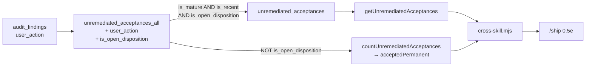

# Plan: Unremediated acceptances — honour the disposition that already exists

- **Date**: 2026-08-09 · **re-scoped 2026-08-11**
- **Status**: Complete (shipped 2026-08-11, `ed41ec78`) — the §6 follow-on
  campaign is deliberately unstarted and is NOT a phase of this plan
- **Author**: Claude + Louis
- **Scope**: backend
- **Target domain(s)**: `stores`, `supabase`, `cross-skill-bridge`, `skills-content`

> **RE-SCOPED — most of the original plan shipped from another session while
> this sat Approved.** The original covered five decisions (D1–D6). Measured
> against the live store on 2026-08-11, three of them already exist, and are
> implemented *better* than this plan specified:
>
> | Original | Status |
> |---|---|
> | **D3** aged cohort reported, never dropped | **shipped** — `unremediated_acceptances_all` (migration `20260811050000`) |
> | **D5/M1** one base view owns predicate P | **shipped** — `_all` is that view; the nag view derives from it via `is_mature`/`is_recent` |
> | **D6** aged cohort retrievable | **shipped** — `--all-ages`, plus `agedOut`/`agedOutByMode`/`agedOutBySeverity` |
> | **H1** unavailability ≠ zero | **shipped** — `measured`/`reason` on the payload |
> | **D1** exclude `accepted-permanent` | **OPEN — this plan** |
> | **D2** keep that count visible | **OPEN — this plan** |
>
> Their version also added `notYetDue`, `prePractice` and a `practiceStart`
> anchor this plan never conceived of, and moved the nag window from 7–30 days
> to 14. **Every figure in the original was therefore stale** and is re-measured
> below. What remains is one predicate and one count.

---

## 1. Context Summary

**Stack**: js-ts, Postgres store. **Scope**: backend, no UI surface.

`/ship` Step 0.5e nags on every push about findings that were accepted and never
remediated. A subset of them were **decided, not forgotten**:
`user_action = 'accepted-permanent'` is the repo's existing "declined on the
merits" disposition — in the `audit_findings` CHECK constraint, written by
`adjudicateFinalReviewFinding`, and stamped with `decided_at`. **No view
consults it.** So a decision that was properly recorded still reports as an open
obligation, forever.

### Code Trace

Read at commit `d0d672c0` (2026-08-11). Live DDL via `pg_get_viewdef`, not the
migration files — migrations are cumulative.

- `unremediated_acceptances_all` — base view. Carries predicate P
  (`adjudication_outcome ∈ (accepted, severity_adjusted)` ∧ `remediation_state
  IS NULL OR ∈ (pending, planned)` ∧ `severity ∈ (HIGH, MEDIUM)`), projects 14
  columns **plus** `is_mature` (`created_at < now()-7d`) and `is_recent`
  (`created_at > now()-30d`). **Does not project `user_action`.**
- `unremediated_acceptances` — `SELECT <14 cols> FROM unremediated_acceptances_all
  WHERE is_mature AND is_recent`, ordered severity-first then `accepted_at`.
- `scripts/lib/store/plans-ship.mjs::countUnremediatedAcceptances (d0d672c0)` —
  groups by `audit_mode` over `_all` (when `allAges`) or the nag view.
- `scripts/lib/store/plans-ship.mjs::getUnremediatedAcceptances (d0d672c0)` —
  `resolveNudgePage` paging, `ORDER BY` spelled out inline per branch.
- `scripts/cross-skill.mjs::list-unremediated-acceptances (d0d672c0)` — emits
  `{ok, cloud, scope, measured, reason, rows, shown, total, byMode, allAges,
  agedOut, agedOutByMode, agedOutBySeverity, notYetDue, prePractice,
  practiceStart, limit, offset}`.

### Figures, re-measured 2026-08-11

Over `unremediated_acceptances_all` for this repo (the unbounded population):

| `user_action` | rows |
|---|---|
| `null` | 190 |
| **`accepted-permanent`** | **36** |
| `needs_triage` | 5 |
| **total** | **231** |

Nag-window `total` is **158**. So **36 rows — 15.6% of the population — are
already decided and still being reported as open work.** The original plan's
201/44 are superseded.

---

## 2. Proposed Architecture

**D1 — the nag view excludes `accepted-permanent` (#1 DRY, #5 Single Source of
Truth).** The disposition exists and is populated; inventing a second "declined"
concept would be a second source of truth for one idea. Reuse, don't invent.
Closes 36 rows without touching a single finding — they were never open work.

**D2 — the excluded count stays visible (#19 Observability).** Excluding it from
the nag is only honest if it remains auditable, otherwise `accepted-permanent`
becomes a silent dumping ground. The payload gains
`byDisposition: {open, acceptedPermanent}`; 0.5e prints both.

**`acceptedPermanent` is unwindowed, deliberately.** It counts over `_all`, not
the nag window. A windowed count would expire the anti-dumping-ground guarantee
exactly when the dumping ground becomes worth auditing — a decision taken 31 days
ago would vanish from every field.

**The base view owns the predicate; nothing restates it.** `is_open_disposition`
is a derived column on `_all` (`user_action IS DISTINCT FROM 'accepted-permanent'`),
so the nag view and the count both consume one definition. A future policy change
edits one relation.

**`IS DISTINCT FROM`, never `<>`.** 190 of 231 rows have `user_action IS NULL`,
and `NULL <> 'accepted-permanent'` is NULL, not true — a bare `<>` would drop
every one of them and silently empty the nag. This is the single most likely
implementation slip and §6 asserts against it.

**The `unlocked_fixes` sibling deliberately does NOT change.** This repo's
standing lesson is that fixing one half of this view family is itself the failure
mode — so the exemption is stated rather than assumed: `unlocked_fixes` asks
"this was **fixed** — is the fix locked?" and keys on `fixed_at`/`lock_spec_count`.
A finding marked `accepted-permanent` was *not* fixed, so it cannot appear there.
The disposition is meaningless for that view, not merely unhandled.

### Right-sizing gate

- **Band-aid**: bulk-close the 36 rows. Numbers improve, the mechanism still
  reports decided work as open, and it recurs next week.
- **Over-engineered**: a disposition state machine — new enum, `finding_dispositions`
  table, approval workflow, reconciliation job. Nothing asks for approval
  workflow, and `decided_at` already records when.
- **Chosen**: consult the column that already exists, and surface the count it
  implies. Current requirement: *a /ship nudge whose number an operator can act
  on.* One derived column, one predicate, one count.

---

## 3. File-Level Plan

**`supabase/migrations/<ts>_unremediated_acceptances_disposition.sql`** (create)
1. `CREATE OR REPLACE VIEW unremediated_acceptances_all` — reproduce the live
   definition verbatim, **appending two columns at the end**: `f.user_action`
   and `(f.user_action IS DISTINCT FROM 'accepted-permanent') AS is_open_disposition`.
   Appending is the only projection change `CREATE OR REPLACE VIEW` permits, and
   that constraint is a feature: an accidental drop or reorder fails loudly.
2. `CREATE OR REPLACE VIEW unremediated_acceptances` — identical 14-column
   projection and `ORDER BY`, WHERE becomes `is_mature AND is_recent AND is_open_disposition`.
   Its column list is unchanged, so the replace is legal and no dependent breaks.
- Order matters: `_all` first (the dependency), then the nag view.

**`scripts/lib/store/plans-ship.mjs`** (modify)
- `countUnremediatedAcceptances` → additionally return `acceptedPermanent`: a
  count over `_all` where `NOT is_open_disposition`, **repo-scoped through the
  same `resolveExplicitRepoScope` fence**, unwindowed. Same failure contract as
  its siblings.
- SQL stays **literal per branch** — `tests/cross-skill-unlocked-scope.test.mjs`
  statically scans the SQL literals in this file, and an interpolated view name
  or predicate is invisible to it.

**`scripts/cross-skill.mjs`** (modify)
- `list-unremediated-acceptances` → emit `byDisposition: {open, acceptedPermanent}`,
  where `open === total` (one number, two names).

**`skills/ship/SKILL.md`** (modify)
- 0.5e prints `N open · M permanently accepted` and states that the second is a
  recorded decision, not a backlog.

**`tests/unremediated-acceptance-disposition.test.mjs`** (create) — the fixture
matrix in §4.

**`tests/cross-skill-unlocked-scope.test.mjs`** (modify) — extend the
counter-contract block so `byDisposition` cannot be dropped silently.

**Close-out (not a phase)**: `node scripts/setup-postgres.mjs --migrate`,
regenerate the schema fixture with **`npm run db:local:regen`** (a fresh replay —
never from the production store, which renumbers `attnum` past dropped-column
tombstones), `npm run skills:regenerate`, `npm test`, `npm run check`.

---

## 4. Testing Strategy

Needs a real Postgres — use the disposable-DSN harness (`assertDisposableDbUrl`,
a loopback **allowlist**; the NAS store on `:5433` is not disposable however it
is spelled).

**Fixture matrix** — cross `user_action` × time band × the P axes:

| Axis | Values |
|---|---|
| `user_action` | `null`, `needs_triage`, `deferred`, `accepted-permanent` |
| `r.created_at` | 3d (immature), 14d (nag), 45d (aged) |
| `adjudication_outcome` | `accepted`, `severity_adjusted`, `dismissed` (excluded) |
| `remediation_state` | `null`, `pending`, `planned`, `fixed` (excluded) |
| `severity` | `HIGH`, `MEDIUM`, `LOW` (excluded) |
| repo | this repo + one other (scoping) |

Assertions:
- **`user_action IS NULL` stays OPEN** — the `IS DISTINCT FROM` guard. A `<>`
  regression drops 190 rows and empties the nag; this row is the one that catches it.
- `needs_triage` and `deferred` stay **open** — only `accepted-permanent` is excluded.
- `accepted-permanent` is absent from `unremediated_acceptances` at every time band.
- `acceptedPermanent` counts an `accepted-permanent` row **older than 30 days**
  (the unwindowed guarantee).
- `total === byDisposition.open`.
- `_all` still returns `accepted-permanent` rows — the base view is the census;
  only the nag view filters.
- the other repo's rows never appear under either scope.

**Negative controls, reverted one at a time** (two on one predicate mask each
other): drop `AND is_open_disposition` → the exclusion tests go red; change
`IS DISTINCT FROM` → `<>` → the `user_action IS NULL` test goes red.

**Vacuous-pass guard**: assert the nag view still returns a non-zero count for an
ordinary `user_action IS NULL` row — otherwise "excluded everything" passes.

---

## 5. Risk & Trade-off Register

| Risk | Mitigation |
|---|---|
| `accepted-permanent` becomes a silence button | D2 keeps the count on every push; `decided_at` records when |
| 36 rows closing looks like progress that isn't | Say so explicitly — they were never open work |
| Concurrent migrations on this view family | Four landed 2026-08-11; `--migrate` is ordered by timestamp and both statements are idempotent `CREATE OR REPLACE` |
| Schema fixture goes stale → red gate repo-wide | Close-out regenerates it from a fresh replay |

**Deliberately out of scope**: the burn-down of the genuinely-open rows (§6).

---

## 6. Follow-on campaign (not a phase, not autonomously executable)

Working the ~190 genuinely-open rows is human-judgement work with no file scope —
the unit is a finding, the action is `final-review-adjudicate` (writes
`user_action` + `adjudication_outcome` + `decided_at` together) or
`final-review-record-fix`, and the input is a judgement. It cannot be a `/cycle`
cluster; `/cycle`'s preflight correctly refused an earlier draft that tried.

It **depends on this plan shipping**: until the disposition is honoured, the
burn-down cannot tell *decided* from *open*.

Method, when run: page the cohort read-only to completion first (`--limit 200`),
then disposition from the collected list — `LIMIT/OFFSET` paging is unstable
under concurrent mutation, and dispositioning mid-walk shifts rows and skips
them. Every disposition commit carries one real git trailer per fingerprint
(`Dispositioned: <fp>`, a repeated `Token: value` record), making the rationale
greppable without a schema change.

---

## Audit Trail

**`/audit-plan` on the original scope — 3 GPT rounds, 16/16 findings accepted,
HIGH 3 → 2 → 1, stopped at the default cap.** Gemini: **APPROVE**, coherence
Strong, no over-engineering flags, `gpt_false_positive_count: 1`. The shadow
reviewer then returned CONCERNS with 5 findings the primary gate missed — all
real, all fixed.

**What survived the re-scope**: D1, D2, the `IS DISTINCT FROM` null-safety
requirement, the unwindowed-count reasoning, the fixture-matrix discipline, and
the schema-fixture close-out (a shadow finding — three relations changing while
`--check-drift` compares against a committed fixture).

**What the re-scope retired**: the keyset-vs-offset pagination argument, the
cursor contract, the aged-view design, and the base-view refactor — all
superseded by shipped work. A plan that keeps describing work someone else has
already done is worse than no plan, because it grades the audit against fiction.

**Two `/cycle` preflight refusals earned their keep**: it rejected a `Files: no
fixed set` cluster (a burn-down has no file scope, so `--autonomous` cannot
execute it), and `ship-commit` refused a commit missing `--expect-head` — the
concurrency guard, during a run in which another session rebased `main`.
