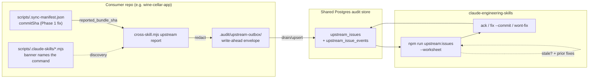

# Plan: Upstream Issue Reports (consumer → source bug channel)

- **Date**: 2026-07-31
- **Status**: Complete (all 4 phases shipped 2026-07-31 — see Audit Trail + Implementation Log)
- **Author**: Claude + Louis
- **Scope**: backend (CLI + migration + store module + banner edit — no UI)

> **Target domain(s)**: `cross-skill-bridge`, `install`, `shared-lib`, `stores`, `supabase`.
> ⚠ **Cross-domain work** — touches 5 domains. This is a horizontal feature (stamp →
> capture → triage → discovery), each step landing in its owning subsystem. No new domain.

## 1. Context Summary

**Scope/stack**: backend, `js-ts` + `postgres` (ESM), per `detect-stack`.

**The gap.** A consumer repo hits a bug in upstream-owned synced tooling
(`scripts/.claude-skills/**`). Today it reports as pasted prose. The 2026-07-31 report
that motivated this plan is the worked example, and it failed in three distinct ways:

| Failure | Evidence from the 2026-07-31 report |
|---|---|
| Wrong path | Named `scripts/install.mjs`; the file is root `install.mjs` |
| No version stamp | Bug was fixed 2026-07-30 (`0965d546`); report filed 07-31 against a pre-fix bundle. Unknowable from the report. |
| Cost of the miss | Consumer read the failure as "tooling isn't installed", skipped `/audit-code` + the Gemini gate, shipped a PR ungated |

The half that *was* net-new (the `gemini-review.mjs` 120s timeout) was real and is now
fixed. So the channel's job is **not** to collect more reports — it is to make an
already-fixed report answer itself, and route the genuinely-new remainder.

**Code Trace** (read this session — grounds every design decision below):

- **The version stamp already exists and is already broken.**
  [`scripts/lib/sync-manifest.mjs:136`](../../scripts/lib/sync-manifest.mjs#L136)
  `getGitMeta` derives `commitSha` via `git rev-parse HEAD`;
  [`:181`](../../scripts/lib/sync-manifest.mjs#L181) `generateManifest` folds it in;
  [`:66`](../../scripts/lib/sync-manifest.mjs#L66) `SyncManifestSchema` already types it
  `z.string().nullable()`. But the consumer write path at
  [`scripts/sync-to-repos.mjs:1654-1661`](../../scripts/sync-to-repos.mjs#L1654)
  **hand-builds** the manifest object rather than calling `generateManifest`, and
  hardcodes `commitSha: null` (and `branch: 'main'`).
  **Measured on disk 2026-07-31**: source `scripts/.sync-manifest.json` →
  `commitSha: "bfcb419a…"`; wine-cellar-app and ai-organiser → `commitSha: null`, both.
- **Manifest location does not relocate.**
  `sourceRelToDestRel('scripts/.sync-manifest.json')` → `scripts/.sync-manifest.json`
  (LAYOUT_CONSTANTS `MANIFEST_PATH`), i.e. consumer-root-relative, *not* under
  `.claude-skills/`. Verified present on disk in both consumers. Gitignored both sides
  (AGENTS.md generated-artifact policy, Category A) — present at runtime, absent from git.
- **An upstream-commit comparison concept already exists**:
  [`sync-manifest.mjs:277`](../../scripts/lib/sync-manifest.mjs#L277) `checkManifestFreshness`
  already returns `upstreamCommit` / `upstreamGeneratedAt`.
- **Discovery surface exists and stops one line short.**
  [`scripts/lib/sync-banner.mjs:31`](../../scripts/lib/sync-banner.mjs#L31) `BANNER_BODY`
  already says *"A bug here is an UPSTREAM bug: fix it in claude-engineering-skills +
  re-sync"* — it names the **policy** but no **command**.
- **Lifecycle precedent**: [`supabase/migrations/20260405092206_add_debt_memory.sql`](../../supabase/migrations/20260405092206_add_debt_memory.sql)
  — `debt_entries` + append-only `debt_events` (`deferred|surfaced|reopened|escalated|resolved|reconciled`).
  This is the shape to copy: a state column plus an append-only event log.
- **Store-module + CLI-dispatch precedent**: [`scripts/lib/store/debt.mjs`](../../scripts/lib/store/debt.mjs)
  and `cmdQuality` [`scripts/cross-skill.mjs:2131`](../../scripts/cross-skill.mjs#L2131)
  → `lib/friction/commands.mjs` (thin-dispatcher discipline).
- **Operator-surface precedent**: `--worksheet` ([`scripts/cross-skill.mjs:885`](../../scripts/cross-skill.mjs#L885)
  → `lib/adjudication-worksheet.mjs`) — the PowerShell-safe rendering convention.
- **Outbox precedent**: [`scripts/lib/learning/decision-logger.mjs`](../../scripts/lib/learning/decision-logger.mjs)
  spills to `.audit/learning-outbox/` when the flush fails.

**Neighbourhood considered** (`get-neighbourhood`, k=8): all 8 candidates banded
`review` (`below-noise-floor-near`, top score 0.819 / similarity 0.698) — nothing
above this repo's noise floor, so no reuse candidate is being ignored. Nearest
neighbours are all `cross-skill-bridge` command handlers (`cmdGetRecentFindings`,
`cmdListUnlockedFixes`, `cmdQuality`), which is the *dispatch shape* being reused,
not the semantics.

**Precedent rejected, with reason.** `memory_friction`
([`20260628120000_memory_friction.sql`](../../supabase/migrations/20260628120000_memory_friction.sql))
is the closest existing table and is deliberately **not** reused. It is a mirror of
harness-memory `type: friction` files, keyed on `memory_name` + `source_hash`, whose
stated purpose is cross-repo *recurrence aggregation* of "how is it to work in THIS
repo". An upstream bug report is a different object: it is about **another repo's
code**, carries a **bundle version**, and has a **triage lifecycle with an owner**.
Overloading `memory_friction` would put two unrelated lifecycles in one table and
corrupt the recurrence metric it exists to serve. Sibling table, same store.

**Patterns reused**: `store/<x>.mjs` writer shape; `cross-skill.mjs` thin dispatch;
graceful cloud-off contract; outbox spill; redact-before-egress; `--worksheet`;
`debt_events` append-only lifecycle; `pgArray()` / raw-jsonb write seam.
**New**: one `upstream_issues` table + one events table, one commands module, two CLI
verbs, one banner line, and a one-field fix to the consumer manifest writer.

## 2. Proposed Architecture



### Key design decisions

1. **Fix the version stamp before building anything on it (#5 Single Source of Truth,
   #15 Error Handling).** The auto-triage is the highest-value part of this feature and
   is *unbuildable* while `commitSha` is null in every consumer.
   **Exactly which fields change, and which must not (resolves an earlier ambiguity in
   this plan).** The consumer manifest is NOT regenerated by `generateManifest` — that
   function hashes files under `rootDir` and would encode source-layout facts. The
   consumer manifest keeps its own `generatedAt` (the sync moment), its own `files` map
   (destination paths, post-rewrite hashes — the ownership record) and
   `layout: 'isolated'`. **Only two fields change owner**: `commitSha` and `branch` are
   taken from the source repo's git meta — the same `getGitMeta(SOURCE_ROOT)` values
   already used for the source-side manifest at
   [`sync-to-repos.mjs:1041`](../../scripts/sync-to-repos.mjs#L1041) — instead of the
   literals `null` / `'main'`. They describe **what was synced from**, not what the
   consumer contains, which is precisely the question triage asks.
   **Scope note (impact, not authorship):** this file is untouched by the feature's
   own logic, but the feature's correctness rides entirely on it. Per AGENTS.md
   ("scope is decided by impact, not authorship") it is in-scope.
2. **The store, not GitHub issues, not committed files (#3 Modularity, #20 Flexibility).**
   The shared Postgres store is already the cross-repo channel: every consumer has
   `AUDIT_DB_URL` via `~/.audit-loop.env`, and the cross-skill design rule already
   routes all cross-repo writes through `cross-skill.mjs`. GitHub issues fail on
   confidentiality (this repo is public; consumer reports carry private-repo context)
   and on needing `gh` auth per consumer. Committed files in consumers fail because
   synced tooling is deliberately gitignored there, and reviewing would mean sweeping
   N repos instead of one query here.
3. **Two different questions, two different mechanisms — the fix commit is not
   available at file time (#12 Validation).** An earlier draft of this plan had a single
   `classifyFreshness({reportedSha, fixCommit})`, which is circular: a *newly filed*
   report is `open` and has no `fixed_in_commit`, so the motivating case could never be
   answered. Split:

   | Question | Mechanism | Output |
   |---|---|---|
   | **(a) "Is this reporter's bundle stale?"** — runs on **every** report | `distanceAhead`: `git rev-list --count <reportedSha>..HEAD`, plus age from `reported_bundle_generated_at` | the report's **verdict** |
   | **(b) "Has anything in this file been fixed since?"** | `fixed` issues with the same `affected_path` **across all consumer repos**, each annotated with whether the reporter's bundle contained that fix | a **context list for a human**, never a verdict |

   **(b) is deliberately cross-repo.** The fixed code lives in *this* repo, so a fix
   prompted by wine-cellar-app's report is equally relevant to an ai-organiser report
   about the same file. Scoping candidates by `repo_id` would hide the single most
   useful piece of evidence the table holds. Cross-repo visibility is consistent with
   the trust model already stated in §3 (one DSN, one trust domain).

   (a) is what would have caught the 2026-07-31 report: its bundle predated `0965d546`,
   which is knowable without anyone naming a fix commit.

   **(b) is explicitly NOT a verdict, because a path is not a bug identity.** One
   upstream file holds many independent defects, so "a fixed issue exists touching this
   file" cannot establish that *this* report is that bug. An earlier draft of this plan
   emitted `likely-already-fixed` from a `(repo_id, affected_path)` match; that would
   have mislabelled a genuinely new bug in a previously-fixed file as already-solved —
   the single failure mode this feature exists to prevent (decision 5). So (b) renders
   as a worksheet column — *"2 prior fixes touch this path; the reporter's bundle
   contained neither"* — and a human draws the conclusion. Semantic bug-identity
   matching is a v2 concern with no current requirement.

   **Ancestry direction — stated explicitly because the intuitive reading is
   backwards.** Let `F` = a candidate's `fixed_in_commit`, `R` = `reported_bundle_sha`:

   | Relationship | Annotation shown |
   |---|---|
   | `F` is **NOT** an ancestor-or-equal of `R` | *"bundle predates this fix"* — the reporter never had it |
   | `F` **is** an ancestor-or-equal of `R` | *"bundle already contained this fix"* — if it is the same bug, that is a regression |

   Fixture check: `R` = a pre-`0965d546` bundle, `F` = `0965d546` → `F` is not an
   ancestor of `R` → "bundle predates this fix". Correct.
4. **Ancestry is a git question, so it is not pure (#11 Testability).** Two pure,
   separately-tested functions, with one impure adapter (`resolveGitFacts`) doing all
   `git` work via the structured [`vcs.mjs`](../../scripts/lib/vcs.mjs) contract and
   mapping every failure to `null`:

   ```
   classifyReportFreshness({ reportedSha, shaInHistory, distanceAhead, ageDays })
     → { verdict: 'stale' | 'current' | 'unknown', reason, distanceAhead, ageDays }

   annotatePriorFix({ fixedInCommit, reportedSha, ancestry })
     → 'bundle-predates-fix' | 'bundle-contains-fix' | 'undetermined'
   ```

   Splitting them is what removed an earlier draft's contradiction (it required both
   "every null → `unknown`" and "null ancestry → `stale`"): ancestry is no longer an
   input to the verdict at all. `ancestry` is `'lacks-fix' | 'contains-fix' |
   'unresolvable'`.

   **Verdict precedence (first match wins, total over the input space):**

   | # | Condition | Verdict (`reason`) |
   |---|---|---|
   | 1 | `reportedSha` null / malformed | `unknown` (`no-stamp`) |
   | 2 | `shaInHistory === false` — resolves nowhere in this repo's history (consumer synced from an unpushed or rebased-away commit) | `unknown` (`sha-not-in-history`) |
   | 3 | `distanceAhead === null` | `unknown` (`git-unavailable`) |
   | 4 | `distanceAhead > 0` | `stale` (carries `distanceAhead` + `ageDays`) |
   | 5 | otherwise (`distanceAhead === 0`) | `current` |

   `ageDays` is **reported, never a threshold** — no arbitrary "stale after N days"
   constant is introduced, because no current requirement needs one.
5. **Advisory triage, never automatic closure (#15).** No verdict ever closes a row; it
   renders as a worksheet flag for a human. Auto-closing on staleness would have
   silently discarded the *real* timeout finding that arrived in the same report as the
   already-fixed one — the single most expensive possible failure of this feature.
6. **`unknown` is never "current" (#15).** An absent/malformed stamp, an unresolvable
   sha (consumer synced from an unpushed commit), or a git failure all yield `unknown`,
   rendered as "version unknown — cannot assess". Inferring freshness from absence is
   the failure this whole feature exists to remove.
7. **Validate `affected_path` at file time, against the manifest already on disk
   (#12).** The consumer manifest's `files` map is the authoritative list of every
   upstream-owned path in that repo — **measured 578 entries** in wine-cellar-app. If
   `affected_path` is not a key, the CLI warns *before* filing: *"not an upstream-owned
   synced file — is this really an upstream bug?"*. Verified against the motivating
   example: `install.mjs` is **not** in the 578 keys, so the exact wrong-path failure is
   caught locally, for free, with no network call. Warn-not-block (the path may be
   genuinely upstream-but-unsynced, e.g. the installer itself), and the verdict is
   stored as `path_recognised` so triage can see it.
   **Normalise separators before comparing — this is Windows-primary tooling.**
   `computeFileHashes` guarantees POSIX forward slashes in manifest keys on every
   platform, so a Windows operator passing `scripts\.claude-skills\ship-commit.mjs`
   would falsely fail the membership check and have a correct report stamped
   `path_recognised: false`, defeating the control. Convert `\` → `/` (and strip a
   leading `./`) before lookup.
8. **Redact on egress (#12).** Report bodies are operator prose from a private repo.
   They pass through `redactSecrets` from
   [`scripts/lib/secret-patterns.mjs`](../../scripts/lib/secret-patterns.mjs) — the
   *gentle* redactor, deliberately **not** `sanitizer.mjs`, which blanket-redacts any
   20+ char token and would corrupt prose (the same rule AGENTS.md states for incident
   text). Applied to `title`, `body`, `affected_path` and every transition `note`, and
   applied **before the outbox write as well as before the DB write** — the outbox is a
   plaintext file on disk and is not a trusted holding area.

## 3. Security Considerations — the trust boundary, stated honestly

The audit raised that consumers hold the same privileged `AUDIT_DB_URL` as this repo,
and that the CLI exposes `list`/`ack`/`fix`/`wont-fix`. Both are true, and the honest
resolution is to **state the existing trust model rather than pretend this feature
creates isolation it does not**:

- **Every repo sharing one `AUDIT_DB_URL` is a single trust domain.** This is
  pre-existing and load-bearing across the whole store: the runtime `pg.Pool` owns
  `public` and **bypasses RLS** by design (AGENTS.md, Postgres-Parity §single-tenant),
  and `audit_findings`, `persona_test_sessions` and `debt_entries` *already* carry
  private-repo context readable by any holder of that DSN. `upstream_issues` adds a
  row type, not a new exposure class.
- **Therefore the design constraint is a content rule, not an ACL**: a report body must
  be written on the assumption that every repo sharing the DSN can read it. This is
  documented at the capture site and in the banner-adjacent docs, and is why redaction
  (decision 8) is mandatory rather than best-effort.
- **`repo_id` is derived, never accepted from a flag.** It comes from
  `resolveRepoIdentity(process.cwd())`, the same seam every other cross-skill write
  uses. There is no `--repo-id` flag to forge. (A DSN holder can of course write
  arbitrary SQL directly — that is the trust domain above, not something a CLI flag
  policy can change.)
- **Correction to an earlier claim in this plan.** §2 decision 2 originally cited
  confidentiality as a reason to prefer the store over GitHub issues. The accurate
  statement is narrower and still decisive: the store keeps private-repo context out of
  a **public** repo's issue tracker (a genuinely different audience), while remaining
  readable within the existing single-tenant domain. It is not a per-consumer isolation
  mechanism and this plan does not claim one.
- **Out of scope, explicitly**: per-consumer credentials, RLS policies, or a
  write-restricted reporter role. Adding an auth tier for a single-tenant store used by
  one operator is the over-engineering cliff; revisit if a second operator ever shares
  the DSN.

## 4. Contracts

### 4a. CLI contract

Consumer side (one verb) and source side (four verbs). Body arrives on **stdin**, never
as an argv string — it is multiline prose and must not be shell-quoted (this also keeps
it clear of the PowerShell operator-doc rule).

| Command | Required | Optional | Exit |
|---|---|---|---|
| `cross-skill.mjs upstream report` | `--title <s>`, `--affected-path <p>`, body on stdin | `--severity BLOCKER\|HIGH\|MEDIUM\|LOW` (default `MEDIUM`) | `0` filed or spooled; `2` bad input; `1` unexpected |
| `cross-skill.mjs upstream list` | — | `--state <s>` (default `open`), `--limit <n>` (default 50, max 200), `--before <cursor>` (the `nextCursor` from the previous page — without it the operator cannot traverse past page 1), `--worksheet` | `0` |
| `cross-skill.mjs upstream ack` | `--id <uuid>` | `--note <s>` | `0`; `2` unknown id / illegal transition |
| `cross-skill.mjs upstream fix` | `--id <uuid>`, `--commit <sha>` | `--note <s>` | `0`; `2` illegal transition or unresolvable commit |
| `cross-skill.mjs upstream wont-fix` | `--id <uuid>`, `--note <s>` (required here — a refusal needs a reason) | — | `0`; `2` illegal transition |

- **Validation**: `title` 1–200 chars; `severity` in the CHECK set; **body non-empty and
  ≤64 KiB** (it lands in a durable plaintext outbox and a Postgres row — an unbounded
  paste is a disk and egress concern, and an empty body is a useless report → exit 2);
  `affected_path` repo-relative, no `..`, checked against the manifest (decision 7);
  `--commit` must resolve via `git rev-parse --verify` **in this repo** before the
  transition is accepted (an unresolvable commit is exit 2, never a stored string).
- **`--out <path>` is accepted by every verb** (omitted from the table rows only to keep
  them readable): writes the same structured result as JSON via `atomicWriteFileSync`,
  overwriting. Progress goes to stderr — the repo's standard CLI shape.
- **Stdout shape, and the one exception**: a single-line summary by default;
  **`--worksheet` renders multi-line human text to stdout**, which is its entire
  purpose (identical to the existing `model-ab-adjudicate` worksheet surface). The
  single-line rule governs machine-readable mode; `--worksheet` opts out of it
  deliberately, and `npm run upstream:issues` is a worksheet command.
- **All flags must be registered in `assertKnownFlags`** — a new flag without it fails
  the pre-push `cli:flags:gate`.
- **Transitions are cloud-required and are never spooled.** `ack`/`fix`/`wont-fix` are
  source-side maintainer actions against authoritative lifecycle state; queuing them
  offline would need replay-ordering rules against a row another actor may have moved —
  the over-engineering cliff for a single-operator store. Store unavailable → **exit 1
  with "store unavailable — retry"**, nothing written locally. Only `report` (a capture,
  from a machine that may legitimately be offline) uses the outbox.
- **npm script**: `"upstream:issues": "node scripts/cross-skill.mjs upstream list --worksheet"`.
- **Banner text** (resolves the "unspecified exact command" gap): the appended
  `BANNER_BODY` line is exactly
  `Report an upstream bug: node scripts/.claude-skills/cross-skill.mjs upstream report --help`
  — the relocated consumer path, since that is where the banner is read.

### 4b. Lifecycle contract

Legal transitions (anything else is exit 2):

```
open ──ack──> acknowledged ──fix──> fixed
 │                  │
 └──fix────────────>┤
 └──wont-fix───────>┴──wont-fix──> wont_fix
```

- `fixed` and `wont_fix` are **terminal**; reopening is a v2 concern (record it as a new
  report referencing the old id).
- **Invariant**: `state='fixed'` ⟺ `fixed_in_commit IS NOT NULL`, enforced by a table
  CHECK, so a stale commit cannot linger on a non-fixed row.
- The row `UPDATE` and the `upstream_issue_events` `INSERT` happen in **one transaction**
  (`withTx`), so the append-only log can never diverge from the row's state.
- Concurrency: the `UPDATE` is guarded on the expected current state
  (`WHERE id=$1 AND state=$2`); a 0-row result means someone else transitioned it first
  → exit 2 with "state changed, re-read". This is the repo's unverified-write rule
  (a write whose row count is not checked is an `/audit-code` HIGH).

### 4c. Outbox contract

Reconciles the earlier contradiction in this plan (§8 said "graceful no-op" *and*
"spill"): cloud-off is a graceful no-op **for the caller's task**, but it is never a
silent discard.

- **Write-ahead, not spill-on-failure.** The envelope is written **before** the cloud
  attempt in every case, and deleted only after a confirmed write. Spill-on-failure
  cannot survive a process death *during* the remote call — the report would exist
  nowhere. This also makes cloud-on and cloud-off one code path.
- **Location**: `.audit/upstream-outbox/<fingerprint>.json` (gitignored, mirrors
  `.audit/learning-outbox/`).
- **Envelope**: `{ v: 1, fingerprint, repoUuid, payload, createdAt }` — payload
  **already redacted** (decision 8).
- **Atomicity**: `atomicWriteFileSync` (temp + rename), the repo's standard.
- **Fingerprint** = `sha256(JSON.stringify([repoUuid, title, affectedPath,
  reportedBundleSha, sha256(body)]))`. **Unambiguous encoding is load-bearing, not
  style**: bare concatenation lets field boundaries shift — `title:'fo' + path:'obar'`
  hashes identically to `title:'foo' + path:'bar'` — and since `fingerprint` is the
  UNIQUE dedup key, a collision means one real report **silently overwrites** another.
  `JSON.stringify` of a fixed-arity array quotes and delimits every field, so no
  boundary shift is representable. **The body hash is equally load-bearing**: without
  it, two genuinely different reports from one consumer about one file at one bundle
  version — the *likely* case, since titles are conventional — collide. Including the
  body keeps distinct reports distinct while an identical retry still de-duplicates.
- **Idempotency**: the drain upserts on `fingerprint` (UNIQUE), covering "the write
  landed but the acknowledgement was lost".
- **Drain**: at the start of **any `cross-skill.mjs` invocation**, gated on
  `fs.existsSync(outboxDir)` + cloud enabled, capped at 20 envelopes per run. Triggering
  only on `upstream report`/`list` would have meant the outbox **never drains on a
  consumer**: `list` is a source-side triage command consumers never run, and `report`
  is by definition rare — so a report spooled during a transient outage would sit until
  the *next* bug was filed. Consumers invoke `cross-skill.mjs` constantly (audit, ship,
  persona), so that is the hook that actually fires. The existence check keeps the cost
  at one `stat` for every run that has nothing pending. No daemon, no scheduler.
  **The delete must tolerate a concurrent winner**: two CLI invocations can drain the
  same file, both upsert successfully (idempotent by fingerprint), and the slower one
  would then throw `ENOENT` on unlink and abort the operator's actual command. Use
  `fs.rmSync(path, {force: true})` and treat a missing file as success — the drain is
  best-effort housekeeping and must never fail the command it is piggybacking on.
- **Return shape**: `{ok:true, cloud:<bool>, spooled:<bool>, path}`. Cloud off →
  "spooled locally (cloud off)". A success line is never printed having persisted
  nothing — the write-ahead file is the proof.

## 5. Right-sizing gate

New structure is on the table (a table pair, a CLI surface, a persistent artifact), so
per AGENTS.md the three lines are mandatory:

- **Band-aid extreme** — keep pasting prose into chat, and add a sentence to AGENTS.md
  saying "please include the bundle SHA". Root cause (the SHA is *null*, so nobody
  **can** include it) resurfaces on the next report.
- **Over-engineered extreme** — a full bug tracker: dashboard tab, semantic dedup
  against prior reports, auto-notify to the source repo, bidirectional status sync back
  to the reporting consumer, SLA fields, attachments.
- **Chosen** — two tables, one commands module, two CLI verbs, one banner line, one
  manifest-field fix. Current requirements served: (a) reports arrive with a resolvable
  path + version; (b) an already-fixed report is flagged mechanically; (c) open reports
  are reviewable from one place. Dashboard/dedup/notify are **explicitly deferred to v2**
  — at the current observed volume (one report) a dedup engine has no signal to work on.

**Manual vs scripted**: the migration is one `.sql` file and the consumer-manifest fix
is one call-site. Both by hand — well under the ~5-site threshold, and neither is a
regular transformation.

## 6. Sustainability Notes

- **Assumption that could change**: exactly one upstream (this repo). `upstream_issues`
  therefore has no `upstream_repo` column — the store is already single-tenant and the
  reporting repo is captured in `repo_id`. If a second upstream ever ships, add the
  column then; adding it now serves no current requirement.
- **Extension seam deliberately built in**: the `state` CHECK constraint and the
  append-only events table mean a v2 state (e.g. `needs-info`) is a migration that adds
  one enum value, not a redesign.
- **What breaks in 6 months**: if the manifest format changes, `reported_bundle_sha`
  capture degrades to null — which the CLI must treat as "unknown version", *not* as
  "current". Phase 3's triage must never infer freshness from an absent stamp.

## 7. File-Level Plan

- **`supabase/migrations/20260731120000_upstream_issues.sql`** (create) — `upstream_issues`
  (`id`, `repo_id` FK `audit_repos`, `title`, `body`, `severity` CHECK
  `('BLOCKER','HIGH','MEDIUM','LOW')`, `affected_path`, `reported_bundle_sha` nullable,
  `reported_bundle_generated_at` nullable, `state` CHECK
  `('open','acknowledged','fixed','wont_fix')` default `open`, `fixed_in_commit`
  nullable, `path_recognised` boolean nullable, `fingerprint` UNIQUE, timestamps)
  + append-only `upstream_issue_events` (`id` UUID PK, `issue_id` UUID **NOT NULL
  REFERENCES `upstream_issues(id)` ON DELETE CASCADE** — typed and FK-constrained,
  matching `debt_events`, so events cannot outlive or orphan their issue; `event` TEXT
  CHECK `('reported','acknowledged','fixed','wont_fix')`, `note` TEXT, `actor` TEXT,
  `created_at` TIMESTAMPTZ), indexed `(issue_id, created_at)`.
  **`NOT NULL` on every constrained column** — `repo_id`, `title`, `body`, `severity`,
  `state`, `fingerprint`, `created_at`, and events' `issue_id`/`event`/`created_at`. This
  is load-bearing, not boilerplate: a Postgres `CHECK` evaluates to NULL (and therefore
  **passes**) when its operand is NULL, so both the severity/state enum checks and the
  `fixed` equivalence below are inert on a NULL column without it.
  **CHECK**: `(state='fixed') = (fixed_in_commit IS NOT NULL)` (§4b).
  **Indexes** (§4a `list` is the only read path, so index exactly it):
  `(state, created_at DESC, id DESC)` for the default worksheet query — **composite with
  `id`** so the keyset cursor is unique (see the store module) — plus
  `(affected_path, state)` for the **cross-repo** candidate-prior-fix join of §2 dec. 3
  (deliberately NOT led by `repo_id` — that would isolate universally-relevant upstream
  fixes per consumer) and `(repo_id, created_at DESC)` for per-consumer lookup;
  `fingerprint` UNIQUE backs the outbox-drain upsert. RLS enabled, no anon policy — service-role only, mirroring
  `memory_friction` / `security_incidents`.
  *Why this file*: schema is the contract; the ledger runner applies all `.sql` (#5).
- **`scripts/lib/store/upstream-issues.mjs`** (create) — `recordUpstreamIssue`
  (upsert on `fingerprint`; inserts the initial `reported` event in the **same
  transaction** as the row, **conditional on the row actually being new** — the outbox
  retries by design, so an unconditional insert would append a duplicate `reported`
  event on every replay, making the append-only log a false audit trail. Gate on the
  `INSERT … ON CONFLICT DO NOTHING RETURNING id` actually returning a row),
  `listUpstreamIssues({state, limit, before})` — **bounded**: default 50, hard max 200,
  ordered `(created_at DESC, id DESC)` and keyset-paged on that **composite** cursor
  (`created_at` alone is not unique, so same-timestamp rows would be skipped or
  repeated across pages), returning `{rows, nextCursor}` so the worksheet can never
  render an unbounded set of private report bodies — and
  `transitionUpstreamIssue({id, from, to, note, commit})` (single `withTx`,
  state-guarded `UPDATE`, row count asserted, event appended in the same tx). jsonb
  passed raw; any `text[]` opts out via `pgArray()`.
  *Why this file*: mirrors `store/debt.mjs`; keeps SQL out of the CLI (#3).
- **`scripts/lib/upstream/commands.mjs`** (create) — `upstreamReport`, `upstreamList`,
  `upstreamTransition`, `drainOutbox`, plus:
  - `readBundleStamp(repoRoot)` — reads `scripts/.sync-manifest.json`; absent /
    malformed / missing field → `null`, never throws.
  - `validateAffectedPath(path, manifest)` — membership in `manifest.files` (§2 dec. 7).
  - `classifyReportFreshness` and `annotatePriorFix` — **pure**; exact signatures and
    return unions are fixed in §2 dec. 4 (that block is the single source of truth for
    them; do not restate the shapes here).
  - `resolveGitFacts({reportedSha, fixCommits})` — the **impure** adapter; runs
    `git rev-parse --verify`, `git rev-list --count` and `git merge-base --is-ancestor`
    via [`scripts/lib/vcs.mjs`](../../scripts/lib/vcs.mjs).
    **`--is-ancestor` exit 1 is a valid answer, NOT an error** — git uses exit 0 for
    true and **exit 1 for false**, so the usual "non-zero ⇒ failure" mapping would
    convert every legitimate *"bundle predates this fix"* into `'unresolvable'`,
    silently destroying the one signal this feature exists to produce. Map explicitly:
    `0 → 'contains-fix'`, `1 → 'lacks-fix'`, **anything else** (or a spawn failure)
    `→ 'unresolvable'`. `rev-list`/`rev-parse` failures still map to `null`.
  - `UpstreamOutboxEnvelopeSchema` (Zod) — validated on **drain**, not just on write.
    A malformed / unsupported-`v` / invalid-payload file is **moved to
    `.audit/upstream-outbox/rejected/`** with the parse error alongside it, never
    deleted and never retried forever — a poison envelope must not block the queue or
    vanish silently.
  *Why this file*: thin-dispatcher discipline — `cross-skill.mjs` dispatches, logic
  lives here (matches `lib/friction/commands.mjs`); the pure/impure split is what makes
  the freshness rule unit-testable without a git fixture.
- **`scripts/cross-skill.mjs`** (modify) — add `cmdUpstream` dispatching
  `report|list|ack|fix|wont-fix`; register in the command map; add the new flags to the
  `assertKnownFlags` list (a new flag without it fails the pre-push `cli:flags:gate`).
  *Why this file*: the single sanctioned cross-repo write seam (AGENTS.md design rule).
- **`scripts/sync-to-repos.mjs`** (modify) — **Phase 1**: replace the hand-built
  consumer-manifest literal at ~L1654 so `commitSha` / `branch` come from the source
  repo's git meta (the value already computed for the source-side manifest at ~L1041)
  instead of `null` / `'main'`.
  *Why this file*: the null stamp is the prerequisite defect (#5).
- **`scripts/lib/sync-banner.mjs`** (modify) — append one `BANNER_BODY` line naming the
  exact command. Note the banner is injected into ~578 synced files, so the line must be
  short; and `tests/` asserting banner text will need updating in the same commit.
  *Why this file*: discovery — the agent hitting the bug is the one holding the context.
- **`package.json`** (modify) — add `"upstream:issues"` script.
- **`tests/upstream-issue-triage.test.mjs`** (create) — Tier-1 pure-unit coverage of
  `classifyFreshness` + `readBundleStamp`.
- **`tests/sync-manifest-consumer-stamp.test.mjs`** (create) — asserts a consumer
  manifest carries a non-null `commitSha`. **Tier-3 (hard test-first)**: this is the
  consumer-sync/relocation contract, where a break ships silently to repos we cannot
  observe. Lands in the same commit as the Phase 1 fix.
- **`AGENTS.md`** (modify) — one stub paragraph + pointer under the consumer-repo
  governance section (the file is loaded every session; size is a cost).

### 7b. Implementation Phases

**Phase 1 — Version stamp (prerequisite)** — ✅ **SHIPPED 2026-07-31**. Consumer
manifests now carry the real source `commitSha`. Files: `scripts/sync-to-repos.mjs`
(modify), `scripts/lib/sync-manifest.mjs` (modify — export `getGitMeta`),
`tests/sync-manifest-consumer-stamp.test.mjs` (create).

> **One implementation detail the plan did not anticipate, found while building.**
> The obvious implementation — reuse `commitSha` off the `writeManifest(SOURCE_ROOT, …)`
> return value at [`sync-to-repos.mjs:1041`](../../scripts/sync-to-repos.mjs#L1041) — is
> **wrong**. `writeManifest` returns the EXISTING on-disk manifest on its
> idempotency-skip path ([`sync-manifest.mjs:210`](../../scripts/lib/sync-manifest.mjs#L210)),
> so whenever no managed file's hash changed (a docs-only sync — the common case) it
> would have stamped consumers with a **stale but entirely plausible** sha. That is a
> worse failure than `null`: null is honestly unknown, a stale sha is a confident wrong
> answer, and §2 dec. 6 exists precisely to prevent that class. The fix therefore
> exports `getGitMeta` and reads HEAD directly at sync time. Pinned by a regression test
> that asserts the skip path still returns the stale value — if that ever changes, the
> comment justifying the direct read is obsolete and both must be updated together.
>
> **Verified live** (not just unit-tested): synced both consumers; wine-cellar-app and
> ai-organiser went `commitSha: null` → `f2c666e9…`, byte-matching this repo's HEAD.

**Phase 2 — Store + schema** — ✅ **SHIPPED 2026-07-31**. The table pair and its writer.
Files: `supabase/migrations/20260731120000_upstream_issues.sql` (create),
`scripts/lib/store/upstream-issues.mjs` (create).

**Phase 3 — Capture + triage CLI** — ✅ **SHIPPED 2026-07-31**. Report from consumers, review here.
Files: `scripts/lib/upstream/commands.mjs` (create), `scripts/cross-skill.mjs` (modify),
`package.json` (modify), `tests/upstream-issue-triage.test.mjs` (create).

**Phase 4 — Discovery + docs** — ✅ **SHIPPED 2026-07-31**. Point agents at the command.
Files: `scripts/lib/sync-banner.mjs` (modify), `AGENTS.md` (modify).

**Close-out (not a phase)**: `npm run skills:regenerate` (only if a SKILL.md changes),
`npm test`, `npm run check`.

## 8. Risk & Trade-off Register

| Risk | Mitigation |
|---|---|
| Banner edit touches ~578 synced files → one large, noisy re-sync diff | Expected and acceptable (files are gitignored in consumers). Keep the added line to one. Update banner-asserting tests in the same commit. |
| `reported_bundle_sha` absent on old bundles | `classifyFreshness` returns `unknown` and the worksheet says so. **Never** infer "current" from a missing stamp. |
| Report body leaks secrets from a private consumer repo | `redactSecrets` applied to title/body/path/notes **before both** the DB write and the outbox write (§2 dec. 8). New assertions required — the existing sensitive-egress suite covers audit payloads, not this path, so it cannot be cited as pre-existing protection. |
| Consumer offline / cloud disabled | Outbox contract §4c: fingerprint-named, atomically written, redacted-at-rest, drained opportunistically, upserted on drain. Never blocks the consumer's task; never silently discards. |
| Report body readable by any repo sharing the DSN | Not mitigated — **stated** (§3). Single trust domain is pre-existing across the whole store; the content rule + redaction are the controls. |
| Feature is used to report things that are *not* upstream bugs | `affected_path` validated against the manifest's 578-key file map at file time (§2 dec. 7) — warn, store `path_recognised`, don't block. This is the control that catches the motivating example's wrong path. |

**Deliberately deferred**: dashboard tab, semantic dedup, auto-notify, bidirectional
status-sync to the reporting consumer. Reason: no current requirement at a volume of one
report; each is additive later without redesign.

## 9. Testing Strategy

- **Tier 1 (test-first, deterministic seams)**: `classifyReportFreshness` — one case per
  row of the §2 dec. 4 precedence table (the table is total, so the tests are its
  enumeration), and specifically **the direction fixture**: `F=0965d546`,
  `R=`a pre-fix bundle, `ancestry='lacks-fix'` → `likely-already-fixed`, plus its
  inverse `ancestry='contains-fix'` → `contains-fix`. An inverted implementation must
  fail both. `readBundleStamp` (present / absent / malformed JSON / `commitSha: null`);
  `validateAffectedPath` — **regression-pinned on the motivating example**:
  `install.mjs` against a fixture manifest must return not-recognised; fingerprint —
  two reports differing **only in body** must not collide; `transitionUpstreamIssue`
  legal/illegal transition table (§4b); envelope schema — malformed / bad-`v` files land
  in `rejected/` rather than being deleted or retried forever; **replay idempotency** —
  draining the same envelope twice yields exactly one `reported` event.
- **Tier 3 (hard test-first, same commit)**: the consumer-manifest stamp test — this is
  the consumer-sync contract, per the AGENTS.md testing-doctrine tier list.
- **Integration**: `recordUpstreamIssue` → `listUpstreamIssues` → `transitionUpstreamIssue`
  round-trip against `AUDIT_DB_TEST_URL` (disposable-DSN gate applies).
- **Success-path adversarialism** (AGENTS.md pre-ship rule — audit the branches that can
  emit green): assert that a cloud-off `report` returns `cloud:false` **and** leaves an
  outbox file, so "reported successfully" can never be printed having persisted nothing.
- **Empirical verify before done**: file one real report from wine-cellar-app against
  the live store, review it here with `--worksheet`, transition it to `fixed`. The
  2026-07-31 install.mjs report is the natural regression fixture — refiled against a
  pre-`0965d546` sha, it must classify `likely-already-fixed`.

## 11. Execution Clustering

- **Cluster A** — Phases 1–2 — fix-gate: yes
  - Coupling: both are the persistence substrate. Phase 3's `reported_bundle_sha` column
    is meaningless unless Phase 1 populates the stamp, so they share the "a report can
    identify its bundle version" seam and must be audited together.
- **Cluster B** — Phases 3–4 — fix-gate: final
  - Coupling: the CLI and the banner that advertises it are one surface — the banner
    text must name the exact verb `cross-skill.mjs` registers, or discovery points at a
    command that does not exist.
- **Final gate**: consolidated Gemini review over the union diff.

---

## Audit Trail

`/audit-plan` — 3 GPT rounds + 2 Gemini-gate rounds (Claude Opus served the gate;
`--mode plan` throughout). **24 findings, all accepted as valid and in-scope; zero
rebutted, zero deferred, zero dismissed.**

| Round | Verdict | H / M | Character |
|---|---|---|---|
| GPT R1 | SIGNIFICANT_GAPS | 5 / 4 | Design gaps in the core mechanism |
| GPT R2 | NEEDS_REVISION | 3 / 2 | Logic + contract defects |
| GPT R3 | NEEDS_REVISION | 2 / 4 | 1 design defect, rest spec-consistency |
| Gemini G1 | CONCERNS | 1 / 2 / 2L | Encoding, concurrency, platform |
| Gemini G2 | CONCERNS | 2 / 1 / 1L | Scoping, liveness, git semantics |

**Six corrections that changed the design** (as opposed to sharpening prose):

1. **Circular classifier** (R1) — the original single `classifyFreshness({reportedSha,
   fixCommit})` could never answer the motivating case, because a newly-filed report has
   no fix commit. Split into bundle-staleness (needs none) + prior-fix annotation.
2. **Inverted ancestry** (R2) — the plan had `fixed_in_commit` being an *ancestor of* the
   reported sha meaning "already fixed". It means the opposite: the reporter's bundle
   *contains* the fix. Shipping this would have inverted every verdict.
3. **A path is not a bug identity** (R3) — matching candidate fixes on
   `(repo_id, affected_path)` would have labelled a genuinely new bug in a
   previously-fixed file as already-solved: the exact failure this feature exists to
   prevent. Demoted from a verdict to a human-read context column.
4. **Fingerprint collisions** (G1) — bare concatenation lets field boundaries shift, and
   the fingerprint is a UNIQUE key, so a collision silently overwrites a real report.
   Now a `JSON.stringify` array, with the body hash included.
5. **The outbox never drained** (G2) — the triggers were `upstream report` (rare) and
   `upstream list` (a command consumers never run). Moved to any `cross-skill.mjs`
   invocation, existence-gated.
6. **`git merge-base --is-ancestor` exits 1 for a valid "false"** (G3) — the reflexive
   "non-zero ⇒ error" mapping would have converted every legitimate "bundle predates the
   fix" into `unresolvable`, destroying the feature's only signal.

**Stop decision.** GPT stopped at R3 (the skill's cap; HIGH fell 5→3→2 and R3's
remainder was spec-consistency, not design). Gemini stopped at G2 (the cap): G2's
findings were concrete design defects and were fixed, but the class had shifted to
implementation-level detail that `/audit-code` verifies against real code — the correct
artifact. Both caps were reached, neither exceeded.

**Note on cost of the gate itself**: the two Gemini runs took 139s and 145s. Both would
have tripped the 120s `GEMINI_REVIEW_TIMEOUT_MS` default that was raised to 180s earlier
in this same session — incidental live confirmation that the old ceiling was too tight.

---

## Implementation Log

### 2026-07-31 — Phase 1 (version stamp)

- **Completed**: consumer manifests now carry the source repo's HEAD sha.
  `getGitMeta` exported from [`scripts/lib/sync-manifest.mjs`](../../scripts/lib/sync-manifest.mjs);
  [`scripts/sync-to-repos.mjs`](../../scripts/sync-to-repos.mjs) reads it once before the
  per-repo loop and stamps `commitSha` + `branch` into the consumer manifest, replacing
  the hardcoded `null` / `'main'`.
- **Deviation from the plan (and why)**: the plan implied the source-side manifest's
  already-computed value could be reused. It cannot — `writeManifest` returns the
  *existing on-disk* manifest on its idempotency-skip path, so a sync in which no
  managed file's hash changed would have stamped a **stale but plausible** sha. Read
  HEAD directly instead; pinned by a test asserting the skip path still returns the
  stale value, so the justification and the code cannot silently diverge.
- **Verified live, not just unit-tested**: synced both consumers —
  wine-cellar-app and ai-organiser went `commitSha: null` → `f2c666e9…`, byte-matching
  this repo's HEAD. Full suite 9599 pass / 0 fail.
- **One self-inflicted catch worth recording**: the first version of the new test failed
  the repo's own `rmsync-retry-guard` invariant (every `fs.rmSync` must carry
  `maxRetries`/`retryDelay` for Windows EPERM/EBUSY). The gate did its job on
  brand-new code.
- **Remaining**: Phases 2–4 (store + schema, capture/triage CLI, banner + docs).

### 2026-07-31 — Phases 2–4 (`/cycle --autonomous`, clustered)

Cluster A (Phases 1–2) converged; Cluster B (Phases 3–4) gated by the
consolidated review: **APPROVE, 0 new findings**. 47 findings across 4 GPT rounds.

**Deviations from the plan, all found by building or by empirical test:**

1. **The append-only trigger initially broke the FK cascade.** A `BEFORE DELETE`
   row trigger *does* fire for rows removed by a referential action, so blocking
   both UPDATE and DELETE made `DELETE FROM upstream_issues` — and by extension
   removing an `audit_repos` row — fail outright. Verified against a live
   Postgres rather than reasoned about; corrected to UPDATE-only, which is the
   property that actually matters (history cannot be *rewritten*), with the
   residual stated in the migration.
2. **`rev-parse --verify` was the wrong ancestry test.** It proves an object
   exists locally, not that it is in HEAD's history — and any git failure also
   returns non-zero, which would have been reported as the confident claim "that
   sha is not ours". Replaced with `merge-base --is-ancestor`, which
   distinguishes in-history / genuinely-not / cannot-tell by exit code.
3. **The consumer-manifest builder had to be extracted** (`buildConsumerManifest`)
   because the Phase 1 test asserted on a hand-built literal — the audit
   correctly flagged that the real writer could have gone on returning
   `commitSha: null` forever with the suite still green.
4. **`updateWhere({returning: 'id'})` is invalid** — the API takes an array. Found
   by the live round-trip, not by any static pass.
5. **Two repo invariants caught brand-new code**: the `rmSync` Windows-hardening
   guard and the CLI-catalog completeness gate.
6. **AGENTS.md hit its own 1200-line sprawl cap.** Condensed the arch-memory
   hook's operational detail to a stub rather than raising the cap, per the rule
   in this repo's own preamble.

**Verified live** (pre-ship empirical rule — a browser-less but equally
runtime-dependent surface): two real reports filed from wine-cellar-app against
the shared store. The one naming the motivating wrong path (`scripts/install.mjs`)
came back `path_recognised: false`; both carried `bundleSha: d9879e26` from the
Phase 1 stamp. Worksheet rendered, `fix --commit` transition applied, and the
terminal-state and unresolvable-commit guards both refused. Ancestry checked
against real history in both directions: a pre-fix bundle 28 commits behind
reported `bundle-predates-fix`; a post-fix bundle reported `bundle-contains-fix`.

**Three findings across the rounds asserted a file was absent**
(`scripts/lib/secret-patterns.mjs`, `scripts/sync-to-repos.mjs`) **or that the
SQL migration opens with a `//` comment.** All three were verified false on disk;
the migration had already applied cleanly to two live databases. Recorded because
the pattern — a confident, specific, checkable claim about untouched code — is
the one the repo's "an audit finding about untouched code is a hypothesis" rule
exists for.

**Deferred as independent**: cross-domain import findings (`stores → arch-memory`,
`cross-skill-bridge → model-eval`, `audit → install`) and mutation-contract
findings in untouched `cross-skill.mjs` handlers (`cmdAbortRefreshRun`,
`cmdUpdatePlanStatus`, `lock-with-test`, `persona-outcomes`). The `upstream`
handler calls none of them.
