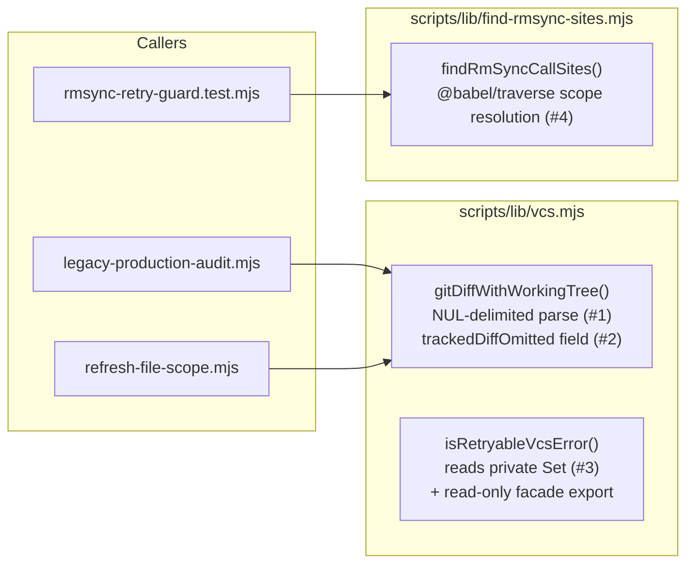

# Plan: Harden vcs.mjs's git-output parsing and find-rmsync-sites.mjs's scope resolution

- **Date**: 2026-07-27
- **Status**: Complete
- **Author**: Claude + Lbstrydom
- **Scope**: backend
- **Target domain(s)**: `shared-lib` (`compute-target-domains`: `{"domains":["shared-lib"],"crossDomain":false}`)

## 1. Context Summary

This closes the remaining 13 entries of `docs/plans/refactor-install-wal-vcs-2026-07.md`
(the `transaction.mjs` 9-entry portion of that triage document already shipped
via `docs/plans/transaction-wal-cleanup-failure-distinction.md`). Three
**independent** defect classes across two `shared-lib` files:

1. `scripts/lib/vcs.mjs::gitDiffWithWorkingTree` parses `git diff --name-status`
   output with a whitespace regex that mis-parses paths containing literal
   spaces (topicIds `087d6ca8`, `1aa272b5`, `bc3095ea`, `bd92cfe5`).
2. The same function silently skips tracked-file diffing entirely when
   `sinceCommit` is falsy, returning only untracked files with no visible
   signal of the omission (topicIds `1f40ab08`, `ebbbc2ad`).
3. `RETRYABLE_VCS_ERRORS` is exported as a mutable `new Set(...)`, and
   `isRetryableVcsError()` independently hardcodes `'EXEC_FAILED'` instead of
   reading the Set, so the two can silently diverge (topicIds `1337d6e1`,
   `904c0d36`, `913d3a00`, `c2cca428`).
4. `scripts/lib/find-rmsync-sites.mjs` (and its own consumer,
   `tests/rmsync-retry-guard.test.mjs`) match `fs.rmSync`-style calls by plain
   identifier NAME with no lexical-scope/shadowing resolution, and don't
   handle computed (`fs['rmSync']`) or optional-call (`fs?.rmSync()`) forms
   (topicIds `0c1d3132`, `82ab4534`, `e54d6d52`).

**Code Trace** (all four read directly, not inferred):

- `scripts/lib/vcs.mjs:273-330` — `gitDiffWithWorkingTree(cwd, sinceCommit,
  opts)`: line 276 `if (sinceCommit) { ... }` gates the ENTIRE tracked-file
  diff block (lines 277-307) — a falsy `sinceCommit` skips straight to the
  untracked-only `git ls-files` call (line 311) with no signal that anything
  was omitted. Line 300: `line.match(/^([AMDR])\d*\s+(.+?)(?:\s+(.+))?$/)` —
  the regex's `\s+` separators cannot distinguish a literal space INSIDE a
  filename from the real field separator (git's plain `--name-status` output
  uses a single TAB between fields, but the regex accepts ANY whitespace run,
  so it can't tell "tab" from "a run of literal spaces mid-filename" either
  way — empirically confirmed below).
- `scripts/lib/vcs.mjs:44-62` — `RETRYABLE_VCS_ERRORS` (`new Set(['EXEC_FAILED'])`,
  exported `const`) + `isRetryableVcsError(code)` (`return code ===
  'EXEC_FAILED';`, hardcoded independently of the Set). The Set's own doc
  comment already flags the mutability risk but does not fix it. **Empirically
  verified this session**: `Object.freeze(new Set(['a']))` still allows
  `.add('b')` to succeed silently (`'use strict'`, Node 22) — `Object.freeze`
  freezes an object's OWN enumerable properties, not a `Set`'s internal
  storage slots, so the "just freeze it" fix used elsewhere in this codebase
  (`scripts/lib/audit/findings-pipeline.mjs:27`,
  `scripts/lib/security/sarif.mjs:263` both do `Object.freeze(new Set(...))`)
  does not actually work either — **not** a pattern to copy here (see
  Right-sizing).
- **Callers of `gitDiffWithWorkingTree`** (confirmed via `grep`, exactly two):
  - `scripts/lib/audit/legacy-production-audit.mjs:2267` —
    `gitDiffWithWorkingTree(process.cwd(), auditBaseCommit)`, called inside
    `else if (auditBaseCommit)` (line 2266) — `sinceCommit` is **never falsy**
    at this call site; this caller is unaffected by the sinceCommit fix.
    Consumes `diff.files.added/modified/untracked/renamed` (lines 2272-2275)
    — the field NAMES and SHAPE must not change.
  - `scripts/symbol-index/refresh-file-scope.mjs:48-52` —
    `resolveIncrementalFileScope()` already returns early
    (`if (mode !== 'incremental' || !sinceCommit) { return {...null...}; }`,
    line 48) BEFORE ever calling `vcs.gitDiffWithWorkingTree`, so this caller
    also **never** reaches the buggy falsy-`sinceCommit` path today.
  - **Neither current caller exercises the falsy-`sinceCommit` skip** — the
    bug is real (a future caller, or a removed guard, could trivially hit
    it) but currently dormant, not actively misfiring in production. This
    lowers urgency but not validity; still fixing it, since it's an exported
    shared-lib contract gap, not a one-off.
  - **Nothing outside `vcs.mjs` itself reads `RETRYABLE_VCS_ERRORS` directly**
    (confirmed via `grep` — only self-references inside `vcs.mjs`). The
    documented "prefer `isRetryableVcsError()` instead" accessor is already
    the sole real consumption path.
- `scripts/lib/find-rmsync-sites.mjs:30-53` — `collectFsImportBindings(program)`
  walks only TOP-LEVEL `program.body` `ImportDeclaration` nodes and records
  local binding NAMES into `memberAccessIdents`/`bareCallIdents` Sets. Line
  173-180's match — `callee.object.type === 'Identifier' &&
  memberAccessIdents.has(callee.object.name)` — checks the identifier's
  NAME against that Set with **no scope resolution**: a shadowed local
  (`function f() { const fs = somethingElse(); fs.rmSync(x); }`) satisfies
  this check identically to the real `node:fs` import. Line 175
  `!callee.computed` explicitly excludes `fs['rmSync'](...)`. Optional-call
  forms (`fs?.rmSync()`) parse to Babel's `OptionalCallExpression`/
  `OptionalMemberExpression` node types, which the `if (node.type !==
  'CallExpression') return;` check at line 169 silently skips entirely (a
  different type string, never matched).
- **`@babel/traverse` is already a repo dependency** (`package.json`:
  `"@babel/traverse": "^8.0.0"`), already used for exactly this class of
  problem in `scripts/lib/audit/adjacency-detector.mjs` (`refPath.scope.
  getBinding(name)`, lines 226-240) — and `scripts/lib/ast.mjs`'s own
  docstring (lines 22-26) explicitly directs future callers needing real
  lexical analysis to `@babel/traverse` rather than hand-rolling it: "Callers
  that need real lexical analysis (`scope.getBinding`) must use
  `@babel/traverse` directly — its `Scope` API only exists on a `NodePath`...
  See the adjacency detector for that path." This is precedent, not a new
  pattern — see File-Level Plan.
- **Existing test coverage** (both files already have dedicated suites —
  extend, never replace):
  - `tests/vcs.test.mjs` (236 lines): `describe('RETRYABLE_VCS_ERRORS', ...)`
    (lines 49-58) imports and directly asserts on the exported Set — THIS
    import/describe block must be removed if the Set is un-exported (see
    File-Level Plan). `describe('gitDiffWithWorkingTree', ...)`'s FIRST test
    (line 158) already calls with `sinceCommit: null` but only asserts shape
    + the untracked bucket — never asserts anything about the (currently
    silently-skipped) tracked side, so it won't break from an additive field
    but doesn't currently prove the fix either.
  - `tests/rmsync-retry-guard.test.mjs` (108 lines): its OWN
    `collectRetrySyncBindings()` helper (lines 42-58) already resolves the
    import SOURCE path (not just the name) for `retrySync` bindings —
    proving this exact class of resolution is already a solved, established
    pattern in this file's own neighborhood; it does not, however, use
    `@babel/traverse`'s scope API, so it also can't distinguish a
    SHADOWED-but-same-name `retrySync` at a specific use site (an
    independent, smaller gap — see Right-sizing for why it's out of scope
    here).
- **Empirical verification of the `-z` fix** (this session, disposable repo,
  cleaned up after): `git diff --name-status -z` NUL-delimits every field —
  confirmed a plain M/A/D record is `<status>\0<path>\0` and a rename record
  is `<statusNNN>\0<old-path>\0<new-path>\0`, so paths containing literal
  spaces round-trip byte-exact regardless of content. `git ls-files --others
  --exclude-standard -z` (the OTHER call in the same function, currently
  `\n`-split) supports the identical `-z` flag with the same one-path-per-
  NUL-record contract — fixing both calls for the same underlying
  invariant, not just the one the debt-review named.

**Patterns reused vs new**: reuses `@babel/traverse`'s scope API (already a
dependency, already used in `adjacency-detector.mjs`) and `git diff -z` /
`git ls-files -z` (native git flags, zero new dependencies). No new module,
no new abstraction — both fixes extend existing functions in place.

**Neighbourhood considered** (`get-neighbourhood`): top match is
`findRmSyncCallSites` itself (`find-rmsync-sites.mjs:162-203`,
`recommendation: precedent`, `bandReason: above-floor-cluster`, similarity
0.86) and `collectFsImportBindings` (same file, `recommendation: review`) —
confirms this is purely an **extend existing code** case, not new-module
territory.

**Security-incident neighbourhood** consulted: 2 candidates (INC-001
symlink-path-classification, INC-002 destructive-test-DSN), both low
composite score (~0.47-0.51), no path overlap — neither applies. This
change is git-output parsing and AST scope resolution; no new trust
boundary, no credentials, no destructive filesystem operations.

## 2. Proposed Architecture

Three of the four fixes touch `vcs.mjs`; all three are independent edits to
the SAME function (`gitDiffWithWorkingTree`, fixes #1+#2) or an independent
pair of exports (fix #3) — no shared state, no ordering dependency between
them. Fix #4 (`find-rmsync-sites.mjs`) is in a completely separate file with
no import relationship to `vcs.mjs` at all.

**Key design decisions**:

- **NUL-delimited parsing, not a smarter regex** (#1) — no regex can
  distinguish "the real TAB/space separator" from "a literal space inside a
  filename" when both are representable as whitespace; `-z` sidesteps the
  ambiguity at the source instead of trying to out-clever it (#11
  Idempotency/correctness-by-construction, #15 Error Handling — don't
  paper over an unparseable format, use the format that IS parseable).
- **An explicit `trackedDiffOmitted` field, not an inferred default base**
  (#2) — mirrors this repo's own `scripts/lib/push-range.mjs` "one range,
  one resolver" doctrine: that module's own `resolvePushRange()` returns
  `{ok, base, head, source, trusted}`, never silently guesses a base and
  never adds a second ad-hoc inference path (AGENTS.md's own summary: "an
  unresolvable explicit base fails hard, never demotes to inference").
  Defaulting `sinceCommit` here would be exactly that second path. An
  explicit boolean field is the honest alternative — the caller decides
  what "omitted" means for their use case (#5 Single Source of Truth — one
  place decides "was tracked-diffing skipped", not each caller
  re-deriving it from an unpopulated `modified`/`deleted` array that looks
  identical to "genuinely nothing changed").
- **A genuine `Set` SUBCLASS with overridden mutators, not a facade
  object, not un-exporting, not a frozen Array** (#3 — revised twice:
  round-1 finding M3, then round-2 finding M1). `Object.freeze` doesn't
  actually work on a `Set` (empirically verified above) — but the fix is
  NOT to remove the export. `vcs.mjs` is synced as-is to consumer repos
  via this repo's own `docs/runbooks/consumer-adoption.md` mechanism, so a
  repo-local `grep` proves zero INTERNAL readers, never zero EXTERNAL
  ones — removing the export would risk an unannounced module-load-time
  break for a consumer this repo cannot see from here. A frozen ARRAY was
  considered and rejected (silently changes the read contract — `.size`
  returns `undefined` instead of throwing). **Round-1's first attempt — a
  hand-rolled plain-object facade delegating `has`/`size`/iteration to a
  private Set** — was itself reopened by round-2 finding M1: a plain
  object is not `instanceof Set`, and an external consumer legitimately
  checking `x instanceof Set`, relying on `Object.prototype.toString`, or
  calling a `Set.prototype` method not explicitly delegated (this repo
  cannot enumerate every method a consumer might call) would still break
  — the facade was READ-compatible for the specific methods it chose to
  delegate, not genuinely SUBSTITUTABLE for a `Set`. **Chosen (empirically
  verified this session)**: a real `class ReadOnlySet extends Set` whose
  `add`/`delete`/`clear` are overridden to throw — constructed via `super()`
  (empty) followed by `Set.prototype.add.call(this, item)` for each seed
  value (calling the PARENT class's `add` directly, bypassing the
  subclass's own throwing override during construction only — the
  override applies to every call AFTER the constructor returns), then
  `Object.freeze`d on top as a further own-property guard (round-3
  finding M2 — precisely scoped, not overclaimed: `Object.freeze`
  freezes the INSTANCE's own properties only, never
  `ReadOnlySet.prototype` itself, so a caller using
  `Set.prototype.add.call(instance, x)` or mutating the unfrozen
  prototype directly could still bypass the override — this design does
  NOT claim protection against that deliberate bypass, only that
  *ordinary* direct calls (`instance.add(x)`) throw instead of silently
  succeeding, and that production code never even reads the exported
  instance in the first place — see File-Level Plan for the full
  scoping). Verified empirically: `instanceof Set` → `true`;
  `size`/`has`/iteration/`forEach`/`Object.prototype.toString` → all
  native, unmodified, zero delegation code, so EVERY `Set.prototype`
  read method works correctly including ones this plan doesn't
  enumerate by name (closing
  round-2 M1's specific concern); `.add()`/`.delete()`/`.clear()` throw
  a `TypeError` immediately and loudly. `isRetryableVcsError()` reads a
  SEPARATE, still-private canonical `Set` directly (not the exported
  `ReadOnlySet` instance) — eliminating the divergence risk by
  construction (#1 DRY, #5 Single Source of Truth) — and the export is
  documented as deprecated in favor of `isRetryableVcsError()`, with
  actual removal (if ever warranted) left to this repo's own
  consumer-adoption/release process, not a unilateral decision inside
  this plan.
- **`@babel/traverse`'s scope API, not a hand-rolled scope tracker** (#4) —
  already a dependency, already the established pattern for this EXACT
  class of problem in this repo (`adjacency-detector.mjs`,
  `ast.mjs`'s own docstring pointing future callers here). Hand-rolling
  block/function-scope tracking (nested scope stack, shadowing rules,
  `var` vs `let`/`const` hoisting semantics) would be substantial,
  error-prone new code duplicating a well-tested library already sitting
  in `node_modules` (#1 DRY).

## 3. Sustainability Notes

- **Assumption that could change**: `gitDiffWithWorkingTree`'s two current
  callers never pass a falsy `sinceCommit`. If a future caller DOES (e.g. a
  "diff since the beginning of history" mode), `trackedDiffOmitted: true`
  in the return shape is the seam that lets it detect and handle that case
  explicitly, rather than silently getting an incomplete result.
- **Extension point**: `findRmSyncCallSites`'s new scope-resolution
  machinery generalizes trivially to a future "find all `fs.<method>` call
  sites" need (e.g. auditing `fs.rmdirSync` too) — the binding-resolution
  half is method-name-agnostic; only the final `callee.property.name ===
  'rmSync'` check is specific. Not built now (no current requirement asks
  for it — YAGNI), but the seam is there if it's ever needed.
- **Deferred, independent** (per the source triage document's own framing
  and this session's own established pattern): nothing else from
  `refactor-install-wal-vcs-2026-07.md` remains — this plan closes its
  final 13 entries. `tests/rmsync-retry-guard.test.mjs`'s own
  `collectRetrySyncBindings()` helper has a smaller, related gap (name-based
  Set membership after resolving the import SOURCE, but not full
  use-site scope resolution for a shadowed `retrySync`) — noted here for
  visibility, not fixed, since it's a separate function in a separate
  concern (retrySync-wrapping validation, not rmSync-call-site discovery)
  or captured as new debt if the code-audit flags it as load-bearing for
  this diff.

## 4. File-Level Plan

- **`scripts/lib/vcs.mjs`** (modify)
  - `gitDiffWithWorkingTree()` (lines 273-330): the EXISTING
    `isSafeGitRevision(sinceCommit)` guard (line 277, inside the
    `if (sinceCommit) {` block, BEFORE any subprocess is spawned) is
    **untouched by this plan** — explicit per a shadow reviewer question
    during the Gemini gate, since this bullet's own line-range citation
    (283-306, AFTER that guard) could otherwise read as ambiguous about
    whether validation survives the rewrite. It does: this plan only
    changes what happens to `spawnSync`'s ALREADY-VALIDATED `sinceCommit`
    argument and how its OUTPUT is parsed, never the pre-flight check
    gating whether `spawnSync` runs at all. Rewrite the tracked-file
    diff parse (lines 283-306) to use `spawnSync('git', ['diff',
    '--name-status', '-z', sinceCommit], ...)`. **Extracted as its own
    named function** (round-1 finding M4's malformed-stream/synthetic-
    token tests need a unit-testable seam, not inline logic) —
    `parseNameStatusZ(stdout)` takes the raw `-z` stdout string and
    returns `{ok: true, files} | {ok: false, error}`, called from
    `gitDiffWithWorkingTree` as `const parsed = parseNameStatusZ
    (diffRes.stdout || ''); if (!parsed.ok) return parsed; Object.assign
    (files, parsed.files);`. Added to the existing `_internals` export
    (line 578, alongside `classifyChildError`) so tests can feed it a
    synthetic token stream directly without spawning git. Splits on
    `'\0'` into a flat token array, then walks it stateful-token-at-a-time.
    **Explicit token-consumption table (round-1
    finding M2 — every status letter git's `--name-status` can emit, not
    just the four this function currently classifies)**:
    | Status prefix | Path tokens consumed | Bucketed into `files`? |
    |---|---|---|
    | `A` | 1 | `added` |
    | `M` | 1 | `modified` |
    | `D` | 1 | `deleted` |
    | `R<NNN>` | 2 (old, new) | `renamed: [{from,to}]` |
    | `C<NNN>` | 2 (old, new) | **not bucketed** — token-consumed correctly (never desyncs the stream) but the destination is not added to any array, identical to today's `if (!m) continue` outcome for copies, just reached safely instead of via regex-miss |
    | `T`/`U`/`X`/`B` (any other single letter) | 1 | not bucketed, same reasoning as `C` |
    A status token is matched by its FIRST CHARACTER only (`R100`/`C75` etc.
    carry a numeric similarity suffix per git's own format — already
    correctly ignored by taking `token[0]`).
    **Explicit wire-format framing (round-2 finding H1 — the round-1 draft
    never specified terminal-NUL handling, which would either reject every
    normal diff or silently tolerate real corruption)**: a non-empty `-z`
    stream ALWAYS ends in a record-terminating NUL, so `stdout.split('\0')`
    always produces exactly one trailing empty string as its LAST array
    element. The parser's contract, precisely: (1) empty `stdout` (`''`) is
    valid and yields `{ok: true, files: <all empty arrays>}` — no tokens to
    walk. (2) Non-empty `stdout` MUST end with `'\0'` (i.e. the split
    array's last element must be `''`) — if it does not, that is a
    truncated stream, handled by the malformed-stream path below. (3) When
    it does, discard exactly that one trailing empty token before walking
    (`tokens.length - 1` real tokens remain) — never more, never
    conditionally. (4) Any OTHER empty token encountered mid-walk (an
    INTERIOR empty string, which valid git `-z` output never produces,
    since neither a status code nor a path can be the empty string) is
    itself treated as malformed, same path below. **Malformed-stream
    handling**: a non-empty stream not ending in `'\0'`, an interior empty
    token, or a status token's class requiring N following path tokens
    with fewer than N remaining, all return `{ok: false, error: {code:
    'WORKING_TREE_UNREADABLE', message: 'malformed git diff -z output: ...'}}`
    (a specific reason per case) rather than a partial `files` object that
    looks complete — this should never happen from a real `git diff -z`
    invocation, but is genuine git output this code parses, not user
    input, so the fail-closed answer is to say so, not guess.
    **Own testable seam, not folded silently into `parseNameStatusZ`
    (round-3 finding L1 — the untracked-files half has its own new
    parsing behavior and its own failure path, but no unit-testable
    entry point of its own)**: the untracked-files call (`git ls-files
    --others --exclude-standard -z`, lines 311-313, currently `\n`-split
    at line 324) gets its OWN extracted function,
    `parseUntrackedPathsZ(stdout)`, returning `{ok: true, files: string[]}
    | {ok: false, error}` — split on `'\0'`, apply the SAME terminal-NUL
    contract as `parseNameStatusZ` (empty stdout → empty array; non-empty
    stdout must end in `'\0'`, discard exactly that one trailing token; a
    path can never itself be empty, so an interior empty token is equally
    malformed here) — a single-path-per-record format, no status letter,
    so no consumption table needed, but the SAME framing discipline
    applies, via its own small function rather than inline code with no
    seam to test. Added to `_internals` alongside `parseNameStatusZ` and
    `classifyChildError`.
  - Same function: add `trackedDiffOmitted: !sinceCommit` to the success
    return object (line 329, currently `{ok: true, files}`) —
    `{ok: true, files, trackedDiffOmitted}`. Purely additive; both existing
    callers ignore unknown fields (neither destructures the full object),
    so this cannot break either.
  - `RETRYABLE_VCS_ERRORS` (line 51) — **revised twice: round-1 finding
    M3 (compromise), then round-2 finding M1 (the facade-object approach
    itself reopened — not genuinely `instanceof Set`-substitutable)**.
    Add a small class near the top of the file (module-private, not
    exported itself): `class ReadOnlySet extends Set { constructor(items)
    { super(); for (const item of items)
    Set.prototype.add.call(this, item); } add() { throw new TypeError(
    'RETRYABLE_VCS_ERRORS is read-only; see isRetryableVcsError()'); }
    delete() { throw new TypeError(/* same message */); } clear() {
    throw new TypeError(/* same message */); } }` — the constructor seeds
    via `Set.prototype.add.call` (the PARENT class's method, called
    directly) specifically because calling `super(items)` with an
    iterable would otherwise dispatch to THIS subclass's own throwing
    `add()` override during construction (verified empirically this
    session: it does, and breaks construction, if you don't route around
    it this way). **Single canonical literal (round-3 finding M1 — the
    round-2 draft repeated `['EXEC_FAILED']` in two independent places,
    recreating exactly the divergence risk this whole fix exists to
    close)**: declare the retryable-code list ONCE — keep a private
    canonical `const _retryableVcsErrors = new Set(['EXEC_FAILED']);` —
    and construct the exported instance FROM that same object, not from a
    second literal: `export const RETRYABLE_VCS_ERRORS =
    Object.freeze(new ReadOnlySet(_retryableVcsErrors));` (`ReadOnlySet`'s
    constructor already accepts any iterable via its `for (const item of
    items)` seeding loop, so passing the private `Set` directly, rather
    than a fresh array literal, works with no further change). `.add()`/
    `.delete()`/`.clear()` on the exported instance throw a `TypeError`
    immediately and loudly on any mutation attempt; every native
    `Set.prototype` read method (`has`/`size`/iteration/`forEach`/
    `Object.prototype.toString` tag) works with ZERO delegation code, so
    nothing this plan forgot to enumerate by name can regress (round-2
    M1's original concern). **Honest scope of the guarantee (round-3
    finding M2 — the round-2 draft's "defense-in-depth... tamper-proof"
    language overstated what JS actually provides here)**: `Object.freeze`
    freezes the INSTANCE's own properties, not `ReadOnlySet.prototype` —
    a caller COULD still reach the underlying Set slots via
    `Set.prototype.add.call(RETRYABLE_VCS_ERRORS, code)` (bypassing
    normal method dispatch entirely) or by mutating the unfrozen
    prototype object directly. The plan does NOT claim tamper-proof
    immunity against a determined caller using such bypasses — the
    achievable, actually-claimed guarantee is narrower and still real:
    native `Set` read behavior is fully preserved, and *ordinary* direct
    mutator calls (`RETRYABLE_VCS_ERRORS.add(x)`, the only way anyone
    accidentally or carelessly mutates a shared policy Set today) throw
    loudly instead of silently succeeding. The private
    `_retryableVcsErrors` — never the exported instance — remains the
    sole object production code (`isRetryableVcsError`) ever reads, so
    even a hypothetical bypass-mutation of the EXPORTED instance cannot
    affect this repo's own retry behavior; it could only mislead an
    external consumer reading the export directly, which is already a
    strictly better failure mode than today's silently-succeeding `.add()`
    on a plain mutable `Set`.
    `isRetryableVcsError()` (line 60-62) changes from `return code ===
    'EXEC_FAILED';` to `return _retryableVcsErrors.has(code);` — reading
    the SEPARATE PRIVATE Set directly (never the exported `ReadOnlySet`
    instance), the SOLE place the retryable-code policy is expressed,
    eliminating the divergence risk by construction. Update the doc
    comment to state the export is deprecated in favor of
    `isRetryableVcsError()`, and that actual removal (if ever warranted)
    goes through this repo's own consumer-adoption/release process, not
    a unilateral change in a hardening plan.
  - **Why this file**: it already owns every function this plan's vcs.mjs
    portion touches; confirmed by the neighbourhood query's `precedent`
    match landing on functions IN this exact file.

- **`scripts/lib/find-rmsync-sites.mjs`** (modify)
  - Replace the hand-rolled `walkAst`/`collectFsImportBindings`
    name-matching (lines 30-53, 128-144, and the matching logic at
    172-184) with an `@babel/traverse`-driven walk. Import shape matches
    the established repo convention exactly (`adjacency-detector.mjs:41,50`):
    `import _traverse from '@babel/traverse'; const traverse =
    _traverse?.default?.default ?? _traverse?.default ?? _traverse;`
    (the CJS/ESM interop quirk this repo already works around).
  - `findRmSyncCallSites(sourceText)`: parse as today (`parse(sourceText,
    {sourceType: 'module', plugins: []})` — unchanged), then
    `traverse(ast, {CallExpression(path) {...}, OptionalCallExpression(path)
    {...}})` — both visitor keys share one handler function (a rmSync call
    reached via `?.` is semantically identical once matched; only the
    `computed`/optional-chaining shape of `path.node.callee` differs, which
    the match logic below already has to branch on regardless).
  - **Match logic, scope-resolved**: for a callee `MemberExpression` (or
    `OptionalMemberExpression`) whose `property` is the Identifier
    `'rmSync'` (checked for BOTH `computed: false`, i.e. `fs.rmSync`, AND
    `computed: true` with a matching STRING LITERAL property, i.e.
    `fs['rmSync']` — closing the computed-form gap) — resolve the object
    identifier's binding via `path.get('callee.object').scope.getBinding
    (name)` (or the equivalent `OptionalMemberExpression` path); the call
    site counts as a real `fs.rmSync` ONLY if `getBinding()` returns a
    binding AND that binding's declaration path is an
    `ImportDefaultSpecifier` or `ImportNamespaceSpecifier` whose parent
    `ImportDeclaration.source.value` is `'node:fs'` or `'fs'` — **explicit
    for the no-binding case** (a shadow reviewer catch during Gemini
    gate): `scope.getBinding(name)` returns `undefined` for a genuinely
    global identifier (no matching declaration in any enclosing scope —
    e.g. `fs` injected by a non-standard runtime, or referenced after its
    import was stripped) — this is not a special case to add, it is
    already correctly excluded by construction, since "that binding's
    declaration path" cannot be inspected when there is no binding at
    all; guard the property access accordingly (`const binding =
    path.scope.getBinding(name); if (!binding) return false;` before
    inspecting `binding.path`) rather than letting an undefined-binding
    case throw. This is what makes a SHADOWED local `fs` (declared by
    anything other than that import) correctly NOT match, closing the
    scope-blindness gap. The bare-identifier form (`rmSync(...)` after
    `import { rmSync } from
    'node:fs'`) uses the same binding-resolution check against
    `ImportSpecifier` nodes whose `imported.name === 'rmSync'`.
  - `extractOptionsInfo` (lines 56-79): genuinely unchanged — it only reads
    `node.arguments[1]`, independent of how the CallExpression was located.
  - `findEnclosingCall(rmSyncCallNode, ancestors)` (lines 82-126) — **its
    own internal logic is unchanged** (round-1 finding H1's fix is an
    adapter at the CALL SITE, not a rewrite of this function, so its
    already-correct arrow/ReturnStatement/BlockStatement matching stays
    exactly as-is and exactly as tested today). What changes is how its
    `ancestors` argument is produced: `@babel/traverse` visitors hand you
    a `NodePath`, not the raw-node-plus-manually-built-array shape the old
    `walkAst` produced, so a small, explicit adapter bridges the two.
    `path.getAncestry()` (Babel's own API) returns `[currentPath, parent,
    grandparent, ..., rootPath]` — **immediate-to-root order, WITH the
    current node included at index 0** — the exact opposite of what
    `findEnclosingCall` expects (root-to-immediate-parent, current node
    passed SEPARATELY as the first argument). The adapter:
    `const ancestry = callPath.getAncestry(); const ancestors =
    ancestry.slice(1).reverse().map(p => p.node);` — drops index 0 (the
    call itself, already passed as `rmSyncCallNode`), reverses the rest to
    root-to-immediate order, and maps each `NodePath` to its `.node` (raw
    AST node) since `findEnclosingCall`'s existing logic reads `.type`/
    `.body` directly, not `NodePath` methods. Called as
    `findEnclosingCall(callPath.node, ancestors)` — same two-argument
    signature as today, unchanged.
  - Return shape (`RmSyncCallSite[]`, the JSDoc typedef at lines 146-155):
    **unchanged** — this is purely an internal matching-precision fix; the
    two consumers (the gitignored Phase-3 codemod and
    `rmsync-retry-guard.test.mjs`) read `start`/`end`/`line`/`optionsNode`/
    `properties`/`lastPropertyEnd`/`enclosingCall`, none of which change
    shape or meaning.
  - **Why this file**: it already owns `findRmSyncCallSites` and its own
    binding-collection helpers; confirmed by the neighbourhood query's
    `precedent`/`above-floor-cluster` match landing directly on this file's
    own symbols.

- **`tests/vcs.test.mjs`** (modify — 236 lines, extend/adjust, never
  wholesale-replace)
  - **Revised twice — round-1 M3, then round-2 M1; test description
    corrected round-3 finding H1 (it still described the discarded
    facade-object design, contradicting the actual `ReadOnlySet` subclass
    design elsewhere in this same plan — an implementability
    contradiction that would fail deterministically)**:
    `describe('RETRYABLE_VCS_ERRORS', ...)` (lines 49-58) is updated, not
    deleted — its existing 5 assertions (`.size`, `.has('EXEC_FAILED')`,
    `.has()` false for the other four codes) all keep working unchanged
    against the `ReadOnlySet` instance (native `Set` read behavior,
    unmodified). Add assertions specific to the ACTUAL final design:
    `RETRYABLE_VCS_ERRORS instanceof Set` is `true`; calling
    `RETRYABLE_VCS_ERRORS.add('X')` **throws** `TypeError` (not "`.add` is
    `undefined`" — a real `Set` subclass always has an `add` method, this
    one just throws when called — the exact bug H1 caught: the earlier
    facade-object test description asserted the WRONG one of these two
    for the design actually chosen); same for `.delete()` and `.clear()`;
    `Object.isFrozen(RETRYABLE_VCS_ERRORS)` is `true`; iterating via
    `for (const c of RETRYABLE_VCS_ERRORS)` yields `['EXEC_FAILED']`
    (native `Symbol.iterator`, not a delegated one — proves the subclass
    inherits real `Set` iteration, nothing hand-written to verify here).
  - **Table-driven status-matrix coverage (round-1 finding M4 — the
    original draft only described M/R/untracked cases despite §6
    promising every A/M/D/R class)**: `describe('gitDiffWithWorkingTree',
    ...)` gains one table-driven test per status class, each creating a
    disposable repo with a baseline commit, then a tracked change whose
    RELEVANT path contains a literal space, diffed since that commit:
    - `A` (added): a NEW space-containing file staged+committed after the
      baseline — asserts it lands in `r.files.added`, byte-exact name.
    - `M` (modified): a space-containing file that existed at baseline,
      content-changed after — asserts `r.files.modified`, byte-exact name.
    - `D` (deleted): a space-containing file that existed at baseline,
      removed after — asserts `r.files.deleted`, byte-exact name.
    - `R` (rename) — **split into two tests, round-2 finding M2 (the
      original single git-integration test made an assertion impossible
      to satisfy under git's own non-deterministic rename-vs-add+delete
      heuristic)**: (a) a DETERMINISTIC, direct `_internals.
      parseNameStatusZ` unit test feeding the synthetic raw string
      `` `R100\0old with space.md\0new with space.md\0` `` directly —
      bypasses git's heuristic entirely, asserting the EXACT `{from: 'old
      with space.md', to: 'new with space.md'}` shape lands in
      `files.renamed`. This is the guaranteed-coverage test for the
      R-token parser path M2 correctly noted was otherwise undeterministic.
      (b) the EXISTING git-integration rename test (`tests/vcs.test.mjs`'s
      current "captures rename pairs as {from,to} objects") is left with
      its existing tolerant assertion (either a rename record OR the
      documented add+delete fallback) — never claims BOTH shapes are
      guaranteed by the same assertion, matching M2's own recommendation
      to keep protocol-parser verification and git-behavior integration
      separate.
    - `C` (copy) — same split: a DETERMINISTIC direct
      `_internals.parseNameStatusZ` unit test feeding
      `` `C100\0old.md\0new.md\0` `` — asserts 3 tokens consumed, zero
      entries in ANY `files` bucket (proving the token-safety table's `C`
      row without depending on git's own copy-detection heuristic, which
      is even less reliable to force than rename detection).
    - **New (round-4 finding M1 — `T`/`U`/`X`/`B` were declared in the
      token-consumption table but only `C` was directly tested among the
      non-bucketed statuses; `C` is a TWO-token case like `R`, so a bug
      specific to the ONE-token non-bucketed path would go undetected)**:
      one direct `_internals.parseNameStatusZ` unit test per `T`/`U`/`X`/
      `B` status, each feeding a stream with that record FOLLOWED BY a
      real bucketed record — e.g. `` `T\0typechanged.md\0M\0later
      file.md\0` `` — asserting (a) no entry for the `T`/`U`/`X`/`B`
      record in any bucket, AND (b) the FOLLOWING `M` record is correctly
      classified with its own byte-exact path. Assertion (b) is the
      load-bearing one: it proves the parser consumed exactly ONE token
      for the non-bucketed status (not zero, not two) and stayed aligned
      with the rest of the stream — the specific desync risk this
      finding named, which a test only checking "no entry for T/U/X/B"
      alone would miss.
    - Untracked: a file with a literal space in its name, never added —
      asserts `r.files.untracked` (exercises the `ls-files -z` half).
    - Malformed stream — **each a direct unit test via `_internals.
      parseNameStatusZ`** (not a real git invocation — none of these can
      be produced through the public API): (a) an incomplete two-path
      record, `` `R100\0only-one-path\0` `` (missing the second path
      token); (b) a non-empty stream not ending in the terminal NUL,
      `` `M\0no-trailing-nul` ``; (c) an interior empty token,
      `` `M\0\0real-path\0` ``. All three assert `{ok: false, error:
      {code: 'WORKING_TREE_UNREADABLE', ...}}` — the direct regression
      tests for round-2 finding H1's wire-format framing contract. A
      fourth case, empty `stdout` (`''`), asserts `{ok: true, files:
      <all empty arrays>}` — the valid, non-malformed empty-diff case,
      distinct from all three failure cases above.
  - **New (round-3 finding L1; case list tightened per round-4's
    ambiguity note — an untracked `-z` record is exactly one path plus
    its terminator, so "incomplete record" and "missing terminal NUL" are
    the SAME case here, unlike the two-path `R`/`C` records above)**:
    three direct unit tests against `_internals.parseUntrackedPathsZ` —
    its own seam, its own tests, not assumed-covered by
    `parseNameStatusZ`'s suite since it's a genuinely separate function
    with its own call site and its own failure path: (a) valid empty
    stdout (`''`) → `{ok: true, files: []}`; (b) a non-empty stream
    missing its terminal NUL (e.g. `` `no-trailing-nul.md` `` with no
    `\0` at all) → malformed; (c) an interior empty token (e.g.
    `` `path.md\0\0other.md\0` ``) → malformed.
  - Add a case asserting `trackedDiffOmitted: true` when `sinceCommit` is
    `null`/`undefined`/`''` and `trackedDiffOmitted: false` when a valid
    `sinceCommit` is supplied (paired with the existing line-158 test,
    which already covers the null-sinceCommit shape but never checked
    this field).

- **`tests/rmsync-retry-guard.test.mjs`** (modify — 108 lines, extend)
  - No changes to the guard's own logic (`isCompliantInline`/
    `isCompliantWrapped`/`discoverTargetFiles`) — this file's job (verify
    every real `fs.rmSync` call site in the repo is retry-hardened) is
    unaffected by HOW `findRmSyncCallSites` identifies a call site, only
    by whether it correctly identifies REAL ones. Running the full existing
    suite against the rewritten `findRmSyncCallSites` is itself the
    highest-value regression check (every currently-passing file must
    still pass, proving the rewrite didn't lose any true positives across
    real production code).
  - **New**: a small fixture-based unit test file — NOT modifying this
    integration-style guard test — see below.

- **New: `tests/find-rmsync-sites.test.mjs`** (new — direct unit coverage
  of the matching logic itself, which `rmsync-retry-guard.test.mjs`
  exercises only indirectly against real repo files)
  - Fixture-driven cases importing `findRmSyncCallSites` directly:
    a shadowed local `fs` inside a function that is NOT the `node:fs`
    import (`import fs from 'node:fs'; function f() { const fs =
    somethingElse(); fs.rmSync(x); }`) — assert ZERO sites found (the
    direct regression test for the scope-blindness fix; the OLD
    name-matching code would have found one false positive here).
    **Corrected inverse case (round-1 finding M1 — the original wording,
    "a genuine node:fs import inside a nested scope," is unparseable: ES
    `import` is module-top-level-only)**: a top-level `node:fs` import
    used INSIDE a nested function with no shadowing (`import fs from
    'node:fs'; function f() { fs.rmSync(x); }`) — assert the site IS found
    (proves nested USE resolves back to the top-level import binding, the
    positive counterpart to the false-positive check above — together the
    two prove the resolver distinguishes "this identifier IS the import"
    from "this identifier merely SHARES the import's name").
    `fs['rmSync'](...)` (computed form) — assert it IS found (closes the
    computed-form gap). `fs?.rmSync(...)` (optional-call form) — assert
    it IS found (closes the optional-call gap). A bare named import
    (`import { rmSync } from 'node:fs'; rmSync(x);`) with a LOCAL shadow
    (`function f() { const rmSync = ()=>{}; rmSync(x); }`) in a different
    scope — assert only the real call site is found, not the shadow.
    **New (round-2 finding L1 — the plan claims namespace-import and
    aliased-named-import support but never directly tested either)**: a
    namespace import (`import * as fs from 'node:fs'; fs.rmSync(x);`) —
    assert the site IS found (proves `ImportNamespaceSpecifier` resolves
    the same way `ImportDefaultSpecifier` does, per the File-Level Plan's
    own "one rule covers both" claim about `collectFsImportBindings`'s
    successor logic). An aliased named import
    (`import { rmSync as removeSync } from 'node:fs'; removeSync(x);`) —
    assert the site IS found (proves the binding-resolution check reads
    `imported.name === 'rmSync'`, not the LOCAL alias name, matching the
    existing `collectFsImportBindings` doc comment's stated intent for
    this exact case). A shadowed ALIAS (`import { rmSync as removeSync }
    from 'node:fs'; function f() { const removeSync = () => {}; removeSync
    (x); }`) — assert ZERO sites found (the negative counterpart, closing
    the same scope-blindness gap for the aliased form specifically).

## 5. Risk & Trade-off Register

- **Trade-off (superseded twice — see round-1 M3, round-2 M1 in the
  audit trail; this entry describes the CURRENT, final design)**:
  `RETRYABLE_VCS_ERRORS` stays exported (never un-exported — a repo-local
  `grep` cannot prove zero external readers, since `vcs.mjs` syncs as-is
  to consumer repos this session cannot see into) but changes SHAPE, from
  a plain mutable `Set` to a `ReadOnlySet` (a real `Set` subclass whose
  `add`/`delete`/`clear` throw). **Mitigation**: `instanceof Set` stays
  `true` and every native `Set.prototype` read method works unmodified
  (empirically verified this session), so a consumer that only READS the
  export (`.has()`, iteration, `.size`, `instanceof Set`) — the only
  legitimate use of an error-code membership set — sees no behavioral
  change at all. A consumer that MUTATES it (never a sound thing to do to
  a shared error-code policy Set in the first place) gets an immediate,
  loud `TypeError` instead of the current silent-corruption bug. The
  export is documented as deprecated in favor of `isRetryableVcsError()`;
  actual removal, if ever warranted, goes through this repo's own
  consumer-adoption/release process rather than a unilateral change here.
- **Trade-off**: rewriting `find-rmsync-sites.mjs` to use
  `@babel/traverse` instead of the hand-rolled `walkAst` changes the
  module's internal implementation substantially (not just a patch).
  **Mitigation**: the PUBLIC contract (`findRmSyncCallSites`'s input/output
  shape) is unchanged, so both real consumers (the gitignored codemod and
  `rmsync-retry-guard.test.mjs`) need zero changes to their own call sites;
  the full existing `rmsync-retry-guard.test.mjs` suite running clean
  against every real file in `tests/`+`scripts/` (>50 files, confirmed by
  its own vacuous-pass guard) is strong evidence the rewrite preserves
  every true positive.
- **Risk**: the NUL-delimited diff parser is a genuinely different
  algorithm (stateful token walk) from the current per-line regex, not a
  small patch. **Mitigation**: empirically verified the exact byte-level
  `-z` output shape for both plain and rename records in a disposable test
  repo before committing to this design (see Code Trace) rather than
  trusting documentation alone; the new parser is a straightforward
  linear walk over an unambiguous, NUL-delimited token stream — materially
  SIMPLER to reason about than the regex it replaces, not more complex.
- **Deferred, out of scope, independent**: `tests/rmsync-retry-guard.
  test.mjs`'s own `collectRetrySyncBindings()` has a smaller, related
  scope-resolution gap (resolves import SOURCE correctly but not full
  use-site lexical scope for shadowing) — this plan's 13 originating
  entries don't name it, and its blast radius is much narrower (a
  shadowed local literally named `retrySync` wrapping an rmSync call is a
  significantly rarer naming collision than a shadowed `fs`). Not folded
  in; flagged for visibility per this repo's honest-deferral convention.

## 6. Testing Strategy

- **Unit**: `tests/vcs.test.mjs` (extended), new `tests/find-rmsync-sites.
  test.mjs` (fixture-driven, direct). Run via `npm test` or `node --test
  tests/vcs.test.mjs tests/find-rmsync-sites.test.mjs
  tests/rmsync-retry-guard.test.mjs`.
- **Integration**: `tests/rmsync-retry-guard.test.mjs` (unchanged, run
  as-is) is itself an integration check — it exercises the rewritten
  `findRmSyncCallSites` against every real `.mjs` file in `tests/`+
  `scripts/` (>50 files), so a regression in true-positive detection would
  surface as a guard failure on real production code, not just a fixture.
- **Key edge cases**: whitespace-containing filenames in every `--name-
  status` status class (A/M/D/R) and in the untracked (`ls-files`)
  listing; a falsy `sinceCommit` in all three forms (`null`/`undefined`/
  `''`); a shadowed `fs` local (both directions — false positive AND
  false negative checks); computed member access; optional-call syntax;
  a shadowed `rmSync` named-import binding.
- **Regression guard, closing a vacuous-pass gap (a shadow reviewer catch
  during Gemini gate)**: the FULL existing `rmsync-retry-guard.test.mjs`
  suite staying green is necessary but was overclaimed as sufficient — its
  per-file test body reads `if (sites.length === 0) return;`, so a file
  where the rewrite regressed from finding real sites to finding NONE
  would pass silently (the file-count guard only proves >50 FILES were
  scanned, never that any SITES were detected). **New**: add one guard
  test asserting a MINIMUM total site count across the whole scan.
  Measured directly against the CURRENT (pre-rewrite)
  `findRmSyncCallSites` this session: **494** real call sites across
  `tests/`+`scripts/` today. Assert `totalSites >= 200` — comfortably
  below the actual count (so it doesn't need updating on every routine
  addition/removal of a call site) but high enough that any regression
  breaking detection for even a handful of common patterns (e.g. losing
  the wrapped-`retrySync` shape, or losing one of the two import forms)
  would plausibly drop the total well below it — the direct regression
  test for "detection didn't silently collapse toward zero everywhere,"
  which the existing per-file suite structurally cannot catch on its own.

## Implementation Log

### 2026-07-27

- **Completed**: All four files implemented exactly per the File-Level Plan —
  `scripts/lib/vcs.mjs` (`parseNameStatusZ`/`parseUntrackedPathsZ` `-z`
  parsers, `trackedDiffOmitted`, `ReadOnlySet`-backed `RETRYABLE_VCS_ERRORS`),
  `scripts/lib/find-rmsync-sites.mjs` (`@babel/traverse` + `scope.getBinding()`
  scope resolution replacing the hand-rolled walker), plus the three test
  files. Full `/audit-code` loop run: 6 GPT rounds + 2 Gemini rounds; see
  [`vcs-parsing-and-rmsync-scope-hardening-audit-summary.md`](vcs-parsing-and-rmsync-scope-hardening-audit-summary.md)
  for the complete finding-by-finding trail.
- **Fixed beyond the original plan text** (all found during the audit loop,
  not pre-planned): a `retrySync(...)` wrapper name-only-matching bypass in
  the compliance guard itself (same shadowing-bypass class the plan's core
  fix targets, found in the same file the plan already touches); a
  spread/computed-key/`ObjectMethod` options bypass in `extractOptionsInfo`;
  an async-wrapper-arrow acceptance bug in `findEnclosingCall`; a missed
  `import { default as fs }` / ES2022 string-literal-import-name form in
  `resolveFsImportKind`.
- **Deferred as debt** (`.audit/tech-debt.json`): two pre-existing,
  unrelated-file layer-boundary findings (`out-of-scope`); the raw-AST-node
  cross-module position-join contract between `find-rmsync-sites.mjs` and
  `rmsync-retry-guard.test.mjs` (`accepted-permanent`, full root-cause/
  rejected-fix/residual-risk rationale in the debt entry); namespace-member-
  extraction alias resolution (`const rm = fs.rmSync.bind(fs)`) (`out-of-
  scope` — unbounded, no live risk beyond test-mocking infra).
- **Remaining**: none. `npm test` green (8876 passing, 22 pre-existing
  skips, 0 failures) after every fix round.
