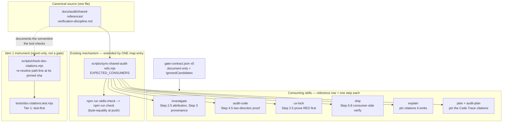

# Plan: Verification-Discipline Cluster — close the six upstream findings of 2026-08-07

- **Date**: 2026-08-07
- **Status**: Approved (audited — GPT x3 + rebuttal, Gemini x3)
- **Author**: Claude + Louis
- **Scope**: backend (CLI scripts + skill content; no UI surface)
- **Target domain(s)**: `skills-content`, `shared-lib`
- ⚠ **Cross-domain work** — touches 2 domains; the boundary is deliberate and named in §2.
- **Source report**: `wine-cellar-app/docs/upstream-issues/claude-engineering-skills-feedback-2026-08-07.md` ([PR #244](https://github.com/Lbstrydom/wine-cellar-app/pull/244)),
  written against this repo at `e8c3f00b`.

---

## Neighbourhood considered

`get-neighbourhood` (8 candidates, `refreshId c8fdb78f`) returned **one
`precedent`** band and seven `review`:

| Symbol | File | Band | Decision |
|---|---|---|---|
| `lintSkill` | `scripts/lib/skill-refs-parser.mjs:142-215` | **`precedent`** (`above-floor-cluster`, 0.715) | **Reuse as-is.** It validates that a skill's reference-table row byte-matches the reference file's `summary:` frontmatter. Every new reference file below is subject to it; nothing new is written. |
| `computeRatchetDivergences` | `scripts/lib/gate-honesty/ratchet.mjs:35-82` | `review` | **Reuse as-is** — the net-new-skill ratchet. No new skill is added (§6 right-sizing), so it is unaffected. |
| `main` / `checkRatchet` | `scripts/check-gate-contracts.mjs` | `review` | **Extend data, not code.** New SKILL.md prose will trip its gate-claim candidate scanner; the answer is `gate-contract.json` entries, not scanner changes (§2 D4). |
| `main` | `scripts/sync-shared-audit-refs.mjs:123-177` | `review` | **Extend by one map entry.** This is the load-bearing reuse decision — see §2 D1. |

The band did not make these calls; each was made on the code.

> **Past incidents to verify against** (2 shown of 2 total)
>
> | Incident | Affected paths | Status | Lesson that applies here |
> |---|---|---|---|
> | **INC-001** — lexical sensitive-path classifier bypassed by symlink | `scripts/lib/sensitive-paths.mjs` | `manual-verification-required` | "Fail-closed on resolution errors — never *I couldn't classify it so I'll allow it*." The new citation re-resolver reads arbitrary repo paths; an unreadable path must report `unresolvable`, never `ok`. |
> | **INC-002** — test suite wiped the shared production DB | `tests/db-setup.test.mjs` | `manual-verification-required` | "An env-gate that checks *is this variable set* is not a safety gate." Direct ancestor of item 3's vacuous-pass rule: presence ≠ verification. |

Neither has path overlap with this change. The new script is **read-only** —
no writes, no network, no DB — so INC-001's fail-closed rule is the only live
constraint and it is designed in (§2 D3).

---

## 1. Context Summary

**Stack**: `js-ts` (+ `postgres`), detected from `package.json`. Scope
**backend**: CLI scripts, skill markdown, one npm script. No routes, no UI.

### What exists today

The suite already contains most of the *ingredients* the six findings ask for —
what is missing is that they are scattered, unenforced, or absent from exactly
the skills that need them.

| Finding | Nearest existing thing | Gap |
|---|---|---|
| 1 — pin citations | `scripts/check-docs-refs.mjs` checks whether a cited **path resolves** | Its own docblock: line numbers are *"for traceability only, never used as a byte position"*, and its baseline key is `<file>→<target>`, **line-independent**. Content decay is deliberately out of its doctrine. |
| 2 — measurement provenance | `skills/investigate/SKILL.md:113` — *"Label any figure not traceable to a captured command as such"* | Binary (traceable / not). No `measured` / `derived` / `expected` distinction, no obligation to carry the command, and nothing addressed to the skills that **write** figures into docs. |
| 3 — red-then-green | `skills/nav-audit/SKILL.md`, `skills/plan/SKILL.md` mention negative controls | **Absent from `ux-lock` and `audit-code`** — the two skills that actually author regression tests. This is the 2026-07-19 §7 ask, still open. |
| 4 — attribution | `skills/investigate/SKILL.md:118` — *"Do not infer causation from chronological proximity"* | Adjacent but different. Zero occurrences of `attribution` or `mechanism` in the skill. The 22.5% case had no chronological confusion at all — the parent simply already had the credited property. |
| 5 — promote ad-hoc checks | `docs/runbooks/pre-ship-empirical-verify.md` §3 — *"audit your success paths"* | States the principle; ships no template. The three-part shape (subject probe + negative control + vacuous-pass guard) is craft, re-derived each time. |
| 6 — consumer-side verify | `npm run sync:dry`, `sync-isolation-verify` | Both are *drift* backstops over an already-synced tree. Nothing in `/ship` asks "fetch back what the consumer receives and check **that**". |

### Code Trace

Evidence that Phase 1 happened — the path actually followed, read at `0e2c554a`:

- **Shared-reference seam** (the spine of this plan):
  `scripts/sync-shared-audit-refs.mjs:29-77` — `EXPECTED_CONSUMERS` map + auto-discovery
  → `package.json:75` `skills:check` runs it with `--check`
  → `package.json:42` `check` runs `skills:check`
  → `scripts/prepush-check.mjs` runs `check` in a clean worktree.
  So a file placed here is byte-equality-enforced at push, for free.
- **Reference-table contract**: `scripts/lib/skill-refs-parser.mjs:142-215` (`lintSkill`)
  → invoked by `scripts/check-skill-refs.mjs` → `package.json:75`.
  Verified against a live example: `docs/audit/shared-references/ledger-format.md:1-3`
  carries `summary:` frontmatter that byte-matches its row in
  `skills/audit-code/SKILL.md:663`.
- **Gate-claim scanner**: `scripts/check-gate-contracts.mjs:143-261`
  → reads `skills/<name>/gate-contract.json`; `docs/reference/gate-honesty.md:29-34`
  defines `kind: "document-only"` with a `reason`, and
  `skills/investigate/gate-contract.json` demonstrates the `ignoredCandidates`
  escape with per-line reasons. **This is why new prose is not free** (§8 R1).
- **Insertion points, each read**:
  `skills/ux-lock/SKILL.md:83-134` (LOCK: Step 0 → 1 → 1.5 → 2 generate → 3 run+record —
  no step proves the spec red without the fix);
  `skills/audit-code/SKILL.md:407-428` (Step 4 Fix — ends at ledger update);
  `skills/ship/SKILL.md:681-778` (Steps 6.5 / 6.6 / 6.7 are all
  *"after successful push, advisory"* — the slot Step 6.8 occupies);
  `skills/investigate/SKILL.md:80-128` (Steps 2-4).
- **Doctrine boundary for item 1**: `scripts/check-docs-refs.mjs:20-26, 191, 310`.
- **Budget constraint**: `AGENTS.md` measures 83,446 chars against the 92,000 cap
  (`scripts/check-context-drift.mjs`) — **8,554 chars headroom**, so the AGENTS.md
  change must be a stub, not a dossier.

### Patterns reused vs new

**Reused**: the shared-reference sync + its `--check` freshness gate; the
`summary:`-frontmatter reference contract; `document-only` gate declarations;
the `--selfcheck-relocation` CLI smoke contract; `assertKnownFlags`;
`{result, usage, latencyMs}`-style structured returns; `atomicWriteFileSync` (not
needed — the new script writes nothing).

**New**: exactly two things — one canonical reference document, and one
read-only CLI. Everything else is an edit to existing files.

---

## 2. Proposed Architecture

### Key design decisions

**D1 — One canonical reference, synced by the mechanism that already exists (#1 DRY, #5 SSoT, #18 backward compat).**
Items 1, 2, 3 and 6 are *cross-skill discipline*, not per-skill behaviour. Writing
the same rules into five SKILL.md files is the drift this repo already solved once:
`sync-shared-audit-refs.mjs` exists precisely because *"edits to one would silently
drift from the other"*. Adding `verification-discipline.md` to `EXPECTED_CONSUMERS`
buys byte-equality enforcement in the pre-push `check` for the cost of one map entry
— and auto-discovery means a sixth consumer later needs no registry edit.

*Why not inline the rules in each SKILL.md?* Seven copies, no enforcement, and the
progressive-disclosure budget (`≤3K tokens` per SKILL.md) pays for text most
invocations never need. Each SKILL.md gets a **step** (when to act) and a
**reference row** (how); the reference carries the depth and loads on demand.

### D1a — The bootstrap path this plan depends on has never executed, and crashes

*Added by the Gemini final gate, then verified against the code rather than accepted
on assertion.* `findSyncTargets` emits registry-driven pairs **"even if missing on
disk"** (`scripts/sync-shared-audit-refs.mjs:82-88`) so a newly-registered consumer is
bootstrapped — but `main()` calls `fs.readFileSync(target)` **unconditionally** at
`:141`. Adding an `EXPECTED_CONSUMERS` entry for a file that does not exist yet
therefore throws `ENOENT` before anything is written.

The script's own docblock (`:46-50`) states the opposite: *"the sync will then
bootstrap the file on first run rather than silently skipping (this closes the gap
raised by Gemini final review)."* **The capability is documented, was never exercised,
and does not work** — this plan's own item 3, sitting inside the mechanism the plan
depends on. Two of the seven targets need directory creation too: `skills/explain/`
and `skills/audit-plan/` have no `references/` dir at all.

Repair, in Phase 1 and small:

1. Missing target → treat as an **empty buffer**, i.e. drift, not a crash.
2. Create the parent directory (`mkdirSync(…, {recursive:true})`) before writing.
3. Under `--check`, a missing **expected** target reports `DRIFT` and exits 1 — the
   honest verdict. It must never read as `IN SYNC`.
4. Distinguish the messages: `+ … (bootstrapped)` vs `+ … (synced from canonical)`,
   so a first-run write is visible as one.

**And prove it in both directions**, per the discipline this plan is landing: register
a consumer whose file is absent → run → confirm the file is created and `--check` was
red beforehand; then run again → `IN SYNC`. Regression-locked in
`tests/sync-shared-audit-refs.test.mjs`, which already imports the module's exports.

**D2 — Each skill gets a step, and the step names the trigger, not the theory.**
The 2026-07-19 §7 ask ("promote *prove the test fails without the fix* to an explicit
step") has been open for 19 days because it was filed as a principle. A principle in
a runbook is not a step in a flow. So: `ux-lock` Step 2.5 sits **between** generate
(Step 2) and run+record (Step 3), where the author physically has the spec and the
fix in hand; `audit-code` Step 4.5 sits **after** Step 4 fixes and **before** Step 5
re-audits, because Step 5's green is exactly the green that must not be trusted.

**D3 — Item 1's instrument is a sibling script, report-only, and it is the only new code (#11 testability, #16 graceful degradation).**
`check-docs-refs.mjs` is precedent but **not** the host: its own docblock declares it
deliberately narrow — *"it checks whether a cited path RESOLVES, not whether the
citation is apt"* — and its drift baseline is keyed `<file>→<target>`, line-independent
by construction. Folding commit-pinned content re-resolution into it would either
break that key or silently widen a gate that is already load-bearing in `npm run check`.
So: a sibling, `scripts/check-doc-citations.mjs`, with a **different input grammar**
(`path:line (sha)` triples, not bare paths).

Three constraints on it, all load-bearing:
- **Report-only in v1. Not wired into `npm run check`.** No current requirement gates
  it, and a repo-wide line-drift gate over a corpus with ~zero pinned citations today
  would be pure noise. Noisy gates get bypassed — that is how the stale refs in
  `check-docs-refs`'s own baseline accumulated.
- **Fail-closed per INC-001.** Unreadable path, unknown sha, sha not an ancestor,
  line out of range → `unresolvable`, never `ok`. A verdict of `ok` must mean *"I read
  both versions and they match"*, nothing weaker.
- **Pure function of committed source**, so it is Tier-1 test-first per the testing
  doctrine, and its output is Category A (stdout / `--out`, never committed).

### D3a — Citation contract v1 (written before any code)

*Added round 1 (H1). GPT deliberation ruling: `compromise` — strict positional
comparison upheld, four-verdict model adopted.*

**Grammar.** A pinned citation is `<path>:<line>[-<endline>] (<sha>)` — the existing
`file:line` form plus a parenthesised commit id immediately after it. Path must be
repo-relative and carry a file extension; `sha` is 7-40 lowercase hex.

**A `/` is required only for UNPINNED candidates** *(Gemini gate, MEDIUM — the first
draft required it always, matching `extractPlanPaths`. That silently excluded every
root-level file: `AGENTS.md:105 (b08b9a84)` is the worked example in §D2a and would
have been invisible to the instrument, and this plan modifies `AGENTS.md`.)* For a
pinned citation the extension **plus** a parenthesised valid hex sha already
identifies it unambiguously, so bare filenames are accepted there. Unpinned candidates
have no sha to disambiguate them from prose, so they keep the `/` requirement.
Citations inside fenced code blocks are **not** extracted (they are usually examples
of the syntax, not claims).

**Extraction is two-stage, because one-stage extraction fails OPEN**
*(round 3, H1 — the first draft defined extraction as recognising already-valid
grammar, so `docs/plans/README.md:12 (HEAD~3)`, an uppercase or non-hex sha, a missing closing
paren or an inverted range fell through as ordinary prose and vanished. Silently
ignoring a malformed pinned citation is exactly the fail-open case this instrument
exists to close.)*

1. **Recognise candidates** — anything with a `<path-like>:<digits>` prefix, **bare
   filenames included**, plus any parenthesised revision-like suffix that follows it.
   Deliberately loose: a candidate is a *shape*, not a validity claim, and **no path
   rule is applied here** *(Gemini round 2 — the previous revision relaxed the grammar
   prose for root-level files while leaving this step requiring a slash, so
   `AGENTS.md:105 (b08b9a84)` would still have been ignored: the same fail-open, one
   paragraph later)*.
2. **Classify each candidate deterministically**, and every candidate lands in exactly
   one bucket:
   - **pinned** → resolve it (verdicts below);
   - **unpinned** (`file:line` with no parenthesised suffix) → counted in
     `citationsUnpinned`, no verdict. **The `/` requirement is applied HERE and only
     here**: without a sha there is nothing to separate `foo.md:12` from prose, so an
     unpinned candidate needs the slash to count. Most of the corpus is unpinned today
     and flagging it all would be the noise that gets a tool ignored;
   - **malformed** (a suffix is present but is not a valid `sha`) → `unresolvable`
     with a reason code (`bad-revision`, `bad-range`, `unclosed`), **never silence**.

**Comparison.** Read the normalized text of the cited line (or inclusive range) at
`sha` via git, and compare it against the **working-tree file** read from disk —
falling back to `HEAD` only when the path is absent from the working tree.

*Revised by the Gemini gate (final round).* Comparing against `HEAD` would mean an
author fixing a citation alongside uncommitted edits cannot verify the fix without
committing first, which breaks the fast-feedback loop a lint is for. It is also the
more faithful reading of the failure: **the reader who follows a citation opens the
current file, not `HEAD`.** Git is used for exactly one thing — reading the historical
pinned state. Normalization is deliberately narrow: **CRLF→LF and
trailing-whitespace strip, nothing else.** No whitespace-insensitive or token-level
comparison — that starts approximating *"is the citation apt"*, a judgement with no
oracle and explicitly outside this instrument's scope.

**Why strict same-line comparison, and why an insertion above is not a false
positive.** A `file:line` citation makes a **location** claim as well as a content
claim. In the measured case the file is append-newest-first: every new session
inserts lines above every earlier citation, and `status.md:487,490` had drifted to an
unrelated section within a month. Insertion *is* the mechanism of decay. A checker
that returned green because the old content still exists somewhere would report clean
on precisely the case that cost five of nine claims.

**Verdicts** (four, so the report distinguishes remedies):

| Verdict | Condition | Remedy |
|---|---|---|
| `ok` | normalized content identical at the cited location at `sha` and at `HEAD` | none |
| `moved` | differs at the location, and the pinned excerpt occurs **exactly once** elsewhere in the file at `HEAD` | mechanical re-pin; the report names the new line |
| `drifted` | differs, and the pinned excerpt is **absent or non-unique** at `HEAD` | re-read the claim — the decayed-citation case |
| `unresolvable` | any read, revision, grammar, boundary or limit failure | fix the citation (fail-closed — never `ok`) |

**Git boundary and limits** *(M3 — load-bearing, not deferred as "only a local CLI":
the `sha` and `path` come from document text)*:

- Accept only a full 40-hex object id, **or** resolve an abbreviation to its canonical
  full id via `git rev-parse --verify <sha>^{commit}` and report the resolved id. No
  other revision syntax — `HEAD~3`, `@{u}`, `:/msg`, `^{/re}` are rejected as
  `unresolvable/bad-revision`, never passed to git.
- Canonicalise the path, then reject absolute, `..`-traversal, NUL-bearing and
  non-repo-relative paths (`unresolvable/bad-path`). Same canonicalise-then-classify
  order as INC-001's fix, for the same reason.
- Spawn with an **argument array**, never a shell string; `-c core.pager=cat`,
  `--no-textconv`, no external diff.
- Bounds, each returning `unresolvable/<reason>` rather than a silent skip:
  document ≤ 2 MB, citations ≤ 500 per document, blob ≤ 2 MB, per-`git` call ≤ 10 s.

**The reader is a run-scoped query planner, not a per-citation subprocess wrapper**
*(round 3, H2)*. Resolving one citation needs a revision resolution, an ancestry
check and two blob reads; at the per-document bound that is thousands of sequential
`git` processes, and the CLI takes an unbounded document list — an N+1 with a
subprocess as the N. So the reader caches for the whole run: each **distinct sha
resolved once**, ancestry memoised by canonical sha, and each `(revision, path)` blob
plus its normalized line index shared by every citation that reads it. Whole-invocation
budgets sit alongside the per-item ones — documents ≤ 200, `git` subprocesses ≤ 1000,
wall clock ≤ 120 s — each breaching to `unresolvable/<reason>` on the remainder, so a
budget breach is reported, never silently truncated into a clean-looking scan.

**Interface.** `check-doc-citations.mjs <doc> [<doc>…] [--format json]
[--require-citations] [--repo-root <dir>] [--selfcheck-relocation]`, via
`assertKnownFlags`. Summary fields: `documentsScanned`, `citationsParsed`,
`citationsUnpinned`, and per-verdict counts. Exit: `0` scan completed (verdicts do
not fail — report-only v1), `1` scanner failure **or** `--require-citations` with
`citationsParsed === 0`, `2` bad CLI input.

> **No `--out`, deliberately** *(round 2, H1 — my own contradiction: §1 called the CLI
> read-only and used that to conclude `atomicWriteFileSync` was unnecessary, while the
> interface listed `--out`)*. The repo's `--out` convention exists for large LLM result
> artifacts; this report is small, and `--format json` with a shell redirect covers it.
> **Dropping the flag keeps "writes nothing" true**, which is a real safety property
> worth more than the capability — rather than adding atomic-write machinery to
> preserve a flag nothing needs.

**D4 — Prose that sounds like a gate must declare itself, and the mechanism is chosen
from observed scanner output, not guessed (#19 observability).**
`check-gate-contracts.mjs` scans SKILL.md text for gate-claim candidates. Every new
step below is agent behaviour with no oracle — "did you genuinely revert the fix?"
is not mechanically checkable. **Declaring them executable would be the fake-check
this suite exists to prevent** — item 3's thesis applied to item 3's own change.

*Revised round 1 (M1).* The two mechanisms are **not** interchangeable and the draft's
"and/or" elided that:

- **`kind: "document-only"` + `reason`** — a recognised, real, non-executable claim.
  The **default** for every new step.
- **`ignoredCandidates`** — suppresses scanner *recognition*; honest only for a
  **demonstrated false positive** (prose that reads like a claim but asserts nothing
  this skill enforces).

So the order is fixed: Phase 2 drafts the prose, runs `npm run gates:check`, and
**records the exact candidate text per skill from the scanner's own output**. Only
then is each candidate classified, with the scanner output quoted verbatim in any
`ignoredCandidates` reason — the convention `skills/investigate/gate-contract.json`
already follows line-by-line. Guessing either way risks stale suppression that hides
a future real candidate.

**D5 — Item 5 ships as a template with a required disposition, not a 17th skill and
not a promotion bureaucracy.** See §6 right-sizing for the surface decision.
*Revised round 1 (M2, resolved `compromise`.)* A copy-paste template alone does not
make promotion systematic — a scaffolded check can become an undocumented permanent
guard with no signal whether it is temporary, durable, or superseded. So the template
carries **required fields**: trigger (+ originating finding id where one exists),
subject probe, negative control, vacuous-pass guard, **disposition** ∈
`temporary-guard` | `promoted-durable-contract` | `retired`, successor contract when
promoted or replaced, and — whenever disposition is `temporary-guard` — a
**named enforcing test or command plus its machine-evaluable retirement predicate**
(expiry expressed in the mechanism, not in a comment).

*Revised round 2 (M1).* The first revision said the template requires a
*"machine-enforced retirement condition"*, which is this repo's own gate-honesty class
turned on the plan: **a framework-neutral markdown template can request a field; it
cannot enforce anything.** The honest claim is narrower and still useful — the template
is *incomplete without* the author naming the test that will fail when the guard
outlives its condition, and the scaffold ships two worked predicates from this family
(a shrinking allowlist whose docblock names its successor contract; a rotation alarm
that fails CI 180 days before a pinned certificate expires). The enforcement lives in
the test the author writes, and the template says so rather than claiming it.

Deliberately **not** included: a named-owner field (single-maintainer repo —
the string would be constant, and an artefact whose value never varies carries no
information) and a separate promotion record (the audit ledger already records the
remediation event; a second record is the drifting-second-source-of-truth this repo
forbids for cluster scope). Checks scaffolded during `/audit-code` link the existing
finding in the normal remediation evidence instead.

### D2a — The provenance record (item 2's contract, not just its labels)

*Added round 2 (H2).* The round-1 plan reduced item 2 to *"label figures
`measured`/`derived`/`expected` and name the metric"* — the visible half. The source
report's ask was to **attach the measurement command to the first class**, and a label
with no evidence fields is the same shape as a green with no check. So the canonical
reference defines a normative record and `/investigate` Step 3 requires it:

| Kind | Required fields |
|---|---|
| **all** | metric name + unit; value; population / scope (what was counted, over what) |
| `measured` | the **exact command**, the working context it ran in, the **immutable revision** of code and data, and the observation time |
| `derived` | the cited source measurements (each itself a record) **and** the formula |
| `expected` | its basis, and an explicit statement that it is **not** a measurement |

This is what makes the `~5250 tests (~12s)` failure impossible to repeat: that row had
a value, no command, no revision, no date — so nobody could tell it had rotted, or when.
Its replacement carries *"Measured 2026-08-04 at `b08b9a84`: 12,216 passed, 196 skipped,
872 files, 80.31s"* plus the command, which is exactly this record.

**D6 — Item 6's step is advisory and slots beside the existing post-push trio.**
`/ship` Steps 6.5 / 6.6 / 6.7 are already *"after successful push, advisory"*. A
consumer-side verification is the same shape: it cannot block a push that already
happened, and per this repo's own gate-level rule (machine/remote state may advise,
repo state may block) it must not pretend to.

### D6a — Consumer-verification protocol (the step is a protocol invocation, not a slogan)

*Added round 1 (H4). Uncontested.* The drafted Step 6.8 — *"fetch the artifact back
the way a consumer gets it and check that"* — was unactionable, and **an unactionable
verification step is one that can always report success**: this plan's own item 3,
turned on the plan. `"Where impossible, print unverified"` with *impossible* undefined
is the escape hatch that voids the terminal state.

The protocol lives in the canonical reference; Step 6.8 invokes it and records the
outcome. **Retrieval decision table — the artifact classes `/ship` actually
publishes here**, not a generic list:

| Artifact | What the consumer receives | Consumer-side retrieval | Subject check |
|---|---|---|---|
| the pushed commit | the remote's view, not the local tree | clone/fetch into a temp dir at the pushed sha | the repo's own battery runs green **in the clone** (catches tracked-vs-ignored and case-only path faults invisible locally) |
| the synced consumer bundle | `scripts/.claude-skills/**` in a consumer repo | **authoritative**: the synced `sync-isolation-verify` run *in the consumer* (it reads what the consumer actually has). `npm run sync:dry` from here is the **pre-check**, not the verdict — it compares against this tree, which is the producer side | zero unexpected diffs; no orphans |
| the skill manifest | `skills.manifest.json` + `.claude/skills/**` | re-derive from the pushed sha, not the working tree | regenerated bytes identical (the CRLF class this repo has already been bitten by) |

**Required evidence fields** (all of them, or the state is `unverified`): immutable
locator (digest / full sha / bundle version), the retrieval command actually run, the
isolated environment it ran in, the expected subject behaviour, the observed result.

**Three terminal states, and only three**: `verified` (retrieved and checked),
`failed` (retrieved, check red), `unverified` (not retrieved). `unverified` **must
name a concrete blocked prerequisite** — "no network in this environment", "no
consumer checkout on this machine" — and never a bare "not applicable". A missing
prerequisite is a fact; an undefined *impossible* is an excuse. Never inherit the
producer-side green.

**Where the evidence is recorded**: the **`status.md` session line** `/ship` Step 2
already writes — free-form prose, no schema, and the outcome plus its blocked
prerequisite are a sentence.

*Revised round 3 (H3), and narrowed on evidence rather than asserted.* Round 2 also
named the Step 7 ship event. Checking the writer killed that:
`cmdRecordShipEvent` (`scripts/cross-skill.mjs:690`) passes a **fixed field list** to
`recordShipEvent`, so an extra `consumerVerification` payload is **silently dropped** —
recording there needs a schema change, a writer change and a migration, none of which
are in this plan's file list. That is the deferred harness by another name. **The
narrowing is the fix**: one record, in the place that already accepts prose. Declining
the versioned event payload, serializer, old-event compatibility and a status.md
projection contract is registered in §8 with its independence named.

---

## 6. Sustainability Notes

### Right-sizing gate

New structure on the table: one reference document, one CLI, one npm script, one
example template.

- **Band-aid extreme** — append the six rules to `docs/runbooks/pre-ship-empirical-verify.md`
  and close the report. Cheapest, and demonstrably ineffective: the 2026-07-19 §7 ask
  is *already* a principle in a runbook, and it produced two more instances of its own
  failure class in 19 days. The root cause is that the discipline is not in the flow of
  the skill that needs it.
- **Over-engineered extreme** — a 17th skill (`/verify`), a citation-pinning CI gate
  over all of `docs/`, an attribution-inference engine, a per-framework contract-test
  generator, and a consumer-side verification harness per artifact type (npm / image /
  bundle / clone). None has a current requirement; four of the five would be new
  surfaces to keep honest, and a new skill would add a 16→17 name to every synced
  consumer for content that is a *reference*, not a flow.
- **Chosen** — one canonical reference + one step per consuming skill + **one** new
  script, for the one item whose mechanism is genuinely deterministic and whose cost is
  measured (5-of-9 decayed). Current requirements served: the six findings, each with a
  measurement behind it. Deliberately dropped: the `/verify` skill (item 5's literal
  ask) — a template in `examples/` serves the same requirement at a fraction of the
  surface, and this repo's own naming doctrine warns that a new skill implies membership
  in a mechanism family it would not have.

**Manual vs scripted**: the five synced reference copies are written by the existing
`npm run skills:regenerate`, never by hand — regular, verifiable, already scripted. The
five SKILL.md edits are judgement-heavy and site-specific: **by hand**, no codemod.

### System-level

- **Assumption encoded**: that `sync-shared-audit-refs.mjs`'s auto-discovery keeps
  working — i.e. a skill opts in by *having* the file. If that inverts to an explicit
  registry, adding a sixth consumer becomes a code change. Cheap to absorb; the map
  entry already exists.
- **What breaks in 6 months**: if a skill is renamed or retired, its `EXPECTED_CONSUMERS`
  entry fails `--check` loudly at push — the desired direction. If the discipline rules
  themselves need per-skill divergence, the shared file is the wrong shape and should be
  split; the seam for that is the map, and the signal will be a reference that reads as
  four skills' worth of caveats.
- **Coupling**: loosened. Today four skills would each need their own copy of these
  rules; after this, they share one file and cite it. The SKILL.md → reference edge is
  the only new coupling and it is already the repo's standard shape.
- **Pattern, not exception**: `verification-discipline.md` becomes the third shared
  reference. It follows `ledger-format.md`'s frontmatter and registration exactly.

---

## 7. File-Level Plan

### New files

| File | Purpose | Key contents | Why this file |
|---|---|---|---|
| `docs/audit/shared-references/verification-discipline.md` | **Canonical** cross-skill verification discipline: citation pinning, figure provenance, two-direction proof, attribution, promotion-to-contract, consumer-side verification. | `summary:` frontmatter (byte-matches seven reference rows); six numbered sections, one per finding, each led by its measurement; the **citation contract** (§2 D3a) and the **consumer-verification protocol** (§2 D6a) in full, since both are cross-skill. Carries **≥1 real pinned citation** so the corpus is non-empty on day one (H2). | #1 DRY / #5 SSoT — one source, seven consumers, byte-equality enforced. |
| `scripts/check-doc-citations.mjs` | Re-resolve every pinned citation at its commit and report drift, per the §2 D3a contract. | `extractPinnedCitations(text)` (pure, fence-aware); `createGitReader({repoRoot})` — an **injected adapter**, so nothing assumes `process.cwd()` (H3, and what the relocation contract needs once synced); `resolveCitation(reader, cite)` → `ok`/`moved`/`drifted`/`unresolvable`; summary carries `citationsParsed`; `--require-citations`; `--selfcheck-relocation`; `assertKnownFlags`. | #11 testability, #19 observability. Sibling not extension — §2 D3. |
| `tests/doc-citations.test.mjs` | Tier-1 test-first coverage of extractor, verdicts, boundary and limits. | Fixture is a **temp git repo built inside the test lifecycle** (deterministic `-c user.name`/`-c user.email`), commit A → capture full sha → commit B containing **both** a moved line and a changed line. Covers all four verdicts, fail-closed cases, rejected revision syntax and path shapes, and a **vacuous-pass guard**. | Testing doctrine Tier 1. No dependence on repo history (H3) — history rewrite, shallow clone and pruning cannot break it. |
| `skills/audit-code/examples/contract-test-scaffold.md` | The scaffold template with its required fields (§2 D5). | Trigger + originating finding id; subject probe; negative control; vacuous-pass guard; `disposition`; successor contract; machine-enforced retirement condition when `temporary-guard`. Framework-neutral, with a worked example naming real precedents in this family. | Item 5, right-sized to a template (§6), with lifecycle made concrete rather than aspirational (M2). |
| `docs/plans/verification-discipline-cluster.md` | **This plan** — modified in close-out to carry ≥1 real pinned citation, so the dogfood run has a non-empty corpus. | ≥2 `<path>:<line> (<sha>)` citations in the §1 Code Trace, each **semantically valid and expected `ok`** at adoption time (round 2, H3 — a real document is never a permanent negative fixture). | H2 — adoption is a deliverable, not a hope. Listed here because a plan that dogfoods a tool on itself **is** one of its own modified files. |
| `skills/{investigate,audit-code,ux-lock,ship,explain,plan,audit-plan}/references/verification-discipline.md` | Synced copies — **generated, never hand-edited**. | Byte-identical to the canonical. | Written by `npm run skills:regenerate`; drift fails `skills:check`. |

### Modified files

| File | Change | Why |
|---|---|---|
| `scripts/sync-shared-audit-refs.mjs` | **Two changes.** (a) Add `'verification-discipline.md': ['investigate','audit-code','ux-lock','ship','explain','plan','audit-plan']` to `EXPECTED_CONSUMERS` (`:52`). (b) **Repair the bootstrap path** — see §2 D1a. | (a) is the one-line reuse that buys the whole enforcement story (§2 D1). *Round 3 (M1): `plan` and `audit-plan` added — §1's Code Trace is the largest producer of `file:line` citations here, `/audit-plan`'s grounding rubric **requires** them, and the adoption artifact for item 1 is itself a plan.* (b) is a **blocker discovered by the Gemini gate**: without it, adding the map entry crashes. |
| `skills/investigate/SKILL.md` | **Step 2.5 — Verify the attribution, not just the figure** (item 4): after reproducing, test whether the parent already had the credited property; report `figure` and `attribution` as **separate** verdicts. Amend **Step 3** to require `measured` / `derived` / `expected` labels and a named metric (item 2, item 4's 3.6x corollary). Reference-table row. | Items 1, 2, 4. Its Step 3 already half-does item 2; this completes it. |
| `skills/audit-code/SKILL.md` | **Step 4.5 — Prove the guard (two-direction)**: for any finding fixed *with* a new test/guard, revert → confirm RED → restore → confirm GREEN, one defect at a time where the fix closes independent failure modes. Reference-table row + `examples/` row. | Item 3 + item 5. Placed before Step 5 because Step 5's green is the untrustworthy green. |
| `skills/ux-lock/SKILL.md` | **Step 2.5 — Prove the spec RED before recording it**, between Step 2 (generate) and Step 3 (run + record). Reference-table row. | Item 3. The 2026-07-19 §7 ask, landed in the flow. |
| `skills/ship/SKILL.md` | **Step 6.8 — Consumer-side verification (advisory, after successful push)**: fetch the artifact back the way a consumer gets it and check *that*; where impossible, print `unverified` rather than inherit the producer-side green. Reference-table row. | Item 6 + §2 D6. |
| `skills/explain/SKILL.md` | Require a commit pin on any `file:line` it emits; cite append-newest-first files by section header. Reference-table row (creates `skills/explain/references/`). | Item 1. `explain` emits citations by design. |
| `skills/plan/SKILL.md`, `skills/audit-plan/SKILL.md` | Same citation-pinning requirement on §1's Code Trace and on the grounding rubric that reads it — **plus the reference-table row in each**. | Item 1 coverage (round 3, M1). *Gemini round 2 (HIGH): registering a consumer WITHOUT its table row is a build break, not an omission — `lintSkill` emits `Orphan file: … not listed in the reference table` (`scripts/lib/skill-refs-parser.mjs:207`) and `skills:check` fails. Every `EXPECTED_CONSUMERS` entry must land with its SKILL.md row in the same phase.* |
| `skills/{investigate,audit-code,ux-lock,ship,explain,plan,audit-plan}/gate-contract.json` | Add `kind:"document-only"` entries and/or `ignoredCandidates` with per-line reasons for the new prose. | §2 D4 — mandatory, else `skills:check` fails. |
| `package.json` | `"docs:citations": "node scripts/check-doc-citations.mjs"` + `:json` variant. **Not** added to `check`. | §2 D3. |
| `AGENTS.md` | ~1.2K-char stub under a new heading: what the discipline is, when it fires, pointer to the canonical reference. | 8,554 chars headroom; stub-not-dossier is the file's own rule. |

### 7b. Implementation Phases

**Phase 1 — Repair the bootstrap, then the canonical reference + registration.**
The sync-script repair (§2 D1a) lands FIRST and is proven red-then-green, because
registering a consumer for a file that does not exist crashes without it. Then write
the six-section discipline document, register its seven consumers, and regenerate.
Files: `scripts/sync-shared-audit-refs.mjs` (modify),
`tests/sync-shared-audit-refs.test.mjs` (modify),
`docs/audit/shared-references/verification-discipline.md` (create),
`skills/investigate/references/verification-discipline.md` (create),
`skills/audit-code/references/verification-discipline.md` (create),
`skills/ux-lock/references/verification-discipline.md` (create),
`skills/ship/references/verification-discipline.md` (create),
`skills/explain/references/verification-discipline.md` (create),
`skills/plan/references/verification-discipline.md` (create),
`skills/audit-plan/references/verification-discipline.md` (create).

**Phase 2 — Skill steps + gate contracts.** The five SKILL.md edits and their
matching contract declarations, landing together because a step without its
contract entry fails `skills:check`.
Files: `skills/investigate/SKILL.md` (modify), `skills/audit-code/SKILL.md` (modify),
`skills/ux-lock/SKILL.md` (modify), `skills/ship/SKILL.md` (modify),
`skills/explain/SKILL.md` (modify),
`skills/plan/SKILL.md` (modify),
`skills/audit-plan/SKILL.md` (modify),
`skills/plan/gate-contract.json` (modify),
`skills/audit-plan/gate-contract.json` (modify),
`skills/investigate/gate-contract.json` (modify),
`skills/audit-code/gate-contract.json` (modify),
`skills/ux-lock/gate-contract.json` (modify),
`skills/ship/gate-contract.json` (modify),
`skills/explain/gate-contract.json` (modify),
`skills/audit-code/examples/contract-test-scaffold.md` (create).

**Phase 3 — The citation re-resolver, test-first.** Tests before implementation
(Tier 1); the temp-git fixture and the vacuous-pass guard are written in the same
commit as the extractor.
Files: `tests/doc-citations.test.mjs` (create),
`scripts/check-doc-citations.mjs` (create), `package.json` (modify),
`tests/relocation-guard.test.mjs` (modify).

**Phase 4 — Adoption.** Put real pinned citations into the corpus and prove the
instrument parses them — the deliverable that stops the acceptance criterion being
vacuous (H2).

> **Re-pin the Code Trace FIRST, and the paradox is the point** *(Gemini gate, final
> round)*. §1's Code Trace cites `scripts/sync-shared-audit-refs.mjs:123-177 (0e2c554a)`,
> and **Phase 1 modifies that very file** — so those citations will correctly report
> `moved`, and the `ok === citationsParsed` criterion would fail deterministically.
> The fix is not to weaken the criterion: re-pin the Code Trace to a post-Phase-1
> commit with its new line numbers, which is exactly the workflow the convention
> prescribes when you touch a cited file. The plan's own citations decaying *during
> the plan* is the cleanest possible demonstration that the instrument works.

Files: `docs/plans/verification-discipline-cluster.md` (modify),
`docs/audit/shared-references/verification-discipline.md` (modify).

**Phase 5 — Repo context.** The AGENTS.md stub, sized against the live headroom.
Files: `AGENTS.md` (modify).

**Close-out (not a phase)**: `npm run skills:regenerate` **first** — it chains `sync-shared-audit-refs.mjs` (no `--check`), which re-syncs the seven copies after Phase 4 edits the canonical; running `check` before it would report the drift Phase 4 just created *(Gemini gate, LOW — raised as a missing step; verified already covered by `skills:regenerate`'s own chain in `package.json:74`, and now stated explicitly rather than left implicit)* · `npm run check` ·
`npm run docs:citations -- --require-citations docs/plans/verification-discipline-cluster.md docs/audit/shared-references/verification-discipline.md`

---

## 8. Risk & Trade-off Register

| # | Risk | Mitigation / trade-off accepted |
|---|---|---|
| **R1** ✅ **CONFIRMED, and my dirty-tree measurement of it was wrong** | New SKILL.md prose trips `check-gate-contracts.mjs`'s candidate scanner and fails `skills:check` at push. **21 undispositioned enforcement-verb lines across 6 skills** (audit-code 6, ship 7, investigate 3, ux-lock 3, explain 1, plan 1). Running `check-gate-contracts.mjs` in the DIRTY tree exited 0 — and a deliberately gate-shaped poison line was not flagged either — so it was recorded as "the prediction was wrong, measured". It fires only in the clean worktree at the commit being pushed. **The instrument was run in a state where it could not see, and returned green having checked nothing — this plan's own item 3, committed by its own author while implementing item 3.** | Known before writing (Code Trace); Phase 2 lands each step **with** its contract entry. Designed for, not discovered. |
| **R8** | **The registration triple must land together or `skills:check` fails** *(Gemini round 2)*. An `EXPECTED_CONSUMERS` entry, the synced `references/` file, and the SKILL.md table row are one atomic unit: the entry without the row is an `Orphan file` error (`scripts/lib/skill-refs-parser.mjs:207`); the row without the file is a missing-reference error. | Phase 1 registers + syncs, Phase 2 adds every row, and both sit in **Cluster A** with `fix-gate: yes` — the coupling §11 already claims. Stated here because it bit this plan twice: once by adding `plan`/`audit-plan` without their rows, once by the bootstrap crash (§2 D1a). |
| **R2** | Five more reference files inflate every skill's on-demand load. | Progressive disclosure: the reference loads only when its step fires. SKILL.md bodies grow by ~8 lines each, well inside the 3K budget. |
| **R3** | The re-resolver has near-zero corpus today, so it could read as speculative — **and its acceptance check could pass having parsed nothing** (H2). | Sequenced and closed: the *convention* (Phases 1-2) creates the corpus, Phase 4 makes adoption an explicit deliverable, `--require-citations` turns "parsed nothing" into a non-zero exit, and the acceptance criterion asserts `citationsParsed >= 4`. The tool stays report-only and out of `check`, so slow adoption costs nothing. |
| **R7** | The four-verdict model fires `moved` constantly on append-newest-first files, and the noise gets the tool ignored. | Accepted as the correct signal, not noise: those citations **have** decayed for a reader at HEAD. `moved` exists precisely so that case reports a cheap mechanical re-pin rather than the alarming `drifted`. The mitigation is guidance, not tolerance — the discipline reference says such files are cited by **section header**, never by line, so a `moved` verdict on one is a prompt to change the citation *form*. |
| **R4** | `document-only` everywhere could read as gate-honesty theatre — six new rules, zero enforced. | It is the honest classification: there is no oracle for *"did you genuinely revert the fix?"*, and `skills/investigate/gate-contract.json` already sets this precedent explicitly. Claiming executable would be the fake check. Stated plainly in the contract `reason` fields rather than hidden. |
| **R5** | AGENTS.md cap (8,554 chars headroom) — a dossier-sized addition fails `context:check`. | Phase 4 is a stub with a pointer, measured before commit. If headroom is gone by then, condense an existing section instead of raising the cap (the file's own rule). |
| **R6** | Item 6's step cannot fetch back from a real consumer in every environment. | The step's own contract is to print `unverified` rather than inherit the producer-side green — the same capture-honesty degradation `/nav-audit` and `/visual-audit` already use. Advisory, never blocking (§2 D6). |

### Deliberately deferred

- **A `/verify` skill (item 5's literal ask)** — a template serves the current
  requirement; a skill does not (§6). Revisit if the template is used ≥3 times and
  each use needs live orchestration rather than copy-paste.
- **Gating the citation re-resolver** in `npm run check` — needs an adoption baseline
  first, exactly like `check-docs-refs`'s drift-gate. Revisit once ≥1 doc directory is
  pinned end-to-end.
- **Per-artifact consumer-side harnesses** (npm pack / image pull / bundle serve) —
  the retrieval table (§2 D6a) names the channel and the check for each artifact class
  `/ship` actually publishes; *automating* them has no current requirement.
- **A per-artifact evidence-record format and multi-artifact selection logic for
  Step 6.8** *(round 2, M2 — declined half)*. **Independence**: the step's correctness
  does not depend on a bespoke store — the ship event and `status.md` line already
  carry the outcome, keyed by the pushed sha, and the retrieval table names one
  authoritative command per artifact class. Building a record format is the deferred
  harness by another name.
- **A named-owner field and a separate promotion record on the contract-test scaffold**
  *(round 1, M2 — declined half, resolved `compromise`)*. **Independence**: the
  template's usefulness does not depend on a tracking workflow existing. The disposition
  field and the retirement condition — the half that carries real information — are
  adopted; an owner string that is constant in a single-maintainer repo carries none,
  and a promotion record would duplicate the audit ledger entry that already marks the
  finding `fixed`.

No deferral here is "the correct fix is larger": each names an independence — the
template does not depend on a skill surface, the report-only tool does not depend on a
gate, and the scaffold's usefulness does not depend on a tracking process.

---

## 9. Testing Strategy

**Tier 1 (test-first, deterministic)** — `scripts/check-doc-citations.mjs`.

**Fixture (H3): built inside the test lifecycle, never borrowed from repo history.**
A temp git repo with deterministic identity (`-c user.name` / `-c user.email`,
`GIT_AUTHOR_DATE`/`GIT_COMMITTER_DATE` fixed): commit A → capture the **full** sha →
commit B containing, in one file, a line whose content is unchanged, a line whose
content moved (insertion above), and a line whose content changed. Nothing depends on
this repo's own commits, so history rewrite, shallow clone and object pruning cannot
break it. Drives the **real** resolver through the injected reader.

- `extractPinnedCitations`: pinned / unpinned / malformed / multiple-per-line / inside
  a fenced block (excluded) / path without `/` (rejected).
- All four verdicts against the fixture: unchanged → `ok`; shifted by insertion →
  `moved` (and the report names the new line); changed and absent elsewhere →
  `drifted`; content that appears twice at HEAD → `drifted`, **not** `moved`
  (non-unique is ambiguous).
- **Fail-closed (INC-001)**: unknown sha; path absent at that sha; line beyond EOF;
  rejected revision syntax (`HEAD~3`, `@{u}`, `:/msg`); rejected path shapes
  (absolute, `..`-traversal, NUL) → `unresolvable` with a reason code, never `ok`.
- **Non-ancestor sha** *(round 2, M3 — stated in the contract, absent from the test
  list, and not equivalent to the unknown-sha case: an object can exist locally while
  not being an ancestor of `HEAD`)*. The fixture gains a **divergent branch**; its
  otherwise-valid full sha must yield `unresolvable/not-ancestor`, asserted through
  the **real reader call path** the CLI uses — not a mocked parser — with the reason
  code present in the JSON output assertion.
- **Limits**: over-size document / over-count citations / over-size blob →
  `unresolvable/<reason>`, never a silent skip.
- **Normalization**: a file stored CRLF compares equal to its LF form (the
  `skills.manifest.json` class), while a real content change still reports.
- **Vacuous-pass guard**: assert `citationsParsed >= 1` on the fixture document, so an
  always-empty extractor cannot pass the "expect no drift" assertions.
- **Negative control**: the `drifted` assertion is proven red by pointing the fixture
  at a line that genuinely changed — written and demonstrated in the same commit,
  per item 3, and the demonstration recorded.

**Existing gates that must stay green** (no new tests needed — they already cover it):
`npm run skills:check` (reference-table byte-match, description budget, shared-ref
byte-equality, gate contracts, generated-copy freshness), `npm run context:check`
(AGENTS.md cap), `npm run docs:refs:gate`, `npm run cli:flags:gate` (the new CLI needs
`assertKnownFlags`), `npm run knip:gate`.

**Relocation contract**: `check-doc-citations.mjs` is a top-level CLI, so it
implements `--selfcheck-relocation` and joins `CLI_SMOKE_SET`
(`tests/relocation-guard.test.mjs`) — Tier 3, non-negotiable, same commit.

**Edge cases**: Windows CRLF in cited files (canonicalise before comparing — the
`skills.manifest.json` lesson); a citation to a path that is gitignored at HEAD but
tracked at the pinned sha; a sha that is valid but unreachable after a rebase.

---

## 11. Execution Clustering

- **Cluster A** — Phases 1-2 — fix-gate: yes
  - **Coupling**: Phase 2's SKILL.md steps cite the reference file Phase 1 creates, and
    `skills:check` validates the reference-table row against that file's `summary:`
    frontmatter in one pass. Splitting them leaves the repo red between commits — the
    row exists with no file, or the file exists with no consumer row.
  - `author-tier: standard`
- **Cluster B** — Phases 3-4 — fix-gate: yes
  - **Coupling**: *revised round 1 (L1) — the first draft grouped the CLI with the
    AGENTS.md stub and offered "they share an audit seam" as the coupling. Sharing a
    reviewer is not a seam; that claim failed §11's own rubric.* The real seam:
    Phase 4 **is the adoption test of Phase 3's parser** — it writes citations in the
    D3a grammar and asserts the CLI parses them with the expected verdicts. Split
    them and Phase 4 asserts against a parser that does not exist, or Phase 3 ships a
    grammar nothing has ever produced. `fix-gate: yes` because Cluster C documents
    the location this cluster settles.
  - `author-tier: standard`
- **Cluster C** — Phase 5 — fix-gate: final
  - **Coupling**: single phase, genuinely independent — a documentation stub whose
    only dependency is that the canonical reference's location and the CLI's invocation
    are final. Ordered last for exactly that reason, and kept separate rather than
    bolted onto Cluster B because it shares no mechanism with the CLI.
  - `author-tier: economy`
- **Final gate**: mandatory consolidated Gemini review over the union diff of
  Clusters A, B and C.

---

## Audit trail

| Gate | Rounds | Result |
|---|---|---|
| GPT plan audit | 3 | R1 `SIGNIFICANT_GAPS` H:4 M:3 L:1 → R2 H:3 M:3 → R3 H:3 M:1. **18 findings, all addressed**; 0 suppressed, 0 reopened. Stopped at the rigor-pressure cap: HIGH plateaued 4→3→3. |
| GPT deliberation | 1 | Two partial rebuttals, both `compromise`. H1: my contested premise **upheld** — strict positional comparison stays, four-verdict model adopted. M2: right-sizing upheld (no owner field, no parallel record), GPT's `disposition` field adopted — a better answer than either position. |
| Gemini final gate | 3 | R1 `CONCERNS` (3) → R2 `CONCERNS` (2) → R3 `CONCERNS` (2). **Round 3 run under the documented genuine-bug exception** — both R2 findings were concrete design defects (a build break, a fail-open spec contradiction), not completeness nits. Closed at R3 by rule: both remaining findings are MEDIUM refinements, both fixed. |

**What the gates actually caught that the author did not.** Recorded because it is the
argument for running them: the GPT loop found a **vacuous pass inside the acceptance
criterion of a plan about vacuous passes** (R1 H2) and a criterion that would have
**baked a knowingly stale citation into canonical content** (R2 H3). The Gemini gate
found that `sync-shared-audit-refs.mjs`'s documented bootstrap path **has never
executed and crashes** (§2 D1a) — a live instance of this plan's own thesis, inside
the mechanism the plan depends on — then caught two self-contradictions introduced by
the fixes for its own prior round. Three of those are in the "stated capability, never
exercised" class the six findings are about.

---

## Acceptance (how we know this landed)

Not Playwright criteria — this plan has no UI surface. The equivalent:

1. `npm run check` green in a clean worktree (the pre-push sandbox), including
   `skills:check` with the new shared reference and seven contract files.
2. **Non-vacuous dogfood** *(revised round 1 — H2)*. The first draft's criterion would
   have exited green having parsed **zero** citations, because this plan's citations
   were written as `file:line` with the commit named once in a separate sentence — a
   vacuous pass inside the acceptance criterion of a plan about vacuous passes. So:
   `node scripts/check-doc-citations.mjs --require-citations --format json <this plan>
   <the canonical reference>` must report `citationsParsed >= 4` across the two
   documents and **`ok === citationsParsed`** — a run returning all-`ok` on *zero*
   parsed citations is a **failure**, not a pass. *(Revised round 2, H3: the first
   revision required a real document to contain a `moved`/`drifted` citation, which
   would have baked a knowingly stale citation into canonical content and left every
   future scan permanently non-clean — a report nobody can read as clean is a report
   nobody reads. `moved` and `drifted` are demonstrated **only** in the isolated
   temp-git fixture, which covers them deterministically.)*
3. Reverting any one of the seven `references/verification-discipline.md` copies by one
   byte fails `skills:check` — the **negative control on this plan's own enforcement
   claim**, run once and recorded, per item 3.
4. `npm run gates:check` green with the new prose, and every `ignoredCandidates` entry
   added in Phase 2 quotes the scanner output that justified it (M1).
