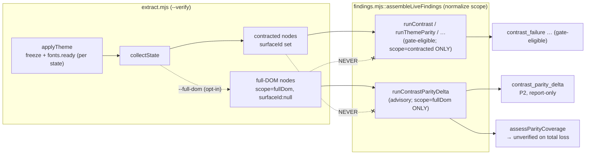

# Plan: visual-audit Theme-safety v2 — two-theme contrast parity-delta + full-DOM sweep

- **Date**: 2026-07-01
- **Status**: Complete
- **Author**: Claude + Louis
- **Scope**: backend
- **Stack**: js-ts · **Target domain**: `visual-audit` (single; no cross-domain work)

> **Audit Trail** (`/audit-plan`, 2026-07-01): GPT R1 **H:3 M:5 L:1** → all fixed; GPT R2 **H:2
> M:4 L:1** (plan-internal consistency defects from R1 edits) → all fixed; GPT loop stopped at R2
> per the rigor-pressure rule (findings decayed to consistency cleanup, not new design defects).
> Gemini gate R1 → **CONCERNS**, 2 genuine net-new **design** defects (depth-8 `nodeKey` collision
> at full-DOM scale → join on un-truncated `livePath`; in-place `scope` mutation → cloning
> normalizer) — both fixed (the genuine-bug exception). Gemini gate R2 (the 2-round cap) →
> **CONCERNS**, 2 MEDIUM **implementation-completeness** nits (canonical-schema field mapping;
> `TreeWalker FILTER_REJECT`) — folded in and gate **closed** per the cap rule (implementation
> detail belongs to the code audit, not the plan gate). Coherence "Strong", over-engineering flags
> none across both Gemini rounds.
>
> Section numbering follows the `/plan` template: **§3–5 and §10 are frontend-only** (UX
> decisions, state map, Playwright acceptance criteria) and are intentionally omitted for this
> backend-scope plan. Present sections: §1, §2, §2a (node contract), §6–9, §11.

> Predecessor: [`docs/plans/visual-audit-theme-safety-v1.md`](../plans/visual-audit-theme-safety-v1.md)
> (shipped 2026-07-01; origin-based `unadapted-color.mjs` + `interactive-color-lint.mjs`, both
> advisory). v1's origin signal was **empirically confirmed** firing on the real `.mpc-add-btn`
> dark-mode bug on 2026-07-01 (faithful ground-truth render, both themes, `source:'live'`). That
> pre-ship empirical gate is what unblocks v2. Origin brainstorm:
> [`docs/plans/theme-parity-contrast-delta.md`](theme-parity-contrast-delta.md) (Superseded note).

---

## 1. Context Summary

**Goal**: catch "a color that didn't adapt to dark mode" across the **whole rendered DOM** (not
just contracted surfaces), at low noise, by flagging a node whose text contrast **passes in one
theme and fails in the other** — `pass(themeA) && fail(themeB)`. New advisory finding class
`contrast_parity_delta`.

**Why now / why this shape (the key tension, resolved head-on)**: the existing `runContrast`
already emits an **absolute** `contrast_failure`, and that class is **gate-eligible**
([schema.mjs:73](../../scripts/lib/visual/schema.mjs)). On the handful of **contracted surfaces**
it already catches a dark-mode contrast failure. So a parity-delta *on contracted surfaces alone
is near-redundant*. Parity-delta earns its keep **only coupled to a full-DOM sweep**: absolute
contrast at full-DOM scope is unusably noisy (decorative/muted/over-image text fails in isolation),
whereas the `pass/fail` delta is the precision filter that stays quiet at that scale (a genuinely
decorative low-contrast element is low-contrast in *both* themes → no delta). **Therefore
parity-delta + full-DOM are one unit**, and they occupy a **scope that the absolute check does
not**: absolute `contrast_failure` stays contracted-only; parity-delta owns full-DOM. Non-overlapping
by construction.

**What exists today** (reused, not rebuilt):
- `theme-parity.mjs::runThemeParity` already joins the **same node by `nodeKey` across two
  themes** (`indexByKey` + `for (const [key,a] of aByKey) { const b = bByKey.get(key) }`).
- `theme-parity.mjs::runContrast` already computes **per-node/per-theme** contrast via
  `resolveEffectiveBackground` + `textContrast`, and correctly **skips unresolved backdrops**
  (`if (bg.status !== 'resolved') continue`).
- `contrast.mjs::textContrast(fgNorm, bgNorm)` → ratio | null (composites fg over opaque bg).
- `effective-background.mjs::resolveEffectiveBackground(backgroundStack, {theme})` →
  `{status:'resolved', color} | {status:'unverified', reason}` (ancestor-composite; image/gradient
  → `unverified`).
- `extract.mjs::applyTheme` runs the **transition-freeze + `document.fonts.ready` + forced
  reflow** guard **per device×theme, upstream of node collection** — so any expanded node set
  inherits capture-honesty automatically.
- `unadapted-color.mjs::assessColorCoverage` is the **coverage-honesty pattern to mirror**
  (eligible vs withEvidence → degrade to `unverified`, never false-clean).

**Code Trace** (evidence Phase 1 happened):
- Capture: `scripts/visual-audit.mjs::main` → `runExtract` `extract.mjs:60` → per state
  `applyTheme` `extract.mjs:135-165` (freeze+fonts guard) → `collectState` `extract.mjs:171-312`,
  node set chosen at `extract.mjs:238` (`for (const surface of surfaces)`) + `:257`
  (`[root, ...root.querySelectorAll('*')]`) — **contracted surfaces only**; each node carries
  `surfaceId/nodeKey/theme/device/computed/backgroundStack/hasText/displayed/declarations`.
- Assembly: `findings.mjs::assembleLiveFindings:79-131` invokes `runContrast:85`, `runThemeParity:99`;
  builds `nodesByTheme` per device at `:92-97` (`m[state.theme] = state.nodes`).
- Contrast/join primitives: `theme-parity.mjs::runContrast:83-100`, `indexByKey:102-106`;
  `contrast.mjs::textContrast:66-72`; `effective-background.mjs::resolveEffectiveBackground`.
- Class registry: `schema.mjs::FINDING_CLASSES:50-68` + `GATE_ELIGIBLE_CLASSES:73-84`;
  severity in `findings.mjs::SEVERITY_BY_CLASS`.
- `nodeKey`: `node-key.mjs::stableNodeKey:38-57` (structural `tag/nthOfType/role` path, depth-8;
  `ancestorPath` rooted at surface root; **stable across themes for the same element**).

**Patterns reused vs new**: reuse the join, the contrast math, the backdrop resolver, the
coverage-honesty pattern, the freeze guard. New: one producer (`runContrastParityDelta`), one
finding class (advisory), one opt-in capture path (full-DOM node set), and its node-isolation wiring.

**Neighbourhood considered** (`get-neighbourhood`, cloud, 50 records): closest are
`runContrast` (0.85) and `runThemeParity` (0.83), both `review` (< 0.90 reuse / < 0.85 extend) —
a **new sibling producer in `theme-parity.mjs`** is the right call, not a reuse or a rewrite of
either. All top candidates are in-domain (`visual-audit`), confirming no boundary crossing.

---

## 2. Proposed Architecture

The delta is a pure producer composed from existing primitives; the only new *capture* work is an
opt-in expanded node set that is **fenced off from the gate-eligible producers**.



**Key design decisions (principles cited from `skills/plan/references/engineering-principles.md`)**:

1. **Scope-disjoint producers — `scope` is the single discriminant (#2 Modularity, #15 Error
   Handling, #11 Testability; resolves R2-H1 + R2-M1)**. Every node carries a discriminated
   `scope` tag (`'contracted' | 'fullDom'`, see §2a) — the **only** discriminant (no `fullDom:true`
   / `!n.fullDom` boolean anywhere). The existing absolute producers (`runContrast`,
   `runThemeParity`, `runLayoutPhysics`, `runSignifiers`) receive `nodes.filter(n => n.scope ===
   'contracted')`; `runContrastParityDelta` receives `nodes.filter(n => n.scope === 'fullDom')` —
   **the two producer families consume disjoint node sets**. This resolves the redundancy tension
   AND the cross-scope join ambiguity by construction: absolute check = contracted scope only;
   parity-delta = full-DOM scope only; the delta's `livePath` join (§2a) can never cross-match a
   contracted node against a full-DOM node because it never sees a contracted node. A gate-eligible
   finding therefore can never derive from a `fullDom` node (test-asserted invariant). When
   `--full-dom` is off there are zero `fullDom` nodes → the delta is inert (its by-design coupling
   to the sweep).

2. **Opt-in via a CLI flag `--full-dom`, not a committed contract field (#4 No Hardcoding, YAGNI /
   right-sizing)**. Full-DOM parity-delta is advisory-only and diagnostic; it needs no committed,
   drift-scoped surface declaration. A `--verify --full-dom` flag is the smallest honest surface:
   default off → byte-identical capture to today. **CLI contract (resolves M2)**: `--full-dom`
   is meaningful **only** with `--verify`; used without it → **usage error, exit 2** (a silent
   no-op would read as "ran full-DOM, found nothing"). An optional `--full-dom-node-budget <n>`
   (default **4000**, documented) bounds traversal (see decision 7). (Alternative — a
   `captureScope` contract field — is heavier and only justified if/when the sweep becomes
   gate-eligible; deferred, noted in §8.)

   **Behavioural back-compat, stated precisely (resolves R2-H2)**: "default-off = no behaviour
   change" — with `--full-dom` off, **no `fullDom` nodes are captured, no new findings are
   produced, and no exit code changes**. It is NOT a claim of raw-capture byte-identity: the
   `scope` discriminant is **not** written into raw extract output; it is stamped by an
   **assembly-time normalizer** in `findings.mjs` *after* capture, *before* producers run. The
   normalizer must **clone, not mutate (Gemini-M1)**: `nodes.map(n => ({ ...n, scope: n.scope ??
   'contracted' }))` — an in-place `node.scope ??= 'contracted'` would mutate the shared `perState`
   references, and since `visual-audit.mjs` serializes `perState` to disk (`writeVerifyResult`)
   *after* assembly, the on-disk bytes would then change even flag-off, breaking this very
   guarantee. With the clone, raw `state.nodes` serialized bytes are unchanged when the flag is
   off; only `fullDom` capture (flag on) adds nodes, which already emit `scope:'fullDom'` at
   source. A regression test asserts flag-off capture output is unchanged vs baseline.

3. **The delta is a pure function of the two-theme evidence (#1 DRY, #3 Single Source of Truth)**.
   `runContrastParityDelta(fullDomNodesByTheme, contract)` mirrors `runThemeParity`'s signature and
   reuses `resolveEffectiveBackground` + `textContrast` (with a `livePath`-keyed index, not the
   depth-8-`nodeKey` `indexByKey`). **Two-theme, deterministic
   (resolves M3)**: the ordered theme pair is derived from **`contract.themes[].name` order** (the
   single source of theme order), NOT `Object.keys(nodesByTheme)` order (non-deterministic). The
   producer asserts **exactly two** contract-declared themes; `!== 2` → emit **no findings** and a
   coverage `unverified` with reason `unsupported_theme_count` (honest, never a silent "first two
   keys" pick — that wording is removed everywhere). For each **`livePath`** (the fullDom join identity,
   §2a / Gemini-H1 — NOT the depth-8 `nodeKey`) present in **both** themes, both `displayed`, both
   `hasText`: compute `ratioLight`, `ratioDark` over each theme's resolved backdrop; flag when
   `(ratioLight ≥ min) !== (ratioDark ≥ min)` (XOR of pass) — the "adapted in one theme, not the
   other" fingerprint. `min = contract.tolerances.contrastRatio ?? 4.5` (same source as
   `runContrast`).

4. **Coverage honesty mirrors v1, is scope-aware, and has one explicit contract (#15, #16 Graceful
   Degradation; resolves R2-H1 + R2-M2 + R2-M3)**. Node-set coverage alone **cannot prove the
   requested full-DOM sweep ran** — if `--full-dom` emits zero full-DOM nodes, a run with only
   contracted evidence looks assessable and reads clean. **One coverage entry-point** owns this:

   ```
   assessParityCoverage({ nodesByTheme, contract, captureStatsByState })
     -> { status: 'assessable' | 'unverified', reason?, themePair, scopeStats }
   ```

   Capture emits **per-device×theme stats** with precise semantics (resolves M3's `visited`
   ambiguity): `{ fullDomRequested, visitedElements, skippedAlreadyContracted,
   displayedTextCandidatesAfterSkip, emitted, truncated }`. Degradation is based on **eligible
   candidates, not raw visits**: `fullDomRequested && emitted === 0 && displayedTextCandidatesAfterSkip
   > 0` → `unverified` (`reason:'fulldom_capture_empty'`). (`displayedTextCandidatesAfterSkip === 0`
   is a legitimate "nothing to assess," not a degrade.) Then over the `fullDom` nodes:
   `eligible` (keys in both themes, both text, both displayed) vs `withEvidence` (both backdrops
   `resolved`); total loss (`eligible>0 && withEvidence===0`) or `contract.themes.length !== 2` →
   `unverified`. Per-node: a key in only one theme = legit theme-conditional → skip; an unresolved
   backdrop in either theme → skip. Empty/failed capture (dead server, non-2xx) → `unverified` +
   non-zero exit, never "clean / 0 findings."

5. **Join-identity collision guard + no page mutation (#12 Validation; resolves M5 + Gemini-H1)**.
   The join uses the un-truncated `livePath` (decision 3 / §2a), which is position-unique — but as
   a belt, before the join drop any `livePath` that appears **>1×** within a single theme's node
   list (ambiguous → a wrong cross-theme match would fabricate a delta) — ambiguous = coverage
   miss, never a finding. **Dedup without mutating the
   page**: the full-DOM walk excludes already-captured contracted elements via an **in-closure
   `WeakSet<Element>`** populated during contracted collection — NOT by writing/reading a
   `data-va-instance` attribute onto the live DOM (which would mutate the inspected page before
   capture and depends on the marker being present on every contracted element). The `WeakSet`
   lives inside the single `page.evaluate` closure, so it never touches the page.

6. **Advisory-first, and non-gate-membership is authoritative (#18 Backward Compat,
   empirical-before-gate; resolves M1)**. Gating is decided by **one** authoritative mechanism:
   `finalizeFindings` computes `gateEligible = GATE_ELIGIBLE_CLASSES.has(cls) && p.reportOnly !==
   true`. `contrast_parity_delta` is simply **not** in `GATE_ELIGIBLE_CLASSES` — that
   non-membership is authoritative and sufficient. `reportOnly:true` is set as **defensive
   redundancy** consistent with the existing inferred-cluster-outlier pattern, NOT a second source
   of truth (belt over the authoritative suspenders). No `VisualFindingSchema` change is needed for
   `reportOnly` — it already flows through `finalizeFindings`. Named gate-promotion trigger (§8):
   one real `--verify --full-dom` field run with acceptable FP rate + empty-capture-degrades proven
   → a one-line `GATE_ELIGIBLE_CLASSES` add. Provenance shape defined in §2a so promotion is wiring,
   not rework.

7. **Bounded traversal, not `querySelectorAll('*')` (#17 N+1/perf; resolves H3 + Gemini-r2-M2)**.
   A naive `document.documentElement.querySelectorAll('*')` **materializes the entire NodeList
   before any budget can stop it** — the budget then protects nothing on a large page. The full-DOM
   walk uses a **bounded incremental `TreeWalker`** (`NodeFilter.SHOW_ELEMENT`, deterministic
   document order) whose `acceptNode` returns **`FILTER_REJECT`** for already-captured contracted
   elements (prunes the whole subtree, not just the node) and **stops early** at
   `--full-dom-node-budget` (default 4000). When the budget clips, set `truncated:true` in the
   per-state stats and **`log()` the truncation** (no silent cap — a clipped sweep must not read as
   "covered everything").

### 2a. Visual-node scope contract (resolves H2 + M4)

Before implementation, the per-node evidence object gains an explicit **discriminated `scope`
tag** so consumers branch deterministically instead of inferring intent from a `null` surfaceId:

```
ContractedNode = { scope:'contracted', surfaceId:string, nodeKey:string, theme, device,
                   computed, backgroundStack, hasText, displayed, declarations, … }
FullDomNode    = { scope:'fullDom',     surfaceId:null,   nodeKey:string, theme, device,
                   computed, backgroundStack, hasText, displayed, declarations?, livePath, … }
```

- **`scope`** is the single discriminant. It is stamped by the assembly-time **cloning** normalizer
  (`nodes.map(n => ({...n, scope: n.scope ?? 'contracted'}))`, decision 2 — non-mutating) so raw
  capture bytes are unchanged when `--full-dom` is off; `fullDom` nodes carry `scope:'fullDom'` at
  source. Existing consumers already read
  `surfaceId` for labelling only (never as a required key) and receive the `contracted` bucket
  exclusively (decision 1), so a `null` surfaceId never reaches them. New code branches on
  `node.scope` — **no `fullDom` boolean exists**.
- **Join key (cross-theme match) = `livePath`, NOT `nodeKey` (resolves Gemini-H1)**. The
  structural `nodeKey` is **depth-8 bounded** (`node-key.mjs` `MAX_PATH_DEPTH=8`) — fine for small
  contracted subtrees, but at full-DOM scale any repeated structure deeper than 8 levels (grid
  cards, table rows, list items) produces the **same** 8-deep path → rampant collisions → the
  collision guard would drop most repeated-structure nodes → the sweep covers almost nothing. So
  the `fullDom` cross-theme join uses the **un-truncated `livePath`** (introduced below for
  provenance) as the identity: a full `document.documentElement`-rooted `tag>tag:nth-of-type` path
  is position-unique and identical for the same element across themes (stable join). Joined **only
  within `fullDom` scope** (decision 1 — no cross-scope match possible). `nodeKey` is retained for
  labelling/evidence only. The **collision guard** (decision 5) still drops any `livePath`
  ambiguous within a theme (should be rare/none), fail-safe.
- **Provenance / actionable reporting (M4), mapped to the canonical schema (Gemini-r2-M1)**:
  full-DOM nodes outside any contracted surface may lack declaration/source provenance, so
  `contrast_parity_delta` carries its evidence in the **existing `VisualFinding` fields** (no
  schema change): `expected` = the pass target, `actual` = `ratioLight` vs `ratioDark` + which
  theme failed, `evidence[]` = `[livePath, fg, bgLight, bgDark]`, plus the standard `device`/`theme
  pair`. `livePath` is the actionable anchor; `declarations` (when present) still lets a future
  gate-promotion resolve a `file`.
- **`livePath` algorithm (resolves R2-L1; the fullDom join identity per Gemini-H1)**: a
  deterministic **un-truncated** `tag>tag:nth-of-type` path from `document.documentElement` to the
  node, aligned with `node-key.mjs`'s `seg` semantics (same `tag` + `nthOfType` construction) but
  with **no depth cap**, captured in the page-eval at extract time. Position-unique within a render
  and identical across themes for the same element → it is **both** the actionable provenance
  anchor **and** the cross-theme join identity for `fullDom` nodes. (The depth-8 `nodeKey` is NOT
  used for the fullDom join — see the join-key note above.)

---

## 6. Sustainability Notes

- **Assumptions that could change**: (a) exactly two themes — the delta requires exactly two
  contract-declared themes (asserted; `!== 2` → `unsupported_theme_count`); a 3-theme app would
  need a pairwise loop (noted, not built — no current requirement). (b) `nodeKey` structural stability —
  if a future extract change re-roots `ancestorPath`, the collision guard still fails safe (drops
  ambiguous keys). (c) `contrastRatio` threshold is WCAG-AA 4.5; a contract can already override.
- **Extension seams**: `runContrastParityDelta` is the single choke point where a future (a)
  gate-promotion (one-line `GATE_ELIGIBLE_CLASSES` add), (b) non-text large-target 3:1 tier, or
  (c) 3-theme pairwise compare plugs in — none built now. The full-DOM node set is delivered by an
  isolated `collectState` branch, so a future `surfaces[].activate` modal-reach (v1.1) feeds it
  more nodes without touching the producer.
- **Loose coupling**: producer is pure over evidence; capture is the only impure seam and is
  opt-in + default-off. Removing the feature = delete the producer + the flag branch; nothing else
  depends on it.

---

## 7. File-Level Plan

| File | Create/Modify | Change |
|---|---|---|
| [`scripts/lib/visual/theme-parity.mjs`](../../scripts/lib/visual/theme-parity.mjs) | modify | Add `runContrastParityDelta(fullDomNodesByTheme, contract)` (join by **`livePath`** — NOT depth-8 `nodeKey`, Gemini-H1 — within `fullDom` scope across the two contract-declared themes; per-node two-theme contrast; XOR-pass flag; decorative-tag + hasText + displayed + resolved-backdrop guards; `livePath` collision-guard) and `assessParityCoverage({nodesByTheme, contract, captureStatsByState})`. Reuses `resolveEffectiveBackground`, `textContrast`, `mk` (+ a `livePath`-keyed index, not `indexByKey`). Pure. |
| [`scripts/lib/visual/schema.mjs`](../../scripts/lib/visual/schema.mjs) | modify | Add `'contrast_parity_delta'` to `FINDING_CLASSES` only (NOT `GATE_ELIGIBLE_CLASSES`). `VisualFindingSchema` picks it up via `z.enum(FINDING_CLASSES)`. **No other schema change (Gemini-r2-M1)**: the finding uses the **canonical `VisualFinding` shape** — ratios go in `expected` (`≥ ${min}:1 in both themes`) / `actual` (`${ratioLight}:1 light vs ${ratioDark}:1 dark`), `livePath` + colors go in `evidence[]`; no custom top-level props (a strict schema would reject them). `mk()` already defaults `surfaceId: node.surfaceId ?? null`, so a `fullDom` node's null surfaceId is fine. |
| [`scripts/lib/visual/findings.mjs`](../../scripts/lib/visual/findings.mjs) | modify | `SEVERITY_BY_CLASS.contrast_parity_delta = 'P2'`. In `assembleLiveFindings`: (a) **normalize by cloning** `nodes.map(n => ({...n, scope: n.scope ?? 'contracted'}))` (assembly-time, NON-mutating so serialized `perState` bytes are unchanged when flag off — Gemini-M1); (b) feed gate-eligible producers `nodes.filter(n => n.scope === 'contracted')`; (c) build `fullDomNodesByTheme` from `n.scope === 'fullDom'`, joined by `livePath`, and call `runContrastParityDelta(fullDomNodesByTheme, contract)` (mark `reportOnly:true`); (d) thread `assessParityCoverage({nodesByTheme, contract, captureStatsByState})` into the coverage/`unverified` signal. |
| [`scripts/lib/visual/extract.mjs`](../../scripts/lib/visual/extract.mjs) | modify | In `collectState`, when `opts.fullDom`: populate an in-closure `WeakSet<Element>` during the contracted loop, then walk via a **bounded `TreeWalker`** (`SHOW_ELEMENT`, doc order, early-stop at `opts.fullDomNodeBudget` default 4000). The `acceptNode` returns **`NodeFilter.FILTER_REJECT`** (not `FILTER_SKIP`) for WeakSet members so an already-captured contracted **subtree is pruned whole** (Gemini-r2-M2) — no re-descent, no double-capture, budget spent on genuinely new nodes. Emits the **`scope:'fullDom'` node shape** (§2a) with `livePath`. Emit per-state stats `{fullDomRequested, visitedElements, skippedAlreadyContracted, displayedTextCandidatesAfterSkip, emitted, truncated}`. Inherits `applyTheme`'s freeze/fonts guard (upstream). Contracted nodes are NOT tagged here — the `scope:'contracted'` default is stamped by the assembly normalizer (decision 2), keeping raw capture bytes unchanged when the flag is off. |
| [`scripts/visual-audit.mjs`](../../scripts/visual-audit.mjs) | modify | Parse `--full-dom` (+ `--full-dom-node-budget`); **reject `--full-dom` without `--verify` → usage error exit 2**; pass `fullDom`/budget into extract; consume per-state stats + `assessParityCoverage` → surface loss as `unverified`/non-zero exit (mirror the `assessColorCoverage` wiring lines 124-129); `log()` a truncation notice when any state's `truncated`; update the `--verify` banner to say full-DOM parity-delta ran (advisory). |
| [`skills/visual-audit/SKILL.md`](../../skills/visual-audit/SKILL.md) | modify | Tier-2 §: add the parity-delta. Finding-class list: add `contrast_parity_delta`. Theme-safety §: mark parity-delta + full-DOM as **v2 (advisory)** shipped; update the "v1.1/v2" boundary line. Reference-index row: "15 → 16 finding classes" (must byte-match the reference frontmatter). |
| [`skills/visual-audit/references/finding-taxonomy.md`](../../skills/visual-audit/references/finding-taxonomy.md) | modify | `summary:` frontmatter → "16 finding classes" (byte-match SKILL.md). Add the `contrast_parity_delta` row (P2, ✗ gate, guards: both-themes/both-text/both-resolved-backdrop/XOR-pass/collision-drop). |
| [`skills/visual-audit/references/ci-gate-and-verify.md`](../../skills/visual-audit/references/ci-gate-and-verify.md) | modify | Document `--full-dom` (opt-in, advisory, default-off), the full-DOM/contracted node isolation, capture-honesty (empty full-DOM → `unverified`), and the named gate-promotion trigger. |
| [`tests/visual-parity-delta.test.mjs`](../../tests/visual-parity-delta.test.mjs) | create | Unit tests for `runContrastParityDelta` + `assessParityCoverage` (fixtures — no browser). |
| `.claude/skills/visual-audit/**` | regenerate | `npm run skills:regenerate` (Category-B; enforced by `skills:check`). Close-out, not a phase. |

### 7b. Implementation Phases

**Phase 1 — Detector + schema (pure core)**: register the class advisory; implement
`runContrastParityDelta` + `assessParityCoverage` with all guards. Files:
`scripts/lib/visual/schema.mjs` (modify), `scripts/lib/visual/theme-parity.mjs` (modify),
`tests/visual-parity-delta.test.mjs` (create).

**Phase 2 — Assembly wiring + node isolation**: normalize `scope`; fence gate-eligible producers
to `scope:'contracted'`; wire the delta over the `scope:'fullDom'` subset; thread coverage →
`unverified`; severity map. Files: `scripts/lib/visual/findings.mjs` (modify).

**Phase 3 — Full-DOM capture + CLI**: opt-in full-DOM node set in `collectState`; `--full-dom`
flag + coverage-loss surfacing + banner. Files: `scripts/lib/visual/extract.mjs` (modify),
`scripts/visual-audit.mjs` (modify).

**Phase 4 — Docs**: SKILL.md + both references. Files: `skills/visual-audit/SKILL.md` (modify),
`skills/visual-audit/references/finding-taxonomy.md` (modify),
`skills/visual-audit/references/ci-gate-and-verify.md` (modify).

**Close-out (not a phase)**: `npm run skills:regenerate` + `npm test` + one real
`--verify --full-dom` empirical run (§9).

---

## 8. Risk & Trade-off Register

| Risk / fork | Decision | Mitigation |
|---|---|---|
| **Full-DOM nodes reach the gate-eligible absolute `contrast_failure` → noise + accidental gating** | Scope-disjoint producers (decision 1) | Gate-eligible producers receive `n.scope === 'contracted'` only; parity-delta receives `n.scope === 'fullDom'` only. Regression-guarded by a test asserting no gate-eligible finding derives from a `fullDom` node. |
| **`scope` discriminant contradicted by leftover `fullDom` boolean (R2-H1)** | One discriminant (decision 1) | `scope` is the sole tag; no `fullDom:true`/`!n.fullDom` anywhere. |
| **Adding `scope` breaks "default-off byte-identical" (R2-H2)** | Assembly normalizer (decision 2) | `scope` stamped after capture, before producers; raw `state.nodes` bytes unchanged flag-off; regression test on flag-off capture output. |
| **Cross-scope `nodeKey` join match (R2-M1)** | Disjoint node sets (decision 1) | Delta joins within `fullDom` scope only; it never sees a contracted node, so no scope-prefix needed. |
| **Depth-8 `nodeKey` collides on repeated deep structures at full-DOM scale → sweep covers ~nothing (Gemini-H1)** | Join on un-truncated `livePath` (decision 3/5, §2a) | `nodeKey` is `MAX_PATH_DEPTH=8`-bounded; the fullDom join uses the position-unique `livePath` instead. Collision guard drops any residual duplicate `livePath` (belt). Unit-tested with a >8-deep repeated-card fixture. |
| **In-place `scope` normalize mutates serialized `perState` → breaks byte-identity (Gemini-M1)** | Clone in normalizer (decision 2) | `nodes.map(n => ({...n, scope: n.scope ?? 'contracted'}))`, never `??=`. Regression test asserts no `scope` on input node objects post-assembly. |
| **Redundancy with existing `contrast_failure`** | Scope split (the tension resolution) | Absolute check stays contracted-only; parity-delta owns full-DOM. Non-overlapping by node set. Documented in SKILL.md so a reader doesn't "consolidate" them. |
| **Full-DOM capture cost / huge DOMs** | Bounded `TreeWalker`, not `querySelectorAll('*')` (decision 7) | Incremental early-stop at `--full-dom-node-budget` (default 4000); `querySelectorAll('*')` rejected because it materializes the whole NodeList before the budget applies; `truncated` stat + `log()` on clip (no silent cap). |
| **Full-DOM sweep requested but emits zero nodes → union reads clean (H1)** | Scope-aware coverage (decision 4) | Per-state `{fullDomRequested, emitted, visited, …}` stats; `fullDomRequested && emitted===0 && visited>0` → `unverified` (`fulldom_capture_empty`). Union-level coverage alone is insufficient. |
| **Dedup mutates the inspected page / depends on `data-va-instance` presence (M5)** | In-closure `WeakSet` (decision 5) | Captured contracted elements tracked in a `WeakSet<Element>` inside the `page.evaluate` closure; no attribute written/read on the live DOM before capture. |
| **`--full-dom` used without `--verify` silently no-ops (M2)** | Reject (decision 2) | Usage error, exit 2 — a silent no-op reads as "full-DOM ran, 0 findings." Integration test covers it + default-off byte-equivalence. |
| **>2 or <2 themes → silent first-two pick (M3)** | Assert two, honest degrade (decision 3) | Ordered pair from `contract.themes[]` order; `themes!==2` → no findings + `unverified(unsupported_theme_count)`. |
| **Empty/failed full-DOM capture reads clean** | Degrade honest (decision 4) | `assessParityCoverage` total-loss + single-theme + dead-server/non-2xx → `unverified`, non-zero exit. Guarded by a zero-node/one-theme test. |
| **Mid-theme-transition capture fabricates a delta** | Inherited guard | `applyTheme`'s freeze + `fonts.ready` is upstream/per-state; full-DOM inherits it. No new capture-timing code. |
| **CLI-flag vs contract-field for scope** | CLI flag (decision 2) | Advisory opt-in needs no committed config; a `captureScope` contract field is deferred until (if) gate-promotion, named here so it's not a silent gap. |

**Deliberately deferred (Out of Scope — explicit boundaries, not silent gaps)**:
- **Modal/interaction reach** (`surfaces[].activate`) — the v1.1 item; the motivating `.mpc-add-btn`
  is in an auth-gated click-to-open modal `extract.mjs` can't reach. The delta mechanism is
  **reach-independent**; reach is a separate axis feeding the same node set later.
- **Gate-promotion** of `contrast_parity_delta` (drift-only) — after one field run confirms FP rate.
- **Occlusion tuning / min-area beyond `displayed`** — add only if field data shows FPs.
- **3-theme pairwise** compare; **non-text 3:1 large-target** tier.

## 9. Testing Strategy

- **Unit (Tier 1, test-first — `tests/visual-parity-delta.test.mjs`)**:
  - fires when a node passes contrast in light, fails in dark (and the reverse);
  - silent when a node fails in **both** themes (decorative — no delta);
  - silent when a node passes in **both**;
  - skips a node present in only one theme (theme-conditional);
  - skips when either backdrop is `unverified` (no false delta);
  - **join identity**: the delta joins on the un-truncated `livePath`, NOT the depth-8 `nodeKey`
    (a fixture with >8-deep repeated cards must join correctly, not collapse to one key — Gemini-H1);
  - **collision guard**: a duplicated `livePath` within a theme is dropped, not matched;
  - **non-mutating normalizer**: after `assembleLiveFindings`, the input `perState` node objects
    carry no `scope` property (clone, not in-place — Gemini-M1);
  - `assessParityCoverage`: `themes!==2` → `unsupported_theme_count`; `eligible>0 &&
    withEvidence===0` → loss; ordered pair comes from contract theme order (deterministic);
  - **isolation invariant**: gate-eligible producers see `scope:'contracted'` only; the delta sees
    `scope:'fullDom'` only; no gate-eligible finding ever derives from a `fullDom` node;
  - **normalizer**: assembly clones + stamps `scope` (non-mutating); flag-off capture output byte-unchanged;
  - **scope-aware capture coverage** (H1/M3): `fullDomRequested && emitted===0 &&
    displayedTextCandidatesAfterSkip>0` → `unverified(fulldom_capture_empty)`, not clean;
    `displayedTextCandidatesAfterSkip===0` → legit "nothing to assess," NOT a degrade;
  - **provenance fallback** (M4): a full-DOM finding with no `declarations` still carries
    `livePath` + both ratios + failing theme.
- **Wiring**: `assembleLiveFindings` over a fixture with contracted + full-DOM nodes — assert the
  absolute producers receive `scope:'contracted'` only and the delta receives `scope:'fullDom'` only.
- **CLI (M2)**: `--full-dom` without `--verify` → exit 2; `--full-dom` off → capture byte-identical
  to today; budget propagation into extract; a bounded `TreeWalker` fixture asserting early-stop +
  `truncated` at the budget.
- **Empirical verify (mandatory pre-ship — the doctrine)**: one real `--verify --full-dom` run
  against a two-theme app (wine-cellar-app). Since `.mpc-add-btn` is modal-gated (unreachable), the
  honest empirical target is: the delta **fires on a reachable full-DOM element with a known
  one-theme contrast failure** (or a purpose-built fixture surface mirroring the v1 harness) **and
  stays silent on adapting elements** — plus an **empty-capture / dead-server run degrades to
  `unverified`, not clean**. Field finding with a green repro → regression test, not the audit loop.

---

## 11. Execution Clustering

- **Cluster A — Phases 1–2 — fix-gate: yes**
  - Coupling: the detector (`runContrastParityDelta` + `assessParityCoverage`) and its assembly
    wiring share the **node-isolation seam** — the producer's correctness depends on
    `assembleLiveFindings` feeding gate-eligible producers `scope:'contracted'` nodes while handing
    the delta the `scope:'fullDom'` subset. `/audit-code`'s cross-cutting wiring pass must inspect
    that seam as one unit.
    Pure/testable; gated to convergence before capture builds on it.
  - author-tier: standard
- **Cluster B — Phase 3 — fix-gate: yes**
  - Coupling: full-DOM capture in `collectState` and the `--full-dom` CLI/coverage surfacing are
    the two halves of one impure capture path (flag → extract branch → coverage → `unverified`),
    and both depend on Cluster A's node contract (`scope:'fullDom'`) + coverage contract.
  - author-tier: standard
- **Cluster C — Phase 4 — fix-gate: final**
  - Coupling: SKILL.md + both references are one documentation surface with a byte-match
    constraint (`skills:check`) between the taxonomy `summary:` and the SKILL index row; gated by
    the consolidated Gemini pass over the union diff.
  - author-tier: economy
- **Final gate**: mandatory consolidated Gemini review over the union diff of Clusters A–C.

## Implementation Log

### 2026-07-02 — Built via /cycle code --autonomous (3 clusters), shipped
- **Cluster A** (detector + wiring, commit `7cb7a3c`): 4 GPT rounds → PASS. Both R1 HIGHs were
  pre-existing v1 contracted-join weaknesses (nodeKey-collision cross-match, fail-open theme
  pairing) — fixed alongside the new producer. R2/R3 pushed the honesty doctrine to
  machine-readability: `assessParityKeyAmbiguity`, `assessThemePairResolution` (the single
  pair-resolution rule, consumed by `runThemeParity`), contract identity uniqueness (schema
  refine), `VISUAL_VERIFY_TOOL_VERSION` 1→2. Post-convergence: arm-eval blinded-queue finding
  `93d107d7` folded (`no_joinable_candidates` degrade).
- **Cluster B** (full-DOM capture + CLI, commit `294f17c`): 2 rounds → PASS. R1 HIGHs fixed:
  structured `missingStates` accounting (+ `--gate` exit 2 on a partial matrix), loud `--themes`
  validation, uniform `applyTheme` tri-state verification. Budget bounds EMITTED text candidates
  (arm-eval `ffc02eec`); parity coverage gated on `--full-dom` (arm-eval `1c388890`).
- **Cluster C** (docs, commit `7578057`): SKILL.md v2 section (scope-disjoint invariant named);
  taxonomy honesty-corrected **15→18** (the two v1 classes were prose-only — deviation from the
  plan's literal "16", the table was undercounting); ci-gate `--full-dom` reference.
- **Empirical verify (mandatory)**: real Chromium against a fixture on real wine-cellar theme
  CSS. `contrast_parity_delta` FIRED on the hardcoded-color element (`10.57:1 light vs 1.53:1
  dark`), silent on adapting ones; dead server → exit 2; `--full-dom` sans `--verify` → exit 2.
  Found live + fixed: verify-result writer hardcoded `version: 1` vs the bumped schema literal
  (now uses the constant).
- **Consolidated Gemini gate**: APPROVE (R1, 0 new, 0 wrongly dismissed, coherence "Strong").
- **Deviations**: coverage assessors are CLI-wired (the `assessColorCoverage` seam) rather than
  threaded through `assembleLiveFindings` §7(d) — the existing pattern, one warnings channel.
  Taxonomy count 18 not 16 (see above). Gate-promotion + modal reach remain deferred (§8).
