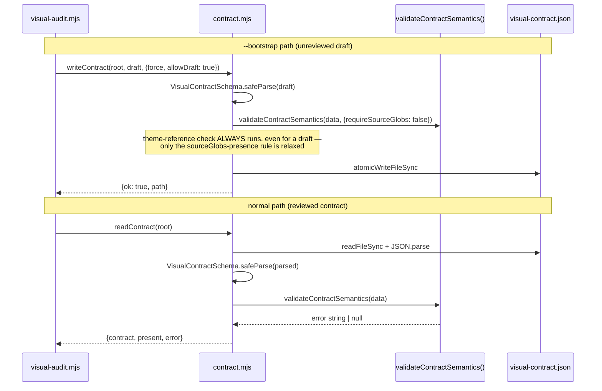

# Plan: Unify visual-contract.json read/write semantic validation
- **Date**: 2026-07-26
- **Status**: Complete
- **Author**: Claude + Lbstrydom
- **Scope**: backend
- **Plan audit trail**: `/audit-plan` — 3 GPT rounds (H:2→0→0→0, capped at
  round 3 per the rigor-pressure rule), Gemini `gemini-pro-latest` final
  gate: **APPROVE**. Claude-Opus shadow review (non-gating): `CONCERNS`, 3
  shadow-only findings — 2 verified and folded in, 1 a wording-precision
  nit also folded in; none changed the design.
- **Code audit trail**: `/audit-code` — 3 rounds (round 1: H:2 M:6 L:1 →
  fixed H1+L1, deferred 7 out-of-scope findings to tech debt; rounds 2-3:
  PASS, H:0 M:0 L:0, 2/2 stable — CONVERGED). Consolidated Gemini gate:
  **APPROVE**, 0 new findings. Claude-Opus shadow: also **APPROVE**,
  unanimous. See [audit-summary](visual-contract-semantic-validation-audit-summary.md).

## 1. Context Summary

**Detected scope**: backend. **Stack**: js-ts (`node scripts/cross-skill.mjs detect-stack` → `{"stack":"js-ts"}`).

**What exists today**: `scripts/lib/visual/contract.mjs` is the committed
`visual-contract.json` reader/writer for `/visual-audit` (product intent —
contracted surfaces, token sources, themes — declared centrally per
`docs/plans/visual-audit-skill.md` §2 decision 6). It exports `readContract`,
`writeContract`, `bootstrapContract`, `contractExists`. The file's header
comment states it "Mirrors `scripts/lib/nav/contract.mjs`" (same read/write/
bootstrap shape, deliberately independent per AGENTS.md's "sister lens" rule
— no shared imports).

**The bug** (7 tech-debt-ledger entries: `0df0b70f`, `20d465d7`, `23bb6ea7`,
`2610ad91`, `32499d7a`, `54b9b2b0`, `f261562c`, captured by `/audit-code`'s
Architecture pass): `readContract()` (`contract.mjs:23-54`) runs
`VisualContractSchema.safeParse()` and then a cross-field check that every
`tokenSources[].theme` references a name declared in `themes[]`.
`writeContract()` (`contract.mjs:107-119`) runs **only** the schema parse —
no cross-field check — before returning `{ok: true}` and persisting. A
contract can therefore pass `writeContract()` and be rejected by the very
next `readContract()` on the same file: a false-success write, and validation
that is not a single source of truth (violates engineering principle #5).

**A second, related gap**: `readContract()`'s own comment (line 45-46) claims
"every surface needs at least one sourceGlob to be gate-attributable" — but
no code anywhere checks it. `SurfaceSchema.sourceGlobs` (`schema.mjs:98`)
defaults to `[]`, which is schema-valid, so this invariant is currently
undocumented-and-unenforced everywhere, not just absent from `writeContract()`.

**Code Trace**:
- `scripts/visual-audit.mjs:52-58` (`--bootstrap` handler) →
  `bootstrapContract()` (`contract.mjs:73-98`, builds a draft with
  `sourceGlobs: []`, `tokenSources: []`, `themes: []`, flagged unreviewed via
  its `_note` field) → `writeContract(root, draft, {force})`
  (`contract.mjs:107-119`, schema-only validation, writes, returns `{ok:true}`).
- `scripts/visual-audit.mjs:61-66` (normal, non-bootstrap path) →
  `readContract(root)` (`contract.mjs:23-54`, schema **plus** the theme
  cross-field check) — the two validation paths for the SAME file diverge here.
- Confirmed via `grep`: `writeContract` from `scripts/lib/visual/contract.mjs`
  has exactly **one** caller in the whole repo — the `--bootstrap` handler
  above (`scripts/lib/dashboard/collect-visual.mjs` and `scripts/nav-audit.mjs`
  / `scripts/visual-audit.mjs`'s normal path call `readContract` only). This
  matters directly for the design below: `bootstrapContract()`'s deliberately-
  incomplete draft is written through the SAME `writeContract()` this plan is
  tightening, so a strict-by-default fix that doesn't carve out the draft path
  breaks `--bootstrap` outright.

**Neighbourhood considered** (`get-neighbourhood`, `intentDescription`:
"extract a semantic cross-field validator for visual-contract.json shared by
readContract() and writeContract()"): top match is `readContract` itself
(`contract.mjs:23-54`, `recommendation: precedent`, `bandReason:
above-floor-standout`, similarity 0.75) — confirms this is an **extend
existing code** case, not a new-abstraction case: the semantic invariants
already live inline in `readContract()`; the fix extracts them into a shared
helper rather than inventing new logic. All 49 other candidates scored
`review` (below the repo's noise floor), including `nav/contract.mjs`'s
`readContract` (similarity 0.42) and `gate-honesty/schema.mjs`'s
`validateGateContract` (0.44) — noted for pattern awareness, not reused
(different domains, no import edge).

**Target domain**: `visual-audit` (`compute-target-domains`:
`{"domains":["visual-audit"],"crossDomain":false}`).

**Security-incident neighbourhood** consulted (`get-incident-neighbourhood`):
2 candidates returned (INC-001 symlink-bypass in `sensitive-paths.mjs`,
INC-002 destructive-test-DSN wipe), both low composite score (~0.47-0.49,
no path overlap) — neither applies. This change reads/writes a local
committed JSON config with no credentials, no external API calls, and no
trust-boundary crossing; no Security Considerations section required.

**Sibling-file same-bug finding (deliberately out of scope)**: `nav/contract.mjs`'s
`writeContract()` (`nav/contract.mjs:239-247`) has the identical defect —
schema-only validation, no cross-field check (nav's equivalent: `requiredInLayer`
must reference a `navLayers` key). Per AGENTS.md's skill-naming-convention note,
nav-audit and visual-audit are deliberately independent sister lenses with zero
shared imports today — fixing `nav/contract.mjs` is a separate, symmetric fix
against different (as-yet-uncaptured) debt entries, not this plan's scope. Flagged
here so it isn't rediscovered as a surprise later.

## 2. Proposed Architecture

**Design**: extract the semantic cross-field validation already embedded in
`readContract()` into one private helper,
`validateContractSemantics(data, {requireSourceGlobs = true} = {})`,
co-located in `contract.mjs` (principle #5 — single source of truth; principle
#1 — DRY). It checks, in order: (a) every `tokenSources[].theme` exists in
`themes[]` (existing check, moved verbatim, **always enforced, no opt-out**),
(b) when `requireSourceGlobs`, every `surfaces[]` entry has
`sourceGlobs.length >= 1` (new — closes the second gap). Returns the first
violation as a string, or `null` — matching the existing single-error-string
shape both callers already use, so no caller-facing return-type change.

`readContract()` calls it unconditionally after the schema parse (principle
#11 — validation at every boundary), with the default `requireSourceGlobs:
true`. `writeContract()` gains one new option, `allowDraft` (default
`false`): when `false` (the new default), it calls the validator with no
overrides and refuses to write on failure — closing entries `23bb6ea7`,
`2610ad91`, `32499d7a`, `54b9b2b0`, `f261562c`. When `true`, it calls the
validator with `{requireSourceGlobs: false}` — **the theme-reference check
still always runs and can still reject a write**; only the completeness rule
bootstrap legitimately cannot satisfy is relaxed. This was corrected after
round-1 audit finding H1: an earlier draft of this plan had `allowDraft`
bypass the *entire* validator, including the theme-reference check —
recreating the exact false-success-write defect this plan closes, just
behind a flag, and for zero actual benefit (`bootstrapContract()`'s draft
always has `tokenSources: []`, so the theme check is already a no-op for the
one real caller — narrowing the flag costs nothing and removes a live
footgun for any future caller). The `--bootstrap` call site in
`visual-audit.mjs` is updated to pass `allowDraft: true`, since its own
`_note` field already documents the draft as unreviewed and
`bootstrapContract()` deliberately starts with empty `sourceGlobs`/
`tokenSources`/`themes`.

**Why not a Zod-schema-level constraint** (e.g. `sourceGlobs: z.array(...).min(1)`):
schema validation in `writeContract()` is **not** skippable by `allowDraft` (by
design — a draft must still be structurally valid JSON matching the shape).
A schema-level `.min(1)` would make `bootstrapContract()`'s very first
`writeContract()` call fail unconditionally, breaking `--bootstrap` outright.
The invariant has to live at the semantic-validation layer, exactly where the
existing theme-reference check already lives — confirming `readContract()`'s
own code, not just its comment, is the right place to extend from.

### Right-sizing (Gate 1 — new abstraction introduced)
- **Band-aid**: copy-paste the theme-reference loop into `writeContract()`
  as a second, independent inline check (resolves the write/read symmetry for
  entries 23bb6ea7/2610ad91/32499d7a/54b9b2b0/f261562c but leaves the
  sourceGlob invariant — entries 0df0b70f/20d465d7 — still unenforced
  everywhere, and duplicates logic two functions will now drift on again).
- **Over-engineered**: round-1 GPT audit finding H1/M2 recommended a formal
  contract lifecycle model — a discriminated `status: 'draft' | 'ready'`
  schema field, typed draft results from `readContract()`, an explicit
  promotion workflow. Rejected as over-engineered *for this fix*: it
  introduces a new persisted schema field, a new state machine, and new CLI
  UX for a plan whose actual, current requirement is "one caller needs to
  write an intentionally-incomplete file." Nothing in the current codebase
  needs a *second* writer with different completeness rules, a promotion
  command, or a machine-readable draft marker — `_note` (prose, human-read)
  already exists and already serves the one real workflow.  A generic,
  pluggable "contract invariant registry" (named validators, severity
  levels, JSON-declared rules) was also considered and rejected for the same
  reason — massive overkill for 2 concrete invariants used by 2 functions.
- **Chosen**: one private function, 2 invariants, an internal
  `{requireSourceGlobs}` parameter (not a full bypass) called from the 2
  existing functions that need it, plus one boolean opt-out flag for the 1
  existing caller that needs it. Nothing here serves a hypothetical future
  caller — `allowDraft` is not a general "strict mode" toggle, it exists
  because exactly one real call site (bootstrap) needs exactly this narrow
  exemption today, and it can never disable the referential-integrity check.
  A formal lifecycle model is deferred to "Out of Scope (Future)" below —
  build it if and when a second writer with genuinely different completeness
  needs appears, not speculatively now.

## 3. Sustainability Notes

- **Assumption that could change**: `writeContract()` currently has exactly
  one caller. If a future feature adds a second (reviewed) writer — e.g. an
  interactive `visual-audit --edit` command — it gets the strict validation
  by default with no code change required; it would need to explicitly opt
  into `allowDraft` if it ever needs to write incomplete state, making the
  incomplete case the explicit exception rather than the silent default.
- **Extension point**: a third invariant (should one ever be needed) is one
  more branch inside `validateContractSemantics` — no call-site changes.
- **Deferred**: the identical `nav/contract.mjs` defect (see Context Summary)
  — separate plan, separate debt entries, out of scope here by design (sister
  lens independence).

## 4. File-Level Plan

- **`scripts/lib/visual/contract.mjs`** (modify)
  - Add private `validateContractSemantics(data, {requireSourceGlobs = true}
    = {})` — extracts the existing theme-reference loop from `readContract()`
    verbatim (always runs, no parameter gates it), adds the new
    sourceGlobs-presence loop gated on `requireSourceGlobs`. Returns
    `string | null`.
  - `readContract()`: replace the inline theme-check loop with a call to
    `validateContractSemantics(data)` (default `requireSourceGlobs: true`);
    same `{contract: null, present: true, error}` return shape on failure.
  - `writeContract(root, contract, {force = false, allowDraft = false} = {})`:
    after the existing schema-parse guard, call
    `validateContractSemantics(result.data, {requireSourceGlobs: !allowDraft})`
    and return `{ok: false, path, error: 'refusing to write semantically
    invalid contract: ' + error}` on failure — for **any** `allowDraft`
    value, since the theme-reference check is never skippable. Note: the
    write-side error is this prefix **plus** the same invariant-identifying
    text the read-side returns bare (e.g. both contain `"surface 's1' has no
    sourceGlobs"` as a substring) — tests assert on that shared substring,
    not on byte-identical strings, per the mandatory-gate's Claude-Opus
    shadow review (non-gating, but a real precision gap worth closing while
    cheap).
  - **Why this file**: it already owns both functions and the existing
    cross-field check (principle #5 — don't split a single-file invariant
    across files without a reason).

- **`scripts/visual-audit.mjs`** (modify)
  - Line 54: `writeContract(root, draft, { force: args.force })` →
    `writeContract(root, draft, { force: args.force, allowDraft: true })`.
  - **Why**: the one existing caller must keep writing deliberately-incomplete
    review-queue drafts; this is the explicit, single-line opt-in.

- **`scripts/lib/visual/schema.mjs`** (no change)
  - Considered adding a `.min(1)` to `SurfaceSchema.sourceGlobs` (debt entry
    `20d465d7` names this file) — rejected per the "why not a Zod-schema-level
    constraint" note above. Left as-is; the schema still legitimately allows
    an empty `sourceGlobs` array as *structurally* valid JSON (a draft is
    still valid JSON, just not yet semantically complete).

- **`scripts/lib/dashboard/collect-visual.mjs`** (no change — verified, not
  assumed; caught by the mandatory gate's Claude-Opus shadow review): this
  is a **second** consumer of `readContract()` beyond `visual-audit.mjs`
  (`collect-visual.mjs:20`), feeding the local dashboard's Visual Audit
  panel. Read directly: its degradation contract already has a `status:
  'unexpected-error'` branch for exactly a non-null `readContract()` error
  (`collect-visual.mjs:20-21`, documented in its own header comment,
  mirroring `collect-nav.mjs`'s existing pattern) — an un-edited bootstrap
  draft that now fails `readContract()` renders as `unexpected-error` with
  the new, specific detail message instead of silently rendering an `ok`
  status with an empty scorecard. No code change needed; this is the same
  already-justified behavior change as `visual-audit.mjs`'s (see Risk
  Register), just propagating correctly to a second existing consumer
  rather than being a surprise found during implementation.

- **`skills/visual-audit/references/contract-and-bootstrap.md`** (modify —
  the canonical source; `.claude/skills/visual-audit/references/` is the
  generated copy, regenerated via `npm run skills:regenerate`, never
  hand-edited): its "Bootstrap" section already tells the operator to "Fill
  `surfaces[].sourceGlobs`, declare `tokenSources` + `themes`, then remove
  the `_note`" — correct guidance, but doesn't yet say what happens if they
  don't. Add one sentence: an un-edited draft now fails the normal (non
  `--bootstrap`) `visual-audit` run with a named error identifying the
  missing field — intentional, not a bug.

- **`tests/visual-contract.test.mjs`** (create — no existing test file covers
  `readContract`/`writeContract`; `tests/visual-schema.test.mjs` covers only
  `schema.mjs`'s Zod contract + digest functions, a different module)
  - **Table-driven semantic-validation matrix** (round-2 finding M1 — the
    original spec only exercised the undeclared-theme invariant through
    `writeContract()`'s reject path, leaving `readContract()`'s side of that
    SAME invariant unverified against a raw fixture; a future edit could
    silently re-diverge the two boundaries and every listed test would still
    pass). Four fixtures × two boundaries, 4 base fixtures:
    `valid` (baseContract-shaped, passes both), `undeclared-theme` (a
    `tokenSources[].theme` absent from `themes[]`), `empty-sourceGlobs` (one
    surface with `sourceGlobs: []`), `both-invalid` (both violations at
    once — asserts a deterministic, named error, not "some error").
    - **`readContract()` boundary**: for each fixture, `atomicWriteFileSync`
      the raw JSON directly to a temp root's `visual-contract.json`
      (bypassing `writeContract()` entirely — this is what closes the gap:
      a fixture `writeContract()` would reject is written straight to disk
      so `readContract()` is tested against it independently), then assert
      `readContract()` accepts (`valid`) or rejects with an error naming the
      specific violated invariant (the other three).
    - **`writeContract()` boundary**: for each fixture, call `writeContract(root,
      fixture, {force: true})` (no `allowDraft`) and assert `{ok: true}` /
      `{ok: false, error: <same invariant text>}` matching the read-side
      result for the same fixture — this pins the "both boundaries agree"
      property directly, per-fixture, rather than only for the valid case.
    - **No-write-on-rejection is a first-class dimension** (round-3 finding
      M1 — the original spec only asserted no-write for the `allowDraft`
      case, leaving the strict-rejection paths unverified against a
      write-then-corrupt-on-reject regression). For each of the 3 invalid
      fixtures under strict mode: (a) **absent-destination** — call
      `writeContract()` against a temp root with no existing file, assert
      `{ok: false}` **and** `!fs.existsSync(destPath)`; (b)
      **pre-existing-destination** — seed the temp root with a known-valid
      sentinel contract first, call `writeContract()` with the invalid
      fixture, assert `{ok: false}` **and** the file's bytes are unchanged
      (`fs.readFileSync` equals the pre-seeded content byte-for-byte).
    - **`allowDraft: true` sub-case**: re-run `empty-sourceGlobs` and
      `undeclared-theme` through `writeContract(root, fixture, {force: true,
      allowDraft: true})` — `empty-sourceGlobs` must now be **accepted**
      (only completeness relaxed), `undeclared-theme` must **still be
      rejected**, with the same absent/pre-existing no-write assertions as
      above (round-1 finding H1's regression guard — the theme check is
      never bypassable).
  - `bootstrapContract()`'s own output, written via `writeContract(...,
    {allowDraft: true})`, then read via `readContract()` (not a schema-only
    parse) and asserted to be rejected with a sourceGlobs-specific error —
    confirms the draft round-trips as intentionally-incomplete, not silently
    "valid" (round-1 finding M2 asked what a normal read of a draft returns;
    this pins the answer: a named, actionable error, not silent acceptance).
  - **Real-world compliance fixture** (round-1 finding H2): a fixture built
    from `wine-cellar-app/visual-contract.json`'s actual shape (3 surfaces,
    each with non-empty `sourceGlobs`; 3 `tokenSources` all with `theme:
    null`) passes `readContract()`-equivalent validation cleanly — locks in
    that the one real committed contract this repo can see stays valid after
    this change (see Risk Register — verified, not assumed).
  - CLI-level test (round-1 finding M1): `node scripts/visual-audit.mjs
    --bootstrap --root <tmp>` (via `execFileSync`) exits 0 and writes a
    contract at `<tmp>/visual-contract.json`; a subsequent run of `node
    scripts/visual-audit.mjs --root <tmp>` (no `--bootstrap`) exits 2 (per
    the existing `readContract` error → `process.exit(2)` path in
    `visual-audit.mjs:62`) and its stderr names the missing `sourceGlobs`
    surface — proves the `--bootstrap` → `writeContract(..., {allowDraft:
    true})` wiring is real, not just asserted by the direct-call unit test
    above.

## 5. Risk & Trade-off Register

- **Risk**: any future caller of `writeContract()` that forgets `allowDraft`
  when it should pass it will get a new, previously-absent rejection.
  **Mitigation**: today there is exactly one caller (bootstrap), updated in
  this same change; the default (`allowDraft: false`) is the safe direction
  to fail in (refuse-to-write beats silent-invalid-write). `allowDraft:
  true` can never bypass the theme-reference check (round-1 finding H1
  fix), so this footgun is bounded to the completeness rule only.
- **Risk**: `readContract()` now rejects a class of file it previously
  accepted — a surface with `sourceGlobs: []` — including any bootstrap draft
  a user left un-edited and then ran `visual-audit.mjs` against without
  `--bootstrap`. **Assessment**: this is the intended fix per entries
  `0df0b70f`/`20d465d7`, not a regression — today that surface silently
  passes `readContract()` and only fails later/confusingly when the audit
  tries to attribute a finding to it with no glob to match against. The new
  error message names the surface and the missing field directly.
- **Compatibility risk — persisted config (round-1 finding H2)**: `readContract()`
  changing behavior on already-committed `visual-contract.json` files is a
  persisted-configuration compatibility change, not a pure internal refactor
  — worth verifying against real instances rather than assuming. **Verified**:
  the two repos this codebase syncs to are `wine-cellar-app` and
  `ai-organiser` (`scripts/lib/consumer-repos.mjs`, `CONSUMER_REPOS`).
  `ai-organiser` has no `visual-contract.json` at all — not adopted there,
  nothing to break. `wine-cellar-app/visual-contract.json` **is** committed
  and real; read directly: all 3 surfaces (`auth-card`, `app-header`,
  `drink-tonight-panel`) have non-empty `sourceGlobs` (2-3 entries each),
  and all 3 `tokenSources` have `theme: null` (the theme-reference check is
  a no-op on a null theme, matching `contract.mjs`'s existing `if (ts.theme
  && ...)` guard) — it already satisfies both invariants with zero changes
  needed. This is the complete set of known real instances (2 consumer
  repos, checked exhaustively), not a sample — so no migration tooling,
  inventory CLI, or release-compatibility gate is warranted (right-sizing:
  no current requirement, since there is nothing to migrate). If a third
  consumer or a hand-authored non-compliant contract surfaces later,
  `readContract()`'s new error message is specific enough (names the
  surface id and the missing field) to self-serve the fix without tooling.
- **Deferred**: `nav/contract.mjs`'s identical defect (see Sustainability
  Notes) — separate plan.

## 6. Testing Strategy

- **Unit**: `tests/visual-contract.test.mjs` (new, per File-Level Plan above)
  — pure function calls against a temp directory (`fs.mkdtempSync`), no
  network/DB/browser. Runs via the project's existing Node built-in test
  runner — `node --test tests/visual-contract.test.mjs` directly, or
  `npm test` (which globs the whole `tests/` directory; no new discovery
  wiring, package script, or CI registration needed — `*.test.mjs` under
  `tests/` is already the repo-wide convention every other test file here
  follows).
- **CLI-level** (round-1 finding M1, no longer "manual only"): the same test
  file also drives `node scripts/visual-audit.mjs --bootstrap --root <tmp>`
  and a follow-up non-bootstrap run via `execFileSync`, asserting exit codes
  and stderr content — proves the option actually threads from the CLI flag
  through to `writeContract()`, not just that the direct function call works.
- **Edge cases covered**: empty `tokenSources`/`themes` (bootstrap's actual
  shape — must NOT trip the theme-reference check, since the loop is
  correctly a no-op over an empty array); a surface with `sourceGlobs:
  undefined` vs `sourceGlobs: []` (schema default normalizes `undefined` to
  `[]`, so both must be rejected identically); multiple surfaces where only
  one violates the invariant (error must name the specific offending surface
  `id`, not just "some surface is missing sourceGlobs"); `allowDraft: true`
  with a bad theme reference (must still reject — H1 regression guard); the
  real `wine-cellar-app` contract shape (H2 compatibility guard).

## 7. Acceptance Criteria

Backend-only scope, so `/ux-lock verify` does not apply (no UI surface) —
but round-2 finding L1 correctly noted that "not applicable" isn't the same
as "no acceptance criteria." Each item below links to its Testing Strategy
counterpart:

- `writeContract()` with no `allowDraft` rejects a contract with an
  undeclared `tokenSources[].theme` **and** does not modify/create the
  destination file. → semantic-validation matrix, write-boundary + no-op-on-reject case.
- `writeContract()` with no `allowDraft` rejects a contract with an empty
  `surfaces[].sourceGlobs` **and** does not modify/create the destination
  file. → semantic-validation matrix, write-boundary.
- `writeContract(..., {allowDraft: true})` accepts empty `sourceGlobs` but
  still rejects an undeclared theme reference. → matrix, `allowDraft` sub-case.
- `readContract()` rejects either violation on a raw fixture written
  directly to disk, naming the specific offending surface id or theme name
  in the error. → matrix, read-boundary.
- `node scripts/visual-audit.mjs --bootstrap --root <tmp>` exits 0 and
  produces a contract that a subsequent non-bootstrap run of the same
  command rejects (exit 2) with a `sourceGlobs`-specific error. → CLI-level test.
- The real `wine-cellar-app/visual-contract.json` shape remains accepted
  unchanged. → real-world compliance fixture.

## 8. Out of Scope (Future)

- **Formal contract lifecycle state machine** (round-1 findings H1/M2's
  original recommendation): a discriminated `status: 'draft' | 'ready'`
  schema field, a typed draft/error result shape from `readContract()`, and
  an explicit promotion command. **Why deferred, not folded in**: the plan's
  correctness does not depend on this — `allowDraft`'s narrowed scope
  (theme check always enforced, only completeness relaxed) already fully
  closes all 7 ledger entries with the codebase's actual current shape (one
  writer, one caller, one legitimate exemption). A lifecycle model is
  independent, speculative infrastructure for a second writer that does not
  exist yet; building it now would be designing for a requirement nobody
  has. Revisit if/when a second `writeContract()` caller with different
  completeness needs is actually proposed.

## Implementation Log

### 2026-07-26
- **Completed**: the full plan as specified — `validateContractSemantics()`
  extraction, `readContract()`/`writeContract()` symmetry, `allowDraft`
  narrowed to the sourceGlobs-only exception, the table-driven test matrix,
  the doc update. Plus one code-audit-caught fix beyond the plan's original
  text: `writeContract()` was persisting the raw caller `contract` object
  instead of the Zod-validated `result.data` (round-1 code-audit H1 — a
  second instance of the exact bug class this plan targets, found by the
  audit rather than anticipated in the plan).
- **Remaining**: none. All 7 originally-cited ledger entries closed; 7
  additional out-of-scope findings from code-audit round 1 captured to
  `.audit/tech-debt.json` (see the audit summary).
- **Deviations**: the `allowDraft` design changed between plan-audit rounds
  1 and 2 (see §2's "corrected after round-1 audit finding H1" note) — the
  final shape (`{requireSourceGlobs}` parameter, theme check never
  bypassable) is stricter than the plan's first draft, not looser. No
  deviation in the implementation from the final (post-audit) plan text.
