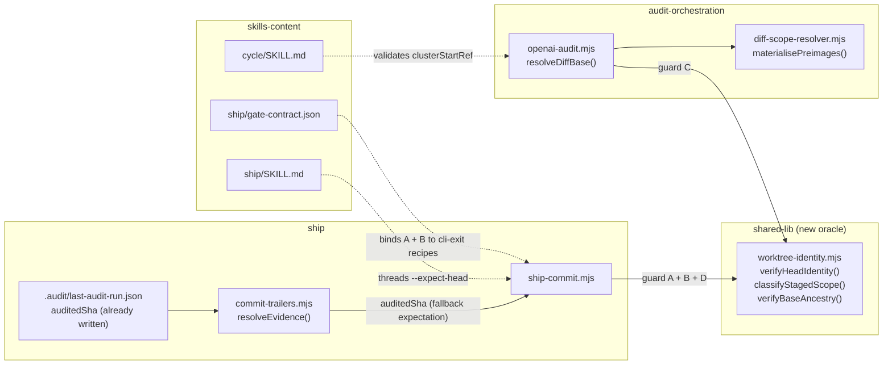

# Plan: Worktree-identity guards for multi-step skills

- **Date**: 2026-08-11
- **Status**: Complete — all 3 clusters shipped 2026-08-11; consolidated gate APPROVE (round 2)
- **Author**: Claude + Louis
- **Scope**: backend (CLI binaries + skill prose + gate contract; no UI)

> **Target domain(s)**: `audit-orchestration`, `shared-lib`, `ship`, `skills-content`, `tests`
> - ⚠ **Cross-domain work** — touches 5 domains; the boundary crossings are
>   intentional and named in §2 (one new `shared-lib` oracle consumed by `ship`
>   and `audit-orchestration`, deliberately NOT duplicated per-domain).

> **All `file:line` citations in this plan are pinned to commit `7bc91980`**
> (`main` == `origin/main`, 2026-08-11), **re-verified after the divergence was
> resolved**. The plan was originally written against `3e4ea00a`, a commit on a
> duplicate lineage that no longer exists in this history; 15 of 19 anchors held
> and 4 had decayed — `skills/ship/SKILL.md` had shifted ~67 lines and
> `scripts/openai-audit.mjs` by 1 — **within hours of being written**. Every
> cited construct still exists; only the pins moved. That is the
> wrong-but-resolving decay class, caught by the re-check rather than by a reader
> weeks later. → `skills/plan/references/verification-discipline.md` §1.
>
> Re-check command: `node -e` over the anchor list, asserting each `file:line`
> still matches its expected construct — rerun it before implementing if HEAD
> has moved again.

---

## 1. Context Summary

**Detected scope**: `backend` · **Stack**: `js-ts` (+ `postgres`) · no Python.

### The invariant being violated

Every skill assumes exclusive ownership of the worktree. Nothing declares that
assumption and nothing re-verifies it. Under concurrent sessions the assumption
is false, and the failure mode is **silent and destructive** rather than loud.

### Code Trace

The evidence that Phase 1 happened — the call path actually followed, pinned to `7bc91980`:

```
/ship Step 6.1 stages by name  skills/ship/SKILL.md:751 (7bc91980)
  → /ship Step 6.3 invokes     skills/ship/SKILL.md:836 (7bc91980)
    → scripts/ship-commit.mjs::main()                       :96  (7bc91980)
      → arg parse, KNOWN_FLAGS = 5 flags                    :56  (7bc91980)
      → repo resolution (git rev-parse --show-toplevel)     :133 (7bc91980)
      → resolveEvidence({auditRunPath, headCommitTs})       — scripts/lib/commit-trailers.mjs:104 (7bc91980)
          reads .audit/last-audit-run.json
          parses auditedTree :134, auditedSha :135          (7bc91980)
          fresh := evidenceMs > headCommitTs*1000           :136 (7bc91980)
      → evaluateGateVerification({..., committedTree})      — scripts/lib/commit-trailers.mjs (7bc91980)
          EARLY RETURN unless gate === 'passed'  ← the gap
          committedTree !== evidence.auditedTree → refuse   (E1, shipped `caf2621`)
      → staged/pathspec branch                              :337-436 (7bc91980)
      → checkMigrationRealization()                         :456 (7bc91980)
      → git commit -F <file> [-- <pathspec>]                :489-493 (7bc91980)

/audit-code --scope diff
  → scripts/openai-audit.mjs::resolveDiffBase()             :498 (7bc91980)
      explicitBase → returned VERBATIM, unvalidated  ← the gap
      else dirty-aware HEAD / HEAD~1                        :499-500 (7bc91980)
  → git diff --name-only <base>..HEAD                       :768 (7bc91980)

/cycle Step 3C loop item 3 captures clusterStartRef
  → skills/cycle/SKILL.md:220 (7bc91980)  — SKILL PROSE ONLY; no code owns it
  → state file .audit/cycle-cluster-state.json is agent-managed
    (referenced only by skills/cycle/SKILL.md, scripts/audit-clean.mjs,
     scripts/lib/audit/gpt-sentinel-trigger.mjs — no writer module exists)
```

### What exists today

**Already built (do not rebuild):**

- **`--path` scoping in `ship-commit.mjs`** (`scripts/ship-commit.mjs:20-31`,
  `7bc91980`) — git `--only` semantics, so a second session's staged work is
  left alone. Its docstring cites the 2026-07-19 field incident. Untracked paths
  are intent-to-add'd and rolled back on rejection (`:369-435`).
- **E1 tree identity** (`evaluateGateVerification`, `scripts/lib/commit-trailers.mjs`,
  shipped `caf2621`) — refuses `--gate passed` when
  `committedTree !== evidence.auditedTree`. Explicitly covers the partial-commit
  case. Guarded by `tests/gate-evidence-tree-identity.test.mjs`.
- **`.audit/last-audit-run.json` records `auditedSha`** — `openai-audit.mjs:449`
  writes it via `scripts/lib/audit/gate-evidence.mjs::buildGateEvidence`; documented
  there (`:83`) as "HEAD at capture time (cheap secondary)".
- **`resolvePushRange`** (`scripts/lib/push-range.mjs:85-144`) — the repo's reference
  shape for this class: a discriminated `{ok:true,…} | {ok:false, reason, message}`
  over a **closed reason enum**, where *"an explicit base that does not resolve
  is a hard failure, never a silent demotion to inference"* (`:72-75`).

**The three gaps, stated precisely:**

| # | Gap | Evidence |
|---|---|---|
| G1 | `--path` is **opt-in and conditional on the agent noticing** foreign staged entries | `skills/ship/SKILL.md:842` — *"If `git status` shows staged changes that are NOT yours"*. The reported failure IS the failure of that noticing. |
| G2 | **No HEAD/branch identity check on any ship.** E1's tree check early-returns `unless gate === 'passed'` | `evaluateGateVerification` line 1. A `--gate not-run` ship — which is what an un-audited fix ships as — gets **zero** identity verification. |
| G3 | An explicit `--base` is used **verbatim, unvalidated** | `openai-audit.mjs:498` `resolveDiffBase` returns `explicitBase` with no resolvability or ancestry check — unlike `resolvePushRange`, which validates both. |

### Field evidence

1. **Index contamination, escaped to a pushed PR.** 13 `git rm`s sat in a shared
   index; another session's 12-line CI change committed and became −2,324 lines —
   a broken half-promotion where the deletions landed but the importing loader
   and the flag did not. Caught by a human, not by CI.
2. **HEAD moved between two of the reporter's own commands, twice.** A commit
   landed on `main` instead of the feature branch; blocked only by branch
   protection, which is luck, not design.
3. **Reproduced live in this repo, 2026-08-11, during the planning session.**
   Session-start HEAD `b9a9b642` was **amended** by a concurrent session into
   `3e4ea00a` (same parent `9f6ca0c4`), absorbing a dirty
   `skills/ship/gate-contract.json`. `git merge-base --is-ancestor b9a9b642 HEAD`
   → **NO**.

> **Incident 3 is load-bearing for the design.** An **amend changes no
> working-tree file**. So `/cycle`'s `auditedFileHashes` staleness check — and
> any content-hash approach — sails straight past it. E1's `auditedTree` check
> also passes, because the tree is unchanged. **Only an explicit HEAD-identity
> comparison catches this class.** This is the argument for a sha token over
> every hash-based alternative, and it is a measurement, not a prediction.

### Neighbourhood considered

Architectural-memory consultation (`refreshId e7dc729a`, k=8, all `review` band —
nothing cleared this repo's noise floor, so **no near-duplicate exists**; top
score 0.82 vs a `below-noise-floor-near` cliff of 0.0117):

| Symbol | File | Domain | Band | Decision |
|---|---|---|---|---|
| `resolvePushRange` | `scripts/lib/push-range.mjs:85` | `shared-lib` | review | **Extend the pattern, write a sibling.** Its explicit-base validation is the exact shape G3 needs, but it resolves a *push* range from env vars. Reusing it directly would overload one function with two callers' semantics. |
| `checkMigrationRealization` | `ship-commit.mjs:511` | `ship` | review | **Structural precedent, not reuse.** The template for "a new pre-commit refusal inside `ship-commit.mjs`": unconditional, fail-open on unmeasurable state, `AGENT FIX:` + exit 2. |
| `looksLikeOwnedWorktree`, `materialisePreimages`, `cleanupTempRoot`, `sweepStaleOrphanPreimages` | `scripts/lib/audit/diff-scope-resolver.mjs:282-414` | `audit-orchestration` | review | **Not reuse — but a consumer.** These already `git worktree add --detach … <baseRef>` (`:381`). A bogus `--base` currently fails *here*, deep in preimage materialisation, rather than at the boundary. G3's fix moves the failure to the boundary. |

**Decision: write a sibling.** A new `scripts/lib/worktree-identity.mjs` is the
single oracle, consumed by `ship`, `audit-orchestration` and (optionally later)
`shared-lib`. Justification for one shared module rather than three local checks:
the repo already learned this lesson once — `selector-policy.mjs::classifySelector`
is *"the **single policy oracle** — never add a second classifier"* (AGENTS.md),
and `sensitive-paths.mjs` is *"the **single source of truth** … never add a fifth
implementation"*. Three copies of `merge-base --is-ancestor` is that anti-pattern.

### Past incidents to verify against

| Incident | Affected paths | Status | Lesson applied here |
|---|---|---|---|
| **INC-002** — Supabase wipe, 2026-07-14 | `tests/db-setup.test.mjs`, `scripts/lib/db/client.mjs` | `manual-verification-required` | *"An env-gate that checks 'is this variable **set**' is not a safety gate — it only proves intent to run."* **Directly binding on G2**: if `--expect-head` is merely optional, its *absence* silently reads as a pass. See §6 "Omission is the failure mode". |
| **INC-001** — lexical symlink bypass | `scripts/lib/sensitive-paths.mjs` | `manual-verification-required` | *"Fail-closed on resolution errors. Never 'I couldn't classify it so I'll allow it.'"* Applied to **all three** guards — see the outcome matrix in §5, which replaced an earlier draft's fail-closed/announce split. |

Neither incident has path overlap with this change; both lessons are
class-level and are addressed in §8 (Security Considerations).

---

## 2. Proposed Architecture



### The single design idea

**A multi-step skill declares the worktree state it assumes; the binaries
re-verify it before mutating.** One token (a HEAD sha), captured at operation
start, verified at every mutating boundary.

The crucial simplification, found during exploration: **the token is already
being minted.** `.audit/last-audit-run.json` records `auditedSha` at audit time
and `resolveEvidence` already parses and returns it — it is simply never
consumed by any decision. So on the most dangerous path (a long `--autonomous`
run that just audited), guard B needs **no new plumbing, no token protocol, and
no caller change**. That dissolves the open design question the brief raised
("who mints the token, where is it stored").

### Key design decisions

| Decision | Principles |
|---|---|
| **One `worktree-identity.mjs` oracle**, not three inline checks | #1 DRY, #5 Single Source of Truth. Mirrors `selector-policy.mjs` / `sensitive-paths.mjs`. |
| **Pure functions + injected git runner**, `{ok:true,…}\|{ok:false,reason,…}` over a closed enum | #11 Testability, #15 Error Handling. Copies `resolvePushRange`'s proven contract (`push-range.mjs:82-83`) and `vcs.mjs`'s "structured results, never bare throws" rule. |
| **All three guards fail CLOSED — one exhaustive outcome matrix, no announce-and-proceed** | #15 Error Handling, #12 Validation. An earlier draft split this (A closed, B/C announce) and the round-1 audit caught it as a self-contradiction; the matrix in §5 is now the single source of truth. |
| **`auditedSha` becomes the fallback expectation when `--expect-head` is absent** | #2 no new state, #20 Long-Term Flexibility. Reuses an already-written field. |
| **Ancestry validation at the boundary (`resolveDiffBase`), not deep in `materialisePreimages`** | #15. Today a bogus base fails at `git worktree add` (`diff-scope-resolver.mjs:381`) with a git error, after the caller has already decided the range is good. |
| **Guards live in binaries, never SKILL prose** | AGENTS.md, restated at `ship-commit.mjs:445` — *"a SKILL step is an instruction to an agent and cannot block."* |

### Right-sizing gate

New structure is on the table (a new module + two new flags), so this is
mandatory:

- **Band-aid extreme** — scatter `git rev-parse` calls at each call site and
  compare inline. Three divergent copies of ancestry logic; the next skill that
  needs it writes a fourth; the root cause (nothing *declares* the assumption)
  survives untouched.
- **Over-engineered extreme** — `/cycle --isolated` git-worktree mode, a
  session-lease protocol with lockfiles, or a daemon watching HEAD. **Explicitly
  declined** (see §8 Out of Scope): a fresh worktree cannot reach
  `scripts/.claude-skills/` or `node_modules` (both gitignored), so it needs
  `npm ci` + a re-sync per run; and this repo works on `main` only. No current
  requirement.
- **Chosen** — one pure oracle module + two flags on the one binary that already
  owns the commit boundary + one validation in the one function that already
  owns base resolution. The **current** requirement each serves: G1 → a pushed
  PR with a −2,324-line diff; G2 → a live amend that moved HEAD under an active
  session today; G3 → `/cycle` prose that captures a ref and never checks it.

**Manual vs scripted**: hand edits throughout. The sites are few (≈11 files),
irregular, and judgment-heavy — a codemod is the over-engineering cliff here.

---

## 3. Execution Model (dependency analysis)

Operations are **not** independent — there is one chain:

```
worktree-identity.mjs (oracle)
   ├──> ship-commit.mjs        (guards A, B, D)  ─┐
   └──> openai-audit.mjs       (guard C)          ├──> gate-contract.json + oracles.mjs recipes
                                                  ┘         (can only bind gates that exist)
skills/*.md prose ──────────────────────────────────────────> (describes the shipped behaviour)
```

- **Prerequisite**: the oracle's function signatures must be settled before
  either consumer is written, or both consumers invent their own shapes.
- **Atomicity boundary**: each cluster is independently revertible. The oracle
  alone is inert (nothing imports it) — a safe intermediate state.
- **Concurrency**: clusters B and C are mutually independent once A lands and
  could run in parallel; §11 keeps them sequential because both feed cluster D.
- **Partial-failure recovery**: if cluster C proves infeasible (see §8 risk R3),
  clusters A/B/D still ship a complete, coherent change — G3 degrades to a
  documented debt entry rather than blocking G1/G2.

---

## 4. Sustainability Notes

**Assumptions encoded, and what breaks if they change:**

- *`.audit/last-audit-run.json` keeps recording `auditedSha`.* If the field is
  dropped, guard B loses its **fallback** and every ship then requires an
  explicit `--expect-head` — a cried-wolf regression (R1), never a silent pass,
  because absence is `no-expectation` → exit 2. `buildGateEvidence`'s signature
  is the seam, so a drop is visible there rather than at a commit boundary.
- *Git remains the VCS.* All three guards are git-shaped. The oracle is the one
  file to port; consumers see a stable result contract.
- *`--path` keeps git's `--only` semantics — specifically its isolation from
  foreign staged entries.* Documented at `ship-commit.mjs:29-31` and **measured
  2026-08-11** (§5). This assumption is load-bearing for H3's fix, which is why
  it gets a pinned regression test rather than resting on the one-off
  measurement.

**Extension points built in deliberately:**

- The closed `reason` enum is the extension seam — a fourth guard adds a reason,
  not a module.
- `verifyHeadIdentity` takes `{expected, actual}` as data, so a future caller
  (e.g. `/cycle`'s cluster loop, if it ever gains a writer module) reuses it
  without touching `ship-commit.mjs`.

**Coupling**: loosened. Today `openai-audit.mjs` discovers a bad base indirectly
through `diff-scope-resolver`'s worktree call. After this change both consumers
depend on one declared contract instead of on git's error text.

---

## 5. File-Level Plan

> **One authoritative migration matrix (R3-M3).** Earlier drafts kept a file
> table here and a separate caller inventory in §6, and they disagreed — Phase 2
> modified `gate-evidence.mjs` which this table never listed, and §6 required doc
> and test-suite updates no phase owned. Two lists is two sources of truth, which
> is the same defect this plan's §11 rule forbids for cluster scopes. There is now
> one table: **every** artifact has an owning phase and a named verification.

| File | Intent | Phase | Verification |
|---|---|---|---|
| `scripts/lib/worktree-identity.mjs` | **create** | 1 | `tests/worktree-identity.test.mjs` (Tier 1, test-first) |
| `tests/worktree-identity.test.mjs` | **create** | 1 | self |
| `scripts/lib/commit-trailers.mjs` | **modify** | 2 | `tests/commit-trailers.test.mjs` (existing) + presence-vs-null cases |
| `scripts/lib/audit/gate-evidence.mjs` | **modify** | 2 | `tests/gate-evidence-tree-identity.test.mjs` (existing) — adds `auditedBranch`; **omitted arg throws** |
| `scripts/openai-audit.mjs` | **modify** | 2 **and** 4 | Phase 2 measures `auditedBranch` at `:449`; Phase 4 owns guard C |
| `scripts/lib/audit/legacy-production-audit.mjs` | **modify** | 2 | second `writeGateEvidence` caller (`:3472`) — a missed producer is a 100%-refusal bug |
| `scripts/ship-commit.mjs` | **modify** | 3 | `tests/ship-commit-worktree-identity.test.mjs` |
| `tests/ship-commit-worktree-identity.test.mjs` | **create** | 3 | self (incl. the barrier harness) |
| `tests/ship-commit-cli.test.mjs` | **modify** | 3 | **vacuous-pass detector** — must go red before it goes green |
| `tests/ship-commit-pathspec.test.mjs` | **modify** | 3 | same |
| `tests/ship-commit-no-tests.test.mjs` | **modify** | 3 | same |
| `scripts/openai-audit.mjs` | **modify** | 4 | `tests/audit-base-ancestry.test.mjs` |
| `tests/audit-base-ancestry.test.mjs` | **create** | 4 | self (incl. the moved-ref race test) |
| `tests/diff-base-resolver.test.mjs` | **modify** | 4 | discriminated-shape assertions |
| `tests/relocation-guard.test.mjs` | **modify** | 4 | import-test for the new library module |
| `skills/ship/SKILL.md` | **modify** | 5 | `npm run skills:check` |
| `skills/cycle/SKILL.md` | **modify** | 5 | `npm run skills:check` |
| `docs/reference/commit-provenance.md` | **modify** | 5 | `npm run docs:citations` |
| `docs/plans/ship-commit-transaction.md` | **create** | 5 | `npm run plans:index:check` — the promoted follow-up (R3-H2) |
| `skills/ship/gate-contract.json` | **modify** | 6 | `npm run gates:check` |
| `scripts/lib/gate-honesty/oracles.mjs` | **modify** | 6 | `cli-exit` recipes for A + B |
| `.claude/skills/**` | **regenerate-only** | close-out | `npm run skills:regenerate` → `skills:check` — never hand-edited |

**The consumer surface needs an end-to-end check, not an import test (R3-M3).**
`tests/relocation-guard.test.mjs` proves the new module *imports* after
relocation. It does **not** prove the synced consumer `/ship` recipe supplies the
now-mandatory identity bundle — and a consumer whose recipe omits it gets exit 2
on every ship. Phase 6 therefore adds a sync fixture that materialises the
consumer skill surface and asserts its `ship-commit` invocation carries both a
complete identity bundle and explicit `--path` scope. This is the Tier-3
consumer-sync obligation; an import-only test would be the vacuous pass.

**Path self-check** — `node scripts/lib/plan-paths.mjs docs/plans/worktree-identity-guards.md`
must report **≥5 regex-resolvable** paths (all repo-relative), so
fuzzy discovery must NOT fire. Run before treating any audit of this plan as scoped.

### Detailed design

#### `scripts/lib/worktree-identity.mjs` (new)

> **R3-H1/M1 — a signature that cannot express the guarantee above it is the
> guarantee's biggest risk.** An earlier draft specified an *atomic identity
> bundle* and an *immutable range snapshot* in prose, while leaving signatures
> (`{expectedHead, expectedBranch}`; `{base, head}`) that could express neither —
> no detached discriminator, no `headSha` resolution. Both were introduced by the
> round-2 edits that added the prose. The signatures below are now the contract,
> and the prose derives from them rather than the other way round.

```js
/** Canonical identity — the ONE place flags and evidence are reconciled.
 *  @returns {{ok:true, identity:Identity, source:'flag'|'audit-evidence'}
 *          | {ok:false, reason:ExpectationReason, …}} */
export function resolveExpectedIdentity({ flags, evidence })

/** Identity := { head: <40-hex>, ref: {kind:'attached', name:string}
 *                                  | {kind:'detached'} }
 *  @returns {{ok:true} | {ok:false, reason:IdentityReason, expected:Identity, actual:Identity}} */
export function verifyHeadIdentity(identity, { run })

/** @returns {{ok:true, rels:string[], mode:'pathspec'}
 *          | {ok:false, reason:ScopeReason, staged:string[], offending?:string[]}} */
export function classifyStagedScope({ paths, run })

/** The immutable range snapshot — resolves BOTH ends to OIDs exactly once.
 *  NOTE there is deliberately NO worktree/commit discriminator: the changed-file
 *  computation always diffs `<baseSha>` against the WORKING TREE. See the
 *  final-gate box below — a discriminator was tried and was itself the bug.
 *  @returns {{ok:true, baseSha:string, headSha:string, relation:'ancestor'|'identical'}
 *          | {ok:false, reason:AncestryReason, …}} */
export function resolveRangeSnapshot({ explicitBase, workingTreeDirty, run })
```

All take the git runner as `run` (defaulting to a `spawnSync` wrapper), so the
decision logic is unit-testable apart from the subprocess — the same split
`resolveDiffBase` already documents at `openai-audit.mjs:481-483`.

##### The runner contract (M1 — settle this in Phase 1, before any consumer)

The oracle's executable contract is published as part of Phase 1, not discovered
during Phase 3/4. It is the thing two consumers must agree on:

| Function | Exact git argv, in order |
|---|---|
| `resolveExpectedIdentity` | *(none — pure; reconciles flags against the evidence object)* |
| `verifyHeadIdentity` | `rev-parse --verify --quiet HEAD` · `symbolic-ref --quiet --short HEAD` (absent ⇒ detached; **not** `--abbrev-ref`, which returns the literal `HEAD` for a detached checkout and is indistinguishable from a branch actually named `HEAD`) |
| `classifyStagedScope` | `diff --cached --name-only` · `ls-files --error-unmatch -- <rel>` · **and only when the path is absent from disk**, `cat-file -t HEAD:<rel>` — **`-t`, not `-e`**; see the deleted-directory box below |
| `resolveRangeSnapshot` | `rev-parse --verify --quiet HEAD^{commit}` **first** → `headSha` · `rev-parse --verify --quiet <explicitBase>^{commit}` → `baseSha`, **or** for an inferred base `rev-parse --verify --quiet <headSha>{^,}` derived from the already-resolved `headSha` · `merge-base --is-ancestor <baseSha> <headSha>` |

**`resolveRangeSnapshot` resolves HEAD *before* the base, and inferred bases are
derived from the resolved `headSha` — never from a second textual `HEAD`.** That
ordering is the whole point: it is what makes the returned pair a snapshot rather
than two independent reads.

##### Flag grammar (R3-M1)

| Rule | Outcome |
|---|---|
| `--expect-branch` **and** `--expect-detached` together | `incomplete-expectation` → exit 2 (mutually exclusive) |
| `--expect-head` without either ref flag | `incomplete-expectation` → exit 2 |
| either ref flag without `--expect-head` | `incomplete-expectation` → exit 2 |
| any identity flag repeated | input error → exit 2 (**collected, not last-wins** — the `--path` precedent at `:113-117`) |
| branch name | normalised to the `symbolic-ref --short` form before comparison |

**Evidence compatibility uses property *presence*, not nullish coalescing.**
`auditedBranch: null` means *detached at capture* — a complete bundle. The
property being **absent** means pre-bundle evidence. `?? ` collapses the two and
would silently read a legitimate detached capture as legacy, so the parser tests
`Object.hasOwn(evidence, 'auditedBranch')`.

`run(args) → {status:number, stdout:string, stderr:string, error?:Error}` —
the shape `spawnSync` already returns, so the real runner is a thin wrapper and
the test runner is a literal. `cwd` is always `repoRoot`, passed explicitly;
never inherited.

> **The exit-status trap that decides whether a failed check becomes a pass.**
> `merge-base --is-ancestor` signals a **negative answer** with **exit 1** and an
> **execution failure** with a non-zero status too. Conflating them is exactly
> how "I could not check" becomes "the check passed". The contract is therefore
> explicit and asserted: `status === 0` → ancestor · `status === 1` **with empty
> stderr** → `not-an-ancestor` · **any other status, or `error` set, or non-empty
> stderr on status 1** → `git-exec-failed`, which is a **refusal**, never a
> verdict. Same discipline as `ship-commit.mjs:201-207`, where `rev-parse
> --quiet`'s documented status-1 is accepted and *"any other non-zero status is
> an operational failure — never a"* silent pass.

##### The outcome matrix (H2 — one exhaustive answer per reason)

The round-1 audit caught a real self-contradiction in this plan: §5 said an
unresolvable explicit base is a hard failure while §8 said guards B and C
"report `unresolvable` and announce". Both cannot hold. This table is the single
source of truth; the result types, the caller behaviour, the stderr contract and
the tests all derive from it, and **nothing announces-and-proceeds after a
measurement failure**.

| Guard | `reason` | Meaning | Outcome |
|---|---|---|---|
| A | `unscoped-index` | index non-empty, no `--path` | **refuse, exit 2** |
| A | `path-is-directory` | a `--path` value expands (M2) | **refuse, exit 2** |
| A | `path-escapes-repo` / `path-untracked-absent` | existing checks (`:367`, `:391`) | **refuse, exit 2** |
| A | `git-exec-failed` | index could not be measured | **refuse, exit 2** (INC-001 fail-closed) |
| B | `no-expectation` | neither flags nor audit evidence | **refuse, exit 2** (H1) |
| B | `incomplete-expectation` | head given without a ref disposition | **refuse, exit 2** (R2-H1) |
| B | `pre-bundle-evidence` | evidence has `auditedSha` but no `auditedBranch` | **refuse, exit 2** — flags required (R2-H1) |
| B | `head-moved` | expected OID ≠ actual | **refuse, exit 2** |
| B | `ref-moved` | OID matches but branch/detached disposition differs | **refuse, exit 2** — the two-refs-one-commit case |
| B | `head-unresolvable` / `git-exec-failed` | expectation exists, actual unmeasurable | **refuse, exit 2** |
| B | `post-commit-drift` | verified after the commit; parent or ref differs | **exit 1** + recovery command; **`/ship` must not push** (R2-H3) |
| B | `unborn-head` | no HEAD commit yet | **skip** — the one documented pass (`:201-207`) |
| C | `unresolvable-explicit` | explicit `--base` not in this checkout | **refuse, exit 2** |
| C | `not-an-ancestor` | explicit `--base` off this history | **refuse, exit 2** |
| C | `git-exec-failed` | ancestry unmeasurable | **refuse, exit 2** |

`post-commit-drift` is the only `exit 1` in the table because it is the only
reason discovered *after* a mutation — every other reason is checked before
anything is written. Exit 1 is this CLI's existing "operational failure" code
(`:33-38`), which is the honest classification: the input was fine, the
world moved.

Inferred bases (`HEAD` / `HEAD~1`) are ancestors by construction and skip C
entirely — but a failure to *resolve* an inferred base is a command error, not
an ancestry verdict, and refuses like any other.

#### Guard A — foreign-index refusal (fail-closed)

`ship-commit.mjs` cannot know *whose* staged entries these are — there is no
ownership signal in the index. So the check is not "are these foreign?" but
**"has the caller declared what it intends to commit?"**:

- `--path` supplied → proceed to the scope normalisation below.
- No `--path`, index empty → unchanged (existing `nothing staged` error, `:353`).
- **No `--path`, index non-empty → refuse (exit 2)**, listing the staged paths
  and naming `--path <p>` per file as the remedy.

> **There is deliberately no `--index-is-mine` escape hatch (H3).** An earlier
> draft offered one. It is removed rather than gated, because an unscoped commit
> is a **TOCTOU** by construction: the check reads the index at time T, `git
> commit` consumes whatever the index holds at time T+n, and a concurrent
> session's staging in between lands in the commit. HEAD comparison cannot cover
> it — **index mutations do not move HEAD**. Deleting the mode removes the race
> instead of documenting it, and removes a flag rather than adding one.

**Measured, not assumed (2026-08-11, scratch repo):** `git commit --only` **is**
isolated from foreign staged entries — with `theirs.txt` staged, `git commit -o
-m … -- mine.txt` committed only `mine.txt` and left `theirs.txt` staged
afterwards. So `--path` mode does not carry the foreign-index race at all; git
builds the commit from HEAD + the named paths. This measurement is what makes
"delete the unscoped mode" a *complete* fix for the foreign-index class rather
than a partial one, and it is why the private-temporary-index machinery the
round-1 recommendation proposed is not needed.

**Residual, stated honestly:** under `--only` git reads the *worktree* contents
of the named paths at commit time, so a concurrent edit to one of **your own**
named files between check and commit still lands. That is the pre-existing
worktree/index asymmetry already documented at `ship-commit.mjs:29-31`, not a
new hole, and guard B's post-commit CAS (below) is what detects the surrounding
case where HEAD itself moved.

##### Scope normalisation (M2)

**Measured, not assumed (2026-08-11, against the real validation path):**

| `--path` value | Today's behaviour | Verdict |
|---|---|---|
| `sub` (a directory) | passes `fs.existsSync` (`:383`), git expands it — **committed `sub/b.txt`, which the caller never named** | **silent widening — the defect** |
| `.` | `path.relative` → `''` → `fatal: empty string is not a valid pathspec` | fails loudly; acceptable |
| `scripts/*` (glob) | fails `fs.existsSync`, then fails the tracked check (`:391`) | already rejected |

So the concrete defect is **directories**, not globs and not `.`. The fix is
correspondingly narrow: `--path` accepts **only normalised, literal,
repo-relative file paths**. A value resolving to a directory is refused with an
`AGENT FIX:` line naming what it *would* have expanded to, so the caller sees
the widening it avoided. Duplicates collapse; the deletion case (`:383-401`) is
preserved verbatim — it is load-bearing and was field-found.

`classifyStagedScope` returns the **normalised resolved file list**, and the
commit consumes exactly that list. There is no path by which a broad value
becomes an implicit "commit everything under here".

**Bounded diagnostic (R2-L1, corrected by R3-M2).** A directory can hold an
arbitrarily large tracked set, so reproducing git's expansion for a *refusal
message* is unbounded work on an error path. An earlier draft promised both
"never enumerate" **and** an exact `… +N more` count — which contradict, since
an exact N requires walking the whole set. Corrected:

- The **rejection decision** rests on `lstat` classification for paths that
  exist. A huge directory is refused exactly as cheaply as a small one.

> **A DELETED directory defeats `lstat` — final gate, round 3 (measured).**
> `lstat` throws `ENOENT` for a directory removed from the worktree, so
> classification falls through to the deletion branch. An earlier draft probed it
> with `cat-file -e HEAD:<rel>`, which **exits 0 for a tree as well as a blob** —
> so a deleted directory passed, and `git commit --only -- <dir>` then silently
> committed *every* deletion beneath it. That is M2's silent-widening defect
> reintroduced through the deletion path.
>
> **Measured 2026-08-11**: `lstat('sub')` → `ENOENT`; `cat-file -e HEAD:sub` →
> exit 0; `cat-file -t HEAD:sub` → `tree`; `git commit -o -- sub` → committed
> `sub/a.txt` **and** `sub/b.txt`.
>
> **Fix**: the absent-path probe is **`cat-file -t`**, and only `blob` is
> accepted. `tree` → `path-is-directory` → exit 2, the same refusal an existing
> directory gets. Deletions of individual tracked files (`:383-401`) are
> unaffected — that path was field-found and stays.
- Any **sample** stops collecting the moment the cap (5) is reached, and the
  message says `… additional entries omitted` — **no exact count**, because
  computing one would reintroduce the traversal.
- No attempt is made to reproduce git's full pathspec expansion.

#### Guard B — HEAD/branch identity (a precondition, not a diagnostic)

> **H1 — this is the finding that would have shipped the whole change inert.**
> An earlier draft made guard B optional: absent an expectation it emitted
> `unverified` and continued. That is precisely the shape INC-002 records —
> *"an env-gate that checks 'is this variable **set**' is not a safety gate"* —
> and precisely the shape of the arch-memory bands that fired **zero times in
> 1,763 consultations**. This plan cited both and then reproduced the pattern.
> **Announcing is a diagnostic; it is not protection.**

> **R2-H1 — a SHA alone does not prevent this plan's own field incident.** An
> earlier draft made `--expect-branch` optional and recorded no branch in the
> evidence fallback. Two refs pointing at the **same commit** — a feature branch
> and `main`, which is the normal state right after branching — then pass the SHA
> comparison while the branch check is skipped for absence, and the commit lands
> on the wrong branch. That is **field evidence #2 verbatim** ("a commit landed
> on `main` instead of my feature branch"). A guard that misses its own
> motivating incident is not a guard.

**The expectation is an atomic bundle, never a bag of optional fields:**

```
Expectation := { head: <40-hex OID>, ref: {attached: <branch name>} | {detached: true} }
```

Verified identity is a **precondition of every mutating `ship-commit` run**.
Resolution, in precedence order:

1. **`--expect-head <sha>` + `--expect-branch <name|--expect-detached>`** —
   explicit. An **incomplete** bundle (head without ref disposition) is
   `incomplete-expectation` → **exit 2**, never a silent degrade to a SHA-only
   check. This is the whole point: partial identity is what R2-H1 exploited.
2. **`evidence.auditedSha` + `evidence.auditedBranch`** when fresh audit
   evidence exists. `auditedSha` is already recorded; **Phase 2 adds
   `auditedBranch`** to `buildGateEvidence` beside it, with an explicit `null`
   meaning *detached at capture*, so the fallback carries a complete bundle too.
   Evidence written before this change lacks the field → `pre-bundle-evidence`
   → the caller must pass the flags explicitly (never a partial match).
3. **Neither → `no-expectation` → exit 2 before the index is inspected or
   touched.** The `AGENT FIX:` line prints the current HEAD *and* branch so the
   caller can pass them straight back.

Both halves are compared: `head` by OID equality, `ref` by symbolic name (or by
both-detached). A match on one and not the other is a refusal.

The single exception is the documented **unborn-HEAD** path (`:201-207`), where
there is no HEAD to bind to.

`/ship` gains a **named operation-start step** that captures `git rev-parse HEAD`
and the branch once, and threads that exact value to every `ship-commit`
invocation in the run. Prose cannot *enforce* this — but it no longer has to:
omission now fails closed at the binary, so a `/ship` that forgets is a loud
exit 2, not a silent unguarded commit.

On mismatch → exit 2 with an `AGENT FIX:` line naming both shas and stating that
a *deliberate* rebase/amend is cleared by re-passing the new sha.

##### Post-commit verification — it DETECTS, it does not prevent

> **R2-H3 — an earlier draft called this a "compare-and-swap". That was wrong,
> and the wrong name hid a real limitation.** By the time `git rev-parse HEAD^`
> runs, `git commit` has already created the commit and already moved the
> checked-out ref. It is post-hoc verification, not an atomic swap. Naming it
> CAS would have let a reader believe the window was closed when it is only
> narrowed.

What is actually done, stated at its real strength:

1. Guard B's check is the **last operation before the `git commit` spawn**, so
   the window is process-spawn latency rather than the whole validation phase.
2. After the commit, verify `HEAD^` equals the expected head **and** the current
   branch equals the expected ref. This lands beside the existing post-commit
   trailer parse-back (`:502-509`), which already establishes that ship-commit
   re-reads its own result rather than trusting the write.
   **Root-commit exception (final gate, round 3):** when the pre-commit path took
   the documented `unborn-head` skip, there IS no `HEAD^` — `git rev-parse HEAD^`
   exits non-zero and an unconditional check would raise a **false**
   `post-commit-drift`, telling `/ship` not to push a perfectly good first commit.
   On that path the verification instead asserts that `HEAD` now resolves and has
   **no parent**. The unborn skip must therefore be *remembered* across the
   commit, not re-derived afterwards.
3. On mismatch: **exit 1**, print both expected and actual, and print the exact
   recovery command. **Do not auto-reset** — an automatic `reset` in a shared
   worktree is precisely the destructive action this plan exists to prevent.
4. **`/ship` must not push on a non-zero `ship-commit` exit.** This is where the
   residual harm actually lives: the field incident escaped because it was
   **pushed**. A detected, unpushed, wrong-parent local commit is recoverable in
   seconds; a pushed one needed a human to notice a 12-line change with a
   2,324-line diff.

> **This is a PARTIAL mitigation, not a fix — and it was raised twice.** Rounds
> 2 and 3 both flagged the non-atomic commit boundary. Round 3 added an argument
> round 2's ruling did not answer: **"/ship must not push" protects `/ship`, not
> a direct caller of the `ship-commit` CLI** — which is a versioned surface
> synced into consumer repos this repo cannot observe. That is correct, and it
> weakens the mitigation.

**Promoted to a named follow-up, not left as a bullet.** Twice-raised accepted
debt that stays a bullet inside someone else's plan is how a known hole becomes
permanent. The complete fix — build a candidate tree in a private index
(`GIT_INDEX_FILE` + `read-tree` + `write-tree`), `commit-tree` against the
expected parent, then `update-ref <ref> <new> <expected-old>`, which is a **real**
CAS git guarantees — becomes `docs/plans/ship-commit-transaction.md`, opened
with the work already done here:

- **Measured 2026-08-11**: this repo has **no `pre-commit` hook** (`.githooks/`
  holds only `post-checkout` and `pre-push`), so the approach is feasible here.
- **The blocking open question, stated first**: `ship-commit.mjs:502-506`
  explicitly contemplates *"a commit-msg hook or clean filter"* rewriting the
  message. `commit-tree` would silently skip those in a consumer, and would make
  `--no-tests` (which works via `--no-verify`) meaningless. That question is the
  follow-up's Phase 1, not a reason to never open it.
- **Trigger to prioritise**: any consumer report of a wrong-parent commit that
  this plan's post-commit verification caught, or the first `commit-msg` hook
  landing in this repo.

This plan ships the detection; the follow-up owns the prevention. Both facts are
stated in `/ship`'s prose so an operator is never told the window is closed.

#### Guard C — base ancestry

`resolveDiffBase` becomes a discriminated result. For an **explicit** base:
verify it resolves (`rev-parse --verify <base>^{commit}`, copying
`push-range.mjs:111`) **and** that it is an ancestor of HEAD
(`merge-base --is-ancestor`, read per the exit-status contract above).
Non-ancestor → hard fail, never a demotion to the dirty-aware default — the rule
`push-range.mjs:72-75` already states. Inferred bases skip the ancestry check.

##### Resolve once to OIDs; every consumer uses the snapshot (R2-H2)

> **Validating a ref expression and then re-resolving it is not validation.** An
> earlier draft validated the textual `<base>` and then left the range as
> `<base>..HEAD` and `materialisePreimages(baseRef)`. A **movable** ref — a
> branch or tag, which is exactly what `--base <clusterStartRef>` may be — can
> resolve to commit A during `rev-parse`/`merge-base` and to commit B during
> `git diff` or `git worktree add`. HEAD can move in the same interval. The
> audit then runs against a range nothing ever checked.

So the resolver returns an **immutable snapshot**, not a ref expression:

```js
{ ok: true, baseSha: '<40-hex>', headSha: '<40-hex>', relation: 'ancestor'|'identical' }
```

Both ends are resolved to canonical OIDs **once**, ancestry is validated over
the OIDs, and **every** downstream consumer takes those exact OIDs — range
construction, preimage worktree creation, provider scope, and gate-evidence
capture. No consumer re-reads `HEAD` or the original expression.

**Call-site inventory (M1)** — the migration is not "change the return type and
see what breaks":

| Call site | Change |
|---|---|
| `openai-audit.mjs:764` (`diffBase = resolveDiffBase(...)`) | unwrap `ok:true` only; on `ok:false` print the mapped diagnostic and **stop before any provider call, preimage materialisation, or `git diff`** |
| `openai-audit.mjs:768` (`git diff --name-only <base>..HEAD`) | **always `git diff --name-only <baseSha>` — no `..`, no `HEAD`, no branching.** One command, correct in all four clean/dirty × inferred/explicit cases. See the boxed finding below. |
| `openai-audit.mjs:449` (`ctx.auditedSha`) | takes `headSha` from the same snapshot, so the evidence marker and the audited range cannot disagree |
| `scripts/lib/audit/diff-scope-resolver.mjs:381` (`git worktree add … <baseRef>`) | receives `baseSha`; a detached worktree at an OID cannot drift |
| `tests/diff-base-resolver.test.mjs` | existing assertions updated to the discriminated shape |

> **Final-gate findings (2026-08-11) — two rounds, and they uncovered a LIVE bug
> plus a bug in the first fix for it.**
>
> **Round 1.** An earlier draft mandated `git diff --name-only <baseSha>..<headSha>`.
> On a dirty tree with an inferred base, `baseSha === headSha`, so `..` compares a
> commit with itself and yields **nothing** — silently scoping the audit to zero files.
>
> **Round 2.** The first fix added a `target:'worktree'|'commit'` discriminator, set
> to `worktree` only when `baseSha === headSha`. That is wrong for the case
> `/cycle` actually runs: **an explicit `--base <clusterStartRef>` on a dirty tree**,
> where `baseSha !== headSha` → `target:'commit'` → uncommitted work silently
> excluded from the cluster audit. The discriminator was both over-engineered and
> the bug.
>
> **Measured, twice (scratch repos, 2026-08-11):**
>
> | Case | `<B>..<H>` | `git diff --name-only <B>` |
> |---|---|---|
> | dirty tree, inferred base (`B === H`) | **empty** | `f.txt`, `g.txt` ✓ |
> | dirty tree, explicit base | `b.txt` only — **misses `a.txt` unstaged and `c.txt` staged** | `a.txt`, `b.txt`, `c.txt` ✓ |
>
> **Resolution: no discriminator. Always `git diff --name-only <baseSha>`** — it
> compares the base commit against the **working tree**, which is correct whether
> the base is inferred or explicit and whether the tree is clean or dirty.
>
> **This also fixes a pre-existing live bug.** Today's three-call union at
> `:768-778` is `<base>..HEAD` + a bare `git diff` + `ls-files --others`. A
> **staged-but-uncommitted** file is invisible to all three: not in `HEAD..HEAD`,
> not in the bare `git diff` (which is worktree-vs-index), and not "other" (it is
> in the index). So `--scope diff` already silently under-scopes on a dirty tree.
> Pre-existing, but this plan rewrites exactly this call and guard C's correctness
> rides on it — **impact, not authorship**. **Phase 4 fixes it**: one
> `git diff --name-only <baseSha>` replaces the first two calls; `ls-files
> --others` stays for genuinely untracked files. Test: a staged-but-uncommitted
> file **must** appear in the computed scope — red against today's code.

Regression test for the race itself: advance a symbolic base ref **and** HEAD
after resolution but before the diff/preimage step, then assert the audited
range is still the validated snapshot.

#### Guard D — announce

- `ship-commit.mjs` emits one `[worktree] identity verified (source: flag |
  audit-evidence)` line on every successful run. There is no `unverified`
  outcome any more — that state is now an exit 2 (H1).
- `openai-audit.mjs:766`'s existing `[scope] base resolved to …` line gains the
  ancestry verdict.
- `/ship` records the identity verdict and its source in its status.md line.

---

## 6. Testing Strategy

**Tier 1 (test-first)** — `worktree-identity.mjs` is a deterministic module, so
per the testing doctrine it lands with its test in the same commit.
`resolveDiffBase` is likewise pure and already documented as such.

**Tier 3 (non-negotiable)** — this change alters the **consumer sync /
relocation contract**: a new `lib/` module must reach consumers or
`ship-commit.mjs` breaks there. `sync-to-repos.mjs` auto-resolves transitive
deps, so no manifest edit is expected — but `tests/relocation-guard.test.mjs`
gets an import-test for the new module (it has no `main()`, so it takes the
library path, not `--selfcheck-relocation`).

##### `ship-commit` caller inventory (R2-M1) — this is a breaking API change

Guard A + guard B together mean `ship-commit` **refuses every non-unborn
invocation** that does not supply a complete identity bundle and a declared
scope. That is a breaking change to a **versioned API surface**, and the plan
previously specified only `/ship` prose. Inventory taken 2026-08-11:

| Caller | Kind | Action |
|---|---|---|
| `skills/ship/SKILL.md` Step 6.3 | authoritative source | Capture the bundle at the new operation-start step; thread to every invocation. |
| `.claude/skills/ship/SKILL.md` | **generated** | Regenerated by `npm run skills:regenerate` — never hand-edited. |
| **Consumer `scripts/.claude-skills/ship-commit.mjs`** | **synced, unobservable** | The one that matters. A consumer's synced `/ship` recipe must be updated in the same bundle, or every consumer ship starts failing at exit 2 on the next sync. |
| `.claude/settings.local.json` | permission entries | Prefix-matched; new flags need no change, verify. |
| `docs/reference/commit-provenance.md` | documented recipe | Update the example invocation. |
| `tests/ship-commit-cli.test.mjs`, `-pathspec`, `-no-tests` | existing suites | Every fixture that invokes the CLI now needs a bundle; **this is the red-then-green signal** — if these suites still pass untouched, the guard is inert. |

The last row is load-bearing as a **vacuous-pass detector**: three existing CLI
suites drive `ship-commit` directly, so a guard that leaves them all green has
not been wired in.

**Red-then-green, one defect at a time.** Per verification-discipline §3, each
guard must be **seen to fail** before it is trusted, and the instrument is
suspect first. Concretely: build the fixture, assert the guard fires, *then*
implement — and for guard B, use incident 3 as the live negative control
(`b9a9b642` → `3e4ea00a`, a real recorded amend whose tree is unchanged — both
objects survive on `backup/local-main-pre-reset-20260811`, so the control is
reproducible even though that lineage is no longer on `main`).

**Vacuous-pass guard.** Ask of every green-emitting branch: *can this return
green without having checked anything?* Specifically:

- **Guard B with no expectation available must exit 2, never proceed.** This is
  the INC-002 lesson and the single most likely way this whole change ships
  inert — an earlier draft of this plan failed exactly here. The test asserts
  the **exit code**, not the presence of a log line: a diagnostic that everyone
  reads as protection is the defect, not the fix.
- Guard C must not report `ancestor` when `merge-base` failed to run — assert
  the status-1-with-empty-stderr vs `git-exec-failed` split explicitly, since a
  test that only exercises the happy path cannot tell them apart.
- Guard A must not report `ok` when `git diff --cached` itself failed.

**Concurrency tests (H3) — static fixtures are not enough, and neither is
opportunistic timing (R3-M4).** Fixtures alone never exercise a mutation
*between* check and commit; but "launch a second process and hope" is
timing-dependent, and a flaky safety test is worse than none because it gets
skipped. Racing a second process against the shared index can also just hit
git's own `index.lock` rather than the interval under test.

**Deterministic barrier harness** — reusing the injected runner the oracle
already has, so no production bypass is added. A **test-only** git wrapper
blocks at the real `git commit` invocation, signals the test process, waits for
acknowledgement, then delegates to the real binary. Two tests:

- Stage a foreign file at the barrier, in `--path` mode → assert the foreign
  file is neither committed nor unstaged. This **pins the 2026-08-11
  `--only` measurement** against future git changes rather than trusting a
  one-off observation.
- Move HEAD at the barrier (commit on another ref, then checkout) → assert the
  post-commit verification catches it, exits 1, and resets nothing.

**Both tests assert the barrier was actually reached**, so a green result cannot
silently mean the interleaving never happened — the vacuous-pass rule applied to
the concurrency tests themselves.

**`cli-exit` oracle feasibility — checked, and it holds.** `CLI_EXIT_RECIPES`
(`scripts/lib/gate-honesty/oracles.mjs`) drives a real CLI against a **filesystem**
fixture in a tmpdir. Guards A and B trigger on **git index / HEAD** state, which
a fixture can construct (`git init`, stage a file, run `ship-commit`). This is
the material difference from the migration-realization gate, which the existing
contract leaves uncontracted precisely because its trigger is *database* state
that "no current recipe shape can construct". **So A and B get real `cli-exit`
bindings, not `document-only` entries.**

**Edge cases:**

| Case | Expected |
|---|---|
| Unborn HEAD (`ship-commit.mjs:201` already handles) | Guard B skips; `T_head = 0` path preserved. |
| Detached HEAD (the pre-push sandbox worktree) | Requires the explicit **`--expect-detached`** disposition; SHA still compared. Absence is `incomplete-expectation` → exit 2, **not** a skipped branch check (R2-H1). |
| **Two refs at the same commit** (feature branch just created off `main`) | SHA matches, **ref does not** → refuse. This is field evidence #2 and the reason the bundle is atomic. |
| Evidence written before Phase 2 (`auditedSha`, no `auditedBranch`) | `pre-bundle-evidence` → flags required explicitly; never a SHA-only pass. |
| Legitimate same-session amend | Mismatch → exit 2, cleared by re-passing the new sha. Documented as the intended cost. |
| `--path <directory>` | `path-is-directory` → exit 2, with a capped sample and `… additional entries omitted` — no exact count (M2 measured; R3-M2 corrected). |
| `--path .` | Refused by the same directory check, before git's own `fatal: empty string is not a valid pathspec`. |
| Guard C with `--base` on a different branch | `not-an-ancestor` → hard fail. **This is incident 3's shape.** |
| Cloud off / no audit evidence **and** no `--expect-head` | Guard B → `no-expectation` → **exit 2**. The remedy is one flag, printed in the refusal. |
| Cloud off but `--expect-head` supplied | Verified from the flag; cloud is irrelevant to guard B. |
| `merge-base` exits 1 with stderr output | `git-exec-failed`, **not** `not-an-ancestor`. |

---

## 7. Implementation Phases

**Phase 1 — Oracle.** Define the four exported functions, the closed reason enums, **the
runner contract and the §5 outcome matrix** (M1 — published here, before either
consumer, including the `merge-base --is-ancestor` exit-status split); tests first.
Files: `scripts/lib/worktree-identity.mjs` (create), `tests/worktree-identity.test.mjs` (create).

**Phase 2 — Evidence seam, producer AND consumer.** Surface `auditedSha` as
guard B's fallback expectation, and **add `auditedBranch` beside it** (R2-H1) so
the fallback carries a complete bundle; `null` means detached at capture.
Pre-existing evidence without the field is `pre-bundle-evidence`, never a partial
match.

> **The producer must be wired in the same phase (final gate, round 3).** An
> earlier draft modified only `gate-evidence.mjs` and `commit-trailers.mjs` — the
> *schema* and the *reader* — and never said who **measures** the branch.
> `openai-audit.mjs:449` sets `ctx.auditedSha` and nothing would have set
> `ctx.auditedBranch`, so the parameter defaults to `undefined`, which
> `buildGateEvidence` maps to `null` — *"detached at capture"*. **Every attached
> audit would have been recorded as detached**, and guard B would then compare
> attached-actual against detached-expected and refuse every autonomous ship.
> A guard that fails 100% of the time is as useless as one that fails 0%.
>
> This is the **presence-vs-null trap from R3-M1, mirrored on the write side**:
> there, an absent property had to be distinguishable from an explicit `null`; here,
> an *omitted argument* must be distinguishable from a *deliberate* `null`.
> `buildGateEvidence` therefore **requires the caller to state it** — an omitted
> `auditedBranch` is a programming error that throws, never a silent `null`.

Files: `scripts/lib/commit-trailers.mjs` (modify), `scripts/lib/audit/gate-evidence.mjs` (modify),
`scripts/openai-audit.mjs` (modify — measure the branch beside `ctx.auditedSha` at `:449`),
`scripts/lib/audit/legacy-production-audit.mjs` (modify — the second `writeGateEvidence` caller, `:3472`).

**Phase 3 — ship-commit guards.** Wire A, B, D; extend `KNOWN_FLAGS` with
`--expect-head`, `--expect-branch` and `--expect-detached` (no `--index-is-mine`
— see H3); add the directory refusal and the post-commit verification. Migrate
the three existing CLI suites per the §6 caller inventory.
Files: `scripts/ship-commit.mjs` (modify), `tests/ship-commit-worktree-identity.test.mjs` (create).

**Phase 4 — Audit base ancestry + the dirty-tree scope fix.** Guard C at the
boundary; the immutable OID snapshot; and the pre-existing
staged-but-uncommitted under-scoping the final gate uncovered (one
`git diff --name-only <baseSha>`, no discriminator).
Files: `scripts/openai-audit.mjs` (modify), `tests/audit-base-ancestry.test.mjs` (create).

**Phase 5 — Skill prose + the promoted follow-up.** Thread the identity bundle;
rewrite Step 6.3's conditional `--path` guidance; make `clusterStartRef`
validated-on-use; state plainly that the commit boundary is *detected*, not
*prevented* (R3-H2), and open the follow-up plan carrying that work.
Files: `skills/ship/SKILL.md` (modify), `skills/cycle/SKILL.md` (modify),
`docs/reference/commit-provenance.md` (modify),
`docs/plans/ship-commit-transaction.md` (create).

**Phase 6 — Gate contract + consumer-surface proof.** Bind A and B to real
`cli-exit` recipes; add the sync fixture that materialises the consumer skill
surface and asserts its `ship-commit` invocation carries a complete identity
bundle and explicit `--path` scope (R3-M3 — an import-only test is the vacuous pass).
Files: `skills/ship/gate-contract.json` (modify), `scripts/lib/gate-honesty/oracles.mjs` (modify).

**Close-out (not a phase)**: `npm run skills:regenerate` → `npm run skills:check`
→ `npm run check` → `npm run sync:dry` (confirm the new lib module resolves into
consumer bundles).

---

## 8. Risk & Trade-off Register

### Security Considerations

- **INC-002 — "is the variable set" is not a safety gate.** The single largest
  risk to this change is that guard B ships **inert**. **An earlier draft of
  this plan did exactly that** and the round-1 audit caught it (H1): the flag
  was optional and absence emitted a diagnostic. Two mitigations now, both
  structural rather than advisory: (1) **absence is `no-expectation` → exit 2**,
  so omission fails closed at the binary and cannot be forgotten into silence;
  (2) the `auditedSha` fallback means the dangerous `--autonomous` path is
  satisfied *without* the flag, which keeps (1) from being cried wolf. The repo
  has this failure mode on record — the arch-memory bands that "fired **zero**
  times in 1,763 consultations". A guard whose absence is survivable is not a
  guard.
- **INC-001 — fail closed on resolution errors.** If `git` cannot be run or a
  ref cannot be resolved, guard A refuses (it protects a destructive,
  irreversible outcome). **Guards B and C refuse too** — an earlier draft had
  them "report `unresolvable` and announce", which the round-1 audit correctly
  flagged as contradicting §5 and as leaving G3 unfixed: an explicit base whose
  ancestry could not be measured would have been used anyway. Every reason in
  the §5 outcome matrix resolves to a refusal except the documented
  unborn-HEAD skip.
- **No new egress.** Nothing here reads file bodies or reaches an LLM.
- **Argument shape-checking**: `--expect-head` reaches a git argv, so it is
  shape-checked with `isSafeGitRevision` before use, exactly as
  `push-range.mjs:101` does for env-supplied revisions.

### Risks

| # | Risk | Mitigation |
|---|---|---|
| **R1** | **Cried wolf — and H1/H3's fixes raised it.** Guard A now refuses *every* unscoped commit with no escape hatch, and guard B refuses when no expectation is available. Both fire on a solo ship that previously just worked; the failure mode is `--no-verify`. | Still the main implementation risk, and now the one to watch hardest. Three things keep it satisfiable: `/ship` Step 6.1 **already** enumerates files by name so `--path` is mechanical; the operation-start step captures `--expect-head` once for the whole run; and every refusal prints the exact remedy including the current HEAD. **Watch the first week of real use** — if either fires on a legitimate flow more than rarely, the default is wrong, not the operator. A gate that cannot be satisfied by doing the work correctly is the cried-wolf shape this repo already knows earns `--no-verify`. |
| **R2** | Guard B blocks a **legitimate** rebase/amend. | Accepted, deliberately. Exit 2 + re-pass the new sha. An unintended move is exactly what we are buying — and incident 3 was an amend. |
| **R2b** | **Removing `--index-is-mine` leaves no way to commit a very large staged set.** | Accepted. `--path` is repeatable and `/ship` already lists the files; a large commit means a long argv, not an impossible one. If a real ceiling appears (Windows argv limits on a 100-file commit), the answer is a `--paths-from <file>` reader — **not** restoring an unscoped mode, which is the TOCTOU H3 identified. Recorded here so the trade-off is visible rather than rediscovered. |
| **R3** | Guard C's `cli-exit` binding may be infeasible — `openai-audit.mjs` may need API keys before reaching base resolution. | **Not yet verified.** If the refusal cannot be reached hermetically, contract it `document-only` with an honest reason rather than declaring an oracle that does not hold — the precise dishonesty `gate-contract.json` exists to catch. Guard C's *logic* is unit-tested either way. |
| **R4** | The new `lib/` module fails to reach consumers. | `sync-to-repos.mjs` auto-resolves transitive deps; `npm run sync:dry` in close-out; relocation-guard import test. |
| **R5** | Plan written against a diverged `main`. | All cited files verified byte-identical to `origin/main` (see the header note). **Re-verify before implementing** — the divergence must be resolved first. |

### Deliberately deferred / out of scope

- **`/cycle --isolated` worktree mode.** Declined on right-sizing (see §2).
  A fresh worktree cannot reach `scripts/.claude-skills/` or `node_modules`.
- **A blanket "`git fetch` before any status assertion" rule.** Too broad; the
  useful half is guard D (announce), which is in scope.
- **A private temporary git index for the commit step.** The round-1 audit
  recommended snapshotting into a private index (`GIT_INDEX_FILE`) or an
  explicit candidate tree to close the check-then-commit TOCTOU. Declined on
  right-sizing **because the measurement removed the need**: `git commit --only`
  is already isolated from foreign staged entries (§5), so deleting the unscoped
  mode closes the same class without changing the commit execution path — which
  would otherwise put hooks, the `--no-verify` path, and the existing
  intent-to-add rollback at risk for no additional coverage. Revisit only if
  `--only`'s isolation is ever measured to fail.
- **A writer module for `.audit/cycle-cluster-state.json`.** It is agent-managed
  prose today. Giving it a real writer is a larger change with its own plan;
  guard C covers the actual damage (a wrong diff base) without it.
- **Extending E1's tree check beyond `--gate passed`.** Tempting and adjacent,
  but tree identity answers a *content* question and would fire on every
  legitimate post-audit edit. Guard B answers the *identity* question, which is
  the one this plan is about. Noted as a possible follow-up, not smuggled in.

---

## 9. Execution Clustering

- **Cluster A** — Phases 1–2 — fix-gate: yes
  - `Coupling:` The oracle's result contract and the evidence seam that feeds it
    are one API decision. Phase 2 exists only to supply guard B's fallback
    expectation; settling `verifyHeadIdentity`'s `{expected, actual}` shape
    without deciding where `expected` comes from would fix the signature twice.
  - `author-tier:` standard
- **Cluster B** — Phases 3–4 — fix-gate: yes
  - `Coupling:` Both consumers of the oracle, and the seam between them is
    exactly what the cross-cutting wiring pass should inspect: guard B and guard
    C must agree on what "the base I assumed" means, or `/cycle` validates a ref
    that `/ship` then ignores. Auditing them apart would miss that.
  - `author-tier:` frontier
- **Cluster C** — Phases 5–6 — fix-gate: final
  - `Coupling:` The prose and the gate contract both *describe* what clusters
    A–B enforce; neither can be written correctly until the exit codes and
    stderr strings are real. `gate-contract.json` binds literal SKILL.md lines,
    so the two must land together or `gates:check` fails on a stated-but-unbound
    claim.
  - `Additional files:` `scripts/lib/gate-honesty/oracles.mjs` (modify)
  - `author-tier:` standard
- **Final gate**: one consolidated Gemini review over the union diff, mandatory
  regardless of per-cluster GPT convergence.

---

## 10. Audit Trail

**`/audit-plan` — SID `audit-plan-1786433738478`, run `09b8af53`, 2026-08-11.**

| Round | Verdict | H | M | L | Acceptance | Suppressed / Reopened |
|---|---|---|---|---|---|---|
| R1 | SIGNIFICANT_GAPS | 3 | 2 | 0 | **100%** (5 accepted, 0 dismissed, 0 deferred) | — |
| R2 | SIGNIFICANT_GAPS | 3 | 1 | 1 | **100%** (5 accepted) | 0 / 0 |
| R3 | NEEDS_REVISION | 2 | 4 | 0 | **100%** (6 accepted) | 0 / 0 |

**16 of 16 findings accepted and fixed; zero dismissals, zero deferrals, zero
rebuttals.** No finding was ever ruled invalid, so no GPT deliberation round was
warranted.

**Stop decision: 3 rounds — the default cap, not an early stop and not an
extension.** The acceptance rate never fell (100% throughout), so by the
rigor-pressure rule the loop stayed productive to the end and a rising HIGH count
was never the signal to stop. What decided it was the **character** of round 3:
four of its six findings (H1, M1, M2, M3) were **internal contradictions
introduced by round 2's own edits** — signatures that could not express the prose
added above them, a diagnostic that promised both "never enumerate" and an exact
count, a file table that disagreed with the phase list. That class is *bounded*:
once the signatures are the contract and there is one migration matrix, it is
exhausted. Extending to R4 would most likely surface a third generation of the
same propagation, and the independent Gemini gate is the better instrument for
"does this hang together" than a fourth GPT round.

**Two findings were resolved by measurement rather than argument**, and both
changed the design:

- **R1-H3** — `git commit --only` was *measured* to be isolated from foreign
  staged entries, which turned "delete the unscoped mode" into a complete fix for
  the foreign-index class and made the proposed private-index machinery
  unnecessary. A flag was removed rather than added.
- **R1-M2** — `--path <directory>` was *measured* to commit a file the caller
  never named, while `--path .` fails loudly. That narrowed the fix from "define
  a pathspec grammar" to "reject directories".

**One finding was raised twice and promoted rather than re-deferred.** The
non-atomic commit boundary (R2-H3, R3-H2) is now
`docs/plans/ship-commit-transaction.md` with its blocking question stated first,
because twice-raised accepted debt that stays a bullet in someone else's plan is
how a known hole becomes permanent.

### Independent final gate

| Gate round | Verdict | New | Wrongly dismissed | Over-engineering flags |
|---|---|---|---|---|
| G1 | CONCERNS | 1 HIGH | 0 | 0 |
| G2 | CONCERNS | 1 HIGH, 1 MED | 0 | 0 |
| G3 | CONCERNS | 2 HIGH, 1 MED | 0 | 0 |

**6 gate findings, all accepted and fixed, none dismissed.** No finding in any
round claimed a GPT-loop dismissal was wrong (`wrongly_dismissed: 0` throughout —
consistent with the GPT loop's own 0 dismissals), and no round flagged
over-engineering.

**Stop decision: 3 gate rounds — the 2-round cap plus one use of the documented
genuine-bug exception, then closed.** G2 produced a concrete *design* defect (not
an implementation nit), which is exactly what the exception is for, so G3 ran.
G3's three findings are likewise concrete and were fixed directly; a fourth round
is not supported by the rule and the remaining risk is better spent on
`/audit-code` against real code. Closing at `CONCERNS` with every finding fixed
is the honest terminal state — the verdict describes the plan the reviewer *read*,
not the plan after the fixes it prompted.

**Every gate round was resolved by measurement, not argument** — and each
measurement changed the design:

- **G1** — the mandated `<baseSha>..<headSha>` collapses to empty on a dirty
  tree. Verifying it uncovered a **live, pre-existing** bug: today's three-call
  union misses **staged-but-uncommitted** files, so `--scope diff` already
  silently under-scopes. Folded into Phase 4 under impact-not-authorship.
- **G2** — the `target:'worktree'|'commit'` discriminator added in G1's fix was
  itself wrong for the case `/cycle` actually runs (explicit `--base` on a dirty
  tree). Measured; the discriminator was **deleted**, not repaired — one
  `git diff --name-only <baseSha>` is correct in all four cases. The fix was a
  simplification.
- **G3** — a deleted *directory* defeats `lstat` and `cat-file -e` returns 0 for
  a tree, so `git commit --only -- <dir>` silently committed every deletion
  beneath it (measured). `-t` + `blob`-only closes it. Also: `HEAD^` does not
  exist on a root commit, and nothing was scheduled to **measure**
  `auditedBranch` — which would have recorded every attached audit as detached
  and made guard B refuse 100% of autonomous ships.

**The sharpest catch of the GPT loop was R2-H1**: guard B, as drafted, would not
have prevented this plan's *own* field evidence #2 — a commit landing on `main`
instead of a feature branch — because two refs at the same commit pass a
SHA-only check. That is why the identity expectation is an atomic bundle.

---

## 11. Execution outcome (2026-08-11)

Shipped via `/cycle --autonomous` in three clusters, each audited and pushed
separately. **Tests: 11,247 pass / 0 fail.**

| Cluster | Phases | Audit | In-cluster after triage |
|---|---|---|---|
| A — oracle + evidence bundle | 1–2 | 2 rounds, 32 findings | H:0 M:0 |
| B — ship-commit + audit resolver | 3–4 | 2 rounds, 31 findings | H:0 M:0 |
| C — prose + gate contracts | 5–6 | consolidated gate only (`fix-gate: final`) | — |

**Consolidated gate: APPROVE at round 2** (round 1 `CONCERNS`, one MEDIUM, fixed).
Zero `wrongly_dismissed` and zero over-engineering flags across both rounds. All
four `deferred-declared` findings were re-checked and satisfied before the gate
ran — including verifying **both consumer repos actually carry the guards**
rather than assuming the sync did it.

### Three defects the work found that the plan had not predicted

- **A live pre-existing bug**: `--scope diff` on a dirty tree missed
  **staged-but-uncommitted** files through all three of its calls. Pinned by a
  test that reproduces the old computation and asserts it misses.
- **A regression this plan introduced, caught by the migrated tests**: guard A
  makes `--path` mandatory, but `committedTree` was only computed when `--path`
  was *absent* — so `AI-Gate: passed` became structurally unreachable, the same
  defect this repo had already fixed once. This is why the 38 failing suites were
  migrated rather than deleted.
- **A silent success in the guard binary itself**: `--selfcheck-relocation` was a
  bare `argv.includes()`, so any invocation carrying it exited 0 having committed
  nothing — and `/ship` reads exit 0 as "committed" and pushes.

### The gate's own finding, and why it mattered

`Object.hasOwn` answers *"is the key there"*, not *"is the value usable"*. An
explicitly-`undefined` `auditedBranch` passed the required-field throw and
`String()`-coerced to the literal `"undefined"`, which the reader accepts as a
valid branch **name** — leaving guard B expecting a branch called `undefined` and
refusing every ship. The same 100%-refusal failure the required-field check
existed to prevent, reached through the value instead of the key. A presence
check was necessary and not sufficient.

### Verified in the field, during its own implementation

Mid-way through cluster C another session placed **staged deletions** in the
shared index. The `--path`-scoped commit took exactly its own 13 files; the other
session's work landed independently. That is the failure this plan was written
about, and it did not happen.

### Still open

- `docs/plans/ship-commit-transaction.md` (Draft) owns *prevention* at the commit
  boundary; this plan ships *detection*. Its blocking question and trigger are
  stated there.
- Cluster C carries `AI-Gate: not-run` on its commits — accurate: it was covered
  by the consolidated gate, not by a per-cluster code audit.
