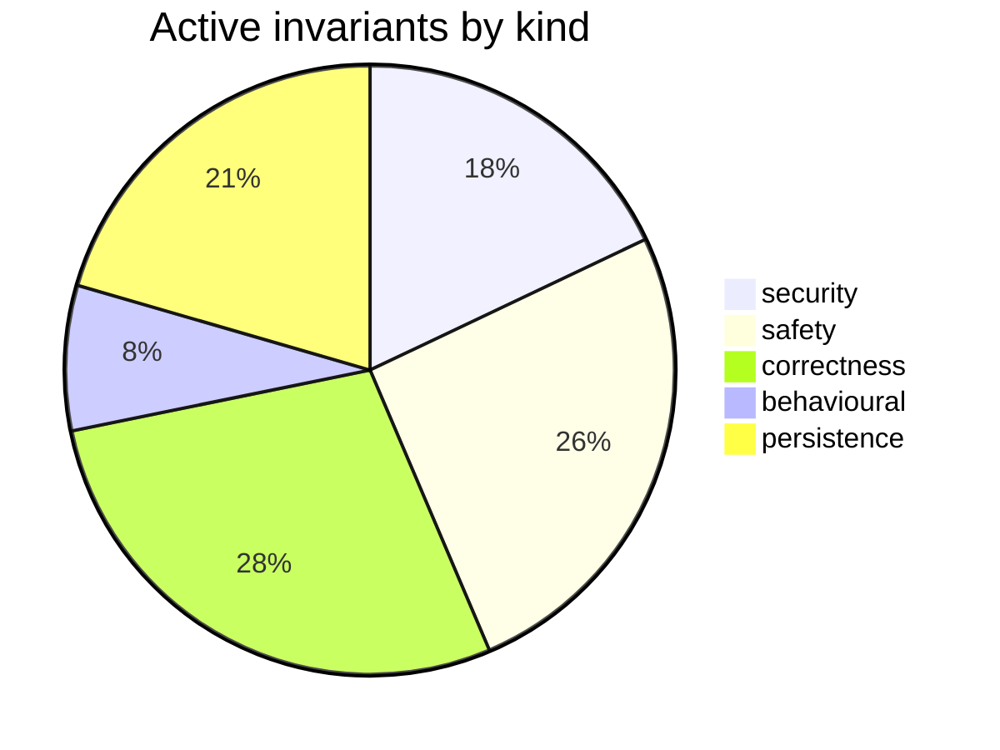

# Requirements Map — claude-engineering-skills

_Generated from `.requirements/ledger.json` — 376 requirement(s) across 34 file(s). Do not hand-edit; regenerate with `node scripts/requirements.mjs render`._

## At a glance

| Status | Count |
|---|---|
| 🟢 active — enforced by /audit-code | 39 |
| 🟡 needs-review — awaiting your call | 16 |
| ⚪ inferred-only — refine backlog | 321 |

## 🟡 Needs review (16)

| Gap | Assertion | Files |
|---|---|---|
| contradictory | The Round 2 system prompt is always composed from the fixed Round 2 verification modifier, the supplied rulings block, and the supplied pass rubric in that order. | scripts/lib/ledger.mjs |
| contradictory | Audit prompt construction must keep the system prompt and first user message byte-stable across rounds by placing round modifiers and prior rulings only in a later dynamic message. | scripts/lib/audit/prompt-builder.mjs |
| observed-but-unintended | Rulings blocks must return an empty string for missing or unparsable ledgers, include only entries for the requested pass, group dismissed, severity-adjusted, and fixed-or-verified entries, and cap th | scripts/lib/ledger.mjs |
| observed-but-unintended | Verification results are added as sibling verification objects on copied findings, and refuted findings receive verdictSeverity LOW and countsTowardVerdict false while non-refuted findings preserve or | scripts/lib/audit/finding-verification.mjs |
| untested | A quickfix pattern is skipped only when its acceptance rate is strictly below the configured skip threshold and its total hit count is at least the configured minimum hit count. | scripts/lib/learning/quickfix-stats.mjs |
| contradictory | Round 2+ system prompts must prepend the fixed R2_ROUND_MODIFIER, include the supplied rulings block, and append the pass rubric under a PASS RUBRIC heading. | scripts/lib/ledger.mjs |
| observed-but-unintended | Finding metadata population must extract normalized file references from section text, set _primaryFile to the first extracted file or normalized section prefix, set affectedFiles to all extracted fil | scripts/lib/ledger.mjs |
| observed-but-unintended | Bare cited tokens must be treated as symbols only when they are identifier-shaped and the finding context mentions symbol, export, function, class, const, variable, method, interface, or type; otherwi | scripts/lib/audit/finding-verification.mjs |
| observed-but-unintended | Topic IDs must be deterministic 12-character lowercase SHA-256 hex prefixes derived from normalized file, normalized principle prefix, normalized category with bracket tags removed, pass name, and the | scripts/lib/ledger.mjs |
| observed-but-unintended | Batch upserts of an existing topicId must preserve the existing adjudicationOutcome, remediationState, ruling, rulingRationale, and firstSeenRound while updating latest finding detail, severity, lates | scripts/lib/ledger.mjs |
| observed-but-unintended | Topic IDs are generated as 12-character SHA-256 hex prefixes from normalized primary file, normalized principle prefix, normalized category with bracket tags removed, pass name, and semantic content h | scripts/lib/ledger.mjs |
| contradictory | False-positive pattern rows must use GLOBAL_REPO_ID rather than null whenever the supplied repository identity is absent or not a UUID. | scripts/lib/store/bandit-fp.mjs |
| untested | The quickfix-hit drain cursor must not advance beyond an incomplete trailing JSONL record or the first record whose parsing or cloud insertion fails. | scripts/learning/backfill-outcomes.mjs |
| untested | A quickfix pattern may be skipped only when its acceptance rate is strictly below the configured skip threshold and its total hit count is at least the configured minimum hit count. | scripts/lib/learning/quickfix-stats.mjs |
| contradictory | False-positive pattern synchronization must refuse to write unless `repoId` is a UUID, preventing unresolved repository identities from being persisted under the global repository sentinel. | scripts/lib/store/bandit-fp.mjs |
| contradictory | False-positive pattern synchronization must refuse to write any patterns unless repoId is a UUID, preventing unresolved repository data from being persisted as global data. | scripts/lib/store/bandit-fp.mjs |

## 🟢 Active invariants — by kind

### security (7)

| ID | Assertion | Governs |
|---|---|---|
| `REQ-security-77000278` | A single unlocked fix may be retrieved only by a query constrained to both the requesting repo ID and the audit finding ID. | scripts/lib/store/plans-ship.mjs |
| `REQ-security-9967f76c` | Artifact content must be read from the canonical path approved by the sensitivity gate rather than from the user-visible path. | scripts/lib/brainstorm/artifact-context.mjs |
| `REQ-security-9bf959ef` | Envelope fingerprints used as filenames must be safe basenames limited to 128 characters of `[A-Za-z0-9._-]` and must reject path traversal and Windows reserved device names. | scripts/lib/outbox-envelope.mjs |
| `REQ-security-b0b533cc` | Extraction must redact secret-shaped content from every file body before including it in an LLM request. | scripts/lib/requirements/extract.mjs, scripts/lib/sensitive-egress-gate.mjs |
| `REQ-security-b6cfe447` | Extraction must reject both lexically sensitive paths and symlink targets that resolve to sensitive paths before sending content to the LLM. | scripts/lib/requirements/extract.mjs, scripts/lib/sensitive-egress-gate.mjs |
| `REQ-security-d55680e9` | Extraction must reject any requested file path that escapes the repo root before reading or sending file content. | scripts/lib/requirements/extract.mjs |
| `REQ-security-dbe740a4` | The file-state outcome detector must not read a path that is absolute, drive-qualified, contains a parent-directory segment, or resolves outside the repository root. | scripts/learning/backfill-outcomes.mjs |

### safety (10)

| ID | Assertion | Governs |
|---|---|---|
| `REQ-safety-1522cf47` | Unlocked-fix and unremediated-acceptance nudge readers must use a positive bounded page size with a default of 20 and a maximum of 200. | scripts/lib/store/plans-ship.mjs |
| `REQ-safety-2c13bda8` | A shadow final-review persistence failure must not roll back or remove successfully persisted primary final-review findings, and shadow findings must not be written when primary replacement fails. | scripts/lib/store/runs-findings.mjs |
| `REQ-safety-3426cda9` | A cloud quickfix-statistics rebuild must not write a cache when cloud storage is disabled, and must return an explicit cloud-disabled failure result. | scripts/lib/learning/quickfix-stats.mjs |
| `REQ-safety-582db962` | Loading the requirements ledger must never throw and must return an empty ledger when the persisted file is absent, unreadable, invalid JSON, or schema-invalid. | scripts/lib/requirements/ledger.mjs |
| `REQ-safety-61f6d34b` | CLAUDE.md auto-fix must modify only fixable `stale/file-ref` findings whose referenced markdown link occupies the entire line or list-item line, and must leave embedded prose references unchanged. | scripts/lib/claudemd/autofix.mjs |
| `REQ-safety-6c77c203` | Promoting a persona-consistency candidate must validate its witness snapshot, contradiction payload, and non-empty journey steps before rendering or persisting a locked regression spec. | scripts/persona-consistency-promote.mjs |
| `REQ-safety-6df1ce27` | False-positive pattern reads must request one row beyond the configured per-scope limit and mark atLimit true only when more rows than the limit are returned. | scripts/lib/store/bandit-fp.mjs |
| `REQ-safety-7cae6bdc` | The memory-health process must exit with code 1 when any metric trigger fires, when an alarming protected friction cluster exists, or when the friction subsystem fails unexpectedly. | scripts/memory-health.mjs |
| `REQ-safety-8a426fab` | Record-time semantic suppression must only exclude merged-pass findings that are semantic re-raises of open findings from another run in the same repository, and any suppression failure or unavailable | scripts/lib/store/runs-findings.mjs |
| `REQ-safety-9272a416` | Session loading must exclude malformed, structurally invalid, and unsupported future-schema records from returned rounds while preserving them in a capped quarantine ledger on a best-effort basis. | scripts/lib/brainstorm/session-store.mjs |

### correctness (11)

| ID | Assertion | Governs |
|---|---|---|
| `REQ-correctness-0cf9914c` | Final-review adjudication and remediation writes must report failure when their target update affects zero rows rather than reporting success. | scripts/lib/store/runs-findings.mjs |
| `REQ-correctness-33740d62` | readShipEvents must return outcome aggregates and recent events scoped to the requested repository, with recent events ordered newest first and bounded by the requested limit. | scripts/lib/store/plans-ship.mjs |
| `REQ-correctness-4b5c16f5` | getCandidateAuditFindings must select at most the requested number of newest audit runs for the repository that have findings and are either within sinceDays or exactly match exactCommitSha, then retu | scripts/lib/store/plans-ship.mjs |
| `REQ-correctness-5ec9f123` | Merged candidates must count `seenInRuns` by distinct successful runs and assign high confidence only when seen in every successful run. | scripts/lib/requirements/extract.mjs |
| `REQ-correctness-7760877a` | Quickfix aggregate statistics must count every decision with a pattern toward totalHits while counting only accept outcomes as alpha evidence and suppress or ignore outcomes as beta evidence. | scripts/lib/learning/quickfix-stats.mjs |
| `REQ-correctness-789d164f` | When inserting a run row containing selector_policy_violations fails solely because that column is undefined (PostgreSQL 42703), the insert must retry once without that field, while all other insertio | scripts/lib/store/plans-ship.mjs |
| `REQ-correctness-a8781f0f` | Batch ledger writes validate every input entry with BatchLedgerEntrySchema and return invalid entries in rejected with a reason instead of silently dropping them. | scripts/lib/ledger.mjs |
| `REQ-correctness-ac331781` | countUnremediatedAcceptances must return total, code, and plan counts for open dispositions, using unremediated_acceptances_all only when allAges is requested and otherwise using the windowed unremedi | scripts/lib/store/plans-ship.mjs |
| `REQ-correctness-b751155f` | Requirement merge clustering must only merge items of the same kind whose normalized assertions have Jaccard similarity of at least 0.6. | scripts/lib/requirements/extract.mjs |
| `REQ-correctness-d6e2938f` | The memory-health process must exit with code 2 when its required database configuration is absent or the memory-health RPC cannot provide metrics. | scripts/memory-health.mjs |
| `REQ-correctness-ee3e0ea0` | Recording a final-review fix must reject dismissed findings and must only persist terminal remediation states of fixed, verified, or regressed. | scripts/lib/store/runs-findings.mjs |

### behavioural (3)

| ID | Assertion | Governs |
|---|---|---|
| `REQ-behavioural-0e8cfd16` | A drift score at or below half the configured threshold must classify as GREEN, a score above half and at or below the threshold as AMBER, and a score above the threshold as RED. | scripts/symbol-index/drift.mjs |
| `REQ-behavioural-27a17fcf` | LLM JSON parsing must prefer the first fenced JSON block found anywhere in the response and otherwise parse the trimmed raw response. | scripts/lib/requirements/llm-json.mjs |
| `REQ-behavioural-881aab25` | Suppression considers session ledger entries only when adjudicationOutcome is dismissed or remediationState is fixed or verified, and considers debt entries only when they are not escalated. | scripts/lib/ledger.mjs |

### persistence (8)

| ID | Assertion | Governs |
|---|---|---|
| `REQ-persistence-18856855` | When a local telemetry write cannot reach cloud storage, the decision must be atomically written to the outbox or retained in memory for retry rather than silently discarded. | scripts/lib/learning/decision-logger.mjs |
| `REQ-persistence-4fe59d3a` | Writing a correlation with an auditFindingId must transactionally remove any null-audit_finding_id audit-missed correlation for the same persona session and finding hash before upserting the real matc | scripts/lib/store/plans-ship.mjs |
| `REQ-persistence-522bfd34` | recordPlanVerificationItems must retry once without the skipped column only when the initial insert fails with PostgreSQL undefined-column error 42703, preserving all other per-item fields. | scripts/lib/store/plans-ship.mjs |
| `REQ-persistence-6623d196` | A file may be reported in extraction `coveredFiles` only if at least one LLM batch containing that file succeeded. | scripts/lib/requirements/extract.mjs |
| `REQ-persistence-95ab6a1f` | Save mode must reject saving an insight unless the specified session exists and contains the specified round. | scripts/brainstorm-round.mjs |
| `REQ-persistence-9c23f3e5` | A persona-consistency promotion must durably journal its intended file and candidate transition before writing the temporary spec file or requesting the database candidate-to-locked transition. | scripts/persona-consistency-promote.mjs |
| `REQ-persistence-cac6fd0f` | Quickfix statistics cache writes must be atomic so concurrent readers cannot observe a partially written cache file. | scripts/lib/learning/quickfix-stats.mjs |
| `REQ-persistence-d8f9613d` | Atomic writes must write to a same-directory temporary file and then rename it into place, deleting the temporary file on write or rename failure when possible. | scripts/lib/file-io.mjs |

## By file

| File | 🟢 | 🟡 | ⚪ |
|---|--:|--:|--:|
| `scripts/brainstorm-round.mjs` | 1 | 0 | 10 |
| `scripts/learning/backfill-outcomes.mjs` | 1 | 1 | 15 |
| `scripts/lib/audit-store-writers.mjs` | 0 | 0 | 5 |
| `scripts/lib/audit/finding-verification.mjs` | 0 | 2 | 18 |
| `scripts/lib/audit/prompt-builder.mjs` | 0 | 1 | 2 |
| `scripts/lib/brainstorm/artifact-context.mjs` | 1 | 0 | 10 |
| `scripts/lib/brainstorm/policy-context.mjs` | 0 | 0 | 3 |
| `scripts/lib/brainstorm/resume-context.mjs` | 0 | 0 | 4 |
| `scripts/lib/brainstorm/session-store.mjs` | 1 | 0 | 3 |
| `scripts/lib/claudemd/autofix.mjs` | 1 | 0 | 0 |
| `scripts/lib/duplicate-justification-pragma.mjs` | 0 | 0 | 8 |
| `scripts/lib/durable-write.mjs` | 0 | 0 | 19 |
| `scripts/lib/file-io.mjs` | 1 | 0 | 2 |
| `scripts/lib/file-lock.mjs` | 0 | 0 | 5 |
| `scripts/lib/learning/decision-logger.mjs` | 1 | 0 | 6 |
| `scripts/lib/learning/quickfix-stats.mjs` | 3 | 2 | 4 |
| `scripts/lib/ledger.mjs` | 2 | 7 | 26 |
| `scripts/lib/outbox-envelope.mjs` | 1 | 0 | 11 |
| `scripts/lib/requirements/context.mjs` | 0 | 0 | 4 |
| `scripts/lib/requirements/extract.mjs` | 6 | 0 | 9 |
| `scripts/lib/requirements/gap-challenge.mjs` | 0 | 0 | 6 |
| `scripts/lib/requirements/ledger.mjs` | 1 | 0 | 14 |
| `scripts/lib/requirements/llm-json.mjs` | 1 | 0 | 0 |
| `scripts/lib/requirements/schema.mjs` | 0 | 0 | 11 |
| `scripts/lib/sensitive-egress-gate.mjs` | 2 | 0 | 0 |
| `scripts/lib/store/arch/symbols.mjs` | 0 | 0 | 5 |
| `scripts/lib/store/bandit-fp.mjs` | 1 | 3 | 23 |
| `scripts/lib/store/plans-ship.mjs` | 8 | 0 | 47 |
| `scripts/lib/store/runs-findings.mjs` | 4 | 0 | 48 |
| `scripts/lib/symbol-index/stale-pragma-sweep.mjs` | 0 | 0 | 0 |
| `scripts/memory-health.mjs` | 2 | 0 | 5 |
| `scripts/persona-consistency-promote.mjs` | 2 | 0 | 7 |
| `scripts/symbol-index/drift.mjs` | 1 | 0 | 3 |
| `scripts/symbol-index/refresh.mjs` | 0 | 0 | 4 |
