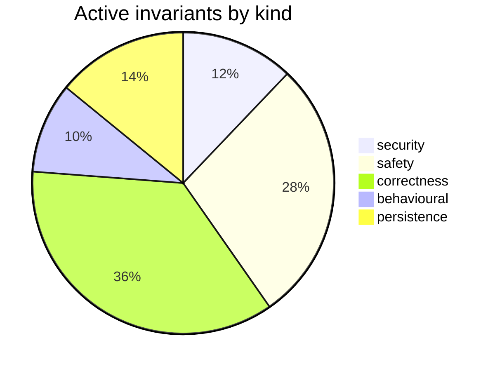

# Requirements Map — claude-engineering-skills

_Generated from `.requirements/ledger.json` — 4168 requirement(s) across 594 file(s). Do not hand-edit; regenerate with `node scripts/requirements.mjs render`._

## At a glance

| Status | Count |
|---|---|
| 🟢 active — enforced by /audit-code | 454 |
| 🟡 needs-review — awaiting your call | 27 |
| ⚪ inferred-only — refine backlog | 3687 |

## 🟡 Needs review (27)

| Gap | Assertion | Files |
|---|---|---|
| contradictory | Plan discovery must scan both docs/plans and docs/completed, include a Markdown file when it has a Status line or a first H1 matching "Plan:", and exclude filenames matching -audit-summary regardless | scripts/lib/dashboard/collect-reference.mjs |
| contradictory | Plan discovery must scan both docs/plans and docs/completed, exclude Markdown files whose names match -audit-summary, and include a document as a plan only when it has a parseable Status-line presence | scripts/lib/dashboard/collect-reference.mjs |
| observed-but-unintended | The shared glob matcher must preserve its current `**` behavior in which `**/` requires a slash and therefore does not match an empty directory segment. | scripts/lib/glob-match.mjs |
| observed-but-unintended | The shared glob matcher must preserve its current `**/` semantics in which the slash remains mandatory and therefore `src/**/*.js` does not match `src/file.js`. | scripts/lib/glob-match.mjs |
| contradictory | A snapshot must be considered complete only when every declared non-replicate arm has a live arm-run without an error for that snapshot. | scripts/lib/store/campaign.mjs |
| untested | Optional numeric configuration values processed by clampConfigNumber must return their fallback for absent, empty, whitespace-only, malformed, or non-finite inputs, and must clamp finite out-of-range | scripts/lib/config.mjs |
| untested | When inserting a run row fails specifically because selector_policy_violations is an undefined column, the insert must be retried once without that field, while all other errors must propagate. | scripts/lib/store/plans-ship.mjs |
| contradictory | An arm must be marked replicate when and only when it is not a scored campaign arm. | scripts/lib/bakeoff/arms.mjs |
| untested | Every persisted finding must have a deterministic fingerprint derived from its supplied `_hash` or from its severity, category, section, primary file, and detail, so distinct hashless findings do not | scripts/lib/store/runs-findings.mjs |
| contradictory | A modified, renamed, or copied symbol must be considered changed only when a base-side symbol with the same file identity, name, and kind has a different body-aware signature hash. | scripts/lib/audit/duplication-detector.mjs |
| contradictory | A snapshot may count as complete only when it has contract epoch e3-scoped-envelope and every scoped arm completed without error, with solo arms evidenced by primaryVerdict and non-solo arms evidenced | scripts/lib/bakeoff/summary.mjs, scripts/lib/bakeoff/log.mjs |
| contradictory | A modified, renamed, or copied symbol must be considered a duplication candidate only when no base symbol with the same name and kind exists or its body-aware signature hash differs from the current s | scripts/lib/audit/duplication-detector.mjs |
| untested | A persisted false-positive pattern must set auto_suppress only when its accepted plus dismissed count meets learningConfig.minFpSamples and its EMA is below 0.15. | scripts/lib/store/bandit-fp.mjs |
| untested | A false-positive pattern may be marked auto_suppress only when its accepted-plus-dismissed sample count meets learningConfig.minFpSamples and its EMA is below 0.15. | scripts/lib/store/bandit-fp.mjs |
| untested | A pass-selection decision with findings but no adjudicated findings must remain unresolved, while a zero-finding run must resolve as `low-yield` with reward zero. | scripts/learning/backfill-outcomes.mjs |
| contradictory | Envelope scope resolution must accept only full, thin, or gap after trimming and case-normalizing input, prioritize CLI scope over environment scope, and otherwise default to full. | scripts/lib/final-review/scope.mjs |
| contradictory | An arm is scored only when its type is neither replicate nor control. | scripts/lib/comparison/arms.mjs |
| contradictory | Purpose-health query windows must be finite integer day counts clamped to the inclusive range 1 through 365, defaulting to 30 days for invalid input. | scripts/lib/store/purpose-health.mjs |
| contradictory | A snapshot must count as complete only if it has contractEpoch e3-scoped-envelope and every scoped arm successfully ran, with solo arms requiring a primary verdict and non-solo arms requiring shadowSt | scripts/lib/bakeoff/summary.mjs, scripts/lib/bakeoff/log.mjs |
| untested | recordPlanVerificationItems must retry once without the skipped column only when the initial insert fails with PostgreSQL error code 42703, preserving per-criterion persistence for databases predating | scripts/lib/store/plans-ship.mjs |
| untested | When a cloud run ID is available, final-review persistence must record the primary verdict and primary findings regardless of whether the shadow reviewer is skipped or fails, while shadow findings and | scripts/gemini-review.mjs |
| untested | recordPlanVerificationItems may retry without the skipped column only when the initial insert fails with PostgreSQL undefined-column error 42703, preserving all other criterion fields for older schema | scripts/lib/store/plans-ship.mjs |
| contradictory | An adjudication event must delete prior finding_adjudication_events, insert the replacement event, and update the corresponding audit_findings denormalized outcome patch within one transaction. | scripts/lib/store/runs-findings.mjs |
| untested | Collection must refuse a declared preflight artifact unless the artifact exists, its recomputed SHA-256 equals the declared digest, and its disposition is pass. | scripts/lib/bakeoff/spawn.mjs |
| contradictory | Envelope scope resolution must accept only full, thin, or gap; prefer a nonblank CLI scope over a nonblank environment scope; and report a supplied invalid scope with ok:false instead of silently trea | scripts/lib/final-review/scope.mjs |
| contradictory | Purpose-health windowDays must be converted to a floored integer bounded from 1 through 365 before it is used in database queries. | scripts/lib/store/purpose-health.mjs |
| untested | A quickfix pattern may be skipped only when its numeric acceptance rate is below the configured threshold and its total hit count is at least the configured minimum. | scripts/lib/learning/quickfix-stats.mjs |

## 🟢 Active invariants — by kind

### security (55)

| ID | Assertion | Governs |
|---|---|---|
| `REQ-security-07490936` | Gate-evidence markers must only be published for completed cloud-backed code audits with a valid run ID, valid audited tree identity, parseable timestamp, and an explicit non-empty branch name or expl | scripts/lib/audit/gate-evidence.mjs |
| `REQ-security-079d7df9` | Audit context construction must exclude sensitive paths, reject paths whose resolved real location escapes the resolved working-directory boundary, and skip non-files or files larger than 2 MiB. | scripts/lib/audit-scope.mjs |
| `REQ-security-0fd907d0` | Symbol bodies sent to the summarization LLM must be secret-redacted and capped at 1,500 body characters per symbol. | scripts/symbol-index/summarise.mjs |
| `REQ-security-156f2d53` | Canary loading must reject names containing path separators or '..' and reject both canary directories and canary files whose resolved real paths escape the resolved repository root or canary director | scripts/lib/persona-test/canary.mjs |
| `REQ-security-22514789` | Arm-evaluation leaderboard and decision-session reads must require either a repository scope or an explicit allRepos opt-in so cross-repository aggregation is never the default. | scripts/lib/store/arm-eval.mjs |
| `REQ-security-265e630e` | Requirement extraction must reject any requested file whose lexical path or resolved symlink target is outside the resolved repository root before reading or sending its content to the LLM. | scripts/lib/requirements/extract.mjs |
| `REQ-security-27bc9bc0` | Sandbox checks must receive a Git environment sanitized relative to the repository root rather than inherited hook Git variables. | scripts/prepush-check.mjs |
| `REQ-security-2b8a1149` | Referenced instruction-file paths that resolve outside the repository must be skipped as escapes rather than checked against the filesystem. | scripts/lib/claudemd/ref-checker.mjs |
| `REQ-security-2c7ad64e` | In default LLM debt-review mode, entries marked sensitive must be excluded from the external LLM payload unless the caller supplies --include-sensitive. | scripts/debt-review.mjs |
| `REQ-security-2e4fa3ca` | The CLI flag gate must refuse discovered symlink paths rather than reading the file to which they resolve. | scripts/check-cli-flags.mjs |
| `REQ-security-30d78abf` | Duplication analysis must reject an unsafe audit base revision without extracting symbols or querying similarity data. | scripts/lib/audit/duplication-detector.mjs |
| `REQ-security-30f50942` | Stored persona click-path URLs must exclude origins and non-HTTP(S) schemes, collapse secret-shaped or auth-adjacent path segments to :param, and redact query or fragment values except short non-secre | scripts/lib/store/persona.mjs |
| `REQ-security-3530ff01` | The blind worksheet query must not select source_model and must return worksheet rows in a deterministic HMAC-seeded shuffle rather than insertion or arm order. | scripts/lib/store/campaign.mjs |
| `REQ-security-367913bb` | Duplication analysis must not read or report a candidate when either the candidate path or its highest-ranked matching path is classified as sensitive. | scripts/lib/audit/duplication-detector.mjs |
| `REQ-security-37c5143c` | Each OSS structured-output request must pass sensitive-egress validation both for its messages and for the complete final request parameters before the provider call, and an egress-gate refusal must b | scripts/lib/oss-structured-output.mjs |
| `REQ-security-3806b96d` | Security-incident content containing any configured high-confidence secret pattern must be refused without returning content and must produce a `refused_secret` event for each detected hit. | scripts/lib/security/secret-classifier.mjs |
| `REQ-security-44063ee3` | Permitted brainstorming artifacts must have detected secrets redacted before attachment and must be truncated to the configured per-artifact token budget. | scripts/lib/brainstorm/artifact-context.mjs |
| `REQ-security-48b7edbf` | Derived primary-mode arms must explicitly clear FINAL_REVIEW_SHADOW and run as solo arms so ambient operator environment variables cannot attach a shadow reviewer. | scripts/lib/bakeoff/arms.mjs |
| `REQ-security-497c37f8` | Before quickfix-hit context is sent to the learning store, both the source file value and snippet must be redacted for secrets. | scripts/learning/backfill-outcomes.mjs |
| `REQ-security-50fc2c3a` | Before any commit diff is sent to an external model, files classified as sensitive or generated noise must be excluded, remaining diff content must be secret-redacted, and the resulting payload must p | scripts/solo-control-audit.mjs |
| `REQ-security-58aeb620` | Quickfix pattern matching must return no findings for a nonempty file path classified as sensitive, without providing a caller-controlled bypass. | scripts/lib/quickfix-patterns.mjs |
| `REQ-security-5a2f921e` | RETURNING projections must accept only true, '*', or a non-empty array of quoted column identifiers and must reject raw SQL expression strings. | scripts/lib/db/query.mjs |
| `REQ-security-5f25bb2b` | Defect harvesting must exclude sensitive, generated, and binary files from candidate file lists. | scripts/defect-harvest.mjs |
| `REQ-security-6143a859` | Dashboard values rendered into HTML element content or quoted attributes must escape ampersands, angle brackets, double quotes, and single quotes. | scripts/lib/dashboard/helpers.mjs |
| `REQ-security-627d39d5` | The assembled final-review user prompt must be secret-redacted before it is sent through any provider transport. | scripts/gemini-review.mjs |
| `REQ-security-63db4683` | In diagnostic mode, the RLS checker must exit 1 whenever any ordinary table in the public schema has row-level security disabled. | scripts/check-rls.mjs |
| `REQ-security-669edab0` | Imports from a scanned spec or in-test-root helper must be reported as app-module-import violations when they resolve outside the resolved test root, are absolute or URL imports, or are non-literal dy | scripts/lib/ux-lock/selector-policy.mjs |
| `REQ-security-67e0e4ca` | Candidate statement and condition excerpts that trigger the egress payload scanner must be withheld from candidate payloads and recorded as incompleteness instead of emitted verbatim. | scripts/lib/audit/adjacency-detector.mjs |
| `REQ-security-681ec9a3` | A predicate exception must not abort routing or demote a finding, and its recorded diagnostic message must be secret-redacted and capped at 200 characters. | scripts/lib/security/triage-router.mjs |
| `REQ-security-6f64c388` | Intent-normalization cache keys must incorporate the redacted intent, normalizer ID, and a hash derived from the current normalization prompt. | scripts/lib/arch-memory/normalize-intent.mjs |
| `REQ-security-72b6bd5c` | Visual finding explanations must send screenshot pixels to the model only when both screenshot permission is enabled and a crop path is supplied. | scripts/lib/visual/explain.mjs |
| `REQ-security-7a2fa5cd` | The dashboard server must refuse any requested file whose realpath is outside the dashboard root realpath, including files reached through symlinks. | scripts/lib/dashboard/serve.mjs |
| `REQ-security-7ae36156` | Managed relative destinations must be rejected if they are absolute, lexically escape their canonical root, equal the root itself, or traverse an existing symlink or reparse point. | scripts/lib/install/safe-destination.mjs |
| `REQ-security-7eeed0d0` | The `fixture` provider shall be accepted only when `NODE_ENV` is `test` and shall bypass real provider-client construction and network calls. | scripts/gemini-review.mjs |
| `REQ-security-88e5e5bf` | All campaign lock and receipt paths derived from campaign-controlled identifiers must resolve within the repository root before they are read or written. | scripts/lib/campaign/lock.mjs |
| `REQ-security-898b8554` | Error details emitted in telemetry source statuses must be passed through redactSecrets before being returned to the dashboard. | scripts/lib/dashboard/collect-telemetry.mjs |
| `REQ-security-898dc299` | Extraction must emit an unnamed progress record before processing every candidate file and may attach a file path to progress only after that path has passed file admission. | scripts/symbol-index/extract.mjs |
| `REQ-security-91d05172` | Free-text labels rendered into shell command lines must be reduced to one line and replace ASCII single quotes with typographic right quotes before quoting. | scripts/lib/shell-quote.mjs |
| `REQ-security-98f3f219` | JSON embedded in dashboard script blocks must escape HTML-significant characters and Unicode line separators so serialized content cannot terminate the script block. | scripts/lib/dashboard/helpers.mjs |
| `REQ-security-9bf959ef` | Outbox envelope fingerprints used as filenames must be safe 1-to-128-character basenames and must reject traversal names and Windows reserved device names. | scripts/lib/outbox-envelope.mjs |
| `REQ-security-9db9f881` | Adjacency analysis must not read or report source content from paths classified as sensitive. | scripts/lib/audit/adjacency-detector.mjs |
| `REQ-security-b0b533cc` | Requirement extraction must redact secret-shaped content from every accepted source file before including that file body in an LLM extraction prompt. | scripts/lib/requirements/extract.mjs |
| `REQ-security-b458d9df` | The SAST triage CLI must ingest SARIF only from a supplied file and must not execute a scanner or model provider. | scripts/security-triage.mjs |
| `REQ-security-b55c2488` | Shadow observations returned for a model-evaluation run must be restricted to that run and supplied repository and ordered by creation time. | scripts/lib/model-eval/finalize-shadow-eval.mjs |
| `REQ-security-b7799f7d` | Session identifiers used for session, lock, or quarantine paths must be non-empty strings of 1–64 ASCII alphanumeric, dot, underscore, or hyphen characters, and invalid identifiers must throw an error | scripts/lib/brainstorm/id-validator.mjs |
| `REQ-security-bb14776b` | Presented audit findings must derive severity CSS classes and data-severity tokens only from the fixed HIGH, MEDIUM, and LOW mapping, with unknown severities rendered using the LOW token/class fallbac | scripts/lib/dashboard/audit-run-presenter.mjs |
| `REQ-security-c19419b0` | The existence-verification gate must not adjudicate cited sensitive paths, absolute paths, external dependencies, or symbol/export claims, and must mark them requires_verification instead. | scripts/lib/audit/finding-verification.mjs |
| `REQ-security-cbca2f94` | Unless redactor:null is explicitly requested, all outbound system strings and text message content sent through SDK, Bedrock, or CLI clients must be transformed by the configured redactor before egres | scripts/lib/anthropic-client.mjs |
| `REQ-security-d137e6f3` | Annotated audit context must redact secret-shaped content by default before applying diff annotation or truncation. | scripts/lib/diff-annotation.mjs |
| `REQ-security-dbe740a4` | A quickfix outcome detector must refuse to read a context-supplied file path that is absolute, drive-qualified, contains `..` traversal, or resolves outside the repository root. | scripts/learning/backfill-outcomes.mjs |
| `REQ-security-df938c68` | Cross-repository unlocked-fix and unremediated-acceptance readers must require either a non-empty repository scope or an explicit allRepos:true scope, and must reject ambiguous or omitted scope. | scripts/lib/store/plans-ship.mjs |
| `REQ-security-e792c6d3` | Azure Doctor must reject every user-supplied deployment candidate that is not 1 to 64 ASCII alphanumeric, period, hyphen, or underscore characters before invoking provider selection. | scripts/azure-doctor.mjs |
| `REQ-security-ea523d66` | Efficacy lint file discovery must not follow symbolic links or read files classified as sensitive even when configured globs match them. | scripts/lib/efficacy-lints.mjs |
| `REQ-security-eaac6be2` | Persisted provider-readiness messages and codes must be redacted before classification results are returned, and redaction failure must produce the fixed [REDACTED:redaction-failed] marker rather than | scripts/lib/audit/provider-readiness.mjs |
| `REQ-security-ec84be21` | Live navigation target normalization must exclude mailto, tel, javascript, bare same-page hash, and cross-origin absolute links from internal navigation destinations. | scripts/lib/nav/verify.mjs |

### safety (128)

| ID | Assertion | Governs |
|---|---|---|
| `REQ-safety-01c256d4` | Every adjacency incompleteness record in the composed result must produce a separate control finding regardless of the result state label. | scripts/lib/audit/adjacency-compose.mjs |
| `REQ-safety-01eb82f9` | Branch-protection strengthening must modify only existing required-status-check rules that are not already strict and must not create protection where no such rule exists. | scripts/lib/branch-protection.mjs |
| `REQ-safety-047e156d` | Unreadable or malformed shared environment configuration must be skipped without throwing and may emit at most one warning per process. | scripts/lib/load-shared-env.mjs |
| `REQ-safety-0604c68a` | When --adopt-only is supplied, adoption must abort before recording any ledger rows if any unledgered migration filename is outside the explicitly supplied allowlist. | scripts/setup-postgres.mjs |
| `REQ-safety-069c8c06` | Semantic re-raise suppression may remove only `merged` findings that match existing open findings in another run of the same repository, and any suppression or embedding failure must retain all findin | scripts/lib/store/runs-findings.mjs |
| `REQ-safety-07cf53f7` | Failures to initialize, lock, append, or release the orphan-metrics file are reported to stderr and must not cause either metrics-emission function to reject or abort the audit. | scripts/lib/audit/orphan-metrics.mjs |
| `REQ-safety-084f5d4e` | Network-source automatic capture wait overrides must be positive integers no greater than 30000 milliseconds. | scripts/lib/persona-test/schemas.mjs |
| `REQ-safety-0b7d751b` | Scored manifest arms must execute sequentially rather than concurrently. | scripts/lib/model-eval/manifest-driver.mjs |
| `REQ-safety-0d908809` | A valid Stage 1 dismissal of a HIGH-severity or omission-type candidate must be escalated for Stage 2 review rather than mechanically dismissed. | scripts/lib/audit/stage1-triage.mjs, scripts/lib/audit/final-adjudication.mjs |
| `REQ-safety-0f44caf0` | A clean adjacency result must require at least one enumerated container, at least one judged statement, and no incompleteness records. | scripts/lib/audit/adjacency-state.mjs |
| `REQ-safety-11516d2d` | Record-time semantic suppression failures, missing comparison text, embedding failures, and nearest-neighbour query failures must retain the candidate finding rather than suppress it. | scripts/lib/semantic-suppression.mjs |
| `REQ-safety-123a3864` | Azure Responses-to-chat-completions fallback is permitted only for errors that positively identify the Responses operation as unsupported, while generic 404s, deployment-not-found errors, and all othe | scripts/lib/openai-responses-capability.mjs |
| `REQ-safety-14f81b2d` | When secret redaction removes more than 200 characters from a file, the generated context and stderr output must disclose that the reviewed text was shortened and must warn reviewers not to infer synt | scripts/lib/audit-scope.mjs |
| `REQ-safety-1522cf47` | Unlocked-fix and unremediated-acceptance nudge readers must use bounded pagination with a default limit of 20 and a maximum limit of 200. | scripts/lib/store/plans-ship.mjs |
| `REQ-safety-152853e2` | The triage router must reject a non-array findings collection rather than treating it as an empty successful result. | scripts/lib/security/triage-router.mjs |
| `REQ-safety-185f68a8` | V2 backend and sustainability prompts must require review of cache invalidation for persisted-shape changes, atomicity for changed multi-step writes, valid-zero defaults, fail-closed destructive or pe | scripts/lib/prompt-seeds.mjs |
| `REQ-safety-1c049d78` | A delete with an expected content hash must be skipped and reported as a conflict when the existing target's first twelve SHA-256 hex characters differ from that expected hash. | scripts/lib/install/transaction.mjs |
| `REQ-safety-2136a313` | Arm-eval sessions must refuse execution without an explicit budget cap and must skip execution when cloud storage is disabled. | scripts/lib/arm-eval/run.mjs |
| `REQ-safety-21b4ce06` | Unsupported file extensions must resolve to the explicit "unknown" language profile rather than defaulting to JavaScript or another supported language. | scripts/lib/language-profiles.mjs |
| `REQ-safety-235e5314` | Every final-review provider call must be aborted and rejected after TIMEOUT_MS even when the provider SDK ignores the abort signal. | scripts/gemini-review.mjs |
| `REQ-safety-23d91fd3` | Neighbourhood and duplicate-cluster RPC adapters must return empty arrays and drift-score computation must return `null` without invoking cloud RPCs when cloud support is disabled. | scripts/lib/store/arch/neighbourhood.mjs |
| `REQ-safety-23d9728e` | A code-audit shadow pipeline failure must not alter the legacy audit result or cause the primary audit invocation to fail. | scripts/openai-audit.mjs |
| `REQ-safety-240dc373` | Visual changed-scope resolution must return no blocking findings when changedPaths is null unless allSurfaces is explicitly enabled. | scripts/lib/visual/changed-scope.mjs |
| `REQ-safety-24fa9ccc` | Memory-health metric queries must execute inside a transaction with a positive integer `SET LOCAL statement_timeout`, defaulting to 120000 milliseconds when no valid timeout is supplied. | scripts/lib/db/rpc.mjs |
| `REQ-safety-26a8b4e8` | Each skill root without a gate-contract.json must have a baseline exemption or produce a ratchet divergence. | scripts/lib/gate-honesty/ratchet.mjs |
| `REQ-safety-27432205` | Fresh importer analysis must return null rather than claim independence when the working tree is dirty, the active snapshot does not match the audited commit, the import graph is not fully populated, | scripts/lib/store/arch/imports.mjs |
| `REQ-safety-2b76f5c0` | When persona cloud is enabled, `record-persona-session` must reject a session if canonical repository resolution returns an error rather than persisting an unreconciled `repoId`/`repoName` pair. | scripts/cross-skill.mjs |
| `REQ-safety-2c13bda8` | A shadow final-review persistence failure must not roll back or remove successfully persisted primary final-review findings. | scripts/lib/store/runs-findings.mjs |
| `REQ-safety-2d2a080c` | Coverage configuration values outside their accepted types or ranges must fall back to defaults and emit an `invalid` warning rather than throwing, while unrecognized coverage keys must be ignored wit | scripts/lib/symbol-index/graph-verdict.mjs |
| `REQ-safety-2f0ee7b3` | Architecture-bouncer findings naming a file-like section must be discarded unless that normalized file is a mechanical violation endpoint or an unmapped file, while findings with no file-like section | scripts/lib/audit/legacy-production-audit.mjs |
| `REQ-safety-30730181` | Tailwind TypeScript configuration files must not be executed by token extraction and must instead yield a warning directing callers to a generated JSON token source. | scripts/lib/visual/tokens.mjs |
| `REQ-safety-325874dc` | Unreadable, absent, or empty sync destination content must never be classified as upstream-owned. | scripts/lib/sync-ownership.mjs |
| `REQ-safety-346a2457` | The regression-lock worksheet must not emit a pasteable `lock-with-test` command when the closest same-basename test candidate is classified as belonging to an unrelated module. | scripts/cross-skill.mjs |
| `REQ-safety-361cbaa3` | Persona consistency-mode context creation must reject calls without a resolved repository ID or journey key before any context is returned. | scripts/lib/persona-test/context.mjs |
| `REQ-safety-36fa223b` | The npm-run argument gate must fail in gating mode for any net-new documented npm run command that places a non-native script flag before the bare -- separator. | scripts/check-npm-run-args.mjs |
| `REQ-safety-379eef32` | LLM wrapper calls must return null rather than throw when a provider request, response parse, or schema validation fails, while writing a diagnostic to stderr. | scripts/lib/llm-wrappers.mjs |
| `REQ-safety-38b1baaa` | Adjacency convergence must be blocked whenever the result contains candidates or incompleteness, or has failed or control-unavailable state. | scripts/lib/audit/adjacency-state.mjs |
| `REQ-safety-3c1d2185` | An expected worktree identity must include a full 40-character lowercase SHA-1 head and exactly one ref disposition—an attached safe branch or detached state—and partial, contradictory, or pre-bundle | scripts/lib/worktree-identity.mjs |
| `REQ-safety-3e04e96a` | The test guard reporter must emit a versioned JSON report even when no failures are observed, so a missing report is distinguishable from a clean run. | scripts/lib/test-guard-reporter.mjs |
| `REQ-safety-3f853a53` | Observation-only audit runs must not append outcomes, flush bandit state, synchronize learning data, or backfill learning outcomes unless learningWritesAllowed is true. | scripts/lib/audit/legacy-production-audit.mjs |
| `REQ-safety-421e22b5` | The sync CLI must reject unknown command-line flags before performing any synchronization writes. | scripts/sync-to-repos.mjs |
| `REQ-safety-42ee75a0` | Any campaign containing xAI-routed arms must declare exactly one distinct xAI model and include a passing pre-flight whose model string exactly matches that declared xAI model. | scripts/lib/campaign/config.mjs |
| `REQ-safety-44653f5a` | An exemption for a gate added on or after `2026-07-31` must fail unless it includes a non-empty `policyOverride` reason. | scripts/check-gate-poison-pills.mjs |
| `REQ-safety-44eb551c` | The CLI flag gate must refuse to report success when no candidate scripts were supplied for scanning. | scripts/check-cli-flags.mjs |
| `REQ-safety-46bca8b0` | Strict manifest generation must fail instead of writing a partial manifest when any requested file path is invalid, missing, or not a regular file. | scripts/lib/sync-manifest.mjs |
| `REQ-safety-4a2b1bac` | Strict skill packaging must reject non-allowlisted files, directories, symlinks, and other special filesystem entries except excluded editor/system basenames and a root-level gate-contract.json file. | scripts/lib/skill-packaging.mjs |
| `REQ-safety-4dc07981` | An absent efficacy-lints.config.json must leave efficacy lints disabled by default, while an unreadable, malformed, non-object, or schema-invalid present config must throw rather than silently disable | scripts/lib/efficacy-lints.mjs |
| `REQ-safety-4e288c04` | Intent normalization must truncate input to 2000 characters, truncate provider output to 400 characters, and enforce a 10-second deadline on availability checks, client construction, and provider call | scripts/lib/arch-memory/normalize-intent.mjs |
| `REQ-safety-51d20079` | `contentExistsAtMappedRange` must return `null` rather than infer pre-existence when the base file cannot be resolved, the quote is empty, or the supplied inclusive mapped range is non-integer, invali | scripts/lib/vcs.mjs |
| `REQ-safety-5237b7f2` | Generation must restore the process working directory after an audit attempt, including when the audit pipeline throws. | scripts/lib/model-eval/arm-generation.mjs |
| `REQ-safety-55adff20` | Token-overlap evidence must score zero when either token set is empty or when the smaller token set has fewer than two informative tokens. | scripts/lib/persona/audit-correlator.mjs |
| `REQ-safety-5b0062dd` | Loading domain rules must treat missing or unreadable domain-map configuration as no rules and must exclude malformed rules or domains that do not match the configured domain-name format. | scripts/lib/symbol-index/domain-tagger.mjs |
| `REQ-safety-5b5aee72` | Before writing any consumer files, sync must abort that target when its managed .gitignore or .gitattributes block is malformed or when a trackable destination lacks an EOL pin. | scripts/sync-to-repos.mjs |
| `REQ-safety-5b72f5dd` | Adaptive learners must use their fallback behavior unless the sample count and threshold are both finite non-negative numbers and the sample count is at least the threshold, whose default is 30. | scripts/lib/learning/cold-start.mjs |
| `REQ-safety-5c94ee07` | Each projected finding must cap category and section at 120 characters, file at 400 characters, and detail at 400 characters, while marking ordinary truncation without exceeding the applicable cap. | scripts/lib/final-review/gap-projection.mjs |
| `REQ-safety-5e1e06db` | A finding with no cited source resolvable at its audited revision is recorded as an `unverifiable` `needs_triage` verdict without being sent to the adjudicator model. | scripts/campaign.mjs |
| `REQ-safety-5f362409` | Map-reduce audit execution must limit concurrently active map-unit GPT calls to auditRuntimeConfig.mapReduceConcurrency. | scripts/lib/audit/legacy-production-audit.mjs |
| `REQ-safety-6295f5ef` | The pre-push-hook installer must never overwrite or uninstall an existing pre-push hook unless that hook contains a recognized current or legacy managed-hook marker. | scripts/install-prepush-hook.mjs |
| `REQ-safety-6857facd` | A calibration probe set must contain at least 30 probes, at least 10 relation:"none" hard negatives, at least four nonempty strata, and required identity fields for every positive probe before calibra | scripts/lib/arch-memory/calibrate.mjs |
| `REQ-safety-6b2c9905` | Gate 8 must fail if a skill name deployed by the consumer manifest under `.claude/skills/` also exists under `.github/skills/` or `.agents/skills/`, and must fail if either shadowing surface cannot be | scripts/lib/sync-isolation-verify.mjs |
| `REQ-safety-6b3ec0ef` | Stage-1 triage provider failures or missing provider results must throw rather than fabricate a dismissal result. | scripts/lib/audit/tiered-provider-calls.mjs |
| `REQ-safety-6c77c203` | Promoting a persona-consistency candidate must validate its witness snapshot, contradiction payload, and non-empty journey steps before rendering or persisting a locked regression spec. | scripts/persona-consistency-promote.mjs |
| `REQ-safety-6cfefacf` | Stage 1 triage must be given both an admission budget and a worst-case candidate duration calculated from the `stage1_triage` OSS operation policy. | scripts/lib/audit/tiered-pipeline.mjs |
| `REQ-safety-6d890cab` | Tiered-pipeline provider handles must be constructed only when tiered or shadow mode is enabled and the caller explicitly sets allowTiered, so programmatic callers remain hermetic regardless of enviro | scripts/lib/audit/legacy-production-audit.mjs |
| `REQ-safety-6e8a1b8f` | Repository-context generation must degrade through its defined lower tiers without throwing and must report the first failure reason for the requested tier when degradation occurs. | scripts/lib/repo-context.mjs |
| `REQ-safety-6eb73b41` | The stale-skill-surface check must exit with failure whenever any live or shadowing skill surface cannot be inspected, regardless of whether --gate was supplied. | scripts/check-stale-skill-surface.mjs |
| `REQ-safety-6f5390ed` | Campaign-arm resolution and preflight-artifact verification must succeed before the collector creates its output directory or spawns any provider arm. | scripts/bakeoff-collect.mjs |
| `REQ-safety-70ebe070` | A path-scope finding may be demoted to bucket D only when its rule ID has the producer test suffix and its primary repository-relative path matches a configured non-reachable glob. | scripts/lib/security/predicates.mjs |
| `REQ-safety-71e54150` | Failure to construct optional tiered providers must not prevent construction of an audit run context, and Anthropic failures must be represented by classified readiness metadata rather than only a nul | scripts/lib/audit/legacy-production-audit.mjs |
| `REQ-safety-7347992f` | A missing, unreadable, cloud-disabled, or schema-invalid stored coverage record must be returned as null rather than as a clean coverage verdict. | scripts/lib/store/arch/coverage.mjs |
| `REQ-safety-73ae816c` | Auditor evaluation must terminate as a preflight failure when any deterministically selected corpus case is unavailable or blocked by the egress gate rather than scoring a reduced sample. | scripts/model-eval-auditor.mjs |
| `REQ-safety-740bd255` | Only a non-empty-reason `@on-conflict-ok` pragma may suppress findings or the `unresolved-conflict-key-nullability` diagnostic, and it must not suppress row-resolution, conflict-target-resolution, par | scripts/lib/lint/on-conflict.mjs |
| `REQ-safety-79792424` | Every OSS request attempt must clear its timeout and heartbeat timers on success, failure, retry, or JSON-schema-to-tool fallback. | scripts/lib/oss-structured-output.mjs |
| `REQ-safety-7cae6bdc` | Memory-health must exit with code 1 if any primary trigger fires, any protected friction cluster is alarming, or the friction-recurrence subsystem fails unexpectedly. | scripts/memory-health.mjs |
| `REQ-safety-802b57eb` | A drain must not process replay artifacts when no writers are registered, cloud access is disabled, provenance cannot be verified, or the drain lock cannot be acquired. | scripts/lib/durable-write.mjs |
| `REQ-safety-82e39e10` | A sanitizer-wrapped finding may be demoted only to bucket C and only when exactly one template literal is found in the sink window, it has at least one supported interpolation, and every interpolation | scripts/lib/security/predicates.mjs |
| `REQ-safety-874d7221` | Legacy-sync removal must abort before deletion when any tracked candidate file has local modifications unless --force-dirty is explicitly supplied. | scripts/lib/remove-legacy-synced.mjs |
| `REQ-safety-8a2d8419` | The memory-health command must exit with code 2 rather than report a healthy result when AUDIT_DB_URL is absent, the metrics RPC returns null, or the metrics RPC call fails. | scripts/memory-health.mjs |
| `REQ-safety-8b327ffd` | Calibration metrics must return verdict unverified rather than a pass or precision result when no probes resolve successfully. | scripts/lib/arch-memory/calibrate.mjs |
| `REQ-safety-8bc91625` | The cheap-triager manifest command must refuse to emit a manifest when the current adjudication dataset hash differs from the worksheet state hash or when no worksheet rows have been graded. | scripts/cheap-triager-validate.mjs |
| `REQ-safety-8bf6fc71` | Plan-derived audit scope must exclude HTTP paths, node_modules paths, and audit-infrastructure files unless allowInfraFiles is explicitly enabled. | scripts/lib/plan-paths.mjs |
| `REQ-safety-928288da` | The refresh CLI must reject every flag not explicitly handled by its parser before performing refresh work. | scripts/symbol-index/refresh-args.mjs |
| `REQ-safety-949daf7a` | A bake-off run must refuse with a non-zero exit when the eligible transcript count is below the configured minimum. | scripts/final-review-bakeoff.mjs |
| `REQ-safety-95acce45` | An in-scope HIGH-severity finding must not be suggested as a deferral candidate. | scripts/lib/debt-capture.mjs |
| `REQ-safety-9e23688e` | Saving an insight must reject session IDs that fail the shared SID validator, non-integer or negative rounds, topics outside 1–200 characters, and insight text outside 1–2000 characters. | scripts/lib/brainstorm/insight-store.mjs |
| `REQ-safety-9ea63031` | Clone updates must use `git pull --ff-only` and must not issue git push, merge, rebase, reset, stash, or force commands. | scripts/update-auditloop.mjs |
| `REQ-safety-9eb53ef5` | Shadow audit contexts must disable ledger, debt-ledger, cloud-recording, and bandit persistence while preserving the original run ID and isolating generatorOutcomes from the real audit context. | scripts/lib/audit/tiered-shadow-compare.mjs |
| `REQ-safety-a0e173f6` | Citation scanning must report malformed pinned citations and all configured document, citation, blob, Git-call, and runtime budget breaches as unresolvable findings rather than silently skipping them. | scripts/lib/doc-citations.mjs |
| `REQ-safety-a23d3dd9` | The audit verdict must be INCOMPLETE if any pass fails or if any map-reduce pass completes fewer than 66% of its map units. | scripts/lib/audit/legacy-production-audit.mjs |
| `REQ-safety-a34d58ab` | The visual audit must reject --full-dom unless --verify <url> is also supplied, exiting with tool-error status 2 rather than performing a silent static-mode no-op. | scripts/visual-audit.mjs |
| `REQ-safety-a9cfe515` | A campaign may be decision-eligible only when its derived state is DECISION_READY and every eligibility gate passes, and an ineligible campaign must expose every failing gate in its watermark. | scripts/lib/campaign/verdict.mjs |
| `REQ-safety-adc74d55` | In default drift mode, on-conflict lint findings must gate only when their locations are changed relative to the resolved or explicitly supplied base, including all lines of untracked files under scri | scripts/on-conflict-lint.mjs |
| `REQ-safety-b13bfbc5` | Migration mode must not apply the compatibility bootstrap when the database auth schema is owned by supabase_admin or supabase_auth_admin. | scripts/setup-postgres.mjs |
| `REQ-safety-b2950d14` | Semantic re-raise suppression may occur only for an above-threshold cosine match to an open finding in the same repository and, when enabled, sharing at least one normalized affected file. | scripts/lib/semantic-suppression.mjs |
| `REQ-safety-b3c5f8cf` | assertKnownFlags() must reject every unrecognized --flag before the POSIX -- terminator by throwing an ArgvError instead of silently ignoring it. | scripts/lib/cli-io.mjs |
| `REQ-safety-b5bcc490` | An installer must not overwrite an existing unmanaged file or a receipt-managed file whose content hash has drifted unless force is explicitly enabled. | scripts/lib/install/conflict-detector.mjs |
| `REQ-safety-bb8b4eee` | A detector check must block convergence when its scope reaches no files, scope census is unavailable, ripgrep fails, or any match lacks a disposition. | scripts/lib/audit/detector.mjs |
| `REQ-safety-bbaf2581` | An adjacency control selected for an audit must report control-unavailable rather than not-applicable when it has zero coverage and input-bound or parse-failure incompleteness prevents inspection. | scripts/lib/audit/adjacency-state.mjs |
| `REQ-safety-be9fb31d` | Campaign arm resolution must reject missing, ambiguous, unknown, or colliding campaign selections rather than falling back to a legacy or default arm set. | scripts/lib/bakeoff/arms.mjs |
| `REQ-safety-c1bd81a8` | A caller requiring an explicit push range must receive an error when no explicit base is provided instead of an inferred, potentially under-scoped range. | scripts/lib/push-range.mjs |
| `REQ-safety-c2a63867` | Architecture-intent configuration loading must fail with `ArchIntentConfigError` when the domain-map file is missing, unreadable as JSON, schema-invalid, or semantically invalid. | scripts/lib/arch-intent/load-config.mjs |
| `REQ-safety-c3c3399c` | Bootstrap mode must refuse to overwrite an existing nav-contract.json unless --force is supplied. | scripts/nav-audit.mjs |
| `REQ-safety-c58e3367` | Every declared arm model must map to an explicitly supported OpenRouter, Anthropic, Gemini, or xAI transport, and unsupported or empty model identifiers must fail before a reviewer subprocess is spawn | scripts/lib/bakeoff/arms.mjs |
| `REQ-safety-ca17791a` | Quickfix minimum-hit values must accept only finite positive integers and otherwise fall back to the supplied default. | scripts/lib/quickfix-policy.mjs |
| `REQ-safety-cacd1ca6` | The managed `.gitignore` rules must ignore all `.audit/` runtime output while destructive post-sync untracking must remain limited to the explicit `UNTRACK_PATTERNS` allowlist and must not broadly unt | scripts/sync-to-repos.mjs |
| `REQ-safety-ccc69841` | Claiming a campaign receipt must exclusively create an intent receipt and must report an existing receipt as already claimed rather than overwrite it. | scripts/lib/campaign/lock.mjs |
| `REQ-safety-cd571bd5` | The final-review hard deadline must be at least two Gemini per-attempt timeouts plus 60000 milliseconds, even when FINAL_REVIEW_HARD_DEADLINE_MS configures a lower value. | scripts/lib/config.mjs |
| `REQ-safety-d003ba72` | The tiered audit pipeline and its shadow comparison must remain independently opt-in and disabled unless their respective environment variables are exactly `true`. | scripts/lib/config.mjs |
| `REQ-safety-d06f0ab9` | The sync process must remove inherited repository-scoped Git environment variables before executing Git commands so Git operations resolve against their explicit working directories. | scripts/sync-to-repos.mjs |
| `REQ-safety-d52e6d6c` | If drift-base resolution or drift computation fails, on-conflict lint must lint and gate the entire store tree rather than report a clean drift-scoped result. | scripts/on-conflict-lint.mjs |
| `REQ-safety-d6685154` | An arm-evaluation arm containing any model that resolves to or is identified as an Anthropic or Claude-family model must be rejected before evaluation. | scripts/lib/arm-eval/experiments.mjs |
| `REQ-safety-dd45733b` | Azure Doctor must preserve the configured embedding deployment and write nothing when probing ends unverified or when no supported candidate is found. | scripts/azure-doctor.mjs |
| `REQ-safety-de6e9566` | A staleness run with no lines, no line dates, or no recognized citations must report an unverifiable reason rather than being considered conclusive. | scripts/lib/context-staleness.mjs |
| `REQ-safety-e157d12b` | Batched symbol embedding persistence must validate every distinct input vector before issuing any database write, so an invalid later vector cannot leave earlier batches persisted. | scripts/lib/store/arch/symbols.mjs |
| `REQ-safety-e51036f9` | Generation arms must reject routes whose transport is not "openai-compatible" before constructing a client or invoking the audit pipeline. | scripts/lib/model-eval/arm-generation.mjs |
| `REQ-safety-e54779e2` | scoreDefectLocalization must reject unsupported match modes and, in fuzzy mode, reject a missing, non-finite, or out-of-range similarity threshold. | scripts/lib/model-eval/deterministic-scorer.mjs |
| `REQ-safety-e5796eb8` | Findings with missing, malformed, or type-incomplete evidence must normalize to evidenceStatus "missing" rather than being treated as commission or omission evidence. | scripts/lib/schemas.mjs |
| `REQ-safety-e58d5fcb` | A worktree identity check must refuse mutation when the live HEAD differs from the expected commit, the attached-versus-detached disposition differs, the attached branch differs, or Git cannot reliabl | scripts/lib/worktree-identity.mjs |
| `REQ-safety-e5c32fe8` | A sync destination file may be classified as upstream-owned only when it contains a non-empty ownership banner marker or is non-empty and byte-identical to a non-empty source payload. | scripts/lib/sync-ownership.mjs |
| `REQ-safety-e91ecad0` | Cost comparison must not select a winner when any floor-clearing arm has unknown cost evidence, and an arm with zero accepted findings must have a null rather than infinite cost-per-accepted value. | scripts/lib/campaign/verdict.mjs |
| `REQ-safety-ec507f1a` | Garbage collection may delete upstream-retired files only from the consumer tooling directory, while retired files in tracked consumer paths must be reported without deletion. | scripts/sync-to-repos.mjs |
| `REQ-safety-eca2c75f` | Cited-source excerpt content must never exceed its effective character budget, including when a single source line exceeds that budget. | scripts/lib/campaign/cited-source.mjs |
| `REQ-safety-ecc5b548` | Replay must treat thrown, non-finite, or otherwise invalid reward-function results as a reward of zero rather than propagating NaN or failing the replay. | scripts/lib/learning/replay.mjs |
| `REQ-safety-f1e456ee` | NUL-delimited git diff and untracked-path output must reject non-empty streams lacking a final NUL or containing empty or incomplete records rather than silently skipping malformed data. | scripts/lib/vcs.mjs |
| `REQ-safety-f32c38e0` | Isolation verification gates that require a manifest must refuse to run when the consumer manifest is missing, unparsable, or invalid under `SyncManifestSchema`. | scripts/lib/sync-isolation-verify.mjs |
| `REQ-safety-f9914ecf` | Quickfix skip thresholds must accept only finite numeric values in the inclusive range 0 through 1 and otherwise fall back to the supplied default. | scripts/lib/quickfix-policy.mjs |
| `REQ-safety-faca1023` | The persona outcome hash backfill must refuse to run unless the live persona finding hash version equals its fixed v2 target version and a repoId is supplied. | scripts/lib/store/persona-outcomes-hash-backfill.mjs |
| `REQ-safety-fea6126d` | Only finding classes in the gate-eligible class set may be eligible to block the visual-audit gate. | scripts/lib/visual/schema.mjs |

### correctness (163)

| ID | Assertion | Governs |
|---|---|---|
| `REQ-correctness-00f6389b` | Navigation destination normalization must map supported dynamic route segment syntaxes to :param while preserving catch-all segments as :rest. | scripts/lib/nav/normalize.mjs |
| `REQ-correctness-035f41e5` | Gemini calls with missing usage metadata must report estimatedCostUsd as null rather than calculate a zero-valued cost. | scripts/lib/brainstorm/gemini-adapter.mjs |
| `REQ-correctness-03ea0400` | Cached intent embeddings must be keyed by redacted intent, active embedding model, active dimension, and normalization provenance so embeddings from different vector-space or normalization modes are n | scripts/lib/neighbourhood-query.mjs |
| `REQ-correctness-03ef38ff` | For repositories declaring app roots, a source path must be assigned to the longest matching normalized app-root prefix, while paths outside declared roots or repositories with no app roots must have | scripts/lib/nav/approot.mjs |
| `REQ-correctness-0430afe4` | Theme geometry drift must only be reported for same-key nodes that are displayed in both compared themes and whose normalized geometry differs by more than the configured tolerance. | scripts/lib/visual/theme-parity.mjs |
| `REQ-correctness-067bf187` | Architecture source-file inventory must classify only files with supported source extensions and must report every such file unmatched by domain rules as unmapped. | scripts/lib/arch-intent/adapter-contract.mjs |
| `REQ-correctness-09b5e7b0` | A generated domain summary must be persisted and returned as fresh only if its trimmed text is between 20 and 400 characters inclusive. | scripts/symbol-index/summarise-domains.mjs |
| `REQ-correctness-0ba476fd` | Cloud adjudication events must identify findings using their fingerprint (_hash or semanticId) rather than the per-run finding id. | scripts/lib/outcome-sync.mjs |
| `REQ-correctness-0e36e24d` | Skill names in a shadowing surface that resolve to the same real filesystem directory as the corresponding live-surface name must be classified as aliased rather than shadowed or orphaned. | scripts/lib/skill-surface-identity.mjs |
| `REQ-correctness-0f549f2b` | Next.js destination discovery must derive routes only from `app/**/page.[jt]sx?` and non-API, non-special `pages/**.[jt]sx?` file paths, never from file contents. | scripts/lib/nav/adapters/next-file.mjs |
| `REQ-correctness-0fc806cb` | The navigation dashboard must reject a static observed envelope whose config digest differs from the digest recomputed from the current navigation contract. | scripts/lib/dashboard/collect-nav.mjs |
| `REQ-correctness-1059fb68` | Similarity-based matched buckets shall be persisted as null when finding matching is disabled rather than as an empty measured result. | scripts/gemini-review.mjs |
| `REQ-correctness-11946457` | Prior-round outcome capture must only derive artifacts from output paths matching the canonical `<sid>-r<round>-result.json` format whose embedded round equals the supplied round. | scripts/lib/finalize-outcomes.mjs |
| `REQ-correctness-149dd3fe` | A parsed plan intent must be marked parseable only when it contains at least one target path and at least one acceptance criterion. | scripts/lib/arm-eval/plan-seed.mjs |
| `REQ-correctness-15a60abf` | Divergence age must be null, not zero or NaN, whenever either the head commit date or first-seen date is unparsable. | scripts/lib/visual/drift.mjs |
| `REQ-correctness-16482795` | Visual node identity must prefer a non-empty `data-visual-id` override and otherwise use a structural ancestor signature capped to the last eight segments. | scripts/lib/visual/node-key.mjs |
| `REQ-correctness-16b93773` | Only detail text beginning with a configured control-marker prefix may be classified as a control-state marker, so findings sharing a category with control markers are not excluded solely by category. | scripts/lib/audit/control-markers.mjs |
| `REQ-correctness-184d7dd2` | A modern `rigor-pressure` classification must require the same finding hash to be present in each of the two most recent distinct prior rounds, so duplicate occurrences within one round cannot satisfy | scripts/lib/audit/deferral-classifier.mjs |
| `REQ-correctness-1891f7c0` | Adjudicator ground-truth retrieval must be repository-scoped, include only accepted or dismissed findings with non-null decided_at, deduplicate by fingerprint before pagination using the most recently | scripts/lib/store/model-ab.mjs |
| `REQ-correctness-18e605a4` | The history CLI must reject missing or blank --topic values, unknown flags, flags without required values, and --limit values that are not positive integers with a nonzero argv-error exit. | scripts/explain-history.mjs |
| `REQ-correctness-196a1da0` | When a scope declares an expected envelope scope, every non-solo arm in a complete snapshot must record a matching shadowScope. | scripts/lib/bakeoff/summary.mjs |
| `REQ-correctness-1be88ecf` | For auditor promotion judged by a blind judge, recall must equal the fraction of known-defect cases with at least one proven or actionable finding matched to that case’s KD id, while false-positive ra | scripts/model-eval-auditor.mjs |
| `REQ-correctness-1cbbc99d` | An active prompt-evolution experiment whose parent revision is no longer the active default for its pass must be recorded as stale and excluded from convergence review. | scripts/evolve-prompts.mjs |
| `REQ-correctness-1ef28a32` | A Grok reasoning-effort pre-flight may pass only when exactly three successful low-effort trials and three successful high-effort trials report finite reasoning-token counts and the minimum high-effor | scripts/grok-effort-preflight.mjs |
| `REQ-correctness-22c31b8a` | LLM-generated debt-review summary counts for total entries, oldest-entry age, stale entries, and cluster count must be overwritten with locally computed values before rendering. | scripts/debt-review.mjs |
| `REQ-correctness-22e8721f` | Topic IDs must be deterministic 12-character hexadecimal SHA-256 prefixes derived from normalized primary file, normalized principle and category, pass, and a finding content hash. | scripts/lib/ledger.mjs |
| `REQ-correctness-2521bb68` | A drafted container selector must not appear in both the primary and secondary navigation layers. | scripts/lib/nav/bootstrap-draft.mjs |
| `REQ-correctness-27a76cd3` | Layout physics must not report content clipping for collapsed nodes with client width or rendered height below 4 pixels. | scripts/lib/visual/layout-physics.mjs |
| `REQ-correctness-27b5b3f8` | External-tool findings must be retained only when their normalized file path belongs to the audited file set. | scripts/lib/linter.mjs |
| `REQ-correctness-281b410e` | React Router destination discovery must compose relative nested JSX and route-object child paths with their parent route path, while absolute child paths remain absolute and index routes resolve to th | scripts/lib/nav/adapters/react-router.mjs |
| `REQ-correctness-28766f6c` | A valid campaign must contain at least two non-replicate arms, no more than one primary arm, uniquely identified arms, and an incumbent model represented by exactly one non-replicate arm. | scripts/lib/campaign/config.mjs |
| `REQ-correctness-28ffacba` | Every validated gate contract must declare a skill value identical to the directory containing its gate-contract.json or produce a ratchet divergence. | scripts/lib/gate-honesty/ratchet.mjs |
| `REQ-correctness-29415e40` | The CLI adapter must reject empty message lists, non-user roles, non-text content blocks, and message content that is neither a string nor an array rather than lossy-flattening unsupported conversatio | scripts/lib/anthropic-client.mjs |
| `REQ-correctness-2ba7401f` | Human overrides must accept only accepted, dismissed, or severity_adjusted outcomes and must reject needs_triage as a non-disposition. | scripts/campaign.mjs |
| `REQ-correctness-2bc09265` | Matched-result aggregation must exclude absent matched views, aggregate only one largest match cohort with deterministic lowest-digest tie-breaking, and report other cohorts as excluded rather than av | scripts/lib/bakeoff/summary.mjs |
| `REQ-correctness-2ed7d291` | Report freshness must be unknown rather than current or stale when the bundle SHA is absent or malformed, not in HEAD history, sourced from a dirty tree, or git distance is unavailable. | scripts/lib/upstream/commands.mjs |
| `REQ-correctness-2f2c1d39` | Transitions to fixed must require a commit that resolves to a commit object in the current repository, and transitions to wont_fix must require a nonblank note. | scripts/lib/upstream/commands.mjs |
| `REQ-correctness-33391c89` | A manifest surface whose locator matches live DOM elements but has no captured data-engine-claim must produce an unannotated-surface contradiction instead of a missing-surface contradiction, provided | scripts/persona-consistency-run.mjs |
| `REQ-correctness-35473424` | Stage 1 must receive all Stage 0 verified envelopes plus pre-existing-independent envelopes restored after unsuccessful debt routing, but not envelopes successfully debt-routed to the ledger. | scripts/lib/audit/tiered-pipeline.mjs |
| `REQ-correctness-35de2b2b` | Repository stack detection must classify a repository as JS/TS only when its root package.json parses successfully and declares at least one dependency or devDependency. | scripts/lib/repo-stack.mjs |
| `REQ-correctness-366500b6` | Every .test.mjs file outside tests/fixtures that contains AUDIT_DB_TEST_URL must be represented by exactly one disposition: enrolled in a DB suite list or listed in DB_SUITE_ENROLMENT_EXEMPT. | scripts/check-db-suite-enrolment.mjs |
| `REQ-correctness-37113c0a` | Replay must reject calls whose decisionType is empty or non-string, or whose candidatePolicy or rewardFn is not a function. | scripts/lib/learning/replay.mjs |
| `REQ-correctness-37c1c256` | Model A/B decisions must use only prospective assignments with the default prompt variant and recognized arm identifiers for ranking, scoring, cost aggregation, and distinct-code counting. | scripts/lib/model-ab-decision.mjs |
| `REQ-correctness-38259778` | Every non-hidden Markdown file recursively located under a skill's references/ or examples/ directory must be listed in that skill's reference-files table. | scripts/lib/skill-refs-parser.mjs |
| `REQ-correctness-3d7bdccf` | A scored symbol with no embedding evidence must preserve similarityScore as null rather than fabricate a zero similarity score. | scripts/lib/symbol-index-contracts.mjs |
| `REQ-correctness-418e8b81` | Bouncer decisions must be discarded as invalid unless they contain exactly one decision for every expected candidate ID and no decision for an unknown ID. | scripts/lib/audit/duplication-report.mjs |
| `REQ-correctness-42835c38` | Visual contracts must reject unknown fields and must reject duplicate surface ids or duplicate theme names during validation. | scripts/lib/visual/schema.mjs |
| `REQ-correctness-44599ff0` | An arm must be ineligible for solo-control comparison when it is underpowered, has falseRate above 0.33, or has noiseRate above 0.5. | scripts/lib/solo-control/scoring.mjs |
| `REQ-correctness-44e8670e` | scoreDefectLocalization must compute correct as a maximum-cardinality one-to-one matching of eligible candidate-rubric edges, so the match count is invariant under permutation of either input array. | scripts/lib/model-eval/deterministic-scorer.mjs |
| `REQ-correctness-460d37a7` | Mermaid graph and flowchart linting must emit an error when an edge endpoint is a declared subgraph ID. | scripts/lint-plan-mermaid.mjs |
| `REQ-correctness-46312680` | When attribution is present, attributed must not exceed attributable and any non-null attribution ratio must equal attributed divided by attributable within 1e-9. | scripts/lib/coverage-schema.mjs |
| `REQ-correctness-470ec5d8` | Finding references may be deduplicated by fingerprint only within an individual terminal observation, so each terminal observation contributes an independent set of scoring rows. | scripts/lib/model-eval/finalize-shadow-eval.mjs |
| `REQ-correctness-481608a0` | Campaign review rows must derive each finding's terminal adjudication event from evidence.eventsByFinding rather than from cluster projections and must represent no terminal event as null rather than | scripts/lib/dashboard/collect-campaigns.mjs |
| `REQ-correctness-49148025` | Gemini billed output tokens must equal candidatesTokenCount plus thoughtsTokenCount when both are valid, while thinking_tokens must represent only the thoughts subset rather than an additional billed | scripts/lib/gemini-usage.mjs |
| `REQ-correctness-49888a13` | The perceivability predicate embedded in the click-test DOM scanner must remain statement-equivalent to the canonical PERCEIVABLE_SOURCE after line-ending and whitespace normalization. | scripts/lib/browser/perceivable.mjs |
| `REQ-correctness-4aa76675` | A refresh heartbeat must update last_heartbeat_at only for a running record owned by the supplied repository and must return false when no such record remains. | scripts/lib/store/arch/refresh-runs.mjs |
| `REQ-correctness-4b064bed` | A DOM engine claim is visible only when it has nonzero bounding-box dimensions and computed display, visibility, and opacity do not indicate hidden content. | scripts/lib/ux-lock/capture.mjs |
| `REQ-correctness-4b6167b1` | Security-strategy incident blocks without an ID or description, and duplicate incident IDs, must be excluded from parsed incidents and produce a corresponding warning. | scripts/security-memory/parse-strategy.mjs |
| `REQ-correctness-4d1c6959` | If fewer extraction runs succeed than were requested, no candidate may retain high confidence solely because it appeared in every successful run. | scripts/lib/requirements/extract.mjs |
| `REQ-correctness-4ef5ea11` | A generated plan is conformant only if it is non-empty, exceeds 200 characters, and contains a parseable machine-readable intent block. | scripts/lib/arm-eval/producers/plan.mjs |
| `REQ-correctness-508e0367` | If importer retrieval fails, arch:render must pass no importer map to the renderer so that importer information is omitted rather than labeling symbols as internal or leaf nodes. | scripts/symbol-index/render-mermaid.mjs |
| `REQ-correctness-509d12fb` | Git-based repository inventory must include tracked and untracked non-ignored files while excluding files deleted from the working tree. | scripts/lib/repo-inventory.mjs |
| `REQ-correctness-5955ad95` | Pending findings must not produce local outcome records or cloud adjudication-event writes. | scripts/lib/outcome-sync.mjs |
| `REQ-correctness-597e8591` | The persona migration must copy only columns present in both source rows and the target table, while JSON and JSONB values must be serialized before parameter binding. | scripts/migrations/2026-05-20-persona-test-to-audit-loop.mjs |
| `REQ-correctness-59d61d4d` | Successful map-reduce pass usage accounting must aggregate input, output, reasoning, and cached tokens from both map units and the reduce call. | scripts/lib/audit/legacy-production-audit.mjs |
| `REQ-correctness-5a4d8782` | A validation manifest must pass only when every graded high-dismissal and omission-dismissal stratum is at or below its false-dismissal threshold and the aggregate graded false-dismissal rate is at or | scripts/lib/solo-control/cheap-triager-validate.mjs |
| `REQ-correctness-5a88ae77` | Each navigate journey step must specify exactly one of url or routeKey. | scripts/lib/persona-test/schemas.mjs |
| `REQ-correctness-5dc3ed1e` | Running build-manifest with --check must fail when the manifest's complete serialized bytes differ from a fresh canonical regeneration, even if bundleVersion and schemaVersion match. | scripts/build-manifest.mjs |
| `REQ-correctness-5e37b35e` | The visual audit must exit with status 3 and instruct the operator to bootstrap when no visual contract is present. | scripts/visual-audit.mjs |
| `REQ-correctness-5fcbcf84` | Domain tagging must normalize path separators, match complete paths rather than partial paths, and return the first matching valid rule's domain. | scripts/lib/symbol-index/domain-tagger.mjs |
| `REQ-correctness-61ff63eb` | Finalized visual findings must be deduplicated by class, surfaceId, nodeKey, device, theme, and property, with only the first finding for each such key retained. | scripts/lib/visual/findings.mjs |
| `REQ-correctness-6208b849` | Calibration selection must include rows whose HMAC-derived score is below the configured rate and deterministically top up each arm to at least five selected rows or all of that arm's rows when fewer | scripts/lib/store/campaign.mjs |
| `REQ-correctness-655ea064` | The sync check must count bandit_arms globally without a repo_id predicate and count false_positive_patterns only for the resolved repository. | scripts/check-sync.mjs |
| `REQ-correctness-6619c165` | Every merged finding must be enriched with normalized primary-file and affected-file metadata before ledger suppression is evaluated or finding persistence is performed. | scripts/lib/audit/legacy-production-audit.mjs |
| `REQ-correctness-66bc565d` | Logical tier classification and model descriptions must canonicalize deprecated IDs before classification so a deprecated ID and its effective sentinel do not produce different logical tiers or partit | scripts/lib/model-resolver.mjs |
| `REQ-correctness-67be5aa2` | Drafted navigation layers must include only container selectors evidenced with at least two distinct non-dynamic navigation targets. | scripts/lib/nav/bootstrap-draft.mjs |
| `REQ-correctness-67ec0ec6` | For round 2 and later, only entries accepted by LedgerEntrySchema may be supplied as prior adjudicated ledger entries for suppression, while schema-valid pending batch entries must be excluded without | scripts/lib/audit/legacy-production-audit.mjs |
| `REQ-correctness-6d5224a6` | Finding clustering must return unknown coverage and no clusters when resolvable cited-file coverage is below the configured coverage floor. | scripts/lib/campaign/adjudicate.mjs |
| `REQ-correctness-6de9e5ff` | Findings without severity must not be persisted, while findings without a category must be persisted using the visible `(missing — producer omitted category)` marker. | scripts/lib/store/runs-findings.mjs |
| `REQ-correctness-6e892838` | The audit verdict must be computed with `incomplete: true` whenever Stage 2 has unresolved adjudications or clean-region failures. | scripts/lib/audit/tiered-pipeline.mjs |
| `REQ-correctness-6f0e975d` | When a required discovery generator fails in shadow mode, the pipeline must throw TieredUnavailableError and must not invoke the legacy production audit fallback. | scripts/lib/audit/discovery-fallback.mjs |
| `REQ-correctness-7022d216` | scoreBinaryClassification must return null rather than a zero-valued derived rate when its denominator is zero, including for precision, recall, F1, accuracy, and false-positive rate. | scripts/lib/model-eval/deterministic-scorer.mjs |
| `REQ-correctness-70dbc548` | Model-eval role, tier, provider, run-status, verdict, and next-action values must be restricted to the shared enumerations exported by contracts.mjs. | scripts/lib/model-eval/contracts.mjs |
| `REQ-correctness-73164586` | Model freshness checks must reject a live catalog unless it contains only the openai, anthropic, and google keys with arrays of non-empty model-ID strings. | scripts/check-model-freshness.mjs |
| `REQ-correctness-734709ad` | The quickfix JSONL drain cursor must reset to byte offset zero when the stored leading-byte fingerprint differs from the current file fingerprint or when the file is shorter than the stored offset. | scripts/learning/backfill-outcomes.mjs |
| `REQ-correctness-74e03a97` | A returned persona run context must pass `PersonaRunContextSchema` validation and use null for unavailable optional identity or git fields rather than emitting unchecked values. | scripts/lib/persona-test/context.mjs |
| `REQ-correctness-75752957` | An architecture report must be clean only when it has no violations, unmapped source files, or dead domains and no stack has error status. | scripts/lib/arch-intent/adapter-contract.mjs |
| `REQ-correctness-784c89af` | Connection-scoped replay failures must abort the drain without consuming retry attempts for queued artifacts, while artifact-scoped retryable failures must persist incremented attempts and permanent o | scripts/lib/durable-write.mjs |
| `REQ-correctness-79038f9b` | Duplication detector findings classified as deterministic must be emitted independently of semantic-candidate bouncer results. | scripts/lib/audit/legacy-production-audit.mjs |
| `REQ-correctness-7a064d9b` | Layout physics must suppress overlap findings for ancestor-descendant pairs, explicitly allowed overlaps, and nodes in different fixed or absolute stacking layers. | scripts/lib/visual/layout-physics.mjs |
| `REQ-correctness-7d5bd894` | An arm's ranking score must credit each accepted assignment-canonical cluster at most once using the cluster's maximum accepted severity and best accepted remediation multiplier, apply unique-coverage | scripts/lib/model-ab-decision.mjs |
| `REQ-correctness-8142e6d3` | An orphan finding must be classified as left-orphan when its target existed at the base revision and born-orphan otherwise. | scripts/lib/audit/orphan-introduced.mjs |
| `REQ-correctness-858c60f1` | Recording an agent verdict must supersede any prior live agent verdict for the same finding before inserting the new verdict, and must reject outcomes outside CAMPAIGN_OUTCOMES. | scripts/lib/store/campaign.mjs |
| `REQ-correctness-85ad6b46` | Durable writer receipts containing an error must rethrow the original error object, while only cloud-off, no-run-id, and no-repo-identity unapplied receipts may be classified as declined. | scripts/lib/audit-store-writers.mjs |
| `REQ-correctness-8669329b` | Unknown persisted criteria counts must be rejected unless they are finite non-negative safe integers, and present passed, failed, and skipped counts must not sum above the total. | scripts/lib/command-input.mjs |
| `REQ-correctness-8885463a` | Replay CLI policy modules must export either a default function or a named policy function before they are accepted as candidate or baseline policies. | scripts/learning/replay.mjs |
| `REQ-correctness-88e26b4b` | When no `--bucket` is supplied for final-review adjudication or fix recording, the command must let the store resolve the finding bucket rather than implicitly scope the operation to the primary/null | scripts/cross-skill.mjs |
| `REQ-correctness-89d3c1d0` | readShipEvents must return outcome counts and recent events only for the supplied repository, ordered with recent events by descending created_at and bounded by the requested limit. | scripts/lib/store/plans-ship.mjs |
| `REQ-correctness-89e52ad0` | Symbol embedding writes must reject vectors that are not arrays of finite numbers or whose length differs from the declared dimension before issuing their database statement. | scripts/lib/store/arch/symbols.mjs |
| `REQ-correctness-8cc4fa9d` | With allSurfaces enabled, visual changed-scope resolution must include only findings attributed to a declared surface. | scripts/lib/visual/changed-scope.mjs |
| `REQ-correctness-8d8ce810` | Strict skill packaging must return only SKILL.md and Markdown files at most two directory levels deep under references/ or examples/, sorted deterministically by relative path. | scripts/lib/skill-packaging.mjs |
| `REQ-correctness-93f2dff3` | No normalized quoted trigger phrase may be claimed by more than one skill, and a declared "Triggers on:" block that yields no quoted phrases must be reported. | scripts/lib/skill-description-lint.mjs |
| `REQ-correctness-94a778c1` | A sync inventory must fail rather than report an empty migration set when reading an existing migrations directory fails for a reason other than ENOENT. | scripts/lib/sync-inventory.mjs |
| `REQ-correctness-94bd0f11` | CODEOWNERS lookup must use the first existing file in the precedence order .github/CODEOWNERS, CODEOWNERS, then docs/CODEOWNERS. | scripts/lib/owner-resolver.mjs |
| `REQ-correctness-97e02d9e` | The skill-description lint must exit with failure when any discovered SKILL.md lacks a parseable description block, exceeds the configured description character budget, declares unparseable triggers, | scripts/check-skill-descriptions.mjs |
| `REQ-correctness-9abdb026` | Findings with no extractable normalized file reference must be counted as unmatchable rather than as primary-only or shadow-only findings. | scripts/lib/finding-match.mjs |
| `REQ-correctness-9b5c6c96` | Claude Opus primary and shadow reviewer clients must use the SDK backend regardless of the ambient CLAUDE_BACKEND setting. | scripts/gemini-review.mjs |
| `REQ-correctness-9d566453` | A missing repo-relative file may be marked confirmed only when the supplied repository inventory is complete; otherwise it must remain requires_verification. | scripts/lib/audit/finding-verification.mjs |
| `REQ-correctness-9db386eb` | Architecture-intent findings returned from a successful LLM bouncer call must be limited to files present in the mechanical architecture report. | scripts/lib/audit/legacy-production-audit.mjs |
| `REQ-correctness-a35134b5` | Path classification must normalize backslashes to forward slashes, strip a leading drive-letter slash and leading './', and compare paths case-insensitively before applying skip patterns. | scripts/lib/sensitive-paths.mjs |
| `REQ-correctness-a3520138` | Resolved audit ranges must use immutable commit object IDs and must refuse an explicit base that is malformed, unresolvable, not an ancestor of HEAD, or cannot be checked reliably. | scripts/lib/worktree-identity.mjs |
| `REQ-correctness-a445b287` | Adjacency audit state must be composed by a single call to buildAdjacencyState only after analysis, bouncer, and decision-mapping incompleteness facts have been merged. | scripts/lib/audit/adjacency-compose.mjs |
| `REQ-correctness-a51d7675` | For every legal source path handled by sync, mapping it to a consumer destination and then mapping back must reproduce the original normalized source path. | scripts/lib/sync-path-map.mjs |
| `REQ-correctness-a94da236` | When a deduplicated finding is replaced by one of a different severity, its identifier must be regenerated with the new severity's H, M, or L prefix, while replacements of the same severity retain the | scripts/lib/audit/legacy-production-audit.mjs |
| `REQ-correctness-a953e1b8` | An arm may clear the effectiveness floor only if its accepted findings per complete snapshot are both at least the incumbent rate minus the configured margin and strictly greater than zero. | scripts/lib/campaign/verdict.mjs |
| `REQ-correctness-adef5200` | Visual-audit scorecards must count only gate-eligible findings as violations and must mark listed unverifiable surfaces as unverified. | scripts/lib/visual/render.mjs |
| `REQ-correctness-b270cc84` | Per-arm finding aggregates must include every declared arm ID and represent arms with no observations from complete snapshots as unknown rather than as measured zero. | scripts/lib/bakeoff/summary.mjs |
| `REQ-correctness-b4c1fdb6` | An observation is eligible for scoring only if it references at least one finding and every referenced finding belongs to the supplied repository and has user_action accepted-permanent or dismissed. | scripts/lib/model-eval/finalize-shadow-eval.mjs |
| `REQ-correctness-b7dc118d` | Promoting an alternative evidence claim must return a new envelope whose canonical detail and evidence fields come from the promoted alternative while preserving the failed prior canonical claim as a | scripts/lib/audit/candidate-envelope.mjs |
| `REQ-correctness-bc3b8a43` | When session and debt ledgers contain the same topicId, the merged ledger must retain the session entry and mark it as source session rather than retaining the debt entry. | scripts/lib/debt-ledger.mjs |
| `REQ-correctness-bc3fe4ba` | A sink-mismatch finding may be demoted to bucket D only when a configured pair matches both the finding rule ID and the resolved sink callee's complete dotted chain or final function name. | scripts/lib/security/predicates.mjs |
| `REQ-correctness-bcd5c3b9` | The preview-gate vocabulary must remain a frozen closed set containing only `pre_merge_required`, `post_merge_warning`, and `not_applicable`. | scripts/lib/preview-gate-vocabulary.mjs |
| `REQ-correctness-bfe6a51a` | T3 symbol-map context must describe docs/architecture-map.md as a checked-in artifact that may predate HEAD rather than stamping it as current-commit-generated context. | scripts/lib/repo-context.mjs |
| `REQ-correctness-c08f6d27` | A generator is accepted only if every run has stage0Verified greater than zero, its aggregate malformed-raw rate is below 0.34, and its aggregate stage0 malformed-tripwire count is zero. | scripts/verify-anchor-contract.mjs |
| `REQ-correctness-c105d8ce` | Architecture-intent drift checking must ignore apparent domain headings inside Markdown fenced code blocks. | scripts/check-architecture-intent-drift.mjs |
| `REQ-correctness-c5b025f9` | A merged surfaces manifest must reject duplicate surface IDs, duplicate collection IDs, and duplicate `(canonical locator, engine field)` claims across fragments. | scripts/build-surfaces-manifest.mjs |
| `REQ-correctness-c687bddd` | When multiple triage predicates match, the router must select the most restrictive matched bucket according to A before C before D, and must select A when none match. | scripts/lib/security/triage-router.mjs |
| `REQ-correctness-c6a0ef35` | The primary stack field must remain limited to js-ts, python, mixed, or unknown, while Java and Postgres detection is represented only through stackKinds. | scripts/lib/repo-stack.mjs |
| `REQ-correctness-c78e23f1` | Ground-truth adjudicator scoring must return null aggregate costUsd if any individual provider call is unpriced, while still summing input and output token counts across all rows. | scripts/lib/model-eval/adjudicator-executor.mjs |
| `REQ-correctness-c86eacdd` | Bandit updates must reject non-finite rewards and clamp accepted rewards to the inclusive range from 0 to 1 before changing Beta-distribution statistics. | scripts/bandit.mjs |
| `REQ-correctness-c99374f4` | The architecture orphan graph must retain resolved local static, type-only, and literal dynamic-import edges as caller-to-target relationships. | scripts/lib/arch-intent/adapters/js-ts.mjs |
| `REQ-correctness-c99f04ea` | Two-judge consensus must reject either grading sheet containing duplicate blind_id values and must exclude rows missing a judge or containing an unrecognized judge label rather than assigning them a c | scripts/lib/solo-control/cheap-triager-validate.mjs |
| `REQ-correctness-ca5ac6d3` | A witness record must set partialCapture when any extracted DOM claim lacks matching cumulative network ground truth or when the network-ground-truth store is at capacity. | scripts/lib/ux-lock/capture.mjs |
| `REQ-correctness-cad8fbb1` | An evidence anchor must cite a positive ordered line range and must not cite the nonexistent base side of an added file or head side of a deleted file. | scripts/lib/schemas.mjs |
| `REQ-correctness-cdcb03c0` | Exact module-specifier resolution must not resolve extensionless specifiers or directory index files that native ESM would reject. | scripts/lib/module-graph.mjs |
| `REQ-correctness-cee2a13b` | Occurrence matching for `contentExistsAtMappedRange` may normalize CRLF line endings and trim each line's edges but must preserve whitespace differences within lines. | scripts/lib/vcs.mjs |
| `REQ-correctness-cf53e7e5` | Tiered-shadow decision-window progress must be calculated from decision-grade `comparedRuns`, not total shadow attempts, so failed or excluded shadow attempts cannot satisfy the production-flip review | scripts/tiered-shadow-report.mjs |
| `REQ-correctness-d0079290` | An incremental symbol-index refresh must promote to full re-embedding when a prior active embedding identity exists and differs from the provenance identity about to be published. | scripts/symbol-index/refresh-mode.mjs |
| `REQ-correctness-d0789de4` | A duplicate adjudication must atomically map the duplicate fingerprint to the canonical equivalence root, reject self-referential mappings, and assign the duplicate the canonical finding's outcome. | scripts/lib/store/model-ab.mjs |
| `REQ-correctness-d0ce70a4` | Every registered audit pass, including quickfix, architecture, and orphan-introduced passes, must have its findings processed through the common cross-pass deduplication pipeline before the merged res | scripts/lib/audit/legacy-production-audit.mjs |
| `REQ-correctness-d1c3931a` | When a required discovery generator fails outside shadow mode, the returned audit result must preserve the captured discovery generator outcomes and identify itself as runStatus fallback_legacy with t | scripts/lib/audit/discovery-fallback.mjs |
| `REQ-correctness-d28756d9` | Debt review in LLM mode must exit with code 1 when OPENAI_API_KEY is unavailable. | scripts/debt-review.mjs |
| `REQ-correctness-d756d05e` | When no committed repository ID exists but a git origin is available, repository identity must be a UUIDv5 derived from the canonicalized origin URL rather than the checkout path. | scripts/lib/repo-identity.mjs |
| `REQ-correctness-daa9b966` | After a successful pull, dependency repair must run `npm ci` when package manifests changed or `npm ls --depth=0` reports an unhealthy dependency tree, and it must fail rather than install without `pa | scripts/update-auditloop.mjs |
| `REQ-correctness-db28300e` | The import graph populated flag must be set only for a full refresh or for an incremental refresh whose prior active snapshot was already marked populated. | scripts/symbol-index/refresh.mjs |
| `REQ-correctness-db53f358` | Ledger entries written from triage must derive their topic identity, semantic hash, latest finding identifier, affected files, severity, category, and pass from the round result finding rather than ac | scripts/write-ledger-entries.mjs |
| `REQ-correctness-df7257d3` | A live model ID may be reported as missing from STATIC_POOL only when it matches the provider's relevant tier pattern and either cannot be parsed or is newer than the best static model in the same res | scripts/check-model-freshness.mjs |
| `REQ-correctness-e086754e` | Every contradictory gap assessment must identify at least one conflicting requirement ID. | scripts/lib/requirements/schema.mjs |
| `REQ-correctness-e22e4469` | A missing `allowedDeps` field in a valid architecture-intent configuration must be represented as null rather than as an empty dependency map. | scripts/lib/arch-intent/load-config.mjs |
| `REQ-correctness-e2d099c6` | Known-defect corpus loading must fail when any curated defect file is absent from the extracted commit diff after both paths are normalized. | scripts/lib/model-eval/known-defect-corpus.mjs |
| `REQ-correctness-e33884a4` | Requirements-map check mode must regenerate the map in memory and exit unsuccessfully without writing when the target file is missing or differs from the generated content. | scripts/requirements.mjs |
| `REQ-correctness-e613b815` | Arm cost must be unknown when any recorded primary or shadow model call is unpriced or lacks meterable usage, rather than omitting that call or treating it as zero cost. | scripts/lib/bakeoff/summary.mjs |
| `REQ-correctness-e8f53948` | A persisted nav verification result must not be returned as live data when its contract digest differs from the current expected digest or its tool version differs from `NAV_VERIFY_TOOL_VERSION`. | scripts/lib/nav/verify-store.mjs |
| `REQ-correctness-eb2897ea` | A changed enforcement-verb line in a contracted skill must be reported as undispositioned unless every enforcement-verb occurrence is covered by a matching `stated` substring or the whole line is expl | scripts/lib/gate-honesty/verb-pattern.mjs |
| `REQ-correctness-ee19bb1b` | Extraction must emit a processed record for a file only after that file has been admitted, parsed, and classified successfully. | scripts/symbol-index/extract.mjs, scripts/symbol-index/refresh-subprocess.mjs |
| `REQ-correctness-f04d12be` | Active and completed plan lists must be ordered by parseable Date timestamps descending, with unparsable dates last and path as a deterministic tie-breaker. | scripts/lib/dashboard/collect-reference.mjs |
| `REQ-correctness-f1d945bd` | A cloud-enabled friction upsert that reports fewer than one written row must throw rather than report a successful mirror write. | scripts/lib/store/friction.mjs |
| `REQ-correctness-f2c0c3c6` | Provider-facing schemas converted to JSON Schema must remain refinement-free so every producer constraint is representable to and enforceable by the provider. | scripts/lib/schemas.mjs |
| `REQ-correctness-f3f713f6` | Structured provider responses must be schema-validated and incomplete, refused, absent, or invalid JSON outputs must not be returned as successful structured results. | scripts/lib/model-eval/provider-adapter.mjs |
| `REQ-correctness-f78d0697` | Architecture-intent drift checking must fail when any non-empty domain declared by domain-map rules lacks a backtick-quoted `###` heading inside the document's `## Domains` section, but must not fail | scripts/check-architecture-intent-drift.mjs |
| `REQ-correctness-f9c470bf` | Cost reports with no accepted HIGH-equivalent findings must return null per-accepted-HIGH cost and operator-minute rates with reason `no-accepted-highs`. | scripts/lib/audit/cost-budget.mjs |
| `REQ-correctness-fb77b436` | A non-finite drift score must be reported with UNKNOWN status rather than being coerced into a green or amber status. | scripts/symbol-index/drift.mjs |
| `REQ-correctness-fe81a88f` | The database layer must reject AUDIT_DB_SCHEMA or AUDIT_POSTGRES_SCHEMA values other than public. | scripts/lib/db/client.mjs |

### behavioural (44)

| ID | Assertion | Governs |
|---|---|---|
| `REQ-behavioural-0611b5ec` | Resolving a deprecated concrete model ID must yield its mapped latest-* sentinel, with at most one deprecation warning per stale ID per process unless resolution is silent. | scripts/lib/model-resolver.mjs |
| `REQ-behavioural-0ad0a8d3` | When the static navigation envelope is absent, stale, unreadable, or malformed but a fresh contract-matching verify result exists, the navigation dashboard must return a live-only scorecard rather tha | scripts/lib/dashboard/collect-nav.mjs |
| `REQ-behavioural-0e5abe45` | Debt entries must be considered touched by a PR when any normalized affected-file path equals, suffix-matches, or is suffix-matched by a normalized changed-file path. | scripts/debt-pr-comment.mjs |
| `REQ-behavioural-0e87124f` | Findings with the same normalized category and primary file must be hard-suppressed after three or more non-stage1-mechanical overrule or dismissed ledger entries have accumulated for that category-fi | scripts/lib/ledger.mjs |
| `REQ-behavioural-19096e7a` | When `--no-tests` is supplied, the CLI must invoke Git with `--no-verify` and must cap `AI-Gate` to `waived` only with fresh audit evidence or otherwise to `not-run`. | scripts/ship-commit.mjs |
| `REQ-behavioural-1a6f88a8` | Triage findings must be ordered by severity with unknown severities ahead of HIGH, then HIGH, MEDIUM, and LOW, and ties must be ordered by newest creation time first. | scripts/learning/weekly-review.mjs |
| `REQ-behavioural-228b264f` | Evaluation history queries must exclude active `running` and `pending_shadow` runs, order retained runs by descending `(created_at, run_id)`, and paginate with a maximum requested page size of 500. | scripts/lib/store/model-eval.mjs |
| `REQ-behavioural-23c26eda` | Linter and type-checker findings must be excluded from verdict counts unless strict-lint mode is enabled. | scripts/lib/audit/legacy-production-audit.mjs |
| `REQ-behavioural-25c2f774` | When a selected brainstorm provider lacks its required API key, the run must return a per-provider misconfigured result rather than failing the entire round. | scripts/brainstorm-round.mjs |
| `REQ-behavioural-2b20ccb7` | A topic-scoped insight listing must return an empty list when that topic has no allocated slug and must not fall back to listing insights for other topics. | scripts/lib/brainstorm/insight-store.mjs |
| `REQ-behavioural-2c56e849` | A quickfix suppression marker valid for the edited file type must suppress its line, and for multiline candidates may suppress the candidate from its immediately preceding non-catch line. | scripts/lib/quickfix-patterns.mjs |
| `REQ-behavioural-2e580ea5` | The model-A/B adjudication queue must exclude source_model from selected fields while returning only unadjudicated findings with a non-null stage. | scripts/lib/store/model-ab.mjs |
| `REQ-behavioural-3181882d` | GPT deterministic triggering must fire when the diff size reaches the configured threshold, the diff text matches a risk keyword group at word boundaries, or portfolio disagreement is true, and must r | scripts/lib/audit/gpt-sentinel-trigger.mjs |
| `REQ-behavioural-3359ae10` | Finding matching must be enabled unless `AUDIT_FINDING_MATCH_ENABLED` is exactly `false`, and a disabled matcher must be represented as not computed rather than as zero matched buckets. | scripts/lib/config.mjs |
| `REQ-behavioural-3b30570a` | Arm-evaluation judging must present at least two outputs under seeded opaque labels and must not include arm identities in the judge prompt. | scripts/lib/arm-eval/judge.mjs |
| `REQ-behavioural-3d574378` | Generated plan prompts must require both a Target Paths block and a Section 9 acceptance-criteria block while prohibiting model or provider identification. | scripts/lib/arm-eval/plan-seed.mjs |
| `REQ-behavioural-3f1ca9ff` | Each declared surface absent from DOM claims must produce a P3 missing-surface finding only when its appliesTo constraints match the current capture context. | scripts/lib/persona-test/consistency.mjs |
| `REQ-behavioural-40099dd7` | `gitDiffWithWorkingTree` must always collect non-ignored untracked paths, and when no `sinceCommit` is supplied it must skip the tracked diff and return `trackedDiffOmitted:true`. | scripts/lib/vcs.mjs |
| `REQ-behavioural-44427de3` | CLI progress and diagnostic messages emitted through log() must be written to stderr with a trailing newline rather than stdout. | scripts/lib/cli-io.mjs |
| `REQ-behavioural-49191fab` | Derived arm order must preserve the campaign configuration's declared arm order. | scripts/lib/bakeoff/arms.mjs |
| `REQ-behavioural-4da0a21d` | The efficacy-lints CLI must exit successfully without output when efficacy linting is disabled by configuration. | scripts/efficacy-lints-check.mjs |
| `REQ-behavioural-4e6af769` | Every consumer sync must deploy the same core, learning, architectural-memory, sync-isolation, and debt-tracking bundles rather than selecting bundles by consumer repository identity. | scripts/sync-to-repos.mjs |
| `REQ-behavioural-6a68cafb` | Bandit selection must force exploration among arms with fewer than the configured minimum pulls before using Thompson sampling among fully warmed arms. | scripts/bandit.mjs |
| `REQ-behavioural-70f929e2` | createLearningAdapter must attempt structured generation through available providers in Gemini, then Claude, then OpenAI order and must return null if none produces a valid result. | scripts/lib/llm-wrappers.mjs |
| `REQ-behavioural-79154031` | The judge payload must omit candidate/baseline and model identity, assign opaque blind IDs, and shuffle pooled candidate and baseline findings before submission to the judge. | scripts/lib/model-eval/blind-judge.mjs |
| `REQ-behavioural-8d03e30e` | A GPT generator must be invoked only when both an adapter is supplied and the caller-provided trigger decision fires, and otherwise must record a skipped outcome with the applicable reason. | scripts/lib/audit/discovery-portfolio.mjs |
| `REQ-behavioural-8d496868` | Orphan skills claimed by skills-lock.json must be classified as toolManaged, unclaimed names with an on-disk live counterpart as contested, unclaimed names without one as theirs, and unclaimed names w | scripts/lib/skill-surface-identity.mjs |
| `REQ-behavioural-90431cbb` | An empty debt ledger must produce the empty-ledger report and exit successfully without invoking clustering or requiring an API key. | scripts/debt-review.mjs |
| `REQ-behavioural-986a9ef0` | Rule metadata lookup must return a tool-specific rule mapping when available, otherwise the tool default, otherwise the global default metadata. | scripts/lib/rule-metadata.mjs |
| `REQ-behavioural-a8324c3e` | A missing `memory_health_semantic_cluster` database function must degrade to a null result only for PostgreSQL undefined-function error code `42883`, while all other errors propagate. | scripts/lib/db/rpc.mjs |
| `REQ-behavioural-ac094531` | When the Azure work profile is inactive, `azureThrottle` must invoke the supplied function without acquiring or queuing against the Azure concurrency gate. | scripts/lib/azure-throttle.mjs |
| `REQ-behavioural-b43510fa` | Final generated commit messages must normalize CRLF to LF, preserve the source message file without modifying it, append or merge the canonical AI trailer block, and end with exactly one newline. | scripts/lib/commit-trailers.mjs |
| `REQ-behavioural-b9fb8fb0` | Installed pre-push hooks must treat audit failures as non-blocking by default but must propagate a non-zero audit exit when `AUDIT_PREPUSH_BLOCK=1` is set. | scripts/install-prepush-hook.mjs |
| `REQ-behavioural-bd7ce84b` | A branch-qualified file in a plan phase must be required by the coverage checker only when --branch supplies the same key=value qualifier, while unqualified phase files must always be required. | scripts/plan-file-coverage-check.mjs |
| `REQ-behavioural-c0845b53` | A resolved cross-file SQL dependency must produce at most one violation per source file, target file, and dependency kind when its source domain is not allowed to depend on its target domain. | scripts/lib/arch-intent/adapters/postgres.mjs |
| `REQ-behavioural-d193bf6e` | CLI machine-readable results emitted through emit() must be serialized as one JSON value followed by a newline on stdout. | scripts/lib/cli-io.mjs |
| `REQ-behavioural-d6e162d8` | When --no-op-if-empty is set, the debt PR comment command must produce no comment output and exit successfully if touched debt does not meet the surface threshold and no recurring debt exists. | scripts/debt-pr-comment.mjs |
| `REQ-behavioural-d74f4d84` | When coverage enforcement is enabled, only `degraded` and `unverified` verdicts must cause coverage-gate exit code `2`, while disabled enforcement and all other verdicts must exit `0`. | scripts/lib/symbol-index/graph-verdict.mjs |
| `REQ-behavioural-db7feea6` | Thin delegate symbols must be excluded from normal extraction unless --include-delegates is explicitly supplied. | scripts/symbol-index/extract.mjs |
| `REQ-behavioural-dc06c7ff` | OpenAI-compatible final-review requests must request JSON-schema output when a schema is supplied, but must retry once without response_format only when the provider explicitly rejects structured-outp | scripts/gemini-review.mjs |
| `REQ-behavioural-e3820f26` | The telemetry provenance mode must be `cloud` only when audit-run cloud data was successfully collected and must otherwise be `local-only`. | scripts/lib/dashboard/collect-telemetry.mjs |
| `REQ-behavioural-ef3c2082` | The model-freshness CLI must exit 3 when no provider catalog was checked, exit 1 for high-severity findings or strict-mode medium findings, exit 2 for non-strict medium findings, and exit 0 when only | scripts/check-model-freshness.mjs |
| `REQ-behavioural-f0449b6f` | When cloud storage is disabled, abortRefreshRun must return {aborted:false} without attempting a database update. | scripts/lib/store/arch/refresh-runs.mjs |
| `REQ-behavioural-f7481864` | Architecture context attachment must be disabled when noArch is true, even if withArch is true or the topic has architecture intent. | scripts/lib/brainstorm/arch-context.mjs |

### persistence (64)

| ID | Assertion | Governs |
|---|---|---|
| `REQ-persistence-0119a4c3` | Repository identity resolution must prefer a non-empty committed .audit-loop/repo-id value over origin-derived or path-derived identifiers. | scripts/lib/repo-identity.mjs |
| `REQ-persistence-0aee7a80` | The generated `.persona-test/surfaces.json` manifest must be a deterministic merge of all discovered fragment manifests, sorted by surface and collection ID and rendered as two-space-indented JSON wit | scripts/build-surfaces-manifest.mjs |
| `REQ-persistence-0d7033a9` | A staleness acknowledgement key must be stable across line-number changes and must change when the acknowledged file, cited path, or trimmed line text changes. | scripts/lib/context-staleness.mjs |
| `REQ-persistence-177a88c7` | Legacy cleanup must recover or abort on unresolved repository and global transaction journals before inspecting or deleting legacy skill files. | scripts/install-skills.mjs |
| `REQ-persistence-1af4ae88` | A criterion hash must be the first 16 hexadecimal characters of SHA-256 over the normalized uppercase severity, lowercase category, and trimmed description joined by vertical bars. | scripts/lib/plan-criteria-parser.mjs |
| `REQ-persistence-23e8d9eb` | Debt-ledger reads must hydrate persisted entries with event-derived occurrence, run-count, last-surfaced, and escalation fields without persisting those derived fields back into ledger entries. | scripts/lib/debt-ledger.mjs |
| `REQ-persistence-2494b03e` | Updating the visual baseline must be refused when every contracted surface is unverifiable, preventing a degraded capture from persisting an empty or incorrect accepted baseline. | scripts/visual-audit.mjs |
| `REQ-persistence-257706b9` | Persisted calibration assignment for an existing worksheet finding must be monotonic, so a previously true calibration_assigned value cannot be changed to false by a later upsert. | scripts/lib/store/campaign.mjs |
| `REQ-persistence-2c1c66ce` | Round 2 or later audits must require a resolvable ledger path unless --no-ledger is explicitly supplied. | scripts/openai-audit.mjs |
| `REQ-persistence-2c6173d9` | Writing a visual contract must refuse to overwrite an existing contract unless force is explicitly enabled and must atomically persist the validated normalized contract rather than the raw input objec | scripts/lib/visual/contract.mjs |
| `REQ-persistence-302e7db7` | The symbol embedding composition version must be derived from the compose function source so a composition-template change changes COMPOSE_VERSION. | scripts/lib/symbol-index.mjs |
| `REQ-persistence-415fe798` | The round-1 session manifest must be written atomically so later rounds cannot read a partially written ledger-path manifest. | scripts/lib/audit/legacy-production-audit.mjs |
| `REQ-persistence-4483bb4f` | GPT judge output must be atomically checkpointed after each processed commit so an interruption loses at most the in-flight commit’s grading work. | scripts/solo-control-audit.mjs |
| `REQ-persistence-4c7863b2` | Without --rev, the probe must load its diff and changed-file snapshots from the committed anchor-contract fixture bundle resolved relative to this script rather than from the caller's working director | scripts/verify-anchor-contract.mjs |
| `REQ-persistence-4ca84fbf` | When reconciling supplied and ambient repository identity, differing repository basenames or differing repository row IDs must reject the write, and successful reconciliation must use the ambient cano | scripts/lib/repo-scope.mjs |
| `REQ-persistence-4e731ec2` | A log entry is eligible for campaign promotion only when it belongs to the current campaign and lock digest and all resolved arm audit runs identify exactly one audited revision. | scripts/lib/campaign/promote.mjs |
| `REQ-persistence-530c5fc5` | Repeated shadow-observation writes for the same model-evaluation run and idempotency key must update the existing observation rather than create duplicate observations. | scripts/lib/model-eval/finalize-shadow-eval.mjs |
| `REQ-persistence-58ab8508` | When batch-upserting an existing topic, the persisted entry must retain its adjudication outcome, remediation state, ruling, ruling rationale, and original first-seen round while refreshing the curren | scripts/lib/ledger.mjs |
| `REQ-persistence-5e6c83e4` | Learning-decision insertion must be idempotent globally by decision_key and must not update an existing row on a decision-key conflict. | scripts/lib/store/learning-decisions.mjs |
| `REQ-persistence-5f114ea8` | Nav-audit runs at the same repository, commit SHA, and scope but with different drift-key content must persist as distinct records. | scripts/lib/store/nav-audit.mjs |
| `REQ-persistence-60abc582` | All MutexFileStore mutations and saves must hold the store lock through validation and atomic replacement of the state file, and must release the lock even if mutation, validation, or writing fails. | scripts/lib/file-store.mjs |
| `REQ-persistence-62c045db` | Persisting repository identity must create .audit-loop/repo-id only when it does not already exist and must not overwrite an existing ID. | scripts/lib/repo-identity.mjs |
| `REQ-persistence-692353b5` | Local debt-event appends must validate each event, skip invalid events, and append only validated JSONL records. | scripts/lib/debt-events.mjs |
| `REQ-persistence-774683f2` | Saving a prompt revision must not overwrite an existing revision file with the same revision ID. | scripts/lib/prompt-registry.mjs |
| `REQ-persistence-77b1cfdf` | A persisted requirements ledger and candidates file must not contain duplicate requirement IDs, and a gaps file must not contain duplicate candidate assessment IDs. | scripts/lib/requirements/schema.mjs |
| `REQ-persistence-7bc1224d` | Only audit.findings and audit.runComplete durable writers may declare rowKey values and thereby be eligible for replay, while all other registered audit-store writers remain keyless. | scripts/lib/audit-store-writers.mjs |
| `REQ-persistence-7f250b7e` | Writing a dismissed or wont_fix outcome must retire audit_missed correlations for the same finding hash within the same transaction and repository, while fixed and stale outcomes must not retire corre | scripts/lib/store/persona-outcomes.mjs |
| `REQ-persistence-84f48835` | A cross-skill write with an explicit repoUuid must fail rather than write an unscoped row when the UUID is unknown or its database lookup fails. | scripts/cross-skill.mjs |
| `REQ-persistence-8576f093` | Finding semantic IDs for LINTER and TYPE_CHECKER findings must be derived from normalized file path, rule, and the first 60 lowercased trimmed detail characters rather than line position. | scripts/lib/findings.mjs |
| `REQ-persistence-8f481f8a` | Reconciling a partial requirements extraction must retain prior requirements whose provenance is outside the newly covered files unchanged. | scripts/lib/requirements/ledger.mjs |
| `REQ-persistence-8fdfcce9` | False-positive outcomes recorded with repository context must update persisted counters for the repo+fileType, repo, and global scopes for the same finding dimensions. | scripts/lib/findings-tracker.mjs |
| `REQ-persistence-91172bee` | Promoting a prompt revision must fail if that revision cannot be loaded, and otherwise must update the pass default alias only after transitioning the newly active revision to promoted and any differe | scripts/lib/prompt-registry.mjs |
| `REQ-persistence-91a54258` | Cloud debt-event appends must reject the entire batch before cloud access when any event lacks a non-null topicId, because topicId is part of the persistence idempotency key. | scripts/lib/store/debt.mjs |
| `REQ-persistence-95ab6a1f` | Save mode must refuse to save an insight unless the specified session exists and contains the specified non-negative round. | scripts/brainstorm-round.mjs |
| `REQ-persistence-962455b6` | The checker must scan only tracked repository files obtained from `git ls-files`, so ignored and untracked files do not define the citation-resolution index or default scan set. | scripts/check-docs-refs.mjs |
| `REQ-persistence-9c23f3e5` | A persona-consistency promotion must durably journal its intended file and candidate transition before writing the temporary spec file or requesting the database candidate-to-locked transition. | scripts/persona-consistency-promote.mjs |
| `REQ-persistence-a205906d` | When filtering a rename, a skipped source with visible destination must become an addition, a visible source with skipped destination must become a deletion, two skipped endpoints must produce no diff | scripts/lib/sensitive-paths.mjs |
| `REQ-persistence-a6fffb0a` | Repeated saves with the same sid, round, and insight text for a resolved topic slug must return the existing matching file without creating another file. | scripts/lib/brainstorm/insight-store.mjs |
| `REQ-persistence-a87a5ab5` | When recording a correlation with a non-null auditFindingId, recordPersonaAuditCorrelation must remove any null-audit_finding_id correlation for the same persona session and finding hash before upsert | scripts/lib/store/plans-ship.mjs |
| `REQ-persistence-a978a521` | Only schema-valid observed navigation envelopes may be persisted, and persisted envelope writes must use the atomic file-write helper. | scripts/lib/nav/envelope.mjs |
| `REQ-persistence-a9b55ee3` | Each orphan-metrics batch emits exactly one run-summary record before one record for every raw finding, including findings later suppressed. | scripts/lib/audit/orphan-metrics.mjs |
| `REQ-persistence-aa62d2e8` | A prompt revision identifier must be the prefix rev- followed by the first 12 hexadecimal characters of the SHA-256 hash of its prompt text. | scripts/lib/prompt-registry.mjs |
| `REQ-persistence-ae635f44` | Persisted or compared Azure embedding provenance must identify both the normalized Azure endpoint origin and embedding deployment, whereas Gemini provenance must identify the concrete model used. | scripts/lib/embed-text.mjs |
| `REQ-persistence-b33b3465` | Gate 2A must fail if any path under `scripts/.claude-skills/` appears either in porcelain git status or in tracked git files, including clean committed files. | scripts/lib/sync-isolation-verify.mjs |
| `REQ-persistence-b87b122f` | After a successful legacy cleanup, each receipt must be removed only when all of its managed files were deleted and otherwise rewritten to retain exactly the surviving managed files. | scripts/install-skills.mjs |
| `REQ-persistence-b9c920f9` | Re-recording a finding with the same run ID and fingerprint must update only columns owned by the finding write and must not overwrite adjudication fields. | scripts/lib/store/runs-findings.mjs |
| `REQ-persistence-ba5c03f1` | A forced recollection of an existing snapshot must append a new log entry marked with retriedArmIds rather than overwrite or delete the prior collection record. | scripts/bakeoff-collect.mjs |
| `REQ-persistence-c16fde55` | A campaign worksheet HMAC key must be obtained from the campaign-specific environment-variable reference and missing keys must cause refusal rather than generation of a replacement key. | scripts/lib/store/campaign.mjs |
| `REQ-persistence-c1ec5078` | Reference-data sourceHash must be derived from collected content excluding provenance so identical collected content produces the same hash without timestamp-dependent variation. | scripts/lib/dashboard/collect-reference.mjs |
| `REQ-persistence-c3695796` | Prompt evolution must not recreate an experiment whose deterministic pass-and-content-hash ID is already resolved as killed, promoted, or stale. | scripts/evolve-prompts.mjs |
| `REQ-persistence-c502c2a5` | The quickfix JSONL drain must not advance its persisted cursor past an unterminated final record or the first record whose parsing or cloud insertion failed. | scripts/learning/backfill-outcomes.mjs |
| `REQ-persistence-c5459ad8` | `gitWorktreeTree` must derive its tree identity from all non-ignored worktree changes using a temporary `GIT_INDEX_FILE` and must not modify the repository's real index. | scripts/lib/vcs.mjs |
| `REQ-persistence-cac6fd0f` | Quickfix statistics cache writes must be atomic so concurrent readers cannot observe a partially written cache file. | scripts/lib/learning/quickfix-stats.mjs |
| `REQ-persistence-d42d9ac4` | Observed navigation envelopes must be rejected when unreadable, malformed, schema-invalid, or when their config digest differs from a supplied expected digest. | scripts/lib/nav/envelope.mjs |
| `REQ-persistence-e32dd741` | An incident source fingerprint must be a stable 16-character SHA-256 prefix derived from its description, lessons learned, sorted affected paths, and mitigation reference. | scripts/security-memory/parse-strategy.mjs |
| `REQ-persistence-e4c4b750` | Applying semantic suppression must preserve the canonical finding in each cluster and record each dismissed duplicate with a rationale naming its canonical finding. | scripts/semantic-suppress.mjs |
| `REQ-persistence-e56d5956` | Gate 2C must fail when any regular file under the consumer tooling directory is absent from the manifest, except for the manifest self-entry and ownership watermark paths. | scripts/lib/sync-isolation-verify.mjs |
| `REQ-persistence-e948241f` | Coverage records are persisted only when the refresh ID and payload are present, cloud storage is enabled, the payload satisfies CoverageSchema, and the upsert affects at least one row. | scripts/lib/store/arch/coverage.mjs |
| `REQ-persistence-ec7fd6de` | Plan status persistence spellings must be derived from every markdown status in PLAN_STATUS_VOCABULARY plus the legacy abandoned status. | scripts/lib/status-vocabulary.mjs |
| `REQ-persistence-efa2a95f` | Current persona finding hashes must be full 64-character lowercase SHA-256 digests over normalized element, severity/code, step route, expected, and observed fields, with the hash-version value set to | scripts/lib/persona/audit-correlator.mjs, scripts/lib/store/persona-outcomes.mjs |
| `REQ-persistence-f250375c` | The plans index must include only top-level git-tracked Markdown files in `docs/plans` other than `README.md`, so untracked local drafts cannot affect the generated artifact. | scripts/generate-plans-index.mjs |
| `REQ-persistence-f3421538` | Single-entry ledger writes must upsert by topicId and persist the resulting ledger through an atomic write. | scripts/lib/ledger.mjs |
| `REQ-persistence-fd586fc2` | When an idempotency key is supplied, local non-pending triage outcomes must be appended to .audit/outcomes.jsonl at most once per key across concurrent sessions, with the finalized key recorded under | scripts/lib/outcome-sync.mjs |
| `REQ-persistence-fd69612c` | Campaign collection identity must be a deterministic SHA-256 digest of only role, decision, ordered arms, and controls, excluding targetN, calibration, and decisionRule. | scripts/lib/campaign/config.mjs |

## By file

| File | 🟢 | 🟡 | ⚪ |
|---|--:|--:|--:|
| `scripts/anthropic-ping.mjs` | 0 | 0 | 0 |
| `scripts/arch-coverage-gate.mjs` | 0 | 0 | 6 |
| `scripts/arch-intent-bootstrap.mjs` | 0 | 0 | 6 |
| `scripts/audit-clean.mjs` | 0 | 0 | 6 |
| `scripts/audit-full.mjs` | 0 | 0 | 3 |
| `scripts/audit-loop.mjs` | 0 | 0 | 5 |
| `scripts/audit-metrics.mjs` | 0 | 0 | 7 |
| `scripts/azure-doctor.mjs` | 2 | 0 | 7 |
| `scripts/azure-limits.mjs` | 0 | 0 | 2 |
| `scripts/bakeoff-collect.mjs` | 2 | 0 | 13 |
| `scripts/bandit.mjs` | 2 | 0 | 7 |
| `scripts/brainstorm-round.mjs` | 2 | 0 | 12 |
| `scripts/build-audit-transcript.mjs` | 0 | 0 | 5 |
| `scripts/build-dashboard.mjs` | 0 | 0 | 4 |
| `scripts/build-manifest.mjs` | 1 | 0 | 5 |
| `scripts/build-surfaces-manifest.mjs` | 2 | 0 | 8 |
| `scripts/cache-hitrate-check.mjs` | 0 | 0 | 6 |
| `scripts/campaign.mjs` | 2 | 0 | 13 |
| `scripts/cheap-triager-validate.mjs` | 1 | 0 | 4 |
| `scripts/check-architecture-intent-drift.mjs` | 2 | 0 | 0 |
| `scripts/check-audit-tool-version.mjs` | 0 | 0 | 3 |
| `scripts/check-cli-flags.mjs` | 2 | 0 | 6 |
| `scripts/check-context-drift.mjs` | 0 | 0 | 9 |
| `scripts/check-db-suite-enrolment.mjs` | 1 | 0 | 5 |
| `scripts/check-deps.mjs` | 0 | 0 | 1 |
| `scripts/check-doc-citations.mjs` | 0 | 0 | 3 |
| `scripts/check-docs-placement.mjs` | 0 | 0 | 1 |
| `scripts/check-docs-refs.mjs` | 1 | 0 | 22 |
| `scripts/check-gate-contracts.mjs` | 0 | 0 | 5 |
| `scripts/check-gate-poison-pills.mjs` | 1 | 0 | 24 |
| `scripts/check-isolation-inventory.mjs` | 0 | 0 | 2 |
| `scripts/check-model-freshness.mjs` | 3 | 0 | 1 |
| `scripts/check-npm-run-args.mjs` | 1 | 0 | 2 |
| `scripts/check-plan-status.mjs` | 0 | 0 | 7 |
| `scripts/check-rls.mjs` | 1 | 0 | 7 |
| `scripts/check-setup.mjs` | 0 | 0 | 15 |
| `scripts/check-skill-descriptions.mjs` | 1 | 0 | 0 |
| `scripts/check-skill-refs.mjs` | 0 | 0 | 0 |
| `scripts/check-stale-skill-surface.mjs` | 1 | 0 | 4 |
| `scripts/check-sync.mjs` | 1 | 0 | 5 |
| `scripts/claudemd-lint.mjs` | 0 | 0 | 5 |
| `scripts/context-staleness.mjs` | 0 | 0 | 3 |
| `scripts/cross-skill.mjs` | 4 | 0 | 94 |
| `scripts/db-suites-gate.mjs` | 0 | 0 | 7 |
| `scripts/db-test-container.mjs` | 0 | 0 | 11 |
| `scripts/debt-auto-capture.mjs` | 0 | 0 | 7 |
| `scripts/debt-backfill.mjs` | 0 | 0 | 4 |
| `scripts/debt-budget-check.mjs` | 0 | 0 | 1 |
| `scripts/debt-health-check.mjs` | 0 | 0 | 1 |
| `scripts/debt-pr-comment.mjs` | 2 | 0 | 1 |
| `scripts/debt-resolve.mjs` | 0 | 0 | 7 |
| `scripts/debt-review.mjs` | 4 | 0 | 2 |
| `scripts/defect-harvest.mjs` | 1 | 0 | 3 |
| `scripts/efficacy-lints-check.mjs` | 1 | 0 | 2 |
| `scripts/ensure-branch-protection.mjs` | 0 | 0 | 4 |
| `scripts/evolve-prompts.mjs` | 2 | 0 | 5 |
| `scripts/explain-history.mjs` | 1 | 0 | 8 |
| `scripts/final-review-bakeoff.mjs` | 1 | 0 | 3 |
| `scripts/friction-log.mjs` | 0 | 0 | 4 |
| `scripts/gemini-review.mjs` | 6 | 1 | 62 |
| `scripts/generate-plans-index.mjs` | 1 | 0 | 2 |
| `scripts/grok-effort-preflight.mjs` | 1 | 0 | 11 |
| `scripts/install-git-hooks.mjs` | 0 | 0 | 1 |
| `scripts/install-prepush-hook.mjs` | 2 | 0 | 5 |
| `scripts/install-skills.mjs` | 2 | 0 | 10 |
| `scripts/knip-gate.mjs` | 0 | 0 | 6 |
| `scripts/learning-store.mjs` | 0 | 0 | 2 |
| `scripts/learning/backfill-outcomes.mjs` | 4 | 1 | 13 |
| `scripts/learning/replay.mjs` | 1 | 0 | 1 |
| `scripts/learning/weekly-review.mjs` | 1 | 0 | 14 |
| `scripts/ledger-decompose.mjs` | 0 | 0 | 6 |
| `scripts/lib/adjudication-worksheet.mjs` | 0 | 0 | 3 |
| `scripts/lib/anthropic-client.mjs` | 2 | 0 | 21 |
| `scripts/lib/arch-intent/adapter-contract.mjs` | 2 | 0 | 7 |
| `scripts/lib/arch-intent/adapters/java.mjs` | 0 | 0 | 6 |
| `scripts/lib/arch-intent/adapters/js-ts.mjs` | 1 | 0 | 3 |
| `scripts/lib/arch-intent/adapters/postgres.mjs` | 1 | 0 | 6 |
| `scripts/lib/arch-intent/adapters/python.mjs` | 0 | 0 | 8 |
| `scripts/lib/arch-intent/domain-resolver.mjs` | 0 | 0 | 5 |
| `scripts/lib/arch-intent/errors.mjs` | 0 | 0 | 0 |
| `scripts/lib/arch-intent/intent-doc-parser.mjs` | 0 | 0 | 0 |
| `scripts/lib/arch-intent/load-config.mjs` | 2 | 0 | 0 |
| `scripts/lib/arch-intent/semantic-validator.mjs` | 0 | 0 | 5 |
| `scripts/lib/arch-memory/background-calibration.mjs` | 0 | 0 | 6 |
| `scripts/lib/arch-memory/calibrate.mjs` | 2 | 0 | 9 |
| `scripts/lib/arch-memory/json-cache.mjs` | 0 | 0 | 4 |
| `scripts/lib/arch-memory/normalize-intent.mjs` | 2 | 0 | 2 |
| `scripts/lib/arch-render.mjs` | 0 | 0 | 7 |
| `scripts/lib/arm-eval/capture-trigger.mjs` | 0 | 0 | 2 |
| `scripts/lib/arm-eval/cross-checks.mjs` | 0 | 0 | 3 |
| `scripts/lib/arm-eval/decision.mjs` | 0 | 0 | 9 |
| `scripts/lib/arm-eval/experiments.mjs` | 1 | 0 | 1 |
| `scripts/lib/arm-eval/export.mjs` | 0 | 0 | 3 |
| `scripts/lib/arm-eval/intent-context.mjs` | 0 | 0 | 3 |
| `scripts/lib/arm-eval/judge.mjs` | 1 | 0 | 8 |
| `scripts/lib/arm-eval/plan-seed.mjs` | 2 | 0 | 0 |
| `scripts/lib/arm-eval/producers/_shared.mjs` | 0 | 0 | 0 |
| `scripts/lib/arm-eval/producers/brainstorm.mjs` | 0 | 0 | 6 |
| `scripts/lib/arm-eval/producers/model-call.mjs` | 0 | 0 | 2 |
| `scripts/lib/arm-eval/producers/plan.mjs` | 1 | 0 | 2 |
| `scripts/lib/arm-eval/run.mjs` | 1 | 0 | 2 |
| `scripts/lib/arm-eval/toggle.mjs` | 0 | 0 | 4 |
| `scripts/lib/assert-repo-root.mjs` | 0 | 0 | 5 |
| `scripts/lib/ast.mjs` | 0 | 0 | 2 |
| `scripts/lib/audit-arms.mjs` | 0 | 0 | 5 |
| `scripts/lib/audit-dispatch.mjs` | 0 | 0 | 6 |
| `scripts/lib/audit-scope.mjs` | 2 | 0 | 5 |
| `scripts/lib/audit-shadow.mjs` | 0 | 0 | 13 |
| `scripts/lib/audit-store-writers.mjs` | 2 | 0 | 1 |
| `scripts/lib/audit/adjacency-compose.mjs` | 2 | 0 | 3 |
| `scripts/lib/audit/adjacency-detector.mjs` | 2 | 0 | 6 |
| `scripts/lib/audit/adjacency-report.mjs` | 0 | 0 | 7 |
| `scripts/lib/audit/adjacency-state.mjs` | 3 | 0 | 2 |
| `scripts/lib/audit/candidate-envelope.mjs` | 1 | 0 | 7 |
| `scripts/lib/audit/control-markers.mjs` | 1 | 0 | 0 |
| `scripts/lib/audit/convergence.mjs` | 0 | 0 | 5 |
| `scripts/lib/audit/cost-budget.mjs` | 1 | 0 | 5 |
| `scripts/lib/audit/deferral-classifier.mjs` | 1 | 0 | 9 |
| `scripts/lib/audit/detector.mjs` | 1 | 0 | 5 |
| `scripts/lib/audit/diff-path-map.mjs` | 0 | 0 | 5 |
| `scripts/lib/audit/diff-scope-resolver.mjs` | 0 | 0 | 13 |
| `scripts/lib/audit/discovery-diff-scope.mjs` | 0 | 0 | 5 |
| `scripts/lib/audit/discovery-fallback.mjs` | 2 | 0 | 2 |
| `scripts/lib/audit/discovery-portfolio.mjs` | 1 | 0 | 6 |
| `scripts/lib/audit/discovery-prompts.mjs` | 0 | 0 | 8 |
| `scripts/lib/audit/duplication-detector.mjs` | 2 | 2 | 9 |
| `scripts/lib/audit/duplication-report.mjs` | 1 | 0 | 5 |
| `scripts/lib/audit/evidence-triage.mjs` | 0 | 0 | 21 |
| `scripts/lib/audit/final-adjudication.mjs` | 1 | 0 | 12 |
| `scripts/lib/audit/finding-grounding.mjs` | 0 | 0 | 4 |
| `scripts/lib/audit/finding-verification.mjs` | 2 | 0 | 3 |
| `scripts/lib/audit/findings-pipeline.mjs` | 0 | 0 | 7 |
| `scripts/lib/audit/gate-evidence.mjs` | 1 | 0 | 2 |
| `scripts/lib/audit/glob-match.mjs` | 0 | 0 | 1 |
| `scripts/lib/audit/gpt-sentinel-trigger.mjs` | 1 | 0 | 2 |
| `scripts/lib/audit/legacy-production-audit.mjs` | 15 | 0 | 68 |
| `scripts/lib/audit/llm-helpers.mjs` | 0 | 0 | 11 |
| `scripts/lib/audit/malformed-details.mjs` | 0 | 0 | 4 |
| `scripts/lib/audit/orphan-introduced.mjs` | 1 | 0 | 10 |
| `scripts/lib/audit/orphan-metrics.mjs` | 2 | 0 | 3 |
| `scripts/lib/audit/plan-audit-cloud.mjs` | 0 | 0 | 4 |
| `scripts/lib/audit/prompt-builder.mjs` | 0 | 0 | 8 |
| `scripts/lib/audit/provider-readiness.mjs` | 1 | 0 | 3 |
| `scripts/lib/audit/review-effort-event.mjs` | 0 | 0 | 2 |
| `scripts/lib/audit/stage0-debt-routing.mjs` | 0 | 0 | 3 |
| `scripts/lib/audit/stage0-relevance-context.mjs` | 0 | 0 | 3 |
| `scripts/lib/audit/stage1-triage.mjs` | 1 | 0 | 13 |
| `scripts/lib/audit/stage1-triager-resolver.mjs` | 0 | 0 | 3 |
| `scripts/lib/audit/tiered-model-selection.mjs` | 0 | 0 | 1 |
| `scripts/lib/audit/tiered-pipeline.mjs` | 3 | 0 | 23 |
| `scripts/lib/audit/tiered-provider-calls.mjs` | 1 | 0 | 3 |
| `scripts/lib/audit/tiered-shadow-compare.mjs` | 1 | 0 | 18 |
| `scripts/lib/audit/tiered-shadow-contract-digest.mjs` | 0 | 0 | 4 |
| `scripts/lib/audit/tiered-shadow-summary.mjs` | 0 | 0 | 10 |
| `scripts/lib/audit/time-utils.mjs` | 0 | 0 | 0 |
| `scripts/lib/audit/transcript.mjs` | 0 | 0 | 5 |
| `scripts/lib/audit/usage-event.mjs` | 0 | 0 | 11 |
| `scripts/lib/azure-throttle.mjs` | 1 | 0 | 3 |
| `scripts/lib/azure/embed-discovery.mjs` | 0 | 0 | 6 |
| `scripts/lib/backfill-parser.mjs` | 0 | 0 | 3 |
| `scripts/lib/bakeoff/arms.mjs` | 4 | 1 | 3 |
| `scripts/lib/bakeoff/log.mjs` | 0 | 2 | 4 |
| `scripts/lib/bakeoff/module-contract.mjs` | 0 | 0 | 1 |
| `scripts/lib/bakeoff/progress.mjs` | 0 | 0 | 0 |
| `scripts/lib/bakeoff/scope.mjs` | 0 | 0 | 5 |
| `scripts/lib/bakeoff/spawn.mjs` | 0 | 1 | 3 |
| `scripts/lib/bakeoff/summary.mjs` | 4 | 2 | 4 |
| `scripts/lib/bootstrap-template.mjs` | 0 | 0 | 0 |
| `scripts/lib/brainstorm/arch-context.mjs` | 1 | 0 | 4 |
| `scripts/lib/brainstorm/artifact-context.mjs` | 1 | 0 | 2 |
| `scripts/lib/brainstorm/debate-prompt.mjs` | 0 | 0 | 3 |
| `scripts/lib/brainstorm/depth-config.mjs` | 0 | 0 | 4 |
| `scripts/lib/brainstorm/gemini-adapter.mjs` | 1 | 0 | 5 |
| `scripts/lib/brainstorm/id-validator.mjs` | 1 | 0 | 0 |
| `scripts/lib/brainstorm/insight-store.mjs` | 3 | 0 | 8 |
| `scripts/lib/brainstorm/openai-adapter.mjs` | 0 | 0 | 8 |
| `scripts/lib/brainstorm/policy-context.mjs` | 0 | 0 | 0 |
| `scripts/lib/brainstorm/pricing.mjs` | 0 | 0 | 4 |
| `scripts/lib/brainstorm/prompt.mjs` | 0 | 0 | 0 |
| `scripts/lib/brainstorm/provider-limits.mjs` | 0 | 0 | 3 |
| `scripts/lib/brainstorm/resume-context.mjs` | 0 | 0 | 5 |
| `scripts/lib/brainstorm/schemas.mjs` | 0 | 0 | 4 |
| `scripts/lib/brainstorm/session-store.mjs` | 0 | 0 | 11 |
| `scripts/lib/branch-protection.mjs` | 1 | 0 | 0 |
| `scripts/lib/browser/perceivable.mjs` | 1 | 0 | 4 |
| `scripts/lib/campaign/adjudicate.mjs` | 1 | 0 | 11 |
| `scripts/lib/campaign/cited-source.mjs` | 1 | 0 | 7 |
| `scripts/lib/campaign/config.mjs` | 3 | 0 | 7 |
| `scripts/lib/campaign/lock.mjs` | 2 | 0 | 8 |
| `scripts/lib/campaign/promote.mjs` | 1 | 0 | 4 |
| `scripts/lib/campaign/verdict.mjs` | 3 | 0 | 18 |
| `scripts/lib/canonical-hash.mjs` | 0 | 0 | 2 |
| `scripts/lib/claudemd/autofix.mjs` | 0 | 0 | 5 |
| `scripts/lib/claudemd/doc-similarity.mjs` | 0 | 0 | 1 |
| `scripts/lib/claudemd/file-scanner.mjs` | 0 | 0 | 3 |
| `scripts/lib/claudemd/ref-checker.mjs` | 1 | 0 | 0 |
| `scripts/lib/claudemd/rules.mjs` | 0 | 0 | 6 |
| `scripts/lib/claudemd/sarif-formatter.mjs` | 0 | 0 | 0 |
| `scripts/lib/claudemd/step65-hook.mjs` | 0 | 0 | 0 |
| `scripts/lib/cli-io.mjs` | 3 | 0 | 2 |
| `scripts/lib/code-analysis.mjs` | 0 | 0 | 9 |
| `scripts/lib/command-input.mjs` | 1 | 0 | 0 |
| `scripts/lib/commit-trailers.mjs` | 1 | 0 | 11 |
| `scripts/lib/comparison/arms.mjs` | 0 | 1 | 5 |
| `scripts/lib/comparison/controls.mjs` | 0 | 0 | 5 |
| `scripts/lib/concurrency.mjs` | 0 | 0 | 3 |
| `scripts/lib/config.mjs` | 3 | 1 | 12 |
| `scripts/lib/consumer-repos.mjs` | 0 | 0 | 6 |
| `scripts/lib/context-staleness.mjs` | 2 | 0 | 3 |
| `scripts/lib/context.mjs` | 0 | 0 | 11 |
| `scripts/lib/coverage-schema.mjs` | 1 | 0 | 14 |
| `scripts/lib/cycle/topology.mjs` | 0 | 0 | 4 |
| `scripts/lib/dashboard/anchors.mjs` | 0 | 0 | 0 |
| `scripts/lib/dashboard/audit-run-presenter.mjs` | 1 | 0 | 3 |
| `scripts/lib/dashboard/author-tier-agg.mjs` | 0 | 0 | 2 |
| `scripts/lib/dashboard/collect-audit-run.mjs` | 0 | 0 | 8 |
| `scripts/lib/dashboard/collect-campaigns.mjs` | 1 | 0 | 4 |
| `scripts/lib/dashboard/collect-cli.mjs` | 0 | 0 | 4 |
| `scripts/lib/dashboard/collect-nav.mjs` | 2 | 0 | 1 |
| `scripts/lib/dashboard/collect-purposes.mjs` | 0 | 0 | 5 |
| `scripts/lib/dashboard/collect-reference.mjs` | 2 | 2 | 15 |
| `scripts/lib/dashboard/collect-telemetry.mjs` | 2 | 0 | 27 |
| `scripts/lib/dashboard/collect-visual.mjs` | 0 | 0 | 1 |
| `scripts/lib/dashboard/helpers.mjs` | 2 | 0 | 0 |
| `scripts/lib/dashboard/load-assets.mjs` | 0 | 0 | 2 |
| `scripts/lib/dashboard/render.mjs` | 0 | 0 | 7 |
| `scripts/lib/dashboard/schema.mjs` | 0 | 0 | 14 |
| `scripts/lib/dashboard/sections/architecture.mjs` | 0 | 0 | 3 |
| `scripts/lib/dashboard/sections/audit-effectiveness.mjs` | 0 | 0 | 0 |
| `scripts/lib/dashboard/sections/audit-run-detail.mjs` | 0 | 0 | 2 |
| `scripts/lib/dashboard/sections/audit-runs.mjs` | 0 | 0 | 3 |
| `scripts/lib/dashboard/sections/author-tier.mjs` | 0 | 0 | 0 |
| `scripts/lib/dashboard/sections/campaigns.mjs` | 0 | 0 | 5 |
| `scripts/lib/dashboard/sections/cli.mjs` | 0 | 0 | 0 |
| `scripts/lib/dashboard/sections/flows.mjs` | 0 | 0 | 0 |
| `scripts/lib/dashboard/sections/learning.mjs` | 0 | 0 | 0 |
| `scripts/lib/dashboard/sections/model-ab.mjs` | 0 | 0 | 2 |
| `scripts/lib/dashboard/sections/nav-audit.mjs` | 0 | 0 | 2 |
| `scripts/lib/dashboard/sections/persona-tests.mjs` | 0 | 0 | 2 |
| `scripts/lib/dashboard/sections/plans.mjs` | 0 | 0 | 3 |
| `scripts/lib/dashboard/sections/prompt-variants.mjs` | 0 | 0 | 0 |
| `scripts/lib/dashboard/sections/purpose-health.mjs` | 0 | 0 | 0 |
| `scripts/lib/dashboard/sections/purpose.mjs` | 0 | 0 | 3 |
| `scripts/lib/dashboard/sections/requirements.mjs` | 0 | 0 | 0 |
| `scripts/lib/dashboard/sections/security.mjs` | 0 | 0 | 0 |
| `scripts/lib/dashboard/sections/ship-health.mjs` | 0 | 0 | 0 |
| `scripts/lib/dashboard/sections/skills.mjs` | 0 | 0 | 1 |
| `scripts/lib/dashboard/sections/start-here.mjs` | 0 | 0 | 1 |
| `scripts/lib/dashboard/sections/tiered-shadow.mjs` | 0 | 0 | 2 |
| `scripts/lib/dashboard/sections/visual-audit.mjs` | 0 | 0 | 2 |
| `scripts/lib/dashboard/serve.mjs` | 1 | 0 | 5 |
| `scripts/lib/db/client.mjs` | 1 | 0 | 22 |
| `scripts/lib/db/errors.mjs` | 0 | 0 | 10 |
| `scripts/lib/db/query.mjs` | 1 | 0 | 22 |
| `scripts/lib/db/rpc.mjs` | 2 | 0 | 3 |
| `scripts/lib/db/schema-realization.mjs` | 0 | 0 | 12 |
| `scripts/lib/debt-capture.mjs` | 1 | 0 | 3 |
| `scripts/lib/debt-events.mjs` | 1 | 0 | 2 |
| `scripts/lib/debt-git-history.mjs` | 0 | 0 | 1 |
| `scripts/lib/debt-ledger.mjs` | 2 | 0 | 7 |
| `scripts/lib/debt-memory.mjs` | 0 | 0 | 6 |
| `scripts/lib/debt-review-helpers.mjs` | 0 | 0 | 5 |
| `scripts/lib/dependency-identity.mjs` | 0 | 0 | 4 |
| `scripts/lib/device-presets.mjs` | 0 | 0 | 5 |
| `scripts/lib/diff-annotation.mjs` | 1 | 0 | 4 |
| `scripts/lib/doc-citations.mjs` | 1 | 0 | 5 |
| `scripts/lib/doc-sections.mjs` | 0 | 0 | 6 |
| `scripts/lib/duplicate-justification-pragma.mjs` | 0 | 0 | 6 |
| `scripts/lib/durable-write.mjs` | 2 | 0 | 15 |
| `scripts/lib/efficacy-lints.mjs` | 2 | 0 | 3 |
| `scripts/lib/embed-text.mjs` | 1 | 0 | 9 |
| `scripts/lib/env-setting.mjs` | 0 | 0 | 9 |
| `scripts/lib/file-io.mjs` | 0 | 0 | 3 |
| `scripts/lib/file-lock.mjs` | 0 | 0 | 5 |
| `scripts/lib/file-store.mjs` | 1 | 0 | 5 |
| `scripts/lib/final-review-credit.mjs` | 0 | 0 | 7 |
| `scripts/lib/final-review/envelope.mjs` | 0 | 0 | 10 |
| `scripts/lib/final-review/gap-projection.mjs` | 1 | 0 | 7 |
| `scripts/lib/final-review/scope.mjs` | 0 | 2 | 4 |
| `scripts/lib/finalize-outcomes.mjs` | 1 | 0 | 6 |
| `scripts/lib/find-rmsync-sites.mjs` | 0 | 0 | 6 |
| `scripts/lib/finding-match.mjs` | 1 | 0 | 9 |
| `scripts/lib/findings-format.mjs` | 0 | 0 | 0 |
| `scripts/lib/findings-outcomes.mjs` | 0 | 0 | 1 |
| `scripts/lib/findings-tracker.mjs` | 1 | 0 | 7 |
| `scripts/lib/findings.mjs` | 1 | 0 | 2 |
| `scripts/lib/fit-check/detect.mjs` | 0 | 0 | 5 |
| `scripts/lib/fit-check/rules.mjs` | 0 | 0 | 3 |
| `scripts/lib/friction/breadcrumb.mjs` | 0 | 0 | 5 |
| `scripts/lib/friction/commands.mjs` | 0 | 0 | 10 |
| `scripts/lib/gate-honesty/loader.mjs` | 0 | 0 | 3 |
| `scripts/lib/gate-honesty/oracles.mjs` | 0 | 0 | 8 |
| `scripts/lib/gate-honesty/ratchet.mjs` | 2 | 0 | 2 |
| `scripts/lib/gate-honesty/schema.mjs` | 0 | 0 | 8 |
| `scripts/lib/gate-honesty/verb-pattern.mjs` | 1 | 0 | 1 |
| `scripts/lib/gemini-usage.mjs` | 1 | 0 | 4 |
| `scripts/lib/git-env-sanitize.mjs` | 0 | 0 | 4 |
| `scripts/lib/git-lock-retry.mjs` | 0 | 0 | 2 |
| `scripts/lib/glob-match.mjs` | 0 | 2 | 2 |
| `scripts/lib/import-binding.mjs` | 0 | 0 | 6 |
| `scripts/lib/install/conflict-detector.mjs` | 1 | 0 | 0 |
| `scripts/lib/install/deps.mjs` | 0 | 0 | 5 |
| `scripts/lib/install/legacy-surfaces.mjs` | 0 | 0 | 6 |
| `scripts/lib/install/prompt.mjs` | 0 | 0 | 0 |
| `scripts/lib/install/receipt.mjs` | 0 | 0 | 4 |
| `scripts/lib/install/safe-destination.mjs` | 1 | 0 | 5 |
| `scripts/lib/install/surface-paths.mjs` | 0 | 0 | 6 |
| `scripts/lib/install/transaction.mjs` | 1 | 0 | 24 |
| `scripts/lib/language-profiles.mjs` | 1 | 0 | 4 |
| `scripts/lib/learning/author-tier-observation.mjs` | 0 | 0 | 6 |
| `scripts/lib/learning/beta-posterior.mjs` | 0 | 0 | 5 |
| `scripts/lib/learning/cold-start.mjs` | 1 | 0 | 0 |
| `scripts/lib/learning/decision-logger.mjs` | 0 | 0 | 15 |
| `scripts/lib/learning/quickfix-stats.mjs` | 1 | 1 | 10 |
| `scripts/lib/learning/replay.mjs` | 2 | 0 | 7 |
| `scripts/lib/learning/stats.mjs` | 0 | 0 | 1 |
| `scripts/lib/ledger.mjs` | 4 | 0 | 17 |
| `scripts/lib/lint/on-conflict.mjs` | 1 | 0 | 16 |
| `scripts/lib/linter.mjs` | 1 | 0 | 7 |
| `scripts/lib/llm-auditor.mjs` | 0 | 0 | 0 |
| `scripts/lib/llm-wrappers.mjs` | 2 | 0 | 0 |
| `scripts/lib/load-shared-env.mjs` | 1 | 0 | 3 |
| `scripts/lib/markdown-fence-tracker.mjs` | 0 | 0 | 2 |
| `scripts/lib/memory-paths.mjs` | 0 | 0 | 6 |
| `scripts/lib/model-ab-decision.mjs` | 2 | 0 | 6 |
| `scripts/lib/model-eval/adjudicator-executor.mjs` | 1 | 0 | 0 |
| `scripts/lib/model-eval/arm-generation.mjs` | 2 | 0 | 7 |
| `scripts/lib/model-eval/blind-judge.mjs` | 1 | 0 | 10 |
| `scripts/lib/model-eval/cli-shared.mjs` | 0 | 0 | 1 |
| `scripts/lib/model-eval/config/schema.mjs` | 0 | 0 | 3 |
| `scripts/lib/model-eval/contracts.mjs` | 1 | 0 | 0 |
| `scripts/lib/model-eval/cost.mjs` | 0 | 0 | 8 |
| `scripts/lib/model-eval/deterministic-scorer.mjs` | 3 | 0 | 9 |
| `scripts/lib/model-eval/egress-path-scan.mjs` | 0 | 0 | 2 |
| `scripts/lib/model-eval/executors.mjs` | 0 | 0 | 15 |
| `scripts/lib/model-eval/finalize-shadow-eval.mjs` | 4 | 0 | 14 |
| `scripts/lib/model-eval/known-defect-corpus.mjs` | 1 | 0 | 6 |
| `scripts/lib/model-eval/manifest-driver.mjs` | 1 | 0 | 9 |
| `scripts/lib/model-eval/provider-adapter.mjs` | 1 | 0 | 5 |
| `scripts/lib/model-eval/route-catalog.mjs` | 0 | 0 | 10 |
| `scripts/lib/model-eval/shadow-overlap.mjs` | 0 | 0 | 4 |
| `scripts/lib/model-eval/structured-extractor.mjs` | 0 | 0 | 7 |
| `scripts/lib/model-eval/verdict.mjs` | 0 | 0 | 11 |
| `scripts/lib/model-pricing.mjs` | 0 | 0 | 8 |
| `scripts/lib/model-resolver.mjs` | 2 | 0 | 17 |
| `scripts/lib/module-graph.mjs` | 1 | 0 | 5 |
| `scripts/lib/nav/adapters/index.mjs` | 0 | 0 | 3 |
| `scripts/lib/nav/adapters/next-file.mjs` | 1 | 0 | 4 |
| `scripts/lib/nav/adapters/react-router.mjs` | 1 | 0 | 1 |
| `scripts/lib/nav/adapters/vanilla-switchview.mjs` | 0 | 0 | 0 |
| `scripts/lib/nav/approot.mjs` | 1 | 0 | 0 |
| `scripts/lib/nav/ast-lite.mjs` | 0 | 0 | 0 |
| `scripts/lib/nav/ast.mjs` | 0 | 0 | 0 |
| `scripts/lib/nav/bootstrap-draft.mjs` | 2 | 0 | 7 |
| `scripts/lib/nav/contract.mjs` | 0 | 0 | 6 |
| `scripts/lib/nav/drift.mjs` | 0 | 0 | 5 |
| `scripts/lib/nav/envelope.mjs` | 2 | 0 | 0 |
| `scripts/lib/nav/extract.mjs` | 0 | 0 | 5 |
| `scripts/lib/nav/findings.mjs` | 0 | 0 | 15 |
| `scripts/lib/nav/live-attribution.mjs` | 0 | 0 | 5 |
| `scripts/lib/nav/model.mjs` | 0 | 0 | 4 |
| `scripts/lib/nav/normalize.mjs` | 1 | 0 | 3 |
| `scripts/lib/nav/persona-seed.mjs` | 0 | 0 | 4 |
| `scripts/lib/nav/render.mjs` | 0 | 0 | 0 |
| `scripts/lib/nav/schema.mjs` | 0 | 0 | 4 |
| `scripts/lib/nav/verify-store.mjs` | 1 | 0 | 3 |
| `scripts/lib/nav/verify.mjs` | 1 | 0 | 16 |
| `scripts/lib/neighbourhood-query.mjs` | 1 | 0 | 9 |
| `scripts/lib/node-modules-resolver.mjs` | 0 | 0 | 2 |
| `scripts/lib/npm-script-enumerator.mjs` | 0 | 0 | 2 |
| `scripts/lib/observed-deps.mjs` | 0 | 0 | 9 |
| `scripts/lib/openai-client.mjs` | 0 | 0 | 4 |
| `scripts/lib/openai-responses-capability.mjs` | 1 | 0 | 0 |
| `scripts/lib/oss-call-policy.mjs` | 0 | 0 | 4 |
| `scripts/lib/oss-structured-output.mjs` | 2 | 0 | 6 |
| `scripts/lib/outbox-envelope.mjs` | 1 | 0 | 11 |
| `scripts/lib/outcome-sync.mjs` | 3 | 0 | 5 |
| `scripts/lib/owner-resolver.mjs` | 1 | 0 | 4 |
| `scripts/lib/path-validation.mjs` | 0 | 0 | 3 |
| `scripts/lib/persona-test/canary.mjs` | 1 | 0 | 5 |
| `scripts/lib/persona-test/consistency.mjs` | 1 | 0 | 22 |
| `scripts/lib/persona-test/context.mjs` | 2 | 0 | 0 |
| `scripts/lib/persona-test/ledger.mjs` | 0 | 0 | 7 |
| `scripts/lib/persona-test/manifest-resolver.mjs` | 0 | 0 | 5 |
| `scripts/lib/persona-test/schemas.mjs` | 2 | 0 | 4 |
| `scripts/lib/persona-test/semantic-compare.mjs` | 0 | 0 | 8 |
| `scripts/lib/persona-test/session-id.mjs` | 0 | 0 | 4 |
| `scripts/lib/persona/audit-correlator.mjs` | 2 | 0 | 15 |
| `scripts/lib/plan-criteria-parser.mjs` | 1 | 0 | 5 |
| `scripts/lib/plan-fp-tracker.mjs` | 0 | 0 | 3 |
| `scripts/lib/plan-paths.mjs` | 1 | 0 | 6 |
| `scripts/lib/plan-status.mjs` | 0 | 0 | 4 |
| `scripts/lib/playwright-runner.mjs` | 0 | 0 | 11 |
| `scripts/lib/predictive-strategy.mjs` | 0 | 0 | 2 |
| `scripts/lib/prepush-sandbox-cleanup.mjs` | 0 | 0 | 6 |
| `scripts/lib/preview-gate-vocabulary.mjs` | 1 | 0 | 2 |
| `scripts/lib/prompt-registry.mjs` | 3 | 0 | 3 |
| `scripts/lib/prompt-seeds.mjs` | 1 | 0 | 10 |
| `scripts/lib/push-range.mjs` | 1 | 0 | 4 |
| `scripts/lib/quickfix-patterns.mjs` | 2 | 0 | 8 |
| `scripts/lib/quickfix-policy.mjs` | 2 | 0 | 0 |
| `scripts/lib/redact.mjs` | 0 | 0 | 3 |
| `scripts/lib/remove-legacy-synced.mjs` | 1 | 0 | 5 |
| `scripts/lib/repo-context.mjs` | 2 | 0 | 3 |
| `scripts/lib/repo-identity.mjs` | 3 | 0 | 2 |
| `scripts/lib/repo-inventory.mjs` | 1 | 0 | 2 |
| `scripts/lib/repo-scope.mjs` | 1 | 0 | 2 |
| `scripts/lib/repo-stack.mjs` | 2 | 0 | 6 |
| `scripts/lib/requirements/context.mjs` | 0 | 0 | 7 |
| `scripts/lib/requirements/extract.mjs` | 3 | 0 | 12 |
| `scripts/lib/requirements/gap-challenge.mjs` | 0 | 0 | 4 |
| `scripts/lib/requirements/ledger.mjs` | 1 | 0 | 8 |
| `scripts/lib/requirements/llm-json.mjs` | 0 | 0 | 2 |
| `scripts/lib/requirements/render.mjs` | 0 | 0 | 0 |
| `scripts/lib/requirements/schema.mjs` | 2 | 0 | 5 |
| `scripts/lib/retry-transient-fs.mjs` | 0 | 0 | 4 |
| `scripts/lib/rng.mjs` | 0 | 0 | 4 |
| `scripts/lib/robustness.mjs` | 0 | 0 | 6 |
| `scripts/lib/rule-metadata.mjs` | 1 | 0 | 0 |
| `scripts/lib/sanitizer.mjs` | 0 | 0 | 4 |
| `scripts/lib/schemas-install.mjs` | 0 | 0 | 4 |
| `scripts/lib/schemas.mjs` | 3 | 0 | 21 |
| `scripts/lib/secret-patterns.mjs` | 0 | 0 | 4 |
| `scripts/lib/security/predicates.mjs` | 3 | 0 | 5 |
| `scripts/lib/security/sarif.mjs` | 0 | 0 | 9 |
| `scripts/lib/security/secret-classifier.mjs` | 1 | 0 | 4 |
| `scripts/lib/security/triage-router.mjs` | 3 | 0 | 5 |
| `scripts/lib/semantic-suppression.mjs` | 2 | 0 | 1 |
| `scripts/lib/sensitive-egress-gate.mjs` | 0 | 0 | 13 |
| `scripts/lib/sensitive-paths.mjs` | 2 | 0 | 9 |
| `scripts/lib/shared-cloud-config.mjs` | 0 | 0 | 15 |
| `scripts/lib/shell-quote.mjs` | 1 | 0 | 2 |
| `scripts/lib/skill-description-lint.mjs` | 1 | 0 | 2 |
| `scripts/lib/skill-packaging.mjs` | 2 | 0 | 3 |
| `scripts/lib/skill-recommender.mjs` | 0 | 0 | 5 |
| `scripts/lib/skill-refs-parser.mjs` | 1 | 0 | 6 |
| `scripts/lib/skill-surface-identity.mjs` | 2 | 0 | 7 |
| `scripts/lib/skills-index.mjs` | 0 | 0 | 6 |
| `scripts/lib/solo-control/cheap-triager-validate.mjs` | 2 | 0 | 7 |
| `scripts/lib/solo-control/cluster-propose.mjs` | 0 | 0 | 8 |
| `scripts/lib/solo-control/scoring.mjs` | 1 | 0 | 4 |
| `scripts/lib/solo-control/split-triager-worksheet.mjs` | 0 | 0 | 0 |
| `scripts/lib/solo-control/stratified-sample.mjs` | 0 | 0 | 5 |
| `scripts/lib/status-vocabulary.mjs` | 1 | 0 | 0 |
| `scripts/lib/store/arch-memory.mjs` | 0 | 0 | 0 |
| `scripts/lib/store/arch/_shared.mjs` | 0 | 0 | 0 |
| `scripts/lib/store/arch/coverage.mjs` | 2 | 0 | 8 |
| `scripts/lib/store/arch/domain-summaries.mjs` | 0 | 0 | 4 |
| `scripts/lib/store/arch/imports.mjs` | 1 | 0 | 7 |
| `scripts/lib/store/arch/neighbourhood.mjs` | 1 | 0 | 2 |
| `scripts/lib/store/arch/refresh-runs.mjs` | 2 | 0 | 14 |
| `scripts/lib/store/arch/snapshots.mjs` | 0 | 0 | 6 |
| `scripts/lib/store/arch/symbols.mjs` | 2 | 0 | 20 |
| `scripts/lib/store/arm-eval.mjs` | 1 | 0 | 4 |
| `scripts/lib/store/bandit-fp.mjs` | 0 | 2 | 16 |
| `scripts/lib/store/campaign.mjs` | 5 | 1 | 22 |
| `scripts/lib/store/debt.mjs` | 1 | 0 | 2 |
| `scripts/lib/store/friction.mjs` | 1 | 0 | 4 |
| `scripts/lib/store/learning-decisions.mjs` | 1 | 0 | 6 |
| `scripts/lib/store/model-ab.mjs` | 3 | 0 | 9 |
| `scripts/lib/store/model-eval.mjs` | 1 | 0 | 16 |
| `scripts/lib/store/nav-audit.mjs` | 1 | 0 | 8 |
| `scripts/lib/store/persona-outcomes-hash-backfill.mjs` | 1 | 0 | 8 |
| `scripts/lib/store/persona-outcomes.mjs` | 2 | 0 | 15 |
| `scripts/lib/store/persona.mjs` | 1 | 0 | 6 |
| `scripts/lib/store/plans-ship.mjs` | 4 | 3 | 53 |
| `scripts/lib/store/purpose-health.mjs` | 0 | 2 | 6 |
| `scripts/lib/store/repo.mjs` | 0 | 0 | 8 |
| `scripts/lib/store/runs-findings.mjs` | 4 | 2 | 53 |
| `scripts/lib/store/security.mjs` | 0 | 0 | 4 |
| `scripts/lib/store/tiered-shadow.mjs` | 0 | 0 | 5 |
| `scripts/lib/store/upstream-issues.mjs` | 0 | 0 | 12 |
| `scripts/lib/subprocess.mjs` | 0 | 0 | 4 |
| `scripts/lib/suppression-policy.mjs` | 0 | 0 | 17 |
| `scripts/lib/symbol-index-contracts.mjs` | 1 | 0 | 2 |
| `scripts/lib/symbol-index.mjs` | 1 | 0 | 5 |
| `scripts/lib/symbol-index/domain-tagger.mjs` | 2 | 0 | 0 |
| `scripts/lib/symbol-index/files-manifest.mjs` | 0 | 0 | 6 |
| `scripts/lib/symbol-index/graph-coverage.mjs` | 0 | 0 | 8 |
| `scripts/lib/symbol-index/graph-verdict.mjs` | 2 | 0 | 14 |
| `scripts/lib/symbol-index/stale-pragma-sweep.mjs` | 0 | 0 | 1 |
| `scripts/lib/symbol-index/thin-delegate.mjs` | 0 | 0 | 1 |
| `scripts/lib/sync-banner.mjs` | 0 | 0 | 2 |
| `scripts/lib/sync-eol-pins.mjs` | 0 | 0 | 5 |
| `scripts/lib/sync-gitignore.mjs` | 0 | 0 | 5 |
| `scripts/lib/sync-inventory.mjs` | 1 | 0 | 0 |
| `scripts/lib/sync-isolation-verify.mjs` | 4 | 0 | 6 |
| `scripts/lib/sync-manifest.mjs` | 1 | 0 | 10 |
| `scripts/lib/sync-ownership.mjs` | 2 | 0 | 0 |
| `scripts/lib/sync-path-map.mjs` | 1 | 0 | 3 |
| `scripts/lib/sync-rewriter.mjs` | 0 | 0 | 9 |
| `scripts/lib/sync-untrack.mjs` | 0 | 0 | 3 |
| `scripts/lib/temp-paths.mjs` | 0 | 0 | 4 |
| `scripts/lib/test-file-search.mjs` | 0 | 0 | 2 |
| `scripts/lib/test-guard-reporter.mjs` | 1 | 0 | 2 |
| `scripts/lib/text-normalize.mjs` | 0 | 0 | 0 |
| `scripts/lib/text-similarity.mjs` | 0 | 0 | 1 |
| `scripts/lib/upstream/commands.mjs` | 2 | 0 | 9 |
| `scripts/lib/ux-lock/capture.mjs` | 2 | 0 | 19 |
| `scripts/lib/ux-lock/selector-policy.mjs` | 1 | 0 | 8 |
| `scripts/lib/vcs.mjs` | 5 | 0 | 13 |
| `scripts/lib/visual/changed-scope.mjs` | 2 | 0 | 2 |
| `scripts/lib/visual/contract.mjs` | 1 | 0 | 2 |
| `scripts/lib/visual/contrast.mjs` | 0 | 0 | 2 |
| `scripts/lib/visual/drift.mjs` | 1 | 0 | 2 |
| `scripts/lib/visual/effective-background.mjs` | 0 | 0 | 4 |
| `scripts/lib/visual/explain.mjs` | 1 | 0 | 3 |
| `scripts/lib/visual/extract.mjs` | 0 | 0 | 15 |
| `scripts/lib/visual/findings.mjs` | 1 | 0 | 6 |
| `scripts/lib/visual/interactive-color-lint.mjs` | 0 | 0 | 2 |
| `scripts/lib/visual/layout-physics.mjs` | 2 | 0 | 0 |
| `scripts/lib/visual/node-key.mjs` | 1 | 0 | 0 |
| `scripts/lib/visual/provenance-resolver.mjs` | 0 | 0 | 3 |
| `scripts/lib/visual/reconcile-tokens.mjs` | 0 | 0 | 5 |
| `scripts/lib/visual/render.mjs` | 1 | 0 | 2 |
| `scripts/lib/visual/schema.mjs` | 2 | 0 | 2 |
| `scripts/lib/visual/signifiers.mjs` | 0 | 0 | 2 |
| `scripts/lib/visual/source-coherence.mjs` | 0 | 0 | 1 |
| `scripts/lib/visual/store.mjs` | 0 | 0 | 3 |
| `scripts/lib/visual/theme-parity.mjs` | 1 | 0 | 8 |
| `scripts/lib/visual/theme-safety-scope.mjs` | 0 | 0 | 1 |
| `scripts/lib/visual/tokens.mjs` | 1 | 0 | 8 |
| `scripts/lib/visual/unadapted-color.mjs` | 0 | 0 | 4 |
| `scripts/lib/worktree-identity.mjs` | 3 | 0 | 5 |
| `scripts/lint-plan-mermaid.mjs` | 1 | 0 | 1 |
| `scripts/maintenance-checks.mjs` | 0 | 0 | 6 |
| `scripts/memory-health.mjs` | 2 | 0 | 12 |
| `scripts/memory-pgvector-prototype.mjs` | 0 | 0 | 1 |
| `scripts/meta-assess.mjs` | 0 | 0 | 6 |
| `scripts/migrate-v3-run-metadata.mjs` | 0 | 0 | 0 |
| `scripts/migrations/2026-05-20-persona-test-to-audit-loop.mjs` | 1 | 0 | 5 |
| `scripts/model-eval-adjudicator.mjs` | 0 | 0 | 11 |
| `scripts/model-eval-auditor.mjs` | 2 | 0 | 13 |
| `scripts/model-eval-discovery.mjs` | 0 | 0 | 9 |
| `scripts/mutation-test.mjs` | 0 | 0 | 5 |
| `scripts/nav-audit.mjs` | 1 | 0 | 8 |
| `scripts/on-conflict-lint.mjs` | 2 | 0 | 3 |
| `scripts/openai-audit.mjs` | 2 | 0 | 18 |
| `scripts/persona-consistency-promote.mjs` | 2 | 0 | 7 |
| `scripts/persona-consistency-run.mjs` | 1 | 0 | 23 |
| `scripts/phase7-check.mjs` | 0 | 0 | 0 |
| `scripts/plan-file-coverage-check.mjs` | 1 | 0 | 3 |
| `scripts/postgres-parity/check-non-core-references.mjs` | 0 | 0 | 5 |
| `scripts/postgres-parity/generate-expected-schema.mjs` | 0 | 0 | 3 |
| `scripts/prepush-check.mjs` | 1 | 0 | 11 |
| `scripts/reconcile-repo-identity.mjs` | 0 | 0 | 12 |
| `scripts/refine-prompts.mjs` | 0 | 0 | 4 |
| `scripts/regenerate-skill-copies.mjs` | 0 | 0 | 7 |
| `scripts/requirements.mjs` | 1 | 0 | 10 |
| `scripts/run-tests.mjs` | 0 | 0 | 4 |
| `scripts/security-memory/incident-status.mjs` | 0 | 0 | 4 |
| `scripts/security-memory/parse-strategy.mjs` | 2 | 0 | 2 |
| `scripts/security-memory/refresh-incidents.mjs` | 0 | 0 | 11 |
| `scripts/security-triage.mjs` | 1 | 0 | 19 |
| `scripts/semantic-suppress.mjs` | 1 | 0 | 3 |
| `scripts/setup-cloud.mjs` | 0 | 0 | 3 |
| `scripts/setup-permissions.mjs` | 0 | 0 | 2 |
| `scripts/setup-postgres.mjs` | 2 | 0 | 23 |
| `scripts/shared.mjs` | 0 | 0 | 1 |
| `scripts/ship-commit.mjs` | 1 | 0 | 21 |
| `scripts/skills-fit-check.mjs` | 0 | 0 | 2 |
| `scripts/skills-help.mjs` | 0 | 0 | 1 |
| `scripts/solo-control-audit.mjs` | 2 | 0 | 57 |
| `scripts/spikes/observed-graph-discovery-spike.mjs` | 0 | 0 | 6 |
| `scripts/symbol-index/drift.mjs` | 1 | 0 | 6 |
| `scripts/symbol-index/duplicates.mjs` | 0 | 0 | 2 |
| `scripts/symbol-index/embed.mjs` | 0 | 0 | 6 |
| `scripts/symbol-index/extract.mjs` | 3 | 0 | 19 |
| `scripts/symbol-index/prune.mjs` | 0 | 0 | 4 |
| `scripts/symbol-index/refresh-args.mjs` | 1 | 0 | 4 |
| `scripts/symbol-index/refresh-errors.mjs` | 0 | 0 | 0 |
| `scripts/symbol-index/refresh-file-scope.mjs` | 0 | 0 | 7 |
| `scripts/symbol-index/refresh-lock.mjs` | 0 | 0 | 2 |
| `scripts/symbol-index/refresh-mode.mjs` | 1 | 0 | 3 |
| `scripts/symbol-index/refresh-repo-setup.mjs` | 0 | 0 | 4 |
| `scripts/symbol-index/refresh-subprocess.mjs` | 1 | 0 | 9 |
| `scripts/symbol-index/refresh.mjs` | 1 | 0 | 28 |
| `scripts/symbol-index/render-mermaid.mjs` | 1 | 0 | 21 |
| `scripts/symbol-index/spike-extract.mjs` | 0 | 0 | 0 |
| `scripts/symbol-index/summarise-domains.mjs` | 1 | 0 | 5 |
| `scripts/symbol-index/summarise.mjs` | 1 | 0 | 3 |
| `scripts/sync-refresh.mjs` | 0 | 0 | 0 |
| `scripts/sync-shared-audit-refs.mjs` | 0 | 0 | 4 |
| `scripts/sync-to-repos.mjs` | 6 | 0 | 37 |
| `scripts/tiered-shadow-report.mjs` | 1 | 0 | 4 |
| `scripts/update-auditloop.mjs` | 2 | 0 | 4 |
| `scripts/ux-lock-run.mjs` | 0 | 0 | 17 |
| `scripts/verify-anchor-contract.mjs` | 2 | 0 | 18 |
| `scripts/visual-audit.mjs` | 3 | 0 | 13 |
| `scripts/write-code-outcomes.mjs` | 0 | 0 | 4 |
| `scripts/write-ledger-entries.mjs` | 1 | 0 | 7 |
| `scripts/write-ledger-r1.mjs` | 0 | 0 | 0 |
| `scripts/write-plan-outcomes.mjs` | 0 | 0 | 1 |
| `tests/helpers/fixtures.mjs` | 0 | 0 | 6 |
