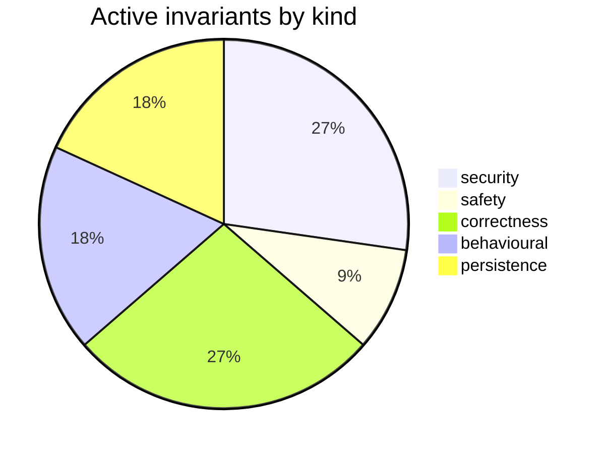

# Requirements Map — claude-engineering-skills

_Generated from `.requirements/ledger.json` — 115 requirement(s) across 12 file(s). Do not hand-edit; regenerate with `node scripts/requirements.mjs render`._

## At a glance

| Status | Count |
|---|---|
| 🟢 active — enforced by /audit-code | 11 |
| 🟡 needs-review — awaiting your call | 10 |
| ⚪ inferred-only — refine backlog | 94 |

## 🟡 Needs review (10)

| Gap | Assertion | Files |
|---|---|---|
| contradictory | The Round 2 system prompt is always composed from the fixed Round 2 verification modifier, the supplied rulings block, and the supplied pass rubric in that order. | scripts/lib/ledger.mjs |
| contradictory | Audit prompt construction must keep the system prompt and first user message byte-stable across rounds by placing round modifiers and prior rulings only in a later dynamic message. | scripts/lib/audit/prompt-builder.mjs |
| observed-but-unintended | Rulings blocks must return an empty string for missing or unparsable ledgers, include only entries for the requested pass, group dismissed, severity-adjusted, and fixed-or-verified entries, and cap th | scripts/lib/ledger.mjs |
| observed-but-unintended | Verification results are added as sibling verification objects on copied findings, and refuted findings receive verdictSeverity LOW and countsTowardVerdict false while non-refuted findings preserve or | scripts/lib/audit/finding-verification.mjs |
| contradictory | Round 2+ system prompts must prepend the fixed R2_ROUND_MODIFIER, include the supplied rulings block, and append the pass rubric under a PASS RUBRIC heading. | scripts/lib/ledger.mjs |
| observed-but-unintended | Finding metadata population must extract normalized file references from section text, set _primaryFile to the first extracted file or normalized section prefix, set affectedFiles to all extracted fil | scripts/lib/ledger.mjs |
| observed-but-unintended | Bare cited tokens must be treated as symbols only when they are identifier-shaped and the finding context mentions symbol, export, function, class, const, variable, method, interface, or type; otherwi | scripts/lib/audit/finding-verification.mjs |
| observed-but-unintended | Topic IDs must be deterministic 12-character lowercase SHA-256 hex prefixes derived from normalized file, normalized principle prefix, normalized category with bracket tags removed, pass name, and the | scripts/lib/ledger.mjs |
| observed-but-unintended | Batch upserts of an existing topicId must preserve the existing adjudicationOutcome, remediationState, ruling, rulingRationale, and firstSeenRound while updating latest finding detail, severity, lates | scripts/lib/ledger.mjs |
| observed-but-unintended | Topic IDs are generated as 12-character SHA-256 hex prefixes from normalized primary file, normalized principle prefix, normalized category with bracket tags removed, pass name, and semantic content h | scripts/lib/ledger.mjs |

## 🟢 Active invariants — by kind

### security (3)

| ID | Assertion | Governs |
|---|---|---|
| `REQ-security-b0b533cc` | Extraction must redact secret-shaped content from every file body before including it in an LLM request. | scripts/lib/requirements/extract.mjs, scripts/lib/sensitive-egress-gate.mjs |
| `REQ-security-b6cfe447` | Extraction must reject both lexically sensitive paths and symlink targets that resolve to sensitive paths before sending content to the LLM. | scripts/lib/requirements/extract.mjs, scripts/lib/sensitive-egress-gate.mjs |
| `REQ-security-d55680e9` | Extraction must reject any requested file path that escapes the repo root before reading or sending file content. | scripts/lib/requirements/extract.mjs |

### safety (1)

| ID | Assertion | Governs |
|---|---|---|
| `REQ-safety-582db962` | Loading the requirements ledger must never throw and must return an empty ledger when the persisted file is absent, unreadable, invalid JSON, or schema-invalid. | scripts/lib/requirements/ledger.mjs |

### correctness (3)

| ID | Assertion | Governs |
|---|---|---|
| `REQ-correctness-5ec9f123` | Merged candidates must count `seenInRuns` by distinct successful runs and assign high confidence only when seen in every successful run. | scripts/lib/requirements/extract.mjs |
| `REQ-correctness-a8781f0f` | Batch ledger writes validate every input entry with BatchLedgerEntrySchema and return invalid entries in rejected with a reason instead of silently dropping them. | scripts/lib/ledger.mjs |
| `REQ-correctness-b751155f` | Requirement merge clustering must only merge items of the same kind whose normalized assertions have Jaccard similarity of at least 0.6. | scripts/lib/requirements/extract.mjs |

### behavioural (2)

| ID | Assertion | Governs |
|---|---|---|
| `REQ-behavioural-27a17fcf` | LLM JSON parsing must prefer the first fenced JSON block found anywhere in the response and otherwise parse the trimmed raw response. | scripts/lib/requirements/llm-json.mjs |
| `REQ-behavioural-881aab25` | Suppression considers session ledger entries only when adjudicationOutcome is dismissed or remediationState is fixed or verified, and considers debt entries only when they are not escalated. | scripts/lib/ledger.mjs |

### persistence (2)

| ID | Assertion | Governs |
|---|---|---|
| `REQ-persistence-6623d196` | A file may be reported in extraction `coveredFiles` only if at least one LLM batch containing that file succeeded. | scripts/lib/requirements/extract.mjs |
| `REQ-persistence-d8f9613d` | Atomic writes must write to a same-directory temporary file and then rename it into place, deleting the temporary file on write or rename failure when possible. | scripts/lib/file-io.mjs |

## By file

| File | 🟢 | 🟡 | ⚪ |
|---|--:|--:|--:|
| `scripts/lib/audit/finding-verification.mjs` | 0 | 2 | 18 |
| `scripts/lib/audit/prompt-builder.mjs` | 0 | 1 | 2 |
| `scripts/lib/brainstorm/file-lock.mjs` | 0 | 0 | 5 |
| `scripts/lib/file-io.mjs` | 1 | 0 | 2 |
| `scripts/lib/ledger.mjs` | 2 | 7 | 26 |
| `scripts/lib/requirements/context.mjs` | 0 | 0 | 7 |
| `scripts/lib/requirements/extract.mjs` | 6 | 0 | 9 |
| `scripts/lib/requirements/gap-challenge.mjs` | 0 | 0 | 6 |
| `scripts/lib/requirements/ledger.mjs` | 1 | 0 | 14 |
| `scripts/lib/requirements/llm-json.mjs` | 1 | 0 | 0 |
| `scripts/lib/requirements/schema.mjs` | 0 | 0 | 11 |
| `scripts/lib/sensitive-egress-gate.mjs` | 2 | 0 | 0 |
