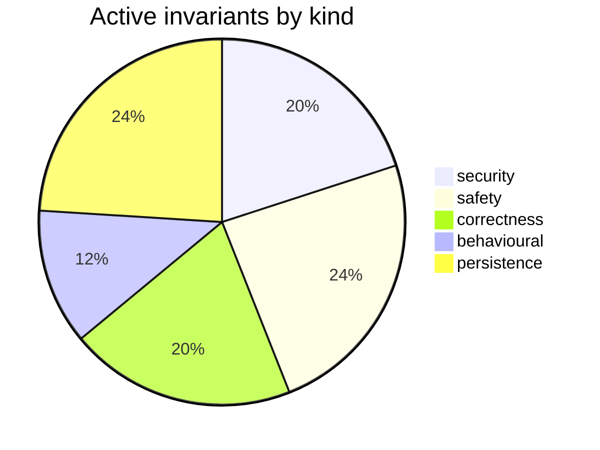

# Requirements Map — claude-engineering-skills

_Generated from `.requirements/ledger.json` — 215 requirement(s) across 28 file(s). Do not hand-edit; regenerate with `node scripts/requirements.mjs render`._

## At a glance

| Status | Count |
|---|---|
| 🟢 active — enforced by /audit-code | 25 |
| 🟡 needs-review — awaiting your call | 13 |
| ⚪ inferred-only — refine backlog | 177 |

## 🟡 Needs review (13)

| Gap | Assertion | Files |
|---|---|---|
| contradictory | The Round 2 system prompt is always composed from the fixed Round 2 verification modifier, the supplied rulings block, and the supplied pass rubric in that order. | scripts/lib/ledger.mjs |
| contradictory | Audit prompt construction must keep the system prompt and first user message byte-stable across rounds by placing round modifiers and prior rulings only in a later dynamic message. | scripts/lib/audit/prompt-builder.mjs |
| observed-but-unintended | Rulings blocks must return an empty string for missing or unparsable ledgers, include only entries for the requested pass, group dismissed, severity-adjusted, and fixed-or-verified entries, and cap th | scripts/lib/ledger.mjs |
| observed-but-unintended | Verification results are added as sibling verification objects on copied findings, and refuted findings receive verdictSeverity LOW and countsTowardVerdict false while non-refuted findings preserve or | scripts/lib/audit/finding-verification.mjs |
| untested | A quickfix pattern is skipped only when its acceptance rate is strictly below the configured skip threshold and its total hit count is at least the configured minimum hit count. | scripts/lib/learning/quickfix-stats.mjs |
| contradictory | Round 2+ system prompts must prepend the fixed R2_ROUND_MODIFIER, include the supplied rulings block, and append the pass rubric under a PASS RUBRIC heading. | scripts/lib/ledger.mjs |
| observed-but-unintended | Finding metadata population must extract normalized file references from section text, set _primaryFile to the first extracted file or normalized section prefix, set affectedFiles to all extracted fil | scripts/lib/ledger.mjs |
| observed-but-unintended | Bare cited tokens must be treated as symbols only when they are identifier-shaped and the finding context mentions symbol, export, function, class, const, variable, method, interface, or type; otherwi | scripts/lib/audit/finding-verification.mjs |
| observed-but-unintended | Topic IDs must be deterministic 12-character lowercase SHA-256 hex prefixes derived from normalized file, normalized principle prefix, normalized category with bracket tags removed, pass name, and the | scripts/lib/ledger.mjs |
| observed-but-unintended | Batch upserts of an existing topicId must preserve the existing adjudicationOutcome, remediationState, ruling, rulingRationale, and firstSeenRound while updating latest finding detail, severity, lates | scripts/lib/ledger.mjs |
| observed-but-unintended | Topic IDs are generated as 12-character SHA-256 hex prefixes from normalized primary file, normalized principle prefix, normalized category with bracket tags removed, pass name, and semantic content h | scripts/lib/ledger.mjs |
| untested | The quickfix-hit drain cursor must not advance beyond an incomplete trailing JSONL record or the first record whose parsing or cloud insertion fails. | scripts/learning/backfill-outcomes.mjs |
| untested | A quickfix pattern may be skipped only when its acceptance rate is strictly below the configured skip threshold and its total hit count is at least the configured minimum hit count. | scripts/lib/learning/quickfix-stats.mjs |

## 🟢 Active invariants — by kind

### security (5)

| ID | Assertion | Governs |
|---|---|---|
| `REQ-security-9967f76c` | Artifact content must be read from the canonical path approved by the sensitivity gate rather than from the user-visible path. | scripts/lib/brainstorm/artifact-context.mjs |
| `REQ-security-b0b533cc` | Extraction must redact secret-shaped content from every file body before including it in an LLM request. | scripts/lib/requirements/extract.mjs, scripts/lib/sensitive-egress-gate.mjs |
| `REQ-security-b6cfe447` | Extraction must reject both lexically sensitive paths and symlink targets that resolve to sensitive paths before sending content to the LLM. | scripts/lib/requirements/extract.mjs, scripts/lib/sensitive-egress-gate.mjs |
| `REQ-security-d55680e9` | Extraction must reject any requested file path that escapes the repo root before reading or sending file content. | scripts/lib/requirements/extract.mjs |
| `REQ-security-dbe740a4` | The file-state outcome detector must not read a path that is absolute, drive-qualified, contains a parent-directory segment, or resolves outside the repository root. | scripts/learning/backfill-outcomes.mjs |

### safety (6)

| ID | Assertion | Governs |
|---|---|---|
| `REQ-safety-3426cda9` | A cloud quickfix-statistics rebuild must not write a cache when cloud storage is disabled, and must return an explicit cloud-disabled failure result. | scripts/lib/learning/quickfix-stats.mjs |
| `REQ-safety-582db962` | Loading the requirements ledger must never throw and must return an empty ledger when the persisted file is absent, unreadable, invalid JSON, or schema-invalid. | scripts/lib/requirements/ledger.mjs |
| `REQ-safety-61f6d34b` | CLAUDE.md auto-fix must modify only fixable `stale/file-ref` findings whose referenced markdown link occupies the entire line or list-item line, and must leave embedded prose references unchanged. | scripts/lib/claudemd/autofix.mjs |
| `REQ-safety-6c77c203` | Promoting a persona-consistency candidate must validate its witness snapshot, contradiction payload, and non-empty journey steps before rendering or persisting a locked regression spec. | scripts/persona-consistency-promote.mjs |
| `REQ-safety-7cae6bdc` | The memory-health process must exit with code 1 when any metric trigger fires, when an alarming protected friction cluster exists, or when the friction subsystem fails unexpectedly. | scripts/memory-health.mjs |
| `REQ-safety-9272a416` | Session loading must exclude malformed, structurally invalid, and unsupported future-schema records from returned rounds while preserving them in a capped quarantine ledger on a best-effort basis. | scripts/lib/brainstorm/session-store.mjs |

### correctness (5)

| ID | Assertion | Governs |
|---|---|---|
| `REQ-correctness-5ec9f123` | Merged candidates must count `seenInRuns` by distinct successful runs and assign high confidence only when seen in every successful run. | scripts/lib/requirements/extract.mjs |
| `REQ-correctness-7760877a` | Quickfix aggregate statistics must count eve